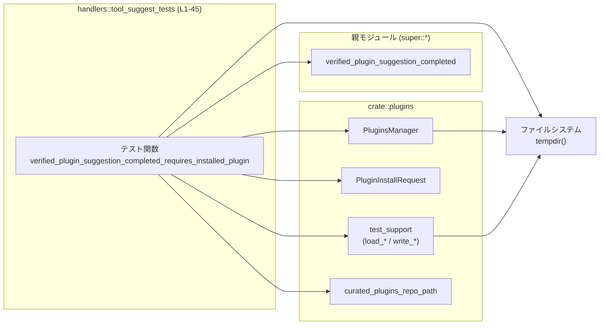
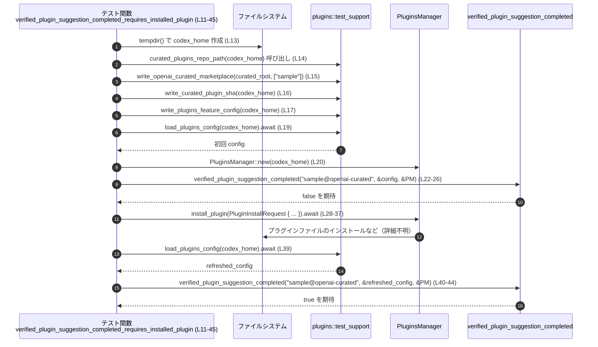

# core/src/tools/handlers/tool_suggest_tests.rs

## 0. ざっくり一言

`verified_plugin_suggestion_completed` という関数が、**プラグインが実際にインストールされるまでは「提案完了」とみなさない**ことを検証する非同期テストを 1 件だけ定義しているファイルです（`tool_suggest_tests.rs:L11-45`）。

---

## 1. このモジュールの役割

### 1.1 概要

- このモジュールは、ツール提案ハンドラ側のヘルパ関数と思われる  
  `verified_plugin_suggestion_completed` の振る舞いをテストします（`tool_suggest_tests.rs:L22-26, L40-44`）。
- 具体的には、「OpenAI curated マーケットプレイスに存在するプラグインでも、**インストールされていない間は完了とみなさない**」という前提条件を確認しています（`tool_suggest_tests.rs:L15-L17, L22-26, L28-37, L39-44`）。

※ `verified_plugin_suggestion_completed` 自体の定義はこのチャンクには存在しません。`use super::*;` から、親モジュール側で定義されていることだけが分かります（`tool_suggest_tests.rs:L1`）。

### 1.2 アーキテクチャ内での位置づけ

このテストは、プラグイン管理まわりのテスト支援ユーティリティと `PluginsManager`、そして `verified_plugin_suggestion_completed` を束ねて、1 つのシナリオを検証しています。



- テスト関数は `super::*` から `verified_plugin_suggestion_completed` をインポートして呼び出します（`tool_suggest_tests.rs:L1, L22-26, L40-44`）。
- テスト用のプラグイン環境構築には `crate::plugins::test_support` 内の関数を利用します（`tool_suggest_tests.rs:L4-7, L15-17`）。
- 実際のプラグインインストールには `PluginsManager` と `PluginInstallRequest` を利用します（`tool_suggest_tests.rs:L2-3, L20, L28-37`）。
- すべての実ファイル操作は一時ディレクトリ（`tempdir`）配下で行われます（`tool_suggest_tests.rs:L9, L13-17`）。

### 1.3 設計上のポイント

コードから読み取れる特徴は次のとおりです。

- **テスト専用モジュール**
  - 実装コードではなく、1 つの `#[tokio::test]` を含むテスト用ファイルです（`tool_suggest_tests.rs:L11-12`）。
- **一時ディレクトリによる分離**
  - `tempfile::tempdir` で一時ディレクトリを作り、その下にプラグインレポジトリや設定ファイル群を構築します（`tool_suggest_tests.rs:L9, L13-17`）。
- **非同期テスト**
  - `#[tokio::test]` と `async fn` により、非同期関数・I/O を含むテストをそのまま `await` で記述しています（`tool_suggest_tests.rs:L11-12, L19, L28-37, L39`）。
- **テスト支援ユーティリティの活用**
  - curated マーケットプレイスや SHA、feature config などのセットアップは `test_support` モジュールの関数に委譲されています（`tool_suggest_tests.rs:L4-7, L15-17`）。
- **テストの焦点**
  - ひとつのシナリオに絞り込み、「インストール前は false、インストール後は true」という 2 ステップを検証します（`tool_suggest_tests.rs:L22-26, L28-37, L39-44`）。

---

## 2. 主要な機能一覧

このファイルが提供する機能は、テスト 1 件のみです。

- `verified_plugin_suggestion_completed_requires_installed_plugin`:  
  プラグイン提案が「完了済み」と判定されるには、該当プラグインがインストール済みである必要があることを検証する非同期テスト（`tool_suggest_tests.rs:L11-45`）。

---

## 3. 公開 API と詳細解説

### 3.1 型一覧（構造体・列挙体など）

このファイル内で **利用** している主な型と、その役割です（定義自体は別モジュールにあります）。

| 名前 | 種別 | このファイルでの用途 | 根拠 |
|------|------|----------------------|------|
| `PluginInstallRequest` | 構造体 | プラグインをインストールする際に、プラグイン名とマーケットプレイス JSON の絶対パスを渡すためのリクエストオブジェクトとして使用されています。 | `tool_suggest_tests.rs:L2, L28-35` |
| `PluginsManager` | 構造体 | プラグインインストールを行うマネージャとして使用されています。`new` で初期化され、`install_plugin` メソッドを呼んでいます。 | `tool_suggest_tests.rs:L3, L20, L28-37` |
| `AbsolutePathBuf` | 構造体 | `curated_root.join(...)` の結果から、絶対パス表現への変換に使用されています。 | `tool_suggest_tests.rs:L8, L31-34` |

これらの型の定義場所（ファイルパスやフィールド構成）は、このチャンクには現れません。

### 3.2 関数詳細（このファイルに定義されているもの）

#### `verified_plugin_suggestion_completed_requires_installed_plugin()`

**シグネチャ**

```rust
#[tokio::test]                                         // Tokio ランタイム上で実行される非同期テスト
async fn verified_plugin_suggestion_completed_requires_installed_plugin() {
    /* ... */
}
```

（`tool_suggest_tests.rs:L11-12`）

**概要**

- OpenAI curated マーケットプレイスに存在する `sample` プラグインについて、
  - インストール前は `verified_plugin_suggestion_completed` が `false` を返すこと
  - インストール後は `true` を返すこと  
  を 1 つのテストシナリオで検証します（`tool_suggest_tests.rs:L15-17, L22-26, L28-37, L39-44`）。

**引数**

- 引数はありません（`async fn` のパラメータリストが空であるため、`tool_suggest_tests.rs:L12`）。

**戻り値**

- 戻り値型は明示されていませんが、Rust の規則により `()`（ユニット型）です（`tool_suggest_tests.rs:L12-45`）。
- テスト関数であるため、戻り値は利用されず、**アサーションや `expect` の失敗があればテスト失敗**となります。

**内部処理の流れ（アルゴリズム）**

1. **一時ディレクトリの作成**  
   - `tempdir()` で一時ディレクトリを作成し、`codex_home` 変数に保持します。失敗した場合は `expect` により panic します（`tool_suggest_tests.rs:L9, L13`）。

2. **curated プラグインレポジトリ・設定のセットアップ**  
   - `curated_root` として、`crate::plugins::curated_plugins_repo_path(codex_home.path())` を取得します（`tool_suggest_tests.rs:L14`）。
   - `write_openai_curated_marketplace(&curated_root, &["sample"]);` で curated マーケットプレイス情報を書き込みます（`tool_suggest_tests.rs:L15`）。
   - `write_curated_plugin_sha(codex_home.path());` で curated 用の SHA を書き込みます（`tool_suggest_tests.rs:L16`）。
   - `write_plugins_feature_config(codex_home.path());` でプラグイン機能の設定を記録します（`tool_suggest_tests.rs:L17`）。

3. **初回の設定読み込みと `PluginsManager` の初期化**  
   - `load_plugins_config(codex_home.path()).await` でプラグイン設定を読み込み、`config` とします（`tool_suggest_tests.rs:L19`）。
   - `PluginsManager::new(codex_home.path().to_path_buf())` でプラグインマネージャを初期化し、`plugins_manager` に保持します（`tool_suggest_tests.rs:L20`）。

4. **インストール前の挙動を検証**  
   - `verified_plugin_suggestion_completed("sample@openai-curated", &config, &plugins_manager)` の結果が `false` であることを `assert!(!...)` で検証します（`tool_suggest_tests.rs:L22-26`）。

5. **プラグインのインストール処理**  
   - `plugins_manager.install_plugin(PluginInstallRequest { ... }).await.expect("plugin should install");` を呼び出し、`sample` プラグインをインストールします（`tool_suggest_tests.rs:L28-37`）。
   - ここで `PluginInstallRequest` には以下を設定します（`tool_suggest_tests.rs:L29-35`）。
     - `plugin_name`: `"sample".to_string()`
     - `marketplace_path`: `AbsolutePathBuf::try_from(curated_root.join(".agents/plugins/marketplace.json")).expect("marketplace path")`

6. **設定の再読込とインストール後の挙動検証**  
   - 再度 `load_plugins_config(codex_home.path()).await` を呼び出して `refreshed_config` を取得します（`tool_suggest_tests.rs:L39`）。
   - 同じプラグイン名と `plugins_manager`、今度は `&refreshed_config` を渡して `verified_plugin_suggestion_completed` を呼び、今度は `true` が返ることを `assert!` で検証します（`tool_suggest_tests.rs:L40-44`）。

**Examples（使用例）**

この関数自体はテスト用ですが、「インストール前後で挙動が変わることを検証するテスト」の書き方として参考になる例です。

```rust
#[tokio::test]                                           // Tokio ランタイムを使った非同期テスト
async fn another_plugin_completion_test() {
    // 一時ディレクトリを作成し、テスト用のホームディレクトリとする
    let codex_home = tempfile::tempdir().expect("tempdir should succeed");

    // curated プラグインレポジトリと設定をセットアップ
    let curated_root = crate::plugins::curated_plugins_repo_path(codex_home.path());
    crate::plugins::test_support::write_openai_curated_marketplace(&curated_root, &["sample"]);
    crate::plugins::test_support::write_curated_plugin_sha(codex_home.path());
    crate::plugins::test_support::write_plugins_feature_config(codex_home.path());

    // 設定を読み込み、プラグインマネージャを初期化
    let config = crate::plugins::test_support::load_plugins_config(codex_home.path()).await;
    let plugins_manager = crate::plugins::PluginsManager::new(codex_home.path().to_path_buf());

    // インストール前は完了していないことを確認
    assert!(!super::verified_plugin_suggestion_completed(
        "sample@openai-curated",
        &config,
        &plugins_manager,
    ));

    // プラグインをインストール
    plugins_manager
        .install_plugin(crate::plugins::PluginInstallRequest {
            plugin_name: "sample".to_string(),
            marketplace_path: codex_utils_absolute_path::AbsolutePathBuf::try_from(
                curated_root.join(".agents/plugins/marketplace.json"),
            )
            .expect("marketplace path"),
        })
        .await
        .expect("plugin should install");

    // 設定を再度読み込み、今度は完了とみなされることを確認
    let refreshed_config = crate::plugins::test_support::load_plugins_config(codex_home.path()).await;
    assert!(super::verified_plugin_suggestion_completed(
        "sample@openai-curated",
        &refreshed_config,
        &plugins_manager,
    ));
}
```

※ 上記は、このファイルのテストを構造的にほぼそのまま再現した例です。

**Errors / Panics**

このテスト関数内で起こり得る失敗条件は次の通りです。

- `tempdir()` の失敗  
  - `expect("tempdir should succeed")` により、失敗した場合は panic します（`tool_suggest_tests.rs:L13`）。
- `AbsolutePathBuf::try_from` の失敗  
  - `expect("marketplace path")` により、絶対パスへの変換に失敗した場合は panic します（`tool_suggest_tests.rs:L31-34`）。
- `plugins_manager.install_plugin(...)` の失敗  
  - 戻り値に対して `.expect("plugin should install")` を呼んでいるため、プラグインインストールに失敗すると panic します（`tool_suggest_tests.rs:L28-37`）。
- `assert!` の失敗  
  - インストール前に `true` が返ったり、インストール後に `false` が返った場合には `assert!` が失敗し、テストが失敗します（`tool_suggest_tests.rs:L22-26, L40-44`）。

**Edge cases（エッジケース）**

このテストから読み取れる、`verified_plugin_suggestion_completed` に関する前提・境界条件は次のとおりです。

- **インストール前の状態**  
  - curated マーケットプレイスに `sample` が登録されていても（`write_openai_curated_marketplace` 実行済み）、  
    インストール前は `verified_plugin_suggestion_completed("sample@openai-curated", ...)` が `false` であることを期待しています（`tool_suggest_tests.rs:L15, L22-26`）。
- **インストール後の状態**  
  - `install_plugin` を通じて `sample` をインストールし（`tool_suggest_tests.rs:L28-37`）、  
    その後に設定を再読み込みした状態では `true` になることを期待しています（`tool_suggest_tests.rs:L39-44`）。
- **設定再読み込みの必要性**  
  - プラグインインストール後に `load_plugins_config` を再度呼び出しているため（`tool_suggest_tests.rs:L39`）、  
    `verified_plugin_suggestion_completed` が **設定オブジェクトの内容に基づいて判定している** ことが前提になっていると考えられます。ただし実装はこのチャンクには存在しません。
- **依存パラメータの特定は不可能**  
  - このテストだけでは、戻り値が `config` に依存しているのか、`plugins_manager` に依存しているのか、またはその両方なのかを断定することはできません。

**使用上の注意点**

- `#[tokio::test]` により、テストは Tokio ランタイム上で実行されます。  
  非同期 API (`load_plugins_config`, `install_plugin`) を `await` で呼び出すことができます（`tool_suggest_tests.rs:L11, L19, L28-37, L39`）。
- ファイルシステム操作はすべて一時ディレクトリ配下で行われ、テスト同士が状態を共有しないようにしています（`tool_suggest_tests.rs:L13-17`）。
- `expect` を多用しているため、このテストは環境構築やインストールに関する問題も一括して検知する作りです。一方で、どの段階で失敗したかの情報はメッセージ文字列に依存します。

### 3.3 その他の関数（このファイルで呼び出している外部関数）

定義は別モジュールにありますが、このテストから見える役割をまとめます。

| 関数名 / メソッド名 | 所属 | 役割（このファイルでの利用に基づく） | 根拠 |
|---------------------|------|----------------------------------------|------|
| `verified_plugin_suggestion_completed` | `super`（親モジュール） | プラグイン提案が「完了」かどうかを判定する関数。`plugin_id: &str`, `config`, `plugins_manager` を受け取り、真偽値を返していると推測されますが、戻り値の型はこのチャンクからは断定できません。 | `tool_suggest_tests.rs:L1, L22-26, L40-44` |
| `tempdir` | `tempfile` クレート | 一時ディレクトリを作成し、そのパスをテストの「ホームディレクトリ」として利用しています。 | `tool_suggest_tests.rs:L9, L13` |
| `curated_plugins_repo_path` | `crate::plugins` | `codex_home` から curated プラグインレポジトリのルートパスを導出します。 | `tool_suggest_tests.rs:L14` |
| `write_openai_curated_marketplace` | `crate::plugins::test_support` | curated マーケットプレイス JSON を書き込みます。第二引数の `&["sample"]` から、最低限 `sample` プラグインを登録することが分かります。 | `tool_suggest_tests.rs:L6, L15` |
| `write_curated_plugin_sha` | 同上 | curated プラグイン用の SHA 情報をファイルに書き込むテスト用ヘルパです。 | `tool_suggest_tests.rs:L5, L16` |
| `write_plugins_feature_config` | 同上 | プラグイン機能の設定ファイルを書き込みます。プラグイン機能を有効化する目的と考えられます。 | `tool_suggest_tests.rs:L7, L17` |
| `load_plugins_config` | 同上 | プラグイン設定を非同期に読み込んで返します。戻り値型はこのチャンクには現れませんが、`await` の結果をそのまま `config` 変数に代入しています。 | `tool_suggest_tests.rs:L4, L19, L39` |
| `PluginsManager::new` | `PluginsManager` | `codex_home` のパスを渡してプラグインマネージャを初期化します。 | `tool_suggest_tests.rs:L3, L20` |
| `PluginsManager::install_plugin` | 同上 | `PluginInstallRequest` を受け取り、非同期にプラグインをインストールするメソッドです。戻り値に `.await` と `.expect` を呼んでいることから、`Future<Output = Result<_, _>>` を返していると考えられます。 | `tool_suggest_tests.rs:L28-37` |

---

## 4. データフロー

このテストにおける代表的なデータフローを、シーケンス図で示します。



要点:

- 一時ディレクトリ配下に curated プラグイン環境と設定を構築したうえで（`tool_suggest_tests.rs:L13-17`）、  
  初回設定を読み込んで「インストール前は false」を確認します（`tool_suggest_tests.rs:L19-26`）。
- その後、`PluginsManager` 経由で実際にプラグインをインストールし（`tool_suggest_tests.rs:L28-37`）、  
  設定を再読み込みして「インストール後は true」を確認します（`tool_suggest_tests.rs:L39-44`）。

---

## 5. 使い方（How to Use）

このファイル自体はテスト専用ですが、「プラグイン関連のロジックをテストする際のパターン」として実務上参考になる点を整理します。

### 5.1 基本的な使用方法（テストの構造）

1. **一時ディレクトリの準備**  
   - `tempdir()` を使ってテスト専用の作業ディレクトリを作成します（`tool_suggest_tests.rs:L13`）。
2. **test_support で必要なファイルを生成**  
   - curated マーケットプレイス JSON、SHA、feature config などを `write_*` 関数で生成します（`tool_suggest_tests.rs:L15-17`）。
3. **設定の読み込みとマネージャの初期化**  
   - `load_plugins_config(...).await` で設定を取得し（`tool_suggest_tests.rs:L19`）、  
     `PluginsManager::new(...)` でプラグインマネージャを初期化します（`tool_suggest_tests.rs:L20`）。
4. **対象関数の「インストール前」挙動を検証**  
   - `verified_plugin_suggestion_completed` など対象のハンドラ/ヘルパを呼び出し、期待する結果をアサートします（`tool_suggest_tests.rs:L22-26`）。
5. **プラグインインストール → 再検証**  
   - `install_plugin` を呼び出してプラグインをインストールし（`tool_suggest_tests.rs:L28-37`）、  
     設定を再度読み込んでから再度対象関数を呼び出し、挙動が変化しているかを検証します（`tool_suggest_tests.rs:L39-44`）。

### 5.2 よくある使用パターン

このテストから抽出できる、プラグイン関連テストのパターンです。

- **環境構築 + 実インストールを含む「統合寄り」テスト**  
  - 単なるユニットテストではなく、実際にプラグインインストール処理を通す形で検証しています（`tool_suggest_tests.rs:L28-37`）。
  - プラグインがどのように「インストール済み」と判定されるかを、`PluginsManager` の動作も含めて確認できます。
- **非同期 API をまたいだシナリオテスト**  
  - `load_plugins_config` や `install_plugin` のような非同期関数を、`#[tokio::test]` の中でシームレスに `await` しています（`tool_suggest_tests.rs:L11, L19, L28-37, L39`）。

### 5.3 よくある間違い（推測される誤用と、このテストから見える注意点）

コードから推測できる「誤りやすそうな点」と、その回避策を示します。

```rust
// 誤りの例（想定）: インストール後に設定を再読み込みしていない
let config = load_plugins_config(codex_home.path()).await;
let plugins_manager = PluginsManager::new(codex_home.path().to_path_buf());

// ... プラグインをインストールした後 ...

// 古い config を使い続けてしまう
assert!(verified_plugin_suggestion_completed(
    "sample@openai-curated",
    &config,               // ← 更新されていない
    &plugins_manager,
));
```

```rust
// このテストが示す正しいパターン: インストール後に設定を再読み込みする
let config = load_plugins_config(codex_home.path()).await;
let plugins_manager = PluginsManager::new(codex_home.path().to_path_buf());

// インストール前は false
assert!(!verified_plugin_suggestion_completed(
    "sample@openai-curated",
    &config,
    &plugins_manager,
));

// プラグインをインストール
plugins_manager.install_plugin(/* ... */).await.expect("plugin should install");

// 設定を再読み込みしてから判定する
let refreshed_config = load_plugins_config(codex_home.path()).await;
assert!(verified_plugin_suggestion_completed(
    "sample@openai-curated",
    &refreshed_config,
    &plugins_manager,
));
```

- このテストから、**インストール後に設定を再読み込みすること**が重要な前提であることが分かります（`tool_suggest_tests.rs:L19, L39`）。

### 5.4 使用上の注意点（まとめ）

- **並行実行との相性**  
  - 一時ディレクトリは `tempdir()` により一意に生成されるため、テストが並行実行されてもディレクトリの競合は避けられます（`tool_suggest_tests.rs:L13`）。
- **エラー処理の簡略化**  
  - テストでは `.expect(...)` を使っており、失敗時には即座に panic します（`tool_suggest_tests.rs:L13, L31-34, L28-37`）。  
    本番コードでは同様の箇所で明示的なエラーハンドリングが必要になる可能性があります。
- **セキュリティ上の観点**  
  - このテストでは外部ネットワークやユーザ入力は扱わず、一時ディレクトリ配下のファイルのみを操作しています。  
    プラグインのインストール先パスについては `AbsolutePathBuf::try_from` によって絶対パスに正規化されており、パス周りの挙動はこの型に依存しています（`tool_suggest_tests.rs:L31-34`）。

---

## 6. 変更の仕方（How to Modify）

### 6.1 新しいテストを追加する場合

- **環境構築の再利用**  
  - 別の挙動（例: 異なる marketplace 名や、無効なプラグイン名）をテストしたい場合でも、
    - `tempdir` による一時ディレクトリ作成（`tool_suggest_tests.rs:L13`）
    - curated レポジトリと設定のセットアップ（`tool_suggest_tests.rs:L14-17`）
    - 設定読み込みと `PluginsManager` 初期化（`tool_suggest_tests.rs:L19-20`）  
    といった共通パターンを踏襲すると、既存テストとの一貫性が保たれます。
- **インストール前後の両方を検証するパターン**  
  - このテストのように「事前状態 → 操作 → 事後状態」を 1 本のテストで確認すると、状態遷移の流れが把握しやすくなります（`tool_suggest_tests.rs:L22-26, L28-37, L39-44`）。

### 6.2 既存のテストを変更する場合

- **前提条件の契約**  
  - このテストは「未インストールなら false／インストール済みなら true」という契約を暗黙に前提としています（`tool_suggest_tests.rs:L22-26, L40-44`）。  
    `verified_plugin_suggestion_completed` の仕様を変更する場合は、この契約がどう変わるかを明確にしたうえでテストの期待値を更新する必要があります。
- **依存モジュールの影響範囲**  
  - `PluginsManager` や `test_support` の挙動を変更すると、このテストにも影響が及びます。  
    変更時には `install_plugin` や `load_plugins_config` の呼び出し側として、このテストがどのような状態を期待しているかを確認する必要があります（`tool_suggest_tests.rs:L19-20, L28-37, L39`）。

---

## 7. 関連ファイル

このテストと密接に関係するモジュール／コンポーネントをまとめます。

| パス / モジュール | 役割 / 関係 |
|-------------------|------------|
| `super`（親モジュール） | `use super::*;` により、`verified_plugin_suggestion_completed` などテスト対象の関数をインポートしています（`tool_suggest_tests.rs:L1`）。具体的なファイルパスはこのチャンクからは分かりませんが、同ディレクトリの親モジュールであると考えられます。 |
| `crate::plugins` | curated プラグインレポジトリのパス導出関数 (`curated_plugins_repo_path`) や `PluginsManager`、`PluginInstallRequest` を提供します（`tool_suggest_tests.rs:L2-3, L14, L20, L28-35`）。 |
| `crate::plugins::test_support` | テスト用の補助関数群 (`load_plugins_config`, `write_openai_curated_marketplace`, `write_curated_plugin_sha`, `write_plugins_feature_config`) を提供し、このテストの環境構築の中心になっています（`tool_suggest_tests.rs:L4-7, L15-17, L19, L39`）。 |
| `codex_utils_absolute_path::AbsolutePathBuf` | マーケットプレイス JSON のパスを絶対パスとして扱うためのラッパ型を提供します（`tool_suggest_tests.rs:L8, L31-34`）。 |
| `tempfile` クレート | 一時ディレクトリ生成 (`tempdir`) を提供し、テストをファイルシステムから独立させるのに使われています（`tool_suggest_tests.rs:L9, L13`）。 |

---

## Bugs / Security / Contracts / Tests / パフォーマンスなどの視点からの補足

このファイル単体から確認できる範囲で、要求されている観点をまとめます。

- **Bugs（潜在的なバグ要素）**  
  - テストは「インストール前/後の真偽値の違い」を検証していますが、`verified_plugin_suggestion_completed` が `config` と `plugins_manager` のどちらの情報に依存しているかは識別できません。  
    たとえば、もし実装が `plugins_manager` の状態だけを見ていたとしても、このテストは通る可能性があります。
- **Security**  
  - テストは一時ディレクトリ配下のファイルのみを扱い、外部からの入力やネットワーク通信を行っていません（`tool_suggest_tests.rs:L13-17, L28-37`）。  
  - パスの扱いは `AbsolutePathBuf::try_from` に委ねられており、相対パスなどがどう処理されるかはその実装に依存します（`tool_suggest_tests.rs:L31-34`）。
- **Contracts / Edge Cases**  
  - 「未インストール → false」「インストール済み → true」という契約がこのテストで明示されています（`tool_suggest_tests.rs:L22-26, L40-44`）。  
  - 一方で、存在しないプラグイン ID や marketplace に登録されていないプラグインなどのエッジケースは、このファイルではテストされていません。
- **Tests（網羅性の観点）**  
  - 現時点でこのファイルにはテストが 1 件だけであり、`verified_plugin_suggestion_completed` の一部の振る舞い（curated プラグインがインストールされたかどうか）に焦点を当てています。  
    他の条件（例: 手動インストール、異なる marketplace、設定が無効なときなど）は別のテストで扱われている可能性がありますが、このチャンクからは分かりません。
- **Performance / Scalability**  
  - テストの規模は小さく、`tempdir` とローカルファイル操作、1 回のプラグインインストールのみを行うため、性能上の懸念は読み取れません（`tool_suggest_tests.rs:L13-17, L28-37`）。
- **Tradeoffs / Observability**  
  - `expect` による即時 panic によって、失敗時の挙動は単純になっていますが、どこで失敗したかはメッセージ文字列に依存します（`tool_suggest_tests.rs:L13, L31-34, L28-37`）。  
  - ログ出力やメトリクスなどはテストからは利用しておらず、`verified_plugin_suggestion_completed` の内部でどの程度可観測性が確保されているかは、このファイルからは分かりません。
