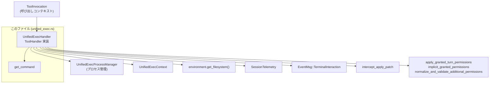
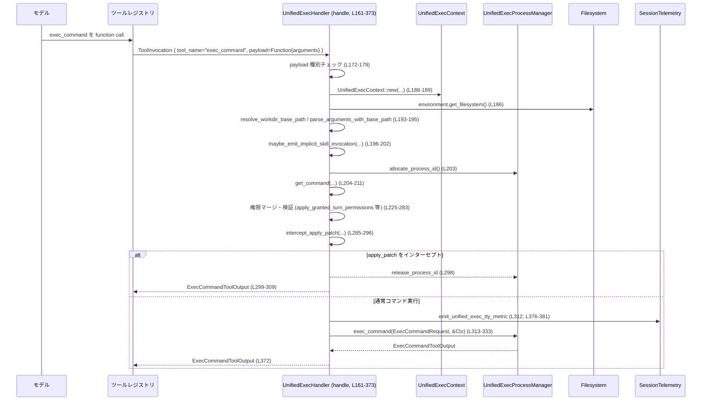
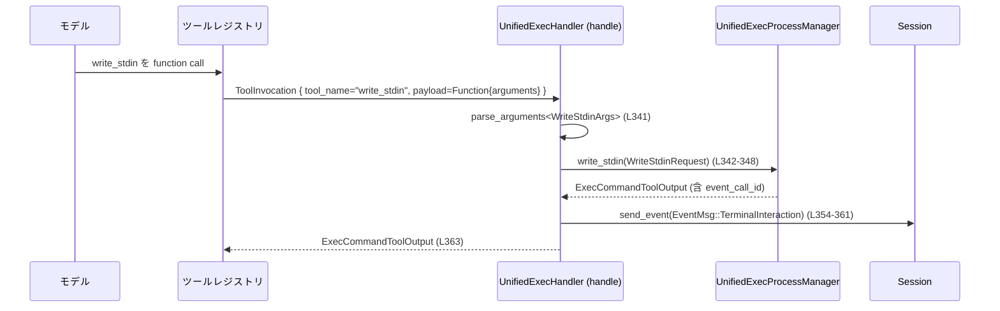

# core/src/tools/handlers/unified_exec.rs コード解説

## 0. ざっくり一言

`UnifiedExecHandler` は、LLM からのツール呼び出し（function call）を受けて、  
「コマンド実行 (`exec_command`)」と「既存プロセスへの標準入力書き込み (`write_stdin`)」を行うハンドラです。  
プロセス管理、サンドボックス権限、承認ポリシー、TTY 設定などを統合的に扱います。

---

## 1. このモジュールの役割

### 1.1 概要

- このモジュールは **LLM ツール呼び出しを OS コマンド実行に橋渡しする役割** を持ちます。
- 具体的には、`ToolHandler` 実装として `exec_command` / `write_stdin` という 2 種類のファンクションツールを扱い、
  - 引数のパース
  - 実行シェルの決定
  - サンドボックス／追加権限の解決と検証
  - 実プロセスの起動・標準入力書き込み
  - テレメトリ送信・イベント通知  
 などを行います（`core/src/tools/handlers/unified_exec.rs:L88-373`）。

### 1.2 アーキテクチャ内での位置づけ

主な関係を簡略化した依存関係図です。



- 上記のうち、`UnifiedExecHandler` と `get_command` の実装がこのファイルに含まれます。
- 他のコンポーネント（`UnifiedExecProcessManager` など）はこのチャンクには定義がなく、詳細は不明です。

### 1.3 設計上のポイント

コードから読み取れる設計上の特徴をまとめます。

- **無状態なハンドラ**
  - `UnifiedExecHandler` 自体はフィールドを持たない空の構造体です（`L37`）。
  - 実際の状態は `ToolInvocation` / `UnifiedExecContext` / `UnifiedExecProcessManager` に保持されます（`L161-170`, `L188-189`）。
- **非同期処理モデル**
  - コマンド実行や標準入力書き込みは `async fn handle` と `async fn is_mutating` を通じて非同期に実行されます（`L99-121`, `L161-373`）。
- **権限・承認ポリシの明示的な取り扱い**
  - `SandboxPermissions` と `PermissionProfile` を引数として受け取り、  
    `apply_granted_turn_permissions` / `implicit_granted_permissions` /  
    `normalize_and_validate_additional_permissions` で権限を整理しています（`L225-283`）。
- **安全なコマンド判定**
  - `is_mutating` で `is_known_safe_command` を使い、安全なコマンドかどうかを判定します（`L111-120`）。
- **TTY / 非 TTY の区別**
  - `ExecCommandArgs.tty` によって TTY 実行かどうかを制御し、テレメトリタグや post-tool 用ペイロードの有無に影響します（`L48-51`, `L149-152`, `L312-312`）。
- **エラーハンドリングの一元化**
  - ツール側から見えるエラーは基本的に `FunctionCallError::RespondToModel(String)` の形に変換されます（`L175-177`, `L210`, `L251-253`, `L281-282`, `L334-337`, `L351-352`, `L366-368`）。
- **シェル起動方法の抽象化**
  - `get_command` でシェルモード (`UnifiedExecShellMode::Direct` / `ZshFork`) とログインシェルかどうかを抽象化します（`L384-415`）。

---

## 2. 主要な機能一覧

このモジュールが提供する主な機能です。

- **UnifiedExecHandler: ToolHandler 実装**
  - `exec_command` と `write_stdin` ツール呼び出しの受付・実行（`L88-373`）。
- **ツールのミューテーション判定**
  - 与えられたコマンドが「安全なコマンド」かどうかを判定し、ミューテーションフラグを返す（`is_mutating`, `L99-121`）。
- **Pre/Post ツール用ペイロード生成**
  - 実行前後にログや監査用と思われるペイロード (`PreToolUsePayload`, `PostToolUsePayload`) を生成（`L123-159`）。
- **TTY 実行メトリクスの送信**
  - TTY 実行かどうかをテレメトリカウンタに記録（`emit_unified_exec_tty_metric`, `L376-381`）。
- **シェル起動コマンド列の生成**
  - シェルモード・ログインシェル設定・モデル指定シェルに基づいて実際に実行するコマンド配列 `Vec<String>` を構築（`get_command`, `L384-415`）。
- **デフォルト値の提供**
  - `ExecCommandArgs` / `WriteStdinArgs` 用のデフォルトタイムアウト・TTY 設定（`L76-86`）。

---

## 3. 公開 API と詳細解説

### 3.0 コンポーネントインベントリー

このファイル内で定義されている型・関数の一覧です。

| 名前 | 種別 | 可視性 | 行範囲 | 役割 / 用途 |
|------|------|--------|--------|-------------|
| `UnifiedExecHandler` | 構造体 | `pub` | `L37` | 統一実行用ツールハンドラ本体。状態は持たない。 |
| `ExecCommandArgs` | 構造体 | `pub(crate)` | `L39-62` | `exec_command` の引数（コマンド・cwd・TTY・権限など）。 |
| `WriteStdinArgs` | 構造体 | private | `L64-74` | `write_stdin` の引数（session_id, chars, yield_time_ms, max_output_tokens）。 |
| `default_exec_yield_time_ms` | 関数 | private | `L76-78` | `ExecCommandArgs.yield_time_ms` のデフォルト値（10秒）。 |
| `default_write_stdin_yield_time_ms` | 関数 | private | `L80-82` | `WriteStdinArgs.yield_time_ms` のデフォルト値（250ms）。 |
| `default_tty` | 関数 | private | `L84-86` | `ExecCommandArgs.tty` のデフォルト値（false）。 |
| `ToolHandler for UnifiedExecHandler` | impl | n/a | `L88-373` | ツール種別判定、ミューテーション判定、実行本体など。 |
| `kind` | メソッド | public impl | `L91-93` | ツール種別を `ToolKind::Function` として返す。 |
| `matches_kind` | メソッド | public impl | `L95-97` | `ToolPayload::Function` のみを対象とするか判定。 |
| `is_mutating` | 非同期メソッド | public impl | `L99-121` | コマンドが安全かどうか判定し、ミューテーションフラグを返す。 |
| `pre_tool_use_payload` | メソッド | public impl | `L123-137` | `exec_command` の実行前ペイロード（コマンド文字列）を生成。 |
| `post_tool_use_payload` | メソッド | public impl | `L139-159` | 非 TTY 実行時の実行後ペイロードを生成。 |
| `handle` | 非同期メソッド | public impl | `L161-373` | `exec_command` / `write_stdin` を実際に処理する中心ロジック。 |
| `emit_unified_exec_tty_metric` | 関数 | private | `L376-381` | TTY フラグ付きでテレメトリカウンタをインクリメント。 |
| `get_command` | 関数 | `pub(crate)` | `L384-415` | 実際に実行するコマンド配列（シェル＋オプション＋cmd）を構築。 |
| `tests` モジュール | mod | private | `L418-420` | 単体テストモジュール。内容はこのチャンクには現れません。 |

### 3.1 型一覧（構造体・列挙体など）

| 名前 | 種別 | 可視性 | 役割 / 用途 | 主なフィールド |
|------|------|--------|-------------|----------------|
| `UnifiedExecHandler` | 構造体 | `pub` | ツールレジストリから呼ばれる実行ハンドラ。`ToolHandler` を実装（`L37`, `L88-373`）。 | フィールドなし。 |
| `ExecCommandArgs` | 構造体 | `pub(crate)` | `exec_command` の JSON 引数をパースした結果（`L39-62`）。 | `cmd`, `workdir`, `shell`, `login`, `tty`, `yield_time_ms`, `max_output_tokens`, `sandbox_permissions`, `additional_permissions`, `justification`, `prefix_rule` |
| `WriteStdinArgs` | 構造体 | private | `write_stdin` の JSON 引数をパースした結果（`L64-74`）。 | `session_id`, `chars`, `yield_time_ms`, `max_output_tokens` |

#### `ExecCommandArgs` 詳細

- すべて `serde::Deserialize`（`L39`）され、`parse_arguments_with_base_path` などから生成されます。
- デフォルト値:
  - `workdir`: `None`（指定なし）（`L42-43`）
  - `shell`: `None`（モデル指定無し）（`L44-45`）
  - `login`: `None`（未指定）（`L46-47`）
  - `tty`: `default_tty()` → `false`（`L48-51`, `L84-86`）
  - `yield_time_ms`: `default_exec_yield_time_ms()` → `10_000`（`L50-51`, `L76-78`）
  - `max_output_tokens`: `None`（`L52-53`）
  - `sandbox_permissions`: `SandboxPermissions` のデフォルト（詳細はこのチャンクには現れません）（`L54-55`）
  - `additional_permissions`: `None`（`L56-57`）
  - `justification`: `None`（`L58-59`）
  - `prefix_rule`: `None`（`L60-61`）

### 3.2 関数詳細（重要関数）

#### `UnifiedExecHandler::handle(&self, invocation: ToolInvocation) -> Result<ExecCommandToolOutput, FunctionCallError>`

**概要**

- ツール呼び出しを処理するメインのエントリポイントです（`L161-373`）。
- `tool_name.name` に応じて `exec_command` か `write_stdin` を分岐し、プロセス起動または標準入力書き込みを行います。

**引数**

| 引数名 | 型 | 説明 |
|--------|----|------|
| `self` | `&UnifiedExecHandler` | 無状態ハンドラ自身。 |
| `invocation` | `ToolInvocation` | セッション・ターン・ツール名・ペイロードなど呼び出しコンテキスト（`L161-170`）。 |

**戻り値**

- `Ok(ExecCommandToolOutput)`:
  - コマンド実行または標準入力書き込みの結果。  
    詳細なフィールドは `ExecCommandToolOutput` の定義（別ファイル）に依存します。
- `Err(FunctionCallError::RespondToModel(String))`:
  - ペイロードの種類が不正、環境未設定、権限の問題、プロセス管理のエラーなどを文字列メッセージで返します（`L175-177`, `L181-185`, ほか）。

**内部処理の流れ**

1. `ToolInvocation` を分解し、`session`, `turn`, `tracker`, `call_id`, `tool_name`, `payload` を取り出す（`L161-170`）。
2. ペイロードが `ToolPayload::Function { arguments }` であることを確認。そうでなければエラー（`L172-179`）。
3. `turn.environment` が存在するか確認。無い場合は「unified exec is unavailable」としてエラー（`L181-185`）。
4. 環境からファイルシステム `fs` を取得し（`L186`）、セッションから `UnifiedExecProcessManager` を取り出す（`L188`）。
5. `UnifiedExecContext` を作成（セッション、ターン、call_id を保持）（`L189`）。
6. `tool_name.name.as_str()` に応じて分岐（`L191-193`）：
   - `"exec_command"` の場合:
     1. `resolve_workdir_base_path` でベース cwd を解決（`L193`）。
     2. `parse_arguments_with_base_path` で `ExecCommandArgs` をパース（`L194`）。
     3. 一度 `turn.resolve_path` で workdir を解決し、`maybe_emit_implicit_skill_invocation` を呼び出す（`L195-202`）。
        - 関数名からはスキル起動の記録・イベント送信と推測されますが、このチャンクには実装が無く、詳細は不明です。
     4. `allocate_process_id` で新しいプロセス ID を確保（`L203`）。
     5. `get_command` で実際に実行するコマンド配列を構築。失敗時は `FunctionCallError` に変換（`L204-211`）。
     6. 引数 `args` を分解し、権限関連フィールドなどを取り出す（`L213-223`）。
     7. 機能フラグ `Feature::ExecPermissionApprovals` などを見て、追加権限の許可条件を計算（`L225-237`）。
     8. サンドボックス override を要求しているのに、承認ポリシが `AskForApproval::OnRequest` でない場合は、プロセス ID を解放しエラーで終了（`L240-253`）。
     9. `workdir` の空文字列をフィルタし、`turn.resolve_path` でパスを解決、`cwd` を更新（`L256-259`）。
     10. `implicit_granted_permissions` もしくは `normalize_and_validate_additional_permissions` により、最終的な追加権限を算出（`L260-277`）。
         - 失敗時はプロセス ID を解放してエラー（`L278-282`）。
     11. `intercept_apply_patch` による「パッチ適用コマンド」の特別扱いを試みる（`L285-295`）。
         - `Some(output)` が返ればプロセスを起動せずに結果を `ExecCommandToolOutput` として返却し、プロセス ID を解放（`L296-309`）。
     12. TTY メトリクスを送信（`emit_unified_exec_tty_metric`, `L312`）。
     13. `UnifiedExecProcessManager::exec_command` を呼び出し、プロセスを起動して結果を待つ（`L313-333`）。
         - エラー時には `command_for_display` を含むエラーメッセージを生成（`L334-337`）。
   - `"write_stdin"` の場合:
     1. `parse_arguments` で `WriteStdinArgs` をパース（`L341`）。
     2. `UnifiedExecProcessManager::write_stdin` に `WriteStdinRequest` を渡し、レスポンスを待つ（`L342-352`）。
     3. 取得したレスポンスの `event_call_id` と、`session_id`, `chars` から `TerminalInteractionEvent` を作成し、`session.send_event` で送信（`L354-361`）。
     4. レスポンスをそのまま返す（`L363`）。
   - その他のツール名:
     - `"unsupported unified exec function {other}"` というエラーで失敗（`L365-368`）。
7. 成功したレスポンスを `Ok(response)` として返す（`L372`）。

**Examples（使用例）**

擬似的に `exec_command` を呼び出す例です。実際の型は他ファイルに依存するため、疑似コードです。

```rust
// ツールレジストリが UnifiedExecHandler を登録していると仮定
let handler = UnifiedExecHandler;

// ToolInvocation を構築（簡略化）
let invocation = ToolInvocation {
    // 省略: session, turn, tracker, call_id, tool_name などを設定
    tool_name: ToolName { namespace: None, name: "exec_command".into() },
    payload: ToolPayload::Function {
        // 例: {"cmd": "ls -la", "tty": false}
        arguments: r#"{"cmd":"ls -la"}"#.to_string(),
    },
    // ...
};

// 非同期コンテキストでハンドラを実行
let result = handler.handle(invocation).await?;
println!("stdout bytes = {:?}", result.raw_output);
```

**Errors / Panics**

- 明示的な `panic!` はこの関数内にはありません。
- 代表的な `Err(FunctionCallError::RespondToModel(_))` になる条件:
  - ペイロードが `ToolPayload::Function` でない（`L172-179`）。
  - `turn.environment` が `None`（`L181-185`）。
  - `get_command` に失敗（ログインシェル禁止に違反等）（`L204-211`）。
  - サンドボックス override 要求と承認ポリシの組み合わせが禁止ケースに当たる（`L240-253`）。
  - 追加権限の正規化 (`normalize_and_validate_additional_permissions`) に失敗（`L260-283`）。
  - `UnifiedExecProcessManager::exec_command` / `write_stdin` がエラーを返す（`L334-337`, `L350-352`）。
  - サポートされていない `tool_name` の場合（`L365-368`）。

**Edge cases（エッジケース）**

- `turn.environment` が無いセッション:
  - 即座に「unified exec is unavailable in this session」というエラー（`L181-185`）。
- `ExecCommandArgs.tty == true`:
  - `post_tool_use_payload` ではペイロードを生成しない（`L149-152`）。  
    `handle` 自体の動作は変わらず、TTY メトリクスだけが `tty=true` でカウントされます（`L312`, `L376-381`）。
- サンドボックス override 要求 (`requests_sandbox_override()` が true) かつ
  - 事前承認されておらず (`!permissions_preapproved`)、承認ポリシが `OnRequest` でないときは即座にエラー（`L240-253`）。
- `intercept_apply_patch` が `Some(output)` を返す場合:
  - プロセスを起動せず、この関数内で `ExecCommandToolOutput` を組み立てて返します（`L285-309`）。

**使用上の注意点**

- `ToolInvocation` の `payload` は `ToolPayload::Function` である必要があります。その他のバリアントはエラー（`L172-179`）。
- 新しい unified-exec 系ツール（`tool_name`）を追加する場合は、この `match` に分岐を追加する必要があります（`L191-193`）。
- サンドボックスや追加権限の制御はこの関数から外部関数に委譲されているため、その契約を変更すると `handle` の前提も変わります。

---

#### `UnifiedExecHandler::is_mutating(&self, invocation: &ToolInvocation) -> bool`

**概要**

- ツール呼び出しが「ミューテーション（状態変更）」を伴う可能性が高いかどうかを推定します（`L99-121`）。
- コマンドを解析し、既知の安全なコマンド以外は `true`（ミューテーションあり）と判定します。

**引数**

| 引数名 | 型 | 説明 |
|--------|----|------|
| `self` | `&UnifiedExecHandler` | ハンドラ自身。 |
| `invocation` | `&ToolInvocation` | ペイロードなどの呼び出し情報。 |

**戻り値**

- `true`:
  - ミューテーションする可能性がある、もしくは判定に失敗した場合。
- `false`:
  - `is_known_safe_command` によって「安全」と判定されたコマンド。

**内部処理の流れ**

1. ペイロードが `ToolPayload::Function { arguments }` であることを確認（`L100-106`）。
   - そうでない場合はエラーログを出力し、保守的に `true` を返す（`L101-105`）。
2. `parse_arguments::<ExecCommandArgs>` で引数をパース（`L108`）。
   - 失敗した場合も保守的に `true` を返す（`L108-110`）。
3. `get_command` を呼び出して実行コマンド配列を構築（`L111-118`）。
   - 失敗した場合も `true`（`L117-119`）。
4. `!is_known_safe_command(&command)` を返す（`L120`）。

**Errors / Panics**

- 返り値は `bool` であり、この関数内で `panic!` はありません。
- エラーが発生した場合（ペイロード種別不正・引数パース失敗・`get_command` 失敗）はすべて「ミューテーションあり」と判断されます。

**Edge cases**

- `ExecCommandArgs` の `cmd` が空文字列でも、この関数内で特別扱いはありません。`is_known_safe_command` の実装次第です（詳細はこのチャンクには現れません）。
- `tool_name` が `"exec_command"` でない場合も、この関数は `ToolInvocation` 単位で呼び出されるため、`cmd` の中身次第で判定されます。

**使用上の注意点**

- ミューテーション判定は保守的であり、「判定不能 = true（ミューテーションあり）」となります。
- `is_known_safe_command` の定義と `get_command` の仕様を変更すると、この関数の挙動も変わります。

---

#### `UnifiedExecHandler::pre_tool_use_payload(&self, invocation: &ToolInvocation) -> Option<PreToolUsePayload>`

**概要**

- ツール実行前にログや監査に使える簡易ペイロードを生成します（`L123-137`）。
- 現状は `exec_command` ツールのみを対象とし、コマンド文字列を返します。

**引数**

| 引数名 | 型 | 説明 |
|--------|----|------|
| `self` | `&UnifiedExecHandler` | ハンドラ自身。 |
| `invocation` | `&ToolInvocation` | ツール名・ペイロードなど。 |

**戻り値**

- `Some(PreToolUsePayload { command })`:
  - 非名前空間ツール `"exec_command"` で、引数パースに成功した場合（`L123-137`）。
- `None`:
  - 名前空間付きツール、ツール名が `"exec_command"` 以外、ペイロード種別不正、引数パース失敗時。

**内部処理の流れ**

1. `tool_name.namespace` が `None` であり、`tool_name.name` が `"exec_command"` かを確認（`L123-127`）。
2. ペイロードが `ToolPayload::Function { arguments }` であることを確認（`L130-132`）。
3. `parse_arguments::<ExecCommandArgs>` で `cmd` を取り出し、`PreToolUsePayload { command: args.cmd }` を返す（`L134-137`）。

**使用上の注意点**

- TTY フラグなどはここでは考慮されません。あくまでコマンド文字列だけが対象です。
- このペイロードは `pre_tool_use_payload` の返り値としてのみ使われます。

---

#### `UnifiedExecHandler::post_tool_use_payload(&self, call_id: &str, payload: &ToolPayload, result: &dyn ToolOutput) -> Option<PostToolUsePayload>`

**概要**

- ツール実行後の結果をまとめたペイロードを生成します（`L139-159`）。
- 非 TTY モードの `exec_command` のみを対象とします。

**引数**

| 引数名 | 型 | 説明 |
|--------|----|------|
| `self` | `&UnifiedExecHandler` | ハンドラ自身。 |
| `call_id` | `&str` | ツールコール ID。 |
| `payload` | `&ToolPayload` | 元のツールペイロード。 |
| `result` | `&dyn ToolOutput` | 実行結果を表すトレイトオブジェクト。 |

**戻り値**

- `Some(PostToolUsePayload)`:
  - ペイロードが `ToolPayload::Function` であり、`ExecCommandArgs` のパースに成功し、`tty == false` の場合（`L145-158`）。
- `None`:
  - `payload` が他種、`parse_arguments` 失敗、TTY モード時、`post_tool_use_response` が `None` を返した場合（`L145-147`, `L149-152`, `L154`）。

**内部処理の流れ**

1. `payload` が `ToolPayload::Function { arguments }` かどうか確認（`L145-147`）。
2. `ExecCommandArgs` をパースし、TTY モードなら `None` を返す（`L149-152`）。
3. `result.post_tool_use_response(call_id, payload)` から応答データを取得（`L154`）。
4. `PostToolUsePayload { command: args.cmd, tool_response }` として返す（`L155-158`）。

**使用上の注意点**

- TTY 実行 (`tty == true`) では後処理ペイロードが生成されないため、ログ・保存などは別経路が必要になります。

---

#### `emit_unified_exec_tty_metric(session_telemetry: &SessionTelemetry, tty: bool)`

**概要**

- unified-exec ツール呼び出しの回数を、TTY フラグ付きでテレメトリカウンタに記録します（`L376-381`）。

**引数**

| 引数名 | 型 | 説明 |
|--------|----|------|
| `session_telemetry` | `&SessionTelemetry` | セッション単位のテレメトリ送信オブジェクト。 |
| `tty` | `bool` | TTY モードかどうか。 |

**戻り値**

- なし（副作用のみ）。

**内部処理の流れ**

1. `session_telemetry.counter` を呼び出し、`TOOL_CALL_UNIFIED_EXEC_METRIC` をインクリメント（`L376-381`）。
2. 属性として `("tty", "true"|"false")` を付与。

**使用上の注意点**

- `handle` からは `exec_command` ブランチの実行直前に呼び出されます（`L312`）。
- テレメトリ名前や属性は外部定義のため、変更時はダッシュボード側との整合性に注意が必要です。

---

#### `get_command(args: &ExecCommandArgs, session_shell: Arc<Shell>, shell_mode: &UnifiedExecShellMode, allow_login_shell: bool) -> Result<Vec<String>, String>`

**概要**

- `ExecCommandArgs` とシェルモード設定に基づいて、実際にプロセス起動に渡すコマンド配列 (`Vec<String>`) を組み立てます（`L384-415`）。
- ログインシェルを使うかどうかの判定と、モデル指定シェルの利用を抽象化します。

**引数**

| 引数名 | 型 | 説明 |
|--------|----|------|
| `args` | `&ExecCommandArgs` | コマンド文字列、shell/login フラグなど。 |
| `session_shell` | `Arc<Shell>` | セッションデフォルトのシェル設定。 |
| `shell_mode` | `&UnifiedExecShellMode` | シェルモード (`Direct` / `ZshFork`)。 |
| `allow_login_shell` | `bool` | 設定上ログインシェルを許可するかどうか。 |

**戻り値**

- `Ok(Vec<String>)`:
  - 実行可能なコマンド列。例（Direct モード）: `["/bin/bash", "-lc", "ls -la"]`。
- `Err(String)`:
  - ログインシェルを禁止している設定なのに `args.login == Some(true)` が指定された場合など。

**内部処理の流れ**

1. `args.login` と `allow_login_shell` から `use_login_shell: bool` を決定（`L390-398`）。
   - `Some(true)` かつ `allow_login_shell == false` の場合はエラーメッセージを返す（`L391-395`）。
   - `Some(false)` の場合は `false`、`None` の場合は `allow_login_shell` をそのまま使用（`L396-398`）。
2. `shell_mode` に応じて分岐（`L400-415`）:
   - `UnifiedExecShellMode::Direct`:
     - `args.shell` が `Some` の場合、モデル指定パスから `Shell` を構築し、`shell.shell_snapshot` を空のレシーバに差し替える（`L402-405`）。
       - `empty_shell_snapshot_receiver` の実装はこのチャンクには無く詳細不明ですが、スナップショットを無効化する意図と推測できます。
     - そうでなければ `session_shell` を使用し、`derive_exec_args(&args.cmd, use_login_shell)` でコマンド列を組み立てる（`L407-408`）。
   - `UnifiedExecShellMode::ZshFork(zsh_fork_config)`:
     - `[shell_zsh_path, "-lc" or "-c", args.cmd.clone()]` のベクタを返す（`L410-414`）。

**Examples（使用例）**

```rust
// Direct モードでセッションデフォルトシェルを利用する例
let args = ExecCommandArgs {
    cmd: "ls -la".into(),
    workdir: None,
    shell: None,
    login: Some(true),
    tty: false,
    yield_time_ms: 10_000,
    max_output_tokens: None,
    sandbox_permissions: SandboxPermissions::default(),
    additional_permissions: None,
    justification: None,
    prefix_rule: None,
};

let shell_mode = UnifiedExecShellMode::Direct;
let session_shell: Arc<Shell> = /* ... */;

let cmd_vec = get_command(&args, session_shell, &shell_mode, true)?;
assert!(cmd_vec.last().unwrap().contains("ls -la"));
```

**Errors / Panics**

- 明示的な `panic!` はありません。
- `Err(String)` を返す条件:
  - `allow_login_shell == false` かつ `args.login == Some(true)` の場合（`L390-395`）:
    - メッセージ: `"login shell is disabled by config; omit`login`or set it to false."`。

**Edge cases**

- `args.shell == None` かつ `shell_mode == Direct`:
  - 常に `session_shell` を利用（`L407-408`）。
- `args.shell == Some(...)` だが、`get_shell_by_model_provided_path` がどのようなパスを受け入れるかはこのチャンクには現れません。
- `cmd` が非常に長い文字列でも、この関数は単純にクローンしてベクタに格納するだけで、特別な制限はありません。

**使用上の注意点**

- `login` フラグの指定と `allow_login_shell` の組み合わせに注意が必要です。禁止されている状況でログインシェルを強制しようとするとエラーになります（`L390-395`）。
- `UnifiedExecShellMode::ZshFork` の場合、`cmd` はそのまま `zsh` に渡されます。エスケープや quoting は呼び出し側（または LLM）に依存します。

---

#### デフォルト値関数

- `default_exec_yield_time_ms() -> u64`（`L76-78`）
  - 常に `10_000` を返し、`ExecCommandArgs.yield_time_ms` のデフォルト値として使用されます。
- `default_write_stdin_yield_time_ms() -> u64`（`L80-82`）
  - 常に `250` を返し、`WriteStdinArgs.yield_time_ms` のデフォルト値として使用されます。
- `default_tty() -> bool`（`L84-86`）
  - 常に `false` を返し、`ExecCommandArgs.tty` のデフォルト値として使用されます。

いずれも副作用やエラーはなく、単純な定数返却です。

### 3.3 その他の関数・メソッド一覧

（上で詳細説明していないもの）

| 関数 / メソッド名 | 行範囲 | 役割（1 行） |
|-------------------|--------|--------------|
| `kind(&self) -> ToolKind` | `L91-93` | このハンドラのツール種別を `ToolKind::Function` として返す。 |
| `matches_kind(&self, payload: &ToolPayload) -> bool` | `L95-97` | ペイロードが `ToolPayload::Function` かどうかを判定する。 |

---

## 4. データフロー

### 4.1 代表的なシナリオ: `exec_command` 呼び出し

`exec_command` の処理フローをシーケンス図で示します。



要点:

- `UnifiedExecHandler` はあくまで調整役であり、実際のプロセス管理は `UnifiedExecProcessManager` に委譲されます。
- サンドボックスや追加権限、承認ポリシのチェックは `exec_command` 前に完了し、通過できない場合はプロセスを起動しません。
- `intercept_apply_patch` により、特定のコマンド（パッチ適用）が別フローで処理される可能性があります。

### 4.2 `write_stdin` のフロー



---

## 5. 使い方（How to Use）

### 5.1 基本的な使用方法

典型的には、ツールレジストリ側で `UnifiedExecHandler` を `ToolHandler` として登録し、  
LLM からの function call を `ToolInvocation` に変換して `handle` を呼び出します。

疑似コード例:

```rust
// ハンドラの初期化（状態は持たないので単純にインスタンス化）
let handler = UnifiedExecHandler; // core/src/tools/handlers/unified_exec.rs:L37

// モデルからの function call を ToolInvocation に変換したものと仮定
let invocation = ToolInvocation {
    session,           // セッションコンテキスト
    turn,              // 現在のターン
    tracker,           // トラッカー
    call_id: "call-1".into(),
    tool_name: ToolName { namespace: None, name: "exec_command".into() },
    payload: ToolPayload::Function {
        // ExecCommandArgs としてパースされる JSON 文字列
        arguments: r#"{
            "cmd": "echo hello",
            "tty": false,
            "yield_time_ms": 5000
        }"#.to_string(),
    },
    // ...
};

// 非同期ランタイム上で実行
let output: ExecCommandToolOutput = handler.handle(invocation).await?;
println!("exit: {:?}, stdout bytes: {:?}", output.exit_code, output.raw_output);
```

### 5.2 よくある使用パターン

1. **非 TTY 一括実行（ログ保存向き）**
   - `tty: false`（デフォルト）を使うと、`post_tool_use_payload` で `tool_response` を取り出しやすくなります（`L149-152`）。
2. **TTY 対話モード + 標準入力**
   - `exec_command` で `tty: true` のセッションプロセスを起動し、その後 `write_stdin` を何度も呼び出して対話する流れが想定されます。
   - `WriteStdinArgs.session_id` は `exec_command` から返される `process_id`（セッション ID として扱われる）に一致している必要があります（`L341-347`）。
3. **ログインシェル指定**
   - `ExecCommandArgs.login: Some(true)` とし、`allow_login_shell` が `true` に設定された環境ではログインシェルとして起動されます（`L390-398`）。

### 5.3 よくある間違い

```rust
// 誤り例: ログインシェルが禁止されているのに login: true を指定
let args = ExecCommandArgs {
    cmd: "echo hello".into(),
    login: Some(true),
    // ...
};

let allow_login_shell = false;
let res = get_command(&args, session_shell, &UnifiedExecShellMode::Direct, allow_login_shell);
// res は Err("login shell is disabled by config; ...") になる（L390-395）

// 正しい例: login フラグを省略するか false にする
let args_ok = ExecCommandArgs {
    cmd: "echo hello".into(),
    login: None, // もしくは Some(false)
    // ...
};
let res_ok = get_command(&args_ok, session_shell, &UnifiedExecShellMode::Direct, allow_login_shell)?;
```

```rust
// 誤り例: 環境が unified exec に対応していないセッションで呼び出す
// turn.environment が None の場合、handle はエラーを返す（L181-185）

// 正しい例: unified exec 対応セッションかどうかを事前に確認した上で呼び出す
if turn.environment.is_some() {
    let result = handler.handle(invocation).await?;
    // ...
}
```

### 5.4 使用上の注意点（まとめ）

- **環境依存性**
  - `turn.environment` が `Some` である必要があります。そうでないセッションでは unified exec は利用できません（`L181-185`）。
- **権限・承認ポリシ**
  - サンドボックス override と承認ポリシの組み合わせによりコマンドが拒否される場合があります（`L240-253`）。
  - `Feature::ExecPermissionApprovals` / `Feature::RequestPermissionsTool` のフラグによって追加権限の扱いが変わります（`L225-237`）。
- **TTY とログ**
  - `tty: true` の場合 `post_tool_use_payload` は生成されません（`L149-152`）。対話的な出力は別の経路で扱う必要があります。
- **非同期ランタイム**
  - `is_mutating` / `handle` / プロセス管理 API は `async fn` のため、Tokio などの非同期ランタイム上で実行する前提です。

---

## 6. 変更の仕方（How to Modify）

### 6.1 新しい機能を追加する場合

例: unified-exec に新しいファンクション `kill_process` を追加したい場合。

1. **引数構造体の追加**
   - `WriteStdinArgs` と同様の構造体をこのファイルに追加するか、共有場所に定義します。
2. **`handle` の分岐追加**
   - `match tool_name.name.as_str()` の分岐に `"kill_process"` を追加し、対応する処理（`UnifiedExecProcessManager` の新 API など）を呼び出します（`L191-193` 部分を編集）。
3. **ミューテーション判定への反映**
   - `is_mutating` は現状 `ExecCommandArgs` に基づく判定のみですが、新ツールが追加される場合、その扱いを検討します（別ファイルのルーティングロジックに依存する可能性があります）。
4. **Pre/Post ペイロードの拡張**
   - 必要に応じて `pre_tool_use_payload` / `post_tool_use_payload` に新ツールを対応させます（`L123-159`）。

### 6.2 既存の機能を変更する場合

- **`ExecCommandArgs` にフィールドを追加する**
  - `#[derive(Deserialize)]` により自動的にパースされますが、
  - `handle` の `let ExecCommandArgs { .. } = args;` の分解パターン（`L213-223`）を更新する必要があります。
- **権限ロジックを変更する**
  - `apply_granted_turn_permissions` / `implicit_granted_permissions` / `normalize_and_validate_additional_permissions` のインターフェース変更時は、  
    それらを呼び出している部分（`L225-283`）を合わせて修正する必要があります。
- **シェルモードの追加**
  - `UnifiedExecShellMode` にバリアントを追加した場合、`get_command` の `match`（`L400-415`）に新しいバリアントの分岐を追加する必要があります。

変更時には、関連テスト（`mod tests;` → `unified_exec_tests.rs`）も更新するのが安全です（`L418-420`）。

---

## 7. 関連ファイル

このモジュールと密接に関係するファイル・コンポーネント（名前はコードから読み取れる範囲）。

| パス / 型名 | 役割 / 関係 |
|------------|------------|
| `crate::unified_exec::UnifiedExecProcessManager` | プロセス ID の割り当て・解放、および `exec_command` / `write_stdin` の実行を担うプロセスマネージャ（`L188`, `L203`, `L313-333`, `L342-348`）。 |
| `crate::unified_exec::UnifiedExecContext` | セッション・ターン・call_id など unified-exec 固有のコンテキスト（`L189`, `L315-331`）。 |
| `crate::unified_exec::ExecCommandRequest` | `exec_command` に渡されるリクエスト構造体（`L315-330`）。 |
| `crate::unified_exec::WriteStdinRequest` | `write_stdin` に渡されるリクエスト構造体（`L343-347`）。 |
| `crate::tools::handlers::apply_granted_turn_permissions` | ターン単位で付与された権限を `ExecCommandArgs` に反映（`L228-233`）。実装はこのチャンクには現れません。 |
| `crate::tools::handlers::implicit_granted_permissions` | 暗黙的に付与された権限の処理（`L260-264`）。 |
| `crate::tools::handlers::normalize_and_validate_additional_permissions` | 追加権限の正規化と検証（`L265-275`）。 |
| `crate::tools::handlers::parse_arguments` / `parse_arguments_with_base_path` | JSON 文字列から引数構造体を生成（`L108`, `L134`, `L149`, `L194`, `L341`）。 |
| `crate::tools::handlers::resolve_workdir_base_path` | 作業ディレクトリのベースパス解決（`L193`）。 |
| `crate::tools::handlers::apply_patch::intercept_apply_patch` | 特定のコマンド（パッチ適用）を intercept し、別フローに委譲する（`L285-296`）。 |
| `codex_shell_command::is_safe_command::is_known_safe_command` | コマンド列が安全かどうかの判定（`L31`, `L120`）。 |
| `codex_tools::UnifiedExecShellMode` | シェルモード設定 (`Direct` / `ZshFork`)（`L32`, `L400-415`）。 |
| `unified_exec_tests.rs` | このモジュールのテストコード。`mod tests;` で参照されていますが内容はこのチャンクには現れません（`L418-420`）。 |

---

## Bugs / Security / Contracts / Tests / Performance（要点のみ）

- **Security**
  - ログインシェル禁止設定を侵害しようとすると `get_command` がエラーを返すため、設定による制御が可能です（`L390-395`）。
  - サンドボックス override と承認ポリシの組み合わせに対して明示的なガードがあり、未承認での権限昇格を防ぎます（`L240-253`）。
- **Contracts**
  - `ToolInvocation.payload` が `ToolPayload::Function` であること、`turn.environment` が `Some` であることが前提条件です（`L172-185`）。
  - `WriteStdinArgs.session_id` は既存プロセス ID を指す必要がありますが、このチャンクではその整合性チェックは行われていません。
- **Tests**
  - `#[cfg(test)] mod tests;` によってテストが別ファイルに定義されていますが内容は不明です（`L418-420`）。
- **Performance / Concurrency**
  - すべての重い処理（プロセス起動、I/O）は `UnifiedExecProcessManager` 側の async メソッドに委譲され、このハンドラは主にパラメータ解決とチェックに集中しています。
  - `session` / `turn` / `UnifiedExecProcessManager` との共有は `Arc` やクローンを通じて行われており、複数の `handle` 呼び出しが同時に動作する前提の設計と考えられますが、詳細なスレッド安全性はこのチャンクには現れません。

以上が、このファイル `core/src/tools/handlers/unified_exec.rs` の公開 API とコアロジックの概要と詳細です。
