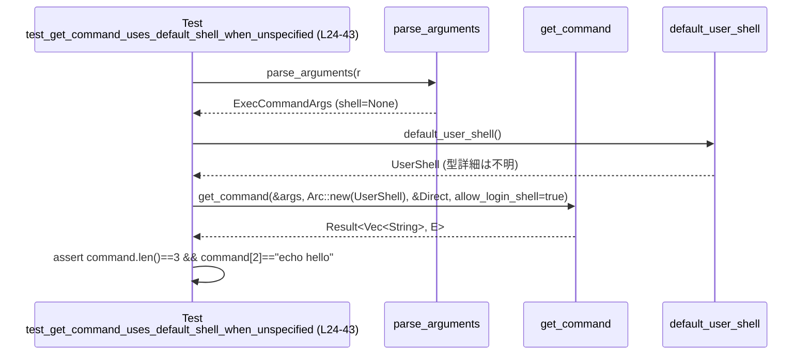
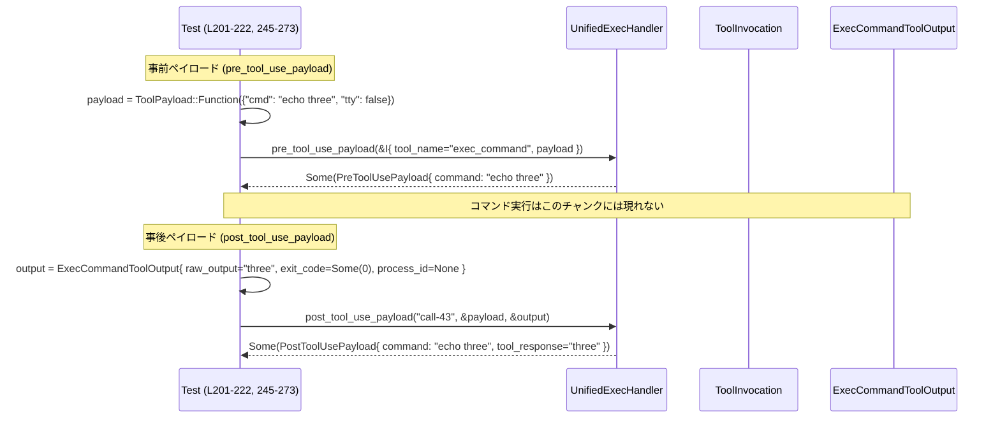

# core/src/tools/handlers/unified_exec_tests.rs

## 0. ざっくり一言

`UnifiedExecHandler` と `get_command` まわりの挙動を検証する **ユニットテスト群**です。  
シェルコマンド生成の仕様、追加ファイルシステム権限の解決、および pre/post tool payload の扱いをテストしています。

---

## 1. このモジュールの役割

### 1.1 概要

このテストモジュールは、統合実行ツール（`exec_command` など）の主な契約を確認します。

- `ExecCommandArgs` から `get_command` で生成される **実行シェルコマンド配列**の仕様検証（デフォルトシェル・明示シェル・ログインシェル禁止・Zsh fork モード）  
  （例: `test_get_command_uses_default_shell_when_unspecified`、`test_get_command_ignores_explicit_shell_in_zsh_fork_mode` など `unified_exec_tests.rs:L24-166`）
- `additional_permissions.file_system.write` の **相対パスが workdir を基準とした絶対パスになること**の検証  
  （`exec_command_args_resolve_relative_additional_permissions_against_workdir` `unified_exec_tests.rs:L168-199`）
- `UnifiedExecHandler` の `pre_tool_use_payload` / `post_tool_use_payload` が  
  **非対話・一発実行のコマンドだけを要約して返す**契約の検証  
  （`unified_exec_tests.rs:L201-273` ほか）

### 1.2 アーキテクチャ内での位置づけ

このファイル自身はテスト専用であり、実装はすべて他モジュールにあります。

主な依存関係は次の通りです。

- コマンド生成ロジック: `parse_arguments`, `get_command`, `UnifiedExecShellMode`, `ZshForkConfig`（`use super::*;` など `unified_exec_tests.rs:L1-4,7-8`）
- 追加権限解決: `resolve_workdir_base_path`, `parse_arguments_with_base_path`（`unified_exec_tests.rs:L3-4,185-186`）
- ツール実行ハンドラ: `UnifiedExecHandler`, `ToolHandler` トレイト（`unified_exec_tests.rs:L20,207,267,297,324`）
- ツールコンテキスト: `ToolPayload`, `ToolInvocation`, `ExecCommandToolOutput`, `TurnDiffTracker` など  
  （`unified_exec_tests.rs:L17-21,201-222,225-243,245-326`）

これを簡略化した依存関係図です：

```mermaid
graph TD
    subgraph "テストモジュール unified_exec_tests.rs (L1-327)"
        T1[test_*get_command* テスト群]
        T2[exec_command_args_* テスト]
        T3[pre_tool_use_payload テスト]
        T4[post_tool_use_payload テスト]
    end

    T1 --> H1[super::* (UnifiedExecHandler, get_command, ExecCommandArgs)]
    T1 --> S1[crate::shell::default_user_shell]
    T1 --> M1[codex_tools::UnifiedExecShellMode / ZshForkConfig]

    T2 --> H1
    T2 --> W1[resolve_workdir_base_path]
    T2 --> P1[parse_arguments_with_base_path]

    T3 --> H1
    T3 --> C1[ToolPayload / ToolInvocation]
    T3 --> C2[make_session_and_context]
    T3 --> C3[TurnDiffTracker(Arc<Mutex<_>>)]

    T4 --> H1
    T4 --> O1[ExecCommandToolOutput]
    T4 --> C1
```

※ `H1` や `W1` 自体の定義はこのチャンクには現れません。

### 1.3 設計上のポイント

テストコードから読み取れる設計上の特徴は次の通りです。

- **シェル挙動の差異を明示的にテスト**  
  - デフォルトシェル vs 明示シェル（bash, powershell, cmd）（`unified_exec_tests.rs:L24-109`）
  - ログインシェル禁止設定（`allow_login_shell` パラメータ）とエラーメッセージ（`unified_exec_tests.rs:L111-129`）
  - Zsh fork モード時に明示シェルが無視されること（`unified_exec_tests.rs:L131-166`）
- **ファイルシステム権限の安全側契約**  
  - `workdir` と相対パスを組み合わせて、追加の書き込み権限が **workdir 配下の絶対パス**になることを確認（`unified_exec_tests.rs:L168-199`）
- **ツールハンドラの pre/post hook 契約を明文化**  
  - `pre_tool_use_payload` は `exec_command` の `cmd` だけを可視化し、`write_stdin` のようなツールは無視（`unified_exec_tests.rs:L201-243`）
  - `post_tool_use_payload` は「非TTY・一発実行・完了済み」の場合だけ command/output を返す（`unified_exec_tests.rs:L245-326`）
- **並行性に配慮したテスト構造**  
  - 非同期テストに `#[tokio::test]` を使用し、共有状態 `TurnDiffTracker` を `Arc<Mutex<_>>` でラップして渡す設計を前提としている（`unified_exec_tests.rs:L201-222,233-240`）

---

## 2. 主要な機能一覧（テスト観点）

このファイルが検証している主要な振る舞いを列挙します。

- デフォルトシェル選択: `shell` 未指定時に `default_user_shell` が使われる（`unified_exec_tests.rs:L24-43`）
- 明示シェル尊重:
  - bash: 明示した `/bin/bash` が使われ、コマンド末尾が `echo hello` になる（`unified_exec_tests.rs:L45-69`）
  - powershell: `"powershell"` 指定時の引数配置と `-NoProfile` オプションの付与（`unified_exec_tests.rs:L71-89`）
  - cmd: `"cmd"` 指定時の引数配置（`unified_exec_tests.rs:L91-109`）
- ログインシェル禁止: `login: true` かつ `allow_login_shell = false` でエラーとなり、「login shell is disabled by config」を含むメッセージを返す（`unified_exec_tests.rs:L111-129`）
- Zsh fork モード: `UnifiedExecShellMode::ZshFork` のときは `shell` 指定を無視して特定の zsh ラッパーを使う（`unified_exec_tests.rs:L131-166`）
- 追加ファイル権限: `workdir` と `./relative-write.txt` の組合せから、絶対パスの `write` 権限リストが生成される（`unified_exec_tests.rs:L168-199`）
- pre tool payload:
  - `exec_command` ツールでは `cmd` の文字列を `PreToolUsePayload.command` として返す（`unified_exec_tests.rs:L201-222`）
  - `write_stdin` ツールでは payload を返さない（`None`）（`unified_exec_tests.rs:L224-243`）
- post tool payload:
  - 非TTY (`tty: false`)、完了済み (`exit_code: Some(0)`, `process_id: None`) の場合、標準出力を文字列にして `tool_response` として返す（`unified_exec_tests.rs:L245-273`）
  - インタラクティブ (`tty: true`) またはまだ実行中 (`process_id: Some`, `exit_code: None`) の場合は `None` を返す（`unified_exec_tests.rs:L275-326`）

---

## 3. 公開 API と詳細解説（テストからわかる契約）

### 3.1 型一覧（このモジュールで利用している主な型）

このファイル自身は新しい型を定義していませんが、重要な外部型を整理します。

| 名前 | 種別 | 役割 / 用途 | 根拠 |
|------|------|------------|------|
| `ExecCommandArgs` | 構造体（他モジュール） | JSON 引数 (`cmd`, `shell`, `login`, `workdir`, `additional_permissions` など) をパースした結果として利用。`parse_arguments` や `parse_arguments_with_base_path` の戻り値。 | `unified_exec_tests.rs:L28,49,75,95,115,134,186` |
| `UnifiedExecShellMode` | 列挙体（他モジュール） | `get_command` に渡すシェル実行モード。`Direct` モードと `ZshFork(ZshForkConfig)` が登場。 | `unified_exec_tests.rs:L35,56,82,102,119,140-147,152` |
| `ZshForkConfig` | 構造体（他モジュール） | Zsh fork モード用の zsh 実行パスとラッパー実行ファイルパスを保持。 | `unified_exec_tests.rs:L140-147` |
| `PermissionProfile` | 構造体（外部 crate） | ファイルシステム権限などのツール権限プロファイル。ここでは `file_system.write` の絶対パス化の検証に使われる。 | `unified_exec_tests.rs:L5-6,188-197` |
| `FileSystemPermissions` | 構造体（外部 crate） | `read` / `write` などのファイルシステム権限リスト。 | `unified_exec_tests.rs:L5,191-194` |
| `ToolPayload` | 列挙体（他モジュール） | ツール呼び出しのペイロード。ここでは `Function { arguments: String }` バリアントを使用。 | `unified_exec_tests.rs:L19,201-205,225-228,247-249,277-279,304-306` |
| `ToolInvocation` | 構造体（他モジュール） | ハンドラに渡すツール呼び出しコンテキスト（セッション、ターン、トラッカー、call_id, tool_name, payload）。 | `unified_exec_tests.rs:L18,209-217,233-240` |
| `ExecCommandToolOutput` | 構造体（他モジュール） | `exec_command` の実行結果（出力バイト列、終了コード、プロセスIDなど）を表現。 | `unified_exec_tests.rs:L17,250-264,280-294,307-321` |
| `UnifiedExecHandler` | 構造体または単位構造体（他モジュール） | `ToolHandler` トレイトを実装し、`pre_tool_use_payload` / `post_tool_use_payload` を提供するハンドラ。 | `unified_exec_tests.rs:L20,207,230,267,297,324` |
| `PreToolUsePayload` | 構造体（他モジュール） | LLM 等に伝えるための事前ペイロード。`command: String` を持つことがテストからわかる。 | `unified_exec_tests.rs:L218-220` |
| `PostToolUsePayload` | 構造体（他モジュール） | 実行後に LLM 等へ返す要約ペイロード。`command` と `tool_response` を持つことがテストからわかる。 | `unified_exec_tests.rs:L268-271` |

※ これらの型の定義本体やフィールドの完全な一覧は、このチャンクには現れません。

---

### 3.2 関数詳細（主要テスト 7 件）

以下では、挙動の契約に影響が大きい 7 つのテスト関数を詳しく説明します。

---

#### `test_get_command_uses_default_shell_when_unspecified() -> anyhow::Result<()>`

**概要**

`ExecCommandArgs` に `shell` が指定されていない場合、`get_command` が `default_user_shell()` を使ってコマンド配列を組み立てることを検証します。（`unified_exec_tests.rs:L24-43`）

**引数**

なし（テスト関数で内部的に JSON を構築しています）。

**戻り値**

- `anyhow::Result<()>`  
  - `parse_arguments` や `get_command` がエラーを返した場合にテストが失敗します（`?` と `map_err` を使用 `unified_exec_tests.rs:L28-29,32-39`）。

**内部処理の流れ**

1. JSON 文字列 `{"cmd": "echo hello"}` を定義（`L26`）。
2. `parse_arguments` で `ExecCommandArgs` にパースし、`args.shell.is_none()` を確認（`L28-31`）。
3. `get_command` を `UnifiedExecShellMode::Direct` と `allow_login_shell = true` で呼び出し（`L32-37`）。
4. 任意のエラー型を `anyhow::Error` に変換して `?` で伝播（`L38`）。
5. `command.len() == 3` および `command[2] == "echo hello"` をアサート（`L40-41`）。

**Errors / Panics**

- `parse_arguments(json)?` で JSON が無効なら `Err` を返しテスト失敗（`L28-29`）。
- `get_command` がエラーを返した場合もテスト失敗（`L32-39`）。
- ベクタ長が 3 未満なら `command[2]` アクセスでパニックしうるが、先に `command.len() == 3` をチェックしているため通常は保護されています（`L40-41`）。

**Edge cases（エッジケース）**

- `shell` が完全に指定されていないケースのみをカバーしています。  
  異常な `cmd`（空文字など）についてはこのチャンクにはテストがありません。

**使用上の注意点（契約）**

このテストから次の契約が読み取れます。

- `get_command` は `cmd` の内容を **そのまま第3引数**（あるいは末尾要素）としてシェルに渡す設計であり、少なくとも `Direct` モードでは `[<shell>, <option>, <cmd>]` のような 3 要素配列を期待しています（`L40-41`）。
- デフォルトシェルの具体的なパスやオプションはこのチャンクには現れませんが、**ユーザーによる shell 未指定時は default_user_shell が使われるべき**という前提が固定化されています。

---

#### `test_get_command_respects_explicit_bash_shell() -> anyhow::Result<()>`

**概要**

`ExecCommandArgs.shell` に明示的に `/bin/bash` を指定した場合、`get_command` がその指定を尊重し、コマンド末尾に `cmd` 文字列を置くことを検証します。（`unified_exec_tests.rs:L45-69`）

**引数 / 戻り値**

構造は前テストと同様です（`anyhow::Result<()>`）。

**内部処理の流れ**

1. JSON `{"cmd": "echo hello", "shell": "/bin/bash"}` を定義（`L47`）。
2. `parse_arguments` で `ExecCommandArgs` を生成し、`args.shell.as_deref() == Some("/bin/bash")` を確認（`L49-51`）。
3. `get_command` を同条件（Direct / allow_login_shell=true）で呼び出し（`L53-59`）。
4. `command.last()` が `"echo hello"` であることを確認（`L61`）。
5. さらに、もし引数のどこかに `-Command`（大小無視）が含まれていれば、`-NoProfile` も含まれていることを確認（`L62-67`）。

**Errors / Panics**

- `parse_arguments`・`get_command` に起因するエラーは前と同様にテスト失敗（`L49,53-59`）。
- `command.last()` は `Option` を返すため直接パニックしませんが、`Some(...)` であることをアサートしています（`L61`）。

**Edge cases**

- PowerShell パススルーのように、`-Command` を引数に持つ Windows 向け実装を視野に入れたチェックが入っています。  
  ただし `get_command` の内部でどう生成しているかはこのチャンクには現れません。

**使用上の注意（セキュリティ/契約）**

- `-Command` が含まれる場合は `-NoProfile` オプションも付加されることを要求しており、**ユーザーの PowerShell プロファイル設定の影響を避ける**ための安全側の仕様であると解釈できます（根拠: `err` ではなく `command.contains("-NoProfile")` アサート `L62-67`）。
- ただし `-NoProfile` を常に要求するわけではなく、`-Command` がある場合だけという契約に注意が必要です。

---

#### `test_get_command_rejects_explicit_login_when_disallowed() -> anyhow::Result<()>`

**概要**

`ExecCommandArgs` に `login: true` が指定されているにもかかわらず、`get_command` の `allow_login_shell` パラメータが `false` の場合は **エラーになること**を検証します。（`unified_exec_tests.rs:L111-129`）

**内部処理の流れ**

1. JSON `{"cmd": "echo hello", "login": true}` をパース（`L113-115`）。
2. `get_command` を `allow_login_shell = false` で呼び出し（`L116-121`）。
3. 結果が `Err` であることを `expect_err("explicit login should be rejected")` で確認（`L122`）。
4. 返ってきたエラー値 `err` が `"login shell is disabled by config"` という文字列を含むことをアサート（`L124-127`）。

**Errors / Panics**

- `get_command` が `Ok` を返した場合、`expect_err` がパニックしテスト失敗になります（`L122`）。
- Err 側の型は `contains(&str)` メソッドを持つ文字列的な型であることが読み取れます（`L124-126`）。

**Edge cases / 契約**

- **明示的 login 指定 + 設定で login 禁止** という状態では、  
  - 成功してはいけない（必ず Err）  
  - エラーメッセージに `"login shell is disabled by config"` を含める  
  という契約が固定されています。
- `login: false` や login 未指定のケースの挙動はこのチャンクには現れません。

**セキュリティ観点**

- ログインシェルはプロファイル読込等により環境依存の副作用が大きいため、このテストは「設定で無効化した login シェルが強制されない」ことを保証していると解釈できます。  
  これにより、想定外のログインシェル起動経由の環境汚染を防ぐ契約があることが示唆されます。

---

#### `test_get_command_ignores_explicit_shell_in_zsh_fork_mode() -> anyhow::Result<()>`

**概要**

`UnifiedExecShellMode::ZshFork` モードでは、引数に `shell` が明示されていても **無視されて zsh fork 用のシェルが使われる**ことを検証します。（`unified_exec_tests.rs:L131-166`）

**内部処理の流れ**

1. JSON `{"cmd": "echo hello", "shell": "/bin/bash"}` をパース（`L133-134`）。
2. OS ごとのパスから `shell_zsh_path: AbsolutePathBuf` を構築（Windows: `C:\opt\codex\zsh`, それ以外: `/opt/codex/zsh`）（`L135-139`）。
3. `UnifiedExecShellMode::ZshFork` に `ZshForkConfig { shell_zsh_path, main_execve_wrapper_exe }` を設定（`L140-147`）。
4. `get_command` を呼び出し（`L149-155`）。
5. 返ってきたコマンド配列が以下と完全一致することを確認（`L157-164`）:
   - `[ shell_zsh_path, "-lc", "echo hello" ]`

**Errors / Panics**

- いずれかの AbsolutePathBuf 生成や `get_command` が Err を返せばテスト失敗になります（`?`／`map_err` による `anyhow::Result`）。

**Edge cases / 契約**

- 明示された `/bin/bash` は完全に無視され、固定の `shell_zsh_path` が使われる契約です（比較に `shell_zsh_path` を利用 `L157-163`）。
- コマンドは `-lc` と `cmd` の 3 要素で構成されることが前提になっています。

**セキュリティ / 挙動の意味**

- Zsh fork モードは、特定のラッパー環境（`codex-execve-wrapper`）を通して安全制御されたシェルを使う設計であると推測できますが、  
  実際に何をしているかはこのチャンクには現れません。
- 少なくとも、ユーザーが `shell` に任意のパスを指定しても Zsh fork モードではそれが使われないため、**シェルバイナリのすり替え攻撃**を避ける方向の契約になっています。

---

#### `exec_command_args_resolve_relative_additional_permissions_against_workdir() -> anyhow::Result<()>`

**概要**

`additional_permissions.file_system.write` に相対パス (`"./relative-write.txt"`) を指定した場合に、`workdir` を基準にした **絶対パス** に解決されることを検証します。（`unified_exec_tests.rs:L168-199`）

**内部処理の流れ**

1. 一時ディレクトリ `cwd = tempdir()?` を作成（`L171`）。
2. `cwd/nested` を `workdir` として作成（`L172-173`）。
3. 期待する書き込みパス `expected_write = workdir.join("relative-write.txt")` を作成（`L174`）。
4. JSON に `workdir: "nested"` と `additional_permissions.file_system.write: ["./relative-write.txt"]` を設定（`L175-183`）。
5. `resolve_workdir_base_path(json, &cwd.path().abs())` により base_path を求める（`L185`）。
6. `parse_arguments_with_base_path(json, &base_path)` で `ExecCommandArgs` を生成（`L186`）。
7. `args.additional_permissions` が以下と等しいことを確認（`L188-197`）:
   - `Some(PermissionProfile { file_system: Some(FileSystemPermissions { read: None, write: Some(vec![expected_write.abs()]) }), ..Default::default() })`

**Errors / Panics**

- 一時ディレクトリ作成や `create_dir_all`、absolute path 変換、JSON パースなど、どこかでエラーが出れば `anyhow::Result` 経由でテスト失敗です。

**Edge cases / 契約**

- `workdir` が相対パス `"nested"` のとき、`./relative-write.txt` は `cwd/nested/relative-write.txt` に解決される契約が確認できます（`L171-175,191-194`）。
- `read` 権限は `None`、`write` にのみ絶対パスが含まれます（`L191-194`）。
- 他の権限種別（例えば `read` の相対パスやディレクトリ権限）は、このチャンクにはテストがありません。

**セキュリティ観点**

- 相対パスを workdir 経由で絶対パス化しているため、`../` などで **作業ディレクトリの外に出てしまうパス** に対する制御実装が存在する可能性はありますが、  
  このテストでは単純な `"./relative-write.txt"` のみを扱っており、ディレクトリトラバーサル系のエッジケースはカバーしていません。

---

#### `exec_command_pre_tool_use_payload_uses_raw_command()`

**概要**

`UnifiedExecHandler.pre_tool_use_payload` が `exec_command` ツールに対して、`ToolPayload` 内の `"cmd"` 文字列をそのまま `PreToolUsePayload.command` として返すことを検証します。（`unified_exec_tests.rs:L201-222`）

**引数**

このテスト関数自身に引数はありませんが、内部で `ToolInvocation` を構築しています。

| フィールド | 型 | 説明 |
|-----------|----|------|
| `session` | セッション型（他モジュール） | `make_session_and_context().await` の結果を `into()` でセット（`L206-212`）。 |
| `turn` | ターンコンテキスト型（他モジュール） | 同上（`L206-213`）。 |
| `tracker` | `Arc<Mutex<TurnDiffTracker>>` | 共有可能な変更トラッカー。非同期のため `Mutex` で保護し、`Arc` で共有可能な形にしている（`L213`）。 |
| `call_id` | `String` | `"call-43"`（`L214`）。 |
| `tool_name` | `ToolName` | `"exec_command"` を表す `ToolName::plain("exec_command")`（`L215`）。 |
| `payload` | `ToolPayload` | `Function { arguments: r#"{"cmd": "printf exec command"}"# }`（`L203-205`）。 |

**戻り値**

- `pre_tool_use_payload` は `Option<PreToolUsePayload>` を返し、このテストでは `Some` であることを確認します（`L218-221`）。

**内部処理の流れ**

1. `payload` を `ToolPayload::Function` で構築（`L203-205`）。
2. `make_session_and_context().await` でセッションとターンを取得（`L206`）。
3. `UnifiedExecHandler` のインスタンスを生成（`L207`）。
4. `handler.pre_tool_use_payload(&ToolInvocation { ... })` を呼び出し（`L209-217`）。
5. 返り値が `Some(PreToolUsePayload { command: "printf exec command" })` であることを `assert_eq!` で検証（`L218-221`）。

**Errors / Panics**

- `make_session_and_context().await` の内部エラーはこのチャンクには現れませんが、`#[tokio::test]` なので `await` でエラーになればテストが失敗します。
- `assert_eq!` で不一致の場合はパニックします（`L218-221`）。

**Edge cases / 契約**

- ツール名が `"exec_command"` の Function payload の場合、`arguments` 内の JSON から `"cmd"` フィールドが抽出され、そのまま `command` として返される契約です。
- `"cmd"` が存在しない場合や他のキー（例: `"chars"`）のみを持つ場合の挙動は、別テストで `None` になることが確認されています（`unified_exec_tests.rs:L225-243`）。

**並行性の観点**

- `tracker` は `Arc<Mutex<TurnDiffTracker>>` でラップされており、非同期コンテキストで共有される前提です（`L213`）。  
  このテストでは実際にロックを取る処理は出てきませんが、**スレッドセーフに共有されるべき状態**として設計されていることがわかります。

---

#### `exec_command_post_tool_use_payload_uses_output_for_noninteractive_one_shot_commands()`

**概要**

`UnifiedExecHandler.post_tool_use_payload` が、**非対話・一発で終了した `exec_command`** の場合に、コマンドと標準出力を `PostToolUsePayload` として返すことを検証します。（`unified_exec_tests.rs:L245-273`）

**内部処理の流れ**

1. `payload` に `{"cmd": "echo three", "tty": false}` を設定（`L247-249`）。
2. `ExecCommandToolOutput` を以下の内容で構築（`L250-264`）:
   - `raw_output: b"three".to_vec()`（`L254`）
   - `exit_code: Some(0)`（`L257`）
   - `process_id: None`（`L256`）
   - その他メタ情報を設定
3. `UnifiedExecHandler.post_tool_use_payload("call-43", &payload, &output)` を呼び出し（`L267`）。
4. 返り値が `Some(PostToolUsePayload { command: "echo three", tool_response: "three" })` であることを確認（`L268-271`）。

**Errors / Panics**

- `assert_eq!` が不一致であればパニック（`L266-272`）。
- `post_tool_use_payload` 自体は `Option` を返す純粋関数的なインターフェースに見え、このチャンクでは `Result` などのエラー型は扱っていません。

**Edge cases / 契約**

このテストと続く 2 つのテストから、`post_tool_use_payload` の契約が読み取れます。

- 非TTY (`tty: false`)（`L247-249`）
- プロセスは既に終了 (`exit_code: Some(0)`)（`L257`）
- セッションとして継続していない (`process_id: None`)（`L256`）

これら 3 条件を満たす場合にのみ `Some(PostToolUsePayload)` を返し、  
`tty: true`（インタラクティブ）や `process_id: Some(…)`（まだセッション継続中）では `None` を返します（`unified_exec_tests.rs:L275-326`）。

**セキュリティ / UX 観点**

- **インタラクティブなセッションや、まだ実行中のプロセスの出力を LLM に丸ごと流さない**というポリシーをテストで固定化していると解釈できます。
- 一方で、一発で完了する非インタラクティブなコマンド結果は `tool_response` として LLM に渡される契約です。

---

### 3.3 その他の関数一覧（残りのテスト）

| 関数名 | 役割（1 行） | 行範囲 |
|--------|--------------|--------|
| `test_get_command_respects_explicit_powershell_shell` | `"shell": "powershell"` 指定時、`command[2] == "echo hello"` であることを確認（`UnifiedExecShellMode::Direct`）。 | `unified_exec_tests.rs:L71-89` |
| `test_get_command_respects_explicit_cmd_shell` | `"shell": "cmd"` 指定時、`command[2] == "echo hello"` になることを確認。 | `unified_exec_tests.rs:L91-109` |
| `exec_command_pre_tool_use_payload_skips_write_stdin` | `tool_name = "write_stdin"` のとき `pre_tool_use_payload` が `None` を返すことを確認。 | `unified_exec_tests.rs:L224-243` |
| `exec_command_post_tool_use_payload_skips_interactive_exec` | `tty: true`（インタラクティブ）な `exec_command` では `post_tool_use_payload` が `None` を返すことを確認。 | `unified_exec_tests.rs:L275-299` |
| `exec_command_post_tool_use_payload_skips_running_sessions` | `process_id: Some(…)` で `exit_code: None`（プロセス継続中）の場合は `None` を返すことを確認。 | `unified_exec_tests.rs:L302-326` |

---

## 4. データフロー

### 4.1 `get_command` 呼び出しのデータフロー

以下は、`test_get_command_uses_default_shell_when_unspecified (L24-43)` における典型的なデータフローです。



- JSON → `ExecCommandArgs` → `get_command` → `Vec<String>` という流れが確認できます（`unified_exec_tests.rs:L26-41`）。
- テストからは `get_command` の内部実装は不明ですが、**シェルとオプションとコマンドの 3 要素からなる配列**を返す契約が暗黙的に固定されています。

### 4.2 pre/post tool use payload のデータフロー

`exec_command_pre_tool_use_payload_uses_raw_command (L201-222)` と  
`exec_command_post_tool_use_payload_uses_output_for_noninteractive_one_shot_commands (L245-273)` を合成したイメージです。



- pre フックでは **入力 JSON の `"cmd"` を抜き出す**（`L203-205,218-220`）。
- post フックでは **実行結果の `raw_output` を文字列に変換し、コマンドとともに返す**（`L250-264,268-271`）。
- インタラクティブや継続中セッションでは、post フックは `None` を返し、LLM 側には何も渡さない契約です（`L275-326`）。

---

## 5. 使い方（How to Use）— テストコードから読み取れる利用パターン

### 5.1 `exec_command` ツールハンドラをテストする基本パターン

このファイルを元にした、`UnifiedExecHandler` の pre/post hook をテストする最小例です。

```rust
// 非対話の exec_command をテストする例
#[tokio::test]
async fn example_test_exec_command_flow() {
    // 1. ToolPayload を構築する                                // ユーザーが指定したコマンドと tty フラグ
    let payload = ToolPayload::Function {
        arguments: serde_json::json!({ "cmd": "echo hello", "tty": false }).to_string(),
    };

    // 2. セッションとターンコンテキストを用意する              // 実行環境は make_session_and_context() に委ねる
    let (session, turn) = make_session_and_context().await;

    // 3. ToolInvocation を組み立てる                            // トラッカーは Arc<Mutex<_>> で包む
    let invocation = ToolInvocation {
        session: session.into(),
        turn: turn.into(),
        tracker: Arc::new(Mutex::new(TurnDiffTracker::new())),
        call_id: "call-example".to_string(),
        tool_name: codex_tools::ToolName::plain("exec_command"),
        payload,
    };

    // 4. ハンドラを生成して pre_tool_use_payload を確認する     // cmd がそのまま command に入ることを期待
    let handler = UnifiedExecHandler;
    let pre = handler.pre_tool_use_payload(&invocation);
    assert!(matches!(
        pre,
        Some(crate::tools::registry::PreToolUsePayload { command })
        if command == "echo hello"
    ));

    // 5. ExecCommandToolOutput をダミーで作成する                // 実際のコマンド実行部分は別モジュール
    let output = ExecCommandToolOutput {
        event_call_id: "event-example".to_string(),
        chunk_id: "chunk-1".to_string(),
        wall_time: std::time::Duration::from_millis(100),
        raw_output: b"hello".to_vec(),
        max_output_tokens: None,
        process_id: None,
        exit_code: Some(0),
        original_token_count: None,
        session_command: None,
    };

    // 6. post_tool_use_payload でコマンドと結果が返ることを確認 // tty=false, exit_code=Some(0), process_id=None が条件
    let post = UnifiedExecHandler.post_tool_use_payload("call-example", &invocation.payload, &output);
    assert!(matches!(
        post,
        Some(crate::tools::registry::PostToolUsePayload { command, tool_response })
        if command == "echo hello" && tool_response == serde_json::json!("hello")
    ));
}
```

この例は、ファイル内のテストパターンをほぼそのまま組み合わせたものです（`unified_exec_tests.rs:L201-222,245-273` を参照）。

### 5.2 よくある使用パターン

- **シェルコマンド生成のテスト**
  - JSON から `ExecCommandArgs` にパース → `get_command` 呼び出し → 配列内容（長さや末尾要素、フラグ）をアサート  
    （`unified_exec_tests.rs:L24-166` の各テスト）
- **権限解決のテスト**
  - 一時ディレクトリ＋相対 `workdir`＋相対 `write` パス → `resolve_workdir_base_path` → `parse_arguments_with_base_path` → `PermissionProfile` の比較（`L168-199`）
- **pre/post hook の契約テスト**
  - pre: `ToolInvocation` を構築して `pre_tool_use_payload` の `Option` を確認（`L201-243`）
  - post: `ExecCommandToolOutput` の各フィールド（`tty`, `exit_code`, `process_id`）を変化させて戻り値 `Option` を確認（`L245-326`）

### 5.3 よくある間違い（テストコード上のアンチパターン）

このファイルから推測できる誤用例と正しい使い方を示します。

```rust
// 誤り例: pre_tool_use_payload を write_stdin に対して期待してしまう
let handler = UnifiedExecHandler;
let payload = ToolPayload::Function {
    arguments: serde_json::json!({ "chars": "echo hi" }).to_string(),
};
let pre = handler.pre_tool_use_payload(&ToolInvocation {
    // ... tool_name を "write_stdin" にしている ...
    tool_name: codex_tools::ToolName::plain("write_stdin"),
    payload,
    // 他フィールドは省略
});
// pre が Some になると思い込んでいる
// assert!(pre.is_some()); // ← unified_exec_tests.rs では None を期待している (L224-243)

// 正しい例: write_stdin の pre_tool_use_payload は None を期待する
assert!(pre.is_none());
```

```rust
// 誤り例: 実行中セッションに対して post_tool_use_payload の結果を利用する
let output = ExecCommandToolOutput {
    raw_output: b"three".to_vec(),
    exit_code: None,                 // まだ終了していない
    process_id: Some(45),            // 実行中
    // 他フィールドは省略
};
let post = UnifiedExecHandler.post_tool_use_payload("call-45", &payload, &output);
// 出力がほしいと思って Some を期待する
// assert!(post.is_some()); // ← unified_exec_tests.rs では None を期待 (L302-326)

// 正しい例: 実行中セッションでは None
assert!(post.is_none());
```

### 5.4 使用上の注意点（まとめ）

このテストコードから読み取れる、モジュール利用時の共通注意点です。

- **シェルモード**
  - `UnifiedExecShellMode::ZshFork` のときは、ユーザー指定の `shell` は無視され、設定された `shell_zsh_path` が使われる契約です（`unified_exec_tests.rs:L131-166`）。
  - `allow_login_shell = false` のときに `login: true` を指定するとエラーになります（`L111-129`）。
- **pre/post tool payload**
  - pre: `exec_command` のようなコマンド実行ツールに対してのみ `Some` を返すことが前提で、`write_stdin` などは無視されます（`L201-243`）。
  - post: `tty: false` かつ `exit_code: Some(0)` かつ `process_id: None` のときだけ `Some`、それ以外は `None` です（`L245-326`）。
- **並行性**
  - 共有されるトラッカーは `Arc<Mutex<_>>` で包むことが前提になっており、**非同期環境下での状態共有はロック付きで行う**設計です（`L213,236-237`）。

---

## 6. 変更の仕方（How to Modify）

### 6.1 新しい機能（挙動）を追加する場合

このテストモジュールに新しい挙動を追加する際の入口と流れです。

1. **対象 API を決める**
   - 例: `get_command` に新しいシェル種別を追加する、`post_tool_use_payload` に新しい条件分岐を追加するなど。
2. **テストを追加する位置**
   - `get_command` 関連: 既存の `test_get_command_*` 群の近く（`unified_exec_tests.rs:L24-166`）。
   - 追加権限関連: `exec_command_args_resolve_relative_additional_permissions_against_workdir` 付近（`L168-199`）。
   - pre/post hook: それぞれのテスト群の近く（`L201-243`, `L245-326`）。
3. **テスト内容**
   - JSON で新しい入力ケースを構築し、`parse_arguments*` → 対象関数呼び出し → 期待結果のアサート、の流れを踏襲する。
4. **実装側の変更**
   - 実装は `use super::*;` の参照先である `UnifiedExecHandler` / `get_command` 定義ファイルになります（このチャンクにはファイルパスは現れません）。

### 6.2 既存の機能を変更する場合

- **影響範囲の確認**
  - 該当 API を使用しているテストを、このファイル内で `grep` して確認します（例: `post_tool_use_payload` を検索）。
- **契約の確認**
  - 上記の各テストが表現している契約を変更する場合は、テストの期待値も合わせて更新する必要があります。
  - 特にセキュリティに関わる部分（login シェル禁止、Zsh fork モードの shell 無視など）は、仕様変更の影響が大きい点に留意します。
- **非同期 / ロックまわり**
  - `Arc<Mutex<_>>` の扱いや tokio のランタイムに関する仕様を変更する場合は、`#[tokio::test]` のテストが正しく動作するかを確認する必要があります。

---

## 7. 関連ファイル

このチャンクから参照されているモジュールおよび推定される役割です。  
実際のファイルパスはこのチャンクには現れないため、モジュールパスとして記載します。

| パス / モジュール | 役割 / 関係 |
|------------------|------------|
| `crate::tools::handlers`（`super::*`） | `UnifiedExecHandler`, `ExecCommandArgs`, `get_command`, `parse_arguments`, `parse_arguments_with_base_path`, `resolve_workdir_base_path` などの実装があると見られます（`unified_exec_tests.rs:L1-4,28,32,49,53,75,79,95,99,115,116,134,149,185-186`）。 |
| `crate::shell::default_user_shell` | デフォルトシェル情報を提供し、`get_command` に渡されています（`unified_exec_tests.rs:L2,34,55,81,101,118,151`）。 |
| `codex_tools` | `UnifiedExecShellMode`, `ZshForkConfig`, `ToolName::plain` などのツール定義を含む外部 crate です（`unified_exec_tests.rs:L7-8,215,238`）。 |
| `codex_protocol::models` | `PermissionProfile`, `FileSystemPermissions` など、権限モデルの定義を提供します（`unified_exec_tests.rs:L5-6,188-197`）。 |
| `crate::codex::make_session_and_context` | テスト用にセッションとターンのコンテキストを生成する async 関数です（`unified_exec_tests.rs:L16,206,229`）。 |
| `crate::tools::context` | `ExecCommandToolOutput`, `ToolInvocation`, `ToolPayload` といったツール実行の入出力コンテキスト型が定義されています（`unified_exec_tests.rs:L17-19,201-205,225-228,247-249,250-264,280-294,307-321`）。 |
| `crate::tools::registry` | `ToolHandler` トレイトと `PreToolUsePayload`, `PostToolUsePayload` などの型定義があります（`unified_exec_tests.rs:L20,218-220,268-271`）。 |
| `crate::turn_diff_tracker::TurnDiffTracker` | セッション内の変更を追跡するトラッカーで、非同期コンテキストから `Arc<Mutex<_>>` で参照されています（`unified_exec_tests.rs:L21,213,236-237`）。 |

このテストファイルは、上記の実装モジュールに対する振る舞いの契約テストとして機能しており、**シェルコマンド実行の安全性・権限・インタラクティブ性**まわりの仕様を固定化していることが読み取れます。
