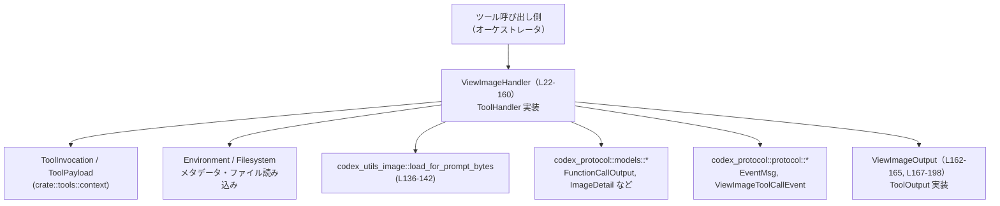
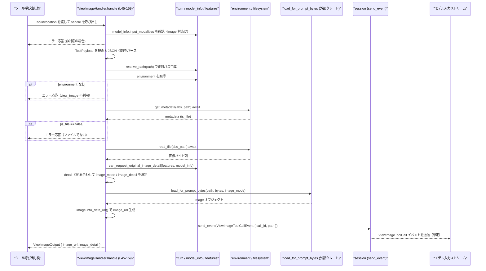

# core/src/tools/handlers/view_image.rs コード解説

## 0. ざっくり一言

`view_image` ツール呼び出しを処理し、ファイルシステム上の画像ファイルを読み込んで Data URL 形式の画像 URL を生成し、モデル入力用のレスポンスに変換するハンドラです（view_image.rs:L22, L45-159, L167-198）。

---

## 1. このモジュールの役割

### 1.1 概要

- このモジュールは **`view_image` ツール呼び出し**を処理するために存在し、  
  **ファイルシステムから画像を読み込み、必要に応じてリサイズまたはオリジナル画質でエンコードしてモデルに返す機能** を提供します（view_image.rs:L24-25, L45-159）。
- モデルが画像入力をサポートしているか、オリジナル画質を要求できるかといった **モデル能力に応じたガード** を行い、  
  適切にエラーメッセージやイベントを返します（view_image.rs:L45-55, L89-135）。

### 1.2 アーキテクチャ内での位置づけ

このモジュールは、ツール実行基盤の中で「`view_image` というツール名に対応するハンドラ」として動作し、  
`ToolInvocation` から渡されるコンテキストを使ってファイルシステム・モデル情報・セッションイベントと連携します。

主な依存関係:

- ツール基盤
  - `ToolHandler` / `ToolOutput` / `ToolInvocation` / `ToolPayload`（crate::tools::…）（view_image.rs:L13-18, L38-40, L167-198）
- エラー型
  - `FunctionCallError`（view_image.rs:L11）
- モデル側プロトコル
  - `FunctionCallOutput*`, `ResponseInputItem`, `ImageDetail`（view_image.rs:L1-5, L162-165, L176-191）
  - `EventMsg`, `ViewImageToolCallEvent`（view_image.rs:L19-20, L145-152）
  - `InputModality`（view_image.rs:L6）
- 画像処理
  - `load_for_prompt_bytes`, `PromptImageMode`（view_image.rs:L7-8, L129-143）
- オリジナル画像許可判定
  - `can_request_original_image_detail`（view_image.rs:L12, L125-128）

依存関係の概略図です。



### 1.3 設計上のポイント

コードから読み取れる設計上の特徴です。

- **プラガブルなツール設計**  
  - `ViewImageHandler` が `ToolHandler` トレイトを実装し、ツールレジストリから汎用的に扱える設計になっています（view_image.rs:L38-43）。
- **非同期 I/O を前提としたハンドラ**  
  - `handle` は `async fn` であり、ファイルメタデータ取得・ファイル読み込み・イベント送信を `await` しています（view_image.rs:L45, L96-105, L113-122, L145-153）。
- **モデル能力に基づくガード**  
  - モデルが画像入力をサポートしない場合は処理開始時点でエラーを返します（view_image.rs:L45-55）。
  - オリジナル画像の要求可否を `can_request_original_image_detail` で判定し、入力の `detail` と組み合わせて扱います（view_image.rs:L79-87, L125-135）。
- **入力検証と安全性**  
  - `detail` は `None` または `"original"` のみに限定し、それ以外の文字列はエラーにしています（view_image.rs:L79-87）。
  - `metadata.is_file` を確認して、ディレクトリなどに対して画像処理を行わないようにしています（view_image.rs:L107-112）。
- **エラーハンドリング方針**  
  - すべての失敗ケースは `FunctionCallError::RespondToModel` でラップし、ユーザー向けのメッセージを伴って `Err` を返します（view_image.rs:L52-55, L68-71, L90-93, L96-105, L107-112, L113-122, L136-142）。
  - パニックを起こすような `unwrap` や `expect` は使用していません（テストは例外）。
- **ログ・観測性**  
  - `ToolOutput` 実装に `log_preview` / `success_for_logging` があり、ログ出力やモニタリングで使うメタ情報を提供します（view_image.rs:L167-174）。

---

## 2. 主要な機能一覧

このモジュールが提供する主な機能です。

- `ViewImageHandler`: `view_image` ツール呼び出しを処理するハンドラの本体（view_image.rs:L22, L38-159）
- JSON 引数のパース: `ViewImageArgs` と `parse_arguments` による `path` / `detail` の抽出（view_image.rs:L27-31, L74）
- モデルの画像入力サポート検査: `InputModality::Image` を使ったチェック（view_image.rs:L45-55）
- ファイルシステムからの画像読み込み: `environment.get_filesystem().get_metadata` / `read_file` の呼び出し（view_image.rs:L96-105, L113-122）
- 画像のエンコードとリサイズ/オリジナル選択: `PromptImageMode` と `load_for_prompt_bytes` による処理（view_image.rs:L125-136, L129-143）
- モデルへのイベント送信: `EventMsg::ViewImageToolCall` を使ったツール呼び出しイベントの送信（view_image.rs:L145-152）
- `ViewImageOutput` と `ToolOutput` 実装:  
  - ログ用プレビュー文字列の提供（view_image.rs:L167-170）  
  - モデルに返す `ResponseInputItem::FunctionCallOutput` の生成（view_image.rs:L176-191）  
  - コードモードで利用する JSON 結果の生成（view_image.rs:L193-198）
- テスト: `code_mode_result` が期待どおりの JSON を返すことの検証（view_image.rs:L201-225）

---

## 3. 公開 API と詳細解説

### 3.1 型一覧（構造体・列挙体など）

このファイル内の主な型と位置の一覧です（コンポーネントインベントリー）。

| 名前 | 種別 | 公開範囲 | 役割 / 用途 | 定義位置 |
|------|------|----------|-------------|----------|
| `ViewImageHandler` | 構造体（フィールドなし） | `pub` | `view_image` ツールを処理するハンドラ本体。`ToolHandler` を実装している。 | `view_image.rs:L22`, 実装 `L38-159` |
| `ViewImageArgs` | 構造体 | `pub` ではない | JSON 引数 `{"path": ..., "detail": ...}` をパースするときに利用する内部用型。`Deserialize` を実装（derive）。 | `view_image.rs:L27-31` |
| `ViewImageDetail` | 列挙体 | `pub` ではない | `detail` 引数の値を型安全に表現する内部用 enum。現在は `Original` のみ。 | `view_image.rs:L33-36` |
| `ViewImageOutput` | 構造体 | `pub` | ツール実行結果（画像 URL とオプションの `ImageDetail`）を保持し、`ToolOutput` としてレスポンス変換を担う。 | `view_image.rs:L162-165`, 実装 `L167-198` |

### 3.2 関数詳細（7 件）

このファイルに現れる関数／メソッドは 7 件で、すべてここで解説します。

---

#### `ViewImageHandler::kind(&self) -> ToolKind`

**概要**

- このハンドラがどの種類のツールかを返します。  
- 常に `ToolKind::Function` を返し、関数型ツールとして扱われることを示します（view_image.rs:L41-43）。

**引数**

| 引数名 | 型 | 説明 |
|--------|----|------|
| `&self` | `&ViewImageHandler` | ハンドラ自身への参照。状態は持たない。 |

**戻り値**

- `ToolKind`: ツールの種別。ここでは `ToolKind::Function` 固定です。

**内部処理の流れ**

1. 何の条件分岐もなく `ToolKind::Function` を返します（view_image.rs:L41-43）。

**Examples（使用例）**

```rust
// ツールレジストリなどでハンドラ種別を確認する例
let handler = ViewImageHandler;                          // ハンドラを生成（フィールドなし）
assert_eq!(handler.kind(), ToolKind::Function);          // 常に Function 種別
```

**Errors / Panics**

- エラーやパニックは発生しません。

**Edge cases（エッジケース）**

- 状態を持たないため、特別なエッジケースはありません。

**使用上の注意点**

- ハンドラの種別判定以外の用途は想定されていません。

---

#### `ViewImageHandler::handle(&self, invocation: ToolInvocation) -> Result<ViewImageOutput, FunctionCallError>`

**概要**

- `view_image` ツール呼び出しのメイン処理です（view_image.rs:L45-159）。
- モデルの入力モダリティ・ツール引数・ファイルシステム・画像処理を組み合わせて  
  `ViewImageOutput` を生成し、エラー時には `FunctionCallError` を返します。

**引数**

| 引数名 | 型 | 説明 |
|--------|----|------|
| `&self` | `&ViewImageHandler` | ハンドラ自身。状態は持たないのでどの呼び出しでも同一の振る舞い。 |
| `invocation` | `ToolInvocation` | セッション・ターン・ペイロード・call_id などツール呼び出しコンテキストを含む。定義はこのチャンクには現れない。 |

**戻り値**

- `Result<ViewImageOutput, FunctionCallError>`  
  - `Ok(ViewImageOutput)` — 成功時。画像 URL とオプションの `ImageDetail` を含む（view_image.rs:L155-158）。  
  - `Err(FunctionCallError::RespondToModel(String))` — さまざまな検査・I/O・画像処理の失敗時（view_image.rs:L52-55, L68-71, L90-93, L96-105, L107-112, L113-122, L136-142）。

**内部処理の流れ（アルゴリズム）**

1. **モデルの画像入力サポート確認**（view_image.rs:L45-55）  
   - `invocation.turn.model_info.input_modalities` に `InputModality::Image` が含まれているか確認。  
   - 含まれていなければ `VIEW_IMAGE_UNSUPPORTED_MESSAGE` を含む `FunctionCallError::RespondToModel` で早期 `Err`。

2. **`ToolInvocation` の分解**（view_image.rs:L57-63）  
   - 構造体分解で `session`, `turn`, `payload`, `call_id` を取り出す。

3. **ペイロード種別の検証**（view_image.rs:L65-72）  
   - `ToolPayload::Function { arguments }` であれば `arguments` を取り出す。  
   - それ以外 (`_`) の場合は `"view_image handler received unsupported payload"` というエラーで `Err`。

4. **引数 JSON のパース**（view_image.rs:L74-87）  
   - `parse_arguments(&arguments)?` を呼び `ViewImageArgs { path, detail }` にデシリアライズ。  
   - `detail` の扱い:
     - `None` → `detail` なし（デフォルトのリサイズ挙動）。  
     - `"original"` → `Some(ViewImageDetail::Original)`。  
     - それ以外の文字列 → `"view_image.detail only supports \`original\`; ..."` というエラーメッセージで `Err`。

5. **パス解決と環境取得**（view_image.rs:L89-95）  
   - `turn.resolve_path(Some(args.path))` で絶対パスを生成。  
   - `turn.environment.as_ref()` が `None` なら `"view_image is unavailable in this session"` で `Err`。  
   - `Some(environment)` なら以降の FS 操作に使用。

6. **ファイルメタデータの取得と検証**（view_image.rs:L96-112）  
   - `environment.get_filesystem().get_metadata(&abs_path).await`。  
   - 失敗時は `"unable to locate image at`{}`: {error}`" 形式でエラー化。  
   - 成功後、`metadata.is_file` をチェックし、`false` なら `"image path`{}`is not a file"` で `Err`。

7. **ファイル読み込み**（view_image.rs:L113-123）  
   - `environment.get_filesystem().read_file(&abs_path).await`。  
   - 失敗時は `"unable to read image at`{}`: {error}`" で `Err`。  
   - 成功時、ファイルバイト列を `file_bytes` に保持し、`event_path` として `abs_path.to_path_buf()` を取得。

8. **オリジナル画像利用可否の判定**（view_image.rs:L125-135）  
   - `can_request_original_image_detail(turn.features.get(), &turn.model_info)` で  
     「このモデル／セッションでオリジナル画像を要求してよいか」を判定。  
   - `matches!(detail, Some(ViewImageDetail::Original))` と組み合わせて `use_original_detail` を決定。  
   - `image_mode`:
     - `use_original_detail == true` → `PromptImageMode::Original`  
     - それ以外 → `PromptImageMode::ResizeToFit`  
   - `image_detail`:
     - `use_original_detail` が `true` のときだけ `Some(ImageDetail::Original)`、それ以外では `None`。

9. **画像のロードと Data URL 生成**（view_image.rs:L136-143）  
   - `load_for_prompt_bytes(abs_path.as_path(), file_bytes, image_mode)` により画像を読み込み・リサイズ等。  
   - 失敗時は `"unable to process image at`{}`: {error}`" で `Err`。  
   - 成功時に `image.into_data_url()` で Data URL 文字列を `image_url` として取得。

10. **イベント送信**（view_image.rs:L145-153）  
    - `session.send_event(...)` に `EventMsg::ViewImageToolCall(ViewImageToolCallEvent { call_id, path: event_path })` を渡して通知。

11. **結果の返却**（view_image.rs:L155-158）  
    - `Ok(ViewImageOutput { image_url, image_detail })` を返す。

**Examples（使用例）**

ツールオーケストレータから `view_image` を実行するイメージです。  
`ToolInvocation` や `session` / `turn` の構築はこのチャンクには現れないため、擬似的な例になります。

```rust
// view_image ツールのハンドラ（通常はどこかのレジストリから取得される）
let handler = ViewImageHandler;

// 例示用の JSON 引数: パスのみ指定（detail 省略 → リサイズして使用）
let payload = ToolPayload::Function {
    arguments: r#"{"path": "images/sample.png"}"#.to_string(),
};

// ToolInvocation は実際にはツール基盤側で構築される
let invocation = ToolInvocation {
    session,                          // セッションコンテキスト（このチャンクには定義がない）
    turn,                             // 現在のターン情報（同上）
    payload,
    call_id: "call-123".to_string(),
    // 他のフィールドは ..Default::default() などで補完される想定
};

// 非同期コンテキストで実行
let output: ViewImageOutput = handler.handle(invocation).await?;

// モデルに返すレスポンス形式へ変換
let response_item = output.to_response_item("call-123", &ToolPayload::Function {
    arguments: "{}".to_string(),
});
```

**Errors / Panics**

すべてのエラーは `Err(FunctionCallError::RespondToModel(String))` として返ります。  
主なエラー条件と発生箇所:

- モデルが画像入力をサポートしていない（`InputModality::Image` を含まない）  
  → `"view_image is not allowed because you do not support image inputs"`（view_image.rs:L45-55）
- ペイロードが `ToolPayload::Function` でない  
  → `"view_image handler received unsupported payload"`（view_image.rs:L65-71）
- `detail` が `"original"` 以外の文字列  
  → `"view_image.detail only supports \`original\`; ..."`（view_image.rs:L79-87）
- `turn.environment` が `None`  
  → `"view_image is unavailable in this session"`（view_image.rs:L89-93）
- メタデータ取得失敗  
  → `"unable to locate image at`{}`: {error}`"`（view_image.rs:L96-105）
- `metadata.is_file == false`  
  → `"image path`{}`is not a file"`（view_image.rs:L107-112）
- ファイル読み込み失敗  
  → `"unable to read image at`{}`: {error}`"`（view_image.rs:L113-122）
- 画像処理（`load_for_prompt_bytes`）失敗  
  → `"unable to process image at`{}`: {error}`"`（view_image.rs:L136-142）

非テストコードには `panic!` を発生させるパスはありません。

**Edge cases（エッジケース）**

- `detail` が `null` または指定されない  
  - `ViewImageArgs.detail: None` となり、`detail` は `None`。  
  - `use_original_detail` は `false` になり、`PromptImageMode::ResizeToFit` で画像が処理され、`image_detail` は `None`（view_image.rs:L79-81, L125-135）。
- `detail` に未知の文字列（例: `"high"`）  
  - マッチ式の `Some(detail)` ケースに入り、エラーで終了（view_image.rs:L79-87）。
- ディレクトリパスが渡された場合  
  - `get_metadata` は成功し得るが、`metadata.is_file == false` によりエラーを返します（view_image.rs:L107-112）。
- 画像サイズが非常に大きい場合  
  - メモリ・処理時間の増大があり得ますが、具体的な挙動は `load_for_prompt_bytes` の実装に依存し、このチャンクには現れません。

**使用上の注意点**

- `ToolInvocation.payload` は必ず `ToolPayload::Function { arguments }` である必要があります。  
  それ以外を渡すと即エラーになります（view_image.rs:L65-72）。
- `path` はセッションのルートなどに対して `turn.resolve_path` される前提です。  
  パスの正当性やサンドボックス制御は `resolve_path` / filesystem 側の責務であり、このチャンクには具体的な挙動が現れません。
- モデルが画像入力非対応の場合、このハンドラは常にエラーを返します。  
  呼び出し側でモデル機能を考慮したルーティングを行うのが望ましいです。
- 非同期関数のため、`tokio` などのランタイム上で `.await` する必要があります。

---

#### `ViewImageOutput::log_preview(&self) -> String`

**概要**

- ログやダッシュボード用の簡易プレビュー文字列として、`image_url` のクローンを返します（view_image.rs:L168-170）。

**引数**

| 引数名 | 型 | 説明 |
|--------|----|------|
| `&self` | `&ViewImageOutput` | 出力オブジェクト。 |

**戻り値**

- `String`: `self.image_url` のクローン。  

**内部処理の流れ**

1. `self.image_url.clone()` を返すだけの単純な処理です（view_image.rs:L169）。

**Examples（使用例）**

```rust
let output = ViewImageOutput {
    image_url: "data:image/png;base64,...".to_string(),
    image_detail: None,
};

let preview = output.log_preview();                      // 画像 URL をそのまま返す
// ログなどに利用
```

**Errors / Panics**

- 発生しません。

**Edge cases / 使用上の注意点**

- 画像 URL 自体が長い場合、ログが大きくなる可能性があります。  
  ログシステム側で適宜トリミングするか、本メソッドの利用方針を検討する必要があります（このファイルでは制御していません）。

---

#### `ViewImageOutput::success_for_logging(&self) -> bool`

**概要**

- ログ用に「このツール呼び出しが成功したか」を表すフラグを返します（view_image.rs:L172-174）。
- 常に `true` を返しており、ここでは「`ViewImageOutput` が生成されている = 成功」という前提です。

**引数**

| 引数名 | 型 | 説明 |
|--------|----|------|
| `&self` | `&ViewImageOutput` | 出力オブジェクト。 |

**戻り値**

- `bool`: 常に `true`。

**内部処理の流れ**

1. `true` を返すだけです（view_image.rs:L173）。

**Examples（使用例）**

```rust
let output = /* handle() 成功後の ViewImageOutput */;
assert!(output.success_for_logging());                   // この型がある時点で成功とみなす
```

**Errors / Panics / Edge cases / 注意点**

- なし。  
- エラー時には `ViewImageOutput` が生成されず、このメソッドが呼ばれない設計を前提としていると考えられます（詳細はこのチャンクには現れません）。

---

#### `ViewImageOutput::to_response_item(&self, call_id: &str, _payload: &ToolPayload) -> ResponseInputItem`

**概要**

- ツール呼び出しの結果を、モデルに渡す `ResponseInputItem::FunctionCallOutput` 形式に変換します（view_image.rs:L176-191）。
- `image_url` と `image_detail` を `FunctionCallOutputContentItem::InputImage` としてラップします。

**引数**

| 引数名 | 型 | 説明 |
|--------|----|------|
| `&self` | `&ViewImageOutput` | 画像 URL と `ImageDetail` を持つ出力。 |
| `call_id` | `&str` | 元のツールコール ID。レスポンスと対応付けるために使用。 |
| `_payload` | `&ToolPayload` | 元のペイロード。ここでは使われておらず、将来拡張のための引数とみられます。 |

**戻り値**

- `ResponseInputItem`  
  - `ResponseInputItem::FunctionCallOutput { call_id: String, output: FunctionCallOutputPayload }` を生成します（view_image.rs:L187-190）。  
  - `output.body` は `FunctionCallOutputBody::ContentItems(vec![InputImage { image_url, detail }])`（view_image.rs:L176-181）。  
  - `output.success` は `Some(true)` に設定されています（view_image.rs:L182-185）。

**内部処理の流れ（アルゴリズム）**

1. `FunctionCallOutputBody::ContentItems` を生成し、その中に `FunctionCallOutputContentItem::InputImage` を 1 要素として格納（view_image.rs:L176-181）。
2. `FunctionCallOutputPayload { body, success: Some(true) }` を生成（view_image.rs:L182-185）。
3. `ResponseInputItem::FunctionCallOutput { call_id: call_id.to_string(), output }` を返す（view_image.rs:L187-190）。

**Examples（使用例）**

```rust
let output = ViewImageOutput {
    image_url: "data:image/png;base64,AAA".to_string(),
    image_detail: Some(ImageDetail::Original),
};

let call_id = "call-123";
let response_item = output.to_response_item(call_id, &ToolPayload::Function {
    arguments: "{}".to_string(),
});

// ここで response_item は FunctionCallOutput としてモデル側に渡される想定
```

**Errors / Panics**

- 発生しません。`Result` を返さず、単に構造体を生成するだけです。

**Edge cases（エッジケース）**

- `image_detail` が `None` の場合  
  - `detail: self.image_detail` として `None` がそのまま渡されます（view_image.rs:L180-181）。  
- `call_id` が空文字列でも、`call_id.to_string()` がそのまま使われます。特別な検証は行っていません。

**使用上の注意点**

- 呼び出し側は `call_id` と元のツールコールとの対応を適切に管理する必要があります。  
- `success` フラグは `Some(true)` 固定であり、ツールエラー時のレスポンス形式はこのメソッドでは扱っていません  
  （エラー時は `ViewImageOutput` まで到達しない前提です）。

---

#### `ViewImageOutput::code_mode_result(&self, _payload: &ToolPayload) -> serde_json::Value`

**概要**

- 「コードモード」用の結果として、`image_url` と `image_detail` を含む JSON (`serde_json::Value`) を返します（view_image.rs:L193-198）。
- テストではこの出力が検証されています（view_image.rs:L207-225）。

**引数**

| 引数名 | 型 | 説明 |
|--------|----|------|
| `&self` | `&ViewImageOutput` | 出力オブジェクト。 |
| `_payload` | `&ToolPayload` | 未使用だが、インターフェース上受け取る。 |

**戻り値**

- `serde_json::Value`  
  - 具体的には `json!({ "image_url": self.image_url, "detail": self.image_detail })`（view_image.rs:L194-197）。

**内部処理の流れ**

1. `serde_json::json!` マクロでオブジェクトを生成し、そのまま返却します（view_image.rs:L193-198）。

**Examples（使用例）**

```rust
let output = ViewImageOutput {
    image_url: "data:image/png;base64,AAA".to_string(),
    image_detail: None,
};

let json_value = output.code_mode_result(&ToolPayload::Function {
    arguments: "{}".to_string(),
});

// 生成される JSON は以下のような形:
// {
//   "image_url": "data:image/png;base64,AAA",
//   "detail": null
// }
```

**Errors / Panics**

- 発生しません。

**Edge cases / 使用上の注意点**

- `image_detail` が `None` の場合は JSON 上で `null` になります（テストで検証済み、view_image.rs:L218-223）。
- payload は未使用であるため、将来的に仕様が変わる場合に備えてインターフェース互換性を考慮する必要があります。

---

#### テスト: `code_mode_result_returns_image_url_object()`

**シグネチャ**

```rust
#[test]
fn code_mode_result_returns_image_url_object() { ... }
```

**概要**

- `ViewImageOutput::code_mode_result` が期待通りの JSON オブジェクトを返すことを検証するユニットテストです（view_image.rs:L207-225）。

**テスト内容の要約**

1. `image_url` に `"data:image/png;base64,AAA"`、`image_detail` に `None` を持つ `ViewImageOutput` を作成（view_image.rs:L209-212）。
2. `code_mode_result` を呼び出し、その結果を `result` に格納（view_image.rs:L214-216）。
3. `serde_json::json!` で期待されるオブジェクトを構築し、`assert_eq!` で比較（view_image.rs:L218-224）。

**確認している契約**

- `code_mode_result` の JSON キーは `"image_url"` と `"detail"` であること。
- `image_detail: None` が JSON 上で `null` として表現されること。

**Errors / Panics**

- 期待値との不一致がある場合、テストはパニックします（`assert_eq!` による）。

---

### 3.3 その他の関数

上記以外に自由関数は存在せず、残りはトレイト実装内メソッドとテストのみです。

---

## 4. データフロー

ここでは `ViewImageHandler::handle` を中心に、典型的な処理フローを示します。

### 4.1 処理の要点

- 入力: `ToolInvocation` に含まれる JSON 引数 (`path`, `detail`)、モデル情報 (`model_info`)、セッション／ターン（view_image.rs:L57-63, L74-79）。
- 中間処理:
  - モデル能力チェック（画像入力、オリジナル画像許可）  
  - ファイルメタデータ取得・ファイル読み込み  
  - 画像処理（リサイズ or オリジナル）と Data URL 化  
  - イベント送信（ViewImageToolCallEvent）
- 出力: `ViewImageOutput` → `ToolOutput` 実装を通じて `ResponseInputItem::FunctionCallOutput` へ変換。

### 4.2 シーケンス図



---

### 4.3 セキュリティ・バグ上の注意点（観測可能な範囲）

このチャンクから読み取れる範囲で、セキュリティやバグに関するポイントです。

- **パス処理・サンドボックス**  
  - `turn.resolve_path(Some(args.path))` によってパス解決を行っていますが、その具体的な挙動（例: ディレクトリトラバーサル防止）はこのチャンクには現れません（view_image.rs:L89）。  
  - 安全性は `resolve_path` と filesystem 実装に依存します。
- **エラー情報の露出**  
  - ファイル I/O と画像処理のエラーメッセージには、`abs_path.display()` と `error` の文字列表現が含まれます（view_image.rs:L96-105, L113-122, L136-142）。  
  - これにより内部パスの一部がモデルに露出する可能性がありますが、これが許容かどうかはシステム全体のポリシー次第で、このチャンクからは判断できません。
- **画像サイズ・DoS の可能性**  
  - 非常に大きな画像ファイルを読み込むとメモリや CPU を消費します。  
  - サイズ制限やタイムアウトはこのチャンクには現れず、`read_file` や `load_for_prompt_bytes` 側に委ねられています。

---

## 5. 使い方（How to Use）

### 5.1 基本的な使用方法

ツール実行基盤から `view_image` ツールを利用する典型的なフローです。

```rust
use crate::tools::handlers::view_image::ViewImageHandler;
use crate::tools::context::{ToolInvocation, ToolPayload};

// 1. ハンドラの用意
let handler = ViewImageHandler;                           // フィールドを持たないのでそのまま値を作れる

// 2. ツールペイロードの構築（JSON 引数）
let payload = ToolPayload::Function {
    arguments: r#"{
        "path": "images/sample.png",                      // セッションから見える相対パス
        "detail": "original"                              // 省略可。"original" のみサポート
    }"#.to_string(),
};

// 3. ToolInvocation の構築
let invocation = ToolInvocation {
    session,                                              // セッション (このチャンクには定義がない)
    turn,                                                 // 現在のターン情報
    payload,
    call_id: "call-1".to_string(),
    // 他のフィールドも存在する可能性があるが、このチャンクには現れない
};

// 4. ハンドラの実行（非同期）
let output = handler.handle(invocation).await?;           // Result<ViewImageOutput, FunctionCallError>

// 5. モデルに渡すレスポンスへの変換
let response_item = output.to_response_item("call-1", &ToolPayload::Function {
    arguments: "{}".to_string(),
});

// response_item を上位のプロトコル層からモデルに送る
```

### 5.2 よくある使用パターン

1. **デフォルト（リサイズ）挙動を使う**

```rust
let payload = ToolPayload::Function {
    // detail を指定しない → JSON 上で欠落 or null
    arguments: r#"{"path": "images/sample.png"}"#.to_string(),
};

// handle 内で detail: None → ResizeToFit（view_image.rs:L79-81, L129-133）
```

1. **オリジナル画像を明示的に要求する**

```rust
let payload = ToolPayload::Function {
    arguments: r#"{
        "path": "images/highres.png",
        "detail": "original"                              // オリジナルを要求
    }"#.to_string(),
};

// can_request_original_image_detail が true の場合のみ
// PromptImageMode::Original / ImageDetail::Original が使われる（view_image.rs:L125-135）
```

1. **コードモードで結果 JSON を利用する**

```rust
let json_result = output.code_mode_result(&ToolPayload::Function {
    arguments: "{}".to_string(),
});

// "image_url" と "detail" キーを持つ serde_json::Value として使える
```

### 5.3 よくある間違い

```rust
// 間違い例 1: モデルが画像入力非対応なのに view_image を呼ぶ
// → handle の先頭でエラー: VIEW_IMAGE_UNSUPPORTED_MESSAGE（view_image.rs:L45-55）

let output = handler.handle(invocation_without_image_modality).await?;
// ↑ 実際には Err(FunctionCallError::RespondToModel(...)) になる

// 正しい例: model_info.input_modalities に InputModality::Image が含まれるモデルでのみ呼び出す


// 間違い例 2: detail に未サポートの文字列を渡す
let payload = ToolPayload::Function {
    arguments: r#"{"path": "img.png", "detail": "high"}"#.to_string(),
};
// → "view_image.detail only supports `original`..." で Err（view_image.rs:L79-87）

// 正しい例:
let payload = ToolPayload::Function {
    arguments: r#"{"path": "img.png", "detail": "original"}"#.to_string(),
};


// 間違い例 3: ToolPayload のバリアントを間違える
let payload = ToolPayload::Streaming { /* 仮の別バリアント */ };
// handle から "view_image handler received unsupported payload" エラー（view_image.rs:L65-71）

// 正しい例:
let payload = ToolPayload::Function { arguments: "{...}".to_string() };
```

### 5.4 使用上の注意点（まとめ）

- **前提条件**
  - モデルが `InputModality::Image` をサポートしている必要があります（view_image.rs:L45-55）。
  - `ToolPayload` は `Function` バリアントであり、`arguments` に JSON 文字列が入っている必要があります（view_image.rs:L65-72, L74）。
  - `path` で指定するファイルは、`turn.resolve_path` からアクセス可能な範囲でなければなりません。

- **禁止事項 / 推奨されない使い方**
  - `detail` に `"original"` 以外の文字列を渡すこと（エラーになります）。  
  - ディレクトリや非ファイルパスを `path` に渡すこと（`metadata.is_file` チェックでエラー、view_image.rs:L107-112）。

- **エラーとモデルへの影響**
  - すべてのエラーは `FunctionCallError::RespondToModel` としてモデル側に返される想定です。  
  - エラーメッセージにファイルパスが含まれるため、どの程度の情報をモデルに開示してよいか、運用ポリシーに注意が必要です。

- **並行性**
  - `ViewImageHandler` はフィールドを持たず、`handle` は `&self` を取るだけなので、  
    ハンドラインスタンスは複数タスクから安全に共有される設計になっています（Rust の所有権・借用ルールによりコンパイル時に保証）。  
  - 実際のスレッド安全性は `session` や `environment` の実装に依存し、このチャンクには現れません。

- **性能・スケーラビリティ**
  - 各呼び出しで画像ファイルをフル読み込みし、Data URL（base64）に変換するため、  
    大きな画像や高頻度な呼び出しがあるとメモリ／CPU への負荷が大きくなります。  
  - 必要に応じて上位レイヤーで呼び出し頻度制御や画像サイズの制限を設ける必要があります。

---

## 6. 変更の仕方（How to Modify）

### 6.1 新しい機能を追加する場合

例として `detail` に新しいモード（例: `"thumbnail"`）を追加する場合のステップです。

1. **`ViewImageDetail` の拡張**（view_image.rs:L33-36）
   - 新しいバリアントを追加します。例: `Thumbnail`。
2. **`detail` のパースロジック変更**（view_image.rs:L79-87）
   - マッチ式に `"thumbnail"` を受け付ける分岐を追加し、`Some(ViewImageDetail::Thumbnail)` を返すようにします。
3. **`use_original_detail` / `image_mode` ロジックの調整**（view_image.rs:L125-133）
   - 新バリアントに対して適切な `PromptImageMode` を選ぶ処理を追加します。  
   - 具体的な対応は `PromptImageMode` と使用側仕様に依存し、このチャンクには現れません。
4. **`image_detail` の設定**（view_image.rs:L134-135）
   - 必要に応じて `ImageDetail` に対応する新しい値を追加し、ここで設定します。
5. **テストの追加**
   - 新モードに対して `code_mode_result` の JSON などが期待通りになることを検証するテストを追加します。

### 6.2 既存の機能を変更する場合

- **影響範囲の確認方法**
  - `ViewImageHandler::handle`（view_image.rs:L45-159）を変更する場合は、  
    - `ViewImageOutput` のフィールド（view_image.rs:L162-165）  
    - `ToolOutput` 実装（view_image.rs:L167-198）  
    と整合するかを確認する必要があります。
- **契約（前提条件・返り値の意味）**
  - `handle` が `Err` を返す条件やエラーメッセージは、上位レイヤーやユーザーへのインターフェースとなるため、  
    変更する際はクライアント側コードに影響しないかを慎重に確認する必要があります。
  - `code_mode_result` の JSON フォーマット（キー名 `"image_url"` / `"detail"`）はテストで固定されています（view_image.rs:L218-223）。
- **テストの再確認**
  - `code_mode_result_returns_image_url_object` テスト（view_image.rs:L207-225）は、  
    JSON の形が変わると失敗します。仕様変更に合わせて期待値を更新する必要があります。
- **ログ・観測性**
  - `log_preview` や `success_for_logging` の挙動を変える場合、ログ集約・ダッシュボードなどにも影響し得ます。  
    変更前に利用箇所を検索し、期待されるフォーマットとの整合性を確認する必要があります。

---

## 7. 関連ファイル

このモジュールと密接に関係すると思われるモジュール・型です。  
ファイルパスそのものはこのチャンクには現れないため、モジュールパスで記載します。

| モジュール / 型 | 想定される役割 / 関係 | 備考 |
|----------------|-----------------------|------|
| `crate::tools::registry::ToolHandler` / `ToolKind` | ツールハンドラの共通インターフェースと種別。`ViewImageHandler` がこれを実装して登録される（view_image.rs:L17-18, L38-43）。 | 実装ファイルパスはこのチャンクには現れません。 |
| `crate::tools::context::{ToolInvocation, ToolOutput, ToolPayload}` | ツール呼び出しコンテキストと、ツール出力をモデルレスポンスに変換するためのトレイト（view_image.rs:L13-15, L167-198）。 | `ToolInvocation` のフィールド構成・`ToolPayload` の他バリアントはこのチャンクには現れません。 |
| `crate::function_tool::FunctionCallError` | ツール実行時のエラーを表す型。`RespondToModel(String)` バリアントが使用されている（view_image.rs:L11, L52-55 ほか）。 | 他のバリアントや詳細な仕様はこのチャンクには現れません。 |
| `crate::original_image_detail::can_request_original_image_detail` | モデル・セッション設定に基づき「オリジナル画像 detail を要求してよいか」を判定する関数（view_image.rs:L12, L125-128）。 | 具体的な判定ロジックはこのチャンクには現れません。 |
| `codex_protocol::models::{FunctionCallOutputBody, FunctionCallOutputContentItem, FunctionCallOutputPayload, ImageDetail, ResponseInputItem}` | モデルとの通信プロトコル上のレスポンス形式や画像詳細指定を表現する型（view_image.rs:L1-5, L176-191）。 | プロトコルの全体像はこのチャンクには現れません。 |
| `codex_protocol::openai_models::InputModality` | モデルがサポートする入力モダリティ（テキスト / 画像など）を表す型。`Image` が使用されている（view_image.rs:L6, L45-55）。 | 他のモダリティ種別はこのチャンクには現れません。 |
| `codex_utils_image::{PromptImageMode, load_for_prompt_bytes}` | 画像の読み込みとリサイズ/オリジナル処理を担うユーティリティ（view_image.rs:L7-8, L129-143）。 | 実際の画像処理アルゴリズムはこのチャンクには現れません。 |
| `codex_protocol::protocol::{EventMsg, ViewImageToolCallEvent}` | セッション側にツール呼び出しイベントを通知するための型（view_image.rs:L19-20, L145-152）。 | どのようにログや UI に反映されるかはこのチャンクには現れません。 |

このように、`view_image` ハンドラはツール基盤・モデルプロトコル・画像処理ユーティリティの結合点として設計されており、  
コードから読み取れる契約とエラーハンドリングを理解することで、安全に拡張・利用しやすくなっています。
