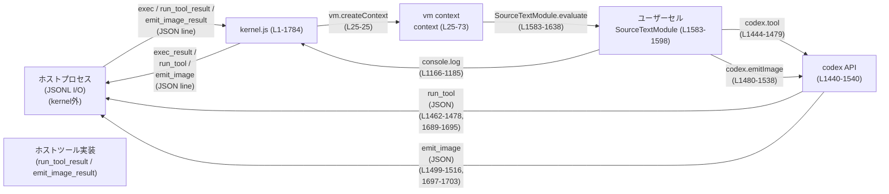
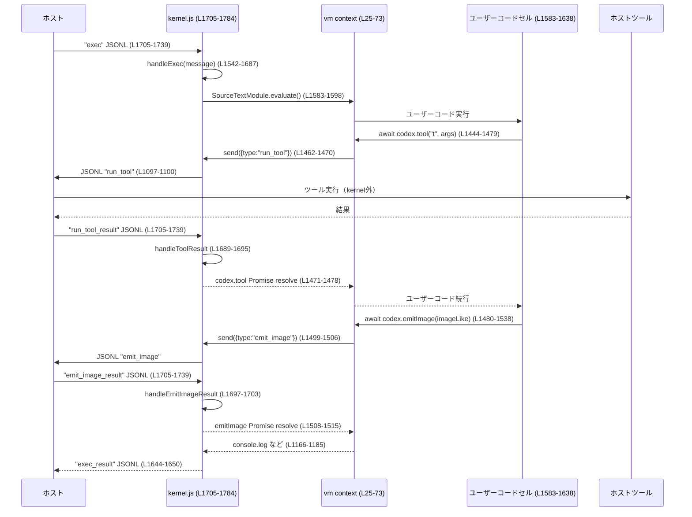

# core/src/tools/js_repl/kernel.js

## 0. ざっくり一言

- Node.js プロセス内で動作する JavaScript REPL カーネルで、JSON Lines でホストと通信しつつ、`vm` コンテキスト内でユーザーコードを ES モジュールとして実行し、セル間で変数を引き継ぐ仕組みを提供するファイルです（`kernel.js:L1-3,L25-27,L1542-1650`）。
- REPL からは `codex.tool` と `codex.emitImage` を通じてホスト側ツール実行・画像送出が可能で、非同期エラーや未処理の Promise 拒否はカーネルを安全に終了させるよう設計されています（`kernel.js:L1440-1540,L1708-1714`）。

---

## 1. このモジュールの役割

### 1.1 概要

このモジュールは **js_repl の実行カーネル**として、次の問題を解決します。

- ユーザーコードを隔離された `vm` コンテキストで安全に実行しつつ、セルごとに **ESM としてコンパイルし、セル間でトップレベル変数を持続させる**（`kernel.js:L79-88,L959-1047,L1542-1642`）。
- stdin/stdout 経由の JSON Lines プロトコルでホストと通信し、`exec` リクエストやツール実行結果などを扱う（`kernel.js:L1-3,L1705-1739`）。
- REPL コードからホストツール・画像送出 API を提供する `codex` オブジェクトをエクスポートし、その非同期処理・エラーを追跡する（`kernel.js:L1440-1540,L1581-1638`）。

### 1.2 アーキテクチャ内での位置づけ

高レベルのコンポーネント関係は次のようになっています。



- カーネルは単体の Node.js プロセスとして起動され、ホストとは JSON Lines ベースの IPC（プロセス間通信）を行います（`kernel.js:L1-3,L1705-1784`）。
- ユーザーコードは `vm.createContext` で生成したコンテキスト `context` 内で `SourceTextModule` として評価されます（`kernel.js:L25-28,L1583-1598`）。
- `codex` オブジェクトが `context.codex` としてユーザーコードから利用でき、ツール呼び出し・画像送信のための橋渡しをします（`kernel.js:L1440-1540,L1578-1579`）。

### 1.3 設計上のポイント

主な設計上の特徴を列挙します。

- **セル構造と状態引き継ぎ**
  - 各 `exec` は新しい ES モジュール「セル」としてコンパイルされ、前セルのエクスポートを `@prev` という合成モジュールからインポートして再宣言することで、REPL のような持続状態を実現しています（`kernel.js:L79-88,L1006-1018,L1600-1617`）。
  - 失敗したセルでも、**初期化が完了しているバインディングだけ**を次セルに引き継ぐための「コミット済みバインディング」追跡ロジックがあります（`kernel.js:L570-575,L578-581,L595-624,L701-848,L850-957,L1049-1095,L1559-1567`）。

- **モジュール解決・読み込み**
  - `resolveSpecifier` とその周辺ユーティリティで、Node 組み込み・パッケージ・ローカルファイルを解決します（`kernel.js:L218-287,L289-397`）。
  - 一部の危険な Node 組み込みモジュール（`process` や `child_process` など）はインポートを拒否します（`kernel.js:L98-109,L115-122,L371-379`）。
  - ユーザーのローカルファイル import は `.js` / `.mjs` のみ、ディレクトリ import は禁止されています（`kernel.js:L317-368`）。

- **非同期・エラー処理**
  - `AsyncLocalStorage` により、現在実行中の `exec` コンテキストを `codex.tool` / `codex.emitImage` から参照できるようにしています（`kernel.js:L6,L130,L1444-1450,L1481-1489,L1578-1582`）。
  - `uncaughtException` と `unhandledRejection` を捕捉し、**致命的エラーとしてカーネルプロセスを終了**させます（`kernel.js:L1708-1714,L1135-1156`）。
  - `codex.emitImage` は「ユーザーが `then/catch/finally` を呼んだかどうか」を追跡し、**観測されなかった Promise 拒否**のみを「未処理バックグラウンドエラー」として `handleExec` 側で検出します（`kernel.js:L1480-1538,L1581-1582,L1625-1635`）。

- **I/O とログ**
  - stdin のバイトストリームから LF 区切りでフレームを切り出し、1 フレームを 1 JSON メッセージとして処理します（`kernel.js:L1767-1784,L1741-1765`）。
  - `withCapturedConsole` により `console.log` などをフックして文字列に整形し、`exec_result.output` としてホストに送ります（`kernel.js:L1158-1163,L1166-1190,L1644-1650`）。

---

## 2. 主要な機能一覧

このモジュールが提供する主な機能は次のとおりです。

- REPL セル管理:
  - 各 `exec` リクエストを ES モジュールとしてコンパイル・実行し、セル間でトップレベルバインディングを引き継ぎ（`buildModuleSource`, `handleExec`）。  
    根拠: `kernel.js:L79-88,L959-1047,L1542-1687`
- モジュール解決・ロード:
  - `import("...")` の解決（Node 組み込み・npm パッケージ・ローカル `.js/.mjs` ファイル）と、`SourceTextModule` / `SyntheticModule` を用いた読み込み（`resolveSpecifier`, `loadLinkedFileModule`, `loadLinkedNativeModule`, `importResolved`）。  
    根拠: `kernel.js:L218-287,L289-397,L399-486`
- `codex.tool` によるホストツール呼び出し:
  - ユーザーコードから JSON メッセージでホストにツール実行を依頼し、対応する `run_tool_result` を待ち受ける（`kernel.js:L1440-1479,L1689-1695`）。
- `codex.emitImage` による画像送出:
  - 多様な入力形式（バイト列・data URL・MCP 結果など）を正規化して 1 枚の data URL に変換し、ホストへ `emit_image` メッセージとして送信（`kernel.js:L1193-1438,L1480-1538,L1697-1703`）。
- エラーとプロセスライフサイクル管理:
  - 実行中 exec の ID 管理、致命的エラー時の `exec_result` 送出とプロセス終了、未処理バックグラウンドエラー検出（`kernel.js:L95-96,L1097-1125,L1135-1156,L1542-1687,L1708-1714`）。
- JSONL 入力のフレーミングとディスパッチ:
  - stdin からのバイトを行単位でフレーム化し、`exec` / `run_tool_result` / `emit_image_result` 各メッセージに応じて処理を分岐（`kernel.js:L1705-1739,L1741-1765,L1767-1784`）。

---

## 3. 公開 API と詳細解説

### 3.1 型一覧（構造体・列挙体など）

| 名前 | 種別 | 役割 / 用途 | 根拠 |
|------|------|-------------|------|
| `Binding` | typedef (`{ name: string, kind: "const" \| "let" \| "var" \| "function" \| "class" }`) | セル間で引き継ぐトップレベルバインディングのメタデータ。`previousBindings` などで使用。 | `kernel.js:L75-77,L86-87,L561-562,L1068-1094,L1551-1556` |
| `context` | `vm.Context` | ユーザーコードを実行する `vm` コンテキスト。Node/Web の代表的なグローバルをセットする。 | `kernel.js:L23-73` |
| `codex` | オブジェクト | REPL から利用できる API。`cwd`/`homeDir`/`tmpDir` の情報と、`tool` / `emitImage` メソッドを持つ。 | `kernel.js:L1440-1540,L1578-1579` |
| `execState` | オブジェクト（形: `{ id: string, pendingBackgroundTasks: Set<PromiseLike<...>> }`） | 現在の `exec` 呼び出しに紐づく状態。`AsyncLocalStorage` に保存され、`codex` から参照される。 | `kernel.js:L130,L1545-1548,L1127-1132,L1444-1450,L1481-1488` |
| `pendingTool` | `Map<string, (msg) => void>` | `codex.tool` に対応するツール応答コールバックを保持する。 | `kernel.js:L124-129,L1462-1478,L1689-1695` |
| `pendingEmitImage` | `Map<string, (msg) => void>` | `codex.emitImage` に対応する応答コールバックを保持する。 | `kernel.js:L126-129,L1508-1516,L1697-1703` |

> Node モジュールとしての明示的な `module.exports` / `exports.xxx` はこのファイル内にはありません。プロセスとして起動される前提のカーネルです（`kernel.js:L1-1784`）。

### 3.2 関数詳細（重要な 7 件）

#### 1. `async handleExec(message)`

```js
async function handleExec(message) { ... }
```

**概要**

- ホストからの `exec` メッセージ 1 件を処理し、ユーザーコードを 1 セルとしてコンパイル・実行し、その結果を `exec_result` で返すメインエントリです（`kernel.js:L1542-1687`）。
- セルごとのバインディングを更新し、失敗時でもコミット済みバインディングを適切に引き継ぎます。

**引数**

| 引数名 | 型 | 説明 |
|--------|----|------|
| `message` | `any`（少なくとも `{ id: string, code?: string }` を想定） | ホストから受信した `exec` リクエスト。`message.id` が実行 ID として利用されます。 |

根拠: `kernel.js:L1542-1557,L1569-1576`.

**戻り値**

- `Promise<void>` を返します。完了時には `send({ type: "exec_result", ... })` により stdout に結果が送られます（`kernel.js:L1644-1650,L1675-1681`）。

**内部処理の流れ**

1. **初期化**
   - ローカルファイルモジュールのキャッシュをクリアし（`clearLocalFileModuleCaches()`）、`activeExecId` を設定（`kernel.js:L1543-1544,L95`）。
   - `execState` を作成し、`pendingBackgroundTasks` 用の `Set` を初期化（`kernel.js:L1545-1548`）。
   - `currentBindings` / `nextBindings` / `priorBindings` などの状態変数を初期化（`kernel.js:L1550-1557`）。
   - コミット済みバインディング名を記録する `committedCurrentBindingNames` と、それを更新する `markCommittedBindings` / `markPreludeCompleted` を定義（`kernel.js:L1559-1567`）。

2. **ソース構築とコンテキスト準備**
   - `message.code` を文字列に変換（非文字列なら空文字列）し、`buildModuleSource` でプレリュード付与・計測済みソースへ変換（`kernel.js:L1569-1575,L959-1047`）。
   - `context.codex` と `context.tmpDir` を設定し、ユーザーコードから `codex` を利用可能にする（`kernel.js:L1578-1579`）。

3. **vm コンテキストでの実行**
   - `execContextStorage.run(execState, ...)` で AsyncLocalStorage に execState を設定した上で、`withCapturedConsole(context, ...)` にユーザーコード評価を渡す（`kernel.js:L1581-1582`）。
   - 新しい `SourceTextModule` を作成し（`source` と一意な `cellIdentifier` を使用）、`initializeImportMeta` で `import.meta` に内部ヘルパを注入（`kernel.js:L1583-1597`）。
   - `module.link` では、`@prev` だけを特別扱いし、それ以外のトップレベル静的 import はエラーにします（`kernel.js:L1600-1622`）。
   - `module.evaluate()` でモジュールを評価し、その後 `pendingBackgroundTasks`（主に `codex.emitImage` 起点）を `Promise.all` で待機し、**未観測エラー**があれば throw します（`kernel.js:L1625-1635`）。
   - 捕捉した `logs` を改行結合して `output` とします（`kernel.js:L1582,L1637`）。

4. **成功時の状態更新と応答**
   - `previousModule` / `previousBindings` を更新し（`kernel.js:L1641-1642`）、`send` で `exec_result`（`ok: true`）を返します（`kernel.js:L1644-1650`）。

5. **失敗時のコミット処理と応答**
   - 例外発生時には `collectCommittedBindings` を使って prior/current バインディングからコミット済み集合を計算（`kernel.js:L1651-1658,L1068-1095`）。
   - 一定条件（リンク済みかつコミットあり、またはプレリュード完了後に prior が存在）を満たす場合、`previousModule`/`previousBindings` を失敗セルに更新し、バインディングを進めます（`kernel.js:L1659-1674`）。
   - `exec_result`（`ok: false`）を送信（`kernel.js:L1675-1681`）。

6. **後処理**
   - finally 節で `activeExecId` をクリア（`kernel.js:L1682-1686`）。

**Examples（使用例・ホスト側）**

ホストプロセスからの典型的な呼び出しイメージです（ホスト側のコード例であり、このファイル内には存在しません）。

```js
// 子プロセスとして kernel.js を起動した前提
child.stdin.write(JSON.stringify({
  type: "exec",
  id: "exec-1",
  code: 'console.log("hello"); const x = 1; x;',
}) + "\n");

// stdout からは、以下のような JSONL が返る想定
// {"type":"exec_result","id":"exec-1","ok":true,"output":"hello","error":null}
```

**Errors**

- `buildModuleSource` やモジュールの `link` / `evaluate` 中の例外は catch され、`exec_result.ok=false` として返されます（`kernel.js:L1651-1681`）。
- `codex.emitImage` などのバックグラウンドタスクが未観測の拒否で失敗した場合、`firstUnhandledBackgroundError.error` が再 throw されます（`kernel.js:L1625-1635`）。

**Edge cases（エッジケース）**

- `message.code` が文字列でない場合は空文字列として扱われ、空セルとして評価されます（`kernel.js:L1569-1571`）。
- `previousModule` が存在しない初回セルでは `@prev` import は出現しないため、リンカはそれを扱いません（`kernel.js:L1006-1018,L1600-1617`）。
- プレリュードが完了していない段階でリンクエラーが起きた場合、`previousModule` は更新されず、`@prev` は直前の成功セルを指し続けます（`kernel.js:L1659-1674`）。

**使用上の注意点**

- ホスト側で `exec` メッセージを送る際には、一意な `id` を付与し、必ず JSON Lines 形式（行末に `\n`）で送信する必要があります（`kernel.js:L1705-1739`）。
- 非同期処理（特に `codex.emitImage`）のエラーは、**必ず Promise を捕捉（`await` または `then/catch`）** しないと、未観測エラーとして exec 全体を失敗させる可能性があります（`kernel.js:L1480-1538,L1625-1635`）。

---

#### 2. `async function buildModuleSource(code)`

**概要**

- ユーザーのセルコード文字列から、**プレリュード + 計測済みコード + エクスポート**を含む完全な ES モジュールソースと、バインディング情報を構築します（`kernel.js:L959-1047`）。
- 失敗セルでもバインディングを正しく引き継ぐため、Meriyah による AST 解析とコード書き換えを行います。

**引数**

| 引数名 | 型 | 説明 |
|--------|----|------|
| `code` | `string` | ユーザーが入力したセルコード全文。 |

根拠: `kernel.js:L959-961`.

**戻り値**

```ts
{
  source: string;         // プレリュードと export を含む完全なモジュールコード
  currentBindings: Binding[];
  nextBindings: Binding[];
  priorBindings: Binding[];
}
```

根拠: `kernel.js:L1037-1046`.

**内部処理の流れ**

1. **AST 解析と現在セルのバインディング収集**
   - `meriyah.parseModule` で AST を得て（`ranges: true` で位置情報を付与）、`collectBindings` でトップレベルの宣言を `Binding[]` に変換（`kernel.js:L960-968,L524-562`）。
   - `priorBindings` は `previousModule` が存在すれば `previousBindings`、なければ空配列（`kernel.js:L969-970`）。

2. **コミットヘルパ名の生成とプレリュード削除コードの準備**
   - 内部用の一意なバインディング名を生成し、`import.meta.__codexInternal...` をローカル変数に束縛してから削除するプレリュード文を `helperDeclarations` に追加（`kernel.js:L970-983`）。

3. **未来の `var` への書き込み計測**
   - `collectFutureVarWriteReplacements` で、宣言前のトップレベル `var` への代入・更新式をコミットマーカー呼び出しでラップする置換リストを作成し、`applyReplacements` でコードを書き換え（`kernel.js:L984-990,L701-848,L639-649`）。

4. **宣言ごとのコミット計測**
   - 書き換え後コードを再度パースし、`instrumentCurrentBindings` で `var`/`let`/`const`/`function`/`class` 宣言および `for` ループ初期化部などにコミットマーカーを挿入（`kernel.js:L991-1004,L850-957`）。

5. **プレリュード生成**
   - `previousModule` と `priorBindings` が存在する場合、`@prev` から旧バインディングを再宣言するコードを生成（`kernel.js:L1006-1018`）。
   - `helperDeclarations`（`import.meta` エイリアス削除など）と `markPreludeCompletedFnName()` 呼び出しをプレリュードに追加（`kernel.js:L1019-1022`）。

6. **次セル用のエクスポート生成**
   - `priorBindings` と `currentBindings` をマージし、全バインディング名を `export { ... }` として末尾に追加（`kernel.js:L1024-1035`）。
   - そのマージ結果を `nextBindings` として返却（`kernel.js:L1037-1040`）。

**Examples（使用例）**

`buildModuleSource` は内部専用ですが、簡略化した疑似使用例を示します。

```js
const { source, currentBindings, nextBindings } =
  await buildModuleSource('const x = 1; function f() {}');
console.log(source);
// プレリュード + 'const x = 1; function f() {}' + 'export { x, f };' のようなコード
```

**Errors**

- Meriyah のパースエラーや内部書き換えロジックのバグにより例外が発生した場合、呼び出し元の `handleExec` でキャッチされ `exec_result.ok=false` になります（`kernel.js:L1569-1576,L1651-1681`）。

**Edge cases**

- セルにトップレベル宣言がない場合、`currentBindings` は空となり、`exportStmt` も空文字列になります（`kernel.js:L968-968,L1032-1035`）。
- `.commit` マーカーをユーザーが意図的に衝突させる可能性はありますが、`internalBindingSalt` にスレッドごとのサフィックスを用いているため、偶然の衝突は抑制されています（`kernel.js:L90-94,L570-575`）。

**使用上の注意点**

- この関数は `meriyah.umd.min.js` に依存するため、そのモジュールがロードできない環境では動作しません（`kernel.js:L19-21`）。
- ユーザーコードの静的解析に依存しているため、極端に大きなセルや複雑な構文を大量に含むセルではパースコストが高くなります。

---

#### 3. `codex.tool(toolName, args)`

**概要**

- ユーザーコードからホスト側の「ツール」を呼び出すための非同期 API です（`kernel.js:L1444-1479`）。
- JSON シリアライズされた引数を `run_tool` メッセージとしてホストへ送信し、対応する `run_tool_result` を待機します。

**引数**

| 引数名 | 型 | 説明 |
|--------|----|------|
| `toolName` | `string` | 実行したいツール名。空文字や非文字列はエラーになります。 |
| `args` | `any` \| `string` | ツールに渡す引数。文字列ならそのまま JSON と見なされ、それ以外は `JSON.stringify` されます。省略可。 |

根拠: `kernel.js:L1444-1460`.

**戻り値**

- `Promise<any>`  
  ツールからの `response` フィールドが resolve されます（`kernel.js:L1462-1478`）。

**内部処理の流れ**

1. `getCurrentExecState()` により現在の exec ID を取得し、存在しない場合は reject（`kernel.js:L1445-1450,L1127-1133`）。
2. 引数 `toolName` が非空文字列であることを検証し、違反時には `Promise.reject(new Error(...))` を返す（`kernel.js:L1451-1453`）。
3. `execState.id` とグローバルカウンタ `toolCounter` から一意な `id` を生成（`kernel.js:L1454-1455`）。
4. `args` を文字列に整形し、`run_tool` ペイロードを `send` でホストへ送信（`kernel.js:L1456-1470,L1097-1100`）。
5. `pendingTool` に `id` -> コールバックを登録し、対応する `run_tool_result` が届いたら resolve / reject（`kernel.js:L1471-1478,L1689-1695`）。

**Examples（使用例）**

```js
// REPL セル内のユーザーコード例
const result = await codex.tool("weather", { city: "Tokyo" });
console.log(result);
```

ホスト側は次のようなメッセージを受け取ります。

```json
{
  "type": "run_tool",
  "id": "exec-1-tool-0",
  "exec_id": "exec-1",
  "tool_name": "weather",
  "arguments": "{\"city\":\"Tokyo\"}"
}
```

**Errors**

- `toolName` が不正（非文字列 or 空）場合: 即座に `Promise.reject(new Error("codex.tool expects a tool name string"))`（`kernel.js:L1451-1453`）。
- ホストからの `run_tool_result.ok` が偽の場合: `new Error(res.error || "tool failed")` で reject（`kernel.js:L1471-1477`）。
- `execState` が存在しない（`codex.tool` を REPL 外で呼んだなど）場合: `getCurrentExecState` が例外を投げ、それが `Promise.reject` されます（`kernel.js:L1445-1450,L1127-1133`）。

**Edge cases**

- `args` に循環参照を含むオブジェクトを渡すと `JSON.stringify` が失敗し、シリアライズ時に例外が発生します（このコードでは catch していないため、セル全体が例外になります）（`kernel.js:L1458-1460`）。
- `run_tool_result` メッセージが永遠に届かない場合、Promise は解決されません（タイムアウト処理はこのファイル内にはありません）。

**使用上の注意点**

- `codex.tool` は `await` もしくは `then/catch` で必ず待ち受けることが推奨されます。そうしないと、ホスト側との同期が取りづらくなります。
- ツール名や引数のスキーマはホスト側の実装依存です。このファイルからはその仕様は読み取れません。

---

#### 4. `codex.emitImage(imageLike)`

**概要**

- ユーザーコードからホストへ画像を送出する非同期 API です（`kernel.js:L1480-1538`）。
- `imageLike` に文字列・バイト列・コンテンツ配列・MCP 結果など様々な形を受け取り、正規化して data URL に変換します（`kernel.js:L1193-1438`）。

**引数**

| 引数名 | 型 | 説明 |
|--------|----|------|
| `imageLike` | `any` \| `Promise<any>` | 画像を表現する値または Promise。詳細な許容フォーマットは後述。 |

根拠: `kernel.js:L1480-1482,L1497-1499`.

**戻り値**

- 「Promise ライク」なオブジェクト（`then` / `catch` / `finally` を実装）を返します（`kernel.js:L1485-1495,L1525-1538`）。
- 実体は内部の `operation` Promise であり、`emit_image_result` が `ok: true` なら `void` で resolve されます（`kernel.js:L1497-1517,L1697-1703`）。

**内部処理の流れ**

1. `getCurrentExecState` で execState を取得し、失敗した場合には **すぐに reject される Promise ライクなオブジェクト**を返します（`kernel.js:L1481-1495`）。
2. `operation` という即時実行 async 関数を作成:
   - `await imageLike` で値を取得。
   - `normalizeEmitImageValue` で `{ image_url, detail? }` に正規化（`kernel.js:L1497-1499,L1390-1438`）。
   - 一意な `id` を生成し、`emit_image` メッセージを `send`（`kernel.js:L1499-1506,L1097-1100`）。
   - `pendingEmitImage` にコールバックを登録し、`emit_image_result.ok` に応じて resolve / reject（`kernel.js:L1508-1516,L1697-1703`）。
3. `observation` オブジェクトで、ユーザーがこの戻り値に対して `then`/`catch`/`finally` を呼んだかどうかを追跡（`kernel.js:L1519-1523,L1525-1537`）。
4. `trackedOperation` を `execState.pendingBackgroundTasks` に追加し、`handleExec` が終了時に未観測エラーを検査可能にする（`kernel.js:L1519-1524,L1625-1635`）。
5. `then` / `catch` / `finally` をオーバーライドして `observation.observed = true` を設定しつつ `operation` に委譲（`kernel.js:L1525-1537`）。

**`imageLike` の許容フォーマット（抜粋）**

正規化関数 `normalizeEmitImageValue` および関連関数から読み取れる仕様です（`kernel.js:L1193-1438`）。

- 文字列:
  - data URL である必要があります（`normalizeEmitImageUrl` が `^data:` を強制）（`kernel.js:L1236-1244`）。
- `{ type: "input_image", image_url, detail? }`
- Byte 系:
  - `{ bytes, mimeType, detail? }` で、`bytes` は `Buffer` / `Uint8Array` / `ArrayBuffer` / `ArrayBufferView` のいずれか（`kernel.js:L1291-1303,L1197-1207`）。
- コンテンツ配列:
  - `[{ type: "input_image" | "input_text" | "output_text", ... }, ...]` ただし、画像 1 枚のみを含み、テキストとの混在は禁止（`kernel.js:L1261-1289,L1380-1387`）。
- MCP ツール結果:
  - `{ type: "mcp_tool_call_output", result: { Ok: { content: [...] } } }` など（`kernel.js:L1333-1378,L1405-1427`）。
- その他:
  - `type: "message"` / `"function_call_output"` / `"custom_tool_call_output"` / `"content"` を含むオブジェクトにも対応（`kernel.js:L1409-1435`）。

**Examples（使用例）**

```js
// 1. data URL を直接送る
await codex.emitImage("data:image/png;base64,...");

// 2. Uint8Array + MIME type から送る
const bytes = new Uint8Array([/* ... */]);
await codex.emitImage({ bytes, mimeType: "image/png", detail: "original" });

// 3. ツールの出力（例: MCP ツール）をそのまま渡す
const toolResult = await codex.tool("image_tool", { prompt: "cat" });
await codex.emitImage({ type: "mcp_tool_call_output", result: toolResult });
```

**Errors**

- data URL 以外の文字列、空文字列、`detail` の不正値など多くの形式エラーで `Error` を投げます（`kernel.js:L1210-1233,L1236-1244,L1269-1285,L1297-1300,L1318-1319,L1321-1334,L1351-1354,L1360-1375,L1380-1387,L1390-1438`）。
- `emit_image_result.ok` が偽なら `new Error(res.error || "emitImage failed")` で reject（`kernel.js:L1508-1515`）。

**Edge cases**

- `imageLike` 自体が Promise であり、その Promise が reject された場合、そのエラーで `operation` が reject され、`pendingBackgroundTasks` を通じて `handleExec` が検出します（ユーザーが `then/catch` を呼ばなかった場合）（`kernel.js:L1497-1499,L1519-1523,L1625-1635`）。
- コンテンツにテキストと画像が混在する場合は `"codex.emitImage does not accept mixed text and image content"` エラーになります（`kernel.js:L1380-1386`）。

**使用上の注意点**

- 画像とテキストの混在は許可されていません。あくまで「画像 1 枚」を表す値だけが許可されます。
- `emitImage` が返すオブジェクトは **本物の `Promise` ではなく thenable** ですが、通常の `await` / `then` / `catch` / `finally` は問題なく動作します。

---

#### 5. `function resolveSpecifier(specifier, referrerIdentifier = null)`

**概要**

- ユーザーコードからの動的 `import(specifier)` に対し、対象が Node 組み込み・パッケージ・ローカルファイルのいずれかを判別して解決結果オブジェクトを返します（`kernel.js:L371-397`）。
- 一部の危険な組み込みモジュールのインポートを拒否します。

**引数**

| 引数名 | 型 | 説明 |
|--------|----|------|
| `specifier` | `string` | import 先のモジュール指定子。 |
| `referrerIdentifier` | `string \| null` | 参照元モジュールのパス。相対パス解決に使用。 |

**戻り値**

```ts
{ kind: "builtin", specifier: string }
{ kind: "file",   path: string }
{ kind: "package", path: string, specifier: string }
```

根拠: `kernel.js:L368-369,L378-379,L391-397`.

**内部処理の流れ**

1. 組み込み・`node:` 名前空間の判定:
   - `specifier.startsWith("node:") || builtinModuleSet.has(specifier)` なら組み込み扱い（`kernel.js:L371-373`）。
   - `isDeniedBuiltin` に該当するもの（`process`, `child_process`, `worker_threads` など）はエラーを投げる（`kernel.js:L371-377,L98-109,L115-122`）。
   - それ以外は `{ kind: "builtin", specifier: toNodeBuiltinSpecifier(specifier) }` を返す（`kernel.js:L378-379,L111-113`）。

2. パス指定子の判定:
   - `isPathSpecifier` が真（相対パス／絶対パス／`file:` URL）であれば `resolvePathSpecifier` でローカルファイル解決（`kernel.js:L381-383,L248-260,L317-368`）。

3. ベアパッケージ名の判定:
   - `isBarePackageSpecifier` が偽（URL 等）ならエラー（`kernel.js:L385-388,L263-287`）。
   - 真なら `resolveBareSpecifier` で `node_modules` 内の実ファイルに解決（`kernel.js:L391-396,L289-315`）。
   - 見つからなければ `"Module not found: ${specifier}"` エラー。

**Examples（使用例）**

```js
// 動的 import 内部での利用例（kernel.js 内部）
const ns = await importResolved(resolveSpecifier("node:fs", "/some/module.mjs"));
// ns には fs の名前空間が入る
```

**Errors**

- 危険な組み込みモジュール指定子（`"process"`, `"node:process"`, `"child_process"` など）に対しては `"Importing module \"...\" is not allowed in js_repl"` エラー（`kernel.js:L371-377`）。
- サポート外の指定子形式（ベアパッケージでもパスでもない URL 等）は `"Unsupported import specifier ... in js_repl."` エラー（`kernel.js:L385-388`）。
- ベアパッケージが見つからない場合 `"Module not found: ${specifier}"` エラー（`kernel.js:L391-394`）。

**Edge cases**

- ローカルファイル import は `.js` / `.mjs` 以外を拒否し、ディレクトリパスも拒否します（`kernel.js:L355-366`）。
- `node_modules` 探索では `isWithinBaseNodeModules` でベースパス配下の `node_modules` に限定し、親階層の `node_modules` へは抜けないようにしています（`kernel.js:L218-225,L289-300`）。

**使用上の注意点**

- ユーザーコードからのトップレベル静的 `import` は `handleExec` のリンカで禁止されているため、実際には `await import("...")` などの動的 import からこの関数が利用されます（`kernel.js:L1595-1597,L1600-1622,L474-486`）。

---

#### 6. `function handleInputLine(line)`

**概要**

- stdin から読み取った 1 行の JSONL メッセージをパースし、型に応じて処理をディスパッチします（`kernel.js:L1716-1738`）。

**引数**

| 引数名 | 型 | 説明 |
|--------|----|------|
| `line` | `string` | LF/CRLF を除去した 1 行の文字列。 |

**戻り値**

- `void`。必要に応じて `handleExec` / `handleToolResult` / `handleEmitImageResult` を呼び出します。

**内部処理の流れ**

1. 空行処理:
   - `!line.trim()` の場合は何もせず return（`kernel.js:L1717-1719`）。

2. JSON パース:
   - `JSON.parse` を試み、失敗した場合はメッセージを無視（`kernel.js:L1721-1725`）。

3. メッセージタイプごとの分岐:
   - `message.type === "exec"`: 直列キュー `queue` に `handleExec(message)` を追加（`kernel.js:L1728-1730,L1705-1705`）。
   - `message.type === "run_tool_result"`: `handleToolResult` を呼び、対応する `codex.tool` Promise を解決・拒否（`kernel.js:L1732-1735,L1689-1695`）。
   - `message.type === "emit_image_result"`: `handleEmitImageResult` を呼び、`codex.emitImage` を解決・拒否（`kernel.js:L1736-1738,L1697-1703`）。

**Examples（使用例・内部）**

stdin のフレーム処理から呼び出されます。

```js
function handleInputFrame(frame) {
  if (!frame) return;
  if (frame[frame.length - 1] === 0x0d) {
    frame = frame.subarray(0, frame.length - 1);
  }
  handleInputLine(frame.toString("utf8"));
}
```

根拠: `kernel.js:L1756-1765`.

**Errors**

- JSON パースエラーや未知の `type` は **黙って無視** されます（`kernel.js:L1721-1727,L1736-1738`）。

**Edge cases**

- `exec` メッセージは Promise チェーン `queue` に直列化されるため、複数の exec が同時に走ることはありません（`kernel.js:L1705-1705,L1728-1730`）。
- `run_tool_result` / `emit_image_result` は直列キューを使わず即時に処理されます。これらは `handleExec` の中で待機される Promise を解決するため、exec の並行性は `queue` の制御を維持しつつツール呼出しは並行に解決できます。

**使用上の注意点**

- ホスト側は、必ず `type` を含む JSON オブジェクトを 1 行ごとに送る必要があります。
- `type` が不正なメッセージは無視されるため、ホストとの協定が崩れるとデバッグが難しくなります。

---

#### 7. `function scheduleFatalExit(kind, error)`

**概要**

- プロセスレベルの致命的エラー（`uncaughtException`, `unhandledRejection`）に対し、現在の exec にエラーを報告した上でプロセス終了をスケジュールします（`kernel.js:L1135-1156,L1708-1714`）。

**引数**

| 引数名 | 型 | 説明 |
|--------|----|------|
| `kind` | `string` | エラー種別（例: `"uncaught exception"`, `"unhandled rejection"`）。 |
| `error` | `any` | 投げられたエラーまたは拒否理由。 |

**戻り値**

- `void`。必要なログ・`exec_result` 送信・`process.exit(1)` を行います。

**内部処理の流れ**

1. 二重実行防止:
   - `fatalExitScheduled` が真なら `process.exitCode = 1` を設定して即 return（`kernel.js:L1136-1138`）。
   - 初回なら `fatalExitScheduled = true` に設定（`kernel.js:L1140`）。

2. 実行中 exec へのエラー通知:
   - `sendFatalExecResultSync(kind, error)` を呼び、`activeExecId` に紐づく exec に `exec_result.ok=false` を sync 書き込み（`kernel.js:L1141-1147,L1109-1125,L95`）。

3. stderr へのログ:
   - `fs.writeSync` でエラーメッセージを標準エラーに出力（`kernel.js:L1143-1147`）。

4. プロセス終了:
   - `setImmediate(() => process.exit(1))` で近い将来のプロセス終了をスケジュール（`kernel.js:L1152-1155`）。

**Examples（使用例・内部）**

```js
process.on("uncaughtException", (error) => {
  scheduleFatalExit("uncaught exception", error);
});

process.on("unhandledRejection", (reason) => {
  scheduleFatalExit("unhandled rejection", reason);
});
```

根拠: `kernel.js:L1708-1714`.

**Errors**

- この関数自体がエラーを throw するケースは想定されていませんが、`fs.writeSync` で例外が発生した場合は catch して無視されます（`kernel.js:L1143-1150`）。

**Edge cases**

- `activeExecId` が存在しない場合、`sendFatalExecResultSync` は何も送らず、ホストは stdout EOF を通じてのみカーネル終了を検知します（`kernel.js:L1109-1112`）。
- 2 度目以降の致命的エラーでは、追加の `exec_result` は送信されませんが、`process.exitCode = 1` は設定されます（`kernel.js:L1136-1138`）。

**使用上の注意点**

- この関数は「カーネル再起動を前提とした致命的終了」を行うため、通常のエラー処理では使用すべきではありません。ユーザーコードから呼ぶ手段も提供されていません。

---

### 3.3 その他の関数（グループごとの概要）

個別に詳細を述べない補助関数を用途別にまとめます。

| 関数名群 | 役割（1 行） | 根拠 |
|----------|--------------|------|
| `clearLocalFileModuleCaches`, `canonicalizePath`, `resolveResultToUrl`, `setImportMeta`, `getRequireForBase`, `isModuleNotFoundError`, `isWithinBaseNodeModules` | モジュール解決・キャッシュ管理・`import.meta` 設定を行うユーティリティ群。 | `kernel.js:L168-225,L181-207,L194-201` |
| `isExplicitRelativePathSpecifier`, `isFileUrlSpecifier`, `isPathSpecifier`, `isBarePackageSpecifier`, `resolveBareSpecifier`, `resolvePathSpecifier`, `importNativeResolved`, `loadLinkedNativeModule`, `loadLinkedFileModule`, `loadLinkedModule`, `importResolved` | import 先文字列の種別判定と、Node 組み込み / パッケージ / ローカルファイルに応じた読み込みを行う。 | `kernel.js:L228-260,L263-315,L317-397,L399-486` |
| `collectPatternNames`, `collectBindings`, `collectPatternBindingNames`, `nextInternalBindingName`, `buildMarkCommittedExpression`, `tryReadBindingValue` | AST からのバインディング収集と内部コミットヘルパ名生成、モジュール namespace からの値取得。 | `kernel.js:L488-568,L570-581,L583-593` |
| `instrumentVariableDeclarationSource`, `instrumentLoopBody`, `applyReplacements`, `collectHoistedVarDeclarationStarts`, `collectFutureVarWriteReplacements`, `instrumentCurrentBindings` | 失敗セルでも一部バインディングを保持するためのコード書換え・計測処理。 | `kernel.js:L595-649,L652-699,L701-848,L850-957` |
| `canReadCommittedBinding`, `collectCommittedBindings` | 成功・失敗セルにおいて「コミット済み」と見なせるバインディング集合を計算。 | `kernel.js:L1049-1058,L1068-1095` |
| `send`, `formatErrorMessage`, `sendFatalExecResultSync` | JSONL メッセージの送信・エラー文字列整形・致命的 exec 結果の同期送信。 | `kernel.js:L1097-1125` |
| `formatLog`, `withCapturedConsole` | `console.log` 等をフックして文字列ログとして蓄積し、実行後に 1 つの文字列にまとめる。 | `kernel.js:L1158-1163,L1166-1190` |
| `isPlainObject`, `toByteArray`, `encodeByteImage`, `parseImageDetail`, `normalizeEmitImageUrl`, `parseInputImageItem`, `parseContentItems`, `parseByteImageValue`, `parseToolOutput`, `normalizeMcpImageData`, `parseMcpToolResult`, `requireSingleImage`, `normalizeEmitImageValue` | `codex.emitImage` の入力正規化と検証のためのヘルパ群。 | `kernel.js:L1193-1438` |
| `handleToolResult`, `handleEmitImageResult` | `run_tool_result` / `emit_image_result` メッセージを対応する Promise に転送。 | `kernel.js:L1689-1703` |
| `takePendingInputFrame`, `handleInputFrame` | stdin からのチャンクを LF 区切りで 1 行フレームに組み立て、`handleInputLine` に渡す。 | `kernel.js:L1741-1765` |

---

## 4. データフロー

### 4.1 代表的な実行シナリオ: `exec` → ツール呼び出し → 画像送出

ホストが `exec` メッセージを送信し、そのセル内で `codex.tool` と `codex.emitImage` を呼び出す場合のシーケンスです。



ポイント:

- exec 本体 (`handleExec`) は `queue` に直列化されるため、常に 1 つのセルだけが評価中です（`kernel.js:L1705,L1728-1730`）。
- ツール呼び出し・画像送出は Promise 経由でホストとの往復通信を行い、その応答は `pendingTool` / `pendingEmitImage` によって紐付けられます（`kernel.js:L124-129,L1462-1478,L1689-1703`）。
- `exec_result` はユーザーコード・バックグラウンドタスクの完了後に 1 回だけ送信されます（`kernel.js:L1625-1637,L1644-1650`）。

---

## 5. 使い方（How to Use）

### 5.1 基本的な使用方法（ホスト側）

1 つの `exec` サイクルの典型的なフローを、ホストプロセス側から見たコード例で示します。

```js
// Node.js ホストコード例（kernel.js は別プロセスとして起動）
const { spawn } = require("node:child_process");

const child = spawn("node", ["core/src/tools/js_repl/kernel.js"], {
  stdio: ["pipe", "pipe", "inherit"],
});

// exec 結果を受信
child.stdout.on("data", (chunk) => {
  const lines = chunk.toString("utf8").split("\n").filter(Boolean);
  for (const line of lines) {
    const msg = JSON.parse(line);
    if (msg.type === "exec_result") {
      console.log("output:", msg.output);
      console.log("error:", msg.error);
    } else if (msg.type === "run_tool") {
      // ここでツール実行 → run_tool_result を child.stdin に書き戻す
    } else if (msg.type === "emit_image") {
      // ここで image_url を処理 → emit_image_result を child.stdin に書き戻す
    }
  }
});

// セルを 1 つ実行
child.stdin.write(JSON.stringify({
  type: "exec",
  id: "exec-1",
  code: `
    console.log("hello from js_repl");
    await codex.emitImage("data:image/png;base64,...");
  `,
}) + "\n");
```

この例は `handleInputLine` → `handleExec` → `exec_result` という流れに対応します（`kernel.js:L1716-1739,L1542-1687`）。

### 5.2 よくある使用パターン（REPL ユーザーコード）

1. **状態をまたぐセル**

```js
// セル1
const x = 1;
function inc(v) { return v + 1; }

// セル2
console.log(inc(x)); // 2 が出力される（@prev 経由で引き継がれる）
```

根拠: `@prev` import とバインディング再宣言の処理（`kernel.js:L1006-1018,L1600-1617`）。

1. **ツール + 画像送出**

```js
// セル
const result = await codex.tool("generate_image", { prompt: "sunset" });
await codex.emitImage({ type: "mcp_tool_call_output", result });
```

MCP ツール結果から画像 data を抽出する流れに対応します（`kernel.js:L1333-1378,L1405-1427`）。

### 5.3 よくある間違いと正しい使い方

```js
// 間違い例: codex.emitImage のエラーを観測していない
codex.emitImage("invalid"); // フォーマットエラー → Promise reject
// 何も await / catch しないと、未観測エラーとして exec 全体が失敗しうる

// 正しい例: エラーを捕捉する
try {
  await codex.emitImage("invalid");
} catch (e) {
  console.error("emitImage failed:", e);
}
```

根拠: `emitImage` が未観測エラーを `pendingBackgroundTasks` 経由で handleExec に伝播する設計（`kernel.js:L1480-1538,L1581-1582,L1625-1635`）。

```js
// 間違い例: トップレベル静的 import
import fs from "node:fs"; // → エラー: Top-level static import ... is not supported in js_repl.

// 正しい例: 動的 import を使う
const fs = await import("node:fs");
```

根拠: リンカでのトップレベル static import 拒否（`kernel.js:L1600-1622`）。

### 5.4 使用上の注意点（まとめ）

- **非同期エラー**
  - `process.on("unhandledRejection")` と `process.on("uncaughtException")` で捕捉されるエラーはカーネルを終了させます（`kernel.js:L1708-1714,L1135-1156`）。
  - REPL ユーザーは、自身が生成した Promise の拒否を必ず捕捉することが重要です。

- **モジュールアクセス制限**
  - `process`, `child_process`, `worker_threads` などの組み込みモジュールの import は禁止されています（`kernel.js:L98-109,L371-377`）。
  - ローカルファイル import は `.js` / `.mjs` のみ対応、ディレクトリ import 禁止（`kernel.js:L355-366`）。

- **並行実行**
  - `exec` リクエストは内部の `queue` によって直列化されますが、1 回の exec 中に複数のツール呼び出し・画像送出を並行実行することは可能です（`kernel.js:L1705,L1728-1730,L1462-1478,L1499-1517`）。

---

## 6. 変更の仕方（How to Modify）

### 6.1 新しい機能（メッセージタイプ）を追加する場合

1. **メッセージ種別の定義**
   - stdin で新しい `message.type` を追加する場合、`handleInputLine` に分岐を追加します（`kernel.js:L1716-1738`）。

2. **関連処理の実装**
   - 必要に応じて `pendingXxx` のような `Map` と、`handleXxxResult` のようなハンドラ関数を追加します（`kernel.js:L124-129,L1689-1703` を参考）。

3. **REPL API への公開**
   - ユーザーコードから扱う必要がある場合は、`codex` オブジェクトにメソッドを追加し、`context.codex = codex` で利用可能にします（`kernel.js:L1440-1540,L1578-1579`）。

### 6.2 既存の機能を変更する場合

- **モジュール解決仕様を変えたい場合**
  - `resolveSpecifier` とそのユーティリティ群（`isPathSpecifier` 等）を確認し、`importResolved` / `loadLinked*Module` の呼び出し箇所への影響範囲を把握します（`kernel.js:L218-287,L289-397,L399-486`）。
  - Node 組み込みを追加で禁止するなら `deniedBuiltinModules` を更新します（`kernel.js:L98-109`）。

- **セル間バインディングの振る舞いを変えたい場合**
  - `buildModuleSource` / `instrumentCurrentBindings` / `collectCommittedBindings` が主な変更ポイントです（`kernel.js:L595-624,L701-848,L850-957,L959-1047,L1068-1095`）。
  - 変更後は、失敗セルでどの変数が残るか（コミットの契約）が変わるため、影響を受ける全てのケースを確認する必要があります。

- **エラー処理ポリシーを変更する場合**
  - 致命的エラー → プロセス終了のポリシーは `scheduleFatalExit` と `process.on(...)` ハンドラに集約されています（`kernel.js:L1135-1156,L1708-1714`）。
  - 未観測バックグラウンドエラー検出のポリシーは `codex.emitImage` と `handleExec` の `pendingBackgroundTasks` 処理で制御されます（`kernel.js:L1480-1538,L1625-1635`）。

---

## 7. 関連ファイル

| パス | 役割 / 関係 |
|------|------------|
| `core/src/tools/js_repl/meriyah.umd.min.js` | Meriyah JavaScript パーサー（UMD版）。`buildModuleSource` でセルコードをパースするために動的 import されています（`kernel.js:L19-21,L959-967`）。 |

このチャンクには、ホスト側の実装やツール実装は含まれていないため、それらの具体的な仕様は「不明」となります。
