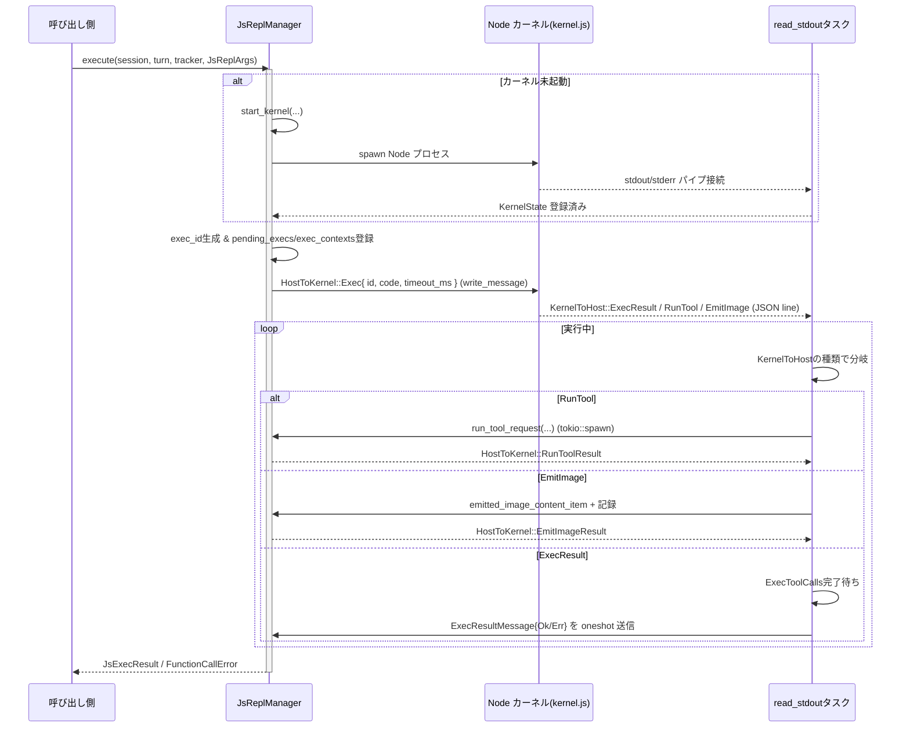

# core/src/tools/js_repl/mod.rs コード解説

> 注記: 提示されたコードチャンクには行番号情報が含まれていないため、`ファイル名:L開始-終了` 形式での正確な行番号は付与できません。根拠はすべて「`core/src/tools/js_repl/mod.rs` 内の該当型・関数定義」によります。

---

## 0. ざっくり一言

Node.js をバックエンドとした **JavaScript REPL（対話型実行環境）カーネル** を立ち上げ・管理し、  
Rust 側のセッション／ツール基盤と連携して JS コード実行・ツール呼び出し・画像出力を扱うモジュールです。

---

## 1. このモジュールの役割

### 1.1 概要

- このモジュールは、**Node.js プロセスをカーネルとして起動し、JSON ラインプロトコルでやり取りする js_repl** を提供します。
- Rust 側からは `JsReplManager::execute` を通して JS コードを実行し、その結果と副作用（画像やツール呼び出し）を `FunctionCallOutputContentItem` として受け取ります。
- カーネルのライフサイクル管理（起動・シャットダウン・リセット）、タイムアウト処理、ネストしたツール呼び出しの管理、Node バージョン検証なども含めて実装されています。

### 1.2 アーキテクチャ内での位置づけ

Rust 側のセッション／ターンコンテキストと、Node カーネル、ツールルーターの間に立つ「ハブ」として動作します。

```mermaid
flowchart LR
    subgraph Host["Rust ホスト側 (core/src/tools/js_repl/mod.rs)"]
      A[JsReplHandle] --> B[JsReplManager]
      B -->|execute| C[Node カーネル 子プロセス]
      B -->|dispatch| D[ToolRouter]
      B -->|uses| E[SandboxManager]
    end

    subgraph SessionLayer["セッション層"]
      S[Session]
      T[TurnContext]
      TRK[SharedTurnDiffTracker]
    end

    subgraph KernelProcess["Node.js カーネル (kernel.js)"]
      KC[ExecResult / RunTool / EmitImage\n(JSON line)]
    end

    S --> B
    T --> B
    TRK --> B
    B <-->|stdin/stdout/stderr| KC
    D -->|ツール実行| S
    B -->|SandboxTransformRequest| E
```

- `Session` / `TurnContext` から実行環境やサンドボックスポリシー、利用可能ツールの情報を取得します。
- `SandboxManager` 経由で Node プロセスの実行をサンドボックス化します。
- `ToolRouter` を使って、カーネルからの `RunTool` 要求を他のツール実装へルーティングします。

### 1.3 設計上のポイント

- **状態管理の分離**
  - Node カーネル固有の状態 (`KernelState`) と、高レベル管理 (`JsReplManager`) を分離しています。
  - 実行ごとのコンテキスト (`ExecContext`) を `HashMap<exec_id, ExecContext>` で管理し、カーネルからのコールバック（ツール呼び出し / 画像発行）と結びつけています。
- **同期実行シリアライズ**
  - `JsReplManager` は `exec_lock: Semaphore(1)` を持ち、**1 度に 1 つのトップレベル JS 実行**に限定しています（並列実行を禁止）。
- **非同期 / 並行性**
  - 子プロセス I/O 読み取りは `tokio::spawn` された `read_stdout` / `read_stderr` タスクで行い、
    `CancellationToken` によりリセット・シャットダウン時に停止できるようになっています。
  - `Arc<Mutex<...>>` を用いて、子プロセス、stdin、キュー状態などを複数タスクから共有・保護しています。
- **エラーハンドリングと診断**
  - Node バージョン検証、書き込みエラー、カーネル予期せぬ終了など多数のケースで、
    モデル向けに詳細な診断文字列（JSON）を組み立てて返します。
- **安全性 / 制約**
  - サンドボックス実行 (`SandboxManager` + `ExecOptions`) を通じて、ファイルシステム／ネットワークの制限を適用します。
  - 画像 URL は `data:` のみ許可 (`validate_emitted_image_url`) し、外部 URL を経由した情報流出を制限しています。
  - `js_repl` が自分自身をツールとして呼べないようにして無限再帰や不正な再帰呼び出しを防ぎます。

---

## 2. 主要な機能一覧

- **JS 実行**
  - `JsReplManager::execute`: 指定した JS コードを Node カーネルで実行し、結果と副作用を返します。
- **カーネル起動／リセット**
  - `JsReplManager::reset`: カーネルを明示的にリセットします。
  - `JsReplManager::interrupt_turn_exec`: 特定ターンの実行中コードを中断し、必要ならカーネルごとリセットします。
- **Node ランタイム検出とバージョン検証**
  - `resolve_node`: Node 実行ファイルのパスを環境変数／設定／PATH から解決します。
  - `resolve_compatible_node`: 見つけた Node が要求バージョン以上かどうか検証します。
- **カーネルとのメッセージプロトコル**
  - `KernelToHost` / `HostToKernel` enums: JSON ラインでやり取りされるメッセージの型。
  - `read_stdout`, `read_stderr`, `write_message`: メッセージ送受信ループと stderr タイルログ。
- **ネストしたツール呼び出し**
  - `run_tool_request`: JS 側からの `RunTool` 要求を Rust 側 `ToolRouter` にディスパッチします。
  - `ExecToolCalls` と関連メソッド群: 実行中ツール呼び出しのカウント・キャンセル・結果集約を管理します。
- **結果・画像の整形**
  - `split_exec_result_content_items` / `build_exec_result_content_items`: JS 実行結果のテキストと副次コンテンツを分離／結合します。
  - `emitted_image_content_item`, `validate_emitted_image_url`: `EmitImage` 経由の画像コンテンツをバリデーション・変換します。

---

## 3. 公開 API と詳細解説

### 3.1 型一覧（構造体・列挙体など）

> 公開／半公開の主要型のみ列挙しています（補助的内部型はこの後の「その他の関数・型」でまとめます）。

| 名前 | 種別 | 公開範囲 | 役割 / 用途 |
|------|------|----------|-------------|
| `JS_REPL_PRAGMA_PREFIX` | `const &str` | `pub(crate)` | JS ソース中で js_repl 向けメタ指示を行うためのプリフィックス文字列 (`"// codex-js-repl:"`) |
| `JsReplHandle` | 構造体 | `pub(crate)` | ターンコンテキストにぶら下げる、**遅延初期化された `JsReplManager` ハンドル** |
| `JsReplArgs` | 構造体（`Deserialize`） | `pub` | JS 実行要求の引数（コードと任意のタイムアウト） |
| `JsExecResult` | 構造体 | `pub` | JS 実行の結果テキストと、副次コンテンツ（画像など） |
| `JsReplManager` | 構造体 | `pub` | Node カーネルの起動・実行・リセットを司るメイン管理クラス |
| `KernelState` | 構造体 | `pub(super)` 相当（非公開） | 単一 Node カーネルプロセスに紐づく I/O・実行中コンテキスト・終了トークンなどの束 |
| `ExecContext` | 構造体 | 非公開 | 単一 exec に対応する `Session` / `TurnContext` / `SharedTurnDiffTracker` |
| `TopLevelExecState` | enum | 非公開 | カーネルがどのターンのどの exec をトップレベルとして扱っているかを追跡 |
| `ExecToolCalls` | 構造体 | 非公開 | 特定 exec に紐づくネストしたツール呼び出しの状態 |
| `JsReplToolCallPayloadKind` | enum | 非公開 | ツール呼び出しのレスポンスペイロード種別（メッセージ・関数結果・MCP など） |
| `JsReplToolCallResponseSummary` | 構造体 | 非公開 | ツール呼び出し結果をログに出すためのサマリ情報 |
| `KernelStreamEnd` | enum | 非公開 | stdout 読み取りループが終了した理由 |
| `KernelDebugSnapshot` | 構造体 | 非公開 | カーネル PID・終了ステータス・直近 stderr を束ねたスナップショット |
| `KernelToHost` | enum（`Deserialize`） | 非公開 | カーネル → ホストの JSON メッセージ (`exec_result`, `run_tool`, `emit_image`) |
| `HostToKernel` | enum（`Serialize`） | 非公開 | ホスト → カーネルの JSON メッセージ (`exec`, `run_tool_result`, `emit_image_result`) |
| `RunToolRequest` / `RunToolResult` | 構造体 | 非公開 | `RunTool` メッセージの要求／応答 |
| `EmitImageRequest` / `EmitImageResult` | 構造体 | 非公開 | `EmitImage` メッセージの要求／応答 |
| `ExecResultMessage` | enum | 非公開 | `execute` 内部で oneshot チャネルを通じてやり取りする結果 |
| `NodeVersion` | 構造体 | 非公開 | Node のメジャー・マイナー・パッチバージョン表現 |

### 3.2 関数詳細（主要 7 件）

#### 1. `JsReplHandle::manager(&self) -> Result<Arc<JsReplManager>, FunctionCallError>`

**概要**

- ターンごとの `JsReplHandle` から、**共有の `JsReplManager` インスタンス**を非同期に取得します。
- `OnceCell` を利用して、最初の呼び出し時にのみ `JsReplManager::new` を実行し、以降は同じ `Arc` を再利用します。

**引数**

| 引数名 | 型 | 説明 |
|--------|----|------|
| `&self` | `&JsReplHandle` | ノードパス・モジュールディレクトリ設定を保持したハンドル |

**戻り値**

- `Ok(Arc<JsReplManager>)`: 正常に初期化／取得できた場合。
- `Err(FunctionCallError)`: `JsReplManager::new` 内で一時ディレクトリ作成等に失敗した場合。

**内部処理の流れ**

1. `OnceCell::get_or_try_init` を使って、`JsReplManager::new(self.node_path.clone(), self.node_module_dirs.clone())` を非同期初期化。
2. 初期化が成功したら `Arc` をクローンして返す。
3. 初期化失敗時は `FunctionCallError` をそのまま返す。

**言語特有のポイント**

- `OnceCell<Arc<_>>` によって、**非同期な一度きりの初期化**を安全に行っています。
- `Arc` による共有なので、複数の場所から同じカーネル管理インスタンスを利用できます。

**エッジケース / 契約**

- 一度初期化に失敗すると、`OnceCell` は「失敗状態」を保持しないため、次回呼び出しで再度初期化が試みられます。
- `JsReplManager::new` が panic するケースはこのコードからは読み取れません。

---

#### 2. `JsReplManager::execute(&self, session, turn, tracker, args) -> Result<JsExecResult, FunctionCallError>`

**概要**

- Node カーネルを必要に応じて起動し、指定された JS コードを**1 回実行**して結果を返します。
- タイムアウト・カーネル異常終了・書き込み失敗などさまざまなエラー状況を `FunctionCallError::RespondToModel` として呼び出し元に伝えます。

**引数**

| 引数名 | 型 | 説明 |
|--------|----|------|
| `session` | `Arc<Session>` | 依存環境、MCP 接続などを含むセッション |
| `turn` | `Arc<TurnContext>` | ファイルシステム／ネットワークサンドボックスやツール設定を含むターン情報 |
| `tracker` | `SharedTurnDiffTracker` | 実行中に発生した差分を追跡するトラッカー |
| `args` | `JsReplArgs` | 実行する JS コードとオプションのタイムアウト（ミリ秒） |

**戻り値**

- `Ok(JsExecResult)`:
  - `output`: 実行結果の標準的なテキスト出力（最初の `InputText`）。
  - `content_items`: 画像など、追加のコンテンツアイテム。
- `Err(FunctionCallError::RespondToModel(message))`:
  - カーネル起動失敗、書き込み失敗、タイムアウト、カーネル予期せぬ終了、JS 実行エラーなど。

**内部処理の流れ（要約）**

1. **排他ロック取得**: `exec_lock.acquire_owned()` により、並行する他の execute をブロック。
2. **カーネル準備**
   - `self.kernel` が `None` の場合、`start_kernel` を呼んで Node カーネルを起動し `KernelState` を保存。
   - 新規起動時は `top_level_exec_state` を `FreshKernel { turn_id, exec_id: None }` に設定。
3. **exec_id とコンテキスト登録**
   - `Uuid` による exec_id を生成し、`pending_execs` に oneshot 送信側を挿入。
   - `exec_contexts` に `ExecContext { session, turn, tracker }` を登録。
   - `register_top_level_exec` と `register_exec_tool_calls` でトップレベル exec とツール呼び出し管理を開始。
4. **Exec メッセージ送信**
   - `HostToKernel::Exec { id, code, timeout_ms }` を構築。
   - `mark_top_level_exec_submitted` で状態を `Submitted` に変える。
   - `write_message` で stdin に JSON ラインを書き込む。失敗した場合は
     - pending/contexts/ツール状態をクリーンアップし、
     - カーネル状態スナップショットを付けてエラーを返す。
5. **結果待ち**
   - `tokio::time::timeout` で `args.timeout_ms.unwrap_or(30_000)` ミリ秒待機。
   - ケース:
     - **正常**: `Ok(Ok(ExecResultMessage))` → 内容に応じて `JsExecResult` かエラーを返す。
     - **チャネルクローズ**: `Ok(Err(_))` → カーネルが応答前に終了したとみなし、状態をクリーンアップしエラー文字列を組み立てて返す。
     - **タイムアウト**: `Err(_)` → `reset_kernel` を呼び、ツール呼び出しも全クリアし、タイムアウトエラーを返す。

**非同期・並行性の観点**

- `exec_lock` により同時実行は 1 つに限定され、Node カーネルの状態破壊を防いでいます。
- 個々の exec の結果は、`read_stdout` タスクから `ExecResultMessage` を oneshot チャネルで送信することで解決されます。
- ネストしたツール呼び出しは `ExecToolCalls` に管理され、`read_stdout` 側で `ExecResult` を処理する前に `wait_for_exec_tool_calls_map` で完了を待ちます。

**エラー / Panic 条件（コードから読み取れる範囲）**

- `JsReplManager::new` / `start_kernel` 失敗 → カーネル起動エラー。
- `write_message` 失敗（Broken pipe など）→ カーネル診断付きのエラー文。
- カーネルが stderr / stdout を閉じる、あるいは read error → 「kernel closed unexpectedly」メッセージ。
- タイムアウト → カーネルをリセットし再実行を促すメッセージ。
- JS コード自身のエラー → `ExecResultMessage::Err{ message }` として返され、そのまま `FunctionCallError::RespondToModel` に。

Panic を明示的に起こすコードは含まれていません（`unreachable!` は `split_exec_result_content_items` 内の整合性チェックのみに存在）。

**エッジケース**

- `timeout_ms = Some(0)` の場合でも `tokio::time::timeout` に 0ms が渡されるため、**ほぼ即座にタイムアウト**します。
- カーネルが起動していても、一度 stdout ループが終了した場合は `execute` からの次回呼び出しで `start_kernel` が再実行されます。
- ネストしたツール呼び出しが長時間ブロックすると、`ExecResult` 処理もそれを待ってから完了します。

**使用上の注意点**

- `execute` は**同時に 1 タスクからしか呼べない**設計です（セマフォ 1）。並列で JS 実行したい場合は設計見直しが必要になります。
- 呼び出し側は `FunctionCallError::RespondToModel` をユーザー向けレスポンスに連結する設計であることが想定されます。
- タイムアウト時はカーネルがリセットされるため、**REPL 状態（変数定義など）が失われる**点に注意が必要です。

---

#### 3. `JsReplManager::reset(&self) -> Result<(), FunctionCallError>`

**概要**

- 現在の Node カーネルを強制終了し、関連する実行中ツール呼び出し状態を全てクリアします。

**内部処理**

1. `exec_lock` を取得し、他の execute と競合しないようにする。
2. `reset_kernel` を呼び出し、`KernelState` を `None` にしつつ
   - `shutdown` トークンをキャンセル、
   - `kill_kernel_child` で子プロセスに kill 信号を送り、最大 2 秒 wait。
3. `clear_all_exec_tool_calls_map` で全 exec_id のツール呼び出しをキャンセルし、待機中タスクを wake する。

**エッジケース**

- すでにカーネルが存在しない場合は何もしません。
- kill や wait が失敗しても、warn ログは出ますが呼び出し自体は成功 (`Ok(())`) になります。

**使用上の注意点**

- 長時間動いて不安定になったカーネルを手動でリセットしたい場合に利用できます。
- 実行中の JS コードおよびネストしたツール呼び出しはすべて中断されます。

---

#### 4. `JsReplManager::interrupt_turn_exec(&self, turn_id: &str) -> Result<bool, FunctionCallError>`

**概要**

- 指定された `turn_id` に紐づく**トップレベル JS 実行が現在走っている場合のみ**、カーネルをリセットします。
- 実際にリセットが行われたかどうかを `bool` で返します。

**内部処理**

1. `exec_lock` を取得。
2. `turn_interrupt_requires_reset(turn_id)` を呼び、`TopLevelExecState` に基づきリセット必要かどうか判定。
   - `FreshKernel` / `Submitted` で `turn_id` が一致する場合のみ `true`。
3. 必要な場合:
   - `reset_kernel` を呼んでカーネルを止める。
   - `clear_all_exec_tool_calls_map` でツール呼び出しも全キャンセル。
4. `Ok(true|false)` を返す。

**使用上の注意点**

- 呼び出し側は、ターンキャンセル時（ユーザーがリクエストを取り消したなど）に `true` が返った場合、**その ターンの JS 実行は中止されている**とみなせます。
- `ReusedKernelPending` 状態（再利用カーネルで exec_id 登録待ち）の場合はリセットしません。

---

#### 5. `JsReplManager::run_tool_request(exec: ExecContext, req: RunToolRequest) -> RunToolResult`

**概要**

- JS カーネルからの `RunTool` 要求を受け取り、`ToolRouter` を通じて適切なツール（通常の関数ツール / カスタムツール / MCP ツール）を実行し、その結果を JSON として返す内部関数です。
- js_repl 自身をツールとして呼ぶことは拒否します。

**引数**

| 引数名 | 型 | 説明 |
|--------|----|------|
| `exec` | `ExecContext` | セッション / ターン / トラッカー |
| `req` | `RunToolRequest` | カーネルから届いたツール呼び出しリクエスト |

**戻り値**

- `RunToolResult { ok: true, response: Some(json), error: None }`
- `RunToolResult { ok: false, response: None, error: Some(msg) }`

**内部処理の流れ**

1. **自己呼び出し禁止チェック**
   - `is_js_repl_internal_tool(&req.tool_name)` が `true` の場合、
     - エラー `"js_repl cannot invoke itself"` を構築し、ログ用サマリを作成。
     - `ok: false` の `RunToolResult` を返す。
2. MCP ツール一覧取得
   - `exec.session.services.mcp_connection_manager` から `list_all_tools()` を呼び出し、MCP 側ツール情報を取得。
3. `ToolRouter` 構築
   - ターンのツール設定 (`exec.turn.tools_config`) と MCP ツールリスト、動的ツール (`turn.dynamic_tools`) をもとに `ToolRouter::from_config` を生成。
4. ツール種別決定とペイロード生成
   - `session.resolve_mcp_tool_info(&req.tool_name, None).await` が Some → MCP ツール。
   - そうでなければ `is_freeform_tool(router.specs(), &req.tool_name)` → Freeform カスタムツール。
   - それ以外 → 通常の関数ツール。
5. `router.dispatch_tool_call_with_code_mode_result(...)` を実行。
6. 成功時:
   - `into_response()` で `ResponseInputItem` に変換。
   - `summarize_tool_call_response` でログ用サマリ。
   - `serde_json::to_value` で JSON 変換に成功すれば `ok: true`。
   - 変換失敗時は `"failed to serialize tool output: ..."` として `ok: false`。
7. 失敗時:
   - エラー文字列化し、`summarize_tool_call_error` でサマリ。
   - `ok: false` の `RunToolResult` を返す。

**安全性 / セキュリティ観点**

- js_repl 自身をツールとして呼べないことで、**無限再帰的な自己呼び出しや潜在的なエスケープ経路**を防いでいます。
- MCP ツールのメタデータは `Session` が管理しており、本モジュール側では解決結果に基づいて適切なルートに振り分けるのみです。

**エッジケース**

- ツール名がどのカテゴリにも一致しない場合も `ToolPayload::Function` として扱われます（詳細な挙動は `ToolRouter` 実装に依存）。
- `dispatch_tool_call_with_code_mode_result` がエラーを返した場合は、その文字列をそのままカーネルに返すため、
  ユーザーに露出する可能性があります（ログレベルにも依存）。

---

#### 6. `resolve_compatible_node(config_path: Option<&Path>) -> Result<PathBuf, String>`

**概要**

- 実行環境から利用可能な Node 実行ファイルを探索し、**所定の最低バージョン以上かどうか**を検証します。
- js_repl カーネル起動前の前提条件チェックに利用されます。

**引数**

| 引数名 | 型 | 説明 |
|--------|----|------|
| `config_path` | `Option<&Path>` | 設定で明示された Node 実行ファイルパス（任意） |

**戻り値**

- `Ok(PathBuf)`:
  - 有効な Node 実行ファイルパス。
- `Err(String)`:
  - Node が見つからない場合、またはバージョンが要求を満たさない場合。

**内部処理**

1. `resolve_node(config_path)` で候補パスを探索。
   - 環境変数 `CODEX_JS_REPL_NODE_PATH`。
   - `config_path` 自体（存在チェック）。
   - `which::which("node")`。
2. 見つからなければ `"Node runtime not found; ..."` エラー。
3. `ensure_node_version(&node_path).await?` でバージョン検証。
   - `JS_REPL_MIN_NODE_VERSION`（`include_str!("../../../../node-version.txt")`）で定義された最低バージョンと比較。
4. 問題なければ `Ok(node_path)`。

**エッジケースと契約**

- Node の `--version` 実行が失敗した場合や、バージョン文字列がパース不能な場合はエラー文字列を返します。
- バージョンチェックは単純な `(major, minor, patch)` の辞書式比較です。

**使用上の注意点**

- js_repl が利用する Node のバージョンはここで固定されるため、**古い Node では起動自体が拒否**されます。
- `config_path` に存在しないファイルを渡しても、自動的には補完されず `None` 扱いです。

---

#### 7. `JsReplManager::read_stdout(...)`（内部タスク）

**概要**

- Node カーネルの stdout を 1 行ずつ読み取り、`KernelToHost` メッセージとして解釈し、exec 結果・RunTool・EmitImage に応じた処理を行う**常駐タスク**です。
- カーネル終了時には、保留中の全 exec にエラーを返し、`JsReplManager` 側のカーネル状態をクリアします。

**（主な）引数**

| 引数名 | 型 | 説明 |
|--------|----|------|
| `stdout` | `ChildStdout` | カーネルの stdout パイプ |
| `child` | `Arc<Mutex<Child>>` | 子プロセスハンドル |
| `manager_kernel` | `Arc<Mutex<Option<KernelState>>>` | マネージャが保持するカーネル状態 |
| `pending_execs` | `Arc<Mutex<HashMap<String, oneshot::Sender<ExecResultMessage>>>>` | exec_id → 結果送信用チャネル |
| `exec_contexts` | `Arc<Mutex<HashMap<String, ExecContext>>>` | exec_id → 実行コンテキスト |
| `exec_tool_calls` | `Arc<Mutex<HashMap<String, ExecToolCalls>>>` | exec_id → ツール呼び出し状態 |
| `stdin` | `Arc<Mutex<ChildStdin>>` | カーネル stdin（RunToolResult / EmitImageResult 返信に利用） |
| `shutdown` | `CancellationToken` | カーネルリセット時に読み取りを終了するためのトークン |

**処理フロー（高レベル）**

1. `BufReader::new(stdout).lines()` を用意し、`loop` で JSON ラインを読み取る。
2. `tokio::select!` で
   - `shutdown.cancelled()` → ループ終了 (`KernelStreamEnd::Shutdown`)。
   - `reader.next_line()` → EOF (`StdoutEof`) / エラー (`StdoutReadError`) / 行取得。
3. 各行について `serde_json::from_str::<KernelToHost>` でパースし、失敗時は warn ログのみ。
4. メッセージ種別ごとの処理:
   - `ExecResult{id, ok, output, error}`:
     - 当該 exec_id のツール呼び出し完了待ち (`wait_for_exec_tool_calls_map`)。
     - `ExecToolCalls` から追加コンテンツアイテム収集。
     - `pending_execs` から oneshot 送信側を取り出し、成功／失敗の `ExecResultMessage` を送信。
     - `exec_contexts` とツール状態を削除。
   - `EmitImage(req)`:
     - 対応する `ExecContext` があれば `validate_emitted_image_url` で URL を検証。
     - OK なら `emitted_image_content_item` を作成し `ExecToolCalls` に蓄積、`EmitImageResult{ok:true}` 返答。
     - NG やコンテキストなしなら `ok:false` でエラーメッセージ付き返答。
   - `RunTool(req)`:
     - `begin_exec_tool_call` で in_flight をインクリメントし、キャンセルトークンを取得。
     - コンテキスト存在時は `tokio::spawn` で非同期タスクを起動し、`run_tool_request` を実行。
     - 実行中に `reset_cancel` がキャンセルされた場合は `"js_repl execution reset"` エラーを返す。
     - 結果を `HostToKernel::RunToolResult` として `stdin` に書き戻す。
5. ループ終了後:
   - 残っている `exec_contexts` の exec_id を収集し、ツール呼び出し完了待ち → クリア。
   - `manager_kernel` を見て、同じ `child` を持つ `KernelState` を `None` にする。
   - 残っている `pending_execs` 全てにエラー結果（カーネル予期せぬ終了）を送信。
   - 必要であれば warn ログで終了理由・残件数・stderr tail などを出力。

**非同期・並行性のポイント**

- stdout 読み取りは 1 つのタスクで直列処理ですが、`RunTool` に対しては都度 `tokio::spawn` で別タスクを起動するため、
  ネストしたツール呼び出しは**並列実行**され得ます。
- `Arc<Mutex<_>>` により、`pending_execs` / `exec_contexts` / `exec_tool_calls` / `stdin` / `child` などはスレッドセーフに共有されます。
- `CancellationToken` により、リセット時に `tokio::select!` で読み取りループを即座に終了できます。

---

### 3.3 その他の関数・ヘルパー一覧（抜粋）

> ここでは単機能なヘルパー関数・内部ユーティリティをまとめて列挙します。

| 関数名 / 型名 | 役割（1 行） |
|---------------|--------------|
| `format_exit_status` | `ExitStatus` から `"code=..."` / `"signal=..."` 等の文字列を生成 |
| `format_stderr_tail` / `push_stderr_tail_line` | stderr の末尾ログをメモリ上に制限付きで保持・整形 |
| `truncate_utf8_prefix_by_bytes` | UTF-8 境界を壊さないように先頭 N バイトまでを切り出す |
| `should_include_model_diagnostics_for_write_error` | 書き込みエラー時に詳細診断を付けるべきか判定 |
| `format_model_kernel_failure_details` / `with_model_kernel_failure_message` | カーネル失敗時の診断 JSON を組み立てる |
| `kernel_stderr_tail_snapshot` / `kernel_debug_snapshot` | カーネル PID／状態／stderr tail をまとめて取得 |
| `kill_kernel_child` | 子プロセスがまだ生きていれば kill し、最大 2 秒 wait |
| `truncate_id_list` | ログ用に exec_id のリストを最大 `JS_REPL_EXEC_ID_LOG_LIMIT` 件にトリミング |
| `wait_for_exec_tool_calls` / `clear_exec_tool_calls` など | 特定 exec_id に紐づくツール呼び出し状態の管理 |
| `emitted_image_content_item` | `EmitImage` 要求から `FunctionCallOutputContentItem::InputImage` を構成 |
| `validate_emitted_image_url` | `data:` スキームのみ許可する画像 URL バリデーション |
| `build_exec_result_content_items` / `split_exec_result_content_items` | テキスト出力と追加コンテンツの結合・分離 |
| `is_freeform_tool` | `ToolSpec` リストから Freeform ツールかどうか判定 |
| `is_js_repl_internal_tool` | `"js_repl"` / `"js_repl_reset"` を内部ツールとして判定 |
| `NodeVersion::parse` / `required_node_version` / `read_node_version` / `ensure_node_version` | Node バージョンの取得と検証 |
| `resolve_node` | 環境変数・設定パス・`PATH` から Node 実行ファイルを探す |

---

## 4. データフロー

### 4.1 JS 実行の全体フロー

`JsReplManager::execute` から Node カーネル、`read_stdout` 経由で結果が戻るまでの流れです。



ポイント:

- トップレベル実行は `execute` が管理し、ネストしたツール呼び出しは `read_stdout` 側から `run_tool_request` が起動します。
- `ExecResult` を返す前に、同 exec_id に紐づくツール呼び出しがすべて完了するまで待機します。

---

## 5. 使い方（How to Use）

### 5.1 基本的な使用方法

以下は **同一プロセス内で js_repl を呼び出す** 想定の例です。`Session` / `TurnContext` の具体的な構築方法はこのファイルには出てきません。

```rust
use std::sync::Arc;
use core::tools::js_repl::{JsReplHandle, JsReplArgs, JsExecResult};

// session: Arc<Session>, turn: Arc<TurnContext> は既に用意されていると仮定
async fn run_js_example(
    session: Arc<Session>,
    turn: Arc<TurnContext>,
    tracker: SharedTurnDiffTracker,
) -> Result<JsExecResult, FunctionCallError> {
    // ターンごとのJsReplハンドルを作成（Node パスや node_modules ディレクトリを指定）
    let handle = JsReplHandle::with_node_path(
        None,       // Node パスを環境変数/設定/PATHから解決する場合
        vec![],     // 追加の node_modules ディレクトリがあればPathBufを入れる
    );

    // マネージャを取得（初回は内部でカーネル管理オブジェクトを作成）
    let manager = handle.manager().await?;  // Result<Arc<JsReplManager>, FunctionCallError>

    // 実行するJSコードとタイムアウトを指定
    let args = JsReplArgs {
        code: "1 + 2".to_string(),
        timeout_ms: Some(5_000),
    };

    // JSコードを実行
    let result = manager
        .execute(Arc::clone(&session), Arc::clone(&turn), tracker, args)
        .await?;  // JsExecResult

    // result.output には最初のテキスト出力、result.content_items には画像などが入る
    Ok(result)
}
```

### 5.2 よくある使用パターン

1. **タイムアウトを指定しない（デフォルト 30 秒）**

```rust
let args = JsReplArgs {
    code: "heavyComputation()".into(),
    timeout_ms: None, // 30_000ms デフォルト
};
let result = manager.execute(session, turn, tracker, args).await?;
```

1. **ターンキャンセル時に中断を試みる**

```rust
// 別のタスクから、キャンセルされたターンIDに対して中断要求
if manager.interrupt_turn_exec(&turn.sub_id).await? {
    // true: カーネルリセットが行われた
}
```

1. **明示的にカーネルをリセット**

```rust
// 何らかの理由でカーネル状態をリセットしたい場合
manager.reset().await?;
```

### 5.3 よくある間違いと正しい使い方

```rust
// 間違い例: exec_lock を意識せずに複数タスクから同時に execute を呼ぶ
let h1 = tokio::spawn({
    let manager = Arc::clone(&manager);
    async move { manager.execute(sess1, turn1, tracker1, args1).await }
});
let h2 = tokio::spawn({
    let manager = Arc::clone(&manager);
    async move { manager.execute(sess2, turn2, tracker2, args2).await }
});
// -> セマフォにより直列化はされますが、意図しない待ち時間が発生する

// 正しい例: 呼び出し側のロジックでシリアライズする、もしくは直列実行を許容する設計にする
let r1 = manager.execute(sess1, turn1, tracker1, args1).await?;
let r2 = manager.execute(sess2, turn2, tracker2, args2).await?;
```

```rust
// 間違い例: エラーを無視して result を使用しようとする
let result = manager.execute(session, turn, tracker, args).await.unwrap(); // panicの可能性

// 正しい例: FunctionCallErrorをハンドリングしてユーザー向けに変換する
match manager.execute(session, turn, tracker, args).await {
    Ok(result) => { /* 正常な結果利用 */ }
    Err(FunctionCallError::RespondToModel(msg)) => {
        // モデルに返すメッセージやログとして扱う
        eprintln!("js_repl error: {msg}");
    }
    // 他のバリアントがあればそれに応じて処理（ここではこのファイルでは登場しません）
}
```

### 5.4 使用上の注意点（まとめ）

- **単一カーネル・単一 execute**
  - `JsReplManager` は単一 Node カーネルを前提としており、トップレベルの JS 実行は常に 1 本です。
- **カーネル状態の寿命**
  - タイムアウトや重大エラーの際にはカーネルがリセットされ、**REPL 状態は失われます**。
- **画像 URL**
  - `codex.emitImage` による画像出力は `data:` URL のみ許可されます。HTTP/HTTPS は拒否されます。
- **Node バージョン**
  - Node が古い場合は起動前にエラーとなり、実行は開始されません。
- **サンドボックス**
  - 実際の I/O やネットワーク利用は `TurnContext` のポリシーに依存します。必要な権限を付与しないと JS 側で失敗します。

---

## 6. 変更の仕方（How to Modify）

### 6.1 新しい機能を追加する場合

例: 新しいカーネル → ホストメッセージタイプを追加する場合。

1. **メッセージ型の追加**
   - `KernelToHost` / `HostToKernel` enum に新しいバリアントを追加し、`kernel.js` 側と整合する JSON フォーマットを決める。
2. **読み取りループの拡張**
   - `read_stdout` 内の `match msg` に新しいバリアントの分岐を追加し、
     - 必要なら `ExecContext` / `ExecToolCalls` を参照して処理を行う。
3. **結果のホスト側公開**
   - 必要に応じて、新しい情報を `FunctionCallOutputContentItem` として `build_exec_result_content_items` に追加するか、
     別の返却経路を設計する。

### 6.2 既存の機能を変更する場合

- **Node 検出ロジックを変える**
  - `resolve_node` / `ensure_node_version` を編集する際は、
    - 依存している `resolve_compatible_node` / `start_kernel` の動作に影響するため、  
      Node バージョン検証やエラーメッセージの契約を崩さないことが重要です。
- **タイムアウトポリシーを変える**
  - `execute` の `timeout_ms.unwrap_or(30_000)` を変更する場合、
    - 呼び出し側が既に 30 秒を前提にしているかどうかを確認する必要があります。
- **ツール呼び出しの扱いを変える**
  - `run_tool_request` / `ExecToolCalls` 周辺を変えると、
    - `read_stdout` での「ツール呼び出し完了後に ExecResult を返す」という契約が崩れる可能性があります。
  - 変更時は `ExecToolCalls.in_flight` と `Notify` の整合性に注意し、不整合による**永遠待機**を避ける必要があります。

---

## 7. 関連ファイル

| パス | 役割 / 関係 |
|------|------------|
| `core/src/tools/js_repl/kernel.js` | `KERNEL_SOURCE` として `include_str!` される Node 側カーネル実装。`KernelToHost` / `HostToKernel` と対応した JSON プロトコルを話す |
| `core/src/tools/js_repl/meriyah.umd.min.js` | `MERIYAH_UMD` として同梱される JS パーサライブラリ（`write_kernel_script` で一緒に書き出される） |
| `core/node-version.txt` 付近 | `JS_REPL_MIN_NODE_VERSION` の元になるファイルで、最低要求 Node バージョンを定義 |
| `core/src/codex/session.rs`（推定） | `Session` 型の定義。MCP ツールや依存環境の取得などに利用される（このチャンクには定義は現れません） |
| `core/src/codex/turn_context.rs`（推定） | `TurnContext` 型の定義。サンドボックスポリシー、ツール設定、カレントディレクトリなどを保持（このチャンクには定義は現れません） |
| `core/src/tools/router.rs` | `ToolRouter` や `ToolCall`, `ToolCallSource::JsRepl` の定義を含むモジュール（このチャンクには定義は現れません） |
| `core/src/tools/js_repl/mod_tests.rs` | `#[cfg(test)]` で取り込まれるテストコード。`resolve_node` や `NodeVersion` などのテストが含まれていると推測されますが、このチャンクには内容は現れません。 |

---

## Bugs / Security / Edge Cases（まとめ）

> 専用見出しは禁止されているため、ここでは簡潔に要点のみ整理します。

- **潜在的なバグになりうる点**
  - タイムアウト分岐では `pending_execs` / `exec_contexts` のクリーンアップを `read_stdout` に任せており、
    その後 `ExecResultMessage` が不要になった状態で送信されることがあります（機能上問題はないが設計として注意）。
  - `split_exec_result_content_items` の `unreachable!` は、`build_exec_result_content_items` との契約が崩れると panic します。
- **セキュリティ面**
  - サンドボックス設定は `TurnContext` に依存するため、**十分に制限されていないポリシーを渡すと JS から広い権限を持つ可能性**があります。
  - `validate_emitted_image_url` により、画像の外部 URL 経由の情報抜き出しをある程度抑制していますが、
    `data:` URL 自体の内容は JS 側が自由に構築できる点に留意が必要です。
- **重要なエッジケース**
  - Node が古い、あるいは `--version` 実行に失敗した場合、js_repl は利用できません。
  - カーネルが stderr を持たない（`stderr.take()` が `None`）場合には警告が出るのみで、stderr tail は空のままです。
  - `RunTool` 要求が exec 終了後に届いた場合、`ExecContext` が見つからず `"js_repl exec context not found"` で即時エラー返答となります。
