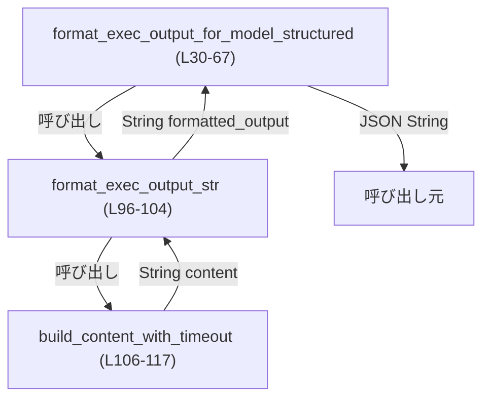
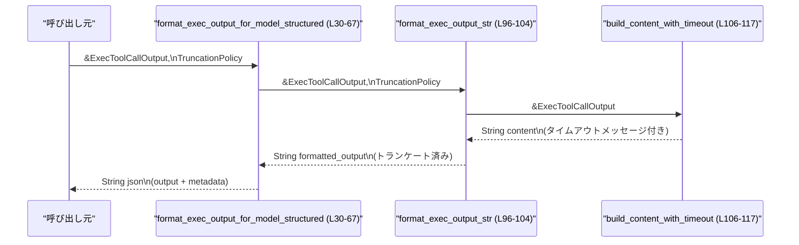

# core/src/tools/mod.rs コード解説

---

## 0. ざっくり一言

- `tools` サブシステム全体のモジュールを束ねつつ、ツール実行結果（`ExecToolCallOutput`）をモデルに返すための文字列形式（構造化 JSON / 人間向けフリーフォーマット）に整形するユーティリティを提供するモジュールです（`format_exec_output_*` 系関数, `build_content_with_timeout`）。  
  （根拠: `pub(crate) mod ...` 定義と 3 つの公開関数 `format_exec_output_for_model_structured` / `format_exec_output_for_model_freeform` / `format_exec_output_str` 定義  
  `core/src/tools/mod.rs:L1-13,L30-67,L69-104`）

---

## 1. このモジュールの役割

### 1.1 概要

- このモジュールは、ツール実行基盤のエントリポイントとして複数のツール関連サブモジュールを公開し（`code_mode`, `context`, `router` など）、  
  （根拠: `pub(crate) mod ...` 群 `core/src/tools/mod.rs:L1-13`）
- ツール実行結果 `ExecToolCallOutput` をモデルに返すために、  
  - **構造化 JSON 形式**（`format_exec_output_for_model_structured`）  
  - **フリーテキスト形式**（`format_exec_output_for_model_freeform`）  
  - 共通の出力文字列生成ロジック（`format_exec_output_str` / `build_content_with_timeout`）  
  を提供します。  
  （根拠: 関数定義 `core/src/tools/mod.rs:L30-104,L106-117`）

- あわせて、テレメトリプレビューに関連する定数を定義しますが、このチャンク内での使用箇所はありません。  
  （根拠: `TELEMETRY_PREVIEW_*` 定義 `core/src/tools/mod.rs:L22-26`）

### 1.2 アーキテクチャ内での位置づけ

このモジュールの主な依存関係と役割の関係を図にまとめると、次のようになります。

```mermaid
graph TD
    A["tools::mod (L1-117)"]
    subgraph Tools Submodules
        B["code_mode (L1)"]
        C["context (L2)"]
        D["events (L3)"]
        E["handlers (L4)"]
        F["js_repl (L5)"]
        G["network_approval (L6)"]
        H["orchestrator (L7)"]
        I["parallel (L8)"]
        J["registry (L9)"]
        K["router (L10)"]
        L["runtimes (L11)"]
        M["sandboxing (L12)"]
        N["spec (L13)"]
    end

    O["router::ToolRouter 再公開 (L19)"]
    P["ExecToolCallOutput\n(codex_protocol) (L15)"]
    Q["TruncationPolicy\n/ truncate_text\n/ formatted_truncate_text\n(codex_utils_output_truncation) (L16-18)"]
    R["serde::Serialize / serde_json\n(L40-47,L65-66)"]

    A --> B
    A --> C
    A --> D
    A --> E
    A --> F
    A --> G
    A --> H
    A --> I
    A --> J
    A --> K
    A --> L
    A --> M
    A --> N
    A --> O
    A --> P
    A --> Q
    A --> R
```



- `tools::mod` は、ツール関連のサブモジュールをまとめる「ハブ」として機能します（`core/src/tools/mod.rs:L1-13`）。
- 実行結果のフォーマット関数群は、`ExecToolCallOutput`（codex_protocol）とトランケーションユーティリティ（codex_utils_output_truncation）および `serde_json` に依存します（`core/src/tools/mod.rs:L15-18,L40-47,L65-66, L96-104`）。
- `router::ToolRouter` はこのモジュールから再公開されますが、その中身（型やメソッド）はこのチャンクには現れません（`core/src/tools/mod.rs:L10,L19`）。

### 1.3 設計上のポイント

- **責務の分割**  
  - 出力テキストの構築とタイムアウトメッセージ付与を `build_content_with_timeout` に集約しています（`core/src/tools/mod.rs:L106-117`）。
  - テキストのトランケーションは外部クレートの関数に委譲しています（`truncate_text`, `formatted_truncate_text`）（`core/src/tools/mod.rs:L18,L80-81,L103`）。
  - 構造化 JSON とフリーフォーマットを別関数として提供しつつ、共通処理を `format_exec_output_str` 経由で共有しています（`core/src/tools/mod.rs:L55,L96-104`）。

- **状態管理**  
  - すべての関数は引数のみを読み取り、新しい `String` を返す純粋な関数として実装されています。モジュール内に共有可変状態はありません（`core/src/tools/mod.rs:L30-104,L106-117`）。
  - これにより、**スレッド安全性**の観点では、このモジュールの関数は `ExecToolCallOutput` が共有読み取り可能である限り、複数スレッドから同時に安全に呼び出し可能と考えられます（一般論としての Rust の参照ルールと、ここでの & 参照のみ使用、`core/src/tools/mod.rs:L30-33,L69-72,L96-99,L106-107`）。

- **エラーハンドリング方針**  
  - 構造化 JSON 版では `serde_json::to_string` の結果に対して `expect` を使用しており、シリアライズ失敗時は panic します（`core/src/tools/mod.rs:L65-66`）。
  - その他の箇所では `Result` や `Option` を返さず、パニックの可能性は明示的にはこの `expect` のみです。

- **パフォーマンスと安全性**  
  - 出力テキストの長さに応じてトランケーションを行い、モデルやテレメトリへの過大な出力を防ぐ設計になっています（`truncate_text`, `formatted_truncate_text` の利用、`core/src/tools/mod.rs:L80-81,L103`）。
  - タイムアウト時には明示的なメッセージを先頭に付与し、ユーザーやモデルが「途中までの出力」であることを認識しやすくしています（`core/src/tools/mod.rs:L108-113`）。

---

## 2. 主要な機能一覧

### 2.1 機能の概要

- ツール関連サブモジュールの公開（`code_mode`, `context`, `router` など）
- ツール実行結果を構造化 JSON 形式に整形し、モデルへの返却に使う文字列を生成
- ツール実行結果を人間向けのフリーテキスト形式に整形
- タイムアウト情報を出力先頭に付加したテキストの生成
- テレメトリプレビューのトランケーション設定値（バイト数・行数・通知文言）の定義

### 2.2 コンポーネント一覧（モジュール・定数・関数）

| 名前 | 種別 | 公開範囲 | 役割 / 用途 | 定義位置 |
|------|------|----------|-------------|----------|
| `code_mode` | モジュール | `pub(crate)` | ツールのコードモード関連機能をまとめるサブモジュール（詳細はこのチャンクには現れない） | `core/src/tools/mod.rs:L1-1` |
| `context` | モジュール | `pub(crate)` | 実行コンテキスト関連機能（詳細不明） | `core/src/tools/mod.rs:L2-2` |
| `events` | モジュール | `pub(crate)` | イベント処理関連（詳細不明） | `core/src/tools/mod.rs:L3-3` |
| `handlers` | モジュール | `pub(crate)` | ハンドラ群（詳細不明） | `core/src/tools/mod.rs:L4-4` |
| `js_repl` | モジュール | `pub(crate)` | JavaScript REPL 関連機能（詳細不明） | `core/src/tools/mod.rs:L5-5` |
| `network_approval` | モジュール | `pub(crate)` | ネットワークアクセス承認関連（詳細不明） | `core/src/tools/mod.rs:L6-6` |
| `orchestrator` | モジュール | `pub(crate)` | ツール実行オーケストレーション（詳細不明） | `core/src/tools/mod.rs:L7-7` |
| `parallel` | モジュール | `pub(crate)` | 並列実行関連（詳細不明） | `core/src/tools/mod.rs:L8-8` |
| `registry` | モジュール | `pub(crate)` | ツール登録・レジストリ関連（詳細不明） | `core/src/tools/mod.rs:L9-9` |
| `router` | モジュール | `pub(crate)` | ツールルーティングの実装（詳細不明） | `core/src/tools/mod.rs:L10-10` |
| `runtimes` | モジュール | `pub(crate)` | 実行ランタイム関連（詳細不明） | `core/src/tools/mod.rs:L11-11` |
| `sandboxing` | モジュール | `pub(crate)` | サンドボックス実行関連（詳細不明） | `core/src/tools/mod.rs:L12-12` |
| `spec` | モジュール | `pub(crate)` | ツール仕様関連（詳細不明） | `core/src/tools/mod.rs:L13-13` |
| `ToolRouter` | 型（再公開） | `pub`（このモジュールから再公開） | `router` モジュール内のルータ型を外部から参照しやすくするための再公開。具体的な中身はこのチャンクには現れない | `core/src/tools/mod.rs:L10,L19` |
| `TELEMETRY_PREVIEW_MAX_BYTES` | `const usize` | `pub(crate)` | テレメトリプレビュー時の最大バイト数（2 KiB） | `core/src/tools/mod.rs:L22-23` |
| `TELEMETRY_PREVIEW_MAX_LINES` | `const usize` | `pub(crate)` | テレメトリプレビュー時の最大行数（64 行） | `core/src/tools/mod.rs:L22-24` |
| `TELEMETRY_PREVIEW_TRUNCATION_NOTICE` | `const &str` | `pub(crate)` | テレメトリプレビューがトランケートされたことを通知する文言 | `core/src/tools/mod.rs:L25-26` |
| `format_exec_output_for_model_structured` | 関数 | `pub` | 実行結果を JSON 形式（出力 + メタデータ）に整形 | `core/src/tools/mod.rs:L30-67` |
| `format_exec_output_for_model_freeform` | 関数 | `pub` | 実行結果を人間向けのテキスト（ヘッダ + 出力）に整形 | `core/src/tools/mod.rs:L69-94` |
| `format_exec_output_str` | 関数 | `pub` | タイムアウトメッセージ付きの出力テキストを作り、トランケートした文字列を返す | `core/src/tools/mod.rs:L96-104` |
| `build_content_with_timeout` | 関数 | `fn`（モジュール内 private） | `ExecToolCallOutput` から、タイムアウトメッセージを先頭に付けた出力文字列を生成 | `core/src/tools/mod.rs:L106-117` |

---

## 3. 公開 API と詳細解説

### 3.1 型一覧（構造体・列挙体など）

このファイル内で**モジュール外から直接見える新しい型宣言**はありません。  
ただし、次の型が重要な役割を果たします。

| 名前 | 種別 | 役割 / 用途 | 定義位置 / 備考 |
|------|------|-------------|------------------|
| `ToolRouter` | 型（詳細不明） | ツール呼び出しのルーティングを行うと思われる型。`router` モジュールから再公開されている | 再公開のみ `core/src/tools/mod.rs:L10,L19`。定義本体は `core/src/tools/router.rs` など、このチャンクには現れない |
| `ExecToolCallOutput` | 構造体（外部クレート） | ツール実行の結果（`exit_code`, `duration`, `timed_out`, `aggregated_output.text` など）を保持 | 外部クレート `codex_protocol::exec_output` に定義。ここではフィールドアクセスのみ確認できる（`core/src/tools/mod.rs:L34-38,L74,L108-113,L115`） |
| `TruncationPolicy` | 列挙体 / 構造体（詳細不明） | 出力トランケーションのポリシー（最大長や通知方法など）を指定する型 | 外部クレート `codex_utils_output_truncation` に定義。ここでは引数として渡されるのみ（`core/src/tools/mod.rs:L16,L32,L71,L98`） |

関数内にローカルな `ExecMetadata` と `ExecOutput<'a>` 構造体が宣言されていますが、これらは JSON シリアライズ用の内部構造体であり、モジュールの公開 API ではありません（`core/src/tools/mod.rs:L40-50`）。

---

### 3.2 関数詳細

#### `format_exec_output_for_model_structured(exec_output: &ExecToolCallOutput, truncation_policy: TruncationPolicy) -> String`

**概要**

- ツール実行結果 `ExecToolCallOutput` をもとに、  
  - トランケート済みの出力文字列  
  - `exit_code` と `duration_seconds`（秒、小数 1 桁）  
  を含む JSON 文字列を構築して返す関数です（`core/src/tools/mod.rs:L30-67`）。

**引数**

| 引数名 | 型 | 説明 |
|--------|----|------|
| `exec_output` | `&ExecToolCallOutput` | ツール実行の結果。`exit_code`, `duration`, `timed_out`, `aggregated_output.text` などを参照します（`core/src/tools/mod.rs:L34-38,L55,L106-115`）。 |
| `truncation_policy` | `TruncationPolicy` | 出力をどのようにトランケートするかを指定するポリシー。具体的なバリアントや意味は外部クレート側で定義されています（`core/src/tools/mod.rs:L32,L55,L96-104`）。 |

**戻り値**

- JSON 文字列（`String`）。構造は内部構造体 `ExecOutput` に対応し、少なくとも次のフィールドを持ちます（`core/src/tools/mod.rs:L40-50`）:
  - `output`: トランケート済みの出力文字列
  - `metadata.exit_code`: プロセスの終了コード
  - `metadata.duration_seconds`: 実行時間（秒、小数 1 桁に丸め）

**内部処理の流れ（アルゴリズム）**

1. `exec_output` から `exit_code` と `duration` をパターンマッチで取り出します（`core/src/tools/mod.rs:L34-38`）。
2. ローカル構造体 `ExecMetadata`（`exit_code: i32`, `duration_seconds: f32`）と `ExecOutput<'a>`（`output: &str`, `metadata: ExecMetadata`）を `Serialize` 可能な形として定義します（`core/src/tools/mod.rs:L40-50`）。
3. `duration.as_secs_f32()` によって実行時間を秒単位の `f32` に変換し、`* 10.0` → `round()` → `/ 10.0` で小数点以下 1 桁に丸めます（`core/src/tools/mod.rs:L52-53`）。
4. 共通ヘルパー `format_exec_output_str` を呼び出して、トランケート済みの出力文字列 `formatted_output` を取得します（`core/src/tools/mod.rs:L55,L96-104`）。
5. `ExecOutput` 構造体のインスタンス `payload` を組み立てます（`core/src/tools/mod.rs:L57-63`）。
6. `serde_json::to_string(&payload)` を呼び出し、その `Result` に対して `.expect("serialize ExecOutput")` を呼び出すことで JSON にシリアライズし、`String` を得て返します（`core/src/tools/mod.rs:L65-66`）。



**Examples（使用例）**

以下は、ツール実行結果をモデルに渡す前に構造化 JSON として整形するイメージ例です。  
`TruncationPolicy` の具体的な生成方法はこのチャンクには現れないため、コメントで表現しています。

```rust
use codex_protocol::exec_output::ExecToolCallOutput;                 // ExecToolCallOutput 型をインポート
use codex_utils_output_truncation::TruncationPolicy;                 // トランケーションポリシーをインポート
use core::tools::format_exec_output_for_model_structured;            // 本関数をインポート（パスは実際のクレート階層に合わせる）
                                                                     //                                               
fn send_to_model(exec_output: &ExecToolCallOutput) {                 // ツール実行結果を受け取る関数
    let truncation_policy: TruncationPolicy =                        // トランケーションポリシーを用意
        /* codex_utils_output_truncation 側で定義された適切なポリシーを構築する */;

    let json = format_exec_output_for_model_structured(              // 構造化 JSON 文字列を生成
        exec_output,
        truncation_policy,
    );                                                               // ここで json は `{"output": "...", "metadata": {...}}` のような文字列

    // json をモデルやクライアントに送信する処理を行う
    // send_to_llm(json);
}
```

**Errors / Panics**

- この関数は `Result` や `Option` を返さず、失敗時に次の条件で panic します。
  - `serde_json::to_string(&payload)` が `Err` を返した場合、`.expect("serialize ExecOutput")` により panic（`core/src/tools/mod.rs:L65-66`）。
- `ExecOutput` は単純な `Serialize` 実装のローカル構造体であるため、通常の環境下ではシリアライズが失敗する可能性は非常に低い設計です（`core/src/tools/mod.rs:L40-50`）。

**Edge cases（エッジケース）**

- **タイムアウトしたコマンド**  
  - `exec_output.timed_out == true` の場合、`build_content_with_timeout` により、  
    `"command timed out after {duration_ms} milliseconds\n{aggregated_text}"` という先頭行が追加された文字列が `output` に入ります（`core/src/tools/mod.rs:L106-113`）。
- **非常に長い出力**  
  - `formatted_truncate_text` によりトランケーションされます。どの程度トランケートされるかは `truncation_policy` に依存します（`core/src/tools/mod.rs:L18,L103`）。
- **空の出力**  
  - `aggregated_output.text` が空文字列であれば、そのまま空（またはタイムアウトメッセージのみ）の `output` になります（`core/src/tools/mod.rs:L112-115`）。

**使用上の注意点**

- 返される JSON は **トランケート済みの出力** を含むため、「完全なログ」を必要とする用途には適していません。呼び出し側はトランケーションの可能性を前提とする必要があります（`formatted_truncate_text` の利用 `core/src/tools/mod.rs:L103`）。
- Panic を避けたい場合、この関数をそのまま使用するのではなく、`serde_json::to_string` のエラーを呼び出し側に伝播するラッパー関数を別途用意する設計もありえます（このチャンクには存在しません）。
- 関数は `ExecToolCallOutput` への共有参照のみを受け取り、内部に状態を持たないため、並行実行環境でも同じ `exec_output` を複数のスレッドから読み取る用途に適しています（`core/src/tools/mod.rs:L30-33`）。

---

#### `format_exec_output_for_model_freeform(exec_output: &ExecToolCallOutput, truncation_policy: TruncationPolicy) -> String`

**概要**

- ツール実行結果を、人間が読みやすいフリーテキスト形式に整形します（`core/src/tools/mod.rs:L69-94`）。
- ヘッダとして
  - `Exit code: <code>`
  - `Wall time: <seconds> seconds`
  - （必要に応じて）`Total output lines: <lines>`
  を付け、その後に `Output:` とトランケート済みの出力本文を続けて 1 つの文字列にします。

**引数**

| 引数名 | 型 | 説明 |
|--------|----|------|
| `exec_output` | `&ExecToolCallOutput` | 実行結果。`exit_code`, `duration`, `timed_out`, `aggregated_output.text` などを参照します（`core/src/tools/mod.rs:L69-76,L84-85,L108-115`）。 |
| `truncation_policy` | `TruncationPolicy` | 本文出力をどのようにトランケートするかを指定します（`core/src/tools/mod.rs:L71,L80`）。 |

**戻り値**

- ヘッダ + 本文を改行区切りで結合した単一の `String` を返します。例として、次のような形になります。
  - `Exit code: 0\nWall time: 1.2 seconds\nOutput:\n<トランケート済み本文>`

**内部処理の流れ**

1. 実行時間を秒単位 (`f32`) に変換し、小数 1 桁に丸めます（`core/src/tools/mod.rs:L73-74`）。
2. `build_content_with_timeout` を呼び出して、タイムアウトメッセージ付きの出力テキスト `content` を生成します（`core/src/tools/mod.rs:L76,L106-117`）。
3. 元の `content` の行数を `total_lines` として数えます（`core/src/tools/mod.rs:L78`）。
4. `truncate_text(&content, truncation_policy)` を呼び出して、トランケートされた `formatted_output` を得ます（`core/src/tools/mod.rs:L80,L18`）。
5. `sections` ベクタを作成し、以下の順に文字列を push します（`core/src/tools/mod.rs:L82-91`）。
   - `Exit code: <exec_output.exit_code>`
   - `Wall time: <duration_seconds> seconds`
   - （もし `total_lines != formatted_output.lines().count()` の場合）`Total output lines: <total_lines>`（トランケーション発生を示唆）（`core/src/tools/mod.rs:L84-88`）
   - `Output:`
   - `formatted_output`
6. `sections.join("\n")` を実行し、改行で結合した `String` を返します（`core/src/tools/mod.rs:L93`）。

**Examples（使用例）**

ツール実行結果をログや UI に表示する用途の例です。

```rust
use codex_protocol::exec_output::ExecToolCallOutput;                 // 実行結果の型
use codex_utils_output_truncation::TruncationPolicy;                 // トランケーションポリシー
use core::tools::format_exec_output_for_model_freeform;              // 本関数

fn print_exec_result(exec_output: &ExecToolCallOutput) {             // 実行結果を受け取る関数
    let truncation_policy: TruncationPolicy =                        // トランケーションポリシーの準備
        /* モデルやログの制約に合わせて構築する */;

    let formatted = format_exec_output_for_model_freeform(           // フリーフォーマット文字列を生成
        exec_output,
        truncation_policy,
    );

    println!("{formatted}");                                         // 人間向けに読みやすい形式で出力
}
```

**Errors / Panics**

- この関数内には明示的な `expect` や `unwrap` は存在せず、標準ライブラリの安全な API のみを利用しています（`core/src/tools/mod.rs:L69-94`）。
- `truncate_text` の内部実装による panic の可能性については、このチャンクからは分かりません（外部クレート）。

**Edge cases（エッジケース）**

- **トランケーションの有無**  
  - 元の `content` の行数と、トランケート後の `formatted_output` の行数が異なる場合のみ、`Total output lines: <total_lines>` が挿入されます（`core/src/tools/mod.rs:L80-88`）。
  - これにより、呼び出し側は「出力が途中までである」ことをヘッダから判断できます。
- **タイムアウト時**  
  - `build_content_with_timeout` により、本文 `formatted_output` の先頭に `"command timed out after ..."` が含まれます（`core/src/tools/mod.rs:L106-113`）。
- **空の出力**  
  - 出力が空の場合でも、ヘッダ (`Exit code`, `Wall time`, `Output:`) は必ず含まれるため、人間が読んだときに出力がなかったことが分かります（`core/src/tools/mod.rs:L84-91`）。

**使用上の注意点**

- 返される文字列は **人間向け** であり、プログラムから構造化解析したい場合は `format_exec_output_for_model_structured` を使用する方が適しています。
- `Total output lines:` は「元の全行数」であり、実際に本文として残っている行数とは異なる場合があるため（トランケート後は行数が減りうる）、ログの欠落に注意する必要があります（`core/src/tools/mod.rs:L86-88`）。
- この関数も `ExecToolCallOutput` への共有参照のみを参照し、内部状態を持たないため、並行環境での利用に適しています（`core/src/tools/mod.rs:L69-72`）。

---

#### `format_exec_output_str(exec_output: &ExecToolCallOutput, truncation_policy: TruncationPolicy) -> String`

**概要**

- タイムアウトメッセージ付きの出力文字列を生成し、それを `formatted_truncate_text` に渡してトランケートした文字列を返すユーティリティ関数です（`core/src/tools/mod.rs:L96-104`）。
- 構造化 JSON / フリーフォーマットの両方から共通処理として利用できますが、実際にこのチャンク内で呼び出しているのは構造化 JSON バージョンのみです（`core/src/tools/mod.rs:L55`）。

**引数**

| 引数名 | 型 | 説明 |
|--------|----|------|
| `exec_output` | `&ExecToolCallOutput` | 実行結果。タイムアウト状態と出力テキストを読み取ります（`core/src/tools/mod.rs:L96-101,L106-115`）。 |
| `truncation_policy` | `TruncationPolicy` | `formatted_truncate_text` に渡されるトランケーションポリシー（`core/src/tools/mod.rs:L98,L103`）。 |

**戻り値**

- トランケート済みの出力文字列（`String`）。JSON 化などはせず、生の文字列を返します（`core/src/tools/mod.rs:L100-104`）。

**内部処理の流れ**

1. `build_content_with_timeout(exec_output)` を呼び出して、タイムアウトメッセージを含む `content` を生成します（`core/src/tools/mod.rs:L100,L106-117`）。
2. コメントで「モデルに渡す前にトランケートする」と記述されている通り、この `content` を `formatted_truncate_text(&content, truncation_policy)` に渡します（`core/src/tools/mod.rs:L102-103`）。
3. `formatted_truncate_text` の戻り値である `String` を、そのまま呼び出し元に返します（`core/src/tools/mod.rs:L103`）。

**Examples（使用例）**

```rust
use codex_protocol::exec_output::ExecToolCallOutput;                 // 実行結果
use codex_utils_output_truncation::TruncationPolicy;                 // トランケーションポリシー
use core::tools::format_exec_output_str;                             // 本関数

fn get_truncated_output(exec_output: &ExecToolCallOutput) -> String {// トランケート済み出力を得る関数
    let truncation_policy: TruncationPolicy =                        // ポリシーの準備
        /* モデルやログの制約に合わせて構築する */;

    format_exec_output_str(exec_output, truncation_policy)           // トランケート済みの純粋な出力文字列を返す
}
```

**Errors / Panics**

- この関数自身は panic を発生させるコード（`expect`, `unwrap`）を含みません（`core/src/tools/mod.rs:L96-104`）。
- `formatted_truncate_text` 内部の挙動については、このチャンクからは分かりません。

**Edge cases**

- `exec_output.timed_out` が `true` の場合でも、必ず `build_content_with_timeout` を通るため、タイムアウトメッセージが先頭に付きます（`core/src/tools/mod.rs:L100,L108-113`）。
- 出力が非常に長い場合、`formatted_truncate_text` により適切な長さに切り詰められます（`core/src/tools/mod.rs:L102-103`）。

**使用上の注意点**

- 返される文字列は **トランケート済みであり、かつタイムアウトメッセージを含みうる** 点に注意が必要です。これをそのままユーザーに見せる場合、メッセージの文言が UI 言語ポリシーに合致しているかを確認する必要があります（`core/src/tools/mod.rs:L108-113`）。
- 上位の関数（例えば `format_exec_output_for_model_structured`）から利用する際には、二重にトランケートしないよう、この関数を一度だけ通す設計になっています（`core/src/tools/mod.rs:L55,L96-104`）。

---

#### `build_content_with_timeout(exec_output: &ExecToolCallOutput) -> String`

**概要**

- `ExecToolCallOutput` から出力テキストを取り出し、コマンドがタイムアウトしていた場合にはタイムアウトメッセージを先頭に付けて `String` として返すヘルパー関数です（`core/src/tools/mod.rs:L106-117`）。

**引数**

| 引数名 | 型 | 説明 |
|--------|----|------|
| `exec_output` | `&ExecToolCallOutput` | 実行結果。`timed_out`, `duration`, `aggregated_output.text` を参照します（`core/src/tools/mod.rs:L107-115`）。 |

**戻り値**

- `String`:
  - `timed_out == true` の場合: `"command timed out after {duration_ms} milliseconds\n{aggregated_output.text}"`  
  - `timed_out == false` の場合: `aggregated_output.text.clone()`

**内部処理の流れ**

1. `if exec_output.timed_out { ... } else { ... }` で分岐します（`core/src/tools/mod.rs:L108-115`）。
2. タイムアウト時 (`true`):
   - `format!` マクロで `"command timed out after {} milliseconds\n{}"` というテンプレートを使い、`exec_output.duration.as_millis()` と `exec_output.aggregated_output.text` を埋め込んだ文字列を作成します（`core/src/tools/mod.rs:L109-113`）。
3. タイムアウトでない場合 (`false`):
   - `exec_output.aggregated_output.text.clone()` をそのまま返します（`core/src/tools/mod.rs:L115`）。

**Examples（使用例）**

`build_content_with_timeout` はモジュール外からは直接呼べませんが、内部利用イメージとしては次のような使い方になります。

```rust
use codex_protocol::exec_output::ExecToolCallOutput;                 // 実行結果の型

fn show_raw_with_timeout(exec_output: &ExecToolCallOutput) {         // 実行結果を表示する関数
    // build_content_with_timeout は tools::mod 内の private 関数のため、
    // 実際には同一モジュール内からのみ呼び出せます。
    let content = crate::tools::build_content_with_timeout(exec_output); // ※ 実際のパスはこのチャンクからは不明

    println!("{content}");                                           // タイムアウト情報付きの出力を表示
}
```

> 注意: 上記の直接呼び出しは private 制約を無視したイメージ例です。実際には同一モジュール内の他関数（`format_exec_output_*`）からのみ利用されます（`core/src/tools/mod.rs:L76,L100`）。

**Errors / Panics**

- この関数内には `expect` や `unwrap` は存在せず、標準的な `format!` と `clone` のみを使用しています（`core/src/tools/mod.rs:L106-117`）。

**Edge cases**

- **タイムアウトかつ出力なし**  
  - `timed_out == true` かつ `aggregated_output.text` が空文字列の場合も、タイムアウトメッセージのみを含む 1 行以上の文字列が返されます（`core/src/tools/mod.rs:L109-113`）。
- **非常に大きな `aggregated_output.text`**  
  - この関数はトランケーションを行わず、そのまま（または先頭にメッセージを付けて）返します。実際のサイズ制御は、上位の `truncate_text` / `formatted_truncate_text` で行われます（`core/src/tools/mod.rs:L80-81,L102-103`）。

**使用上の注意点**

- この関数は **サイズ制御を一切行いません**。モデルやログの容量制限を考慮する場合は、必ず `format_exec_output_str` や `format_exec_output_for_model_freeform` など、トランケーション処理を行う関数経由で利用する必要があります。
- メッセージ文言 `"command timed out after ... milliseconds"` は固定英語テキストです。ローカライズが必要な場合は、この関数の修正が必要になります（`core/src/tools/mod.rs:L109-111`）。

---

### 3.3 その他の関数

- このファイルには、上記 4 関数以外のトップレベル関数は存在しません（`core/src/tools/mod.rs:L30-117`）。

---

## 4. データフロー

### 4.1 構造化 JSON 形式での処理フロー

ツール実行 → 結果整形 → モデル送信という典型的な流れを、関数間のデータフローとして示します。



**要点**

- すべての関数は `ExecToolCallOutput` を **参照** で受け取り、コピーを避けつつ必要な情報を読み取ります（`core/src/tools/mod.rs:L30-33,L69-72,L96-99,L106-107`）。
- `build_content_with_timeout` は「タイムアウトメッセージ付与」ロジックの単一の入り口となっており、その後のトランケーションやフォーマット形態（構造化/フリーフォーマット）は上位関数の責務です（`core/src/tools/mod.rs:L76,L100`）。
- モデルに渡す前にトランケートを行うことで、モデルのコンテキストサイズ制限を超えないようにしています（`core/src/tools/mod.rs:L52-53,L80-81,L102-103`）。

### 4.2 フリーフォーマットでの処理フロー（テキスト）

フリーフォーマットの場合のデータフローは次のようになります。

1. 呼び出し元が `format_exec_output_for_model_freeform` に `&ExecToolCallOutput` と `TruncationPolicy` を渡す（`core/src/tools/mod.rs:L69-72`）。
2. 関数内で `build_content_with_timeout` を呼び出し、タイムアウトメッセージ付きの `content` を生成（`core/src/tools/mod.rs:L76,L106-117`）。
3. `content.lines().count()` で元の行数を算出（`core/src/tools/mod.rs:L78`）。
4. `truncate_text(&content, truncation_policy)` により、トランケートされた `formatted_output` を取得（`core/src/tools/mod.rs:L80`）。
5. トランケーションの有無に応じて `Total output lines:` 行を追加しつつ、ヘッダと本文を結合して `String` を返却（`core/src/tools/mod.rs:L82-93`）。

---

## 5. 使い方（How to Use）

### 5.1 基本的な使用方法

モデルやクライアントにツール実行結果を渡す、典型的なコードフローの例です。

```rust
use codex_protocol::exec_output::ExecToolCallOutput;                 // 実行結果構造体
use codex_utils_output_truncation::TruncationPolicy;                 // トランケーションポリシー
use core::tools::{                                                   // tools モジュールから必要な関数をインポート
    format_exec_output_for_model_structured,
    format_exec_output_for_model_freeform,
};

fn handle_tool_result(exec_output: &ExecToolCallOutput) {            // ツール実行結果を受け取る
    // 1. トランケーションポリシーの用意
    let truncation_policy: TruncationPolicy =                        // 実際のポリシー構築は外部クレート側
        /* モデルの入力制約やログ要件に応じて設定する */;

    // 2-a. モデル向けの構造化 JSON 形式
    let json_for_model = format_exec_output_for_model_structured(    // JSON 文字列を生成
        exec_output,
        truncation_policy,
    );

    // 2-b. 人間向けログ用のフリーフォーマット
    let text_for_logs = format_exec_output_for_model_freeform(       // ログ用テキストを生成
        exec_output,
        truncation_policy,
    );

    // 3. それぞれを必要な宛先に送る
    // send_json_to_model(json_for_model);
    // write_log(text_for_logs);
}
```

- この例では同じ `TruncationPolicy` を両方の関数に渡していますが、モデル向けとログ向けで異なるポリシーを使うことも可能です。
- `exec_output` は参照で渡されるため、実行結果をコピーせずに複数の整形関数に渡せます（`core/src/tools/mod.rs:L30-33,L69-72`）。

### 5.2 よくある使用パターン

1. **モデル入力のみ必要な場合**  
   - `format_exec_output_for_model_structured` で JSON 文字列を生成し、そのままモデルのツールコールレスポンスとして返す。
2. **ログ・監査用途**  
   - `format_exec_output_for_model_freeform` で人間向けのログテキストを生成し、ログファイルやテレメトリに送る。
3. **生の（ただしトランケート済みの）出力が欲しい場合**  
   - `format_exec_output_str` を直接呼び出し、シンプルな文字列として扱う。

### 5.3 よくある間違い（推測される注意点）

このチャンクから推測できる、誤用しがちな点を挙げます。

```rust
// 誤り例: トランケーションされていることを前提にしない
fn save_full_log(exec_output: &ExecToolCallOutput) {
    let policy = /* 非常に厳しいトランケーションポリシー */;

    let content = format_exec_output_str(exec_output, policy); // トランケート済み

    // ここで `content` を「完全なログ」として保存してしまうと、
    // 途中で切れている可能性がある。
}

// 正しい例: トランケーションの可能性を前提に取り扱う
fn save_log_with_notice(exec_output: &ExecToolCallOutput) {
    let policy = /* 適切なトランケーションポリシー */;

    let formatted = format_exec_output_for_model_freeform(exec_output, policy);

    // formatted 内の "Total output lines:" 行や、トランケーションポリシー設定を利用して、
    // 途中までしか保存されていないことを明示する運用にする。
}
```

### 5.4 使用上の注意点（まとめ）

- **トランケーションの前提**  
  - すべてのフォーマット関数は、`build_content_with_timeout` で生成された全文に対して、何らかのトランケーション処理を適用する前提で使われています（`core/src/tools/mod.rs:L76,L80-81,L100-103`）。  
    完全な出力が必要な場合は、`ExecToolCallOutput` の元データを別途保存するなどの設計が必要です。
- **タイムアウトメッセージ**  
  - タイムアウト時のメッセージは英語固定であり、変更するには `build_content_with_timeout` の修正が必要です（`core/src/tools/mod.rs:L109-111`）。
- **パニック条件**  
  - 構造化 JSON 版 (`format_exec_output_for_model_structured`) のみ、シリアライズ失敗時に panic する可能性があります（`core/src/tools/mod.rs:L65-66`）。
- **並行性**  
  - モジュール内には共有可変状態がなく、すべての関数が引数から `String` を生成して返すだけのため、`ExecToolCallOutput` が `Sync` であれば、並行環境から安全に利用できます。

---

## 6. 変更の仕方（How to Modify）

### 6.1 新しい機能を追加する場合

例: 実行結果のフォーマット方式を追加したい（Markdown 形式など）。

1. **共通ロジックの再利用**  
   - 既存の関数と同様に、`build_content_with_timeout` で基本の出力文字列を構築し（`core/src/tools/mod.rs:L106-117`）、必要に応じて `truncate_text` または `formatted_truncate_text` を利用すると、一貫した挙動になります（`core/src/tools/mod.rs:L80-81,L102-103`）。
2. **メタデータの扱い**  
   - `format_exec_output_for_model_structured` の `ExecMetadata` を参考に、`exit_code` と `duration_seconds` の算出方法を再利用することができます（`core/src/tools/mod.rs:L40-44,L52-53`）。
3. **新関数の公開範囲**  
   - 外部から利用させたい場合は `pub` とし、モジュール内専用にしたい場合は `pub(crate)` または `fn`（private）で定義します。

### 6.2 既存の機能を変更する場合

- **JSON スキーマの変更**  
  - `ExecMetadata` や `ExecOutput` のフィールドを変更すると、`format_exec_output_for_model_structured` の出力形式が変わります（`core/src/tools/mod.rs:L40-50`）。  
    この JSON をパースしている箇所（このチャンクには現れない）への影響範囲を確認する必要があります。
- **タイムアウト文言の変更**  
  - `"command timed out after ..."` の文言を変更する場合は `build_content_with_timeout` を修正します（`core/src/tools/mod.rs:L109-111`）。  
    文字列ベースでこのメッセージを検出している呼び出し側があれば、同時に更新が必要です。
- **トランケーションポリシーのデフォルト変更**  
  - 本モジュールではポリシーを引数で受け取るだけで生成はしていないため、デフォルトポリシーを変えたい場合は、**呼び出し側** での構築ロジックを変更する必要があります（`core/src/tools/mod.rs:L32,L71,L98`）。

---

## 7. 関連ファイル

このモジュールと密接に関係するファイル・ディレクトリは次の通りです。

| パス | 役割 / 関係 |
|------|------------|
| `core/src/tools/router.rs` | `router` モジュールの実装が存在すると考えられるファイル。`ToolRouter` 型が定義されている可能性が高いが、このチャンクには現れない（根拠: `pub(crate) mod router;` と `pub use router::ToolRouter;` `core/src/tools/mod.rs:L10,L19`）。 |
| `core/src/tools/code_mode.rs` ほか各サブモジュール | `code_mode`, `context`, `events` などのサブモジュール実装が存在するファイル群。具体的な内容はこのチャンクには現れないが、ツール実行やルーティングの基盤を構成していると考えられます（`core/src/tools/mod.rs:L1-13`）。 |
| `codex_protocol/src/exec_output.rs` | `ExecToolCallOutput` の定義元と思われる外部クレートのファイル。ここで `exit_code`, `duration`, `timed_out`, `aggregated_output.text` などのフィールドが定義されている（`core/src/tools/mod.rs:L15,L34-38,L74,L108-115`）。 |
| `codex_utils_output_truncation` クレート | `TruncationPolicy`, `truncate_text`, `formatted_truncate_text` を提供するクレート。トランケーションの詳細挙動やポリシーの種類はこのクレート側の実装に依存する（`core/src/tools/mod.rs:L16-18,L80-81,L103`）。 |

---

### Bugs / Security / Tests / パフォーマンス に関する補足（このチャンクから読み取れる範囲）

- **潜在的な panic 点**  
  - `format_exec_output_for_model_structured` の `expect("serialize ExecOutput")` のみ（`core/src/tools/mod.rs:L65-66`）。これは JSON シリアライズ失敗時にプロセスをクラッシュさせるため、障害許容性が重要なシステムでは注意が必要です。
- **セキュリティ観点**  
  - このモジュールは出力内容を**トランケート**するだけであり、秘密情報のマスキングやサニタイズは行っていません（`core/src/tools/mod.rs:L80-81,L103`）。  
    `ExecToolCallOutput.aggregated_output.text` に機密情報が含まれる可能性がある場合、その扱いは上位レイヤーで制御する必要があります。
- **テストコード**  
  - このファイル内にテストモジュール（`#[cfg(test)] mod tests` 等）は存在しません（`core/src/tools/mod.rs:全体`）。テストは別ファイルにあるか、未定義かはこのチャンクからは分かりません。
- **パフォーマンス / スケーラビリティ**  
  - 各関数の計算量は出力テキスト長に対して線形 (`O(n)`) 程度であり、主なコストは文字列の構築とトランケーションです（`content.lines().count()`, `truncate_text`, `formatted_truncate_text` 等 `core/src/tools/mod.rs:L78-81,L100-103`）。
  - 大規模な出力に対して多頻度で呼び出す場合、`TruncationPolicy` の設定や呼び出し頻度を調整することで負荷をコントロールできます。
