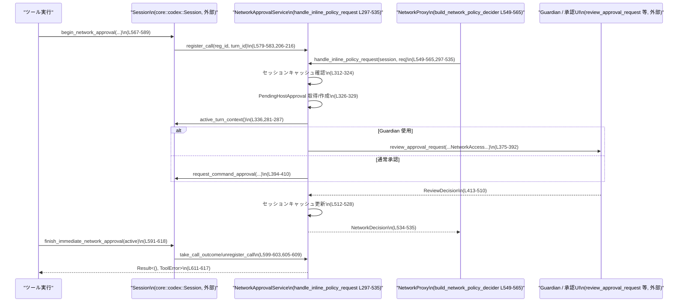

## core/src/tools/network_approval.rs

## 0. ざっくり一言

このモジュールは、**ネットワークアクセスが許可リスト（policy/allowlist）にない場合に、ユーザ／ガーディアンへの承認フローを実行し、その結果をネットワークプロキシとツール実行に反映するためのサービス**を提供します（`NetworkApprovalService` と補助関数群, `network_approval.rs:L176-535,538-632`）。

---

## 1. このモジュールの役割

### 1.1 概要

- ネットワークプロキシ（`codex_network_proxy`）からの **NetworkPolicyDecider / BlockedRequestObserver** を実装し、セッション単位でネットワーク許可／拒否を管理します（`build_network_policy_decider`, `build_blocked_request_observer`, `network_approval.rs:L538-565`）。
- 許可リストにないホストへのアクセスについて、**Guardian 経由のレビュー**または**通常の承認 UI** を用いた承認フローを実行し、その結果をキャッシュします（`handle_inline_policy_request`, `network_approval.rs:L297-535`）。
- ツール側からは `begin_network_approval` / `finish_*_network_approval` により、**「このツール実行全体としてネットワーク承認がどうなったか」** を `ToolError` として受け取れるようにします（`network_approval.rs:L567-618`）。

### 1.2 アーキテクチャ内での位置づけ

このモジュールは「セッション内のネットワークアクセス制御レイヤ」として、Session・Guardian・NetworkProxy の間で承認情報を橋渡しします。

```mermaid
graph TD
  subgraph "network_approval.rs"
    NAS["NetworkApprovalService\n(L176-535)"]
    DEC["build_network_policy_decider\n(L549-565)"]
    OBS["build_blocked_request_observer\n(L538-547)"]
  end

  S["Session\n(crate::codex::Session, 外部)"]
  NP["NetworkProxy\n(codex_network_proxy, 外部)"]
  G["Guardian / 承認UI\n(review_approval_request 等, 外部)"]

  NP -->|NetworkPolicyDecider\n(request)| DEC
  DEC -->|Arc<Session>| NAS
  NP -->|BlockedRequest| OBS
  OBS -->|record_blocked_request\n(L272-279)| NAS

  NAS -->|handle_inline_policy_request\n(L297-535)| NP
  NAS -->|request_command_approval /\nGuardianApprovalRequest (外部)| G
  S -->|begin/finish_*_network_approval\n(L567-618)| NAS
  NAS -->|call_outcomes\n(L261-270)| S
```

- NetworkProxy は `NetworkPolicyDecider` として `build_network_policy_decider` の戻り値を呼び出し、ブロック時には `BlockedRequestObserver`（`build_blocked_request_observer`）を呼びます。
- `NetworkApprovalService` は Session の一部として保持され、ツールの開始／終了時に `begin_network_approval` / `finish_*` が呼び出されます。

### 1.3 設計上のポイント

- **状態の分離とキャッシュ**
  - セッション内のネットワーク許可結果を `session_approved_hosts` / `session_denied_hosts` にホスト単位でキャッシュします（`network_approval.rs:L176-182,319-323,512-528`）。
  - 進行中のホスト単位の承認は `pending_host_approvals` に格納し、複数リクエストが同一ホストを叩いた時に承認結果を共有します（`L176-182,234-246,326-329`）。
- **ツール実行単位のアウトカム管理**
  - 1 つのツール実行ごとに `ActiveNetworkApprovalCall` を `active_calls` に登録し（`L176-182,206-216`）、ユーザ／ポリシーによる拒否理由を `call_outcomes` に記録します（`L176-182,248-270`）。
  - `finish_immediate_network_approval` はこの `call_outcomes` を `ToolError` に変換します（`L591-618`）。
- **非同期と並行性**
  - 共有状態はすべて `tokio::sync::Mutex` / `RwLock` を用いた **非同期ロック** で保護されています（`use tokio::sync::{Mutex,Notify,RwLock};` `L29-31`）。
  - 同一ホストの並行リクエストは `PendingHostApproval` と `Notify` を用いて待ち合わせし、1 回の承認で全てに結果を配布します（`L139-169,326-329`）。
- **ポリシーと UI の分岐**
  - サンドボックスポリシーや `AskForApproval` ポリシーによって、「そもそもユーザに聞いてよいか」を判断します（`L118-128,346-365`）。
  - Guardian 経由の承認か、通常の `request_command_approval` かを `routes_approval_to_guardian` で切り替えます（`L373-375`）。

---

## 2. 主要な機能一覧

- ネットワーク承認モード管理: `NetworkApprovalMode`, `ActiveNetworkApproval`, `DeferredNetworkApproval` による即時／遅延承認モードの管理（`L35-77`）。
- ホスト単位の承認キー生成とキャッシュ:
  - `HostApprovalKey` と `session_approved_hosts` / `session_denied_hosts` によるセッション内キャッシュ（`L79-84,176-182,512-528`）。
- ホスト単位の承認フロー実行:
  - `handle_inline_policy_request` による、許可リスト外ホストへのアクセス時の承認フローと NetworkDecision 変換（`L297-535`）。
- ツール実行単位の承認アウトカム管理:
  - `begin_network_approval` / `finish_immediate_network_approval` / `finish_deferred_network_approval` による実行全体としての承認結果管理（`L567-632`）。
- ネットワークプロキシとの統合:
  - `build_network_policy_decider` と `build_blocked_request_observer` による NetworkProxy へのフック提供（`L538-565`）。
- セッション間での承認状態の同期:
  - `sync_session_approved_hosts_to` による approved ホスト集合のコピー（`L196-204`）。

---

## 3. 公開 API と詳細解説

### 3.1 型一覧（構造体・列挙体など）

| 名前 | 種別 | 可視性 | 定義位置 | 役割 / 用途 |
|------|------|--------|----------|-------------|
| `NetworkApprovalMode` | enum | `pub(crate)` | `network_approval.rs:L35-39` | ネットワーク承認のモードを表現します。`Immediate` はツール実行終了時に結果を確定、`Deferred` は後から完了させるモードです。 |
| `NetworkApprovalSpec` | struct | `pub(crate)` | `network_approval.rs:L41-45` | ネットワーク承認の対象（`NetworkProxy`）とモードを束ねる設定です。`begin_network_approval` の引数に渡されます。 |
| `DeferredNetworkApproval` | struct | `pub(crate)` | `network_approval.rs:L47-56` | 遅延承認モードでの登録 ID を保持し、後から `finish_deferred_network_approval` でクリーンアップするために使われます。 |
| `ActiveNetworkApproval` | struct | `pub(crate)` | `network_approval.rs:L58-76` | 実行中のツールに紐づくネットワーク承認コンテキストを表します。登録 ID とモードを持ち、`into_deferred` で遅延用に変換可能です。 |
| `HostApprovalKey` | struct | private | `network_approval.rs:L79-94` | `host`/`protocol`/`port` の組をキーとして、ホスト単位の承認状態を識別するために使われます。 |
| `PendingApprovalDecision` | enum | private | `network_approval.rs:L105-110` | 1 回だけ許可／セッション中許可／拒否の内部的な承認結果を表します。 |
| `NetworkApprovalOutcome` | enum | private | `network_approval.rs:L112-116` | 1 つのツール実行に対して、「ユーザに拒否された」か「ポリシーによって拒否された」かを区別するアウトカムです。 |
| `PendingHostApproval` | struct | private | `network_approval.rs:L139-169` | あるホストに対する承認結果が決まるまで、複数リクエストを待ち合わせるための構造体です。内部に `Mutex<Option<PendingApprovalDecision>>` と `Notify` を持ちます。 |
| `ActiveNetworkApprovalCall` | struct | private | `network_approval.rs:L171-174` | `ActiveNetworkApproval` の登録 ID と、対応する `turn_id` を紐づけるための内部構造体です。Guardian 通知などで使用されます。 |
| `NetworkApprovalService` | struct | `pub(crate)` | `network_approval.rs:L176-193` | 本モジュールの中心となるサービスで、セッション内のネットワーク承認状態とツール実行ごとのアウトカムを管理します。 |

### 3.2 関数詳細（7 件）

#### 1. `NetworkApprovalService::handle_inline_policy_request(&self, session: Arc<Session>, request: NetworkPolicyRequest) -> NetworkDecision`

**概要**

- NetworkProxy からのポリシーチェック要求に対して、**ホスト単位のキャッシュとユーザ承認フロー**を組み合わせて最終的な `NetworkDecision` を返します（`network_approval.rs:L297-535`）。

**引数**

| 引数名 | 型 | 説明 |
|--------|----|------|
| `&self` | `&NetworkApprovalService` | セッションに紐づいたネットワーク承認サービス本体です。 |
| `session` | `Arc<Session>` | 現在のセッション。承認 UI の呼び出しやポリシー永続化に利用されます（`L371, 423-479`）。 |
| `request` | `NetworkPolicyRequest` | NetworkProxy から渡されるネットワークリクエスト情報。`host`/`port`/`protocol` を含みます（`L304-310`）。 |

**戻り値**

- `NetworkDecision`  
  - `Allow` または `deny("not_allowed")` を返します。  
  - `deny("not_allowed")` が返ると、そのネットワークリクエストはブロックされます（`L315-316, 344-345, 354-355, 364-365, 534-535`）。

**内部処理の流れ（アルゴリズム）**

根拠: `network_approval.rs:L297-535`

1. **プロトコルとキーの決定**
   - `NetworkProtocol` を `NetworkApprovalProtocol` に変換し（`L304-309`）、`HostApprovalKey::from_request` で `host`/`protocol`/`port` からキーを生成します（`L310, 87-93`）。

2. **セッションキャッシュの確認**
   - `session_denied_hosts` にキーがあれば即座に `deny("not_allowed")` を返します（`L312-317`）。
   - `session_approved_hosts` にキーがあれば即座に `Allow` を返します（`L319-323`）。

3. **ホスト単位の Pending 承認取得**
   - `get_or_create_pending_approval` で `HostApprovalKey` に対応する `PendingHostApproval` を取得／作成します（`L326-329, 234-246`）。
   - 既存のものがあれば `is_owner == false` となり、`wait_for_decision()` でオーナーの決定を待ち、その結果を `NetworkDecision` に変換して返します（`L326-329, 152-160,130-137`）。

4. **承認フローの実行条件確認（owner の場合）**
   - `active_turn_context` でアクティブターンの `TurnContext` を取得できなければ、即座に拒否し、`DeniedByPolicy` を記録します（`L336-345, 281-287, 340-343`）。
   - `sandbox_policy_allows_network_approval_flow` でサンドボックスがネットワーク承認フローを許可しているか確認し、ダメなら同様に拒否します（`L346-355,123-128`）。
   - `allows_network_approval_flow` で「承認を尋ねて良いか」を確認し、`AskForApproval::Never` なら同様に拒否します（`L356-365,118-121`）。

5. **承認フローの実行**
   - `NetworkApprovalContext` を構築し（`L367-370`）、`resolve_single_active_call` でツール実行単位の `ActiveNetworkApprovalCall` を取得します（`L371,225-232`）。
   - `routes_approval_to_guardian` により Guardian 経由かどうかを判定し（`L373`）、  
     - Guardian 経由なら `review_approval_request` を呼び出し（`L375-392`）、  
     - そうでなければ `session.request_command_approval` を呼び出して承認 UI を表示します（`L394-410`）。
   - どちらも `ReviewDecision` を返す前提でマッチングします（`L413-510`）。

6. **ReviewDecision の解釈とセッションキャッシュ更新**
   - `Approved`/`ApprovedExecpolicyAmendment` → `AllowOnce`（1 回のみ許可）（`L415-417`）。
   - `ApprovedForSession` → `AllowForSession`（セッション中のキャッシュ approved に登録）（`L418,512-519`）。
   - `NetworkPolicyAmendment`:
     - `Allow` → ポリシーを永続化しようとし、成功時はメッセージ送信、失敗時は `warn!` と WarningEvent を送信（`L422-450,423-449`）。`AllowForSession` として扱います。
     - `Deny` → 同様に永続化処理ののち、`owner_call` があれば `NetworkApprovalOutcome::DeniedByUser` を記録し（`L452-487,480-485`）、セッション deny キャッシュに登録します（`L521-528`）。
   - `Denied`/`TimedOut`/`Abort`:
     - Guardian 経由であれば `guardian_rejection_message` の内容を `DeniedByPolicy` として記録（`L491-500`）。
     - そうでなければ `DeniedByUser` として記録します（`L501-506`）。
     - いずれも `PendingApprovalDecision::Deny` になります（`L508`）。

7. **待ち合わせ解除と NetworkDecision 変換**
   - セッションの approved/denied キャッシュを更新（`L512-528`）。
   - `PendingHostApproval::set_decision` で決定を保存し `Notify` で他待機者を起こしたのち、`pending_host_approvals` からエントリを削除します（`L530-532,162-168`）。
   - 最後に `PendingApprovalDecision::to_network_decision` で `NetworkDecision` に変換して返します（`L534-535,130-137`）。

**Examples（使用例）**

> 注意: `Session` や NetworkProxy の具体的な構成はこのファイルにはないため、疑似コードとなります。

```rust
// 疑似コード: NetworkProxy の NetworkPolicyDecider として登録された場合の呼び出し
async fn on_network_request(
    service: Arc<NetworkApprovalService>, // セッションに紐づくサービス
    session: Arc<Session>,                // 現在のセッション
    request: NetworkPolicyRequest,        // プロキシからのリクエスト
) -> NetworkDecision {
    service
        .handle_inline_policy_request(session, request)
        .await
}
```

**Errors / Panics**

- 関数自体は `Result` を返さず、`NetworkDecision` のみを返します。
- 内部で呼び出している `persist_network_policy_amendment`, `request_command_approval`, `review_approval_request` 等がどのようなエラーを返すかは、このチャンクでは不明です。
- ポリシーの永続化に失敗した場合は、`warn!` でログを出力し、`WarningEvent` を送信するにとどまります（`L438-447,469-477`）。

**Edge cases（エッジケース）**

- **同一ホストへの並行アクセス**  
  最初のリクエストが承認フローの「オーナー」となり、それ以外は `wait_for_decision` で待機し、同じ結果を共有します（`L326-329,152-160`）。
- **アクティブターンが存在しない場合**  
  `active_turn_context` が `None` の場合、即座に `deny("not_allowed")` となり、`DeniedByPolicy` が記録されます（`L336-345,281-287`）。
- **サンドボックスやポリシーが承認フローを禁止している場合**  
  `sandbox_policy_allows_network_approval_flow` や `allows_network_approval_flow` が false を返すと、承認 UI は出ずに即拒否となります（`L346-365,118-128`）。
- **ActiveNetworkApprovalCall が複数ある場合**  
  `resolve_single_active_call` は `active_calls.len() == 1` のときのみ `Some` を返すため、複数の ActiveNetworkApprovalCall が登録されていると、`record_outcome_for_single_active_call` は何も記録しません（`L225-232,248-253`）。

**使用上の注意点**

- 複数のツール／ターンから同時に `begin_network_approval` を呼び出して `active_calls` が 2 件以上になると、`record_outcome_for_single_active_call` によってアウトカムがどの呼び出しにも結び付かない場合があります（`L176-182,225-253`）。
- `PendingHostApproval::wait_for_decision` は `set_decision` が呼ばれるまで待ち続けるため、オーナー側のフローが何らかの理由で完了しない場合、待機中のリクエストも返ってきません（`L152-160,162-168`）。

---

#### 2. `NetworkApprovalService::record_blocked_request(&self, blocked: BlockedRequest)`

**概要**

- NetworkProxy から通知された「すでにポリシーでブロックされたリクエスト」を受け取り、その内容を文字列メッセージに変換できる場合、**単一アクティブコールに対して `DeniedByPolicy` としてアウトカムを記録**します（`network_approval.rs:L272-279`）。

**引数**

| 引数名 | 型 | 説明 |
|--------|----|------|
| `&self` | `&NetworkApprovalService` | 承認サービス。 |
| `blocked` | `BlockedRequest` | ポリシーによりブロックされたネットワークリクエスト情報。 |

**戻り値**

- 戻り値はありません（`()`）。副作用として `call_outcomes` を更新します。

**内部処理の流れ**

根拠: `network_approval.rs:L272-279`

1. `denied_network_policy_message(&blocked)` を呼び出し、ユーザ向けメッセージを取得します。`None` の場合は何もせずに終了します（`L272-275`）。
2. メッセージがあれば、`record_outcome_for_single_active_call(NetworkApprovalOutcome::DeniedByPolicy(message))` を呼び出します（`L277-278`）。
3. `record_outcome_for_single_active_call` は `resolve_single_active_call` を使い、`active_calls` が 1 件のときのみそのコールの `registration_id` に対してアウトカムを記録します（`L248-253,225-232`）。

**Errors / Panics**

- エラーを返しません。`denied_network_policy_message` の挙動はこのチャンクには含まれていません。

**Edge cases**

- `active_calls` が 0 件または 2 件以上の場合、アウトカムはどのコールにも記録されません（`L225-232,248-253`）。
- `denied_network_policy_message` が `None` を返した場合、アウトカムは記録されません（`L272-275`）。

---

#### 3. `build_blocked_request_observer(network_approval: Arc<NetworkApprovalService>) -> Arc<dyn BlockedRequestObserver>`

**概要**

- NetworkProxy に渡す **BlockedRequestObserver** 実装を生成します。  
  実際には、`BlockedRequest` を受け取ると `NetworkApprovalService::record_blocked_request` を呼ぶ非同期クロージャです（`network_approval.rs:L538-547`）。

**引数**

| 引数名 | 型 | 説明 |
|--------|----|------|
| `network_approval` | `Arc<NetworkApprovalService>` | セッションに紐づいた承認サービス。クロージャ内でクローンされます。 |

**戻り値**

- `Arc<dyn BlockedRequestObserver>`  
  - `BlockedRequestObserver` の具体的なトレイト定義はこのチャンクにはありませんが、シグネチャから `Fn(BlockedRequest) -> Future<Output = ()>` のような形であると推測されます（推測であり、定義は不明です）。

**内部処理の流れ**

根拠: `network_approval.rs:L538-547`

1. 引数の `network_approval` をキャプチャしたクロージャを `Arc::new(move |blocked: BlockedRequest| { ... })` として返します（`L541-546`）。
2. クロージャ内では `network_approval` をクローンし、`async move { network_approval.record_blocked_request(blocked).await; }` を実行します（`L542-544`）。

**Examples（使用例）**

```rust
// 疑似コード: NetworkProxy 構築時に observer を設定する例
let approval_service = Arc::new(NetworkApprovalService::default());
let observer = build_blocked_request_observer(approval_service.clone());

// 以降、NetworkProxy 側で observer(blocked_request).await のように呼び出される想定です。
```

**使用上の注意点**

- `NetworkApprovalService` を `Arc` で受け取り、クロージャ内でクローンするため、**複数スレッド／タスクから安全に共有**できます（`L538-544`）。
- 観測された `BlockedRequest` が必ずしもアクティブなツール実行に結び付くとは限らず、その場合はアウトカムが記録されません（`L225-253,272-279`）。

---

#### 4. `build_network_policy_decider(network_approval: Arc<NetworkApprovalService>, network_policy_decider_session: Arc<RwLock<std::sync::Weak<Session>>>) -> Arc<dyn NetworkPolicyDecider>`

**概要**

- NetworkProxy に渡す **NetworkPolicyDecider** 実装を生成します。  
  セッションへの弱参照を保持し、アップグレードに成功した場合は `handle_inline_policy_request` を呼びます（`network_approval.rs:L549-565`）。

**引数**

| 引数名 | 型 | 説明 |
|--------|----|------|
| `network_approval` | `Arc<NetworkApprovalService>` | 承認サービス。 |
| `network_policy_decider_session` | `Arc<RwLock<std::sync::Weak<Session>>>` | `Session` への弱参照を包んだ `RwLock`。セッションのライフタイム管理に使われます。 |

**戻り値**

- `Arc<dyn NetworkPolicyDecider>`  
  - 実際には `move |request: NetworkPolicyRequest| async move { ... }` というクロージャです（`L553-563`）。

**内部処理の流れ**

根拠: `network_approval.rs:L549-565`

1. `request: NetworkPolicyRequest` を引数に取るクロージャを `Arc::new` で返します（`L553-564`）。
2. クロージャ内の `async move` では、
   - `network_policy_decider_session.read().await.upgrade()` で `Weak<Session>` を `Arc<Session>` にアップグレードし、失敗した場合は `NetworkDecision::ask("not_allowed")` を返します（`L557-559`）。
   - 成功した場合は `network_approval.handle_inline_policy_request(session, request).await` を呼び、その結果を返します（`L560-562,297-535`）。

**Errors / Panics**

- `NetworkDecision::ask("not_allowed")` の具体的な意味（上位レイヤがどう扱うか）はこのチャンクにはありません。
- `Session` への参照が切れている場合でも panic にはならず、安全に `ask` にフォールバックします（`L557-559`）。

**Edge cases**

- セッションが drop されていた場合、すべてのリクエストに対して `ask("not_allowed")` が返され、`handle_inline_policy_request` は呼ばれません（`L557-559`）。

---

#### 5. `begin_network_approval(session: &Session, turn_id: &str, has_managed_network_requirements: bool, spec: Option<NetworkApprovalSpec>) -> Option<ActiveNetworkApproval>`

**概要**

- ツール実行開始時に呼び出され、**そのツール実行に対するネットワーク承認トラッキングを開始**します。  
  条件を満たす場合のみ `ActiveNetworkApproval` を返し、`NetworkApprovalService` の `active_calls` に登録します（`network_approval.rs:L567-589`）。

**引数**

| 引数名 | 型 | 説明 |
|--------|----|------|
| `session` | `&Session` | 現在のセッション。内部の `services.network_approval` を使用します（`L579-583`）。 |
| `turn_id` | `&str` | このツール実行（ターン）を識別する ID。`ActiveNetworkApprovalCall` に保存されます（`L582-583,171-174`）。 |
| `has_managed_network_requirements` | `bool` | このツールが「マネージドネットワーク」を必要とするかどうかのフラグです（`L573-575`）。 |
| `spec` | `Option<NetworkApprovalSpec>` | ネットワーク承認の設定。`None` の場合は承認を開始しません（`L573`）。 |

**戻り値**

- `Option<ActiveNetworkApproval>`  
  - 条件を満たす場合にのみ `Some(ActiveNetworkApproval{..})` を返します（`L585-588`）。

**内部処理の流れ**

根拠: `network_approval.rs:L567-589`

1. `spec?` により、`spec` が `None` の場合は即座に `None` を返します（`L573`）。
2. `!has_managed_network_requirements || spec.network.is_none()` の場合も `None` を返し、何も登録しません（`L574-575`）。
3. 上記を通過した場合、`Uuid::new_v4().to_string()` で `registration_id` を生成します（`L578`）。
4. `session.services.network_approval.register_call(registration_id.clone(), turn_id.to_string()).await` により `active_calls` に登録します（`L579-583,206-216`）。
5. `ActiveNetworkApproval { registration_id: Some(registration_id), mode: spec.mode }` を `Some` で返します（`L585-588`）。

**Examples（使用例）**

```rust
// 疑似コード: ツール実行前に begin_network_approval を呼ぶ
let spec = NetworkApprovalSpec {
    network: Some(network_proxy),          // NetworkProxy の設定
    mode: NetworkApprovalMode::Immediate,  // 即時モード
};

let active = begin_network_approval(
    &session,
    turn_id,
    /*has_managed_network_requirements=*/ true,
    Some(spec),
).await;

// active が Some の場合のみ、後で finish_immediate_network_approval を呼ぶ前提で扱う。
```

**Edge cases**

- `has_managed_network_requirements == false`、または `spec.network.is_none()` の場合、`ActiveNetworkApproval` は生成されず、`active_calls` にも登録されません（`L573-575`）。
- その場合、後で `finish_immediate_network_approval` にこの `ActiveNetworkApproval` を渡すと、`registration_id` が `None` である可能性がありますが、そのケースは関数内で安全に無視されます（`L595-597`）。

---

#### 6. `finish_immediate_network_approval(session: &Session, active: ActiveNetworkApproval) -> Result<(), ToolError>`

**概要**

- `NetworkApprovalMode::Immediate` の場合に、ツール実行が終了したタイミングで呼び出されます。  
  `ActiveNetworkApproval` に対応するアウトカムを参照し、**ユーザ／ポリシーによる拒否を `ToolError::Rejected` に変換**します（`network_approval.rs:L591-618`）。

**引数**

| 引数名 | 型 | 説明 |
|--------|----|------|
| `session` | `&Session` | セッション。内部の `services.network_approval` を利用します（`L599-603,605-609`）。 |
| `active` | `ActiveNetworkApproval` | `begin_network_approval` から受け取ったコンテキストです。 |

**戻り値**

- `Result<(), ToolError>`  
  - `Ok(())` : ネットワーク承認上の問題なし、または何も起こらなかった。  
  - `Err(ToolError::Rejected(msg))` : ユーザ／ポリシーによって拒否された。

**内部処理の流れ**

根拠: `network_approval.rs:L591-618`

1. `active.registration_id.as_deref()` で登録 ID を取得し、`None` の場合はすぐ `Ok(())` を返します（`L595-597`）。
2. `take_call_outcome(registration_id).await` で `call_outcomes` からアウトカムを取り出します（`L599-603,256-259`）。
3. `unregister_call(registration_id).await` で `active_calls` からも削除します（`L605-609,218-223`）。
4. 取り出したアウトカムに応じてマッチします（`L611-617`）:
   - `Some(DeniedByUser)` → `ToolError::Rejected("rejected by user".to_string())`。
   - `Some(DeniedByPolicy(message))` → `ToolError::Rejected(message)`。
   - `None` → `Ok(())`。

**Examples（使用例）**

```rust
// 疑似コード: ツール実行後に finish_immediate_network_approval を呼ぶ
if let Some(active) = active_approval {
    if let Err(err) = finish_immediate_network_approval(&session, active).await {
        // ネットワークがユーザまたはポリシーにより拒否された
        eprintln!("Network approval failed: {:?}", err);
        // ツール全体としては失敗扱いにする、などの扱いが想定されます
    }
}
```

**Errors / Panics**

- `ToolError::Rejected` のみを返します。`ToolError` の他バリアントはこの関数では生成されません（`L611-616`）。
- `call_outcomes` に登録がない場合は `Ok(())` とみなされます（`L611-617`）。

**Edge cases**

- `record_call_outcome` が一度も呼ばれなかった場合（例: ネットワークアクセスが発生しなかった、または `active_calls` が 1 件でなかった場合）、`approval_outcome` は `None` となり、`Ok(())` が返ります（`L256-259,611-617`）。
- `record_call_outcome` が複数回呼ばれた場合、`DeniedByUser` が一度でも記録されると、その後の `DeniedByPolicy` は上書きされません（`L261-270`）。  
  → `finish_immediate_network_approval` が返すエラーは常に「ユーザ拒否」が優先されます。

---

#### 7. `finish_deferred_network_approval(session: &Session, deferred: Option<DeferredNetworkApproval>)`

**概要**

- `NetworkApprovalMode::Deferred` の場合に、後からネットワーク承認コンテキストをクリーンアップするための関数です。  
  アウトカムは処理せず、**登録の解除のみ**を行います（`network_approval.rs:L620-632`）。

**引数**

| 引数名 | 型 | 説明 |
|--------|----|------|
| `session` | `&Session` | セッション。 |
| `deferred` | `Option<DeferredNetworkApproval>` | 遅延承認用コンテキスト。`None` の場合は何もしません。 |

**戻り値**

- `()`（戻り値なし）

**内部処理の流れ**

根拠: `network_approval.rs:L620-632`

1. `let Some(deferred) = deferred else { return; };` により、`None` の場合は即時 return（`L624-625`）。
2. `deferred.registration_id()` を取得し（`L627,52-55`）、`session.services.network_approval.unregister_call(...)` を呼びます（`L627-631,218-223`）。

**Edge cases**

- 遅延承認中に `record_call_outcome` が何度か呼ばれている可能性はありますが、この関数は `call_outcomes` にはアクセスしません。  
  `unregister_call` 内で `call_outcomes.remove` が呼ばれるため（`L218-223`）、アウトカム情報は破棄されます。

---

### 3.3 その他の関数

以下は補助的な関数・メソッドの一覧です。

| 関数名 | 定義位置 | 役割（1 行） |
|--------|----------|--------------|
| `DeferredNetworkApproval::registration_id(&self) -> &str` | `network_approval.rs:L52-55` | 遅延承認コンテキストの登録 ID を返します。 |
| `ActiveNetworkApproval::mode(&self) -> NetworkApprovalMode` | `network_approval.rs:L64-67` | 実行中承認コンテキストのモードを取得します。 |
| `ActiveNetworkApproval::into_deferred(self) -> Option<DeferredNetworkApproval>` | `network_approval.rs:L69-76` | モードが `Deferred` かつ ID を持つ場合に `DeferredNetworkApproval` に変換します。 |
| `HostApprovalKey::from_request` | `network_approval.rs:L86-93` | NetworkPolicyRequest とプロトコルからキャッシュキーを生成します（host は小文字化）。 |
| `protocol_key_label` | `network_approval.rs:L96-103` | `NetworkApprovalProtocol` を文字列ラベルに変換します。 |
| `allows_network_approval_flow` | `network_approval.rs:L118-121` | `AskForApproval::Never` 以外なら true を返します。 |
| `sandbox_policy_allows_network_approval_flow` | `network_approval.rs:L123-128` | `SandboxPolicy::ReadOnly` または `WorkspaceWrite` の場合にネットワーク承認フローを許可します。 |
| `PendingApprovalDecision::to_network_decision` | `network_approval.rs:L130-137` | `Allow*` を `NetworkDecision::Allow` に、`Deny` を `NetworkDecision::deny("not_allowed")` に変換します。 |
| `PendingHostApproval::new` | `network_approval.rs:L145-150` | `decision = None` / 新しい `Notify` を持つインスタンスを生成します。 |
| `PendingHostApproval::wait_for_decision` | `network_approval.rs:L152-160` | `decision` が `Some` になるまで `Notify` で待機します。 |
| `PendingHostApproval::set_decision` | `network_approval.rs:L162-168` | `decision` をセットして、全待機者を起こします。 |
| `NetworkApprovalService::default` | `network_approval.rs:L184-193` | 空のマップ／セットで各フィールドを初期化します。 |
| `NetworkApprovalService::sync_session_approved_hosts_to` | `network_approval.rs:L196-204` | 他セッションの `session_approved_hosts` を、自身の内容で置き換えます。 |
| `NetworkApprovalService::register_call` | `network_approval.rs:L206-216` | `active_calls` に `ActiveNetworkApprovalCall` を登録します。 |
| `NetworkApprovalService::unregister_call` | `network_approval.rs:L218-223` | `active_calls` と `call_outcomes` から登録 ID を削除します。 |
| `NetworkApprovalService::resolve_single_active_call` | `network_approval.rs:L225-232` | `active_calls` が 1 件の場合にその要素を返します。 |
| `NetworkApprovalService::get_or_create_pending_approval` | `network_approval.rs:L234-246` | `HostApprovalKey` に対応する `PendingHostApproval` を取得／新規作成し、オーナーかどうかを返します。 |
| `NetworkApprovalService::record_outcome_for_single_active_call` | `network_approval.rs:L248-254` | 単一アクティブコールがある場合、そのコールのアウトカムを記録します。 |
| `NetworkApprovalService::take_call_outcome` | `network_approval.rs:L256-259` | `call_outcomes` からアウトカムを取り出し、削除します。 |
| `NetworkApprovalService::record_call_outcome` | `network_approval.rs:L261-270` | 既に `DeniedByUser` がある場合を除き、指定のアウトカムで上書きします。 |
| `NetworkApprovalService::active_turn_context` | `network_approval.rs:L281-287` | `session.active_turn` の最初のタスクから `TurnContext` を取得します。 |
| `NetworkApprovalService::format_network_target` | `network_approval.rs:L289-291` | `"protocol://host:port"` 形式の文字列を生成します。 |
| `NetworkApprovalService::approval_id_for_key` | `network_approval.rs:L293-295` | `"network#protocol#host#port"` 形式の承認 ID を生成します。 |

---

## 4. データフロー

### 4.1 代表的なシナリオ: ツール実行中のネットワーク承認

ツールがネットワークを使用し、そのアクセス先が allowlist にない場合の典型的なフローです。



要点:

- NetworkProxy からの問い合わせは常に `handle_inline_policy_request` を経由します。
- Guardian／承認 UI による決定は `ReviewDecision` として返り、`NetworkApprovalService` 内でキャッシュとアウトカムに変換されます。
- ツール側は begin/finish の 2 関数のみを意識すれば、ネットワーク承認の成功／失敗を `ToolError` として把握できます。

---

## 5. 使い方（How to Use）

### 5.1 基本的な使用方法

> 注意: `Session` や NetworkProxy の全体構造はこのチャンクには現れないため、以下はパターンを示す疑似コードです。

```rust
use std::sync::Arc;
use core::tools::network_approval::{
    NetworkApprovalService, NetworkApprovalSpec,
    NetworkApprovalMode,
    begin_network_approval,
    finish_immediate_network_approval,
    build_network_policy_decider,
    build_blocked_request_observer,
};

// Session 初期化時（疑似コード）
let approval_service = Arc::new(NetworkApprovalService::default());

// NetworkProxy 側へフックを渡す
let session_weak = Arc::new(tokio::sync::RwLock::new(Arc::downgrade(&session)));
let decider  = build_network_policy_decider(approval_service.clone(), session_weak.clone());
let observer = build_blocked_request_observer(approval_service.clone());

// ... decider / observer を NetworkProxy に登録する（実装はこのチャンクには不明）

// ツール実行開始前
let spec = NetworkApprovalSpec {
    network: Some(network_proxy),           // NetworkProxy 設定（型は use から推測）
    mode: NetworkApprovalMode::Immediate,
};

let active = begin_network_approval(
    &session,
    turn_id,
    /*has_managed_network_requirements*/ true,
    Some(spec),
).await;

// ツール本体を実行（内部でネットワークアクセスが発生する可能性がある）
run_tool(&session, turn_id).await?;

// 即時モードの場合、実行終了後にアウトカムを確認
if let Some(active) = active {
    finish_immediate_network_approval(&session, active).await?;
}
```

このパターンでは、ツール実行中のネットワークアクセスがポリシーによりブロックされたり、ユーザ／Guardian によって拒否された場合、`finish_immediate_network_approval` が `ToolError::Rejected` を返すことになります（`L611-616`）。

### 5.2 よくある使用パターン

1. **即時承認モード (`NetworkApprovalMode::Immediate`)**

   - begin → ツール実行 → finish_immediate の 3 ステップ。
   - ネットワーク拒否が発生したら、ツール全体を失敗扱いにする、といった扱いがしやすいです（`L567-589,591-618`）。

2. **遅延承認モード (`NetworkApprovalMode::Deferred`)**

   - `ActiveNetworkApproval::into_deferred()` を使って `DeferredNetworkApproval` に変換し、別のタイミングで `finish_deferred_network_approval` を呼ぶことができます（`L69-76,620-632`）。
   - アウトカム自体は途中で `record_call_outcome` から参照される設計ですが、このファイル内には遅延アウトカムの利用コードは現れていません（このチャンクからは詳細不明）。

### 5.3 よくある間違いと正しい例

```rust
// 間違い例: begin_network_approval の戻り値を無視して finish だけ呼ぶ
let _ = begin_network_approval(&session, turn_id, true, Some(spec)).await;
// ...
// active を保持していないため、ここで registration_id にアクセスできない
// finish_immediate_network_approval(&session, active).await?; // コンパイルエラー

// 正しい例: ActiveNetworkApproval を保持し、Option をチェックする
let active = begin_network_approval(&session, turn_id, true, Some(spec)).await;
// ...
if let Some(active) = active {
    finish_immediate_network_approval(&session, active).await?;
}
```

```rust
// 間違い例: has_managed_network_requirements を false のままにしてしまう
let active = begin_network_approval(&session, turn_id, false, Some(spec)).await;
// active は常に None になるので、実際には承認トラッキングが始まらない（L573-575）

// 正しい例: ツールがネットワークを使う場合は true を渡す
let active = begin_network_approval(&session, turn_id, true, Some(spec)).await;
```

### 5.4 使用上の注意点（まとめ）

- **ツール実行ごとの一意性**
  - `record_outcome_for_single_active_call` は `active_calls` が 1 件のときのみアウトカムを記録します（`L225-232,248-253`）。  
    複数ツール実行を同一セッションで並列に「管理ネットワーク付き」で走らせる場合、どの実行に対する拒否なのかが `call_outcomes` に紐づかないことがあります。
- **待機中リクエストのブロッキング**
  - `PendingHostApproval::wait_for_decision` はタイムアウトなしで待ち続けます（`L152-160`）。  
    オーナー側フローが中断されると、同一ホストへの並行リクエストも返って来ません。
- **キャッシュ粒度**
  - 承認キャッシュは `host` + `protocol` + `port` 単位であり、URL パスやクエリは考慮していません（`L79-84,87-93,289-291`）。
- **ポリシー永続化失敗時の挙動**
  - `NetworkPolicyAmendment` の永続化に失敗しても、承認自体は `AllowForSession` または `Deny` として処理されますが、ユーザには `WarningEvent` が送信されるのみです（`L422-450,452-490`）。

---

## 6. 変更の仕方（How to Modify）

### 6.1 新しい機能を追加する場合

- **新しいプロトコルをサポートしたい場合**
  1. `NetworkApprovalProtocol` に新しいバリアントが追加される前提で、`protocol_key_label` に対応するラベルを追加します（`network_approval.rs:L96-103`）。
  2. `handle_inline_policy_request` 冒頭の `match request.protocol` にも対応する変換を追加します（`L304-309`）。
  3. これにより `HostApprovalKey` のキー生成や `NetworkApprovalContext` の作成に新プロトコルが反映されます（`L310,367-370`）。

- **承認ポリシーの判定条件を増やしたい場合**
  - サンドボックスや `AskForApproval` に基づく判定はそれぞれ `sandbox_policy_allows_network_approval_flow`（`L123-128`）と `allows_network_approval_flow`（`L118-121`）に集約されているため、ここを変更することで影響範囲を限定しやすくなっています。

### 6.2 既存の機能を変更する場合の注意点

- **影響範囲の確認**
  - `NetworkApprovalService::handle_inline_policy_request` は NetworkProxy から全ての承認問い合わせで使われるため、変更はネットワーク全体の挙動に影響します（`L297-535`）。
  - `begin_network_approval` / `finish_*` の変更は、ツール実行全体の成功／失敗判定に直結します（`L567-618`）。

- **契約（コントラクト）の保持**
  - `record_call_outcome` は「一度 `DeniedByUser` が記録されたら、それ以降は上書きしない」という前提で実装されています（`L261-270`）。  
    これに依存する呼び出し元がある可能性があるため、この性質を変える場合は十分なテストが必要です。
  - `PendingHostApproval` は「必ず `set_decision` が呼ばれる」ことを前提に `wait_for_decision` が無限ループになっています（`L152-160,162-168`）。この契約を崩すと待ちが解消されなくなります。

- **テスト**
  - `#[cfg(test)] mod tests;` により `network_approval_tests.rs` が存在しますが、このチャンクには内容が含まれていません（`L634-636`）。  
    挙動変更時はこのテストファイルを確認・更新する必要があります。

---

## 7. 関連ファイル

このモジュールと密接に関係する外部ファイル・モジュール（use から判明する範囲）を示します。

| パス / モジュール | 役割 / 関係 |
|-------------------|------------|
| `crate::codex::Session` | セッション全体を表す型。`active_turn` や `services.network_approval`、`request_command_approval`、`persist_network_policy_amendment` などを提供します（`network_approval.rs:L1,281-287,398-409,423-479,579-583,599-609`）。実装はこのチャンクには現れません。 |
| `crate::guardian::{GuardianApprovalRequest, review_approval_request, new_guardian_review_id, guardian_rejection_message, routes_approval_to_guardian}` | Guardian 経由の承認／拒否フローを提供します。NetworkAccess 用のリクエスト型やレビュー ID の生成、拒否メッセージ取得など（`L2-6,373-392,491-500`）。 |
| `crate::network_policy_decision::denied_network_policy_message` | `BlockedRequest` からユーザ向けの拒否メッセージ文字列を生成する関数です（`L7,272-275`）。 |
| `crate::tools::sandboxing::ToolError` | ツール実行におけるエラー型。`finish_immediate_network_approval` で `Rejected` エラーとして使用されます（`L8,591-618`）。 |
| `codex_network_proxy::{BlockedRequest, BlockedRequestObserver, NetworkDecision, NetworkPolicyDecider, NetworkPolicyRequest, NetworkProtocol, NetworkProxy}` | ネットワークプロキシの API。NetworkDecision やポリシーリクエスト、プロトコル種別などを提供します（`L9-15`）。 |
| `codex_protocol::approvals::{NetworkApprovalContext, NetworkApprovalProtocol, NetworkPolicyRuleAction}` | ネットワーク承認プロトコルに関する型群。承認コンテキスト・プロトコル種別・ポリシールールのアクション（Allow/Deny）を表します（`L16-18,367-370,422-423,452-453`）。 |
| `codex_protocol::protocol::{AskForApproval, Event, EventMsg, ReviewDecision, SandboxPolicy, WarningEvent}` | 承認ポリシー、レビュー結果、サンドボックス設定、イベント送受信用型などです（`L19-24,118-128,413-510,438-447,469-477`）。 |
| `core/src/tools/network_approval_tests.rs` | 本モジュールのテストコードが格納されると推定されます。内容はこのチャンクには含まれません（`L634-636`）。 |

---

以上が `core/src/tools/network_approval.rs` の構造と振る舞いの概要です。この説明は、提示されたコード（本チャンク）に基づくものであり、他ファイルの実装や外部コンポーネントの詳細については「不明」としています。
