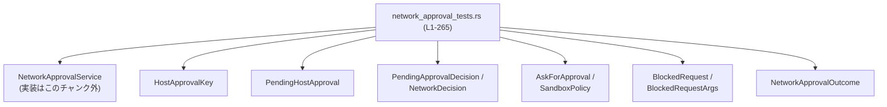
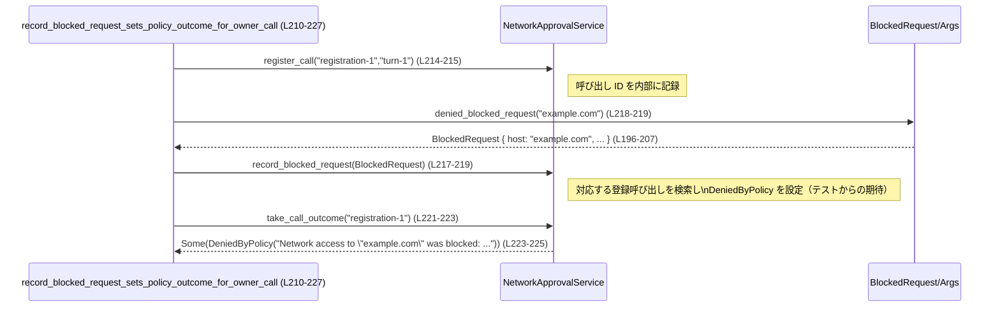
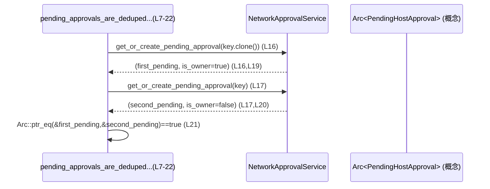

core/src/tools/network_approval_tests.rs

---

## 0. ざっくり一言

`network_approval_tests.rs` は、`NetworkApprovalService` と関連型まわりの「ネットワーク承認フロー」の振る舞いを検証するテスト群です。保留中承認のデデュープ、セッション単位の許可ホスト管理、ポリシーによる承認フローの有効・無効、そしてブロックされたリクエストから呼び出し結果へのマッピングがテストされています。

---

## 1. このモジュールの役割

### 1.1 概要

- このモジュールは、ネットワークアクセスを行うコードに対して  
  **ユーザー承認・ポリシー判定・ブロックイベント** をどのように扱うかを検証するために存在します。
- 具体的には以下の点をテストしています。
  - ホスト単位の保留中承認の共有・デデュープ（`get_or_create_pending_approval`）（`network_approval_tests.rs:L7-44`）
  - セッション内での「許可済みホスト」の同期と置き換え（`sync_session_approved_hosts_to`）（`network_approval_tests.rs:L46-144`）
  - 保留中承認オブジェクトへの待機者（waiter）への決定伝搬（`PendingHostApproval`）（`network_approval_tests.rs:L146-161`）
  - AskForApproval 設定や SandboxPolicy による承認フローの有効化条件（`network_approval_tests.rs:L175-193`）
  - ブロックされたリクエストから `NetworkApprovalOutcome` への結果反映とその優先順位（`network_approval_tests.rs:L210-265`）

### 1.2 アーキテクチャ内での位置づけ

このファイル自体はテストモジュールであり、実装は `use super::*;` で親モジュールから取り込まれています（`network_approval_tests.rs:L1`）。  
外部クレートとしてネットワークプロキシとプロトコル定義を利用します（`network_approval_tests.rs:L2-4`）。

- `codex_network_proxy::BlockedRequestArgs`（ブロックされたリクエストの構築用）
- `codex_protocol::protocol::{AskForApproval, SandboxPolicy}`（承認ポリシー・サンドボックスモード）

依存関係のイメージは次の通りです（ノード名には代表的な型名を記載しています）。



> 実装本体（`NetworkApprovalService` など）はこのチャンクには現れません。そのため内部構造は不明で、テストから見える振る舞いのみを記述します。

### 1.3 設計上のポイント（テストから読み取れる仕様）

- **保留中承認のデデュープ単位**
  - 同一の `HostApprovalKey`（host + protocol + port）が渡された場合、同じ `Arc` で保留オブジェクトが共有され、最初の呼び出しだけが「owner」として扱われます（`network_approval_tests.rs:L16-21`）。
  - port が異なる場合は別オブジェクトとして扱われ、両方が owner になります（`network_approval_tests.rs:L38-43`）。
- **セッション許可ホストの扱い**
  - `session_approved_hosts` は非同期ロック（`lock().await`）で保護された集合として扱われています（`network_approval_tests.rs:L50-51,L73-80,L108-113,L118-123,L128-134`）。
  - `sync_session_approved_hosts_to` は source の集合で target の集合を**完全に置き換える**挙動をします（`network_approval_tests.rs:L105-143`）。
- **非同期・並行性**
  - テストは `#[tokio::test]` で実行され、`Arc` と `tokio::spawn` を用いて複数タスク間で `PendingHostApproval` を共有しています（`network_approval_tests.rs:L146-153`）。
  - `PendingHostApproval::wait_for_decision` は別タスクで待機し、`set_decision` により決定が通知されることを検証しています（`network_approval_tests.rs:L155-160`）。
- **ポリシーによる承認フローの列挙的制御**
  - `AskForApproval::Never` の場合のみ承認フローが無効、それ以外は有効とするシンプルなブーリアン判定をテストしています（`network_approval_tests.rs:L175-181`）。
  - `SandboxPolicy` では「制限付きモード（読み取り専用・ワークスペース書き込み）」でのみ承認フローを許可し、`DangerFullAccess` では無効とする挙動をテストしています（`network_approval_tests.rs:L183-193`）。
- **ブロックされたリクエストからの結果反映**
  - 1 つの登録済み呼び出しに対するポリシー上のブロックを `NetworkApprovalOutcome::DeniedByPolicy` として記録する（`network_approval_tests.rs:L211-227`）。
  - ユーザーによる拒否（`DeniedByUser`）はポリシーによるブロックで**上書きされない**（`network_approval_tests.rs:L229-247`）。
  - 同一ターンに複数の登録がある場合など、ブロックされたリクエストを一意にひも付けられない場合はアウトカムを**設定しない**（`network_approval_tests.rs:L249-265`）。

---

## 2. 主要な機能一覧（テスト観点）

このファイルで検証されている主要な振る舞いは次の通りです。

- 保留中承認のデデュープ:
  - 同一 host/protocol/port に対して `get_or_create_pending_approval` が同じ保留オブジェクトを返し、最初の呼び出しのみ owner になる（`network_approval_tests.rs:L7-22`）。
- ポート間の分離:
  - port が異なる場合は別の保留オブジェクトとして扱われ、両方が owner になる（`network_approval_tests.rs:L24-44`）。
- セッション内の許可ホスト同期:
  - `session_approved_hosts` の内容が `sync_session_approved_hosts_to` により別インスタンスへコピーされ、host/protocol/port の組が保持される（`network_approval_tests.rs:L46-102`）。
  - コピー時には target 側の既存エントリが完全に置き換えられる（`network_approval_tests.rs:L104-144`）。
- 保留中承認への待機と決定通知:
  - `PendingHostApproval::wait_for_decision` の待機者が `set_decision` による決定を受け取る（`network_approval_tests.rs:L146-161`）。
- 承認決定からネットワーク決定へのマッピング:
  - `AllowOnce` と `AllowForSession` の両方が `NetworkDecision::Allow` へマッピングされる（`network_approval_tests.rs:L163-173`）。
- 承認フローの有効・無効判定:
  - AskForApproval 設定に応じて `allows_network_approval_flow` が true/false を返す（`network_approval_tests.rs:L175-181`）。
  - `SandboxPolicy` に応じて `sandbox_policy_allows_network_approval_flow` が true/false を返す（`network_approval_tests.rs:L183-193`）。
- ブロックされたリクエストの扱い:
  - 単一の登録呼び出しに対するブロックを `DeniedByPolicy` として記録（`network_approval_tests.rs:L211-227`）。
  - ユーザーによる拒否をポリシーブロックで上書きしない（`network_approval_tests.rs:L229-247`）。
  - 複数登録などで曖昧なブロックは無視し、アウトカムを設定しない（`network_approval_tests.rs:L249-265`）。

---

## 3. 公開 API と詳細解説（テストから見える部分）

### 3.1 型一覧（構造体・列挙体など）

> 「種別」はテストから推測されるものを記載し、実装がこのチャンクに存在しない場合はその旨を明記します。

| 名前 | 種別（推測） | 役割 / 用途 | 根拠 |
|------|-------------|-------------|------|
| `NetworkApprovalService` | 構造体 | ネットワーク承認フロー全体を管理するサービス。`default()` で生成され、保留中承認の取得、セッション許可ホストの同期、呼び出し結果やブロックイベントの記録に利用されます。 | 生成とメソッド呼び出し: `network_approval_tests.rs:L9,L26,L48,L70,L105-107,L116,L212,L231,L251` |
| `HostApprovalKey` | 構造体 | ホスト承認のキー。`host: String`, `protocol: &str`, `port: u16` の 3 つで構成されることがテストから分かります。保留中承認とセッション許可ホストの両方で利用されています。 | フィールド初期化: `network_approval_tests.rs:L10-14,L27-31,L32-36,L51-67,L85-100,L109-113,L120-123,L139-142` |
| `PendingHostApproval` | 構造体（推測） | ある `HostApprovalKey` に対する保留中承認を表すオブジェクト。決定が出るまでの間、複数のタスクが `wait_for_decision` で待機するために共有されます。 | 生成と使用: `network_approval_tests.rs:L148-157` |
| `PendingApprovalDecision` | 列挙体（推測） | 承認フローにおける決定を表します。テストから `AllowOnce` と `AllowForSession` というバリアントが存在します。 | バリアントと使用: `network_approval_tests.rs:L156-157,L160,L166-172` |
| `NetworkDecision` | 列挙体（推測） | 実際のネットワークアクセスを許可するかどうかの決定。少なくとも `Allow` バリアントが存在します。 | 使用: `network_approval_tests.rs:L167-168,L171-172` |
| `AskForApproval` | 列挙体 | ネットワーク承認フローをいつ行うかを表す設定値。`Never`, `OnRequest`, `OnFailure`, `UnlessTrusted` が存在します。 | 使用: `network_approval_tests.rs:L177-180` |
| `SandboxPolicy` | 列挙体または構造体 | サンドボックスモードを表すポリシー。`new_read_only_policy`, `new_workspace_write_policy` というコンストラクタ（関連関数）と、`DangerFullAccess` というバリアントがテストに現れます。 | 使用: `network_approval_tests.rs:L185-193` |
| `BlockedRequest` | 構造体 | ネットワークプロキシによってブロックされたリクエストを表します。`BlockedRequestArgs` から生成されます。 | `BlockedRequest::new(...)`: `network_approval_tests.rs:L196-207` |
| `BlockedRequestArgs` | 構造体 | `BlockedRequest` を構築するためのパラメータセット。`host`, `reason`, `client`, `method`, `mode`, `protocol`, `decision`, `source`, `port` フィールドが存在します。 | フィールド初期化: `network_approval_tests.rs:L197-207` |
| `NetworkApprovalOutcome` | 列挙体（推測） | 呼び出しごとのネットワーク承認の結果。`DeniedByPolicy(String)` と `DeniedByUser` バリアントが確認できます。 | 使用: `network_approval_tests.rs:L223-225,L237-245` |

> これらの型定義自体はこのファイルには存在しないため、詳細なフィールドやメソッドは不明です。

---

### 3.2 関数詳細（最大 7 件）

#### 1. `NetworkApprovalService::get_or_create_pending_approval(...)`

**概要**

- 与えられた `HostApprovalKey` に対する保留中承認オブジェクトを取得または新規作成する非同期メソッドです。
- 戻り値は 2 要素のタプルで、1 つ目が保留オブジェクト（`Arc<...>` 型と推測）、2 つ目が「この呼び出しが保留オブジェクトのオーナーかどうか」を示す `bool` です（`network_approval_tests.rs:L16-21,L38-43`）。

**引数（テストから判明している部分）**

| 引数名 | 型 | 説明 |
|--------|----|------|
| `self` | `&NetworkApprovalService` | サービスインスタンス。`default()` で生成されます（`network_approval_tests.rs:L9,L26`）。 |
| `key` | `HostApprovalKey` | host/protocol/port を含む承認キー（`network_approval_tests.rs:L10-14,L27-36`）。 |

**戻り値**

- 型: `(PendingHandle, bool)` という 2 要素タプル。
  - `PendingHandle`: 型名はこのチャンクには現れませんが、`Arc::ptr_eq(&first, &second)` で比較されているため `Arc<T>` と推測されます（`network_approval_tests.rs:L21,L43`）。
  - `bool`: この呼び出しが新規に保留オブジェクトを作成した「オーナー」であれば `true`、既存の保留オブジェクトを取得しただけなら `false` です（`network_approval_tests.rs:L19-20,L41-42`）。

**内部処理の流れ（テストから見える仕様）**

> 実際の実装は不明ですが、テストから期待される外部挙動を整理します。

1. `HostApprovalKey` をキーに内部のマップ等を参照する（推測）。
2. 同一の host/protocol/port について、既に保留オブジェクトが存在する場合:
   - 既存の `Arc<...>` を返し、オーナーフラグは `false` とする（`network_approval_tests.rs:L16-21`）。
3. 存在しない場合:
   - 新しい保留オブジェクトを生成し、`Arc` で包んで保存する。
   - その `Arc` とオーナーフラグ `true` を返す（`network_approval_tests.rs:L19,L41`）。
4. `HostApprovalKey` の port が異なる場合は別のキーとして扱われ、別オブジェクトが生成される（`network_approval_tests.rs:L24-44`）。

**Examples（使用例）**

テストに基づく使用例です。

```rust
// NetworkApprovalService を初期化する
let service = NetworkApprovalService::default(); // network_approval_tests.rs:L9

// host/protocol/port でキーを作る
let key = HostApprovalKey {                         // L10-14
    host: "example.com".to_string(),
    protocol: "http",
    port: 443,
};

// 1回目の呼び出し: 新規作成され owner になる
let (first, first_is_owner) = service
    .get_or_create_pending_approval(key.clone())    // L16
    .await;
assert!(first_is_owner);                            // L19

// 2回目の呼び出し: 同じキーなので同じ Arc が返るが owner ではない
let (second, second_is_owner) = service
    .get_or_create_pending_approval(key)            // L17
    .await;
assert!(!second_is_owner);                          // L20
assert!(Arc::ptr_eq(&first, &second));              // L21
```

**Errors / Panics**

- テストコードでは `Result` を返している様子や `?` 演算子の使用が無く、エラー経路は確認できません（`network_approval_tests.rs:L16-17,L38-39`）。
- パニック条件についても、このチャンクからは分かりません。

**Edge cases（エッジケース）**

- **同一キー（host/protocol/port が完全に一致）**  
  → 同じ保留オブジェクトが共有され、2 回目以降の呼び出しは owner になりません（`network_approval_tests.rs:L7-22`）。
- **port のみ異なる**  
  → 別の保留オブジェクトが生成され、それぞれ owner になります（`network_approval_tests.rs:L24-44`）。
- **host や protocol が異なる場合**  
  → テストでは扱われておらず、このチャンクからは挙動が不明です。

**使用上の注意点**

- 同じ host/protocol/port について複数の呼び出しを行う場合、少なくとも最初の呼び出しが「owner」として決定を下す前提になっていると考えられます（`PendingHostApproval` と組み合わせた利用が想定されるため）。
- owner でない呼び出し側は、返された保留オブジェクトに対して決定を設定する権限がない設計である可能性がありますが、このチャンクからは断定できません。

---

#### 2. `NetworkApprovalService::sync_session_approved_hosts_to(&self, target: &NetworkApprovalService)`

**概要**

- `self` の `session_approved_hosts` セットを `target` にコピーし、target の既存の許可ホストを置き換える非同期メソッドです（`network_approval_tests.rs:L70-72,L126-143`）。

**引数**

| 引数名 | 型 | 説明 |
|--------|----|------|
| `self` | `&NetworkApprovalService` | コピー元のサービス。 |
| `target` | `&NetworkApprovalService` | コピー先のサービス。 |

**戻り値**

- テストでは戻り値を利用しておらず、`await` のみを行っています（`network_approval_tests.rs:L71,L126-127`）。  
  → 戻り値は `()` であるか、少なくともエラーを返していないと推測されます。

**内部処理の流れ（テストから見える仕様）**

1. `self.session_approved_hosts` をロックし、現在のセットを取得する（`network_approval_tests.rs:L50-51`）。
2. `target.session_approved_hosts` をロックし、**既存のセットをクリアした上で** source 側のセットをコピーする（`network_approval_tests.rs:L116-124,L136-143` から「既存の stale エントリが消える」ことが分かる）。
3. host/protocol/port の組はそのまま保持され、順序は問われない（テストではソートして比較している: `network_approval_tests.rs:L73-81`）。

**Examples（使用例）**

```rust
let source = NetworkApprovalService::default();
{
    // source に許可ホストを登録する
    let mut approved_hosts = source.session_approved_hosts.lock().await; // L50
    approved_hosts.extend([
        HostApprovalKey {                                // L51-56
            host: "example.com".to_string(),
            protocol: "https",
            port: 443,
        },
        // …省略…
    ]);
}

let target = NetworkApprovalService::default();

// source のセッション許可ホストで target を上書きする
source.sync_session_approved_hosts_to(&target).await;    // L126-127
```

**Errors / Panics**

- エラー型は使用されておらず、`?` も使われていないため、テストからはエラー経路は見えません。

**Edge cases**

- **target に既にエントリがある場合**  
  → 完全に置き換えられ、source 側のエントリのみが残る（`network_approval_tests.rs:L104-144`）。
- **source が空の集合の場合**  
  → テストには登場せず、このチャンクからは挙動不明です（target が空になる可能性が高いですが推測の域を出ません）。

**使用上の注意点**

- target 側の既存の `session_approved_hosts` が失われる設計であるため、「マージ」ではなく「同期（上書き）」である点に注意が必要です（`network_approval_tests.rs:L116-124,L136-143`）。
- 複数タスクから同時に `sync_session_approved_hosts_to` を呼ぶようなケースの挙動は、このチャンクからは分かりません。

---

#### 3. `PendingHostApproval::wait_for_decision(&self)` / `set_decision(&self, decision: PendingApprovalDecision)`

**概要**

- `PendingHostApproval` は、あるホストへのアクセス許可が「決定されるまで」を表現するオブジェクトです。
- `wait_for_decision` はその決定が出るまで非同期に待ち、`PendingApprovalDecision` を返します（`network_approval_tests.rs:L150-153,L159-160`）。
- `set_decision` は決定を設定し、待機中のタスクへ通知します（`network_approval_tests.rs:L155-157`）。

**引数**

`wait_for_decision`:

| 引数名 | 型 | 説明 |
|--------|----|------|
| `self` | `&PendingHostApproval` | 保留中承認オブジェクトへの参照。`Arc` 経由で共有されます。 |

`set_decision`:

| 引数名 | 型 | 説明 |
|--------|----|------|
| `self` | `&PendingHostApproval` | 同上。 |
| `decision` | `PendingApprovalDecision` | 設定する決定（例: `AllowOnce`）。 |

**戻り値**

- `wait_for_decision` は `PendingApprovalDecision` を返します（`network_approval_tests.rs:L159-160`）。
- `set_decision` の戻り値は使われておらず、`await` されるのみです（`network_approval_tests.rs:L155-157`）。

**内部処理の流れ（テストから見える仕様）**

1. `PendingHostApproval::new` で新しい保留オブジェクトを作成（`network_approval_tests.rs:L148`）。
2. 別タスクが `wait_for_decision().await` で待機（`network_approval_tests.rs:L150-153`）。
3. その後、元のタスクが `set_decision(PendingApprovalDecision::AllowOnce).await` を呼ぶ（`network_approval_tests.rs:L155-157`）。
4. `wait_for_decision` が決定を受け取り、同じ `PendingApprovalDecision::AllowOnce` を返す（`network_approval_tests.rs:L159-160`）。

**Examples（使用例）**

```rust
let pending = Arc::new(PendingHostApproval::new()); // L148

// 別タスクで決定を待つ
let waiter = {
    let pending = Arc::clone(&pending);             // L151
    tokio::spawn(async move {
        pending.wait_for_decision().await          // L152
    })
};

// どこかで決定が行われる
pending
    .set_decision(PendingApprovalDecision::AllowOnce) // L155-157
    .await;

// 待機タスクは決定を受け取る
let decision = waiter.await.expect("waiter should complete"); // L159
assert_eq!(decision, PendingApprovalDecision::AllowOnce);     // L160
```

**Errors / Panics**

- `wait_for_decision` 自体がエラーを返すケースはテストには現れません。
- `tokio::spawn` の戻り値（`JoinHandle`）に対して `expect` を呼んでいるため、タスク側のパニックなどがあればここで検出されます（`network_approval_tests.rs:L159`）。

**Edge cases**

- **複数の waiters**  
  → テストでは 1 つの waiter しか登場せず、複数待機者がいる場合に全員に通知されるかは不明です。
- **`set_decision` が複数回呼ばれた場合**  
  → テストには現れず、どの決定が採用されるかはこのチャンクからは分かりません。

**使用上の注意点**

- `PendingHostApproval` は `Arc` で共有されることが前提の設計です（`network_approval_tests.rs:L148-153`）。
- 非同期コンテキスト（Tokio ランタイム）上で `wait_for_decision` / `set_decision` を呼び出す必要があります（`#[tokio::test]`・`tokio::spawn` を利用: `network_approval_tests.rs:L146-153`）。

---

#### 4. `PendingApprovalDecision::to_network_decision(&self) -> NetworkDecision`

**概要**

- 承認決定（1 回だけ許可 / セッション中許可など）を、実際のネットワークアクセス判定（現在のリクエストを許可するか）に変換するメソッドです。
- 少なくとも、`AllowOnce` と `AllowForSession` の両方が `NetworkDecision::Allow` へマッピングされます（`network_approval_tests.rs:L163-173`）。

**引数**

| 引数名 | 型 | 説明 |
|--------|----|------|
| `self` | `&PendingApprovalDecision` | 変換元の決定。 |

**戻り値**

- `NetworkDecision`。テストでは `Allow` が使用されています（`network_approval_tests.rs:L167-168,L171-172`）。

**内部処理の流れ（テストから見える仕様）**

1. `AllowOnce` → `NetworkDecision::Allow` を返す。
2. `AllowForSession` → `NetworkDecision::Allow` を返す。

他のバリアント（存在する場合）の振る舞いはこのチャンクからは不明です。

**Examples（使用例）**

```rust
assert_eq!(
    PendingApprovalDecision::AllowOnce.to_network_decision(),  // L166
    NetworkDecision::Allow                                     // L167-168
);
assert_eq!(
    PendingApprovalDecision::AllowForSession.to_network_decision(), // L170
    NetworkDecision::Allow                                         // L171-172
);
```

**Edge cases / 使用上の注意点**

- `Deny` や `AlwaysDeny` のような他の決定バリアントの挙動は、このチャンクには現れません。
- ネットワーク決定の粒度（セッション単位かリクエスト単位か）は `NetworkDecision` 側の設計に依存し、このファイルからは分かりません。

---

#### 5. `allows_network_approval_flow(policy: AskForApproval) -> bool`

**概要**

- `AskForApproval` 設定に基づいて、「ネットワーク承認フロー（ユーザーへの問い合わせ）」を有効にするかどうかを判定する関数です（`network_approval_tests.rs:L175-181`）。

**引数**

| 引数名 | 型 | 説明 |
|--------|----|------|
| `policy` | `AskForApproval` | 承認フローをいつ実行するかの設定値。 |

**戻り値**

- `bool`:
  - `AskForApproval::Never` → `false`
  - `AskForApproval::OnRequest` → `true`
  - `AskForApproval::OnFailure` → `true`
  - `AskForApproval::UnlessTrusted` → `true`

**Examples（使用例）**

```rust
assert!(!allows_network_approval_flow(AskForApproval::Never));          // L177
assert!(allows_network_approval_flow(AskForApproval::OnRequest));       // L178
assert!(allows_network_approval_flow(AskForApproval::OnFailure));       // L179
assert!(allows_network_approval_flow(AskForApproval::UnlessTrusted));   // L180
```

**Edge cases / 使用上の注意点**

- 将来 `AskForApproval` に新しいバリアントが追加された場合、この関数の対応も必要になります。その際はこのテストの拡張が必要です。
- `Never` だけが承認フローを完全に無効化する、という仕様がこのテストで固定化されています。

---

#### 6. `sandbox_policy_allows_network_approval_flow(policy: &SandboxPolicy) -> bool`

**概要**

- サンドボックスポリシーに基づいて、ネットワーク承認フローを有効にするかどうかを判定する関数です（`network_approval_tests.rs:L183-193`）。
- 制限付きモードでは承認フローを許可し、完全なフルアクセスモードでは承認フローを無効にします。

**引数**

| 引数名 | 型 | 説明 |
|--------|----|------|
| `policy` | `&SandboxPolicy` | サンドボックスモードを表すポリシー。 |

**戻り値**

- `bool`:
  - `SandboxPolicy::new_read_only_policy()` → `true`
  - `SandboxPolicy::new_workspace_write_policy()` → `true`
  - `SandboxPolicy::DangerFullAccess` → `false`

**Examples（使用例）**

```rust
assert!(sandbox_policy_allows_network_approval_flow(
    &SandboxPolicy::new_read_only_policy()             // L186-187
));
assert!(sandbox_policy_allows_network_approval_flow(
    &SandboxPolicy::new_workspace_write_policy()       // L188-190
));
assert!(!sandbox_policy_allows_network_approval_flow(
    &SandboxPolicy::DangerFullAccess                   // L191-193
));
```

**使用上の注意点**

- 「制限付きサンドボックスモードでのみ承認フローを有効にする」という設計がこのテストによって固定されています。
- `SandboxPolicy` に将来新しいモードが追加された場合、この関数とテストの更新が必要になります。

---

#### 7. `NetworkApprovalService::record_blocked_request(&self, blocked: BlockedRequest)`

**概要**

- ネットワークプロキシから報告された `BlockedRequest` を記録し、登録済みの呼び出しに対して `NetworkApprovalOutcome` を設定する非同期メソッドです。
- 単一の対象呼び出しにのみひも付く場合に `DeniedByPolicy` を設定し、既に `DeniedByUser` が設定されている場合は上書きせず、また曖昧な場合はアウトカムを設定しない、という振る舞いがテストされています（`network_approval_tests.rs:L211-265`）。

**関連する他のメソッド（このチャンクには定義なし）**

- `register_call(registration_id: String, turn_id: String)`（`network_approval_tests.rs:L214-215,L233-234,L252-257`）
- `record_call_outcome(registration_id: String, outcome: NetworkApprovalOutcome)`（`network_approval_tests.rs:L237-238`）
- `take_call_outcome(registration_id: &str) -> Option<NetworkApprovalOutcome>`（`network_approval_tests.rs:L221-225,L243-245,L263-264`）

**引数**

| 引数名 | 型 | 説明 |
|--------|----|------|
| `self` | `&NetworkApprovalService` | サービスインスタンス。 |
| `blocked` | `BlockedRequest` | プロキシから渡されるブロックイベント。`denied_blocked_request` で構築されています。 |

**戻り値**

- テストでは戻り値を利用しておらず、`await` のみです（`network_approval_tests.rs:L217-219,L240-241,L259-261`）。

**内部処理の流れ（テストから見える仕様）**

1. 呼び出し登録:
   - `register_call("registration-1", "turn-1")` などで、呼び出しが登録される（`network_approval_tests.rs:L214-215`）。
2. ブロックイベントの記録:
   - `record_blocked_request(denied_blocked_request("example.com"))` が呼ばれる（`network_approval_tests.rs:L217-219`）。
3. アウトカムの設定（単一の owner call の場合）:
   - `take_call_outcome("registration-1")` で `Some(NetworkApprovalOutcome::DeniedByPolicy(<メッセージ>))` が返る（`network_approval_tests.rs:L221-225`）。
   - メッセージには `"Network access to \"example.com\" was blocked: domain is not on the allowlist for the current sandbox mode."` という固定文言が含まれます。
4. 既にユーザーによる拒否が記録されている場合:
   - `record_call_outcome("registration-1", NetworkApprovalOutcome::DeniedByUser)` が先に呼ばれ（`network_approval_tests.rs:L237-238`）、
   - その後の `record_blocked_request` 呼び出しではアウトカムが上書きされず、`DeniedByUser` のままです（`network_approval_tests.rs:L243-246`）。
5. 同じターンに複数の呼び出しがある場合:
   - `register_call("registration-1", "turn-1")` と `register_call("registration-2", "turn-1")` が両方登録されている状態でブロックイベントが記録されると（`network_approval_tests.rs:L252-257,L259-261`）、
   - どちらの登録 ID にもアウトカムは設定されず、`take_call_outcome` は両方 `None` を返します（`network_approval_tests.rs:L263-264`）。

**Examples（使用例）**

```rust
// 呼び出しを登録
service
    .register_call("registration-1".to_string(), "turn-1".to_string()) // L214-215
    .await;

// プロキシから報告されたブロックイベントを記録
service
    .record_blocked_request(denied_blocked_request("example.com"))     // L217-219
    .await;

// 結果を取得
assert_eq!(
    service.take_call_outcome("registration-1").await,                 // L221-223
    Some(NetworkApprovalOutcome::DeniedByPolicy(
        "Network access to \"example.com\" was blocked: domain is not on the allowlist for the current sandbox mode.".to_string()
    ))
);
```

**Errors / Panics**

- エラー経路はテストには現れません。`record_blocked_request` 自体が失敗する状況はこのチャンクからは不明です。

**Edge cases（エッジケース）**

- **ユーザー拒否との競合**  
  → `DeniedByUser` が既に設定されている場合、ポリシーによるブロック（`DeniedByPolicy`）はアウトカムを上書きしません（`network_approval_tests.rs:L229-247`）。
- **一意でないブロックイベント**  
  → 同じ turn に複数の登録があるときのブロックイベントは、どの登録に紐づくか曖昧であると見なされ、アウトカムを設定しません（`network_approval_tests.rs:L249-265`）。
- **登録されていない呼び出しに対するブロック**  
  → テストには現れず、このチャンクからは挙動不明です。

**使用上の注意点（セキュリティ観点を含む）**

- 誤った呼び出しへのアウトカム設定を避けるため、**一意にひも付けられないブロックイベントを無視する**設計になっていることがテストから分かります（`network_approval_tests.rs:L249-265`）。
- ユーザーの明示的な拒否を尊重し、ポリシーブロックより優先させる契約が存在します（`network_approval_tests.rs:L229-247`）。
- 実際の利用では、ブロックイベントが正しく意図した呼び出し ID に対応付けられるよう、`register_call` 側の設計が重要になりますが、その詳細はこのチャンクには現れません。

---

### 3.3 その他の関数・テストケース

| 関数名 | 役割（1 行） | 根拠 |
|--------|--------------|------|
| `denied_blocked_request(host: &str) -> BlockedRequest` | テスト用のユーティリティ。指定ホストに対する「deny」決定の `BlockedRequest` を組み立てます。 | `network_approval_tests.rs:L196-207` |
| `NetworkApprovalService::register_call` | 呼び出し ID とターン ID を登録し、後のアウトカム設定の対象にします（詳細は実装不明）。 | 使用: `network_approval_tests.rs:L214-215,L233-234,L252-257` |
| `NetworkApprovalService::record_call_outcome` | 指定された登録 ID に対して明示的な `NetworkApprovalOutcome` を記録します。 | 使用: `network_approval_tests.rs:L237-238` |
| `NetworkApprovalService::take_call_outcome` | 登録 ID に対するアウトカムを `Option<NetworkApprovalOutcome>` として取得します。 | 使用: `network_approval_tests.rs:L221-225,L243-245,L263-264` |

> この他、ファイル内の top-level 関数はすべてテストケース（`#[tokio::test]` / `#[test]`）であり、主に上記 API の外部仕様を検証しています。

---

## 4. データフロー

ここでは、「ブロックされたリクエストから呼び出し結果への反映」という代表的シナリオを取り上げます（`record_blocked_request_sets_policy_outcome_for_owner_call` テスト: `network_approval_tests.rs:L210-227`）。

### 4.1 ブロックイベント → 呼び出し結果

テキストによる要約:

1. クライアントコード（ここではテスト）が `register_call("registration-1", "turn-1")` を呼び出し、呼び出しを登録する（`network_approval_tests.rs:L214-215`）。
2. ネットワークプロキシが `"example.com"` へのアクセスをブロックし、その情報が `BlockedRequest` として `record_blocked_request` に渡される（`network_approval_tests.rs:L217-219,L196-207`）。
3. `NetworkApprovalService` は内部で登録済み呼び出しとブロックイベントを紐づけ、`registration-1` に対して `NetworkApprovalOutcome::DeniedByPolicy(<メッセージ>)` を設定する（`network_approval_tests.rs:L221-225`）。
4. クライアントは後で `take_call_outcome("registration-1")` を呼び出し、結果を取得する。

これを sequence diagram で示すと次のようになります。



### 4.2 保留中承認のデデュープ

`pending_approvals_are_deduped_per_host_protocol_and_port` のシナリオ（`network_approval_tests.rs:L7-22`）では、同一キーに対して複数回 `get_or_create_pending_approval` を呼び出したときの挙動が検証されています。



このフローから、保留中承認オブジェクトが host/protocol/port 単位で一意に管理されていることが分かります。

---

## 5. 使い方（How to Use）

※ このファイルはテストコードですが、テストに現れる呼び出しパターンは実際の利用方法の参考になります。

### 5.1 基本的な使用方法（NetworkApprovalService + PendingHostApproval）

1. `NetworkApprovalService` を初期化する。
2. 特定のホストへのアクセスを行う前に、`HostApprovalKey` を作成して `get_or_create_pending_approval` を呼ぶ。
3. owner の場合はユーザーへの問い合わせなどを行い、`PendingHostApproval` に対して `set_decision` を呼び出す。
4. owner でない呼び出し側は `wait_for_decision` で決定を待つ。

テストに基づいた簡略コード例です。

```rust
// 1. サービスを初期化
let service = NetworkApprovalService::default(); // network_approval_tests.rs:L9

// 2. アクセス対象ホストのキーを作成
let key = HostApprovalKey {                           // L10-14
    host: "example.com".to_string(),
    protocol: "https",
    port: 443,
};

// 3. 保留中承認を取得または作成
let (pending, is_owner) = service
    .get_or_create_pending_approval(key)
    .await;

// 4. owner の場合、決定を行う（例: 一度だけ許可）
if is_owner {
    pending
        .set_decision(PendingApprovalDecision::AllowOnce) // L155-157 の利用と同様
        .await;
} else {
    // 5. owner でない場合、決定が出るまで待機する
    let decision = pending.wait_for_decision().await;     // L152
    // decision に応じて処理を分岐
}
```

### 5.2 よくある使用パターン

#### パターン 1: セッション許可ホストの共有

テストでは 2 つの `NetworkApprovalService` インスタンス間でセッション許可ホストを同期する例が示されています（`network_approval_tests.rs:L46-144`）。

```rust
let source = NetworkApprovalService::default();
{
    let mut approved_hosts = source.session_approved_hosts.lock().await; // L50
    approved_hosts.extend([
        HostApprovalKey { /* https:443 */ },
        HostApprovalKey { /* https:8443 */ },
        HostApprovalKey { /* http:80 */ },
    ]);
}

let target = NetworkApprovalService::default();

// source の許可ホストを target にコピー（上書き）
source.sync_session_approved_hosts_to(&target).await;     // L71, L126-127
```

#### パターン 2: ポリシーとサンドボックス設定によるゲート

承認フローを行うかどうかを、`AskForApproval` と `SandboxPolicy` の 2 つでゲートする使い方が考えられます。

```rust
// ユーザー設定とサンドボックスモードに応じて承認フローを有効化するか決定
let ask_policy = AskForApproval::OnRequest;                  // L178
let sandbox = SandboxPolicy::new_read_only_policy();         // L186-187

if allows_network_approval_flow(ask_policy)                  // L177-180
    && sandbox_policy_allows_network_approval_flow(&sandbox) // L185-193
{
    // 承認フローを実行
} else {
    // 承認フローはスキップする
}
```

### 5.3 よくある間違い（推測と注意書き）

このチャンクには誤用例そのものは登場しませんが、テストから次のような注意点を読み取れます。

```rust
// （推測される誤用例）register_call をせずに record_blocked_request を呼ぶ
// 実際にどうなるかはこのチャンクからは分かりません。
// service.record_blocked_request(blocked).await;

// テストで確認されている使用例: 先に register_call してから blocked を記録
service
    .register_call("registration-1".to_string(), "turn-1".to_string()) // L214-215
    .await;
service
    .record_blocked_request(denied_blocked_request("example.com"))     // L217-219
    .await;
```

> どのような呼び出し順が必須か（たとえば register_call を行わなかった場合にエラーになるか）は、このチャンクには現れません。そのため、実際の実装を確認する必要があります。

### 5.4 使用上の注意点（まとめ）

- **デデュープ単位**  
  保留中承認のデデュープは host/protocol/port 単位で行われ、port が異なると別扱いになります（`network_approval_tests.rs:L7-44`）。
- **セッション許可ホストの同期**  
  `sync_session_approved_hosts_to` は target を**上書き**する挙動です。既存エントリを残したい場合は別の仕組みが必要になる可能性があります（`network_approval_tests.rs:L104-144`）。
- **ユーザーの拒否の優先**  
  ユーザーによる拒否 (`DeniedByUser`) はポリシーブロックで上書きされない設計になっています（`network_approval_tests.rs:L229-247`）。
- **曖昧なブロックイベントの無視**  
  一意に紐づけられないブロックイベントに対してはアウトカムを設定しないため、そのような状況が多発すると「なぜ結果が設定されないのか」が分かりにくくなる可能性があります（`network_approval_tests.rs:L249-265`）。
- **非同期・並行性**  
  `session_approved_hosts` へのアクセスは `.lock().await` を通じて行われており（`network_approval_tests.rs:L50-51,L73-80,L108-113,L118-123,L128-134`）、非同期環境での共有が前提です。同期コンテキストから直接触れることはできません。

---

## 6. 変更の仕方（How to Modify）

### 6.1 新しい機能を追加する場合（テスト観点）

このテストファイルから分かるのは「どの挙動が契約として固定されているか」です。新しい機能を追加した場合、次の観点でテストを拡張する必要があります。

- **新しい `PendingApprovalDecision` バリアントを追加する場合**
  - `to_network_decision` の対応を追加し、`allow_once_and_allow_for_session_both_allow_network` と同様のテストを新設または拡張する（`network_approval_tests.rs:L163-173`）。
- **新しい `AskForApproval` バリアントを追加する場合**
  - `allows_network_approval_flow` が期待通りの真偽値を返すことを確認するテストケースを追加する（`network_approval_tests.rs:L175-181`）。
- **SandboxPolicy に新モードを追加する場合**
  - 新モードに対する `sandbox_policy_allows_network_approval_flow` の挙動を確認するテストを追加する（`network_approval_tests.rs:L183-193`）。
- **ブロックイベントの扱いを拡張する場合**
  - たとえば部分的なマッチングや複数登録への分配を行うなら、`record_blocked_request_ignores_ambiguous_unattributed_blocked_requests` の仕様を変更・拡張し、それに応じたテストを書き換える必要があります（`network_approval_tests.rs:L249-265`）。

### 6.2 既存の機能を変更する場合（契約の確認）

- **保留中承認のデデュープ仕様を変える場合**
  - host/protocol/port 以外のキーを用いる設計に変更するなら、`pending_approvals_are_deduped_per_host_protocol_and_port` および `pending_approvals_do_not_dedupe_across_ports` のテストと契約が変わることになります（`network_approval_tests.rs:L7-44`）。
- **セッション許可ホストのマージ挙動を導入する場合**
  - 現在は「完全上書き」の仕様が `sync_session_approved_hosts_to_replaces_existing_target_hosts` によって固定されているため、このテストの期待値を変更する必要があります（`network_approval_tests.rs:L104-144`）。
- **ブロックイベント処理のポリシーを変える場合**
  - ユーザー拒否よりポリシーブロックを優先させるなど、優先順位を変更する場合は `blocked_request_policy_does_not_override_user_denial_outcome` のテストを併せて変更する必要があります（`network_approval_tests.rs:L229-247`）。
  - 複数登録における挙動を変える場合は `record_blocked_request_ignores_ambiguous_unattributed_blocked_requests` を更新します（`network_approval_tests.rs:L249-265`）。

---

## 7. 関連ファイル

このテストモジュールと密接に関係するファイル・モジュールは、インポートや使用されている型から次のように推測されます。

| パス / モジュール | 役割 / 関係 | 根拠 |
|-------------------|------------|------|
| `super`（親モジュール） | `NetworkApprovalService`, `HostApprovalKey`, `PendingHostApproval`, `PendingApprovalDecision`, `NetworkDecision`, `NetworkApprovalOutcome` などの実装を提供していると考えられますが、このチャンクには具体的なパスは現れません。 | `use super::*;`（`network_approval_tests.rs:L1`）と、各型・メソッドの使用。 |
| `codex_network_proxy::BlockedRequestArgs` | ブロックされたリクエスト情報を `BlockedRequest` に渡すためのパラメータ構造体。 | `use codex_network_proxy::BlockedRequestArgs;`（`network_approval_tests.rs:L2`）、`denied_blocked_request` 内での使用（`network_approval_tests.rs:L196-207`）。 |
| `codex_protocol::protocol::AskForApproval` | 承認フローのタイミングを表す列挙体。 | インポートと使用: `network_approval_tests.rs:L3,L177-180`。 |
| `codex_protocol::protocol::SandboxPolicy` | サンドボックスモードを表すポリシー型。 | インポートと使用: `network_approval_tests.rs:L4,L185-193`。 |

> これらの関連ファイルの中身はこのチャンクには含まれていないため、詳細な実装や追加の API については不明です。
