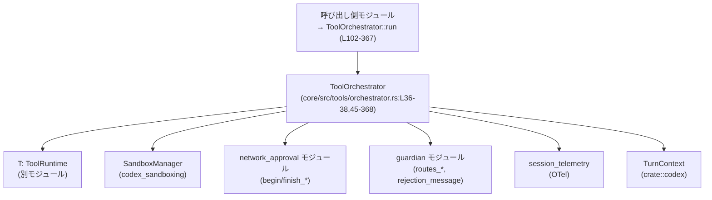
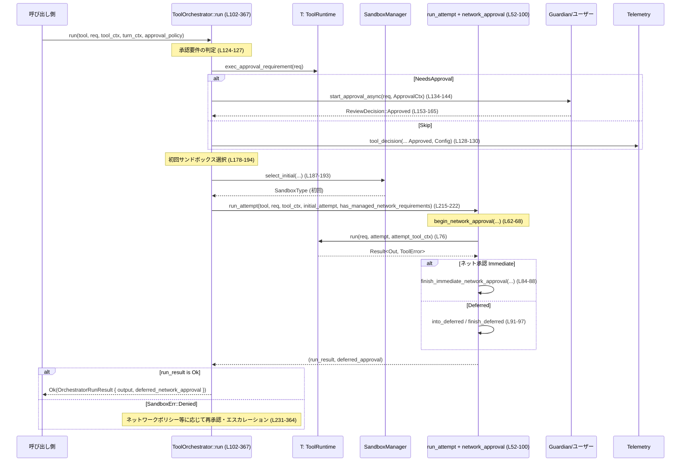

# core/src/tools/orchestrator.rs

## 0. ざっくり一言

Tool 実行に対して「ユーザー/Guardian 承認 → サンドボックス選択 → 実行 →（必要なら）権限エスカレーション・再実行 → ネットワーク承認」の流れを一カ所で制御する **オーケストレーター** です。

---

## 1. このモジュールの役割

### 1.1 概要

- このモジュールは **ツール実行に伴う承認・サンドボックス制御・再試行戦略** を統合的に扱うために存在します。
- 呼び出し側は `ToolOrchestrator::run` を 1 回呼ぶだけで、以下が自動で行われます。
  - 実行可否の確認と承認フロー（ユーザー / Guardian / 設定によるスキップ）
  - サンドボックス種別の選択（通常 / なし）
  - サンドボックス拒否（特にネットワーク関連）時のメッセージ生成と再承認
  - 必要に応じた「サンドボックスなし」での再実行
  - ネットワーク承認ワークフロー（即時 / 遅延）の開始・完了処理

### 1.2 アーキテクチャ内での位置づけ

`ToolOrchestrator` は、ツール自身の実装 (`ToolRuntime` トレイト実装) と、サンドボックス・ネットワーク承認・Guardian・テレメトリなどの周辺コンポーネントの間に位置します。



※ 行番号は、このチャンク先頭を `L1` としたものです（実リポジトリとずれる可能性があります）。

### 1.3 設計上のポイント

- **責務の集中**  
  - ツールごとの実装 (`ToolRuntime`) から、承認・サンドボックス選択・再試行戦略を切り離し、このモジュールで一元管理しています（`ToolOrchestrator::run` が唯一の公開エントリポイントです: L102-367）。
- **状態の保持**  
  - `ToolOrchestrator` 自体は `SandboxManager` だけをフィールドとして持ち（L36-38）、それ以外の状態は引数やローカル変数で扱います。
- **エラーハンドリングの方針**  
  - すべて `Result<_, ToolError>` ベースで扱い、  
    - **承認拒否** → `ToolError::Rejected`  
    - **サンドボックス拒否** → `ToolError::Codex(CodexErr::Sandbox(...))`  
    のようにエラー種別を保ったまま呼び出し元に返します（L231-253, L269-273 など）。
- **安全性・セキュリティ**  
  - 「サンドボックスなし実行」へのエスカレーションは、  
    - ツール側の `escalate_on_failure` フラグ（L248-252）  
    - 承認ポリシー (`AskForApproval`) と `wants_no_sandbox_approval`（L257-273）  
    - 必要に応じて再承認フロー（L285-331）  
    によって明示的に制御されます。
- **並行性モデル**  
  - `run` / `run_attempt` は `async fn` であり、非同期ランタイム上で **逐次的に** 実行されます。  
    `&mut self` を取るため、同一 `ToolOrchestrator` インスタンスは同時に 1 つの `run` しか実行しません（L102-103）。

---

## 2. 主要な機能一覧

- ツール実行全体のオーケストレーション: `ToolOrchestrator::run` が承認・サンドボックス選択・再試行を統合して実行します（L102-367）。
- サンドボックス付き / なしの 1 回分の実行とネットワーク承認の処理: `run_attempt`（L52-100）。
- 実行承認ポリシー (`ExecApprovalRequirement`) に基づく承認フロー（ユーザー / Guardian / コンフィグ）実行（L121-176）。
- サンドボックス拒否 (特にネットワークポリシー違反) 時の扱いと、必要に応じた「サンドボックスなし」での再試行ロジック（L231-364）。
- ネットワーク承認の即時 / 遅延モードの取り扱い（L62-99）。
- 承認 UI 向けの簡潔な再試行理由メッセージ生成（L275-283, L370-374）。

---

## 3. 公開 API と詳細解説

### 3.1 型一覧（構造体・列挙体など）

| 名前 | 種別 | 役割 / 用途 | 定義位置 |
|------|------|-------------|----------|
| `ToolOrchestrator` | 構造体 | 全ツール実行の承認・サンドボックス制御・再試行をまとめるオーケストレーター。内部に `SandboxManager` を 1 つ保持します。 | `core/src/tools/orchestrator.rs:L36-38` |
| `OrchestratorRunResult<Out>` | 構造体 | ツール実行の最終結果と、必要に応じて遅延ネットワーク承認ハンドル (`DeferredNetworkApproval`) をまとめて返すためのラッパー。 | `core/src/tools/orchestrator.rs:L40-43` |

#### `ToolOrchestrator`

- フィールド
  - `sandbox: SandboxManager` — 実際のサンドボックスプロセス起動や設定を司るマネージャ（L36-38）。
- 生成
  - `ToolOrchestrator::new()` で `SandboxManager::new()` を内部に作成（L46-50）。

#### `OrchestratorRunResult<Out>`

- フィールド（両方とも `pub`）
  - `output: Out` — ツール実行の最終出力（L41）。
  - `deferred_network_approval: Option<DeferredNetworkApproval>` — 遅延型ネットワーク承認を後で完了させるためのハンドル（L42）。

### 3.2 関数詳細（最大 7 件）

ここでは重要度の高い順に 4 関数を扱います。

---

#### `ToolOrchestrator::run<Rq, Out, T>(...) -> Result<OrchestratorRunResult<Out>, ToolError>`

**定義位置**: `core/src/tools/orchestrator.rs:L102-367`

**概要**

- 任意のツール `T: ToolRuntime<Rq, Out>` に対して、  
  1. 実行承認  
  2. 初回サンドボックス実行  
  3. サンドボックス拒否時のエスカレーション（必要に応じて再承認）  
  4. ネットワーク承認（即時 / 遅延）  
  をまとめて実行し、最後の成功結果を `OrchestratorRunResult` として返します。

**引数**

| 引数名 | 型 | 説明 |
|--------|----|------|
| `&mut self` | `&mut ToolOrchestrator` | 内部の `SandboxManager` を使うための可変参照です（L102-103）。同時に複数の `run` を走らせないための同期的なガードにもなります。 |
| `tool` | `&mut T` | 実際のツール実装。`ToolRuntime<Rq, Out>` トレイトを実装している必要があります（L104, L111）。 |
| `req` | `&Rq` | ツールに渡すリクエスト。型はジェネリックです（L105）。 |
| `tool_ctx` | `&ToolCtx` | ツール実行に必要なコンテキスト（セッション、ターン ID、ツール名など）をまとめたものです（L106）。 |
| `turn_ctx` | `&crate::codex::TurnContext` | 実行ポリシー（サンドボックス、ネットワーク、Windows サンドボックスなど）とテレメトリを含む上位コンテキストです（L107, L178-213）。 |
| `approval_policy` | `AskForApproval` | 設定ベースの承認方針（常に確認、OnRequest、確認不要など）を表す列挙体です（L108）。 |

**戻り値**

- `Ok(OrchestratorRunResult<Out>)`
  - ツール実行が最終的に成功した場合。
  - `output`: 最終成功結果。
  - `deferred_network_approval`: ネットワーク承認が遅延モードだった場合に、後で完了させるためのハンドル（即時モードまたは承認が不要な場合は `None`）（L224-229, L360-363）。
- `Err(ToolError)`
  - 実行拒否（ユーザー / Guardian / ポリシー）やサンドボックス関連エラーなど。詳細は後述の「Errors」参照。

**内部処理の流れ（アルゴリズム）**

1. **テレメトリと Guardian 経路の決定**（L113-120）  
   - OTel 用の `tool_decision` を呼びやすいように変数を束ね、  
     `routes_approval_to_guardian(turn_ctx)` により、承認フローが Guardian に委譲されるかを決定します。

2. **実行承認の前処理**（L121-176）  
   - `tool.exec_approval_requirement(req)` でツール固有の要件を取得し、`None` の場合は `default_exec_approval_requirement` を使います（L124-126）。  
   - 結果に応じて:
     - `Skip` → 承認不要。テレメトリ上は Config 由来として Approved を記録（L128-130）。
     - `Forbidden { reason }` → 即座に `Err(ToolError::Rejected(reason))` を返します（L131-133）。
     - `NeedsApproval { ... }` → Guardian/ユーザーに承認を依頼し、結果に応じて続行 or エラー（L134-175）。

3. **初回サンドボックス選択と実行**（L178-230）  
   - `has_managed_network_requirements` フラグを、設定から判定します（L179-184）。  
   - ツール側の `sandbox_mode_for_first_attempt` に応じて:
     - `BypassSandboxFirstAttempt` → `SandboxType::None`（L185-186）。
     - `NoOverride` → `SandboxManager::select_initial(...)` に委譲（L187-193）。
   - `SandboxAttempt` を構築し（L198-213）、`run_attempt` を呼んで 1 回目の実行を行います（L215-222）。
   - 結果が `Ok` なら即座に `OrchestratorRunResult` を返します（L223-230）。

4. **サンドボックス拒否時のエスカレーション判断**（L231-364）  
   - 1 回目が `Err(ToolError::Codex(CodexErr::Sandbox(SandboxErr::Denied { ... })))` の場合のみ、エスカレーションロジックに進みます（L231-234）。
   - ネットワーク管理要件が有効な場合、サンドボックスから返された `network_policy_decision` から `network_approval_context` を復元しようとします（L235-241）。
     - 取得に失敗した場合は、元のエラーをそのまま返します（L242-247）。
   - ツールが `escalate_on_failure()` を許可していない場合、元のエラーを返して終了します（L248-253）。
   - ポリシー上、サンドボックスなし実行に進めない場合も、元のエラーを返します（L254-273）。
   - ユーザー向けの再試行理由メッセージを生成します（L275-283）。

5. **再承認（必要な場合）とサンドボックスなしでの再実行**（L285-364）  
   - `tool.should_bypass_approval(approval_policy, already_approved)` と `network_approval_context` の有無で、再承認を省略できるか判定します（L285-288）。
   - 省略できない場合、再度 `ApprovalCtx` を組んで承認フローを実行し、結果が拒否・タイムアウト・中断なら `ToolError::Rejected` を返します（L289-331）。
   - その後、`SandboxType::None` で `SandboxAttempt` を構築し（L334-349）、`run_attempt` をもう一度呼びます（L352-359）。
   - `run_attempt` の結果が `Ok` なら、`OrchestratorRunResult` に包んで返します（L360-363）。

6. **その他のエラー**  
   - 上記以外の `Err`（たとえばツール内部エラーやネットワーク承認のエラーなど）は、そのまま呼び出し元に返します（L365）。

**Examples（使用例）**

以下は、概念的な呼び出し例です。`ToolRuntime` の詳細実装は別モジュールにあります。

```rust
use crate::tools::orchestrator::ToolOrchestrator;
use crate::tools::sandboxing::ToolCtx;
use crate::codex::TurnContext;
use codex_protocol::protocol::AskForApproval;

// 仮のツール実装 (実際には ToolRuntime<Rq, Out> を実装する必要があります)
struct MyTool;

// ここでは MyTool が ToolRuntime<Request, Response> を実装していると仮定します。

async fn run_my_tool(
    mut tool: MyTool,                // ツール実装
    req: Request,                    // ツールに渡すリクエスト
    tool_ctx: ToolCtx,               // ToolCtx: セッションやツール名など
    turn_ctx: TurnContext,           // TurnContext: サンドボックス/ネットワーク設定など
) -> Result<Response, crate::tools::sandboxing::ToolError> {
    let mut orchestrator = ToolOrchestrator::new();  // サンドボックスマネージャ付きで初期化

    let result = orchestrator
        .run(
            &mut tool,
            &req,
            &tool_ctx,
            &turn_ctx,
            AskForApproval::OnRequest, // 必要なときだけ承認を求める方針
        )
        .await?;                       // ToolError があればここで伝播

    // ツールの出力
    let out: Response = result.output;

    // 遅延ネットワーク承認があれば、ここで処理を続ける必要があるかもしれない
    if let Some(deferred) = result.deferred_network_approval {
        // deferred を別のモジュールに渡して処理する、など
    }

    Ok(out)
}
```

**Errors / Panics**

- `ToolError::Rejected(...)`  
  - 実行前承認での拒否 / タイムアウト / ユーザー中断（L153-161, L309-319, L168-171, L326-329）。
- `ToolError::Codex(CodexErr::Sandbox(SandboxErr::Denied { ... }))`  
  - サンドボックス拒否で、エスカレーション不可 or エスカレーションを行わない場合（L231-247, L248-273, L249-252, L269-273）。
- その他の `ToolError`  
  - ツール内部エラー、ネットワーク承認終了時のエラーなどは `run_attempt` からそのまま返されます（L365, L86-88）。

panic を起こすコードはこのチャンク内には見当たりません。

**Edge cases（エッジケース）**

- **承認不要 (`Skip`) の場合**  
  - ユーザーには確認を出さず、そのままサンドボックス実行に進みます（L128-130）。  
  - テレメトリ上は Config 由来として Approved が記録されます。
- **承認結果が `NetworkPolicyAmendment` で `Deny` の場合**  
  - 実行前/再承認のどちらの場合でも、即座に `ToolError::Rejected("rejected by user")` が返ります（L165-172, L323-329）。
- **ネットワーク管理要件があるのに `network_approval_context` が復元できない場合**  
  - サンドボックス拒否の詳細をうまく解析できなかったとみなし、エスカレーションは行わず、元のサンドボックス拒否エラーをそのまま返します（L242-247）。
- **ツールが `escalate_on_failure()` を `false` にしている場合**  
  - サンドボックス拒否が起きても「サンドボックスなし」再実行は行われません（L248-253）。
- **OnRequest ポリシー + ネットワークポリシー違反の特例**  
  - `AskForApproval::OnRequest` かつ `network_approval_context` があり、かつ `default_exec_approval_requirement` が `NeedsApproval` を返す場合のみ、特別に再承認を許可するロジックがあります（L259-267）。

**使用上の注意点**

- **非同期ランタイムの前提**  
  - `async fn` であり、`await` を内部で多用するため、Tokio などの非同期ランタイム上で呼ぶ必要があります。
- **`&mut self` と並行性**  
  - 同一 `ToolOrchestrator` を複数タスクから同時に使う場合は、外側で `Mutex` や `Arc` などを使って同期する必要があります。`&mut self` によりコンパイル時に排他が保証されます。
- **再承認の挙動を変えたい場合**  
  - ツール側の `ToolRuntime` 実装の `exec_approval_requirement` / `should_bypass_approval` / `wants_no_sandbox_approval` / `escalate_on_failure` の各メソッドが、このモジュールの挙動に直接影響します。
- **遅延ネットワーク承認 (`DeferredNetworkApproval`) の扱い**  
  - `deferred_network_approval` が `Some` の場合、呼び出し側がこのハンドルを確実に処理しなければ、ポリシーレベルでの一貫性が保てない可能性があります。

---

#### `ToolOrchestrator::run_attempt<Rq, Out, T>(...) -> (Result<Out, ToolError>, Option<DeferredNetworkApproval>)`

**定義位置**: `core/src/tools/orchestrator.rs:L52-100`

**概要**

- サンドボックス設定を固定した 1 回分のツール実行を行い、その前後でネットワーク承認フローを処理します。
- 呼び出し元 (`run`) からは「初回試行」と「エスカレーション後の試行」で再利用されます（L215-222, L352-359）。

**引数**

| 引数名 | 型 | 説明 |
|--------|----|------|
| `tool` | `&mut T` | ツール実装。`ToolRuntime<Rq, Out>` を実装している必要があります（L53, L60）。 |
| `req` | `&Rq` | ツールリクエスト（L54）。 |
| `tool_ctx` | `&ToolCtx` | 元のツールコンテキスト（L55）。ネットワーク承認や Guardian で使用されます。 |
| `attempt` | `&SandboxAttempt<'_>` | この 1 回の実行に使用するサンドボックス設定（L56）。 |
| `has_managed_network_requirements` | `bool` | ネットワークが「マネージドモード」かどうか。承認フローを開始するかの判定に用います（L57, L62-66）。 |

**戻り値**

- `Result<Out, ToolError>` — この 1 回の実行結果。
- `Option<DeferredNetworkApproval>` — ネットワーク承認が「遅延モード」で行われる場合のみ `Some`。それ以外は `None`。

**内部処理の流れ**

1. **ネットワーク承認の開始**（L62-68）  
   - `begin_network_approval` を呼び出してネットワーク承認フローを開始します。戻り値は `Option<_>` で、承認が不要な場合は `None` となります。
2. **ツール実行コンテキストのコピー**（L70-75）  
   - `ToolCtx` を clone した `attempt_tool_ctx` を作成し、ツール実行用に渡します。
3. **ツール実行**（L76）  
   - `tool.run(req, attempt, &attempt_tool_ctx).await` を呼び、実際のツール処理を実行します。
4. **ネットワーク承認が不要な場合**（L78-80）  
   - `network_approval` が `None` の場合、単に `(run_result, None)` を返します。
5. **即時承認モード (`Immediate`) の場合**（L82-90）  
   - `finish_immediate_network_approval` を呼び、承認の完了を待ちます（L84-85）。
   - ここでエラーが返れば、それを `Err(err)` として返し、ツールの実行結果は無視されます（L86-88）。
   - 承認に成功した場合は `(run_result, None)` を返します（L89）。
6. **遅延承認モード (`Deferred`) の場合**（L91-98）  
   - `into_deferred` で `DeferredNetworkApproval` ハンドルを取得します（L92）。
   - ツール実行が失敗している (`run_result.is_err()`) 場合は、`finish_deferred_network_approval` により承認フローを閉じたうえで `(run_result, None)` を返します（L93-96）。
   - ツール実行が成功している場合は、承認フローを開いたまま `(run_result, deferred)` を返します（L97）。

**Examples（使用例）**

`run_attempt` はプライベート関数ですが、概念的には以下のように呼ばれます。

```rust
// ToolOrchestrator::run の中での使用 (実際のコードは L215-222)
let (result, deferred) = ToolOrchestrator::run_attempt(
    tool,
    req,
    tool_ctx,
    &initial_attempt,
    has_managed_network_requirements,
).await;
```

**Errors / Panics**

- `begin_network_approval` / `finish_immediate_network_approval` / `finish_deferred_network_approval` が返す `ToolError` を、そのまま `Result` の `Err` として返す可能性があります（L84-88）。
- ツール実装の `run` が返す `ToolError` も、そのまま `run_result` 内に含まれます（L76）。

**Edge cases**

- **承認フローが開始されない (`network_approval == None`) 場合**  
  - どのモードでも、ネットワーク承認には関与せず、そのままツール実行結果だけを返します（L78-80）。
- **遅延モード + ツール実行エラー**  
  - この場合は `finish_deferred_network_approval` を呼び出して承認フローをクローズし、承認ハンドルは呼び出し元に返されません（L93-96）。  
    → 呼び出し元は遅延承認を気にする必要がなくなります。

**使用上の注意点**

- `run_attempt` を直接呼び出す必要はなく、通常は `run` 経由でのみ利用されます。
- ツール実装の `run` がネットワークアクセスを行う場合、この関数を通じてポリシーに基づく承認が強制されます。

---

#### `ToolOrchestrator::new() -> Self`

**定義位置**: `core/src/tools/orchestrator.rs:L46-50`

**概要**

- `SandboxManager::new()` を内部に作成し、`ToolOrchestrator` のインスタンスを生成するコンストラクタです。

**引数**

- なし。

**戻り値**

- 新しい `ToolOrchestrator` インスタンス（L46-50）。

**内部処理の流れ**

1. `SandboxManager::new()` を呼び出し（L47-49）、その結果を `sandbox` フィールドに格納した構造体を返します。

**使用例**

上記の `run_my_tool` の例で使用している通りです。

```rust
let mut orchestrator = ToolOrchestrator::new(); // L46-50 相当
```

**Errors / Panics**

- この関数内に `Result` や `unwrap` 等はなく、panic を起こすコードは見当たりません。

**使用上の注意点**

- `SandboxManager` の初期化コストがどの程度かは、このチャンクからは分かりません。高コストな場合は、1 度作って使い回す方が望ましい可能性があります。

---

#### `build_denial_reason_from_output(_output: &ExecToolCallOutput) -> String`

**定義位置**: `core/src/tools/orchestrator.rs:L370-374`

**概要**

- サンドボックス拒否時にユーザーへ表示する再試行理由メッセージを生成するためのヘルパーです。
- 現在は固定文言 `"command failed; retry without sandbox?"` を返します（L373）。

**引数**

| 引数名 | 型 | 説明 |
|--------|----|------|
| `_output` | `&ExecToolCallOutput` | 将来的に出力内容に応じてメッセージを変えるために受け取っていますが、現時点では未使用です（L370-373）。 |

**戻り値**

- 英文の簡潔な再試行メッセージ (`String`)。

**内部処理の流れ**

1. コメントにもあるように（L371-372）、UX / テストのためメッセージを安定させたまま、将来の拡張余地を残す意図で `_output` を受け取っています。
2. 現状は固定文字列を `.to_string()` して返します（L373）。

**使用例**

サンドボックス拒否だが `network_approval_context` がない場合の再試行理由として使用されています（L275-283）。

```rust
let retry_reason = if let Some(ctx) = network_approval_context.as_ref() {
    format!("Network access to \"{}\" is blocked by policy.", ctx.host)
} else {
    build_denial_reason_from_output(output.as_ref())  // L282-283
};
```

**使用上の注意点**

- メッセージを変更するとテストや UX に影響する可能性があるため、変更時は関連箇所のテスト更新が必要になります（コメント L371-372）。

---

### 3.3 その他の関数

このチャンク内で定義される関数は上記 4 つのみです。

---

## 4. データフロー

ここでは典型的な「承認あり + 通常サンドボックス + ネットワーク即時承認」のパスを示します。



この図から分かるポイント:

- 実際のツールロジックは `ToolRuntime::run` に閉じ込められており、オーケストレーターは前後の承認とサンドボックス設定に集中しています。
- `run_attempt` がネットワーク承認フローとツール実行をまとめて扱い、その結果を `run` に返しています。

---

## 5. 使い方（How to Use）

### 5.1 基本的な使用方法

典型的なフローは下記の通りです。

1. `ToolRuntime<Rq, Out>` を実装したツール (`T`) を用意する。
2. `ToolCtx` と `TurnContext` を構築する（セッション情報・サンドボックス/ネットワーク設定など）。
3. `ToolOrchestrator::new()` でオーケストレーターを生成する。
4. `ToolOrchestrator::run(&mut tool, &req, &tool_ctx, &turn_ctx, approval_policy).await` を呼ぶ。
5. `OrchestratorRunResult` から `output` と `deferred_network_approval` を取り出す。

```rust
use crate::tools::orchestrator::ToolOrchestrator;
use crate::tools::sandboxing::ToolCtx;
use crate::codex::TurnContext;
use codex_protocol::protocol::AskForApproval;

async fn handle_tool_call(
    mut tool: impl ToolRuntime<Request, Response>, // ツール実装
    req: Request,                                  // リクエスト
    tool_ctx: ToolCtx,                             // ToolCtx
    turn_ctx: TurnContext,                         // TurnContext
) -> Result<Response, crate::tools::sandboxing::ToolError> {
    let mut orchestrator = ToolOrchestrator::new();   // (L46-50)

    let result = orchestrator
        .run(
            &mut tool,
            &req,
            &tool_ctx,
            &turn_ctx,
            AskForApproval::OnRequest,               // 設定に応じて選択
        )
        .await?;                                      // ToolError を伝播

    // 実行結果
    let out = result.output;

    // 遅延ネットワーク承認を必要とする場合のハンドル
    if let Some(deferred) = result.deferred_network_approval {
        // 別処理に渡す、ログに残す等
        // finish_deferred_network_approval は run_attempt 内でエラー時のみ呼ばれる点に注意
        // （成功時の deferred は呼び出し側の責務）
    }

    Ok(out)
}
```

### 5.2 よくある使用パターン

1. **承認ポリシーによる使い分け**
   - `AskForApproval::Never`  
     - 設定上、承認を一切求めないモード。ツールの `exec_approval_requirement` が `Skip` を返すように設計されている場合に向きます。
   - `AskForApproval::OnRequest`  
     - 通常は承認不要だが、サンドボックス拒否（特にネットワークポリシー違反）が発生した場合にだけ再承認を行う、といった挙動を実現できます（L259-267）。
   - それ以外（常に承認など）は、ツール側 `exec_approval_requirement` と `default_exec_approval_requirement` の組み合わせで制御されます。

2. **エスカレーションを禁止するツール**
   - セキュリティ上の理由から、サンドボックス無しでの実行を絶対に許容したくないツールでは、`ToolRuntime::escalate_on_failure()` を常に `false` にすることで、オーケストレーター側のエスカレーション処理が実行されないようにできます（L248-253）。

3. **Guardian 経由の自動レビュー**
   - `routes_approval_to_guardian(turn_ctx)` が `true` の場合、承認フローは Guardian を経由します（L119-120, L135-141）。
   - 拒否メッセージは `guardian_rejection_message` から取得され、ユーザー向けに適切なテキストが生成されます（L155-160, L312-318）。

### 5.3 よくある間違い

```rust
// 間違い例: 非同期コンテキスト外で run を呼ぶ
let mut orchestrator = ToolOrchestrator::new();
// let result = orchestrator.run(&mut tool, &req, &tool_ctx, &turn_ctx, approval_policy); // コンパイルエラー: .await 必須

// 正しい例: async 関数内で .await する
let result = orchestrator
    .run(&mut tool, &req, &tool_ctx, &turn_ctx, approval_policy)
    .await?;
```

```rust
// 間違い例: deferred_network_approval を完全に無視する
let result = orchestrator.run(...).await?;
let out = result.output;
// result.deferred_network_approval を破棄してしまう

// 正しい例: DeferredNetworkApproval の存在を考慮する
let result = orchestrator.run(...).await?;
let out = result.output;
if let Some(deferred) = result.deferred_network_approval {
    // 遅延承認を処理するための別経路に渡す・キューに積むなど
}
```

### 5.4 使用上の注意点（まとめ）

- **セキュリティ**  
  - 「サンドボックスなし」実行は潜在的に危険な操作であり、`escalate_on_failure`, `wants_no_sandbox_approval`, `should_bypass_approval` の実装を慎重に設計する必要があります（L248-253, L257-273, L285-288）。
  - `network_approval_context_from_payload` に失敗した場合はエスカレーションを行わず、元のエラーを返す設計になっているため、ネットワーク承認情報のシリアライズ/デシリアライズの変更時は特に注意が必要です（L235-247）。
- **パフォーマンス / スケーラビリティ**  
  - 承認フロー（特に Guardian やユーザー操作を伴うもの）は I/O 待ちが長くなる可能性がありますが、本モジュールはすべて非同期で処理しているため、非同期ランタイム上で他タスクの進行をブロックしません。
  - `ToolOrchestrator` は `SandboxManager` を内部に保持して再利用するため、サンドボックス起動の準備コストをある程度 amortize できます。
- **可観測性**  
  - すべての重要なレビュー結果は `otel.tool_decision(...)` によって記録されます（L113-120, L128-130, L151, L306）。  
    これにより、あとから「誰が何をどのポリシーで承認/拒否したのか」を追跡しやすくなっています。

---

## 6. 変更の仕方（How to Modify）

### 6.1 新しい機能を追加する場合

1. **承認ポリシーに新しいステータスを追加したい場合**
   - 追加したいステータスは `ReviewDecision` や `AskForApproval` 側で定義されます。
   - このファイルでは `match decision` や `match requirement` の分岐に新しいパターンを追加する必要があります（L153-173, L308-331）。
   - 追加した分岐ごとに、`ToolError` の返し方と `otel.tool_decision` との整合性を確認する必要があります。

2. **再試行戦略を増やしたい場合**
   - 現状は「初回サンドボックス → 拒否時に最大 1 回のサンドボックスなし再試行」という 2 段階です（L231-364）。
   - さらに中間段階（別種のサンドボックス設定など）を導入する場合、
     - 新しい `SandboxAttempt` を構築するコードを追加し、
     - `run_attempt` を再利用してステップを増やす形にするのが自然です。

3. **ネットワーク承認メッセージの改善**
   - 出力内容に応じた詳細メッセージを出したい場合、`build_denial_reason_from_output` 内で `ExecToolCallOutput` を解析する実装を追加できます（L370-374）。
   - テストや UX への影響を考慮しつつ、メッセージフォーマットの互換性を保つ設計が求められます。

### 6.2 既存の機能を変更する場合の注意点

- **影響範囲の確認**
  - `ToolOrchestrator::run` はこのモジュール唯一の公開 API であり、ツール実行の中核を担うため、変更時は呼び出し元（ツール実装や上位オーケストレーション）への影響が大きくなりがちです。
  - 特に承認結果の扱い (`ReviewDecision` の各分岐) を変更する際には、Guardian 側の期待する挙動や UI メッセージの整合性も確認する必要があります（L153-173, L308-331）。

- **契約（前提条件・返り値の意味）**
  - `run` が `Ok` を返すときは、「最後のツール実行が成功しており、必要な承認は完了している」ことが前提です（Deferred 承認は除く）。
  - サンドボックス拒否や承認拒否は、必ず何らかの `Err(ToolError::...)` として返るという契約が暗黙的に存在します（L231-253, L248-253, L269-273）。

- **テスト観点**
  - 少なくとも以下のパスに対してテストケースを用意すると、挙動を安全に変更しやすくなります。
    - 承認不要 (`Skip`) パス。
    - `NeedsApproval` → Approved → 成功。
    - `NeedsApproval` → Denied / TimedOut / Abort。
    - 初回サンドボックス成功 / 失敗（`SandboxErr::Denied` 以外）。
    - `SandboxErr::Denied` → `escalate_on_failure` = false。
    - `SandboxErr::Denied` → `escalate_on_failure` = true → サンドボックスなし成功 / 失敗。
    - ネットワーク承認 Immediate / Deferred + 成功 / 失敗。

---

## 7. 関連ファイル

このモジュールと密接に関係するモジュール（ファイルパスは Rust のモジュールパスからの推測を含みます）。

| パス / モジュール | 役割 / 関係 |
|------------------|------------|
| `crate::tools::sandboxing` | `ToolCtx`, `ToolError`, `ToolRuntime`, `SandboxAttempt`, `SandboxOverride`, `ExecApprovalRequirement`, `default_exec_approval_requirement` など、ツール実行とサンドボックス制御の基盤となる型・関数を提供します（L18-25, L36-38, L52-60, L185-213, L334-349）。 |
| `crate::tools::network_approval` | `begin_network_approval`, `finish_immediate_network_approval`, `finish_deferred_network_approval`, `DeferredNetworkApproval`, `NetworkApprovalMode` など、ネットワーク承認のライフサイクルを提供します（L13-17, L62-68, L83-99）。 |
| `crate::guardian` | `routes_approval_to_guardian`, `new_guardian_review_id`, `guardian_rejection_message` により、Guardian ベースの自動レビュー・拒否メッセージ取得を行います（L9-11, L119-120, L135, L155-160, L290-291, L312-318）。 |
| `crate::network_policy_decision` | `network_approval_context_from_payload` により、サンドボックスから返るネットワークポリシー決定を高レベルなコンテキストに変換します（L12, L235-241）。 |
| `codex_protocol::protocol` | `AskForApproval`, `ReviewDecision`, `NetworkPolicyRuleAction` などのプロトコルレベルの型を提供します（L30-32, L124-126, L153-173, L259-267, L308-331）。 |
| `codex_protocol::error` | `CodexErr`, `SandboxErr` などのエラー型を提供し、サンドボックス拒否を表現します（L27-28, L231-234, L242-247, L248-253, L269-273）。 |
| `codex_protocol::exec_output::ExecToolCallOutput` | `build_denial_reason_from_output` の引数型として、ツール実行の出力を表現します（L29, L370-373）。 |
| `codex_sandboxing::SandboxManager`, `SandboxType` | サンドボックスの種類や選択ロジックを提供し、`ToolOrchestrator` の内部で利用されます（L33-34, L36-38, L185-187, L334-336）。 |
| `codex_otel::ToolDecisionSource` | OTel テレメトリにおける承認決定のソース（ユーザー / 設定 / 自動レビュー）を区別するために使われます（L26, L113-120, L128-130, L151, L306）。 |

このレポートは、このチャンクに含まれるコードのみを根拠に作成しており、他モジュールの詳細実装については「このチャンクには現れない」ため記述していません。
