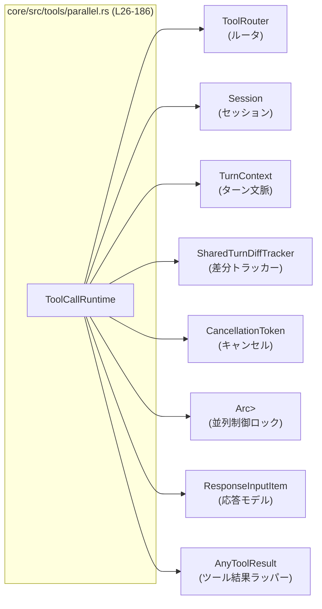
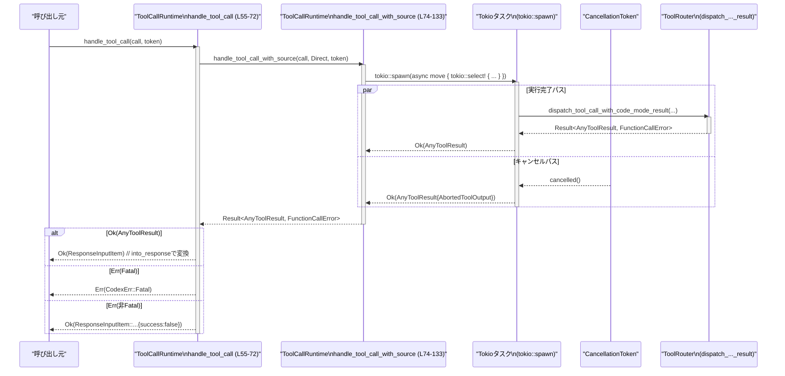

# core/src/tools/parallel.rs コード解説

## 0. ざっくり一言

ツール呼び出しを非同期タスクとして実行し、**並列実行の制御・キャンセル・エラー結果の整形**を行うランタイムです（`ToolCallRuntime` 構造体とそのメソッド群）。  
（根拠: `core/src/tools/parallel.rs`:L26-33, L55-72, L74-133, L137-185）

---

## 1. このモジュールの役割

### 1.1 概要

- このモジュールは、`ToolRouter` 経由でのツール呼び出しを **tokio タスクとして非同期実行**し、結果をクライアントに返しやすい形 (`ResponseInputItem`) に変換するためのヘルパーです。  
  （根拠: L21, L55-72, L74-133, L137-162）
- ツールごとの「並列実行を許可するかどうか」の設定に応じて、**読取り/書込みロックを使った並列制御**を行います。  
  （根拠: L31-32, L81-82, L86-87, L107-111）
- ユーザーによるキャンセル要求を `CancellationToken` で受け取り、キャンセルしたツール呼び出しに対しては一貫した「中断結果」を生成します。  
  （根拠: L59-60, L80, L98-105, L164-172）

### 1.2 アーキテクチャ内での位置づけ

`ToolCallRuntime` を中心に、ルータ・セッション・ターンコンテキストなどへ依存しています。



- `ToolCallRuntime` は `ToolRouter` に対するフロントエンドのような位置づけで、  
  「どのような並列モードで」「キャンセルをどう扱うか」「失敗時にどういう応答を返すか」を担当します。  
  （根拠: L21, L26-33, L74-133, L137-172）
- 実際のツール実行ロジックは `ToolRouter::dispatch_tool_call_with_code_mode_result` に委譲されています。  
  （根拠: L113-121）

### 1.3 設計上のポイント

- **状態管理**
  - 内部状態はすべて `Arc` か共有トラッカーで持ち、`ToolCallRuntime` 自体は `Clone` 可能な軽量ハンドルになっています。  
    （根拠: L26-33, L42-48）
- **並行性制御**
  - 並列実行を許可するツールは **読取りロック**、許可しないツールは **書込みロック** を取得することで、  
    「非並列ツールは単独実行」「並列対応ツール同士は同時実行」という制約を実現しています。  
    （根拠: L31-32, L81, L86-87, L107-111）
- **キャンセル処理**
  - `tokio::select!` と `CancellationToken` を使って「ツール処理完了」と「キャンセル要求」のどちらか早い方を採用します。  
    （根拠: L98-105, L106-123）
  - キャンセルされた場合は専用の `AbortedToolOutput` を返すことで、上位層から中断を識別しやすくしています。  
    （根拠: L100-105, L164-172）
- **エラー処理**
  - ツール実行中のエラーは `FunctionCallError` として扱い、致命的 (`Fatal`) なものだけを `CodexErr::Fatal` に昇格させ、それ以外は通常の応答として返します。  
    （根拠: L14, L55-72, L127-131, L137-162）
- **観測性**
  - `tracing` の `#[instrument]` と `trace_span!` を使い、ツール呼び出しごとに名前・call_id・中断フラグなどを含むスパンを発行しています。  
    （根拠: L8-10, L55, L74, L90-96, L121-122）

---

## 2. 主要な機能一覧（コンポーネントインベントリー）

### 2.1 構造体・メソッド一覧

| 名前 | 種別 | 役割 / 概要 | 定義箇所 |
|------|------|------------|----------|
| `ToolCallRuntime` | struct | ツール呼び出しの実行・並列制御・キャンセル処理を行うランタイム | `core/src/tools/parallel.rs`:L26-33 |
| `ToolCallRuntime::new` | メソッド | 依存オブジェクトと並列制御用ロックを受け取ってランタイムを構築 | L35-49 |
| `ToolCallRuntime::find_spec` | メソッド | 指定ツール名に対応する `ToolSpec` を `ToolRouter` から検索 | L51-53 |
| `ToolCallRuntime::handle_tool_call` | メソッド | ツール呼び出しを実行し、`ResponseInputItem` か `CodexErr` を返す高レベル API | L55-72 |
| `ToolCallRuntime::handle_tool_call_with_source` | メソッド | 並列制御・キャンセル処理付きで `AnyToolResult` を返すコア実行関数 | L74-133 |
| `ToolCallRuntime::failure_response` | 関数 | `FunctionCallError` を `ResponseInputItem`（失敗レスポンス）に変換 | L137-162 |
| `ToolCallRuntime::aborted_response` | 関数 | キャンセル時の `AnyToolResult` を構築 | L164-172 |
| `ToolCallRuntime::abort_message` | 関数 | キャンセルメッセージ文字列をツール名に応じて生成 | L174-184 |

---

## 3. 公開 API と詳細解説

### 3.1 型一覧（構造体）

| 名前 | 種別 | フィールド | 役割 / 用途 | 定義箇所 |
|------|------|-----------|-------------|----------|
| `ToolCallRuntime` | 構造体 (`#[derive(Clone)]`) | `router: Arc<ToolRouter>`<br>`session: Arc<Session>`<br>`turn_context: Arc<TurnContext>`<br>`tracker: SharedTurnDiffTracker`<br>`parallel_execution: Arc<RwLock<()>>` | ツール呼び出し実行に必要な共有オブジェクトへの参照と、並列実行制御用ロックを保持するランタイム | L26-33 |

- `parallel_execution: Arc<RwLock<()>>` は実際のデータを持たず、**排他制御専用のロック**として使われています。  
  （根拠: L31-32, L107-111）

### 3.2 関数詳細

#### `ToolCallRuntime::new(router, session, turn_context, tracker) -> ToolCallRuntime`（L35-49）

**概要**

- 依存する `ToolRouter`・`Session`・`TurnContext`・`SharedTurnDiffTracker` を受け取り、  
  並列制御用の `RwLock<()>` を初期化して `ToolCallRuntime` を構築します。  
  （根拠: L35-41, L42-48）

**引数**

| 引数名 | 型 | 説明 |
|--------|----|------|
| `router` | `Arc<ToolRouter>` | ツール呼び出しを実際にディスパッチするルータ | L37, L42 |
| `session` | `Arc<Session>` | セッション情報（詳細は別モジュール） | L38, L43 |
| `turn_context` | `Arc<TurnContext>` | 現在の対話ターンに関するコンテキスト | L39, L44 |
| `tracker` | `SharedTurnDiffTracker` | ターン内の差分を追跡する共有オブジェクト（型は別モジュール） | L40, L45 |

**戻り値**

- 初期化済みの `ToolCallRuntime`。内部で `parallel_execution` に `Arc::new(RwLock::new(()))` を設定します。  
  （根拠: L42-48）

**内部処理の流れ**

1. 渡された引数をそのままフィールドに代入。  
   （根拠: L42-46）
2. `parallel_execution` に新規 `RwLock<()>` を `Arc` でラップして格納。  
   （根拠: L47）

**Examples（使用例）**

```rust
use std::sync::Arc;
use tokio_util::sync::CancellationToken;
// 他の型は本モジュール外で定義されている前提

let router: Arc<ToolRouter> = Arc::new(/* ... */);      // ルータを用意する
let session: Arc<Session> = Arc::new(/* ... */);        // セッションを用意する
let turn: Arc<TurnContext> = Arc::new(/* ... */);       // ターンコンテキストを用意する
let tracker: SharedTurnDiffTracker = /* ... */;         // 差分トラッカーを用意する

let runtime = ToolCallRuntime::new(router, session, turn, tracker); // ランタイム構築
```

**Errors / Panics**

- 関数内で明示的に `panic!` やエラーを返していません。  
  （根拠: L35-49）

**Edge cases**

- 引数が `Arc` であれば、`new` は参照カウントを増やすだけであり、  
  大きなコピーは発生しません（所有権システム上の挙動）。  
  （根拠: L37-39, L42-44）

**使用上の注意点**

- `ToolCallRuntime` は `Clone` 実装を持つため、`new` で作ったインスタンスを複数のタスクで共有したい場合は `clone()` して利用できます。  
  （根拠: L26, L35-49）

---

#### `ToolCallRuntime::find_spec(&self, tool_name: &str) -> Option<ToolSpec>`（L51-53）

**概要**

- ツール名文字列を受け取り、対応するツール仕様 `ToolSpec` を `ToolRouter` に問い合わせて返します。  
  （根拠: L21, L24, L51-53）

**引数**

| 引数名 | 型 | 説明 |
|--------|----|------|
| `tool_name` | `&str` | 検索対象のツール名 |

**戻り値**

- 一致するツール仕様があれば `Some(ToolSpec)`、なければ `None`。  
  返却値は `ToolRouter::find_spec` の結果をそのまま返しています。  
  （根拠: L51-53）

**内部処理の流れ**

1. `self.router.find_spec(tool_name)` を呼び出して結果を返すだけの薄いラッパーです。  
   （根拠: L51-53）

**Examples（使用例）**

```rust
let maybe_spec: Option<ToolSpec> = runtime.find_spec("shell"); // ツール名で仕様を検索
if let Some(spec) = maybe_spec {
    // spec を用いてメタ情報を利用する
}
```

**Errors / Panics**

- この関数自体はエラー型を返さず、`Option` のみです。  
  （根拠: L51-53）

**Edge cases**

- 存在しないツール名の場合は `None` を返す想定です（`Option` の仕様から言える範囲）。  
  具体的なマッピング挙動は `ToolRouter::find_spec` に依存します。

**使用上の注意点**

- この関数はツール実行とは無関係に仕様だけを知りたい場合に使う軽量な API です。  
  実行を伴う場合は後述の `handle_tool_call` を使用します。  
  （根拠: L51-53, L55-72）

---

#### `ToolCallRuntime::handle_tool_call(self, call, cancellation_token) -> impl Future<Output = Result<ResponseInputItem, CodexErr>>`（L55-72）

**概要**

- 呼び出し元に対する高レベル API で、ツール呼び出しを実行し、  
  **最終的なユーザー向け応答モデル `ResponseInputItem`** か致命的エラー `CodexErr::Fatal` を返します。  
  （根拠: L55-72, L137-162）

**引数**

| 引数名 | 型 | 説明 |
|--------|----|------|
| `self` | `ToolCallRuntime`（所有権を移動） | ランタイム。所有権を取り、内部で消費されます。 |
| `call` | `ToolCall` | 実行するツール呼び出し（ツール名、ペイロード等を含む） | L58 |
| `cancellation_token` | `CancellationToken` | ユーザーや上位ロジックからのキャンセル通知を受け取るトークン | L59-60 |

**戻り値**

- `impl Future<Output = Result<ResponseInputItem, CodexErr>>`  
  - `Ok(ResponseInputItem)`：正常完了またはツール側の非致命的エラー（エラー内容は応答に埋め込まれる）  
  - `Err(CodexErr::Fatal)`：致命的な実行エラー  
  （根拠: L60-68, L137-162）

**内部処理の流れ**

1. エラー応答生成時に使うため、`call` を `error_call` としてクローン。  
   （根拠: L61）
2. 内部実行関数 `handle_tool_call_with_source` を `source = ToolCallSource::Direct` で呼び出し、Future を得る。  
   （根拠: L62-63）
3. 得られた Future を `async move` ブロック内で `await` し、結果 `Result<AnyToolResult, FunctionCallError>` をパターンマッチ。  
   （根拠: L64-69）
   - `Ok(response)` の場合：`response.into_response()` を呼び出し `ResponseInputItem` に変換して返す。  
     （根拠: L66）
   - `Err(FunctionCallError::Fatal(message))` の場合：`CodexErr::Fatal(message)` にマップして `Err` として返す。  
     （根拠: L67）
   - その他の `Err(other)` の場合：`failure_response(error_call, other)` で失敗レスポンスを生成し、`Ok` で返す。  
     （根拠: L68, L137-162）
4. 最後に `.in_current_span()` を呼び、現在の tracing スパンに紐づけた Future を返す。  
   （根拠: L71）

**Examples（使用例）**

```rust
use tokio_util::sync::CancellationToken;

let runtime = /* ToolCallRuntime::new(...) */;
let call: ToolCall = /* 何らかのツール呼び出しを構築 */;

let token = CancellationToken::new();                      // キャンセルトークンを作成

// 非同期コンテキストで使用する
let result: Result<ResponseInputItem, CodexErr> =
    runtime.handle_tool_call(call, token).await?;          // Future を await する
```

**Errors / Panics**

- `FunctionCallError::Fatal` を受け取った場合だけ `Err(CodexErr::Fatal(..))` を返します。  
  （根拠: L67）
- それ以外のエラーは「正常なレスポンス（失敗内容を含む）」として扱われ、`Result::Ok` 側に乗ります。  
  （根拠: L68, L137-162）
- 関数内部で `panic!` は呼んでいませんが、内部で呼び出す関数に依存する潜在的な panic は別途あります（このチャンクからは不明）。  

**Edge cases**

- **キャンセル済みトークン**  
  - `handle_tool_call_with_source` 側で `CancellationToken` を監視しているため、呼び出し時点ですでにキャンセルされていても、`aborted_response` が返る設計です。  
    （根拠: L74-105, L164-172）
- **ツール側のエラー**  
  - 非致命的エラーは `failure_response` によって `success: Some(false)` な応答として返るため、クライアント側は「HTTP レベルでは成功、応答ペイロード上で失敗」を見分ける必要があります。  
    （根拠: L68, L137-162）

**使用上の注意点**

- `self` が所有権で渡されるため、同じインスタンスを複数回使う場合は **事前に `clone()` しておく必要** があります。  
  （根拠: L26, L55-58）
- 非同期関数ではないため、戻り値の Future を必ず `.await` するか、どこかでポーリングする必要があります。  
  `.await` せずにドロップすると、内部で保持されている `AbortOnDropHandle` によってツールタスクが中断されます。  
  （根拠: L98-99, L127-131）

---

#### `ToolCallRuntime::handle_tool_call_with_source(self, call, source, cancellation_token) -> impl Future<Output = Result<AnyToolResult, FunctionCallError>>`（L74-133）

**概要**

- ツール呼び出しを **tokio タスクとして spawn し、並列制御とキャンセル処理を行うコア部分**です。  
  戻り値は抽象化された `AnyToolResult` と `FunctionCallError` です。  
  （根拠: L74-80, L98-125）

**引数**

| 引数名 | 型 | 説明 |
|--------|----|------|
| `self` | `ToolCallRuntime` | ランタイム。内部で所有権を消費します。 | L76 |
| `call` | `ToolCall` | 実行するツール呼び出し | L77 |
| `source` | `ToolCallSource` | 呼び出し元の種別（例: 直接、別ツールなど）。ここでは値のみ渡し、ロジックは他モジュールに委譲。 | L78 |
| `cancellation_token` | `CancellationToken` | キャンセル用トークン | L79-80 |

**戻り値**

- `impl Future<Output = Result<AnyToolResult, FunctionCallError>>`  
  - `Ok(AnyToolResult)`：ツール実行が完了したか、キャンセルされて「中断結果」が生成された。  
  - `Err(FunctionCallError)`：実行タスクが Join エラーを起こすなどの致命的状況。  
    （根拠: L80, L127-131）

**内部処理の流れ**

1. **並列可否の判定と共有ハンドルのクローン**  
   - `supports_parallel` を取得し（ツールが並列実行対応かどうか）、`router`・`session`・`turn`・`tracker`・`lock` を `Arc::clone` でクローンします。  
     （根拠: L81-87）
   - 計測開始時刻 `started` を `Instant::now()` で記録し、`display_name` をツール名の表示用文字列として取得。  
     （根拠: L87-88）
2. **トレーススパンの作成**  
   - `trace_span!` により `"dispatch_tool_call_with_code_mode_result"` という名前のスパンを作成し、  
     `otel.name`・`tool_name`・`call_id`・`aborted=false` をフィールドとして設定します。  
     （根拠: L90-96）
3. **tokio タスクの spawn + AbortOnDropHandle**  
   - `tokio::spawn(async move { ... })` で非同期タスクを起動し、それを `AbortOnDropHandle::new` でラップします。  
     （根拠: L98-99）
4. **タスク内部の `tokio::select!`**  
   - `cancellation_token.cancelled()` と、実際のツールディスパッチを行う `async` ブロックを競合させます。  
     （根拠: L100-106）
   - キャンセル分岐（先に完成した場合）:  
     1. 経過秒数 `secs` を `started.elapsed().as_secs_f32().max(0.1)` で計算。  
        （0.1 秒未満は 0.1 秒として扱う） （根拠: L102）
     2. スパンの `aborted` フィールドを `true` に更新。  
        （根拠: L103）
     3. `Self::aborted_response(&call, secs)` で中断結果を構築し、`Ok` で返す。  
        （根拠: L104-105, L164-172）
   - 実行分岐（先に完成した場合）:  
     1. ツールが並列対応なら `lock.read().await`、非対応なら `lock.write().await` を取得。  
        取得結果は `_guard` として保持し、スコープ終了までロックを保持します。  
        （根拠: L106-111）
     2. `router.dispatch_tool_call_with_code_mode_result(session, turn, tracker, call.clone(), source)` を呼び出し、  
        `dispatch_span.clone()` でトレーススパンに紐付けてから `await`。  
        （根拠: L113-122）
     3. 結果 `res` を `select!` の戻り値として返す。  
        （根拠: L106-107, L123）
5. **spawn したタスクの結果待ち**  
   - 外側の `async move` で `handle.await` を呼び、Join エラーが起きた場合は  
     `FunctionCallError::Fatal(format!("tool task failed to receive: {err:?}"))` に変換。  
     （根拠: L127-131）
   - `?` 演算子により、Join が成功した場合は内側の `Result<AnyToolResult, FunctionCallError>` をそのまま返却。  
     （根拠: L127-131）
6. 最後に `.in_current_span()` で現在スパンに紐づけた Future として返す。  
   （根拠: L132-133）

**Examples（使用例）**

```rust
let runtime = /* ToolCallRuntime */;
let call: ToolCall = /* ... */;
let token = CancellationToken::new();

let fut = runtime.handle_tool_call_with_source(
    call,
    ToolCallSource::Direct,           // ここでは Direct を明示
    token,
);

// Result<AnyToolResult, FunctionCallError> を得る
let result = fut.await;
```

**Errors / Panics**

- `tokio::spawn` の戻り値自体はエラーになりませんが、  
  `handle.await` が `JoinError` を返した場合（タスクの panic/abort など）は  
  `FunctionCallError::Fatal("tool task failed to receive: ...")` に変換されます。  
  （根拠: L127-131）
- タスク内部では `Result<AnyToolResult, FunctionCallError>` を返しており、  
  それがそのまま最終結果になります。  
  （根拠: L98-105, L106-123, L127-131）

**Edge cases**

- **並列・非並列ツールの共存**  
  - 並列対応ツール (`supports_parallel == true`) は `lock.read().await` を取得するため、  
    他の並列対応ツールとは同時実行できますが、非対応ツール（書込みロック）とは同時に実行されません。  
    （根拠: L81, L86-87, L107-111）
  - 非並列ツールは `lock.write().await` を取得し、他の全ツールをブロックします。  
    （根拠: L107-111）
- **キャンセル vs 実行の競合**  
  - `tokio::select!` によって、キャンセルが先に完了した場合はツール実行用 future がドロップされます。  
    その際の具体的なキャンセル伝播は `dispatch_tool_call_with_code_mode_result` の実装に依存します（このファイルからは不明）。  
    （根拠: L100-106, L113-122）

**使用上の注意点**

- 外側から見ると `handle_tool_call` が推奨 API であり、この関数は  
  「応答への変換前の下位レベル API」と位置づけられています。  
  （根拠: L55-72, L74-80）
- 戻り値は `AnyToolResult` であり、呼び出し側は後続の処理で適切な応答形式に変換する必要があります（典型的には `into_response` 等）。  
  （根拠: L55-72）

---

#### `ToolCallRuntime::failure_response(call, err) -> ResponseInputItem`（L137-162）

**概要**

- ツール実行で非致命的な `FunctionCallError` が発生した際に、  
  呼び出し種別（`ToolPayload` のバリアント）に応じて適切なエラーレスポンスを構築します。  
  （根拠: L14, L17, L137-162）

**内部処理のポイント**

- エラーメッセージ文字列 `message` を `err.to_string()` で取得。  
  （根拠: L138）
- `call.payload` のパターンマッチで 3 パターンに分岐。  
  （根拠: L139-161）

1. `ToolPayload::ToolSearch { .. }` の場合 → `ResponseInputItem::ToolSearchOutput`  
   - `status: "completed"`, `execution: "client"`, `tools: Vec::new()` の固定値。  
     （根拠: L140-145）
2. `ToolPayload::Custom { .. }` の場合 → `ResponseInputItem::CustomToolCallOutput`  
   - `name: None` とし、`output.body` に `FunctionCallOutputBody::Text(message)` をセット。  
     `success: Some(false)`。  
     （根拠: L146-153）
3. その他 `_` → `ResponseInputItem::FunctionCallOutput`  
   - 同様に `body: Text(message)`, `success: Some(false)`。  
     （根拠: L154-160）

**使用上の注意点**

- どのバリアントでも「失敗」を表すため、`success: Some(false)` がセットされています（`ToolSearchOutput` には `success` フィールド自体がない）。  
  （根拠: L140-160）
- 実際にクライアントがどのフィールドを見るかは上位プロトコル次第ですが、  
  「HTTP レベルの成功/失敗」と「ツールレベルの成功/失敗」が分かれる設計です。

---

#### `ToolCallRuntime::aborted_response(call, secs) -> AnyToolResult`（L164-172）

**概要**

- ユーザーキャンセルなどによりツール呼び出しが中断されたとき、  
  それを表す `AnyToolResult` を生成します。  
  （根拠: L100-105, L164-172）

**内部処理のポイント**

- 引数の `call` から `call_id` と `payload` をクローンし、  
  `result` フィールドに `AbortedToolOutput { message: abort_message(...) }` を格納します。  
  （根拠: L165-171）

**使用上の注意点**

- メッセージの文言は `abort_message` によってツール名に応じて変化します。  
  シェル系ツールでは経過時間を含む 2 行メッセージ、それ以外は 1 行メッセージです。  
  （根拠: L174-184）

---

#### `ToolCallRuntime::abort_message(call, secs) -> String`（L174-184）

**概要**

- キャンセルされたツール呼び出しに対する人間可読なメッセージを生成します。  
  シェル系ツールのみ特別フォーマットを使用します。  
  （根拠: L174-184）

**内部処理のポイント**

- 条件:
  - `call.tool_name.namespace.is_none()` かつ  
    `call.tool_name.name.as_str()` が `"shell"`, `"container.exec"`, `"local_shell"`, `"shell_command"`, `"unified_exec"` のいずれか。  
    （根拠: L175-179）
- 条件を満たす場合:
  - `"Wall time: {secs:.1} seconds\naborted by user"` を返す（2 行メッセージ）。  
    （根拠: L181）
- 条件を満たさない場合:
  - `"aborted by user after {secs:.1}s"` を返す。  
    （根拠: L183）

**Edge cases**

- `secs` は呼び出し元で `max(0.1)` 済みなので、少なくとも `0.1` 秒として表示されます。  
  （根拠: L102, L174-184）

---

### 3.3 その他の関数

- 主要な関数はすべて上記で詳細に解説しました。本セクションに追加の補助関数はありません。

---

## 4. データフロー

ここでは、典型的な「ツール呼び出し」シナリオにおけるデータフローを示します（`handle_tool_call` と `handle_tool_call_with_source` が中心）。  
（根拠: L55-72, L74-133, L137-172）



- キャンセルが優先された場合も、呼び出し元から見ると **通常の成功 (`Ok`) として戻りつつ、中身のペイロードで「aborted」を識別する** 形になります。  
  （根拠: L100-105, L164-172）
- 並列制御 (`RwLock`) は `Router` に渡す前に `_guard` として取得し、ツール実行中はロック保持によって他ツールの実行可否が制御されます。  
  （根拠: L106-111, L113-122）

---

## 5. 使い方（How to Use）

### 5.1 基本的な使用方法

`ToolCallRuntime` を構築し、`handle_tool_call` を通じてツールを実行する典型的なフローです。

```rust
use std::sync::Arc;
use tokio_util::sync::CancellationToken;

// router, session, turn, tracker は別モジュールで構築される前提
let router: Arc<ToolRouter> = Arc::new(/* ... */);
let session: Arc<Session> = Arc::new(/* ... */);
let turn: Arc<TurnContext> = Arc::new(/* ... */);
let tracker: SharedTurnDiffTracker = /* ... */;

// ランタイムの初期化
let runtime = ToolCallRuntime::new(router, session, turn, tracker); // L35-49

// 実行したいツール呼び出し
let call: ToolCall = /* ... */;                                   // L77

// キャンセルトークン
let token = CancellationToken::new();                             // L59-60, L80

// 非同期コンテキスト内で実行
let result: Result<ResponseInputItem, CodexErr> =
    runtime.clone().handle_tool_call(call, token).await?;         // L55-72

match result {
    Ok(resp) => {
        // resp から実行結果もしくはエラー内容を取り出す
    }
    Err(e) => {
        // 致命的エラー（CodexErr::Fatal）のみここに来る
    }
}
```

### 5.2 よくある使用パターン

1. **キャンセル可能なツール実行**

```rust
let token = CancellationToken::new();
let runtime = /* ... */;
let call = /* ... */;

let handle = tokio::spawn({
    let runtime = runtime.clone();
    let token = token.clone();
    async move {
        runtime.handle_tool_call(call, token).await
    }
});

// 任意のタイミングでキャンセル
token.cancel();

// 結果待ち
let res = handle.await?;
```

- キャンセル後は `aborted_response` による中断結果が `ResponseInputItem` に変換されて返る設計です。  
  （根拠: L100-105, L164-172, L55-72）

1. **並列実行と排他実行の混在**

- 並列対応ツール A / B は `supports_parallel == true` のはずで、互いに `read()` ロックを取りつつ同時実行されます。  
  （根拠: L81, L107-111）
- 非並列ツール C は `write()` ロックを取るため、A/B の実行中はブロックされます。  
  （根拠: L107-111）

### 5.3 よくある間違い

```rust
// 誤り例: Future を await せずに放置
let fut = runtime.handle_tool_call(call, token);
// fut をどこにも await しないまま関数を抜ける
```

- この場合、Future がドロップされるタイミングで内部の `AbortOnDropHandle` もドロップされ、  
  spawn されたツールタスクは中断されます。  
  これは「バックグラウンドで動き続ける」のではなく「起動後すぐに中断される」動作です。  
  （根拠: L98-99, L127-131）

```rust
// 正しい例: 必ず await する
let result = runtime.handle_tool_call(call, token).await;
```

### 5.4 使用上の注意点（まとめ）

- **所有権とクローン**
  - `handle_tool_call` / `handle_tool_call_with_source` は `self` を所有権で受け取るため、  
    同じインスタンスを複数回使う場合は `runtime.clone()` を用いる必要があります。  
    （根拠: L26, L55-58, L75-77）
- **並列制御の前提**
  - 「並列対応かどうか」の判定は `ToolRouter::tool_supports_parallel` の実装に依存します。  
    設定が誤っていると、非並列ツールが同時実行される / 本来並列にできるツールがシリアル化される可能性がありますが、  
    この挙動自体は本ファイルのロック設計に沿ったものです。  
    （根拠: L81, L107-111）
- **バグ/セキュリティ観点（このファイルの範囲）**
  - `unsafe` ブロックは存在せず、共有状態は `Arc` と `RwLock` 経由で操作されているため、  
    Rust の型システムに従う限りデータ競合は避けられます。  
    （根拠: L1-186）
  - エラーメッセージは `FunctionCallError::to_string()` をそのままユーザー向けレスポンスに載せています。  
    どの程度内部情報を含むかは `FunctionCallError` の実装次第であり、この点はセキュリティポリシーと合わせて確認すべき箇所です。  
    （根拠: L14, L138, L147-152, L154-160）

- **テストについて**
  - このファイルにはテストコードは含まれていません（`#[cfg(test)]` セクション等なし）。  
    （根拠: L1-186）

---

## 6. 変更の仕方（How to Modify）

### 6.1 新しい機能を追加する場合

1. **新しいツール呼び出し種別（`ToolPayload` のバリアント）を追加する場合**
   - 失敗時のレスポンス形式を制御したいときは、`failure_response` の `match call.payload` に分岐を追加するのが自然です。  
     （根拠: L139-161）
2. **キャンセルメッセージをツールごとにカスタマイズしたい場合**
   - `abort_message` の条件分岐に対象ツール名を追加し、期待するメッセージフォーマットを組み立てます。  
     （根拠: L174-184）
3. **並列制御のポリシーを変えたい場合**
   - たとえば「特定のツールは最大 N 並列まで」等を導入するには、`parallel_execution: Arc<RwLock<()>>` を  
     別の同期プリミティブ（セマフォなど）に置き換える必要があります。  
     実際の変更ポイントはフィールド定義と `handle_tool_call_with_source` の `_guard` 部分です。  
     （根拠: L31-32, L107-111）

### 6.2 既存の機能を変更する場合の注意点

- **契約の維持**
  - `handle_tool_call` は「致命的エラーのみ `Err(CodexErr::Fatal)`、それ以外は `Ok(ResponseInputItem)`」という契約になっています。  
    ここを変えると呼び出し側すべてに影響が出るため、変更時は全利用箇所の確認が必要です。  
    （根拠: L64-69）
- **キャンセル処理**
  - `CancellationToken` を別のキャンセルメカニズムに変更する場合、`tokio::select!` の分岐条件と、  
    `aborted` フィールドの記録 (`dispatch_span.record`) を忘れないようにする必要があります。  
    （根拠: L100-105）
- **トレーススパン**
  - `trace_span!` のフィールド名（`otel.name`, `tool_name`, `call_id`, `aborted`）は  
    ログやメトリクスのクエリに使われている可能性があるため、変更時は観測基盤への影響を確認する必要があります。  
    （根拠: L90-96）

---

## 7. 関連ファイル

このモジュールが依存している他ファイル・型を一覧にします（実装詳細はこのチャンクには含まれません）。

| パス / 型 | 役割 / 関係 |
|-----------|------------|
| `crate::tools::router::ToolRouter` | 実際のツール呼び出しを行うルータ。`tool_supports_parallel` と `dispatch_tool_call_with_code_mode_result` を提供し、本モジュールから呼び出されています。 （根拠: L21, L81, L113-120） |
| `crate::tools::router::ToolCall` | ツール呼び出しの情報（ツール名・ペイロード・call_id 等）を表す型。`handle_tool_call` の入力やエラー時レスポンス構築に使用されます。 （根拠: L19, L58, L77, L137-161, L164-184） |
| `crate::tools::router::ToolCallSource` | ツール呼び出しの発生源を表す列挙体。`handle_tool_call_with_source` の引数として渡されます。 （根拠: L20, L78） |
| `crate::codex::Session` | セッション情報を表す型。ツール呼び出し時に `ToolRouter` に渡されます。 （根拠: L12, L29, L83, L115） |
| `crate::codex::TurnContext` | 対話ターンのコンテキスト情報。ツール実行時に `ToolRouter` に渡されます。 （根拠: L13, L30, L84, L116） |
| `crate::tools::context::SharedTurnDiffTracker` | ターン内の差分を共有管理するための型（このファイルでは `Arc::clone` を用いていることから、`Arc` の別名と推測されますが、詳細はこのチャンクにはありません）。 （根拠: L16, L31, L85, L117） |
| `crate::tools::context::ToolPayload` | ツール呼び出しペイロードの列挙体。失敗時レスポンス構築でバリアントごとに分岐します。 （根拠: L17, L139-161） |
| `crate::tools::context::AbortedToolOutput` | 中断されたツール呼び出しの結果ペイロード。`aborted_response` で使用されます。 （根拠: L15, L168-171） |
| `crate::tools::registry::AnyToolResult` | ツール実行結果の抽象ラッパー。`handle_tool_call_with_source` の戻り値や `aborted_response` で使用されます。 （根拠: L18, L80, L98-105, L164-172） |
| `codex_protocol::models::ResponseInputItem` | 外部プロトコルにおける応答モデル。`failure_response` などで生成されます。 （根拠: L23, L51, L60, L137-162） |
| `crate::function_tool::FunctionCallError` | ツール実行中のエラーを表す型。`Fatal` バリアントがあり、エラー処理の分岐に使われています。 （根拠: L14, L67, L127-131, L137-162） |

以上が、本チャンクに基づく `core/src/tools/parallel.rs` の構造と挙動の整理です。
