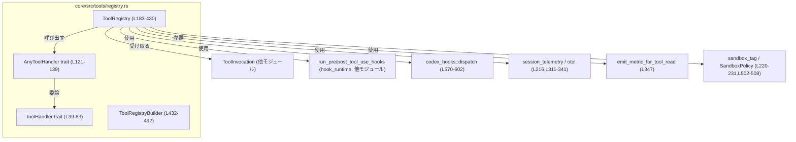
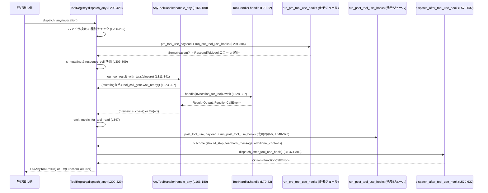

# core/src/tools/registry.rs コード解説

## 0. ざっくり一言

- ツール名から実装ハンドラを引き当てて実行し、フック・メトリクス・サンドボックス情報と連携しながら結果を返す「ツール実行レジストリ」と、そのための抽象インタフェース群を定義するモジュールです（`ToolHandler`, `ToolRegistry`, `ToolRegistryBuilder` など, 根拠: `core/src/tools/registry.rs:L33-83,L183-190,L432-491`）。

---

## 1. このモジュールの役割

### 1.1 概要

- このモジュールは、**モデルからのツール呼び出し**（`ToolInvocation`）を受け取り、登録済みハンドラにディスパッチし、**フック／メトリクス／サンドボックス情報**と統合しつつ結果を返すために存在します（`dispatch_any`, 根拠: `L209-429`）。
- ツール実装側は `ToolHandler` トレイトを実装し、`ToolRegistryBuilder` を通じてレジストリに登録されます（根拠: `L39-83,L432-468`）。
- 実行後には、レガシー含む２種類のフック (`run_post_tool_use_hooks`, `dispatch_after_tool_use_hook`) とメトリクス (`emit_metric_for_tool_read`, `otel.log_tool_result_with_tags`) が呼ばれます（根拠: `L311-347,L360-383,L570-602`）。

### 1.2 アーキテクチャ内での位置づけ

このモジュールは「ツール実行の中核」に位置し、他コンポーネントとの関係はおおよそ次のようになります。



- ツール実行要求 (`ToolInvocation`) はまず `ToolRegistry::dispatch_any` に渡されます。
- `ToolRegistry` はツール名（`ToolName`）から `AnyToolHandler` を引き当て、`ToolHandler` 実装を通して実際のツールを非同期に実行します（根拠: `L183-185,L192-194,L256-273,L320-338`）。
- 実行前後にフック・メトリクス・サンドボックス情報が参照／送出されます（根拠: `L291-304,L360-383,L570-602`）。

### 1.3 設計上のポイント

- **抽象化と動的ディスパッチ**
  - ツール実装は `ToolHandler` トレイトで抽象化され、レジストリ内部では `Arc<dyn AnyToolHandler>` として一様に扱われます（根拠: `L39-83,L121-139,L183-185,L458-467`）。
  - `impl<T> AnyToolHandler for T where T: ToolHandler` により、任意の `ToolHandler` 実装が自動的に型消去ラッパとして扱われます（根拠: `L141-181`）。
- **安全な並行性**
  - 全てのハンドラは `Send + Sync` 制約下で `Arc` に包まれ、マルチスレッド環境で安全に共有されます（根拠: `L39,L121,L183-185,L458-465`）。
  - 実行中のレスポンス格納には `tokio::sync::Mutex<Option<AnyToolResult>>` を使用し、非同期タスク間で結果を共有します（根拠: `L307-308,L332-334,L349-356,L409-416,L421-425`）。
  - 破壊的（mutating）なツールは `tool_call_gate.wait_ready().await` を通じてゲート制御され、並列実行が制限されます（根拠: `L306,L323-327`）。
- **フックとポリシー連携**
  - 実行前フック（PreToolUse）は **実行をブロック可能** であり、実行後フック（PostToolUse, AfterToolUse）は結果の書き換えや追加コンテキストの記録を行います（根拠: `L291-304,L360-417,L570-632`）。
- **エラー処理**
  - ツールが見つからない／種別不一致／フックの致命的失敗などのケースで `FunctionCallError` を返し、呼び出し元にエラーを伝播します（根拠: `L256-273,L275-289,L300-303,L385-387,L423-424,L625-627`）。

---

## 2. 主要な機能一覧

- ツール種別の抽象化: `ToolKind` による Function/MCP などの種別区別（根拠: `L33-37`）。
- ツール実装インタフェース: `ToolHandler` トレイトでツールの実装契約（入出力・mutating 判定・フック用ペイロード）を定義（根拠: `L39-83`）。
- ツールレジストリ: `ToolRegistry` によるツール名→ハンドラのディスパッチと実行オーケストレーション（根拠: `L183-430`）。
- レジストリ構築: `ToolRegistryBuilder` によるハンドラ登録とツール仕様 (`ConfiguredToolSpec`) の管理（根拠: `L432-492`）。
- フック用ペイロード変換: `From<&ToolPayload> for HookToolInput` による内部表現→フック用表示形式の変換（根拠: `L513-549`）。
- サンドボックス・ポリシータグ: `sandbox_policy_tag` による `SandboxPolicy` からのメトリクスタグ生成（根拠: `L502-508`）。
- AfterToolUse フックディスパッチ: `dispatch_after_tool_use_hook` によるレガシー AfterToolUse フックの実行とエラー処理（根拠: `L570-632`）。

### 2.1 コンポーネントインベントリー（型・関数一覧）

| 名称 | 種別 | 公開範囲 | 行範囲 | 役割 / 用途 |
|------|------|----------|--------|-------------|
| `ToolKind` | enum | `pub` | `L33-37` | ツールの種別（Function, Mcp）を表す |
| `ToolHandler` | trait | `pub` | `L39-83` | ツール実装が満たすべきインタフェース（kind/handle/is_mutating/フック用ペイロード） |
| `AnyToolResult` | struct | `pub(crate)` | `L85-89` | 型消去されたツール結果（call_id・payload・`Box<dyn ToolOutput>`） |
| `AnyToolResult::into_response` | メソッド | `pub(crate)` | `L91-100` | モデル向け `ResponseInputItem` に変換 |
| `AnyToolResult::code_mode_result` | メソッド | `pub(crate)` | `L102-107` | コードモード用の JSON 結果に変換 |
| `PreToolUsePayload` | struct | `pub(crate)` | `L110-113` | PreToolUse フックに渡すコマンド文字列を保持 |
| `PostToolUsePayload` | struct | `pub(crate)` | `L115-119` | PostToolUse フックに渡すコマンドとツールレスポンス |
| `AnyToolHandler` | trait | private | `L121-139` | `ToolHandler` を型消去して統一的に扱う内部用インタフェース |
| `impl<T> AnyToolHandler for T` | impl | private | `L141-181` | 任意の `ToolHandler` 実装を `AnyToolHandler` として扱う |
| `ToolRegistry` | struct | `pub` | `L183-185` | ツール名→ハンドラのレジストリと実行エンジン |
| `ToolRegistry::new` | 関数 | private | `L187-190` | ハンドラ `HashMap` からレジストリを構築 |
| `ToolRegistry::handler` | メソッド | private | `L192-194` | ツール名からハンドラを取得 |
| `ToolRegistry::has_handler` | メソッド | `pub(crate)`（test時） | `L196-199` | テスト用：ハンドラ有無チェック |
| `ToolRegistry::dispatch_any` | メソッド | `pub(crate)` | `L209-429` | フック・ゲート・メトリクス込みでツールを実行するコアロジック |
| `ToolRegistryBuilder` | struct | `pub` | `L432-435` | レジストリとツール仕様リストのビルダー |
| `ToolRegistryBuilder::new` | 関数 | `pub` | `L437-443` | 空のビルダーを作成 |
| `ToolRegistryBuilder::push_spec` | メソッド | `pub` | `L445-447` | 並列非対応としてツール仕様を追加 |
| `push_spec_with_parallel_support` | メソッド | `pub` | `L449-456` | 並列実行サポートフラグ付きでツール仕様を追加 |
| `register_handler` | メソッド | `pub` | `L458-467` | ツール名に `ToolHandler` を紐付けて登録 |
| `build` | メソッド | `pub` | `L488-491` | `ConfiguredToolSpec` 一覧と `ToolRegistry` を構築して返す |
| `unsupported_tool_call_message` | 関数 | private | `L494-500` | 未サポートツール呼び出しのエラーメッセージ生成 |
| `sandbox_policy_tag` | 関数 | private | `L502-508` | `SandboxPolicy` を文字列表現に変換 |
| `impl From<&ToolPayload> for HookToolInput` | impl | `pub`（外部クレート型の impl） | `L513-549` | 内部 `ToolPayload` をフック用 `HookToolInput` に変換 |
| `hook_tool_kind` | 関数 | private | `L552-558` | `HookToolInput` から `HookToolKind` を導出 |
| `AfterToolUseHookDispatch` | struct | private | `L561-568` | AfterToolUse フックに渡す集約情報 |
| `dispatch_after_tool_use_hook` | 関数 | private | `L570-632` | AfterToolUse フックを実行し、失敗時はエラーを返す |
| `tests` モジュール | mod | private | `L635-637` | テストコード（別ファイル）へのリンク |

※ `codex_utils_readiness::Readiness` はインポートされていますが、このチャンクでは使用されていません（根拠: `L28`）。

---

## 3. 公開 API と詳細解説

### 3.1 型一覧（公開 API）

外部から直接利用される可能性が高い型に絞った一覧です。

| 名前 | 種別 | 役割 / 用途 |
|------|------|-------------|
| `ToolKind` | enum | ツールの種別を表現（Function / Mcp）。`ToolHandler::kind` の戻り値として使用（根拠: `L33-37,L42`）。 |
| `ToolHandler` | trait | 各ツール実装のインタフェース。kind 判定、mutating 判定、フック用ペイロード、実行 (`handle`) を定義（根拠: `L39-83`）。 |
| `ToolRegistry` | struct | ツール名からハンドラをディスパッチし、フック・メトリクス込みで実行するレジストリ（根拠: `L183-185,L209-429`）。 |
| `ToolRegistryBuilder` | struct | ツール仕様とハンドラを登録し、`ToolRegistry` を構築するビルダー（根拠: `L432-435,L437-491`）。 |

`AnyToolResult`, `PreToolUsePayload`, `PostToolUsePayload` は `pub(crate)` であり crate 内の利用に限定されています（根拠: `L85-89,L110-119`）。

---

### 3.2 重要関数・メソッド詳細（テンプレート）

#### `ToolHandler::handle(&self, invocation: ToolInvocation) -> impl Future<Output = Result<Self::Output, FunctionCallError>> + Send`（L79-82）

**概要**

- 単一のツール呼び出しを処理し、`ToolOutput` を返す非同期メソッドです。
- `ToolRegistry` は型消去された `AnyToolHandler::handle_any` を通じて最終的にこのメソッドを呼び出します（根拠: `L166-180`）。

**引数**

| 引数名 | 型 | 説明 |
|--------|----|------|
| `self` | `&self` | ツール実装インスタンス。`Send + Sync` 必須（根拠: `L39`）。 |
| `invocation` | `ToolInvocation` | ツール名・ペイロード・セッション／ターン情報を含む呼び出し情報（このチャンクには定義がないため詳細不明, 根拠: `L13,L79-82`）。 |

**戻り値**

- `Future`（`Send`）で、完了時に `Result<Self::Output, FunctionCallError>` を返します（根拠: `L79-82`）。
  - `Self::Output`: `ToolOutput` を実装する型（出力の内容とシリアライズ方法をカプセル化, 根拠: `L40,L91-107`）。
  - `FunctionCallError`: 実行失敗時のエラー種別（レスポンスとして返すか、致命的とするかなど, 根拠: `L6,L256-273,L275-289`）。

**内部処理（実装側の契約）**

このモジュールには実装は含まれていないため、処理内容は不明です。ただし以下の契約が推測ではなくシグネチャ／コメントから読み取れます。

- **非同期実行**: ブロッキング I/O を含む場合は自身で適切にスレッドプールへオフロードする必要があります（シグネチャが async Future であることから, 根拠: `L79-82`）。
- **エラー時**: リトライ不能／致命的なエラーは `FunctionCallError::Fatal` 相当、ユーザー向けメッセージは `FunctionCallError::RespondToModel` 相当を返すことが期待されます（具体的なバリアント名は他ファイルで定義, 根拠: `L271,L288,L300-303`）。

**Examples（概念的な使用例）**

> 注: `ToolOutput` や `ToolInvocation` の定義がこのチャンクには現れないため、以下は擬似コードです。

```rust
// 擬似コード: "echo" ツールの実装例
struct EchoTool;

// ToolOutput を実装する型や to_response_item などの詳細はこのチャンクにはないため省略
impl ToolHandler for EchoTool {
    type Output = MyEchoOutput; // ToolOutput を実装する型と仮定

    fn kind(&self) -> ToolKind {
        ToolKind::Function
    }

    async fn handle(
        &self,
        invocation: ToolInvocation, // 実際には crate::tools::context から提供
    ) -> Result<Self::Output, FunctionCallError> {
        // invocation.payload などから引数を取り出し、処理を行う …という形になる
        /* ... */
        Ok(MyEchoOutput::new(/* ... */))
    }
}
```

**Errors / Panics**

- `handle` 自体は `Result` を返す設計であり、パニックを避けることが期待されます。
- `ToolRegistry::dispatch_any` は `Err(FunctionCallError)` が返された場合、そのまま呼び出し元に伝播します（根拠: `L328-337,L419-428`）。

**Edge cases**

- 空入力や不正フォーマットなどへの挙動は、各ツール実装ごとに異なり、このチャンクからは分かりません。
- `Self::Output` は `'static` 制約付きであり、実行後もライフタイム上は安全に保持できるオブジェクトである必要があります（根拠: `L40`）。

**使用上の注意点**

- `ToolHandler::is_mutating` を正しく実装することが、並列実行時の安全性に直結します（詳しくは後述, 根拠: `L53-62,L306,L323-327`）。
- `kind` と `ToolPayload` の組み合わせが `matches_kind` で許可されるように整合性を保つ必要があります（根拠: `L44-51,L275-289`）。

---

#### `ToolRegistry::dispatch_any(&self, invocation: ToolInvocation) -> Result<AnyToolResult, FunctionCallError>`（L209-429）

**概要**

- 与えられた `ToolInvocation` を適切なハンドラにディスパッチし、フック・メトリクス・サンドボックス情報を組み合わせながらツールを実行するコアメソッドです。
- 実行結果は内部型 `AnyToolResult` で返され、呼び出し側は `into_response` や `code_mode_result` でレスポンス形式に変換します（根拠: `L91-107`）。

**引数**

| 引数名 | 型 | 説明 |
|--------|----|------|
| `self` | `&ToolRegistry` | 登録済みハンドラを保持するレジストリインスタンス（根拠: `L183-185`）。 |
| `invocation` | `ToolInvocation` | ツール名、ペイロード、セッション・ターン情報を含む呼び出し（根拠: `L211,L213-218`）。 |

**戻り値**

- `Ok(AnyToolResult)`：ツール実行が成功した場合。`AnyToolResult` には `call_id`, `payload`, `Box<dyn ToolOutput>` が含まれます（根拠: `L85-89,L329-335,L421-425`）。
- `Err(FunctionCallError)`：ツール未登録、種別不一致、フックがブロックした場合、ハンドラがエラーを返した場合、または AfterToolUse フックが致命的エラーを返した場合など（根拠: `L256-273,L275-289,L291-304,L385-387,L419-428`）。

**内部処理の流れ**

ざっくりとしたステップは次の通りです（コメント位置を根拠として記載）。

1. **メタデータの準備**（根拠: `L213-231`）
   - `tool_name`, `display_name`, `call_id_owned`, `otel`（テレメトリ）、`payload_for_response`, `log_payload` を取得。
   - メトリクスタグ `sandbox`, `sandbox_policy` を計算し、MCP ツールの場合は接続マネージャからサーバ情報・origin を取得（根拠: `L220-246`）。

2. **アクティブターン状態の更新**（根拠: `L248-254`）
   - `invocation.session.active_turn` の `tool_calls` カウンタを saturating_add(1) で増加。

3. **ハンドラ取得と存在チェック**（根拠: `L256-273`）
   - `self.handler(&tool_name)` で `AnyToolHandler` を取得。
   - 見つからない場合はメトリクスに `success=false` とエラーメッセージを記録し、`FunctionCallError::RespondToModel` を返す。

4. **ペイロード種別チェック**（根拠: `L275-289`）
   - `handler.matches_kind(&invocation.payload)` が `false` の場合、メトリクスを記録し `FunctionCallError::Fatal` を返す。

5. **PreToolUse フック**（根拠: `L291-304`）
   - `handler.pre_tool_use_payload(&invocation)` が `Some` を返した場合のみ `run_pre_tool_use_hooks(...)` を実行。
   - フックが理由文字列 `reason` を返した場合、その理由を含むメッセージで `FunctionCallError::RespondToModel` を返し、ツールは実行されない。

6. **mutating 判定とレスポンスセルの用意**（根拠: `L306-309`）
   - `handler.is_mutating(&invocation).await` で環境を書き換える可能性があるか確認。
   - 非同期に結果を共有するため `tokio::sync::Mutex<Option<AnyToolResult>>` を準備。

7. **メトリクス付きでツール実行**（根拠: `L310-341`）
   - `Instant::now()` で開始時間を記録。
   - `otel.log_tool_result_with_tags(...)` に非同期クロージャを渡して実行。
     - mutating の場合、`tool_call_gate.wait_ready().await` でゲート解放を待つ（根拠: `L323-327`）。
     - `handler.handle_any(invocation_for_tool).await` を実行し、成功時は `result` を `response_cell` に格納し（`Mutex` ロック経由）、ログ用の `(preview, success)` を返す（根拠: `L328-335`）。

8. **メトリクスと PostToolUse フック**（根拠: `L342-373`）
   - 実行結果 `result` から `output_preview` と `success` を取り出し、`emit_metric_for_tool_read(&invocation, success).await` を呼ぶ。
   - 成功時のみ `handler.post_tool_use_payload(...)` でペイロードを構築し、`run_post_tool_use_hooks(...)` を実行、結果を `post_tool_use_outcome` として保持。

9. **レガシー AfterToolUse フック**（根拠: `L374-383`）
   - `dispatch_after_tool_use_hook` に `AfterToolUseHookDispatch` を渡して実行。
   - `Some(err)` が返された場合は即座に `Err(err)` として返す（根拠: `L385-387`）。

10. **PostToolUse フック結果の適用**（根拠: `L389-417`）
    - `post_tool_use_outcome` が存在する場合、`record_additional_contexts(...)` で追加コンテキストをセッションに記録。
    - `should_stop` が `true` の場合は `feedback_message` または `stop_reason` からレスポンス置換テキストを決定し、`FunctionToolOutput::from_text` で結果オブジェクトを差し替える（根拠: `L397-415`）。

11. **最終結果の返却**（根拠: `L419-428`）
    - `result` が `Ok(_)` の場合、`response_cell` から `AnyToolResult` を取り出し（なければ Fatal エラー）、`Ok(result)` で返す。
    - `result` が `Err(err)` の場合はそのまま `Err(err)` を返す。

**Examples（概念的な使用例）**

> 注: `ToolInvocation` などの定義が別モジュールのため、以下は概念レベルです。

```rust
// ビルダーでレジストリを構築
let mut builder = ToolRegistryBuilder::new();                  // L437-443
builder.push_spec(my_tool_spec);                               // L445-447
builder.register_handler("my_tool_name".into(), Arc::new(MyToolHandler));
let (_specs, registry) = builder.build();                      // L488-491

// どこかで ToolInvocation を構築（詳細は他モジュール）
let invocation: ToolInvocation = /* ... */;

// 非同期にツールを実行
let result = registry.dispatch_any(invocation).await;

match result {
    Ok(any_result) => {
        // モデル向けレスポンスに変換
        let response = any_result.into_response();             // L91-100
        // ここで response を上位レイヤへ渡す
    }
    Err(err) => {
        // FunctionCallError を上位レイヤへ伝播またはログ
    }
}
```

**Errors / Panics**

- `FunctionCallError::RespondToModel` を返す代表例:
  - 未対応ツール名・カスタムツール: `unsupported_tool_call_message` 経由でメッセージ生成（根拠: `L256-273,L494-500`）。
  - PreToolUse フックがコマンドをブロックした場合（根拠: `L291-304`）。
- `FunctionCallError::Fatal` を返す代表例:
  - 種別不一致（ツール種別とペイロード種別が合わない, 根拠: `L275-289`）。
  - AfterToolUse フックが FailedAbort を返した場合（根拠: `L385-387,L625-627`）。
  - `response_cell` が `None` のままだった場合（「tool produced no output」, 根拠: `L421-424`）。
- パニック:
  - `dispatch_after_tool_use_hook` 内で `u64::try_from(...).unwrap_or(u64::MAX)` を使用しており、`unwrap_or` によりパニックは回避されています（根拠: `L593`）。
  - それ以外に明示的な `unwrap` / `expect` は出現しません。

**Edge cases**

- ハンドラが `Ok` を返したにもかかわらず `response_cell` に書き込まなかった場合、Fatal エラー「tool produced no output」になります（`response_cell` の唯一の書き込み箇所は `Ok(result)` ブランチのみ, 根拠: `L329-335,L421-424`）。
- `is_mutating` を `false` にしてしまうと、本来ゲートすべきツールが並行実行される可能性があります（根拠: `L306,L323-327`）。
- PostToolUse フックで `should_stop` が `true` かつ `feedback_message` / `stop_reason` が両方 `None` の場合、デフォルトメッセージ `"PostToolUse hook stopped execution"` がレスポンスに使われます（根拠: `L397-404`）。

**使用上の注意点（安全性・並行性）**

- `ToolInvocation` 内のセッション・ターンは内部で `Mutex` 等により同期されている前提で使用されています（`active_turn.lock().await` など, 根拠: `L248-253`）。
- `dispatch_any` は非同期関数であり、ブロッキング I/O を内部に含めるときは `ToolHandler::handle` 側で適切にオフロードすることが重要です。
- mutating ツールの `is_mutating` 実装を誤ると、ファイルシステムや外部システムへの同時アクセスが意図せず並列になります。安全側に倒して `true` を返す設計がコメント上推奨されています（根拠: `L53-62`）。

---

#### `ToolRegistryBuilder::register_handler<H>(&mut self, name: impl Into<ToolName>, handler: Arc<H>)`（L458-467）

**概要**

- 指定したツール名に対応する `ToolHandler` 実装をレジストリに登録します。
- 同名ツールがすでに存在する場合は上書きし、`warn!` ログを出力します（根拠: `L462-467`）。

**引数**

| 引数名 | 型 | 説明 |
|--------|----|------|
| `self` | `&mut ToolRegistryBuilder` | レジストリ構築用ビルダー（根拠: `L432-435`）。 |
| `name` | `impl Into<ToolName>` | ハンドラに紐付けるツール名。`ToolName::display()` によりログ出力用の文字列が取得されます（根拠: `L462-464`）。 |
| `handler` | `Arc<H>` | `ToolHandler + 'static` を実装するハンドラ。内部で `Arc<dyn AnyToolHandler>` に型消去されます（根拠: `L459-465`）。 |

**戻り値**

- なし（`()`）。`self.handlers` 内部状態を更新します（根拠: `L465`）。

**内部処理の流れ**

1. `name` を `ToolName` に変換し、表示用文字列を `display_name` として取得（根拠: `L462-464`）。
2. `handler` を `Arc<dyn AnyToolHandler>` に型変換（`ToolHandler` からのアップキャスト, 根拠: `L463-465`）。
3. `self.handlers.insert(name, handler)` を行い、既存値があった場合は `warn!("overwriting handler for tool {display_name}")` を出力（根拠: `L465-467`）。

**Examples（概念的な登録例）**

```rust
let mut builder = ToolRegistryBuilder::new();
builder.register_handler("echo_tool", Arc::new(EchoToolHandler));
```

**Edge cases / 注意点**

- 同じ `ToolName` に対して複数回登録すると最後のものが有効になり、警告ログが出ます。意図的に上書きする場合以外はツール名の重複に注意が必要です（根拠: `L465-467`）。
- `H: ToolHandler + 'static` 制約により、ハンドラ内部で非 `'static` 参照を保持することはできません（根拠: `L459-461`）。

---

#### `ToolRegistryBuilder::build(self) -> (Vec<ConfiguredToolSpec>, ToolRegistry)`（L488-491）

**概要**

- これまで登録したツール仕様とハンドラ群から `ToolRegistry` を構築し、仕様リストと共に返します。

**引数 / 戻り値**

- 引数: `self`（所有権を消費, 根拠: `L488`）。
- 戻り値:
  - `Vec<ConfiguredToolSpec>`: `push_spec` / `push_spec_with_parallel_support` で登録されたツール仕様の一覧（根拠: `L432-435,L445-456,L488-491`）。
  - `ToolRegistry`: ハンドラ `HashMap` を内包したレジストリ（根拠: `L488-491`）。

**内部処理**

1. `ToolRegistry::new(self.handlers)` を呼び出し、内部 `HashMap<ToolName, Arc<dyn AnyToolHandler>>` を移動（根拠: `L488-490`）。
2. `(self.specs, registry)` のタプルで返す（根拠: `L490-491`）。

**使用上の注意点**

- `build` 呼び出し後、元の `ToolRegistryBuilder` は消費されます。追加登録したい場合は新たにビルダーを作成する必要があります。

---

#### `unsupported_tool_call_message(payload: &ToolPayload, tool_name: &ToolName) -> String`（L494-500）

**概要**

- ツールが見つからない、またはサポートされていない場合のユーザー向けメッセージ文字列を生成します。

**引数**

| 引数名 | 型 | 説明 |
|--------|----|------|
| `payload` | `&ToolPayload` | 呼び出しに使われたペイロード。カスタムツールかどうかを区別（根拠: `L494-499`）。 |
| `tool_name` | `&ToolName` | 呼び出し対象ツール名（根拠: `L494-496`）。 |

**戻り値**

- `String`:
  - `ToolPayload::Custom` の場合: `"unsupported custom tool call: {tool_name}"`（根拠: `L497`）。
  - それ以外: `"unsupported call: {tool_name}"`（根拠: `L498`）。

**使用箇所**

- `ToolRegistry::dispatch_any` 内でハンドラが見つからない場合に使用され、`FunctionCallError::RespondToModel` にラップされます（根拠: `L256-273`）。

---

#### `sandbox_policy_tag(policy: &SandboxPolicy) -> &'static str`（L502-508）

**概要**

- サンドボックスポリシーをメトリクス用の短い文字列表現に変換します。

**戻り値例**

| `SandboxPolicy` | 戻り値 | 根拠 |
|-----------------|--------|------|
| `ReadOnly { .. }` | `"read-only"` | `L503-504` |
| `WorkspaceWrite { .. }` | `"workspace-write"` | `L505` |
| `DangerFullAccess` | `"danger-full-access"` | `L506` |
| `ExternalSandbox { .. }` | `"external-sandbox"` | `L507-508` |

**使用箇所**

- メトリクスタグ生成（`metric_tags`）および AfterToolUse フック payload の一部として使われます（根拠: `L220-231,L595-597`）。

---

#### `impl From<&ToolPayload> for HookToolInput`（L513-549）

**概要**

- コア内部の `ToolPayload` 表現を、フックシステムが扱う `HookToolInput` 形式に変換する実装です。
- これにより、フック側の JSON 表現を安定させつつ、内部表現の変更から切り離しています（コメント, 根拠: `L511-512`）。

**変換ロジック（代表例）**

- `ToolPayload::Function { arguments }` → `HookToolInput::Function { arguments: arguments.clone() }`（根拠: `L515-518`）。
- `ToolPayload::ToolSearch { arguments }` → `HookToolInput::Function` with JSON `{ "query": ..., "limit": ... }.to_string()`（根拠: `L519-525`）。
- `ToolPayload::Custom { input }` → `HookToolInput::Custom { input: input.clone() }`（根拠: `L526-528`）。
- `ToolPayload::LocalShell { params }` → `HookToolInput::LocalShell { params: HookToolInputLocalShell { ... } }` として各フィールドをコピー（根拠: `L529-537`）。
- `ToolPayload::Mcp { server, tool, raw_arguments }` → `HookToolInput::Mcp { server, tool, arguments: raw_arguments.clone() }`（根拠: `L539-547`）。

**注意点**

- ToolSearch は JSON 文字列化された引数として Function タイプにマッピングされており、フック側からは通常の Function と同じ扱いになります（根拠: `L519-525`）。

---

#### `dispatch_after_tool_use_hook(dispatch: AfterToolUseHookDispatch<'_>) -> Option<FunctionCallError>`（L570-632）

**概要**

- レガシーな AfterToolUse フックを実行し、フックが FailedAbort を返した場合に `FunctionCallError::Fatal` を返すヘルパーです。
- `ToolRegistry::dispatch_any` 内から必ず呼ばれます（根拠: `L374-383`）。

**引数**

| 引数名 | 型 | 説明 |
|--------|----|------|
| `dispatch` | `AfterToolUseHookDispatch<'_>` | invocation・結果プレビュー・成功フラグ・実行時間・mutating 判定等をまとめた構造体（根拠: `L561-568`）。 |

**戻り値**

- `None`：全てのフックが `Success` または `FailedContinue` の場合（根拠: `L604-616,L631-632`）。
- `Some(FunctionCallError::Fatal(...))`：いずれかのフックが `FailedAbort` を返した場合（根拠: `L617-627`）。

**処理の流れ**

1. `invocation.session`, `invocation.turn`、`HookToolInput` を準備（根拠: `L573-577`）。
2. `session.hooks().dispatch(HookPayload { ... })` を await し、全てのフック結果 (`hook_outcomes`) を取得（根拠: `L577-602`）。
3. 各 `hook_outcome` に対して:
   - `HookResult::Success` → 何もしない。
   - `HookResult::FailedContinue(error)` → `warn!` ログを出しつつ継続（根拠: `L608-616`）。
   - `HookResult::FailedAbort(error)` → `warn!` ログを出し、`Some(FunctionCallError::Fatal(...))` を返して終了（根拠: `L617-627`）。

**使用上の注意点**

- このフックは **ツール実行後** に必ず `executed: true` として呼ばれます（根拠: `L374-382,L585-592`）。
- フックが FailedAbort を返してもツールの副作用はすでに発生済みであり、以降の処理（レスポンス送出など）を中止するためのメカニズムとして働きます。

---

### 3.3 その他の関数・メソッド（概要）

| 関数名 | 行範囲 | 役割（1 行） |
|--------|--------|--------------|
| `ToolHandler::matches_kind` | `L44-51` | `ToolKind` と `ToolPayload` の組み合わせが妥当かをマッチ式で判定。 |
| `ToolHandler::is_mutating` | `L53-62` | デフォルトは `false`（非 mutating）。必要に応じてツール側でオーバーライド。 |
| `ToolHandler::pre_tool_use_payload` | `L64-66` | PreToolUse フック用のコマンド文字列を返す（デフォルトは `None`）。 |
| `ToolHandler::post_tool_use_payload` | `L68-75` | PostToolUse フック用のコマンド・レスポンスを返す（デフォルトは `None`）。 |
| `ToolRegistry::new` | `L187-190` | ハンドラマップから新しい `ToolRegistry` を生成。 |
| `ToolRegistry::handler` | `L192-194` | ツール名で `AnyToolHandler` を検索。 |
| `ToolRegistryBuilder::new` | `L437-443` | 空のハンドラマップと仕様リストを持つビルダーを生成。 |
| `ToolRegistryBuilder::push_spec` | `L445-447` | 並列非対応のツール仕様を追加（ラッパー）。 |
| `ToolRegistryBuilder::push_spec_with_parallel_support` | `L449-456` | 並列対応フラグ付きでツール仕様を追加。 |
| `hook_tool_kind` | `L552-558` | `HookToolInput` から `HookToolKind` を導出。 |

---

## 4. データフロー

### 4.1 代表的シナリオ: ツール呼び出しのライフサイクル

- ここでは、`ToolRegistry::dispatch_any` を通じてツールが実行される典型的なフローを示します（根拠: `L209-429`）。



要点:

- PreToolUse フックのみがツール **実行前にブロック** できるポイントです（根拠: `L291-304`）。
- PostToolUse / AfterToolUse フックは実行後の処理であり、結果の書き換えや追加コンテキスト記録、致命的エラーによる後続処理の中止などを担います（根拠: `L360-417,L570-632`）。
- mutating ツールは `tool_call_gate` によって並列実行が制御されます（根拠: `L323-327`）。

---

## 5. 使い方（How to Use）

### 5.1 基本的な使用方法

1. **ツール実装 (`ToolHandler`) を定義**  
   - `kind`, `handle`, 必要に応じて `is_mutating`, `pre_tool_use_payload`, `post_tool_use_payload` を実装します（根拠: `L39-83`）。

2. **`ToolRegistryBuilder` でハンドラと仕様を登録**（根拠: `L437-467`）

```rust
use std::sync::Arc;

// 擬似コード: ツール実装とレジストリ構築
let mut builder = ToolRegistryBuilder::new();                // L437-443

// ツール仕様を登録（ToolSpec の詳細は別モジュール）
builder.push_spec(my_tool_spec);

// ハンドラを登録
builder.register_handler("my_tool_name".into(), Arc::new(MyToolHandler));

// 最終的な仕様一覧とレジストリを構築
let (tool_specs, registry) = builder.build();                // L488-491
```

1. **実行時に `dispatch_any` を使用してツールを呼び出す**（根拠: `L209-429`）

```rust
// 擬似コード: ToolInvocation をどこかから構築
let invocation: ToolInvocation = /* ... */;

// 非同期にツールをディスパッチ
let any_result = registry.dispatch_any(invocation).await?;

// モデルレスポンスまたはコードモード結果に変換
let response_item = any_result.into_response();              // L91-100
let code_mode = any_result.code_mode_result();               // L102-107
```

### 5.2 よくある使用パターン

- **読み取り専用ツール**
  - `is_mutating` デフォルト（`false`）のまま、並列実行可能なツールとして実装。
  - 例: ドキュメント検索、コード解析、API 読み取りなど。

- **環境を変更するツール**
  - ファイル書き込み・プロセス生成・外部サービスへの更新などを行うツールは `is_mutating` を `true` にする実装が推奨です（根拠: `L53-62,L306,L323-327`）。
  - これにより `tool_call_gate` を介して、同一ターン内の mutating ツールがシリアライズされます。

- **シェル・MCP ツール**
  - `ToolPayload::LocalShell` や `ToolPayload::Mcp` は `HookToolInput` への変換で専用の構造を持ちます（根拠: `L529-537,L539-547`）。
  - フック側でこれらの情報を使って監査やフィルタリングを行うことが想定されます。

### 5.3 よくある間違いと注意点

```rust
// 間違い例: mutating なのに is_mutating をデフォルトのまま
impl ToolHandler for DangerousTool {
    type Output = DangerousOutput;

    fn kind(&self) -> ToolKind { ToolKind::Function }

    // fn is_mutating はオーバーライドしていない -> false 扱い (L53-62)
}

// 正しい例: is_mutating を明示的に true にする
impl ToolHandler for DangerousTool {
    type Output = DangerousOutput;

    fn kind(&self) -> ToolKind { ToolKind::Function }

    fn is_mutating(
        &self,
        _invocation: &ToolInvocation,
    ) -> impl std::future::Future<Output = bool> + Send {
        async { true } // 破壊的ツールは安全側に倒す
    }
}
```

- **ツール種別とペイロード種別の不一致**
  - `ToolKind::Function` なのに `ToolPayload::Mcp` を渡すなどすると、`"tool {display_name} invoked with incompatible payload"` という Fatal エラーになります（根拠: `L44-51,L275-289`）。

- **ハンドラ未登録**
  - ツール名に対応するハンドラを登録し忘れると、`unsupported custom tool call: ...` などのエラーが `RespondToModel` として返されます（根拠: `L256-273,L494-500`）。

- **Pre/Post フック用ペイロード未設定**
  - `pre_tool_use_payload` / `post_tool_use_payload` を `None` のままにすると、フック側からはコマンド内容やツールレスポンスが見えないため、意図した監査や制御が行えない可能性があります（根拠: `L64-75,L291-304,L348-370`）。

### 5.4 使用上の注意点（まとめ）

- **並行性**
  - ハンドラは `Send + Sync` であり、内部で非同期ロックなどを適切に扱う必要があります（根拠: `L39,L121,L183-185`）。
  - mutating 判定の誤りは安全性に直結するため、少しでも疑いがある場合は `true` を返すというコメント上の方針が示されています（根拠: `L53-62`）。

- **フックとセキュリティ**
  - 実行前にコマンドをブロックできる唯一のポイントは PreToolUse フックです（根拠: `L291-304`）。
  - PostToolUse / AfterToolUse フックは、ツール実行後の後処理・監査・レスポンス書き換えに使用されます（根拠: `L360-417,L570-632`）。
  - AfterToolUse フックが FailedAbort を返した場合、すでに実行済みの操作に対して「操作中止」エラーを返す挙動になる点に注意が必要です（根拠: `L585-592,L617-627,L374-383`）。

- **観測性**
  - メトリクスは `otel.tool_result_with_tags`, `otel.log_tool_result_with_tags`, `emit_metric_for_tool_read` を通じて出力され、サンドボックス情報や MCP サーバ情報がタグとして付与されます（根拠: `L260-271,L311-341,L347`）。

---

## 6. 変更の仕方（How to Modify）

### 6.1 新しい機能を追加する場合

- **新しいツール種別を追加する**
  1. `ToolKind` にバリアントを追加（根拠: `L33-37`）。
  2. `ToolHandler::matches_kind` のマッチ式に新バリアント用の分岐を追加（根拠: `L44-51`）。
  3. `ToolPayload` および `HookToolInput` に対応するバリアントと `From<&ToolPayload> for HookToolInput` のマッピングを追加（後者は本ファイル、根拠: `L513-549`）。
  4. 必要に応じて `hook_tool_kind` にも新バリアントを追加（根拠: `L552-558`）。

- **新しいフック情報を渡したい**
  1. `PreToolUsePayload` / `PostToolUsePayload` にフィールドを追加（根拠: `L110-119`）。
  2. `run_pre_tool_use_hooks` / `run_post_tool_use_hooks` 呼び出し部で新フィールドを渡すよう修正（根拠: `L291-304,L360-370`）。
  3. フック側（別モジュール）も対応させる。

### 6.2 既存の機能を変更する場合の注意点

- **`dispatch_any` を変更する際の契約**
  - PreToolUse フックが「唯一の実行前ブロックポイント」であるという性質を壊すと、セキュリティポリシーに影響します（根拠: `L291-304`）。
  - `tool_calls` カウンタ更新はトラッキング用途に使われている可能性があるため、削除や位置変更は影響範囲を確認する必要があります（根拠: `L248-253`）。
  - `response_cell` を唯一の結果格納場所として扱う設計（`tool produced no output` エラー）を変更する場合、呼び出し側の期待も併せて見直す必要があります（根拠: `L329-335,L421-424`）。

- **フック関連の変更**
  - `HookPayload` の構成（`session_id`, `cwd`, `client` など）はフック実装に直接影響するため、フィールド変更時にはフック実装と協調が必要です（根拠: `L580-600`）。
  - AfterToolUse フックはレガシーとコメントされており（根拠: `L374-375`）、削除・非推奨化などの際には利用状況の調査が必要です。

---

## 7. 関連ファイル

このモジュールと密接に関係するファイル・コンポーネント（このチャンクから読み取れる範囲）を挙げます。

| パス / モジュール | 役割 / 関係 |
|-------------------|------------|
| `crate::tools::context` (`ToolInvocation`, `ToolPayload`, `ToolOutput`, `FunctionToolOutput`) | ツール呼び出しのコンテキスト・ペイロード・出力のコア型。`ToolRegistry` の入出力に直接関与（根拠: `L12-15,L330-331,L411-414`）。 |
| `crate::hook_runtime` (`run_pre_tool_use_hooks`, `run_post_tool_use_hooks`, `record_additional_contexts`) | 新しい PostToolUse フック API を提供。Pre/Post フックの実行と追加コンテキスト記録を担当（根拠: `L7-9,L360-370,L389-395`）。 |
| `crate::sandbox_tags::sandbox_tag` | サンドボックス情報を文字列表現に変換するユーティリティ。メトリクスタグやフック payload に使用（根拠: `L11,L222-226,L595-596`）。 |
| `crate::memories::usage::emit_metric_for_tool_read` | ツール読み取りに関するメトリクス送出（根拠: `L10,L347`）。 |
| `codex_hooks` クレート | フックシステムのイベント型・入力型・実行結果を提供。AfterToolUse フック実装に使用（根拠: `L16-22,L513-549,L570-602,L604-629`）。 |
| `codex_protocol::protocol::SandboxPolicy` | サンドボックスポリシー表現。メトリクス・フック payload でタグ化される（根拠: `L24,L502-508,L595-597`）。 |
| `codex_tools` クレート (`ToolSpec`, `ConfiguredToolSpec`, `ToolName`) | ツール仕様とツール名の管理。レジストリ構築時に使用（根拠: `L25-27,L432-435,L445-456`）。 |
| `core/src/tools/registry_tests.rs` | 本モジュールのテストコード（内容はこのチャンクには現れない, 根拠: `L635-637`）。 |

このチャンクに現れないため、`ToolInvocation` や `ToolOutput` の具体的な構造・メソッド、`FunctionCallError` のバリアント定義などの詳細は「不明」となります。
