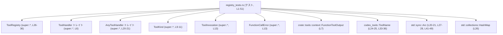
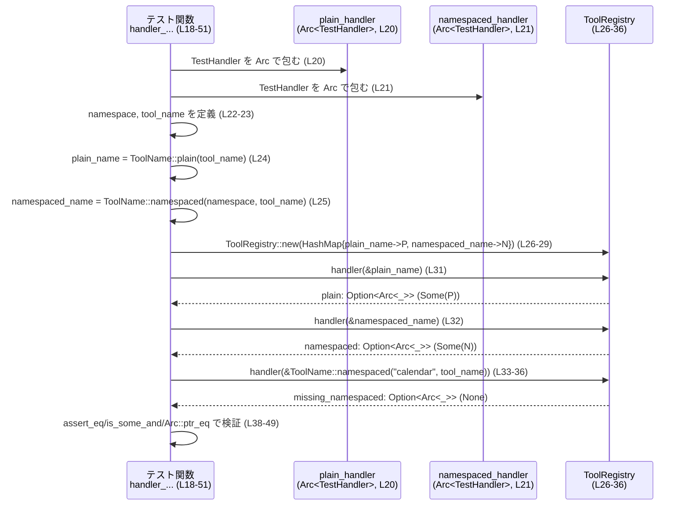

# core/src/tools/registry_tests.rs コード解説

## 0. ざっくり一言

- `ToolRegistry` が **プレーン名と namespaced なツール名エイリアスをどのように解決するか** を検証するテストモジュールです（`registry_tests.rs:L18-51`）。
- テスト用ハンドラ `TestHandler` を `Arc` 経由で登録し、`ToolRegistry::handler` が **完全一致の `ToolName` に対してのみハンドラを返す** ことと、**登録されていない namespace では `None` を返す** ことを確認しています（`registry_tests.rs:L20-36, L38-50`）。

---

## 1. このモジュールの役割

### 1.1 概要

- このモジュールは、ツールハンドラを管理する `ToolRegistry` の **名前解決ロジック**（特に namespaced なエイリアス名）の挙動を検証するために存在します。
- `ToolName::plain` と `ToolName::namespaced` で生成した名前をキーに `ToolRegistry` を初期化し、`handler` メソッドでハンドラ取得時の挙動を確認します（`registry_tests.rs:L24-29, L31-36`）。
- テスト用の `TestHandler` は `ToolHandler` トレイトを実装しますが、`handle` は `unreachable!` で実装され、**テスト中に実行されないこと**が前提になっています（`registry_tests.rs:L4-16`）。

### 1.2 アーキテクチャ内での位置づけ

このファイルは `use super::*;` により、親モジュール（`tools` モジュール配下と推測されるが、具体ファイルパスは不明）で定義されている型を利用する **テスト用サブモジュール**として動作しています（`registry_tests.rs:L1`）。

- 依存関係の概要（このチャンクに現れる範囲）:



- `ToolRegistry`・`ToolHandler`・`AnyToolHandler` などの定義そのものは、`super::*` の側にあり、このチャンクからは定義位置（ファイルパス）は分かりません。

### 1.3 設計上のポイント

コードから読み取れる設計上の特徴を列挙します。

- **テスト用スタブハンドラ**  
  - `TestHandler` は `ToolHandler` トレイトを実装しますが（`registry_tests.rs:L4-16`）、`handle` は `unreachable!` で実装されており、**このテストではハンドラの本処理は呼び出さない**前提です（`registry_tests.rs:L13-15`）。
- **ハンドラの共有と同一性確認に Arc を使用**  
  - ハンドラは `Arc<dyn AnyToolHandler>` として共有されます（`registry_tests.rs:L20-21`）。  
  - 取得したハンドラが「同じインスタンスか」を `Arc::ptr_eq` で検証しており、`ToolRegistry` が登録済み `Arc` をそのまま返していることを期待しています（`registry_tests.rs:L41-49`）。
- **名前解決の契約（Contract）の明示**  
  - `ToolName::plain(tool_name)` と `ToolName::namespaced(namespace, tool_name)` で別々のキーを作り、それぞれに別のハンドラを登録します（`registry_tests.rs:L24-29`）。
  - `ToolRegistry::handler` が以下を満たすことをテストしています（`registry_tests.rs:L31-40`）:
    - プレーン名で登録したキーに対しては `Some` を返す。
    - namespaced 名で登録したキーに対しては `Some` を返す。
    - **異なる namespace で同じ tool_name を指定しても、登録されていない限り `None` を返す**（フォールバックしない）。
- **エラーハンドリング・安全性**  
  - テストでは `Option` の `is_some` / `is_none` / `as_ref` / `is_some_and` を用いて存在チェックと中身の検証を行い、誤ったハンドラが返らないことを確認しています（`registry_tests.rs:L38-40, L41-49`）。
  - `handle` が `unreachable!` であるため、このテストの文脈ではハンドラ処理の実行による副作用やエラーは一切発生しません（`registry_tests.rs:L13-15`）。

---

## 2. 主要な機能一覧（コンポーネント概要）

このファイルが提供・検証している主要な機能は次の通りです。

- `TestHandler`（テスト用ハンドラスタブ）:  
  `ToolHandler` を実装するシンプルな構造体で、`ToolRegistry` に登録するためだけに使われます。`handle` は呼ばれると panic します（`registry_tests.rs:L4-16`）。
- `handler_looks_up_namespaced_aliases_explicitly` テスト:  
  - プレーン名と namespaced 名で別々に登録したハンドラを、`ToolRegistry::handler` が正しく区別して返すことを検証します（`registry_tests.rs:L20-36, L38-49`）。
  - 別 namespace（`"mcp__codex_apps__calendar"`）で同じ `tool_name` を指定しても、未登録であるため `None` が返ることを検証します（`registry_tests.rs:L33-40`）。

---

## 3. 公開 API と詳細解説

### 3.1 型一覧（構造体・列挙体など）

#### このファイルで定義される型

| 名前 | 種別 | 役割 / 用途 | 根拠 (行範囲) |
|------|------|-------------|----------------|
| `TestHandler` | 構造体 | `ToolHandler` トレイト実装を持つテスト用ハンドラスタブ。`ToolRegistry` に登録するためだけに使用される。 | `registry_tests.rs:L4-4` |

#### このファイルで利用される主な外部型（定義はこのチャンクに現れない）

| 名前 | 種別 | 役割 / 用途 | 根拠 (行範囲) |
|------|------|-------------|----------------|
| `ToolHandler` | トレイト | ツールハンドラが実装すべきインターフェース。`TestHandler` がこれを実装している。 | `registry_tests.rs:L6-16` |
| `ToolKind` | 列挙体（と推定） | ハンドラの種別を表す。`TestHandler::kind` は `ToolKind::Function` を返す。 | `registry_tests.rs:L9-11` |
| `ToolInvocation` | 構造体等（詳細不明） | `handle` メソッドの入力。ツール呼び出しの内容を表す型と考えられるが、このチャンクからは詳細不明。 | `registry_tests.rs:L13` |
| `FunctionCallError` | エラー型 | `handle` の失敗時に返されるエラー型。詳細はこのチャンクには現れない。 | `registry_tests.rs:L13` |
| `crate::tools::context::FunctionToolOutput` | 型（詳細不明） | `ToolHandler` の associated type `Output` の具体型。ツール呼び出しの結果を表すと考えられるが詳細不明。 | `registry_tests.rs:L7` |
| `AnyToolHandler` | トレイト | 動的ディスパッチ用のハンドラトレイトオブジェクト型。`Arc<dyn AnyToolHandler>` として格納される。 | `registry_tests.rs:L20-21` |
| `ToolRegistry` | 構造体 | `ToolName` をキーにハンドラを管理し、`handler` メソッドで取得するレジストリ。 | `registry_tests.rs:L26-36` |
| `codex_tools::ToolName` | 構造体等 | ツールの名前（プレーン / namespaced）を表す型。`plain` / `namespaced` メソッドで生成される。 | `registry_tests.rs:L24-25, L33-36` |

### 3.2 関数詳細

ここでは、このファイルのコアロジックであるテスト関数を詳しく説明します。

#### `handler_looks_up_namespaced_aliases_explicitly()`

**概要**

- `ToolRegistry` に対して、同じ `tool_name` を持つ **プレーン名** と **namespaced 名** の両方を登録し、それぞれのキーでハンドラが正しく取得できること、そして **異なる namespace の namespaced 名では取得できないこと**を確認するテストです（`registry_tests.rs:L18-40`）。
- また、返ってきた `Arc<dyn AnyToolHandler>` が **登録時のものと同一の `Arc`** であることも確認します（`registry_tests.rs:L41-49`）。

**引数**

- このテスト関数は引数を取りません（`fn handler_looks_up_namespaced_aliases_explicitly()`、`registry_tests.rs:L18-19`）。

**戻り値**

- 戻り値はユニット型 `()` です（テスト関数の通常形）。  
  失敗時（アサーション失敗時）は panic し、テストランナーがテスト失敗として扱います。

**内部処理の流れ（アルゴリズム）**

1. **ハンドラの生成**  
   - `TestHandler` を `Arc` でラップし、`Arc<dyn AnyToolHandler>` 型にキャストして `plain_handler` / `namespaced_handler` を作成します（`registry_tests.rs:L20-21`）。
2. **名前とエイリアスの生成**  
   - `namespace` と `tool_name` の文字列を定義します（`registry_tests.rs:L22-23`）。
   - プレーン名: `codex_tools::ToolName::plain(tool_name)` を呼び出し、`plain_name` を生成します（`registry_tests.rs:L24`）。
   - namespaced 名: `codex_tools::ToolName::namespaced(namespace, tool_name)` を呼び出し、`namespaced_name` を生成します（`registry_tests.rs:L25`）。
3. **レジストリの構築**  
   - `HashMap::from` を使い、`plain_name -> plain_handler` と `namespaced_name -> namespaced_handler` の 2 エントリを持つマップを作成します（`registry_tests.rs:L26-29`）。
   - それを `ToolRegistry::new(...)` に渡して `registry` を構築します（`registry_tests.rs:L26`）。
4. **3 パターンのハンドラ取得**  
   - プレーン名で取得: `plain = registry.handler(&plain_name)`（`registry_tests.rs:L31`）。
   - 登録済み namespace での namespaced 名で取得: `namespaced = registry.handler(&namespaced_name)`（`registry_tests.rs:L32`）。
   - 異なる namespace での namespaced 名で取得:  
     `missing_namespaced = registry.handler(&ToolName::namespaced("mcp__codex_apps__calendar", tool_name))`（`registry_tests.rs:L33-36`）。
   - 戻り値に対して `is_some` / `is_none` / `as_ref` / `is_some_and` を呼び出していることから、戻り値は `Option<Arc<dyn AnyToolHandler>>` 型であると分かります（`registry_tests.rs:L38-40, L41-49`）。
5. **結果の検証**  
   - 存在確認:  
     - プレーン名と登録済み namespaced 名では `Some` が返ること（`plain.is_some() == true` / `namespaced.is_some() == true`、`registry_tests.rs:L38-39`）。
     - 異なる namespace の namespaced 名では `None` が返ること（`missing_namespaced.is_none() == true`、`registry_tests.rs:L40`）。
   - インスタンス同一性の確認:  
     - `plain` の中身が `plain_handler` と同じ `Arc` であることを `Arc::ptr_eq` で確認（`registry_tests.rs:L41-45`）。
     - `namespaced` の中身が `namespaced_handler` と同じ `Arc` であることを `Arc::ptr_eq` で確認（`registry_tests.rs:L46-49`）。

**Examples（使用例）**

この関数自体がテストであり、`cargo test` の実行時に自動で呼び出されます。  
テスト全体は以下のようになっています（原文そのまま）。

```rust
#[test]                                                    // テスト関数であることを示す属性      (L18)
fn handler_looks_up_namespaced_aliases_explicitly() {      // テスト関数本体                      (L19)
    let plain_handler = Arc::new(TestHandler)              // TestHandler を Arc で包む           (L20)
        as Arc<dyn AnyToolHandler>;
    let namespaced_handler = Arc::new(TestHandler)         // namespaced 用のハンドラ             (L21)
        as Arc<dyn AnyToolHandler>;
    let namespace = "mcp__codex_apps__gmail";              // Gmail 用 namespace                  (L22)
    let tool_name = "gmail_get_recent_emails";             // ツール名                           (L23)
    let plain_name = codex_tools::ToolName::plain(tool_name); // プレーン名                         (L24)
    let namespaced_name = codex_tools::ToolName::namespaced(  // namespaced 名                     (L25)
        namespace,
        tool_name,
    );
    let registry = ToolRegistry::new(HashMap::from([      // レジストリに 2 つのハンドラを登録   (L26)
        (plain_name.clone(), Arc::clone(&plain_handler)),  // プレーン名 -> plain_handler         (L27)
        (namespaced_name.clone(), Arc::clone(&namespaced_handler)), // namespaced 名 -> namespaced_handler (L28)
    ]));

    let plain = registry.handler(&plain_name);             // プレーン名で取得                    (L31)
    let namespaced = registry.handler(&namespaced_name);   // namespaced 名で取得                (L32)
    let missing_namespaced = registry.handler(             // 異なる namespace の namespaced 名  (L33)
        &codex_tools::ToolName::namespaced(
            "mcp__codex_apps__calendar",
            tool_name,
        ),
    );

    assert_eq!(plain.is_some(), true);                     // プレーン名は Some                   (L38)
    assert_eq!(namespaced.is_some(), true);                // namespaced 名も Some                (L39)
    assert_eq!(missing_namespaced.is_none(), true);        // 異なる namespace は None           (L40)
    assert!(
        plain
            .as_ref()
            .is_some_and(|handler| Arc::ptr_eq(handler, &plain_handler)) // Arc が同一か確認 (L41-45)
    );
    assert!(
        namespaced
            .as_ref()
            .is_some_and(|handler| Arc::ptr_eq(handler, &namespaced_handler)) // 同上 (L46-49)
    );
}
```

**Errors / Panics**

- このテスト関数自体は、失敗時に `assert_eq!` や `assert!` によって panic します（`registry_tests.rs:L38-40, L41-49`）。
- `TestHandler::handle` は `unreachable!` で実装されているため、誤ってハンドラ本体を呼び出すと panic しますが、このテスト内では `handle` は一切呼ばれていません（`registry_tests.rs:L13-15`）。

**Edge cases（エッジケース）**

- **登録済みプレーン名**:  
  `plain_name` で `handler` を呼ぶと `Some(Arc<dyn AnyToolHandler>)` が返る（`registry_tests.rs:L31, L38`）。
- **登録済み namespaced 名**:  
  `namespaced_name` で `handler` を呼ぶと `Some(...)` が返る（`registry_tests.rs:L32, L39`）。
- **未登録 namespace + 同じ tool_name**:  
  `ToolName::namespaced("mcp__codex_apps__calendar", tool_name)` のように、**namespace だけが異なる** `ToolName` を指定した場合、`plain_name` が登録されていても `None` が返る（`registry_tests.rs:L33-36, L40`）。
  - これにより、`ToolRegistry::handler` が namespace による完全一致を要求し、プレーン名や他 namespace へのフォールバックを行わないことが分かります。

**使用上の注意点**

- `ToolRegistry::handler` を利用するコード側は、**期待する namespace を含む正しい `ToolName` を構築して渡す必要がある**と解釈できます（`registry_tests.rs:L24-25, L33-36`）。
- 「namespace が違っても同じ `tool_name` ならヒットして欲しい」といった挙動は、このテストに反するため、現状の契約とは異なります。
- ハンドラの同一性（同じ `Arc` が返ってくること）に依存するコードを書く場合、このテストがその前提を保証していることになりますが、`ToolRegistry` の内部実装変更により将来この前提が変わる可能性もあります。その場合はテストの更新が必要です。

### 3.3 その他の関数・メソッド

このファイルには、`ToolHandler` トレイト実装のためのメソッドが 2 つ定義されています。

| 関数名 | 所属 | 役割（1 行） | 根拠 (行範囲) |
|--------|------|--------------|----------------|
| `fn kind(&self) -> ToolKind` | `impl ToolHandler for TestHandler` | このハンドラが `ToolKind::Function` であることを示す。 | `registry_tests.rs:L9-11` |
| `async fn handle(&self, _invocation: ToolInvocation) -> Result<Self::Output, FunctionCallError>` | 同上 | 呼び出されない前提のメソッド。呼ばれると `unreachable!` で panic する。 | `registry_tests.rs:L13-15` |

- `kind` は `ToolRegistry` や周辺コードがハンドラの種別を識別するために使われる可能性がありますが、このテスト内では直接使われていません。
- `handle` は非同期関数 `async fn` ですが、このテストでは呼ばれません。`unreachable!` により、万一呼ばれた場合には即座に panic し、テストの前提違反を検出できるようになっています（`registry_tests.rs:L13-15`）。

---

## 4. データフロー

このセクションでは、テスト関数 `handler_looks_up_namespaced_aliases_explicitly`（`registry_tests.rs:L18-51`）における代表的なデータフローを説明します。

- 入力データ: `namespace` 文字列、`tool_name` 文字列（`registry_tests.rs:L22-23`）。
- 中間データ: `plain_name` / `namespaced_name`（`ToolName` 型）、`plain_handler` / `namespaced_handler`（`Arc<dyn AnyToolHandler>`）、`registry`（`ToolRegistry` インスタンス）（`registry_tests.rs:L20-29`）。
- 出力データ: `plain` / `namespaced` / `missing_namespaced`（いずれも `Option<Arc<dyn AnyToolHandler>>`）、およびそれに対するアサーション結果（`registry_tests.rs:L31-40, L41-49`）。

### シーケンス図



この図から分かるポイント:

- `ToolRegistry::new` には、`ToolName` をキーとし、`Arc<dyn AnyToolHandler>` を値とする `HashMap` が渡されています（`registry_tests.rs:L26-29`）。
- `handler` 呼び出しの戻り値は `Option` で表現されており、**キーが存在する場合のみ `Some`** になります（`registry_tests.rs:L31-40`）。
- プレーン名と namespaced 名は**別々のキー**として扱われ、namespace が異なる場合には `None` が返るため、**完全一致マッチである**ことが確認できます（`registry_tests.rs:L33-40`）。

---

## 5. 使い方（How to Use）

ここでは、このテストが示すパターンをもとに、`ToolRegistry` と `ToolName` の基本的な使い方を整理します。

### 5.1 基本的な使用方法

`ToolRegistry` でツールハンドラを管理し、名前からハンドラを取得する典型的な流れは、テストコードの通りです。

```rust
// 1. ハンドラを Arc でラップし、AnyToolHandler として扱う             (L20-21)
let plain_handler = Arc::new(TestHandler) as Arc<dyn AnyToolHandler>;
let namespaced_handler = Arc::new(TestHandler) as Arc<dyn AnyToolHandler>;

// 2. namespace と tool_name を用意する                               (L22-23)
let namespace = "mcp__codex_apps__gmail";
let tool_name = "gmail_get_recent_emails";

// 3. ToolName を生成する                                              (L24-25)
let plain_name = codex_tools::ToolName::plain(tool_name);
let namespaced_name = codex_tools::ToolName::namespaced(namespace, tool_name);

// 4. HashMap から ToolRegistry を構築する                             (L26-29)
let registry = ToolRegistry::new(HashMap::from([
    (plain_name.clone(), Arc::clone(&plain_handler)),
    (namespaced_name.clone(), Arc::clone(&namespaced_handler)),
]));

// 5. ToolName をキーにハンドラを取得する                              (L31-32)
let plain = registry.handler(&plain_name);
let namespaced = registry.handler(&namespaced_name);

// 6. Option を介して存在チェックを行う                               (L38-39)
assert_eq!(plain.is_some(), true);
assert_eq!(namespaced.is_some(), true);
```

- 戻り値は `Option` であるため、`Some(handler)` の場合のみハンドラを使用し、`None` の場合は「未登録」であると判断します（`registry_tests.rs:L31-40`）。

### 5.2 よくある使用パターン

このテストから推測できる代表的なパターンは次の 2 つです。

1. **プレーン名での登録・取得**

   - `ToolName::plain` を用いて名前を生成し、そのキーでハンドラを登録・取得する（`registry_tests.rs:L24, L27, L31`）。
   - namespace を使わないシンプルなケースに相当します。

2. **namespaced 名での登録・取得**

   - `ToolName::namespaced(namespace, tool_name)` で、アプリケーションやカテゴリごとの namespace 付き名前を生成します（`registry_tests.rs:L25, L28, L32`）。
   - 外部ツール（例: Gmail, Calendar など）ごとに名前空間を分ける用途が想定されますが、具体的な意味付けはこのチャンクには現れません。

### 5.3 よくある間違い（このテストが防いでいるもの）

このテストが明示している挙動から、起こり得る誤解・誤用を整理します。

```rust
// 誤り例（このような挙動はしない）:
// プレーン名が登録されているので、namespace 違いでもヒットすると期待してしまう
let missing = registry.handler(
    &codex_tools::ToolName::namespaced("mcp__codex_apps__calendar", tool_name),
);
// テストでは、ここが Some ではなく None であることを確認している (L33-40)
```

- **誤解しやすい点**:  
  「同じ `tool_name` なら namespace が違ってもフォールバックしてほしい」と考えるかもしれませんが、このテストはその逆、つまり **完全一致でのみマッチする** ことを前提としています（`registry_tests.rs:L33-40`）。

### 5.4 使用上の注意点（まとめ）

- `ToolName` を構築する際には、**namespace まで含めて一意になる値を指定する契約**になっていると解釈できます（`registry_tests.rs:L22-25, L33-36`）。
- `ToolRegistry::handler` の戻り値は `Option` であり、`None` の場合は **未登録または名前不一致**を意味します（`registry_tests.rs:L31-40`）。
- このテストではハンドラ本体 `handle` を呼ばないため、`TestHandler` の `handle` が `unreachable!` であることを忘れると、他のテストやコードで誤って呼び出した際に即座に panic します（`registry_tests.rs:L13-15`）。
- `Arc::ptr_eq` を利用していることから、`ToolRegistry` が **登録時に渡された `Arc` をそのまま返す**という前提に依存したコードになっています（`registry_tests.rs:L41-49`）。内部実装が変わると、この前提が崩れる可能性があります。

---

## 6. 変更の仕方（How to Modify）

### 6.1 新しい機能を追加する場合（テスト観点）

このファイルはテスト専用なので、「機能追加」は通常、**新しいテストケースの追加**を意味します。

- 例: `ToolRegistry` に fallback ロジックを追加したい場合
  1. `ToolRegistry` 本体で仕様を変更／追加する（このチャンクには実装は現れません）。
  2. それに応じて、このファイルに新しいテスト関数を追加し、期待する挙動を明示する。
     - 例えば「登録された namespaced 名がなくても、同じ `tool_name` のプレーン名があればフォールバックする」といったシナリオを検証する等。
  3. 既存テスト `handler_looks_up_namespaced_aliases_explicitly` の期待値と新仕様が矛盾する場合は、どちらを優先するかを決めたうえでテストを更新する。

### 6.2 既存の機能を変更する場合（`ToolRegistry` の契約変更）

- `ToolRegistry::handler` の名前解決ルール（namespace との付き合い方）を変更する場合、次の点に注意する必要があります。

  - **影響範囲の確認**  
    - クレート全体で `ToolRegistry::handler` を検索し、どのような前提で使われているかを確認する必要があります。このチャンクには他の使用箇所は現れません。
  
  - **契約の見直し**  
    - 現在は「namespace まで含めた完全一致でのみハンドラが見つかる」という契約を、このテストが保証しています（`registry_tests.rs:L33-40`）。
    - 仕様変更時は、この契約が変わることをテストで明示し、コメントやドキュメントで共有することが望ましいです。

  - **テスト更新**  
    - 仕様に合わなくなったアサーション（`assert_eq!(missing_namespaced.is_none(), true)` など）を削除・変更し、新仕様に対応したアサーションを追加します（`registry_tests.rs:L40`）。
    - `Arc::ptr_eq` での同一性確認も、内部実装に依存したテストであるため、実装変更に応じて見直す必要があります（`registry_tests.rs:L41-49`）。

---

## 7. 関連ファイル・モジュール

このチャンクから読み取れる範囲で、密接に関係するモジュール／型をまとめます。

| パス / モジュール | 役割 / 関係 | 根拠 (行範囲) |
|------------------|------------|----------------|
| `super::*`（親モジュール） | `ToolRegistry`, `ToolHandler`, `AnyToolHandler`, `ToolKind`, `ToolInvocation`, `FunctionCallError` などの定義を提供するモジュール。具体的なファイルパスはこのチャンクからは分かりません。 | `registry_tests.rs:L1, L6-16, L20-21, L26` |
| `crate::tools::context` | `FunctionToolOutput` 型を定義するモジュール。この型が `ToolHandler` の出力として使われます。 | `registry_tests.rs:L7` |
| `codex_tools::ToolName` | プレーン / namespaced なツール名を表現する型を提供する外部クレート（または別モジュール）。このテストでは名前解決のキーとして使用されます。 | `registry_tests.rs:L24-25, L33-36` |
| `pretty_assertions` クレート | `assert_eq` の差分表示を改善するテスト用ユーティリティ。テスト内で標準の `assert_eq!` の代わりに使用されています。 | `registry_tests.rs:L2, L38-40` |

- `ToolRegistry` 本体や `ToolHandler` トレイトの定義位置（具体的な `.rs` ファイル名）は、このチャンクには現れないため不明です。
- 並行性・安全性に関しては、このファイルでは `Arc` による共有所有権のみが現れており（`registry_tests.rs:L20-21, L27-28, L41-49`）、スレッド生成や非同期ランタイムなどの要素は出てきません。`async fn handle` が存在しますが実行されないため、非同期処理の挙動自体はこのチャンクからは確認できません。
