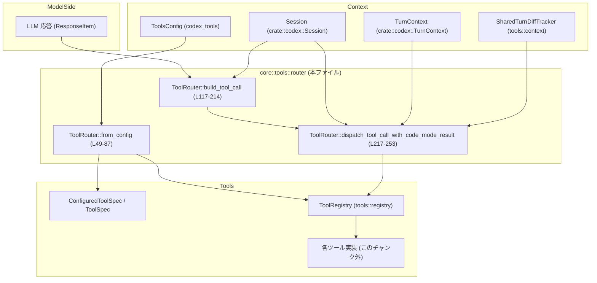
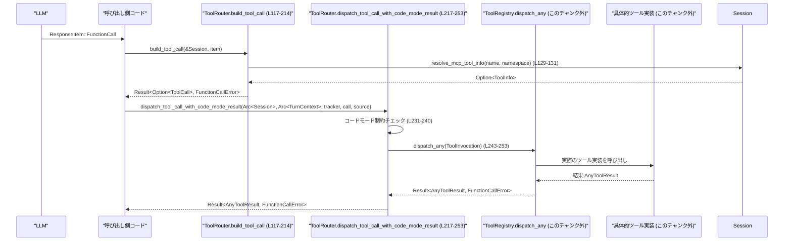

# core/src/tools/router.rs

## 0. ざっくり一言

このモジュールは、LLM から返ってくるツール呼び出し情報（`ResponseItem`）を内部表現 `ToolCall` に変換し、`ToolRegistry` を通じて適切なツール実装にディスパッチするルーターです（router.rs:L28-33, L35-39, L117-214, L217-253）。

---

## 1. このモジュールの役割

### 1.1 概要

- このモジュールは **LLM 応答に含まれる各種ツール呼び出し表現**（関数ツール、MCP ツール、ローカルシェル、検索ツール等）を受け取り（router.rs:L117-214）、
- 内部で扱いやすい `ToolCall` 構造体に正規化した上で（router.rs:L28-33, L117-214）、
- `ToolRegistry` に登録されているツール実装へ非同期にディスパッチします（router.rs:L35-39, L217-253）。
- 併せて、モデルに公開するツール仕様 (`ToolSpec`) のフィルタリングも担当します（router.rs:L49-87, L89-105）。

### 1.2 アーキテクチャ内での位置づけ

このモジュールが他コンポーネントとどうつながるかを簡略図で示します。



- `ToolRouter::from_config` が設定とツール情報から `ToolRegistry` とツール仕様一覧を構築します（router.rs:L49-87）。
- `ToolRouter::build_tool_call` が `ResponseItem` を `ToolCall` に変換します（router.rs:L117-214）。
- `ToolRouter::dispatch_tool_call_with_code_mode_result` が `ToolRegistry::dispatch_any` に委譲して実行します（router.rs:L217-253）。

### 1.3 設計上のポイント

コードから読み取れる特徴を挙げます。

- **責務分離**
  - 仕様構築 (`from_config`) と実行ディスパッチ (`dispatch_tool_call_with_code_mode_result`) を分離しています（router.rs:L49-87, L217-253）。
  - LLM 応答のパースは静的メソッド `build_tool_call` に閉じ込めています（router.rs:L117-214）。

- **ツール仕様とモデル可視性の分離**
  - 全ツール仕様 `specs` と、モデルに見せるツール仕様 `model_visible_specs` を別々に保持します（router.rs:L35-39, L64-80）。
  - `code_mode_only_enabled` が有効な場合、ネストしたツールをモデル非可視にするフィルタリングを行います（router.rs:L64-75, L68-72）。

- **名前空間付きツールの扱い**
  - `ToolName` に `namespace` と `name` があり（フィールド利用より推測, router.rs:L107-113, L132-135, L231-233）、MCP ツールなどで名前空間を扱っています。
  - 並列実行の判定では `namespace` が `None` のツールのみ対象です（router.rs:L107-113）。

- **エラーハンドリング**
  - すべて `Result<..., FunctionCallError>` を返し、エラーは `FunctionCallError::RespondToModel` などにマッピングして「モデル向けエラー文言」として扱います（router.rs:L160-165, L189-191, L237-240）。
  - パースエラーや ID 欠落を検出して早期に失敗させ、`unwrap` や `expect` によるパニックはありません。

- **並行性と安全性**
  - 実行系は `async fn` で、`Arc<Session>`・`Arc<TurnContext>` によりスレッド安全に共有します（router.rs:L217-223）。
  - このファイル内には `unsafe` ブロックが存在せず、メモリ安全性は Rust の型・所有権システムに委ねられています。

- **観測性（トレーシング）**
  - 重要な async 関数に `#[instrument(level = "trace", skip_all, err)]` を付与し、トレースログとエラー自動ログを埋め込んでいます（router.rs:L116, L216）。

---

## 2. 主要な機能一覧

- ツール仕様とレジストリの構築: `ToolRouter::from_config` で設定に基づき `ToolRegistry` と `ConfiguredToolSpec` 一覧を構築（router.rs:L49-87）。
- モデル可視なツール仕様の取得: `model_visible_specs` でモデルに提示する `ToolSpec` の一覧を返却（router.rs:L64-80, L96-98）。
- 任意ツール仕様の検索: `find_spec` でツール名から `ToolSpec` を検索（router.rs:L100-105）。
- 並列実行対応ツールの判定: `tool_supports_parallel` でツールが並列実行をサポートするか判定（router.rs:L107-114）。
- LLM 応答から内部呼び出し表現への変換: `build_tool_call` で `ResponseItem` から `ToolCall` を構築（router.rs:L117-214）。
- ツール呼び出しの実行ディスパッチ: `dispatch_tool_call_with_code_mode_result` で `ToolRegistry` にディスパッチし、コードモード制約を適用（router.rs:L217-253）。
- ツール仕様一覧の取得: `specs` で全 `ToolSpec` のクローンを返却（router.rs:L89-94）。

---

## 3. 公開 API と詳細解説

### 3.1 型一覧（構造体・列挙体など）

| 名前 | 種別 | 可視性 | 役割 / 用途 | 主なフィールド | 定義位置 |
|------|------|--------|------------|----------------|----------|
| `ToolCall` | 構造体 | `pub` | 単一のツール呼び出しを表す内部表現です。ツール名・呼び出し ID・ペイロードをまとめます。 | `tool_name: ToolName`, `call_id: String`, `payload: ToolPayload` | `router.rs:L28-33` |
| `ToolRouter` | 構造体 | `pub` | ツール仕様の管理と、`ToolCall` を具体的ツール実装へディスパッチする中心コンポーネントです。 | `registry: ToolRegistry`, `specs: Vec<ConfiguredToolSpec>`, `model_visible_specs: Vec<ToolSpec>` | `router.rs:L35-39` |
| `ToolRouterParams<'a>` | 構造体 | `pub(crate)` | `ToolRouter::from_config` に渡す初期化パラメータ群です。MCP ツールや Discoverable ツール、動的ツール仕様を含みます。 | `mcp_tools`, `deferred_mcp_tools`, `discoverable_tools`, `dynamic_tools: &'a [DynamicToolSpec]` | `router.rs:L41-46` |
| `ToolCallSource` | 列挙体（推定） | `pub`（re-export） | ツール呼び出しがどこから来たか（例: 直接呼び出しかどうか）を表す区別用の列挙体です。`ToolCallSource::Direct` が使用されています。 | バリアント詳細はこのチャンクには現れません | `pub use` による再公開 `router.rs:L26` |

> `ToolPayload` は他モジュール定義ですが、本ファイルでは `Mcp` / `Function` / `ToolSearch` / `Custom` / `LocalShell` の少なくとも 5 バリアントが利用されています（router.rs:L140-151, L167-170, L181-182, L207-208）。

---

### 3.2 関数詳細（主要 4 件）

#### `ToolRouter::from_config(config: &ToolsConfig, params: ToolRouterParams<'_>) -> Self`

**概要**

ツール関連の設定 (`ToolsConfig`) と MCP/Discoverable/動的ツール情報から、`ToolRegistry` とツール仕様一覧を構築し、`ToolRouter` インスタンスを生成します（router.rs:L49-87）。

**引数**

| 引数名 | 型 | 説明 |
|--------|----|------|
| `config` | `&ToolsConfig` | ツールの全体設定。`code_mode_only_enabled` フラグを利用してモデル可視なツールを制御します（router.rs:L64-65）。 |
| `params` | `ToolRouterParams<'_>` | MCP ツール、遅延ロード MCP ツール、Discoverable ツール、動的ツール仕様のオプション集合です（router.rs:L50-55）。 |

**戻り値**

- `ToolRouter`  
  - `registry`: `build_specs_with_discoverable_tools(...).build()` により構築された `ToolRegistry`（router.rs:L56-63）。
  - `specs`: `ConfiguredToolSpec` のベクタ（router.rs:L63, L84）。
  - `model_visible_specs`: モデルに提示する `ToolSpec` のベクタ。`code_mode_only_enabled` に応じてフィルタ済み（router.rs:L64-80, L85）。

**内部処理の流れ**

1. `ToolRouterParams` を分解して各フィールドを取り出します（router.rs:L50-55）。
2. `build_specs_with_discoverable_tools` に `config` と各ツール情報を渡し、ビルダーを取得します（router.rs:L56-62）。
3. ビルダーの `build()` を呼び出して `(specs, registry)` を得ます（router.rs:L63）。
4. `config.code_mode_only_enabled` を見て分岐します（router.rs:L64-80）:
   - true の場合:
     - `specs.iter()` から `ConfiguredToolSpec` をたどり（router.rs:L65-67）、
     - `codex_code_mode::is_code_mode_nested_tool(configured_tool.name())` が *false* のものだけ `ToolSpec` を抽出して `model_visible_specs` にします（router.rs:L68-73）。
   - false の場合:
     - すべての `ConfiguredToolSpec` から `spec.clone()` を取り、`model_visible_specs` にします（router.rs:L76-80）。
5. 以上を `Self { registry, specs, model_visible_specs }` にまとめて返します（router.rs:L82-86）。

**Examples（使用例）**

```rust
use std::collections::HashMap;
use codex_mcp::ToolInfo;
use codex_protocol::dynamic_tools::DynamicToolSpec;
use codex_tools::{ToolsConfig, DiscoverableTool};
use crate::tools::router::{ToolRouter, ToolRouterParams};

// 設定や外部から渡されたツール情報はどこかで用意されているとする
fn build_router_example(
    config: &ToolsConfig,
    mcp_tools: Option<HashMap<String, ToolInfo>>,
    discoverable_tools: Option<Vec<DiscoverableTool>>,
    dynamic_tools: &[DynamicToolSpec],
) -> ToolRouter {
    let params = ToolRouterParams {
        mcp_tools,
        deferred_mcp_tools: None,
        discoverable_tools,
        dynamic_tools,
    };

    // from_config で ToolRouter を構築
    ToolRouter::from_config(config, params)
}
```

**Errors / Panics**

- この関数は `Result` ではなく `Self` を直接返すため、関数自身としてはエラーを返しません（router.rs:L49-87）。
- `unwrap` / `expect` / `panic!` などは使用されておらず、この関数内でパニック要因は見当たりません（コード全体から）。

**Edge cases（エッジケース）**

- `params` の各フィールドが `None` の場合でも、`build_specs_with_discoverable_tools` に直接渡されます（router.rs:L56-62）。その挙動はビルダー側の実装に依存し、このチャンクには現れません。
- `specs` が空の場合、`model_visible_specs` も空となります（`iter()` の結果が空のため）。（router.rs:L65-80）

**使用上の注意点**

- `model_visible_specs` はモデルに提示するツール一覧であり、`specs` には含まれていても、ネストしたツールなど一部はモデル非可視になり得ます（router.rs:L64-75）。  
  モデル側のツール選択ロジックと整合させる必要があります。
- 並列実行可否（`supports_parallel_tool_calls`）などは `ConfiguredToolSpec` レベルで設定されているため、`ToolRouter` を構築する前に正しく設定されている前提があります（router.rs:L110-113）。

---

#### `ToolRouter::tool_supports_parallel(&self, tool_name: &ToolName) -> bool`

**概要**

指定されたツール名が「並列ツール呼び出しをサポートするか」を判定します（router.rs:L107-114）。

**引数**

| 引数名 | 型 | 説明 |
|--------|----|------|
| `tool_name` | `&ToolName` | 判定対象のツール名。`namespace` が `None` であるツールのみ並列実行の候補になります（router.rs:L107-108, L231-233）。 |

**戻り値**

- `bool`  
  - `true`: このツールが並列呼び出し対象として扱える。  
  - `false`: 並列呼び出し対象ではない。

**内部処理の流れ**

1. `tool_name.namespace.is_none()` をチェックし、名前空間付きツールを除外します（router.rs:L107-108）。
2. `self.specs.iter()` から `ConfiguredToolSpec` のうち `supports_parallel_tool_calls` が `true` のものだけをフィルタします（router.rs:L110-112）。
3. その中に `config.name() == tool_name.name.as_str()` と一致するものがあるかどうかを `any` で確認します（router.rs:L112-113）。
4. 上記すべてを `&&` でつなぎ、名前空間なし & 条件を満たすツールが存在する場合に `true` を返します（router.rs:L107-113）。

**Examples（使用例）**

```rust
use codex_tools::ToolName;
use crate::tools::router::ToolRouter;

// router はどこかで from_config により構築済みとする
fn check_parallel(router: &ToolRouter) {
    let name = ToolName::plain("local_shell"); // namespace なしのツール名を作成
    if router.tool_supports_parallel(&name) {
        // 並列呼び出し可能なツールとして扱う
    }
}
```

**Errors / Panics**

- 単純な読み取り専用ロジックであり、エラーやパニックを発生させるコードは含まれていません（router.rs:L107-114）。

**Edge cases**

- `tool_name.namespace` が `Some(_)`（名前空間付き）の場合は、`supports_parallel_tool_calls` の値に関わらず `false` になります（router.rs:L107-108）。
- `self.specs` 内に名前が一致するツールが存在しない場合も `false` になります（router.rs:L110-113）。
- 同名ツールが複数ある場合は、いずれか 1 つが `supports_parallel_tool_calls == true` であれば `true` になります（`any` を使用, router.rs:L112-113）。

**使用上の注意点**

- 名前空間付きツール（MCP ツールなど）は、現状この関数では並列実行対象として扱われません（router.rs:L107-108）。  
  名前空間付きツールの並列実行を許可したい場合は、この条件式の設計を見直す必要があります。
- 並列実行は、実際にはツール実装側のスレッド安全性にも依存するため、この関数の結果だけで完全に安全性が保証されるわけではありません。

---

#### `ToolRouter::build_tool_call(session: &Session, item: ResponseItem) -> Result<Option<ToolCall>, FunctionCallError>`

**概要**

LLM からの応答 `ResponseItem` を解釈し、内部表現 `ToolCall` に変換します。対応するツール呼び出しがない場合は `Ok(None)` を返します（router.rs:L117-214）。

**引数**

| 引数名 | 型 | 説明 |
|--------|----|------|
| `session` | `&Session` | MCP ツール情報の解決に利用されるセッションコンテキストです（router.rs:L129-131）。 |
| `item` | `ResponseItem` | LLM からの応答の一部（ツール呼び出し、カスタムコール、ローカルシェル呼び出しなど）です（router.rs:L119-121）。 |

**戻り値**

- `Result<Option<ToolCall>, FunctionCallError>`  
  - `Ok(Some(ToolCall))`: 対応するツール呼び出しが構築できた場合。  
  - `Ok(None)`: このルーターでは処理しない `ResponseItem` の場合（例: 一部の `ToolSearchCall`）。（router.rs:L172, L212）  
  - `Err(FunctionCallError)`: 引数パース失敗やローカルシェル ID 欠落などの異常時。

**内部処理の流れ**

`match item` でバリアントごとに処理しています（router.rs:L121-213）。

1. **`ResponseItem::FunctionCall` の場合（router.rs:L122-153）**
   - `session.resolve_mcp_tool_info(&name, namespace.as_deref()).await` で MCP ツール情報を解決（`Option<ToolInfo>` 想定, router.rs:L129-131）。
   - `namespace` が `Some(ns)` なら `ToolName::namespaced(ns, name)`、`None` なら `ToolName::plain(name)` を生成（router.rs:L132-135）。
   - MCP ツール情報が `Some(tool_info)` の場合:
     - `ToolPayload::Mcp` を構築し、`server`, `tool`, `raw_arguments` を詰めます（router.rs:L136-145）。
   - MCP ツール情報が `None` の場合:
     - `ToolPayload::Function { arguments }` を使います（router.rs:L147-151）。
   - いずれも `ToolCall` を `Ok(Some(...))` で返します（router.rs:L137-145, L147-151）。

2. **`ResponseItem::ToolSearchCall` で `execution == "client"` かつ `call_id` が `Some` の場合（router.rs:L154-171）**
   - `serde_json::from_value(arguments)` で `SearchToolCallParams` にデシリアライズし、失敗したら `FunctionCallError::RespondToModel` に変換して返します（router.rs:L160-165）。
   - 成功時は `ToolPayload::ToolSearch { arguments }` を含む `ToolCall` を構築し、ツール名は固定で `"tool_search"` を用います（router.rs:L167-170）。

3. **その他の `ToolSearchCall` の場合**
   - `Ok(None)` を返し、呼び出しを生成しません（router.rs:L172）。

4. **`ResponseItem::CustomToolCall` の場合（router.rs:L173-182）**
   - `ToolPayload::Custom { input }` を設定し、ツール名は `ToolName::plain(name)` として `Ok(Some(ToolCall))` を返します（router.rs:L178-182）。

5. **`ResponseItem::LocalShellCall` の場合（router.rs:L183-211）**
   - `call_id.or(id)` で `call_id` を補完し、いずれもなければ `FunctionCallError::MissingLocalShellCallId` を返します（router.rs:L189-191）。
   - `action` が `LocalShellAction::Exec(exec)` の場合のみマッチ（router.rs:L193-210）。
   - `ShellToolCallParams` を構築し、
     - `command`, `workdir`, `timeout_ms` は `exec` からコピー（router.rs:L195-198）。
     - `sandbox_permissions: Some(SandboxPermissions::UseDefault)`（router.rs:L199）。
     - その他の権限関連フィールドは `None` / `None` / `None` / `None` に初期化（router.rs:L200-202）。
   - これを `ToolPayload::LocalShell { params }` に包み、`ToolName::plain("local_shell")` とともに返します（router.rs:L204-208）。

6. **その他の `ResponseItem` の場合**
   - `_ => Ok(None)` として無視します（router.rs:L212-213）。

**Examples（使用例）**

```rust
use std::sync::Arc;
use codex_protocol::models::ResponseItem;
use crate::codex::Session;
use crate::tools::router::{ToolRouter, ToolCall};

async fn handle_item_example(
    router: &ToolRouter,
    session: Arc<Session>,
    item: ResponseItem,
) -> Result<(), crate::function_tool::FunctionCallError> {
    // Session は Arc ですが、&Session が必要なので as_ref() で変換します
    if let Some(call) = ToolRouter::build_tool_call(session.as_ref(), item).await? {
        // この後 dispatch_tool_call_with_code_mode_result などに渡せる
        // ここでは呼び出しのみ示します
        println!("tool to call: {:?}", call.tool_name);
    }
    Ok(())
}
```

**Errors / Panics**

- **JSON パースエラー**  
  - `ToolSearchCall` の `arguments` が `SearchToolCallParams` として不正なフォーマットだった場合、`serde_json::from_value` が失敗し、  
    `FunctionCallError::RespondToModel("failed to parse tool_search arguments: {err}")` に変換されます（router.rs:L160-165）。

- **ローカルシェル ID 欠落**  
  - `LocalShellCall` で `call_id` と `id` が両方 `None` の場合、`ok_or(FunctionCallError::MissingLocalShellCallId)?` によりエラーが返ります（router.rs:L189-191）。

- この関数内にパニックを引き起こすコード（`unwrap`, `panic!` 等）はありません。

**Edge cases**

- MCP ツール情報が解決できない (`mcp_tool == None`) 場合でも、`FunctionCall` は通常の `Function` ツールとして扱われます（router.rs:L136-152）。  
  → MCP として登録されていない名前でも、通常ツールとしてディスパッチされます。
- `ToolSearchCall` で `execution != "client"` または `call_id == None` の場合は `Ok(None)` となり、このルーターでは処理しません（router.rs:L154-171, L172）。
- `LocalShellAction` のバリアントは現在 `Exec` のみを想定しており（match で 1 パターンのみ, router.rs:L193-210）、将来的にバリアントが増えるとコンパイラが警告を出す設計です。
- `ToolCall` を返さないケース（`Ok(None)`）を呼び出し側で必ず考慮する必要があります（router.rs:L172, L212-213）。

**使用上の注意点**

- 戻り値が `Option<ToolCall>` であるため、「エラー」なのか「そもそもツール呼び出しでないのか」を `Result` と `Option` の両レイヤで明確に扱う必要があります。
- MCP ツールと通常ツールの判定は `session.resolve_mcp_tool_info` に依存しており、その実装はこのチャンクには現れません（router.rs:L129-131）。MCP の設定が正しく行われている前提があります。
- ローカルシェル呼び出しは `SandboxPermissions::UseDefault` に固定されており（router.rs:L199）、追加権限はすべて `None` です（router.rs:L200-202）。  
  セキュリティポリシー上、デフォルトサンドボックスの設定が重要になります。
- 非同期関数であり、`await` を忘れるとコンパイルエラーとなります。

---

#### `ToolRouter::dispatch_tool_call_with_code_mode_result(&self, session: Arc<Session>, turn: Arc<TurnContext>, tracker: SharedTurnDiffTracker, call: ToolCall, source: ToolCallSource) -> Result<AnyToolResult, FunctionCallError>`

**概要**

`ToolCall` を `ToolRegistry` にディスパッチして実際のツール実装を実行します。  
「コードモード」の設定に基づき、特定状況では `js_repl` 系以外の直接ツール呼び出しを禁止します（router.rs:L217-253）。

**引数**

| 引数名 | 型 | 説明 |
|--------|----|------|
| `&self` | `&ToolRouter` | ルーター本体。内部に `ToolRegistry` を保持します（router.rs:L35-39）。 |
| `session` | `Arc<Session>` | セッション情報。ツール実行時の文脈で利用されます（router.rs:L218, L243-245）。 |
| `turn` | `Arc<TurnContext>` | 現在のターン（対話ステップ）のコンテキスト。`tools_config` などを保持します（router.rs:L219-220, L234-235, L243-246）。 |
| `tracker` | `SharedTurnDiffTracker` | ツール実行による状態差分を追跡するためのトラッカーです（router.rs:L221, L246）。 |
| `call` | `ToolCall` | 実行対象のツール呼び出し。`build_tool_call` で構築されたものを想定しています（router.rs:L222-229）。 |
| `source` | `ToolCallSource` | ツール呼び出しの起点。`Direct` の場合に制限が適用されます（router.rs:L223-224, L233）。 |

**戻り値**

- `Result<AnyToolResult, FunctionCallError>`  
  - `Ok(AnyToolResult)`: ツールの実行が成功した場合の何らかの結果（具体的型はこのチャンクには現れません, router.rs:L8）。  
  - `Err(FunctionCallError)`: 実行エラーまたはコードモード制約違反時。

**内部処理の流れ**

1. `call` を分解し、`tool_name`, `call_id`, `payload` を取り出します（router.rs:L225-229）。
2. `direct_js_repl_call` を計算します（router.rs:L231-233）。
   - `tool_name.namespace.is_none()` かつ `tool_name.name` が `"js_repl"` または `"js_repl_reset"` の場合 `true`（router.rs:L231-233）。
3. 「コードモード制約」をチェックします（router.rs:L233-240）。
   - 条件:
     - `source == ToolCallSource::Direct`
     - `turn.tools_config.js_repl_tools_only` が `true`（フィールド名からの推測, router.rs:L234-235）
     - `!direct_js_repl_call`
   - すべて満たされる場合:
     - `FunctionCallError::RespondToModel("direct tool calls are disabled; use js_repl and codex.tool(...) instead".to_string())` を `Err` で返し、ツールを実行しません（router.rs:L237-240）。
4. 制約を満たす場合は `ToolInvocation` を構築します（router.rs:L243-249）。
5. `self.registry.dispatch_any(invocation).await` を呼び出してツール実行を委譲し、その結果をそのまま返します（router.rs:L252-253）。

**Examples（使用例）**

```rust
use std::sync::Arc;
use crate::codex::{Session, TurnContext};
use crate::tools::router::{ToolRouter, ToolCall};
use crate::tools::context::{SharedTurnDiffTracker, ToolCallSource};
use crate::tools::registry::AnyToolResult;

async fn dispatch_example(
    router: &ToolRouter,
    session: Arc<Session>,
    turn: Arc<TurnContext>,
    tracker: SharedTurnDiffTracker,
    call: ToolCall,
) -> Result<AnyToolResult, crate::function_tool::FunctionCallError> {
    router
        .dispatch_tool_call_with_code_mode_result(
            Arc::clone(&session),
            Arc::clone(&turn),
            tracker,
            call,
            ToolCallSource::Direct, // 直接ツール呼び出しとして扱う
        )
        .await
}
```

**Errors / Panics**

- **コードモード制約違反**  
  - `source == ToolCallSource::Direct` かつ `turn.tools_config.js_repl_tools_only == true` かつ  
    ツール名が `"js_repl"` / `"js_repl_reset"` 以外の場合、`FunctionCallError::RespondToModel` が返されます（router.rs:L231-240）。
- `self.registry.dispatch_any(invocation).await` によるエラーは、そのまま `FunctionCallError` として伝播します（router.rs:L252-253）。
- パニックを発生させるコードはこの関数内にはありません。

**Edge cases**

- 名前空間付き `ToolName` でも `direct_js_repl_call` は常に `false` になるため、名前空間付き `js_repl` のようなツールは「直接呼び出しを許可されたツール」として扱われません（router.rs:L231-233）。
- `ToolCallSource` が `Direct` 以外（例: 内部的連鎖呼び出しなど）であれば、`js_repl_tools_only` に関係なくすべてのツール呼び出しが許可されます（router.rs:L233-236）。
- `ToolInvocation` の内容は `ToolRegistry` にそのまま渡されるため、`call_id` や `tool_name` の一貫性が重要です（router.rs:L243-249）。

**使用上の注意点**

- コードモード（`js_repl_tools_only`）と `ToolCallSource::Direct` の組み合わせによって、実行可能なツールが制限されるため、呼び出し元で `source` を適切に設定する必要があります（router.rs:L233-240）。
- `session` と `turn` は `Arc` で共有されるため、スレッド間で同時にこの関数が呼ばれても所有権の衝突は発生しませんが、内部状態の変更は各型の実装に依存します（router.rs:L218-220, L243-246）。
- `SharedTurnDiffTracker` は所有権ごと渡されるため（参照ではない, router.rs:L221, L246）、同じトラッカーを複数呼び出しで共有する場合は、その型の設計（おそらく内部で共有ポインタを使う）を確認する必要があります。

---

### 3.3 その他の関数

| 関数名 | シグネチャ | 役割（1 行） | 定義位置 |
|--------|------------|--------------|----------|
| `specs` | `pub fn specs(&self) -> Vec<ToolSpec>` | すべての `ConfiguredToolSpec` から `ToolSpec` をクローンして返します（router.rs:L89-94）。 | `router.rs:L89-94` |
| `model_visible_specs` | `pub fn model_visible_specs(&self) -> Vec<ToolSpec>` | モデルに公開するためにフィルタ済みの `ToolSpec` 一覧をクローンして返します（router.rs:L96-98）。 | `router.rs:L96-98` |
| `find_spec` | `pub fn find_spec(&self, tool_name: &str) -> Option<ToolSpec>` | ツール名文字列から一致する `ToolSpec` を検索し、見つかればクローンして返します（router.rs:L100-105）。 | `router.rs:L100-105` |

> これらの関数はいずれも `clone` によるコピーを行うため、大量のツール仕様を高頻度で取得する場合はコストを考慮する必要があります（router.rs:L89-94, L96-98, L100-105）。

---

## 4. データフロー

### 4.1 代表的な処理シナリオ

「LLM が関数ツールを呼び出し → ルーターがそれを実行する」流れを示します。

1. LLM が `FunctionCall` を含む `ResponseItem` を返す（router.rs:L122-128）。
2. 呼び出し元が `ToolRouter::build_tool_call` に `&Session` と `ResponseItem` を渡す（router.rs:L117-120）。
3. `build_tool_call` が `ToolCall` を構築して返す（router.rs:L136-152）。
4. 呼び出し元が `dispatch_tool_call_with_code_mode_result` に `ToolCall` とコンテキストを渡す（router.rs:L217-224）。
5. ルーターがコードモード制約をチェックし（router.rs:L231-240）、問題なければ `ToolRegistry::dispatch_any` に委譲する（router.rs:L243-253）。
6. ツール実装側が処理し、`AnyToolResult` を返す（router.rs:L252-253）。

### 4.2 シーケンス図



---

## 5. 使い方（How to Use）

### 5.1 基本的な使用方法

`ToolRouter` の初期化から、LLM 応答を処理してツールを実行するまでの典型フローです。

```rust
use std::sync::Arc;
use std::collections::HashMap;

use codex_mcp::ToolInfo;
use codex_protocol::dynamic_tools::DynamicToolSpec;
use codex_protocol::models::ResponseItem;
use codex_tools::{ToolsConfig, DiscoverableTool};

use crate::codex::{Session, TurnContext};
use crate::tools::router::{ToolRouter, ToolRouterParams};
use crate::tools::context::{SharedTurnDiffTracker, ToolCallSource};
use crate::function_tool::FunctionCallError;

// ToolRouter を構築する
fn build_router(
    config: &ToolsConfig,
    mcp_tools: Option<HashMap<String, ToolInfo>>,
    discoverable_tools: Option<Vec<DiscoverableTool>>,
    dynamic_tools: &[DynamicToolSpec],
) -> ToolRouter {
    let params = ToolRouterParams {
        mcp_tools,
        deferred_mcp_tools: None,
        discoverable_tools,
        dynamic_tools,
    };
    ToolRouter::from_config(config, params)
}

// LLM 応答を処理してツールを実行する
async fn handle_llm_response(
    router: &ToolRouter,
    session: Arc<Session>,
    turn: Arc<TurnContext>,
    tracker: SharedTurnDiffTracker,
    item: ResponseItem,
) -> Result<(), FunctionCallError> {
    // 1. ResponseItem から ToolCall を構築
    if let Some(call) = ToolRouter::build_tool_call(session.as_ref(), item).await? {
        // 2. ToolCall を実行（ここでは Direct 呼び出しとする）
        let _result = router
            .dispatch_tool_call_with_code_mode_result(
                Arc::clone(&session),
                Arc::clone(&turn),
                tracker,
                call,
                ToolCallSource::Direct,
            )
            .await?;
        // 結果の利用は呼び出し側の設計次第
    }
    Ok(())
}
```

### 5.2 よくある使用パターン

- **MCP ツール vs 通常ツール**
  - 同じ `ResponseItem::FunctionCall` でも、`Session::resolve_mcp_tool_info` が `Some` を返すかどうかで `ToolPayload::Mcp` / `ToolPayload::Function` が切り替わります（router.rs:L129-152）。
  - MCP ツール向けの特別な処理をしたい場合は、ツール実装側で `ToolPayload` のバリアントを見て分岐します。

- **ローカルシェル実行**
  - `ResponseItem::LocalShellCall` からは `ToolName::plain("local_shell")` + `ToolPayload::LocalShell` が生成されます（router.rs:L195-208）。
  - すべてデフォルトサンドボックス設定で実行される前提です（router.rs:L199-202）。

- **検索ツール (`tool_search`)**
  - `execution == "client"` かつ `call_id` が存在する `ToolSearchCall` のみを `ToolCall` に変換します（router.rs:L154-171）。
  - それ以外はスキップ（`Ok(None)`）されるため、クライアント側でのみ実行される検索ツール、という設計が読み取れます。

### 5.3 よくある間違い

```rust
use crate::tools::router::ToolRouter;

// 間違い例: build_tool_call の None ケースを無視
async fn incorrect(item: ResponseItem, session: &Session) {
    // エラーを無視し、かつ Option も無視している
    let call = ToolRouter::build_tool_call(session, item).await.unwrap().unwrap();
    // 呼び出しできると決め打ちしているため危険
}

// 正しい例: Result と Option を分けて扱う
async fn correct(
    router: &ToolRouter,
    session: &Session,
    turn: Arc<TurnContext>,
    tracker: SharedTurnDiffTracker,
    item: ResponseItem,
) -> Result<(), FunctionCallError> {
    match ToolRouter::build_tool_call(session, item).await? {
        Some(call) => {
            router
                .dispatch_tool_call_with_code_mode_result(
                    Arc::new(session.clone()),
                    turn,
                    tracker,
                    call,
                    ToolCallSource::Direct,
                )
                .await?;
        }
        None => {
            // ツール呼び出しではない、またはクライアント実行対象でない等のケース
        }
    }
    Ok(())
}
```

（上記例では Session のクローンなど詳細は実際の型定義に依存します。このチャンクには `Session` の実装が現れないため、所有権の扱いは擬似的なものです。）

### 5.4 使用上の注意点（まとめ）

- **エラーと Option の二段階チェック**
  - `build_tool_call` の戻り値は `Result<Option<...>>` であるため、`Err` と `Ok(None)` を明確に区別する必要があります（router.rs:L120-121, L172, L212）。

- **コードモード制約**
  - `dispatch_tool_call_with_code_mode_result` を呼び出す際、`ToolCallSource` を誤って `Direct` にすると `js_repl_tools_only` フラグによりツール呼び出しが拒否される場合があります（router.rs:L231-240）。

- **並行性**
  - `ToolRouter` 自身は内部状態を書き換えていませんが（このファイル内では `&self` しか使用しない, router.rs:L89-114, L217-253）、`ToolRegistry` や `Session` / `TurnContext` の内部は並行実行を前提とした設計である必要があります。
  - `Arc` により共有されているため、データ競合は各型の内部同期に依存します（router.rs:L218-220, L243-246）。

- **セキュリティ**
  - `LocalShellCall` は必ずデフォルトサンドボックス (`SandboxPermissions::UseDefault`) で実行されるようパラメータが構築されています（router.rs:L195-200）。  
    デフォルト設定が十分に制限的であることを確認する必要があります。
  - `ToolSearchCall` の JSON パースエラーはユーザ向けメッセージとして `RespondToModel` に変換されるため、エラーメッセージに機密情報を含めないようにする必要があります（router.rs:L160-165）。

---

## 6. 変更の仕方（How to Modify）

### 6.1 新しい機能を追加する場合

- **新しい種類のツール呼び出しをサポートしたい場合**
  1. `codex_protocol::models::ResponseItem` に新しいバリアントが追加されたら、そのバリアントを `build_tool_call` の `match` に追加します（router.rs:L121-213）。
  2. 新バリアントに対応する `ToolPayload` のバリアントを `tools::context` に追加し、ここから構築するようにします（router.rs:L140-151, L167-170, L181-182, L207-208 を参考）。
  3. 必要なら `ToolRegistry` に対応ツールを登録し、`from_config` の仕様構築に反映させます（router.rs:L56-63）。

- **新しい可視性ルール（モデルに見せるツールの制御）を追加したい場合**
  1. `from_config` の `model_visible_specs` 構築ロジック（router.rs:L64-80）を変更します。
  2. 追加条件（例: 設定フラグやツール属性）に基づいて `filter_map` / `filter` を調整します。

### 6.2 既存の機能を変更する場合

- **並列実行可能ツールの判定条件を変えたい場合**
  - `tool_supports_parallel` のロジック（router.rs:L107-113）を修正します。
  - 名前空間付きツールを含める場合は `tool_name.namespace.is_none()` 部分を変更または削除します。

- **コードモードの制限ルールを変更したい場合**
  - `dispatch_tool_call_with_code_mode_result` の `direct_js_repl_call` 計算と `if` 条件（router.rs:L231-240）を見直します。
  - 例えば `"js_repl_reset"` 以外の特定ツールも許可したい場合は `matches!` のパターンを拡張します。

- **エラーメッセージの文言や分類を変えたい場合**
  - `FunctionCallError::RespondToModel(...)` に渡す文字列（router.rs:L160-165, L237-240）を変更します。
  - ローカルシェル ID 欠落時の扱いを変えたい場合は `MissingLocalShellCallId` の利用箇所（router.rs:L189-191）を修正します。

- 変更時には、`router_tests.rs`（テストモジュール）で関連テストが存在する可能性が高いため、併せて確認・更新する必要があります（router.rs:L255-257）。

---

## 7. 関連ファイル

| パス / モジュール | 役割 / 関係 |
|------------------|------------|
| `crate::tools::context` | `ToolCallSource`・`ToolPayload`・`ToolInvocation`・`SharedTurnDiffTracker` など、ツール呼び出しコンテキストの定義を提供します（router.rs:L5-7, L26, L243-247）。 |
| `crate::tools::registry` | `ToolRegistry` と `AnyToolResult` を定義し、`dispatch_any` を通じて実際のツール実装を呼び出す役割を持ちます（router.rs:L8-9, L35-39, L252-253）。 |
| `crate::tools::spec` | `build_specs_with_discoverable_tools` を通じて `ConfiguredToolSpec` と `ToolRegistry` を構築します（router.rs:L10, L56-63）。 |
| `crate::codex::Session` | MCP ツール情報解決のためのメソッド `resolve_mcp_tool_info` を提供し、`build_tool_call` で使用されます（router.rs:L1, L129-131）。 |
| `crate::codex::TurnContext` | 現在のターンに関する設定や状態（`tools_config.js_repl_tools_only` など）を保持し、ディスパッチ時の制御に使われます（router.rs:L2, L234-235）。 |
| `crate::sandboxing::SandboxPermissions` | ローカルシェル実行時のサンドボックス権限を表現し、`UseDefault` が使用されています（router.rs:L4, L199）。 |
| `codex_protocol::models` | `ResponseItem`, `LocalShellAction`, `SearchToolCallParams`, `ShellToolCallParams` など、LLM 応答やツール呼び出しパラメータの型を定義します（router.rs:L13-16, L119-121, L160-165, L195-198）。 |
| `codex_tools` | `ConfiguredToolSpec`, `DiscoverableTool`, `ToolName`, `ToolSpec`, `ToolsConfig` などツール仕様関連の型を提供します（router.rs:L17-21）。 |
| `codex_mcp::ToolInfo` | MCP ツールに関するメタ情報を保持し、MCP ツール呼び出しの解決に利用されます（router.rs:L11, L129-137）。 |
| `codex_code_mode` | `is_code_mode_nested_tool` 関数を提供し、コードモード時にモデルから隠すべきツールを判定するために使用されます（router.rs:L68-72）。このチャンクには定義は現れません。 |
| `core/src/tools/router_tests.rs` | 本モジュールのテストを含むと推測されるファイルで、`#[cfg(test)]` により読み込まれます（router.rs:L255-257）。 |

以上が `core/src/tools/router.rs` の構造と振る舞いの整理です。この情報をもとに、既存コードの安全な利用や拡張がしやすくなると考えられます。
