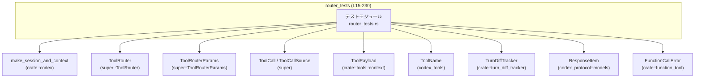
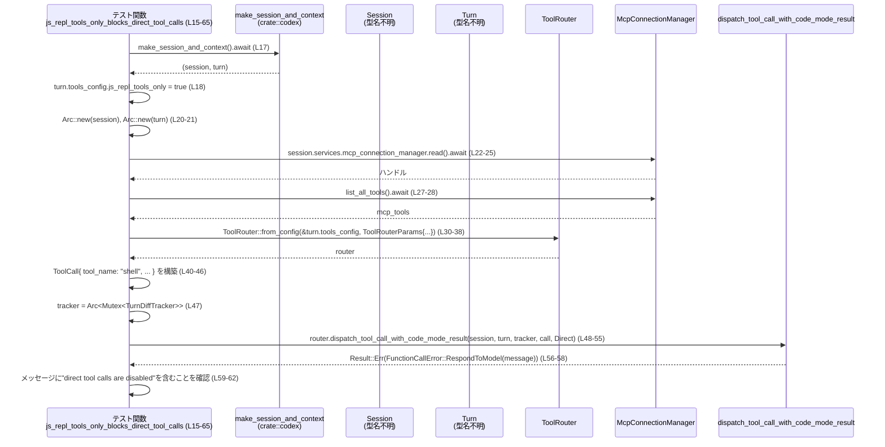

# core\src\tools\router_tests.rs コード解説

## 0. ざっくり一言

- `ToolRouter` 周りの**ツール呼び出しポリシー**と**名前空間付きツール名の扱い**を検証する非同期テスト群です（`tokio::test` を使用, L15, 67, 120, 166, 198）。
- 「js_repl 専用モード」「並列実行サポート判定」「`ResponseItem::FunctionCall` からの `ToolCall` 生成」の振る舞いを確認しています。

---

## 1. このモジュールの役割

### 1.1 概要

- このモジュールは、`ToolRouter` が
  - `js_repl_tools_only` 設定に従って**直接ツール呼び出しをブロックするか**（L16–65, L68–118, L121–164）、
  - ローカルツールの**並列実行サポート判定**が名前空間付きツール名に誤適用されないか（L166–196）、
  - モデルからの `FunctionCall` 応答を**名前空間付き `ToolName` に変換**できているか（L198–230）
- を確認するためのテストを提供します。

### 1.2 アーキテクチャ内での位置づけ

このテストモジュールから見た主な依存関係を簡略化して示します。



- すべてのテストは `make_session_and_context` で **セッションとターンコンテキスト**を準備します（L17, 69, 122, 168, 200）。
- その上に `ToolRouter::from_config` / `ToolRouter::build_tool_call` を構築し（L30–38, 82–90, 127–135, 176–184, 204–213）、`ToolCall` と `ToolCallSource` を使ってルーティングの振る舞いを検証します。

### 1.3 設計上のポイント

コードから読み取れる設計上の特徴は以下の通りです。

- **非同期 + Tokio テスト**
  - すべてのテストは `#[tokio::test]` でマークされた `async fn` になっています（L15, 67, 120, 166, 198）。
- **共有状態の安全な扱い**
  - `session` や `turn` は `Arc` で共有（L20–21, 72–73, 125–126, 201）し、
  - `TurnDiffTracker` は `tokio::sync::Mutex` で保護されています（L47, 99, 146）。
  - これにより非同期コンテキストでの安全な共有が担保されます。
- **ポリシー検証に特化したテスト**
  - 期待されるエラー種別 `FunctionCallError::RespondToModel` を明示的にパターンマッチ（L59–61, 158–160）。
  - エラーメッセージの部分文字列 `"direct tool calls are disabled"` の有無でポリシーの適用・非適用を判定しています（L62, 112–115, 161）。
- **名前空間付きツール名の扱い**
  - `ToolName::plain` / `ToolName::namespaced` を使い分けてテスト（L41, 93, 138, 186, 192, 219）。
  - `build_tool_call` が `ResponseItem::FunctionCall` の `namespace` を `ToolName` に反映することを確認しています（L204–220）。

---

## 2. 主要な機能一覧

このモジュール（テスト）が検証している主な機能は次の通りです。

- js_repl 専用モード: `js_repl_tools_only` 設定時に**直接ツール呼び出しをブロック**する（L16–65）。
- js_repl 専用モードの例外: `ToolCallSource::JsRepl` からの呼び出しが**ポリシーゲートをバイパス**できること（L68–118）。
- 名前空間付き js_repl ツールのブロック: `mcp__server__::js_repl` のような**名前空間付き js_repl ツールも直接呼び出しがブロックされる**こと（L121–164）。
- 並列実行サポート判定: `tool_supports_parallel` が**ローカルツール名のみにマッチし、名前空間付きツール名では false になる**こと（L166–196）。
- FunctionCall から ToolCall への変換: `ToolRouter::build_tool_call` が `ResponseItem::FunctionCall` の `namespace` と `name` から**名前空間付き `ToolName` を生成**すること（L198–230）。

---

## 3. 公開 API と詳細解説

このファイル自身は公開 API を定義していませんが、テストの理解に重要な型・関数を整理します。

### 3.1 型一覧（構造体・列挙体など）

| 名前 | 種別 | 役割 / 用途 | 定義/使用行（根拠） |
|------|------|-------------|----------------------|
| `ToolRouter` | 構造体（と考えられる） | ツール呼び出しのルーティングとポリシー適用を行う。本ファイルでは `from_config`, `dispatch_tool_call_with_code_mode_result`, `tool_supports_parallel`, `build_tool_call` が使用される。 | 使用: `core/src/tools/router_tests.rs:L30-38,82-90,127-135,176-184,204-215` |
| `ToolRouterParams` | 構造体 | `ToolRouter::from_config` に渡す設定まとめ。MCP ツール一覧や動的ツール群などを含む。 | 使用: L32–37, 84–89, 129–134, 178–183 |
| `ToolCall` | 構造体 | 実際に実行されるツール呼び出しを表現。`tool_name`, `call_id`, `payload` フィールドを持つ（L40–46, 92–98, 137–145）。 | 使用: L40–46, 92–98, 137–145 |
| `ToolCallSource` | 列挙体に相当する型 | ツール呼び出しの発生源を表す。`Direct` と `JsRepl` などのバリアントがあることが使用コードから分かる。 | 使用: L54, 106, 153 |
| `ToolPayload` | 列挙体 | ツール呼び出しペイロード。`Function { arguments: String }` と `Mcp { server, tool, raw_arguments }` などのバリアントを持つ。 | 使用: L5, 43–45, 140–144, 222–225 |
| `ToolName` | 構造体 | ツールの識別名。`plain(name)` と `namespaced(namespace, name)` の二つのコンストラクタ的関数がある。 | 使用: L8, 41, 93, 138, 186–193, 219–220 |
| `TurnDiffTracker` | 構造体 | 会話ターンの差分を追跡するためのトラッカー。ここでは `Arc<Mutex<…>>` で包まれ、`dispatch_tool_call_with_code_mode_result` に渡される。 | 使用: L6, 47, 99, 146 |
| `ResponseItem` | 列挙体 | モデルからのレスポンス要素。ここでは `ResponseItem::FunctionCall` バリアントを使用し、`build_tool_call` の入力とする。 | 使用: L7, 206–212 |
| `FunctionCallError` | 列挙体 | ツール呼び出し時のエラー型。`RespondToModel(String)` バリアントを持ち、モデルに返すべきメッセージを含む。 | 使用: L4, 59–61, 158–160 |

> **注意**: `ToolRouter` や `ToolCallSource` などの正確な定義（構造体か列挙体かなど）は、このチャンクには現れていません。上記の種別は、メソッド呼び出しやバリアント風の使用法からの推測であり、厳密な型定義は元モジュールを参照する必要があります。

### 3.2 関数詳細（テスト 5 件）

このファイルに定義されている関数はすべてテスト関数です。

---

#### `js_repl_tools_only_blocks_direct_tool_calls() -> anyhow::Result<()>`（L15–65）

**概要**

- `turn.tools_config.js_repl_tools_only = true` のとき、`ToolCallSource::Direct` からの `"shell"` ツール呼び出しが**ポリシーによってブロックされる**ことを検証するテストです（L16–18, 40–46, 48–62）。

**引数**

- 引数なし。

**戻り値**

- `anyhow::Result<()>`（L16）
  - テストが成功すれば `Ok(())` を返します。
  - 途中で `?` によるエラー伝播があれば `Err` となり、テスト失敗扱いとなります。

**内部処理の流れ（アルゴリズム）**

1. `make_session_and_context().await` でセッションとターンを取得（L17）。
2. 取得した `turn` の `tools_config.js_repl_tools_only` を `true` に設定（L18）。
3. `session` と `turn` を `Arc` に包んで共有可能にする（L20–21）。
4. `session.services.mcp_connection_manager.read().await.list_all_tools().await` で MCP ツール一覧を取得し（L22–28）、`deferred_mcp_tools` にクローンを格納（L29）。
5. `ToolRouter::from_config` に `ToolRouterParams` を渡して `router` を構築（L30–38）。
6. `"shell"` を対象とする `ToolCall`（`ToolPayload::Function`）を作成（L40–46）。
7. `TurnDiffTracker::new()` を `Arc<Mutex<_>>` で包んだ `tracker` を生成（L47）。
8. `router.dispatch_tool_call_with_code_mode_result` に `session`, `turn`, `tracker`, `call`, `ToolCallSource::Direct` を渡して実行し、結果の `Err` を取り出す（L48–58）。
9. エラーが `FunctionCallError::RespondToModel(message)` であることを確認し（L59–61）、`message` に `"direct tool calls are disabled"` が含まれることを `assert!` で検証（L62）。

**Examples（使用例）**

この関数自体はテスト用ですが、`js_repl_tools_only` ポリシーの挙動を確認するコード例として参考になります。

```rust
// セッションとターンを初期化
let (session, mut turn) = make_session_and_context().await;
turn.tools_config.js_repl_tools_only = true; // js_repl 専用モードを有効化

let session = Arc::new(session);
let turn = Arc::new(turn);

// MCP ツール一覧を取得
let mcp_tools = session
    .services
    .mcp_connection_manager
    .read()
    .await
    .list_all_tools()
    .await;

// ルーターを構築
let router = ToolRouter::from_config(
    &turn.tools_config,
    ToolRouterParams {
        deferred_mcp_tools: Some(mcp_tools.clone()),
        mcp_tools: Some(mcp_tools),
        discoverable_tools: None,
        dynamic_tools: turn.dynamic_tools.as_slice(),
    },
);

// 直接呼び出しされる shell ツール
let call = ToolCall {
    tool_name: ToolName::plain("shell"),
    call_id: "example-call".to_string(),
    payload: ToolPayload::Function {
        arguments: "{}".to_string(),
    },
};

let tracker = Arc::new(tokio::sync::Mutex::new(TurnDiffTracker::new()));

// Direct ソースからの呼び出しがブロックされることを確認
let err = router
    .dispatch_tool_call_with_code_mode_result(
        session,
        turn,
        tracker,
        call,
        ToolCallSource::Direct,
    )
    .await
    .err()
    .expect("direct tool calls should be blocked");
```

**Errors / Panics**

- `dispatch_tool_call_with_code_mode_result` が `Ok` を返した場合
  - `.err()` が `None` を返し、続く `.expect("direct tool calls should be blocked")` が panic します（L57–58）。
- 返ってきたエラーが `FunctionCallError::RespondToModel` 以外だった場合
  - `let FunctionCallError::RespondToModel(message) = err else { panic!(...) }` の `panic!` が発生します（L59–61）。
- `message` に `"direct tool calls are disabled"` が含まれない場合
  - `assert!(...)` が失敗して panic します（L62）。

**Edge cases（エッジケース）**

- MCP ツール一覧に `"shell"` ツールが存在しない場合
  - ルーター内部でどのような挙動になるかは不明ですが、本テストはそれを前提としているため、環境変更により挙動が変わる可能性があります（コードからは未判明）。
- `make_session_and_context` 自体がエラーを返した場合
  - `?` がないので、この関数では直接扱っていませんが、`tokio::test` 内で panic になる形で伝播すると考えられます（ただし詳細はこのチャンクにはありません）。

**使用上の注意点**

- テストは `"shell"` ツールの存在と `js_repl_tools_only` ポリシーの意味を前提としており、環境や設定を変えるとテストが意図せず失敗する可能性があります。
- `ToolCallSource::Direct` と `ToolCallSource::JsRepl` の違いがポリシーに直結しているため、呼び出し元で正しいソース種別を指定することが重要です（L54）。

---

#### `js_repl_tools_only_allows_js_repl_source_calls() -> anyhow::Result<()>`（L67–118）

**概要**

- `js_repl_tools_only = true` の状態でも、`ToolCallSource::JsRepl` からの `"shell"` 呼び出しは**「direct tool calls are disabled」エラーではブロックされない**ことを確認するテストです（L68–71, 92–98, 100–115）。

**戻り値**

- `anyhow::Result<()>`（L68）。

**内部処理の流れ**

1. `make_session_and_context` と `js_repl_tools_only` の設定、`ToolRouter` の構築までの流れは前のテストと同様です（L69–90）。
2. `"shell"` ツール向けの `ToolCall` を作成（L92–98）。
3. `ToolCallSource::JsRepl` を指定して `dispatch_tool_call_with_code_mode_result` を呼び出す（L100–107）。
4. 結果の `Err` を取得し（L108–110）、エラー文字列全体を `to_string()` で取得（L111）。
5. その文字列に `"direct tool calls are disabled"` が**含まれていない**ことを `assert!` で確認（L112–115）。

**Errors / Panics**

- `dispatch_tool_call_with_code_mode_result` が `Ok` を返した場合
  - `.err().expect("shell call with empty args should fail")` により panic（L108–110）。
- エラーメッセージに `"direct tool calls are disabled"` が含まれていた場合
  - `assert!(!message.contains(...))` が失敗し panic（L112–115）。

**Edge cases**

- ここでは `"shell call with empty args should fail"` として、**引数 `{}` によるエラー自体は許容（むしろ期待）**しており、ポリシーエラーだけを除外しています（L110）。
- `ToolCallSource::JsRepl` 以外のソース種別はこのテストでは扱っていません。

**使用上の注意点**

- `js_repl_tools_only` は「js_repl 以外のソースからのツール呼び出し」を制限するポリシーであり、**ソース種別による条件分岐**を明確に行う必要があることが示唆されます。
- js_repl 経由のツール利用フローを設計する際には、このようなポリシーの例外扱いを意識する必要があります。

---

#### `js_repl_tools_only_blocks_namespaced_js_repl_tool() -> anyhow::Result<()>`（L120–164）

**概要**

- `ToolName::namespaced("mcp__server__", "js_repl")` のような**名前空間付き js_repl ツール**に対しても、`ToolCallSource::Direct` からの呼び出しは `js_repl_tools_only` ポリシーによりブロックされることを確認するテストです（L121–124, 127–135, 137–145, 147–162）。

**内部処理の流れ**

1. `js_repl_tools_only` を `true` に設定（L122–123）。
2. `ToolRouter::from_config` を呼ぶ際、MCP ツール関連の引数はすべて `None` にしてシンプルな構成としています（L127–135）。
3. `ToolName::namespaced("mcp__server__", "js_repl")` で名前空間付きツール名を持つ `ToolCall` を構築（L137–145）。
4. `ToolCallSource::Direct` を指定して `dispatch_tool_call_with_code_mode_result` を実行し、`Err` を取得（L147–157）。
5. そのエラーが `FunctionCallError::RespondToModel(message)` であることを確認し（L158–160）、`message` に `"direct tool calls are disabled"` が含まれることを `assert!` で検証（L161）。

**Errors / Panics**

- ツール呼び出しが `Ok` の場合、`.err().expect("namespaced js_repl calls should be blocked")` が panic（L156–157）。
- エラーが `RespondToModel` でない場合、`panic!("expected RespondToModel, got {err:?}")`（L158–160）。
- メッセージに `"direct tool calls are disabled"` が含まれない場合、`assert!` が失敗（L161）。

**Edge cases**

- 名前空間付きの js_repl ツールが「js_repl 以外のもの」として扱われていないこと、つまり**名前空間付きであっても js_repl 的な機能はポリシーの対象**であることを確認しています。
- MCP ツールの設定を全て `None` にしているため（L130–133）、このケースではルーターが**ローカルな js_repl ツール**かポリシーレイヤーで処理していることが示唆されますが、詳細は本チャンクからは分かりません。

**使用上の注意点**

- js_repl に関連するツールを MCP 経由などで名前空間付きで登録する場合でも、`js_repl_tools_only` ポリシーで一律に扱われる可能性があります。
- js_repl 相当の機能を別名として追加する場合には、このようなテストを追加して**意図したポリシー境界**を保証することが有用です。

---

#### `parallel_support_does_not_match_namespaced_local_tool_names() -> anyhow::Result<()>`（L166–196）

**概要**

- `tool_supports_parallel` が `"shell"`, `"local_shell"`, `"exec_command"`, `"shell_command"` などの**ローカルツール名**にはマッチするが、
  それらの**名前空間付きツール名**（`ToolName::namespaced("mcp__server__", name)`）にはマッチしない（= false を返す）ことを検証するテストです（L166–193）。

**内部処理の流れ**

1. `make_session_and_context` で `(session, turn)` を取得（L168）。
2. MCP ツール一覧を取得（L169–175）。
3. `ToolRouter::from_config` を構築（L176–184）。
4. 配列 `["shell", "local_shell", "exec_command", "shell_command"]` をイテレートし（L186–188）、
   `router.tool_supports_parallel(&ToolName::plain(*name))` が `true` になる最初の名前を `parallel_tool_name` として取得（L188–189）。
   - いずれも `true` にならない場合は `expect("test session should expose a parallel shell-like tool")` が panic します（L189）。
5. その `parallel_tool_name` を `ToolName::namespaced("mcp__server__", parallel_tool_name)` に変換し（L191–193）、
   これに対する `tool_supports_parallel` が **`false` であること**を `assert!` で検証（L191–193）。

**Errors / Panics**

- ローカルに並列サポートされる `"shell"` 系ツールが一つも存在しない場合
  - `expect("test session should expose a parallel shell-like tool")` が panic（L188–189）。
- `tool_supports_parallel` が名前空間付きツール名に対しても `true` を返した場合
  - `assert!(!router.tool_supports_parallel(...))` が失敗し panic（L191–193）。

**Edge cases**

- MCP の名前空間 `"mcp__server__"` は固定文字列として使われています（L191–193）。
  - 実際の MCP サーバ名は `"server"` として別途使われている例もあり（L141）、名前空間とサーバ識別子の関係はこのチャンクからは不明です。
- `tool_supports_parallel` の判定ロジックは見えませんが、
  - 少なくとも「**名前空間付きツールはローカル並列実行サポートの対象外**」という契約がここで固められています。

**使用上の注意点**

- ツールの並列実行可否を判定する際は、**必ず「レジストリ上の名前」（plain な名前）で判定する**必要があります。
- MCP サービスなど、名前空間付きで表現されるツールに対して同じ判定関数を使うと、意図しない結果（常に false）となることがこのテストから分かります。

---

#### `build_tool_call_uses_namespace_for_registry_name() -> anyhow::Result<()>`（L198–230）

**概要**

- モデルからの `ResponseItem::FunctionCall` 応答に `namespace` が指定されている場合、
  `ToolRouter::build_tool_call` がその `namespace` と `name` を組み合わせて
  `ToolName::namespaced(namespace, name)` を生成することを検証するテストです（L198–220）。

**内部処理の流れ**

1. `make_session_and_context` で `(session, _)` を取得し、`session` を `Arc` に包む（L200–201）。
2. `tool_name` として `"create_event".to_string()` を用意（L202）。
3. `ResponseItem::FunctionCall` を構築し、`namespace: Some("mcp__codex_apps__calendar".to_string())` と `name: tool_name.clone()` を設定（L204–212）。
4. `ToolRouter::build_tool_call(&session, response_item)` を `await` し、`?` で `Result` をアンラップしたうえで（L214）、
   `Option` を `expect("function_call should produce a tool call")` でアンラップし `ToolCall` を取得（L215）。
5. 生成された `call.tool_name` が `ToolName::namespaced("mcp__codex_apps__calendar", tool_name)` と等しいことを `assert_eq!` で確認（L217–220）。
6. `call.call_id` が `"call-namespace"` と等しいことを検証（L221）。
7. `call.payload` が `ToolPayload::Function { arguments }` バリアントであり、`arguments == "{}"` であることをマッチングと `assert_eq!` で確認（L222–225）。

**Errors / Panics**

- `build_tool_call` が `Err` を返した場合
  - `?` によりテスト関数自体が `Err` を返し、テスト失敗となります（L214）。
- `build_tool_call` が `Ok(None)` を返した場合
  - `.expect("function_call should produce a tool call")` が panic（L215）。
- `tool_name` / `call_id` / `payload` が期待値と異なる場合
  - 各 `assert_eq!` が失敗し panic（L217–221, 223–225）。

**Edge cases**

- `ResponseItem::FunctionCall` の `namespace` が `None` の場合の挙動は、このテストからは分かりません。
- `arguments` の JSON 構造は `"{}"` 固定であり、パースや検証ロジックはこのチャンクには現れていません。

**使用上の注意点**

- モデルからの関数呼び出し応答をルーターに渡す場合は、**`namespace` と `name` の組み合わせがツールレジストリ上の完全な名前空間付きツール名になる**、という前提で設計されています。
- 呼び出し側で `namespace` を誤って設定すると、意図しない `ToolName` が生成されるため、ツール解決に失敗する可能性があります。

---

### 3.3 その他の関数

このファイルには、補助的なローカル関数やラッパー関数は定義されていません。  
代わりに、外部 API として以下のメソッド呼び出しが行われています（定義は他モジュール）。

| 関数名 / メソッド | 役割（1 行） | 使用行（根拠） |
|------------------|--------------|----------------|
| `make_session_and_context()` | テスト用のセッションとターンコンテキストを生成する非同期関数。 | L17, 69, 122, 168, 200 |
| `ToolRouter::from_config(...)` | `ToolRouter` をツール設定・MCP 情報から構築する。 | L30–38, 82–90, 127–135, 176–184 |
| `ToolRouter::dispatch_tool_call_with_code_mode_result(...)` | ツール呼び出しを実行し、コードモード向けの結果／エラーを返す。 | L48–56, 100–107, 147–155 |
| `ToolRouter::tool_supports_parallel(&ToolName)` | 指定ツールが並列実行をサポートするかを判定する。 | L188–189, 191–193 |
| `ToolRouter::build_tool_call(&Session, ResponseItem)` | モデルの関数呼び出し応答から `ToolCall` を生成する。 | L204–215 |

---

## 4. データフロー

ここでは、`js_repl_tools_only_blocks_direct_tool_calls` における代表的なデータフローを示します。

### 4.1 処理の要点

- `make_session_and_context` で作成した `session` と `turn` をもとに `ToolRouter` を構築し（L17–38）、
- `"shell"` ツールへの直接呼び出し (`ToolCallSource::Direct`) を `dispatch_tool_call_with_code_mode_result` に渡します（L40–55）。
- ルーターは `FunctionCallError::RespondToModel` を返し、そのメッセージにより「直接ツール呼び出しが無効化されている」ことをテスト側で確認します（L59–62）。

### 4.2 シーケンス図



> **補足**: `Session` / `Turn` / `McpConnectionManager` の実体はこのチャンクには現れていませんが、メソッド呼び出しから役割を推測しています。

---

## 5. 使い方（How to Use）

このファイルはテストですが、`ToolRouter` と関連型の典型的な使い方のサンプルとしても利用できます。

### 5.1 基本的な使用方法

`ToolRouter` を使ってツール呼び出しを実行し、その結果（またはポリシーによるエラー）を得る基本フローは以下のようになります。

```rust
use std::sync::Arc;
use crate::codex::make_session_and_context;
use crate::tools::context::ToolPayload;
use crate::turn_diff_tracker::TurnDiffTracker;
use codex_tools::ToolName;
use super::{ToolRouter, ToolRouterParams, ToolCall, ToolCallSource};

async fn example_basic_use() -> anyhow::Result<()> {
    // 1. セッションとターンを初期化 (L17, L69 などと同様)
    let (session, mut turn) = make_session_and_context().await;

    // ポリシー設定 (必要に応じて)
    turn.tools_config.js_repl_tools_only = true;

    let session = Arc::new(session);
    let turn = Arc::new(turn);

    // 2. MCP ツール一覧などを取得して Router を構築 (L22-38)
    let mcp_tools = session
        .services
        .mcp_connection_manager
        .read()
        .await
        .list_all_tools()
        .await;

    let router = ToolRouter::from_config(
        &turn.tools_config,
        ToolRouterParams {
            deferred_mcp_tools: Some(mcp_tools.clone()),
            mcp_tools: Some(mcp_tools),
            discoverable_tools: None,
            dynamic_tools: turn.dynamic_tools.as_slice(),
        },
    );

    // 3. 呼び出したいツールを ToolCall として構築 (L40-46, L92-98)
    let call = ToolCall {
        tool_name: ToolName::plain("shell"),
        call_id: "example-call".to_string(),
        payload: ToolPayload::Function {
            arguments: r#"{"cmd":"echo hello"}"#.to_string(),
        },
    };

    // 4. トラッカーを用意 (L47, L99, L146)
    let tracker = Arc::new(tokio::sync::Mutex::new(TurnDiffTracker::new()));

    // 5. Router 経由でツール呼び出しを実行
    let result = router
        .dispatch_tool_call_with_code_mode_result(
            session.clone(),
            turn.clone(),
            tracker.clone(),
            call,
            ToolCallSource::JsRepl, // js_repl からの呼び出しとみなす (L106)
        )
        .await;

    // 結果の扱いは呼び出し側で行う
    match result {
        Ok(output) => {
            // 正常にツールが実行された場合の処理 (型はこのチャンクには現れません)
            println!("tool output: {:?}", output);
        }
        Err(e) => {
            // ポリシー違反や実行エラーなど
            eprintln!("tool call failed: {e}");
        }
    }

    Ok(())
}
```

### 5.2 よくある使用パターン

1. **js_repl 専用モードの適用／回避**

   - 直接ツール呼び出しをブロックしたい場合: `js_repl_tools_only = true` かつ `ToolCallSource::Direct` を指定（L16–18, 54）。
   - js_repl 経由での実行を許可したい場合: 同じ設定でも `ToolCallSource::JsRepl` を指定（L106）。

2. **名前空間付きツール名の利用**

   - MCP サーバ経由のツールなどは `ToolName::namespaced(namespace, tool_name)` で表現（L138, 191, 219）。
   - モデルからの `ResponseItem::FunctionCall` をそのまま使う場合は、`ToolRouter::build_tool_call` を通して `ToolCall` に変換（L204–215）。

3. **並列実行サポートの確認**

   - ローカルツール名（`ToolName::plain("shell")` など）を対象に `tool_supports_parallel` を呼ぶ（L186–189）。
   - 名前空間付きツール名は常に false と期待されているため（L191–193）、並列実行の制御対象にはしない前提で設計されていると解釈できます。

### 5.3 よくある間違い

```rust
// 間違い例: js_repl 専用モードなのに Direct ソースで呼び出す
turn.tools_config.js_repl_tools_only = true;
// ...
let result = router
    .dispatch_tool_call_with_code_mode_result(
        session,
        turn,
        tracker,
        call,
        ToolCallSource::Direct, // ← これだと "direct tool calls are disabled" エラーになる (L54, L62)
    )
    .await;

// 正しい例: js_repl 専用モード下で js_repl 経由として呼び出す
let result = router
    .dispatch_tool_call_with_code_mode_result(
        session,
        turn,
        tracker,
        call,
        ToolCallSource::JsRepl, // ← L106 で検証しているようにポリシーをバイパスできる
    )
    .await;
```

```rust
// 間違い例: 名前空間付きツール名で並列サポートを期待する
let tool_name = ToolName::namespaced("mcp__server__", "shell");
assert!(router.tool_supports_parallel(&tool_name)); // ← テストでは false であることが期待されている (L191-193)

// 正しい例: plain なローカルツール名で判定し、必要なら別途扱いを決める
let tool_name = ToolName::plain("shell");
if router.tool_supports_parallel(&tool_name) {
    // 並列実行ロジック
}
```

### 5.4 使用上の注意点（まとめ）

- **ソース種別 (`ToolCallSource`) の指定がポリシーに直結**します。
  - `Direct` / `JsRepl` でポリシーの適用有無が変わることがテストから分かります（L54, 106, 153）。
- **名前空間付きツール名はローカルツールとは異なる扱い**になります。
  - js_repl のような特別なツールは、名前空間付きでもポリシーの対象となりうる（L137–145, 161）。
  - 並列サポート判定は plain 名のみに適用される（L186–193）。
- **非同期共有状態は `Arc` と `tokio::sync::Mutex` で保護**されています（L20–21, 47, 72–73, 99, 125–126, 146, 201）。
  - 実運用コードでも同様に、`ToolRouter` に渡す共有リソースはスレッド／タスク安全なラッパーを使う前提と考えられます。

---

## 6. 変更の仕方（How to Modify）

### 6.1 新しい機能を追加する場合（テスト追加の観点）

- **新しいポリシーや `ToolCallSource` バリアントを追加**する場合:
  1. 既存テストのパターン（`js_repl_tools_only_*` など）を参考に、`make_session_and_context` からのセットアップを流用する（L17–21, 69–73, 122–126, 168–170, 200–201）。
  2. 新ポリシー用の設定フィールドを `turn.tools_config` に追加した場合は、テスト内で値を設定してから `ToolRouter::from_config` を呼ぶ（L30–38 等）。
  3. 期待されるエラー型やメッセージがある場合は、`FunctionCallError` へのパターンマッチや `assert!` を使って検証する（L59–62, 158–161）。

- **新しい名前空間付きツールの扱いを追加**する場合:
  1. `ToolName::namespaced` を用いた `ToolCall` を構築するテストを追加（L137–145, 219–220 参照）。
  2. ルーターの内部処理に応じて、ポリシー適用の有無や `tool_supports_parallel` の結果を `assert!` で検証する。

### 6.2 既存の機能を変更する場合（影響範囲の確認）

- **`js_repl_tools_only` の意味を変更**する場合:
  - 次のテストが影響を受けるため、期待値を再検討する必要があります。
    - `js_repl_tools_only_blocks_direct_tool_calls`（L15–65）
    - `js_repl_tools_only_allows_js_repl_source_calls`（L67–118）
    - `js_repl_tools_only_blocks_namespaced_js_repl_tool`（L120–164）
  - 特に、どの `ToolCallSource` がポリシーの対象になるか、名前空間付き js_repl ツールをどう扱うかの契約が変わります。

- **`tool_supports_parallel` の仕様変更**:
  - `parallel_support_does_not_match_namespaced_local_tool_names`（L166–196）が前提にしている「名前空間付きは false」という契約が崩れる可能性があります。
  - 並列処理の実装側も合わせて見直す必要があります（このチャンクには実装はありませんが、利用側は要確認です）。

- **`build_tool_call` の仕様変更**:
  - `build_tool_call_uses_namespace_for_registry_name`（L198–230）が `namespace` と `name` のマッピングを固定値として検証しています。
  - `ResponseItem::FunctionCall` のスキーマや `ToolName` への変換仕様を変更する場合は、このテストと一緒に更新する必要があります。

---

## 7. 関連ファイル

このモジュールと密接に関係するファイル・モジュール（名前のみ判明しているもの）を整理します。

| パス / モジュール | 役割 / 関係 |
|-------------------|------------|
| `super::ToolRouter` | 本テストの対象となるツールルーティング本体。`from_config`, `dispatch_tool_call_with_code_mode_result`, `tool_supports_parallel`, `build_tool_call` などを提供（L30–38, 48–56, 176–184, 188–193, 204–215）。ファイル名はこのチャンクには現れていません。 |
| `super::ToolCall` | ルーターに渡すツール呼び出しのデータ構造（L40–46, 92–98, 137–145）。 |
| `super::ToolCallSource` | ツール呼び出し元（Direct / JsRepl など）を表す型（L54, 106, 153）。 |
| `super::ToolRouterParams` | `ToolRouter::from_config` に渡す設定パラメータ構造体（L32–37, 84–89, 129–134, 178–183）。 |
| `crate::codex::make_session_and_context` | テスト用のセッションとターンコンテキストを初期化する非同期関数（L3, 17, 69, 122, 168, 200）。 |
| `crate::tools::context::ToolPayload` | ツール呼び出し時に渡すペイロードの列挙体。Function/Mcp バリアントが使用されている（L5, 43–45, 140–144, 222–225）。 |
| `crate::turn_diff_tracker::TurnDiffTracker` | 会話ターンの差分追跡ロジック。ツール呼び出しの副作用を追跡するために使用されると推測される（L6, 47, 99, 146）。 |
| `crate::function_tool::FunctionCallError` | ツール呼び出し時のエラー型。`RespondToModel` バリアントを通じてモデル向けエラーメッセージを運ぶ（L4, 59–61, 158–160）。 |
| `codex_protocol::models::ResponseItem` | モデルからのレスポンス表現。ここでは `FunctionCall` バリアントを通じて `build_tool_call` の入力となる（L7, 206–212）。 |
| `codex_tools::ToolName` | ツールの名前（plain / namespaced）を表現（L8, 41, 93, 138, 186, 191–193, 219–220）。 |

> これらの関連モジュールの具体的な実装内容は、このチャンクには含まれていません。  
> 本レポートは、テストコードから読み取れる範囲での振る舞いと契約を整理したものになります。
