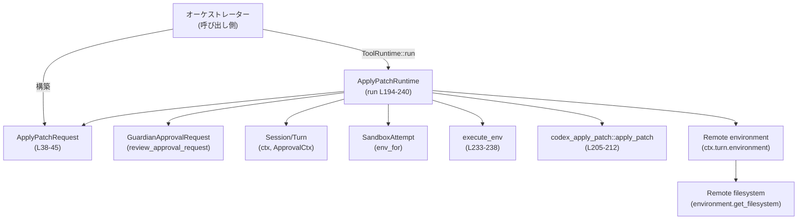
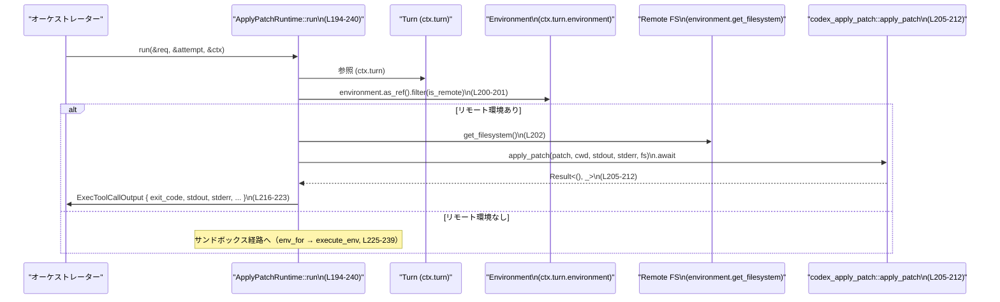

# core/src/tools/runtimes/apply_patch.rs コード解説

## 0. ざっくり一言

`ApplyPatchRuntime` は、上流で安全性レビュー済みのパッチ (`ApplyPatchAction`) を、  

- リモート環境ではリモートファイルシステム経由で直接適用し  
- ローカル環境では `codex` 自身をサンドボックス内で再実行して適用する  

ための実行ランタイムです（`apply_patch.rs:L1-7, L193-240`）。

---

## 1. このモジュールの役割

### 1.1 概要

- このモジュールは **パッチ適用ツールの実行制御** を行い、  
  - パッチ内容・対象ファイル・権限などをまとめた `ApplyPatchRequest`（`L38-45`）を受け取り  
  - 実行前の承認フロー（Guardian / ユーザー承認 / キャッシュ）を管理し（`L119-191`）  
  - 実際のパッチ適用処理を、リモート環境またはサンドボックス経由で実行します（`L193-240`）。

### 1.2 アーキテクチャ内での位置づけ

このファイルに現れる主な依存関係を図示します（概念レベル）。



- 承認フローは `Approvable` 実装（`start_approval_async` 他、`L119-191`）を通じて `Session`/`Turn` に委譲されます。
- 実行フローは `ToolRuntime` 実装（`run`, `L193-240`）から  
  - リモート環境では `codex_apply_patch::apply_patch`（`L205-212`）へ  
  - ローカル環境では `SandboxAttempt::env_for` → `execute_env`（`L233-238`）へ  
  分岐します。

### 1.3 設計上のポイント（コードから読み取れる範囲）

- **ステートレスなランタイム**
  - `ApplyPatchRuntime` 自体はフィールドを持たない空の構造体です（`L48`）。  
    実行ごとの状態は `ApplyPatchRequest` と `ToolCtx` / `SandboxAttempt` に保持されます。
- **承認の責務分離**
  - パッチ内容の承認は上流（`assess_patch_safety`）で行われる前提であり、その結果を引き継ぎます（コメント `L182-185`）。
  - ただし `Approvable` 実装を通じて、Guardian・ユーザー・キャッシュを使った承認フローを再構成しています（`L124-171`）。
- **リモート / ローカル環境の分岐**
  - `ctx.turn.environment` が `is_remote()` を満たす場合は、サンドボックス経由ではなくリモート FS 経由の直接適用を行います（`L200-212`）。
  - それ以外の場合は、`SandboxCommand` を構築しサンドボックス環境で `codex` プロセスとして再実行します（`L225-239`）。
- **ミニマルな環境変数での実行**
  - サンドボックス実行時の環境変数は空の `HashMap` に固定されており（`env: HashMap::new(), L99-101`）、決定性と情報漏えい防止を意図していることがコメントされています（`L98-99`）。
- **エラーとタイムアウト**
  - リモート実行では `codex_apply_patch::apply_patch` の `Result` から exit code を 0/1 にマッピング（`L215`）。
  - サンドボックス実行では `ExecOptions::expiration` に `req.timeout_ms` をそのまま渡し（`L229-231`）、実際のタイムアウトは `execute_env` 側に委譲されています。
- **非同期処理**
  - 承認フロー (`start_approval_async`) と実行フロー (`run`) はいずれも `async` で、`BoxFuture` や `.await` を用いた非同期 I/O ベースの設計になっています（`L124-171, L193-240`）。

---

## 2. 主要な機能一覧（コンポーネントインベントリー付き）

### 2.1 コンポーネント一覧（構造体・トレイト実装）

| 名前 | 種別 | 公開 | 位置 | 役割（要約） |
|------|------|------|------|-------------|
| `ApplyPatchRequest` | 構造体 | `pub` | `apply_patch.rs:L38-45` | パッチ適用実行に必要な情報（アクション、対象ファイル、変更内容、権限要件、タイムアウトなど）をまとめたリクエスト。 |
| `ApplyPatchRuntime` | 構造体 | `pub` | `apply_patch.rs:L48-48` | パッチ適用の承認・実行フローを実装するランタイム本体（ステートレス）。 |
| `impl Sandboxable for ApplyPatchRuntime` | トレイト実装 | - | `L111-118` | サンドボックス実行に関する基本ポリシー（自動選択・失敗時エスカレーション）を定義。 |
| `impl Approvable<ApplyPatchRequest> for ApplyPatchRuntime` | トレイト実装 | - | `L119-191` | パッチ適用の承認キー、承認開始処理、サンドボックス承認ポリシー、実行承認要件を定義。 |
| `impl ToolRuntime<ApplyPatchRequest, ExecToolCallOutput> for ApplyPatchRuntime` | トレイト実装 | - | `L193-240` | 実際のパッチ適用処理（リモート / ローカル）を実行するメインのランタイムロジック。 |
| `mod tests` | テストモジュール | `#[cfg(test)]` | `L242-244` | テストコードへのパス指定のみ。本チャンクには中身は含まれていません。 |

### 2.2 関数・メソッド一覧

（詳細は 3.2 / 3.3 で説明します）

| 名前 | 種別 | 公開 | 位置 | 役割（1 行） |
|------|------|------|------|--------------|
| `ApplyPatchRuntime::new` | 関数 | `pub` | `L50-52` | 空の `ApplyPatchRuntime` を生成するコンストラクタ。 |
| `build_guardian_review_request` | 関数 | private | `L53-63` | Guardian に渡すパッチレビューリクエストを組み立てる。 |
| `build_sandbox_command` (Windows) | 関数 | private | `L65-72` | Windows 向けに `codex.exe` を起動する `SandboxCommand` を構築する。 |
| `build_sandbox_command` (非 Windows) | 関数 | private | `L75-81` | 非 Windows 向けに `codex` 実行ファイルを解決し `SandboxCommand` を構築する。 |
| `resolve_apply_patch_program` | 関数 | private | `L83-89` | `codex_self_exe` が無ければ `current_exe()` から自分自身のパスを解決する。 |
| `build_sandbox_command_with_program` | 関数 | private | `L90-101` | プログラムパスから `SandboxCommand` を作成し、環境変数を空に設定する。 |
| `stdout_stream` | 関数 | private | `L103-109` | `StdoutStream` 構造体を初期化し、ストリーミング出力用のハンドルを組み立てる。 |
| `sandbox_preference` | メソッド | trait impl | `L112-114` | サンドボックス利用方針として `Auto` を返す。 |
| `escalate_on_failure` | メソッド | trait impl | `L115-117` | 失敗時にエスカレーションすべきであることを示す `true` を返す。 |
| `approval_keys` | メソッド | trait impl | `L121-123` | 承認キャッシュのキーとして対象ファイルパス一覧を返す。 |
| `start_approval_async` | メソッド | trait impl | `L124-171` | Guardian / ユーザー / キャッシュを使って非同期に承認フローを実行する。 |
| `wants_no_sandbox_approval` | メソッド | trait impl | `L173-180` | サンドボックス実行時に追加の承認を不要とするかどうかをポリシー別に判定する。 |
| `exec_approval_requirement` | メソッド | trait impl | `L186-191` | 呼び出し元から指定された `ExecApprovalRequirement` をそのまま返す。 |
| `run` | メソッド (async) | trait impl | `L194-240` | パッチ適用処理の本体。リモート環境かどうかを判定し実行経路を切り替える。 |

---

## 3. 公開 API と詳細解説

### 3.1 型一覧（構造体）

| 名前 | 種別 | フィールド | 役割 / 用途 | 根拠 |
|------|------|-----------|-------------|------|
| `ApplyPatchRequest` | 構造体 (`pub`) | `action: ApplyPatchAction`, `file_paths: Vec<AbsolutePathBuf>`, `changes: HashMap<PathBuf, FileChange>`, `exec_approval_requirement: ExecApprovalRequirement`, `additional_permissions: Option<PermissionProfile>`, `permissions_preapproved: bool`, `timeout_ms: Option<u64>` | パッチ適用に必要なすべての情報を集約するリクエスト。承認要件・権限・タイムアウトも含む。 | `apply_patch.rs:L38-45` |
| `ApplyPatchRuntime` | 構造体 (`pub`) | フィールドなし | パッチ適用の承認・実行ロジックを提供するステートレスなランタイム。 | `apply_patch.rs:L48` |

補足:

- `ApplyPatchAction` にはパッチ内容 `patch` とカレントディレクトリ `cwd` が含まれており、このファイルでは `req.action.patch` と `req.action.cwd` が利用されています（`L59-61, L94-97, L205-208`）。
- `changes` はパッチで変更されるファイルごとの `FileChange` のマップで、承認リクエストに渡されます（`L41, L134-135, L147-151`）。

---

### 3.2 重要な関数詳細（最大 7 件）

#### 1. `ApplyPatchRuntime::new() -> Self`（`apply_patch.rs:L50-52`）

**概要**

- 空の `ApplyPatchRuntime` インスタンスを生成します。フィールドを持たないため、単純なコンストラクタです。

**引数**

なし。

**戻り値**

- `ApplyPatchRuntime` の新しいインスタンス。

**内部処理の流れ**

- `Self` をそのまま返すだけです（`L51-52`）。

**Examples（使用例）**

```rust
// ランタイムの生成
let mut runtime = ApplyPatchRuntime::new(); // apply_patch.rs:L50-52
```

**Edge cases / 使用上の注意点**

- ステートレスなため、インスタンスを複数作っても挙動は変わりません。
- 非同期メソッド `run` を呼ぶ際には `&mut self` を取るため、同一インスタンスを複数タスクで同時に使う場合は通常の Rust の可変参照ルールに従う必要があります。

---

#### 2. `start_approval_async<'a>(...) -> BoxFuture<'a, ReviewDecision>`（`apply_patch.rs:L124-171`）

**概要**

- パッチ適用を実行する前に必要な承認（Guardian・ユーザー承認・承認キャッシュ）を、非同期に取得します。
- すでに権限が事前承認されている場合は即座に `Approved` を返します（`L137-139`）。

**引数**

| 引数名 | 型 | 説明 |
|--------|----|------|
| `&mut self` | `&'a mut ApplyPatchRuntime` | ランタイムインスタンス。内部状態は持ちませんが、トレイトシグネチャにより可変参照です。 |
| `req` | `&'a ApplyPatchRequest` | パッチ適用リクエスト。承認キーやパッチ内容の元データ。 |
| `ctx` | `ApprovalCtx<'a>` | セッション・ターン・呼び出し ID・再試行理由・Guardian レビュー ID など承認コンテキスト。 |

**戻り値**

- `BoxFuture<'a, ReviewDecision>`  
  完了時に `ReviewDecision`（例: `Approved` / `Rejected` / その他の状態）を返す非同期タスク。

**内部処理の流れ**

1. `ctx` から `session`, `turn`, `call_id`, `retry_reason`, `guardian_review_id` を取り出し（`L129-135`）、承認キー・変更内容をコピーします（`L133-134`）。
2. **事前承認チェック**:  
   - `req.permissions_preapproved` が `true` で、かつ `retry_reason` が `None` の場合、即座に `ReviewDecision::Approved` を返します（`L137-139`）。
3. **Guardian レビュー経路**:  
   - `guardian_review_id` が `Some` の場合、`build_guardian_review_request` で `GuardianApprovalRequest::ApplyPatch` を組み立て（`L141-142`）、`review_approval_request` を呼び出します（`L142-143`）。
4. **再試行理由付きのユーザー承認経路**:  
   - `retry_reason` が `Some` の場合、`session.request_patch_approval` を `reason` 付きで呼び出し（`L146-153`）、戻りの receiver から `ReviewDecision` を `await` します（`L155`）。結果が取得できなかった場合は `unwrap_or_default()` でデフォルト値にフォールバックします（`L155`）。
5. **承認キャッシュ経路**:  
   - 上記どれにも当てはまらない場合、`with_cached_approval` を用いて `approval_keys`（対象ファイルパス）をキーとする承認キャッシュを利用します（`L157-161`）。
   - キャッシュミス時は `session.request_patch_approval` を呼び出し（`L162-166`）、結果を `await` して `unwrap_or_default()` で取得します（`L167`）。

**Examples（使用例・概念的）**

```rust
// ctx: ApprovalCtx<'_>, req: &ApplyPatchRequest が既にある前提
let mut runtime = ApplyPatchRuntime::new();

// 非同期で承認フローを開始
let decision = runtime
    .start_approval_async(req, ctx) // apply_patch.rs:L124-171
    .await;

// decision に応じて実行するかどうかを判断する
match decision {
    ReviewDecision::Approved => { /* 実行続行 */ }
    _ => { /* 中止・ログなど */ }
}
```

**Errors / Panics**

- 本関数自体は `Result` を返さず、`ReviewDecision` を返します。
- `rx_approve.await.unwrap_or_default()`（`L155, L167`）により、内部の承認チャンネルがクローズしてもパニックせず、`ReviewDecision::default()` にフォールバックします。  
  ただし **どのような値がデフォルトか** は `ReviewDecision` の定義がこのチャンクにはないため不明です。

**Edge cases（エッジケース）**

- `permissions_preapproved == true` かつ `retry_reason.is_none()` の場合、実際には承認ダイアログなどを再表示せず、すぐに `Approved` になります（`L137-139`）。
- `guardian_review_id.is_some()` のときは、ユーザー承認ではなく Guardian レビュー API を使用します（`L140-143`）。
- `session.request_patch_approval` からのチャネルがエラーで値を返さない場合は、デフォルトの `ReviewDecision` になります（`L155, L167`）。  
  これが意図した挙動かどうかは `ReviewDecision` の定義に依存し、このチャンクだけでは判断できません。

**使用上の注意点**

- 呼び出し側は、`ReviewDecision` のデフォルト値が何を意味するか（例: 「拒否」として扱われるのか）を理解した上で利用する必要があります。
- `req.permissions_preapproved` を `true` に設定すると、通常の承認フローがスキップされる点に注意が必要です（誤設定すると承認なしにパッチが適用される可能性があります）。

---

#### 3. `wants_no_sandbox_approval(&self, policy: AskForApproval) -> bool`（`apply_patch.rs:L173-180`）

**概要**

- サンドボックス実行に際し、「サンドボックスに関する追加の承認」を省略してよいかどうかを、`AskForApproval` ポリシーに基づいて判定します。

**引数**

| 引数名 | 型 | 説明 |
|--------|----|------|
| `policy` | `AskForApproval` | 承認が必要なタイミングや粒度を表すポリシー。 |

**戻り値**

- `bool`  
  `true` なら「サンドボックス承認を不要とすることを希望する」、`false` なら「サンドボックス承認が必須である」と解釈できます（ただし正確な意味はトレイトの仕様に依存します）。

**内部処理の流れ**

- `match policy` による単純なパターンマッチ（`L174-180`）:
  - `AskForApproval::Never` → `false`（常に承認不要設定だが、ここでは「サンドボックス承認は許可しない」）
  - `AskForApproval::Granular(granular_config)` → `granular_config.allows_sandbox_approval()`（設定に委譲）
  - `OnFailure` / `OnRequest` / `UnlessTrusted` → `true`

**Examples（使用例・概念）**

```rust
let runtime = ApplyPatchRuntime::new();

let no_sandbox_approval = runtime.wants_no_sandbox_approval(AskForApproval::OnFailure);
// true が返る（apply_patch.rs:L177）
```

**Edge cases / 使用上の注意点**

- `AskForApproval::Never` の場合のみ `false` を返すため（`L175`）、  
  それ以外は追加のサンドボックス承認を「不要」として扱う設計になっています。  
  「Never」の意味との整合性（承認まったくなし vs. サンドボックス承認禁止など）はトレイト側の意図に依存し、このチャンクだけでは完全には判断できません。
- `Granular` の挙動は `allows_sandbox_approval` の実装次第であり、このチャンクには現れていません。

---

#### 4. `exec_approval_requirement(&self, req: &ApplyPatchRequest) -> Option<ExecApprovalRequirement>`（`apply_patch.rs:L186-191`）

**概要**

- 実行に必要な承認要件を `ApplyPatchRequest` からそのまま返します。
- コメントにある通り、グローバルな実行承認ポリシーではなく、`apply_patch` 専用の承認フローが使われるようにするためのフックです（`L182-185`）。

**引数**

| 引数名 | 型 | 説明 |
|--------|----|------|
| `req` | `&ApplyPatchRequest` | 実行承認要件を含むリクエスト。 |

**戻り値**

- `Some(req.exec_approval_requirement.clone())` を常に返します（`L190`）。

**内部処理の流れ**

- フィールドを単純に `clone()` して `Some` に包んで返すだけです（`L190`）。

**Examples（使用例・概念）**

```rust
let requirement = runtime.exec_approval_requirement(&req);
// requirement はリクエスト側の exec_approval_requirement をそのまま含む
```

**Edge cases / 使用上の注意点**

- `ExecApprovalRequirement` が `Clone` 可能である前提です（`L190`）。
- `None` を返すパスは存在しないため、「要求なし」という状態はこの関数のレイヤーでは表現されません。  
  必要な場合は上流で `req.exec_approval_requirement` 自体を調整する必要があります。

---

#### 5. `build_sandbox_command`（非 Windows, `apply_patch.rs:L75-81`）および `build_sandbox_command_with_program`（`L90-101`）

（Windows 版もありますが、非 Windows 版と `*_with_program` の方が共通ロジックの中心なのでまとめて解説します。）

**概要**

- サンドボックス内で `codex`（自己プロセス）を `--codex-run-as-apply-patch` モードで起動する `SandboxCommand` を構築します。
- 実行プログラムのパスは、`codex_self_exe`（自己パス明示）か `std::env::current_exe()` により解決されます（`L83-89`）。

**引数**

`build_sandbox_command`（非 Windows）:

| 引数名 | 型 | 説明 |
|--------|----|------|
| `req` | `&ApplyPatchRequest` | パッチ内容・カレントディレクトリ・追加権限などの元情報。 |
| `codex_self_exe` | `Option<&PathBuf>` | `codex` 自身の実行ファイルパス（なければ `current_exe` を使う）。 |

`build_sandbox_command_with_program`:

| 引数名 | 型 | 説明 |
|--------|----|------|
| `req` | `&ApplyPatchRequest` | 同上。 |
| `exe` | `PathBuf` | 実行プログラムのパス。 |

**戻り値**

- `Result<SandboxCommand, ToolError>`（`build_sandbox_command`）
- `SandboxCommand`（`build_sandbox_command_with_program`）

**内部処理の流れ**

- 非 Windows 版 `build_sandbox_command`（`L75-81`）:
  1. `resolve_apply_patch_program(codex_self_exe)` を呼び出し、`exe: PathBuf` を取得（`L79`）。
     - `codex_self_exe` が `Some` ならクローンして返す（`L84-85`）。
     - `None` の場合は `std::env::current_exe()` を `ToolError::Rejected` に変換しつつ呼び出す（`L87-88`）。
  2. `build_sandbox_command_with_program(req, exe)` を呼び出して `SandboxCommand` を構築し、`Ok` で返す（`L80`）。
- `build_sandbox_command_with_program`（`L90-101`）:
  1. `SandboxCommand { ... }` を初期化し、以下を設定する:
     - `program`: `exe.into_os_string()`（`L92`）
     - `args`: `[CODEX_CORE_APPLY_PATCH_ARG1, req.action.patch]` の 2 要素（`L93-96`）
     - `cwd`: `req.action.cwd.clone()`（`L97`）
     - `env`: `HashMap::new()`（空の環境変数, `L99`）
     - `additional_permissions`: `req.additional_permissions.clone()`（`L100-101`）

**Examples（使用例・概念）**

```rust
// 非 Windows 環境で、codex_self_exe がある場合
let command = ApplyPatchRuntime::build_sandbox_command(&req, Some(&codex_self_exe))?;
// あるいは、ToolRuntime::run 内部のように codex_self_exe を turn から受け取る（apply_patch.rs:L227）
```

**Errors / Panics**

- `std::env::current_exe()` が失敗した場合、`ToolError::Rejected("failed to determine codex exe: ...")` に変換されます（`L87-88`）。
- それ以外に明示的な `panic!` はありません。

**Edge cases（エッジケース）**

- `codex_self_exe` が `None` かつ `current_exe()` が取得できない場合、サンドボックス実行の準備自体がエラーになります（`L83-89`）。
- `req.additional_permissions` が `None` の場合、サンドボックスには追加権限は与えられません（`L100`）。
- `env` が常に空であるため、環境変数に依存する挙動（PATH, HOME など）は期待できません（`L98-99`）。

**使用上の注意点**

- 実行ファイルのパスが適切に解決できないとツール自体が動かなくなるため、上位レイヤーで `ctx.turn.codex_self_exe` を正しく設定しておくことが重要です。
- パッチ内容（`req.action.patch`）は CLI 引数として渡されるため、非常に長いパッチや特殊文字を含む場合の CLI 制限・エスケープには注意が必要です（実際にどう制限されるかはこのチャンクでは分かりません）。

---

#### 6. `stdout_stream(ctx: &ToolCtx) -> Option<crate::exec::StdoutStream>`（`apply_patch.rs:L103-109`）

**概要**

- サンドボックス実行時に stdout をストリーミングするための `StdoutStream` を組み立てます。

**引数**

| 引数名 | 型 | 説明 |
|--------|----|------|
| `ctx` | `&ToolCtx` | 現在のターンやセッションへのアクセスを提供する実行コンテキスト。 |

**戻り値**

- `Some(StdoutStream)` を常に返しています（`L104`）。`None` になる経路はありません。

**内部処理の流れ**

1. `ctx.turn.sub_id.clone()` を `sub_id` にセット（`L105`）。
2. `ctx.call_id.clone()` を `call_id` にセット（`L106`）。
3. `ctx.session.get_tx_event()` を `tx_event` にセット（`L107`）。

**使用上の注意点**

- この関数は `execute_env` に渡される stdout ハンドルを提供するだけなので、実際のログ・イベント処理は `StdoutStream` / `session` 側に委譲されています（`L236`）。
- 戻り値が `Option` であるため、将来的には `None` を返す可能性も考慮されていると推測できますが、現行コードでは常に `Some` です。

---

#### 7. `run(&mut self, req, attempt, ctx) -> Result<ExecToolCallOutput, ToolError>`（`apply_patch.rs:L194-240`）

**概要**

- `ToolRuntime` のメインエントリーポイントであり、パッチを実際に適用します。
- 実行環境がリモートかどうかに応じて、  
  - リモート FS への直接適用（`codex_apply_patch::apply_patch`, `L205-212`）、または  
  - `SandboxCommand` を使ったサンドボックス内プロセス実行（`execute_env`, `L233-238`）  
  のどちらかを選択します。

**引数**

| 引数名 | 型 | 説明 |
|--------|----|------|
| `&mut self` | `&mut ApplyPatchRuntime` | ランタイム本体（ステートレス）。 |
| `req` | `&ApplyPatchRequest` | パッチ内容・対象・権限・タイムアウトなどのリクエスト。 |
| `attempt` | `&SandboxAttempt<'_>` | サンドボックス環境を構築するためのコンテキスト。 |
| `ctx` | `&ToolCtx` | ターン・セッション・環境設定などを含むツールコンテキスト。 |

**戻り値**

- `Result<ExecToolCallOutput, ToolError>`  
  - 成功時: exit code・標準出力・標準エラー・集約出力・実行時間・タイムアウトフラグを含む `ExecToolCallOutput`（`L216-223` または `execute_env` からの値 `L239`）。
  - 失敗時: `ToolError`（サンドボックス構築エラーや `execute_env` エラーなど）。

**内部処理の流れ**

1. **リモート環境判定**（`L200-201`）:
   - `ctx.turn.environment.as_ref().filter(|env| env.is_remote())` により、環境がリモートかどうかをチェック。
   - `Some(environment)` の場合、リモート実行経路に入る。
2. **リモート実行経路**（`L200-224`）:
   - `Instant::now()` で開始時刻を記録（`L201`）。
   - `environment.get_filesystem()` からリモート FS ハンドルを取得（`L202`）。
   - `stdout` / `stderr` 用の `Vec<u8>` バッファを用意（`L203-204`）。
   - `codex_apply_patch::apply_patch` を `await` し、パッチを適用（`L205-212`）。
   - バッファを UTF-8 として文字列化（ロスを許容, `String::from_utf8_lossy`, `L213-214`）。
   - `result.is_ok()` に応じて `exit_code` を 0 または 1 に設定（`L215`）。
   - `ExecToolCallOutput` を組み立てて `Ok(...)` で返す（`L216-223`）。
3. **ローカル（サンドボックス）実行経路**（`L225-239`）:
   - OS ごとに `build_sandbox_command` で `SandboxCommand` を構築（`L225-228`）。
   - `ExecOptions { expiration: req.timeout_ms.into(), capture_policy: ExecCapturePolicy::ShellTool }` を作成（`L229-231`）。
   - `attempt.env_for(command, options, /*network*/ None)` で実行環境を構築し、エラーなら `ToolError::Codex` に変換（`L233-235`）。
   - `execute_env(env, Self::stdout_stream(ctx))` を `await` し、結果を `ToolError::Codex` にマッピング（`L236-238`）。
   - `Ok(out)` を返却（`L239`）。

**Examples（使用例・概念）**

```rust
// req: &ApplyPatchRequest, attempt: &SandboxAttempt<'_>, ctx: &ToolCtx が準備されている前提
let mut runtime = ApplyPatchRuntime::new();

let output = runtime.run(req, attempt, ctx).await?; // apply_patch.rs:L194-240

println!("exit: {}", output.exit_code);
println!("stdout: {}", output.stdout.as_str()); // 実際の API は ExecToolCallOutput 定義に依存
```

**Errors / Panics**

- リモート経路:
  - `codex_apply_patch::apply_patch` のエラーは `result.is_ok()` による exit code 1 に反映されますが、`ToolError` には変換されていません（`L215-216`）。  
    つまり、**パッチ適用失敗は正常終了（Result::Ok）として扱われ、exit code=1 で表現されます**。
- サンドボックス経路:
  - `build_sandbox_command` で `ToolError` が返る場合があります（`L225-228`）。
  - `attempt.env_for(...)` のエラーは `ToolError::Codex(err.into())` に変換されます（`L233-235`）。
  - `execute_env(...).await` のエラーも `ToolError::Codex` にマッピングされます（`L236-238`）。
- 明示的な `panic!` はありません。

**Edge cases（エッジケース）**

- `ctx.turn.environment` が `None` または `is_remote()` が `false` の場合、必ずサンドボックス経路に入ります（`L200-201, L225-239`）。
- リモート経路では `req.timeout_ms` や `ExecCapturePolicy` は使用されません（`L200-224`）。  
  タイムアウトは `codex_apply_patch::apply_patch` の実装に依存します（このチャンクには現れません）。
- 出力の文字コードが UTF-8 でない場合でも `from_utf8_lossy` により置換文字入りの文字列として処理されます（`L213-214`）。

**使用上の注意点**

- 「apply_patch が失敗したかどうか」を知りたい場合、呼び出し側は `Result` ではなく `ExecToolCallOutput.exit_code` をチェックする必要があります（`L215-217`）。
- リモート・ローカルでタイムアウトやログの扱いが異なる可能性があるため、監視やリトライの実装時には経路ごとの特性を考慮する必要があります。

---

### 3.3 その他の関数

| 関数名 | 位置 | 役割（1 行） |
|--------|------|--------------|
| `build_guardian_review_request` | `apply_patch.rs:L53-63` | Guardian 用の `GuardianApprovalRequest::ApplyPatch` を構築し、パッチ ID・CWD・ファイル一覧・パッチテキストを設定する。 |
| `build_sandbox_command` (Windows) | `apply_patch.rs:L65-72` | `codex_windows_sandbox::resolve_current_exe_for_launch` で `codex.exe` を見つけ、`build_sandbox_command_with_program` に渡す。 |
| `resolve_apply_patch_program` | `apply_patch.rs:L83-89` | `codex_self_exe` か `std::env::current_exe()` によって `codex` 自身のパスを決定し、失敗時は `ToolError::Rejected` を返す。 |
| `sandbox_preference` | `apply_patch.rs:L112-114` | `SandboxablePreference::Auto` を返し、サンドボックス利用の自動判定を許可する。 |
| `escalate_on_failure` | `apply_patch.rs:L115-117` | 失敗時にエスカレーション（上位通知等）を行うべきであることを `true` で示す。 |
| `approval_keys` | `apply_patch.rs:L121-123` | 承認キャッシュに使用するキーとして、リクエストの `file_paths` をそのまま返す。 |

---

## 4. データフロー

ここでは、**パッチ適用の典型的な実行フロー**（リモート環境経路）を示します。

### 4.1 リモート環境でのパッチ適用フロー

1. オーケストレーターが `ApplyPatchRequest` を組み立て、`ApplyPatchRuntime::start_approval_async` で承認を取得する（`L38-45, L124-171`）。
2. 承認後、`ToolRuntime::run` が呼び出される（`L193-240`）。
3. `ctx.turn.environment` がリモート環境であれば、`codex_apply_patch::apply_patch` をリモート FS に対して実行する（`L200-212`）。
4. 実行結果と stdout/stderr を `ExecToolCallOutput` にまとめて返す（`L213-223`）。



### 4.2 ローカル（サンドボックス）経路の要点

- `run` 内でリモート環境分岐に入らなかった場合（`L200-224` を通過しない場合）、以下のフローになります。
  1. `build_sandbox_command` で `SandboxCommand` を構築（`L225-228, L75-81, L90-101`）。
  2. `ExecOptions` を作成し、`expiration` に `req.timeout_ms` を利用（`L229-231`）。
  3. `attempt.env_for` で実行環境を生成し（`L233-235`）、`execute_env` に渡して実行（`L236-238`）。
  4. `execute_env` が返す `ExecToolCallOutput` をそのまま返却（`L239`）。

---

## 5. 使い方（How to Use）

### 5.1 基本的な使用方法（概念的）

実際のコードベースではオーケストレーターや `ToolCtx` / `SandboxAttempt` が別モジュールで構築されます。このファイルから分かる範囲での典型フローを示します。

```rust
use core::tools::runtimes::apply_patch::{ApplyPatchRequest, ApplyPatchRuntime};
use codex_apply_patch::ApplyPatchAction;
use codex_utils_absolute_path::AbsolutePathBuf;
use std::path::PathBuf;

// 1. ApplyPatchRequest を構築する（apply_patch.rs:L38-45）
let action = ApplyPatchAction {
    // 実際のフィールドは codex_apply_patch クレート側の定義に依存
    cwd: /* カレントディレクトリ */ todo!(),
    patch: "diff --git ...".to_string(), // パッチテキスト
};

let req = ApplyPatchRequest {
    action,
    file_paths: vec![/* 影響を受けるファイルパス */],
    changes: std::collections::HashMap::<PathBuf, FileChange>::new(),
    exec_approval_requirement: /* 上流で決定した要件 */,
    additional_permissions: None,
    permissions_preapproved: false,
    timeout_ms: Some(30_000),
};

// 2. ランタイムを生成する（L50-52）
let mut runtime = ApplyPatchRuntime::new();

// 3. 承認フローを走らせる（L124-171）
// ApprovalCtx は this crate の他モジュールで構築される
let decision = runtime.start_approval_async(&req, approval_ctx).await;
if decision != ReviewDecision::Approved {
    // 承認されなければ中止
    return;
}

// 4. 実行フローを走らせる（L194-240）
// SandboxAttempt / ToolCtx も他モジュールで構築される
let output = runtime.run(&req, &attempt, &tool_ctx).await?;

// 5. 出力を利用する
println!("Exit code: {}", output.exit_code);
// stdout/stderr の扱いは ExecToolCallOutput の API に依存
```

### 5.2 よくある使用パターン

- **リモート環境での修正適用**
  - `ctx.turn.environment` がリモートである場合、ランタイムは自動的にリモート FS 経路を選択します（`L200-212`）。
  - オーケストレーター側では「どこで実行されるか」を意識せずに同じ API（`run`）を呼び出せます。
- **ローカル環境での自己呼び出し**
  - `ctx.turn.codex_self_exe`（非 Windows）や `ctx.turn.config.codex_home`（Windows）が設定されていれば、`build_sandbox_command` が正しく `codex` 実行ファイルを解決し、サンドボックス内で自己実行します（`L65-72, L75-81`）。

### 5.3 よくある間違い（推測できる範囲）

```rust
// 誤りの可能性: permissions_preapproved を安易に true にする
let req = ApplyPatchRequest {
    // ...
    permissions_preapproved: true, // これにより承認フローがスキップされる（L137-139）
    // ...
};

// 正しい使い方の一例: 上流で十分な検証を行った場合のみ true にする
let req = ApplyPatchRequest {
    // ...
    permissions_preapproved: up_stream_has_verified_and_approved, // 実際の条件に基づき設定
    // ...
};
```

```rust
// 誤りの可能性: apply_patch の成功/失敗を Result だけで判断する
let result = runtime.run(&req, &attempt, &tool_ctx).await?;
if result.exit_code == 0 {
    // 成功
} else {
    // 失敗
}
// リモート経路では ToolError ではなく exit_code に結果が載る（L215-216）
```

### 5.4 使用上の注意点（まとめ）

- **承認フロー**
  - `permissions_preapproved` を `true` にすると承認フローがスキップされるため（`L137-139`）、誤設定に注意が必要です。
  - `ReviewDecision` のデフォルト値にフォールバックするケースがある（`unwrap_or_default`, `L155, L167`）ため、その意味を把握して利用する必要があります。
- **実行結果の解釈**
  - リモート経路では、`ToolError` ではなく `ExecToolCallOutput.exit_code` に成功/失敗が表現されます（`L215-216`）。
- **環境依存**
  - サンドボックス実行時は環境変数が空になるため（`L98-99`）、実行対象プログラムが環境変数に依存している場合は挙動が変わる可能性があります。
- **タイムアウト**
  - タイムアウトの扱いはリモートとローカルで異なり、ローカルでは `ExecOptions.expiration` を通じてサンドボックスに渡されますが（`L229-231`）、リモートでは `req.timeout_ms` が使われていません。

---

## 6. 変更の仕方（How to Modify）

### 6.1 新しい機能を追加する場合

- **承認フローの拡張**
  1. 承認ロジックを変更・追加したい場合は、`impl Approvable<ApplyPatchRequest> for ApplyPatchRuntime` 内を確認する（`L119-191`）。
  2. 新しい承認方式を導入する場合は、`start_approval_async` の条件分岐（`L137-171`）に分岐を追加するのが自然です。
- **実行経路の追加（例えば別種のリモート環境）**
  1. `ToolRuntime::run` の先頭にあるリモート環境判定（`L200-201`）に、新たな環境種別に応じた分岐を追加します。
  2. 新しい実行方式に固有のオプションが必要なら、`ApplyPatchRequest` にフィールドを追加し（`L38-45`）、`run` から参照します。

### 6.2 既存の機能を変更する場合

- **環境変数の取り扱いを変更したい**
  - 変更箇所: `build_sandbox_command_with_program` の `env: HashMap::new()`（`L98-99`）。
  - 影響範囲: `run` → `build_sandbox_command` → `build_sandbox_command_with_program` 経路（`L225-228, L75-81, L90-101`）。
- **タイムアウト挙動の変更**
  - ローカル経路: `ExecOptions { expiration: req.timeout_ms.into(), ... }`（`L229-231`）。
  - リモート経路: 現状、`timeout_ms` が使われていないため（`L200-224`）、`codex_apply_patch::apply_patch` の呼び出し部分にタイムアウトロジックを追加する必要があります。
- **エラー処理の厳格化**
  - `start_approval_async` 内の `unwrap_or_default()`（`L155, L167`）を、明示的なエラーとして扱いたい場合は `Result` を返す API への変更が必要になります（トレイト定義の変更を含む可能性があります）。
  - `run` のリモート経路で `result.is_err()` を `ToolError` に変換するかどうかを再検討する場合は、`L205-216` を中心に修正します。

---

## 7. 関連ファイル

このモジュールと密接に関係するファイル・モジュール（このチャンクから参照されているもの）を列挙します。内容は別ファイルで定義されており、このチャンクには現れません。

| パス / 型 | 役割 / 関係 |
|-----------|------------|
| `crate::tools::sandboxing::{Approvable, ApprovalCtx, ExecApprovalRequirement, SandboxAttempt, Sandboxable, ToolCtx, ToolError, ToolRuntime, with_cached_approval}` | サンドボックス実行および承認フローの共通インターフェイス。`ApplyPatchRuntime` がこれらのトレイトを実装することで、ツールランタイムフレームワークに統合されます（`L13-21`）。 |
| `crate::sandboxing::{ExecOptions, execute_env}` | サンドボックス環境の構築と実際のプロセス実行を行うユーティリティ。`run` から呼び出されます（`L11-12, L233-238`）。 |
| `crate::exec::{ExecCapturePolicy, StdoutStream}` | サンドボックス実行結果の標準出力取得ポリシーと出力ストリーム型。`run` と `stdout_stream` で利用されます（`L8, L103-109, L229-232`）。 |
| `crate::guardian::{GuardianApprovalRequest, review_approval_request}` | Guardian ベースのパッチ承認を行う API。`build_guardian_review_request` と `start_approval_async` から利用されます（`L9-10, L53-63, L140-143`）。 |
| `codex_apply_patch::{ApplyPatchAction, apply_patch, CODEX_CORE_APPLY_PATCH_ARG1}` | パッチ適用ロジックと CLI 向けの引数定数。`ApplyPatchRequest` や `run` のリモート実行・サンドボックス実行で使用されます（`L22-23, L39, L93-96, L205-212`）。 |
| `codex_protocol::exec_output::{ExecToolCallOutput, StreamOutput}` | ツール実行結果を表す共通の出力型。`run` の戻り値として使用されます（`L24-25, L216-221`）。 |
| `codex_protocol::protocol::{AskForApproval, FileChange, ReviewDecision}` | 承認ポリシー・ファイル変更内容・レビュー結果など、承認フローに関連するプロトコル定義（`L27-29, L41, L124-171, L173-180`）。 |
| `codex_sandboxing::{SandboxCommand, SandboxablePreference}` | サンドボックス内で実行するコマンド定義とサンドボックス利用方針。`build_sandbox_command*` や `sandbox_preference` で利用（`L30-31, L65-81, L90-101, L112-114`）。 |
| `apply_patch_tests.rs` | このファイルのテスト実装。`#[path = "apply_patch_tests.rs"]` のみ指定されており、内容はこのチャンクに含まれていません（`L242-244`）。 |

---

### 付録: 安全性・セキュリティ・並行性に関する補足（コードから読み取れる範囲）

- **安全性 / セキュリティ**
  - パッチ適用という性質上、ファイル変更は潜在的に危険ですが、本モジュールでは `Approvable` 実装やコメント（`L182-185`）から、「`assess_patch_safety` などの上流で安全性チェック・承認が行われる前提」で設計されていることが分かります。
  - サンドボックス実行時に環境変数を空にしているのは、情報漏えい防止・実行の決定性向上を意図したものと考えられます（コメント `L98-99`）。
  - 承認チャネルから値が得られない場合の `unwrap_or_default()` は、静かにデフォルト値にフォールバックするため、セキュリティ上の挙動（拒否なのか許可なのか）は `ReviewDecision` のデフォルト実装に依存します（`L155, L167`）。ここは上流仕様の確認が必要です。
- **並行性**
  - `run` と `start_approval_async` はいずれも `async` 関数であり、非同期ランタイム上での同時実行を前提としています（`L124-171, L193-240`）。
  - `ApplyPatchRuntime` はステートレスかつ `run` が `&mut self` を取るため、Rust の通常の可変参照ルールにより、同一インスタンスを複数の同時タスクから呼び出すことはできません。並行実行が必要なら複数インスタンスを生成するか、外側で同期化する必要があります（構造体定義 `L48`, コンストラクタ `L50-52`）。
