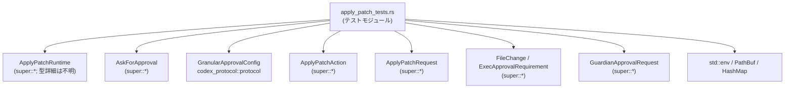
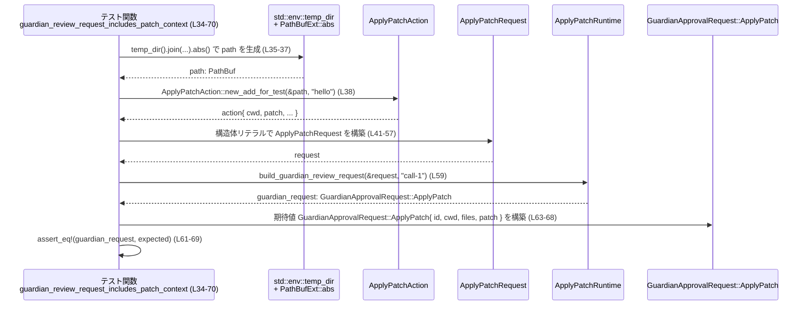

# core/src/tools/runtimes/apply_patch_tests.rs

## 0. ざっくり一言

`ApplyPatchRuntime` まわりの承認設定とサンドボックス実行コマンド構築ロジックについて、期待される挙動を検証するテストモジュールです（特に「サンドボックス承認フラグ」「ガーディアン審査リクエストの内容」「サンドボックス実行バイナリの選択」をテストしています）。  
根拠: `use super::*` と各テストで `ApplyPatchRuntime` 系 API を呼び出していることから（`apply_patch_tests.rs:L1-L3, L10-L12, L35-L41, L59, L72-L80, L98, L106-L112, L129`）。

---

## 1. このモジュールの役割

### 1.1 概要

- このモジュールは、`ApplyPatchRuntime` が持つ以下の振る舞いを検証するために存在しています。
  - サンドボックス承認の要否判定（`wants_no_sandbox_approval`）  
    根拠: `apply_patch_tests.rs:L10-L31`
  - ガーディアン（Guardian）向け審査リクエストの組み立て（`build_guardian_review_request`）  
    根拠: `apply_patch_tests.rs:L34-L70`
  - サンドボックス実行コマンド生成時の実行ファイル選択ロジック（`build_sandbox_command`）  
    根拠: `apply_patch_tests.rs:L72-L102, L104-L138`
- いずれも「パッチ適用」処理を安全かつ適切に実行するための前段階（承認・実行環境準備）の振る舞いをテストしています。

### 1.2 アーキテクチャ内での位置づけ

このテストモジュールは、`core::tools::runtimes` 直下にあり、親モジュール（`super`）が提供する `ApplyPatchRuntime` 周辺 API を検証します。また、外部クレート `codex_protocol` や、テスト支援クレート `core_test_support` も利用しています。



- ノード `T` から `R` への依存: `use super::*` と `ApplyPatchRuntime` の使用から（`apply_patch_tests.rs:L1, L10-L12, L59, L98-99, L129-130`）。
- `GConf` への依存: `GranularApprovalConfig` の import と使用から（`apply_patch_tests.rs:L2, L14-L20, L23-L29`）。
- `OS` への依存: `std::env::temp_dir`, `std::env::current_exe`, `std::path::PathBuf`, `HashMap` 使用から（`apply_patch_tests.rs:L5, L7, L35-37, L75-77, L107-109, L133-137`）。

### 1.3 設計上のポイント（テスト観点）

- **サンドボックス承認フラグの尊重**  
  - `AskForApproval::Granular` の `sandbox_approval` フラグが `wants_no_sandbox_approval` の返り値に反映されることをテストしています（`apply_patch_tests.rs:L10-L31`）。
- **パッチ文脈の完全性チェック**  
  - Guardian 向け審査リクエストに、作業ディレクトリ (`cwd`)、対象ファイル一覧 (`files`)、パッチ内容 (`patch`) が含まれることを検証しています（`apply_patch_tests.rs:L34-L70`）。
- **実行ファイル選択ロジックの分岐**  
  - 明示的に指定された `codex_self_exe` があればそれを優先し、なければ `std::env::current_exe()` にフォールバックすることをテストしています（非 Windows のみ、`apply_patch_tests.rs:L72-L102, L104-L138`）。
- **エラーハンドリング方針（テスト時）**  
  - `build_sandbox_command` および `std::env::current_exe()` の結果には `.expect(...)` を使っており、テストでは「エラーが起きないこと」を前提にしています（`apply_patch_tests.rs:L98-99, L129-130, L133-136`）。

---

## 2. 主要な機能一覧（テスト対象の機能）

このファイル自体はテストのみを定義しますが、検証対象となっている主要機能は次のとおりです。

- `ApplyPatchRuntime::wants_no_sandbox_approval`:  
  `AskForApproval` 設定から「サンドボックス承認を不要とするかどうか」を決定するロジックの検証（`apply_patch_tests.rs:L10-L31`）。
- `ApplyPatchRuntime::build_guardian_review_request`:  
  `ApplyPatchRequest` から Guardian 審査用の `GuardianApprovalRequest::ApplyPatch` を組み立てるロジックの検証（`apply_patch_tests.rs:L34-L70`）。
- `ApplyPatchRuntime::build_sandbox_command`:  
  サンドボックス実行コマンドを組み立てる際に、明示指定された `codex_self_exe` を優先し、なければ `current_exe()` にフォールバックするロジックの検証（非 Windows、`apply_patch_tests.rs:L72-L102, L104-L138`）。

---

## 3. 公開 API と詳細解説

### 3.1 型一覧（このモジュールから利用している主要な型）

このファイル内で新しい型定義は行われていません。  
以下は「テスト対象またはテストに登場する主要な型」の一覧です。

| 名前 | 種別 | 定義場所（推定含む） | 役割 / 用途 | 根拠 |
|------|------|----------------------|-------------|------|
| `ApplyPatchRuntime` | 型（詳細不明） | 親モジュール（`super`） | パッチ適用の実行や承認・サンドボックス関連のロジックをまとめたランタイムと解釈されます。`new`, `wants_no_sandbox_approval`, `build_guardian_review_request`, `build_sandbox_command` を持つことがテストから分かります。 | 使用箇所: `apply_patch_tests.rs:L11, L59, L98-99, L129-130` |
| `AskForApproval` | 型（enum と思われるが詳細不明） | 親モジュール（`super`） | アクション実行時にどのような承認フローを求めるかを表現する設定。`OnRequest`, `Granular(...)` などのバリアントを持ちます。 | 使用箇所: `apply_patch_tests.rs:L12, L14, L23` |
| `GranularApprovalConfig` | 構造体（外部クレート） | `codex_protocol::protocol` | 「細分化された承認設定」を表す構造体。`sandbox_approval`, `rules`, `skill_approval`, `request_permissions`, `mcp_elicitations` フィールドを持つことが分かります。 | import と使用: `apply_patch_tests.rs:L2, L14-L20, L23-L29` |
| `ApplyPatchAction` | 型（詳細不明） | 親モジュール（`super`） | 実際のパッチ適用アクションを表す型と解釈できます。テストでは `new_add_for_test` で生成し、`cwd`, `patch` フィールドを参照しています。 | 使用箇所: `apply_patch_tests.rs:L38, L78, L110` |
| `ApplyPatchRequest` | 構造体（推定） | 親モジュール（`super`） | パッチ適用リクエスト全体を表す型。`action`, `file_paths`, `changes`, `exec_approval_requirement`, `additional_permissions`, `permissions_preapproved`, `timeout_ms` フィールドを持ちます。 | 初期化箇所: `apply_patch_tests.rs:L41-L57, L79-L95, L111-L127` |
| `FileChange` | enum（推定） | 親モジュール（`super`） | 個々のファイルに対する変更内容（ここでは `Add { content: String }`）を表す型。 | 使用箇所: `apply_patch_tests.rs:L46-L48, L84-L86, L116-L118` |
| `ExecApprovalRequirement` | enum（推定） | 親モジュール（`super`） | 実行に必要な承認要件を表す型。`NeedsApproval { reason, proposed_execpolicy_amendment }` バリアントが存在します。 | 使用箇所: `apply_patch_tests.rs:L50-L52, L88-L90, L120-L122` |
| `GuardianApprovalRequest` | enum（推定） | 親モジュール（`super`） | Guardian への承認依頼を表現するリクエスト型。`ApplyPatch { id, cwd, files, patch }` バリアントが存在します。 | 使用箇所: `apply_patch_tests.rs:L63-L68` |
| `PathBufExt` | トレイト | `core_test_support` | `PathBuf` に対して `.abs()` メソッドを追加する拡張トレイト。テスト用に絶対パスを取得するために使われています。 | import / 使用: `apply_patch_tests.rs:L3, L35-L37, L75-L77, L107-L109` |
| `PathBuf` | 構造体 | `std::path` | パス表現。ここでは `codex_self_exe` のパスやテスト用ファイルパスの保持に使用されています。 | import / 使用: `apply_patch_tests.rs:L6-L7, L96, L108` |

※ `ApplyPatchRuntime` や `ApplyPatchRequest` などの実体定義はこのチャンクには現れません。型種別（構造体 / enum 等）は、フィールドアクセスやバリアント使用から推定しているものについては、その旨を明示しています。

### 3.2 関数詳細（テストから見える公開 API の契約）

ここでは、このテストが対象としている `ApplyPatchRuntime` のメソッドを「テストから観測できる範囲」で解説します。実際の実装は親モジュールにあり、このチャンクには現れません。

---

#### `ApplyPatchRuntime::wants_no_sandbox_approval(ask_for_approval: AskForApproval) -> bool`

**概要**

- 実行時の承認設定 `AskForApproval` に基づき、「サンドボックス承認を不要とみなすかどうか」を真偽値で返すメソッドです。  
  根拠: `runtime.wants_no_sandbox_approval(...)` の戻り値を `assert!` および `!` で検証していることから、戻り値は `bool` と分かります（`apply_patch_tests.rs:L11-L23`）。

**引数**

| 引数名 | 型 | 説明 | 根拠 |
|--------|----|------|------|
| `ask_for_approval` | `AskForApproval` | 実行時にどのような承認フローを要求するかを指定する設定。少なくとも `OnRequest` と `Granular(GranularApprovalConfig)` バリアントを持ちます。 | 使用箇所: `apply_patch_tests.rs:L12, L14, L23` |

※ `self` 引数（`&self` など）はメソッドシンタックスから存在すると考えられますが、型定義はこのチャンクには現れません。

**戻り値**

- 型: `bool`  
  - `true`: 「サンドボックス承認を不要とみなす」状態を表すと解釈できます。  
  - `false`: サンドボックス承認が不要ではない（＝何らかの承認が必要）状態を表すと解釈できます。  
- この解釈は関数名とテスト名から推測されたものであり、厳密な意味付けは実装側コードを確認する必要があります。  
  根拠: `assert!(...)` と `!runtime.wants_no_sandbox_approval(...)` の利用（`apply_patch_tests.rs:L12-L23`）。

**内部処理の流れ（テストから分かる範囲）**

テスト `wants_no_sandbox_approval_granular_respects_sandbox_flag` から次のような挙動が読み取れます（`apply_patch_tests.rs:L10-L31`）。

1. `AskForApproval::OnRequest` の場合は `true` を返す。  
   - 根拠: `assert!(runtime.wants_no_sandbox_approval(AskForApproval::OnRequest));`（`apply_patch_tests.rs:L12`）。
2. `AskForApproval::Granular(config)` で、`config.sandbox_approval == false` の場合は `false` を返す。  
   - 根拠: `!runtime.wants_no_sandbox_approval(AskForApproval::Granular(GranularApprovalConfig { sandbox_approval: false, ... }))` を `assert!` している（`apply_patch_tests.rs:L13-L21`）。
3. 同じく `Granular(config)` で `config.sandbox_approval == true` の場合は `true` を返す。  
   - 根拠: `assert!(runtime.wants_no_sandbox_approval(AskForApproval::Granular(GranularApprovalConfig { sandbox_approval: true, ... })))`（`apply_patch_tests.rs:L22-L30`）。

実装内の具体的な `match` 式などはこのチャンクからは確認できませんが、少なくとも `sandbox_approval` フラグをそのまま反映した判定が行われていると読み取れます。

**Examples（使用例：テストに基づく）**

```rust
// ランタイムを生成
let runtime = ApplyPatchRuntime::new(); // apply_patch_tests.rs:L11

// OnRequest の場合はサンドボックス承認が不要と判定される
assert!(runtime.wants_no_sandbox_approval(AskForApproval::OnRequest)); 
// 根拠: apply_patch_tests.rs:L12

// Granular 設定で sandbox_approval = false の場合は「不要ではない」（= false）
let granular_off = AskForApproval::Granular(GranularApprovalConfig {
    sandbox_approval: false,
    rules: true,
    skill_approval: true,
    request_permissions: true,
    mcp_elicitations: true,
});
assert!(!runtime.wants_no_sandbox_approval(granular_off)); 
// 根拠: apply_patch_tests.rs:L13-L21

// Granular 設定で sandbox_approval = true の場合は「不要」と判定（= true）
let granular_on = AskForApproval::Granular(GranularApprovalConfig {
    sandbox_approval: true,
    rules: true,
    skill_approval: true,
    request_permissions: true,
    mcp_elicitations: true,
});
assert!(runtime.wants_no_sandbox_approval(granular_on));
// 根拠: apply_patch_tests.rs:L22-L30
```

**Errors / Panics**

- このメソッド自体は `bool` を返すのみで、`Result` や `Option` は返していません。
- テストコードからは、このメソッドが `panic!` するケースは見られません。  
  （異常値への対応などは、このチャンクには現れません。）

**Edge cases（エッジケース）**

- `AskForApproval` に他のバリアントが存在する場合の挙動（例: `Always`, `Never` 等）は、このチャンクには現れません。
- `GranularApprovalConfig` の他フィールド（`rules`, `skill_approval` など）は、テストではすべて `true` に固定されており、挙動への影響は不明です。  
  根拠: `apply_patch_tests.rs:L16-L20, L25-L29`。

**使用上の注意点**

- サンドボックス承認の有無はセキュリティに直結するため、`AskForApproval` と `GranularApprovalConfig` の設計変更時には、このメソッドの挙動とテストを合わせて見直す必要があります。
- このメソッドは純粋な判定ロジック（副作用なし）と見做せますが、実装を確認していないため、外部状態依存がないかどうかはこのチャンクだけでは断定できません。

---

#### `ApplyPatchRuntime::build_guardian_review_request(request: &ApplyPatchRequest, id: &str) -> GuardianApprovalRequest`

**概要**

- パッチ適用リクエスト `ApplyPatchRequest` とコール ID 文字列から、Guardian に送る承認リクエスト `GuardianApprovalRequest::ApplyPatch` を組み立てるメソッドです。  
  根拠: `let guardian_request = ApplyPatchRuntime::build_guardian_review_request(&request, "call-1");` と、その後の `assert_eq!`（`apply_patch_tests.rs:L59-L69`）。

**引数**

| 引数名 | 型 | 説明 | 根拠 |
|--------|----|------|------|
| `request` | `&ApplyPatchRequest` | パッチ適用に必要な情報をまとめたリクエスト。ここでは単一ファイル追加のケースが使われています。 | 使用箇所: `apply_patch_tests.rs:L41-L57, L59` |
| `id` | `&str` | Guardian リクエストの ID（コール ID）。`"call-1"` が渡されています。 | 使用箇所: `apply_patch_tests.rs:L59, L64` |

**戻り値**

- 型: `GuardianApprovalRequest`（`GuardianApprovalRequest::ApplyPatch { ... }` バリアント）。  
- テストから分かる返り値の中身:
  - `id`: 引数の `id` を `String` に変換したもの。
  - `cwd`: `ApplyPatchAction` の `cwd`（期待値は `action.cwd.to_path_buf()`）。
  - `files`: `request.file_paths`。
  - `patch`: `ApplyPatchAction` の `patch`（`action.patch.clone()`）。  
  根拠: `assert_eq!(guardian_request, GuardianApprovalRequest::ApplyPatch { ... })`（`apply_patch_tests.rs:L61-L68`）。

**内部処理の流れ（テストから分かる範囲）**

テスト `guardian_review_request_includes_patch_context` から読み取れる流れです（`apply_patch_tests.rs:L34-L70`）。

1. テスト側で `ApplyPatchAction::new_add_for_test(&path, "hello".to_string())` により `action` を構築し、そこから `expected_cwd` と `expected_patch` を取り出す。  
   - 根拠: `apply_patch_tests.rs:L38-L40`。
2. `ApplyPatchRequest` を初期化し、`action`, `file_paths`, `changes`, `exec_approval_requirement` などを設定する。  
   - 根拠: `apply_patch_tests.rs:L41-L57`。
3. `ApplyPatchRuntime::build_guardian_review_request(&request, "call-1")` を呼び出して `guardian_request` を取得する。  
   - 根拠: `apply_patch_tests.rs:L59`。
4. 返ってきた `guardian_request` が、期待する `GuardianApprovalRequest::ApplyPatch` と完全一致することを確認する。  
   - `id == "call-1".to_string()`  
   - `cwd == expected_cwd`  
   - `files == request.file_paths`  
   - `patch == expected_patch`  
   - 根拠: `apply_patch_tests.rs:L61-L68`。

このことから、`build_guardian_review_request` は少なくとも上記 4 フィールドを `ApplyPatchRequest` から抜き出して構築していると分かります。

**Examples（使用例：テストに基づく）**

```rust
// テストから簡略化した使用例（apply_patch_tests.rs:L34-L69 を基に作成）
let path = std::env::temp_dir()
    .join("guardian-apply-patch-example.txt")
    .abs(); // PathBufExt::abs で絶対パス化

// パッチ適用アクションを作成
let action = ApplyPatchAction::new_add_for_test(&path, "hello".to_string());

// 期待される cwd / patch をアクションから取得
let expected_cwd = action.cwd.to_path_buf();
let expected_patch = action.patch.clone();

// ApplyPatchRequest を組み立てる
let request = ApplyPatchRequest {
    action,
    file_paths: vec![path.clone()],
    changes: std::collections::HashMap::from([(
        path.to_path_buf(),
        FileChange::Add { content: "hello".to_string() },
    )]),
    exec_approval_requirement: ExecApprovalRequirement::NeedsApproval {
        reason: None,
        proposed_execpolicy_amendment: None,
    },
    additional_permissions: None,
    permissions_preapproved: false,
    timeout_ms: None,
};

// Guardian 審査リクエストを構築する
let guardian_request = ApplyPatchRuntime::build_guardian_review_request(&request, "call-1");

// guardian_request の中身が request / action に基づいていることが期待される
if let GuardianApprovalRequest::ApplyPatch { id, cwd, files, patch } = guardian_request {
    assert_eq!(id, "call-1".to_string());
    assert_eq!(cwd, expected_cwd);
    assert_eq!(files, request.file_paths);
    assert_eq!(patch, expected_patch);
}
```

**Errors / Panics**

- テストでは `build_guardian_review_request` の返り値をそのまま `assert_eq!` に渡しているため、`Result` や `Option` ではなく「直接 `GuardianApprovalRequest` を返す関数」と考えられます（`apply_patch_tests.rs:L59-L69`）。
- テストからは、このメソッドが `panic!` を起こすケースは確認できません。

**Edge cases（エッジケース）**

- `file_paths` が複数のファイルを含む場合の `files` フィールドの扱いは不明です（このテストでは 1 要素だけです、`apply_patch_tests.rs:L43`）。
- `changes` に複数エントリがある場合、または `FileChange` の他バリアント（`Modify`, `Delete` 等）がある場合の挙動はこのチャンクには現れません。
- `exec_approval_requirement` の値や `additional_permissions` などが `GuardianApprovalRequest` にどのように反映されるかも、このテストからは分かりません（`apply_patch_tests.rs:L50-L56`）。

**使用上の注意点**

- Guardian への承認リクエストでは、レビュアーがパッチの内容と対象ファイルを正しく確認できることが重要です。このメソッドは少なくとも `cwd`, `files`, `patch` を含めていることがテストされています。
- `ApplyPatchRequest` のフィールドに不整合がある（例: `file_paths` と `changes` のキーが一致していない）場合の扱いは、このチャンクからは不明です。そのような場合を許容するかどうかは実装側を確認する必要があります。

---

#### `ApplyPatchRuntime::build_sandbox_command(request: &ApplyPatchRequest, codex_self_exe: Option<&PathBuf>) -> ...`

**概要**

- パッチ適用をサンドボックス環境で実行するためのコマンド（実行ファイル + 引数）を構築するメソッドです。
- 渡された `codex_self_exe` が `Some(path)` の場合は、そのパスを実行ファイルとして使用し、`None` の場合は `std::env::current_exe()` で取得した現在の実行ファイルを用いることがテストされています。  
  根拠: `command.program` が `codex_self_exe.into_os_string()` または `current_exe().into_os_string()` と一致することを検証している（`apply_patch_tests.rs:L98-L101, L129-L137`）。

**引数**

| 引数名 | 型 | 説明 | 根拠 |
|--------|----|------|------|
| `request` | `&ApplyPatchRequest` | パッチ適用に関する情報。ここでは、サンドボックスコマンド構築時のコンテキストとして渡されます。 | 使用箇所: `apply_patch_tests.rs:L79-L95, L111-L127, L98, L129` |
| `codex_self_exe` | `Option<&PathBuf>`（と解釈可能） | 使用する Codex 実行ファイルのパス。`Some(path)` なら `path` を、`None` なら現在の実行ファイルを使うという分岐がテストされています。 | `Some(&codex_self_exe)` / `None` の呼び出しから（`apply_patch_tests.rs:L98-L99, L129`） |

※ 戻り値の完全な型はこのチャンクからは判別できませんが、少なくともフィールド `program` を持つ構造体であることが分かります。

**戻り値**

- テストでは `let command = ... .expect("build sandbox command");` としているため、`build_sandbox_command` は `Result<CommandLike, E>` もしくは `Option<CommandLike>` のいずれかを返していると考えられます（`expect` がそれらに実装されているため）。  
  根拠: `apply_patch_tests.rs:L98-L99, L129-L130`。
- `command` には `program` というフィールドがあり、これは最終的な実行ファイル名（`OsString`）です。  
  根拠: `assert_eq!(command.program, ...)`（`apply_patch_tests.rs:L101, L132-L137`）。

**内部処理の流れ（テストから分かる範囲）**

非 Windows 環境における 2 パターンがテストされています。

1. **明示指定された `codex_self_exe` を使うパターン**  
   テスト: `build_sandbox_command_prefers_configured_codex_self_exe_for_apply_patch`（`apply_patch_tests.rs:L72-L102`）。
   - `codex_self_exe` に `/tmp/codex` を指定する（`PathBuf::from("/tmp/codex")`、`apply_patch_tests.rs:L96`）。
   - `build_sandbox_command(&request, Some(&codex_self_exe))` を呼び出す（`apply_patch_tests.rs:L98`）。
   - 成功時に得られた `command.program` が `codex_self_exe.into_os_string()` と一致することを確認する（`apply_patch_tests.rs:L101`）。
   - これにより、「引数 `codex_self_exe` が `Some` の場合は、その値を実行ファイルとして採用する」という契約が読み取れます。

2. **`codex_self_exe` が指定されていない場合のフォールバック**  
   テスト: `build_sandbox_command_falls_back_to_current_exe_for_apply_patch`（`apply_patch_tests.rs:L104-L138`）。
   - `build_sandbox_command(&request, None)` を呼び出す（`apply_patch_tests.rs:L129`）。
   - 成功時の `command.program` が `std::env::current_exe()?.into_os_string()` と一致することを確認する（`apply_patch_tests.rs:L132-L137`）。
   - これにより、「`codex_self_exe` が `None` のときは現在の実行ファイルにフォールバックする」という契約が読み取れます。

**Examples（使用例：テストに基づく）**

```rust
// 非 Windows 環境での使用例（apply_patch_tests.rs:L72-L102 を基に作成）
let path = std::env::temp_dir()
    .join("apply-patch-example.txt")
    .abs();

let action = ApplyPatchAction::new_add_for_test(&path, "hello".to_string());
let request = ApplyPatchRequest {
    action,
    file_paths: vec![path.clone()],
    changes: std::collections::HashMap::from([(
        path.to_path_buf(),
        FileChange::Add { content: "hello".to_string() },
    )]),
    exec_approval_requirement: ExecApprovalRequirement::NeedsApproval {
        reason: None,
        proposed_execpolicy_amendment: None,
    },
    additional_permissions: None,
    permissions_preapproved: false,
    timeout_ms: None,
};

// 1) codex_self_exe を明示指定する場合
let codex_self_exe = std::path::PathBuf::from("/tmp/codex");
let command = ApplyPatchRuntime::build_sandbox_command(&request, Some(&codex_self_exe))
    .expect("build sandbox command");
assert_eq!(command.program, codex_self_exe.into_os_string());

// 2) codex_self_exe が無い場合は current_exe にフォールバック
let command2 = ApplyPatchRuntime::build_sandbox_command(&request, None)
    .expect("build sandbox command");
assert_eq!(
    command2.program,
    std::env::current_exe().expect("current exe").into_os_string()
);
```

**Errors / Panics**

- `build_sandbox_command` の戻り値に対して `.expect("build sandbox command")` を呼び出しているため、エラー発生時は `panic!` する形で扱われます（テストにおいて）（`apply_patch_tests.rs:L98-L99, L129-L130`）。
- 同様に、`std::env::current_exe()` に対して `.expect("current exe")` が呼ばれており、現在の実行ファイルパスが取得できない場合もテストは `panic!` します（`apply_patch_tests.rs:L133-L136`）。
- 本番コード側で `build_sandbox_command` を使う際には、`expect` ではなく `match` / `?` などで `Result` / `Option` を扱うことが推奨されますが、そのような利用例はこのチャンクには現れません。

**Edge cases（エッジケース）**

- Windows 環境ではこのテスト自体がコンパイルされないため（`#[cfg(not(target_os = "windows"))]`）、Windows での `build_sandbox_command` の挙動は不明です（`apply_patch_tests.rs:L72, L104`）。
- `codex_self_exe` が存在しないパスを指す場合、コマンド実行時にどうなるか（エラーになるかどうか）は、このテストでは確認していません。
- `ApplyPatchRequest` の内容（複数ファイル、異なる `FileChange` バリアントなど）が `command` の引数（例えばサンドボックスに渡すパスやオプション）にどのように反映されるかは、このチャンクには現れません。

**使用上の注意点**

- 実行ファイルの選択はセキュリティ上重要なポイントです。`codex_self_exe` の値が外部入力に依存する場合、そのパスを検証する必要がある可能性がありますが、テストでは固定パス `/tmp/codex` のみを扱っています。
- 非 Windows 環境のみをカバーするテストのため、クロスプラットフォームな挙動を保証するには Windows 向けの追加テストが必要になります。
- 戻り値に対して `expect` を使うとエラーが即座に `panic!` になるため、本番コード側では適切なエラーハンドリングへ置き換えるべきかどうかを検討する必要があります。

---

### 3.3 その他の関数（このファイル内で定義されるテスト）

このファイル内で定義されているのはすべてテスト関数です。

| 関数名 | 役割（1 行） | 根拠 |
|--------|--------------|------|
| `wants_no_sandbox_approval_granular_respects_sandbox_flag` | `ApplyPatchRuntime::wants_no_sandbox_approval` が `AskForApproval::Granular` の `sandbox_approval` フラグに従うことを検証します。 | `apply_patch_tests.rs:L9-L31` |
| `guardian_review_request_includes_patch_context` | Guardian 審査リクエストに `cwd`, `files`, `patch` が含まれることを検証します。 | `apply_patch_tests.rs:L33-L70` |
| `build_sandbox_command_prefers_configured_codex_self_exe_for_apply_patch` | `build_sandbox_command` が `codex_self_exe` 引数を優先して実行ファイルに設定することを検証します（非 Windows）。 | `apply_patch_tests.rs:L72-L102` |
| `build_sandbox_command_falls_back_to_current_exe_for_apply_patch` | `build_sandbox_command` が `codex_self_exe = None` の場合に `current_exe()` にフォールバックすることを検証します（非 Windows）。 | `apply_patch_tests.rs:L104-L138` |

---

## 4. データフロー

ここでは、Guardian 審査リクエスト構築のテストを例に、データの流れを整理します。

### 4.1 `guardian_review_request_includes_patch_context` におけるデータフロー

このテストでは、ファイルパスとパッチ内容を元に `ApplyPatchAction` および `ApplyPatchRequest` を作成し、それを `build_guardian_review_request` に渡して `GuardianApprovalRequest::ApplyPatch` を生成する流れを検証しています（`apply_patch_tests.rs:L34-L70`）。



**要点**

- `ApplyPatchAction` から `cwd` と `patch` を抽出し、`ApplyPatchRequest` 経由で `GuardianApprovalRequest::ApplyPatch` に引き継がれることが確認されています（`apply_patch_tests.rs:L38-L40, L63-L68`）。
- `file_paths` に設定した `vec![path.clone()]` が、そのまま `files` フィールドとして `GuardianApprovalRequest` に渡されます（`apply_patch_tests.rs:L43, L66`）。
- `changes` フィールドはこのテストでは `HashMap` で 1 エントリのみ設定されますが、それが Guardian リクエストにどのように反映されるかは、このチャンクからは読み取れません。

---

## 5. 使い方（How to Use）

### 5.1 基本的な使用方法（テストに基づく例）

このファイルはテスト専用ですが、`ApplyPatchRuntime` の想定使用方法をテストコードから読み取ることができます。

以下は、Guardian 審査リクエストを組み立て、サンドボックスコマンドを構築する一連の流れの例です（`apply_patch_tests.rs:L34-L70, L72-L102` を基にしています）。

```rust
use std::collections::HashMap;
use std::path::PathBuf;

// 親モジュールから公開されていると仮定
use super::*;

// 1. パッチ適用アクションとリクエストを構築する
let path = std::env::temp_dir()
    .join("apply-patch-example.txt")
    .abs(); // テスト支援の PathBufExt::abs を利用（apply_patch_tests.rs:L35-L37）

let action = ApplyPatchAction::new_add_for_test(&path, "hello".to_string()); // L38

let request = ApplyPatchRequest { // L41-L57 を簡略化
    action,
    file_paths: vec![path.clone()],
    changes: HashMap::from([(
        path.to_path_buf(),
        FileChange::Add { content: "hello".to_string() },
    )]),
    exec_approval_requirement: ExecApprovalRequirement::NeedsApproval {
        reason: None,
        proposed_execpolicy_amendment: None,
    },
    additional_permissions: None,
    permissions_preapproved: false,
    timeout_ms: None,
};

// 2. Guardian 審査リクエストを生成する
let guardian_request =
    ApplyPatchRuntime::build_guardian_review_request(&request, "call-1"); // L59

// 3. サンドボックス実行コマンドを構築する（非 Windows）
#[cfg(not(target_os = "windows"))]
{
    let codex_self_exe = PathBuf::from("/tmp/codex"); // L96
    let command = ApplyPatchRuntime::build_sandbox_command(&request, Some(&codex_self_exe))
        .expect("build sandbox command"); // L98-L99

    // command.program が実際に実行されるバイナリを指す（L101）
    assert_eq!(command.program, codex_self_exe.into_os_string());
}
```

### 5.2 よくある使用パターン（テストから見えるもの）

1. **サンドボックス承認フラグの評価**

```rust
let runtime = ApplyPatchRuntime::new();

let ask = AskForApproval::Granular(GranularApprovalConfig {
    sandbox_approval: true,
    rules: true,
    skill_approval: true,
    request_permissions: true,
    mcp_elicitations: true,
});
let no_sandbox_approval = runtime.wants_no_sandbox_approval(ask);
// テストでは sandbox_approval=true のときに true になることが確認されている
// (apply_patch_tests.rs:L22-L30)
```

1. **`codex_self_exe` の有無によるコマンド構築**

- **ある場合**: `Some(&path)` を渡し、そのパスを実行ファイルとして使用。
- **ない場合**: `None` を渡し、`current_exe()` にフォールバック。

いずれのケースも、テストコードの形に準じて `Result` / `Option` に対して `expect` や `?` を使う形が想定されます（`apply_patch_tests.rs:L98-L99, L129-L130`）。

### 5.3 よくある間違い（推測されるもの）

このチャンクから直接確認できる「バグ事例」はありませんが、テストコードから次のような誤用が起こり得ると考えられます。

```rust
// 想定される誤用例（1）：file_paths を空のままにする
let request = ApplyPatchRequest {
    action,
    file_paths: vec![], // テストでは少なくとも 1 要素を入れている（L43）
    // ...
};
// こうすると、GuardianApprovalRequest::ApplyPatch の files が空になる可能性があり、
// レビューに必要なコンテキストが欠けるかもしれません。
// ※ この挙動が許容されるかどうかは実装側コードを確認する必要があります。
```

```rust
// 想定される誤用例（2）：codex_self_exe を誤って None にする
let command = ApplyPatchRuntime::build_sandbox_command(&request, None)
    .expect("build sandbox command");
// テスト（L129-L137）からは current_exe にフォールバックすることが分かるが、
// 意図せず別バイナリを使ってしまう可能性があります。
```

これらはテストから推測される一般的な注意点であり、実際に問題となるかどうかは仕様次第です。

### 5.4 使用上の注意点（まとめ）

- `wants_no_sandbox_approval` は承認フローの制御に関与するため、`AskForApproval` / `GranularApprovalConfig` の変更時にはテストを見ながら契約を確認する必要があります（`apply_patch_tests.rs:L10-L31`）。
- Guardian 向けリクエストの `cwd`, `files`, `patch` はレビュー品質に影響するため、ここに情報が欠落しないよう `ApplyPatchRequest` の構築を行う必要があります（`apply_patch_tests.rs:L38-L40, L41-L57, L63-L68`）。
- `build_sandbox_command` の戻り値に対して `expect` を用いると、エラー発生時に即座に `panic!` となります。実運用では `Result` / `Option` を適切に扱うことが望まれます（`apply_patch_tests.rs:L98-L99, L129-L130`）。
- このテストファイルでは非同期処理やスレッドは使用しておらず、すべて同期的な関数呼び出しです。並行性に関する考慮は、このチャンクからは必要ありません。

---

## 6. 変更の仕方（How to Modify）

### 6.1 新しい機能を追加する場合（テスト観点）

`ApplyPatchRuntime` に新しい機能（例: 追加の承認フラグや新しいガーディアンリクエスト種別）を追加する場合、本ファイルに対応するテストを追加するのが自然です。

- **追加すべき場所**
  - サンドボックス承認関連のロジック: `wants_no_sandbox_approval_granular_respects_sandbox_flag` の近くに新しいテストを追加すると整理しやすいです（`apply_patch_tests.rs:L9-L31`）。
  - Guardian リクエスト関連のロジック: `guardian_review_request_includes_patch_context` 周辺に新しいテストを追加します（`apply_patch_tests.rs:L33-L70`）。
  - サンドボックスコマンド関連: 非 Windows 向けの `build_sandbox_command_*` テスト群の近くに追加します（`apply_patch_tests.rs:L72-L138`）。

- **依存する型 / 関数**
  - 新機能が `ApplyPatchRequest` のフィールドに関係する場合は、そのフィールドをテスト側で埋めて `build_guardian_review_request` / `build_sandbox_command` の出力に反映されているか確認します。
  - 新しい `AskForApproval` バリアントを追加した場合は、それに対する `wants_no_sandbox_approval` の挙動を表すテストを追加します。

### 6.2 既存の機能を変更する場合（契約確認のポイント）

- **変更前に確認すべき点**
  - `wants_no_sandbox_approval` の意味を変える場合、`AskForApproval::OnRequest` や `GranularApprovalConfig.sandbox_approval` に対する期待値が変わるかどうかを確認し、このファイルのテスト（`apply_patch_tests.rs:L10-L31`）を更新する必要があります。
  - Guardian リクエストのフィールド構造を変える場合、`GuardianApprovalRequest::ApplyPatch` のフィールド名や型変更が `assert_eq!` に影響するため、テストの構造体リテラル部分（`apply_patch_tests.rs:L63-L68`）も合わせて修正する必要があります。
  - `build_sandbox_command` の実行ファイル選択ロジックを変更する場合（例: 別の優先順位を導入するなど）、`build_sandbox_command_*` テストの期待値（`command.program` の比較部分、`apply_patch_tests.rs:L101, L132-L137`）を見直す必要があります。

- **関連テスト・使用箇所の再確認**
  - 親モジュール（`super`）内で `ApplyPatchRuntime` を利用している箇所（CLI、他のランタイム、サービス層など）があれば、それらのテストも合わせて確認する必要がありますが、そのようなファイルはこのチャンクには現れません。
  - 特にセキュリティに影響する変更（サンドボックス無効化、実行ファイルの変更など）の場合は、このテストを足掛かりに、追加の統合テストを検討することが考えられます。

---

## 7. 関連ファイル

このモジュールと密接に関係するファイル・クレートは、インポートや使用されている型から次のように推測できます。

| パス / モジュール | 役割 / 関係 | 根拠 |
|------------------|------------|------|
| `core/src/tools/runtimes/mod.rs`（親モジュール） | `use super::*;` により、この親モジュールから `ApplyPatchRuntime`, `ApplyPatchAction`, `ApplyPatchRequest`, `AskForApproval`, `FileChange`, `ExecApprovalRequirement`, `GuardianApprovalRequest` などがインポートされています。親モジュールで定義または再エクスポートされていると分かります。 | `apply_patch_tests.rs:L1` |
| `codex_protocol::protocol` クレート | `GranularApprovalConfig` を提供し、細分化された承認設定を定義しています。サンドボックス承認フラグのテストで利用されています。 | import / 使用: `apply_patch_tests.rs:L2, L14-L20, L23-L29` |
| `core_test_support` クレート | `PathBufExt` トレイトを提供し、テストコードで `PathBuf` の `.abs()` メソッドを利用可能にしています。テスト用のパス処理を簡略化します。 | import / 使用: `apply_patch_tests.rs:L3, L35-L37, L75-L77, L107-L109` |
| `pretty_assertions` クレート | `assert_eq!` マクロを上書きし、差分が見やすい形で表示されるようにするテスト支援クレートです。ここでは Guardian リクエストの比較に利用されています。 | import / 使用: `apply_patch_tests.rs:L4, L61-L69` |
| 標準ライブラリ (`std::env`, `std::path::PathBuf`, `std::collections::HashMap`) | テスト用ファイルパス生成 (`temp_dir`, `current_exe`)、パス型 (`PathBuf`)、変更集合 (`HashMap`) など、テストコードの周辺処理を担います。 | 使用: `apply_patch_tests.rs:L5, L7, L35-37, L75-77, L96, L107-109, L133-137` |

このチャンクには、`ApplyPatchRuntime` や関連型の実装本体（例: `apply_patch.rs` のようなファイル）は現れていませんが、親モジュール経由でこれらが提供されていることだけは確定的に分かります。
