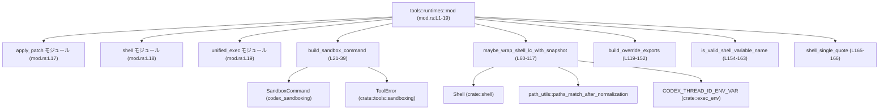
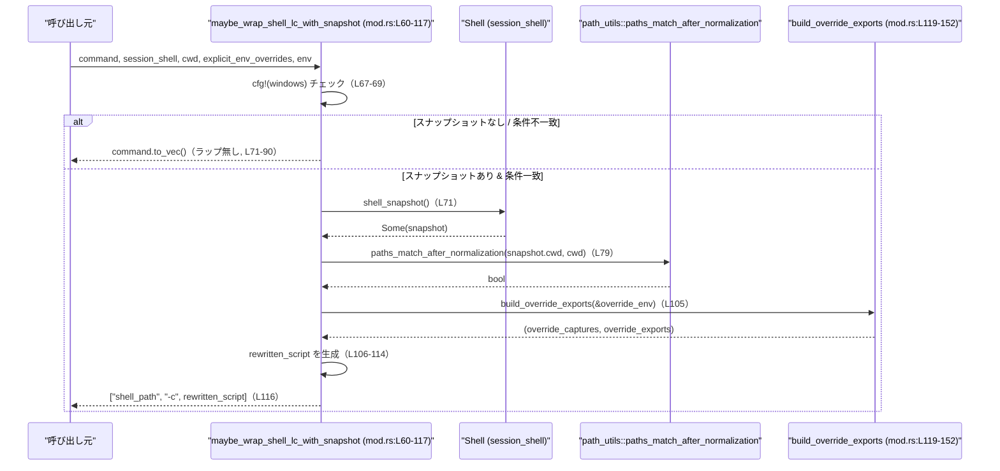

# core/src/tools/runtimes/mod.rs コード解説

## 0. ざっくり一言

ツール向けの「ランタイム」実装群のための共通ユーティリティモジュールです。サンドボックス実行用コマンドの組み立てと、POSIX シェルコマンドをスナップショット付きでラップする処理を提供しています（`mod.rs:L1-5,21-39,60-117`）。

---

## 1. このモジュールの役割

### 1.1 概要

- このモジュールは **ツールごとの ToolRuntime 実装** の一部として、共通で必要になる処理を提供します（モジュールコメントより, `mod.rs:L1-5`）。
- 具体的には、
  - トークン化済みコマンドラインから `SandboxCommand` を構築するヘルパ（`build_sandbox_command`）と（`mod.rs:L21-39`）
  - `Shell::derive_exec_args` が生成する `["/bin/bash", "-lc", "<script>", ...]` 形式のコマンドを、シェルスナップショットを考慮して書き換えるヘルパ（`maybe_wrap_shell_lc_with_snapshot`）
    を提供します（`mod.rs:L41-59,60-117`）。

### 1.2 アーキテクチャ内での位置づけ

このファイルは `core::tools::runtimes` モジュールのルートであり、個別ランタイム実装サブモジュールと共通ユーティリティ関数をまとめています。

- サブモジュール:
  - `apply_patch`（`mod.rs:L17`）
  - `shell`（`mod.rs:L18`）
  - `unified_exec`（`mod.rs:L19`）
- 依存している外部コンポーネント:
  - `crate::shell::Shell`（`mod.rs:L9`）
  - `crate::tools::sandboxing::ToolError`（`mod.rs:L10`）
  - `crate::exec_env::CODEX_THREAD_ID_ENV_VAR`（`mod.rs:L7`）
  - `crate::path_utils`（`mod.rs:L8`）
  - `codex_sandboxing::SandboxCommand`（`mod.rs:L12`）
  - `codex_protocol::models::PermissionProfile`（`mod.rs:L11`）
  - `codex_utils_absolute_path::AbsolutePathBuf`（`mod.rs:L13`）



### 1.3 設計上のポイント

- **ステートレスなユーティリティ関数**
  - すべての関数はグローバル状態を持たず、引数のみを元に結果を返します（`mod.rs:L21-39,60-117,119-166`）。
- **入力検証と早期リターン**
  - `build_sandbox_command` はコマンド配列が空でないことを検証し、空の場合は `ToolError::Rejected` を返します（`mod.rs:L29-31`）。
  - `maybe_wrap_shell_lc_with_snapshot` は多数の条件（OS、スナップショット有無、cwd、一致する `-lc` 形式かなど）を順にチェックし、条件を満たさない場合は元のコマンドをそのまま返します（`mod.rs:L67-90`）。
- **シェルスクリプト生成の安全性への配慮**
  - 環境変数名は `is_valid_shell_variable_name` で POSIX 互換な識別子のみ許可しています（`mod.rs:L119-123,154-162`）。
  - シェル引数は `shell_single_quote` でシングルクォート内に安全にエスケープされます（`mod.rs:L94-99,165-166`）。
- **エラー処理**
  - Rust 側のエラーは `Result<_, ToolError>` で返し（`build_sandbox_command`, `mod.rs:L23-39`）、シェルスクリプト側のエラーは POSIX の条件分岐 (`if`, `then`, `else`) による制御に委ねています（`mod.rs:L130-147`）。
- **並行性**
  - いずれの関数も内部で共有可変状態やスレッドを扱っておらず、引数さえ適切に共有されればスレッド安全に使用できる構造になっています（`mod.rs:L21-39,60-117,119-166`）。

---

## 2. 主要な機能一覧（コンポーネントインベントリー）

### 機能の箇条書き

- サンドボックス用コマンド構築: `build_sandbox_command` が `SandboxCommand` を生成します（`mod.rs:L21-39`）。
- POSIX シェル `-lc` コマンドのスナップショット連携ラップ: `maybe_wrap_shell_lc_with_snapshot` が argv を書き換えます（`mod.rs:L41-59,60-117`）。
- スナップショット前後での環境変数上書き・復元スクリプト生成: `build_override_exports`（`mod.rs:L119-152`）。
- シェル変数名の妥当性チェック: `is_valid_shell_variable_name`（`mod.rs:L154-162`）。
- シェル用シングルクォートエスケープ: `shell_single_quote`（`mod.rs:L165-166`）。
- 個別ランタイムモジュールの公開（crate 内）: `apply_patch`, `shell`, `unified_exec`（`mod.rs:L17-19`）。

### コンポーネント一覧表

| 名前 | 種別 | 可視性 | 役割 / 用途 | 根拠 |
|------|------|--------|------------|------|
| `apply_patch` | サブモジュール | `pub(crate)` | パッチ適用系ランタイム（詳細はこのチャンクには現れない） | `mod.rs:L17` |
| `shell` | サブモジュール | `pub(crate)` | シェル実行系ランタイム（詳細はこのチャンクには現れない） | `mod.rs:L18` |
| `unified_exec` | サブモジュール | `pub(crate)` | 統合的な実行ランタイム（詳細はこのチャンクには現れない） | `mod.rs:L19` |
| `build_sandbox_command` | 関数 | `pub(crate)` | トークン化されたコマンドラインから `SandboxCommand` を構築する | `mod.rs:L21-39` |
| `maybe_wrap_shell_lc_with_snapshot` | 関数 | `pub(crate)` | `shell -lc "<script>"` 形式のコマンドをスナップショットを考慮したスクリプトでラップする | `mod.rs:L41-59,60-117` |
| `build_override_exports` | 関数 | `fn` (非公開) | 環境変数の値をキャプチャ＆復元する POSIX シェルスクリプト断片を生成する | `mod.rs:L119-152` |
| `is_valid_shell_variable_name` | 関数 | `fn` (非公開) | シェル変数として有効な名前かを検証する | `mod.rs:L154-162` |
| `shell_single_quote` | 関数 | `fn` (非公開) | 文字列内の `'` を POSIX シェルのシングルクォート内で安全に表現できる形に変換する | `mod.rs:L165-166` |
| `tests` | モジュール | `mod`（`cfg(all(test, unix))`） | Unix 環境向けテストコードを外部ファイル `mod_tests.rs` から読み込む | `mod.rs:L169-171` |

---

## 3. 公開 API と詳細解説

### 3.1 型一覧（構造体・列挙体など）

このファイル自体では、新たな構造体・列挙体・型エイリアスは定義されていません。

ここで利用している主な外部型（定義はこのチャンクには現れない）は次のとおりです。

| 名前 | 所属 | 役割 / 用途 | 根拠 |
|------|------|------------|------|
| `SandboxCommand` | `codex_sandboxing` | サンドボックス環境で実行するコマンドを表す構造体 | `mod.rs:L12,32-38` |
| `ToolError` | `crate::tools::sandboxing` | ツール実行に関するエラー型。ここでは `Rejected` 変種が使われている | `mod.rs:L10,31` |
| `PermissionProfile` | `codex_protocol::models` | サンドボックスの追加権限プロファイル | `mod.rs:L11,27` |
| `AbsolutePathBuf` | `codex_utils_absolute_path` | 絶対パスを表すラッパ型 | `mod.rs:L13,25,35` |
| `Shell` | `crate::shell` | セッションシェルの情報（パスやスナップショット）を持つ型 | `mod.rs:L9,62,71-73,93` |

> これらの型のフィールドやメソッドの詳細は、このファイルには記述されていません。

---

### 3.2 関数詳細

#### `build_sandbox_command(command: &[String], cwd: &AbsolutePathBuf, env: &HashMap<String, String>, additional_permissions: Option<PermissionProfile>) -> Result<SandboxCommand, ToolError>`

**概要**

- トークン化済みのコマンドライン（`["prog", "arg1", ...]`）から `SandboxCommand` を構築するヘルパ関数です（`mod.rs:L21-39`）。
- 少なくとも 1 要素（プログラム名）が含まれていることを検証し、空の場合は `ToolError::Rejected` を返します（`mod.rs:L29-31`）。

**引数**

| 引数名 | 型 | 説明 |
|--------|----|------|
| `command` | `&[String]` | 実行するプログラムと引数のリスト。先頭がプログラム、それ以降が引数 | `mod.rs:L23-24,29-35` |
| `cwd` | `&AbsolutePathBuf` | コマンド実行時のカレントディレクトリ | `mod.rs:L25,35` |
| `env` | `&HashMap<String, String>` | 実行時の環境変数マップ | `mod.rs:L26,36` |
| `additional_permissions` | `Option<PermissionProfile>` | サンドボックスに対して追加付与する権限プロフィール | `mod.rs:L27,37-38` |

**戻り値**

- `Ok(SandboxCommand)`:
  - 渡された情報をコピーした `SandboxCommand` を返します（`mod.rs:L32-38`）。
- `Err(ToolError)`:
  - `command` が空のとき `ToolError::Rejected("command args are empty".to_string())` を返します（`mod.rs:L29-31`）。

**内部処理の流れ**

1. `command.split_first()` で先頭要素（プログラム）と残り（引数）に分解します（`mod.rs:L29-30`）。
2. `command` が空の場合は `split_first()` が `None` を返すため、`ok_or_else` により `ToolError::Rejected(...)` を返します（`mod.rs:L29-31`）。
3. `SandboxCommand` 構造体を生成し、以下を設定します（`mod.rs:L32-38`）。
   - `program`: 先頭要素を `clone()` して所有権を移し、必要な型に `into()` で変換。
   - `args`: 残りの要素（スライス `args`）を `to_vec()` で複製。
   - `cwd`: 引数 `cwd` を `clone()`。
   - `env`: 引数 `env` を `clone()`。
   - `additional_permissions`: 引数をそのまま移動。
4. 生成した `SandboxCommand` を `Ok(...)` として返します（`mod.rs:L32-38`）。

**Examples（使用例）**

`SandboxCommand` を組み立てる基本的な例です（`AbsolutePathBuf` の具体的な生成方法はこのチャンクには現れないためコメントとします）。

```rust
use std::collections::HashMap;
use codex_sandboxing::SandboxCommand;
use codex_protocol::models::PermissionProfile;
use codex_utils_absolute_path::AbsolutePathBuf;

fn example_build_sandbox_command(
    cwd: &AbsolutePathBuf,                                  // 事前に用意されたカレントディレクトリ
) -> Result<SandboxCommand, crate::tools::sandboxing::ToolError> {
    let command = vec![
        "ls".to_string(),                                   // プログラム
        "-la".to_string(),                                  // 引数1
    ];
    let mut env = HashMap::new();
    env.insert("LANG".to_string(), "C.UTF-8".to_string());  // 環境変数を設定

    // 権限プロファイルは例として None を渡す
    crate::tools::runtimes::build_sandbox_command(
        &command,
        cwd,
        &env,
        None,
    )
}
```

**Errors / Panics**

- **Errors**
  - `command` が空の場合:  
    `ToolError::Rejected("command args are empty".to_string())` を返します（`mod.rs:L29-31`）。
- **Panics**
  - 明示的な `panic!` 呼び出しはなく、境界外アクセスも行っていないため、この関数自身からのパニックは想定されません（`mod.rs:L29-38`）。

**Edge cases（エッジケース）**

- `command` が空 (`&[]`) の場合:
  - `Err(ToolError::Rejected(...))` が返ります（`mod.rs:L29-31`）。
- `command` が 1 要素のみ (`["prog"]`) の場合:
  - `program` が `"prog"`, `args` は空の `Vec<String>` になります（`mod.rs:L29-30,34`）。
- `env` や `cwd` が大きい場合:
  - `clone()` によりメモリコピーコストが発生します（`mod.rs:L35-36`）。

**使用上の注意点**

- `command` は必ず先頭にプログラム名を含める必要があります。空配列を渡すと `Rejected` エラーになります（`mod.rs:L29-31`）。
- `env` と `cwd` はクローンされるため、非常に大きなマップやパスを頻繁に渡すとコストがかかります。
- 並行性:
  - 引数として `&[String]`, `&AbsolutePathBuf`, `&HashMap<_, _>` を受け取り内部ではコピーのみ行うため、同じデータを複数スレッドで読み取り専用で共有して呼び出すことは安全です（共有側が適切な同期を行っている前提）。

---

#### `maybe_wrap_shell_lc_with_snapshot(command: &[String], session_shell: &Shell, cwd: &Path, explicit_env_overrides: &HashMap<String, String>, env: &HashMap<String, String>) -> Vec<String>`

**概要**

- POSIX 環境向けヘルパ関数で、`Shell::derive_exec_args` が生成する `["/bin/bash", "-lc", "<script>", ...]` 形式のコマンドに対し、セッションシェルに設定された「スナップショット」を事前に読み込むラッパスクリプトを生成します（`mod.rs:L41-59,60-117`）。
- 条件に合致しない場合は何も変更せず元の `command` を返します（`mod.rs:L67-90`）。

**引数**

| 引数名 | 型 | 説明 |
|--------|----|------|
| `command` | `&[String]` | 実行予定の argv。`[shell_path, "-lc", "<script>", ...]` を想定 | `mod.rs:L41-48,60-61,87-90,94-99` |
| `session_shell` | `&Shell` | セッションごとのシェル設定（シェルパス、スナップショット情報など） | `mod.rs:L62,71-73,93` |
| `cwd` | `&Path` | コマンド実行時のカレントディレクトリ | `mod.rs:L63,79-81` |
| `explicit_env_overrides` | `&HashMap<String, String>` | ポリシーに基づく明示的な環境変数上書きセット（キー集合として利用） | `mod.rs:L64,101,119-123` |
| `env` | `&HashMap<String, String>` | 実際の実行環境全体。`CODEX_THREAD_ID_ENV_VAR` などランタイム専用変数を取得するために利用 | `mod.rs:L65,102-103` |

**戻り値**

- `Vec<String>`:
  - 条件を満たさない場合は `command.to_vec()`（元の argv のコピー）を返します（`mod.rs:L67-69,71-73,75-77,79-81,83-85,87-90`）。
  - 条件を満たした場合は、スナップショットを `. SNAPSHOT` で source し、環境変数を復元したうえで元のシェルを `exec` するスクリプトを `-c` で与えた新しい argv を返します（`mod.rs:L92-116`）。

**内部処理の流れ（アルゴリズム）**

1. **OS 判定**: `cfg!(windows)` が真（Windows ビルド）なら即座に `command.to_vec()` を返し、何もしません（`mod.rs:L67-69`）。
2. **スナップショットの有無確認**:
   - `session_shell.shell_snapshot()` が `None` の場合、変更せず終了します（`mod.rs:L71-73`）。
3. **スナップショットファイル存在確認**:
   - `snapshot.path.exists()` が偽ならスナップショットは無視し、元の `command` を返します（`mod.rs:L75-77`）。
4. **カレントディレクトリ一致の確認**:
   - `path_utils::paths_match_after_normalization(snapshot.cwd.as_path(), cwd)` が偽ならスナップショット対象外として何もせず返します（`mod.rs:L79-81`）。
5. **コマンド形式の確認**:
   - `command.len() < 3` の場合 (`[shell_path, "-lc", "<script>"]` を満たさない)、何もしません（`mod.rs:L83-85`）。
   - `command[1] != "-lc"` の場合も、変更せず終了します（`mod.rs:L87-90`）。
6. **ラップ用スクリプト生成**:
   - スナップショットパスとシェルパスを文字列化します（`mod.rs:L92-93`）。
   - 元シェル (`command[0]`) と元スクリプト (`command[2]`) を `shell_single_quote` でエスケープします（`mod.rs:L94-95,165-166`）。
   - 3 つ目以降の引数を同様にクォートし、`trailing_args` 文字列として結合します（`mod.rs:L97-100`）。
7. **環境変数保護対象の決定**:
   - `explicit_env_overrides` を `clone()` し `override_env` とします（`mod.rs:L101`）。
   - 実行環境 `env` に `CODEX_THREAD_ID_ENV_VAR` があれば、そのキーと値を `override_env` に追加します（`mod.rs:L102-103`）。
8. **環境変数キャプチャ＆復元スクリプト生成**:
   - `build_override_exports(&override_env)` を呼び、スナップショット前に変数値を保存する `override_captures` と、スナップショット後に元の値を復元する `override_exports` を得ます（`mod.rs:L105,119-152`）。
9. **最終スクリプト組み立て**:
   - `override_exports` が空の場合:
     - 「スナップショットを best effort で source する」→「元のシェルを `exec` する」スクリプトを生成します（`mod.rs:L106-110`）。
   - `override_exports` が存在する場合:
     - スナップショット前にキャプチャスクリプトを実行し、スナップショット後に復元スクリプトを実行したうえで `exec` するスクリプトを生成します（`mod.rs:L111-114`）。
10. **新しい argv の返却**:
    - `[shell_path, "-c", rewritten_script]` という形式の `Vec<String>` を返します（`mod.rs:L92-93,116`）。

**Mermaid 簡易フロー（maybe_wrap_shell_lc_with_snapshot, mod.rs:L60-117）**

```mermaid
flowchart TD
    A["入力 command (&[String])"] --> B{"cfg!(windows) ?"}
    B -- Yes --> R1["return command.to_vec()"]
    B -- No --> C{"shell_snapshot() あり?"}
    C -- None --> R2["return command.to_vec()"]
    C -- Some(snapshot) --> D{"snapshot.path.exists() ?"}
    D -- No --> R3["return command.to_vec()"]
    D -- Yes --> E{"paths_match_after_normalization(snapshot.cwd, cwd) ?"}
    E -- No --> R4["return command.to_vec()"]
    E -- Yes --> F{"len >= 3 && command[1] == \"-lc\" ?"}
    F -- No --> R5["return command.to_vec()"]
    F -- Yes --> G["環境変数キー集合 override_env 構築"]
    G --> H["build_override_exports(&override_env)"]
    H --> I["ラップ用シェルスクリプト rewritten_script 生成"]
    I --> R6["return [shell_path, \"-c\", rewritten_script]"]
```

**Examples（使用例）**

実際には `Shell::derive_exec_args` などと組み合わせて使われますが、このチャンクにはその実装がないため、簡略化した例を示します。

```rust
use std::collections::HashMap;
use std::path::Path;
use crate::shell::Shell;

fn example_wrap_shell(
    session_shell: &Shell,                        // セッションシェル（外部で構築）
    cwd: &Path,                                   // 実行ディレクトリ
) -> Vec<String> {
    // Bash でスクリプトを -lc 形式で実行するコマンド
    let command = vec![
        "/bin/bash".to_string(),
        "-lc".to_string(),
        "echo hello".to_string(),
    ];

    let explicit_env_overrides = HashMap::<String, String>::new(); // 方針に基づく上書きセット
    let env = HashMap::<String, String>::new();                    // 実行環境（例では空）

    crate::tools::runtimes::maybe_wrap_shell_lc_with_snapshot(
        &command,
        session_shell,
        cwd,
        &explicit_env_overrides,
        &env,
    )
}
```

**Errors / Panics**

- **Errors（戻り値としては Error 型を返さない）**
  - 戻り値は `Vec<String>` であり、Rust の `Result` 型によるエラーは返しません。
  - エラーパスはすべて「ラップを行わず元の `command` を返す」形になっています（`mod.rs:L67-90`）。
- **Panics**
  - 配列インデックスアクセス `command[1]`, `command[2]`, `command[3..]` は `command.len() >= 3` がチェックされた後でのみ使用されているため（`mod.rs:L83-85,87-90,94-99`）、境界外アクセスによるパニックは防がれています。
  - それ以外に明示的な `panic!` はありません。

**Edge cases（エッジケース）**

- **Windows ビルド**
  - `cfg!(windows)` が真のため、常に `command.to_vec()` が返り、スナップショットラップは一切行われません（`mod.rs:L67-69`）。
- **スナップショット未設定 / ファイル不存在**
  - `session_shell.shell_snapshot()` が `None`、または `snapshot.path.exists()` が偽の場合、元の `command` が返されます（`mod.rs:L71-77`）。
- **cwd 不一致**
  - `paths_match_after_normalization(snapshot.cwd.as_path(), cwd)` が偽の場合、スナップショットは無視されます（`mod.rs:L79-81`）。
- **コマンド長 < 3 または `-lc` でない**
  - `["/bin/bash"]` など 3 要素未満のコマンド、あるいは `command[1]` が `"-lc"` 以外の場合、ラップは行われません（`mod.rs:L83-90`）。
- **`explicit_env_overrides` に無効な変数名が含まれる**
  - `is_valid_shell_variable_name` により、`[A-Za-z_][A-Za-z0-9_]*` を満たさないキーは無視されます（`mod.rs:L119-123,154-162`）。
- **`CODEX_THREAD_ID_ENV_VAR` が存在しない**
  - `env.get(CODEX_THREAD_ID_ENV_VAR)` が `None` の場合、その変数名は `override_env` に追加されません（`mod.rs:L102-103`）。

**使用上の注意点**

- **POSIX シェル前提**
  - コメントにもある通り、生成されるスクリプトは POSIX 構文（`if`, `.`, `exec` など）を使用しており、Bash/Zsh/sh での実行を想定しています（`mod.rs:L50-52`）。他のシェルでの挙動はこのチャンクからは分かりません。
- **セキュリティ上の注意**
  - 引数・パスは `shell_single_quote` によってシングルクォートで正しくエスケープされており、コマンドインジェクションリスクを低減する設計になっています（`mod.rs:L94-99,165-166`）。
  - 環境変数名は `is_valid_shell_variable_name` でフィルタされているため、不正な識別子を用いたスクリプト注入は防がれます（`mod.rs:L119-123,154-162`）。
- **環境変数の「保護」の意味**
  - `build_override_exports` は **値を新しく設定する** のではなく、「スナップショット前の値をキャプチャし、スナップショット後に元の値に戻す」スクリプトを生成します（`mod.rs:L130-147`）。
  - そのため、`explicit_env_overrides` の「キー集合」をスナップショットから保護する用途に使われていると解釈できますが、値そのものの適用タイミングはこのチャンクには現れません。
- **並行性**
  - 内部でグローバルな状態を保持せず、すべてローカル変数と引数だけで完結しているため、同一の `Shell` や `HashMap` を複数スレッドから参照する場合でも、呼び出し側で適切な同期さえ行っていればこの関数自体は競合状態を発生させません。

---

### 3.3 その他の関数

| 関数名 | シグネチャ | 役割（1 行） | 根拠 |
|--------|-----------|--------------|------|
| `build_override_exports` | `fn build_override_exports(explicit_env_overrides: &HashMap<String, String>) -> (String, String)` | 指定された環境変数名の現在値をキャプチャ＆復元する POSIX シェルスクリプト断片（キャプチャ部・復元部）を生成する | `mod.rs:L119-152` |
| `is_valid_shell_variable_name` | `fn is_valid_shell_variable_name(name: &str) -> bool` | 先頭が英字または `_` で始まり、残りが英数字か `_` であるかをチェックし、シェル変数名として妥当かを判定する | `mod.rs:L154-162` |
| `shell_single_quote` | `fn shell_single_quote(input: &str) -> String` | 文字列内の `'` を `'"'"'` シーケンスに変換し、シングルクォートで囲んだときに安全なシェル引数として扱える形にする | `mod.rs:L165-166` |

---

## 4. データフロー

ここでは、`maybe_wrap_shell_lc_with_snapshot` を用いて `shell -lc "<script>"` 形式のコマンドをスナップショット付きで実行する際のデータフローを示します。

1. 呼び出し元は `Shell::derive_exec_args` 等で `command: Vec<String>` を構築します（この関数自体はこのチャンクには現れませんが、コメントに記載があります, `mod.rs:L41-48`）。
2. 呼び出し元は `session_shell`, `cwd`, `explicit_env_overrides`, `env` とともに `maybe_wrap_shell_lc_with_snapshot` を呼び出します（`mod.rs:L60-66`）。
3. 関数内部で条件チェックが行われ、必要であればスナップショットを source し、環境変数を復元したうえで元のシェルを `exec` するスクリプトを生成します（`mod.rs:L75-116,130-147`）。
4. 戻り値の `Vec<String>` は、新しい argv としてサンドボックス内や実行環境に渡されます（この先の処理はこのチャンクには現れません）。



この図は、本ファイル `mod.rs:L60-117` および `L119-152` に基づく処理の概要です。

---

## 5. 使い方（How to Use）

### 5.1 基本的な使用方法

典型的なフローとしては、次のように **シェルコマンドをラップ → サンドボックスコマンドに変換 → 実行** という流れになります。

```rust
use std::collections::HashMap;
use std::path::Path;
use codex_sandboxing::SandboxCommand;
use codex_utils_absolute_path::AbsolutePathBuf;
use crate::shell::Shell;
use crate::tools::sandboxing::ToolError;

// 実行フロー（擬似コード）
fn run_shell_command_with_snapshot(
    session_shell: &Shell,                            // セッションシェル
    cwd_abs: &AbsolutePathBuf,                       // 絶対パスのカレントディレクトリ
) -> Result<SandboxCommand, ToolError> {
    // 1. 元のシェルコマンドを構築（["/bin/bash", "-lc", "<script>"] 想定）
    let command = vec![
        "/bin/bash".to_string(),
        "-lc".to_string(),
        "echo hello".to_string(),
    ];

    // 2. 実行環境を準備
    let explicit_env_overrides = HashMap::<String, String>::new();
    let env = HashMap::<String, String>::new();

    // 3. スナップショット考慮のラップを適用
    let wrapped_command = crate::tools::runtimes::maybe_wrap_shell_lc_with_snapshot(
        &command,
        session_shell,
        Path::new(cwd_abs.as_ref()),                  // AbsolutePathBuf → Path の変換方法はこのチャンクには現れない
        &explicit_env_overrides,
        &env,
    );

    // 4. サンドボックス用コマンドに変換
    crate::tools::runtimes::build_sandbox_command(
        &wrapped_command,
        cwd_abs,
        &env,
        None,
    )
}
```

> 上記は利用イメージの擬似コードです。`AbsolutePathBuf` や `Shell` の具体的な生成方法はこのチャンクには現れません。

### 5.2 よくある使用パターン

1. **スナップショットがない / 無効な場合のフォールバック**

   - スナップショットが未設定 (`shell_snapshot() == None`)、またはパス不存在／cwd 不一致のときは元のコマンドがそのまま返ります（`mod.rs:L71-81`）。
   - 呼び出し側はラップが行われるかどうかを意識せずに `maybe_wrap_shell_lc_with_snapshot` の戻り値を使うことができます。

2. **特定の環境変数をスナップショットから保護したい場合**

   - スナップショットが `. SNAPSHOT` で環境変数を変更するかもしれない場合に、上書きされたくない変数名を `explicit_env_overrides` のキーとして渡すことで、それらの変数の値をスナップショット前の状態に戻すスクリプトが生成されます（`mod.rs:L101,119-147`）。

3. **スレッドプールなどからの並列呼び出し**

   - どの関数も共有可変状態を持たないため、同じ `Shell` / `env` を読み取り専用で共有しつつ、異なる `command` / `cwd` で並列に呼び出すことができます（実際のスレッド安全性は `Shell` や `AbsolutePathBuf` の実装にも依存しますが、このチャンクには現れません）。

### 5.3 よくある間違い

```rust
use std::collections::HashMap;
use codex_utils_absolute_path::AbsolutePathBuf;

// 間違い例: 空のコマンドを渡してしまう
fn wrong_example(cwd: &AbsolutePathBuf) {
    let command: Vec<String> = Vec::new();              // 要素がない

    let env = HashMap::<String, String>::new();

    // エラー: ToolError::Rejected("command args are empty")
    let _ = crate::tools::runtimes::build_sandbox_command(
        &command,
        cwd,
        &env,
        None,
    );
}

// 正しい例: 少なくともプログラム名を含める
fn correct_example(cwd: &AbsolutePathBuf) {
    let command = vec!["ls".to_string()];               // 先頭にプログラム名

    let env = HashMap::<String, String>::new();

    let _ = crate::tools::runtimes::build_sandbox_command(
        &command,
        cwd,
        &env,
        None,
    );
}
```

```rust
use std::collections::HashMap;
use std::path::Path;
use crate::shell::Shell;

// 間違い例: -lc 形式でないコマンドをラップしようとしている
fn wrong_wrap(session_shell: &Shell, cwd: &Path) {
    let command = vec!["/bin/bash".to_string(), "-c".to_string(), "echo hi".to_string()];
    let envs = HashMap::<String, String>::new();

    // command[1] が "-lc" ではないため、ラップされず元のコマンドが返る
    let wrapped = crate::tools::runtimes::maybe_wrap_shell_lc_with_snapshot(
        &command,
        session_shell,
        cwd,
        &HashMap::new(),
        &envs,
    );

    assert_eq!(wrapped, command); // 実質 no-op
}
```

### 5.4 使用上の注意点（まとめ）

- **build_sandbox_command**
  - `command` は空にしないこと。空の場合は `ToolError::Rejected` が返されます（`mod.rs:L29-31`）。
  - `env` や `cwd` はクローンされるため、大きな値を頻繁に渡す場合のパフォーマンスに注意します（`mod.rs:L35-36`）。

- **maybe_wrap_shell_lc_with_snapshot**
  - Windows では常に no-op であるため、スナップショットによる挙動の差異がプラットフォーム間で存在しうる点に注意します（`mod.rs:L67-69`）。
  - スナップショットの cwd と実行時 cwd が一致しない場合も no-op になるため、スナップショットを利用したい場合は cwd の整合性が前提条件になります（`mod.rs:L79-81`）。
  - `explicit_env_overrides` に不正な変数名を渡しても、`is_valid_shell_variable_name` によって無視されます。変数名は `[A-Za-z_][A-Za-z0-9_]*` に従う必要があります（`mod.rs:L119-123,154-162`）。
  - shell ラップスクリプトは POSIX 構文のため、ターゲットのシェルが Bash/Zsh/sh であることが望ましいとコメントされています（`mod.rs:L50-52`）。

- **セキュリティ / バグの観点**
  - 引数およびパスは `shell_single_quote` によって `'` が安全なシーケンスに置き換えられるため、意図しないシェルの構文として解釈される可能性を減らしています（`mod.rs:L94-99,165-166`）。
  - 環境変数名はバリデーションされており、スクリプト断片内に任意のシェルコードを注入することは難しい構造です（`mod.rs:L119-123,130-147,154-162`）。
  - これらの対策の有効性は、実際にどの値が引数として渡されるかにも依存するため、上位レイヤーでの入力検証も重要ですが、このチャンクにはその部分は現れません。

---

## 6. 変更の仕方（How to Modify）

### 6.1 新しい機能を追加する場合

- **新しいランタイムの追加**
  1. 新しいツール用ランタイムを追加する場合は、`apply_patch`, `shell`, `unified_exec` と同様に、このファイルに `pub(crate) mod new_tool;` を追加するのが自然な構造です（`mod.rs:L17-19`）。
  2. 実際の実装は `new_tool` モジュール側に記述し、サンドボックス実行が必要な箇所で `build_sandbox_command` を利用すると、一貫したコマンド構築ができます（`mod.rs:L21-39`）。
  3. シェルスナップショットを利用する場合は、`Shell::derive_exec_args` の結果に対して `maybe_wrap_shell_lc_with_snapshot` を呼び出すようにします（`mod.rs:L41-59,60-117`）。

- **新しい環境変数保護ロジックの追加**
  - スナップショット前後で保護したい環境変数名が増える場合は、上位レイヤーで `explicit_env_overrides` にキーを追加すれば、このモジュールの `build_override_exports` が自動的に対応します（`mod.rs:L101,119-147`）。

### 6.2 既存の機能を変更する場合

- **`build_sandbox_command` の変更**
  - `SandboxCommand` のフィールド構造が変わった場合は、`Ok(SandboxCommand { ... })` の部分（`mod.rs:L32-38`）を修正する必要があります。
  - `ToolError` のバリアント名を変更する場合は、`ToolError::Rejected` の利用箇所を合わせて変更します（`mod.rs:L31`）。

- **`maybe_wrap_shell_lc_with_snapshot` の変更**
  - 条件分岐の順序や内容を変更する際は、「ラップされない場合に必ず `command.to_vec()` を返す」という契約を維持することが重要です（`mod.rs:L67-90`）。
  - `build_override_exports` の生成するスクリプト形式を変更すると、環境変数保護ロジック全体に影響するため、`mod_tests.rs` 側のテスト（パスのみ判明, `mod.rs:L169-171`）も更新する必要があります。
  - 新しい環境変数を特別扱いしたい場合は、`override_env` を構築する部分（`mod.rs:L101-103`）にロジックを追加するのが自然です。

- **共通ヘルパの変更**
  - `is_valid_shell_variable_name` を変更すると、どの変数名がスクリプト保護の対象になるかが変わるため、既存のスナップショット復元挙動に影響します（`mod.rs:L154-162`）。
  - `shell_single_quote` の仕様を変えると、すべてのシェル引数エスケープの挙動が変わるため、十分なテストが必要です（`mod.rs:L94-99,165-166`）。

---

## 7. 関連ファイル

| パス / モジュール | 役割 / 関係 |
|-------------------|------------|
| `core::tools::runtimes::apply_patch` | `pub(crate) mod apply_patch;` で宣言されているツールランタイム。具体的なファイルパスや実装内容はこのチャンクには現れません（`mod.rs:L17`）。 |
| `core::tools::runtimes::shell` | シェル実行関連のランタイムモジュール。内容はこのチャンクには現れません（`mod.rs:L18`）。 |
| `core::tools::runtimes::unified_exec` | 統合実行ランタイムモジュール。内容はこのチャンクには現れません（`mod.rs:L19`）。 |
| `core/src/tools/runtimes/mod_tests.rs` | `#[path = "mod_tests.rs"] mod tests;` によって読み込まれる Unix 向けテストコード（`mod.rs:L169-171`）。 |
| `crate::shell` | `Shell` 型を提供し、本モジュールの `maybe_wrap_shell_lc_with_snapshot` から利用されます（`mod.rs:L9,62,71-73,93`）。 |
| `crate::tools::sandboxing` | `ToolError` 型を提供し、`build_sandbox_command` のエラー型として利用されます（`mod.rs:L10,31`）。 |
| `codex_sandboxing` | `SandboxCommand` 型を提供し、サンドボックス実行用コマンドの構築に使用されます（`mod.rs:L12,32-38`）。 |
| `crate::exec_env` | `CODEX_THREAD_ID_ENV_VAR` を提供し、スナップショット前後で保持したいスレッド ID 環境変数名として利用されます（`mod.rs:L7,102-103`）。 |
| `crate::path_utils` | `paths_match_after_normalization` 関数を通じて、cwd の正規化・比較ロジックを提供します（`mod.rs:L8,79-81`）。 |

以上が、このチャンク（`core/src/tools/runtimes/mod.rs`）から読み取れる範囲での構造・データフロー・使用方法の整理です。
