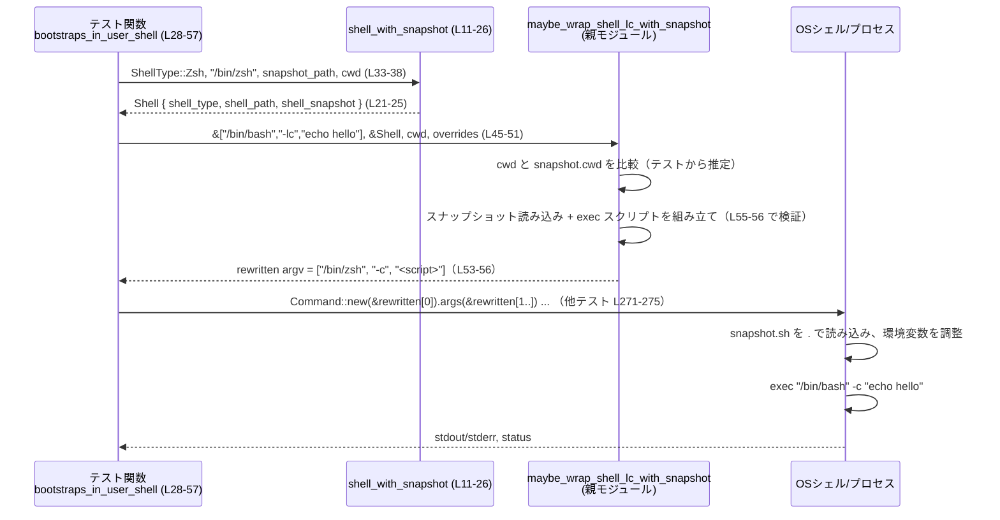

# core/src/tools/runtimes/mod_tests.rs 解説

## 0. ざっくり一言

`maybe_wrap_shell_lc_with_snapshot` 関数が、シェルの「スナップショット」スクリプトと環境変数の上書き情報を使ってコマンド行をどのようにラップするかを、各種ケース（カレントディレクトリ・クォート・環境変数の優先順位・秘匿性）で検証するテストモジュールです（mod_tests.rs:L28-481）。

※ 行番号はこのチャンク先頭を L1 とした相対番号です。

---

## 1. このモジュールの役割

### 1.1 概要

- このモジュールは、親モジュール（`super::*` 経由）に定義された `maybe_wrap_shell_lc_with_snapshot` と `Shell` の挙動をテストします（mod_tests.rs:L1-3, L28 以降）。
- 問題設定は「ログインシェル `-lc` 経由で実行されるコマンドを、ユーザーのシェルとスナップショットスクリプトを用いて安全にラップし、環境変数の優先順位や秘匿性を保ったまま実行させる」ことです。
- テストは cwd の一致判定、シングルクォートを含むコマンドの再クォート、追加引数の伝播、各種環境変数の上書き／マスク／秘匿の挙動をカバーしています。

### 1.2 アーキテクチャ内での位置づけ

テストモジュールと関連コンポーネントの依存関係（このチャンク範囲）を図示します。

```mermaid
graph TD
    subgraph "core::tools::runtimes::mod_tests (L1-481)"
        MT[mod_tests.rs<br/>テスト群]
        Helper[shell_with_snapshot (L11-26)]
    end

    subgraph "core::tools::runtimes (親モジュール / super::*)"
        MW[maybe_wrap_shell_lc_with_snapshot<br/>(実装はこのチャンク外)]
        ShellT[Shell 型<br/>(shell_type, shell_path, shell_snapshot)]
    end

    subgraph "crate"
        ST[crate::shell::ShellType<br/>enum シェル種別 (L2)]
        SS[crate::shell_snapshot::ShellSnapshot<br/>スナップショット情報 (L3, L17-20)]
    end

    subgraph "外部クレート / 標準ライブラリ"
        Tmp[tempfile::tempdir (L8)]
        Watch[tokio::sync::watch::channel (L9, L17)]
        Cmd[std::process::Command (L6, L271-275, L311-315, L348-351, L385-389, L431-435, L475-479)]
    end

    MT --> Helper
    MT --> MW
    Helper --> ShellT
    Helper --> ST
    Helper --> SS
    MT --> ST
    MT --> SS
    MT --> Tmp
    MT --> Watch
    MT --> Cmd
```

- `mod_tests` は **親モジュールの公開 API (`maybe_wrap_shell_lc_with_snapshot`, `Shell`) の利用者** という立場で振る舞い、その期待仕様を定義しています。
- 実際のシェル起動には `std::process::Command` が使われ、テスト内で実際にシェルを起動することでシナリオを検証しています（例: mod_tests.rs:L271-281）。

### 1.3 設計上のポイント

コードから読み取れるテスト設計上の特徴です。

- **小さなヘルパーで `Shell` を構築**
  - `shell_with_snapshot` が `Shell` と `ShellSnapshot` を一度に組み立て、各テストで同じパターンを再利用しています（mod_tests.rs:L11-26）。
- **各テストは一つの振る舞いにフォーカス**
  - テスト名と中身が 1:1 で対応しており、クォート、cwd、一部の環境変数など、関心ごとを分離しています。
- **実プロセスを使ったエンドツーエンド検証**
  - 単に文字列を比較するだけでなく、`Command` でシェルを実際に起動し、環境変数の最終値を検証しています（mod_tests.rs:L271-281 など）。
- **Rust の並行原語の最低限利用**
  - `tokio::sync::watch::channel` によって `ShellSnapshot` を `Arc` 経由で配布可能な形にしています（mod_tests.rs:L17-20）。テストは単一スレッドで動きますが、本番コードは watch を通じてスナップショットの更新を監視できる設計であることが示唆されます。
- **セキュリティ意識**
  - API キーなどの秘密情報が argv 文字列内（=プロセスリストから見える）に埋め込まれないことを明示的にテストしています（mod_tests.rs:L395-440）。

---

## 2. 主要な機能一覧（テストが検証している振る舞い）

このファイルはテスト専用ですが、実質的には `maybe_wrap_shell_lc_with_snapshot` の仕様ドキュメントになっています。

- シェルのブートストラップ:
  - `-lc` 付きのコマンドを、ユーザーのシェル + スナップショット経由で実行するようにラップする（mod_tests.rs:L28-57）。
- シングルクォートのエスケープ:
  - コマンド文字列に `'` を含む場合でも、ラップ後のスクリプトが崩れないように適切にクォートし直す（mod_tests.rs:L59-85）。
- ユーザーシェル種別に応じたブートストラップ:
  - セッションシェルが `Zsh`/`Bash`/`Sh` のいずれであっても、そのシェルをブートストラップに使用する（mod_tests.rs:L87-147）。
- 追加引数の保持:
  - `-lc` の後ろに続く追加引数（`$0`, `$1` に渡るもの）を、ラップ後も正しく伝播させる（mod_tests.rs:L149-180）。
- cwd によるスナップショット適用条件:
  - コマンドの cwd がスナップショットの cwd と一致する時だけラップし、異なる場合は元のコマンドをそのまま返す（mod_tests.rs:L182-208）。
  - `.` を含むような cwd エイリアスも正しく解決する（mod_tests.rs:L210-240）。
- 環境変数の優先順位:
  - スナップショットが設定した値 vs. 明示的なオーバーライド環境変数（ユーザー指定）を、オーバーライド優先にする（mod_tests.rs:L242-282）。
  - スナップショットが設定した `CODEX_THREAD_ID` を、呼び出し元の環境から渡された値で上書きして保持する（mod_tests.rs:L284-319）。
  - `PATH` の扱いについて、オーバーライドがなければスナップショットの値を保ち、オーバーライドがあればそちらを優先する（mod_tests.rs:L321-355, L357-393）。
- 環境変数の秘匿性:
  - `OPENAI_API_KEY` のような秘密情報は、argv 内の文字列にリテラル値として現れないようにしつつ、実行時の環境では正しい値を見えるようにする（mod_tests.rs:L395-440）。
- 明示的に「unset」された変数の扱い:
  - スナップショットが設定していても、呼び出し時の環境で unset にされていれば、最終的にも unset のままにする（mod_tests.rs:L443-481）。

---

## 3. 公開 API と詳細解説

このファイル自体は公開 API を定義していませんが、**テストから逆算できる `maybe_wrap_shell_lc_with_snapshot` の仕様**と、テストヘルパー関数を中心に説明します。

### 3.1 型一覧（このファイルで利用している主な型）

| 名前 | 種別 | 定義元 / 役割 / 用途 |
|------|------|----------------------|
| `Shell` | 構造体 | 親モジュール `super::*` からインポートされるシェル情報。`shell_with_snapshot` でフィールド `shell_type`, `shell_path`, `shell_snapshot` によって初期化されています（mod_tests.rs:L11-26）。 |
| `ShellType` | 列挙体 | `crate::shell::ShellType`。`Zsh` / `Bash` / `Sh` などのシェル種別を表現し、ブートストラップに使うシェルの選択に使用されます（mod_tests.rs:L2, L34, L64, L92, L123, L155, 他）。 |
| `ShellSnapshot` | 構造体 | `crate::shell_snapshot::ShellSnapshot`。`path`（スナップショットスクリプトのパス）と `cwd`（スナップショット適用対象の作業ディレクトリ）を保持します（mod_tests.rs:L3, L17-20）。 |
| `watch::Receiver<Option<Arc<ShellSnapshot>>>` 相当 | チャネル受信側 | `tokio::sync::watch::channel` の戻り値を `Shell` の `shell_snapshot` フィールドに格納していることから、スナップショットの更新通知を受け取るためのチャンネルであると分かります（mod_tests.rs:L17-20, L21-25）。 |
| `PathBuf` / `&Path` | 構造体 / 参照 | スナップショットファイルや cwd を表すファイルシステム上のパスとして利用されています（mod_tests.rs:L5, L14-15, L30-31, L187-188, ほか）。 |
| `Command` | 構造体 | `std::process::Command`。テスト内でラップ済みコマンドを実際に実行し、環境変数の最終値などを確認するために使われます（mod_tests.rs:L6, L271-275, L311-315, L348-351, L385-389, L431-435, L475-479）。 |

※ `Shell` の正確な型定義はこのチャンクには現れません。フィールド名は構造体リテラル（mod_tests.rs:L21-25）から読み取っています。

---

### 3.2 関数詳細（重要なもの）

#### `maybe_wrap_shell_lc_with_snapshot(...) -> Vec<String>`（仕様はテストからの推測）

> 実装は親モジュール側にあり、このファイルには定義がありません。ここでは **テストから読み取れる期待仕様** を整理します。

**概要**

- ログインシェル `-lc` 形式で渡されたコマンドライン（argv 形式の `Vec<String>`）を入力として、必要に応じてシェルスナップショットを経由するラッパーコマンドに書き換えます（mod_tests.rs:L28-57 他）。
- カレントディレクトリとスナップショットの `cwd` が一致する場合にのみラップを行い、それ以外は元の argv をそのまま返します（mod_tests.rs:L182-208）。
- 環境変数のスナップショット適用と、明示的オーバーライド／unset 状態を尊重しつつ、秘密値を argv に埋め込まないよう配慮します（mod_tests.rs:L242-282, L284-319, L321-355, L357-393, L395-440, L443-481）。

**引数（テストから推定される形）**

テストコードから、以下のようなシグネチャが推測できます（名前は説明用の便宜的なものです）。

| 引数名（仮） | 型（推定） | 説明 |
|-------------|------------|------|
| `command` | `&[String]` | 元のコマンドライン。先頭要素がシェルパス（例: `/bin/bash`）、2 要素目が `-lc`、3 要素目がシェルに渡すスクリプト、それ以降は `$0`, `$1`... に相当する追加引数と想定されます（mod_tests.rs:L39-43, L160-166, L194-197 など）。 |
| `session_shell` | `&Shell` | 現在のセッションシェル情報。どのシェルをブートストラップに使うか（`Zsh`/`Bash`/`Sh`）と、スナップショット（パスと cwd）へのアクセスを提供します（mod_tests.rs:L33-38, L92-97, L123-128, L154-159）。 |
| `command_cwd` | `&Path` | このコマンドを実行する際の作業ディレクトリ。スナップショットの `cwd` と一致する時だけラップが行われます（mod_tests.rs:L45-51, L199-205, L228-234）。 |
| `explicit_env_overrides` | `&HashMap<String,String>` | 「明示的に上書きしたい環境変数」の集合。テストでは `TEST_ENV_SNAPSHOT` や `PATH`、`OPENAI_API_KEY` などが含まれます（mod_tests.rs:L262-269, L377-383, L415-418, L463-466）。 |
| `env_from_parent`（仮） | `&HashMap<String,String>` | 呼び出し元のプロセスから引き継ぎたい環境値を表す情報。`CODEX_THREAD_ID` のような値の復元や、unset すべき変数の判定に使われていると解釈できます（mod_tests.rs:L305-310, L268-270, L383-384, L471-472）。 |

**戻り値**

- 型: `Vec<String>`
- 意味: 実際に `Command::new(&argv[0]).args(&argv[1..])` のように使われる argv（mod_tests.rs:L271-273 など）。
  - ラップされる場合:
    - `argv[0]` は `session_shell.shell_path`（例: `/bin/zsh`, `/bin/bash`, `/bin/sh`）になります（mod_tests.rs:L53, L112, L143, L236）。
    - `argv[1]` は `-c`（mod_tests.rs:L54, L113, L144, L237）。
    - `argv[2]` は「スナップショットを `. 'snapshot.sh'` で読み込み、その後 `exec '<元のシェル>' -c '<元のスクリプト>' ...` を呼ぶシェルスクリプト文字列」になります（mod_tests.rs:L55-56, L84, L114-115, L176-179）。
  - ラップされない場合: 元の `command` がそのまま返ります（mod_tests.rs:L207-208）。

**内部処理の流れ（テストから読み取れる部分的なアルゴリズム）**

テストコードを根拠にした、推定アルゴリズムです。

1. **ラップ対象の確認**
   - `command` の 2 要素目が `"-lc"` であるかを確認していると考えられます（全テストでその形式を渡していることからの推測）。
   - スナップショットが存在し、`session_shell.shell_snapshot` に `Some(Arc<ShellSnapshot { path, cwd }>)` が設定されている前提です（mod_tests.rs:L17-25, L30-38）。
2. **cwd の一致判定**
   - `ShellSnapshot.cwd` と `command_cwd` を比較し、一致しなければラップせずに `command` をそのまま返します（mod_tests.rs:L182-208）。
   - `.` を使った別表現（例: `dir.path().join(".")`）も同一ディレクトリとみなすため、何らかの形で正規化（canonicalize や `std::fs::canonicalize` 相当）をしていると推測されます（mod_tests.rs:L210-240）。
3. **ブートストラップシェルの決定**
   - `ShellType::Zsh` なら `/bin/zsh`、`ShellType::Bash` なら `/bin/bash`、`ShellType::Sh` なら `/bin/sh` というように、`session_shell.shell_path` をそのまま `argv[0]` に用いています（mod_tests.rs:L33-38, L92-97, L123-128, L154-159 と、対応する assert: L53-54, L112-113, L143-144, L236-237）。
4. **スナップショット読み込みと `exec` の組み立て**
   - `argv[2]` のスクリプトは、おおよそ次のような形（テスト中の `contains` からの推測）になります。
     - `if . '<snapshot_path>'; then ... fi` というガード付きの `. snapshot.sh`（mod_tests.rs:L55, L114, L145, L238）。
     - その後 `exec '<元のシェル>' -c '<元のスクリプト>' 'arg0' 'arg1' ...`（mod_tests.rs:L56, L115, L176-179）。
5. **クォート処理**
   - 元のスクリプト内にシングルクォートが含まれる場合、POSIX シェルで一般的な `'` の埋め込み方法（`'` を閉じて `"'"` を挟み、再度 `'` を開く）で再クォートしています（mod_tests.rs:L59-85）。
     - 例: `echo 'hello'` → `'echo '"'"'hello'"'"''`（mod_tests.rs:L84）。
6. **追加引数の保持**
   - `command[3..]` にある追加引数（例: `"arg0"`, `"arg1"`）を、`exec` 呼び出しの後ろに `'arg0' 'arg1'` のようにシングルクォート付きで連結しています（mod_tests.rs:L149-180）。
7. **環境変数の再設定 / マスク**
   - スナップショットスクリプトが `export VAR=...` しても、`explicit_env_overrides` および `env_from_parent` で指示された値・unset 状態を優先して復元するような処理を行っていると考えられます。
     - **明示的オーバーライド優先**: `TEST_ENV_SNAPSHOT` や `PATH` では、スナップショット内の値ではなくオーバーライド値が最終的に使われています（mod_tests.rs:L242-282, L357-393）。
     - **環境由来の値の維持**: `CODEX_THREAD_ID` は、スナップショットの `'parent-thread'` ではなく、実行時環境の `'nested-thread'` が使われています（mod_tests.rs:L284-319）。
     - **unset の維持**: `CODEX_TEST_UNSET_OVERRIDE` は、スナップショットが設定していても、呼び出し時に unset されていれば最終的にも unset のままです（mod_tests.rs:L443-481）。
8. **秘密値を argv に埋め込まない**
   - `OPENAI_API_KEY` のような値は、`argv[2]` のスクリプト文字列中にリテラルで現れず（mod_tests.rs:L430-431）、最終的な値は環境変数として渡されます（mod_tests.rs:L431-440）。
   - これは、プロセスリストなどから秘密値が漏洩するのを防ぐためのセキュリティ上の配慮です。

**Examples（使用例）**

テストコードを簡略化した使用例です。実際のシグネチャ名は不明ですが、パターンは以下の通りです。

```rust
use std::collections::HashMap;
use std::process::Command;
use std::path::Path;
use tokio::sync::watch;
use std::sync::Arc;

// Shell/ShellSnapshot/ShellType は親モジュール・他モジュールからインポートされている前提です。

fn run_in_snapshot_shell() -> std::io::Result<()> {
    // 一時ディレクトリとスナップショットスクリプトを用意する（mod_tests.rs:L30-32 相当）
    let dir = tempfile::tempdir()?;                           // 作業ディレクトリ
    let snapshot_path = dir.path().join("snapshot.sh");       // スナップショットファイルパス
    std::fs::write(&snapshot_path, "# Snapshot file\n")?;     // 内容は仮

    // ShellSnapshot を watch::channel でラップして Shell を構築（mod_tests.rs:L11-26）
    let (_tx, shell_snapshot) = watch::channel(Some(Arc::new(ShellSnapshot {
        path: snapshot_path.clone(),
        cwd: dir.path().to_path_buf(),
    })));
    let session_shell = Shell {
        shell_type: ShellType::Zsh,                           // 例として Zsh
        shell_path: "/bin/zsh".into(),                        // ブートストラップに使うシェル
        shell_snapshot,
    };

    // 元のコマンド（/bin/bash -lc "echo hello"）を作る（mod_tests.rs:L39-43）
    let command = vec![
        "/bin/bash".to_string(),
        "-lc".to_string(),
        "echo hello".to_string(),
    ];

    // オーバーライド環境変数。ここでは空（mod_tests.rs:L49-50 相当）
    let explicit_env_overrides: HashMap<String, String> = HashMap::new();
    let env_from_parent: HashMap<String, String> = HashMap::new();

    // もしかしたらスナップショットでラップされたコマンドに書き換えられる
    let rewritten = maybe_wrap_shell_lc_with_snapshot(
        &command,
        &session_shell,
        dir.path(),                                           // cwd が snapshot cwd と一致
        &explicit_env_overrides,
        &env_from_parent,
    );

    // 返ってきた argv で実際にコマンドを実行（mod_tests.rs:L271-275 相当）
    let output = Command::new(&rewritten[0])
        .args(&rewritten[1..])
        .output()?;

    assert!(output.status.success());
    println!("{}", String::from_utf8_lossy(&output.stdout));
    Ok(())
}
```

**Errors / Panics**

- 関数自体の戻り値は `Vec<String>` であり、`Result` ではないと推定されます（テストが `unwrap` や `expect` を挟まずに直接 `rewritten[..]` を参照しているため: mod_tests.rs:L53-56, L84, L112-115 など）。
- したがって、**関数内部でのエラーはパニックとして扱われている**か、あるいはエラーになりうる状況を内部で全て吸収している可能性がありますが、実装が見えないため詳細は不明です。
- テスト側では、以下の箇所で失敗時にパニックが発生します。
  - 一時ディレクトリ作成やファイル書き込みに失敗した場合の `expect("create temp dir")` / `expect("write snapshot")`（mod_tests.rs:L30-32 他）。
  - `Command::output()` が失敗した場合の `expect("run rewritten command")`（mod_tests.rs:L271-275 他）。

**Edge cases（エッジケース）**

テストから分かる代表的なエッジケースと挙動です。

- **cwd 不一致**（mod_tests.rs:L182-208）
  - snapshot の `cwd` と `command_cwd` が異なる場合、`maybe_wrap_shell_lc_with_snapshot` は **元の `command` をそのまま返す**。
- **cwd に `.` を含むエイリアス**（mod_tests.rs:L210-240）
  - `dir.path()` と `dir.path().join(".")` のような表現の違いは同一とみなし、ラップが適用される。
- **シングルクォートを含むスクリプト**（mod_tests.rs:L59-85）
  - `echo 'hello'` を含むスクリプトでも、ラップ後のシェルスクリプトが壊れないように再クォートされる。
- **追加引数の有無**（mod_tests.rs:L149-180）
  - `$0`, `$1` に対応する追加引数がある場合、それらは `exec` 呼び出しにシングルクォート付きで保持される。
- **スナップショット内で設定された PATH**（mod_tests.rs:L321-355, L357-393）
  - オーバーライドが無い場合はスナップショットの PATH を使い、オーバーライドがあればそちらを優先する。
- **秘密値の扱い**（mod_tests.rs:L395-440）
  - `OPENAI_API_KEY` のような値は、argv に含まれず、環境変数としてのみ使われる。
- **unset された環境変数**（mod_tests.rs:L443-481）
  - オーバーライドセットに存在しても、呼び出し環境で unset されていることが分かる場合、スナップショットで設定されても最終的には unset になる。

**使用上の注意点（期待される契約）**

テストから読める前提条件・注意点をまとめます。

- **前提条件**
  - `command` は `[shell_path, "-lc", script, ...]` 形式であることが期待されています。その他の形式への挙動はテストされていません。
  - `session_shell.shell_snapshot` には `Some(Arc<ShellSnapshot { path, cwd }>)` が入っている必要があります（mod_tests.rs:L17-20）。
  - `command_cwd` は、スナップショットの `cwd` と比較して意味のあるパス（実在ディレクトリ）であるべきです（mod_tests.rs:L187-190）。
- **禁止／避けるべきこと（推奨）**
  - 秘密情報（API キーなど）を `script` 文字列に直接埋め込むことは、このモジュールの想定外です。テストは「override 値を argv に埋め込まない」ことを前提にしており（mod_tests.rs:L430-431）、秘密は環境変数経由で渡す設計になっています。
- **セキュリティ上のポイント**
  - argv はプロセスリスト等から観測される可能性があるため、秘密値を埋め込まない設計が必須です（mod_tests.rs:L395-440）。
  - スナップショットスクリプト内で `export VAR=...` されていても、呼び出し元が unset を意図している場合それを尊重することで、予期しない環境リークを避けています（mod_tests.rs:L443-481）。
- **並行性関連**
  - スナップショットは `tokio::sync::watch` と `Arc` に包まれており、複数スレッド／タスクから共有されることを想定した設計です（mod_tests.rs:L17-20）。
  - テストでは送信側 `_tx` を破棄しているため、スナップショットは固定の `Some(...)` のまま変化しません。

---

#### `fn shell_with_snapshot(shell_type: ShellType, shell_path: &str, snapshot_path: PathBuf, snapshot_cwd: PathBuf) -> Shell`（mod_tests.rs:L11-26）

**概要**

- テスト用のヘルパー関数です。指定されたシェル種別・パスと、スナップショットファイル・cwd を持つ `Shell` インスタンスを作成します。

**引数**

| 引数名 | 型 | 説明 |
|--------|----|------|
| `shell_type` | `ShellType` | セッションシェルの種別（例: `ShellType::Zsh`）（mod_tests.rs:L12, L34, L64, L92, L123, L155）。 |
| `shell_path` | `&str` | 実際に使用するシェルのパス（例: `/bin/zsh`, `/bin/bash`, `/bin/sh`）（mod_tests.rs:L13, L35, L66, L94, L125, L156）。 |
| `snapshot_path` | `PathBuf` | スナップショットスクリプトのパス（mod_tests.rs:L14, L31-32）。 |
| `snapshot_cwd` | `PathBuf` | スナップショットが対象とする cwd（mod_tests.rs:L15, L37-38）。 |

**戻り値**

- `Shell`
  - フィールド:
    - `shell_type`: 引数そのまま（mod_tests.rs:L22）。
    - `shell_path`: `PathBuf::from(shell_path)` で変換されたパス（mod_tests.rs:L23）。
    - `shell_snapshot`: `watch::Receiver<Option<Arc<ShellSnapshot>>>` のような受信側。初期値として `Some(Arc::new(ShellSnapshot { path, cwd }))` を持ちます（mod_tests.rs:L17-20, L24-25）。

**内部処理の流れ**

1. `tokio::sync::watch::channel` で `(Sender, Receiver)` を作成し、初期値として `Some(Arc<ShellSnapshot { path: snapshot_path, cwd: snapshot_cwd }>)` を設定します（mod_tests.rs:L17-20）。
2. 送信側 `_tx` は使わないので変数名に `_` を付けています（mod_tests.rs:L17）。
3. 構造体リテラルで `Shell` を組み立て、返します（mod_tests.rs:L21-25）。

**Examples（使用例）**

テスト内での典型的な使い方です。

```rust
let dir = tempdir().expect("create temp dir");                 // 一時ディレクトリ
let snapshot_path = dir.path().join("snapshot.sh");            // スナップショットのパス
std::fs::write(&snapshot_path, "# Snapshot file\n")
    .expect("write snapshot");                                 // スナップショットを書き出す

// Zsh セッションシェルを表す Shell を構築（mod_tests.rs:L33-38）
let session_shell = shell_with_snapshot(
    ShellType::Zsh,
    "/bin/zsh",
    snapshot_path,
    dir.path().to_path_buf(),
);
```

**Errors / Panics**

- `shell_with_snapshot` 自体は `Result` を返さず、`watch::channel` もパニックしない前提の API なので、通常はエラーを返しません。
- スナップショットパス／cwd は `PathBuf` としてそのまま保持されるので、存在チェック等はここでは行われません（テスト側が前もって作成しています: mod_tests.rs:L30-32）。

**Edge cases**

- `snapshot_path`, `snapshot_cwd` が不正なパスであっても、ここではエラーにならず、そのまま Shell に格納されます。
- `_tx` を保持していないため、この関数で作られた `Shell` の `shell_snapshot` は更新されることなく固定のままです。

**使用上の注意点**

- テスト用ヘルパーとして `mod_tests` 内でのみ使用されており、本番コードでの使用は想定されていません。
- watch チャネルの送信側 `_tx` を保持していないため、実運用のコードでスナップショットを更新したい場合は、別経路で `Sender` を管理する必要があります。

---

#### `fn maybe_wrap_shell_lc_with_snapshot_preserves_trailing_args()`（mod_tests.rs:L149-180）

**概要**

- `-lc` に続く追加引数（`$0`, `$1` に対応するもの）が、ラップ後のコマンドでも正しく保持されることを検証するテストです。

**内部処理のポイント**

- `command` は `["/bin/bash", "-lc", "printf '%s %s' \"$0\" \"$1\"", "arg0", "arg1"]` という形で渡されています（mod_tests.rs:L160-166）。
- ラップ後の `rewritten[2]` に、以下のような文字列が含まれることを確認しています（mod_tests.rs:L176-179）。
  - `exec '/bin/bash' -c 'printf '"'"'%s %s'"'"' "$0" "$1"' 'arg0' 'arg1'`
  - ここから、元スクリプトと追加引数 `arg0`, `arg1` が `exec` にそのまま渡されていることが分かります。

**Edge cases / 契約**

- `$0`, `$1` などポジショナルパラメータを使用するスクリプトでも、スナップショットラップによって意味が変わらないことが期待されています。

---

#### `fn maybe_wrap_shell_lc_with_snapshot_restores_explicit_override_precedence()`（mod_tests.rs:L242-282）

**概要**

- スナップショット内で `TEST_ENV_SNAPSHOT=global` が設定されていても、明示的なオーバーライド値 `worktree` が最終的に優先されることを検証するテストです。

**処理の流れのポイント**

1. スナップショットスクリプトにて（mod_tests.rs:L246-249）:
   - `export TEST_ENV_SNAPSHOT=global`
   - `export SNAPSHOT_ONLY=from_snapshot`
2. `explicit_env_overrides` と `env_from_parent` の両方に `TEST_ENV_SNAPSHOT=worktree` を渡します（mod_tests.rs:L262-270）。
3. ラップされたコマンドで、`printf '%s|%s' "$TEST_ENV_SNAPSHOT" "${SNAPSHOT_ONLY-unset}"` を実行し（mod_tests.rs:L257-261）、`Command` で環境にも `TEST_ENV_SNAPSHOT=worktree` を設定します（mod_tests.rs:L271-274）。
4. 出力は `"worktree|from_snapshot"` であることが期待されます（mod_tests.rs:L278-281）。

**契約**

- 「ユーザーが意図して上書きした環境変数」は、スナップショットスクリプトの内容よりも常に優先されるべき、という仕様がテストされています。

---

#### `fn maybe_wrap_shell_lc_with_snapshot_does_not_embed_override_values_in_argv()`（mod_tests.rs:L395-440）

**概要**

- `OPENAI_API_KEY` のような秘密値が、ラップ後の argv 中にリテラル値として含まれないことをテストします。

**ポイント**

- スナップショットには `export OPENAI_API_KEY='snapshot-value'` が含まれます（mod_tests.rs:L399-402）。
- `explicit_env_overrides` / `env_from_parent` には `OPENAI_API_KEY="super-secret-value"` を渡します（mod_tests.rs:L415-418, L419-427）。
- `rewritten[2]` が `"super-secret-value"` を含まないことを `assert!(!rewritten[2].contains("super-secret-value"));` で確認します（mod_tests.rs:L430-431）。
- 実際にコマンドを実行すると、標準出力に `"super-secret-value"` が出力されます（mod_tests.rs:L431-440）。

**セキュリティ上の契約**

- 秘密の環境変数値は **環境変数としてのみ渡され**, argv やスナップショットスクリプト文字列には埋め込まれないことが要求されています。

---

#### `fn maybe_wrap_shell_lc_with_snapshot_preserves_unset_override_variables()`（mod_tests.rs:L443-481）

**概要**

- スナップショットが `export CODEX_TEST_UNSET_OVERRIDE='snapshot-value'` を行っていても、呼び出し時に unset されるべき変数は最終的に unset のままになることを検証するテストです。

**ポイント**

1. スナップショットスクリプト（mod_tests.rs:L447-450）:
   - `export CODEX_TEST_UNSET_OVERRIDE='snapshot-value'`
2. `explicit_env_overrides` には `CODEX_TEST_UNSET_OVERRIDE="worktree-value"` を渡しつつ（mod_tests.rs:L463-466）、`env_from_parent` には空の `HashMap` を渡します（mod_tests.rs:L471-472）。
3. 実行時に `Command` に対して `.env_remove("CODEX_TEST_UNSET_OVERRIDE")` を呼び、環境から明示的に削除します（mod_tests.rs:L475-477）。
4. スクリプトは「変数がセットされていれば `set:<値>`、そうでなければ `unset`」と出力します（mod_tests.rs:L458-462）。
5. 期待される出力は `"unset"` です（mod_tests.rs:L480-481）。

**契約**

- 「呼び出し側で unset を意図した変数」は、スナップショットによって再度セットされてはならない、という仕様がテストされています。

---

### 3.3 その他の関数（テストケース一覧）

テスト関数とその役割の一覧です。

| 関数名 | 役割（1 行） | 根拠 |
|--------|--------------|------|
| `maybe_wrap_shell_lc_with_snapshot_bootstraps_in_user_shell` | Zsh セッションシェル上で、`/bin/bash -lc "echo hello"` がスナップショット経由でラップされることを検証（mod_tests.rs:L28-57）。 | mod_tests.rs:L28-57 |
| `maybe_wrap_shell_lc_with_snapshot_escapes_single_quotes` | シングルクォートを含むスクリプトのクォートが正しくエスケープされることを検証（mod_tests.rs:L59-85）。 | mod_tests.rs:L59-85 |
| `maybe_wrap_shell_lc_with_snapshot_uses_bash_bootstrap_shell` | セッションシェルが Bash の場合に `/bin/bash` がブートストラップに使われることを検証（mod_tests.rs:L87-116）。 | mod_tests.rs:L87-116 |
| `maybe_wrap_shell_lc_with_snapshot_uses_sh_bootstrap_shell` | セッションシェルが Sh の場合に `/bin/sh` がブートストラップに使われることを検証（mod_tests.rs:L118-147）。 | mod_tests.rs:L118-147 |
| `maybe_wrap_shell_lc_with_snapshot_preserves_trailing_args` | `-lc` の後ろに続く追加引数が保持されることを検証（mod_tests.rs:L149-180）。 | mod_tests.rs:L149-180 |
| `maybe_wrap_shell_lc_with_snapshot_skips_when_cwd_mismatch` | スナップショット cwd とコマンド cwd が異なる場合にラップを行わないことを検証（mod_tests.rs:L182-208）。 | mod_tests.rs:L182-208 |
| `maybe_wrap_shell_lc_with_snapshot_accepts_dot_alias_cwd` | `dir` と `dir/.` のような cwd エイリアスでもラップが適用されることを検証（mod_tests.rs:L210-240）。 | mod_tests.rs:L210-240 |
| `maybe_wrap_shell_lc_with_snapshot_restores_explicit_override_precedence` | 明示的オーバーライド環境変数がスナップショットより優先されることを検証（mod_tests.rs:L242-282）。 | mod_tests.rs:L242-282 |
| `maybe_wrap_shell_lc_with_snapshot_restores_codex_thread_id_from_env` | `CODEX_THREAD_ID` がスナップショットではなく実行時環境の値を保持することを検証（mod_tests.rs:L284-319）。 | mod_tests.rs:L284-319 |
| `maybe_wrap_shell_lc_with_snapshot_keeps_snapshot_path_without_override` | PATH オーバーライドが無い場合はスナップショットの PATH が使われることを検証（mod_tests.rs:L321-355）。 | mod_tests.rs:L321-355 |
| `maybe_wrap_shell_lc_with_snapshot_applies_explicit_path_override` | 明示的な PATH オーバーライドがある場合はそれが優先されることを検証（mod_tests.rs:L357-393）。 | mod_tests.rs:L357-393 |
| `maybe_wrap_shell_lc_with_snapshot_does_not_embed_override_values_in_argv` | 上書き環境変数の値が argv 文字列に埋め込まれないことを検証（mod_tests.rs:L395-440）。 | mod_tests.rs:L395-440 |
| `maybe_wrap_shell_lc_with_snapshot_preserves_unset_override_variables` | unset とされるべき環境変数がスナップショットにより復活しないことを検証（mod_tests.rs:L443-481）。 | mod_tests.rs:L443-481 |

---

## 4. データフロー

代表的なシナリオとして、`maybe_wrap_shell_lc_with_snapshot_bootstraps_in_user_shell` の流れを説明します（mod_tests.rs:L28-57）。

1. テストは一時ディレクトリと `snapshot.sh` を生成します（mod_tests.rs:L30-32）。
2. `shell_with_snapshot` で `ShellType::Zsh` / `/bin/zsh` / `snapshot.sh` / `cwd = dir` の `Shell` を作成します（mod_tests.rs:L33-38）。
3. 元のコマンド `["/bin/bash", "-lc", "echo hello"]` を用意します（mod_tests.rs:L39-43）。
4. `maybe_wrap_shell_lc_with_snapshot` を呼び、返ってきた `rewritten` を検証します（mod_tests.rs:L45-56）。
5. 他のテストでは、この `rewritten` を `Command::new` に渡して実行し、環境変数の最終値を確認します（mod_tests.rs:L271-281 など）。

この流れを sequence diagram で表します。



---

## 5. 使い方（How to Use）

### 5.1 基本的な使用方法

テストコードと同様のパターンで、`maybe_wrap_shell_lc_with_snapshot` を使ってコマンドをラップし、実行する例です。

```rust
use std::collections::HashMap;
use std::process::Command;

// session_shell と maybe_wrap_shell_lc_with_snapshot は親モジュールからインポートされている前提。

fn run_command_with_snapshot(session_shell: &Shell) -> std::io::Result<()> {
    // 実行したいコマンド（/bin/bash -lc "echo hello"）
    let command = vec![
        "/bin/bash".to_string(),
        "-lc".to_string(),
        "echo hello".to_string(),
    ];

    // cwd はスナップショットの cwd と一致している必要がある（mod_tests.rs:L30-38）
    let cwd = std::env::current_dir()?;

    // 明示的な環境変数オーバーライド（ここでは PATH のみ）
    let explicit_env_overrides = HashMap::from([(
        "PATH".to_string(),
        "/worktree/bin".to_string(),
    )]);

    // 呼び出し元の環境から引き継ぐ値（テストでは explicit_env_overrides と同じものを渡すケースが多い）
    let env_from_parent = explicit_env_overrides.clone();

    // コマンドをラップするかどうかを maybe_wrap_shell_lc_with_snapshot に任せる
    let argv = maybe_wrap_shell_lc_with_snapshot(
        &command,
        session_shell,
        &cwd,
        &explicit_env_overrides,
        &env_from_parent,
    );

    // 返ってきた argv を使って実行
    let output = Command::new(&argv[0])
        .args(&argv[1..])
        .envs(&env_from_parent)              // PATH などのオーバーライドを環境に適用
        .output()?;

    if !output.status.success() {
        eprintln!("command failed: {:?}", output);
    }
    println!("{}", String::from_utf8_lossy(&output.stdout));
    Ok(())
}
```

### 5.2 よくある使用パターン

1. **特定 worktree 用 PATH を適用してコマンドを実行する**
   - `maybe_wrap_shell_lc_with_snapshot_applies_explicit_path_override` のテストと同じパターンです（mod_tests.rs:L357-393）。
   - worktree ごとに PATH を切り替えたい場合、`explicit_env_overrides` で PATH を指定してラップさせることで、スナップショットの PATH より優先させることができます。

2. **スナップショットのみで環境を構築する**
   - `maybe_wrap_shell_lc_with_snapshot_keeps_snapshot_path_without_override` のように、`explicit_env_overrides` を空にすると、スナップショットで設定された PATH やその他の環境変数がそのまま使われます（mod_tests.rs:L321-355）。

3. **ネストしたセッションでスレッド ID などを上書きする**
   - `maybe_wrap_shell_lc_with_snapshot_restores_codex_thread_id_from_env` では、親スナップショットと異なる `CODEX_THREAD_ID` を「ネストしたセッション」から渡し、その値が保持されることを確認しています（mod_tests.rs:L284-319）。

### 5.3 よくある間違い

テストから見える「やってはいけない」パターンと、正しいパターンです。

```rust
use std::process::Command;

// 間違い例: 秘密値をスクリプト文字列に直接埋め込む
let command = vec![
    "/bin/bash".to_string(),
    "-lc".to_string(),
    "printf '%s' 'super-secret-value'".to_string(), // ← これだと argv に秘密が現れる
];

// 正しい例: 秘密値は環境変数で渡し、スクリプトでは "$OPENAI_API_KEY" を参照する
let command = vec![
    "/bin/bash".to_string(),
    "-lc".to_string(),
    "printf '%s' \"$OPENAI_API_KEY\"".to_string(),   // mod_tests.rs:L410-414 参照
];

let explicit_env_overrides = HashMap::from([(
    "OPENAI_API_KEY".to_string(),
    "super-secret-value".to_string(),
)]);
let env_from_parent = explicit_env_overrides.clone();

let argv = maybe_wrap_shell_lc_with_snapshot(
    &command,
    &session_shell,
    cwd,
    &explicit_env_overrides,
    &env_from_parent,
);

// argv[2] に "super-secret-value" が含まれていないことがテストで保証されている（mod_tests.rs:L430-431）
let output = Command::new(&argv[0])
    .args(&argv[1..])
    .env("OPENAI_API_KEY", "super-secret-value")
    .output()?;
```

### 5.4 使用上の注意点（まとめ）

- cwd がスナップショットの cwd と異なる場合、ラップは行われず、元のコマンドがそのまま実行されます（mod_tests.rs:L182-208）。
- `.` などの cwd エイリアスは正規化される前提ですが、パスが指しているディレクトリが本当に同一かどうかは呼び出し側できちんと意識する必要があります（mod_tests.rs:L210-240）。
- 明示的なオーバーライドや unset を意図した変数は、適切に `explicit_env_overrides` / `env_from_parent` を構成することで、スナップショットより優先させたりマスクしたりできます（mod_tests.rs:L242-282, L443-481）。
- 秘密の環境変数は必ず環境で渡し、コマンド文字列（argv）に埋め込まないことが前提です（mod_tests.rs:L395-440）。

---

## 6. 変更の仕方（How to Modify）

このファイルはテスト専用なので、「テストをどう拡張・修正するか」という観点で説明します。

### 6.1 新しい機能を追加する場合

`maybe_wrap_shell_lc_with_snapshot` に新しい仕様を追加する際に、どのようにテストを追加するかです。

1. **シナリオを明確にする**
   - 例: 新しい環境変数の優先順位ルールを追加する、特定のシェルフラグに対応する、など。
2. **一時ディレクトリ・スナップショットの準備**
   - 既存のテストと同様に `tempdir` と `std::fs::write` を使いスクリプトを作成します（mod_tests.rs:L30-32, L90-91 など）。
3. **`shell_with_snapshot` で `Shell` を作成**
   - 必要に応じて `ShellType` / パスを指定します（mod_tests.rs:L33-38, L92-97 など）。
4. **入力コマンドとオーバーライドマップを構築**
   - 新仕様に関係する環境変数や引数を `HashMap::from` などで用意します（mod_tests.rs:L262-269, L377-383, L415-418, L463-466）。
5. **`maybe_wrap_shell_lc_with_snapshot` を呼び出す**
   - ラップされた argv を検査するか、`Command` で実際に実行するかを選びます。
6. **期待される挙動を `assert_eq!` / `assert!` で明示**
   - 既存のテスト命名規則（`maybe_wrap_shell_lc_with_snapshot_〜`）に従うと分かりやすくなります。

### 6.2 既存の機能を変更する場合

`maybe_wrap_shell_lc_with_snapshot` の実装を変更する際に、影響範囲を確認するポイントです。

- **環境変数の契約**
  - `TEST_ENV_SNAPSHOT`, `SNAPSHOT_ONLY`, `CODEX_THREAD_ID`, `PATH`, `OPENAI_API_KEY`, `CODEX_TEST_UNSET_OVERRIDE` など、テストで明示的に使われている環境変数の扱いが変わらないか要確認です（mod_tests.rs:L246-249, L290-291, L327-328, L362-363, L400-402, L448-450）。
- **cwd 判定ロジック**
  - `worktree-a` と `worktree-b` のような異なるディレクトリでラップしない挙動、および `.` を含むパスでもラップする挙動は、変更時に壊れやすい部分です（mod_tests.rs:L182-208, L210-240）。
- **クォート処理**
  - シングルクォートのエスケープはシェル依存でバグが入りやすいので、`maybe_wrap_shell_lc_with_snapshot_escapes_single_quotes` を必ず通す必要があります（mod_tests.rs:L59-85）。
- **秘密情報の露出**
  - 実装変更で、オーバーライド値が argv に埋め込まれてしまうようなロジックになっていないかを `maybe_wrap_shell_lc_with_snapshot_does_not_embed_override_values_in_argv` で確認します（mod_tests.rs:L395-440）。

---

## 7. 関連ファイル

このモジュールと密接に関係すると思われるファイル・モジュールです。

| パス / モジュール | 役割 / 関係 |
|------------------|------------|
| `super`（親モジュール、具体的なファイル名はこのチャンクには現れません） | `maybe_wrap_shell_lc_with_snapshot` 関数および `Shell` 構造体を定義しているモジュール。`use super::*;` からの推測です（mod_tests.rs:L1）。 |
| `crate::shell` | `ShellType` 列挙体を定義するモジュール（mod_tests.rs:L2）。 |
| `crate::shell_snapshot` | `ShellSnapshot` 構造体を定義するモジュール（mod_tests.rs:L3）。 |
| `tempfile` クレート | テスト用の一時ディレクトリを作成するために使用（mod_tests.rs:L8, L30, L89, L120, ほか）。 |
| `tokio::sync::watch` | シェルスナップショットを `watch::channel` で配布可能にするために使用（mod_tests.rs:L9, L17-20）。 |
| `pretty_assertions` | `assert_eq!` の差分表示を改善するテスト用クレート（mod_tests.rs:L4, L53-54 など）。 |

このファイルは、`maybe_wrap_shell_lc_with_snapshot` の仕様をかなり詳細にカバーしており、実装を読む前にテストを読むことで期待される契約（特に環境変数とセキュリティまわり）を理解しやすい構成になっています。
