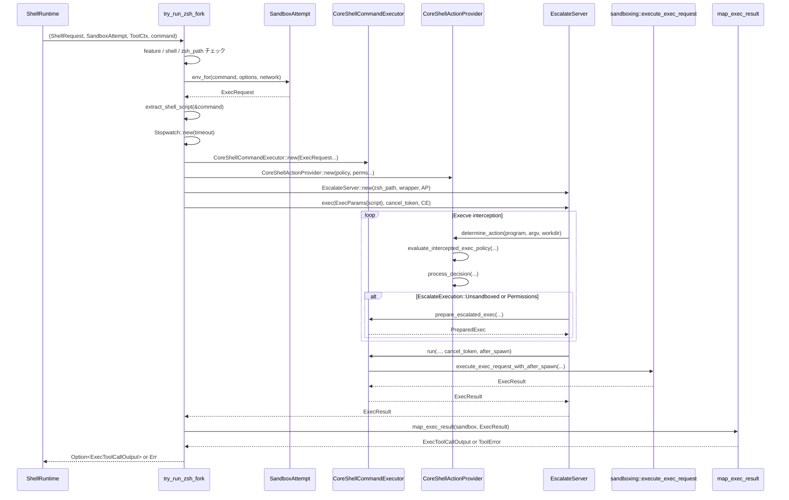

# core/src/tools/runtimes/shell/unix_escalation.rs コード解説

※ 行番号は、この回答内に貼られているソースの先頭行を 1 行目とした **ローカル行番号** です。実リポジトリの行番号と数行程度ずれる可能性がありますが、ここでは `unix_escalation.rs:L開始-L終了` という形式で根拠を示します。

---

## 0. ざっくり一言

- Zsh ベースの「zsh-fork」バックエンドでシェルコマンドを実行するときに、  
  **サンドボックス／権限エスカレーションのポリシー評価・ユーザ承認・実行プロセス起動** を仲介するモジュールです。

---

## 1. このモジュールの役割

### 1.1 概要

- このモジュールは、シェルツール実行時に **「通常サンドボックス実行」「追加権限付きサンドボックス」「完全に unsandboxed」** のどれで走らせるかを、ポリシーとユーザ承認に基づき判断し、`EscalateServer` 経由で実行します。
- また、統一実行ランタイム（unified exec）用に、`zsh-fork` バックエンドの事前準備（環境変数の追加・エスカレーションセッション開始）も行います。
- 実行結果（タイムアウト・サンドボックス拒否など）を `ToolError` / `CodexErr` に正規化して上位に返します。

### 1.2 アーキテクチャ内での位置づけ

`try_run_zsh_fork` を中心とした依存関係を簡略化すると次のようになります。

```mermaid
flowchart LR
    subgraph ToolsRuntime["Shell runtime (このモジュール)"]
      TR[try_run_zsh_fork]:::pub
      PREP[prepare_unified_exec_zsh_fork]:::pub
      AP[CoreShellActionProvider]
      EX[C.CoreShellCommandExecutor]
    end

    SR[ShellRequest] --> TR
    SAT[SandboxAttempt] --> TR
    CTX[ToolCtx] --> TR

    TR -->|build_sandbox_command| BSC[tools::runtimes::build_sandbox_command]
    TR -->|env_for| ENV[SandboxAttempt::env_for]
    TR -->|policy RwLock| POL[exec_policy::Policy]
    TR -->|ExecResult| MAP[map_exec_result]

    TR -->|EscalationPolicy, ShellCommandExecutor| ESC[EscalateServer]
    PREP --> ESC

    AP -->|determine_action| ESC
    EX -->|run / prepare_escalated_exec| ESC

    subgraph Policy
      CP[exec_policy::Policy]
      EVAL[evaluate_intercepted_exec_policy]
    end

    AP --> EVAL
    CP -.shared RwLock.-> AP

    subgraph Guardian
      GREQ[GuardianApprovalRequest]
      GDEC[ReviewDecision]
    end

    AP -->|prompt| GREQ
    GDEC --> AP

    classDef pub fill=#eef,stroke=#00a,stroke-width=1.5px;
```

- `EscalateServer`（外部クレート）が **execve インターセプトとエスカレーション制御** を提供し、本モジュールはそこに渡す **ポリシー (`EscalationPolicy`) 実装と実行器 (`ShellCommandExecutor`)** を実装しています。
- exec-policy (`codex_execpolicy::Policy`) と guardian（ユーザ承認フロー）は、このモジュール内で束ねられます。

### 1.3 設計上のポイント

- **責務分割**
  - `try_run_zsh_fork` / `prepare_unified_exec_zsh_fork` が **外部から見た主要エントリポイント** です（`pub(crate)`）。  
  - `CoreShellActionProvider` が **ポリシー評価とユーザ承認 → EscalationDecision** を担当します。
  - `CoreShellCommandExecutor` が **実際の sandboxed / unsandboxed プロセス起動** を担当します。
- **状態管理**
  - exec-policy (`Policy`) は `Arc<RwLock<Policy>>` で共有され、多数のコマンドから非同期に読み取られます（`unix_escalation.rs:L145-L147`, `L296-L299`, `L537-L551`）。
  - `Stopwatch` はタイムアウト・キャンセル管理に使用されます（`L180-L185`, `L309`, `L378-L385`）。
- **エラーハンドリング方針**
  - 外部向けには `Result<_, ToolError>` を返し、内部では `anyhow::Result<_>` でラップしてから `ToolError::Rejected` にマップする箇所があります（`L211-L215`, `L285-L287`）。
  - サンドボックス実行結果は `map_exec_result` でタイムアウトや sandbox deny に応じて `CodexErr::Sandbox` に変換します（`L923-L950`）。
- **並行性**
  - Tokio の `async` / `await` と `CancellationToken` を用いて、実行中コマンドのキャンセルをサポートします（`L183-L185`, `L709-L718`, `L734-L735`）。
  - `RwLock` は `determine_action` 内で読みロック取得後に即座にポリシー評価に使われ、`await` をまたいでロック保持しないようになっています（`L537-L552`）。

### 1.4 コンポーネント一覧（型・関数インベントリ）

#### 型一覧

| 名前 | 種別 | 役割 / 用途 | 行範囲 |
|------|------|-------------|--------|
| `PreparedUnifiedExecZshFork` | 構造体 | unified exec 向けに、変換済み `ExecRequest` と `EscalationSession` をまとめるラッパー | `unix_escalation.rs:L65-L68` |
| `CoreShellActionProvider` | 構造体 | `EscalationPolicy` 実装。exec-policy, guardian, sandbox 設定を束ねて EscalationDecision を決定 | `L296-L310` |
| `DecisionSource` | enum | ポリシー評価が prefix rules によるものか、フォールバックかを区別 | `L312-L317` |
| `PromptDecision` | 構造体 | guardian / セッション承認の結果と review ID を保持 | `L319-L322` |
| `InterceptedExecPolicyContext<'a>` | 構造体 | exec-policy 評価時に使うコンテキスト（承認ポリシー、sandboxポリシーなど） | `L639-L645` |
| `CandidateCommands` | 構造体 | exec-policy 評価対象となるコマンド候補群と、複雑なシェル解析を使ったかのフラグ | `L648-L651` |
| `CoreShellCommandExecutor` | 構造体 | `ShellCommandExecutor` 実装。実際に sandboxed / unsandboxed コマンドを起動する | `L683-L697` |
| `PrepareSandboxedExecParams<'a>` | 構造体 | `prepare_sandboxed_exec` へのパラメータ束ね型 | `L699-L707` |
| `ParsedShellCommand` | 構造体 | `zsh -c/-lc` 形式コマンドから抽出した program/script/login フラグ | `L891-L895` |

#### 関数・メソッド一覧（主なもの）

| 名前 | 種別 | 役割 / 用途 | 行範囲 |
|------|------|-------------|--------|
| `approval_sandbox_permissions` | 関数 | 追加権限が事前承認済みかどうかに応じて、exec-policy 評価に使う sandbox_permissions を正規化 | `L76-L90` |
| `try_run_zsh_fork` | 関数 (`async`) | Shell ツール実行時に zsh-fork バックエンドを試み、EscalateServer でコマンドを実行 | `L92-L217` |
| `prepare_unified_exec_zsh_fork` | 関数 (`async`) | unified exec 経由で zsh-fork を使うための事前セッション準備 | `L219-L294` |
| `execve_prompt_is_rejected_by_policy` | 関数 | AskForApproval と DecisionSource に基づき、プロンプト自体が禁止されるか判定 | `L324-L341` |
| `CoreShellActionProvider::decision_driven_by_policy` | メソッド | `Evaluation` が *.rules 由来かフォールバック由来かを判別 | `L345-L350` |
| `CoreShellActionProvider::shell_request_escalation_execution` | メソッド | `SandboxPermissions` と追加 permissions から、`EscalationExecution` を構築 | `L352-L376` |
| `CoreShellActionProvider::prompt` | `async` メソッド | Guardian または session API を使って execve 承認をユーザに問い合わせる | `L378-L437` |
| `CoreShellActionProvider::process_decision` | `async` メソッド | `Decision` と `ReviewDecision` を `EscalationDecision` に変換 | `L439-L516` |
| `CoreShellActionProvider::determine_action` | `async` メソッド (trait impl) | exec-policy を評価し、必要なら prompt を行い、最終的な EscalationDecision を返す | `L525-L587` |
| `evaluate_intercepted_exec_policy` | 関数 | インターセプトされた exec `(program, argv)` について exec-policy を評価 | `L589-L637` |
| `commands_for_intercepted_exec_policy` | 関数 | zsh スクリプト文字列から個々のコマンドを抽出し、exec-policy 評価用コマンド列に変換 | `L653-L681` |
| `CoreShellCommandExecutor::run` | `async` メソッド | `EscalateServer` からの実行要求を受けて、実際の sandboxed プロセスを起動 | `L709-L758` |
| `CoreShellCommandExecutor::prepare_escalated_exec` | `async` メソッド | EscalationExecution に応じて unsandboxed / sandboxed 用 `PreparedExec` を構築 | `L760-L822` |
| `CoreShellCommandExecutor::prepare_sandboxed_exec` | メソッド | sandbox マネージャでポリシーを適用し、実行準備 (`PreparedExec`) を行う | `L825-L888` |
| `extract_shell_script` | 関数 | 任意のラップ構造を許容しつつ、コマンド列から `-c` / `-lc` の triple を探して script を抽出 | `L898-L921` |
| `map_exec_result` | 関数 | `ExecResult` を `ExecToolCallOutput` に変換し、timeout / sandbox deny の場合に `ToolError` にマップ | `L923-L950` |
| `join_program_and_argv` | 関数 | `program` で argv[0] を置き換えつつ、 exec-policy / 表示用のコマンド列を生成 | `L958-L961` |

---

## 2. 主要な機能一覧

- zsh-fork バックエンド実行 (`try_run_zsh_fork`): Shell ツールからの要求を Zsh + EscalateServer にルーティングし、sandbox / 権限エスカレーションを制御。
- unified exec 向け準備 (`prepare_unified_exec_zsh_fork`): 統一実行ランタイムが zsh-fork を利用できるよう、エスカレーションセッションと環境変数を事前に構成。
- exec-policy 評価 (`evaluate_intercepted_exec_policy`): インターセプトされた exec を exec-policy にかけ、Allow / Prompt / Forbidden を決定。
- Guardian / セッション承認フロー (`CoreShellActionProvider::prompt`): ユーザまたは guardian に対してコマンド実行権限を問い合わせる。
- EscalationDecision 生成 (`CoreShellActionProvider::determine_action` / `process_decision`): exec-policy + ユーザ決定 + SandboxPermissions から、実際に unsandboxed にするかどうかを決定。
- 実行環境構築 (`CoreShellCommandExecutor`): sandbox ポリシーに従って `SandboxManager` で ExecRequest を変換し、Tokio 非同期でプロセスを実行。
- シェルスクリプト抽出 (`extract_shell_script`): ラッピングされた zsh コマンド列から `-c` / `-lc` script 部分を抽出。
- 実行結果マッピング (`map_exec_result`): 実行結果をタイムアウト / sandbox deny などに応じて高レベルなエラー型に変換。

---

## 3. 公開 API と詳細解説

このモジュールは crate 外には export されませんが、crate 内では以下が主なエントリポイントです。

- `pub(super) async fn try_run_zsh_fork`（Shell runtime 内部向け）
- `pub(crate) async fn prepare_unified_exec_zsh_fork`（unified exec ランタイム向け）

### 3.1 型一覧（構造体・列挙体など）

主要な型は上のインベントリ表と重複するため、ここでは用途にフォーカスして整理します。

| 名前 | 種別 | 役割 / 用途 |
|------|------|-------------|
| `PreparedUnifiedExecZshFork` | 構造体 | unified exec 実行前に準備された `ExecRequest` と `EscalationSession` のセット。呼び出し側はこの `exec_request` を実行し、同一セッションを通じて exec インターセプトを受けることができます。 |
| `CoreShellActionProvider` | 構造体 | `EscalationPolicy` トレイトを実装し、exec-policy・AskForApproval・sandbox 設定を入力として `EscalationDecision`（実行/拒否/エスカレート）を返す「ポリシーアダプタ」です。 |
| `CoreShellCommandExecutor` | 構造体 | `ShellCommandExecutor` トレイトを実装し、EscalateServer からの実行依頼に応じて実際の sandboxed / unsandboxed コマンドを走らせます。 |
| `ParsedShellCommand` | 構造体 | zsh コマンド列から抽出した `program`（zsh バイナリパス）, `script`（`-c`/`-lc` のスクリプト文字列）, `login` フラグを保持します。 |

### 3.2 関数詳細（主要 7 件）

#### 1. `try_run_zsh_fork(req, attempt, ctx, command) -> Result<Option<ExecToolCallOutput>, ToolError>`

**シグネチャ**

```rust
pub(super) async fn try_run_zsh_fork(
    req: &ShellRequest,
    attempt: &SandboxAttempt<'_>,
    ctx: &ToolCtx,
    command: &[String],
) -> Result<Option<ExecToolCallOutput>, ToolError>
```

**概要**

- Shell ツールからの実行要求について、条件が揃っていれば zsh-fork バックエンドで実行します。
- 条件を満たさない場合は `Ok(None)` を返し、呼び出し側が別の実行パスにフォールバックできるようになっています（`L98-L109`）。
- 実行する場合、`EscalateServer` と `CoreShellActionProvider` / `CoreShellCommandExecutor` を組み立ててコマンドを実行し、結果を `ExecToolCallOutput` に変換します（`L145-L217`）。

**引数**

| 引数名 | 型 | 説明 |
|--------|----|------|
| `req` | `&ShellRequest` | Shell ツール呼び出しのリクエスト。作業ディレクトリ、環境変数、追加権限指定などを含む。 |
| `attempt` | `&SandboxAttempt<'_>` | サンドボックス環境構築用ヘルパ。`env_for` で ExecRequest を生成する。 |
| `ctx` | `&ToolCtx` | 実行コンテキスト。セッション、ターン情報、機能フラグ、exec-policy へのアクセスなどを持つ。 |
| `command` | `&[String]` | 実行するシェルコマンド列。zsh などのバイナリパスとフラグ・スクリプト文字列を含む。 |

**戻り値**

- `Ok(Some(output))`: zsh-fork バックエンドで成功裏に実行した場合の出力（exit code, stdout/stderr, aggregated output 等）。
- `Ok(None)`: バックエンド条件不成立のため、このモジュールでは実行しなかった場合。
- `Err(ToolError)`: 設定不備・サンドボックス環境構築失敗・EscalateServer 実行エラーなど。

**内部処理の流れ**

根拠: `unix_escalation.rs:L92-L217`

1. **適用条件チェック**
   - `shell_zsh_path` が設定されているか（なければ warn ログ＋ `Ok(None)`、`L98-L101`）。
   - `Feature::ShellZshFork` が enabled か（`L102-L105`）。
   - ユーザシェルが `ShellType::Zsh` か（`L106-L109`）。
2. **最初の ExecRequest 構築**
   - `build_sandbox_command` でコマンドを sandbox 実行向けにラップ（`L111-L116`）。
   - `ExecOptions` を作成し（`L117-L120`）、`attempt.env_for` で `ExecRequest` を得る（`L121-L123`）。
3. **zsh スクリプト抽出**
   - `ExecRequest` を分解し、`extract_shell_script` で command ベクタから `script` / `login` を抽出（`L124-L141`）。
4. **タイムアウトと exec-policy 準備**
   - タイムアウト ms から `Duration` を算出し（`L141-L144`）、`Arc<RwLock<Policy>>` を構築（`L145-L147`）。
5. **ShellCommandExecutor 構築**
   - サンドボックスポリシーや環境を保持した `CoreShellCommandExecutor` を作成（`L148-L162`）。
6. **Execve wrapper / EscalationPolicy 構築**
   - `main_execve_wrapper_exe` のパスが設定されているか確認し、なければ `ToolError::Rejected`（`L163-L172`）。
   - `ExecParams` を作成（`L173-L178`）。
   - `Stopwatch` と `CancellationToken` を作成（`L180-L185`）。
   - `approval_sandbox_permissions` で承認評価用の sandbox_permissions を正規化（`L185-L188`）。
   - `CoreShellActionProvider` を構築（`L189-L203`）。
7. **EscalateServer で実行**
   - `EscalateServer::new` に Zsh パス、wrapper exe、`CoreShellActionProvider` を渡す（`L205-L209`）。
   - `esc.exec(exec_params, cancel_token, Arc::new(command_executor))` を await し、`ExecResult` を得る（`L211-L214`）。
8. **結果マッピング**
   - `map_exec_result` で timeout / sandbox deny を判定し、`ExecToolCallOutput` or `ToolError` に変換（`L216-L217`, `L923-L950`）。

**Examples（使用例）**

```rust
// ShellRequest, SandboxAttempt, ToolCtx は他モジュールで構築されている前提
let command = vec![
    "/usr/bin/zsh".to_string(),
    "-lc".to_string(),
    "echo hello".to_string(),
];

let result = try_run_zsh_fork(&req, &attempt, &ctx, &command).await?;

if let Some(output) = result {
    println!("exit: {}", output.exit_code);
    println!("stdout: {}", output.stdout.to_string());
} else {
    // zsh-fork が使えず、他の実行パスにフォールバックすべき状況
}
```

**Errors / Panics**

- `build_sandbox_command` 失敗 → `ToolError`（`?` 演算子で伝播、`L111-L116`）。
- `attempt.env_for` のエラー → `ToolError::Codex(err.into())`（`L121-L123`）。
- `extract_shell_script` 失敗 → `ToolError::Rejected("unexpected shell command format..." )`（`L140-L141`, `L898-L921`）。
- `main_execve_wrapper_exe` 未設定 → `ToolError::Rejected("zsh fork feature enabled, but execve wrapper is not configured")`（`L163-L172`）。
- `EscalateServer::exec` のエラー → `ToolError::Rejected(err.to_string())`（`L211-L214`）。
- `map_exec_result` 内で:
  - `result.timed_out == true` → `ToolError::Codex(CodexErr::Sandbox(SandboxErr::Timeout{..}))`（`L936-L939`）。
  - `is_likely_sandbox_denied(...) == true` → `ToolError::Codex(CodexErr::Sandbox(SandboxErr::Denied{..}))`（`L942-L947`）。
- この関数内には panic を起こすコードはありません（`unwrap` / `expect` 未使用）。

**Edge cases（エッジケース）**

- **Zsh パス未設定**: `ctx.session.services.shell_zsh_path` が `None` の場合、警告ログ＋ `Ok(None)`（`L98-L101`）。
- **機能フラグ無効**: `Feature::ShellZshFork` 未有効、または user shell が zsh でない場合も `Ok(None)`（`L102-L109`）。
- **コマンド形式不正**: `extract_shell_script` が `-c` / `-lc` triple を見つけられない場合は `Err(ToolError::Rejected)`（`L898-L921`）。
- **タイムアウト**: 実行が `effective_timeout` を超えると、`Stopwatch` によりキャンセルされ、`ExecResult.timed_out` が `true` になり、`SandboxErr::Timeout` エラー（`L180-L185`, `L936-L939`）。
- **サンドボックス拒否**: ファイル/ネットワーク制限などで Deny されたと推定された場合、`SandboxErr::Denied`（`L942-L947`）。

**使用上の注意点**

- この関数は **zsh-fork による実行を「試みる」だけ** であり、`Ok(None)` の場合は呼び出し側で別ルート（通常の sandbox exec など）を検討する必要があります。
- `command` は `zsh -c "..."` / `zsh -lc "..."` 形式である必要があります。  
  ラッピングが入ることは許容されていますが、3 連続要素 `[program, "-c" or "-lc", script]` が存在しないと失敗します（`L898-L910`）。
- Rust 的には所有権まわりはすべて `&` 参照と `clone` で処理されており、ライフタイム衝突は起こりにくい構造です。

---

#### 2. `prepare_unified_exec_zsh_fork(...) -> Result<Option<PreparedUnifiedExecZshFork>, ToolError>`

**シグネチャ**

```rust
pub(crate) async fn prepare_unified_exec_zsh_fork(
    req: &crate::tools::runtimes::unified_exec::UnifiedExecRequest,
    _attempt: &SandboxAttempt<'_>,
    ctx: &ToolCtx,
    exec_request: ExecRequest,
    shell_zsh_path: &std::path::Path,
    main_execve_wrapper_exe: &std::path::Path,
) -> Result<Option<PreparedUnifiedExecZshFork>, ToolError>
```

**概要**

- unified exec ランタイムのために、既に構築済みの `ExecRequest` が **zsh-fork バックエンドに対応しているかを検証** し、対応していれば:
  - `CoreShellCommandExecutor` / `CoreShellActionProvider` / `EscalateServer` を作成し、
  - `EscalationSession` を開始し、
  - そのセッションから得られる環境変数を `ExecRequest.env` に追加した `PreparedUnifiedExecZshFork` を返します。
- 条件不一致（zsh ではないなど）の場合は `Ok(None)` を返します。

**根拠**: `unix_escalation.rs:L219-L294`

**引数**

| 引数名 | 型 | 説明 |
|--------|----|------|
| `req` | `&UnifiedExecRequest` | unified exec 呼び出し全体の情報。sandbox_permissions などを含む。 |
| `_attempt` | `&SandboxAttempt<'_>` | ここでは未使用。インターフェース整合性のために残されている。 |
| `ctx` | `&ToolCtx` | セッションや exec-policy を保持するコンテキスト。 |
| `exec_request` | `ExecRequest` | unified exec 側ですでに構築されている実行リクエスト。zsh-fork 適用対象か確認される。 |
| `shell_zsh_path` | `&Path` | zsh-fork 用に期待される zsh バイナリパス。 |
| `main_execve_wrapper_exe` | `&Path` | execve wrapper バイナリのパス。 |

**戻り値**

- `Ok(Some(PreparedUnifiedExecZshFork))`: zsh-fork 適用対象であり、`EscalationSession` 起動に成功した場合。
- `Ok(None)`: zsh-fork 用のコマンドではなかった / パースに失敗した場合。
- `Err(ToolError::Rejected(..))`: EscalateServer の `start_session` が失敗した場合。

**内部処理の流れ**

1. `exec_request.command` から `extract_shell_script` で `ParsedShellCommand` を得る（`L227-L233`）。失敗時は warn ログ＋ `Ok(None)`。
2. 抽出された `parsed.program` が `shell_zsh_path` と一致するか検証し、一致しなければ warn ログ＋ `Ok(None)`（`L234-L241`）。
3. `Arc<RwLock<Policy>>` を構築（`L243-L245`）。
4. `CoreShellCommandExecutor` を `exec_request` のフィールドで初期化（`L246-L260`）。
5. `CoreShellActionProvider` を `GuardianCommandSource::UnifiedExec` とし、`Stopwatch::unlimited()` で時間制限なしのポリシー実装として構築（`L261-L278`）。
6. `EscalateServer::new(...)` → `start_session(...)` を呼び出し、`EscalationSession` を得る（`L280-L287`）。
7. 取得した `escalation_session.env()` の内容を既存の `exec_request.env` に `extend`（`L288-L289`）。
8. `PreparedUnifiedExecZshFork { exec_request, escalation_session }` を返す（`L290-L293`）。

**Examples**

```rust
let prepared = prepare_unified_exec_zsh_fork(
    &unified_req,
    &attempt,
    &ctx,
    exec_request,
    &shell_zsh_path,
    &main_execve_wrapper_exe,
).await?;

if let Some(prep) = prepared {
    // prep.exec_request を unified exec ランタイムに渡して実行できる
    // 実行中の execve は prep.escalation_session 経由でインターセプトされる
} else {
    // zsh-fork ではなく通常の unified exec として実行する
}
```

**Errors / Panics**

- `extract_shell_script` がエラーの場合は **エラーを握りつぶし、ログを出して `Ok(None)`**（`L227-L233`）。
- `EscalateServer::start_session` 失敗時は `ToolError::Rejected(err.to_string())` を返します（`L285-L287`）。
- Panic 条件はありません（`unwrap` などなし）。

**Edge cases**

- `exec_request.command` が zsh 以外のプログラムを指している場合は、単に `Ok(None)` となり、呼び出し側の fallback が使われます（`L234-L241`）。
- `Stopwatch::unlimited()` を使用しているため、unified exec の zsh-fork セッションは **モジュール側でタイムアウトを課していません**。外部からのキャンセル or 上位層のタイムアウトに依存します。

**使用上の注意点**

- 戻り値が `None` の場合を必ずハンドリングする必要があります。これは失敗ではなく「このバックエンドではない」という意味です。
- `exec_request` は値として受け取り、最後に `mut exec_request` に書き戻して返すため、呼び出し側では返された構造体内の `exec_request` を使用する必要があります（元の値は更新されません）。

---

#### 3. `CoreShellActionProvider::determine_action(...) -> anyhow::Result<EscalationDecision>`

**シグネチャ**

```rust
#[async_trait::async_trait]
impl EscalationPolicy for CoreShellActionProvider {
    async fn determine_action(
        &self,
        program: &AbsolutePathBuf,
        argv: &[String],
        workdir: &AbsolutePathBuf,
    ) -> anyhow::Result<EscalationDecision> { ... }
}
```

**概要**

- `EscalateServer` が exec インターセプト時に呼び出すメインエントリ。
- `program` / `argv` に対し exec-policy を評価し、`Decision::Allow/Prompt/Forbidden` とマッチルール情報から:
  - サンドボックスのまま走らせるのか、
  - 権限エスカレーション（unsandboxed / permissions）するのか、
  - 完全に拒否するのか
  を `EscalationDecision` として返します。

**根拠**: `unix_escalation.rs:L525-L587`

**引数**

| 引数名 | 型 | 説明 |
|--------|----|------|
| `program` | `&AbsolutePathBuf` | 正規化された実行パス（`/usr/bin/find` など）。 |
| `argv` | `&[String]` | 戻り値を含む引数列（argv[0] を含む）。 |
| `workdir` | `&AbsolutePathBuf` | 実行時カレントディレクトリ。 |

**戻り値**

- `Ok(EscalationDecision)`: exec-policy と設定・承認に基づく最終的なアクション。
- `Err(anyhow::Error)`: 内部でのポリシー評価/承認処理における予期せぬエラー（実際にはほとんど起きない設計が想定されますが、コードからは詳細不明）。

**内部処理の流れ**

1. debug ログ出力（`L533-L535`）。
2. `policy.read().await` で `RwLock` から `Policy` を取得し、`evaluate_intercepted_exec_policy` を呼び出して `Evaluation` を得る（`L537-L552`）。
3. `Evaluation` の `matched_rules` と `decision` から `decision_driven_by_policy` を計算（`L555-L557`）。
4. `needs_escalation` を `self.sandbox_permissions.requires_escalated_permissions()` または `decision_driven_by_policy` が真であれば真とする（`L557-L558`）。
5. `decision_source` を `PrefixRule` / `UnmatchedCommandFallback` のどちらかに設定（`L560-L564`）。
6. `decision_source` に応じて `EscalationExecution` を決定:
   - `PrefixRule` → `Unsandboxed`（`L566-L567`）。
   - `UnmatchedCommandFallback` → `shell_request_escalation_execution(...)`（`L567-L573`）。
7. `process_decision(...)` を呼び出して `EscalationDecision` を構築して返す（`L575-L585`）。

**Rust の並行性上のポイント**

- `self.policy.read().await` で読みロックを取得している間には **追加の `await` はありません**。`Evaluation` はローカル変数にコピーされた `policy` から同期的に計算されており、`RwLock` が長時間ブロックされない設計です（`L537-L552`）。

**Edge cases / 使用上の注意**

- `ENABLE_INTERCEPTED_EXEC_POLICY_SHELL_WRAPPER_PARSING` は false に設定されているため、ここから呼び出す `evaluate_intercepted_exec_policy` は **常に単一の absolute-path コマンド** を対象にします（`L523-L523`, `L603-L617`）。
- `EscalationExecution::Unsandboxed` はセキュリティ的に強い操作であり、`DecisionSource::PrefixRule` のケースでのみ使われます。これは *.rules ファイル由来の明示的な許可に依存していることを意味します（`L566-L567`）。

---

#### 4. `CoreShellActionProvider::process_decision(...) -> anyhow::Result<EscalationDecision>`

**シグネチャ**

```rust
#[allow(clippy::too_many_arguments)]
async fn process_decision(
    &self,
    decision: Decision,
    needs_escalation: bool,
    program: &AbsolutePathBuf,
    argv: &[String],
    workdir: &AbsolutePathBuf,
    prompt_permissions: Option<PermissionProfile>,
    escalation_execution: EscalationExecution,
    decision_source: DecisionSource,
) -> anyhow::Result<EscalationDecision>
```

**概要**

- `Decision`（Allow / Prompt / Forbidden）を、必要に応じてユーザへのプロンプトを挟みつつ `EscalationDecision` に変換します。
- `AskForApproval` の設定と `DecisionSource` によって「プロンプト自体が禁止される」場合は、即座に deny します。

**根拠**: `unix_escalation.rs:L439-L516`

**内部処理の概要**

- `Decision::Forbidden`: 常に `EscalationDecision::deny("Execution forbidden by policy")`（`L452-L454`）。
- `Decision::Prompt`:
  - `execve_prompt_is_rejected_by_policy(self.approval_policy, &decision_source)` が `Some` の場合、プロンプトは許されていないので即 deny（`L455-L460`）。
  - そうでなければ `prompt(...)` を呼び出し、`ReviewDecision` に応じて:
    - `Approved / ApprovedForSession / ApprovedExecpolicyAmendment {..}` → `needs_escalation` に応じて `escalate(escalation_execution)` or `run()`（`L465-L473`）。
    - `NetworkPolicyAmendment`: action が Allow なら上と同様、Deny なら `deny("User denied execution")`（`L474-L487`）。
    - `Denied` または `TimedOut` → guardian review ID があれば `guardian_rejection_message` を取得し、そのメッセージで deny。ただし review ID がなければ `"User denied execution"`（`L488-L497`）。
    - `Abort` → `"User cancelled execution"` で deny（`L498-L500`）。
- `Decision::Allow`: `needs_escalation` に応じて `escalate` or `run`（`L504-L510`）。

**Errors / Edge cases**

- `prompt` 内部で `Stopwatch::pause_for` やセッション API からエラーが返る可能性がありますが、その詳細はこのチャンクからは分かりません。  
  その場合は `anyhow::Error` として上位（EscalateServer）に伝播されます。
- `execve_prompt_is_rejected_by_policy` は `AskForApproval::Never` あるいは granular 設定で `rules` / `sandbox` 承認が禁止された場合に `Some(reason)` を返すため、その状況では実際にユーザに確認することなく deny されます（`L324-L341`, `L455-L460`）。

**使用上の注意点**

- `needs_escalation` フラグと `escalation_execution` の整合性は呼び出し側 (`determine_action`) で保証されています。`process_decision` 自身は両者の矛盾を検証していません。
- ユーザの拒否・タイムアウト・キャンセルはすべて `EscalationDecision::deny(..)` で表現され、メッセージ内容のみが異なります。そのため、呼び出し側で理由をさらに区別したい場合はメッセージ文字列を解析する必要があります。

---

#### 5. `CoreShellCommandExecutor::run(...) -> anyhow::Result<ExecResult>`

**シグネチャ**

```rust
#[async_trait::async_trait]
impl ShellCommandExecutor for CoreShellCommandExecutor {
    async fn run(
        &self,
        _command: Vec<String>,
        _cwd: PathBuf,
        env_overlay: HashMap<String, String>,
        cancel_rx: CancellationToken,
        after_spawn: Option<Box<dyn FnOnce() + Send>>,
    ) -> anyhow::Result<ExecResult> { ... }
}
```

**概要**

- EscalateServer から「このシェルプロセスを実行してほしい」という要求を受け、実際に `crate::sandboxing::execute_exec_request_with_after_spawn` を呼び出してプロセスを起動します。
- シグネチャの `_command` / `_cwd` は無視され、`self.command` / `self.cwd` が使われます（`L711-L715`, `L729-L733`）。

**根拠**: `unix_escalation.rs:L709-L758`

**引数**

| 引数名 | 説明 |
|--------|------|
| `_command`, `_cwd` | EscalateServer 側から渡されるコマンド／cwd ですが、zsh-fork の設計では無視されます。 |
| `env_overlay` | `EscalationSession::env()` 由来の環境変数。`CODEX_ESCALATE_SOCKET` と `EXEC_WRAPPER` だけを base env にマージします（`L720-L726`）。 |
| `cancel_rx` | `CancellationToken`。ExecExpiration::Cancellation に変換され、キャンセル時にプロセスを終了させます（`L734-L735`）。 |
| `after_spawn` | プロセス spawn 後に 1 度だけ呼ばれるコールバック。 |

**戻り値**

- 成功時には `ExecResult`（exit code, stdout/stderr, aggregated output, duration, timed_out）を返します（`L750-L757`）。
- `execute_exec_request_with_after_spawn` からのエラーは `anyhow::Error` として返ります（`L728-L748`）。

**内部処理**

1. `exec_env = self.env.clone()`（`L719-L719`）。
2. `env_overlay` のうち `"CODEX_ESCALATE_SOCKET"` と `"EXEC_WRAPPER"` の 2 つだけを `exec_env` にマージ（`L720-L726`）。
3. `ExecRequest` 構築:
   - `command: self.command.clone()`
   - `cwd: self.cwd.clone()`
   - `env: exec_env`
   - `network, sandbox_policy, file_system_sandbox_policy, network_sandbox_policy` などを self からコピー（`L728-L744`）。
   - `expiration: ExecExpiration::Cancellation(cancel_rx)`（`L734-L735`）。
4. `execute_exec_request_with_after_spawn` を await（`L728-L748`）。
5. 戻り値を `ExecResult` 構造体に変換して返す（`L750-L757`）。

**Edge cases / 使用上の注意**

- `_command` / `_cwd` を無視している点は設計上の前提です。EscalateServer 側は「シェルプロセスを固定の sandbox ポリシーで起動し、内部の execve をインターセプトする」というスタイルを取っていると推測できます（コードからの推論）。
- `CancellationToken` がキャンセルされると、`ExecExpiration::Cancellation` 経由で `execute_exec_request_with_after_spawn` がプロセスを終了させるはずですが、具体的な挙動は sandboxing モジュール側に依存します（このチャンクからは詳細不明）。

---

#### 6. `CoreShellCommandExecutor::prepare_escalated_exec(...) -> anyhow::Result<PreparedExec>`

**シグネチャ**

```rust
async fn prepare_escalated_exec(
    &self,
    program: &AbsolutePathBuf,
    argv: &[String],
    workdir: &AbsolutePathBuf,
    env: HashMap<String, String>,
    execution: EscalationExecution,
) -> anyhow::Result<PreparedExec>
```

**概要**

- EscalateServer が「この execve 呼び出しをどのような環境で実行すべきか」を問い合わせるときに呼ばれます。
- `EscalationExecution` の内容に応じて:
  - 完全に unsandboxed な `PreparedExec` を構築するか、
  - 既存 sandbox ポリシーに従って実行するか、
  - 追加 PermissionProfile や完全指定 Permissions をマージした sandbox ポリシーで実行するかを決めます。

**根拠**: `unix_escalation.rs:L760-L822`

**内部処理**

1. `command = join_program_and_argv(program, argv)`（`L768-L768`）。
2. `argv.first()` が存在するかチェックし、なければ `anyhow!("intercepted exec request must contain argv[0]")`（`L769-L773`）。
3. `match execution`:
   - `Unsandboxed` → `PreparedExec { command, cwd: workdir.to_path_buf(), env, arg0: Some(first_arg.clone()) }`（`L775-L781`）。
   - `TurnDefault` → `self.prepare_sandboxed_exec(...)` を呼び、`self.sandbox_policy` などを利用（`L782-L792`）。
   - `Permissions(PermissionProfile(pp))` → 既存ポリシーに `pp` を `additional_permissions` としてマージし、`prepare_sandboxed_exec`（`L793-L806`）。
   - `Permissions(Permissions(permissions))` → `permissions.sandbox_policy` など完全指定ポリシーで `prepare_sandboxed_exec`（`L807-L817`）。
4. `PreparedExec` を返却（`L821-L821`）。

**Errors / Edge cases**

- `argv` が空の場合、即座にエラーとなるため、EscalateServer 側は必ず argv[0] を含めて呼び出す必要があります（`L769-L773`）。
- `prepare_sandboxed_exec` の中で sandbox マネージャの transform が失敗した場合、そのエラーも `anyhow::Error` として伝播します（`L862-L875`, `L876-L878`）。

---

#### 7. `evaluate_intercepted_exec_policy(policy, program, argv, context) -> Evaluation`

**シグネチャ**

```rust
fn evaluate_intercepted_exec_policy(
    policy: &Policy,
    program: &AbsolutePathBuf,
    argv: &[String],
    context: InterceptedExecPolicyContext<'_>,
) -> Evaluation
```

**概要**

- インターセプトされた exec の `(program, argv)` とコンテキスト（sandbox_permissions など）に基づいて、`codex_execpolicy::Policy` を評価し、`Evaluation` を返します。
- `ENABLE_INTERCEPTED_EXEC_POLICY_SHELL_WRAPPER_PARSING` が false のため、デフォルトでは `commands = vec![join_program_and_argv(program, argv)]` の単一コマンド評価です（`L603-L617`）。

**根拠**: `unix_escalation.rs:L589-L637`

**内部処理**

1. `InterceptedExecPolicyContext` からフィールドを取り出す（`L595-L601`）。
2. `commands` と `used_complex_parsing` を決定:
   - `enable_shell_wrapper_parsing` が true の場合 → `commands_for_intercepted_exec_policy(program, argv)`（`L605-L610`）。
   - false の場合 → 単一要素 `[join_program_and_argv(program, argv)]`（`L611-L617`）。
3. `fallback` クロージャを定義:
   - `render_decision_for_unmatched_command(approval_policy, sandbox_policy, file_system_sandbox_policy, cmd, sandbox_permissions, used_complex_parsing)` を呼び、ルールにマッチしないコマンドに対するデフォルト決定を生成（`L619-L627`）。
4. `policy.check_multiple_with_options(commands.iter(), &fallback, &MatchOptions { resolve_host_executables: true })` を呼び出し、`Evaluation` を返す（`L630-L636`）。

**Edge cases / 使用上の注意**

- `resolve_host_executables: true` のため、ホスト上の実行ファイル解決（例えば `PATH` からの検索）を前提としたルールが適用される可能性があります。
- `used_complex_parsing` は shell wrapper の文字列解析（`parse_shell_lc_plain_commands` / `parse_shell_lc_single_command_prefix`）を使ったかどうかを表します。デフォルトでは常に false です（`L603-L617`, `L653-L681`）。

---

### 3.3 その他の関数（補助的なもの）

| 関数名 | 役割（1 行） | 行範囲 |
|--------|--------------|--------|
| `approval_sandbox_permissions` | 追加権限が事前承認済みなら、exec-policy 評価用の sandbox_permissions を UseDefault に戻す | `L76-L90` |
| `execve_prompt_is_rejected_by_policy` | AskForApproval 設定に基づき、execve プロンプトがそもそも禁止されるかを判定 | `L324-L341` |
| `commands_for_intercepted_exec_policy` | zsh の `-c` / `-lc` スクリプトを個々のコマンド列に変換（shell-lc パーサを利用） | `L653-L681` |
| `CoreShellCommandExecutor::prepare_sandboxed_exec` | SandboxManager で最適なサンドボックスを選び、ExecRequest を構築して `PreparedExec` に変換 | `L825-L888` |
| `extract_shell_script` | `command.windows(3)` で `-c` / `-lc` triple を探し、プログラム名とスクリプト・login フラグを抽出 | `L898-L921` |
| `map_exec_result` | タイムアウトと sandbox deny を検出して `ToolError` に変換 | `L923-L950` |
| `join_program_and_argv` | `program` に置き換えた argv[0] + argv[1..] からコマンド列を生成 | `L958-L961` |

---

## 4. データフロー

### 4.1 zsh-fork 実行のデータフロー（try_run_zsh_fork）

以下は、`try_run_zsh_fork` を通じてシェルコマンドが実行される典型的な流れです。



要点:

- `CoreShellCommandExecutor::run` は、**zsh プロセス自体を sandbox 内で起動する担当** であり、その中の execve 呼び出しは EscalateServer によりフックされます。
- exec-policy はそのたびに `CoreShellActionProvider::determine_action` を通じて評価され、必要なときにだけ unsandboxed / 権限付き sandbox にエスカレートされます。

### 4.2 exec-policy 評価のデータフロー

```mermaid
flowchart LR
    %% determine_action / evaluate_intercepted_exec_policy (L525-587, L589-637)
    A[determine_action] --> B[evaluate_intercepted_exec_policy]
    B --> C[Policy.check_multiple_with_options]
    C --> D[Evaluation{decision, matched_rules}]
    A --> E[decision_driven_by_policy(Evaluation)]
    A --> F[shell_request_escalation_execution or Unsandboxed]
    A --> G[process_decision]
    G --> H[EscalationDecision]
```

- exec-policy 評価 (`Policy.check_multiple_with_options`) が返す `Evaluation` をもとに、ポリシー由来かフォールバック由来かを判断してエスカレーションの必要性を決めています（`L555-L573`）。

---

## 5. 使い方（How to Use）

このモジュールは crate 内部からのみ利用される想定ですが、典型的な呼び出しイメージを示します。

### 5.1 基本的な使用方法（Shell ツール経由）

```rust
// 前提: ShellRequest, SandboxAttempt, ToolCtx が既に構築されている
use crate::tools::runtimes::shell::unix_escalation::try_run_zsh_fork;

let command = vec![
    "/usr/bin/zsh".to_string(),
    "-lc".to_string(),
    "ls -al".to_string(),
];

match try_run_zsh_fork(&req, &attempt, &ctx, &command).await {
    Ok(Some(output)) => {
        println!("exit code = {}", output.exit_code);
        println!("stdout = {}", output.stdout.to_string());
    }
    Ok(None) => {
        // zsh-fork バックエンドは使えないので、通常の sandbox 実行へフォールバック
    }
    Err(e) => {
        // ToolError をハンドリング（タイムアウト・サンドボックス拒否・設定不備など）
        eprintln!("shell exec failed: {e}");
    }
}
```

### 5.2 unified exec での使用パターン

```rust
use crate::tools::runtimes::shell::unix_escalation::{
    prepare_unified_exec_zsh_fork, PreparedUnifiedExecZshFork,
};

// unified exec 側で組み立てた ExecRequest
let exec_request = initial_exec_request;

if let Some(prep) = prepare_unified_exec_zsh_fork(
    &unified_req,
    &attempt,
    &ctx,
    exec_request,
    &shell_zsh_path,
    &main_execve_wrapper_exe,
).await? {
    // prep.exec_request を通常の unified exec 実行パスに渡す
    let exec_output = run_exec_request(prep.exec_request).await?;

    // prep.escalation_session は、セッション終了時に適宜クリーンアップ
} else {
    // zsh-fork ではないので、そのまま exec_request を実行
}
```

### 5.3 よくある間違い

```rust
// 間違い例: zsh-fork が必須だと仮定している
let output = try_run_zsh_fork(&req, &attempt, &ctx, &command).await?;
// output が None の可能性を無視している

// 正しい例:
match try_run_zsh_fork(&req, &attempt, &ctx, &command).await? {
    Some(output) => { /* ... */ }
    None => {
        // 他バックエンドにフォールバック
    }
}
```

```rust
// 間違い例: コマンド形式が `zsh -c/-lc` になっていない
let command = vec!["/usr/bin/zsh".to_string(), "echo hi".to_string()];
// extract_shell_script が失敗し、ToolError::Rejected になる可能性が高い

// 正しい例:
let command = vec![
    "/usr/bin/zsh".to_string(),
    "-c".to_string(),
    "echo hi".to_string(),
];
```

### 5.4 モジュール全体の注意点（安全性・エラー・パフォーマンス）

- **安全性（サンドボックス／権限）**
  - `DecisionSource::PrefixRule` による明示ルールマッチ時のみ、`EscalationExecution::Unsandboxed` を選択する設計になっています（`L565-L567`）。
  - fallback (`UnmatchedCommandFallback`) では、`SandboxPermissions` に従って TurnDefault / Permissions を使い分けるため、誤って完全 unsandboxed になるケースを減らしています（`L567-L573`, `L352-L376`）。
- **エラーハンドリング**
  - Rust の `Result` / `Option` を一貫して使用し、エラーは `ToolError` / `CodexErr` / `SandboxErr` に正規化されています。パニックを誘発するコードは含まれていません。
  - `try_run_zsh_fork` / `prepare_unified_exec_zsh_fork` は「**バックエンド非適用**」を `Ok(None)` で表現するため、エラーと条件不一致を明確に区別できます。
- **並行性**
  - `Arc<RwLock<Policy>>` により exec-policy が複数タスク間で共有されますが、`determine_action` 内でのみ読みロックを短時間保持します。
  - `CancellationToken` によるキャンセルが ExecExpiration に統合されており、非同期タスクとプロセス終了を調和させています（`L734-L735`）。
- **パフォーマンス**
  - `ENABLE_INTERCEPTED_EXEC_POLICY_SHELL_WRAPPER_PARSING` が false に設定されているため、shell 文字列解析によるオーバーヘッドを避けつつ、より正確な exec パス評価を優先していると解釈できます（`L519-L523`, `L603-L617`）。
  - `Stopwatch::pause_for` を用いて承認待ちの時間をタイムアウトから除外している点は、実際のコマンド実行時間の測定精度向上につながります（`L394-L436`）。

---

## 6. 変更の仕方（How to Modify）

### 6.1 新しい機能を追加する場合

例: 特定のコマンドプレフィックスに対して、常に追加の PermissionProfile を提示したい場合。

1. **ポリシー拡張**
   - 追加したいロジックが exec-policy (*.rules) レベルで書けるなら、まずはそちらを検討するのが自然です。
2. **コード変更ポイント**
   - コマンド内容に基づき追加 permissions を付与したい場合は、`CoreShellActionProvider::shell_request_escalation_execution`（`L352-L376`）または `CoreShellCommandExecutor::prepare_escalated_exec`（`L760-L822`）が入口になります。
3. **EscalationExecution の分岐追加**
   - 追加条件に応じて `EscalationExecution::Permissions(...)` を組み立て、`prepare_sandboxed_exec` に渡す形で実装できます。

### 6.2 既存の機能を変更する場合

- **exec-policy 評価ロジックの変更**
  - `evaluate_intercepted_exec_policy`（`L589-L637`）と `commands_for_intercepted_exec_policy`（`L653-L681`）が入口になります。
  - Shell wrapper の script 解析を有効にしたい場合は、`ENABLE_INTERCEPTED_EXEC_POLICY_SHELL_WRAPPER_PARSING` を true にしつつ、この二つの関数の挙動をよく確認する必要があります。
- **承認ポリシー変更**
  - `AskForApproval` 設定によるプロンプト抑制ロジックは `execve_prompt_is_rejected_by_policy` に集中しています（`L324-L341`）。
  - UI 側に追加の承認オプションを導入する場合は、`prompt` 内の `request_command_approval` 呼び出し部分のパラメータ（許可される `ReviewDecision` の一覧など）も見直す必要があります（`L417-L430`）。
- **影響範囲の確認**
  - `EscalateServer` とのインターフェイス（`ShellCommandExecutor`, `EscalationPolicy`）に変更がある場合は、同じ trait を実装している他モジュールの実装にも影響が及ぶ可能性があります（このチャンクには他モジュールの実装は現れません）。

---

## 7. 関連ファイル

| パス / モジュール | 役割 / 関係 |
|------------------|------------|
| `crate::tools::runtimes::unified_exec` | `UnifiedExecRequest` を定義し、`prepare_unified_exec_zsh_fork` の呼び出し元となる unified exec ランタイム。実ファイルパスはこのチャンクからは不明です。 |
| `crate::tools::sandboxing` | `SandboxAttempt`, `ToolCtx`, `ToolError` および `execute_exec_request_with_after_spawn` を提供し、このモジュールの実行基盤となります。 |
| `crate::exec_policy` | `render_decision_for_unmatched_command` など、exec-policy のフォールバック判定ロジックを提供（`L619-L627`）。 |
| `crate::guardian`（複数） | `GuardianApprovalRequest`, `review_approval_request`, `guardian_rejection_message` を提供し、guardian ベースの承認フローを実装（`L397-L415`, `L488-L497`）。 |
| `codex_shell_escalation` クレート | `EscalateServer`, `EscalationPolicy`, `ShellCommandExecutor`, `EscalationSession`, `Stopwatch` など、exec インターセプトとエスカレーションのインフラを提供。 |
| `unix_escalation_tests.rs` | このモジュールのテストコードを含むファイル。内容はこのチャンクには現れませんが、`#[cfg(test)]` で参照されています（`L964-L966`）。 |

この解説により、zsh-fork バックエンドの実行フロー・ポリシー評価・承認フロー・sandbox 実行の関係が把握しやすくなると考えられます。
