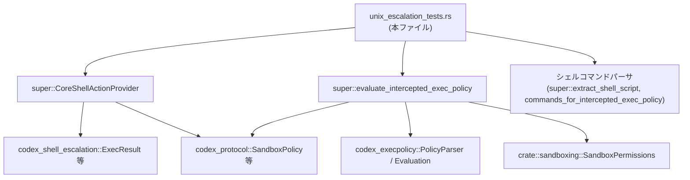
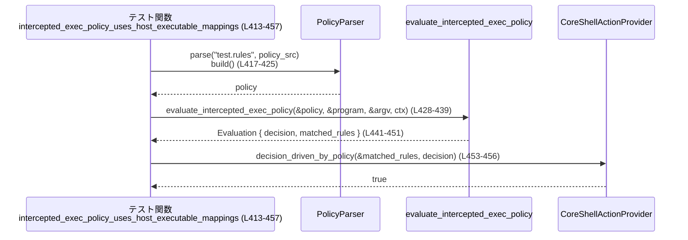

# core/src/tools/runtimes/shell/unix_escalation_tests.rs コード解説

## 0. ざっくり一言

このファイルは、Unix シェル実行まわりの「昇格実行（escalation）」と「実行ポリシー評価」の挙動をテストするモジュールです。  
具体的には、シェルラッパーのパース、exec ポリシー判定、サンドボックス権限と昇格指示の対応関係を検証します（`core/src/tools/runtimes/shell/unix_escalation_tests.rs:L61-538`）。

---

## 1. このモジュールの役割

### 1.1 概要

このモジュールは **シェル経由のコマンド実行に対するポリシー評価と昇格制御が、期待どおりに動作するかを検証するテスト群** です。

主に次の点をカバーします（行番号は根拠箇所です）:

- execve プロンプトが `AskForApproval` のフラグ設定に従って拒否されるか（`L61-93`）
- 追加サンドボックス権限の「事前承認」扱いと、その評価への影響（`L95-118`, `L460-498`）
- シェルラッパー（`zsh -lc`, `bash -lc`, `sandbox-exec`, `/usr/bin/env` など）のパースと拒否条件（`L120-192`, `L212-228`, `L322-371`）
- 実行結果 `ExecResult` からクライアント向け出力構造へのマッピング（`L230-248`）
- サンドボックスポリシー・追加権限の組み合わせから昇格実行モードへの変換（`L250-320`）
- exec ポリシーのルール／ヒューリスティクス判定と host_executable マッピングの扱い（`L322-371`, `L373-457`, `L500-538`）

### 1.2 アーキテクチャ内での位置づけ

このテストモジュールは「core シェル実行ランタイム」の一部である上位モジュール（`super::`）の振る舞いを検証します（`L1-8`）。外部クレートとの関係は次の通りです（`L9-31`）:

- `codex_execpolicy`: ポリシー言語のパースと評価 (`PolicyParser`, `Evaluation`, `RuleMatch`, `Decision`)
- `codex_protocol`: サンドボックス・権限・承認ポリシーのモデル (`AskForApproval`, `SandboxPolicy`, `FileSystemSandboxPolicy` 他)
- `codex_shell_escalation`: 実行結果と昇格権限 (`ExecResult`, `EscalationExecution`, `EscalationPermissions`)
- `crate::sandboxing::SandboxPermissions`: コア側のサンドボックス権限プリセット
- `codex_sandboxing::SandboxType`: 実行時サンドボックス種別
- `AbsolutePathBuf`: 絶対パスユーティリティ

簡略な依存関係図（このテストファイル視点、`L1-34, L250-320, L322-538` を反映）:



（図は本ファイル全体 `L1-538` の関係を要約したものです。）

### 1.3 設計上のポイント

コードから読み取れる設計上の特徴は以下の通りです。

- **現実のシナリオを模したテスト入力**  
  - npm publish / git status / printf など、CLI ツールとシェルラッパーの典型的なパターンでテストしています（`L212-228`, `L322-339`, `L413-432`, `L459-487`）。
- **ポリシー vs ヒューリスティクスの区別**  
  - `RuleMatch::PrefixRuleMatch` と `RuleMatch::HeuristicsRuleMatch` を区別し、`CoreShellActionProvider::decision_driven_by_policy` で「ポリシー由来かどうか」を明示的に判定しています（`L441-456`, `L529-537`）。
- **明示的なエラー表現**  
  - シェルパーサは `Result` を返し、サポート外のフォーマットは `ToolError::Rejected` として扱われます（`L176-191`）。
- **サンドボックス権限と昇格の明確なマッピング**  
  - `SandboxPermissions` のバリアントに応じ、`EscalationExecution` を `TurnDefault / Unsandboxed / Permissions(...)` のいずれかに変換しています（`L250-320`）。
- **すべて同期的・単一スレッドの前提**  
  - 非同期処理 (`async/await`) やスレッドは登場せず、テスト・対象 API とも同期呼び出しとして利用されています（`L1-538`）。

---

## 2. 主要な機能一覧

### 2.1 このファイル内で定義されるコンポーネント一覧

#### ヘルパー関数

| 名前 | 種別 | 行範囲 | 役割 / 用途 |
|------|------|--------|-------------|
| `host_absolute_path` | 関数 | `L36-46` | ホスト OS に依存した絶対パス文字列を作るテスト用ユーティリティ |
| `starlark_string` | 関数 | `L48-50` | Starlark ソースに埋め込むための文字列エスケープ（バックスラッシュとダブルクォートのエスケープ） |
| `read_only_file_system_sandbox_policy` | 関数 | `L52-59` | ルート (`/`) を読み取り専用に制限した `FileSystemSandboxPolicy` を生成 |

#### テスト関数

| 名前 | 行範囲 | 主に検証している対象 API / 振る舞い |
|------|--------|--------------------------------------|
| `execve_prompt_rejection_keeps_prefix_rules_on_rules_flag` | `L61-76` | `super::execve_prompt_is_rejected_by_policy` と `AskForApproval::Granular.rules` フラグの関係 |
| `execve_prompt_rejection_keeps_unmatched_commands_on_sandbox_flag` | `L78-93` | 同上、`sandbox_approval` フラグと `DecisionSource::UnmatchedCommandFallback` の関係 |
| `approval_sandbox_permissions_only_downgrades_preapproved_additional_permissions` | `L95-118` | `super::approval_sandbox_permissions` によるサンドボックス権限のダウングレード条件 |
| `extract_shell_script_preserves_login_flag` | `L120-138` | `super::extract_shell_script` による `-lc` / `-c` からの login フラグ導出 |
| `extract_shell_script_supports_wrapped_command_prefixes` | `L140-174` | `/usr/bin/env` や `sandbox-exec` を挟んだシェルラッパーのパース |
| `extract_shell_script_rejects_unsupported_shell_invocation` | `L176-192` | サポート外の `sandbox-exec -fc` パターンで `ToolError::Rejected` が返ること |
| `join_program_and_argv_replaces_original_argv_zero` | `L194-210` | `super::join_program_and_argv` が `argv[0]` を解決済みパスに置き換えること |
| `commands_for_intercepted_exec_policy_parses_plain_shell_wrappers` | `L212-228` | `super::commands_for_intercepted_exec_policy` による `bash -lc "cmd1 && cmd2"` の分解 |
| `map_exec_result_preserves_stdout_and_stderr` | `L230-248` | `super::map_exec_result` による標準出力・標準エラー・統合出力のマッピング |
| `shell_request_escalation_execution_is_explicit` | `L250-320` | `CoreShellActionProvider::shell_request_escalation_execution` と `SandboxPermissions` の対応 |
| `evaluate_intercepted_exec_policy_uses_wrapper_command_when_shell_wrapper_parsing_disabled` | `L322-371` | シェルラッパーパース無効時の `super::evaluate_intercepted_exec_policy` のヒューリスティクス動作 |
| `evaluate_intercepted_exec_policy_matches_inner_shell_commands_when_enabled` | `L373-411` | パース有効時に内側コマンド `npm publish` に対してプレフィックスルールが適用されること |
| `intercepted_exec_policy_uses_host_executable_mappings` | `L413-457` | `host_executable` マッピングを利用した `git status` のポリシー判定と `decision_driven_by_policy` |
| `intercepted_exec_policy_treats_preapproved_additional_permissions_as_default` | `L459-498` | 事前承認済み追加権限が「デフォルト」として扱われること |
| `intercepted_exec_policy_rejects_disallowed_host_executable_mapping` | `L500-538` | `host_executable` で許可されていない Git バイナリに対するヒューリスティクス判定と policy-driven でない扱い |

### 2.2 機能一覧（観点別）

このファイル全体でテストされている主な機能は以下です。

- exec プロンプト拒否ロジック: `AskForApproval::Granular` のフラグと `DecisionSource` に応じて、承認プロンプトを拒否するかどうかを返す（`L61-93`）。
- サンドボックス権限のダウングレード: 追加権限が「事前承認済み」の場合に限り、`SandboxPermissions::WithAdditionalPermissions` を `UseDefault` に落とすロジック（`L95-118`）。
- シェルコマンド抽出: `zsh`/`bash` および `/usr/bin/env` や `sandbox-exec` ラッパーから、実際のシェルとスクリプト文字列・login フラグを抽出（`L120-174`）。
- サポート外シェル呼び出しの拒否: 想定外の `sandbox-exec` の引数構成を `ToolError::Rejected` で弾く（`L176-192`）。
- プログラムパスと argv の統合: 解決済みプログラムパスで `argv[0]` を置き換えつつ残りの引数を維持（`L194-210`）。
- シンプルなシェルラッパー解析: `bash -lc "git status && pwd"` から候補コマンド列 `[["git","status"],["pwd"]]` を抽出（`L212-228`）。
- 実行結果マッピング: `ExecResult` から、stdout/stderr/aggregated_output のテキストが損なわれないことを確認（`L230-248`）。
- 昇格実行指示: サンドボックス権限種別に応じて、`TurnDefault` / `Unsandboxed` / カスタム権限付き `Permissions(...)` を返す（`L250-320`）。
- シェルラッパー有無による exec ポリシー判定の違い: シェルパースの有効/無効で `Decision::Allow` vs `Decision::Prompt` となる挙動（`L322-371`, `L373-411`）。
- host_executable マッピング: 実際のバイナリパスとポリシー側のマッピングの一致/不一致で `PrefixRuleMatch` と `HeuristicsRuleMatch` を切り替える（`L413-457`, `L500-538`）。

---

## 3. 公開 API と詳細解説

このファイルでは公開 API 自体は定義されていませんが、上位モジュール (`super::`) および外部クレートの API をテスト経由で使用しています。以下では、**テストから観測できる範囲で** 主要 API の振る舞いを整理します。

### 3.1 主要な型一覧（本ファイルで使用するもの）

> ※ここでは、このファイルで直接リテラル構築やフィールドアクセスを行っている型のみを列挙します。

| 名前 | 種別 | 定義元 | 役割 / 用途（本ファイルで見える範囲） |
|------|------|--------|----------------------------------------|
| `AskForApproval` | enum | `codex_protocol::protocol` | 実行時の承認ポリシー。`OnRequest` や `Granular(GranularApprovalConfig)` が使用される（`L22-23, L61-71, L78-88, L339-345, L468-487`）。 |
| `GranularApprovalConfig` | struct | 同上 | `sandbox_approval` / `rules` などのフラグで、どの種類の承認がユーザー設定により許可されているかを表現（`L65-71, L82-88`）。 |
| `SandboxPermissions` | enum | `crate::sandboxing` | サンドボックス権限の要求レベルを表す。`UseDefault` / `RequireEscalated` / `WithAdditionalPermissions` が本ファイルで使用される（`L9, L95-117, L284-300, L342-344, L468-479, L521-525`）。 |
| `SandboxPolicy` | enum or struct | `codex_protocol::protocol` | ファイルシステム・ネットワーク等のサンドボックスポリシー。`WorkspaceWrite` や `new_read_only_policy()` / `new_workspace_write_policy()` が使われる（`L25, L261-267, L340-342, L390-392, L434-435, L465-466`）。 |
| `FileSystemSandboxPolicy` | struct | `codex_protocol::permissions` | ファイルシステムパスごとのアクセス権 (Read/Write/None) を持つポリシー。`restricted(vec![FileSystemSandboxEntry{...}])` で構築（`L19, L52-59, L268-281, L341-343, L393-394, L435-436, L466-467, L523-524`）。 |
| `FileSystemSandboxEntry` | struct | 同上 | 1 エントリのパスとアクセスモード。`Special(Root)` / `Path { path: AbsolutePathBuf }` が使用される（`L18, L53-58, L269-280`）。 |
| `FileSystemAccessMode` | enum | 同上 | `Read`, `Write`, `None` が使用される（`L16, L57, L273, L279`）。 |
| `NetworkSandboxPolicy` | enum | 同上 | ネットワークアクセスのポリシー。ここでは `NetworkSandboxPolicy::Restricted` のみ使用（`L21, L282`）。 |
| `EscalationExecution` | enum | `codex_shell_escalation` | 昇格実行の種別。`TurnDefault` / `Unsandboxed` / `Permissions(EscalationPermissions::Permissions(EscalatedPermissions{...}))` が検証される（`L27-30, L284-319`）。 |
| `EscalatedPermissions` | struct (別名) | 同上 | 昇格時に利用する `sandbox_policy`, `file_system_sandbox_policy`, `network_sandbox_policy` のセット（`L312-317`）。 |
| `ExecResult` | struct | `codex_shell_escalation` | 生の実行結果（exit_code, stdout, stderr, output, duration, timed_out）を保持（`L29, L232-241`）。 |
| `Evaluation` | struct | `codex_execpolicy` | ポリシー評価結果。`decision: Decision` と `matched_rules: Vec<RuleMatch>` を持つ（`L11, L398-409, L442-451`）。 |
| `RuleMatch` | enum | `codex_execpolicy` | マッチしたルール。`PrefixRuleMatch` と `HeuristicsRuleMatch` が本ファイルに登場（`L13, L350-356, L402-408, L444-450, L529-532`）。 |
| `Decision` | enum | `codex_execpolicy` | `Allow` / `Prompt` などのポリシー判定結果（`L10, L324, L350-351, L363-364, L401-405, L443-449`）。 |
| `ParsedShellCommand` | struct | `super` | `program: String`, `script: String`, `login: bool` を持つシェルコマンド表現（`L3, L120-137, L140-173`）。 |
| `InterceptedExecPolicyContext` | struct | `super` | `approval_policy`, `sandbox_policy`, `file_system_sandbox_policy`, `sandbox_permissions`, `enable_shell_wrapper_parsing` を束ねた評価コンテキスト（`L2, L339-345, L390-396, L432-437, L472-481, L520-525`）。 |

> `ParsedShellCommand` や `InterceptedExecPolicyContext` の定義はこのチャンクには現れませんが、フィールド初期化や構造リテラルから上記のフィールド構成が分かります（`L120-137, L140-173, L339-345, L390-396`）。

### 3.2 関数詳細（テスト対象の主要 API）

> ここで説明する関数はすべて上位モジュール (`super::` または関連型の associated function) に定義されており、このファイルには実装がありません。挙動はテストから観測できる範囲に限定して記述します。

---

#### `super::execve_prompt_is_rejected_by_policy(approval_policy, decision_source) -> Option<String>`

**概要**

- execve の承認プロンプトを出すべき状況で、**ユーザー設定上その種類の承認が禁止されている場合に、拒否理由を `Some(reason)` として返す関数**です（`L61-76, L78-93`）。

**引数（テストから分かる範囲）**

| 引数名 | 型 | 説明 |
|--------|----|------|
| `approval_policy` | `AskForApproval` | 少なくとも `AskForApproval::Granular(GranularApprovalConfig)` が渡される（`L64-71, L81-88`）。 |
| `decision_source` | `&super::DecisionSource` | 少なくとも `DecisionSource::PrefixRule` と `DecisionSource::UnmatchedCommandFallback` が存在する（`L72, L89`）。 |

**戻り値**

- `Option<String>` またはそれと互換の型と推測されます。
  - 不許可の場合: `Some("<理由文字列>")`
  - 許可の場合: `None`
- テストでは `Some("approval required by policy rule, but AskForApproval::Granular.rules is false")` 等と比較しています（`L74-75, L91-92`）。

**内部処理の流れ（テストから読み取れる仕様）**

1. `approval_policy` が `AskForApproval::Granular(cfg)` の場合、`cfg.rules` および `cfg.sandbox_approval` フラグを参照する（`L65-71, L82-88`）。
2. `decision_source` が `PrefixRule` かつ `cfg.rules == false` の場合、**ポリシールール由来の承認は禁止されている**として `Some(<理由>)` を返す（`L61-76`）。
3. `decision_source` が `UnmatchedCommandFallback` かつ `cfg.sandbox_approval == false` の場合、**サンドボックス判定由来の承認は禁止されている**として `Some(<理由>)` を返す（`L78-93`）。
4. それ以外の組み合わせについては、このチャンクにはテストが存在せず、不明です。

**Examples（使用例）**

テストから抜粋（`L61-76`）:

```rust
let reason = super::execve_prompt_is_rejected_by_policy(
    AskForApproval::Granular(GranularApprovalConfig {
        sandbox_approval: true,
        rules: false,
        skill_approval: true,
        request_permissions: true,
        mcp_elicitations: true,
    }),
    &super::DecisionSource::PrefixRule,
);
assert_eq!(
    reason,
    Some("approval required by policy rule, but AskForApproval::Granular.rules is false".to_string()),
);
```

**Errors / Panics**

- 戻り値が `Option` であり、ここでは `unwrap` は使用されていません。`None` の場合を安全に扱う設計です（`L61-93`）。
- パニック条件はこのチャンクからは分かりません。

**Edge cases（エッジケース）**

- `AskForApproval::OnRequest` など `Granular` 以外のバリアントが渡された場合の挙動は不明です（テストに登場しません）。
- `DecisionSource` の他のバリアントがあるかどうか、このチャンクには現れません。

**使用上の注意点**

- `AskForApproval::Granular` のフラグと `DecisionSource` の組み合わせによって `Some` が返るため、呼び出し側は `None` の場合のみプロンプトを表示する、という前提で設計する必要があります（`L61-76, L78-93`）。
- 新しい `DecisionSource` を追加する場合は、本関数のロジックとテストの追加が必要になることが想定されますが、実装はこのチャンクにはありません。

---

#### `super::approval_sandbox_permissions(current: SandboxPermissions, additional_permissions_preapproved: bool) -> SandboxPermissions`

**概要**

- **追加サンドボックス権限が「すでにユーザーにより承認されているかどうか」に応じて、要求するサンドボックス権限レベルを調整する関数**です（`L95-118`）。

**引数**

| 引数名 | 型 | 説明 |
|--------|----|------|
| `current` | `SandboxPermissions` | 現在の希望するサンドボックス権限。`WithAdditionalPermissions` または `RequireEscalated` がテストされる（`L98-99, L105-106, L112-113`）。 |
| `additional_permissions_preapproved` | `bool` | 追加権限が事前承認されているかどうか（`L100, L107, L114`）。 |

**戻り値**

- `SandboxPermissions`  
  - `WithAdditionalPermissions` + `preapproved = true` → `UseDefault`（`L98-103`）
  - `WithAdditionalPermissions` + `preapproved = false` → `WithAdditionalPermissions`（`L105-110`）
  - `RequireEscalated` + `preapproved = true` → `RequireEscalated`（`L112-117`）

**内部処理の流れ（推測を含む）**

1. `current` と `additional_permissions_preapproved` をパターンマッチする。
2. `current == WithAdditionalPermissions && preapproved == true` のとき:
   - 追加権限はすでに承認済みなので、特別扱いせず `UseDefault` にダウングレード（`L98-103`）。
3. `current == WithAdditionalPermissions && preapproved == false` のとき:
   - 追加権限が新たに必要なものとして扱われ、そのまま `WithAdditionalPermissions` を維持（`L105-110`）。
4. `current == RequireEscalated` のとき:
   - preapproved に関わらず `RequireEscalated` を維持（`L112-117`）。

**Examples**

```rust
assert_eq!(
    super::approval_sandbox_permissions(
        SandboxPermissions::WithAdditionalPermissions,
        true,
    ),
    SandboxPermissions::UseDefault, // 事前承認済みなら default 相当として扱う
);
```

（出典: `L95-103`）

**Errors / Panics**

- 戻り値は `SandboxPermissions` であり、失敗を表す `Result` や `Option` は使用されていません（`L95-118`）。

**Edge cases**

- `SandboxPermissions::UseDefault` が渡された場合の挙動は、このチャンクには登場せず不明です。
- `additional_permissions_preapproved` が `true` でも `RequireEscalated` が維持される点から、「フル昇格」は事前承認フラグの対象外であることが分かります（`L112-117`）。

**使用上の注意点**

- 事前承認された追加権限を扱う場合にのみ、この関数を通して `SandboxPermissions` を調整する設計になっています。  
  `RequireEscalated` を意図せずダウングレードしないことをテストで保証しています（`L112-117`）。

---

#### `super::extract_shell_script(argv: &[String]) -> Result<ParsedShellCommand, ToolError>`

**概要**

- シェルプロセスの `argv` 配列から、**実際のシェルプログラムと実行するスクリプト文字列、login フラグを抽出する関数**です（`L120-174, L176-192`）。

**引数**

| 引数名 | 型 | 説明 |
|--------|----|------|
| `argv` | `&[String]` | シェル起動時の引数列。ラッパー (`/usr/bin/env`, `sandbox-exec`) を含む可能性があります（`L123-131, L143-149, L158-166, L178-181`）。 |

**戻り値**

- `Ok(ParsedShellCommand)`:
  - `program`: 実際のシェルの絶対パス（例: `/bin/zsh`）（`L124-125, L133-134, L152-153, L169-170`）。
  - `script`: 実行するシェルスクリプト（例: `"echo hi"`, `"pwd"`）（`L126-127, L135-136, L153-154, L170-171`）。
  - `login`: `-lc` のとき `true`, `-c` のとき `false`（`L127-128, L135-136, L154-155, L171-172`）。
- `Err(ToolError::Rejected(reason))`:
  - サポート外のコマンド形式の場合。例として `"unexpected shell command format for zsh-fork execution"` が返される（`L176-192`）。

**内部処理の流れ（テストから読み取れる仕様）**

1. `/usr/bin/env CODEX_EXECVE_WRAPPER=1 /bin/zsh -lc "echo hello"` のような「前置ラッパー」をスキップし、実際のシェルと引数を認識する（`L140-156`）。
2. `sandbox-exec -p sandbox_policy /bin/zsh -c "pwd"` のようなパターンも認識し、`program = "/bin/zsh"`, `script = "pwd"`, `login = false` と解釈する（`L158-173`）。
3. `-lc` のとき `login = true`、`-c` のとき `login = false` とする（`L120-138`）。
4. `sandbox-exec -fc "..."` のような形式は「サポート外」とみなし、`ToolError::Rejected("unexpected shell command format for zsh-fork execution")` を返す（`L176-191`）。

**Examples**

```rust
let cmd = extract_shell_script(&["/bin/zsh".into(), "-lc".into(), "echo hi".into()]).unwrap();
assert_eq!(cmd.program, "/bin/zsh");
assert_eq!(cmd.script, "echo hi");
assert!(cmd.login);
```

（出典: `L120-129`）

**Errors / Panics**

- テストでは `unwrap()` で `Ok` を前提としたケースと、`unwrap_err()` で `Err` を前提としたケースの両方が存在します（`L120-151, L176-183`）。
- `Err` の具体的なバリアントとして `ToolError::Rejected` が存在します（`L184-191`）。
- どのような場合に `Rejected` 以外のエラーが起きうるかは、このチャンクには現れません。

**Edge cases**

- `argv` が空、または十分な長さを持たない場合の挙動はテストされておらず不明です。
- スクリプトにクォートやエスケープを含む複雑なシェル式の扱いは、このテストではカバーされていません。

**使用上の注意点**

- この関数は **特定のラッパー構成（`/usr/bin/env CODEX_EXECVE_WRAPPER=1` や `sandbox-exec -p <policy>`）を前提とした専用パーサ** であることがテストから読み取れます（`L140-173`）。
- 不明な形式を `ToolError::Rejected` として扱うため、呼び出し側は `Result` をハンドリングして「ポリシーの外にあるシェル実行」として扱う必要があります（`L176-192`）。

---

#### `super::commands_for_intercepted_exec_policy(program: &AbsolutePathBuf, argv: &[String]) -> CandidateCommands`

**概要**

- シェルラッパー経由のコマンドラインから、**exec ポリシー評価に用いる候補コマンド列を抽出する関数**です（`L212-228`）。

**引数**

| 引数名 | 型 | 説明 |
|--------|----|------|
| `program` | `&AbsolutePathBuf` | 実際に exec されるプログラムの絶対パス。ここでは `/bin/bash` が渡されます（`L214-217`）。 |
| `argv` | `&[String]` | 表向きのコマンドライン引数。例: `["not-bash", "-lc", "git status && pwd"]`（`L215-217`）。 |

**戻り値（テストから分かる範囲）**

- 構造体（ここでは便宜的に `CandidateCommands` と呼びます）で、以下のフィールドを持つことが確認できます（`L220-227`）:
  - `commands: Vec<Vec<String>>`
  - `used_complex_parsing: bool`

**内部処理の流れ（観測された仕様）**

1. `program` から実際のシェル種別（ここでは bash）を認識する（`L214-218`）。
2. `argv` が `["not-bash", "-lc", "git status && pwd"]` のように「見た目のコマンド名」と実際の `program` が一致しない場合でも、`program` 側を信頼してシェルラッパーとして扱う（`L214-218`）。
3. スクリプト `git status && pwd` を `&&` で分割し、それぞれの部分を空白区切りして `["git","status"]`, `["pwd"]` というコマンド列として `commands` に格納（`L220-226`）。
4. この単純分割の場合 `used_complex_parsing == false` としてマークする（`L227`）。

**Examples**

```rust
let program = AbsolutePathBuf::try_from(host_absolute_path(&["bin", "bash"])).unwrap();
let candidate_commands = commands_for_intercepted_exec_policy(
    &program,
    &["not-bash".into(), "-lc".into(), "git status && pwd".into()],
);
assert_eq!(
    candidate_commands.commands,
    vec![vec!["git".to_string(), "status".to_string()], vec!["pwd".to_string()]],
);
assert!(!candidate_commands.used_complex_parsing);
```

（出典: `L212-228`）

**Errors / Panics**

- `commands_for_intercepted_exec_policy` 自体は `Result` を返していないように見えます（テストからは `unwrap` 等が登場しないため）（`L212-228`）。
- 内部でどのようなエラー処理をしているかは、このチャンクには現れません。

**Edge cases**

- コマンド中に `&&` 以外の制御演算子やクォートがある場合の扱いはテストされていません。
- `used_complex_parsing` が `true` になるケース（より高度なシェルパース）も、このチャンクには登場しません。

**使用上の注意点**

- `argv[0]` ではなく、**`program` に渡される実際のパスを基準にシェルかどうかを判定している**点に注意が必要です（`L214-218`）。
- ポリシー評価に用いる「候補コマンド」が単純な分割に基づくものであるため、複雑なシェル構文を厳密に理解する用途には適さないことが推測されますが、詳細は実装側コードを確認する必要があります。

---

#### `super::evaluate_intercepted_exec_policy(policy, program, argv, ctx) -> Evaluation`

**概要**

- ある実行（プログラムと引数）とその周辺コンテキストに対して、**exec ポリシーを評価し `Decision` と `RuleMatch` の一覧を返す関数**です（`L322-371, L373-457, L459-498, L500-538`）。

**引数（テストから分かる範囲）**

| 引数名 | 型 | 説明 |
|--------|----|------|
| `policy` | `codex_execpolicy::Policy` | `PolicyParser::new().parse(...).build()` により構築されるポリシー（`L324-327, L375-378, L417-425, L461-469, L505-513`）。 |
| `program` | `&AbsolutePathBuf` | 実際に exec されるプログラムパス (`/bin/zsh`, `/bin/bash`, `/usr/bin/git`, `/usr/bin/printf` 等)（`L328-329, L379-380, L426-427, L462-463, L514-515`）。 |
| `argv` | `&[String]` | 実行時の argv。例: `["zsh","-lc","npm publish"]`（`L331-338`, `L383-388`, `L431-432`, `L470-472`, `L517-519`）。 |
| `ctx` | `InterceptedExecPolicyContext` | `approval_policy`, `sandbox_policy`, `file_system_sandbox_policy`, `sandbox_permissions`, `enable_shell_wrapper_parsing` を含む（`L339-345, L390-396, L432-437, L472-481, L520-525`）。 |

**戻り値**

- `codex_execpolicy::Evaluation`  
  - `decision: Decision` (`Allow` / `Prompt` など)
  - `matched_rules: Vec<RuleMatch>`

**内部処理の流れ（テストで観測されたシナリオ）**

1. **シェルラッパーパース無効 (`enable_shell_wrapper_parsing = false`) の場合**（`L330-345`）:
   - `program = /bin/zsh`, `argv = ["zsh", "-lc", "npm publish"]`、ポリシーに `prefix_rule(pattern = ["npm", "publish"], decision = "prompt")` のみが存在する（`L324-328`）。
   - シェルパースを行わず、**解決済みプログラムパスを含むコマンドライン全体**でポリシー評価を行う（`L348-357` のメッセージ）。
   - `/bin/zsh` や `zsh` に対するルールが存在しないため、`RuleMatch::HeuristicsRuleMatch { command, decision: Decision::Allow }` が 1 つだけ返り、`decision == Allow` となる（`L348-357`）。

2. **シェルラッパーパース有効 (`enable_shell_wrapper_parsing = true`) の場合**（`L381-396`）:
   - `program = /bin/bash`, `argv = ["bash", "-lc", "npm publish"]`（`L379-388`）。
   - 内部で `npm publish` が抽出され、`prefix_rule(pattern = ["npm","publish"], decision = "prompt")` がマッチする（`L375-378, L399-409`）。
   - 結果として `Evaluation { decision: Prompt, matched_rules: [PrefixRuleMatch { matched_prefix: ["npm","publish"], decision: Prompt, resolved_program: None }] }` を返す（`L399-409`）。

3. **host_executable マッピングの利用**（`L413-457`）:
   - ポリシーに `host_executable(name = "git", paths = ["<git_path>"])` があり、`program == git_path` で実行（`L415-427`）。
   - `prefix_rule(pattern = ["git","status"], decision = "prompt")` と組み合わせて評価すると、`resolved_program: Some(program)` を含む `PrefixRuleMatch` が返る（`L441-451`）。
   - `CoreShellActionProvider::decision_driven_by_policy(...)` は true を返し、「ポリシーに明示的に支配された決定」と認識される（`L453-456`）。

4. **host_executable マッピング不一致の場合**（`L500-538`）:
   - ポリシーには `/usr/bin/git` のみが許可されているが、`program` は別の `other_git`（例: Homebrew の Git）である（`L502-515`）。
   - この場合、`matched_rules` は `HeuristicsRuleMatch { command: [other_git, "status"], .. }` のみとなり、`decision_driven_by_policy(...)` は false を返す（`L529-537`）。

5. **追加サンドボックス権限と Decision の関係**（`L459-498`）:
   - ポリシーが空の状態 (`PolicyParser::new().build()`) でも、`sandbox_permissions` に `WithAdditionalPermissions` が設定されていると `Decision::Prompt` となり、事前承認済み (`UseDefault` にダウングレード済み) の場合は `Decision::Allow` となる（`L468-480, L496-497`）。

**Examples**

```rust
let evaluation = evaluate_intercepted_exec_policy(
    &policy,
    &program,
    &["bash".to_string(), "-lc".to_string(), "npm publish".to_string()],
    InterceptedExecPolicyContext {
        approval_policy: AskForApproval::OnRequest,
        sandbox_policy: &SandboxPolicy::new_read_only_policy(),
        file_system_sandbox_policy: &read_only_file_system_sandbox_policy(),
        sandbox_permissions: SandboxPermissions::UseDefault,
        enable_shell_wrapper_parsing: true,
    },
);
assert_eq!(evaluation.decision, Decision::Prompt);
```

（出典: `L373-397`）

**Errors / Panics**

- すべての呼び出しで `evaluate_intercepted_exec_policy` は直接 `Evaluation` を返しており、`Result` ではありません（`L331-346, L382-397, L428-439, L468-481, L516-527`）。
- 内部でどのようなエラー処理を行っているかは、このチャンクには現れません。

**Edge cases**

- `enable_shell_wrapper_parsing` が true でも、非対応のシェルや複雑なスクリプトの場合にどのような `RuleMatch` が返るかは不明です。
- `approval_policy` が `AskForApproval::Granular` の場合や、他の `Decision` バリアント（例えば `Deny`）が返るケースはテストされていません。

**使用上の注意点**

- シェルラッパー経由のコマンドを正しく評価するには、`enable_shell_wrapper_parsing` を true に設定する必要があります（`L381-396`）。
- host_executable マッピングを用いることで、**特定のバイナリパスにのみ厳密なポリシーを適用し、それ以外はヒューリスティクスとして扱う**ことができます（`L413-457, L500-538`）。
- 追加権限の扱い (`SandboxPermissions`) は `Decision::Allow/Prompt` に直接影響するため、コンテキストの組み立て時に注意が必要です（`L459-498`）。

---

#### `CoreShellActionProvider::shell_request_escalation_execution(sandbox_permissions, sandbox_policy, fs_policy, net_policy, additional_permissions) -> EscalationExecution`

**概要**

- シェルからの実行要求に対して、**どの程度のサンドボックス解除・昇格を行うか**を決定する関数です（`L250-320`）。

**引数（テストから分かる範囲）**

| 引数名 | 型 | 説明 |
|--------|----|------|
| `sandbox_permissions` | `SandboxPermissions` | `UseDefault`, `RequireEscalated`, `WithAdditionalPermissions` が使用される（`L285-287, L295-297, L305-307`）。 |
| `sandbox_policy` | `&SandboxPolicy` | 現在のサンドボックス方針（例: `WorkspaceWrite`）（`L261-267, L285-288, L295-298, L305-310`）。 |
| `file_system_sandbox_policy` | `&FileSystemSandboxPolicy` | FS アクセスの詳細ポリシー（`L268-281, L286-289, L296-299, L306-309`）。 |
| `network_sandbox_policy` | `NetworkSandboxPolicy` | ネットワークアクセスの制限。ここでは `Restricted`（`L282-283, L287-290, L297-300, L307-310`）。 |
| `additional_permissions` | `Option<&PermissionProfile>` | 追加で要求された権限プロファイル。最後のケースで `Some(&requested_permissions)`（`L252-260, L290-291, L300-301, L310-311`）。 |

**戻り値**

- `EscalationExecution`  
  - `TurnDefault`（UseDefault のとき）: 既定のサンドボックス設定をそのまま使用（`L284-293`）。
  - `Unsandboxed`（RequireEscalated のとき）: 完全な昇格実行を示唆（`L294-303`）。
  - `Permissions(EscalationPermissions::Permissions(EscalatedPermissions { ... }))`（WithAdditionalPermissions + Some(permissions) のとき）: サンドボックス・FS・ネットワークポリシーを含む詳細な昇格設定（`L304-319`）。

**Examples**

```rust
assert_eq!(
    CoreShellActionProvider::shell_request_escalation_execution(
        SandboxPermissions::WithAdditionalPermissions,
        &sandbox_policy,
        &file_system_sandbox_policy,
        network_sandbox_policy,
        Some(&requested_permissions),
    ),
    EscalationExecution::Permissions(EscalationPermissions::Permissions(
        EscalatedPermissions {
            sandbox_policy,
            file_system_sandbox_policy,
            network_sandbox_policy,
        },
    )),
);
```

（出典: `L304-319`）

**Errors / Panics**

- テスト上、この関数は失敗せず `EscalationExecution` を直接返しています（`L284-319`）。

**Edge cases**

- `WithAdditionalPermissions` なのに `additional_permissions == None` の場合の挙動は、このチャンクには現れません。
- `SandboxPermissions::UseDefault` でも `additional_permissions` が `Some` の場合の挙動も不明です。

**使用上の注意点**

- 昇格戦略の決定は、**`SandboxPermissions` の値に強く依存**します。事前に `approval_sandbox_permissions` でダウングレードされる場合がある点にも注意が必要です（`L95-118, L459-498`）。
- `EscalationExecution::Permissions(...)` に含めるポリシーは、呼び出し側から構築して渡す必要があります（`L261-281`）。

---

#### `CoreShellActionProvider::decision_driven_by_policy(matched_rules: &[RuleMatch], decision: Decision) -> bool`

**概要**

- **現在の `Decision` がポリシーの明示的なルールに基づくものか、それともヒューリスティクス（fallback）によるものか**を判定する補助関数です（`L453-456, L529-537`）。

**引数**

| 引数名 | 型 | 説明 |
|--------|----|------|
| `matched_rules` | `&[RuleMatch]` | `RuleMatch::PrefixRuleMatch` や `RuleMatch::HeuristicsRuleMatch` を含むルールマッチ結果（`L441-451, L529-532`）。 |
| `decision` | `Decision` | 最終決定 (`Prompt` など)（`L453-456, L536-537`）。 |

**戻り値**

- `bool`:
  - `true`: `decision` が明示的なポリシールール (例: `PrefixRuleMatch`) によって決まったと見なされる（`L441-451, L453-456`）。
  - `false`: `decision` がヒューリスティクスによるものと見なされる（`L529-537`）。

**Examples**

```rust
assert!(CoreShellActionProvider::decision_driven_by_policy(
    &evaluation.matched_rules,
    evaluation.decision
)); // host_executable マッピングが有効なケース（L453-456）

assert!(!CoreShellActionProvider::decision_driven_by_policy(
    &evaluation.matched_rules,
    evaluation.decision
)); // host_executable マッピング不一致で heuristics のみのケース（L533-537）
```

**使用上の注意点**

- `RuleMatch::HeuristicsRuleMatch` のみが含まれる場合は `false` になることがテストで確認されています（`L529-537`）。
- ログ表示や UI 表示で「ポリシーによって明示的に許可/拒否された」かどうかを区別する用途が想定されますが、これはコードからの推測であり、このチャンクには明記されていません。

---

### 3.3 その他の関数

本ファイルでテストされているが、詳細解説を省略した関数です。

| 関数名 | 役割（1 行） | 根拠 |
|--------|--------------|------|
| `super::join_program_and_argv` | `argv[0]` を解決済みプログラムパスで置き換え、残りの引数をそのまま維持する（`["/tmp/tool", "--flag", "value"]` など）（`L194-210`）。 | `unix_escalation_tests.rs:L194-210` |
| `super::map_exec_result` | `ExecResult` から stdout/stderr/aggregated_output をラップした構造にコピーする（`out.stdout.text == "out"` などを保証）（`L230-248`）。 | `unix_escalation_tests.rs:L230-248` |

---

## 4. データフロー

ここでは、代表的な処理シナリオとして「host_executable マッピングを伴う exec ポリシー評価」のデータフローを示します（`L413-457`）。

1. テストコードが `PolicyParser` でポリシーを構築（`prefix_rule` + `host_executable`）（`L415-425`）。
2. `program` に host_executable で許可された Git のパスをセット（`L415-427`）。
3. `evaluate_intercepted_exec_policy` に `program`, `argv`, `InterceptedExecPolicyContext` を渡す（`L428-439`）。
4. 戻り値 `Evaluation` から `matched_rules` と `decision` を取得（`L441-451`）。
5. それらを `CoreShellActionProvider::decision_driven_by_policy` に渡し、「ポリシー由来かどうか」を判定（`L453-456`）。

Mermaid シーケンス図（シナリオ: `intercepted_exec_policy_uses_host_executable_mappings`、`L413-457`）:



このフローから分かるポイント:

- ポリシーパースと exec 評価は分離されており、`evaluate_intercepted_exec_policy` は既に構築済みポリシーを受け取ります（`L417-425, L428-439`）。
- `decision_driven_by_policy` は評価ロジックとは独立したポストプロセスであり、`Evaluation` の結果にだけ依存します（`L453-456`）。

---

## 5. 使い方（How to Use）

このファイルはテストモジュールですが、本番コードでの利用イメージをテストから再構成できます。

### 5.1 基本的な使用方法（exec ポリシー評価）

`evaluate_intercepted_exec_policy` を使って、シェルラッパー経由のコマンドを評価する基本フローです（`L322-371, L373-411`）。

```rust
use codex_execpolicy::PolicyParser;
use codex_protocol::protocol::{AskForApproval, SandboxPolicy};
use crate::sandboxing::SandboxPermissions;
use super::{evaluate_intercepted_exec_policy, InterceptedExecPolicyContext};
use crate::tools::runtimes::shell::unix_escalation_tests::read_only_file_system_sandbox_policy; // テスト内ヘルパー相当

fn evaluate_npm_publish(policy_src: &str) {
    // 1. ポリシーをパースする（L324-327, L375-378）
    let mut parser = PolicyParser::new();
    parser.parse("policy.rules", policy_src).unwrap();
    let policy = parser.build();

    // 2. 実際に exec されるシェルのパスと argv を用意（L328-329, L385-388）
    let program = AbsolutePathBuf::try_from("/bin/bash").unwrap();
    let argv = ["bash".to_string(), "-lc".to_string(), "npm publish".to_string()];

    // 3. コンテキストを構築（L339-345, L390-396）
    let ctx = InterceptedExecPolicyContext {
        approval_policy: AskForApproval::OnRequest,
        sandbox_policy: &SandboxPolicy::new_read_only_policy(),
        file_system_sandbox_policy: &read_only_file_system_sandbox_policy(),
        sandbox_permissions: SandboxPermissions::UseDefault,
        enable_shell_wrapper_parsing: true,
    };

    // 4. ポリシー評価（L382-397）
    let evaluation = evaluate_intercepted_exec_policy(&policy, &program, &argv, ctx);

    // 5. 結果利用
    println!("decision = {:?}, matched_rules = {:?}", evaluation.decision, evaluation.matched_rules);
}
```

### 5.2 よくある使用パターン

1. **シェルラッパーパースを無効にして「外側コマンドだけ」で評価する**  
   - `enable_shell_wrapper_parsing = false` に設定し、`program` と `argv` をそのまま評価する（`L330-345`）。
   - 内側コマンドに対する詳細なポリシー適用は、別の exec ラッパー（zsh-fork 等）に委ねる設計がテスト説明文から読み取れます（`L348-369`）。

2. **host_executable マッピングを使って特定バイナリにのみルールを適用する**  
   - ポリシーに `host_executable(name = "...", paths = ["..."])` を追加し、`program` にそのパスを渡す（`L418-421, L415-427`）。
   - `decision_driven_by_policy` で、その決定がポリシーにより明示的に導かれたかどうかを判定（`L453-456`）。

3. **追加権限が事前承認済みかどうかで挙動を変える**  
   - 実行前に `approval_sandbox_permissions` を通し、`SandboxPermissions` を調整（`L95-118, L468-480`）。
   - 調整後の `sandbox_permissions` を `InterceptedExecPolicyContext` にセットして評価（`L469-481`）。

### 5.3 よくある間違い（テストから考えられるもの）

```rust
// 間違い例: シェルラッパーを使っているのに enable_shell_wrapper_parsing を false のままにしている
let ctx = InterceptedExecPolicyContext {
    // ...
    enable_shell_wrapper_parsing: false, // これだと内側の "npm publish" ではなく zsh コマンドで評価される（L330-345）
};

// 正しい例: 内側コマンドに対してポリシーを適用したい場合は true にする
let ctx = InterceptedExecPolicyContext {
    // ...
    enable_shell_wrapper_parsing: true,  // bash -lc "npm publish" がパースされ、prefix_rule が適用される（L381-396）
};
```

```rust
// 間違い例: host_executable マッピングを設定したのに、別パスのバイナリで評価している
let program = AbsolutePathBuf::try_from("/opt/homebrew/bin/git").unwrap(); // policy上は未許可（L502-515）

// 正しい例: policy の host_executable で定義したパスと同じものを使う
let program = AbsolutePathBuf::try_from("/usr/bin/git").unwrap();         // マッピングと一致（L415-427）
```

### 5.4 使用上の注意点（まとめ）

- **シェルラッパーの扱い**: シェル経由のコマンドに対してポリシーを適用したい場合は、`enable_shell_wrapper_parsing` を適切に設定し、`extract_shell_script`・`commands_for_intercepted_exec_policy` と整合する形式のコマンドラインを用意する必要があります（`L120-174, L212-228, L322-371, L373-411`）。
- **host_executable マッピング**: 実バイナリパスがマッピングと一致しない場合、ヒューリスティクス扱いとなり `decision_driven_by_policy` が `false` になることがあります（`L500-538`）。
- **追加権限と昇格**: 追加権限の事前承認状態によって `Decision::Allow` / `Prompt` が変わるため、ユーザー UI やストレージと連携して状態管理する前提で設計する必要があります（`L95-118, L459-498`）。

---

## 6. 変更の仕方（How to Modify）

### 6.1 新しい機能を追加する場合（テスト観点）

- **新しいサンドボックス権限モードを追加**  
  - `SandboxPermissions` にバリアントを追加した場合、`approval_sandbox_permissions` と `shell_request_escalation_execution` の両方のテストを増やすと良いです（`L95-118, L250-320`）。
- **新しいシェルラッパー形式のサポート**  
  - 実装側で `extract_shell_script` や `commands_for_intercepted_exec_policy` に対応を追加したら、本ファイルと同様に argv リテラルを使ってテストを追加できます（`L120-174, L212-228`）。
- **新しい RuleMatch 種別**  
  - `RuleMatch` に新しいバリアントを追加した場合、`decision_driven_by_policy` のテストも更新して、policy-driven と見なすべきかどうかを明示する必要があります（`L441-456, L529-537`）。

### 6.2 既存の機能を変更する場合

- **ポリシー評価ロジックの変更**  
  - `evaluate_intercepted_exec_policy` の挙動を変える場合、少なくとも以下のテストへの影響を確認する必要があります。
    - シェルラッパーパース有/無の振る舞い（`L322-371, L373-411`）
    - host_executable マッピングの扱い（`L413-457, L500-538`）
    - 追加権限による `Decision::Allow/Prompt`（`L459-498`）
- **昇格戦略の変更**  
  - `shell_request_escalation_execution` のマッピングが変わると、どのケースで `Unsandboxed` やカスタム `Permissions` になるかが変化します。権限が過小になると機能不足、過大になるとセキュリティリスクにつながるため、テスト更新が重要です（`L250-320`）。
- **エラーメッセージの変更**  
  - `ToolError::Rejected` のメッセージ文字列が変わると、`extract_shell_script_rejects_unsupported_shell_invocation` テストが壊れます（`L186-191`）。メッセージを安定した定数として扱うかどうか検討が必要です。

---

## 7. 関連ファイル

このテストモジュールと密接に関係するファイル・モジュール（推測ではなく import から分かる範囲）:

| パス / モジュール | 役割 / 関係 |
|-------------------|------------|
| `core/src/tools/runtimes/shell/*`（`super::` 名前空間） | `CoreShellActionProvider`, `InterceptedExecPolicyContext`, `ParsedShellCommand` など、このテストで対象となる実装を含む（`L1-8`）。 |
| `crate::sandboxing` | `SandboxPermissions` を提供し、サンドボックス権限プリセットを定義（`L9`）。 |
| `codex_execpolicy` クレート | ポリシーパーサ (`PolicyParser`) と評価モデル (`Evaluation`, `RuleMatch`, `Decision`) を提供（`L10-13, L324-327, L375-378, L417-425, L461-469, L505-513`）。 |
| `codex_protocol::protocol` | `AskForApproval`, `SandboxPolicy`, `ReadOnlyAccess` などの高レベル設定モデル（`L22-25, L261-267, L339-345, L390-396, L434-435, L465-466`）。 |
| `codex_protocol::permissions` | `FileSystemSandboxPolicy` や関連型でファイルシステム・ネットワークポリシーを定義（`L16-21, L52-59, L268-281`）。 |
| `codex_shell_escalation` | `ExecResult`, `EscalationExecution`, `EscalationPermissions` など昇格実行のための型を提供（`L27-30, L232-241, L284-319`）。 |
| `codex_sandboxing` | `SandboxType` を定義し、`map_exec_result` で使用される（`L26, L230-243`）。 |
| `codex_utils_absolute_path` | `AbsolutePathBuf` による OS 依存の絶対パス管理（`L31, L197-207, L214-217, L328-329, L379-380, L426-427, L462-463, L514-515`）。 |

---

### 言語固有の安全性・エラー・並行性について（総括）

- **安全性**:  
  - 実装側の関数は、エラー状態を `Result`/`Option` で表現しており（例: `extract_shell_script`, `map_exec_result`）、テストでは `unwrap`/`unwrap_err` により正常系・異常系の両方を明示的に検証しています（`L120-151, L176-183, L230-243`）。
  - パニックはテスト上のアサーションミスに限られ、ライブラリ側 API はパニックよりも戻り値でエラーを返す設計に見えます。

- **エラーハンドリング**:  
  - `ToolError::Rejected` のように、サポート外パターンを明示的に拒否するエラー型が存在します（`L184-191`）。
  - ポリシー評価は失敗を返さず、常に `Evaluation` を返す設計である点が特徴的です（`L331-346, L382-397, L428-439, L468-481, L516-527`）。

- **並行性**:  
  - このファイルでは並列・非同期処理は一切使用されておらず、すべて単一スレッド・同期呼び出しとして扱われています（`L1-538`）。
