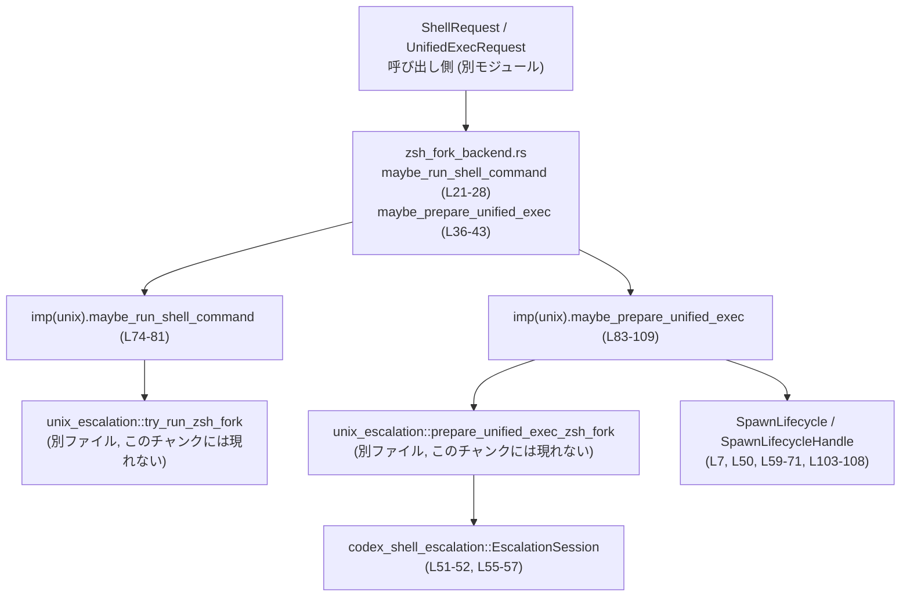
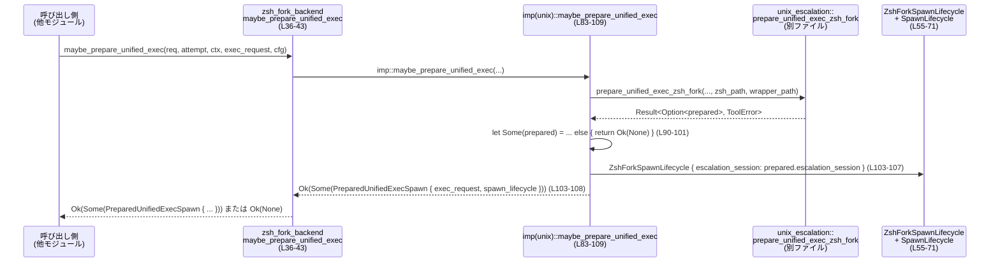

# core/src/tools/runtimes/shell/zsh_fork_backend.rs

## 0. ざっくり一言

このモジュールは、zsh ベースの「zsh-fork」エスカレーションバックエンドを使ってシェルコマンド／unified exec を起動するかどうかを判定し、必要に応じてその起動準備を行うための薄いラッパーレイヤーです（zsh_fork_backend.rs:L11-44, L46-109, L112-135）。

---

## 1. このモジュールの役割

### 1.1 概要

- 解決する問題: 一部のシェルコマンド（`zsh -c/-lc` でラップされたもの）や unified exec リクエストを、通常のシェルランタイムではなく、特別な zsh-fork エスカレーションサーバ経由で安全に実行したい、という要件。
- 提供する機能:
  - シェルコマンドリクエストに対して、zsh-fork で実行すべきか判定し、必要なら実行を委譲（maybe_run_shell_command）。
  - unified exec に対して、zsh-fork 経由での起動用に `ExecRequest` を変換し、エスカレーションセッションのライフサイクルを管理するハンドルを返す（maybe_prepare_unified_exec）。
  - 非 Unix 環境では常に「対象外」として `Ok(None)` を返し、通常パスにフォールバックさせる。

### 1.2 アーキテクチャ内での位置づけ

このモジュールは「shell runtime / unified exec」と「unix_escalation（zsh-fork 実装）」の間の薄いアダプタとして機能します。



Unix では `#[cfg(unix)] mod imp`（zsh_fork_backend.rs:L46-110）が実装を持ち、非 Unix では `#[cfg(not(unix)) mod imp`（L112-135）が常に `Ok(None)` を返してフォールバックさせます。

### 1.3 設計上のポイント

- 条件付きコンパイル:
  - Unix では実装付きの `imp` モジュールを使用し、非 Unix では安全なスタブを提供（L46-110, L112-135）。
- 責務の分割:
  - 公開（`pub(crate)`）API は `imp` モジュールに単純委譲し、プラットフォーム依存のロジックを `imp` に閉じ込める（L21-28, L36-43）。
- ライフサイクル管理:
  - `SpawnLifecycle` トレイト実装（L59-71）で、zsh-fork エスカレーションセッション中のファイルディスクリプタ継承と post-spawn クリーンアップをカプセル化。
- エラーハンドリング:
  - すべて `Result<_, ToolError>` を返し、`Ok(None)` による「フォールバック指定」と `Err(ToolError)` による「実行不能／エラー」を区別（L21-28, L36-43, L74-81, L83-109, L116-124, L126-135）。
- 安全性:
  - `unsafe` は一切使用されておらず、クロスプラットフォームなビルドを保つためのダミー実装でも未使用の変数は束縛破棄で明示（L122-123, L133-134）。

---

## 2. 主要な機能一覧

- zsh-fork シェルコマンド実行判定と委譲: `maybe_run_shell_command`（L21-28, L74-81, L116-124）
- zsh-fork unified exec 準備とライフサイクル付与: `maybe_prepare_unified_exec`（L36-43, L83-109, L126-135）
- zsh-fork 用 unified exec spawn 情報の構造体表現: `PreparedUnifiedExecSpawn`（L11-14）
- エスカレーションセッションのライフサイクル実装: `ZshForkSpawnLifecycle` と `SpawnLifecycle` 実装（L55-57, L59-71）

### 2.1 コンポーネント・インベントリー（構造体・関数一覧）

| 名前 | 種別 | cfg | 可視性 | 役割 / 用途 | 定義位置 |
|------|------|-----|--------|------------|----------|
| `PreparedUnifiedExecSpawn` | 構造体 | 共通 | `pub(crate)` | zsh-fork 経由 unified exec 起動のための変換済み `ExecRequest` と、そのライフサイクルハンドルをまとめて返すコンテナ | zsh_fork_backend.rs:L11-14 |
| `maybe_run_shell_command` | 非同期関数 | 共通 | `pub(crate)` | シェルリクエストに対して zsh-fork バックエンドを試みるかを判定し、実行を `imp` に委譲 | L21-28 |
| `maybe_prepare_unified_exec` | 非同期関数 | 共通 | `pub(crate)` | unified exec を zsh-fork 経由で起動するための準備を `imp` に委譲し、必要なら `PreparedUnifiedExecSpawn` を返す | L36-43 |
| `ZshForkSpawnLifecycle` | 構造体 | `unix` | モジュール内 | `EscalationSession` を保持し、`SpawnLifecycle` として FD 継承とクリーンアップを実装 | L55-57 |
| `SpawnLifecycle for ZshForkSpawnLifecycle::inherited_fds` | メソッド | `unix` | 実装 | エスカレーションセッションの環境変数からソケット FD を取得し、起動プロセスに継承すべき FD として返す | L59-67 |
| `SpawnLifecycle for ZshForkSpawnLifecycle::after_spawn` | メソッド | `unix` | 実装 | プロセス spawn 後にエスカレーションクライアントソケットを閉じる | L69-71 |
| `imp::maybe_run_shell_command` | 非同期関数 | `unix` | `pub(super)` | `unix_escalation::try_run_zsh_fork` を呼び、zsh-fork シェルコマンド実行を試みる | L74-81 |
| `imp::maybe_prepare_unified_exec` | 非同期関数 | `unix` | `pub(super)` | `unix_escalation::prepare_unified_exec_zsh_fork` を呼び、必要に応じて `PreparedUnifiedExecSpawn` を組み立てる | L83-109 |
| `imp::maybe_run_shell_command` | 非同期関数 | `not(unix)` | `pub(super)` | 非 Unix 環境では常に `Ok(None)` を返して zsh-fork を使わないことを示す | L116-124 |
| `imp::maybe_prepare_unified_exec` | 非同期関数 | `not(unix)` | `pub(super)` | 非 Unix 環境では unified exec に対しても常に `Ok(None)` を返す | L126-135 |

---

## 3. 公開 API と詳細解説

### 3.1 型一覧

| 名前 | 種別 | 役割 / 用途 | フィールド | 定義位置 |
|------|------|------------|------------|----------|
| `PreparedUnifiedExecSpawn` | 構造体 | zsh-fork 経由 unified exec 起動のために、変換済み `ExecRequest` と spawn ライフサイクルをペアで返すためのコンテナ | `exec_request: ExecRequest`（変換済みリクエスト）, `spawn_lifecycle: SpawnLifecycleHandle`（起動時に利用されるライフサイクル実装） | zsh_fork_backend.rs:L11-14 |
| `ZshForkSpawnLifecycle` | 構造体（`unix`） | `SpawnLifecycle` トレイトを実装し、zsh-fork エスカレーションセッションに紐づく FD 継承とクリーンアップ処理を行う | `escalation_session: EscalationSession` | L55-57 |

※ `SpawnLifecycleHandle`, `ExecRequest`, `UnifiedExecRequest`, `EscalationSession` の内部構造は、このチャンクには現れないため詳細不明です。

---

### 3.2 関数・メソッド詳細（主要 6 件）

#### 1. `maybe_run_shell_command(...) -> Result<Option<ExecToolCallOutput>, ToolError>`

**シグネチャ**

```rust
pub(crate) async fn maybe_run_shell_command(
    req: &ShellRequest,
    attempt: &SandboxAttempt<'_>,
    ctx: &ToolCtx,
    command: &[String],
) -> Result<Option<ExecToolCallOutput>, ToolError>  // zsh_fork_backend.rs:L21-27
```

**概要**

- シェルツールのリクエストが zsh-fork バックエンドによって処理されるべきかを判定し、必要に応じて実行を行います。
- 実際の処理は `imp::maybe_run_shell_command` に委譲します（L27）。

**引数**

| 引数名 | 型 | 説明 |
|--------|----|------|
| `req` | `&ShellRequest` | シェルコマンド実行に関する高レベルなリクエスト情報（詳細はこのチャンクには現れない） |
| `attempt` | `&SandboxAttempt<'_>` | サンドボックス試行コンテキスト。どのような制約下で実行するか等を表す（詳細不明） |
| `ctx` | `&ToolCtx` | ツール全体のコンテキスト（ログ、設定などが含まれると推測されるが詳細は不明） |
| `command` | `&[String]` | 実際に実行するシェルコマンドとその引数 |

**戻り値**

- `Ok(Some(ExecToolCallOutput))`: zsh-fork バックエンドでコマンドが処理され、その結果が得られた場合。
- `Ok(None)`: このリクエスト／プラットフォームでは zsh-fork を利用せず、通常のシェル実行パスにフォールバックすべき場合。
- `Err(ToolError)`: 実行途中でエラーが発生した場合（原因は `imp` 側／`unix_escalation` に依存し、このチャンクからは不明）。

**内部処理の流れ**

- 共通部分（L21-28）:
  1. 受け取った引数をそのまま `imp::maybe_run_shell_command` に渡し（L27）、
  2. 非同期に待機 (`.await`) して結果を返す。

- Unix 実装（L74-81）:
  1. `unix_escalation::try_run_zsh_fork(req, attempt, ctx, command)` を呼び出す（L80）。
  2. その `Result<Option<ExecToolCallOutput>, ToolError>` をそのまま呼び出し元に返す。

- 非 Unix 実装（L116-124）:
  1. 引数をタプル束縛で破棄し（L122）、使用しないことを明示。
  2. 常に `Ok(None)` を返す（L123-124）。

**Examples（使用例）**

```rust
// 同じクレート内のどこかからの呼び出し例（Unix想定）
async fn handle_shell_tool(
    req: &ShellRequest,                 // シェルリクエスト
    attempt: &SandboxAttempt<'_>,       // サンドボックス試行
    ctx: &ToolCtx,                      // ツールコンテキスト
) -> Result<(), ToolError> {
    let command = vec!["zsh".into(), "-lc".into(), "echo hello".into()]; // zsh -lc 形式

    match maybe_run_shell_command(req, attempt, ctx, &command).await? {
        Some(output) => {
            // zsh-fork バックエンドで実行された
            // output の利用（構造はこのチャンクには現れない）
            println!("zsh-fork output: {:?}", output);
        }
        None => {
            // 通常のシェル実行パスにフォールバックすべき
            // 別のランタイムに委譲するなど
        }
    }

    Ok(())
}
```

**Errors / Panics**

- エラー条件:
  - Unix では `unix_escalation::try_run_zsh_fork` 内で発生したエラーが `ToolError` として伝播されます（L80）。具体的な条件はこのチャンクには現れません。
- パニック:
  - このファイル内には `panic!` やインデックス操作などのパニック要因はありません。

**Edge cases（エッジケース）**

- `command` が空配列の場合:
  - その扱いは `unix_escalation::try_run_zsh_fork` に依存し、このチャンクからは不明です。
- 非 Unix OS:
  - 常に `Ok(None)` が返され、zsh-fork は決して使用されません（L116-124）。

**使用上の注意点**

- `Ok(None)` は「通常のシェルランタイムで処理を続行する」ことを意味し、エラーではありません。
- 非 Unix 環境では必ず `Ok(None)` となるため、呼び出し側はこの関数の結果だけに依存せず、フォールバックを実装しておく必要があります。
- 非同期関数のため、適切な async ランタイム（tokio 等）のコンテキストから `await` する必要があります。

---

#### 2. `maybe_prepare_unified_exec(...) -> Result<Option<PreparedUnifiedExecSpawn>, ToolError>`

**シグネチャ**

```rust
pub(crate) async fn maybe_prepare_unified_exec(
    req: &UnifiedExecRequest,
    attempt: &SandboxAttempt<'_>,
    ctx: &ToolCtx,
    exec_request: ExecRequest,
    zsh_fork_config: &ZshForkConfig,
) -> Result<Option<PreparedUnifiedExecSpawn>, ToolError>  // L36-43
```

**概要**

- unified exec（一般的な外部プロセス起動機構）に対して、zsh-fork バックエンドを利用すべきかを判定し、必要に応じて:
  - `ExecRequest` の変換（zsh ラッパー＋ラッパーバイナリの適用など）、
  - エスカレーションセッションを保持する `SpawnLifecycle` 実装の生成
  を行います。
- 該当しない場合は `Ok(None)` を返し、unified exec の通常 spawn パスを利用させます。

**引数**

| 引数名 | 型 | 説明 |
|--------|----|------|
| `req` | `&UnifiedExecRequest` | unified exec 全体の高レベルリクエスト |
| `attempt` | `&SandboxAttempt<'_>` | サンドボックス試行コンテキスト |
| `ctx` | `&ToolCtx` | ツールコンテキスト |
| `exec_request` | `ExecRequest` | 実際に spawn されるプロセスの情報を持つリクエスト。消費（所有権移動）されます（L40）。 |
| `zsh_fork_config` | `&ZshForkConfig` | zsh-fork バックエンド固有の設定（zsh のパスやラッパーバイナリのパスなど、L95-96 に示唆あり） |

**戻り値**

- `Ok(Some(PreparedUnifiedExecSpawn))`:
  - zsh-fork バックエンドで起動することが決定され、変換済み `ExecRequest` と `SpawnLifecycleHandle` が返される。
- `Ok(None)`:
  - このリクエスト／プラットフォームでは zsh-fork を利用しないべきであり、unified exec 通常パスを使用する。
- `Err(ToolError)`:
  - 準備中にエラーが発生した場合。

**内部処理の流れ（Unix 実装, L83-109）**

1. `unix_escalation::prepare_unified_exec_zsh_fork` を呼び出す（L90-97）。
   - 引数として `req`, `attempt`, `ctx`, `exec_request` を渡し、
   - `zsh_fork_config` から `shell_zsh_path` と `main_execve_wrapper_exe` のパスを取得し `as_path()` で `&Path` に変換して渡しています（L95-96）。
2. 非同期に待機し、その戻り値（`Option<...>` を含む `Result`）に対し `?` を適用（L98）。  
   - `Err(ToolError)` の場合はそのまま早期リターン。
   - `Ok(option)` の `option` 部分を `prepared` として取り出します。
3. `let Some(prepared) = ... else { return Ok(None); };` という `let-else` 構文（L90-101）:
   - `prepared` が `Some` なら中身を `prepared` に束縛。
   - `None` なら `Ok(None)` を返して処理終了。
4. `PreparedUnifiedExecSpawn` を構築して `Ok(Some(...))` として返す（L103-108）。
   - `exec_request: prepared.exec_request`
   - `spawn_lifecycle: Box::new(ZshForkSpawnLifecycle { escalation_session: prepared.escalation_session })`

**Examples（使用例）**

```rust
// unified exec 呼び出し側の擬似コード例（Unix想定）
async fn prepare_and_spawn_unified_exec(
    req: &UnifiedExecRequest,
    attempt: &SandboxAttempt<'_>,
    ctx: &ToolCtx,
    exec_request: ExecRequest,
    zsh_fork_config: &ZshForkConfig,
) -> Result<(), ToolError> {
    if let Some(prepared) =
        maybe_prepare_unified_exec(req, attempt, ctx, exec_request, zsh_fork_config).await?
    {
        // zsh-fork 経由で spawn すべき
        let exec_req = prepared.exec_request;
        let mut lifecycle = prepared.spawn_lifecycle; // 実体は ZshForkSpawnLifecycle

        // ここで unified exec の通常の spawn API に exec_req と lifecycle を渡す
        // spawn_unified(exec_req, lifecycle).await?;
    } else {
        // 通常の unified exec spawn パスを使う
        // spawn_unified(exec_request, default_lifecycle).await?;
    }

    Ok(())
}
```

**Errors / Panics**

- `prepare_unified_exec_zsh_fork` から `Err(ToolError)` が返されると、`?` により呼び出し元に伝播します（L98）。
- パニック要因は特に見られません。`let-else` も `None` の場合に `Ok(None)` を返すだけです。

**Edge cases**

- zsh-fork の対象にならないリクエスト:
  - `prepare_unified_exec_zsh_fork` が `Ok(None)` を返し、この関数も `Ok(None)` を返します（L90-101）。
- `zsh_fork_config` のパスが不正／存在しない:
  - その扱いは `prepare_unified_exec_zsh_fork` の実装次第で、このチャンクからは不明ですが、`Err(ToolError)` として扱われると推測されます（推測であるため断定はしません）。

**使用上の注意点**

- `exec_request` の所有権はこの関数に移動するため、呼び出し元で再利用する場合は、`Ok(None)` のケースを考慮した別経路で `ExecRequest` を持っておく必要があります（ただし実際にどう扱うかは他コード次第）。
- `PreparedUnifiedExecSpawn` を受け取ったら、`spawn_lifecycle` を unified exec の spawn API に渡して FD 継承とクリーンアップを有効にする前提と考えられます。
- 非 Unix では必ず `Ok(None)` を返します（L126-135）。

---

#### 3. `SpawnLifecycle for ZshForkSpawnLifecycle::inherited_fds(&self) -> Vec<i32>`

**シグネチャ**

```rust
impl SpawnLifecycle for ZshForkSpawnLifecycle {
    fn inherited_fds(&self) -> Vec<i32> {                // L59-67
        self.escalation_session
            .env()
            .get(ESCALATE_SOCKET_ENV_VAR)
            .and_then(|fd| fd.parse().ok())
            .into_iter()
            .collect()
    }
}
```

**概要**

- プロセス spawn 時に、どのファイルディスクリプタ（FD）を子プロセスに継承させるかを決定します。
- ここでは `EscalationSession` の環境変数から、エスカレーション用ソケット FD を 1 つだけ取り出し、`Vec<i32>` に変換して返します。

**引数**

- `&self`: `ZshForkSpawnLifecycle` インスタンス。内部に `EscalationSession` を保持しています（L55-57）。

**戻り値**

- 子プロセスに継承させるべき FD のリスト（整数のベクタ）。
- 環境変数が存在しない／パースに失敗した場合は空の `Vec` を返します（`Option::into_iter()` が 0 要素のため）。

**内部処理の流れ**

1. `self.escalation_session.env()` で、セッションに紐づく環境変数マップを取得（L61）。
2. `.get(ESCALATE_SOCKET_ENV_VAR)` で、エスカレーション用ソケット FD を表す環境変数の文字列値をオプションで取得（L62-63）。
3. `.and_then(|fd| fd.parse().ok())` により、文字列を `i32` にパース。失敗時は `None`（L64）。
4. `Option<i32>::into_iter()` により、`Some(fd)` なら要素 1 個のイテレータ、`None` なら空イテレータに変換（L65）。
5. `.collect()` で `Vec<i32>` にまとめて返す（L66-67）。

**Examples（使用例）**

```rust
// (擬似コード) unified exec 側で spawn 前に FD を取得して設定するイメージ
fn prepare_fds_for_spawn(lifecycle: &dyn SpawnLifecycle) {
    let inherited = lifecycle.inherited_fds();   // 例: [3] のような FD リスト
    // ここで OS レベルの spawn API に inherited を渡す ...
}
```

**Errors / Panics**

- 環境変数のパースに失敗しても `Result` を返さず、単に `None` として扱われるため、パニックやエラーにはなりません。

**Edge cases**

- 環境変数が存在しない場合:
  - `get(...)` が `None` を返し、結果は空の `Vec` になります。
- 値が整数でない場合（例: `"abc"`）:
  - `parse::<i32>()` が失敗し、`ok()` により `None` となり、同じく空ベクタになります。
- 複数 FD を扱う必要がある場合:
  - 現状は 1 つの環境変数から 1 つの FD のみを取り出す設計です（複数 FD には対応していませんが、コードからはそのような用途は読み取れません）。

**使用上の注意点**

- 呼び出し側は「空ベクタ＝FD の継承なし」と解釈する必要があります。  
  実行にソケット FD が必須な場合は、空の場合の扱いを別途定義する必要があります（ただしこのファイルにはそのロジックはありません）。
- `Env` のキー／値のエンコード（UTF-8 か否かなど）によるパース失敗の可能性がありますが、それらは静かに無視されます。

---

#### 4. `SpawnLifecycle for ZshForkSpawnLifecycle::after_spawn(&mut self)`

**シグネチャ**

```rust
fn after_spawn(&mut self) {                              // L69-71
    self.escalation_session.close_client_socket();
}
```

**概要**

- 子プロセスの spawn が完了した後に呼ばれ、エスカレーションクライアントソケットを閉じるクリーンアップ処理を行います。

**引数**

- `&mut self`: ライフサイクル実装の可変参照。

**戻り値**

- なし（`()`）。

**内部処理**

1. `self.escalation_session.close_client_socket()` を呼び出すのみ（L70）。
   - `EscalationSession` のメソッドであり、実装詳細はこのチャンクには現れません。

**使用上の注意点**

- after_spawn は「起動が成功した後」に呼ばれる前提で実装されているように見えます。  
  spawn 失敗時にどうするかは、`SpawnLifecycle` のコントラクトおよび呼び出し側の実装次第であり、このファイルからは分かりません。

---

#### 5. `imp::maybe_run_shell_command`（Unix 版）

**シグネチャ**

```rust
pub(super) async fn maybe_run_shell_command(
    req: &ShellRequest,
    attempt: &SandboxAttempt<'_>,
    ctx: &ToolCtx,
    command: &[String],
) -> Result<Option<ExecToolCallOutput>, ToolError> {   // L74-81
    unix_escalation::try_run_zsh_fork(req, attempt, ctx, command).await
}
```

**概要**

- Unix 環境において、zsh-fork バックエンドでシェルコマンドを実行するための実装本体です。
- 処理の全てを `unix_escalation::try_run_zsh_fork` に委ねています。

**使用上の注意点**

- `unix_escalation::try_run_zsh_fork` が zsh-fork 対象かどうかの判定と実行を行うため、この関数自体には追加判定ロジックはありません。
- 非 Unix では別実装（L116-124）が使われる点に注意が必要です。

---

#### 6. `imp::maybe_prepare_unified_exec`（Unix 版）

**シグネチャと概要**

上で詳細に説明した `maybe_prepare_unified_exec`（公開 API）の実体部分であり、`unix_escalation::prepare_unified_exec_zsh_fork` の結果を `PreparedUnifiedExecSpawn` にラップする役割です（L83-109）。

公開 API の説明と重複するため、ここでは根拠位置のみ明示します。

- zsh-fork 対象判定＋準備: `unix_escalation::prepare_unified_exec_zsh_fork(...).await?`（L90-98）
- `None` の場合のフォールバック: `else { return Ok(None); }`（L99-101）
- ライフサイクルオブジェクトの構築: `Box::new(ZshForkSpawnLifecycle { ... })`（L103-108）

---

### 3.3 その他の関数

| 関数名 | cfg | 役割（1 行） | 定義位置 |
|--------|-----|--------------|----------|
| `imp::maybe_run_shell_command` | `not(unix)` | 非 Unix 環境では常に `Ok(None)` を返し、zsh-fork を使わないことを示す | zsh_fork_backend.rs:L116-124 |
| `imp::maybe_prepare_unified_exec` | `not(unix)` | 非 Unix 環境では unified exec に対しても常に `Ok(None)` を返す | L126-135 |

---

## 4. データフロー

### 4.1 代表的なシナリオ: unified exec での zsh-fork 起動

unified exec がプロセス起動を行うとき、zsh-fork バックエンドを利用する場合の流れを示します（Unix 前提）。



**要点**

- zsh-fork 対象でなければ早期に `Ok(None)` が返され、通常の unified exec パスを利用できます。
- 対象であれば、`PreparedUnifiedExecSpawn` により:
  - 変換済み `ExecRequest`,
  - `SpawnLifecycle` 実装（`ZshForkSpawnLifecycle`）
  がセットで渡されます。
- unified exec 側は `SpawnLifecycle::inherited_fds` と `after_spawn` を利用して、zsh-fork エスカレーションセッション用のソケット FD 継承とクリーンアップを実現します（L59-71）。

---

## 5. 使い方（How to Use）

### 5.1 基本的な使用方法（シェルコマンド）

```rust
// シェルコマンドツールからの典型的なフローの例
async fn run_shell_with_optional_zsh_fork(
    req: &ShellRequest,
    attempt: &SandboxAttempt<'_>,
    ctx: &ToolCtx,
    command: &[String],
) -> Result<ExecToolCallOutput, ToolError> {
    // まず zsh-fork バックエンドを試す
    if let Some(output) = maybe_run_shell_command(req, attempt, ctx, command).await? {
        // zsh-fork で実行された
        return Ok(output);
    }

    // ここに通常のシェルランタイムでの実行ロジックを書く
    // run_default_shell_runtime(req, attempt, ctx, command).await
    unimplemented!()
}
```

### 5.2 基本的な使用方法（unified exec）

```rust
async fn spawn_process_with_optional_zsh_fork(
    req: &UnifiedExecRequest,
    attempt: &SandboxAttempt<'_>,
    ctx: &ToolCtx,
    exec_request: ExecRequest,
    zsh_fork_config: &ZshForkConfig,
) -> Result<(), ToolError> {
    if let Some(prepared) =
        maybe_prepare_unified_exec(req, attempt, ctx, exec_request, zsh_fork_config).await?
    {
        // zsh-fork 経由の起動
        let exec_req = prepared.exec_request;
        let lifecycle = prepared.spawn_lifecycle;

        // unified exec の spawn API に exec_req と lifecycle を渡す（擬似コード）
        // unified_spawn(exec_req, lifecycle).await?;
    } else {
        // 通常の unified exec 起動
        // unified_spawn(exec_request, default_lifecycle).await?;
    }
    Ok(())
}
```

### 5.3 よくある間違いと正しい例

```rust
// 誤りの可能性ある例: Ok(None) をエラーとみなしている
async fn wrong(req: &ShellRequest, attempt: &SandboxAttempt<'_>, ctx: &ToolCtx, cmd: &[String])
    -> Result<(), ToolError>
{
    // Err のみでなく Ok(None) も "失敗" と誤解するケース
    let _ = maybe_run_shell_command(req, attempt, ctx, cmd).await?; // 戻り値を無視している
    // ここで何もフォールバックしないと、非 Unix では何も実行されない
    Ok(())
}

// 正しい扱いの一例: None をフォールバックの合図として扱う
async fn correct(req: &ShellRequest, attempt: &SandboxAttempt<'_>, ctx: &ToolCtx, cmd: &[String])
    -> Result<(), ToolError>
{
    match maybe_run_shell_command(req, attempt, ctx, cmd).await? {
        Some(output) => {
            // 成功: zsh-fork が処理
            println!("zsh-fork output: {:?}", output);
        }
        None => {
            // フォールバック: 通常シェルランタイムで実行
            // run_default_shell_runtime(req, attempt, ctx, cmd).await?;
        }
    }
    Ok(())
}
```

### 5.4 使用上の注意点（まとめ）

- `Option` の意味:
  - `Some(_)` は「zsh-fork を使って処理した」、
  - `None` は「zsh-fork を使わない（通常パスへ）」を意味し、エラーではありません。
- プラットフォーム依存:
  - 非 Unix では常に `Ok(None)` が返るため、呼び出し側はフォールバックパスを必ず持つ必要があります（L112-135）。
- 非同期コンテキスト:
  - すべての公開関数は `async fn` のため、適切な非同期ランタイム上で `await` する必要があります。
- ライフサイクルの遵守:
  - `PreparedUnifiedExecSpawn.spawn_lifecycle` は unified exec に渡され、`inherited_fds` と `after_spawn` が適切なタイミングで呼ばれる前提です。  
    これを無視すると、ソケット FD が継承されなかったり、クリーンアップされない可能性があります。

---

## 6. 変更の仕方（How to Modify）

### 6.1 新しい機能を追加する場合

- 新たなバックエンドを追加したい場合:
  1. このファイルに別の「バックエンド用」関数を追加するのではなく、`unix_escalation` 側に新機能を追加し、このファイルではそれを呼び出す薄いラッパーを追加する構成が自然です（L49-50 を参照）。
  2. `PreparedUnifiedExecSpawn` のフィールドが増える場合は、この構造体（L11-14）と `imp::maybe_prepare_unified_exec` の構築部分（L103-108）を更新します。
- 新しいライフサイクル処理が必要なら:
  - `ZshForkSpawnLifecycle` にフィールドやメソッドを追加し、`SpawnLifecycle` トレイト実装を拡張する形になります（L55-57, L59-71）。

### 6.2 既存の機能を変更する場合

- 影響範囲:
  - `maybe_run_shell_command`／`maybe_prepare_unified_exec` は crate 内の他の多数のモジュールから呼ばれている可能性が高いため、戻り値の型や `Option` の意味を変えると広範囲に影響します。
- 契約（Contract）:
  - `Ok(None)` が「通常パスへのフォールバック」を意味する契約は重要です。これを破ると、呼び出し側が期待する制御フローが崩れます。
- テスト:
  - 変更時には、少なくとも:
    - Unix: zsh-fork 対象／非対象の両ケース（`Some`／`None`）、
    - 非 Unix: 常に `None` となること、
    を確認するテストが必要です。
- `SpawnLifecycle` 実装の変更:
  - `inherited_fds` と `after_spawn` は unified exec 側の期待に沿っている前提なので、ここを変更するとプロセス起動に失敗する可能性があります。  
    変更前に、`SpawnLifecycle` トレイトの仕様（別ファイル）を確認することが望ましいです。

---

## 7. 関連ファイル

このモジュールと密接に関係するが、このチャンクには定義が現れないものを挙げます。

| パス（推定） | 役割 / 関係 |
|--------------|------------|
| `crate::tools::runtimes::shell::unix_escalation` | `try_run_zsh_fork` および `prepare_unified_exec_zsh_fork` を提供し、zsh-fork バックエンドの実処理（プロセス起動・判定ロジック）を担います（zsh_fork_backend.rs:L49-50, L80, L90-98）。 |
| `crate::unified_exec` | `SpawnLifecycle` トレイトと `SpawnLifecycleHandle` 型を提供し、外部プロセス起動時の FD 継承や post-spawn フックのインターフェースを定義します（L7, L50, L59-71, L103-108）。 |
| `codex_shell_escalation` | `EscalationSession` と `ESCALATE_SOCKET_ENV_VAR` を提供し、エスカレーションサーバとの通信やソケット FD の情報を保持します（L51-52, L55-57, L61-64, L70）。 |
| `codex_tools::ZshForkConfig` | zsh-fork バックエンドの設定（zsh のパス、ラッパーバイナリのパスなど）を保持し、このモジュールから参照されます（L9, L88-96）。 |

---

## Bugs / Security 観点（要約）

- 環境変数からの FD 取得（L61-66）は、パース失敗時に静かに無視し空ベクタを返します。  
  セキュリティ上の問題ではありませんが、「FD が必須なのに継承されない」という論理的バグにつながる可能性はあります。  
  ただし、その前提や扱いはこのチャンクには書かれていません。
- 非 Unix で常に `Ok(None)` を返すスタブ実装は安全ですが、呼び出し側がこの挙動を前提にしていないと、何も実行されない状況になり得ます（ロジック上のバグ候補）。

---

## Contracts / Edge Cases（まとめ）

- Contract:
  - `Result<Option<T>, ToolError>` における `None` はフォールバックの合図。
  - `SpawnLifecycle::inherited_fds` が返す FD リストは「継承対象の全 FD」であり、空リストは「継承なし」。
- Edge cases:
  - 非 Unix OS → 常に `Ok(None)`。
  - 環境変数 `ESCALATE_SOCKET_ENV_VAR` が欠落／不正 → FD 継承なし。
  - zsh-fork 非対応のリクエスト → `prepare_unified_exec_zsh_fork` が `Ok(None)` を返し、通常パスへ。

---

## Tests（どのようなテストが有効か）

このファイル単体に対しては、以下のようなテストが有効です。

- Unix:
  - `prepare_unified_exec_zsh_fork` が `Some(prepared)` を返した場合に、`PreparedUnifiedExecSpawn` の中身が正しく構築されること（`exec_request` が透過／ライフサイクルが `ZshForkSpawnLifecycle` であること）（L90-108）。
  - `None` を返した場合に `Ok(None)` となること。
  - `ZshForkSpawnLifecycle::inherited_fds` が、環境変数に応じて期待通りのベクタを返すこと（空／1 要素／パース失敗）。
- 非 Unix:
  - 両関数が引数に副作用なく、常に `Ok(None)` を返すこと（L116-124, L126-135）。

---

## Performance / Scalability

- このモジュール内の処理は軽量であり、主に他モジュールへの委譲と小さなオブジェクト構築のみです。
- `inherited_fds` は環境変数からの単一値取得＋パースのみであり、ループや大きなデータ構造は扱っていません（L59-67）。  
  頻繁に呼ばれても負荷は小さいと考えられます。

---

## Tradeoffs / Refactoring / Observability（簡潔に）

- Tradeoffs:
  - 判定ロジックを `unix_escalation` 側に集約し、このモジュールを薄く保つことで、プラットフォーム依存部分を分離できていますが、挙動の理解には別ファイルの読解が必要になります。
- Refactoring の余地:
  - 現状の規模では、特に分割の必要性は見られません。  
    将来的に `PreparedUnifiedExecSpawn` のフィールドが増える場合は、構築処理を専用のヘルパー関数に切り出すことが検討できます。
- Observability:
  - このファイルにはログ出力やメトリクスなどの観測コードは存在しません。  
    挙動の観測は `unix_escalation` や呼び出し側で行う設計と見られますが、このチャンクからは詳細不明です。
