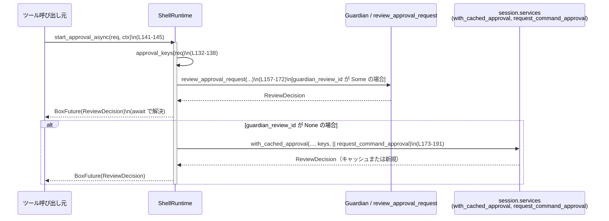

# core/src/tools/runtimes/shell.rs コード解説

## 0. ざっくり一言

`shell` ツール用のランタイム (`ShellRuntime`) と、その入力である `ShellRequest` を定義し、  
ガーディアン承認・ネットワーク承認・サンドボックス実行を一連のフローとしてまとめるモジュールです  
（`core/src/tools/runtimes/shell.rs:L1-5, L44-58, L205-266`）。

---

## 1. このモジュールの役割

### 1.1 概要

- このモジュールは **シェルコマンドを安全に実行するためのランタイム** を提供します。
- 具体的には以下を行います（`ShellRuntime` 実装）。
  - 承認キーの生成とガーディアン承認フローの開始  
    （`Approvable` 実装, `approval_keys`, `start_approval_async`  
    `core/src/tools/runtimes/shell.rs:L129-193`）
  - サンドボックス設定の決定（`Sandboxable`, `sandbox_mode_for_first_attempt`  
    `core/src/tools/runtimes/shell.rs:L120-127, L196-202`）
  - ネットワーク承認の仕様生成（`network_approval_spec`  
    `core/src/tools/runtimes/shell.rs:L205-216`）
  - 実際のコマンド組み立てとサンドボックス実行 (`run`  
    `core/src/tools/runtimes/shell.rs:L218-266`)

### 1.2 アーキテクチャ内での位置づけ

このモジュールは「ツールランタイム層」に属し、上位のオーケストレータ／ツール呼び出しから  
`ToolRuntime<ShellRequest, ExecToolCallOutput>` として利用されます（`L31, L205-266`）。

主な依存関係を図示すると次のようになります：

```mermaid
graph TD
    Orchestrator["オーケストレータ / ツール呼び出し元"]
    ShellRuntime["ShellRuntime<br/>(ToolRuntime 実装, L87-90, L205-266)"]
    ShellRequest["ShellRequest<br/>(L44-58)"]
    Guardian["Guardian / 承認サービス<br/>(review_approval_request, L13-14, L157-172)"]
    Services["session.services<br/>(with_cached_approval 経由, L173-191)"]
    SandboxAttempt["SandboxAttempt<br/>(env_for, L26, L259-261)"]
    ExecEnv["execute_env<br/>(L17, L262-264)"]
    ZshFork["zsh_fork_backend<br/>(maybe_run_shell_command, L9, L238-246)"]
    NetworkProxy["NetworkProxy<br/>(L34, L51, L205-216)"]

    Orchestrator -->|ShellRequest を渡して run() 呼び出し| ShellRuntime
    ShellRuntime --> ShellRequest
    ShellRuntime --> Guardian
    ShellRuntime --> Services
    ShellRuntime --> SandboxAttempt
    ShellRuntime --> ExecEnv
    ShellRuntime --> ZshFork
    ShellRuntime --> NetworkProxy
```

`unix_escalation` モジュールは宣言されていますが、このファイル内では参照されていません  
（`core/src/tools/runtimes/shell.rs:L7-8`）。

### 1.3 設計上のポイント

- **責務の分割**
  - 入力表現 (`ShellRequest`) と実行ロジック (`ShellRuntime`) を分離しています（`L44-58, L87-90`）。
  - 承認、サンドボックス設定、実行をトレイト (`Approvable`, `Sandboxable`, `ToolRuntime`) 単位で分離しています（`L23-31, L120-127, L129-203, L205-266`）。
- **状態管理**
  - `ShellRuntime` は `backend: ShellRuntimeBackend` のみを持つ軽量な構造体です（`L87-90`）。
  - `backend` はコンストラクタで決まり、実行中に変更されません（`L100-109, L238-247`）。
- **エラーハンドリング**
  - すべての外部呼び出しは `Result` でラップされ、`ToolError` にマッピングされます（`run`, `L249-266`）。
  - 承認フローは `ReviewDecision` を返す `BoxFuture` として非同期処理されます（`L37, L129-145, L155-193`）。
- **安全性（サンドボックス / 権限）**
  - 承認キーに `command`・`cwd`・`sandbox_permissions`・追加権限を含めています（`ApprovalKey`, `L92-98`, `approval_keys`, `L132-138`）。
  - サンドボックスモードは `sandbox_override_for_first_attempt` に委譲し、`sandbox_permissions` と `exec_approval_requirement` を利用します（`L200-202`）。
- **並行性 / 非同期**
  - 実行 (`run`) と承認 (`start_approval_async`) は `async` で定義され、`BoxFuture` によるライフタイム安全なポリモーフィック Future を利用しています（`L41, L141-145, L205-266`）。
  - `ShellRuntime` 自体はミュータブル参照 `&mut self` 経由で使用されるため、同一インスタンスを複数タスクから同時に利用するには外側で同期が必要です（これはメソッドシグネチャからの事実であり、同期処理はこのファイルには登場しません）。

---

## 2. 主要な機能一覧

### 2.1 コンポーネント一覧（型・モジュール）

| 名前 | 種別 | 公開範囲 | 役割 / 用途 | 根拠 |
|------|------|----------|-------------|------|
| `ShellRequest` | 構造体 | `pub` | シェル実行リクエストのすべてのパラメータ（コマンド、カレントディレクトリ、環境変数、ネットワーク設定、権限、承認要件など）を保持します。 | `core/src/tools/runtimes/shell.rs:L44-58` |
| `ShellRuntimeBackend` | 列挙体 | `pub(crate)` | `ShellRuntime` がどのバックエンド（汎用 / shell_command 用クラシック / zsh-fork）で動作するかを選択します。 | `core/src/tools/runtimes/shell.rs:L66-85` |
| `ShellRuntime` | 構造体 | `pub` | `ShellRequest` をもとに承認・サンドボックス設定・実行を行うランタイム本体です。`Sandboxable` / `Approvable` / `ToolRuntime` を実装します。 | `core/src/tools/runtimes/shell.rs:L87-90, L120-203, L205-266` |
| `ApprovalKey` | 構造体 | `pub(crate)` | コマンド承認のキャッシュキー。`command`（正規化済み）・`cwd`・サンドボックス権限・追加権限の組み合わせで識別します。 | `core/src/tools/runtimes/shell.rs:L92-98, L132-138` |
| `unix_escalation` | モジュール | `pub(crate)`（unix 限定） | Unix 向けエスカレーション関連モジュール。宣言のみで、詳細はこのチャンクには現れません。 | `core/src/tools/runtimes/shell.rs:L7-8` |
| `zsh_fork_backend` | モジュール | `pub(crate)` | zsh-fork を用いた shell_command 専用バックエンド。`maybe_run_shell_command` 経由で利用されますが、このチャンクには実装はありません。 | `core/src/tools/runtimes/shell.rs:L9, L238-246` |

### 2.2 コンポーネント一覧（関数・メソッド）

**`ShellRuntime` 関連**

| 関数名 | 所属 | 役割（1 行） | 根拠 |
|--------|------|--------------|------|
| `ShellRuntime::new()` | `impl ShellRuntime` | デフォルトの `Generic` バックエンドで `ShellRuntime` を生成します。 | `core/src/tools/runtimes/shell.rs:L100-105` |
| `ShellRuntime::for_shell_command(backend)` | `impl ShellRuntime` | `shell_command` 系ツール向けに、指定されたバックエンドで `ShellRuntime` を生成します。 | `core/src/tools/runtimes/shell.rs:L107-109` |
| `ShellRuntime::stdout_stream(ctx)` | `impl ShellRuntime` | 実行結果をストリーミングするための `StdoutStream` を、コンテキストから組み立てて返します。 | `core/src/tools/runtimes/shell.rs:L111-117` |

**トレイト実装**

| 関数名 | トレイト実装 | 役割（1 行） | 根拠 |
|--------|-------------|--------------|------|
| `sandbox_preference(&self)` | `Sandboxable for ShellRuntime` | サンドボックス利用の優先度として `SandboxablePreference::Auto` を返します。 | `core/src/tools/runtimes/shell.rs:L120-123` |
| `escalate_on_failure(&self)` | 同上 | サンドボックス失敗時にはエスカレーションを許可することを示す `true` を返します。 | `core/src/tools/runtimes/shell.rs:L124-126` |
| `approval_keys(&self, req)` | `Approvable<ShellRequest>` | 承認キャッシュに使用する `ApprovalKey` のリストを生成します。 | `core/src/tools/runtimes/shell.rs:L132-138` |
| `start_approval_async(&mut self, req, ctx)` | 同上 | Guardian 承認フローを非同期に開始し、`ReviewDecision` を返す Future を生成します。 | `core/src/tools/runtimes/shell.rs:L141-193` |
| `exec_approval_requirement(&self, req)` | 同上 | リクエストに含まれる `ExecApprovalRequirement` をそのまま返します。 | `core/src/tools/runtimes/shell.rs:L196-198` |
| `sandbox_mode_for_first_attempt(&self, req)` | 同上 | 初回試行時のサンドボックスモードを、権限と承認要件に基づいて決定します。 | `core/src/tools/runtimes/shell.rs:L200-202` |
| `network_approval_spec(&self, req, _ctx)` | `ToolRuntime` | ネットワークアクセスがある場合に、その承認仕様 (`NetworkApprovalSpec`) を返します。 | `core/src/tools/runtimes/shell.rs:L205-216` |
| `run(&mut self, req, attempt, ctx)` | 同上 | コマンドをラップ・バックエンド選択・サンドボックスコマンド構築・環境生成・実行を一括で行い、結果を `ExecToolCallOutput` として返します。 | `core/src/tools/runtimes/shell.rs:L218-266` |

---

## 3. 公開 API と詳細解説

### 3.1 型一覧（構造体・列挙体など）

| 名前 | 種別 | 公開範囲 | フィールド / バリアント概要 | 根拠 |
|------|------|----------|-----------------------------|------|
| `ShellRequest` | 構造体 | `pub` | シェルコマンド (`command`)、作業ディレクトリ (`cwd`)、タイムアウト (`timeout_ms`)、環境変数 (`env`, `explicit_env_overrides`)、ネットワーク (`network`)、サンドボックス権限 (`sandbox_permissions`)、追加権限 (`additional_permissions`)、（unixの場合）事前承認フラグ、説明 (`justification`)、実行承認要件 (`exec_approval_requirement`)。 | `core/src/tools/runtimes/shell.rs:L44-58` |
| `ShellRuntimeBackend` | 列挙体 | `pub(crate)` | `Generic`（汎用パス）、`ShellCommandClassic`（shell_command 用クラシック）、`ShellCommandZshFork`（zsh-fork バックエンド）を切り替える列挙体。 | `core/src/tools/runtimes/shell.rs:L66-85` |
| `ShellRuntime` | 構造体 | `pub` | フィールドは `backend: ShellRuntimeBackend` のみ。ランタイムのバックエンド種別を保持します。 | `core/src/tools/runtimes/shell.rs:L87-90` |
| `ApprovalKey` | 構造体 | `pub(crate)` | 承認キャッシュキー。正規化済みコマンド・`cwd`・サンドボックス権限・追加権限を持ち、`Serialize + Eq + Hash` です。 | `core/src/tools/runtimes/shell.rs:L92-98` |

#### Rust の安全性観点（型）

- `ShellRuntime` の唯一のフィールドは `Copy` な列挙型であり、内部可変状態や参照は持ちません（`L66-90`）。  
  そのため、所有権・借用の観点では単純な値型として扱え、データ競合を引き起こす状態はこの構造体自体にはありません。
- `ShellRequest` は `AbsolutePathBuf` や `HashMap` を含むため所有権を持つデータ構造ですが、関数はほとんど `&ShellRequest` を参照として受け取るため、呼び出し側の所有権は保持されます（`L44-58, L132, L141, L196, L205, L218`）。

---

### 3.2 関数詳細（重要 7 件）

#### 3.2.1 `ShellRuntime::new() -> Self`

**概要**

デフォルト（`Generic` バックエンド）の `ShellRuntime` を生成します  
（`core/src/tools/runtimes/shell.rs:L100-105`）。

**引数**

なし。

**戻り値**

- `ShellRuntime`：`backend` フィールドが `ShellRuntimeBackend::Generic` に設定されたインスタンス。

**内部処理の流れ**

1. `Self { backend: ShellRuntimeBackend::Generic }` を返すだけのシンプルなコンストラクタです（`L102-104`）。

**Examples（使用例）**

```rust
use core::tools::runtimes::shell::ShellRuntime;

fn create_runtime() -> ShellRuntime {
    // デフォルト（Generic）バックエンドのランタイムを生成する
    ShellRuntime::new()
}
```

※ 実際のパスはクレート構成に依存します。この例では `ShellRuntime` が再エクスポートされていることを仮定しています。

**Errors / Panics**

- この関数内にエラーや `panic!` はありません（`L100-105`）。

**Edge cases（エッジケース）**

- 特になし。常に同じ内容のインスタンスを返します。

**使用上の注意点**

- `shell_command` 系の特殊バックエンドを使いたい場合は、`for_shell_command` を使う必要があります（`L107-109, L238-247`）。

---

#### 3.2.2 `ShellRuntime::for_shell_command(backend: ShellRuntimeBackend) -> Self`

**概要**

`shell_command` ツール群向けに、指定バックエンドを持つ `ShellRuntime` を生成します  
（`core/src/tools/runtimes/shell.rs:L107-109`）。

**引数**

| 引数名 | 型 | 説明 |
|--------|----|------|
| `backend` | `ShellRuntimeBackend` | 使用したいバックエンド種別（`Generic`, `ShellCommandClassic`, `ShellCommandZshFork`）。 |

**戻り値**

- `ShellRuntime`：`backend` フィールドに指定した値が設定されたインスタンス。

**内部処理の流れ**

1. `Self { backend }` を返すだけです（`L108`）。

**Examples（使用例）**

```rust
use core::tools::runtimes::shell::{ShellRuntime, ShellRuntimeBackend};

fn create_shell_command_runtime() -> ShellRuntime {
    // shell_command ツール向けに zsh-fork バックエンドを選択する
    ShellRuntime::for_shell_command(ShellRuntimeBackend::ShellCommandZshFork)
}
```

**Errors / Panics**

- エラーやパニックはありません。

**Edge cases**

- `ShellRuntimeBackend::ShellCommandZshFork` を選んだ場合でも、条件を満たさないときは `run` 内で警告ログを出して通常フローにフォールバックします（`L238-247`）。

**使用上の注意点**

- バックエンドの挙動差（特に zsh-fork 版）がどのようなものかは、このチャンクには実装がないため不明です（`zsh_fork_backend` の中身がないため）。

---

#### 3.2.3 `ShellRuntime::stdout_stream(ctx: &ToolCtx) -> Option<crate::exec::StdoutStream>`

**概要**

実行結果の標準出力ストリーミング用に、`ToolCtx` から `StdoutStream` を構築します  
（`core/src/tools/runtimes/shell.rs:L111-117`）。

**引数**

| 引数名 | 型 | 説明 |
|--------|----|------|
| `ctx` | `&ToolCtx` | 実行コンテキスト。`turn.sub_id`, `call_id`, `session` などを保持します。 |

**戻り値**

- `Option<StdoutStream>`：現実装では常に `Some(StdoutStream { ... })` を返します（`L112-116`）。

**内部処理の流れ**

1. `ctx.turn.sub_id.clone()` でサブ ID を取得。
2. `ctx.call_id.clone()` で呼び出し ID を取得。
3. `ctx.session.get_tx_event()` でイベント送信用ハンドルを取得。
4. これらを使って `crate::exec::StdoutStream` を生成し `Some(...)` で返します。

**Examples（使用例）**

このメソッドは直接呼び出されず、`run` 内で `execute_env` の引数として使われます（`L262-264`）。

```rust
// run 内部での使用例（抜粋）
let out = execute_env(env, ShellRuntime::stdout_stream(ctx))
    .await
    .map_err(ToolError::Codex)?;
```

**Errors / Panics**

- 内部で `Result` や `panic!` は使用しておらず、常に `Some` を返します。

**Edge cases**

- `ToolCtx` 内部に `get_tx_event` が失敗するケースが想定されるかどうかは、このチャンクからは分かりません。ここでは戻り値の検査等は行っていません（`L115`）。

**使用上の注意点**

- `Option` になっているため、将来的には `None` を返す実装に変わる可能性がありますが、現状のコードでは常にストリーミングが有効になっています。

---

#### 3.2.4 `approval_keys(&self, req: &ShellRequest) -> Vec<ApprovalKey>`

**概要**

`ShellRequest` から承認キャッシュ用の `ApprovalKey` を生成するメソッドです  
（`core/src/tools/runtimes/shell.rs:L132-138`）。

**引数**

| 引数名 | 型 | 説明 |
|--------|----|------|
| `req` | `&ShellRequest` | 実行リクエスト。コマンドや権限情報を含みます。 |

**戻り値**

- `Vec<ApprovalKey>`：現実装では常に 1 要素のベクタを返します。

**内部処理の流れ**

1. `canonicalize_command_for_approval(&req.command)` でコマンド配列を承認用に正規化（`L133-134`）。
2. `req.cwd.clone()` で作業ディレクトリをコピー。
3. `req.sandbox_permissions` をコピー（`Copy` であると読み取れます）。
4. `req.additional_permissions.clone()` をコピー。
5. これらをフィールドに持つ `ApprovalKey` を 1 つ作成し、長さ 1 の `Vec` にして返します（`L132-138`）。

**Examples（使用例）**

このメソッドは `start_approval_async` 内で使用されています（`L146`）。

```rust
let keys = self.approval_keys(req);  // 承認キャッシュ用のキーを生成
```

**Errors / Panics**

- 関数自体にはエラーやパニックはありません。
- コマンド正規化処理内 (`canonicalize_command_for_approval`) の挙動はこのチャンクには現れません。

**Edge cases**

- `req.additional_permissions` が `None` の場合、そのまま `None` が `ApprovalKey` に保存されます（`L137`）。
- `req.command` が空配列であっても、そのまま正規化関数に渡されます。空の扱いがどうなるかは正規化関数次第であり、このチャンクでは不明です。

**使用上の注意点**

- 承認キャッシュはこのキーに基づいて行われるため、同じコマンドでも `cwd` や権限が異なると別キー扱いになります（`L92-98, L132-138`）。

---

#### 3.2.5 `start_approval_async(&mut self, req, ctx) -> BoxFuture<'_, ReviewDecision>`

**概要**

ガーディアンの承認フローを開始し、最終的な `ReviewDecision` を返す Future を生成します  
（`core/src/tools/runtimes/shell.rs:L141-193`）。

**引数**

| 引数名 | 型 | 説明 |
|--------|----|------|
| `self` | `&mut ShellRuntime` | ランタイム本体。現実装では内部状態は変更しませんが、トレイトシグネチャ上 `&mut self` です。 |
| `req` | `&ShellRequest` | 承認対象のリクエスト。 |
| `ctx` | `ApprovalCtx<'a>` | セッション・ターン・コール ID・リトライ理由・ガーディアンレビュー ID・ネットワーク承認コンテキスト等を含むコンテキスト。 |

**戻り値**

- `BoxFuture<'a, ReviewDecision>`：非同期に承認フローを実行し、レビューの結論を返す Future。

**内部処理の流れ**

1. `approval_keys(req)` を呼び出して承認キーを生成（`L146`）。
2. `command`, `cwd`, `retry_reason`, `reason`, `session`, `turn`, `call_id`, `guardian_review_id` などをローカル変数にコピーしておく（`L147-154`）。
3. `Box::pin(async move { ... })` で非同期ブロックを `BoxFuture` に変換（`L155`）。
4. 非同期ブロック内で：
   1. `guardian_review_id` が `Some` の場合：`review_approval_request(...)` を呼び出し、その結果を即座に `return`（`L156-172`）。
   2. `None` の場合：  
      - `with_cached_approval` を使い、`"shell"` 名前空間と `keys` に基づき承認のキャッシュを利用（`L173-191`）。
      - キャッシュミス時には `session.request_command_approval(...)` を呼び出して新たな承認をリクエスト（`L175-191`）。
      - `exec_approval_requirement.proposed_execpolicy_amendment().cloned()` により、実行ポリシーの修正案をオプションで添付（`L184-186`）。

**Rust の非同期 / 安全性の観点**

- `BoxFuture<'a, ReviewDecision>` を返すことで、呼び出し側は具体的な Future 型を知る必要がなくなります（`L41, L141-145`）。
- `async move` ブロック内で `req` や `ctx` のフィールド値はすべてクローンまたはコピーされており、ライフタイム `'a` 内でのみ参照されるため、所有権と借用の整合性が保たれています（`L147-154, L161-168, L183-188`）。

**Examples（使用例）**

擬似的な使用例（実際にはオーケストレータ側のコードになります）：

```rust
async fn ensure_shell_approved(
    runtime: &mut ShellRuntime,    // ランタイム
    req: &ShellRequest,            // リクエスト
    ctx: ApprovalCtx<'_>,          // 承認コンテキスト
) -> ReviewDecision {
    // 承認フローを開始し、決定が返ってくるまで await する
    runtime.start_approval_async(req, ctx).await
}
```

**Errors / Panics**

- 自身の戻り値は `ReviewDecision` であり、`Result` ではありません。  
  エラー時の扱いは `review_approval_request` および `request_command_approval` の実装に依存し、このチャンクからは分かりません。
- `panic!` を直接呼び出している箇所はありません。

**Edge cases**

- `guardian_review_id` が `Some` の場合、キャッシュ (`with_cached_approval`) は使用されず、必ず `review_approval_request` 経由になります（`L156-172`）。
- `req.exec_approval_requirement.proposed_execpolicy_amendment()` が `None` の場合、そのまま `None` が `request_command_approval` に渡されます（`L184-186`）。
- `req.additional_permissions` が `None` でも、そのまま渡されます（`L187`）。

**使用上の注意点**

- この関数は `&mut self` を取るため、同一 `ShellRuntime` インスタンスで並列に複数の承認を走らせたい場合には、別インスタンスを用意するか外部で排他制御が必要です。
- `with_cached_approval` によりキャッシュが効くため、同一キーで頻繁に承認を要求するパターンでは認知負荷やレイテンシの削減が期待できますが、その具体的なキャッシュポリシーはこのチャンクには現れません。

---

#### 3.2.6 `network_approval_spec(&self, req, _ctx) -> Option<NetworkApprovalSpec>`

**概要**

`ShellRequest` にネットワークプロキシが設定されている場合、その情報をもとにネットワーク承認仕様を返します  
（`core/src/tools/runtimes/shell.rs:L205-216`）。

**引数**

| 引数名 | 型 | 説明 |
|--------|----|------|
| `self` | `&ShellRuntime` | ランタイム本体（ここでは利用されません）。 |
| `req` | `&ShellRequest` | ネットワークプロキシ情報 (`network`) を含むリクエスト。 |
| `_ctx` | `&ToolCtx` | 現状では未使用。将来の拡張のために残されていると推測されますが、このチャンクからは断定できません。 |

**戻り値**

- `Option<NetworkApprovalSpec>`：
  - `req.network` が `Some` のとき：`Some(NetworkApprovalSpec { network: req.network.clone(), mode: NetworkApprovalMode::Immediate })`
  - `None` のとき：`None`

**内部処理の流れ**

1. `req.network.as_ref()?;` で `Option` をパターンマッチ。`None` の場合は早期に `None` を返します（`L211`）。
2. `Some(NetworkApprovalSpec { ... })` を構築し、`mode` に `NetworkApprovalMode::Immediate` をセット（`L212-215`）。

**Rust のエラーハンドリング観点**

- `?` 演算子を `Option` 型に対して使用し、「ネットワークが指定されていなければ `None` を返す」というパターンを簡潔に表現しています（`L211`）。

**Examples（使用例）**

```rust
fn maybe_need_network_approval(
    runtime: &ShellRuntime,
    req: &ShellRequest,
    ctx: &ToolCtx,
) -> Option<NetworkApprovalSpec> {
    // ネットワークが必要な場合だけ Some(...) が返る
    runtime.network_approval_spec(req, ctx)
}
```

**Errors / Panics**

- この関数内では `Result` や `panic!` は利用されていません。
- 返り値が `None` の場合でもエラー扱いにはしません。

**Edge cases**

- `req.network` が `Some` でも、その中身が無効な設定かどうかはここでは検証されません（`L211-215`）。

**使用上の注意点**

- ネットワークアクセスなしのコマンドでは承認 UI を出さない設計であることが読み取れますが、そのポリシーはシステム全体の設計に依存します。

---

#### 3.2.7 `run(&mut self, req, attempt, ctx) -> Result<ExecToolCallOutput, ToolError>`

**概要**

シェルコマンドをバックエンドに応じてラップし、サンドボックスコマンドを生成し、実行して結果を返すメイン処理です  
（`core/src/tools/runtimes/shell.rs:L218-266`）。

**引数**

| 引数名 | 型 | 説明 |
|--------|----|------|
| `self` | `&mut ShellRuntime` | ランタイム本体。`backend` フィールドを参照します。 |
| `req` | `&ShellRequest` | 実行するコマンドや環境情報を含むリクエスト。 |
| `attempt` | `&SandboxAttempt<'_>` | 現在のサンドボックス試行。環境生成 (`env_for`) に使用します。 |
| `ctx` | `&ToolCtx` | セッション・ユーザーシェル・ストリーム設定などを含む実行コンテキスト。 |

**戻り値**

- `Result<ExecToolCallOutput, ToolError>`：
  - `Ok(...)`：コマンドの実行結果。
  - `Err(ToolError)`：コマンド構築・環境生成・実行のいずれかで発生したエラー。

**内部処理の流れ**

1. **ユーザーシェル種別の取得**  
   `let session_shell = ctx.session.user_shell();`（`L224`）。
2. **コマンドラッピング / スナップショット化**  
   `maybe_wrap_shell_lc_with_snapshot` でコマンド文字列をラップし、スナップショット関連の処理を適用（`L225-231`）。  
   - `req.command`（コマンド本体）
   - `session_shell.as_ref()`（ユーザーシェル設定）
   - `req.cwd`（作業ディレクトリ）
   - `req.explicit_env_overrides`, `req.env`（環境変数）を利用。
3. **PowerShell 特別扱い**  
   - `session_shell.shell_type` が `ShellType::PowerShell` であれば、`prefix_powershell_script_with_utf8(&command)` を適用（`L232-234`）。
   - それ以外のシェルではラップ済みコマンドをそのまま使用（`L235-236`）。
4. **zsh-fork バックエンド（オプション）**  
   - `self.backend == ShellRuntimeBackend::ShellCommandZshFork` の場合のみ実行（`L238`）。
   - `zsh_fork_backend::maybe_run_shell_command(req, attempt, ctx, &command).await?` を呼び出し、以下の結果を扱う（`L239-246`）。
     - `Some(out)`：そのまま `Ok(out)` を返して関数終了（`L240-241`）。
     - `None`：警告ログを出し、通常フローにフォールバック（`L242-245`）。
5. **サンドボックスコマンドの構築**  
   - `build_sandbox_command(&command, &req.cwd, &req.env, req.additional_permissions.clone())?` を呼び出し、`command` をサンドボックス用表現に変換（`L249-254`）。
   - ここで `?` を使うため、この処理でエラーが発生した場合は `ToolError` として早期リターンします（`L249-254`）。
6. **実行オプション (`ExecOptions`) の設定**  
   - `expiration: req.timeout_ms.into()`（タイムアウト設定）  
   - `capture_policy: ExecCapturePolicy::ShellTool`（キャプチャポリシー）  
     （`L255-258`）。
7. **環境変数を含む実行環境の生成**  
   - `attempt.env_for(command, options, req.network.as_ref())` を呼び出し、実行環境 (`env`) を生成（`L259-261`）。
   - エラーは `ToolError::Codex(err.into())` にマッピングされます（`L260-261`）。
8. **実行**  
   - `execute_env(env, Self::stdout_stream(ctx)).await` でコマンドを実行し、結果を取得（`L262-264`）。
   - エラー時には `ToolError::Codex` として変換して返します（`L263-264`）。
9. **結果返却**  
   - `Ok(out)` で最終結果を返します（`L265`）。

**Rust の安全性・エラーハンドリング・並行性**

- **所有権 / 借用**
  - `req` や `ctx` は共有参照 (`&`) で受け取り、必要なところだけクローンします（`L225-231, L249-254`）。
  - `command` はローカルの `String` またはコマンド表現として所有され、`env_for` にムーブされます（`L249-261`）。
- **エラーハンドリング**
  - サンドボックスコマンド構築・環境生成・実行のそれぞれで発生しうるエラーを `Result` として伝搬させています（`L249-264`）。
  - `?` 演算子により、エラー時には早期リターンされ、呼び出し元は `ToolError` を必ず確認する形になります。
- **並行性**
  - `async fn` として定義されており、非同期ランタイム（例えば Tokio）上で実行されることを想定しています（`L218-223`）。
  - 関数内で新たなタスクを `spawn` するような処理はなく、処理は単一タスク内で逐次的に実行されます。
  - `&mut self` を取るため、同一インスタンスを並列利用したい場合は外部で同期を取る必要があります。

**Examples（使用例）**

環境を大まかに仮定したサンプルです（外部型はダミーとしています）。

```rust
use core::tools::runtimes::shell::{ShellRuntime, ShellRequest};
use codex_utils_absolute_path::AbsolutePathBuf;
use std::collections::HashMap;

// 実際にはこれらの型は crate 全体から取得する必要があります。
// ここでは型名のみを示しています。
async fn run_example(
    runtime: &mut ShellRuntime,           // ShellRuntime インスタンス
    attempt: &SandboxAttempt<'_>,         // どこかで用意された SandboxAttempt
    ctx: &ToolCtx,                        // 現在の ToolCtx
) -> Result<ExecToolCallOutput, ToolError> {
    let req = ShellRequest {
        command: vec!["echo".into(), "hello".into()], // 実行するコマンド
        cwd: AbsolutePathBuf::from("/tmp"),           // 作業ディレクトリ
        timeout_ms: Some(30_000),                     // タイムアウト 30 秒
        env: HashMap::new(),                          // 追加環境変数なし
        explicit_env_overrides: HashMap::new(),       // 上書きなし
        network: None,                                // ネットワークなし
        sandbox_permissions: SandboxPermissions::default(), // 仮のデフォルト権限
        additional_permissions: None,                 // 追加権限なし
        #[cfg(unix)]
        additional_permissions_preapproved: false,
        justification: Some("Sample run".into()),     // 実行理由
        exec_approval_requirement: ExecApprovalRequirement::default(), // デフォルト
    };

    runtime.run(&req, attempt, ctx).await
}
```

※ `SandboxPermissions::default()` や `ExecApprovalRequirement::default()` が実在するかは、このチャンクには記述がありません。例としての形を示すものです。

**Errors / Panics**

- `build_sandbox_command` が失敗した場合：`?` によりエラーが `ToolError` として返ります（`L249-254`）。
- `attempt.env_for` が失敗した場合：`map_err(|err| ToolError::Codex(err.into()))` により `ToolError::Codex` に変換されます（`L259-261`）。
- `execute_env` が失敗した場合：`map_err(ToolError::Codex)` により同様に変換されます（`L262-264`）。
- この関数内に `panic!` はありません。

**Edge cases**

- `req.timeout_ms` が `None` の場合：`Req.timeout_ms.into()` の結果がどう扱われるかは `ExecOptions::expiration` の型次第であり、このチャンクでは不明です（`L255-258`）。
- `req.network` が `None` の場合：`attempt.env_for` に `req.network.as_ref()` を渡しているため、`None` が渡されます（`L259-261`）。
- `self.backend` が `ShellCommandZshFork` でも、`maybe_run_shell_command` が `None` を返す条件（未達条件）はこのチャンクに現れません。実行は通常フローにフォールバックします（`L238-247`）。

**使用上の注意点**

- `run` を呼ぶ前に、必要なら `start_approval_async` で承認フローを通しておく必要がありますが、その順序やポリシーはこのファイルには明示されていません。
- PowerShell の場合は UTF-8 プレフィックス付きスクリプトに変換されるため、コマンド文字列の先頭に BOM 相当の記号などが追加される可能性があります（`prefix_powershell_script_with_utf8`, `L39, L232-234` の呼び出しのみから読み取れる事実）。

---

### 3.3 その他の関数

簡単なゲッター / ラッパー的な関数をまとめます。

| 関数名 | 所属 / トレイト | 役割（1 行） | 根拠 |
|--------|-----------------|--------------|------|
| `sandbox_preference(&self)` | `Sandboxable` | サンドボックス利用を「自動」モードにする方針を示します。 | `core/src/tools/runtimes/shell.rs:L120-123` |
| `escalate_on_failure(&self)` | 同上 | サンドボックス失敗時にエスカレーションを実施することを示します。 | `core/src/tools/runtimes/shell.rs:L124-126` |
| `exec_approval_requirement(&self, req)` | `Approvable` | `req.exec_approval_requirement` をそのまま `Some(...)` で返します。 | `core/src/tools/runtimes/shell.rs:L196-198` |
| `sandbox_mode_for_first_attempt(&self, req)` | 同上 | `sandbox_override_for_first_attempt(req.sandbox_permissions, &req.exec_approval_requirement)` を呼び出して結果を返します。 | `core/src/tools/runtimes/shell.rs:L200-202` |

---

## 4. データフロー

ここでは、典型的な「承認 → 実行」の流れをシーケンス図で示します。  
行番号は関係する関数の定義箇所を表します。

### 4.1 承認フロー (`start_approval_async`, L141-193)



### 4.2 実行フロー (`run`, L218-266)

```mermaid
sequenceDiagram
    participant Orchestrator as ツール呼び出し元
    participant Runtime as ShellRuntime
    participant ZshFork as zsh_fork_backend\n(maybe_run_shell_command)
    participant Sandbox as SandboxAttempt::env_for
    participant Exec as execute_env

    Orchestrator->>Runtime: run(req, attempt, ctx)\n(L218-223)
    activate Runtime
    Runtime->>Runtime: maybe_wrap_shell_lc_with_snapshot(...)\n(L225-231)
    Runtime->>Runtime: PowerShell 判定 & UTF-8 ラップ\n(L232-236)

    alt backend == ShellCommandZshFork\n(L238-247)
        Runtime->>ZshFork: maybe_run_shell_command(req, attempt, ctx, cmd).await?\n(L239-246)
        alt ZshFork が Some(out) を返す
            ZshFork-->>Runtime: Some(out)
            Runtime-->>Orchestrator: Ok(out)
            deactivate Runtime
            return
        else None の場合
            ZshFork-->>Runtime: None
            Runtime->>Runtime: warn!(フォールバック)\n(L242-245)
        end
    end

    Runtime->>Sandbox: env_for(build_sandbox_command(...), options, req.network)\n(L249-261)
    Sandbox-->>Runtime: env or error
    Runtime->>Exec: execute_env(env, stdout_stream(ctx)).await\n(L262-264)
    Exec-->>Runtime: ExecToolCallOutput or error
    Runtime-->>Orchestrator: Result<ExecToolCallOutput, ToolError>\n(L265)
    deactivate Runtime
```

---

## 5. 使い方（How to Use）

### 5.1 基本的な使用方法

典型的なフローは以下のようになります（承認と実行を分けて示します）。

```rust
use core::tools::runtimes::shell::{ShellRuntime, ShellRequest, ShellRuntimeBackend};
use codex_utils_absolute_path::AbsolutePathBuf;
use std::collections::HashMap;

// 実際には他モジュールから提供される型
use crate::tools::sandboxing::{SandboxAttempt, ToolCtx};
use crate::tools::sandboxing::ExecApprovalRequirement;
use crate::sandboxing::SandboxPermissions;
use codex_protocol::exec_output::ExecToolCallOutput;
use crate::tools::sandboxing::ToolError;

async fn run_shell_tool(
    attempt: &SandboxAttempt<'_>,      // サンドボックス試行
    ctx: &ToolCtx,                     // ツール実行コンテキスト
) -> Result<ExecToolCallOutput, ToolError> {
    // 1. ランタイムを初期化する（Generic か、必要なら shell_command 用バックエンド）
    let mut runtime = ShellRuntime::new(); // または ShellRuntime::for_shell_command(...)

    // 2. リクエストを組み立てる
    let req = ShellRequest {
        command: vec!["ls".into(), "-la".into()],         // 実行するコマンド
        cwd: AbsolutePathBuf::from("/tmp"),               // 作業ディレクトリ
        timeout_ms: Some(10_000),                         // タイムアウト 10 秒
        env: HashMap::new(),                              // 追加環境変数なし
        explicit_env_overrides: HashMap::new(),           // 上書きなし
        network: None,                                    // ネットワークなし
        sandbox_permissions: SandboxPermissions::default(), // 仮のデフォルト権限
        additional_permissions: None,                     // 追加権限なし
        #[cfg(unix)]
        additional_permissions_preapproved: false,
        justification: Some("List temp dir".into()),      // 実行理由
        exec_approval_requirement: ExecApprovalRequirement::default(), // デフォルト
    };

    // 3. 必要であれば承認フローを回す（ここでは省略、ApprovalCtx の構築が別途必要）
    // let decision = runtime.start_approval_async(&req, approval_ctx).await;

    // 4. 実行する
    runtime.run(&req, attempt, ctx).await
}
```

※ `SandboxPermissions::default()` などは、このチャンクには定義がないため、存在するかどうかは不明です。例として示しています。

### 5.2 よくある使用パターン

1. **Generic ランタイム vs shell_command 専用ランタイム**

   - Generic（汎用 `shell` ツール用）：

     ```rust
     let mut runtime = ShellRuntime::new(); // backend = Generic
     ```

     （`L100-105`）

   - shell_command 用（zsh-fork バックエンド）：

     ```rust
     let mut runtime = ShellRuntime::for_shell_command(
         ShellRuntimeBackend::ShellCommandZshFork
     );
     ```

     （`L66-85, L107-109, L238-247`）

2. **ネットワークを伴うコマンド**

   - `ShellRequest.network` に `Some(NetworkProxy)` を設定すると、  
     `network_approval_spec` が `Some(NetworkApprovalSpec { ... })` を返します（`L34, L51, L205-216`）。
   - 承認 UI 側では、この情報を使ってネットワーク承認を行うと考えられますが、具体的挙動はこのチャンクにはありません。

3. **タイムアウトを指定した実行**

   - `timeout_ms` に `Some(ms)` を指定すると、`ExecOptions.expiration` に変換されます（`L48, L255-258`）。
   - `None` の場合の挙動は `ExecOptions` 側に依存し、このチャンクには現れません。

### 5.3 よくある間違い（推測されるもの）

コードから起こり得そうな誤用を、事実ベースで整理します。

```rust
// 誤りの可能性: ShellRequest のフィールドを未初期化に近い状態で渡す
let req = ShellRequest {
    command: vec![],                    // コマンドが空
    cwd: AbsolutePathBuf::from("/tmp"),
    // ...他フィールド...
};
```

- このファイル内では `command` が空であることのチェックは行われていません（`L225-231, L249-254`）。
- そのため、空コマンドが許可されるかどうかは下位モジュール（`build_sandbox_command` や `execute_env`）の実装次第です。

```rust
// 正しい可能性の高い例: 実行したいコマンドを明示的に指定する
let req = ShellRequest {
    command: vec!["echo".into(), "ok".into()],
    // ...他フィールド...
};
```

### 5.4 使用上の注意点（まとめ）

- **承認との整合性**
  - `approval_keys` は正規化済みコマンド・`cwd`・権限でキーを作るため、承認後にこれらを変更すると、キャッシュされた承認と実際の実行内容がずれる可能性があります（`L92-98, L132-138`）。
- **サンドボックスエスカレーション**
  - `Sandboxable::escalate_on_failure` が `true` のため、サンドボックスが失敗した場合に、より権限の高いモードで再実行される可能性があります（挙動は `Sandboxable` 実装利用側次第ですが、「エスカレーションを許可する」意思表示になっています；`L120-127`）。
- **並列実行**
  - `run` / `start_approval_async` はどちらも `&mut self` を取るため、同一 `ShellRuntime` インスタンスを複数タスクから同時に使う場合は、呼び出し側で排他制御が必要です（`L141-145, L218-223`）。
- **テスト**
  - このファイル内にはテストコード（`#[test]` など）は存在しません（`core/src/tools/runtimes/shell.rs:L1-268`）。テストは別ファイルにある可能性があります。

---

## 6. 変更の仕方（How to Modify）

### 6.1 新しい機能を追加する場合

1. **新しいバックエンドを追加したい場合**

   - `ShellRuntimeBackend` に新しいバリアントを追加します（`L66-85`）。
   - `ShellRuntime::for_shell_command` でそのバリアントを指定できるようになります（`L107-109`）。
   - `run` 内で `self.backend` に対する分岐を追加し、必要に応じて新しいモジュール（例: `mod new_backend;`）を呼び出します（`L238-247` の zsh-fork 分岐が参考になります）。

2. **承認キーに情報を追加したい場合**

   - `ApprovalKey` に新しいフィールドを追加します（`L92-98`）。
   - `approval_keys` でそのフィールドを設定するように変更します（`L132-138`）。
   - 既存のキャッシュストレージとの互換性に注意が必要ですが、その詳細は `with_cached_approval` の実装に依存します（`L173-191`）。

3. **ネットワーク承認のモードを変えたい場合**

   - `network_approval_spec` 内で `NetworkApprovalMode::Immediate` 以外のモードを選択するよう変更します（`L212-215`）。
   - 必要に応じて、`_ctx`（現在未使用）から追加情報を参照してモードを分岐させることも考えられます。

### 6.2 既存の機能を変更する場合

- **`ShellRequest` のフィールド変更**

  - 新フィールドの追加：
    - `ShellRequest` にフィールドを追加し（`L44-58`）、  
      `ApprovalKey` や `run` などで利用するかどうかを決めます。
  - 既存フィールドの意味変更：
    - そのフィールドを利用している箇所（`L132-138, L141-193, L205-216, L218-266`）をすべて確認し、挙動の整合性を取る必要があります。

- **契約（Contract）の維持**

  - `run` の返り値は常に `Result<ExecToolCallOutput, ToolError>` であるため、これを変えると `ToolRuntime` を利用しているすべてのコードに影響します（`L205-266`）。
  - `start_approval_async` の戻り値 `BoxFuture<'a, ReviewDecision>` も同様に、多数の呼び出し側が依存している可能性があります（`L129-145`）。変える場合は慎重な影響範囲調査が必要です。

- **エラーハンドリングの変更**

  - `build_sandbox_command`, `env_for`, `execute_env` のエラーをどのような `ToolError` にマッピングするかを変更したい場合は、`run` 内の `?` や `map_err` の箇所（`L249-264`）を中心に変更します。

---

## 7. 関連ファイル

このモジュールと密接に関係する他モジュール・型をまとめます。  
実装はこのチャンクには現れませんが、インポートや呼び出しから関係性が読み取れます。

| パス / モジュール | 役割 / 関係 | 根拠 |
|-------------------|------------|------|
| `crate::command_canonicalization::canonicalize_command_for_approval` | 承認キー用にコマンドを正規化するユーティリティ関数。`approval_keys` で使用。 | `core/src/tools/runtimes/shell.rs:L11, L132-138` |
| `crate::guardian::{GuardianApprovalRequest, review_approval_request}` | Guardian への承認リクエストおよび既存レビューを再評価するための API。 | `core/src/tools/runtimes/shell.rs:L13-14, L157-172` |
| `crate::tools::sandboxing::{Approvable, ApprovalCtx, ExecApprovalRequirement, SandboxAttempt, SandboxOverride, Sandboxable, ToolCtx, ToolError, ToolRuntime, sandbox_override_for_first_attempt, with_cached_approval}` | 本モジュールが実装するトレイトと、承認・サンドボックス・ツール実行のコンテキストやヘルパー群。 | `core/src/tools/runtimes/shell.rs:L23-33, L120-203, L205-266` |
| `crate::sandboxing::{ExecOptions, SandboxPermissions, execute_env}` | 実行オプションと権限、サンドボックス環境での実行関数。 | `core/src/tools/runtimes/shell.rs:L15-17, L52, L255-264` |
| `crate::tools::runtimes::{build_sandbox_command, maybe_wrap_shell_lc_with_snapshot}` | コマンドのラップとサンドボックスコマンド化のためのユーティリティ。 | `core/src/tools/runtimes/shell.rs:L21-22, L225-231, L249-254` |
| `crate::tools::network_approval::{NetworkApprovalMode, NetworkApprovalSpec}` | ネットワーク承認に関する設定と仕様。`network_approval_spec` で使用。 | `core/src/tools/runtimes/shell.rs:L19-20, L205-216` |
| `codex_network_proxy::NetworkProxy` | ネットワークプロキシ設定。`ShellRequest.network` の型。 | `core/src/tools/runtimes/shell.rs:L34, L51, L205-216` |
| `codex_protocol::exec_output::ExecToolCallOutput` | ツール実行結果のプロトコル表現。`ToolRuntime` の戻り値型。 | `core/src/tools/runtimes/shell.rs:L35, L205-266` |
| `codex_protocol::models::PermissionProfile` | 追加権限プロファイルの型。 | `core/src/tools/runtimes/shell.rs:L36, L53, L97` |
| `codex_shell_command::powershell::prefix_powershell_script_with_utf8` | PowerShell 用に UTF-8 プレフィックスを付与する関数。 | `core/src/tools/runtimes/shell.rs:L39, L232-234` |
| `core/src/tools/runtimes/zsh_fork_backend` | shell_command 用 zsh-fork バックエンド。`maybe_run_shell_command` を通じて利用されるが、このチャンクには実装はありません。 | `core/src/tools/runtimes/shell.rs:L9, L238-246` |

---

以上が、このファイル `core/src/tools/runtimes/shell.rs` の公開 API・コアロジック・データフローを中心とした解説です。
