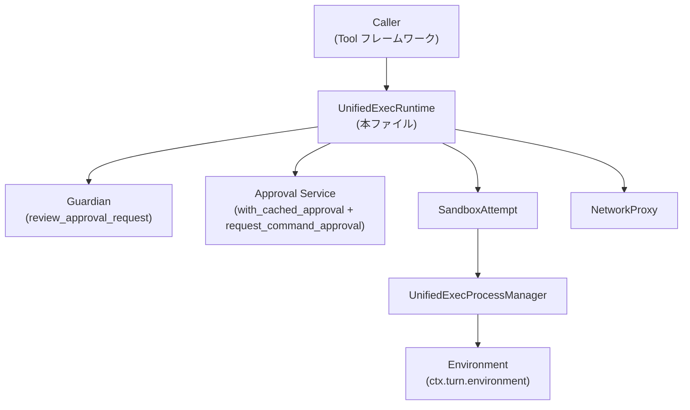

# core/src/tools/runtimes/unified_exec.rs コード解説

## 0. ざっくり一言

- 統一実行（unified-exec）リクエストに対して、**承認フロー＋サンドボックス環境の構築**を行い、実際のプロセス起動は `UnifiedExecProcessManager` に委譲するランタイム実装です（`core/src/tools/runtimes/unified_exec.rs:L47-323`）。
- ネットワーク権限や追加パーミッション、TTY / 非TTY などを含む実行要求をまとめて扱います（`L47-63`）。

---

## 1. このモジュールの役割

### 1.1 概要

このモジュールは、統一実行ツール（unified-exec）のためのランタイムとして、次の問題を解決します。

- **問題**: コマンド実行時に、ユーザー承認・ネットワーク権限・サンドボックス設定・TTY 設定など多様な要件を、安全に一貫した方法で扱いたい。
- **機能**:  
  - 承認のキー生成とキャッシュ付き承認フロー（Guardian / 通常承認）を開始（`L104-171`）。  
  - サンドボックスモードの決定と環境構築（`L173-182`, `L232-242`, `L290-299`）。  
  - コマンドのラップ（PowerShell 用 UTF-8 付与、スナップショット付きシェルラップ）と `UnifiedExecProcessManager` への委譲（`L204-227`, `L290-323`）。

### 1.2 アーキテクチャ内での位置づけ

`UnifiedExecRuntime` は、ツール実行のオーケストレーション層として、承認サービス・サンドボックス・プロセスマネージャを仲介します。



- 承認フェーズ: `start_approval_async` から Guardian / 通常の承認サービスを呼び出します（`L117-171`）。
- 実行フェーズ: `run` から `SandboxAttempt` で exec 環境（`env_for`）を構築し、`UnifiedExecProcessManager::open_session_with_exec_env` に委譲します（`L240-242`, `L265-272`, `L305-312`）。

### 1.3 設計上のポイント

- **責務の分割**（`UnifiedExecRuntime` 本体はほぼ stateless）  
  - フィールドは「プロセスマネージャ参照」と「シェルモード」のみで、状態は外部（要求オブジェクト、コンテキスト）に保持されています（`L79-82`）。
- **承認とサンドボックスの統合**  
  - `Approvable` と `Sandboxable`、`ToolRuntime` の 3 つのトレイトを実装し、承認ポリシー・サンドボックス方針・実行ロジックを一カ所でまとめています（`L94-183`, `L185-323`）。
- **エラーハンドリングの一元化**  
  - 下位からのエラーを `ToolError` にマッピングし、特にサンドボックス拒否は `CodexErr::Sandbox(SandboxErr::Denied {..})` に変換しています（`L273-281`, `L314-321`）。
- **非同期実行モデル**  
  - 承認開始は `BoxFuture` を返す形で非同期化（`L117-121`）、`run` も `async fn` として一連の I/O を await します（`L198-203`）。  
  - `run(&mut self, ...)` というシグネチャにより、同一ランタイムインスタンスに対する同時実行はコンパイル時に防止されます。

### 1.4 コンポーネントインベントリー（型・関数一覧）

#### 型

| 名前 | 種別 | 役割 / 用途 | 定義位置 |
|------|------|-------------|----------|
| `UnifiedExecRequest` | 構造体 | 承認・サンドボックス解決後の実行要求（コマンド、環境、ネットワーク、権限など）を保持 | `core/src/tools/runtimes/unified_exec.rs:L49-64` |
| `UnifiedExecApprovalKey` | 構造体 | 承認結果キャッシュ用のキー。コマンド・cwd・TTY・サンドボックス権限などを含む | `core/src/tools/runtimes/unified_exec.rs:L68-75` |
| `UnifiedExecRuntime<'a>` | 構造体 | unified-exec 用ランタイム。プロセスマネージャ参照とシェルモードを保持 | `core/src/tools/runtimes/unified_exec.rs:L79-82` |

#### 関数 / メソッド

| 名前 | 所属 | 役割 / 用途 | 定義位置 |
|------|------|-------------|----------|
| `new` | `UnifiedExecRuntime` impl | プロセスマネージャ参照とシェルモードからランタイムを生成 | `L84-92` |
| `sandbox_preference` | `Sandboxable` impl | サンドボックス利用のデフォルト方針を返す（Auto） | `L95-97` |
| `escalate_on_failure` | `Sandboxable` impl | サンドボックス失敗時にエスカレーションを行うか（true） | `L99-101` |
| `approval_keys` | `Approvable` impl | 承認キャッシュキーを生成（コマンドの正規化を含む） | `L107-115` |
| `start_approval_async` | `Approvable` impl | Guardian 経由／通常承認経路での非同期承認フローを開始 | `L117-171` |
| `exec_approval_requirement` | `Approvable` impl | リクエストに紐づく承認要件を返す | `L173-178` |
| `sandbox_mode_for_first_attempt` | `Approvable` impl | 初回試行時のサンドボックスモードを決定 | `L180-182` |
| `network_approval_spec` | `ToolRuntime` impl | ネットワーク権限の承認仕様（Deferred モード）を返す | `L186-196` |
| `run` | `ToolRuntime` impl | コマンドラップ、サンドボックス環境準備、プロセスマネージャへの委譲を行うメイン処理 | `L198-323` |

---

## 2. 主要な機能一覧

- unified-exec 実行要求の構造化（`UnifiedExecRequest`）  
- 承認キャッシュキーの生成（`UnifiedExecApprovalKey`・`approval_keys`）  
- Guardian / 通常承認サービスを用いたコマンド実行承認フローの開始（`start_approval_async`）  
- サンドボックスモード（初回試行）の決定（`sandbox_mode_for_first_attempt`）  
- ネットワーク承認仕様（Deferred モード）の提供（`network_approval_spec`）  
- コマンドラップ（snapshot シェル・PowerShell UTF-8 プリフィックス）の適用（`run` 内 `L204-227`）  
- サンドボックス用コマンド生成と環境構築（`build_sandbox_command`, `SandboxAttempt::env_for` 呼び出し、`L233-242`, `L290-299`）  
- zsh-fork backend を用いた特別な unified-exec 経路のサポート（`UnifiedExecShellMode::ZshFork` 分岐、`L232-288`）  
- `UnifiedExecProcessManager` による PTY / セッション起動の委譲とエラーマッピング（`L263-281`, `L305-321`）

---

## 3. 公開 API と詳細解説

### 3.1 型一覧（構造体・列挙体など）

| 名前 | 種別 | 役割 / 用途 | 主なフィールド概要 |
|------|------|-------------|--------------------|
| `UnifiedExecRequest` | 構造体 | 実行時に必要な全情報を保持する要求オブジェクト | `command`, `process_id`, `cwd`, `env`, `explicit_env_overrides`, `network`, `tty`, `sandbox_permissions`, `additional_permissions`, `justification`, `exec_approval_requirement`（`L49-63`） |
| `UnifiedExecApprovalKey` | 構造体 | 同一性の高い実行要求をグルーピングする承認キャッシュキー | `command`（正規化済み）, `cwd`, `tty`, `sandbox_permissions`, `additional_permissions`（`L68-75`） |
| `UnifiedExecRuntime<'a>` | 構造体 | unified-exec ランタイム。外部の `UnifiedExecProcessManager` に依存して実行を行う | `manager: &UnifiedExecProcessManager`, `shell_mode: UnifiedExecShellMode`（`L79-82`） |

`UnifiedExecProcessManager`, `UnifiedExecProcess`, `UnifiedExecError` の定義は `crate::unified_exec` モジュール側にあり、このチャンクには現れません（`L31-34`）。

### 3.2 関数詳細（主要 7 件）

#### `UnifiedExecRuntime::new(manager: &'a UnifiedExecProcessManager, shell_mode: UnifiedExecShellMode) -> UnifiedExecRuntime<'a>`

**概要**

- 統一実行ランタイムを生成します。プロセスマネージャ参照とシェルモードを内部に保持します（`L84-91`）。

**引数**

| 引数名 | 型 | 説明 |
|--------|----|------|
| `manager` | `&'a UnifiedExecProcessManager` | プロセス起動を担当する共有マネージャへの参照（`L80`, `L86`）。 |
| `shell_mode` | `UnifiedExecShellMode` | 実行に用いるシェルモード（通常 / ZshFork など、`L81`, `L86`）。 |

**戻り値**

- `UnifiedExecRuntime<'a>`: 指定されたマネージャとシェルモードで構成されたランタイムインスタンス（`L87-90`）。

**内部処理の流れ**

1. `Self { manager, shell_mode }` で構造体を初期化（`L87-90`）。

**Examples（使用例）**

```rust
// manager と shell_mode の生成方法はこのファイルにはないため、仮のプレースホルダとします。
let manager: &UnifiedExecProcessManager = obtain_manager_somehow(); // 取得方法は別モジュール
let runtime = UnifiedExecRuntime::new(manager, UnifiedExecShellMode::Default);
```

**Errors / Panics**

- この関数は `Result` を返さず、panic を起こす処理も含みません（単純な構造体初期化のみ、`L86-91`）。

**Edge cases**

- `manager` が不正な参照である場合の挙動は、Rust の参照規則に依存し、この関数自身では検証しません。

**使用上の注意点**

- `manager` のライフタイム `'a` は `UnifiedExecRuntime` より長い必要があります（構造体フィールドとして保持されるため、`L79-82`）。

---

#### `approval_keys(&self, req: &UnifiedExecRequest) -> Vec<UnifiedExecApprovalKey>`

**概要**

- 承認キャッシュに用いるキーを生成します。コマンドは承認用に正規化され、cwd・TTY・サンドボックス権限などを含みます（`L107-115`）。

**引数**

| 引数名 | 型 | 説明 |
|--------|----|------|
| `req` | `&UnifiedExecRequest` | 実行要求。必要なフィールドからキーを構築します。 |

**戻り値**

- `Vec<UnifiedExecApprovalKey>`: 現状 1 要素のみを含むベクタ（`L108-115`）。

**内部処理の流れ**

1. `canonicalize_command_for_approval(&req.command)` で承認用コマンドを正規化（`L109`）。  
2. `cwd`, `tty`, `sandbox_permissions`, `additional_permissions` をそのままコピーまたは clone（`L110-113`）。  
3. 単一要素の `Vec` として返却（`L108`, `L115`）。

**Examples（使用例）**

```rust
let key_vec = runtime.approval_keys(&req);          // 承認キーの生成（L107-115）
let key = &key_vec[0];                              // 現状 1 要素のみ想定
```

**Errors / Panics**

- この関数自体は `Result` を返さず、内部で panic を発生させるコードもありません。

**Edge cases**

- `req.command` が空であっても、そのまま `canonicalize_command_for_approval` に渡されます。  
  この関数の挙動は別モジュールで定義されており、このチャンクからは詳細不明です（`L7`, `L109`）。

**使用上の注意点**

- 承認キャッシュを期待する場合、`UnifiedExecRequest` を一貫した形で構築する必要があります。  
  キーは `cwd` や `sandbox_permissions` にも依存するため、これらが異なると別キーになります（`L70-74`）。

---

#### `start_approval_async<'b>(&'b mut self, req: &'b UnifiedExecRequest, ctx: ApprovalCtx<'b>) -> BoxFuture<'b, ReviewDecision>`

**概要**

- 実行要求に対する承認フローを開始し、非同期に `ReviewDecision` を返す `Future` を構築します（`L117-121`）。

**引数**

| 引数名 | 型 | 説明 |
|--------|----|------|
| `req` | `&'b UnifiedExecRequest` | 対象となる実行要求。承認内容の生成に利用。 |
| `ctx` | `ApprovalCtx<'b>` | セッション、ターン、call_id、Guardian レビュー ID など承認コンテキスト（`L120`, `L123-130`）。 |

**戻り値**

- `BoxFuture<'b, ReviewDecision>`: 承認結果（許可／拒否など）を表す `ReviewDecision` を返す `Future`（`L121`）。

**内部処理の流れ**

1. `approval_keys(req)` で承認キャッシュキーを計算（`L122`）。  
2. `ctx` から `session`, `turn`, `call_id`, `retry_reason`, `guardian_review_id` などを取り出し、必要値を clone／変換（`L123-130`）。  
3. `Box::pin(async move { ... })` で非同期ブロックを `BoxFuture` に変換（`L131`）。  
4. Guardian レビュー ID がある場合  
   - `review_approval_request` を呼び出し、`GuardianApprovalRequest::ExecCommand` を渡す（`L133-145`）。  
   - その `await` 結果を直接返す（`L133-148`）。  
5. Guardian レビュー ID が無い場合  
   - `with_cached_approval` に `session.services`, `"unified_exec"`, `keys` と非同期クロージャを渡す（`L150-151`）。  
   - クロージャ内で `session.request_command_approval` を呼び出し、承認を要求（`L152-167`）。  
   - `exec_approval_requirement.proposed_execpolicy_amendment()` の結果をオプションで渡す（`L161-163`）。  
6. `with_cached_approval(...).await` の結果を返す（`L150-169`）。

**Examples（使用例）**

```rust
// 承認フロー開始
let fut = runtime.start_approval_async(&req, approval_ctx);
// どこかの async コンテキストで await
let decision: ReviewDecision = fut.await;
```

**Errors / Panics**

- この関数自体は `Result` を返さず、承認失敗やキャンセルなどは `ReviewDecision` の中に表現されると推測されますが、`ReviewDecision` の詳細はこのチャンクには現れません（`L39`）。  
- 内部で使用する `review_approval_request` や `request_command_approval` からのエラー処理は、この関数内では直接扱っていません（戻り値型が `ReviewDecision` のため）。

**Edge cases**

- `ctx.guardian_review_id` が `Some` の場合は Guardian 経路が必ず優先されます（`L132-149`）。  
- `retry_reason` がある場合は、`reason` に反映され、無い場合は `req.justification` が使われます（`L128-129`）。  
- `req.exec_approval_requirement.proposed_execpolicy_amendment()` が `None` の場合も、そのまま `None` が `request_command_approval` に渡されます（`L161-163`）。

**使用上の注意点**

- `&'b mut self` を取るため、同一ランタイムインスタンスに対してこの関数を並行して呼び出すことはコンパイル時に禁止されます（`L117-119`）。  
- 承認サービスや Guardian の具体的な挙動は外部モジュールに依存します。

---

#### `exec_approval_requirement(&self, req: &UnifiedExecRequest) -> Option<ExecApprovalRequirement>`

**概要**

- 実行要求に紐づく承認要件を `Option` で返します（ここでは必ず `Some`）（`L173-178`）。

**引数**

| 引数名 | 型 | 説明 |
|--------|----|------|
| `req` | `&UnifiedExecRequest` | 実行要求。内部の `exec_approval_requirement` を参照します。 |

**戻り値**

- `Option<ExecApprovalRequirement>`: `Some(req.exec_approval_requirement.clone())` が常に返されます（`L177`）。

**内部処理の流れ**

1. `req.exec_approval_requirement.clone()` を `Some(..)` に包んで返すのみ（`L177`）。

**Examples（使用例）**

```rust
if let Some(requirement) = runtime.exec_approval_requirement(&req) {
    // requirement をもとに UI 表示やログ出力を行うなど
}
```

**Errors / Panics**

- エラーや panic の可能性はありません（単純な clone）。

**Edge cases**

- 現状 `UnifiedExecRequest` 側が `ExecApprovalRequirement` を必須フィールドとして持っているため（`L63`）、`None` が返ることはありません。

**使用上の注意点**

- 将来 `exec_approval_requirement` がオプションになった場合に備え、呼び出し側では `Option` として扱うことができます。

---

#### `sandbox_mode_for_first_attempt(&self, req: &UnifiedExecRequest) -> SandboxOverride`

**概要**

- 最初の実行試行に用いるサンドボックスモードを決定します（`L180-182`）。

**引数**

| 引数名 | 型 | 説明 |
|--------|----|------|
| `req` | `&UnifiedExecRequest` | サンドボックス権限や承認要件を含む実行要求。 |

**戻り値**

- `SandboxOverride`: サンドボックスの動作を上書きする設定（`L180-182`）。

**内部処理の流れ**

1. `sandbox_override_for_first_attempt(req.sandbox_permissions, &req.exec_approval_requirement)` を呼び出して結果をそのまま返す（`L181`）。

**Examples（使用例）**

```rust
let override_mode = runtime.sandbox_mode_for_first_attempt(&req);
// sandbox 実行戦略の決定に利用
```

**Errors / Panics**

- エラーを返さず、panic を発生させるコードもありません。

**Edge cases**

- `sandbox_override_for_first_attempt` の詳細はこのチャンクには無く、挙動は外部モジュールに依存します（`L29`）。

**使用上の注意点**

- 実際の実行では `SandboxAttempt` との組み合わせでサンドボックスが効きます。ここでの設定だけでは実際の制限はかかりません。

---

#### `network_approval_spec(&self, req: &UnifiedExecRequest, _ctx: &ToolCtx) -> Option<NetworkApprovalSpec>`

**概要**

- ネットワークアクセスに関する承認仕様を返します。ネットワークプロキシが設定されているときのみ `Some` を返し、承認モードは `Deferred` です（`L186-196`）。

**引数**

| 引数名 | 型 | 説明 |
|--------|----|------|
| `req` | `&UnifiedExecRequest` | `network: Option<NetworkProxy>` を含む実行要求（`L56`）。 |
| `_ctx` | `&ToolCtx` | コンテキスト（ここでは利用していません、`L189`）。 |

**戻り値**

- `Option<NetworkApprovalSpec>`:  
  - `req.network.is_some()` のとき `Some(NetworkApprovalSpec { network: req.network.clone(), mode: NetworkApprovalMode::Deferred })`。  
  - それ以外は `None`（`L191-195`）。

**内部処理の流れ**

1. `req.network.as_ref()?;` により、`None` の場合は早期 `return None`（`?` 演算子を利用、`L191`）。  
2. `NetworkApprovalSpec` を構築し、`Some(..)` で返却（`L192-195`）。

**Examples（使用例）**

```rust
if let Some(net_spec) = runtime.network_approval_spec(&req, &tool_ctx) {
    // net_spec.mode == NetworkApprovalMode::Deferred であることが保証される（L192-195）
}
```

**Errors / Panics**

- エラー型を返さず、panic も発生しません。

**Edge cases**

- `req.network` が `None` の場合、ネットワーク承認は不要と見なされ `None` が返ります（`L191`）。

**使用上の注意点**

- ネットワーク承認の実際の処理は、`NetworkApprovalSpec` を受け取る上位のフレームワーク側に依存します。

---

#### `run(&mut self, req: &UnifiedExecRequest, attempt: &SandboxAttempt<'_>, ctx: &ToolCtx) -> Result<UnifiedExecProcess, ToolError>`

**概要**

- unified-exec のメイン処理です。コマンドのラップ、環境変数構築、サンドボックス環境生成、zsh-fork backend の条件付き利用、最終的な `UnifiedExecProcessManager` への委譲を行います（`L198-323`）。

**引数**

| 引数名 | 型 | 説明 |
|--------|----|------|
| `req` | `&UnifiedExecRequest` | 実行対象コマンドや環境、ネットワーク等を含む要求。 |
| `attempt` | `&SandboxAttempt<'_>` | サンドボックス環境を構築するためのヘルパ。`env_for` を提供（`L240-242`, `L297-299`）。 |
| `ctx` | `&ToolCtx` | セッション、ターン、環境など実行時コンテキスト（`L205-210`, `L253-260`, `L300-304`）。 |

**戻り値**

- `Result<UnifiedExecProcess, ToolError>`:  
  - 成功時: 起動した unified-exec プロセスのハンドル（`UnifiedExecProcess`、`L203`）。  
  - 失敗時: `ToolError`（種別は `Codex` または `Rejected`）を返します（`L235`, `L242`, `L254-261`, `L301-303`, `L273-281`, `L314-321`）。

**内部処理の流れ（アルゴリズム）**

1. **コマンドのベース取得とリモート環境判定**  
   - `let base_command = &req.command;`（`L204`）。  
   - `session_shell = ctx.session.user_shell()` でユーザーシェル情報取得（`L205`）。  
   - `environment_is_remote` を `ctx.turn.environment.as_ref().is_some_and(|e| e.is_remote())` で判定（`L206-210`）。

2. **コマンドのラップ（スナップショット or そのまま）**  
   - 環境がリモートであれば `base_command.to_vec()` を使用（`L211-212`）。  
   - ローカル環境なら `maybe_wrap_shell_lc_with_snapshot(...)` でスナップショット付きシェルラップを適用（`L213-220`）。

3. **PowerShell 用 UTF-8 プリフィックス付与**  
   - `session_shell.shell_type` が `ShellType::PowerShell` の場合、`prefix_powershell_script_with_utf8(&command)` を適用（`L222-224`）。  
   - それ以外はラップ済み `command` をそのまま利用（`L225`）。

4. **環境変数の構築**  
   - `let mut env = req.env.clone();`（`L228`）。  
   - ネットワークプロキシがあれば `network.apply_to_env(&mut env)` で環境変数に反映（`L229-231`）。

5. **ZshFork backend パス（条件付き）**  
   - `if let UnifiedExecShellMode::ZshFork(zsh_fork_config) = &self.shell_mode { ... }`（`L232`）。  
   - このブロック内で再度 `build_sandbox_command` → `ExecOptions` → `attempt.env_for` により `exec_env` を構築（`L233-242`）。  
   - `zsh_fork_backend::maybe_prepare_unified_exec(...)` を await（`L243-250`）。  
     - `Some(prepared)` の場合:  
       - `ctx.turn.environment` が `Some` かつ非リモートであることを検証し、条件を満たさなければ `ToolError::Rejected` を返す（`L253-261`）。  
       - 問題なければ、`manager.open_session_with_exec_env(..., &prepared.exec_request, prepared.spawn_lifecycle, ...)` で実行し、エラーマッピングを行う（`L263-281`）。  
       - 実行に成功／失敗しても、この時点で `return` する（`L263-281`）。  
     - `None` の場合: `tracing::warn!` で警告を出し、後段の通常実行にフォールバック（`L282-287`）。

6. **通常パス（ZshFork 不使用または fallback）**  
   - `build_sandbox_command` でコマンドを構築（`L290-292`）。  
   - `ExecOptions` を設定し（`L293-295`）、`attempt.env_for` で `exec_env` を作成（`L297-299`）。  
   - `ctx.turn.environment` が `Some` であることを `let Some(environment) = ... else { return Err(ToolError::Rejected(...)); };` で検証（`L300-303`）。  
   - `manager.open_session_with_exec_env(req.process_id, &exec_env, req.tty, Box::new(NoopSpawnLifecycle), environment.as_ref())` を await し、エラーマッピング（`L305-321`）。

**Mermaid フローチャート（run の概要）**

```mermaid
flowchart TD
    %% run (L198-323)
    A["開始<br/>run"] --> B{"環境はリモート？"}
    B -->|Yes| C["command = base_command.to_vec()"]
    B -->|No| D["command = maybe_wrap_shell_lc_with_snapshot(...)"]
    C --> E{"PowerShell？"}
    D --> E
    E -->|Yes| F["command = prefix_powershell_script_with_utf8(command)"]
    E -->|No| G["command = command"]
    F --> H["env = req.env.clone(); network.apply_to_env(&mut env)"]
    G --> H
    H --> I{"shell_mode は ZshFork？"}
    I -->|Yes| J["build_sandbox_command & env_for (exec_env)"]
    J --> K["maybe_prepare_unified_exec(...)"]
    K -->|Some(prepared)| L{"環境が Some かつ非リモート？"}
    L -->|No| M["Err(ToolError::Rejected(...))"]
    L -->|Yes| N["manager.open_session_with_exec_env(... prepared.exec_request ...)"]
    N --> O["結果を ToolError にマッピングして return"]
    K -->|None| P["warn! して通常パスへ"]
    I -->|No| P
    P --> Q["build_sandbox_command & env_for (exec_env)"]
    Q --> R{"環境が Some？"}
    R -->|No| S["Err(ToolError::Rejected(...))"]
    R -->|Yes| T["manager.open_session_with_exec_env(... exec_env ...)"]
    T --> U["結果を ToolError にマッピングして return"]
```

**Errors / Panics**

- **`build_sandbox_command` 失敗時**  
  - `ToolError::Rejected("missing command line for PTY".to_string())` に変換（`L235`, `L291-292`）。  
- **`attempt.env_for` 失敗時**  
  - `ToolError::Codex(err.into())` に変換（`L240-242`, `L297-299`）。  
- **環境が取得できない場合** (`ctx.turn.environment.is_none()`)  
  - `"exec_command is unavailable in this session"` で `ToolError::Rejected` を返す（`L253-256`, `L300-303`）。  
- **zsh-fork backend がリモート環境で使われた場合**  
  - `"unified_exec zsh-fork is not supported when exec_server_url is configured"` で `ToolError::Rejected` を返す（`L258-261`）。  
- **`UnifiedExecProcessManager::open_session_with_exec_env` のエラー**  
  - `UnifiedExecError::SandboxDenied { output, .. }` → `ToolError::Codex(CodexErr::Sandbox(SandboxErr::Denied { output, network_policy_decision: None }))`（`L273-279`, `L315-319`）。  
  - それ以外 → `ToolError::Rejected(other.to_string())`（`L280-281`, `L320-321`）。  
- panic を直接発生させるコードはこの関数にはありません。

**Edge cases（代表例）**

- `req.command` が空: `build_sandbox_command` がエラーを返した場合、`ToolError::Rejected("missing command line for PTY")` になります（`L233-235`, `L290-292`）。  
- `req.network` が `None`: `network.apply_to_env` は呼ばれず、ネットワーク関連の環境変数は設定されません（`L229-231`）。  
- `ctx.turn.environment` が `None`: どの実行パスでも `ToolError::Rejected("exec_command is unavailable in this session")` になります（`L253-256`, `L300-303`）。  
- `shell_mode` が `UnifiedExecShellMode::ZshFork` でも、`maybe_prepare_unified_exec` が `None` を返した場合は、警告ログを出して通常パスにフォールバックします（`L283-287`）。

**使用上の注意点**

- `&mut self` を取るため、ひとつの `UnifiedExecRuntime` インスタンスで複数の `run` を同時に実行することはできません（Rust の借用規則上、`L198-200`）。  
- `ctx.turn.environment` が必須です。これが設定されていないセッションでは実行できません（`L253-256`, `L300-303`）。  
- ZshFork モードはリモート環境ではサポートされていません（`L258-261`）。  
- エラーの詳細（特に `build_sandbox_command` 失敗時）は `"missing command line for PTY"` に固定されるため、より詳細な診断は上位レイヤーでのログ出力に依存します。

---

### 3.3 その他の関数

| 関数名 | 所属 | 役割（1 行） | 定義位置 |
|--------|------|--------------|----------|
| `sandbox_preference(&self)` | `Sandboxable` impl | サンドボックスのデフォルト方針として `SandboxablePreference::Auto` を返す | `L95-97` |
| `escalate_on_failure(&self)` | `Sandboxable` impl | サンドボックス失敗時に権限エスカレーションを行うことを示す `true` を返す | `L99-101` |

---

## 4. データフロー

代表的なシナリオとして、「承認済み unified-exec コマンドをローカル環境で実行する」場合のデータフローを示します。

1. フレームワークが既に承認済みの `UnifiedExecRequest` と `SandboxAttempt`, `ToolCtx` を用意します。  
2. `ToolRuntime::run` が呼ばれ、コマンドラップ・環境構築・サンドボックス設定を行います（`L204-242`, `L290-299`）。  
3. `UnifiedExecProcessManager::open_session_with_exec_env` に `exec_env` と TTY 設定などが渡され、プロセスが起動されます（`L265-272`, `L305-312`）。

```mermaid
sequenceDiagram
    %% run (L198-323)
    participant FW as Framework/Caller
    participant RT as UnifiedExecRuntime
    participant SA as SandboxAttempt
    participant PM as UnifiedExecProcessManager
    participant ENV as Environment(ctx.turn.environment)

    FW->>RT: run(&req, &attempt, &ctx)
    RT->>RT: base_command, session_shell, environment_is_remote 計算 (L204-210)
    RT->>RT: コマンドラップ (snapshot / PowerShell) (L211-226)
    RT->>RT: env = req.env.clone(); network.apply_to_env (L228-231)
    alt shell_mode = ZshFork
        RT->>RT: build_sandbox_command, ExecOptions, SA.env_for (L233-242)
        RT->>RT: maybe_prepare_unified_exec(...) (L243-250)
        alt Some(prepared)
            RT->>ENV: ctx.turn.environment 取得 (L253-257)
            RT->>PM: open_session_with_exec_env(prepared.exec_request, prepared.spawn_lifecycle, ...) (L263-271)
            PM-->>RT: Result<UnifiedExecProcess, UnifiedExecError> (L272-281)
        else None
            RT->>RT: warn! ログ出力 (L283-287)
        end
    end
    RT->>RT: build_sandbox_command, ExecOptions, SA.env_for (L290-299)
    RT->>ENV: ctx.turn.environment 取得 (L300-304)
    RT->>PM: open_session_with_exec_env(exec_env, NoopSpawnLifecycle, ...) (L305-312)
    PM-->>RT: Result<UnifiedExecProcess, UnifiedExecError> (L313-321)
    RT-->>FW: Result<UnifiedExecProcess, ToolError>
```

---

## 5. 使い方（How to Use）

### 5.1 基本的な使用方法

このモジュールは通常、ツール実行フレームワークから `ToolRuntime<UnifiedExecRequest, UnifiedExecProcess>` として利用される想定です。ここでは簡略化した擬似コードを示します。

```rust
// manager や ctx の生成方法はこのファイルには無いため、仮実装とします。
async fn run_unified_exec_example(
    manager: &UnifiedExecProcessManager,  // 外部から提供される
    req: UnifiedExecRequest,              // 事前に承認済みのリクエスト
    attempt: SandboxAttempt<'_>,          // サンドボックス試行コンテキスト
    ctx: ToolCtx,                         // 実行コンテキスト
) -> Result<UnifiedExecProcess, ToolError> {
    // ランタイムを作成（L84-92）
    let mut runtime = UnifiedExecRuntime::new(manager, UnifiedExecShellMode::Default);

    // メイン処理を実行（L198-323）
    runtime.run(&req, &attempt, &ctx).await
}
```

※ `UnifiedExecProcessManager`, `SandboxAttempt`, `ToolCtx` の具体的な生成方法はこのチャンクには現れません。

### 5.2 よくある使用パターン

1. **ネットワークありのコマンド実行**

   - `UnifiedExecRequest` に `network: Some(NetworkProxy)` をセットすると、`run` 内で環境変数が設定され、`network_approval_spec` も `Some` を返すようになります（`L56`, `L186-196`, `L228-231`）。

2. **ZshFork backend を利用した実行**

   - `UnifiedExecRuntime::new(manager, UnifiedExecShellMode::ZshFork(config))` のように初期化すると、`run` 内の ZshFork パスが優先されます（`L232-288`）。
   - ただし、ローカル環境かつ `ctx.turn.environment` が存在することが前提です（`L253-261`）。

### 5.3 よくある間違い

```rust
// 間違い例: ZshFork モードをリモート環境で使おうとしている
let mut runtime = UnifiedExecRuntime::new(manager, UnifiedExecShellMode::ZshFork(config));
let result = runtime.run(&req, &attempt, &ctx).await;
// ctx.turn.environment.is_some() かつ is_remote() == true の場合、
// "unified_exec zsh-fork is not supported when exec_server_url is configured"
// というメッセージで ToolError::Rejected になります（L258-261）。

// 正しい例: ZshFork モードはローカル環境で使用する
assert!(ctx.turn.environment.as_ref().is_some());
assert!(!ctx.turn.environment.as_ref().unwrap().is_remote());
let result = runtime.run(&req, &attempt, &ctx).await?;
```

```rust
// 間違い例: ctx.turn.environment が設定されていない
let ctx_without_env = ToolCtx { turn: /* environment: None */, /* ... */ };
let result = runtime.run(&req, &attempt, &ctx_without_env).await;
// "exec_command is unavailable in this session" で Rejected になる（L300-303）。

// 正しい例: environment を設定してから実行
let ctx_with_env = ToolCtx { turn: /* environment: Some(...) */, /* ... */ };
let result = runtime.run(&req, &attempt, &ctx_with_env).await?;
```

### 5.4 使用上の注意点（まとめ）

- **前提条件**
  - `ctx.turn.environment` が `Some` である必要があります（`L253-256`, `L300-303`）。
  - ZshFork モード利用時は環境がローカルでなければなりません（`L258-261`）。
- **エラー処理**
  - サンドボックス拒否は `ToolError::Codex(CodexErr::Sandbox(SandboxErr::Denied { ... }))` に変換されます（`L273-279`, `L315-319`）。
  - コマンド組み立てに失敗した場合は `"missing command line for PTY"` で `Rejected` されます（`L235`, `L291-292`）。
- **並行実行**
  - `run` と `start_approval_async` はいずれも `&mut self` を取るため、ひとつの `UnifiedExecRuntime` を複数タスクから同時に操作するには外部で同期（別インスタンスやロック）が必要です（`L117-119`, `L198-200`）。
- **ログ / 観測性**
  - ZshFork 条件が満たされない場合には `tracing::warn!` が出力されます（`L283-287`）。他のパスでは明示的なログはありません。

---

## 6. 変更の仕方（How to Modify）

### 6.1 新しい機能を追加する場合

- **別種のシェルモードを追加したい場合**
  1. `UnifiedExecShellMode` に新しいバリアントを追加（このチャンクには定義が無いため、該当モジュール側で変更）。  
  2. `run` 内の `if let UnifiedExecShellMode::ZshFork(...)` 付近に、新モード用の分岐を追加（`L232-289`）。  
  3. 必要に応じて `build_sandbox_command` 呼び出し前後の処理を拡張。

- **承認キーに新しい要素を追加したい場合**
  1. `UnifiedExecApprovalKey` にフィールド追加（`L68-75`）。  
  2. `approval_keys` 内で該当フィールドを設定するコードを追加（`L107-115`）。  
  3. 既存の承認キャッシュに影響するため、互換性に注意が必要です。

### 6.2 既存の機能を変更する場合

- **エラーメッセージやマッピングの変更**
  - `build_sandbox_command` 失敗時や `env_for` 失敗時のメッセージは `run` 内で直接指定されているため（`L235`, `L291-292`, `L240-242`, `L297-299`）、ここを変更すると上位でのエラー表示も変わります。
- **承認フローの変更**
  - Guardian を優先するかどうか、または `with_cached_approval` のキーやスコープを変更したい場合は `start_approval_async` を確認・変更します（`L117-171`）。  
  - `ApprovalCtx` や `UnifiedExecApprovalKey` の構造に依存しているため、対応する型の定義も併せて確認する必要があります。
- **影響範囲の確認方法**
  - `UnifiedExecRuntime` は `ToolRuntime<UnifiedExecRequest, UnifiedExecProcess>` として利用されるため、`ToolRuntime` の実装箇所や unified-exec ツールの呼び出し元を検索することで影響範囲を把握できます。  
  - サンドボックスや承認に関連するコードは `crate::tools::sandboxing` モジュール全体（`L20-30`）と密接に関係しています。

---

## 7. 関連ファイル

| パス / モジュール | 役割 / 関係 |
|------------------|------------|
| `crate::unified_exec` | `UnifiedExecProcessManager`, `UnifiedExecProcess`, `UnifiedExecError`, `NoopSpawnLifecycle` などを定義するモジュール。このランタイムが依存するプロセス管理層（`L31-34`）。 |
| `crate::tools::sandboxing` | `Approvable`, `Sandboxable`, `ToolRuntime`, `SandboxAttempt`, `ToolCtx`, `ToolError`, `ExecApprovalRequirement` などサンドボックス関連のトレイト・型を提供（`L20-29`）。 |
| `crate::tools::runtimes` | `build_sandbox_command`, `maybe_wrap_shell_lc_with_snapshot` など、ツール実行時のコマンド構築用ユーティリティ群（`L17-18`）。 |
| `crate::tools::runtimes::shell::zsh_fork_backend` | ZshFork backend の準備処理 `maybe_prepare_unified_exec` を提供し、特別な unified-exec 経路を実装（`L19`, `L243-250`）。 |
| `crate::tools::network_approval` | `NetworkApprovalSpec`, `NetworkApprovalMode` などネットワーク承認に関する型を提供（`L15-16`, `L186-196`）。 |
| `crate::guardian` | Guardian 承認フロー（`GuardianApprovalRequest`, `review_approval_request`）を提供（`L10-11`, `L133-145`）。 |
| `codex_shell_command::powershell` | PowerShell スクリプトへ UTF-8 BOM などのプリフィックスを付与するユーティリティ（`L41`, `L222-224`）。 |

※ テストコードやベンチマークコードはこのチャンクには含まれていません。
