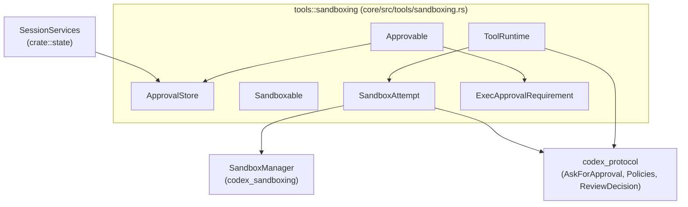
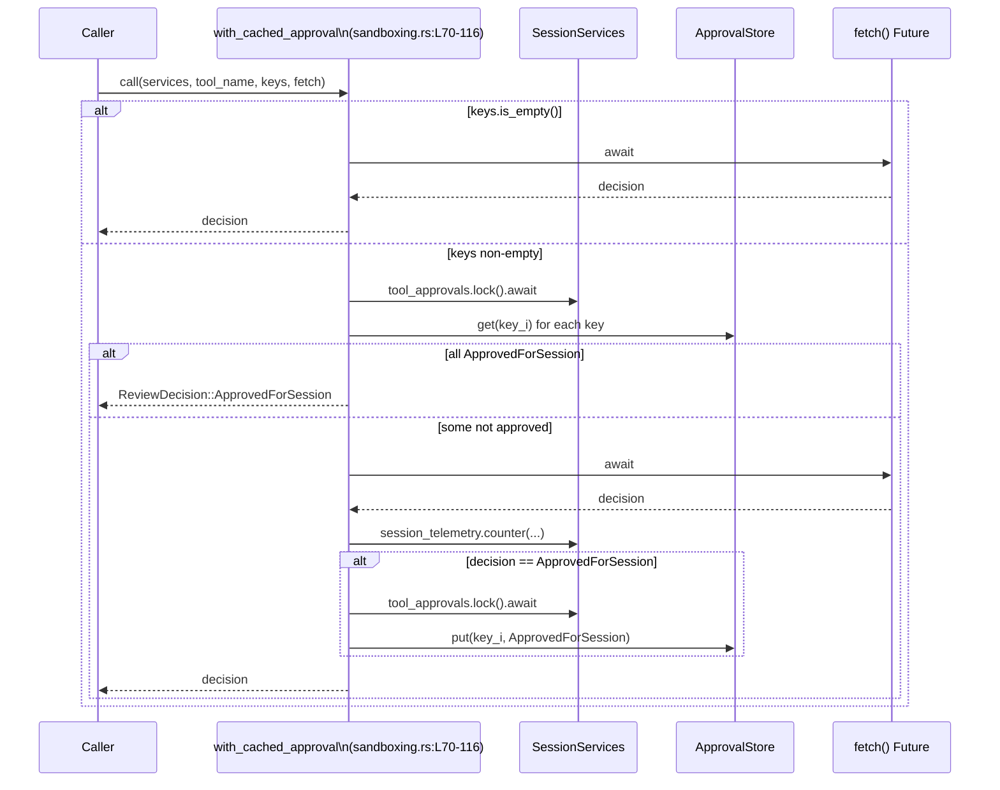

# core/src/tools/sandboxing.rs

## 0. ざっくり一言

tool 実行時の「ユーザー承認フロー」と「サンドボックス実行フロー」を共通化するための、ストア・コンテキスト・トレイト・ヘルパー関数をまとめたモジュールです（`ApprovalStore`, `Approvable`, `Sandboxable`, `ToolRuntime`, `SandboxAttempt` など, sandboxing.rs:L39-42, L243-291, L294-299, L314-325, L327-338）。

---

## 1. このモジュールの役割

### 1.1 概要

- このモジュールは、**tool 実行に対するユーザー承認とサンドボックス実行の制御**を行うための primitives を提供します（sandboxing.rs:L1-5）。
- セッションごとの承認結果キャッシュ（`ApprovalStore`）と、承認ダイアログに必要なコンテキスト（`ApprovalCtx`）を管理します（sandboxing.rs:L39-42, L118-132）。
- 実行ポリシーに基づき、承認が必要か／禁止か／不要かを判定する `ExecApprovalRequirement` と、そのデフォルト計算ロジックを提供します（sandboxing.rs:L135-155, L178-214）。
- tool ランタイムがサンドボックス環境を構成するための `SandboxAttempt` と、その中から実際の `ExecRequest` を組み立てる `env_for` を提供します（sandboxing.rs:L327-338, L341-368）。

### 1.2 アーキテクチャ内での位置づけ

このモジュールは、以下のようなコンポーネントを仲介します。

- セッション状態・メトリクス（`SessionServices`）との連携（sandboxing.rs:L70-116）
- プロトコルレベルの承認・ポリシー型群（`AskForApproval`, `ReviewDecision`, `FileSystemSandboxPolicy` など）との橋渡し（sandboxing.rs:L14-21, L178-214）
- サンドボックス実行エンジン（`SandboxManager`, `SandboxCommand`, `SandboxType`）への変換（sandboxing.rs:L24-29, L327-368）
- 各 tool 固有のロジックを実装する `ToolRuntime` / `Approvable` / `Sandboxable` をまとめる基底トレイト群（sandboxing.rs:L243-291, L294-299, L314-325）

依存関係を簡略化した図は次の通りです（本図は sandboxing.rs:L1-373 に基づきます）。



### 1.3 設計上のポイント

コードから読み取れる特徴を列挙します。

- **承認キャッシュの抽象化**  
  - 承認キーを任意型 `K: Serialize` とし、JSON 文字列にシリアライズして内部キーにしています（sandboxing.rs:L45-52, L54-61）。
  - これにより、多様な「承認対象」（コマンド列、ファイルパス集合など）を一貫した方式でキャッシュできます。

- **承認ポリシーの明示的な表現**  
  - `ExecApprovalRequirement` を使って、「承認不要 (Skip)」「承認必要 (NeedsApproval)」「実行禁止 (Forbidden)」を enum で表現しています（sandboxing.rs:L135-155）。
  - `default_exec_approval_requirement` で `AskForApproval` とファイルシステムサンドボックスの状態からデフォルト判定を行います（sandboxing.rs:L178-214）。

- **サンドボックスのオーバーライド**  
  - `SandboxOverride` と `sandbox_override_for_first_attempt` によって、「最初の 1 回だけサンドボックスをバイパスする」かどうかを一元的に決定できます（sandboxing.rs:L216-220, L222-240）。

- **tool ランタイム向けの共通トレイト**  
  - tool ごとに `Approvable<Req>` + `Sandboxable` + `ToolRuntime<Req, Out>` を実装することで、承認フローとサンドボックスフローを統一的に扱えるようにしています（sandboxing.rs:L243-291, L294-299, L314-325）。
  - 非同期処理には `async fn` や `BoxFuture` を用い、Rust の async/await による並行性を活用しています（sandboxing.rs:L70-81, L287-291, L319-324）。

- **サンドボックス構成のカプセル化**  
  - `SandboxAttempt` が、サンドボックス種別・ポリシー群・OS ごとのオプションをまとめて持ち、`env_for` で `SandboxManager::transform` を呼び出して低レベルな `ExecRequest` に変換します（sandboxing.rs:L327-338, L341-368）。

---

## 2. 主要な機能一覧

このモジュールが提供する主な機能は次の通りです。

- 承認キャッシュ管理: セッションごとの承認結果をキーごとに保存・参照する `ApprovalStore`（sandboxing.rs:L39-61）。
- 承認付き実行ヘルパー: キャッシュを利用して不要な承認ダイアログを省略する `with_cached_approval`（sandboxing.rs:L64-116）。
- 承認コンテキスト: セッション・ターン・呼び出し ID など承認に必要な情報をまとめる `ApprovalCtx`（sandboxing.rs:L118-132）。
- 実行承認要件の決定: `AskForApproval` とファイルシステムポリシーから `ExecApprovalRequirement` を決定する `default_exec_approval_requirement`（sandboxing.rs:L135-155, L178-214）。
- サンドボックスオーバーライド判定: 追加権限や exec ポリシーに基づき最初の試行でサンドボックスをバイパスするか決める `sandbox_override_for_first_attempt`（sandboxing.rs:L216-220, L222-240）。
- Approvable トレイト: 各 tool で「承認キーの算出」「承認フローの開始」を実装するためのインターフェース（sandboxing.rs:L243-291）。
- Sandboxable トレイト: tool が希望するサンドボックスの好みや、失敗時のエスカレーション方針を表現するインターフェース（sandboxing.rs:L294-299）。
- ToolRuntime トレイト: tool の実行本体 (`run`) とネットワーク承認仕様を定義するインターフェース（sandboxing.rs:L314-325）。
- サンドボックス環境構成: `SandboxAttempt::env_for` による `SandboxCommand` → `ExecRequest` 変換（sandboxing.rs:L341-368）。

---

## 3. 公開 API と詳細解説

### 3.1 型一覧（構造体・列挙体・トレイト）

| 名前 | 種別 | 役割 / 用途 | 定義位置 |
|------|------|-------------|----------|
| `ApprovalStore` | 構造体 | 承認結果を JSON 文字列キーでキャッシュするストア | sandboxing.rs:L39-42 |
| `ApprovalCtx<'a>` | 構造体 | 承認ダイアログに必要なセッション・ターン・レビュー ID などのコンテキスト | sandboxing.rs:L118-132 |
| `ExecApprovalRequirement` | 列挙体 | tool 実行に対して「承認不要 / 必要 / 禁止」を表現 | sandboxing.rs:L135-155 |
| `SandboxOverride` | 列挙体 | 最初の試行でサンドボックスをバイパスするかどうかのフラグ | sandboxing.rs:L216-220 |
| `Approvable<Req>` | トレイト | リクエストに対する承認キー生成と承認フローを定義するインターフェース | sandboxing.rs:L243-291 |
| `Sandboxable` | トレイト | サンドボックスの好み・失敗時エスカレーション方針を定義するインターフェース | sandboxing.rs:L294-299 |
| `ToolCtx` | 構造体 | tool 実行時のセッション・ターン・call_id・tool 名を束ねるコンテキスト | sandboxing.rs:L301-305 |
| `ToolError` | 列挙体 | tool 実行時のエラーを「ユーザー拒否」と「CodexErr」に分類 | sandboxing.rs:L308-312 |
| `ToolRuntime<Req, Out>` | トレイト | tool の本体実行とネットワーク承認仕様を定義するランタイムインターフェース | sandboxing.rs:L314-325 |
| `SandboxAttempt<'a>` | 構造体 | 1 回のサンドボックス付き実行試行に必要なサンドボックス種別・ポリシー・マネージャなど | sandboxing.rs:L327-338 |

### 3.2 関数詳細（重要なもの 7 件）

#### `ApprovalStore::get<K>(&self, key: &K) -> Option<ReviewDecision>`

**概要**

- 与えられた任意型キー `key` を JSON 文字列にシリアライズし、内部の `HashMap` から対応する `ReviewDecision` を取得します（sandboxing.rs:L45-52）。
- シリアライズに失敗した場合や、キーが存在しない場合は `None` を返します。

**引数**

| 引数名 | 型 | 説明 |
|--------|----|------|
| `key` | `&K` (`K: Serialize`) | 承認キャッシュを引くためのキー。任意のシリアライズ可能な型。 |

**戻り値**

- `Option<ReviewDecision>`  
  - `Some(decision)`: キャッシュに対応する承認結果が存在する場合。  
  - `None`: キーが存在しないか、キーのシリアライズに失敗した場合。

**内部処理の流れ**

1. `serde_json::to_string(key)` でキーを JSON 文字列に変換し、失敗した場合は早期 `None` を返します（sandboxing.rs:L50）。
2. `self.map.get(&s)` で内部 `HashMap<String, ReviewDecision>` から検索し、`cloned()` でコピーを返します（sandboxing.rs:L51）。

**Examples（使用例）**

```rust
use codex_protocol::protocol::ReviewDecision;
use crate::tools::sandboxing::ApprovalStore; // 実際のパスはクレート構成に依存

fn example() {
    let mut store = ApprovalStore::default();                    // 空のストアを作成

    let key = "my-tool:command-123";                             // &str をキーとして使う
    store.put(key, ReviewDecision::ApprovedForSession);          // 同じキーで承認結果を保存

    let result = store.get(&key);                                // キーを参照で渡して検索
    assert!(matches!(result, Some(ReviewDecision::ApprovedForSession)));
}
```

**Errors / Panics**

- エラー型は返さず、シリアライズ失敗は `None` として扱います（sandboxing.rs:L50）。
- パニックを起こすコードは含まれていません。メモリ不足などのランタイム要因は別です。

**Edge cases（エッジケース）**

- キーが大きい／複雑: シリアライズコストが増加しますが、挙動は同じです。
- シリアライズ不能な値（NaN を含む浮動小数など）: `serde_json::to_string` が `Err` を返し、結果として `None` になります（sandboxing.rs:L50）。
- 同じ論理キーでもシリアライズ表現が変わる場合（型やフォーマットが違う場合）はヒットしません。

**使用上の注意点**

- **キーの安定性**: セッション内で同じ操作に対して同じ JSON 文字列が生成されるようなキー設計が必要です（例: フィールドの順序やフォーマットが変わらないようにする）。
- **型ごとの分離**: `HashMap<String, ReviewDecision>` に格納されるため、異なる `K` 型でも同じ JSON 文字列を生成すると衝突しうる点に留意します（ただし、同一 `ApprovalStore` に複数の `K` を混在させるかどうかは呼び出し側設計によります）。

#### `ApprovalStore::put<K>(&mut self, key: K, value: ReviewDecision)`

**概要**

- 任意型キー `key` を JSON 文字列にシリアライズして `HashMap` に保存します（sandboxing.rs:L54-61）。
- シリアライズに失敗した場合は何も保存しません。

**引数**

| 引数名 | 型 | 説明 |
|--------|----|------|
| `key` | `K` (`K: Serialize`) | 承認結果を結びつけるキー。所有権を受け取ります。 |
| `value` | `ReviewDecision` | 保存する承認結果。 |

**戻り値**

- なし（`()`）。成功／失敗は返しません。

**内部処理の流れ**

1. `serde_json::to_string(&key)` を呼び出し、成功した場合のみ内側のブロックに進みます（sandboxing.rs:L58）。
2. 成功時は得られた文字列をキーとして `self.map.insert(s, value)` を実行します（sandboxing.rs:L59）。

**Examples（使用例）**

上記 `get` の例を参照してください。`put` と `get` はペアで動作します。

**Errors / Panics**

- シリアライズに失敗してもエラーを返さず、単に何も保存しません（sandboxing.rs:L58-60）。
- パニックは意図的には発生しません。

**Edge cases**

- `key` がシリアライズ不能: 何も保存されず、そのキーに対する `get` は常に `None` になります。
- 同じ JSON 文字列キーで複数回 `put` した場合: 後から保存した値で上書きされます（`HashMap::insert` の仕様）。

**使用上の注意点**

- シリアライズ失敗を検知する必要がある場合は、この関数の上位で別途チェックする必要があります（この実装はサイレントに失敗します）。
- 大量のキーを保存する場合は `HashMap` のサイズ増大によるメモリ使用に注意します。

---

#### `with_cached_approval<K, F, Fut>(...) -> ReviewDecision`

**概要**

- 複数の承認キーに対する「セッション内承認済みかどうか」を `ApprovalStore` でチェックし、必要なら `fetch()` で承認を問い合わせ、`ApprovedForSession` の場合はキャッシュに保存します（sandboxing.rs:L64-116）。
- 承認ダイアログの回数を最小化しつつ、ツールごとのメトリクス（`session_telemetry`）を記録します（sandboxing.rs:L99-106）。

**シグネチャ**

```rust
pub(crate) async fn with_cached_approval<K, F, Fut>(
    services: &SessionServices,
    tool_name: &str,
    keys: Vec<K>,
    fetch: F,
) -> ReviewDecision
where
    K: Serialize,
    F: FnOnce() -> Fut,
    Fut: Future<Output = ReviewDecision>,
```

（sandboxing.rs:L70-81）

**引数**

| 引数名 | 型 | 説明 |
|--------|----|------|
| `services` | `&SessionServices` | `tool_approvals` と `session_telemetry` を提供するセッションサービス（sandboxing.rs:L71, L88-89, L99-106）。 |
| `tool_name` | `&str` | メトリクス用のツール名ラベル（sandboxing.rs:L72, L103）。 |
| `keys` | `Vec<K>` | 承認対象を表す 1 個以上のキー。複数ファイルなど複数ターゲットに対応（sandboxing.rs:L74, L87-91）。 |
| `fetch` | `F: FnOnce() -> Fut` | キャッシュにヒットしなかった場合に実際の承認ダイアログ等を行う非同期処理（sandboxing.rs:L75, L97）。 |

**戻り値**

- `ReviewDecision`  
  - 承認ダイアログの結果、または既存キャッシュに基づく結果。  
  - `ApprovedForSession` の場合のみ、すべてのキーについてキャッシュが更新されます（sandboxing.rs:L108-113）。

**内部処理の流れ（アルゴリズム）**

1. `keys` が空ならキャッシュを一切見ずに `fetch().await` の結果をそのまま返します（sandboxing.rs:L82-85）。
2. `services.tool_approvals.lock().await` で承認ストアへの排他アクセスを取得し、全キーが `ApprovedForSession` かどうかを `iter().all(...)` でチェックします（sandboxing.rs:L87-91）。
3. 全て承認済みなら `ReviewDecision::ApprovedForSession` を即座に返し、`fetch` は呼びません（sandboxing.rs:L93-95）。
4. そうでなければ `let decision = fetch().await;` で承認処理を実行します（sandboxing.rs:L97）。
5. `services.session_telemetry.counter(...)` を呼び出し、ツール名と承認結果文字列をメトリクスとして記録します（sandboxing.rs:L99-106）。
6. `decision` が `ApprovedForSession` の場合、再度 `tool_approvals.lock().await` を取り、各キーについて `store.put(key, ApprovedForSession)` を実行します（sandboxing.rs:L108-113）。
7. 最終的に `decision` を返します（sandboxing.rs:L115）。

**Examples（使用例）**

```rust
use codex_protocol::protocol::ReviewDecision;
use crate::state::SessionServices;
use crate::tools::sandboxing::with_cached_approval;

// 擬似的な fetch 実装: 毎回「セッション中は許可」を返す
async fn ask_user_once() -> ReviewDecision {
    ReviewDecision::ApprovedForSession
}

async fn run_tool_with_approval(
    services: &SessionServices,
    command: &str,
) -> ReviewDecision {
    // 単一コマンド文字列を承認キーとして用いる
    let keys = vec![command.to_string()];

    with_cached_approval(
        services,
        "shell",          // tool_name
        keys,
        || ask_user_once(),  // fetch クロージャ
    ).await
}
```

**Errors / Panics**

- エラー型は返さず、常に `ReviewDecision` を返します。`fetch` 側でエラーをどのように `ReviewDecision` に反映させるかは呼び出し側次第です。
- `tool_approvals.lock().await` がパニックする可能性は、内部の `Mutex` 実装に依存しますが、このファイル内では明示的なパニック処理はありません。

**Edge cases（エッジケース）**

- `keys.is_empty()` の場合: キャッシュは一切利用されず、メトリクス記録も行われません（sandboxing.rs:L82-85, L99-106 の前で return）。
- 複数キーのうち一部だけ承認済み: `all(...)` により 1 つでも未承認があると `already_approved == false` となり、再度承認ダイアログが行われます（sandboxing.rs:L87-91）。
- 複数の並行呼び出し: 2 つの呼び出しが同じキー集合で同時に実行されると、どちらも「未承認」と判断して二重に `fetch` する可能性がありますが、ストア更新は単純に上書きされるだけです。

**使用上の注意点**

- **非同期ロックの粒度**: `fetch().await` の前後で `tool_approvals` ロックを解放しているため（ロックは内側のブロックでスコープアウトします, sandboxing.rs:L87-91, L108-113）、長時間の承認 UI によるロック延長は発生しません。  
- **承認キーの粒度**: コメントにある通り、`apply_patch` のように複数ファイル単位で承認を管理したい場合、ファイルパスごとにキーを生成する前提で設計されています（sandboxing.rs:L246-252）。ツール側がキーの分解度を適切に設計する必要があります。
- **メトリクス**: 承認がキャッシュからの `ApprovedForSession` でスキップされた場合は、メトリクス `codex.approval.requested` は増えません（sandboxing.rs:L93-106）。

---

#### `default_exec_approval_requirement(policy, file_system_sandbox_policy) -> ExecApprovalRequirement`

**概要**

- プロトコルレベルの `AskForApproval` 設定とファイルシステムサンドボックスの種類から、デフォルトの `ExecApprovalRequirement`（承認不要 / 必要 / 禁止）を決定します（sandboxing.rs:L173-177, L178-214）。
- `Granular` 設定で「サンドボックス承認が許可されていない」場合は `Forbidden` を返し、それ以外では `NeedsApproval` か `Skip` を返します（sandboxing.rs:L193-213）。

**シグネチャ**

```rust
pub(crate) fn default_exec_approval_requirement(
    policy: AskForApproval,
    file_system_sandbox_policy: &FileSystemSandboxPolicy,
) -> ExecApprovalRequirement
```

（sandboxing.rs:L178-181）

**引数**

| 引数名 | 型 | 説明 |
|--------|----|------|
| `policy` | `AskForApproval` | 実行時承認ポリシー。`Never`, `OnFailure`, `OnRequest`, `Granular(_)`, `UnlessTrusted` など（sandboxing.rs:L173-177, L182-191）。 |
| `file_system_sandbox_policy` | `&FileSystemSandboxPolicy` | ファイルシステムサンドボックスの種別を含むポリシー（`kind` フィールドを参照, sandboxing.rs:L186-188）。 |

**戻り値**

- `ExecApprovalRequirement`:  
  - `Skip { bypass_sandbox: false, proposed_execpolicy_amendment: None }`（承認不要, sandboxing.rs:L209-212）  
  - `NeedsApproval { reason: None, proposed_execpolicy_amendment: None }`（承認必要, sandboxing.rs:L203-207）  
  - `Forbidden { reason: "approval policy disallowed sandbox approval prompt".to_string() }`（承認ダイアログ自体が禁止, sandboxing.rs:L200-202）

**内部処理の流れ**

1. `needs_approval` を計算します（sandboxing.rs:L182-191）。
   - `Never` / `OnFailure` → `false`  
   - `OnRequest` / `Granular(_)` → `file_system_sandbox_policy.kind` が `Restricted` の場合のみ `true`（sandboxing.rs:L185-188）。  
   - `UnlessTrusted` → `true`。
2. `needs_approval` が `true` かつ `policy` が `Granular(granular_config)` で `!granular_config.allows_sandbox_approval()` の場合、`Forbidden` を返します（sandboxing.rs:L193-199, L200-202）。
3. それ以外で `needs_approval == true` の場合、`NeedsApproval { reason: None, proposed_execpolicy_amendment: None }` を返します（sandboxing.rs:L203-207）。
4. `needs_approval == false` の場合、`Skip { bypass_sandbox: false, proposed_execpolicy_amendment: None }` を返します（sandboxing.rs:L209-212）。

**Examples（使用例）**

```rust
use codex_protocol::protocol::AskForApproval;
use codex_protocol::permissions::{FileSystemSandboxPolicy, FileSystemSandboxKind};
use crate::tools::sandboxing::{default_exec_approval_requirement, ExecApprovalRequirement};

fn example() {
    let fs_policy = FileSystemSandboxPolicy {
        kind: FileSystemSandboxKind::Restricted,
        // 他のフィールドは省略
    };

    let requirement = default_exec_approval_requirement(
        AskForApproval::OnRequest,
        &fs_policy,
    );

    assert!(matches!(requirement, ExecApprovalRequirement::NeedsApproval { .. }));
}
```

**Errors / Panics**

- エラー型は返さず、純粋関数として定義されています。
- パニックを起こす処理はありません。

**Edge cases**

- ファイルシステムアクセスが unrestricted な場合（`FileSystemSandboxKind` が `Restricted` 以外）に `OnRequest` / `Granular(_)` が設定されていると、`needs_approval == false` となり、結果的に `Skip` になります（sandboxing.rs:L185-189）。
- `Granular` かつ `allows_sandbox_approval() == false` の場合は、承認ダイアログ自体が禁止される (`Forbidden`) ため、上位ロジックで適切なエラー表示が必要です（sandboxing.rs:L193-202）。

**使用上の注意点**

- `Approvable::exec_approval_requirement` が `Some(_)` を返す場合、この関数は呼び出し側でスキップされる設計になっています（Approvable のコメント, sandboxing.rs:L270-274）。デフォルトを上書きする場合は、呼び出し方を明確にしておく必要があります。
- `needs_approval` の判定はファイルシステムの制限度合いに依存するため、ポリシー設定を変更した場合は期待どおりの `ExecApprovalRequirement` が返っているか確認が必要です。

---

#### `sandbox_override_for_first_attempt(sandbox_permissions, exec_approval_requirement) -> SandboxOverride`

**概要**

- 追加権限が要求されている場合や `ExecApprovalRequirement::Skip` に `bypass_sandbox: true` が設定されている場合、最初の試行でサンドボックスをバイパスするためのフラグを返します（sandboxing.rs:L222-240）。
- 「ExecPolicy `Allow` can intentionally imply full trust」というコメントから、ExecPolicy 側の設定を優先する意図が読み取れます（sandboxing.rs:L226-227）。

**シグネチャ**

```rust
pub(crate) fn sandbox_override_for_first_attempt(
    sandbox_permissions: SandboxPermissions,
    exec_approval_requirement: &ExecApprovalRequirement,
) -> SandboxOverride
```

（sandboxing.rs:L222-225）

**引数**

| 引数名 | 型 | 説明 |
|--------|----|------|
| `sandbox_permissions` | `SandboxPermissions` | 追加権限などサンドボックスに関するヒントを持つ型（`requires_escalated_permissions` を使用, sandboxing.rs:L228）。 |
| `exec_approval_requirement` | `&ExecApprovalRequirement` | 実行承認要件。`Skip` の `bypass_sandbox` フラグを参照します（sandboxing.rs:L231-233）。 |

**戻り値**

- `SandboxOverride`  
  - `BypassSandboxFirstAttempt`: 最初の試行はサンドボックスをバイパスするべきという指示（sandboxing.rs:L237）。  
  - `NoOverride`: 通常どおりサンドボックスを使う（sandboxing.rs:L239）。

**内部処理**

1. `sandbox_permissions.requires_escalated_permissions()` が `true` なら `BypassSandboxFirstAttempt`（sandboxing.rs:L226-229）。
2. そうでなくても `exec_approval_requirement` が `ExecApprovalRequirement::Skip { bypass_sandbox: true, .. }` とマッチする場合も `BypassSandboxFirstAttempt`（sandboxing.rs:L229-235）。
3. 上記のどちらにも当てはまらない場合は `NoOverride`（sandboxing.rs:L238-240）。

**Examples（使用例）**

```rust
use crate::sandboxing::SandboxPermissions;
use crate::tools::sandboxing::{ExecApprovalRequirement, SandboxOverride, sandbox_override_for_first_attempt};

fn example(perms: SandboxPermissions) {
    let requirement = ExecApprovalRequirement::Skip {
        bypass_sandbox: true,
        proposed_execpolicy_amendment: None,
    };

    let mode = sandbox_override_for_first_attempt(perms, &requirement);
    assert_eq!(mode, SandboxOverride::BypassSandboxFirstAttempt);
}
```

**Errors / Panics**

- 純粋関数であり、エラーやパニックはありません。

**Edge cases**

- `sandbox_permissions.requires_escalated_permissions()` が `true` の場合は、`ExecApprovalRequirement` の内容に関わらず必ずバイパスします（sandboxing.rs:L226-229）。
- `ExecApprovalRequirement::Skip { bypass_sandbox: false, .. }` の場合は、バイパスされません（`matches!` パターン指定により, sandboxing.rs:L231-233）。

**使用上の注意点**

- セキュリティ上、この関数が `BypassSandboxFirstAttempt` を返した場合、実行はサンドボックス外で行われる可能性があるため、呼び出し元はその条件を明確に把握しておくべきです。
- `SandboxPermissions` や `ExecPolicy` 側で「完全信頼」を表現する設計になっているため、誤ってそれらの設定を付与するとサンドボックスが無効化されます。

---

#### `Approvable::start_approval_async<'a>(&'a mut self, req: &'a Req, ctx: ApprovalCtx<'a>) -> BoxFuture<'a, ReviewDecision>`

**概要**

- `Approvable` トレイトを実装する型が、非同期の承認フロー（ユーザーへの確認、guardian レビューなど）を開始するためのメソッドです（sandboxing.rs:L287-291）。
- `ctx` にセッションやレビュー ID などが含まれ、tool 実装はそれを使って UI や外部サービスと連携します（sandboxing.rs:L118-132）。

**引数**

| 引数名 | 型 | 説明 |
|--------|----|------|
| `self` | `&'a mut Self` | 承認状態などを内部に保持したい場合のための可変参照。 |
| `req` | `&'a Req` | 承認対象となるリクエスト内容。キー生成にも利用可能。 |
| `ctx` | `ApprovalCtx<'a>` | セッション、ターン、call_id、guardian レビュー ID などを含むコンテキスト（sandboxing.rs:L118-132）。 |

**戻り値**

- `BoxFuture<'a, ReviewDecision>`  
  - `await` すると `ReviewDecision` を返す非同期タスク。

**内部処理**

- このファイル内では実装は定義されておらず、各 tool ごとの実装に委ねられています（トレイト定義のみ, sandboxing.rs:L243-291）。

**Examples（使用例）**

`Approvable` を実装する例（簡略化）。`async` 関数を BoxFuture に詰めるために `Box::pin` を用いた形を示します。

```rust
use futures::future::BoxFuture;
use codex_protocol::protocol::ReviewDecision;
use crate::tools::sandboxing::{Approvable, ApprovalCtx, SandboxOverride};
use serde::Serialize;

struct MyTool;

#[derive(Serialize, Clone, Debug, Eq, PartialEq, Hash)]
struct MyReq {
    command: String,
}

impl Approvable<MyReq> for MyTool {
    type ApprovalKey = String;

    fn approval_keys(&self, req: &MyReq) -> Vec<Self::ApprovalKey> {
        vec![req.command.clone()]                                  // コマンド文字列を承認キーとする
    }

    fn sandbox_mode_for_first_attempt(&self, _req: &MyReq) -> SandboxOverride {
        SandboxOverride::NoOverride                                // デフォルト動作
    }

    fn start_approval_async<'a>(
        &'a mut self,
        req: &'a MyReq,
        ctx: ApprovalCtx<'a>,
    ) -> BoxFuture<'a, ReviewDecision> {
        Box::pin(async move {
            // ctx.session, ctx.turn, ctx.call_id などを使って UI や guardian と連携する想定
            // ここでは常に「一回限り許可」を返すダミー実装
            let _ = (req, ctx);                                    // 未使用警告回避
            ReviewDecision::ApprovedOnce
        })
    }
}
```

**Errors / Panics**

- 返り値が `ReviewDecision` であり、エラーは通常その中にカプセル化されます（実際の variant 名はこのファイルからは `ApprovedForSession` しか分かりません, sandboxing.rs:L90, L108）。

**Edge cases**

- `ctx.guardian_review_id` が `None` の場合: guardian レビューを伴わない承認フローとして扱う必要があります（sandboxing.rs:L129-131）。
- ネットワーク承認コンテキスト `network_approval_context` が `Some(_)` かどうかによって、ネットワークアクセスに関する追加確認が必要かどうかが変わる可能性があります（sandboxing.rs:L131-132）。

**使用上の注意点**

- `BoxFuture` による所有権とライフタイム制約のため、キャプチャする参照やデータのライフタイムに注意が必要です（`'a` を明示している点からも分かります, sandboxing.rs:L287-291）。
- ユーザーが承認を拒否した場合の扱い（たとえば `ReviewDecision::Rejected` のような variant へのマッピング）は、上位の `ToolRuntime::run` やオーケストレータと整合を取る必要があります。

---

#### `SandboxAttempt::env_for(&self, command, options, network) -> Result<ExecRequest, SandboxTransformError>`

**概要**

- 現在の `SandboxAttempt` に設定されているサンドボックス種別・ポリシー・各種フラグを使って `SandboxManager::transform` を呼び出し、`SandboxCommand` から実行リクエスト（`ExecRequest`）を生成します（sandboxing.rs:L341-368）。
- ネットワークプロキシの有無に応じて管理ネットワークの設定を変えます。

**シグネチャ**

```rust
pub fn env_for(
    &self,
    command: SandboxCommand,
    options: ExecOptions,
    network: Option<&NetworkProxy>,
) -> Result<crate::sandboxing::ExecRequest, SandboxTransformError>
```

（sandboxing.rs:L342-347）

**引数**

| 引数名 | 型 | 説明 |
|--------|----|------|
| `command` | `SandboxCommand` | サンドボックス内で実行するコマンドの抽象表現（sandboxing.rs:L344, L349-350）。 |
| `options` | `ExecOptions` | 実行時オプション（リソース制限などと推測されますが、このファイルからは詳細不明, sandboxing.rs:L345, L366-367）。 |
| `network` | `Option<&NetworkProxy>` | ネットワークプロキシ設定。`None` の場合はプロキシなしで実行（sandboxing.rs:L346, L349-357）。 |

**戻り値**

- `Ok(ExecRequest)`: `SandboxManager::transform` に成功し、そこから `ExecRequest::from_sandbox_exec_request` に変換できた場合（sandboxing.rs:L365-367）。
- `Err(SandboxTransformError)`: サンドボックス変換に失敗した場合（sandboxing.rs:L347-348）。

**内部処理の流れ**

1. `SandboxTransformRequest` 構造体を組み立てます（sandboxing.rs:L349-364）。
   - `policy`, `file_system_policy`, `network_policy`, `sandbox`, `enforce_managed_network`, `sandbox_policy_cwd` など、`SandboxAttempt` のフィールドをそのまま渡します（sandboxing.rs:L351-357）。
   - `codex_linux_sandbox_exe` は `Option<&PathBuf>` から `Option<&Path>` に変換しています（`map(PathBuf::as_path)`, sandboxing.rs:L358-360）。
2. `self.manager.transform(...)` を呼び、その結果を `map` で `ExecRequest::from_sandbox_exec_request(request, options)` に変換します（sandboxing.rs:L348-349, L365-367）。

**Examples（使用例）**

```rust
use codex_sandboxing::{SandboxCommand, SandboxType, SandboxManager};
use codex_protocol::permissions::{FileSystemSandboxPolicy, NetworkSandboxPolicy};
use crate::sandboxing::ExecOptions;
use crate::tools::sandboxing::SandboxAttempt;

// 実際には SandboxManager やポリシーは他の場所で構成される
fn run_in_sandbox(
    attempt: &SandboxAttempt,
    cmd: SandboxCommand,
    options: ExecOptions,
) -> Result<crate::sandboxing::ExecRequest, codex_sandboxing::SandboxTransformError> {
    attempt.env_for(cmd, options, None)
}
```

**Errors / Panics**

- `SandboxManager::transform` から返る `SandboxTransformError` をそのままエラーとして返します（sandboxing.rs:L347-348）。
- パニックは特に発生させていません。

**Edge cases**

- `codex_linux_sandbox_exe` が `None` の場合: `SandboxTransformRequest` の該当フィールドも `None` になり、デフォルトのサンドボックス実行方法にフォールバックするものと推測されます（sandboxing.rs:L335, L358-360）。
- Windows 用のフィールド（`windows_sandbox_level`, `windows_sandbox_private_desktop`）は Linux / macOS 環境では無視される可能性がありますが、このファイルからは確定できません（sandboxing.rs:L337-338, L362-363）。

**使用上の注意点**

- `SandboxAttempt` は `'a` ライフタイムに依存した参照を多数持っているため、`env_for` 呼び出し中に参照先が無効にならないようにスコープ設計する必要があります（sandboxing.rs:L327-338）。
- `network` に `Some(&NetworkProxy)` を渡す場合、プロキシ設定がサンドボックス内から期待どおりに利用されるかどうかは `SandboxManager::transform` の実装に依存します。

---

### 3.3 その他の関数・メソッド一覧

| 関数 / メソッド名 | 役割（1 行） | 定義位置 |
|-------------------|-------------|----------|
| `ExecApprovalRequirement::proposed_execpolicy_amendment(&self)` | `Skip`/`NeedsApproval` に埋め込まれた `ExecPolicyAmendment` への参照を返すユーティリティ | sandboxing.rs:L157-170 |
| `Approvable::approval_keys(&self, req: &Req)` | リクエストから承認キーのベクタを生成する抽象メソッド | sandboxing.rs:L246-253 |
| `Approvable::sandbox_mode_for_first_attempt(&self, _req: &Req)` | 最初の試行でのサンドボックスオーバーライドを指定する（デフォルトは `NoOverride`） | sandboxing.rs:L255-260 |
| `Approvable::should_bypass_approval(&self, policy, already_approved)` | 既に承認済みまたは `AskForApproval::Never` の場合に承認フローをスキップするか判定 | sandboxing.rs:L262-268 |
| `Approvable::exec_approval_requirement(&self, _req: &Req)` | デフォルト判定を上書きするカスタム `ExecApprovalRequirement` を返す（デフォルトは `None`） | sandboxing.rs:L270-274 |
| `Approvable::wants_no_sandbox_approval(&self, policy)` | 「サンドボックス外実行の承認」を要求してよいかどうかを `AskForApproval` から判定 | sandboxing.rs:L276-284 |
| `Sandboxable::sandbox_preference(&self)` | ツールが prefer する `SandboxablePreference` を返す抽象メソッド | sandboxing.rs:L294-295 |
| `Sandboxable::escalate_on_failure(&self)` | サンドボックス内失敗時にエスカレーション（非サンドボックス実行）を行うかどうか（デフォルト `true`） | sandboxing.rs:L296-298 |
| `ToolRuntime::network_approval_spec(&self, _req, _ctx)` | ネットワークアクセスに関する追加承認仕様を返す（デフォルト `None`） | sandboxing.rs:L315-317 |
| `ToolRuntime::run(&mut self, req, attempt, ctx)` | 実際にツールを実行する非同期メソッド。`Result<Out, ToolError>` を返す | sandboxing.rs:L319-324 |

---

## 4. データフロー

ここでは代表的なシナリオとして、`with_cached_approval` による承認フローのデータの流れを説明します（sandboxing.rs:L70-116）。

1. 呼び出し側は `SessionServices`, ツール名、承認キー群、`fetch` クロージャを渡して `with_cached_approval` を呼び出します（sandboxing.rs:L70-76）。
2. 関数はまずキーが空かをチェックし、空なら即座に `fetch().await` を実行して結果を返します（sandboxing.rs:L82-85）。
3. キーが存在する場合、`services.tool_approvals.lock().await` で承認ストアを取得し、各キーに対して `ApprovalStore::get` を呼び、全て `ApprovedForSession` なら `ApprovedForSession` を返します（sandboxing.rs:L87-91, L93-95）。
4. 未承認キーがある場合、`fetch().await` を実行してユーザーに承認を問い合わせます（sandboxing.rs:L97）。
5. 承認結果は `session_telemetry.counter("codex.approval.requested", ...)` により記録されます（sandboxing.rs:L99-106）。
6. 結果が `ApprovedForSession` なら、すべてのキーについて `ApprovalStore::put(key, ApprovedForSession)` を実行し、今後の同一キーに対する承認をスキップできるようにします（sandboxing.rs:L108-113）。
7. 最後に `ReviewDecision` を呼び出し側に返します（sandboxing.rs:L115）。

これを sequence diagram として表すと次のようになります。



**安全性・並行性の観点**

- `tool_approvals` へのアクセスは `lock().await` により排他制御されており、同時更新によるストアの不整合は防がれます（sandboxing.rs:L88-89, L109）。
- ロックは `fetch().await` の前後で解放されており、承認 UI の待ち時間中に他のタスクがブロックされることはありません（スコープにより自動解放, sandboxing.rs:L87-91, L108-113）。
- 並行に同じキーを承認しようとすると二重に `fetch` が走る可能性はありますが、結果のキャッシュ更新は単純な上書きのため、状態の破壊は発生しません。

**セキュリティ上のポイント**

- `ApprovedForSession` がキーごとにキャッシュされるため、一度「セッション中はこの操作を許可」と承認すると、同じキーを使う後続の操作は承認なしで実行されます（sandboxing.rs:L108-113）。  
  → 承認キーの設計を誤ると、予期しない操作まで自動承認されるリスクがあります。

---

## 5. 使い方（How to Use）

### 5.1 基本的な使用方法

典型的な使い方は、「tool 実装側で `Approvable + Sandboxable + ToolRuntime` を実装し、オーケストレータ側で `default_exec_approval_requirement` や `sandbox_override_for_first_attempt` を用いる」形になります。

以下は簡略化した例です。

```rust
use std::sync::Arc;
use futures::future::BoxFuture;
use codex_protocol::protocol::{AskForApproval, ReviewDecision};
use codex_protocol::permissions::{FileSystemSandboxPolicy, FileSystemSandboxKind, NetworkSandboxPolicy};
use codex_sandboxing::{SandboxCommand, SandboxManager, SandboxType};
use crate::codex::{Session, TurnContext};
use crate::state::SessionServices;
use crate::sandboxing::{ExecOptions, SandboxPermissions};
use crate::tools::sandboxing::{
    Approvable, Sandboxable, ToolRuntime, ToolCtx, SandboxAttempt,
    ApprovalCtx,
    default_exec_approval_requirement,
    sandbox_override_for_first_attempt,
    SandboxOverride,
    ToolError,
};

// リクエスト型（承認キーに使いやすい構造）
struct MyReq {
    command: String,
}

// 実際の tool 実装
struct MyTool;

// Approvable 実装: 承認キーや承認フローの定義
impl Approvable<MyReq> for MyTool {
    type ApprovalKey = String;

    fn approval_keys(&self, req: &MyReq) -> Vec<Self::ApprovalKey> {
        vec![req.command.clone()]                                         // コマンド文字列単位でキーを作る
    }

    fn sandbox_mode_for_first_attempt(&self, _req: &MyReq) -> SandboxOverride {
        SandboxOverride::NoOverride                                       // 基本はサンドボックスを使う
    }

    fn start_approval_async<'a>(
        &'a mut self,
        _req: &'a MyReq,
        _ctx: ApprovalCtx<'a>,
    ) -> BoxFuture<'a, ReviewDecision> {
        Box::pin(async move {
            // ここで UI や guardian と連携して ReviewDecision を返す
            ReviewDecision::ApprovedForSession
        })
    }
}

// Sandboxable 実装: サンドボックス好み
impl Sandboxable for MyTool {
    fn sandbox_preference(&self) -> codex_sandboxing::SandboxablePreference {
        codex_sandboxing::SandboxablePreference::PreferSandbox
    }
}

// ToolRuntime 実装: 実際の実行処理
impl ToolRuntime<MyReq, ()> for MyTool {
    async fn run(
        &mut self,
        req: &MyReq,
        attempt: &SandboxAttempt<'_>,
        _ctx: &ToolCtx,
    ) -> Result<(), ToolError> {
        let cmd = SandboxCommand::new("sh")                                // 実際の API は crate 定義に依存
            .arg("-c")
            .arg(&req.command);
        let exec_opts = ExecOptions::default();

        let exec_request = attempt.env_for(cmd, exec_opts, None)          // サンドボックス環境を構成
            .map_err(ToolError::Codex)?;

        // exec_request を使って実際にプロセスを起動する処理は別モジュールになる
        let _ = exec_request;
        Ok(())
    }
}
```

この例では:

- `Approvable` 実装により承認キーと承認フローが定義されます（sandboxing.rs:L243-291）。
- `Sandboxable` 実装によりサンドボックスの好みが指定されます（sandboxing.rs:L294-299）。
- `ToolRuntime::run` では `SandboxAttempt::env_for` を呼び、実行環境を組み立てています（sandboxing.rs:L319-324, L341-368）。

### 5.2 よくある使用パターン

1. **デフォルトの ExecApprovalRequirement を利用する**

```rust
fn decide_approval(
    tool: &impl Approvable<MyReq>,
    req: &MyReq,
    ask_policy: AskForApproval,
    fs_policy: &FileSystemSandboxPolicy,
) -> ExecApprovalRequirement {
    tool.exec_approval_requirement(req)
        .unwrap_or_else(|| default_exec_approval_requirement(ask_policy, fs_policy))
}
```

- ツール固有の `exec_approval_requirement` があればそれを優先し、なければ `default_exec_approval_requirement` にフォールバックします（sandboxing.rs:L270-274, L178-214）。

1. **サンドボックスバイパス判定と組み合わせる**

```rust
fn decide_sandbox_override(
    sandbox_permissions: SandboxPermissions,
    requirement: &ExecApprovalRequirement,
    tool: &impl Approvable<MyReq>,
    req: &MyReq,
) -> SandboxOverride {
    let from_policy = sandbox_override_for_first_attempt(sandbox_permissions, requirement);
    let from_tool = tool.sandbox_mode_for_first_attempt(req);
    // どちらかがバイパスを要求すればバイパスする例
    if matches!(from_policy, SandboxOverride::BypassSandboxFirstAttempt)
        || matches!(from_tool, SandboxOverride::BypassSandboxFirstAttempt) {
        SandboxOverride::BypassSandboxFirstAttempt
    } else {
        SandboxOverride::NoOverride
    }
}
```

- ポリシーとツールの両方の意向を見て、サンドボックスバイパスを決定します（sandboxing.rs:L222-240, L255-260）。

### 5.3 よくある間違い

```rust
// 間違い例: apply_patch のように複数ファイルを扱っているのにキーを 1 つしか使っていない
fn approval_keys(&self, req: &ApplyPatchReq) -> Vec<String> {
    vec!["apply_patch".to_string()]                         // すべてのファイルで同じキー
}

// 正しい例: ファイルパスごとにキーを分ける
fn approval_keys(&self, req: &ApplyPatchReq) -> Vec<String> {
    req.files.iter().map(|f| f.path.clone()).collect()      // 各ファイルパスを別々の承認キーにする
}
```

- コメントにもある通り、`apply_patch` ではファイルごとに承認キーを分け、部分集合に対する自動承認を可能にする前提です（sandboxing.rs:L246-252）。
- 単一キーにまとめてしまうと、1 ファイルへの承認が全ファイルに拡張され、意図と異なる自動許可が発生する可能性があります。

### 5.4 使用上の注意点（まとめ）

- **承認キー設計**:  
  - セキュリティ上、承認キーは操作の「最小単位」に合わせて設計する必要があります（例: ファイル単位、コマンド単位）。（sandboxing.rs:L246-252）
- **サンドボックスバイパス条件**:  
  - `SandboxPermissions::requires_escalated_permissions()` や `ExecApprovalRequirement::Skip { bypass_sandbox: true, .. }` によってサンドボックスが無効化されるため、その条件を明確に管理する必要があります（sandboxing.rs:L222-240）。
- **非同期処理とロック**:  
  - `with_cached_approval` などではロックと `await` の位置関係が慎重に設計されており（sandboxing.rs:L87-91, L97-98, L108-113）、同様のパターンを踏襲することが推奨されます。
- **エラー伝播**:  
  - 多くの API は `Result<_, ToolError>` や `Result<_, SandboxTransformError>` を返します（sandboxing.rs:L319-324, L347-368）。`?` 演算子で伝播させる際、ユーザー向けエラーメッセージとログ用エラー情報の両方を考慮する必要があります。

---

## 6. 変更の仕方（How to Modify）

### 6.1 新しい機能を追加する場合

- **新しい承認ポリシーや ExecPolicyAmendment が必要な場合**
  - `ExecApprovalRequirement` に variant を追加するとともに（sandboxing.rs:L135-155）、`default_exec_approval_requirement` 内でのマッピングを拡張するのが自然です（sandboxing.rs:L178-214）。
  - 追加した variant を利用するオーケストレータ側ロジックでの扱いも更新する必要があります（このチャンクには現れません）。

- **tool 特有の承認ロジックを追加する場合**
  - 対象 tool の型で `Approvable<Req>` を実装し、`approval_keys`, `start_approval_async` などを定義します（sandboxing.rs:L243-291）。
  - 必要であれば `exec_approval_requirement` をオーバーライドしてデフォルト判定を上書きします（sandboxing.rs:L270-274）。

- **サンドボックスオプションを拡張する場合**
  - 新しいフィールドを `SandboxAttempt` に追加し（sandboxing.rs:L327-338）、`env_for` で `SandboxTransformRequest` に詰める処理を追加します（sandboxing.rs:L349-364）。

### 6.2 既存の機能を変更する場合

- **`default_exec_approval_requirement` の挙動変更**
  - `AskForApproval` と `FileSystemSandboxPolicy.kind` の組み合わせに対する挙動を変更する場合は、条件式とコメントの両方を更新します（sandboxing.rs:L182-191, L193-203）。
  - 変更後は `ExecApprovalRequirement` を利用しているすべての呼び出し元に影響するため、影響範囲を検索で確認する必要があります（このチャンクには呼び出し元は現れません）。

- **承認キャッシュのキー方式変更**
  - `ApprovalStore` の内部表現やシリアライズ方式を変更する場合は、`get` / `put` の実装（sandboxing.rs:L45-52, L54-61）と、`with_cached_approval` からの利用箇所（sandboxing.rs:L87-91, L108-113）を同時に見直します。
  - 既存セッションとの互換性が必要かどうかも検討が必要です（セッション間でストアが共有されるかどうかはこのチャンクには現れません）。

- **サンドボックスオーバーライド条件の変更**
  - `sandbox_override_for_first_attempt` の条件を変更する場合、セキュリティ的な影響が大きいため、`SandboxPermissions` と `ExecApprovalRequirement` の設計全体を確認する必要があります（sandboxing.rs:L222-240）。

---

## 7. 関連ファイル

このモジュールと密接に関係するファイル・外部クレートは以下です（コードおよびコメントから読み取れる範囲）。

| パス / クレート | 役割 / 関係 |
|-----------------|------------|
| `core/src/sandboxing.rs` | `ExecOptions`, `SandboxPermissions`, `ExecRequest` など、このモジュールが利用するサンドボックス関連型を提供（sandboxing.rs:L9-10, L342-347, L366-367）。 |
| `core/src/state/session_services.rs`（推定） | `SessionServices` を定義し、`tool_approvals`（`ApprovalStore` をラップしていると推定）と `session_telemetry` を提供（sandboxing.rs:L71, L88-89, L99-106）。 |
| `core/src/tools/network_approval.rs` | `NetworkApprovalSpec` を定義し、`ToolRuntime::network_approval_spec` から利用される（sandboxing.rs:L12, L314-317）。 |
| `core/src/exec_policy.rs` | `ExecPolicyAmendment` の詳細や `proposed_execpolicy_amendment` の決定ロジックを定義（コメントにファイル名が明記, sandboxing.rs:L150）。 |
| `codex_protocol` クレート | 承認ポリシー (`AskForApproval`, `ReviewDecision`), ネットワーク承認コンテキスト, ファイルシステム・ネットワークサンドボックスポリシーなどプロトコル型の定義（sandboxing.rs:L14-21, L173-191）。 |
| `codex_sandboxing` クレート | `SandboxCommand`, `SandboxManager`, `SandboxTransformRequest`, `SandboxType`, `SandboxablePreference` などサンドボックスエンジンの抽象化（sandboxing.rs:L24-29, L341-368）。 |
| `codex_network_proxy` クレート | `NetworkProxy` 型を提供し、サンドボックス内からのネットワークアクセス制御に利用（sandboxing.rs:L13, L346-347, L349-357）。 |
| `core/src/tools/sandboxing_tests.rs` | `#[cfg(test)]` でインポートされるテストコード。`SandboxPolicy` 型を利用したテストが記述されていると推測されます（sandboxing.rs:L22-23, L371-373）。 |

このチャンクに現れない呼び出し元や詳細実装（たとえば `SessionServices` の定義や `ExecRequest` の中身）については、ここからは分かりません。
