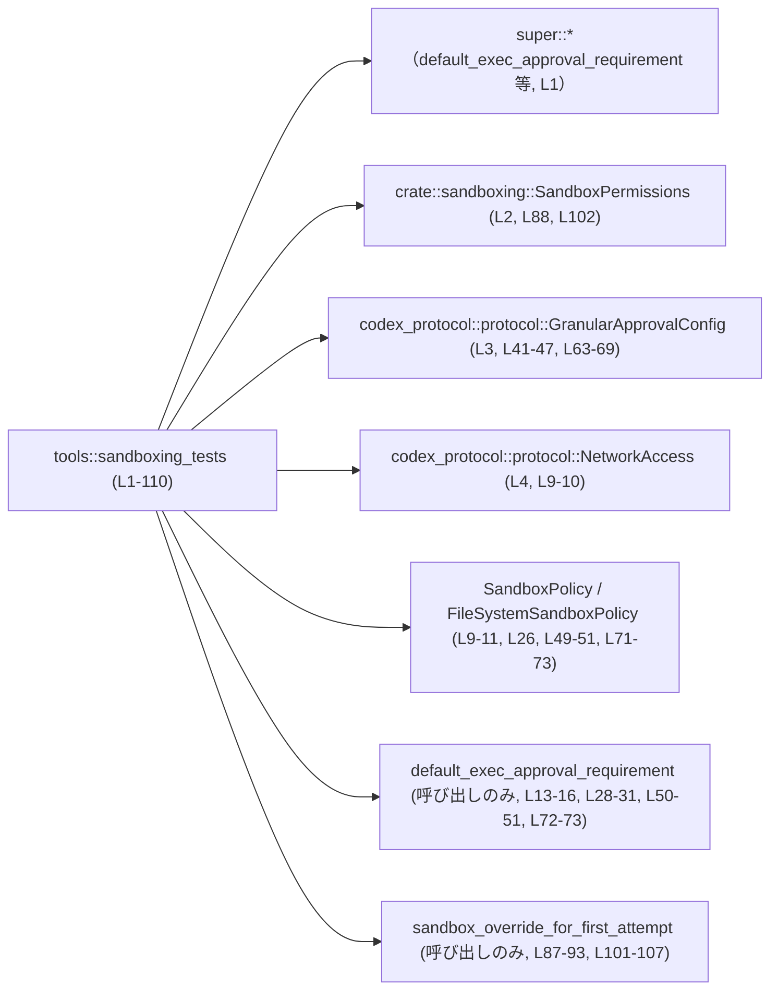
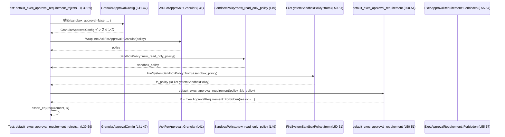

# core/src/tools/sandboxing_tests.rs

## 0. ざっくり一言

このファイルは、サンドボックス関連のポリシー関数  
`default_exec_approval_requirement` と `sandbox_override_for_first_attempt` の挙動を検証する単体テスト群です（core/src/tools/sandboxing_tests.rs:L7-109）。

---

## 1. このモジュールの役割

### 1.1 概要

- このモジュールは、実行承認ポリシーとサンドボックス設定の組み合わせに対して、
  - 実行に承認が必要かどうかのデフォルト判定（`default_exec_approval_requirement`）
  - 「最初の試行」でサンドボックスをバイパスするかどうかの判定（`sandbox_override_for_first_attempt`）
- の仕様が、想定どおりになっているかをテストする役割を持ちます  
  （core/src/tools/sandboxing_tests.rs:L7-22, L24-37, L39-82, L84-109）。

### 1.2 アーキテクチャ内での位置づけ

このテストモジュールは、同じモジュール階層の本体コード（`super::*`）と、サンドボックス関連の型・設定（`crate::sandboxing` や `codex_protocol::protocol`）に依存しています（core/src/tools/sandboxing_tests.rs:L1-5）。



> 関数や型 `SandboxPolicy`, `FileSystemSandboxPolicy`, `default_exec_approval_requirement`, `sandbox_override_for_first_attempt` は `super::*` などからインポートされていますが、定義本体はこのチャンクには現れません。

### 1.3 設計上のポイント

- **状態を持たない純粋なテスト**  
  すべてのテスト関数はローカル変数のみを使用し、共有状態やグローバル状態を変更しません（L7-22, L24-37, L39-82, L84-109）。
- **シナリオ駆動の仕様テスト**  
  テスト名が仕様をそのまま英語で表現しており、特定のポリシーの組み合わせに対する期待値を直接 `assert_eq!` で検証します（L7-8, L24-25, L39-40, L61-62, L84-85, L98-99）。
- **差分が見やすいアサーション**  
  `pretty_assertions::assert_eq` を用いることで、失敗時に期待値と実際の値の差分が視覚的にわかりやすくなるようにしています（L5, L12-21, L27-36, L53-57, L75-80, L86-95, L100-108）。
- **エラーハンドリング・並行性は登場しない**  
  このファイル内では `Result` や `async`、スレッドといった Rust のエラー／並行性機構は使われていません。テストは単に関数を呼び出し、返り値を比較する構造です（L7-109）。

---

## 2. 主要な機能一覧

このモジュールがテストしている主な仕様を、テスト単位で整理します。

- 外部サンドボックス + `OnRequest` ポリシーでは、実行承認がスキップされること  
  （`external_sandbox_skips_exec_approval_on_request`, L7-22）
- 読み取り専用の制限付きサンドボックス + `OnRequest` ポリシーでは、実行承認が必要になること  
  （`restricted_sandbox_requires_exec_approval_on_request`, L24-37）
- Granularポリシーで `sandbox_approval = false` のとき、サンドボックス承認プロンプトそのものが禁止されること  
  （`default_exec_approval_requirement_rejects_sandbox_prompt_when_granular_disables_it`, L39-59）
- Granularポリシーで `sandbox_approval = true` のとき、承認プロンプトが残されること  
  （`default_exec_approval_requirement_keeps_prompt_when_granular_allows_sandbox_approval`, L61-82）
- 実行ポリシーが「サンドボックスをバイパスしてもよい」という状態で、追加権限が許可されている場合、最初の試行でサンドボックスをバイパスすること  
  （`additional_permissions_allow_bypass_sandbox_first_attempt_when_execpolicy_skips`, L84-96）
- 守護者（Guardian）のような「エスカレーションが必須」な場合でも、明示的なエスカレーションがあるなら最初の試行でサンドボックスをバイパスすること  
  （`guardian_bypasses_sandbox_for_explicit_escalation_on_first_attempt`, L98-109）

---

## 3. 公開 API と詳細解説

このファイル自体はテストモジュールであり、新しい公開 API を定義していません。ただし、テストを通じて **外部関数の契約（仕様）** が一部明らかになります。

### 3.1 型一覧（構造体・列挙体など）

このチャンクに現れる主要な型の一覧です。定義本体は別モジュールにあります。

| 名前 | 種別 | 役割 / 用途 | 根拠 |
|------|------|-------------|------|
| `SandboxPolicy` | 列挙体または構造体（正確な種別は不明） | サンドボックス全体のポリシー。`ExternalSandbox { network_access }` というバリアントと `new_read_only_policy()` というコンストラクタ的メソッドがあることが分かります。 | `ExternalSandbox { network_access: NetworkAccess::Restricted }`（L9-11）、`SandboxPolicy::new_read_only_policy()`（L26, L49, L71） |
| `FileSystemSandboxPolicy` | 構造体（と推定される） | ファイルシステムに関するサンドボックス設定を表す型と考えられますが、内部構造は不明です。`from(&SandboxPolicy)` で生成されます。 | `FileSystemSandboxPolicy::from(&sandbox_policy)`（L15-16, L30-31, L50-51, L72-73） |
| `AskForApproval` | 列挙体 | 実行承認ポリシーの指定。`OnRequest` と `Granular(GranularApprovalConfig)` というバリアントが存在します。 | `AskForApproval::OnRequest`（L14, L29）、`AskForApproval::Granular(GranularApprovalConfig { .. })`（L41, L63） |
| `GranularApprovalConfig` | 構造体 | 個別機能ごとに承認の有無を細かく設定するための構成。`sandbox_approval`, `rules`, `skill_approval`, `request_permissions`, `mcp_elicitations` という bool フィールドを持ちます。 | 構造体リテラル（L41-47, L63-69） |
| `ExecApprovalRequirement` | 列挙体 | 実行時に承認が必要か／禁止かなどを表す結果。`Skip { bypass_sandbox, proposed_execpolicy_amendment }`, `NeedsApproval { reason, proposed_execpolicy_amendment }`, `Forbidden { reason }` のバリアントが存在します。 | パターン構築とアサート（L17-20, L32-35, L55-57, L77-80, L89-92, L103-106） |
| `SandboxPermissions` | 列挙体 | どの程度のサンドボックス権限が与えられているかを表す設定。`WithAdditionalPermissions`, `RequireEscalated` というバリアントが存在します。 | インポート（L2）、値使用（L88, L102） |
| `SandboxOverride` | 列挙体 | サンドボックス挙動の上書き結果を表す型。少なくとも `BypassSandboxFirstAttempt` バリアントが存在します。 | アサートでの使用（L94-95, L108-109） |
| `NetworkAccess` | 列挙体 | ネットワークアクセス方針を表す設定。`Restricted` バリアントが存在します。 | インポートと使用（L4, L9-10） |

> `SandboxPolicy`, `FileSystemSandboxPolicy` などの内部構造や他のバリアント／フィールドについては、このチャンクには情報がなく、詳細は分かりません。

### 3.2 関数詳細（コアロジックの外部 API）

ここでは、このテストから読み取れる範囲で **外部関数の仕様** を整理します。定義本体は別モジュールにあり、このファイルはあくまで利用側です。

---

#### `default_exec_approval_requirement(policy: AskForApproval, fs_policy: &FileSystemSandboxPolicy) -> ExecApprovalRequirement`

**概要**

- 実行承認ポリシー `policy` とファイルシステム・サンドボックスのポリシー `fs_policy` から、  
  「実行時に承認が必要か／禁止か／スキップか」を `ExecApprovalRequirement` として決定する関数です（呼び出しは L13-16, L28-31, L50-51, L72-73）。

**引数**

| 引数名 | 型 | 説明 | 根拠 |
|--------|----|------|------|
| `policy` | `AskForApproval` | 実行承認の方針。`OnRequest` や `Granular(GranularApprovalConfig)` が渡されます。 | 呼び出しで `AskForApproval::OnRequest` や `AskForApproval::Granular(...)` を直接渡している（L14, L29, L41, L63, L50-51, L72-73） |
| `fs_policy` | `&FileSystemSandboxPolicy` | ファイルシステムレベルのサンドボックス設定。`SandboxPolicy` から `FileSystemSandboxPolicy::from(&sandbox_policy)` で生成された参照です。 | `&FileSystemSandboxPolicy::from(&sandbox_policy)` を第二引数として渡している（L15-16, L30-31, L50-51, L72-73） |

**戻り値**

- 型: `ExecApprovalRequirement`  
  - `Skip { .. }`, `NeedsApproval { .. }`, `Forbidden { .. }` のいずれかが返されることがテストから分かります（L17-20, L32-35, L55-57, L77-80）。

**テストから読み取れる仕様（アルゴリズムの外形）**

内部実装はこのチャンクにはありませんが、少なくとも次の条件が成り立つように実装されています。

1. **外部サンドボックス + OnRequest → 承認スキップ（ただしサンドボックスは維持）**  
   - 条件: `SandboxPolicy::ExternalSandbox { network_access: NetworkAccess::Restricted }` と `AskForApproval::OnRequest` の組み合わせ（L9-15）。  
   - 結果: `ExecApprovalRequirement::Skip { bypass_sandbox: false, proposed_execpolicy_amendment: None }` が返る（L17-20）。  
   - 解釈: 外部サンドボックスを使う場合、追加の実行承認は不要だが、サンドボックス自体はバイパスしない仕様であると読み取れます。

2. **読み取り専用サンドボックス + OnRequest → 承認が必要**  
   - 条件: `SandboxPolicy::new_read_only_policy()` から生成したポリシーと `AskForApproval::OnRequest`（L26-31）。  
   - 結果: `ExecApprovalRequirement::NeedsApproval { reason: None, proposed_execpolicy_amendment: None }`（L32-35）。  
   - 解釈: 制限付きサンドボックスでは、実行の前にユーザー承認が必要である仕様です。

3. **Granular で sandbox_approval = false → サンドボックス承認プロンプト自体が禁止**  
   - 条件: `AskForApproval::Granular(GranularApprovalConfig { sandbox_approval: false, ... })` と `SandboxPolicy::new_read_only_policy()`（L41-47, L49-51）。  
   - 結果: `ExecApprovalRequirement::Forbidden { reason: "approval policy disallowed sandbox approval prompt".to_string() }`（L55-57）。  
   - 解釈: granular 設定で `sandbox_approval` が無効化されている場合、サンドボックス承認を求めることそのものがポリシー違反として拒否されます。

4. **Granular で sandbox_approval = true → 承認プロンプトが許可される（NeedsApproval）**  
   - 条件: `AskForApproval::Granular(GranularApprovalConfig { sandbox_approval: true, ... })` と `SandboxPolicy::new_read_only_policy()`（L63-69, L71-73）。  
   - 結果: `ExecApprovalRequirement::NeedsApproval { reason: None, proposed_execpolicy_amendment: None }`（L77-80）。  
   - 解釈: granular 設定で sandbox 承認が明示的に許可されている場合は、従来どおり承認プロンプトを出す挙動になります。

**Examples（使用例）**

テストを簡略化した基本的な使用例です（エラーハンドリング等はありません）。

```rust
// 外部サンドボックスで OnRequest ポリシーを評価する例
let sandbox_policy = SandboxPolicy::ExternalSandbox {
    network_access: NetworkAccess::Restricted,        // ネットワークは制限されている
};

let fs_policy = FileSystemSandboxPolicy::from(&sandbox_policy); // FS向けポリシーに変換

let requirement = default_exec_approval_requirement(
    AskForApproval::OnRequest,                       // 実行時に都度承認を求めるポリシー
    &fs_policy,
);

assert!(matches!(
    requirement,
    ExecApprovalRequirement::Skip { bypass_sandbox: false, .. }
));
```

```rust
// Granular 設定で sandbox_approval を無効にした例
let policy = AskForApproval::Granular(GranularApprovalConfig {
    sandbox_approval: false,   // サンドボックス承認プロンプトは禁止
    rules: true,
    skill_approval: true,
    request_permissions: true,
    mcp_elicitations: true,
});

let sandbox_policy = SandboxPolicy::new_read_only_policy();
let fs_policy = FileSystemSandboxPolicy::from(&sandbox_policy);

let requirement = default_exec_approval_requirement(policy, &fs_policy);

assert!(matches!(
    requirement,
    ExecApprovalRequirement::Forbidden { .. }
));
```

**Errors / Panics**

- このファイルからは `default_exec_approval_requirement` が `Result` を返すかどうか、あるいは内部でパニックを起こす可能性があるかどうかは分かりません。  
  テストは正常系のみを扱い、エラーケースを明示的に検証していません（L13-16, L28-31, L50-51, L72-73）。

**Edge cases（エッジケース）**

テストから分かる／分からない点を整理します。

- 分かるケース
  - `AskForApproval::OnRequest` と外部サンドボックス（ExternalSandbox + Restricted ネットワーク）（L9-15）。  
  - `AskForApproval::OnRequest` と読み取り専用サンドボックス（L26-31）。  
  - `AskForApproval::Granular` で `sandbox_approval` が `true/false` の 2 通りと読み取り専用サンドボックス（L41-47, L63-69, L49-51, L71-73）。
- 分からないケース
  - `AskForApproval` の他のバリアント（もし存在する場合）。  
  - `GranularApprovalConfig` の他フィールド（`rules`, `skill_approval` など）の値を変えた場合の挙動。  
  - 外部サンドボックス以外の `SandboxPolicy` バリアントの挙動。  
  これらはこのチャンクにはテストが存在せず、仕様は読み取れません。

**使用上の注意点**

- `GranularApprovalConfig.sandbox_approval` を `false` にすると、サンドボックス承認プロンプトが完全に禁止され、`ExecApprovalRequirement::Forbidden` になることがテストで固定されています（L41-47, L55-57）。  
  サンドボックス承認ダイアログを使いたい場合は、必ず `sandbox_approval: true` を設定する必要があります。
- `SandboxPolicy` の種別（外部か読み取り専用か）によって、同じ `AskForApproval::OnRequest` でも結果が `Skip` と `NeedsApproval` に分かれるため、呼び出し元はどのポリシーを渡しているかに注意する必要があります（L9-11, L26）。

---

#### `sandbox_override_for_first_attempt(permissions: SandboxPermissions, requirement: &ExecApprovalRequirement) -> SandboxOverride`

**概要**

- 既に決定されている実行承認要件 `ExecApprovalRequirement` と、サンドボックス権限レベル `SandboxPermissions` を元に、  
  「最初の実行試行だけサンドボックスをバイパスしてよいか」を `SandboxOverride` で決定する関数です（呼び出しは L87-93, L101-107）。

**引数**

| 引数名 | 型 | 説明 | 根拠 |
|--------|----|------|------|
| `permissions` | `SandboxPermissions` | 追加の権限やエスカレーション要求を表す設定。`WithAdditionalPermissions`, `RequireEscalated` のいずれかが渡されます。 | 呼び出しで `SandboxPermissions::WithAdditionalPermissions` および `SandboxPermissions::RequireEscalated` を渡している（L88, L102） |
| `requirement` | `&ExecApprovalRequirement` | 事前に決定された実行承認要件。テストではいずれも `ExecApprovalRequirement::Skip { .. }` の参照が渡されています。 | `&ExecApprovalRequirement::Skip { ... }` を第二引数にしている（L89-92, L103-106） |

**戻り値**

- 型: `SandboxOverride`  
  - テストでは、いずれのケースでも `SandboxOverride::BypassSandboxFirstAttempt` が返されることが確認されています（L94-95, L108-109）。

**テストから読み取れる仕様（アルゴリズムの外形）**

1. **ExecRequirement が Skip + 追加権限あり → 最初の試行でサンドボックスをバイパス**  
   - 条件:
     - `permissions = SandboxPermissions::WithAdditionalPermissions`（L88）
     - `requirement = &ExecApprovalRequirement::Skip { bypass_sandbox: true, proposed_execpolicy_amendment: None }`（L89-92）  
   - 結果: `SandboxOverride::BypassSandboxFirstAttempt`（L94-95）。  
   - 解釈: すでに `ExecApprovalRequirement` でサンドボックスバイパスが許可されており、かつ追加権限が付与されている場合、最初の試行は実際にサンドボックスをバイパスするよう上書きされます。

2. **ExecRequirement が Skip + エスカレーション必須 → 明示的なエスカレーションにより最初の試行をバイパス**  
   - 条件:
     - `permissions = SandboxPermissions::RequireEscalated`（L102）
     - `requirement = &ExecApprovalRequirement::Skip { bypass_sandbox: false, proposed_execpolicy_amendment: None }`（L103-106）  
   - 結果: `SandboxOverride::BypassSandboxFirstAttempt`（L108-109）。  
   - 解釈: 実行ポリシー自体は `bypass_sandbox: false` でも、権限側で「エスカレーションが必須」と指定されている場合、明示的なエスカレーションがある想定で最初の試行をバイパス可能と判断する仕様であると読み取れます。

**Examples（使用例）**

```rust
// 追加権限が許可されていて、ExecRequirement がサンドボックスバイパスを許可しているケース
let exec_req = ExecApprovalRequirement::Skip {
    bypass_sandbox: true,                         // 実行ポリシーとしてサンドボックスをバイパスしてよい
    proposed_execpolicy_amendment: None,
};

let override_decision = sandbox_override_for_first_attempt(
    SandboxPermissions::WithAdditionalPermissions, // 呼び出し元から追加権限を許可
    &exec_req,
);

assert!(matches!(
    override_decision,
    SandboxOverride::BypassSandboxFirstAttempt
));
```

```rust
// エスカレーション必須の設定で、Explicit Escalation によるサンドボックスバイパス（最初の試行）
let exec_req = ExecApprovalRequirement::Skip {
    bypass_sandbox: false,                        // ポリシー上はサンドボックスを維持
    proposed_execpolicy_amendment: None,
};

let override_decision = sandbox_override_for_first_attempt(
    SandboxPermissions::RequireEscalated,         // エスカレーションが要求されている
    &exec_req,
);

assert!(matches!(
    override_decision,
    SandboxOverride::BypassSandboxFirstAttempt
));
```

**Errors / Panics**

- この関数の内部でどのようなエラーやパニックが起こりうるかは、このチャンクからは分かりません。  
  テストでは正常時の `SandboxOverride::BypassSandboxFirstAttempt` のみを検証しており、他の戻り値パターンはテストされていません（L87-95, L101-109）。

**Edge cases（エッジケース）**

- 分かるケース
  - `ExecApprovalRequirement::Skip` と 2 種類の `SandboxPermissions` 組み合わせ（L88-92, L102-106）。
- 分からないケース
  - `ExecApprovalRequirement` が `NeedsApproval` や `Forbidden` の場合。  
  - `SandboxPermissions` に他のバリアントが存在する場合の挙動。  
  - `SandboxOverride` の他のバリアント（もしあれば）。  
  これらはこのチャンクには登場せず、挙動は不明です。

**使用上の注意点**

- 呼び出し側は、**もともとの `ExecApprovalRequirement` と `SandboxPermissions` の組み合わせ** によってサンドボックスバイパスの可否が変わることを前提にする必要があります。  
  特に `bypass_sandbox` が `false` であっても、`SandboxPermissions::RequireEscalated` と組み合わせることでバイパスが許可されるケースがある点に注意が必要です（L102-106, L108-109）。
- セキュリティ上、不要なサンドボックスバイパスを防ぐためには、`SandboxPermissions` の値が本当に意図したものかを慎重に管理する必要があると考えられます（これはテスト名と組み合わせからの一般的な注意であり、実装詳細はこのチャンクからは分かりません）。

---

### 3.3 その他の関数（テスト関数）

このファイルで定義される関数はすべてテスト関数です。

| 関数名 | 役割（1 行） | 行範囲 |
|--------|--------------|--------|
| `external_sandbox_skips_exec_approval_on_request` | 外部サンドボックス + OnRequest ポリシーで `ExecApprovalRequirement::Skip` になることを検証します。 | L7-22 |
| `restricted_sandbox_requires_exec_approval_on_request` | 読み取り専用サンドボックス + OnRequest ポリシーで `NeedsApproval` になることを検証します。 | L24-37 |
| `default_exec_approval_requirement_rejects_sandbox_prompt_when_granular_disables_it` | Granular 設定で `sandbox_approval = false` の場合に `Forbidden` になることを検証します。 | L39-59 |
| `default_exec_approval_requirement_keeps_prompt_when_granular_allows_sandbox_approval` | Granular 設定で `sandbox_approval = true` の場合に `NeedsApproval` になることを検証します。 | L61-82 |
| `additional_permissions_allow_bypass_sandbox_first_attempt_when_execpolicy_skips` | 追加権限がある場合に最初の試行でサンドボックスをバイパスする `SandboxOverride` が選ばれることを検証します。 | L84-96 |
| `guardian_bypasses_sandbox_for_explicit_escalation_on_first_attempt` | エスカレーション必須の設定でも明示的エスカレーション時にサンドボックスをバイパスすることを検証します。 | L98-109 |

---

## 4. データフロー

ここでは、最も情報量の多い Granular 設定のテストのデータフローを示します。

対象テスト:  
`default_exec_approval_requirement_rejects_sandbox_prompt_when_granular_disables_it`（core/src/tools/sandboxing_tests.rs:L39-59）

**処理の流れ（文章）**

1. `GranularApprovalConfig` が `sandbox_approval = false` などのフラグ設定で構築されます（L41-47）。
2. `AskForApproval::Granular` バリアントとして `policy` にラップされます（L41）。
3. 読み取り専用の `SandboxPolicy` が `new_read_only_policy()` で生成されます（L49）。
4. それを `FileSystemSandboxPolicy::from` に渡し、ファイルシステム用ポリシーに変換します（L50-51）。
5. `default_exec_approval_requirement(policy, &fs_policy)` が呼び出され、`ExecApprovalRequirement` が得られます（L50-51）。
6. 結果が `ExecApprovalRequirement::Forbidden` であり、理由文字列が期待どおりであることを `assert_eq!` で確認します（L53-57）。

**シーケンス図**



この図から分かる通り、テスト自体は純粋な「値の構築 → 関数呼び出し → 返り値の比較」という一方向のデータフローであり、副作用や外部 I/O は登場しません。

---

## 5. 使い方（How to Use）

### 5.1 基本的な使用方法

テストから読み取れる範囲で、`default_exec_approval_requirement` と `sandbox_override_for_first_attempt` を利用する典型的な流れは次のようになります。

```rust
// 1. サンドボックスの高レベルポリシーを決める
let sandbox_policy = SandboxPolicy::new_read_only_policy();     // 読み取り専用サンドボックスを利用

// 2. ファイルシステム用のサンドボックスポリシーに変換する
let fs_policy = FileSystemSandboxPolicy::from(&sandbox_policy); // &SandboxPolicy から変換

// 3. 実行承認のポリシーを決める（ここでは OnRequest）
let approval_policy = AskForApproval::OnRequest;

// 4. 実行承認要件を計算する
let exec_requirement = default_exec_approval_requirement(
    approval_policy,
    &fs_policy,
);

// 5. 必要に応じて、最初の試行だけサンドボックスをバイパスするかを決める
let permissions = SandboxPermissions::WithAdditionalPermissions; // 追加権限あり
let sandbox_override =
    sandbox_override_for_first_attempt(permissions, &exec_requirement);

// 6. 結果に応じて実際の実行フローを分岐する（疑似コード）
match (exec_requirement, sandbox_override) {
    (ExecApprovalRequirement::Forbidden { reason }, _) => {
        // 完全に禁止。理由をログや UI に表示する
        eprintln!("Execution forbidden: {reason}");
    }
    (ExecApprovalRequirement::NeedsApproval { .. }, _) => {
        // ユーザーに承認ダイアログを表示する等
    }
    (ExecApprovalRequirement::Skip { .. }, SandboxOverride::BypassSandboxFirstAttempt) => {
        // 最初の試行のみサンドボックスなしで実行する
    }
    (ExecApprovalRequirement::Skip { .. }, _ ) => {
        // サンドボックスは維持したまま実行する
    }
}
```

> 上記の `match` の細かい分岐や他のバリアントは、このチャンクには現れないため、例示レベルに留まります。

### 5.2 よくある使用パターン

1. **OnRequest ポリシーで単純に承認の有無を判定する**

```rust
let sandbox_policy = SandboxPolicy::ExternalSandbox {
    network_access: NetworkAccess::Restricted,   // 外部の安全なサンドボックスを使用
};
let fs_policy = FileSystemSandboxPolicy::from(&sandbox_policy);

let exec_requirement =
    default_exec_approval_requirement(AskForApproval::OnRequest, &fs_policy);

assert!(matches!(
    exec_requirement,
    ExecApprovalRequirement::Skip { .. }         // テスト同様、承認はスキップされる
));
```

1. **Granular 設定で sandbox 承認を完全に禁止する**

```rust
let granular = GranularApprovalConfig {
    sandbox_approval: false,                    // サンドボックス承認プロンプトは禁止
    rules: true,
    skill_approval: true,
    request_permissions: true,
    mcp_elicitations: true,
};

let policy = AskForApproval::Granular(granular);
let sandbox_policy = SandboxPolicy::new_read_only_policy();
let fs_policy = FileSystemSandboxPolicy::from(&sandbox_policy);

let exec_requirement =
    default_exec_approval_requirement(policy, &fs_policy);

assert!(matches!(
    exec_requirement,
    ExecApprovalRequirement::Forbidden { .. }   // プロンプト自体が禁止される
));
```

1. **最初の試行のみサンドボックスをバイパスする**

```rust
let exec_req = ExecApprovalRequirement::Skip {
    bypass_sandbox: true,
    proposed_execpolicy_amendment: None,
};

// 追加権限がある場合
let decision = sandbox_override_for_first_attempt(
    SandboxPermissions::WithAdditionalPermissions,
    &exec_req,
);

assert!(matches!(
    decision,
    SandboxOverride::BypassSandboxFirstAttempt
));
```

### 5.3 よくある間違い（推測される誤用と修正例）

コードから直接読み取れる範囲で、起こりやすそうな誤用を 1 つだけ挙げます。

```rust
// 誤りの例: sandbox_approval を false にしているのに、
// 承認ダイアログが出ることを期待してしまう
let policy = AskForApproval::Granular(GranularApprovalConfig {
    sandbox_approval: false,  // ← これにより Forbidden になる
    rules: false,
    skill_approval: true,
    request_permissions: true,
    mcp_elicitations: true,
});

// ...

let requirement =
    default_exec_approval_requirement(policy, &fs_policy);

// requirement が Forbidden になるため、承認ダイアログは出せない
```

```rust
// 正しい例: sandbox_approval を true にして、NeedsApproval を期待する
let policy = AskForApproval::Granular(GranularApprovalConfig {
    sandbox_approval: true,   // ← プロンプトを許可
    rules: false,
    skill_approval: true,
    request_permissions: true,
    mcp_elicitations: true,
});

// ...

let requirement =
    default_exec_approval_requirement(policy, &fs_policy);

// NeedsApproval になり、承認ダイアログを出せる
```

このように、`sandbox_approval` フラグの意味を取り違えると、意図に反してプロンプトが完全に禁止される可能性があります（L41-47, L55-57, L63-69, L77-80）。

### 5.4 使用上の注意点（まとめ）

- `GranularApprovalConfig.sandbox_approval` はサンドボックス承認プロンプトの可否を **強く制御するフラグ** であり、`false` にすると `ExecApprovalRequirement::Forbidden` になることがテストで固定されています（L41-47, L55-57）。
- サンドボックスの種類（外部 vs 読み取り専用）によって `OnRequest` ポリシーの結果が変わるため、呼び出し前に正しい `SandboxPolicy` を選択していることを確認する必要があります（L9-11, L26-31）。
- `sandbox_override_for_first_attempt` によるサンドボックスバイパスはセキュリティに影響するため、`SandboxPermissions` を適切に設定・制限することが重要です（L88-92, L102-106）。
- このファイル内には並行処理や非同期処理は登場せず、関数呼び出しはすべて同期的かつスレッドローカルなデータに対して行われています（L7-109）。

---

## 6. 変更の仕方（How to Modify）

### 6.1 新しい機能を追加する場合（テスト観点）

このファイルでは実装コードではなくテストのみが定義されています。新しいポリシーやバリアントが実装された場合のテスト追加の入口として利用できます。

- **新しい `AskForApproval` バリアントが追加された場合**  
  - そのバリアントと各種 `SandboxPolicy` の組み合わせに対する期待される `ExecApprovalRequirement` を、既存テストと同様に 1 関数 1 シナリオで追加します。
- **`SandboxPermissions` に新しいバリアントが追加された場合**  
  - `sandbox_override_for_first_attempt` の挙動が変わる可能性があるため、`additional_permissions_allow_bypass_sandbox_first_attempt_when_execpolicy_skips` や `guardian_bypasses_sandbox_for_explicit_escalation_on_first_attempt` と同じ形式で新しいテスト関数を追加します（L84-96, L98-109）。
- **`ExecApprovalRequirement` に新バリアントが追加された場合**  
  - `default_exec_approval_requirement` の結果としてそのバリアントが返る条件をテストする関数を追加します。

### 6.2 既存の機能を変更する場合

`default_exec_approval_requirement` や `sandbox_override_for_first_attempt` の仕様を変更したい場合、影響範囲と注意点は次の通りです。

- **影響範囲の確認**
  - これらの関数を呼び出している箇所（このテストファイル以外）を検索し、仕様変更が妥当かを検討する必要があります。  
    このチャンクには他ファイルの情報はないため、具体的な場所は不明です。
- **契約の確認**
  - このテストファイルに記述されている仕様（例えば、外部サンドボックス + OnRequest で `Skip` になることなど）は、呼び出し側の前提条件になっている可能性があります（L7-22, L24-37, L39-82, L84-109）。  
  - 仕様を変える場合は、それに対応するテストを更新し、挙動の変更が意図したものであることを明確にする必要があります。
- **エッジケース**
  - Granular 設定に関するフラグや、新たな SandboxPermissions バリアントに対して、`Forbidden` や `NeedsApproval` の方針が適切かどうかを検討し、それをテストで表現することが重要です。

---

## 7. 関連ファイル

このモジュールと密接に関係するのは、インポートされているモジュール群です。実際のファイルパスはこのチャンクからは分かりませんが、モジュール名と役割は次のように整理できます。

| パス / モジュール名 | 役割 / 関係 |
|---------------------|------------|
| `super::*` | `default_exec_approval_requirement`, `sandbox_override_for_first_attempt`, `SandboxPolicy`, `FileSystemSandboxPolicy`, `AskForApproval`, `ExecApprovalRequirement`, `SandboxOverride` など、本体側の実装を提供します（L1, L9-11, L13-21, L26-36, L50-51, L72-73, L89-92, L103-106）。具体的なファイルパスはこのチャンクには現れません。 |
| `crate::sandboxing` | `SandboxPermissions` を提供するサンドボックス設定モジュールです（L2, L88, L102）。`SandboxPermissions` の他のバリアントや機能はこのチャンクからは分かりません。 |
| `codex_protocol::protocol` | `GranularApprovalConfig` と `NetworkAccess` を提供するプロトコル関連モジュールです（L3-4, L9-10, L41-47, L63-69）。 |
| `pretty_assertions` | テストで使用する `assert_eq!` マクロを提供し、アサーション失敗時の差分表示を改善します（L5, L12-21, L27-36, L53-57, L75-80, L86-95, L100-108）。 |

> これら関連モジュールの詳細な実装やファイル構成は、このチャンクには現れないため不明です。
