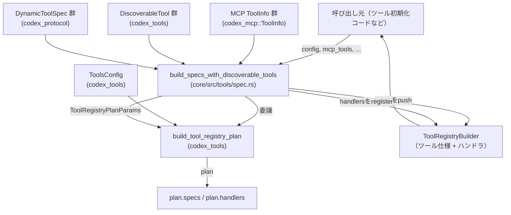
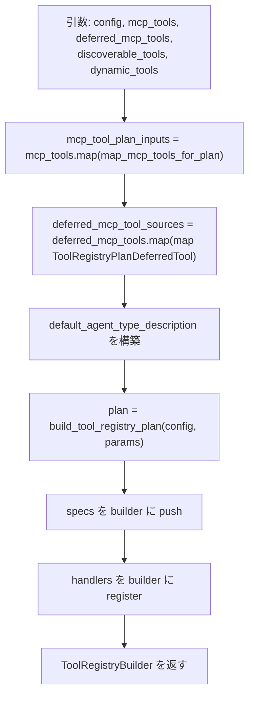
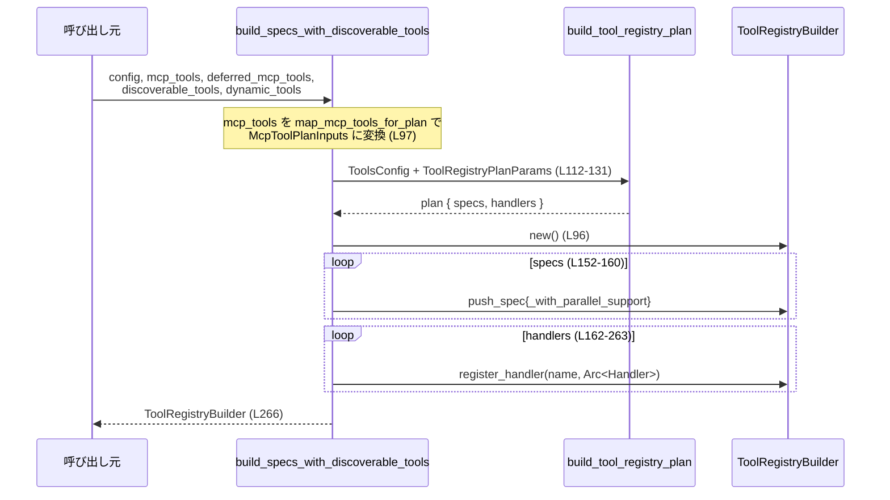

# core/src/tools/spec.rs

## 0. ざっくり一言

このモジュールは、各種ツール（MCPツール・ディスカバラブルツール・動的ツール）とツールハンドラの情報から、`ToolRegistryBuilder` に登録するツール仕様・ハンドラを組み立てる初期化ロジックを提供します。また、ユーザーのシェル種別をツール用のシェル種別に変換します。

---

## 1. このモジュールの役割

### 1.1 概要

- このモジュールは **ツール実行基盤のレジストリ構築** を行うモジュールです。
- 外部から渡された設定 (`ToolsConfig`) や MCP 関連のメタデータ、ディスカバラブルツール、動的ツール情報を基に、`ToolRegistryBuilder` に登録すべきツール仕様とハンドラの一覧（プラン）を構築します (core/src/tools/spec.rs:L58-131, L152-265)。
- 併せて、ユーザーのシェル表現 `Shell` から `ToolUserShellType` への変換を行います (core/src/tools/spec.rs:L22-30)。

### 1.2 アーキテクチャ内での位置づけ

このモジュールは「ツールレジストリ計画の構築 (`build_tool_registry_plan`)」と「実際のレジストリ (`ToolRegistryBuilder`)」の間の橋渡しを行います。



- `build_specs_with_discoverable_tools` は、`build_tool_registry_plan` から返る `plan`（仕様とハンドラ候補）を受け取り、自身で `ToolRegistryBuilder` に登録する役割を持ちます (core/src/tools/spec.rs:L96-131, L152-265)。
- 多数のツールハンドラ型（`ShellHandler`, `McpHandler`, `ToolSearchHandler` など）をこのモジュールで `Arc` 包装し、`ToolHandlerKind` に応じて登録します (core/src/tools/spec.rs:L65-94, L132-150, L162-263)。

### 1.3 設計上のポイント

- **責務の分離**  
  - MCP ツール情報の整形は `map_mcp_tools_for_plan` に切り出されています (core/src/tools/spec.rs:L37-56)。  
  - 実際のプラン構築ロジックは `codex_tools::build_tool_registry_plan` に委譲され、このモジュールでは登録とハンドラ組み立てに集中しています (core/src/tools/spec.rs:L112-131)。
- **状態管理と共有**  
  - ハンドラは `Arc` で共有され、複数ツールから安全に参照できるように設計されています (core/src/tools/spec.rs:L132-150, L165-257)。  
  - `ToolSearchHandler` だけは `deferred_mcp_tools` の有無で初期化される「遅延構築の Option」として扱われます (core/src/tools/spec.rs:L145, L239-247)。
- **エラーと安全性**  
  - このファイル内の関数は `Result` を返さず、`unwrap` や `panic!` なども使用していません。エラー処理は `build_tool_registry_plan` や各ハンドラ側に委ねられています (core/src/tools/spec.rs:L112-131, L162-263)。
  - Rust の `match` を用いて `ShellType` → `ToolUserShellType` を網羅的に変換しており、新しいシェル種別が追加された場合はコンパイル時に検出されます (core/src/tools/spec.rs:L22-29)。
- **並行性への配慮**  
  - 全てのハンドラは `Arc` で包まれ、クローンしてレジストリに登録されるため、複数スレッドから共有される前提の設計になっています (core/src/tools/spec.rs:L132-150, L162-263)。  
  - このファイル内に `unsafe` ブロックや明示的なスレッド生成はなく、並行実行の詳細は外部のレジストリやハンドラ実装に依存します。

---

## 2. 主要な機能一覧

- ユーザーシェル種別の変換: `Shell` の `shell_type` を `ToolUserShellType` に変換します (core/src/tools/spec.rs:L22-30)。
- MCP ツール情報の整形: `HashMap<String, ToolInfo>` をプラン構築用の `McpToolPlanInputs` に変換します (core/src/tools/spec.rs:L37-56)。
- ツールレジストリ構築: MCP ツール・ディスカバラブルツール・動的ツール・各種ハンドラを組み合わせ、`ToolRegistryBuilder` を構成します (core/src/tools/spec.rs:L58-267)。

### コンポーネント一覧（関数・構造体）

| 名前 | 種別 | 行範囲 | 説明 |
|------|------|--------|------|
| `tool_user_shell_type` | 関数 (`pub(crate)`) | core/src/tools/spec.rs:L22-30 | `Shell` から `ToolUserShellType` へのシェル種別マッピングを行います。 |
| `McpToolPlanInputs` | 構造体（非公開） | core/src/tools/spec.rs:L32-35 | MCP ツールプラン構築用に、MCP ツールとそのネームスペースを保持する内部用構造体です。 |
| `map_mcp_tools_for_plan` | 関数（非公開） | core/src/tools/spec.rs:L37-56 | `HashMap<String, ToolInfo>` から `McpToolPlanInputs` を生成します。 |
| `build_specs_with_discoverable_tools` | 関数 (`pub(crate)`) | core/src/tools/spec.rs:L58-267 | 設定とツール定義から `ToolRegistryBuilder` を構築し、各ツールハンドラを登録します。 |
| `tests` | モジュール（cfg(test)） | core/src/tools/spec.rs:L269-271 | テストモジュール。内容はこのチャンクには現れません。 |

---

## 3. 公開 API と詳細解説

### 3.1 型一覧（構造体・列挙体など）

| 名前 | 種別 | 行範囲 | 役割 / 用途 |
|------|------|--------|------------|
| `McpToolPlanInputs` | 構造体（非公開） | core/src/tools/spec.rs:L32-35 | MCP ツール一覧 (`HashMap<String, rmcp::model::Tool>`) と、ツールのネームスペース情報 (`HashMap<String, ToolNamespace>`) をまとめた内部用コンテナです。プラン構築に渡すための整形結果を表現します。 |

`McpToolPlanInputs` のフィールド:

- `mcp_tools: HashMap<String, rmcp::model::Tool>` (core/src/tools/spec.rs:L33)  
  MCP ツール名 → MCP ツール本体（`rmcp::model::Tool`）のマッピングです。  
- `tool_namespaces: HashMap<String, ToolNamespace>` (core/src/tools/spec.rs:L34)  
  MCP ツール名 → ツールの呼び出しネームスペースと説明 (`ToolNamespace`) のマッピングです。

### 3.2 関数詳細

#### `tool_user_shell_type(user_shell: &Shell) -> ToolUserShellType`

**概要**

`Shell` 構造体に含まれる `shell_type` フィールドを、ツールレジストリで利用する `ToolUserShellType` に変換します (core/src/tools/spec.rs:L22-30)。  
ユーザー環境のシェル種別をツール実行側に伝えるためのヘルパ関数です。

**引数**

| 引数名 | 型 | 説明 |
|--------|----|------|
| `user_shell` | `&Shell` | ユーザー環境のシェル情報を表す構造体への参照です。少なくとも `shell_type: ShellType` フィールドを持ちます (core/src/tools/spec.rs:L23)。 |

**戻り値**

- `ToolUserShellType`  
  `ToolRegistry` 側で利用されるシェル種別です。`ShellType` と 1 対 1 で対応する列挙体と読み取れます (core/src/tools/spec.rs:L24-28)。

**内部処理の流れ**

1. `user_shell.shell_type` を `match` で分岐します (core/src/tools/spec.rs:L23)。
2. 各 `ShellType` 変数に対応する `ToolUserShellType` を返します (core/src/tools/spec.rs:L24-28)。
   - `ShellType::Zsh` → `ToolUserShellType::Zsh`
   - `ShellType::Bash` → `ToolUserShellType::Bash`
   - `ShellType::PowerShell` → `ToolUserShellType::PowerShell`
   - `ShellType::Sh` → `ToolUserShellType::Sh`
   - `ShellType::Cmd` → `ToolUserShellType::Cmd`

**Examples（使用例）**

`Shell` の詳細はこのチャンクには現れないため、フィールドの一部を省略した擬似コード例です。

```rust
use crate::shell::{Shell, ShellType};
use crate::tools::spec::tool_user_shell_type; // 実際のパスは crate 構成に依存

fn example() {
    // ユーザーが Zsh を使っていると仮定した Shell 構造体
    let user_shell = Shell {
        shell_type: ShellType::Zsh,
        // 他のフィールドは省略
        // ...
    };

    // ToolRegistry で使うシェル種別に変換する
    let tool_shell_type = tool_user_shell_type(&user_shell);

    // ここで得られた tool_shell_type を設定やログ出力などに利用可能
    println!("User shell for tools: {:?}", tool_shell_type);
}
```

**Errors / Panics**

- この関数は `Result` を返さず、内部でも `panic!` や `unwrap` を使用していません。  
  したがって、この関数内でランタイムエラーやパニックが発生する経路はありません (core/src/tools/spec.rs:L22-30)。
- 将来的に `ShellType` に新しいバリアントが追加された場合、`match` が非網羅的となりコンパイルエラーになります。これは Rust の型システムによる安全性確保です。

**Edge cases（エッジケース）**

- `user_shell` が `None` などになる経路は呼び出し側の設計次第ですが、この関数は参照 `&Shell` を受け取るため、呼び出し前に `Some` であることや有効な `Shell` が用意されていることが前提です。
- `Shell.shell_type` がどの値であっても、必ず対応する `ToolUserShellType` が返るため、ランタイムでパターン漏れが起こる可能性はありません (コンパイル時に検出されます)。

**使用上の注意点**

- `ShellType` に新しいバリアントを追加した場合、`tool_user_shell_type` の `match` にも対応を追加する必要があります。コンパイラがエラーで通知するため、実装漏れに気付きやすい構造になっています。
- この関数は状態を持たず、参照のみを読み取るので、複数スレッドから同時に呼び出しても安全です（`Shell` がスレッド安全に共有されていることが前提）。

---

#### `map_mcp_tools_for_plan(mcp_tools: &HashMap<String, ToolInfo>) -> McpToolPlanInputs`

**概要**

MCP ツールのメタデータ `ToolInfo` のマップから、プラン構築に用いる `McpToolPlanInputs` を生成します。  
ツール名をキーとして、実際の MCP ツール本体と、そのツールネームスペース情報を分けた 2 つの `HashMap` を構築します (core/src/tools/spec.rs:L37-56)。

**引数**

| 引数名 | 型 | 説明 |
|--------|----|------|
| `mcp_tools` | `&HashMap<String, ToolInfo>` | MCP ツール名をキーとした `ToolInfo` のマップです (core/src/tools/spec.rs:L37)。各 `ToolInfo` には `tool`, `callable_namespace`, `server_instructions` などのフィールドが含まれます (使用箇所より)。 |

**戻り値**

- `McpToolPlanInputs` (core/src/tools/spec.rs:L37-56)  
  - `mcp_tools`: MCP ツール名 → `rmcp::model::Tool`  
  - `tool_namespaces`: MCP ツール名 → `ToolNamespace { name, description }`

**内部処理の流れ**

1. `McpToolPlanInputs` 構造体をリテラルで生成します (core/src/tools/spec.rs:L38-55)。
2. `mcp_tools` に対して `.iter()` を行い、以下を map/collect します。
   - `mcp_tools` フィールド (core/src/tools/spec.rs:L39-42)  
     - `(name, tool)` のペアから `(name.clone(), tool.tool.clone())` を生成し、  
       `HashMap<String, rmcp::model::Tool>` として収集します。
   - `tool_namespaces` フィールド (core/src/tools/spec.rs:L43-54)  
     - `(name, tool)` のペアから `(name.clone(), ToolNamespace { ... })` を生成します。
     - `ToolNamespace.name` には `tool.callable_namespace.clone()` を設定します (core/src/tools/spec.rs:L49)。
     - `ToolNamespace.description` には `tool.server_instructions.clone()` を設定します (core/src/tools/spec.rs:L50)。

**Examples（使用例）**

`ToolInfo` の定義はこのチャンクには現れないため、疑似的な例になります。

```rust
use std::collections::HashMap;
use codex_mcp::ToolInfo;
use crate::tools::spec::map_mcp_tools_for_plan; // 実際の公開範囲は crate 内部限定

fn build_plan_inputs_example(mcp_tools: HashMap<String, ToolInfo>) {
    // MCP ツール一覧からプラン入力を作成
    let plan_inputs = map_mcp_tools_for_plan(&mcp_tools);

    // plan_inputs.mcp_tools / plan_inputs.tool_namespaces を
    // build_tool_registry_plan に渡すためのデータとして利用する想定
    println!("mcp_tools count = {}", plan_inputs.mcp_tools.len());
    println!(
        "tool_namespaces count = {}",
        plan_inputs.tool_namespaces.len()
    );
}
```

**Errors / Panics**

- 関数内では `Result` を返さず、`unwrap` や `panic!` を使用していません。  
  そのため、この関数から直接 `Err` が返ったりパニックが発生するケースはありません (core/src/tools/spec.rs:L37-56)。
- `clone()` は通常パニックしません。`ToolInfo` 内部の `tool` フィールドや `String` のクローンでメモリ割り当てエラーが起きる可能性は理論上ありますが、これは Rust 全般のランタイム特性であり、この関数固有の挙動ではありません。

**Edge cases（エッジケース）**

- **空の `mcp_tools`**  
  - `mcp_tools` が空の `HashMap` の場合、`.iter().map(...).collect()` 結果も空の `HashMap` となります (core/src/tools/spec.rs:L39-42, L43-54)。  
  - その場合の `McpToolPlanInputs` は、2 つの `HashMap` がいずれも空の構造体となります。
- **キーの重複**  
  - `HashMap` の性質上、キーは一意であるため、この関数内で重複キーが新たに発生することはありません。  
  - 既に外部で構成された `mcp_tools` の整合性に依存します。

**使用上の注意点**

- この関数は `pub(crate)` ではなく完全に非公開（`fn`）であり、このファイル内からのみ呼び出されます (core/src/tools/spec.rs:L37)。外部から直接利用することはできません。
- `ToolInfo` にフィールドが追加されても、この関数で利用しているのは `tool`, `callable_namespace`, `server_instructions` のみです (core/src/tools/spec.rs:L41, L49-50)。必要に応じて `ToolNamespace` の拡張や追加マッピングを行うことができます。
- 関数は純粋関数であり、外部状態に依存せず、`mcp_tools` の内容から決定的に `McpToolPlanInputs` を生成します。並列に複数回呼び出しても副作用はありません。

---

#### `build_specs_with_discoverable_tools(

    config: &ToolsConfig,
    mcp_tools: Option<HashMap<String, ToolInfo>>,
    deferred_mcp_tools: Option<HashMap<String, ToolInfo>>,
    discoverable_tools: Option<Vec<DiscoverableTool>>,
    dynamic_tools: &[DynamicToolSpec],
) -> ToolRegistryBuilder`

**概要**

ツール設定と各種ツール定義から、ツール仕様・ハンドラのレジストリを構築します。  
内部で `build_tool_registry_plan` を呼び出してプラン（仕様とハンドラの一覧）を取得し、その内容に応じて `ToolRegistryBuilder` に specs と handlers を登録して返します (core/src/tools/spec.rs:L58-267)。

**引数**

| 引数名 | 型 | 説明 |
|--------|----|------|
| `config` | `&ToolsConfig` | ツール全体の設定値です。`shell_command_backend` や `default_mode_request_user_input` などが参照されます (core/src/tools/spec.rs:L58-59, L140, L142-143)。 |
| `mcp_tools` | `Option<HashMap<String, ToolInfo>>` | 即時利用可能な MCP ツール情報です。`Some` の場合に `map_mcp_tools_for_plan` でプラン入力に変換されます (core/src/tools/spec.rs:L60, L97)。 |
| `deferred_mcp_tools` | `Option<HashMap<String, ToolInfo>>` | 遅延ロードなどに用いる MCP ツール情報です。`ToolRegistryPlanDeferredTool` 用に整形され、`ToolSearchHandler` の初期化にも利用されます (core/src/tools/spec.rs:L61, L98-109, L239-247)。 |
| `discoverable_tools` | `Option<Vec<DiscoverableTool>>` | 外部などから発見されたツール群です。プラン構築時にそのまま渡されます (core/src/tools/spec.rs:L62, L122)。 |
| `dynamic_tools` | `&[DynamicToolSpec]` | 動的に定義されたツール仕様のスライスです。プラン構築時に利用されます (core/src/tools/spec.rs:L63, L123)。 |

**戻り値**

- `ToolRegistryBuilder` (core/src/tools/spec.rs:L58, L96, L266)  
  ツール仕様（specs）とツールハンドラ（handlers）が登録されたレジストリビルダーです。詳細な API は `crate::tools::registry::ToolRegistryBuilder` の定義に依存し、このチャンクには現れません。

**内部処理の流れ（アルゴリズム）**

1. **ハンドラ型のインポート**  
   関数内部で多数のハンドラ型を `use` によりスコープ内に導入します (core/src/tools/spec.rs:L65-94)。

2. **`ToolRegistryBuilder` と MCP 関連入力の構築**  
   - `ToolRegistryBuilder::new()` で空のビルダーを生成します (core/src/tools/spec.rs:L96)。
   - `mcp_tool_plan_inputs` を、`mcp_tools.as_ref().map(map_mcp_tools_for_plan)` で `Option<McpToolPlanInputs>` として構築します (core/src/tools/spec.rs:L97)。
   - `deferred_mcp_tool_sources` を `deferred_mcp_tools` から `ToolRegistryPlanDeferredTool` の `Vec` に変換します (core/src/tools/spec.rs:L98-109)。

3. **デフォルトエージェント説明とプラン構築**  
   - `crate::agent::role::spawn_tool_spec::build(&BTreeMap::new())` を呼び、`default_agent_type_description` を取得します (core/src/tools/spec.rs:L110-111)。
   - `ToolRegistryPlanParams` を組み立て、`build_tool_registry_plan` に渡して `plan` を取得します (core/src/tools/spec.rs:L112-131)。
     - MCP ツールとネームスペースは `mcp_tool_plan_inputs` から借用して渡されます (core/src/tools/spec.rs:L115-121)。
     - `deferred_mcp_tools` は `as_deref()` で `Option<&[_]>` に変換されています (core/src/tools/spec.rs:L118)。
     - `WaitAgentTimeoutOptions` には `DEFAULT_WAIT_TIMEOUT_MS`, `MIN_WAIT_TIMEOUT_MS`, `MAX_WAIT_TIMEOUT_MS` が設定されます (core/src/tools/spec.rs:L125-129)。

4. **ハンドラ `Arc` の準備**  
   - 多数のハンドラを `Arc::new(...)` で生成します (core/src/tools/spec.rs:L132-150)。
   - `ToolSearchHandler` だけは `Option<Arc<_>>` として `None` で初期化されます (core/src/tools/spec.rs:L145)。

5. **spec の登録**  
   - `for spec in plan.specs { ... }` で各 spec を巡回します (core/src/tools/spec.rs:L152-160)。
   - `spec.supports_parallel_tool_calls` が `true` の場合は `push_spec_with_parallel_support` を、それ以外は `push_spec` を呼び出します (core/src/tools/spec.rs:L153-159)。

6. **handler の登録**  
   - `for handler in plan.handlers { ... }` で各ハンドラを巡回し、`handler.kind` に応じて登録します (core/src/tools/spec.rs:L162-263)。
   - `ToolHandlerKind` ごとに `builder.register_handler(handler.name, <Arc<Handler>>)` を呼びます。
   - `ToolSearch` だけは `tool_search_handler` が `Some` の場合のみ登録されます (core/src/tools/spec.rs:L239-247)。
   - `ToolHandlerKind::AgentJobs` のような一部のハンドラは、ループ内で都度 `Arc::new` で生成されています (core/src/tools/spec.rs:L164-166 など)。

7. **ビルダーの返却**  
   - 最後に `builder` を返します (core/src/tools/spec.rs:L266)。

**簡易フローチャート**



**Examples（使用例）**

型の定義がこのチャンクには現れないため、一部を疑似的に省略した例です。

```rust
use std::collections::HashMap;
use codex_mcp::ToolInfo;
use codex_protocol::dynamic_tools::DynamicToolSpec;
use codex_tools::{ToolsConfig, DiscoverableTool};
use crate::tools::spec::build_specs_with_discoverable_tools;

fn build_registry_example(config: &ToolsConfig) {
    // MCP ツール情報（本例では空）
    let mcp_tools: Option<HashMap<String, ToolInfo>> = None;

    // 遅延 MCP ツール情報（ToolSearchHandler 用）
    let deferred_mcp_tools: Option<HashMap<String, ToolInfo>> = None;

    // ディスカバラブルツールと動的ツール（ここでは空）
    let discoverable_tools: Option<Vec<DiscoverableTool>> = Some(vec![]);
    let dynamic_tools: Vec<DynamicToolSpec> = vec![];

    // ToolRegistryBuilder を構築
    let registry_builder = build_specs_with_discoverable_tools(
        config,
        mcp_tools,
        deferred_mcp_tools,
        discoverable_tools,
        &dynamic_tools,
    );

    // registry_builder から実際の ToolRegistry を構築する処理は
    // crate::tools::registry 側の API に依存します。
}
```

**Errors / Panics**

- この関数自体は `Result` を返さず、内部にも `unwrap` や `panic!` は見当たりません (core/src/tools/spec.rs:L58-267)。
- ただし、以下の呼び出し先がエラーやパニックを起こし得ますが、その詳細はこのチャンクには現れません。
  - `build_tool_registry_plan` (core/src/tools/spec.rs:L112-131)
  - 各種ハンドラ型の `new` 相当（`Arc::new(...)` でラップされるコンストラクタ） (core/src/tools/spec.rs:L132-150, L164-237, L252-257 など)
- `ToolSearchHandler::new(tools.clone())` は `deferred_mcp_tools` が存在する場合に呼び出されますが、その内部のエラー挙動は不明です (core/src/tools/spec.rs:L241-243)。

**Edge cases（エッジケース）**

- **`mcp_tools` が `None` の場合**  
  - `mcp_tool_plan_inputs` は `None` となり、`ToolRegistryPlanParams.mcp_tools` および `tool_namespaces` も `None` で渡されます (core/src/tools/spec.rs:L97, L115-121)。
- **`deferred_mcp_tools` が `None` の場合**  
  - `deferred_mcp_tool_sources` は `None` となり、プランパラメータの `deferred_mcp_tools` も `None` になります (core/src/tools/spec.rs:L98-109, L118)。
  - `ToolSearchHandler` は初期化されず、`ToolHandlerKind::ToolSearch` の分岐ではハンドラ登録が行われません (core/src/tools/spec.rs:L239-247)。
- **spec に `supports_parallel_tool_calls` が混在する場合**  
  - 各 spec ごとに個別に `supports_parallel_tool_calls` を見て、`push_spec_with_parallel_support` または `push_spec` を呼び分けています (core/src/tools/spec.rs:L152-159)。  
  - 並列呼び出し対応の有無は spec 単位で制御されます。
- **handlers に未知の `ToolHandlerKind` がないこと**  
  - `match handler.kind` は `ToolHandlerKind` の全バリアントを列挙しています (core/src/tools/spec.rs:L163-262)。  
  - 将来 `ToolHandlerKind` に新バリアントが追加された場合、この `match` はコンパイルエラーとなり、対応の追加が必要になります。

**使用上の注意点**

- **`ToolSearchHandler` と `deferred_mcp_tools` の関係**  
  - この関数の実装から、`ToolHandlerKind::ToolSearch` のハンドラ登録は `deferred_mcp_tools` が `Some` の場合にのみ行われることが分かります (core/src/tools/spec.rs:L239-247)。  
  - 従って、`ToolRegistryPlan` 側で `ToolSearch` ハンドラが生成される設計であれば、`build_specs_with_discoverable_tools` 呼び出し時に `deferred_mcp_tools` を `Some` で渡す必要があります。
- **ハンドラの共有とスレッド安全性**  
  - 多くのハンドラは関数冒頭で `Arc` に包まれ、`clone()` して複数の `handler.name` に登録される可能性があります (core/src/tools/spec.rs:L132-150, L167-183, L188-193, L200-208, L210-214, L224-235, L237, L250-257)。  
  - `Arc` による共有はスレッド安全な参照カウントを提供しますが、ハンドラ内部の状態がスレッド安全であるかどうかは、ハンドラ型の実装に依存します。このチャンクからは判断できません。
- **`build_tool_registry_plan` との契約**  
  - この関数は `plan.specs` と `plan.handlers` を前提に処理しており、`build_tool_registry_plan` が `ToolHandlerKind` と spec の整合性を保証することが期待されます。  
  - 例えば、`ToolHandlerKind::ToolSearch` が `plan.handlers` に含まれる場合、前述の通り `deferred_mcp_tools` が `Some` でないとハンドラ登録が行われません (core/src/tools/spec.rs:L239-247)。この整合性は `build_tool_registry_plan` 側の設計に依存します。

---

### 3.3 その他の関数

このファイルには上記 3 関数以外の関数は定義されていません。

---

## 4. データフロー

ここでは `build_specs_with_discoverable_tools` を呼び出してツールレジストリを構築する際の典型的なデータフローを示します。



要点:

- **入力**: `ToolsConfig`, MCP ツール関連 (`mcp_tools`, `deferred_mcp_tools`), `DiscoverableTool`, `DynamicToolSpec` が呼び出し元から渡されます。
- **中間**: `build_tool_registry_plan` で「どの spec・どの handler を登録するか」が決定されます。
- **出力**: `ToolRegistryBuilder` に specs と handlers が登録され、呼び出し元に返されます。

---

## 5. 使い方（How to Use）

### 5.1 基本的な使用方法

ツールレジストリを構築する基本フローは以下のようになります。

```rust
use std::collections::HashMap;
use codex_mcp::ToolInfo;
use codex_protocol::dynamic_tools::DynamicToolSpec;
use codex_tools::{ToolsConfig, DiscoverableTool};
use crate::tools::spec::build_specs_with_discoverable_tools;
// 実際には crate 内の適切なモジュールパスを使用

fn init_tool_registry(config: &ToolsConfig) {
    // 即時利用する MCP ツール一覧（例として空の HashMap）
    let mcp_tools: Option<HashMap<String, ToolInfo>> = Some(HashMap::new());

    // 遅延 MCP ツール（ToolSearch の対象）。不要なら None
    let deferred_mcp_tools: Option<HashMap<String, ToolInfo>> = None;

    // ディスカバラブルツールと動的ツール
    let discoverable_tools: Option<Vec<DiscoverableTool>> = Some(vec![]);
    let dynamic_tools: Vec<DynamicToolSpec> = vec![];

    // ツールレジストリビルダーを構築
    let builder = build_specs_with_discoverable_tools(
        config,
        mcp_tools,
        deferred_mcp_tools,
        discoverable_tools,
        &dynamic_tools,
    );

    // builder を使って実際のレジストリを完成させる処理は
    // crate::tools::registry 側の設計に依存します。
    // 例: let registry = builder.build();
}
```

### 5.2 よくある使用パターン

1. **MCP ツールなしで最小構成のツールレジストリを作る**

```rust
fn init_minimal_registry(config: &ToolsConfig) {
    let builder = build_specs_with_discoverable_tools(
        config,
        None,          // mcp_tools なし
        None,          // deferred_mcp_tools なし
        None,          // discoverable_tools なし
        &[],           // dynamic_tools なし
    );

    // テストや開発用の最小構成レジストリとして利用できる想定
}
```

1. **ToolSearch を有効にしたい場合**

`ToolSearchHandler` は `deferred_mcp_tools` が `Some` の場合にのみ初期化・登録されるため、そのように呼び出します (core/src/tools/spec.rs:L239-247)。

```rust
fn init_registry_with_tool_search(
    config: &ToolsConfig,
    deferred_tools: HashMap<String, ToolInfo>,
) {
    let builder = build_specs_with_discoverable_tools(
        config,
        None,                     // 即時 MCP ツールはないと仮定
        Some(deferred_tools),     // ToolSearch 対象の MCP ツール
        None,
        &[],
    );

    // builder には、plan に ToolSearch ハンドラが含まれていれば
    // ToolSearchHandler が登録されます。
}
```

### 5.3 よくある間違い

```rust
// 誤りの例: ToolSearch を使うプランなのに deferred_mcp_tools を渡していない
let builder = build_specs_with_discoverable_tools(
    config,
    None,
    None,             // <- ToolSearchHandler が初期化されない
    None,
    &[],
);

// この場合、plan.handlers に ToolSearch が含まれていても
// ToolSearchHandler の登録は行われません (L239-247)。
// 実行時の挙動（エラーになるか単にツールが存在しない扱いになるか）は
// ToolRegistry 側の実装に依存し、このチャンクからは不明です。
```

```rust
// 正しい例: ToolSearch を利用する設計なら deferred_mcp_tools を Some で渡す
let builder = build_specs_with_discoverable_tools(
    config,
    None,
    Some(deferred_mcp_tools),
    None,
    &[],
);
```

### 5.4 使用上の注意点（まとめ）

- `build_specs_with_discoverable_tools` は、**プラン構築ロジック (`build_tool_registry_plan`) の結果に強く依存**しています。  
  - 新しい `ToolHandlerKind` を追加した場合は、この関数の `match` にも対応する分岐を追加する必要があります (core/src/tools/spec.rs:L163-262)。
- `ToolSearchHandler` のように、ある種のハンドラは特定の引数（`deferred_mcp_tools`）に依存して初期化されます (core/src/tools/spec.rs:L239-247)。  
  ツール機能の有効/無効と引数の整合性に注意が必要です。
- このモジュール自体には I/O やブロッキング処理は含まれません。性能やスケーラビリティは、  
  - プラン構築のコスト (`build_tool_registry_plan`)  
  - 登録される各ハンドラの実装  
  に主に依存します。

---

## 6. 変更の仕方（How to Modify）

### 6.1 新しい機能（ツールハンドラ）を追加する場合

1. **`ToolHandlerKind` に新しいバリアントを追加する**  
   - このファイルの外（`codex_tools` 側）で新しい種類のハンドラを表す列挙値を定義します。
2. **対応するハンドラ型を実装し、インポートする**  
   - 適切なモジュール（例: `crate::tools::handlers`）にハンドラ型を実装し、`build_specs_with_discoverable_tools` の関数冒頭で `use` します (core/src/tools/spec.rs:L65-94 周辺を参照)。
3. **`build_specs_with_discoverable_tools` の `match handler.kind` に分岐を追加する**  
   - `ToolHandlerKind` の新バリアントに対応する `match` 分岐を追加し、`builder.register_handler(handler.name, Arc::new(NewHandlerType))` 等の形で登録します (core/src/tools/spec.rs:L163-262)。
4. **`build_tool_registry_plan` で新バリアントを生成するロジックを追加**  
   - この関数は `plan.handlers` に含まれる `handler.kind` に基づいてハンドラを登録するため、プラン構築側でも新バリアントを扱う必要があります。

### 6.2 既存の機能を変更する場合

- **シェル種別の扱いを変更したい場合**
  - `ShellType` に新しいバリアントを追加したら、`tool_user_shell_type` の `match` にも対応する変換を追加する必要があります (core/src/tools/spec.rs:L22-29)。
- **MCP ツールのネームスペース情報を拡張したい場合**
  - `ToolNamespace` のフィールド追加に応じて、`map_mcp_tools_for_plan` 内の構築処理を更新します (core/src/tools/spec.rs:L43-54)。
- **待ち時間（タイムアウト）ポリシーを変えたい場合**
  - `WaitAgentTimeoutOptions` に渡している `DEFAULT_WAIT_TIMEOUT_MS`, `MIN_WAIT_TIMEOUT_MS`, `MAX_WAIT_TIMEOUT_MS` を変更、または新しいポリシーを導入します (core/src/tools/spec.rs:L4-6, L125-129)。  
  - これらは multi-agents 系ツールの待ち時間に影響します。

変更時の注意点:

- `build_specs_with_discoverable_tools` は、プラン構築関数とハンドラ実装の両方にまたがる契約の中心にあるため、変更の際は
  - `build_tool_registry_plan` の戻り値構造 (`plan.specs`, `plan.handlers`)
  - `ToolHandlerKind` の定義
  を必ず確認する必要があります。

---

## 7. 関連ファイル

このモジュールと密接に関係するファイル・ディレクトリは、インポートおよび呼び出し先から次のように整理できます。

| パス | 役割 / 関係 |
|------|------------|
| `core/src/shell.rs`（推定） | `Shell` および `ShellType` を定義し、`tool_user_shell_type` の入力となります (core/src/tools/spec.rs:L1-2)。実際のパスはこのチャンクには現れませんが、`crate::shell` モジュールからインポートされています。 |
| `core/src/tools/registry.rs`（推定） | `ToolRegistryBuilder` の定義と、最終的なレジストリ構築 API を提供します (core/src/tools/spec.rs:L7)。 |
| `core/src/tools/handlers/*` | 各種ツールハンドラの実装です。`ShellHandler`, `McpHandler`, `ToolSearchHandler` などがここからインポートされています (core/src/tools/spec.rs:L3, L65-94, L164-237)。 |
| `codex_tools` クレート | `ToolsConfig`, `ToolHandlerKind`, `ToolNamespace`, `ToolRegistryPlanParams`, `ToolRegistryPlanDeferredTool`, `WaitAgentTimeoutOptions`, `build_tool_registry_plan` などを提供します (core/src/tools/spec.rs:L10-18)。 |
| `codex_mcp` クレート | MCP ツール情報 `ToolInfo` を提供し、MCP ツールとの連携に用いられます (core/src/tools/spec.rs:L8)。 |
| `codex_protocol::dynamic_tools` | 動的ツール仕様 `DynamicToolSpec` を定義します (core/src/tools/spec.rs:L9)。 |
| `core/src/tools/spec_tests.rs` | このモジュールのテストコードが存在するファイルとして指定されています (core/src/tools/spec.rs:L269-271)。内容はこのチャンクには現れません。 |

---

### Rust 特有の安全性・エラー・並行性のまとめ

- **安全性**
  - このファイルには `unsafe` ブロックは存在せず、全て安全な Rust コードとして記述されています。
  - 列挙体 `ShellType` や `ToolHandlerKind` の `match` は網羅的であり、将来の拡張時にコンパイルエラーによって対応漏れを検出できます (core/src/tools/spec.rs:L22-29, L163-262)。
- **エラー処理**
  - どの関数も `Result` を返さず、このモジュール内でエラーを顕在化させることはありません。  
    エラーの多くは
    - プラン構築 (`build_tool_registry_plan`)
    - 各ハンドラの実行
    に委譲されています。
- **並行性**
  - ハンドラを `Arc` で共有する設計により、複数スレッドから同じハンドラインスタンスを安全に参照できるようになっています (core/src/tools/spec.rs:L132-150, L162-263)。  
  - 実際にハンドラがスレッド安全 (`Send + Sync`) であるかどうかはハンドラ実装に依存しますが、本モジュール側では `Arc` 共有を前提とした構造になっています。
