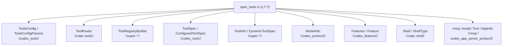
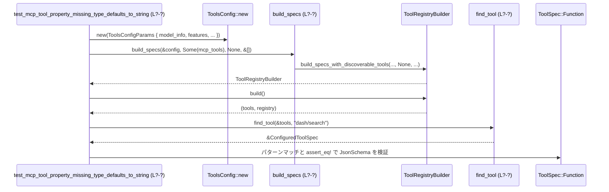

core/src/tools/spec_tests.rs

---

## 0. ざっくり一言

- ツール構成 (`ToolsConfig`)・モデル情報・機能フラグ・MCP ツール定義から、最終的にどのツール仕様 (`ToolSpec`) とレジストリが生成されるかを検証する統合テスト群です。
- シェル実行モード、マルチエージェント、検索ツール、MCP ツールの JSON Schema 変換など、コアツール周りの仕様を回帰テストしています。

> 注: 行番号はチャンクに含まれておらず正確に特定できないため、`L?-?` などの形で「不明」を示します。厳密な行位置はリポジトリ側で確認が必要です。

---

## 1. このモジュールの役割

### 1.1 概要

このテストモジュールは、以下のような「ツール周りの仕様」を検証するために存在します。

- モデル情報 (`ModelInfo`)・機能フラグ (`Features`)・サンドボックス設定から導出される `ToolsConfig` とツール一覧の検証  
- MCP ツール定義 (`rmcp::model::Tool`) を OpenAI 互換の `ToolSpec::Function` に変換する処理の検証（型のデフォルトや `additionalProperties` の扱いなど）
- マルチエージェント用ツール（`spawn_agent`）や検索系ツール（`tool_search`/`tool_suggest`）の説明文・可用条件の検証
- シェルツール（`shell`/`shell_command`/`exec_command` 等）の選択ロジックと OS・機能フラグの組み合わせの検証

### 1.2 アーキテクチャ内での位置づけ

このファイル自身はテスト専用ですが、依存関係としては次のような位置づけになります。



- `spec_tests.rs` は **プロダクションコードを呼び出す側** であり、ツール周りの公開 API 群の仕様を間接的に定義しています。
- 実際の実装は `super::*` でインポートされるツール関連モジュールや `codex_tools` にあり、このファイルはそれらの期待挙動を固定する役割です。

### 1.3 設計上のポイント

コードから読み取れる設計上の特徴は以下のとおりです。

- **ヘルパー関数で重複を隠蔽**
  - `mcp_tool`, `mcp_tool_info`, `discoverable_connector` などで MCP ツールやコネクタの定義を簡略化しています。
  - モデルごとのツール一覧検証も `assert_model_tools`, `assert_default_model_tools` に集約されています。
- **状態は外部構造体に集約**
  - このモジュール自体は状態を保持せず、`ToolsConfig`, `Features`, `ModelInfo` 等の構造体インスタンスを都度生成・利用しています。
- **エラーハンドリング方針**
  - テストであるため、期待が外れた場合は `assert!`, `assert_eq!`, `panic!`, `unwrap` などで即座にパニックさせるスタイルです。
  - 外部関数呼び出しでのエラー（例: `bundled_models_response()`）も `unwrap_or_else(|| panic!(...))` でテスト失敗に直結させています。
- **セキュリティ関連の仕様をテストで固定**
  - Windows 制限付きサンドボックス下で UnifiedExec をブロックする仕様や、CodeModeOnly 時に実行系ツールに限定する仕様など、「安全性」に関わる振る舞いがテストされています。
- **並行性**
  - このファイルには非同期処理やスレッドを直接扱うコードはありません。すべて同期的なテストです。

---

## 2. コンポーネントインベントリー（関数一覧）

このチャンクに現れる関数の一覧です。行範囲は不明のため `L?-?` としています。

| 名前 | 種別 | 役割 / 用途 | 行範囲 |
|------|------|-------------|--------|
| `mcp_tool` | ヘルパー | `rmcp::model::Tool` を簡単に構築する | `spec_tests.rs:L?-?` |
| `mcp_tool_info` | ヘルパー | `ToolInfo` に MCP ツールとメタ情報を詰める | 同上 |
| `discoverable_connector` | ヘルパー | `DiscoverableTool::Connector` を作成 | 同上 |
| `search_capable_model_info` | ヘルパー | `supports_search_tool = true` な `ModelInfo` を構築 | 同上 |
| `deferred_responses_api_tool_serializes_with_defer_loading` | テスト | 遅延ロード MCP ツールが `defer_loading: true` でシリアライズされることを確認 | 同上 |
| `assert_contains_tool_names` | ヘルパー | ツール名セットの部分集合・重複を検証 | 同上 |
| `shell_tool_name` | ヘルパー | `ToolsConfig.shell_type` からシェルツール名を求める | 同上 |
| `find_tool` | ヘルパー | `ConfiguredToolSpec` 配列から名前でツールを取得（なければ panic） | 同上 |
| `multi_agent_v2_tools_config` | ヘルパー | コラボ + MultiAgentV2 有効な `ToolsConfig` を生成 | 同上 |
| `multi_agent_v2_spawn_agent_description` | ヘルパー | `spawn_agent` ツールの説明文を取得 | 同上 |
| `model_info_from_models_json` | ヘルパー | `bundled_models_response()` から slug 指定で `ModelInfo` を得る | 同上 |
| `build_specs` | ヘルパー | `build_specs_with_discoverable_tools` のラッパー | 同上 |
| `model_provided_unified_exec_is_blocked_for_windows_sandboxed_policies` | テスト | Windows 制限付きサンドボックスで UnifiedExec が ShellCommand に変換されるか検証 | 同上 |
| `get_memory_requires_feature_flag` | テスト | `Feature::MemoryTool` 無効時に `get_memory` ツールが生成されないことを確認 | 同上 |
| `assert_model_tools` | ヘルパー | モデル・機能フラグから得られるツール名一覧が期待リストと一致するか検証 | 同上 |
| `assert_default_model_tools` | ヘルパー | UnifiedExec 有無に応じてシェル系ツール + 共通ツールが期待通りか検証 | 同上 |
| `test_build_specs_gpt5_codex_default` | テスト | `gpt-5-codex` のデフォルトツールセット検証 | 同上 |
| `test_build_specs_gpt51_codex_default` | テスト | `gpt-5.1-codex` のデフォルトツールセット検証 | 同上 |
| `test_build_specs_gpt5_codex_unified_exec_web_search` | テスト | UnifiedExec + Live 検索時の `gpt-5-codex` ツールセット検証 | 同上 |
| `test_build_specs_gpt51_codex_unified_exec_web_search` | テスト | 上記の `gpt-5.1-codex` 版 | 同上 |
| `test_gpt_5_1_codex_max_defaults` | テスト | `gpt-5.1-codex-max` のデフォルトツールセット検証 | 同上 |
| `test_codex_5_1_mini_defaults` | テスト | `gpt-5.1-codex-mini` のデフォルトツールセット検証 | 同上 |
| `test_gpt_5_defaults` | テスト | 一般 `gpt-5` モデルのデフォルトツールセット検証 | 同上 |
| `test_gpt_5_1_defaults` | テスト | 一般 `gpt-5.1` モデルのデフォルトツールセット検証 | 同上 |
| `test_gpt_5_1_codex_max_unified_exec_web_search` | テスト | UnifiedExec + Live 検索時 `gpt-5.1-codex-max` のツールセット検証 | 同上 |
| `test_build_specs_default_shell_present` | テスト | `o3` モデルで UnifiedExec + MCP なしでもシェル系ツールが揃うことを部分的に確認 | 同上 |
| `shell_zsh_fork_prefers_shell_command_over_unified_exec` | テスト | `ShellZshFork` 機能有効時に ShellCommand + ZshFork が優先されることを検証 | 同上 |
| `spawn_agent_description_omits_usage_hint_when_disabled` | テスト | usage hint 無効時の `spawn_agent` 説明文フォーマット検証 | 同上 |
| `spawn_agent_description_uses_configured_usage_hint_text` | テスト | カスタム usage hint 文言が説明文に含まれることを検証 | 同上 |
| `tool_suggest_requires_apps_and_plugins_features` | テスト | `tool_suggest` ツールが Apps + Plugins 両方有効なときのみ出現することを検証 | 同上 |
| `search_tool_description_handles_no_enabled_mcp_tools` | テスト | 有効な MCP が 0 件のとき、search ツール説明文がプレースホルダを残さないことを検証 | 同上 |
| `search_tool_description_falls_back_to_connector_name_without_description` | テスト | コネクタに description がない場合、名前のみを列挙するフォールバックを検証 | 同上 |
| `search_tool_registers_namespaced_mcp_tool_aliases` | テスト | search ツールが MCP ツールの namespaced alias をレジストリに登録することを検証 | 同上 |
| `test_mcp_tool_property_missing_type_defaults_to_string` | テスト | プロパティ `type` 欠如時に string として扱われることを検証 | 同上 |
| `test_mcp_tool_preserves_integer_schema` | テスト | `type: "integer"` が `JsonSchema::integer` に保持されることを検証 | 同上 |
| `test_mcp_tool_array_without_items_gets_default_string_items` | テスト | `type: "array"` かつ `items` なしの場合 string items になることを検証 | 同上 |
| `test_mcp_tool_anyof_defaults_to_string` | テスト | `anyOf` に含まれる型が `JsonSchema::any_of` に正しく反映されることを検証 | 同上 |
| `test_get_openai_tools_mcp_tools_with_additional_properties_schema` | テスト | ネストした `additionalProperties` 付きオブジェクトの JSON Schema 変換を検証 | 同上 |
| `code_mode_only_restricts_model_tools_to_exec_tools` | テスト | CodeModeOnly 有効時に `["exec", "wait"]` のみがツールとして残ることを検証 | 同上 |

---

## 3. 公開 API と詳細解説

### 3.1 このモジュールで重要な型（外部定義を含む）

このファイル内で頻繁に登場する主要型を列挙します（定義自体は他モジュールです）。

| 名前 | 種別 | 役割 / 用途 | 根拠 |
|------|------|-------------|------|
| `ToolsConfig` | 構造体 | モデル・機能フラグ・サンドボックス設定などから、どのツールを有効にするかをまとめた設定 | `ToolsConfig::new(..)` を多数のテストで使用 |
| `ToolsConfigParams` | 構造体 | `ToolsConfig::new` に渡すパラメータ（`model_info`, `features`, `web_search_mode` など） | `ToolsConfig::new(&ToolsConfigParams { .. })` |
| `ToolSpec` | 列挙体 | 個々のツール仕様。少なくとも `Function`, `ToolSearch` バリアントを持つ | `ToolSpec::Function`, `ToolSpec::ToolSearch { .. }` へのパターンマッチ |
| `ConfiguredToolSpec` | 構造体 | 実行可能なツールインスタンスを表すラッパー。`name()` メソッドで識別子取得 | `tools.iter().map(ConfiguredToolSpec::name)` 等 |
| `ToolRegistryBuilder` | 構造体 | ツールレジストリ構築のためのビルダー。`build()` で `(Vec<ConfiguredToolSpec>, registry)` を返す | `let (tools, _) = build_specs(..).build();` |
| `ToolRouter` | 構造体 | モデル可視のツールリストなどを返すルータ。`from_config` と `model_visible_specs()` を持つ | `ToolRouter::from_config(..).model_visible_specs()` |
| `ToolInfo` | 構造体 | MCP ツール 1 つ分のメタデータ（サーバ名・コネクタ情報など） | `ToolInfo { server_name, callable_name, .. }` 初期化 |
| `DynamicToolSpec` | 型（詳細不明） | 動的に追加されるツール仕様のコレクション | `dynamic_tools: &[DynamicToolSpec]` 引数として使用 |
| `JsonSchema` | 列挙体 | ツール引数の JSON Schema 表現。`string`, `integer`, `number`, `array`, `object`, `any_of` などのコンストラクタを持つ | `JsonSchema::string`, `JsonSchema::object` など |
| `ResponsesApiTool` | 構造体 | `ToolSpec::Function` の中身として使われる、関数型ツールの詳細（`name`, `parameters`, `description`, `strict`, `output_schema`, `defer_loading`） | `ToolSpec::Function(ResponsesApiTool { .. })` |
| `ToolName` | 構造体 | ツールの内部識別子。`plain` と `namespaced` コンストラクタ、`has_handler` の引数に使用 | `ToolName::plain(TOOL_SEARCH_TOOL_NAME)`, `ToolName::namespaced(..)` |
| `UnifiedExecShellMode` | 列挙体 | UnifiedExec モードの挙動設定。`Direct` や `ZshFork(ZshForkConfig)` などがある | `UnifiedExecShellMode::Direct`, `UnifiedExecShellMode::ZshFork(..)` |
| `ShellCommandBackendConfig` | 列挙体 | `ShellCommand` ツールのバックエンド種別。`ZshFork` などを持つ | `ShellCommandBackendConfig::ZshFork` |
| `ZshForkConfig` | 構造体 | Zsh フォーク実行時に必要なパス設定（`shell_zsh_path`, `main_execve_wrapper_exe`） | `ZshForkConfig { shell_zsh_path: .., main_execve_wrapper_exe: .. }` |

> これらの型の完全な定義はこのチャンクにはなく、役割はフィールド名や利用方法からの解釈です。

---

### 3.2 重要な関数の詳細

ここではこのモジュール内の重要なヘルパー関数・テスト関数 7 つを詳細に説明します。

#### `mcp_tool(name: &str, description: &str, input_schema: serde_json::Value) -> rmcp::model::Tool`

**概要**

- MCP サーバー用のツール定義 `rmcp::model::Tool` を簡易に構築するヘルパーです。
- `input_schema` を `rmcp::model::object` でオブジェクト型に変換し、その他のフィールドはデフォルト値で初期化します。

**引数**

| 引数名 | 型 | 説明 |
|--------|----|------|
| `name` | `&str` | MCP ツール名 |
| `description` | `&str` | ツールの説明文 |
| `input_schema` | `serde_json::Value` | ツール入力の JSON Schema を表す値 |

**戻り値**

- `rmcp::model::Tool`  
  - `name`, `description`, `input_schema` がセットされた MCP ツール定義です。`output_schema`, `annotations` などは `None` に設定されています。

**内部処理の流れ**

1. `name` と `description` を `String` に変換し、それぞれ `tool.name`, `tool.description` に格納します。
2. `rmcp::model::object(input_schema)` を呼び出して、オブジェクト型のスキーマに正規化します。
3. `input_schema` フィールドにはその戻り値を `Arc` で包んで設定します。
4. 残りのフィールド（`output_schema`, `annotations` など）は `None` を代入して返します。

**Examples（使用例）**

```rust
let tool = mcp_tool(
    "search",
    "Search docs",
    serde_json::json!({
        "type": "object",
        "properties": { "query": { "type": "string" } },
        "required": ["query"],
    }),
);
// この tool は MCP サーバに登録可能なツール定義として利用されます。
```

**Errors / Panics**

- この関数自体で `unwrap` や `panic!` は使用していません。
- `rmcp::model::object` の詳細な挙動はこのチャンクにはないため、異常な `input_schema` に対する挙動は不明です。

**Edge cases（エッジケース）**

- `input_schema` がオブジェクト型以外の場合の扱いはコードからは分かりません。
- `name` や `description` が空文字列でもそのまま設定されます。

**使用上の注意点**

- このヘルパーはテスト用であり、本番コードが直接利用する前提にはなっていません（`pub` ではない）。
- 変換後の `ToolSpec` や `JsonSchema` を検証するテストで頻繁に利用されています。

---

#### `mcp_tool_info(tool: rmcp::model::Tool) -> ToolInfo`

**概要**

- 1 つの MCP ツールを `ToolInfo` 構造体にラップし、テスト用の固定メタデータを付与します。

**引数**

| 引数名 | 型 | 説明 |
|--------|----|------|
| `tool` | `rmcp::model::Tool` | MCP ツール定義 |

**戻り値**

- `ToolInfo`  
  - `server_name = "test_server"`, `callable_name = tool.name.to_string()` など、テスト用の標準メタ情報がセットされた値です。

**内部処理の流れ**

1. `ToolInfo` 構造体をリテラルで構築します。
2. `server_name` に `"test_server"` を設定し、`callable_name` に `tool.name` を文字列化したものを設定します。
3. `callable_namespace` は `"mcp__test_server__"` に固定されています。
4. コネクタ関連フィールドは `None` や空ベクタで初期化されます。

**Examples（使用例）**

```rust
let info = mcp_tool_info(mcp_tool(
    "search",
    "Search docs",
    serde_json::json!({ "type": "object" }),
));
// HashMap<String, ToolInfo> として build_specs に渡して使います。
```

**Errors / Panics**

- この関数自体にエラー経路はありません。

**Edge cases**

- `tool.name` によって `callable_name` が決まるため、重複やフォーマットの妥当性は呼び出し側に依存します。

**使用上の注意点**

- テストでは `HashMap<String, ToolInfo>` の value として利用され、キー文字列と中の `callable_name` の整合性はテスト側で保証している前提です。

---

#### `discoverable_connector(id: &str, name: &str, description: &str) -> DiscoverableTool`

**概要**

- アプリ / プラグインとして「発見可能」なコネクタ（`DiscoverableTool::Connector`）を構築します。
- `AppInfo` の `install_url` なども含めて、一通りのメタ情報を埋めます。

**引数**

| 引数名 | 型 | 説明 |
|--------|----|------|
| `id` | `&str` | アプリ ID |
| `name` | `&str` | アプリ表示名 |
| `description` | `&str` | アプリの説明文 |

**戻り値**

- `DiscoverableTool::Connector(Box<AppInfo>)`  
  - `AppInfo` には `id`, `name`, `description`, `install_url` などが設定されます。`install_url` は `https://chatgpt.com/apps/{slug}/{id}` 形式で作成されます。

**内部処理の流れ**

1. `slug = name.replace(' ', "-").to_lowercase()` で URL 用スラッグを作成します。
2. `AppInfo` 構造体を初期化し、`install_url` に `slug` と `id` を埋め込んだ URL を設定します。
3. `DiscoverableTool::Connector(Box::new(app_info))` を返します。

**Examples（使用例）**

```rust
let connector = discoverable_connector(
    "connector_2128aebf...",
    "Google Calendar",
    "Plan events and schedules.",
);
// tool_suggest_requires_apps_and_plugins_features テスト内で使用。
```

**Errors / Panics**

- エラー処理はなく、常に `DiscoverableTool::Connector` を返します。

**Edge cases**

- `name` に空白以外の特殊文字が含まれる場合の `slug` 表現はここでは単純な `replace` + `to_lowercase` の結果になります。

**使用上の注意点**

- テストでは `discoverable_tools` の入力として使われ、`ToolSuggest` の有無を検証する際に「コネクタが 1 つある状態」を再現するために使われています。

---

#### `build_specs(config: &ToolsConfig, mcp_tools: Option<HashMap<String, ToolInfo>>, deferred_mcp_tools: Option<HashMap<String, ToolInfo>>, dynamic_tools: &[DynamicToolSpec]) -> ToolRegistryBuilder`

**概要**

- 実際のビルダ関数 `build_specs_with_discoverable_tools` を呼ぶ薄いラッパーです。
- このヘルパーを通じて、テストでは `discoverable_tools` を常に `None` としてツールレジストリを構築します。

**引数**

| 引数名 | 型 | 説明 |
|--------|----|------|
| `config` | `&ToolsConfig` | ツール構成（モデル・機能フラグなど） |
| `mcp_tools` | `Option<HashMap<String, ToolInfo>>` | 即時ロードされる MCP ツール群 |
| `deferred_mcp_tools` | `Option<HashMap<String, ToolInfo>>` | 遅延ロード MCP ツール群 |
| `dynamic_tools` | `&[DynamicToolSpec]` | 動的追加ツール |

**戻り値**

- `ToolRegistryBuilder`  
  - 後続で `.build()` を呼び出すことで `(Vec<ConfiguredToolSpec>, registry)` を得ます。

**内部処理の流れ**

1. `build_specs_with_discoverable_tools(config, mcp_tools, deferred_mcp_tools, None, dynamic_tools)` をそのまま呼び出します。
2. 戻り値の `ToolRegistryBuilder` を返します。

**Examples（使用例）**

```rust
let (tools, registry) = build_specs(
    &tools_config,
    /*mcp_tools*/ Some(mcp_map),
    /*deferred_mcp_tools*/ None,
    &[],
).build();
// tools と registry に対して ASSERT を行う。
```

**Errors / Panics**

- このラッパー自体には `panic!` 等はありません。
- 実際のエラーやパニック条件は `build_specs_with_discoverable_tools` と `ToolRegistryBuilder::build` に依存し、このチャンクにはその実装はありません。

**Edge cases**

- `mcp_tools`, `deferred_mcp_tools` に `None` を渡した場合と `Some(HashMap::new())` を渡した場合の挙動の違いは、このチャンクからは不明です（テストでは両方のパターンが使用されています）。

**使用上の注意点**

- `discoverable_tools` を扱うテストでは、直接 `build_specs_with_discoverable_tools` を呼び出しています（`tool_suggest_requires_apps_and_plugins_features` テストなど）。
- 新しいテストでコネクタ関連の仕様を検証する場合は、`build_specs_with_discoverable_tools` か別ラッパーを利用する方が自然です。

---

#### `assert_model_tools(model_slug: &str, features: &Features, web_search_mode: Option<WebSearchMode>, expected_tools: &[&str])`

**概要**

- モデル slug と機能フラグから `ToolsConfig` と `ToolRouter` を生成し、そのモデルで可視なツール名のリストが `expected_tools` と完全一致するかを検証します。

**引数**

| 引数名 | 型 | 説明 |
|--------|----|------|
| `model_slug` | `&str` | models.json 内のモデル識別子 |
| `features` | `&Features` | 有効化された機能フラグセット |
| `web_search_mode` | `Option<WebSearchMode>` | Web 検索モード（`Cached`/`Live` など） |
| `expected_tools` | `&[&str]` | 期待されるツール名の順序付きリスト |

**戻り値**

- なし（`()`）。内部で `assert_eq!` によって不一致ならテストを失敗させます。

**内部処理の流れ**

1. `model_info_from_models_json(model_slug)` で `ModelInfo` を取得します。
2. `ToolsConfig::new` に `model_info`, `features`, `web_search_mode` などを渡して `tools_config` を生成します。
3. `ToolRouter::from_config(&tools_config, ToolRouterParams { .. })` でルータを構築します（MCP や dynamic_tools はすべて `None` / 空配列）。
4. `router.model_visible_specs()` でモデルに見える `ToolSpec` のリストを取得します。
5. 各 `ToolSpec` に対して `ToolSpec::name` を呼び出し、`Vec<&str>` の `tool_names` を作成します。
6. `assert_eq!(&tool_names, &expected_tools)` で完全一致を確認します。

**Examples（使用例）**

```rust
let mut features = Features::with_defaults();
features.enable(Feature::UnifiedExec);

assert_model_tools(
    "gpt-5-codex",
    &features,
    Some(WebSearchMode::Live),
    &[
        "exec_command",
        "write_stdin",
        "update_plan",
        "request_user_input",
        // ...
    ],
);
```

**Errors / Panics**

- モデル slug が `bundled_models_response()` に含まれていない場合、`model_info_from_models_json` 内の `unwrap_or_else` で `panic!` します。
- 実際のツール名リストが `expected_tools` と異なる場合、`assert_eq!` によってパニックします。

**Edge cases**

- `web_search_mode` を `None` にした場合の挙動はこのファイルではテストされておらず、不明です。
- ツール名の順序も検証対象のため、順番変更があるとテストが失敗します。

**使用上の注意点**

- 新しいツールを追加した場合、この関数を使ったテストに期待リストの更新が必要です。
- モデルごとの差異（コード特化モデルは `apply_patch` を持つなど）を固定するため、モデル追加や仕様変更時にはこのテスト群を合わせてメンテナンスする必要があります。

---

#### `assert_default_model_tools(model_slug: &str, features: &Features, web_search_mode: Option<WebSearchMode>, shell_tool: &'static str, expected_tail: &[&str])`

**概要**

- UnifiedExec 機能フラグの有無に応じて「先頭に来るシェル関連ツール」を切り替え、残りの共通ツール名 `expected_tail` と合わせて `assert_model_tools` を呼び出すヘルパーです。

**引数**

| 引数名 | 型 | 説明 |
|--------|----|------|
| `model_slug` | `&str` | 対象モデル slug |
| `features` | `&Features` | 有効な機能フラグ |
| `web_search_mode` | `Option<WebSearchMode>` | Web 検索モード |
| `shell_tool` | `&'static str` | UnifiedExec 無効時に期待されるシェルツール名（例: `"shell_command"`） |
| `expected_tail` | `&[&str]` | シェルツール以外のツール名配列 |

**戻り値**

- なし。内部で `assert_model_tools` を呼び出します。

**内部処理の流れ**

1. `features.enabled(Feature::UnifiedExec)` をチェックします。
2. 有効なら `expected = vec!["exec_command", "write_stdin"]` を作り、無効なら `expected = vec![shell_tool]` を作ります。
3. `expected.extend(expected_tail)` で共通ツール名を連結します。
4. `assert_model_tools(model_slug, features, web_search_mode, &expected)` を呼び出します。

**Examples（使用例）**

```rust
let features = Features::with_defaults();
assert_default_model_tools(
    "gpt-5-codex",
    &features,
    Some(WebSearchMode::Cached),
    "shell_command",
    &[
        "update_plan",
        "request_user_input",
        "apply_patch",
        // ...
    ],
);
```

**Errors / Panics**

- `assert_model_tools` 内の条件に従ってパニックします。

**Edge cases**

- `shell_tool` に渡された名前が実際には有効でない場合、`assert_model_tools` で不一致となりテストが失敗します。

**使用上の注意点**

- モデル間でシェルツール名が異なるケース（`"shell"` vs `"shell_command"`）を一元的に扱うためのヘルパーです。
- UnifiedExec を追加・削除するテストを書く際にも再利用できます。

---

#### `multi_agent_v2_spawn_agent_description(tools_config: &ToolsConfig) -> String`

**概要**

- 指定された `ToolsConfig` からツールレジストリを構築し、その中の `spawn_agent` ツールの説明文を抽出して返します。

**引数**

| 引数名 | 型 | 説明 |
|--------|----|------|
| `tools_config` | `&ToolsConfig` | MultiAgentV2 関連設定が埋め込まれたツール設定 |

**戻り値**

- `String`  
  - `spawn_agent` ツールの説明文（`ResponsesApiTool.description`）です。

**内部処理の流れ**

1. `build_specs(tools_config, None, None, &[])` で `ToolRegistryBuilder` を取得します。
2. `.build()` を呼び出し `(tools, _)` を得ます。
3. `find_tool(&tools, "spawn_agent")` で対象ツールを探し出します。見つからなければ `panic!` です。
4. `spawn_agent.spec` をパターンマッチし、`ToolSpec::Function(ResponsesApiTool { description, .. })` の場合のみ `description.clone()` を返します。その他のバリアントなら `panic!("spawn_agent should be a function tool")` となります。

**Examples（使用例）**

```rust
let tools_config = multi_agent_v2_tools_config()
    .with_spawn_agent_usage_hint(false);
let description = multi_agent_v2_spawn_agent_description(&tools_config);
// description に対して正規表現でフォーマット検証を行う。
```

**Errors / Panics**

- ツール一覧に `spawn_agent` が含まれていない場合、`find_tool` の `unwrap_or_else` で `panic!` します。
- `spawn_agent.spec` が `ToolSpec::Function` 以外だった場合も `panic!` します。

**Edge cases**

- MultiAgentV2 機能フラグが無効な `ToolsConfig` を渡した場合にどうなるか（`spawn_agent` が生成されるか）は、このチャンクでは検証されていません。

**使用上の注意点**

- テキストの正確な内容までは解釈せず、`assert_regex_match` を使って形式と一部のフレーズを検証するスタイルが採用されています。
- `spawn_agent` ツールの仕様が変わった場合、対応する正規表現テストも更新が必要です。

---

#### `shell_zsh_fork_prefers_shell_command_over_unified_exec()`

**概要**

- `Feature::UnifiedExec` と `Feature::ShellZshFork` が両方有効な場合でも、`ToolsConfig` の `shell_type` が `ShellCommand` になり、バックエンドが `ZshFork` になることを検証するテストです。
- さらにユーザーローカルな Zsh 情報を渡したときの `UnifiedExecShellMode` の遷移も検証します。

**引数**

- なし（テスト関数）

**戻り値**

- なし。`assert_eq!` などで条件を検証します。

**内部処理の流れ（要約）**

1. `test_config()` + `"o3"` モデルで `model_info` を構築。
2. `features` に `UnifiedExec` と `ShellZshFork` を有効化して `ToolsConfig` を生成。
3. `Shell { shell_type: ShellType::Zsh, shell_path: "/bin/zsh", shell_snapshot: empty_shell_snapshot_receiver() }` を作成。
4. 次を `assert_eq!` で検証:
   - `tools_config.shell_type == ConfigShellToolType::ShellCommand`
   - `tools_config.shell_command_backend == ShellCommandBackendConfig::ZshFork`
   - `tools_config.unified_exec_shell_mode == UnifiedExecShellMode::Direct`
5. `tools_config.with_unified_exec_shell_mode_for_session(..)` を呼び、Zsh と execve wrapper のパスを指定し、その戻り値の `unified_exec_shell_mode` が:
   - Unix の場合: `UnifiedExecShellMode::ZshFork(ZshForkConfig { .. })`
   - それ以外: `UnifiedExecShellMode::Direct`
   になることを検証。

**Examples（使用例）**

- このテスト自体が代表例であり、実アプリケーションで同様の設定を行った場合の期待挙動を示しています。

**Errors / Panics**

- 内部で `AbsolutePathBuf::from_absolute_path(..).unwrap()` を使用しているため、パス文字列が不正な場合にはパニックします。ただし、テストでは固定の正常なパスを使用しています。

**Edge cases**

- `cfg!(unix)` / `cfg!(windows)` による条件分岐があるため、プラットフォームによって検証内容が異なります。
- Windows 環境で `ShellZshFork` を利用するケースはこのテストからは分かりません。

**使用上の注意点**

- シェル関連の設定はセキュリティと密接に関わるため、このテストは「Zsh フォークを使うときでも UnifiedExec を安易に有効にしない」という仕様を固定化しています。
- 新しいシェルモードやバックエンドを追加する場合、このテストを参考に挙動を検証するのが有用です。

---

### 3.3 その他の関数（概要のみ）

ヘルパーとテストの残りを簡潔にまとめます。

| 関数名 | 役割（1 行） |
|--------|--------------|
| `search_capable_model_info` | `construct_model_info_offline("gpt-5-codex")` に `supports_search_tool = true` を設定した `ModelInfo` を返す |
| `deferred_responses_api_tool_serializes_with_defer_loading` | Deferred MCP ツールが `ToolSpec::Function` として `defer_loading: true` でシリアライズされることを検証 |
| `assert_contains_tool_names` | ツール名の集合に重複がないことと、指定サブセットがすべて含まれることを検証 |
| `shell_tool_name` | `ToolsConfig.shell_type` から `"shell"`, `"local_shell"`, `"shell_command"` などのツール名を返す（UnifiedExec/Disabled は `None`） |
| `multi_agent_v2_tools_config` | Collab + MultiAgentV2 機能を有効にした `ToolsConfig` を構築する |
| `model_provided_unified_exec_is_blocked_for_windows_sandboxed_policies` | Windows の制限付きサンドボックスでは UnifiedExec が `ShellCommand` に書き換えられることを検証 |
| `get_memory_requires_feature_flag` | `Feature::MemoryTool` 無効時に `get_memory` ツールが生成されないことを確認 |
| `test_build_specs_*` 群 | 各種モデル slug (`gpt-5*`, `gpt-5.1*`, `o3` など) に対するツール一覧（シェル/検索/画像/マルチエージェント系）の組み合わせを検証 |
| `spawn_agent_description_omits_usage_hint_when_disabled` | usage hint 無効時の `spawn_agent` 説明文が特定の正規表現にマッチすることを検証 |
| `spawn_agent_description_uses_configured_usage_hint_text` | カスタム usage hint 文言が説明文の末尾に含まれることを検証 |
| `tool_suggest_requires_apps_and_plugins_features` | Apps または Plugins のどちらか一方が無効なとき `tool_suggest` ツールが生成されないことを検証 |
| `search_tool_description_handles_no_enabled_mcp_tools` | 有効な MCP ツールが 0 件のとき、search ツール説明文が「None currently enabled.」を含み、テンプレートプレースホルダを残さないことを検証 |
| `search_tool_description_falls_back_to_connector_name_without_description` | コネクタに description がないとき、`- Calendar` のように名前のみが列挙されることを検証 |
| `search_tool_registers_namespaced_mcp_tool_aliases` | search ツールが MCP ツールの namespaced alias をレジストリに登録することを検証 |
| `test_mcp_tool_property_missing_type_defaults_to_string` | property に `type` がない場合に `JsonSchema::string` として扱う変換を検証 |
| `test_mcp_tool_preserves_integer_schema` | `type: "integer"` が `JsonSchema::integer` に保持されることを検証 |
| `test_mcp_tool_array_without_items_gets_default_string_items` | `type: "array"` かつ `items` なしの場合に `array(string)` として扱うことを検証 |
| `test_mcp_tool_anyof_defaults_to_string` | `anyOf` に含まれる型のリストが `JsonSchema::any_of` に正しく反映されることを検証 |
| `test_get_openai_tools_mcp_tools_with_additional_properties_schema` | ネストした `additionalProperties` を含む複雑なオブジェクトスキーマが `JsonSchema::object` との組み合わせで正しく表現されることを検証 |
| `code_mode_only_restricts_model_tools_to_exec_tools` | CodeModeOnly 有効時にツールが `["exec", "wait"]` に制限されることを検証 |

---

## 4. データフロー

### 4.1 代表シナリオ：MCP ツールの JSON Schema 変換

`test_mcp_tool_property_missing_type_defaults_to_string` などのテストでは、「MCP ツール定義 → `ToolSpec::Function` → `JsonSchema`」の変換フローが検証されています。

#### 処理の流れ（概要）

1. テスト関数内で `ToolsConfig` を構築し、`mcp_tools` に `HashMap<String, ToolInfo>` を渡す。
2. `build_specs` が `build_specs_with_discoverable_tools` を通じて `ToolRegistryBuilder` を構築。
3. `ToolRegistryBuilder::build()` で `(tools, registry)` が生成される。
4. `find_tool(&tools, "<name>")` で対象ツールを取り出し、`tool.spec` を `ToolSpec::Function(ResponsesApiTool { parameters, .. })` としてパターンマッチ。
5. `parameters` が期待される `JsonSchema` 構造（string デフォルト、integer 保持、array/items デフォルトなど）になっているかを `assert_eq!` で検証。

#### シーケンス図



---

## 5. 使い方（How to Use）

このファイルはテスト用ですが、プロダクションコードや追加のテストを書く際の参考パターンとして説明します。

### 5.1 基本的なツール構成テストのパターン

1. **モデル情報と機能フラグを準備**
2. **`ToolsConfig` を構築**
3. **`build_specs` や `ToolRouter` でツール一覧を取得**
4. **ツール名・説明・スキーマを検証**

```rust
// 1. モデル情報と機能フラグ
let config = test_config();
let model_info = construct_model_info_offline("gpt-5-codex", &config);
let mut features = Features::with_defaults();
features.enable(Feature::UnifiedExec);
let available_models = Vec::new();

// 2. ToolsConfig を構築
let tools_config = ToolsConfig::new(&ToolsConfigParams {
    model_info: &model_info,
    available_models: &available_models,
    features: &features,
    image_generation_tool_auth_allowed: true,
    web_search_mode: Some(WebSearchMode::Cached),
    session_source: SessionSource::Cli,
    sandbox_policy: &SandboxPolicy::DangerFullAccess,
    windows_sandbox_level: WindowsSandboxLevel::Disabled,
});

// 3. ツールレジストリを構築
let (tools, registry) = build_specs(
    &tools_config,
    /*mcp_tools*/ None,
    /*deferred_mcp_tools*/ None,
    &[],
).build();

// 4. 特定ツールを検証
let update_plan = find_tool(&tools, "update_plan");
assert_eq!(update_plan.name(), "update_plan");
```

### 5.2 よくある使用パターン

- **モデルごとのツールセット検証**  
  - `assert_default_model_tools` / `assert_model_tools` を利用して、モデル slug ごとのツール名リストを丸ごと検証します。
- **検索ツールまわりの検証**  
  - `search_capable_model_info` + `build_specs` で search ツールを構築し、`ToolSpec::ToolSearch { description, .. }` を取り出して説明文を検証します。
- **MCP ツールスキーマの検証**  
  - `mcp_tool` + `mcp_tool_info` で MCP ツール定義を作り、`build_specs` から得られた `ToolSpec::Function` の `parameters: JsonSchema` を `assert_eq!` で検証します。

### 5.3 よくある間違い

```rust
// 間違い例: ツールが存在する前提で直接 spec にアクセスする
// let tool = tools.iter().find(|t| t.name() == "spawn_agent").unwrap();
// let ToolSpec::Function(ResponsesApiTool { description, .. }) = &tool.spec;

// 正しい例: 共通ヘルパーで取得し、バリアントをチェックする
let spawn_agent = find_tool(&tools, "spawn_agent");
let ToolSpec::Function(ResponsesApiTool { description, .. }) = &spawn_agent.spec else {
    panic!("spawn_agent should be a function tool");
};
```

- ツール名の存在を仮定せず、見つからない場合に明示的に `panic!` するか、`assert!` する方がテストの意図が明確になります（このファイルは後者のスタイルです）。

### 5.4 使用上の注意点（まとめ）

- **前提条件**
  - `model_info_from_models_json` で使用するモデル slug は `bundled_models_response()` に含まれている必要があります。
  - ツール名の期待値は、`ToolSpec::name` が返す内部名に合わせる必要があります。
- **セキュリティ関連**
  - UnifiedExec やシェル実行モードに関する挙動は、Windows サンドボックスや `ShellZshFork` 機能と絡んでいます。安全性を変更する際は対応テスト（`model_provided_unified_exec_is_blocked_for_windows_sandboxed_policies`, `shell_zsh_fork_prefers_shell_command_over_unified_exec`）を確認する必要があります。
- **エラー/パニック**
  - テストで `unwrap` や `unwrap_or_else(|| panic!(..))` を多用しているため、期待と異なる状態になった場合すぐにテストが失敗します。これは仕様変更を検知するための意図的な設計です。
- **並行性**
  - このファイルは並行実行や async を利用していません。ツール実行時の並行性は別モジュール側の責務です。

---

## 6. 変更の仕方（How to Modify）

### 6.1 新しいツール機能を追加する場合

1. **プロダクションコード側**で新しいツール（`ToolSpec` 生成ロジック）や機能フラグを追加する。
2. このファイルで、該当モデルのテスト（`test_build_specs_*` や `assert_default_model_tools` / `assert_model_tools` を使うテスト）に新しいツール名を追加する。
3. MCP ベースのツールであれば、`mcp_tool` / `mcp_tool_info` を使ったスキーマ変換テストを追加する。
4. 機能フラグやセキュリティ条件（Apps/Plugins 必須など）が絡む場合、`tool_suggest_requires_apps_and_plugins_features` のように「どのフラグが必須か」を明示する負のテストも追加する。

### 6.2 既存の仕様を変更する場合

- **影響範囲の確認**
  - ツール一覧やシェルモードに関する変更は、`test_build_specs_*`, `model_provided_unified_exec_is_blocked_for_windows_sandboxed_policies`, `shell_zsh_fork_prefers_shell_command_over_unified_exec`, `code_mode_only_restricts_model_tools_to_exec_tools` に影響する可能性があります。
  - 検索関連の説明文・エイリアス登録を変更する場合、`search_tool_*` 系テストへの影響を確認する必要があります。
- **契約（前提条件）の維持**
  - CodeModeOnly モードでツールが `["exec", "wait"]` に制限されることなど、ファイル内のテストが「契約」として機能している部分があります。仕様変更の意図が明確であれば、テストも同時に更新する必要があります。
- **テストの更新**
  - models.json 側のモデル slug 追加・削除や名前変更があった場合、`model_info_from_models_json` を使っているすべてのテストが影響を受けるため、該当 slug を一括で見直す必要があります。

---

## 7. 関連ファイル

このモジュールと密接に関係するファイル・モジュール（推測ではなく `use` から分かる範囲）です。

| パス / モジュール | 役割 / 関係 |
|-------------------|------------|
| `crate::config::test_config` | テスト用の基本設定を返す関数。`ToolsConfig` や `ModelInfo` 構築のベースとして使用。 |
| `crate::shell::{Shell, ShellType, empty_shell_snapshot_receiver}` | ユーザーのシェル情報を表す型とヘルパー。Zsh フォーク検証テストで使用。 |
| `crate::test_support::construct_model_info_offline` | モデル slug から `ModelInfo` をオフラインで構築するヘルパー。 |
| `crate::tools::{ToolRouter, router::ToolRouterParams}` | モデルごとに可視なツール仕様を返すルータ。ツール一覧検証に使用。 |
| `super::*` | `ToolInfo`, `DynamicToolSpec`, `ToolRegistryBuilder`, `build_specs_with_discoverable_tools`, `tool_user_shell_type` など、このテストが対象とするツール実装側の API 群。 |
| `codex_tools::*` | `ToolSpec`, `ConfiguredToolSpec`, `JsonSchema`, `ResponsesApiTool`, `ToolsConfig`, `ToolName` などツール定義と JSON Schema 変換の中核。 |
| `codex_protocol::openai_models::*` | `ModelInfo`, `ConfigShellToolType` など、モデルに関する設定・メタ情報。 |
| `codex_protocol::config_types::*` | `WebSearchMode`, `WindowsSandboxLevel` など、ツール構成に影響する設定値。 |
| `codex_protocol::protocol::*` | `SandboxPolicy`, `SessionSource` など、実行環境に関するポリシー情報。 |
| `codex_models_manager::{bundled_models_response, model_info::with_config_overrides}` | `models.json` からモデル一覧を読み取り、設定で上書きした `ModelInfo` を得るために使用。 |
| `codex_mcp`, `rmcp` 関連 | MCP ツールおよび MCP サーバ名定数（`CODEX_APPS_MCP_SERVER_NAME`）など、MCP ベースのツール変換で使用。 |

---

このレポートは、与えられたコードチャンクの範囲内で読み取れる事実に基づいています。  
外部モジュールの内部実装やここに現れない仕様については「不明」とし、推測は行っていません。
