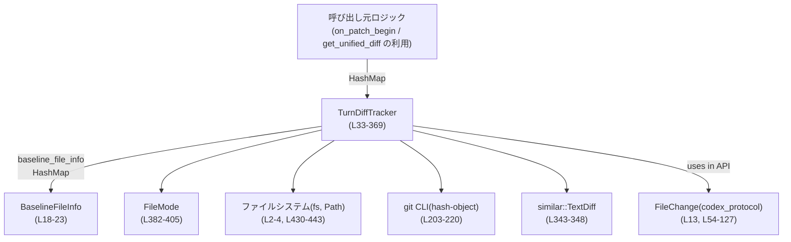
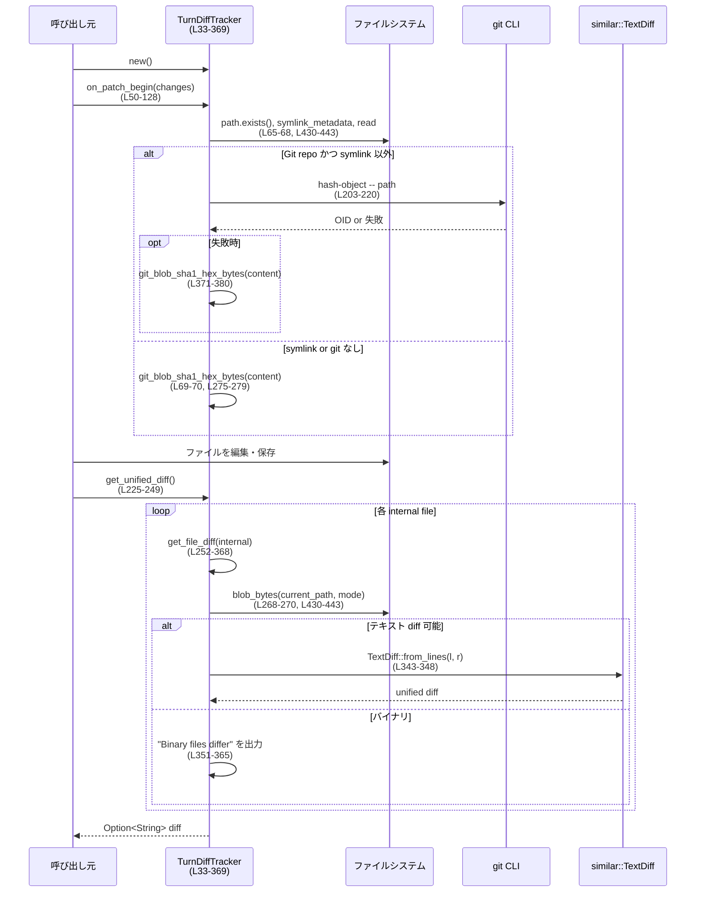

# core/src/turn_diff_tracker.rs コード解説

## 0. ざっくり一言

- 1ターン中に変更されたファイル群について、「変更前のスナップショット」と「現在のファイル内容」とを比較し、`git diff` 互換の unified diff テキストを生成するトラッカーです（根拠: `TurnDiffTracker` 定義とコメント `core/src/turn_diff_tracker.rs:L25-42, L222-249`）。

---

## 1. このモジュールの役割

### 1.1 概要

- このモジュールは **対話ターン内でのファイル変更** を追跡し、その結果を **統合された unified diff** として取得するための仕組みを提供します（`get_unified_diff`）。  
- 各ファイルについて、最初に変更されたタイミングで **ベースライン（変更前）** をメモリに保持し、ターン終了時に **ディスク上の現在内容** と diff を取ります（`on_patch_begin`, `get_file_diff`。根拠: `core/src/turn_diff_tracker.rs:L50-54, L222-249, L252-368`）。
- Git リポジトリ配下であれば `git hash-object` を呼び出して blob OID を取得し、`git diff` と同じような `index <oid1>..<oid2>` 行を出力します（根拠: `core/src/turn_diff_tracker.rs:L201-220, L275-285, L330-352`）。

### 1.2 アーキテクチャ内での位置づけ

主な構成要素と外部依存は次のとおりです。

- 呼び出し元（例: apply_patch を使う上位ロジック）
- `TurnDiffTracker`（本モジュールの中心）
- 内部状態: `BaselineFileInfo`, `FileMode` と各種マップ
- ファイルシステム (`std::fs`, `Path`, `PathBuf`)
- Git CLI (`git hash-object`)
- diff エンジン (`similar::TextDiff`)
- プロトコル定義: `codex_protocol::protocol::FileChange`

これを簡略図で示すと次のようになります（行番号は本ファイルの定義範囲を示します）。



### 1.3 設計上のポイント

- **ベースラインのスナップショット管理**  
  - ファイルが初めて `on_patch_begin` に現れた時点の状態を `BaselineFileInfo` として保持します（根拠: `core/src/turn_diff_tracker.rs:L54-93`）。
  - ディスク上に存在しない新規ファイルの場合は、OID を `ZERO_OID` にして「/dev/null からの追加」として扱います（根拠: `core/src/turn_diff_tracker.rs:L81-88, L288-304`）。

- **内部名（UUID）によるリネーム追跡**  
  - 外部パス（実際のファイルパス）とは別に、UUID 文字列を「内部ファイル名」として管理し、リネーム／移動時も同じ内部名に紐づけることで、同一ファイルの履歴を追跡します（根拠: `core/src/turn_diff_tracker.rs:L34-42, L54-63, L96-125`）。
  - `get_file_diff` では **左側（ベースライン）パス** と **右側（現在）パス** を別々に計算し、リネームによるパス変更も diff に反映します（根拠: `core/src/turn_diff_tracker.rs:L255-273, L302-314`）。

- **Git ルート探索と相対パス表示**  
  - `.git` ディレクトリ／ファイルを上位ディレクトリに向かって探索し、見つかったディレクトリをリポジトリルートとしてキャッシュします（根拠: `core/src/turn_diff_tracker.rs:L141-185`）。
  - diff 出力では、可能な限り git ルートからの相対パスを使用し、`a/path` / `b/path` 形式に揃えます（根拠: `core/src/turn_diff_tracker.rs:L187-199, L302-314`）。

- **エラーハンドリング方針**  
  - ファイル読み込み失敗や symlink 読み取り失敗、`git` コマンド失敗などは **すべてエラーとしては表に出さず**、`Option` に落として「内容が空／欠落している」状態として扱います（根拠: `core/src/turn_diff_tracker.rs:L65-74, L430-443, L203-220`）。
  - `get_unified_diff` は `Result` を返しますが、現状この関数で `Err` が生成される分岐はありません（根拠: `core/src/turn_diff_tracker.rs:L225-249`）。

- **並行性**  
  - 主要メソッドはすべて `&mut self` を要求し、内部状態は通常の `HashMap` / `Vec` で保持しているため、**1インスタンスを複数スレッドから同時に更新する使い方は想定されていません**（根拠: `core/src/turn_diff_tracker.rs:L45-249`）。

### 1.4 コンポーネント一覧（型・関数インベントリ）

#### 型一覧

| 名前 | 種別 | 公開 | 役割 / 用途 | 定義位置 |
|------|------|------|-------------|----------|
| `BaselineFileInfo` | 構造体 | 非公開 | ベースライン時点のパス・内容・モード・OID を保持する内部用構造体 | `core/src/turn_diff_tracker.rs:L18-23` |
| `TurnDiffTracker` | 構造体 | 公開 | 1ターン分のファイル変更を追跡し、統合 diff を生成するメインコンポーネント | `core/src/turn_diff_tracker.rs:L25-43` |
| `FileMode` | 列挙体 | 非公開 | Git 互換のファイルモード（通常ファイル／実行可能／シンボリックリンク）を表現 | `core/src/turn_diff_tracker.rs:L382-388` |

#### 関数・メソッド一覧（概要）

| 名前 | 種別 | 概要 | 定義位置 |
|------|------|------|----------|
| `TurnDiffTracker::new` | `pub fn` | デフォルト状態のトラッカーを生成 | `core/src/turn_diff_tracker.rs:L45-48` |
| `TurnDiffTracker::on_patch_begin` | `pub fn` | パッチ適用前に変更対象ファイルのベースラインを記録し、リネームも更新 | `core/src/turn_diff_tracker.rs:L50-128` |
| `TurnDiffTracker::get_unified_diff` | `pub fn` | 全追跡ファイルについて unified diff をまとめて生成 | `core/src/turn_diff_tracker.rs:L222-249` |
| `TurnDiffTracker::get_file_diff` | `fn` | 1ファイル分の unified diff を生成 | `core/src/turn_diff_tracker.rs:L252-368` |
| `TurnDiffTracker::get_path_for_internal` | `fn` | 内部名から現在の外部パス（なければベースライン時のパス）を取得 | `core/src/turn_diff_tracker.rs:L130-139` |
| `TurnDiffTracker::find_git_root_cached` | `fn` | `.git` を探索して git ルートを見つけ、キャッシュする | `core/src/turn_diff_tracker.rs:L141-185` |
| `TurnDiffTracker::relative_to_git_root_str` | `fn` | パスを git ルートからの相対文字列（`/` 区切り）に変換 | `core/src/turn_diff_tracker.rs:L187-199` |
| `TurnDiffTracker::git_blob_oid_for_path` | `fn` | 指定ファイルの git blob OID を `git hash-object` で取得 | `core/src/turn_diff_tracker.rs:L201-220` |
| `git_blob_sha1_hex_bytes` | `fn` | 任意のバイト列に対して git blob 互換の SHA-1 を計算 | `core/src/turn_diff_tracker.rs:L371-380` |
| `FileMode::as_str` | `fn` | Git 互換の8桁モード文字列に変換 | `core/src/turn_diff_tracker.rs:L390-398` |
| `Display for FileMode` | `impl` | `fmt` を `as_str` に委譲 | `core/src/turn_diff_tracker.rs:L401-404` |
| `file_mode_for_path` | `fn` | パスから `FileMode` を判定（UNIX と非 UNIX で実装差あり） | `core/src/turn_diff_tracker.rs:L407-428` |
| `blob_bytes` | `fn` | パスとモードに基づいて blob 内容（バイト列）を取得 | `core/src/turn_diff_tracker.rs:L430-443` |
| `symlink_blob_bytes` | `fn` | シンボリックリンクのリンク先パスを git 互換形式のバイト列に変換 | `core/src/turn_diff_tracker.rs:L445-454` |
| `is_windows_drive_or_unc_root` | `fn` | Windows ドライブ／UNC のルートかどうか判定 | `core/src/turn_diff_tracker.rs:L457-465` |

---

## 2. 主要な機能一覧

- 変更前スナップショットの取得・保存: `on_patch_begin` で、初回に触れたファイルの内容・モード・OID を `BaselineFileInfo` として記録します（`core/src/turn_diff_tracker.rs:L50-93`）。
- リネーム／移動の追跡: `FileChange::Update { move_path: Some(..) }` を解釈して、内部名（UUID）に紐づく「現在のパス」を更新します（`core/src/turn_diff_tracker.rs:L96-125`）。
- Git ルート探索と相対パス表示: `.git` を基準にリポジトリルートを探し、diff 出力のパスをルート相対に整形します（`core/src/turn_diff_tracker.rs:L141-199`）。
- Blob OID の決定: 可能なら `git hash-object` を、そうでなければ自前の `SHA-1` 実装で blob OID を算出します（`core/src/turn_diff_tracker.rs:L65-74, L201-220, L371-380`）。
- テキスト／バイナリ diff 出力: UTF-8 として解釈できるかどうかに応じて `similar::TextDiff` による unified diff か、「Binary files differ」行を出力します（`core/src/turn_diff_tracker.rs:L316-365`）。
- 全ファイル分の unified diff 結合: 各ファイルの diff をリポジトリ相対パス順に結合し、1つのテキストとして返します（`core/src/turn_diff_tracker.rs:L222-249`）。

---

## 3. 公開 API と詳細解説

### 3.1 型一覧（構造体・列挙体など）

| 名前 | 種別 | 役割 / 用途 | 主なフィールド | 定義位置 |
|------|------|-------------|----------------|----------|
| `BaselineFileInfo` | 構造体 | ベースライン時点のファイル情報を保存 | `path: PathBuf`, `content: Vec<u8>`, `mode: FileMode`, `oid: String` | `core/src/turn_diff_tracker.rs:L18-23` |
| `TurnDiffTracker` | 構造体 | 1ターン内でのファイル変更を追跡し、統合 diff を生成する | `external_to_temp_name`, `baseline_file_info`, `temp_name_to_current_path`, `git_root_cache` | `core/src/turn_diff_tracker.rs:L25-43` |
| `FileMode` | 列挙体 | Git 互換ファイルモードを表す | `Regular`, `Executable`(UNIXのみ), `Symlink` | `core/src/turn_diff_tracker.rs:L382-388` |

---

### 3.2 関数詳細（主要 7 件）

#### `TurnDiffTracker::on_patch_begin(&mut self, changes: &HashMap<PathBuf, FileChange>)`

**概要**

- パッチ適用前に呼び出され、`changes` に含まれる全てのパスについて
  - 初めて登場したファイルのベースラインスナップショットを記録し、
  - `FileChange::Update` に含まれる `move_path` 情報からリネーム／移動を内部マップに反映します（根拠: `core/src/turn_diff_tracker.rs:L50-128`）。

**引数**

| 引数名 | 型 | 説明 |
|--------|----|------|
| `changes` | `&HashMap<PathBuf, FileChange>` | 外部ロジックから渡される「このターンで変更される（またはされた）ファイル」の集合 |

**戻り値**

- なし（`()`）。  
  エラーは返さず、内部状態を更新するだけです。

**内部処理の流れ**

1. `changes` の各 `(path, change)` についてループします（`L54-55`）。
2. `external_to_temp_name` にまだ `path` のエントリがない場合:
   - 新しい `Uuid` を生成し、`external_to_temp_name` と `temp_name_to_current_path` に登録（`L57-63`）。
   - `path.exists()` を確認し:
     - 存在する場合:  
       - `file_mode_for_path(path)` でモードを取得し、`blob_bytes` でファイル内容を読み込みます。読み込みに失敗した場合は空ベクタになります（`L65-68, L430-443`）。
       - モードが symlink なら `git_blob_sha1_hex_bytes(&content)`、そうでなければ `git_blob_oid_for_path(path)` によって OID を決定し、取れなければハッシュを自前計算します（`L69-74`）。
       - 上記情報で `BaselineFileInfo` を生成します（`L75-80`）。
     - 存在しない場合:  
       - `content = vec![]`, `mode = FileMode::Regular`, `oid = ZERO_OID` とする `BaselineFileInfo` を作成します（`L81-88`）。
   - 生成した `BaselineFileInfo` を `baseline_file_info` に `internal` キーで挿入します（`L90-93`）。

3. `FileChange::Update { move_path: Some(dest), .. }` の場合（リネーム／移動）:
   - 元パス `path` に対応する内部名 `uuid_filename` を `external_to_temp_name` から取得し、なければ新規作成＋空のベースラインを登録します（`L96-118`）。
   - `temp_name_to_current_path` を `uuid_filename -> dest` で更新し、`external_to_temp_name` のキーを `path` から `dest` に差し替えます（`L119-125`）。

**Examples（使用例）**

```rust
use std::collections::HashMap;
use std::path::PathBuf;
use codex_protocol::protocol::FileChange;
use core::turn_diff_tracker::TurnDiffTracker;

fn apply_turn(changes: HashMap<PathBuf, FileChange>) {
    let mut tracker = TurnDiffTracker::new();           // 新しいトラッカーを用意
    tracker.on_patch_begin(&changes);                   // パッチ適用前の状態をスナップショット
    // この後で実際にファイル内容を変更・保存する
    // ...
    let diff = tracker.get_unified_diff().unwrap();     // 統合 diff を取得
    println!("{diff:?}");
}
```

**Errors / Panics**

- 関数自体は `Result` を返さず、内部での I/O 失敗も `blob_bytes` 内で `Option` に落とされるため、**エラーとしては表に出ません**（根拠: `core/src/turn_diff_tracker.rs:L54-88, L430-443`）。
- パニックを引き起こしうる `unwrap` / `expect` は使用していません。

**Edge cases（エッジケース）**

- **存在しないパス**: `path.exists() == false` の場合でも `BaselineFileInfo` が作成され、`oid` は `ZERO_OID` になります（`L81-88`）。  
  → 後の diff では「新規追加ファイル」として扱われます（`L288-305`）。
- **ファイル読み込み失敗**: `blob_bytes` が `None` を返す場合、`content` は空ベクタになり、OID は空内容に対する SHA-1 になります（`L68, L430-443`）。
- **リネームのみ**: ファイル内容が変わらないリネームの場合でも内部名でパスが更新されますが、内容が同一なら diff は出力されません（`L302-300` 参照。左右バイト列が等しければ早期 return）。

**使用上の注意点**

- 各ターンで **パッチ適用前** に呼ぶことが前提です。既に内容を変更した後に `on_patch_begin` を呼ぶと、「変更前」として新しい内容がスナップショットされてしまい、diff が空になる可能性があります。
- `changes` のキーに含まれないファイルは追跡されないため、必ず diff に含めたいファイルを `changes` に含める必要があります。

---

#### `TurnDiffTracker::get_unified_diff(&mut self) -> Result<Option<String>>`

**概要**

- トラッカーが保持している全てのベースラインファイルについて、現在のファイルシステム状態と比較し、`git diff` 互換の unified diff テキストを結合して返します（根拠: `core/src/turn_diff_tracker.rs:L222-249`）。

**引数**

- なし（`&mut self` のみ）。

**戻り値**

- `Result<Option<String>>`
  - `Ok(Some(diff))`: 1つ以上のファイルに差分がある場合の unified diff。
  - `Ok(None)`: すべてのファイルで差分がない場合。
  - 現状、`Err` は実装されていません（関数内で `?` や `Err(...)` が出現しないため）。

**内部処理の流れ**

1. `baseline_file_info` のキー（内部名）を収集し、`Vec<String>` に克隆します（`L228-230`）。
2. 各内部名について、対応する外部パスを取得し、git ルートからの相対パス文字列でソートします（`L231-236`）。
3. ソートされた順に `get_file_diff(&internal)` を呼び、その文字列を `aggregated` に追記します（`L238-242`）。
4. 各ファイルの diff の末尾が改行で終わらない場合、改行を補います（`L239-242`）。
5. `aggregated.trim().is_empty()` の場合 `Ok(None)`、そうでなければ `Ok(Some(aggregated))` を返します（`L245-249`）。

**Examples（使用例）**

```rust
let mut tracker = TurnDiffTracker::new();
// どこかで on_patch_begin とファイル修正を済ませているとする
if let Ok(Some(diff)) = tracker.get_unified_diff() {     // diff が存在する場合のみ処理
    println!("Unified diff:\n{diff}");
} else {
    println!("差分はありません");
}
```

**Errors / Panics**

- 関数内部では `anyhow::Result` を利用していますが、`?` でエラー伝播する箇所がなく、`Err` は返さない実装になっています（`L225-249`）。
- パニックを引き起こす操作はありません。

**Edge cases**

- ベースラインが1件もない場合（`on_patch_begin` が一度も呼ばれていないなど）は `baseline_file_info` が空で、その結果 `aggregated` も空のまま `Ok(None)` が返ります（`L228-249`）。
- 各ファイルの diff が空（`get_file_diff` が空文字列）だった場合も、同様に `Ok(None)` になります。

**使用上の注意点**

- `&mut self` を受け取るため、同一インスタンスに対して並列に diff 計算を行うことはできません。
- 呼び出し元が `Result` を無視するとエラー有無が分かりにくくなるため、将来的にエラー経路が追加される可能性を考えると、`?` などでハンドリングする設計が自然です。

---

#### `TurnDiffTracker::get_file_diff(&mut self, internal_file_name: &str) -> String`

**概要**

- 1つの内部名（UUID）に対応するファイルについて、ベースラインと現在の状態を比較し、必要なら unified diff を生成して返します（根拠: `core/src/turn_diff_tracker.rs:L252-368`）。

**引数**

| 引数名 | 型 | 説明 |
|--------|----|------|
| `internal_file_name` | `&str` | 内部名（UUID）。`baseline_file_info` と `temp_name_to_current_path` のキーとして使用 |

**戻り値**

- `String`: 該当ファイルの diff テキスト。差分がない場合やパスが特定できない場合は空文字列。

**内部処理の流れ（概要）**

1. ベースライン情報から `baseline_external_path`, `baseline_mode`, `left_oid` を取得。エントリがない場合は「存在しないファイル」として扱う（`L255-262`）。
2. `get_path_for_internal` で現在の外部パス（なければベースラインパス）を取得。なければ空文字列で終了（`L263-266`）。
3. 現在のモードと内容 (`current_mode`, `right_bytes`) をファイルシステムから取得（`L268-270`）。
4. 先に `relative_to_git_root_str` で左・右の表示パス（`left_display`, `right_display`）を求める（`L271-273`）。
5. `right_bytes` がある場合は OID を計算: symlink なら `git_blob_sha1_hex_bytes`、それ以外は `git_blob_oid_for_path` か自前 SHA-1（`L275-285`）。
6. `left_oid != ZERO_OID` かどうかで左側の存在有無を判定し、必要ならベースライン内容 `left_bytes` を取得（`L287-295`）。
7. 左右のバイト列が同一なら diff を出力せず終了（`L297-300`）。
8. `diff --git a/{left_display} b/{right_display}` 行と、追加／削除／モード変更に応じたヘッダ行を出力（`L302-314`）。
9. 左右の内容を UTF-8 として解釈できるか、追加／削除の片側のみが存在するかを見て、テキスト diff を出せるか判定（`L316-324`）。
10. テキスト diff 可能な場合:
    - `similar::TextDiff::from_lines` で unified diff を生成し、`index` 行や `---`/`+++` を含んだ結果を追加（`L326-350`）。
11. バイナリ diff の場合:
    - `index` 行、`---`/`+++` 行と `"Binary files differ\n"` を追加（`L351-365`）。

**Examples（使用例）**

通常は `get_unified_diff` 経由で呼び出される内部用メソッドですが、概念的な使い方を示すための例です。

```rust
let mut tracker = TurnDiffTracker::new();
// on_patch_begin などを経て内部名 "abc-uuid" が登録されていると仮定
let file_diff = tracker.get_file_diff("abc-uuid");      // 1ファイル分の diff を取得
if !file_diff.is_empty() {
    println!("File diff:\n{file_diff}");
}
```

**Errors / Panics**

- ファイル読み込みや git 実行の失敗は `blob_bytes` / `git_blob_oid_for_path` 内で `Option` に落とされ、ここではエラーとして露出しません。
- パニックを起こしうる `unwrap` 等は使用していません（`unwrap_or` / `unwrap_or_else` のみ）。

**Edge cases**

- **ベースラインが存在しない（新規追加）**:
  - `left_oid == ZERO_OID` として扱われ、`is_add == true` になり `new file mode` 行が出力されます（`L287-309`）。
  - `old_header` は `/dev/null` になります（`L332-336`）。
- **現在ファイルが存在しない（削除）**:
  - `right_bytes == None` となり `is_delete == true`。`deleted file mode` 行と `+++ /dev/null` が出力されます（`L304-311, L337-341, L351-365`）。
- **リネームのみ**:
  - 内容が同一であれば `left_bytes == right_bytes` になり、何も出力されません（`L297-300`）。
- **非 UTF-8 / バイナリ内容**:
  - 片方または両方が `std::str::from_utf8` に失敗すると `left_text` / `right_text` が `None` となり、ルールに応じて「Binary files differ」となります（`L316-324, L351-365`）。

**使用上の注意点**

- `get_file_diff` は `get_unified_diff` の内部で使用されることを想定しており、呼び出し順序や内部マップの整合性は `get_unified_diff` に依存しています。
- 大きなファイル同士の diff を大量に行うと、`similar::TextDiff` のメモリ使用量と CPU コストが増大します。

---

#### `TurnDiffTracker::find_git_root_cached(&mut self, start: &Path) -> Option<PathBuf>`

**概要**

- 指定されたパス（ファイルまたはディレクトリ）から親ディレクトリを遡って `.git` が存在するディレクトリを探し、見つかればそのディレクトリを git ルートとして返します。結果は簡易キャッシュに保存されます（根拠: `core/src/turn_diff_tracker.rs:L141-185`）。

**引数**

| 引数名 | 型 | 説明 |
|--------|----|------|
| `start` | `&Path` | 探索開始パス（ファイルでもディレクトリでも可） |

**戻り値**

- `Option<PathBuf>`: Git ルートが見つかった場合はディレクトリパス、見つからなければ `None`。

**内部処理の流れ**

1. `start` がディレクトリならそのまま、ファイルなら `start.parent()?` を探索起点とします（`L143-148`）。
2. 既存の `git_root_cache` を走査し、「`dir` がキャッシュされたルート以下にあるか」をチェック。該当すればそのルートを返します（`L150-157`）。
3. 見つからなければ、`cur` を起点にループ:
   - `cur.join(".git")` がディレクトリまたはファイルなら、`cur` を新たなルートとしてキャッシュし、返します（`L161-169`）。
   - Windows では、ドライブ／UNC ルートを超えて探索しないよう `is_windows_drive_or_unc_root` でチェックし、そこに到達したら `None` を返します（`L171-177, L457-465`）。
   - 親ディレクトリがなければ探索を打ち切って `None` を返します（`L179-183`）。

**使用上の注意点**

- **ネガティブ結果（見つからなかった場合）はキャッシュしません**（コメントおよびコードより: `git_root_cache` に押し込むのは見つかったときのみ、`L165-167`）。同じパスで何度も探索すると、そのたびにファイルシステム traversal が行われます。
- `&mut self` を取るので、キャッシュの更新には排他が前提です。

---

#### `TurnDiffTracker::git_blob_oid_for_path(&mut self, path: &Path) -> Option<String>`

**概要**

- 指定ファイルの git blob OID を、リポジトリルートを特定した上で `git hash-object` コマンドに問い合わせて取得します（根拠: `core/src/turn_diff_tracker.rs:L201-220`）。

**引数**

| 引数名 | 型 | 説明 |
|--------|----|------|
| `path` | `&Path` | OID を求めたいファイルの絶対または相対パス |

**戻り値**

- `Option<String>`: 長さ40の16進文字列の OID を返す。git ルートが見つからない場合やコマンド失敗・不正な出力の場合は `None`。

**内部処理の流れ**

1. `find_git_root_cached(path)` で git ルートを取得。見つからなければ即 `None`（`L203-205`）。
2. ルートに対して `path.strip_prefix(&root)` を試み、成功すれば相対パス `rel` として使用。失敗した場合は元の `path` を渡す（`L205-206`）。
3. `Command::new("git")` で `git -C <root> hash-object -- <rel>` を実行し、`output()` を取得（`L207-214`）。
4. コマンド終了ステータスが成功でなければ `None`（`L215-216`）。
5. `stdout` を UTF-8 として解釈し、trim した結果が長さ40であれば OID として返し、それ以外は `None`（`L218-219`）。

**Errors / Panics**

- `Command::new("git")...output()` が失敗した場合や UTF-8 変換に失敗した場合も、`Option` に落として `None` として扱います（`L213-219`）。
- パニックを起こしうるコードはありません。

**使用上の注意点**

- 実行環境に `git` バイナリがインストールされていない場合や、`path` が git 管理外である場合は `None` になり、呼び出し元は自前の `SHA-1` 計算にフォールバックします（`L275-282, L371-380`）。
- プロセス起動コストがあるため、多数のファイルに対して頻繁に呼ぶとパフォーマンスに影響する可能性があります。

---

#### `git_blob_sha1_hex_bytes(data: &[u8]) -> Output<sha1::Sha1>`

**概要**

- Git blob オブジェクトと同じ形式（`"blob <len>\0<data>"`）で SHA-1 を計算し、そのダイジェストを返します（根拠: `core/src/turn_diff_tracker.rs:L371-380`）。

**引数**

| 引数名 | 型 | 説明 |
|--------|----|------|
| `data` | `&[u8]` | blob の中身となるバイト列 |

**戻り値**

- `Output<sha1::Sha1>`: `sha1::Sha1::finalize()` の戻り値で、`format!("{:x}", ...)` で 40桁16進文字列に変換して使用されます（`L69-70, L275-279`）。

**内部処理の流れ**

1. `header = format!("blob {}\0", data.len())` で Git blob ヘッダを作成（`L373-374`）。
2. `sha1::Sha1` のハッシュコンテキストを作り、`header` と `data` を順に `update` します（`L375-378`）。
3. `finalize()` でダイジェストを返します（`L379`）。

**使用上の注意点**

- 戻り値はそのままでは文字列ではないため、`format!("{:x}", git_blob_sha1_hex_bytes(data))` のようにして 16 進文字列に変換して使用します。

---

#### `blob_bytes(path: &Path, mode: FileMode) -> Option<Vec<u8>>`

**概要**

- 与えられた `path` と `FileMode` に応じて、Git blob として保存するバイト列を取得します。通常ファイルなら `fs::read` の結果、シンボリックリンクならリンク先パス文字列の生バイト列になります（根拠: `core/src/turn_diff_tracker.rs:L430-443`）。

**引数**

| 引数名 | 型 | 説明 |
|--------|----|------|
| `path` | `&Path` | 読み込むファイルパス |
| `mode` | `FileMode` | ファイルモード（symlink の場合のみ分岐に影響） |

**戻り値**

- `Option<Vec<u8>>`: 読み込みに成功した場合は内容のコピー、ファイルが存在しないか読み込み失敗の場合は `None`。

**内部処理の流れ**

1. `path.exists()` が `false` の場合は即座に `None` を返します（`L430-441`）。
2. モードが `FileMode::Symlink` の場合:
   - `symlink_blob_bytes(path)` を呼び、`Ok` に包んでエラーメッセージを付与します（`L432-434`）。
3. それ以外の場合:
   - `fs::read(path)` を呼び、失敗時には `with_context` でメッセージを付与します（`L435-437`）。
4. どちらの場合も `contents.ok()` とすることで、成功なら `Some(Vec<u8>)`、失敗なら `None` を返します（`L439`）。

**Errors / Panics**

- `anyhow!` や `with_context` によるエラーは生成されますが、その直後に `.ok()` で破棄されるため、呼び出し元には伝播しません。
- パニックを起こしうる操作は使用していません。

**Edge cases**

- パスが存在しても読み込み権限がないなどで失敗した場合、`None` となり、呼び出し側では「バイト列が存在しない」として扱われます。
- 非 UNIX 環境では `file_mode_for_path` が `Regular` しか返さないため、`symlink_blob_bytes` が呼ばれることはありません（`L424-428`）。

**使用上の注意点**

- I/O エラーがサイレントに無視される設計であるため、「なぜ diff に内容が出てこないか」を調べる際には注意が必要です。

---

### 3.3 その他の関数

| 関数名 | 役割（1 行） | 定義位置 |
|--------|--------------|----------|
| `TurnDiffTracker::new` | `Default` 実装を呼び出して空のトラッカーを生成 | `core/src/turn_diff_tracker.rs:L45-48` |
| `TurnDiffTracker::get_path_for_internal` | 内部名から現在の外部パスを取得し、なければベースライン時のパスを返す | `core/src/turn_diff_tracker.rs:L130-139` |
| `TurnDiffTracker::relative_to_git_root_str` | Git ルートからの相対パスまたは絶対パスを `/` 区切り文字列にする | `core/src/turn_diff_tracker.rs:L187-199` |
| `FileMode::as_str` | Git 互換モード文字列（例: `"100644"`）を返す | `core/src/turn_diff_tracker.rs:L390-398` |
| `impl Display for FileMode::fmt` | `FileMode` を文字列表示するときに `as_str` を使用 | `core/src/turn_diff_tracker.rs:L401-404` |
| `file_mode_for_path`(UNIX) | `symlink_metadata` とパーミッションから `FileMode` を判定 | `core/src/turn_diff_tracker.rs:L407-422` |
| `file_mode_for_path`(非 UNIX) | 非 UNIX 環境では常に `FileMode::Regular` を返す | `core/src/turn_diff_tracker.rs:L424-428` |
| `symlink_blob_bytes`(UNIX) | symlink のリンク先パスをバイト列として取得 | `core/src/turn_diff_tracker.rs:L445-450` |
| `symlink_blob_bytes`(非 UNIX) | 非 UNIX 環境では常に `None` を返す | `core/src/turn_diff_tracker.rs:L452-454` |
| `is_windows_drive_or_unc_root` | パスが Windows ドライブまたは UNC のルートか判定 | `core/src/turn_diff_tracker.rs:L457-465` |

---

## 4. データフロー

ここでは、典型的なシナリオ「1ターン中にファイルが変更され、最後に unified diff を取得する」場合のデータフローを示します。

1. 上位ロジックは、これから変更されるファイル群を `HashMap<PathBuf, FileChange>` として構築する。
2. `TurnDiffTracker::on_patch_begin` を呼び、各ファイルについてベースラインスナップショットを作成（または既存のものを再利用）し、リネーム情報を適用する。
3. 上位ロジックが実際にファイルを編集し、ディスクに書き戻す。
4. 変更が完了したら、`TurnDiffTracker::get_unified_diff` を呼ぶ。
   - `baseline_file_info` キー順に `get_file_diff` を呼び出し、ベースラインと現在の内容を `blob_bytes` で読み込み、`similar::TextDiff` で diff を計算。
   - 必要に応じて `git_blob_oid_for_path` や `git_blob_sha1_hex_bytes` によって OID を計算。
5. 生成された unified diff 文字列を呼び出し元が利用（保存・表示など）。

これをシーケンス図で表すと次のようになります。



---

## 5. 使い方（How to Use）

### 5.1 基本的な使用方法

1ターン中にファイルを変更し、その結果を unified diff として取得する最も基本的な流れの例です。

```rust
use std::collections::HashMap;
use std::path::PathBuf;
use codex_protocol::protocol::FileChange;
use core::turn_diff_tracker::TurnDiffTracker;

fn main() -> anyhow::Result<()> {
    // 1. このターンで扱うファイル変更の集合を作る
    let mut changes: HashMap<PathBuf, FileChange> = HashMap::new();
    // 例として、単純な更新を登録（FileChange の詳細はこのチャンクには現れません）
    let path = PathBuf::from("src/example.rs");
    // changes.insert(path.clone(), FileChange::Update { ... });

    // 2. トラッカーを初期化し、ベースラインを記録する
    let mut tracker = TurnDiffTracker::new();
    tracker.on_patch_begin(&changes);                         // (L45-48, L50-128)

    // 3. 実際にファイルを編集して保存する
    // ここで path の中身を書き換える処理が行われる想定

    // 4. 統合 diff を取得する
    if let Some(diff) = tracker.get_unified_diff()? {         // (L225-249)
        println!("Unified diff:\n{diff}");
    } else {
        println!("差分はありません");
    }

    Ok(())
}
```

### 5.2 よくある使用パターン

- **複数回の部分的な `on_patch_begin`**  
  同じターン内で段階的に変更対象ファイルが増える場合でも、`on_patch_begin` は既に追跡しているファイルについてはベースラインを再作成しません（`external_to_temp_name` にキーがある場合にはスキップ、`L57-94`）。  
  → 追加分のファイルだけが新たにスナップショットされます。

- **リネームを伴う変更**  
  `FileChange::Update { move_path: Some(dest), .. }` を `changes` に含めると、内部名（UUID）は保持したまま `temp_name_to_current_path` と `external_to_temp_name` が更新されます（`L96-125`）。  
  結果として、リネーム後のパスに対しても、元の内容からの diff が生成されます（ただし内容が変わらなければ diff は出ません）。

### 5.3 よくある間違い

```rust
// 間違い例: 先にファイルを書き換えてから on_patch_begin を呼ぶ
let mut tracker = TurnDiffTracker::new();
// ここでファイル "foo.txt" を編集して保存してしまう
tracker.on_patch_begin(&changes);  // 「すでに編集後」の内容をベースラインとして記録してしまう

// 正しい例: 先に on_patch_begin を呼び、その後で編集する
let mut tracker = TurnDiffTracker::new();
tracker.on_patch_begin(&changes);  // 編集前の状態をスナップショット
// ここで "foo.txt" を編集して保存する
let diff = tracker.get_unified_diff()?;  // 編集前後の差分が取得できる
```

### 5.4 使用上の注意点（まとめ）

- **呼び出し順序**  
  - 常に「`on_patch_begin` → ファイル変更 → `get_unified_diff`」の順序を保つ必要があります。
- **スレッド安全性**  
  - すべてのメソッドが `&mut self` を要求するため、1つの `TurnDiffTracker` インスタンスを複数スレッドから同時に操作する設計にはなっていません。
- **エラーのサイレントな無視**  
  - ファイル読み込みエラーや git コマンド失敗は例外や `Err` として露出せず、結果として diff に情報が欠ける可能性があります（`blob_bytes`, `git_blob_oid_for_path` の実装, `L203-220, L430-443`）。
- **git 依存性**  
  - git がインストールされていない環境でも diff 自体は生成されますが、`index` 行に使われる OID は自前 SHA-1 計算になるため、実際の git リポジトリの履歴とは整合しない場合があります。

---

## 6. 変更の仕方（How to Modify）

### 6.1 新しい機能を追加する場合

例: 「diff 出力に追加のメタ情報（例: ターン ID）をヘッダとして埋め込みたい」場合。

1. **出力起点を確認**  
   - 現在の unified diff の最終的な組み立ては `get_unified_diff` で行われています（`L225-249`）。
2. **ヘッダ追加の場所を決める**  
   - `aggregated` を初期化した直後にヘッダ文字列を挿入するのが自然です（`L226` 直後）。
3. **必要な状態の追加**  
   - ターン ID など追加情報が必要な場合は、`TurnDiffTracker` にフィールドを追加し、それを初期化するコンストラクタ（`new`）や別メソッドを用意します（`L33-43, L45-48`）。
4. **テストファイルの更新**  
   - 既存テストは `turn_diff_tracker_tests.rs` にあります（`L467-469`）。ヘッダ挿入による出力変更を反映するテストを追加する必要があります（テスト内容はこのチャンクには現れません）。

### 6.2 既存の機能を変更する場合

- **ベースラインの取り方を変えたい場合**（例: I/O エラーを `Err` として返したい）
  - 影響箇所:
    - `on_patch_begin` が `blob_bytes` と `git_blob_oid_for_path` を呼ぶ部分（`L65-74, L430-443`）。
    - `get_file_diff` が現在状態を読み込む部分（`L268-270`）。
  - 変更時の注意:
    - これらの関数は現状 `Result` を返していないため、シグネチャ変更が API の互換性に影響します。
    - `get_unified_diff` が `Result` を返す構造になっているので、I/O エラーをここから `Err` として伝播する設計に変更するのが自然です（`L225-249`）。
- **リネームのみの diff を出したい場合**
  - 現状は「内容が同一なら diff を出さない」ため、リネーム情報を diff に含めたい場合は `get_file_diff` の「左右バイト列が同一なら早期 return」の部分（`L297-300`）を調整し、専用の `diff --git` エントリを生成する必要があります。

---

## 7. 関連ファイル

| パス | 役割 / 関係 |
|------|------------|
| `core/src/turn_diff_tracker_tests.rs` | `#[cfg(test)] mod tests;` で参照されるテストコード。`TurnDiffTracker` の挙動を検証するテストが含まれていると推測されます（定義位置のみ判明: `core/src/turn_diff_tracker.rs:L467-469`）。 |
| `codex_protocol::protocol::FileChange` | 変更内容を表すプロトコル型。`on_patch_begin` の入力として使用され、リネーム情報などを提供します（`core/src/turn_diff_tracker.rs:L13, L54-127`）。 |

このチャンクには他モジュールの実装内容は現れないため、それらの詳細な挙動は不明です。
