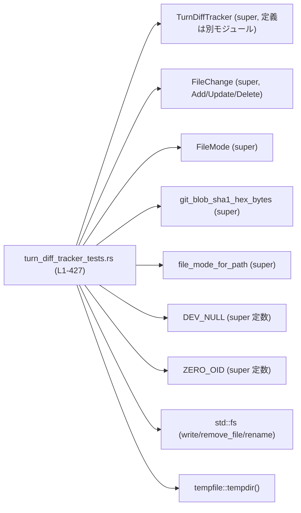
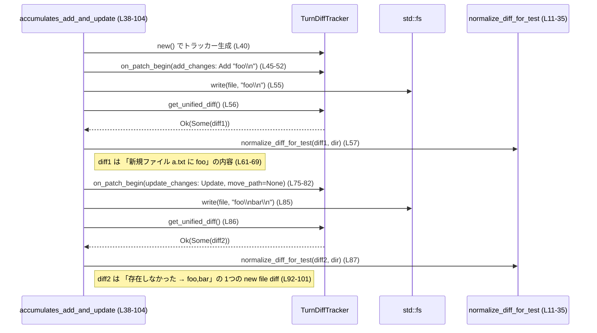

# core/src/turn_diff_tracker_tests.rs

## 0. ざっくり一言

TurnDiffTracker の振る舞い（複数パッチにまたがる差分の累積生成）を、実際の一時ディレクトリ上でファイル操作を行いながら検証するテストモジュールです。  
Git 形式の unified diff を期待値として組み立てるための補助関数も含まれます。

---

## 1. このモジュールの役割

### 1.1 概要

- このモジュールは、`TurnDiffTracker` が
  - 追加（Add）
  - 更新（Update）
  - 削除（Delete）
  - 移動（Move）
  - バイナリファイルの差分
  - 空白を含むファイル名
- といったケースをまたいで、**「1ターン分の最終状態」を表す unified diff を生成できるか**を検証します。  
- 各テストは `tempdir` で作成した一時ディレクトリ内で `std::fs` を用いたファイル操作を行い、`TurnDiffTracker` の出力を Git 互換の diff 文字列として比較します（根拠: `turn_diff_tracker_tests.rs:L38-427`）。

### 1.2 アーキテクチャ内での位置づけ

このファイルはテストモジュールであり、本体実装（`TurnDiffTracker` など）は `super::*` からインポートされています（`L1`）。



- テスト側は `TurnDiffTracker` に対して
  - `TurnDiffTracker::new()` でインスタンス生成（例: `L40`, `L112`, `L149`, …）
  - `on_patch_begin(&changes)` で「これから適用するパッチのメタ情報」を通知（例: `L52`, `L82`, `L119` など）
  - その後に `fs` で実際のファイル操作を行い、最後に `get_unified_diff()` で diff を取得（例: `L56-57`, `L86-87` など）
- という流れを一貫して取っています。

### 1.3 設計上のポイント（テストから読み取れること）

- **ファイルシステムスナップショット前提**  
  `on_patch_begin` 呼び出し前後で、ファイル内容・存在状態がどのように変わったかを `get_unified_diff` が解釈していることが分かります（例: `accumulates_add_and_update`, `L45-56`）。
- **Git 互換の diff 形式**  
  期待値は Git の unified diff 形式（`diff --git`, `index`, `@@ -a,b +c,d @@` 等）に従っています（例: `L61-69`, `L92-100`, `L129-135`）。
- **複数パッチの「累積」表示**  
  1回目のパッチで追加したファイルに対し、2回目で更新を行うと、最終的な diff は「最初から存在しなかった状態 → 最新状態」の単一パッチとしてまとめて表示されることがテストされています（`accumulates_add_and_update`, `L74-103`）。
- **差分無しの場合の扱い**  
  内容が変わらない単なるリネームは diff を出さず、`get_unified_diff()` は `Ok(None)` を返す契約になっています（`move_without_1change_yields_no_diff`, `L182-204`）。
- **並行性**  
  すべて同期的に、一つのスレッド上で動作する前提のテストであり、`Send`/`Sync` や `async` は登場しません。

---

## 2. 主要な機能一覧（このファイルで検証していること）

- Git blob SHA-1 ヘルパ: テキストおよびバイナリの Git blob SHA-1 を hex 文字列で計算（`git_blob_sha1_hex`, `L5-9`）。
- diff 正規化ユーティリティ: ルートパスの差異や diff ブロック順序を吸収してテストを安定化（`normalize_diff_for_test`, `L11-35`）。
- 追加＋更新の累積: 新規ファイル追加後の更新を、1つの「新規ファイル diff」としてまとめる振る舞いの検証（`accumulates_add_and_update`, `L38-104`）。
- 削除の扱い: 既存ファイル削除が Git 形式の削除 diff として出力されることの検証（`accumulates_delete`, `L106-140`）。
- 移動＋更新: ファイル移動と内容変更を 1 つの diff として出力することの検証（`accumulates_move_and_update`, `L142-180`）。
- 内容が変わらない移動の抑制: 単なるリネームのみでは diff を出力しないことの検証（`move_without_1change_yields_no_diff`, `L182-204`）。
- 「移動宣言だが実際は新規追加」ケースの扱い: 元ファイルが存在しないのに dest だけ現れた場合に「新規追加」として扱うことの検証（`move_declared_but_file_only_appears_at_dest_is_add`, `L206-239`）。
- 複数ファイルにまたがる累積 diff: 既存ファイル更新に続いて別ファイル削除を行った場合に、両者がまとめて diff に含まれることの検証（`update_persists_across_new_baseline_for_new_file`, `L241-317`）。
- バイナリファイルの差分表示: テキストではない内容の更新が `"Binary files differ"` として出力されることの検証（`binary_files_differ_update`, `L319-359`）。
- 空白を含むファイル名の扱い: スペースを含むパスでも正しく diff ヘッダと hunk が出力されることの検証（`filenames_with_spaces_add_and_update`, `L361-427`）。

---

## 3. 公開 API と詳細解説

### 3.1 コンポーネントインベントリー

#### 3.1.1 このファイルで定義される関数

| 名前 | 種別 | 役割 / 用途 | 定義位置 |
|------|------|-------------|----------|
| `git_blob_sha1_hex` | テスト用ヘルパ関数 | &str から Git blob SHA-1 を hex 文字列で得る。内部で `git_blob_sha1_hex_bytes` を呼び出す | `turn_diff_tracker_tests.rs:L5-9` |
| `normalize_diff_for_test` | テスト用ヘルパ関数 | diff 文字列から一時ディレクトリの絶対パスを `<TMP>` に置換し、複数 `diff --git` ブロックをソートして安定化する | `turn_diff_tracker_tests.rs:L11-35` |
| `accumulates_add_and_update` | #[test] 関数 | 新規追加後の更新を 1 つの「新規ファイル diff」として累積することを検証 | `turn_diff_tracker_tests.rs:L38-104` |
| `accumulates_delete` | #[test] 関数 | 既存ファイル削除の diff 形式を検証 | `turn_diff_tracker_tests.rs:L106-140` |
| `accumulates_move_and_update` | #[test] 関数 | 移動＋内容変更を 1 つの diff として出力することを検証 | `turn_diff_tracker_tests.rs:L142-180` |
| `move_without_1change_yields_no_diff` | #[test] 関数 | 内容が変わらない単純リネームでは diff が出ない（`Ok(None)`）ことを検証 | `turn_diff_tracker_tests.rs:L182-204` |
| `move_declared_but_file_only_appears_at_dest_is_add` | #[test] 関数 | 移動宣言だけがあり、実際には dest にだけファイルが現れたケースを「追加」と見なすことを検証 | `turn_diff_tracker_tests.rs:L207-239` |
| `update_persists_across_new_baseline_for_new_file` | #[test] 関数 | 既存ファイル更新後に別ファイル削除を行っても、両方の diff が累積されていることを検証 | `turn_diff_tracker_tests.rs:L241-317` |
| `binary_files_differ_update` | #[test] 関数 | バイナリファイルの更新が `"Binary files differ"` として出力されることを検証 | `turn_diff_tracker_tests.rs:L319-359` |
| `filenames_with_spaces_add_and_update` | #[test] 関数 | スペースを含むファイル名に対する追加＋更新の diff を検証 | `turn_diff_tracker_tests.rs:L361-427` |

#### 3.1.2 このファイルで使用している外部コンポーネント

> 定義本体は `super` など別モジュールにあり、このチャンクには現れません。ここでは **使用方法から分かる範囲のみ** を記載します。

| 名前 | 種別 | 用途 / 振る舞い（このファイルから分かること） | このファイル内の使用位置 |
|------|------|----------------------------------------------|--------------------------|
| `TurnDiffTracker` | 構造体 | `new()` で初期化し、`on_patch_begin(&changes)` と `get_unified_diff()` で 1ターン分の diff を取得するオブジェクト | 生成: `L40`, `L112`, `L149`, `L189`, `L211`, `L249`, `L331`, `L363` |
| `TurnDiffTracker::new` | 関数（関連関数） | 引数なしで新しいトラッカーを作成 | 同上 |
| `TurnDiffTracker::on_patch_begin` | メソッド | これから適用するパッチの `HashMap<PathBuf, FileChange>` を受け取り、ベースラインスナップショットを更新する | 呼び出し: `L52`, `L82`, `L119`, `L157`, `L197`, `L219`, `L259`, `L287`, `L339`, `L375`, `L405` |
| `TurnDiffTracker::get_unified_diff` | メソッド | 戻り値が `Result<Option<String>, E>` 型であることが、`unwrap()` の使い方から分かる。内容が変わらない移動だけのときは `Ok(None)` を返す | 呼び出し: `L56`, `L86`, `L124`, `L163`, `L202`, `L222`, `L262`, `L292`, `L344`, `L379`, `L409` |
| `FileChange` | 列挙体 | `Add { content }`, `Update { unified_diff, move_path }`, `Delete { content }` の 3 バリアントが存在し、1ファイルの変更内容を表す | 使用: `L48-50`, `L77-80`, `L115-117`, `L152-155`, `L193-195`, `L214-217`, `L254-257`, `L283-285`, `L334-337`, `L371-373`, `L400-403` |
| `FileMode` | 列挙体 | `file_mode_for_path` の戻り値として使われ、`new file mode {mode}` や `deleted file mode {baseline_mode}` に埋め込まれる | 使用: `L59-60`, `L89-90`, `L122`, `L225-226`, `L289-290`, `L382-383`, `L412-413` |
| `file_mode_for_path` | 関数 | `Path` を受け取り、`FileMode` か、エラー/None 時には `FileMode::Regular` を返す形で利用されている | 使用: `L59`, `L89`, `L122`, `L225`, `L289`, `L382`, `L412` |
| `git_blob_sha1_hex_bytes` | 関数 | `&[u8]` から Git blob SHA-1 の値（LowerHex 表示可能な何か）を返す。テキスト/バイナリ両方で利用 | 使用: `L8`, `L347-348` |
| `ZERO_OID` | 定数 | 空 blob を表す Git SHA-1（40桁 hex）のような値として利用され、`index {ZERO_OID}..{right_oid}` 等に出現 | 使用: `L64`, `L94`, `L131`, `L230`, `L308`, `L387`, `L417` |
| `DEV_NULL` | 定数 | Git diff で「存在しないファイル」を表す `/dev/null` 相当の文字列として利用 | 使用: `L65`, `L95`, `L133`, `L231`, `L310`, `L388`, `L418` |

---

### 3.2 関数詳細（主要 API / ヘルパ中心）

#### `TurnDiffTracker::get_unified_diff(...) -> Result<Option<String>, E>`

※ 正確なシグネチャはこのファイルにはありませんが、**戻り値が `Result<Option<String>, E>` であることはテストから確定** できます（根拠: `L202-203` で `unwrap()` 後の値を `Option` として扱っている）。

**概要**

- 現在までに `on_patch_begin` で登録された変更と、その後に実際のファイルシステム上で行われた操作を元に、**1ターン全体の最終状態を表す unified diff** を返します。
- 変更が実質的に何も無い（例: 中身が変わらない単なるリネーム）場合は `Ok(None)` を返します（根拠: `L202-203`）。

**引数**

このファイルからは引数は見えません。インスタンスメソッドとして `acc.get_unified_diff()` の形で呼ばれています（例: `L56`, `L86`, `L124`, `L163`, `L202` など）。

**戻り値**

- `Result<Option<String>, E>`
  - `Ok(Some(diff))`  
    変更が存在する場合の unified diff テキスト。Git 形式（`diff --git ...` 等）。
  - `Ok(None)`  
    実質的な変更が無い場合（例: `move_without_1change_yields_no_diff`, `L182-204`）。
  - `Err(E)`  
    エラーが発生した場合。`E` の具体的型や条件はこのファイルからは分かりません。

**内部処理の流れ（推測可能な観点のみ）**

内部実装はこのファイルにはありませんが、テストの利用パターンから以下が読み取れます。

- `on_patch_begin` 呼び出し時点のファイルシステム状態をベースラインとして記録している。
- `get_unified_diff` 呼び出し時点のファイルシステムの状態と比較し、Git 互換の diff を組み立てる（根拠: 期待値の形式 `L61-69`, `L92-100` など）。
- 直前までのターンで発生した変更は、後続のパッチと合わせて **累積した状態** で出力される（根拠: `update_persists_across_new_baseline_for_new_file`, `L292-316`）。

**Examples（使用例）**

テストコード自体が典型的な使用例です。例えば、新規追加＋更新の場合:

```rust
// 1. トラッカーを作成する                     // L40
let mut acc = TurnDiffTracker::new();

// 2. 「これから追加されるファイル」を宣言する   // L45-52
let add_changes = HashMap::from([(
    file.clone(),
    FileChange::Add { content: "foo\n".to_string() },
)]);
acc.on_patch_begin(&add_changes);

// 3. 実際にファイルを作成する                 // L55
fs::write(&file, "foo\n")?;

// 4. diff を取得する                          // L56-57
let diff = acc.get_unified_diff()?.unwrap();
let diff = normalize_diff_for_test(&diff, dir.path());
```

**Errors / Panics**

- テストではすべて `get_unified_diff().unwrap()` もしくは `.unwrap().unwrap()` を呼んでおり、`Err` が返るケースはカバーされていません（例: `L56`, `L86`, `L124`）。
  - 実運用コードでは `?` などで適切にエラー伝播・ログ出力する必要があります。
- `Ok(None)` をそのまま `unwrap()` すると panic するため、**「変更無し」ケースを考慮する必要**があります。
  - テスト `move_without_1change_yields_no_diff` では `let diff = acc.get_unified_diff().unwrap(); assert_eq!(diff, None);` として None を明示的に扱っています（`L202-203`）。

**Edge cases（エッジケース）**

- 内容が変わらない移動のみ: `Ok(None)` を返す（`L182-204`）。
- 追加と更新をまたいで最終状態が決まる場合: `Ok(Some(diff))` で「最初は存在しなかった → 最終内容」の diff のみが出る（`L74-103`）。
- バイナリ更新: テキスト hunk ではなく `"Binary files differ"` を含む diff を返す（`L344-355`）。

**使用上の注意点**

- `Result` かつ `Option` の二重ラップなので、**エラーと「変更無し」を区別して扱う必要**があります。
- 実コードでは `unwrap()` の代わりに `match` / `?` を使ってエラー・None を処理することが推奨されます（このテストでは簡略化のために `unwrap` を多用）。

---

#### `TurnDiffTracker::on_patch_begin(...)`

**概要**

- 直後に適用されるパッチで、どのファイルにどの種別の変更（Add/Update/Delete/Move）が予定されているかを通知するメソッドです。
- メソッド呼び出し後に実際のファイル操作（`fs::write`, `fs::remove_file`, `fs::rename`）が行われ、その結果を `get_unified_diff` が解釈します（例: `L45-56`, `L112-124`）。

**引数**

テストから読み取れる範囲:

| 引数名 | 型（利用から分かる範囲） | 説明 |
|--------|--------------------------|------|
| 第一引数（self） | `&mut TurnDiffTracker` と推定 | 内部状態を更新するため可変参照で呼ばれている（`let mut acc = ...; acc.on_patch_begin(...)`, `L40-52`） |
| `changes` | `&HashMap<PathBuf, FileChange>` と互換な型 | キーがパス、値が `FileChange` の変更種別。テストでは `HashMap::from([...])` をそのまま参照で渡している（例: `L46-52`, `L75-82`） |

**戻り値**

- このファイルのテストでは戻り値を使用しておらず、型・エラー有無は不明です。

**内部処理の流れ（テストから分かること）**

- 引数 `changes` に含まれる各 `Path` について、**「ベースライン snapshot」を取っている**と考えられます。
  - 例: `accumulates_add_and_update` では、Add として宣言されたファイルは `on_patch_begin` 時点では存在しませんが、その後の `fs::write` による作成が diff の右側に反映されます（`L45-56`）。
  - 例: `accumulates_delete` では、Delete として宣言されたファイルの内容 `"x\n"` が `FileChange::Delete { content: "x\n".to_string() }` として渡され、期待 diff の left OID に使われています（`L115-127`）。
- 移動 (`move_path: Some(dest)`) の場合:
  - `src` → `dest` へのパス変更を追跡し、diff ヘッダに `a/src.txt` と `b/dst.txt` を出力しています（`L169-175`）。
  - 内容が変わらなければ「変更無し」と判定して diff を出さない（`L182-204`）。

**Examples（使用例）**

削除パッチの宣言例（`accumulates_delete`, `L112-119`）:

```rust
let mut acc = TurnDiffTracker::new();                    // トラッカー生成（L112）
let del_changes = HashMap::from([(
    file.clone(),
    FileChange::Delete {
        content: "x\n".to_string(),                      // ベースライン内容を埋め込む（L115-117）
    },
)]);
acc.on_patch_begin(&del_changes);                        // パッチ開始を通知（L119）
```

**Edge cases**

- ソースが存在しないのに `move_path` だけ指定されている場合でも `on_patch_begin` は受け入れており、その後 `dest` にだけファイルが現れると「Add」として扱われます（`L207-239`）。
- 新しいパスが、後続のパッチからベースラインに追加されても、先に行った更新は保持されます（`update_persists_across_new_baseline_for_new_file`, `L280-316`）。

**使用上の注意点**

- テストのパターンから、**`on_patch_begin` は「パッチ適用前」に呼ぶことが前提**であることが分かります。実装コードでも同じ順序を守る必要があります。
- `FileChange::Delete` に渡す `content` は、ベースライン内容と一致している必要があると考えられます（少なくともテストではそうなっています）。一致しない場合の挙動はこのチャンクからは分かりません。

---

#### `TurnDiffTracker::new()`

**概要**

- 新しい `TurnDiffTracker` インスタンスを生成します。
- すべてのテストで最初に呼ばれ、初期状態が空であることを前提にしています（例: `L40`, `L112`, `L149`）。

**引数 / 戻り値**

- 引数なし。
- 戻り値: `TurnDiffTracker` インスタンス（利用例から明らか）。

**Examples（使用例）**

```rust
let mut acc = TurnDiffTracker::new();                    // 新しいトラッカーを作成（L40 他）
```

**使用上の注意点**

- 1つの `TurnDiffTracker` インスタンスで複数のパッチを連続して処理する想定です（例: `update_persists_across_new_baseline_for_new_file`, `L249-317`）。  
  毎ターンごとに新しく作り直す必要はありません。

---

#### `git_blob_sha1_hex(data: &str) -> String`

（ローカルヘルパ関数）

**概要**

- テキストデータから Git blob SHA-1 オブジェクト ID を計算し、16進小文字文字列で返します（`L5-7`）。
- 内部では `git_blob_sha1_hex_bytes` に `data.as_bytes()` を渡して委譲しています。

**引数**

| 引数名 | 型 | 説明 |
|--------|----|------|
| `data` | `&str` | Git blob ID を計算したいテキスト内容 |

**戻り値**

- `String`（hex 表現の SHA-1）。  
  期待 diff の `index {left_oid}..{right_oid}` 部分に埋め込まれています（例: `L64`, `L90`, `L127`, `L166-167` など）。

**内部処理の流れ**

1. `data.as_bytes()` で UTF-8 バイト列を取得（`L7-8`）。
2. `git_blob_sha1_hex_bytes` に渡して blob ID を得る（`L8`）。
3. `format!("{:x}", ...)` で 16進小文字の文字列表現に変換（`L8`）。

**使用上の注意点**

- このヘルパはテスト専用であり、本番コードや API の一部ではありません。
- `git_blob_sha1_hex_bytes` の戻り値が LowerHex でフォーマット可能であることを前提にしています。

---

#### `normalize_diff_for_test(input: &str, root: &Path) -> String`

（ローカルヘルパ関数）

**概要**

- diff 文字列から一時ディレクトリの絶対パスを `<TMP>` に置き換え、複数 `diff --git` ブロックをソートし、最後に改行を保証することで、**OS や出力順によらない安定した比較**を可能にします（`L11-35`）。

**引数**

| 引数名 | 型 | 説明 |
|--------|----|------|
| `input` | `&str` | `TurnDiffTracker::get_unified_diff` から得た生の diff 文字列 |
| `root` | `&Path` | 一時ディレクトリのルートパス。`root.display().to_string()` として文字列化されます（`L12`） |

**戻り値**

- 正規化された diff 文字列。  
  - ルートパスは `<TMP>` に置換されています。
  - `diff --git` ブロックの順序はソート済み。
  - 末尾の改行が保証されています（`L32-34`）。

**内部処理の流れ**

1. `root.display().to_string()` を取得し、Windows 対応のため `\` を `/` に置換（`L12`）。
2. `input.replace(&root_str, "<TMP>")` で diff 内の絶対パスを `<TMP>` に置き換え（`L13`）。
3. `replaced.lines()` をループし、行頭が `"diff --git "` の行ごとにブロックを分割（`L17-25`）。
4. 集めた `blocks` を `blocks.sort()` でソート（`L30`）。
5. `blocks.join("\n")` で連結し、末尾に改行が無ければ `out.push('\n')` で追加（`L31-34`）。
6. 正規化済みの diff を返す（`L35`）。

**Edge cases**

- `input` が空文字列の場合:
  - `blocks` は空のまま `join` され、`out` は空文字列になります。
  - `!out.ends_with('\n')` が真なので `'\n'` が追加され、結果は `"\n"` になります。  
    このケースはテストでは使われていませんが、コードから読み取れる挙動です。

**使用上の注意点**

- 絶対パス中にたまたま `<TMP>` という文字列が含まれていても、そのまま `<TMP>` に置換されるため、テスト専用の前提（実際の tmp パスには `<TMP>` が含まれない）に依存しています。
- diff ブロックを単純に文字列ソートしているため、**実際の diff 出力順はテストでは保証されません**（代わりに `normalize_diff_for_test` によって順序を無視して比較しています）。

---

#### `file_mode_for_path(path: &Path) -> ...`（外部関数）

**概要**

- ファイルのモード（パーミッションや種別）を `FileMode` 型で返す関数です。
- テストでは、失敗時/取得不能時には `FileMode::Regular` にフォールバックしているように使われています（`unwrap_or(FileMode::Regular)`, `L59`, `L89`, `L122` 等）。

**使用例**

- 新規ファイルの mode を期待 diff に埋め込む（`L59-64`）。
- 削除ファイルの元の mode を `deleted file mode {baseline_mode}` に出力する（`L122-131`）。

**注意点**

- 実際の戻り値型（`Result<FileMode, E>` か `Option<FileMode>` か）はこのファイルからは確定しませんが、`unwrap_or` により「取得失敗 → Regular」とみなす使い方がされています。

---

#### `git_blob_sha1_hex_bytes(bytes: &[u8]) -> ...`（外部関数）

**概要**

- 任意のバイト列から Git blob SHA-1 を計算する関数です（`L8`, `L347-348`）。
- テキストだけでなく、バイナリファイルの diff でも blob ID の期待値構築に使われています（`binary_files_differ_update`, `L347-348`）。

**使用例**

```rust
let left_bytes: Vec<u8> = vec![0xff, 0xfe, 0xfd, 0x00]; // L325
let right_bytes: Vec<u8> = vec![0x01, 0x02, 0x03, 0x00];

let left_oid = format!("{:x}", git_blob_sha1_hex_bytes(&left_bytes));   // L347
let right_oid = format!("{:x}", git_blob_sha1_hex_bytes(&right_bytes)); // L348
```

---

### 3.3 その他の関数（テスト関数の概要）

| 関数名 | 役割（1 行） | 定義位置 |
|--------|--------------|----------|
| `accumulates_add_and_update` | 新規追加 → 更新の 2パッチを通じて、最終的な「新規ファイル diff」が得られるかを検証 | `L38-104` |
| `accumulates_delete` | 既存ファイル削除の diff 形式を検証 | `L106-140` |
| `accumulates_move_and_update` | 移動＋内容変更が 1 つの diff になることを検証 | `L142-180` |
| `move_without_1change_yields_no_diff` | 内容不変の単純リネームでは diff が発生しないことを検証 | `L182-204` |
| `move_declared_but_file_only_appears_at_dest_is_add` | 移動宣言のみで実際には dest にだけファイルが生成された場合の扱いを検証 | `L207-239` |
| `update_persists_across_new_baseline_for_new_file` | 既存ファイル更新に続いて新しいファイルの削除が行われても、両方の diff がまとめて出力されることを検証 | `L241-317` |
| `binary_files_differ_update` | バイナリファイルの更新が `"Binary files differ"` として扱われることを検証 | `L319-359` |
| `filenames_with_spaces_add_and_update` | スペースを含むファイル名に対する追加＋更新の diff を検証 | `L361-427` |

---

## 4. データフロー

### 4.1 代表的シナリオ: 追加 + 更新の累積（`accumulates_add_and_update (L38-104)`）

このテストでは、**1回目のパッチでファイルを追加し、2回目のパッチで内容を変更した場合** に、`TurnDiffTracker` が「最初から存在しなかった状態 → 最終内容」の単一 diff を返すことを確認しています。



**ポイント**

- 1回目の `get_unified_diff` は、Add パッチのみを反映した新規ファイル diff（`index ZERO_OID..OID(foo)`）です（`L61-69`）。
- 2回目の `get_unified_diff` は、**Add + Update をまとめた結果**として、新規ファイル diff（`index ZERO_OID..OID(foo+bar)`）のみを返します（`L92-100`）。  
  途中の `"foo\n"` 状態への更新は、最終的な diff には現れません。

---

## 5. 使い方（How to Use）— テストから読み取れる利用パターン

### 5.1 基本的な使用方法

全テストに共通する利用フローは次の通りです。

```rust
use std::{collections::HashMap, fs, path::PathBuf};

// 1. トラッカーを生成する（L40, L112 など）
let mut tracker = TurnDiffTracker::new();

// 2. これから適用するパッチをマップで表現する（L45-51 など）
let file: PathBuf = /* 対象ファイルパス */;
let changes = HashMap::from([(
    file.clone(),
    FileChange::Update {
        unified_diff: "".to_owned(), // テストでは空文字を渡している（L78 など）
        move_path: None,             // 移動しない場合は None
    },
)]);

// 3. パッチ開始前に on_patch_begin を呼ぶ（L52, L82 など）
tracker.on_patch_begin(&changes);

// 4. 実際のファイル操作を行う（L55, L85 など）
fs::write(&file, "new contents\n")?;

// 5. 最終的な diff を取得する（L56-57 など）
let diff_opt = tracker.get_unified_diff()?; // Result<Option<String>, E>
if let Some(diff) = diff_opt {
    println!("{}", diff);
} else {
    // 実質的な変更なし（例: 内容が変わらない移動）
}
```

### 5.2 よくある使用パターン

1. **追加（Add） → 更新（Update）**

   - Add: `FileChange::Add { content: "初期内容".to_string() }`（`L45-51`）
   - Update: `FileChange::Update { unified_diff: "".to_owned(), move_path: None }`（`L75-81`）
   - 2回目の `get_unified_diff` で、「新規ファイル diff」のみが得られる（`L92-100`）。

2. **削除（Delete）**

   - Delete: `FileChange::Delete { content: "元の内容".to_string() }`（`L113-118`）
   - 実際に `fs::remove_file` した後で `get_unified_diff` を呼ぶと、`deleted file mode` を含む diff が得られる（`L127-136`）。

3. **移動＋更新**

   - Update with move: `FileChange::Update { unified_diff: "".to_owned(), move_path: Some(dest.clone()) }`（`L150-156`）。
   - `fs::rename(src, dest)` と新しい内容での `fs::write` の後、diff ヘッダに `a/src.txt` と `b/dst.txt` が現れ、hunk には行の変更が出力される（`L169-175`）。

4. **移動のみ（内容不変）**

   - 上記と同様に move を宣言し `fs::rename` するが、内容を変更しない場合（`L199-200`）、`get_unified_diff` は `Ok(None)` を返す（`L202-203`）。

5. **バイナリファイル**

   - `fs::write` に `&[u8]` を渡してバイナリを作成・更新し、`FileChange::Update` で宣言（`L325-338`）。
   - diff 中身は hunk ではなく `"Binary files differ"` の1行になる（`L350-355`）。

### 5.3 よくある間違い（想定される注意点）

このファイルから直接分かる範囲で、注意すべき点を挙げます。

- **`on_patch_begin` の順序**  
  すべてのテストで、`on_patch_begin` → ファイル操作 → `get_unified_diff` の順序が守られています（例: `L45-56`, `L112-124`）。  
  逆順（先に書き込み、その後 `on_patch_begin`）にすると、想定通りの diff が得られない可能性があります（テストには出てきませんが、順序依存であることは明らかです）。
- **`get_unified_diff` の戻り値の扱い**  
  - このテストでは `unwrap` を多用していますが、本番コードでは `Err` や `Ok(None)` を適切に扱う必要があります。  
  - 特に `Ok(None)` を `unwrap()` すると panic するため、`move_without_1change_yields_no_diff` のように `Option` を判定するのが安全です（`L202-203`）。

### 5.4 使用上の注意点（まとめ）

- `TurnDiffTracker` は **実際のファイルシステム状態** に依存するため、テストと同様に一時ディレクトリを使うか、対象ディレクトリの管理を慎重に行う必要があります。
- `Result`/`Option` を返す API について、テストでは `unwrap()` によって失敗した場合に即座に panic するスタイルを取っていますが、実運用ではエラーハンドリングを実装する必要があります。
- 並行性に関するテストはなく、`TurnDiffTracker` がマルチスレッド環境で安全かどうかはこのチャンクからは分かりません。

---

## 6. 変更の仕方（How to Modify）

### 6.1 新しい機能を追加する場合（テスト側）

`TurnDiffTracker` に新しい振る舞い（例えば「ファイルモードの変更のみの扱い」など）を追加する場合、このテストモジュールを拡張する際のパターンは次の通りです。

1. **テストシナリオを設計する**  
   - どのようなファイル操作を行ったときに、どのような diff が期待されるかを決める。
2. **一時ディレクトリとファイルを準備する**（`tempdir`, `fs::write` などの使い方は既存テストと同じ、例: `L42-43`, `L108-110`）。
3. **`FileChange` を構成して `on_patch_begin` を呼ぶ**（既存のテストの `HashMap::from([(...)]` を参考にする）。
4. **ファイル操作を行い、`get_unified_diff` を呼ぶ**。
5. **`normalize_diff_for_test` で正規化し、期待値の diff 文字列と `assert_eq!` する**。

### 6.2 既存の機能を変更する場合（TurnDiffTracker 側）

このモジュールはテストであるため、`TurnDiffTracker` 本体の変更がどこに影響するかを知るための手掛かりとして利用できます。

- 変更したい振る舞いに対応するテスト関数を特定する。
  - 例: 移動時の挙動なら `accumulates_move_and_update`, `move_without_1change_yields_no_diff`, `move_declared_but_file_only_appears_at_dest_is_add`（`L142-239`）。
- そのテストが期待している diff 文字列を読み取り、**「どのような契約（Contract）が既に存在しているか」** を確認する。
- 契約を変える場合は
  - テストを先に修正してから実装を変更する（TDD 的アプローチ）か、
  - 実装変更にあわせて期待値を更新する。
- 変更後は `normalize_diff_for_test` の動作（ブロック順ソート等）も考慮しつつ、テストが安定するようにする。

---

## 7. 関連ファイル

| パス / モジュール | 役割 / 関係 |
|-------------------|------------|
| `super` モジュール（具体的ファイル名はこのチャンクには現れません） | `TurnDiffTracker`, `FileChange`, `FileMode`, `file_mode_for_path`, `git_blob_sha1_hex_bytes`, `ZERO_OID`, `DEV_NULL` など、本テストが検証しているコアロジックの実装を提供します（`L1`）。 |
| `std::fs` | 実際のファイル作成・更新・削除・リネームのために使用され、`TurnDiffTracker` が参照する対象の状態を作るために使われています（例: `L55`, `L85`, `L123`, `L160`, `L200` など）。 |
| `tempfile::tempdir` | テストごとに孤立した一時ディレクトリを作成し、パス差異を `normalize_diff_for_test` で `<TMP>` に正規化する前提を提供します（`L3`, `L42`, `L108` など）。 |
| `pretty_assertions::assert_eq` | diff 文字列の比較に使用され、失敗時には見やすい差分表示を行います（`L2`, 各 `assert_eq!` 呼び出し）。 |

---

### 言語固有の安全性・エラー・並行性についての補足

- **安全性 / エラー処理**
  - テストでは OS I/O (`fs::write`, `fs::remove_file`, `fs::rename`, `tempdir`) および `get_unified_diff` のすべてに `unwrap()` を使っています（例: `L42`, `L55`, `L124`, `L160`, `L202`）。  
    これにより、失敗時には即座に panic し、テストが落ちる形でエラーが検出されます。
  - 実運用では、これらすべてが `Result` を返すため、`?` や `match` による明示的なエラー処理が必要です。
- **所有権 / 借用**
  - `HashMap::from` で作成した `HashMap<PathBuf, FileChange>` を `&` を付けて借用し、`on_patch_begin` に渡しています（例: `L46-52`）。  
    これにより `HashMap` 自体の所有権はテスト関数側に残りますが、`on_patch_begin` は読み取りまたは一時的な参照だけを行っていると分かります。
- **並行性**
  - このテストモジュールにはスレッド生成や `async`/`await` は登場せず、すべて単一スレッド・同期的に実行されます。
  - `TurnDiffTracker` がスレッド安全かどうかは、このチャンクからは判断できません。
