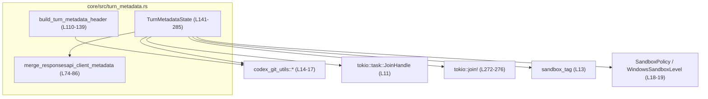
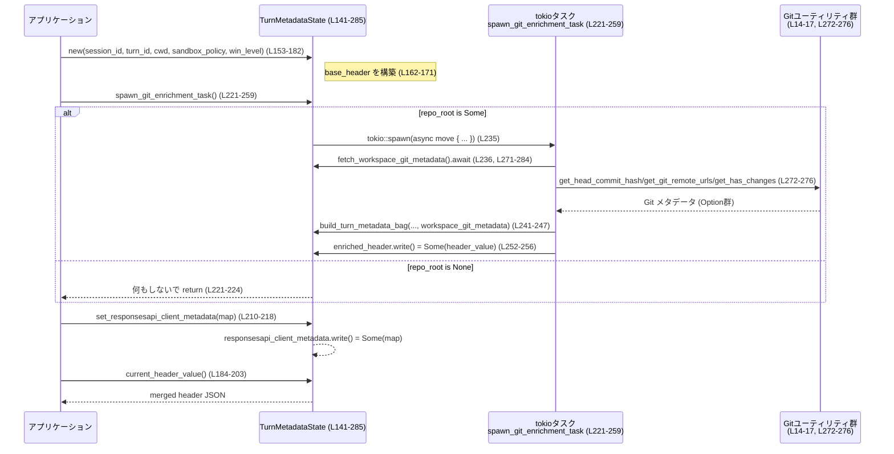

# core/src/turn_metadata.rs コード解説

## 0. ざっくり一言

このモジュールは、**「1 回のターン（リクエスト）」に紐づくメタデータ**（セッション ID・ターン ID・サンドボックス情報・Git リポジトリ情報など）を JSON ヘッダとして組み立て、**徐々に情報を付加できる状態管理オブジェクト**を提供します。  
Git 情報の取得は非同期で行い、後からヘッダを「エンリッチ（追加情報付与）」する設計になっています。

---

## 1. このモジュールの役割

### 1.1 概要

- このモジュールは、**ターンごとのメタデータを JSON 文字列として構築・管理する問題**を解決するために存在し、次の機能を提供します。
  - Git リポジトリ情報（リモート URL・HEAD コミット・未コミット変更有無）の収集と構造化（`WorkspaceGitMetadata`, `TurnMetadataWorkspace`）（turn_metadata.rs:L21-54）
  - セッション ID / ターン ID / サンドボックス情報 / ワークスペース情報をまとめた「メタデータバッグ」の生成（`TurnMetadataBag` とヘルパー）（L56-108）
  - 一度きりのヘッダ生成 API（`build_turn_metadata_header`）（L110-139）
  - 非同期に Git 情報を取得してヘッダを後から更新する状態オブジェクト `TurnMetadataState`（L141-285）
  - クライアント側から渡される追加メタデータを既存ヘッダに「追記」マージするロジック（`merge_responsesapi_client_metadata`）（L74-86）

### 1.2 アーキテクチャ内での位置づけ

このモジュールは、主に以下の外部コンポーネントに依存しています（行番号は定義側の参照行です）:

- Git 情報取得ユーティリティ: `codex_git_utils::{get_git_repo_root, get_head_commit_hash, get_git_remote_urls_assume_git_repo, get_has_changes}`（L14-17）
- サンドボックス関連: `crate::sandbox_tags::sandbox_tag`（L13）、`SandboxPolicy` / `WindowsSandboxLevel`（L18-19）
- 非同期実行環境: `tokio::task::JoinHandle`, `tokio::join!`（L11, L113-117, L272-276）

依存関係の概要を Mermaid で示します。



- `build_turn_metadata_header` は、**「使い捨ての一回限りのヘッダ構築」**用の関数です（L110-139）。
- `TurnMetadataState` は、**状態を保持しながらバックグラウンドで Git メタデータを取得し、ヘッダを更新する**ためのコンポーネントです（L141-285）。
- `merge_responsesapi_client_metadata` は、これらで生成されたヘッダに対してクライアントメタデータを追加する「後処理」の役割です（L74-86, L184-203）。

### 1.3 設計上のポイント（コードから読み取れる範囲）

- **責務の分割**
  - Git 情報は `WorkspaceGitMetadata` / `TurnMetadataWorkspace` に分離（L21-54）。
  - ヘッダ全体は `TurnMetadataBag` が保持（L56-66）。
  - ヘッダ構築のロジックは `build_turn_metadata_bag` / `build_turn_metadata_header` に集約（L88-108, L110-139）。
  - 非同期エンリッチメントとクライアントメタデータのマージは `TurnMetadataState` が担当（L141-285）。
- **状態管理と並行性**
  - `TurnMetadataState` は `Clone` 可能で、内部状態は `Arc<RwLock<...>>` と `Arc<Mutex<...>>` で共有されます（L141-149）。
  - Git メタデータ取得は `tokio::spawn` によるバックグラウンドタスクとして一度だけ起動されます（L221-259）。
  - ロックの Poison（パニック後）に対しては `unwrap_or_else(PoisonError::into_inner)` で継続する方針です（L186-189, L196-200, L215-217, L227-229, L254-256）。
- **エラーハンドリング**
  - 多くの箇所で `Option` と `.ok()` を用い、**失敗時は `None` を返却して静かに無視**する方針です（例: JSON シリアライズ/パース失敗時の `to_header_value` や `merge_responsesapi_client_metadata`）（L69-71, L79-85）。
  - `build_turn_metadata_header` は、収集できるメタデータが何もない場合は `None` を返してヘッダ自体を生成しません（L118-125）。
- **セキュリティ／上書き防止**
  - クライアントメタデータのマージでは、既存のヘッダのキーを**上書きせず**、存在しないキーのみ追加します（L80-83）。  
    これにより、セッション ID や Git 情報などの**サーバ側メタデータがクライアントによって上書きされない**ようになっています。

---

## 2. コンポーネントと主要機能一覧

### 2.1 型（構造体）一覧

| 名前 | 種別 | 可視性 | 定義行 | 役割 / 用途 |
|------|------|--------|--------|-------------|
| `WorkspaceGitMetadata` | 構造体 | モジュール内（非公開） | turn_metadata.rs:L21-26 | Git リポジトリに関する生メタデータ（リモート URL, 最新コミットハッシュ, 変更有無）を保持します。JSON シリアライズはされません。 |
| `TurnMetadataWorkspace` | 構造体 | モジュール内（非公開） | L36-44 | シリアライズ可能なワークスペース単位のメタデータ表現。`WorkspaceGitMetadata` から `From` 変換され、JSON ヘッダに含まれます。 |
| `TurnMetadataBag` | 構造体 | `pub(crate)` | L56-66 | 1 ターン分のメタデータ全体（セッション ID / ターン ID / サンドボックス / ワークスペース群）をまとめるコンテナです。ヘッダ JSON の中身に相当します。 |
| `TurnMetadataState` | 構造体 | `pub(crate)` | L141-150 | ターンごとのメタデータ状態を管理するオブジェクト。ベースメタデータとエンリッチされたメタデータの両方を保持し、バックグラウンドで Git 情報を取得します。 |

### 2.2 関数・メソッド一覧（インベントリ）

| 名前 | 種別 | 所属 | async | 可視性 | 定義行 | 役割（1 行） |
|------|------|------|-------|--------|--------|--------------|
| `WorkspaceGitMetadata::is_empty` | メソッド | `WorkspaceGitMetadata` | いいえ | 非公開 | L28-33 | Git メタデータが全て `None` かどうかを判定します。 |
| `impl From<WorkspaceGitMetadata> for TurnMetadataWorkspace::from` | 関数 | `TurnMetadataWorkspace` | いいえ | 非公開 | L46-53 | 非シリアライズな Git メタデータをシリアライズ可能な形へコピー変換します。 |
| `TurnMetadataBag::to_header_value` | メソッド | `TurnMetadataBag` | いいえ | 非公開 | L68-71 | バッグ全体を JSON 文字列にシリアライズし、ヘッダ値として返します。 |
| `merge_responsesapi_client_metadata` | 自由関数 | - | いいえ | 非公開 | L74-86 | 既存ヘッダ JSON にクライアント提供メタデータを追記マージします（既存キーは上書きしません）。 |
| `build_turn_metadata_bag` | 自由関数 | - | いいえ | 非公開 | L88-108 | セッション ID 等の情報とワークスペース Git メタデータから `TurnMetadataBag` を構築します。 |
| `build_turn_metadata_header` | 自由関数 | - | はい | `pub` | L110-139 | カレントディレクトリの Git 情報とサンドボックス情報から、1 回限りのメタデータヘッダ文字列を生成します。 |
| `TurnMetadataState::new` | 関連関数 | `TurnMetadataState` | いいえ | `pub(crate)` | L153-182 | セッション ID / ターン ID / サンドボックスを含むベースヘッダを即座に構築し、状態オブジェクトを初期化します。 |
| `TurnMetadataState::current_header_value` | メソッド | `TurnMetadataState` | いいえ | `pub(crate)` | L184-203 | 現時点で利用可能なヘッダ JSON 文字列（エンリッチ済みまたはベース）に、クライアントメタデータをマージして返します。 |
| `TurnMetadataState::current_meta_value` | メソッド | `TurnMetadataState` | いいえ | `pub(crate)` | L205-208 | `current_header_value` の結果を `serde_json::Value` として返します。 |
| `TurnMetadataState::set_responsesapi_client_metadata` | メソッド | `TurnMetadataState` | いいえ | `pub(crate)` | L210-218 | クライアント提供のメタデータ（文字列のマップ）を内部に保存します。 |
| `TurnMetadataState::spawn_git_enrichment_task` | メソッド | `TurnMetadataState` | いいえ | `pub(crate)` | L221-259 | Git メタデータを取得してヘッダをエンリッチするバックグラウンドタスクを 1 度だけ起動します。 |
| `TurnMetadataState::cancel_git_enrichment_task` | メソッド | `TurnMetadataState` | いいえ | `pub(crate)` | L261-268 | 進行中の Git エンリッチメントタスクがあれば `abort` します。 |
| `TurnMetadataState::fetch_workspace_git_metadata` | メソッド | `TurnMetadataState` | はい | 非公開 | L271-284 | カレントディレクトリに対する Git メタデータ（HEAD・リモート・変更有無）を非同期に取得します。 |

### 2.3 モジュールが提供する主要な機能

- Git リポジトリ情報の収集と JSON ヘッダへの埋め込み（L21-26, L36-44, L88-108, L110-139）。
- セッション ID / ターン ID / サンドボックス情報の付加と管理（L56-66, L153-171）。
- 非同期バックグラウンドタスクによる Git メタデータの**後付けエンリッチメント**（L221-259, L271-284）。
- クライアント側メタデータのヘッダへの安全な追記（既存キー非上書き）（L74-86, L184-203）。

---

## 3. 公開 API と詳細解説

ここでは、主に crate 内から利用される API とコアロジックを中心に、最大 7 個の関数／メソッドを詳しく説明します。

### 3.1 型一覧（再掲）

上記 2.1 を参照してください。`TurnMetadataBag` と `TurnMetadataState` が crate 内公開の主要型です（L56-66, L141-150）。

### 3.2 関数詳細

#### `pub async fn build_turn_metadata_header(cwd: &Path, sandbox: Option<&str>) -> Option<String>`

**概要（根拠: turn_metadata.rs:L110-139）**

- 指定されたカレントディレクトリ `cwd` を基準に Git リポジトリ情報を非同期で取得し、サンドボックス識別子（任意）と共に JSON ヘッダ文字列を構築します。
- Git 情報もサンドボックスも取得できなかった場合は `None` を返し、ヘッダ自体を生成しません（L118-125）。

**引数**

| 引数名 | 型 | 説明 |
|--------|----|------|
| `cwd` | `&Path` | Git リポジトリ探索および Git 情報取得の起点となるディレクトリです（L110-111, L113-116）。 |
| `sandbox` | `Option<&str>` | サンドボックス識別子の文字列。`Some` のときはヘッダに `sandbox` フィールドとして含めます（L110, L120-123, L127-136）。 |

**戻り値**

- `Option<String>`  
  - `Some(s)` の場合: `s` は `TurnMetadataBag` を JSON シリアライズした文字列です（L127-138）。
  - `None` の場合: Git 情報（コミットハッシュ・リモート URL・変更有無）が全て `None` かつ `sandbox` も `None` であり、有用なメタデータが何もないと判断されたケースです（L118-125）。

**内部処理の流れ**

1. `get_git_repo_root(cwd)` で Git リポジトリのルート（`Option<PathBuf>`）を取得し、文字列に変換します（L110-111）。
2. `tokio::join!` を用いて、以下の 3 つの非同期処理を並列に実行します（L113-117）。
   - HEAD コミットハッシュの取得: `get_head_commit_hash(cwd)`（L114）。
   - リモート URL の取得: `get_git_remote_urls_assume_git_repo(cwd)`（L115）。
   - 未コミット変更の有無の取得: `get_has_changes(cwd)`（L116）。
3. HEAD コミットハッシュの結果 `head_commit_hash` から、`map(|sha| sha.0)` で文字列（と思われるもの）を取り出し、`latest_git_commit_hash: Option<String>` に変換します（L118）。
4. `latest_git_commit_hash`, `associated_remote_urls`, `has_changes`, `sandbox` の全てが `None` の場合は `None` を返して終了します（L119-125）。
5. それ以外の場合は、`build_turn_metadata_bag` に対して
   - `session_id` / `turn_id` は `None`
   - `sandbox` は `sandbox.map(ToString::to_string)` で `Option<String>` に変換（L130）
   - `repo_root` と `WorkspaceGitMetadata` を渡して `TurnMetadataBag` を構築します（L127-136）。
6. 最後に `TurnMetadataBag::to_header_value` を呼び出して JSON 文字列化し、その `Option<String>` をそのまま返します（L137-138）。

**Examples（使用例）**

```rust
use std::path::Path;
use core::turn_metadata::build_turn_metadata_header; // 実際のパスは crate 構成に依存

#[tokio::main]
async fn main() {
    // カレントディレクトリを基準にヘッダを構築する
    let cwd = Path::new(".");
    let sandbox = Some("dev-sandbox"); // サンドボックス識別子

    if let Some(header) = build_turn_metadata_header(cwd, sandbox).await {
        // header は JSON 文字列（例: {"sandbox":"dev-sandbox","workspaces":{...}}）
        println!("Turn metadata header: {}", header);
    } else {
        // Git 情報もサンドボックスもない場合
        println!("No metadata header generated");
    }
}
```

**Errors / Panics**

- 関数シグネチャとしては `Result` ではなく `Option` を返しており、明示的なエラー型はありません。
- 内部で呼び出している `serde_json::to_string` 失敗時は `.ok()` により `None` になります（L69-71, L137-138）。
- Git ユーティリティ関数からのエラー処理はこのモジュール側では見えません（`get_git_repo_root`, `get_head_commit_hash` 等の戻り値型はこのファイルには現れません）。
- パニックを起こすコード（`unwrap` 等）はここには含まれていません。

**Edge cases（エッジケース）**

- `cwd` が Git リポジトリ外の場合:
  - `get_git_repo_root(cwd)` は `None` を返す可能性があります（L110-111）。
  - さらに `get_head_commit_hash` 等も `None` を返す設計であれば（推測）、全ての Git 情報が `None` となり、`sandbox` も `None` の場合は `None` が返ることになります（L118-125）。
- `sandbox` が `Some` だが Git 情報が全て `None` の場合:
  - チェック条件によりヘッダは生成され、`sandbox` のみが含まれた JSON が返ることになります（L119-123）。
- `sandbox` が `None` で、いずれかの Git 情報だけが取得できた場合:
  - `build_turn_metadata_bag` に渡され、該当するフィールドだけが `Some` のワークスペースメタデータとしてヘッダに含まれます（L127-136, L95-100）。

**使用上の注意点**

- この関数は **非同期 (`async`)** であり、`tokio` などの非同期ランタイム上で `.await` する必要があります（L113-117）。
- 失敗時の詳細な理由（例: Git コマンド失敗）は返されず、`None` で曖昧に表現されます。詳細なエラー情報が必要な場合は、Git ユーティリティを直接使用する必要があります（ユーティリティのシグネチャはこのファイルからは不明）。
- 生成される JSON には Git リモート URL 等の情報が含まれるため、外部サービスに送信する場合はプライバシーレベルを考慮する必要があります（L21-26, L36-44）。

---

#### `impl TurnMetadataState::new(...) -> Self`

**概要（根拠: L153-182）**

- 1 回のターンに対応する `TurnMetadataState` を初期化し、**セッション ID・ターン ID・サンドボックス情報を含むベースヘッダ**を即座に構築します。
- Git 情報の取得はここでは行わず、後から `spawn_git_enrichment_task` により行われます。

**引数**

| 引数名 | 型 | 説明 |
|--------|----|------|
| `session_id` | `String` | セッションを識別する文字列（L154, L163）。 |
| `turn_id` | `String` | 1 回のターン（リクエスト）を識別する文字列（L155, L164）。 |
| `cwd` | `PathBuf` | Git リポジトリルート探索と Git 情報取得の基準となるディレクトリ（L156, L160）。 |
| `sandbox_policy` | `&SandboxPolicy` | サンドボックス種別を表す設定。`sandbox_tag` に渡されます（L157-158, L161）。 |
| `windows_sandbox_level` | `WindowsSandboxLevel` | Windows 環境でのサンドボックスレベル。`sandbox_tag` に渡されます（L158, L161）。 |

**戻り値**

- `Self` (`TurnMetadataState`)  
  - ベースヘッダが `base_header` フィールドに文字列として格納された状態で返されます（L169-171, L173-181）。

**内部処理の流れ**

1. `get_git_repo_root(&cwd)` でリポジトリルートを取得し、`Option<String>` として `repo_root` に保存します（L160）。
2. `sandbox_tag(sandbox_policy, windows_sandbox_level)` でサンドボックス識別子を生成し、`Option<String>` として `sandbox` に保存します（L161）。
3. `build_turn_metadata_bag` を呼び出し、`session_id`, `turn_id`, `sandbox` を含みつつ、`repo_root` と `workspace_git_metadata` は `None` として `TurnMetadataBag` を構築します（L162-168）。
4. `TurnMetadataBag::to_header_value` により JSON 文字列化し、失敗した場合は `"{}"` をデフォルトとして `base_header` に格納します（L169-171）。
5. 残りのフィールド (`enriched_header`, `responsesapi_client_metadata`, `enrichment_task`) は `Arc` でラップされたロックオブジェクトとして初期化されます（L173-181）。

**Examples（使用例）**

```rust
use std::path::PathBuf;
use codex_protocol::protocol::SandboxPolicy;
use codex_protocol::config_types::WindowsSandboxLevel;
use core::turn_metadata::TurnMetadataState;

fn init_state(policy: &SandboxPolicy, win_level: WindowsSandboxLevel) -> TurnMetadataState {
    let cwd = PathBuf::from(".");
    let session_id = "session-123".to_string();
    let turn_id = "turn-001".to_string();

    let state = TurnMetadataState::new(
        session_id,
        turn_id,
        cwd,
        policy,
        win_level,
    );

    // この時点で state.base_header には JSON 文字列が入っている（コードからは直接見えませんが L169-171 より推定）
    state
}
```

**Errors / Panics**

- `to_header_value` 失敗時は `"{}"` をセットするため、パニックせずにデフォルトを返します（L169-171）。
- ロック取得は行っていないため、この関数内には `PoisonError` に関する処理はありません。
- パニックを引き起こす `unwrap` は使用されていません。

**Edge cases**

- `get_git_repo_root(&cwd)` が `None` を返した場合でも、そのまま `repo_root: None` で `TurnMetadataState` が構築されます（L160, L173-176）。  
  後続の `spawn_git_enrichment_task` は `repo_root.is_none()` を検査し、タスクを起動しないようになっています（L221-224）。
- `sandbox_tag` がどのような文字列を返すかはこのファイルからは分かりません（L13, L161）。

**使用上の注意点**

- このコンストラクタでは Git メタデータは取得されません。Git 情報をヘッダに含めたい場合は、別途 `spawn_git_enrichment_task` を呼び出す必要があります（L221-259）。
- `TurnMetadataState` は `Clone` を実装しているため（L141）、複数のタスクで同じ状態を共有可能です。ただし共有された状態は `RwLock` / `Mutex` を介して保護されるため、ロック競合を起こし得ます。

---

#### `pub(crate) fn current_header_value(&self) -> Option<String>`

**概要（根拠: L184-203）**

- 現時点で利用可能なメタデータヘッダ文字列を返すメソッドです。
  - もし `enriched_header` が設定されていれば、それを優先して使用します（L185-193）。
  - そうでなければ、初期化時に生成された `base_header` を使用します（L193-195）。
- さらに、もしクライアントメタデータが設定されていれば、それを JSON としてマージします（L196-203）。

**引数**

- なし（`&self` のみ）。

**戻り値**

- `Option<String>`  
  - 通常は `Some(s)` が返る設計です。`base_header` は常に `"{}"` 以上の JSON 文字列として初期化されているため（L169-171）、`merge_responsesapi_client_metadata` が `None` を返さない限り `Some` になります。
  - `merge_responsesapi_client_metadata` が `None` を返した場合でも `.or(Some(header))` により `Some(header)` が返されるので（L201-202）、結果として常に `Some` になる実装です。

**内部処理の流れ**

1. `enriched_header` の RwLock を読み取り、Poison 時も `into_inner` でガードを取り出します（L185-189）。
2. もし `enriched_header` が `Some` ならその値を `header` に採用し、`None` なら `base_header.clone()` を採用します（L185-195）。
3. `responsesapi_client_metadata` の RwLock を読み取り、`Option<HashMap>` をクローンします（L196-200）。
4. `merge_responsesapi_client_metadata(&header, responsesapi_client_metadata.as_ref())` を呼び出し、マージ後の JSON 文字列を得ようとします（L201）。
5. マージが `None` を返した場合は `Some(header)` を返します（L201-202）。

**Examples（使用例）**

```rust
// state は TurnMetadataState とする
let header = state.current_header_value().expect("header should always exist");
// header は JSON 文字列で、エンリッチ済みヘッダ + クライアントメタデータが含まれる可能性がある
println!("Current header: {}", header);
```

**Errors / Panics**

- RwLock の取得で `PoisonError` が発生した場合でも `unwrap_or_else(PoisonError::into_inner)` でパニックを回避し、ガードを取得します（L186-189, L197-200）。
- `merge_responsesapi_client_metadata` の内部で JSON パース／シリアライズに失敗した場合は `None` を返し、それを受けて `Some(header)` を返すため、ここでもパニックは発生しません（L79-85, L201-202）。

**Edge cases**

- `enriched_header` が一度も設定されていない場合:
  - `base_header` のみが返されます（L185-195）。
- `responsesapi_client_metadata` が `None` の場合:
  - `merge_responsesapi_client_metadata` は早期に `None` を返し（L78）、結果として `Some(header)` が返ります（L201-202）。
- `header` が何らかの理由で JSON オブジェクトではない文字列になっている場合:
  - `serde_json::from_str::<serde_json::Map<String, Value>>(header)` が失敗し、`merge_responsesapi_client_metadata` は `None` を返します（L79）。
  - その場合でも `current_header_value` は元の `header` をそのまま返します（L201-202）。

**使用上の注意点**

- 戻り値は JSON 文字列であり、さらに構造化された形で扱いたい場合は `current_meta_value` を使うと `serde_json::Value` として扱えます（L205-208）。
- `current_header_value` 自体はロックの取得を伴うため、非常に高頻度に呼び出す場合はロック競合の影響を考慮する必要があります（L185-200）。

---

#### `pub(crate) fn current_meta_value(&self) -> Option<serde_json::Value>`

**概要（根拠: L205-208）**

- `current_header_value` が返す JSON 文字列を `serde_json::Value` にパースした結果を返します。
- パース失敗時は `None` を返します。

**引数**

- なし（`&self` のみ）。

**戻り値**

- `Option<serde_json::Value>`  
  - `Some(value)` の場合: パース済み JSON 値。
  - `None` の場合: ヘッダが存在しない、または JSON パースに失敗した場合です（L205-208）。

**内部処理の流れ**

1. `current_header_value()` を呼び出して `Option<String>` を取得します（L205）。
2. `and_then(|header| serde_json::from_str(&header).ok())` により、JSON 文字列を `serde_json::Value` にパースし、失敗時は `None` にします（L206-207）。

**使用上の注意点**

- `serde_json::Value` は動的な JSON 表現であり、具体的な型（構造体）で扱いたい場合は別途 `serde` によるデシリアライズが必要です。
- ヘッダが常に JSON オブジェクトである保証はこのメソッド単体からは読み取れませんが、`TurnMetadataBag` の構造から通常はオブジェクトとなることが期待されます（L56-66）。

---

#### `pub(crate) fn set_responsesapi_client_metadata(&self, responsesapi_client_metadata: HashMap<String, String>)`

**概要（根拠: L210-218）**

- クライアント側から渡されたメタデータ（キー・値ともに文字列のマップ）を内部の `responsesapi_client_metadata` に保存します。
- 以降の `current_header_value` 呼び出し時に、このメタデータがヘッダ JSON にマージされます（L196-203）。

**引数**

| 引数名 | 型 | 説明 |
|--------|----|------|
| `responsesapi_client_metadata` | `HashMap<String, String>` | クライアント提供の任意のメタデータ。既存ヘッダのキーを上書きしない形で追加されます（L80-83, L210-218）。 |

**戻り値**

- なし。

**内部処理の流れ**

1. `responsesapi_client_metadata` フィールドの RwLock を `write()` で取得し、Poison 時も `into_inner` でガードを取得します（L215-217）。
2. その中身を `Some(responsesapi_client_metadata)` に置き換えます（L214-218）。

**使用上の注意点**

- 上書きされるのは **クライアントメタデータ全体** であり、個別キーのマージではありません。前に設定したクライアントメタデータを残したい場合は、自前でマージした `HashMap` を渡す必要があります（L214-218）。
- 実際にヘッダに反映されるのは `current_header_value` を呼び出したときであり、ヘッダのキーは既存のサーバ側メタデータより後に追加され、既存キーは上書きされません（L79-83）。

---

#### `pub(crate) fn spawn_git_enrichment_task(&self)`

**概要（根拠: L221-259）**

- Git メタデータを取得して `TurnMetadataBag` をエンリッチし、`enriched_header` を設定するバックグラウンドタスクを起動します。
- リポジトリルートが特定できない場合、またはすでにタスクが起動している場合は何も行いません。

**引数**

- なし（`&self` のみ）。

**戻り値**

- なし。

**内部処理の流れ**

1. `repo_root` が `None` の場合は即座に `return` し、タスクを起動しません（L221-224）。
2. `enrichment_task` の `Mutex` をロックし、すでに `Some(JoinHandle)` が入っている場合は二重起動を避けて `return` します（L226-231）。
3. `self.clone()` を `state` としてキャプチャし、`tokio::spawn(async move { ... })` でバックグラウンドタスクを作成します（L234-235）。
4. タスク内では以下を実行します（L236-257）。
   1. `state.fetch_workspace_git_metadata().await` で `WorkspaceGitMetadata` を取得（L236-237）。
   2. `state.repo_root.clone()` を取り出し、`None` なら何もせず終了（L237-239）。
   3. `build_turn_metadata_bag` を呼び出して、`state.base_metadata` の `session_id`, `turn_id`, `sandbox` に加え、`repo_root` と `workspace_git_metadata` を統合した `TurnMetadataBag` を構築（L241-247）。
   4. `enriched_metadata.workspaces.is_empty()` が `true` なら、ヘッダを更新せずに終了（L248-249）。
   5. `.to_header_value()` が `Some(header_value)` を返した場合のみ、`enriched_header` の RwLock を `write()` で取得し、その中身を `Some(header_value)` に更新（L252-256）。

**Examples（使用例）**

```rust
// state は TurnMetadataState とする（new で初期化済み）
state.spawn_git_enrichment_task();

// しばらくしてからヘッダを取得すると、Git 情報が反映された JSON に更新されている可能性がある
let header = state.current_header_value().unwrap();
println!("Enriched header: {}", header);
```

**Errors / Panics**

- `Mutex` と `RwLock` のロックで `PoisonError` が発生した場合も `unwrap_or_else(PoisonError::into_inner)` を使用してパニックを避けます（L227-229, L254-256）。
- `tokio::spawn` によるタスク起動自体は panicking なコードを含みません。
- タスク内の Git ユーティリティや JSON シリアライズが失敗した場合、その結果として
  - `workspace_git_metadata` が空（全て `None`）であれば `enriched_metadata.workspaces` が空となり、更新は行われません（L95-100, L248-249）。
  - `.to_header_value()` が `None` を返した場合も更新は行われません（L252-253）。
  いずれの場合もパニックにはなりません。

**Edge cases**

- `repo_root` が `Some` だが `WorkspaceGitMetadata::is_empty()` が `true` の場合:
  - `build_turn_metadata_bag` は `workspaces` を空のまま返し（L95-100）、その後の `is_empty()` チェックで更新されません（L248-249）。
- `spawn_git_enrichment_task` を複数回呼び出した場合:
  - 最初の呼び出しで `enrichment_task` に `Some(JoinHandle)` が格納されるため、2 回目以降は `task_guard.is_some()` により何もしません（L226-231）。
- タスクが完了しても `enrichment_task` の中身は `Some(JoinHandle)` のまま残り、新しいタスクは起動されません（L235-258）。  
  これは「Git メタデータの取得・エンリッチは 1 回だけ」という設計と解釈できます。

**使用上の注意点**

- このメソッドは **非同期関数ではなく同期メソッド** ですが、内部で `tokio::spawn` を使用して `async` タスクを起動します（L235）。呼び出し自体は即座に返ります。
- `TurnMetadataState` がドロップされると、保持している `JoinHandle` もドロップされ、Tokio の仕様上タスクは `abort` されます（Tokio 1.x の挙動）。  
  長時間実行が必要なタスクであれば、状態のライフタイム管理に注意が必要です。
- エンリッチ後も `base_header` は保持され、`current_header_value` は `enriched_header` を優先する動作になっています（L185-195）。

---

#### `pub(crate) fn cancel_git_enrichment_task(&self)`

**概要（根拠: L261-268）**

- 起動済みの Git エンリッチメントタスクを中断 (`abort`) するためのメソッドです。

**内部処理の流れ**

1. `enrichment_task` の `Mutex` をロックし（Poison 時も `into_inner`）、`Option<JoinHandle<()>>` を `take()` します（L261-266）。
2. `Some(task)` が取得できた場合は `task.abort()` を呼び、タスクを中断します（L266-267）。

**使用上の注意点**

- `cancel_git_enrichment_task` を呼ぶと `enrichment_task` は `None` に戻るため、再度 `spawn_git_enrichment_task` を呼び出せる状態になります（L261-267, L226-231）。
- どの時点でタスクをキャンセルしてよいかは、このモジュールだけでは判断できません。タスクが Git 情報を取得し終える前にキャンセルすると、`enriched_header` は更新されない可能性があります（L236-257）。

---

#### `async fn fetch_workspace_git_metadata(&self) -> WorkspaceGitMetadata`

**概要（根拠: L271-284）**

- `self.cwd` を基準に Git メタデータ（HEAD コミットハッシュ・リモート URL・変更有無）を非同期に取得し、`WorkspaceGitMetadata` に詰めて返します。
- `spawn_git_enrichment_task` 内部からのみ呼び出されます（L236）。

**内部処理の流れ**

1. `tokio::join!` で以下の 3 つの処理を並列実行します（L272-276）。
   - `get_head_commit_hash(&self.cwd)`（L273）
   - `get_git_remote_urls_assume_git_repo(&self.cwd)`（L274）
   - `get_has_changes(&self.cwd)`（L275）
2. `head_commit_hash` から `map(|sha| sha.0)` で文字列部分を取り出し、`latest_git_commit_hash` を生成します（L277）。
3. 取得した 3 つの値を `WorkspaceGitMetadata` の各フィールドにセットして返します（L279-283）。

**使用上の注意点**

- 非公開メソッドであり、外部から直接呼び出すことはできません（L271）。
- `WorkspaceGitMetadata::is_empty()` により実際にヘッダに含めるかどうかが判断されるため、すべて `None` の場合は最終的にヘッダに反映されない可能性があります（L29-33, L95-100, L248-249）。

---

#### `fn merge_responsesapi_client_metadata(header: &str, responsesapi_client_metadata: Option<&HashMap<String, String>>) -> Option<String>`

**概要（根拠: L74-86, L184-203）**

- 既存のヘッダ JSON 文字列 `header` に対し、クライアント提供メタデータを「追記」する関数です。
- 既存ヘッダのキーを上書きすることなく、クライアント側キーが存在しない場合にだけ追加します。

**引数**

| 引数名 | 型 | 説明 |
|--------|----|------|
| `header` | `&str` | JSON 文字列形式のヘッダ（`TurnMetadataBag` のシリアライズ結果を想定）（L74-75）。 |
| `responsesapi_client_metadata` | `Option<&HashMap<String, String>>` | クライアント提供メタデータ（キー・値ともに文字列）。`None` の場合はマージを行いません（L76-78）。 |

**戻り値**

- `Option<String>`  
  - `Some(merged_json)` の場合: マージ後の JSON 文字列。
  - `None` の場合: クライアントメタデータが `None` である、または JSON パース／シリアライズに失敗したケースです（L78-79, L85）。

**内部処理の流れ**

1. `let responsesapi_client_metadata = responsesapi_client_metadata?;` により、`None` の場合は早期に `None` を返します（L78）。
2. `serde_json::from_str::<serde_json::Map<String, Value>>(header).ok()?` で `header` を `Map<String, Value>` にパースし、失敗時は `None` を返します（L79）。
3. クライアントメタデータの各 `(key, value)` についてループし、`metadata.entry(key.clone()).or_insert_with(|| Value::String(value.clone()));` で、既存キーが無い場合のみ値を追加します（L80-83）。
4. 最後に `serde_json::to_string(&metadata).ok()` で JSON 文字列に戻し、失敗時は `None` を返します（L85）。

**使用上の注意点**

- この関数は「追記専用」であり、既存のヘッダフィールド（例: `session_id`, `workspaces`）をクライアントが上書きすることはできません（L80-83）。
- `header` が JSON オブジェクト（`{}` 形式）であることが前提になっています。配列など別の形の場合、`serde_json::from_str::<Map<...>>` が失敗し `None` になります（L79）。
- `current_header_value` では、この関数が `None` を返した場合でも元の `header` を返すため、安全側に倒した挙動になっています（L201-202）。

---

### 3.3 その他の関数・メソッド

| 関数名 | 役割（1 行） | 定義行 |
|--------|--------------|--------|
| `WorkspaceGitMetadata::is_empty(&self) -> bool` | Git メタデータの各フィールドがすべて `None` かどうかを判定します。 | L28-33 |
| `impl From<WorkspaceGitMetadata> for TurnMetadataWorkspace::from` | `WorkspaceGitMetadata` を JSON シリアライズ可能な `TurnMetadataWorkspace` に変換します。 | L46-53 |
| `TurnMetadataBag::to_header_value(&self) -> Option<String>` | `TurnMetadataBag` を JSON 文字列にシリアライズします（失敗時は `None`）。 | L68-71 |
| `build_turn_metadata_bag(...) -> TurnMetadataBag` | 各種オプション情報とワークスペースメタデータから `TurnMetadataBag` を組み立てます。 | L88-108 |

---

## 4. データフロー

### 4.1 代表的なシナリオ：状態付きエンリッチメント

ここでは、`TurnMetadataState` を用いて **ベースヘッダ → Git エンリッチメント → クライアントメタデータマージ** という一連の流れを説明します。

1. アプリケーションが `TurnMetadataState::new` を呼び出し、セッション・ターン・サンドボックス情報を含むベースヘッダを構築します（L153-171）。
2. アプリケーションが `spawn_git_enrichment_task` を呼び出し、バックグラウンドで Git メタデータ取得タスクを起動します（L221-259）。
3. 別スレッド／タスクで `fetch_workspace_git_metadata` が実行され、Git 情報が `WorkspaceGitMetadata` として取得されます（L271-284）。
4. タスク内で `build_turn_metadata_bag` が呼ばれ、ベースメタデータ + ワークスペース Git メタデータから `TurnMetadataBag` が構築され、`enriched_header` にシリアライズ結果が格納されます（L241-247, L252-256）。
5. スレッド安全な方法で共有されている `TurnMetadataState` に対し、クライアントが `set_responsesapi_client_metadata` で追加メタデータを設定します（L210-218）。
6. 最終的に `current_header_value` が呼ばれ、`enriched_header`（存在すれば）とクライアントメタデータがマージされた JSON ヘッダが返されます（L184-203）。

これを sequence diagram で示します。



---

## 5. 使い方（How to Use）

### 5.1 基本的な使用方法（状態付き）

以下は、`TurnMetadataState` を利用してターンメタデータヘッダを構築・更新する典型的なフローの例です。

```rust
use std::path::PathBuf;
use std::collections::HashMap;
use codex_protocol::protocol::SandboxPolicy;
use codex_protocol::config_types::WindowsSandboxLevel;
use core::turn_metadata::TurnMetadataState; // 実際のパスは crate 構成に依存

async fn handle_turn(policy: &SandboxPolicy, win_level: WindowsSandboxLevel) {
    // 1. 状態オブジェクトを初期化する (L153-182)
    let state = TurnMetadataState::new(
        "session-123".to_string(),
        "turn-001".to_string(),
        PathBuf::from("."),
        policy,
        win_level,
    );

    // 2. Git メタデータのエンリッチタスクを起動する (L221-259)
    state.spawn_git_enrichment_task();

    // 3. クライアントメタデータを設定する (任意) (L210-218)
    let mut client_meta = HashMap::new();
    client_meta.insert("client_version".to_string(), "1.0.0".to_string());
    client_meta.insert("request_id".to_string(), "req-789".to_string());
    state.set_responsesapi_client_metadata(client_meta);

    // 4. 必要なタイミングでヘッダ値を取り出す (L184-203)
    let header = state.current_header_value().unwrap();
    println!("Turn header: {}", header);

    // 5. JSON として扱いたい場合 (L205-208)
    if let Some(meta_value) = state.current_meta_value() {
        println!("Turn metadata as JSON value: {}", meta_value);
    }

    // 6. 途中で Git タスクが不要になった場合 (任意) (L261-268)
    state.cancel_git_enrichment_task();
}
```

### 5.2 一回限りのヘッダ生成（ステートレス）

`build_turn_metadata_header` を用いると、状態を持たずに 1 回だけヘッダを構築できます（L110-139）。

```rust
use std::path::Path;
use core::turn_metadata::build_turn_metadata_header;

#[tokio::main]
async fn main() {
    let cwd = Path::new(".");
    let header = build_turn_metadata_header(cwd, Some("sandbox-tag")).await;

    if let Some(header) = header {
        println!("One-shot header: {}", header);
    }
}
```

- この方法ではセッション ID / ターン ID は含まれません（`session_id` と `turn_id` を `None` で呼び出しているため）（L127-130）。

### 5.3 よくある（と考えられる）誤用と正しい使い方

コードから読み取れる挙動に基づき、誤用になり得るパターンを示します。

```rust
// 誤りになり得る例: Git エンリッチを期待しているが、タスクを起動していない
let state = TurnMetadataState::new(...);
// Git 情報は base_header には含まれていない状態
let header = state.current_header_value().unwrap(); // ここでは Git 情報はまだ入らない

// 正しい例: Git 情報を含めたい場合は spawn_git_enrichment_task を呼び出す
let state = TurnMetadataState::new(...);
state.spawn_git_enrichment_task();
// 適切なタイミング（タスク完了後）でヘッダを取得する
let header = state.current_header_value().unwrap();
```

```rust
// 誤りになり得る例: クライアントメタデータを追加したいが、ヘッダ JSON を自前で構築している
let header = "{\"foo\":\"bar\"}".to_string();
// この header は TurnMetadataState の current_header_value とは連動しない

// 正しい例: set_responsesapi_client_metadata に渡して current_header_value に任せる
let mut client_meta = HashMap::new();
client_meta.insert("foo".to_string(), "bar".to_string());
state.set_responsesapi_client_metadata(client_meta);
let header = state.current_header_value().unwrap();
```

### 5.4 使用上の注意点（まとめ）

- **スレッド安全性と非同期環境**
  - `TurnMetadataState` は `Arc<RwLock<...>>` と `Arc<Mutex<...>>` を内部に持ち、複数スレッド／タスクから安全に共有できます（L141-149）。
  - ただし `std::sync` 系ロックは非同期ランタイム上ではブロッキング動作をするため、大量の並列アクセスがある場合はロック競合の影響を考慮する必要があります。
- **PoisonError の扱い**
  - ロック Poison 時にも `into_inner` でガードを取得する設計です（L186-189, L197-200, L215-217, L227-229, L254-256）。  
    これは「多少不整合な状態でも処理を続行する」方針と解釈できますが、厳密な整合性が必要な用途で使う際は注意が必要です。
- **クライアントメタデータの上書き不可**
  - クライアントメタデータは既存キーを上書きしません（L80-83）。  
    そのため、セッション ID 等をクライアント側から上書きして送信することはできません。

---

## 6. 変更の仕方（How to Modify）

### 6.1 新しいメタデータ項目を追加する場合

例として、`TurnMetadataBag` に新しいフィールド（例えば `user_id`）を追加したい場合の手順です。

1. **`TurnMetadataBag` にフィールドを追加**（L56-66）。
   - 構造体に `user_id: Option<String>` を追加し、必要であれば `serde` 属性（`skip_serializing_if` など）を付けます。
2. **`build_turn_metadata_bag` の引数と構築ロジックを拡張**（L88-108）。
   - 新しい引数 `user_id: Option<String>` を追加し、`TurnMetadataBag { ... }` のフィールド初期化に含めます。
3. **`TurnMetadataState::new` および `build_turn_metadata_header` の呼び出し側を更新**（L127-137, L162-168）。
   - それぞれの呼び出しで `user_id` に適切な値を渡します。
4. **`current_meta_value` などを使う側のコードで新フィールドを処理**。
   - このファイル外の利用箇所はこのチャンクには現れないため、呼び出し側を検索して対応が必要です（不明）。

### 6.2 既存の Git 情報取得処理を変更する場合

- 影響範囲:
  - `build_turn_metadata_header`（L110-139）
  - `TurnMetadataState::fetch_workspace_git_metadata`（L271-284）
  - `WorkspaceGitMetadata` / `TurnMetadataWorkspace`（L21-26, L36-44）
  - `build_turn_metadata_bag`（L88-108）
- 注意点:
  - `WorkspaceGitMetadata::is_empty` は `build_turn_metadata_bag` のワークスペース挿入条件に使われているため（L29-33, L95-100）、フィールド追加時はこのロジックも更新する必要があります。
  - 非同期処理のインターフェース（`tokio::join!` の戻り値の形など）を変える場合は、両方の呼び出し箇所（L113-117, L272-276）を整合させる必要があります。
- テスト:
  - このファイルでは `#[cfg(test)]` で `turn_metadata_tests.rs` にテストが定義されていることのみ分かります（L287-289）。  
    変更後はそちらのテストを確認・更新する必要がありますが、具体的な内容はこのチャンクには現れません。

---

## 7. 関連ファイル

| パス / モジュール | 役割 / 関係 |
|------------------|-------------|
| `core/src/turn_metadata_tests.rs` | `#[cfg(test)]` でインクルードされるテストモジュールです。`TurnMetadataState` や `build_turn_metadata_header` の挙動を検証していると推測されますが、内容はこのチャンクには現れません（L287-289）。 |
| `crate::sandbox_tags::sandbox_tag` | サンドボックスポリシーと Windows サンドボックスレベルからサンドボックスタグ文字列を生成します（L13, L161）。 |
| `codex_git_utils::get_git_repo_root` | カレントディレクトリから Git リポジトリのルートを取得します（L15, L110-111, L160）。 |
| `codex_git_utils::get_head_commit_hash` | HEAD コミットハッシュを取得します（L17, L114, L273）。 |
| `codex_git_utils::get_git_remote_urls_assume_git_repo` | Git リモート URL 群を取得します（L14, L115, L274）。 |
| `codex_git_utils::get_has_changes` | 作業ツリーに未コミットの変更があるかどうかを取得します（L16, L116, L275）。 |
| `codex_protocol::config_types::WindowsSandboxLevel` | Windows サンドボックスレベルを表す設定型で、サンドボックスタグ生成に使用されます（L18, L158）。 |
| `codex_protocol::protocol::SandboxPolicy` | サンドボックスの振る舞いを決定するポリシー型で、サンドボックスタグ生成に使用されます（L19, L157）。 |

以上が、このモジュール `core/src/turn_metadata.rs` の構造・データフロー・使用方法の概要です。
