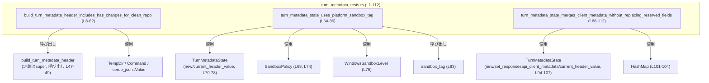
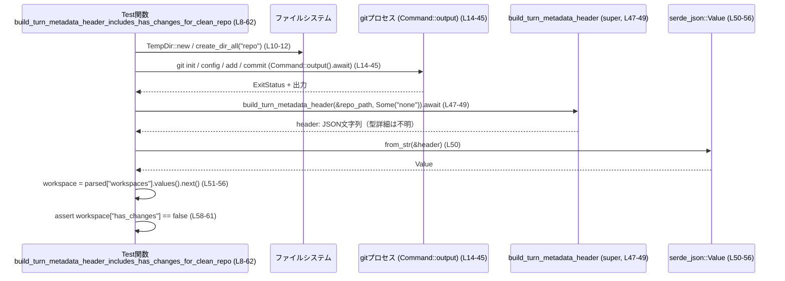
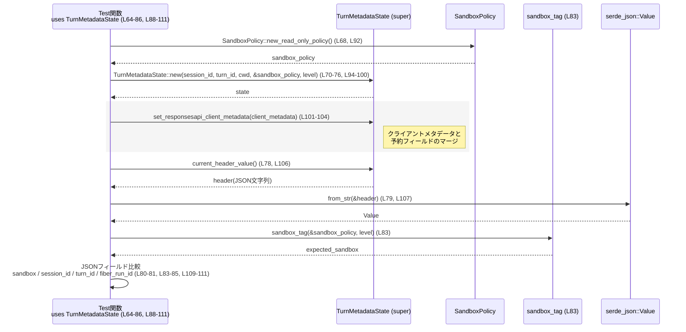

# core/src/turn_metadata_tests.rs

## 0. ざっくり一言

`build_turn_metadata_header` および `TurnMetadataState` が生成する JSON メタデータヘッダについて、

- Git リポジトリの変更有無フラグ
- サンドボックス情報
- クライアント指定メタデータと「予約フィールド」のマージ挙動

を検証するテスト群です（core/src/turn_metadata_tests.rs:L8-112）。

---

## 1. このモジュールの役割

### 1.1 概要

このモジュールは、親モジュール（`super::*`）で定義されているターンメタデータ機能に対するテストを提供します（L1）。

- Git リポジトリがクリーンな場合に `has_changes` が `false` になることの検証（L8-62）
- `TurnMetadataState` がサンドボックス設定から適切な `sandbox` タグを埋め込むことの検証（L64-86）
- クライアント提供メタデータをマージしても、`session_id` や `turn_id` などの予約フィールドが上書きされないことの検証（L88-112）

を行います。

### 1.2 アーキテクチャ内での位置づけ

このテストモジュールは、親モジュール（`super`）の公開 API を利用して、その仕様を確認する位置づけにあります（L1）。

外部／内部依存関係は概ね次のとおりです。

- 親モジュールから：
  - `build_turn_metadata_header`（L47-49）
  - `TurnMetadataState`（L70-78, L94-107）
  - `SandboxPolicy`（L68, L74, L92, L98）
  - `WindowsSandboxLevel`（L75, L99）
  - `sandbox_tag`（L83）
- 外部クレートから：
  - `tokio::test`, `tokio::process::Command`（L6, L8, L14-45）
  - `tempfile::TempDir`（L5, L10, L66, L90）
  - `serde_json::Value`（L3, L50, L79, L107）
  - `std::collections::HashMap`（L4, L101-104）

依存関係を簡略化して図示すると次のようになります。



### 1.3 設計上のポイント

コードから読み取れる設計上の特徴は次のとおりです。

- **実環境に近い検証**  
  - Git コマンド（`git init`, `git add`, `git commit` など）を実際に実行することで、`build_turn_metadata_header` が OS プロセスと連携する前提をテストしています（L14-45）。
- **JSON 形式でのヘッダ検証**  
  - すべてのテストでヘッダを JSON としてパースし、フィールド単位で検証しています（L50, L79, L107）。
- **状態オブジェクトを介したヘッダ生成**  
  - `TurnMetadataState` を通してヘッダを生成する API と、`build_turn_metadata_header` のような関数型 API の両方をテストしています（L47-49, L70-78, L94-107）。
- **予約フィールドの保護**  
  - クライアントメタデータが予約フィールド（`session_id`, `turn_id`）を上書きできないことを明示的にテストしており、API の契約の一部になっています（L101-111）。

---

## 2. コンポーネント一覧（インベントリー）

このチャンクに現れる関数・型・主要コンポーネントを一覧化します。

### 2.1 本ファイル内で定義されている関数

| 名前 | 種別 | 役割 / 用途 | 位置（根拠） |
|------|------|-------------|--------------|
| `build_turn_metadata_header_includes_has_changes_for_clean_repo` | テスト関数（非公開, `#[tokio::test]`） | クリーンな Git リポジトリに対して `build_turn_metadata_header` が `has_changes: false` を出力することを検証します。 | core/src/turn_metadata_tests.rs:L8-62 |
| `turn_metadata_state_uses_platform_sandbox_tag` | テスト関数（非公開, `#[test]`） | `TurnMetadataState` が `sandbox` と `session_id` を期待通りにヘッダへ反映することを検証します。 | core/src/turn_metadata_tests.rs:L64-86 |
| `turn_metadata_state_merges_client_metadata_without_replacing_reserved_fields` | テスト関数（非公開, `#[test]`） | クライアント提供メタデータが `fiber_run_id` などの任意フィールドに反映されつつ、`session_id` や `turn_id` といった予約フィールドを上書きしないことを検証します。 | core/src/turn_metadata_tests.rs:L88-111 |

### 2.2 親モジュールからインポートされる主なコンポーネント（定義はこのチャンク外）

| 名前 | 推定種別 | 役割 / 用途（このチャンクから読み取れる範囲） | 使用箇所（根拠） | 備考 |
|------|----------|--------------------------------------------|------------------|------|
| `build_turn_metadata_header` | 非同期関数 | Git リポジトリパスとオプション引数から JSON 文字列ヘッダを構築する処理の入口です。`await` の後に `.expect("header")` を呼んでいるため、Future の出力は `Result` または `Option` であると分かります。 | 呼び出しのみ：L47-49 | 定義は `super` モジュール内。戻り値の正確な型はこのチャンクには現れません。 |
| `TurnMetadataState` | 構造体（推定） | セッション ID, ターン ID, カレントディレクトリ, サンドボックス方針などを保持し、`current_header_value` で JSON ヘッダ文字列を生成する状態オブジェクトとして利用されています。 | コンストラクタ呼び出し L70-76, L94-100／メソッド呼び出し L78-78, L101-104, L106-106 | 内部フィールドや実装はこのチャンクには現れません。 |
| `SandboxPolicy` | 構造体（推定） | `new_read_only_policy` という関連関数により、読み取り専用ポリシーを生成していることから、サンドボックス動作のポリシーを表す型と解釈できます。 | L68, L74, L92, L98, L83 | 詳細なフィールド・挙動は不明です（このチャンクには現れません）。 |
| `WindowsSandboxLevel` | 列挙体（推定） | Windows 上でのサンドボックスレベルを表す列挙型であり、ここでは `Disabled` バリアントが利用されています。 | L75, L99, L83 | 列挙子の全体は不明です。 |
| `sandbox_tag` | 関数 | `SandboxPolicy` と `WindowsSandboxLevel` から、ヘッダに埋め込まれる `sandbox` 名文字列を生成します。 | 呼び出し：L83 | 定義は `super` にありますが、このチャンクには現れません。 |

### 2.3 外部クレート由来の主なコンポーネント

| 名前 | 種別 | 役割 / 用途 | 使用箇所（根拠） |
|------|------|-------------|------------------|
| `tempfile::TempDir` | 構造体 | 一時ディレクトリを作成し、スコープ終了時に自動削除される一時作業ディレクトリとして使用されています（Git リポジトリや作業ディレクトリのルート）。 | L5, L10, L66, L90 |
| `tokio::process::Command` | 構造体 | 非同期で外部コマンド（ここでは `git`）を実行するために使用されています。`output().await` で完了を待機しています。 | L6, L14-19, L20-25, L26-31, L34-39, L40-45 |
| `serde_json::Value` | 列挙体 | JSON 文字列をパースして動的な JSON 値として扱うために使用されています。`from_str` で生成し、`get`, `as_object`, `as_str`, `as_bool` 等でフィールドにアクセスしています。 | L3, L50-56, L79-81, L107-111 |
| `std::collections::HashMap` | 構造体 | クライアント由来メタデータをキー・値のペアとして保持し、`TurnMetadataState::set_responsesapi_client_metadata` に渡すために使用されています。 | L4, L101-104 |

---

## 3. 公開 API と詳細解説

このファイル自身はテストモジュールであり、ライブラリとしての公開 API は定義しません。ただし、テスト関数は親モジュールの API 契約を明らかにするため、ここではテスト関数を中心に詳細を整理します。

### 3.1 型一覧（このファイルから見える主な型）

| 名前 | 種別 | 役割 / 用途 | 定義場所（推定／根拠） |
|------|------|-------------|------------------------|
| `TurnMetadataState` | 構造体（推定） | ターンメタデータの状態を持ち、ヘッダ JSON を生成します。`new`, `current_header_value`, `set_responsesapi_client_metadata` が利用されています。 | 親モジュール（`super`）。使用のみ L70-78, L94-107。 |
| `SandboxPolicy` | 構造体（推定） | サンドボックスの方針（ここでは読み取り専用）を表します。`new_read_only_policy` を通して生成されています。 | 親モジュールまたは別モジュール。使用 L68, L92。 |
| `WindowsSandboxLevel` | 列挙体（推定） | Windows 用のサンドボックスレベルを表現し、`TurnMetadataState` の初期化や `sandbox_tag` の引数として渡されます。 | 親モジュール。使用 L75, L99, L83。 |
| `Value` | `serde_json::Value` | 任意の JSON 値を表す動的な型で、ヘッダ文字列の検証に使用されます。 | `serde_json` クレート。使用 L3, L50-56, L79-81, L107-111。 |
| `TempDir` | 構造体 | 一時ディレクトリのライフサイクルを管理します。Git リポジトリやカレントディレクトリとして利用。 | `tempfile` クレート。使用 L5, L10, L66, L90。 |
| `HashMap<String, String>` | 構造体 | クライアント提供メタデータを保持し、`TurnMetadataState` にセットするためのコンテナです。 | `std::collections`。生成 L101-104。 |

### 3.2 関数詳細

#### `build_turn_metadata_header_includes_has_changes_for_clean_repo()`

**概要**

クリーンな Git リポジトリに対して `build_turn_metadata_header` を呼び出した結果、生成されるヘッダ JSON の `workspaces` 以下にある `has_changes` フィールドが `false` であることを検証する非同期テストです（L8-62）。

**引数**

- なし（テスト関数として `#[tokio::test]` で実行されます。L8）

**戻り値**

- 戻り値型は `()` ですが、途中で `.expect` や `assert_eq!` が失敗するとテストは panic します（L10, L12, L18-19, L24-25, L30-31, L38-39, L44-45, L48-49, L50, L56, L58-61）。

**内部処理の流れ（アルゴリズム）**

1. 一時ディレクトリと `repo` サブディレクトリを作成します（L10-12）。
2. `git` コマンドを順に実行して、空のリポジトリを初期化し、ユーザー名とメールアドレスを設定します（L14-31）。
3. `README.md` を作成し（L33）、`git add .` と `git commit -m "initial"` で初回コミットを作成します（L34-45）。
4. 以上の処理により、ワーキングツリーに変更がないクリーンなリポジトリ状態になります。
5. `build_turn_metadata_header(&repo_path, Some("none"))` を `await` し、ヘッダ文字列を取得して `.expect("header")` でアンラップします（L47-49）。
6. 得られた JSON 文字列を `serde_json::from_str` で `Value` にパースします（L50）。
7. `workspaces` オブジェクトを取得し、その最初の要素（任意のワークスペース）を取り出して `workspace` として保持します（L51-56）。
8. `workspace["has_changes"]` を `bool` として取得し、それが `Some(false)` であることを `assert_eq!` で検証します（L58-61）。

**並行性・非同期性**

- 関数全体は `#[tokio::test]` により、Tokio ランタイム上の非同期テストとして実行されます（L8）。
- Git コマンドの実行には `tokio::process::Command::output().await` が使われており、各外部プロセスの完了を非同期に待機します（L14-19, L20-25, L26-31, L34-39, L40-45）。
- ただし Git コマンドは順次 `await` しているため、このテスト内での外部プロセスは直列に実行されます。

**Examples（使用例）**

このテストは、`build_turn_metadata_header` の実利用例としても機能します。簡略化した使用例は次のようになります（エラーハンドリングを `?` で書き換えた例です）。

```rust
use tempfile::TempDir;
use tokio::process::Command;

// 非テストコード例
async fn build_header_for_clean_repo_example() -> Result<String, Box<dyn std::error::Error>> {
    let temp_dir = TempDir::new()?;                             // 一時ディレクトリを作成
    let repo_path = temp_dir.path().join("repo");               // "repo" サブディレクトリを作成
    std::fs::create_dir_all(&repo_path)?;                       // ディレクトリを作成

    // Git リポジトリの初期化と初回コミット作成
    Command::new("git")
        .args(["init"])
        .current_dir(&repo_path)
        .output()
        .await?;                                                // git init

    // ... user.name / user.email / add / commit も同様に実行 ...

    // 実際のヘッダ構築
    let header = build_turn_metadata_header(&repo_path, Some("none"))
        .await?;                                                // ここで JSON ヘッダ文字列が得られる

    Ok(header)                                                  // 呼び出し元に返す
}
```

**Errors / Panics**

- Git コマンドの実行結果に対して `.expect("git init")` などを呼び出しているため、Git がインストールされていない、あるいはコマンドが失敗するとテストは panic します（L18-19, L24-25, L30-31, L38-39, L44-45）。
- `build_turn_metadata_header` の結果に対して `.expect("header")` を呼び出しているため、関数がエラーを返した場合も panic します（L47-49）。
- JSON パースや `workspace` 抽出が失敗した場合も、それぞれ `.expect("valid json")`, `.expect("workspace")` により panic します（L50, L56）。

**Edge cases（エッジケース）**

- このテストは「クリーンなリポジトリ」のケースのみを扱っています。  
  - 未コミット変更や未追跡ファイルがある場合の `has_changes` の値は、このチャンクからは分かりません（未テスト）。
- `workspaces` オブジェクト内に少なくとも 1 つのワークスペースが存在する前提で `values().next()` を呼んでいます（L52-55）。空であった場合の挙動はテストされていません。

**使用上の注意点**

- 実際のコードで同様の処理を行う場合、Git コマンドが失敗する可能性を考慮し、`expect` ではなく `?` などでエラーを呼び出し元に返す設計が推奨されます。
- テストは環境に `git` が存在することと、`tokio` ランタイムが利用可能であることを前提としています。

---

#### `turn_metadata_state_uses_platform_sandbox_tag()`

**概要**

`TurnMetadataState` が生成するヘッダ JSON の `sandbox` フィールドと `session_id` フィールドが、`sandbox_tag` の戻り値およびコンストラクタに渡したセッション ID と一致することを検証する同期テストです（L64-86）。

**引数**

- なし（通常の `#[test]` 関数として実行されます。L64）

**戻り値**

- 戻り値型は `()` で、`expect` や `assert_eq!` に失敗した場合に panic します（L66, L78, L79-81, L83-85）。

**内部処理の流れ**

1. 一時ディレクトリを作成し、そのパスを `cwd` として保持します（L66-67）。
2. `SandboxPolicy::new_read_only_policy()` を呼び出して読み取り専用ポリシーを生成します（L68）。
3. `TurnMetadataState::new` を使って、セッション ID `"session-a"`, ターン ID `"turn-a"`, 作業ディレクトリ `cwd`, サンドボックスポリシー、Windows サンドボックスレベル `Disabled` を指定して状態オブジェクトを作成します（L70-76）。
4. `state.current_header_value()` を呼び出してヘッダ JSON 文字列を取得し、`.expect("header")` でアンラップします（L78）。
5. `serde_json::from_str` でヘッダ文字列を `Value` にパースします（L79）。
6. JSON から `sandbox` と `session_id` フィールドを取り出します（L80-81）。
7. `sandbox_tag(&sandbox_policy, WindowsSandboxLevel::Disabled)` を呼び出し、期待されるサンドボックスタグ文字列を取得します（L83）。
8. `sandbox` フィールドがこの期待値と等しいこと、`session_id` フィールドが `"session-a"` であることを `assert_eq!` で検証します（L84-85）。

**並行性・非同期性**

- このテストは同期テストであり、非同期処理やスレッド並行性は直接は扱っていません。

**Examples（使用例）**

`TurnMetadataState` の基本的な使い方を示す例として、テストから抽出したパターンを整理します。

```rust
// 親モジュールからのインポートは仮のものです
// use crate::TurnMetadataState;
// use crate::{SandboxPolicy, WindowsSandboxLevel};

fn build_header_from_state_example() -> Result<String, Box<dyn std::error::Error>> {
    let temp_dir = tempfile::TempDir::new()?;                // 一時ディレクトリを作成
    let cwd = temp_dir.path().to_path_buf();                 // PathBuf に変換
    let sandbox_policy = SandboxPolicy::new_read_only_policy(); // 読み取り専用ポリシーを生成

    let state = TurnMetadataState::new(
        "session-a".to_string(),                             // セッション ID
        "turn-a".to_string(),                                // ターン ID
        cwd,                                                 // カレントディレクトリ
        &sandbox_policy,                                     // サンドボックスポリシー参照
        WindowsSandboxLevel::Disabled,                       // サンドボックスレベル
    );

    let header = state.current_header_value()?;              // JSON ヘッダ文字列を取得（Result想定）
    Ok(header)
}
```

**Errors / Panics**

- `TempDir::new().expect("temp dir")` が失敗した場合、テストは panic します（L66）。
- `current_header_value().expect("header")` がエラーを返した場合も panic します（L78）。
- JSON パースに失敗した場合、`.expect("json")` で panic します（L79）。

**Edge cases（エッジケース）**

- サンドボックスポリシーやサンドボックスレベルを他のバリアントに変更した場合の `sandbox` フィールド値は、このチャンクには現れません。
- セッション ID を空文字にした場合や非 ASCII 文字列にした場合の挙動も、このテストからは分かりません。

**使用上の注意点**

- テストから読み取れる契約として、`session_id` フィールドは `TurnMetadataState::new` に渡したセッション ID で上書きされることが分かります（L70-72, L81, L85）。
- 実際のコードでは `current_header_value` のエラーを `expect` ではなく適切に扱う必要があります。

---

#### `turn_metadata_state_merges_client_metadata_without_replacing_reserved_fields()`

**概要**

`TurnMetadataState` にクライアント提供メタデータを設定した際、予約フィールド（`session_id`, `turn_id`）は状態側の値が優先され、クライアント側の値で上書きされないことを検証するテストです（L88-111）。

**引数**

- なし（`#[test]` で実行されます。L88）

**戻り値**

- 戻り値型は `()`。途中の `expect` や `assert_eq!` が失敗すると panic します（L90, L106-111）。

**内部処理の流れ**

1. 一時ディレクトリと `cwd` を準備し、読み取り専用の `SandboxPolicy` を生成します（L90-92）。
2. `TurnMetadataState::new` により、セッション ID `"session-a"`, ターン ID `"turn-a"`, `cwd`, サンドボックスポリシー、`WindowsSandboxLevel::Disabled` で状態を初期化します（L94-100）。
3. `HashMap::from` を用いて、クライアント提供メタデータとして以下の 2 つのエントリを設定します（L101-104）。
   - `"fiber_run_id" -> "fiber-123"`
   - `"session_id" -> "client-supplied"`（状態側と衝突するキー）
4. `state.set_responsesapi_client_metadata` でこのメタデータを状態に登録します（L101-104）。
5. `state.current_header_value().expect("header")` で JSON ヘッダ文字列を取得し、`serde_json::from_str` で `Value` にパースします（L106-107）。
6. JSON を直接インデックスして、以下のフィールド値を検証します（L109-111）。
   - `json["fiber_run_id"]` が `"fiber-123"` であること（クライアント値がそのまま反映）
   - `json["session_id"]` が `"session-a"` であること（予約フィールドは上書きされない）
   - `json["turn_id"]` が `"turn-a"` であること（予約フィールド）

**並行性・非同期性**

- このテストも同期テストであり、非同期処理は行っていません。

**Examples（使用例）**

クライアントメタデータを `TurnMetadataState` に設定する方法の例です。

```rust
use std::collections::HashMap;

fn attach_client_metadata_example(state: &TurnMetadataState) -> Result<(), Box<dyn std::error::Error>> {
    // クライアントから渡されたメタデータ
    let client_metadata = HashMap::from([
        ("fiber_run_id".to_string(), "fiber-123".to_string()), // 任意フィールド
        ("session_id".to_string(), "client-supplied".to_string()), // 予約フィールドと衝突
    ]);

    state.set_responsesapi_client_metadata(client_metadata);   // 状態に設定

    let header = state.current_header_value()?;               // マージ後のヘッダを取得
    let json: serde_json::Value = serde_json::from_str(&header)?;

    // 予約フィールドは状態側が優先されるという契約がテストから読み取れる
    assert_eq!(json["fiber_run_id"].as_str(), Some("fiber-123"));
    assert_eq!(json["session_id"].as_str(), Some("session-a"));
    assert_eq!(json["turn_id"].as_str(), Some("turn-a"));

    Ok(())
}
```

**Errors / Panics**

- `TempDir::new().expect("temp dir")` が失敗した場合に panic します（L90）。
- `current_header_value().expect("header")` がエラーを返した場合に panic します（L106）。
- JSON パースエラーでも `.expect("json")` による panic が発生します（L107）。
- `json["..."].as_str()` が `None` だった場合、`assert_eq!` でテストが失敗します（L109-111）。

**Edge cases（エッジケース）**

- テストでは `session_id` のみをクライアント側と衝突させていますが、他の予約フィールド（例えば `turn_id`）についてクライアントメタデータで衝突させた場合の挙動は、このチャンクには現れません。
- クライアントメタデータに大量のキーがある場合や、ネストした JSON を表現したい場合のサポート範囲は不明です（`HashMap<String, String>` からは、少なくともキー・値が文字列であることが分かります。L101-104）。

**使用上の注意点**

- テストから読み取れる重要な契約として、「`session_id` や `turn_id` は予約フィールドであり、クライアント側で同名キーを指定しても状態側の値が優先される」ことが挙げられます（L94-97, L101-104, L109-111）。
- クライアントが追加できるフィールドは、予約フィールド名を避けるほうが混乱を防げます。

---

### 3.3 その他の関数（このファイルでのみ利用されるもの）

このチャンクに定義はなく、呼び出しのみ確認できる補助的な関数／メソッドです。

| 関数名 / メソッド名 | 役割（このチャンクから読み取れる範囲） | 使用箇所（根拠） |
|---------------------|----------------------------------------|------------------|
| `build_turn_metadata_header` | リポジトリパスと追加情報（ここでは `"none"`）からターンメタデータヘッダを構築する非同期関数。 | 呼び出し L47-49 |
| `TurnMetadataState::new` | セッション ID, ターン ID, カレントディレクトリ, サンドボックス設定を受け取り、新しい状態オブジェクトを生成するコンストラクタ的メソッド。 | L70-76, L94-100 |
| `TurnMetadataState::current_header_value` | 現在の状態に基づいて、JSON 形式のヘッダ文字列を生成して返すメソッド。`Result` または `Option` を返していることが `.expect("header")` から分かります。 | L78, L106 |
| `TurnMetadataState::set_responsesapi_client_metadata` | クライアントから渡されたメタデータ（`HashMap<String, String>`）を状態に取り込むメソッド。 | L101-104 |
| `SandboxPolicy::new_read_only_policy` | 読み取り専用のサンドボックスポリシーを生成する関連関数。 | L68, L92 |
| `sandbox_tag` | `SandboxPolicy` と `WindowsSandboxLevel` からサンドボックス名文字列を生成します。テストではヘッダ中の `sandbox` フィールドと一致することを期待しています。 | L83 |

---

## 4. データフロー

### 4.1 `build_turn_metadata_header` 経由のデータフロー（クリーンリポジトリ）

`build_turn_metadata_header_includes_has_changes_for_clean_repo` テスト内の典型的なデータの流れを示します（L8-62）。

1. 一時ディレクトリ内に Git リポジトリを作成し、初回コミットまで完了させる（L10-45）。
2. このリポジトリパスを `build_turn_metadata_header` に渡してヘッダ JSON 文字列を生成する（L47-49）。
3. ヘッダ JSON を `serde_json::from_str` でパースして `Value` に変換する（L50）。
4. `workspaces` オブジェクトから最初のワークスペースを取り出し（L51-56）、`has_changes` ブール値を検証する（L58-61）。

これをシーケンス図で表すと以下のようになります。



### 4.2 `TurnMetadataState` 経由のデータフロー

2 つのテスト（L64-86, L88-111）は `TurnMetadataState` を通じたヘッダ生成を行っています。

- 入力：
  - セッション ID (`"session-a"`)（L71, L95）
  - ターン ID (`"turn-a"`)（L72, L96）
  - カレントディレクトリ（`cwd`）（L67, L91, L73, L97）
  - サンドボックスポリシー（`SandboxPolicy::new_read_only_policy()`）（L68, L92）
  - Windows サンドボックスレベル（`Disabled`）（L75, L99）
  - クライアントメタデータ（`HashMap<String, String>`）（L101-104）
- 出力：
  - JSON ヘッダ文字列（`current_header_value()` の戻り値）（L78, L106）
  - フィールド：
    - `sandbox`
    - `session_id`
    - `turn_id`
    - `fiber_run_id` などの追加フィールド

簡略化したデータフローを示します。



---

## 5. 使い方（How to Use）

このファイルはテストコードですが、`build_turn_metadata_header` と `TurnMetadataState` の実際の使い方の例としても参考になります。

### 5.1 基本的な使用方法

#### 5.1.1 Git リポジトリからヘッダを構築する

テスト（L8-62）をベースに、実コード向けのパターンを整理した例です。

```rust
use std::path::Path;
use tokio::process::Command;
use tempfile::TempDir;

// Gitリポジトリからメタデータヘッダを構築する例
async fn build_header_for_repo(repo_root: &Path) -> Result<String, Box<dyn std::error::Error>> {
    // ここでは既に初期化済みリポジトリを前提とし、Git コマンドは省略する      // テストでは init/config/add/commit を実行していた (L14-45)

    // メタデータヘッダを構築する                                             // build_turn_metadata_header を呼び出す (L47-49)
    let header = build_turn_metadata_header(repo_root, Some("none")).await?;   // Future を await し、エラーは ? で伝播

    Ok(header)                                                                 // 呼び出し元へ返却
}
```

#### 5.1.2 状態オブジェクトからヘッダを構築する

テスト（L64-86, L88-111）のパターンからまとめた基本例です。

```rust
use std::collections::HashMap;

fn build_header_with_state_example() -> Result<String, Box<dyn std::error::Error>> {
    let temp_dir = tempfile::TempDir::new()?;                      // 一時ディレクトリを作成 (L66, L90)
    let cwd = temp_dir.path().to_path_buf();                       // PathBuf に変換 (L67, L91)
    let sandbox_policy = SandboxPolicy::new_read_only_policy();    // 読み取り専用ポリシー (L68, L92)

    let state = TurnMetadataState::new(
        "session-a".to_string(),                                   // セッション ID (L71, L95)
        "turn-a".to_string(),                                      // ターン ID (L72, L96)
        cwd,                                                       // 作業ディレクトリ (L73, L97)
        &sandbox_policy,                                           // ポリシー参照 (L74, L98)
        WindowsSandboxLevel::Disabled,                             // サンドボックスレベル (L75, L99)
    );

    // 任意のクライアントメタデータを設定する（予約フィールドは避ける）       // テストでは fiber_run_id と session_id を渡していた (L101-104)
    let client_metadata = HashMap::from([
        ("fiber_run_id".to_string(), "fiber-123".to_string()),
    ]);
    state.set_responsesapi_client_metadata(client_metadata);       // クライアントメタデータをセット

    let header = state.current_header_value()?;                    // JSON ヘッダ文字列を取得 (L78, L106)
    Ok(header)
}
```

### 5.2 よくある使用パターン

このチャンクから読み取れる代表的なパターンは次の 2 つです。

1. **リポジトリ単位のヘッダ構築**  
   - `build_turn_metadata_header(&repo_path, Some("none"))` のように、ディレクトリパスと追加情報を引数に取る関数を使う（L47-49）。
   - Git 状態に応じて `has_changes` などがセットされる。

2. **セッション／ターン単位の状態オブジェクトを用いたヘッダ構築**  
   - `TurnMetadataState::new` にセッション ID／ターン ID／作業ディレクトリ／サンドボックスポリシーを渡して状態を構成する（L70-76, L94-100）。
   - `set_responsesapi_client_metadata` で任意のメタデータを追加し、`current_header_value` で最終的なヘッダを取得する（L101-104, L106）。

### 5.3 よくある間違い（推測される誤用）

テストから想定される誤用パターンと、望ましい使い方を対比します。

```rust
// 誤り例: 予約フィールドをクライアントメタデータで上書きできると期待している
let client_metadata = HashMap::from([
    ("session_id".to_string(), "client-supplied".to_string()), // 状態側と衝突 (L101-104)
]);
state.set_responsesapi_client_metadata(client_metadata);
let header = state.current_header_value()?;
let json: serde_json::Value = serde_json::from_str(&header)?;
assert_eq!(json["session_id"].as_str(), Some("client-supplied")); // テストでは失敗すると示唆 (L109-111)

// 正しい例: 予約フィールド名を避けて別名を使う
let client_metadata = HashMap::from([
    ("client_session_label".to_string(), "client-supplied".to_string()),
]);
state.set_responsesapi_client_metadata(client_metadata);
let header = state.current_header_value()?;
let json: serde_json::Value = serde_json::from_str(&header)?;
assert_eq!(json["client_session_label"].as_str(), Some("client-supplied")); // 予約フィールドとは独立
```

テスト（L101-104, L109-111）から、`session_id` は状態側が優先される契約であることが分かります。

### 5.4 使用上の注意点（まとめ）

このチャンクから読み取れる共通の注意点は次のとおりです。

- **予約フィールドの扱い**  
  - `session_id` と `turn_id` は `TurnMetadataState::new` の引数で指定される値がヘッダに反映され、クライアントメタデータ側の同名キーで上書きされないことがテストで確認されています（L94-97, L101-104, L109-111）。
- **外部コマンドへの依存**  
  - `build_turn_metadata_header` のテストは `git` コマンドの存在に依存しており、実運用でも Git のインストールや PATH 設定が前提になる可能性があります（L14-45）。
- **エラー処理**  
  - テストでは `.expect(...)` によりエラーを強制的に panic にしていますが（L10, L12, L18-19, など）、本番コードでは `Result` を呼び出し元に伝播するなど、より丁寧なエラーハンドリングが必要です。
- **並列実行時の安全性**  
  - 各テストは `TempDir` により個別のディレクトリを使用するため、テスト同士がディレクトリ名で衝突することはありません（L10, L66, L90）。  
    ただし、`git` のグローバル設定には依存していないことが `git config user.name` 等のローカル設定から読み取れます（L20-25, L26-31）。

---

## 6. 変更の仕方（How to Modify）

### 6.1 新しい機能を追加する場合（テストの観点）

ターンメタデータに新しいフィールドや挙動を追加する場合、このテストモジュールに以下のようにテストを追加すると一貫性が保たれます。

1. **テスト追加の場所**  
   - 本ファイル末尾付近（既存の 3 テストの下）に `#[test]` または `#[tokio::test]` 関数を追加する（L88-111 の後）。
2. **利用すべき API**  
   - 新フィールドが `build_turn_metadata_header` によってセットされるなら、`build_turn_metadata_header_includes_has_changes_for_clean_repo` と同様に Git リポジトリを用意してテストします（L8-62）。
   - `TurnMetadataState` 起点の挙動なら、`TurnMetadataState::new` と `current_header_value` を使ったパターンに乗せて検証します（L70-78, L94-107）。
3. **検証方法**  
   - ヘッダは JSON 文字列として返るため、必ず `serde_json::from_str` で `Value` にパースし、フィールド単位で検証するスタイルに揃えます（L50, L79, L107）。

### 6.2 既存の機能を変更する場合（契約の確認）

- **JSON フィールド名や構造を変更する場合**  
  - `workspaces` 配下の構造や `has_changes` の場所を変えると、`build_turn_metadata_header_includes_has_changes_for_clean_repo` が失敗するため、テストを合わせて更新する必要があります（L51-60）。
- **サンドボックス表現の仕様変更**  
  - `sandbox_tag` の仕様を変更した場合、`turn_metadata_state_uses_platform_sandbox_tag` の期待値も更新が必要です（L80-85）。
- **予約フィールドの取り扱い変更**  
  - クライアントメタデータが `session_id` や `turn_id` を上書きできるように仕様変更する場合は、`turn_metadata_state_merges_client_metadata_without_replacing_reserved_fields` のアサーションを変更するか、新しいテストパターンを追加する必要があります（L101-104, L109-111）。
- **影響範囲の確認**  
  - 予約フィールドや JSON 構造は他のテストやクライアントコードにも影響しうるため、`super` モジュール側や他のテストファイルの利用箇所も検索して確認することが推奨されます（ただし、このチャンクには他ファイルの情報は現れません）。

---

## 7. 関連ファイル

このチャンクから直接パスは分かりませんが、関係が強いモジュール・外部依存を整理します。

| パス / モジュール | 役割 / 関係 |
|-------------------|------------|
| `super`（親モジュール。具体的なファイルパスはこのチャンクには現れません） | `build_turn_metadata_header`, `TurnMetadataState`, `SandboxPolicy`, `WindowsSandboxLevel`, `sandbox_tag` など、本テストが対象としているコアロジックの定義を提供していると考えられます（L1, L47-49, L70-78, L94-107, L83）。 |
| `tokio::process` | `Command` 型を通じて外部プロセス（git）を非同期実行する機能を提供します（L6, L14-45）。 |
| `tempfile` クレート | 一時ディレクトリ管理のための `TempDir` を提供し、テストのファイルシステム汚染を防いでいます（L5, L10, L66, L90）。 |
| `serde_json` クレート | メタデータヘッダ JSON のパース・操作のための `Value` 型を提供します（L3, L50-56, L79-81, L107-111）。 |

---

### Bugs / Security 観点の補足（このチャンクから読み取れる範囲）

- **環境依存性**  
  - `git` の存在やバージョンに依存するため、環境によってはテストが失敗する可能性があります（L14-45）。特に CI や最小コンテナイメージでは `git` がインストールされていないことがあります。
- **パスインジェクション等**  
  - テストコードでは `Command::new("git")` に固定文字列を渡しており、ユーザー入力を経由していないため、コマンドインジェクションのリスクはこのチャンクからは見受けられません（L14, L20, L26, L34, L40）。
- **予約フィールド保護**  
  - テストにより、少なくとも `session_id` および `turn_id` がクライアントメタデータで上書きされないことが保証されており、不正なクライアントがセッション／ターンの識別情報を偽装するリスクを低減していると解釈できます（L101-104, L109-111）。ただし、他のフィールドについて同様の制約があるかどうかはこのチャンクには現れません。
