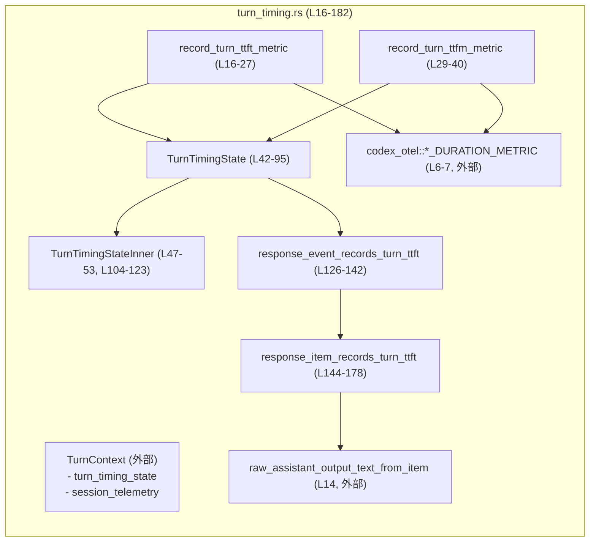
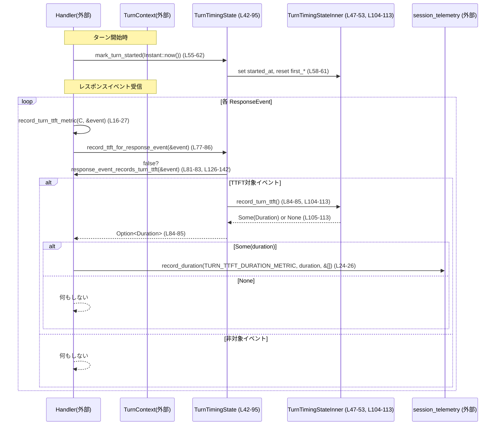

# core/src/turn_timing.rs

## 0. ざっくり一言

- 1つの「ターン」（対話単位）の開始時刻を記録し、  
  - TTFT（Time To First Token と解釈できる）  
  - TTFM（Time To First Message と解釈できる）  
 などの遅延時間を計測してメトリクスに送るためのタイミング管理モジュールです。(turn_timing.rs:L16-40, L42-75, L77-94)

---

## 1. このモジュールの役割

### 1.1 概要

- このモジュールは、対話システムにおける「ターン」の開始〜最初の応答・完了までの時間を計測し、テレメトリに記録する役割を持ちます。(turn_timing.rs:L16-40, L55-75)
- 非同期環境で共有される `TurnTimingState` が、開始時刻や最初のトークン・最初のメッセージ発生時刻を管理します。(turn_timing.rs:L42-53, L55-94)
- どの種類の `ResponseEvent` / `ResponseItem` が TTFT 計測のトリガーになるかを判定するヘルパー関数を提供します。(turn_timing.rs:L126-178)

### 1.2 アーキテクチャ内での位置づけ

- 外部との関係:
  - `TurnContext` から `turn_timing_state` と `session_telemetry` を利用します。(turn_timing.rs:L16-26, L29-39)
  - `ResponseEvent`, `TurnItem`, `ResponseItem` などのドメインイベント／項目型に依存します。(turn_timing.rs:L16-20, L29-33, L126-140, L144-176)
  - メトリクス名は `codex_otel` からインポートされています。(turn_timing.rs:L6-7)
  - 生テキスト抽出には `raw_assistant_output_text_from_item` を利用しています。(turn_timing.rs:L14, L147-148)



- `record_turn_ttft_metric` / `record_turn_ttfm_metric` は、`TurnContext` を通じて状態とテレメトリの両方にアクセスする「外向き」のエントリポイントです。(turn_timing.rs:L16-27, L29-40)
- 時間の計測ロジックは `TurnTimingStateInner` に閉じ込められており、`TurnTimingState` がその同期的なラッパかつロック管理を行う構造になっています。(turn_timing.rs:L42-45, L47-53, L55-94, L104-123)

### 1.3 設計上のポイント

- **非同期・共有状態管理**  
  - 内部状態は `tokio::sync::Mutex<TurnTimingStateInner>` で保護されており、非同期タスク間で安全に共有されます。(turn_timing.rs:L42-45, L55-94)
- **時間の扱いの分離**
  - 長さ（Duration）の計測には単調増加の `Instant` を使い、(turn_timing.rs:L49, L51-52, L68-74, L105-123)
  - 絶対時刻（UNIX 時刻秒）には `SystemTime` を使うよう分離されています。(turn_timing.rs:L50, L59, L70, L97-102)
- **1回限りの計測**
  - `first_token_at` / `first_message_at` がすでに `Some` の場合は `None` を返し、2回目以降の計測を抑止します。(turn_timing.rs:L51-52, L105-107, L115-117)
- **安全な変換とエラー処理**
  - 時刻差からミリ秒への変換でオーバーフローした場合は `i64::MAX` にフォールバックします。パニックは発生しません。(turn_timing.rs:L71-73, L101)
  - `SystemTime::duration_since(UNIX_EPOCH)` の失敗も `unwrap_or_default` で 0 秒起点にフォールバックします。(turn_timing.rs:L98-100)
- **Rust 言語固有の安全性**
  - 可変共有状態はすべて `Mutex` 越しの `&mut` で扱われ、データ競合が起きない設計です。(turn_timing.rs:L42-45, L55-94, L104-123)
  - 失敗ケースは `Option<Duration>` や `Option<i64>` で表現され、`unwrap` によるパニックは使用していません。(turn_timing.rs:L68-75, L77-94, L97-102, L105-123)

---

## 2. 主要な機能一覧

### 2.1 機能サマリ

- ターン開始の記録: `mark_turn_started` で開始時刻と開始 UNIX 秒を記録し、内部状態をリセットします。(turn_timing.rs:L55-62)
- ターン完了情報の取得: 現在時刻と、開始からの経過時間（ミリ秒）を `(completed_at, duration_ms)` で取得します。(turn_timing.rs:L68-75)
- TTFT 計測:
  - 各 `ResponseEvent` が TTFT トリガーかを判定し、初回のみ「開始から最初のトークンまで」の `Duration` を返します。(turn_timing.rs:L77-86, L104-113, L126-142, L144-178)
  - メトリクス `TURN_TTFT_DURATION_METRIC` としてセッションテレメトリに記録します。(turn_timing.rs:L16-27)
- TTFM 計測:
  - `TurnItem::AgentMessage` の最初の到着までの時間を計測します。(turn_timing.rs:L88-94, L115-123)
  - メトリクス `TURN_TTFM_DURATION_METRIC` としてセッションテレメトリに記録します。(turn_timing.rs:L29-40)

### 2.2 コンポーネントインベントリー（関数・構造体）

| 名前 | 種別 | 可視性 | 役割 / 用途 | 定義位置 |
|------|------|--------|-------------|----------|
| `record_turn_ttft_metric` | 非メソッド関数 (async) | `pub(crate)` | `TurnContext` と `ResponseEvent` から TTFT を計測し、メトリクスに送信する外向き API | turn_timing.rs:L16-27 |
| `record_turn_ttfm_metric` | 非メソッド関数 (async) | `pub(crate)` | `TurnItem` から TTFM を計測し、メトリクスに送信する外向き API | turn_timing.rs:L29-40 |
| `TurnTimingState` | 構造体 | `pub(crate)` | ターン単位のタイミング状態を保持し、非同期に操作するラッパ | turn_timing.rs:L42-45 |
| `TurnTimingStateInner` | 構造体 | `pub(crate)` ではない | 実際の時刻情報（開始・最初のトークン／メッセージ）を保持する内部状態 | turn_timing.rs:L47-53 |
| `TurnTimingState::mark_turn_started` | メソッド (async) | `pub(crate)` | ターン開始時刻と開始 UNIX 秒を設定し、以前の TTFT/TTFM 状態をクリアする | turn_timing.rs:L55-62 |
| `TurnTimingState::started_at_unix_secs` | メソッド (async) | `pub(crate)` | ターン開始の UNIX 秒を返す | turn_timing.rs:L64-66 |
| `TurnTimingState::completed_at_and_duration_ms` | メソッド (async) | `pub(crate)` | 現在時刻（UNIX 秒）と、開始からの経過ミリ秒を返す | turn_timing.rs:L68-75 |
| `TurnTimingState::record_ttft_for_response_event` | メソッド (async) | `pub(crate)` | イベントが TTFT トリガーなら初回のみ TTFT を計測する | turn_timing.rs:L77-86 |
| `TurnTimingState::record_ttfm_for_turn_item` | メソッド (async) | `pub(crate)` | `TurnItem::AgentMessage` の初回のみ TTFM を計測する | turn_timing.rs:L88-94 |
| `now_unix_timestamp_secs` | 非メソッド関数 | `fn` (モジュール内) | 現在の UNIX 時刻秒を `i64` で取得（エラー／オーバーフロー時はフォールバック） | turn_timing.rs:L97-102 |
| `TurnTimingStateInner::record_turn_ttft` | メソッド | `fn`（内部） | `first_token_at` を設定し、開始からの経過時間を返す。2回目以降は `None`。 | turn_timing.rs:L104-113 |
| `TurnTimingStateInner::record_turn_ttfm` | メソッド | `fn`（内部） | `first_message_at` を設定し、開始からの経過時間を返す。2回目以降は `None`。 | turn_timing.rs:L115-123 |
| `response_event_records_turn_ttft` | 非メソッド関数 | `fn`（モジュール内） | `ResponseEvent` が TTFT 計測対象かどうかを判定する | turn_timing.rs:L126-142 |
| `response_item_records_turn_ttft` | 非メソッド関数 | `fn`（モジュール内） | `ResponseItem` が TTFT 計測対象かどうかを判定する | turn_timing.rs:L144-178 |
| `tests` | モジュール | `mod` (cfg(test)) | `turn_timing_tests.rs` に定義されたテストを読み込む | turn_timing.rs:L180-182 |

---

## 3. 公開 API と詳細解説

### 3.1 型一覧（構造体・列挙体など）

| 名前 | 種別 | 可視性 | フィールド概要 | 定義位置 |
|------|------|--------|----------------|----------|
| `TurnTimingState` | 構造体 | `pub(crate)` | `state: Mutex<TurnTimingStateInner>` – 非同期に保護された内部状態 | turn_timing.rs:L42-45 |
| `TurnTimingStateInner` | 構造体 | 非公開 | `started_at: Option<Instant>` – ターン開始の単調時刻 / `started_at_unix_secs: Option<i64>` – 開始 UNIX 秒 / `first_token_at: Option<Instant>` – 最初のトークン時刻 / `first_message_at: Option<Instant>` – 最初のメッセージ時刻 | turn_timing.rs:L47-53 |

> `ResponseEvent`, `ResponseItem`, `TurnItem` は別モジュールで定義されていますが、ここではパターンマッチ対象として各バリアント名のみが現れています。(turn_timing.rs:L126-140, L144-176)

---

### 3.2 関数詳細（最大 7 件）

#### `record_turn_ttft_metric(turn_context: &TurnContext, event: &ResponseEvent) -> impl Future<Output = ()>`

**定義**: turn_timing.rs:L16-27  

**概要**

- 現在のターンの TTFT を（まだ記録されていなければ）計測し、`session_telemetry.record_duration` を使って `TURN_TTFT_DURATION_METRIC` に記録します。(turn_timing.rs:L16-27)

**引数**

| 引数名 | 型 | 説明 |
|--------|----|------|
| `turn_context` | `&TurnContext` | ターン全体のコンテキスト。`turn_timing_state` と `session_telemetry` にアクセスするために使用されます。(turn_timing.rs:L17-19, L24-26) |
| `event` | `&ResponseEvent` | 応答ストリーム中の 1 イベント。TTFT 計測のトリガーになるかどうか判定されます。(turn_timing.rs:L16, L77-82, L126-142) |

**戻り値**

- `()`（副作用のみ）  
  - 内部で `Option<Duration>` を受け取り、`Some` の場合のみメトリクス送信を行います。(turn_timing.rs:L17-23, L24-26)

**内部処理の流れ**

1. `turn_context.turn_timing_state.record_ttft_for_response_event(event).await` を呼び出し、TTFT `Duration` を取得しようとします。(turn_timing.rs:L17-20)
2. `if let Some(duration)` パターンで、`None` の場合は早期リターンし、何もしません。(turn_timing.rs:L17-23)
3. `Some(duration)` の場合、`turn_context.session_telemetry.record_duration(TURN_TTFT_DURATION_METRIC, duration, &[])` を呼び出してメトリクスに記録します。(turn_timing.rs:L24-26)

**Examples（使用例）**

> 典型的には、レスポンスイベントを処理するループの中で呼び出す形が想定されます。`TurnContext` の具体的な定義はこのチャンクには現れませんが、`turn_timing_state` と `session_telemetry` フィールドを持つことが分かります。(turn_timing.rs:L17-19, L24-26)

```rust
use std::time::Instant;
use crate::codex::TurnContext;
use crate::ResponseEvent;
use crate::turn_timing::{record_turn_ttft_metric, TurnTimingState};

async fn handle_response_stream(
    turn_context: &TurnContext,
    events: Vec<ResponseEvent>,
) {
    // ターン開始時刻を記録する（TTFT/TTFM の基準）                       // mark_turn_started が基準時刻を設定
    turn_context.turn_timing_state.mark_turn_started(Instant::now()).await;

    // レスポンスイベントごとに TTFT メトリクス記録を試みる                // 各イベントで record_turn_ttft_metric を呼ぶ
    for event in &events {
        record_turn_ttft_metric(turn_context, event).await;
    }
}
```

**Errors / Panics**

- パニックを起こすコードは含まれていません。（`unwrap` は使用されていません）(turn_timing.rs:L16-27)
- 失敗ケースは `record_ttft_for_response_event` が `None` を返すことで表現され、単にメトリクスが送信されないだけです。(turn_timing.rs:L17-23, L77-86, L104-113)

**Edge cases（エッジケース）**

- ターン開始前 (`mark_turn_started` 未呼び出し) に呼ばれた場合:
  - `TurnTimingStateInner::started_at` が `None` なので、TTFT は `None` になりメトリクスは送信されません。(turn_timing.rs:L49, L105-110)
- すでに TTFT が記録済みの場合:
  - `first_token_at.is_some()` のため `record_turn_ttft` が `None` を返し、メトリクスは 1 回しか送信されません。(turn_timing.rs:L51, L105-107)

**使用上の注意点**

- 少なくとも 1 回 `mark_turn_started` が呼ばれた後に使用する必要があります。そうでないと TTFT が常に `None` になります。(turn_timing.rs:L55-62, L105-110)
- 非同期関数なので、`await` 可能なコンテキストからのみ呼び出せます。(turn_timing.rs:L16-21)

---

#### `record_turn_ttfm_metric(turn_context: &TurnContext, item: &TurnItem) -> impl Future<Output = ()>`

**定義**: turn_timing.rs:L29-40  

**概要**

- 現在のターンの TTFM（最初の `AgentMessage` までの時間）を計測し、`TURN_TTFM_DURATION_METRIC` としてテレメトリに送信します。(turn_timing.rs:L29-39, L88-94)

**引数**

| 引数名 | 型 | 説明 |
|--------|----|------|
| `turn_context` | `&TurnContext` | ターンのコンテキスト。TTFM 状態とメトリクス送信に利用します。(turn_timing.rs:L30-32, L37-39) |
| `item` | `&TurnItem` | ターン内の1つのアイテム。`TurnItem::AgentMessage(_)` の場合のみ TTFM 計測対象になります。(turn_timing.rs:L29, L88-90) |

**戻り値**

- `()`（副作用のみ）

**内部処理の流れ**

1. `turn_context.turn_timing_state.record_ttfm_for_turn_item(item).await` を呼び出して、TTFM の `Duration` を取得しようとします。(turn_timing.rs:L30-33, L88-94)
2. `Some(duration)` の場合のみ、`session_telemetry.record_duration(TURN_TTFM_DURATION_METRIC, duration, &[])` を呼び出します。(turn_timing.rs:L30-39)
3. `None` の場合は何もしません。（ターン開始前や 2 回目以降の計測など）(turn_timing.rs:L30-36, L88-94, L115-123)

**Errors / Panics**

- パニックを起こすコードは含まれていません。(turn_timing.rs:L29-40)
- 失敗は `None` 戻り値として表現され、メトリクスが送信されないだけです。(turn_timing.rs:L30-36, L88-94, L115-123)

**Edge cases**

- `item` が `TurnItem::AgentMessage(_)` 以外の場合、TTFM は計測されません。(turn_timing.rs:L88-90)
- すでに TTFM が記録されている場合（`first_message_at.is_some()`）、`None` となり再計測されません。(turn_timing.rs:L52, L115-117)

**使用上の注意点**

- `TurnItem` のストリームを処理するコードから、各アイテムに対してこの関数を呼び出すことが想定されます。(turn_timing.rs:L29-33, L88-90)
- ターン開始前に呼び出すと TTFM は常に `None` になります。(turn_timing.rs:L49, L115-120)

---

#### `TurnTimingState::mark_turn_started(&self, started_at: Instant) -> impl Future<Output = ()>`

**定義**: turn_timing.rs:L55-62  

**概要**

- ターンの開始を宣言し、`started_at`・`started_at_unix_secs` を設定するとともに、過去の TTFT/TTFM 状態をリセットします。(turn_timing.rs:L56-61)

**引数**

| 引数名 | 型 | 説明 |
|--------|----|------|
| `started_at` | `Instant` | ターン開始時刻（単調時計） | (turn_timing.rs:L56-59) |

**戻り値**

- `()`（副作用のみ）

**内部処理の流れ**

1. `self.state.lock().await` で `Mutex` をロックし、`TurnTimingStateInner` への可変参照を取得します。(turn_timing.rs:L57)
2. `started_at` を `Some(started_at)` に設定します。(turn_timing.rs:L58)
3. `started_at_unix_secs` に `Some(now_unix_timestamp_secs())` を設定します。(turn_timing.rs:L59, L97-102)
4. `first_token_at` と `first_message_at` を `None` にリセットします。(turn_timing.rs:L60-61)

**Errors / Panics**

- `Mutex` のロック取得は `tokio::sync::Mutex` なので「毒状態（poison）」という概念はなく、パニック連鎖はありません。
- `now_unix_timestamp_secs` 内でもパニックを起こさない設計です。（`unwrap_or_default` と `unwrap_or(i64::MAX)` のみ）(turn_timing.rs:L97-102)

**Edge cases**

- 何度も呼び出された場合:
  - そのたびに `started_at` が上書きされ、TTFT/TTFM の基準時刻が最新の呼び出しに更新されます。(turn_timing.rs:L58-61)
- `Instant` が大きく異なる値で渡された場合でも、単にその値が基準時刻として採用されます。（検証は行っていません）(turn_timing.rs:L56-59)

**使用上の注意点**

- 同じターンに対しては、通常 1 回だけ呼び出す前提で設計されていると解釈できます。複数回呼ぶと、その後の TTFT/TTFM が最新の開始時刻を基準に計測されます。(turn_timing.rs:L55-62)
- `Instant` を外部から受け取る設計のため、呼び出し側で「いつをターン開始とみなすか」を決められます。

---

#### `TurnTimingState::completed_at_and_duration_ms(&self) -> impl Future<Output = (Option<i64>, Option<i64>)>`

**定義**: turn_timing.rs:L68-75  

**概要**

- 「今」を完了時刻とみなし、その UNIX 秒と、開始からの経過時間（ミリ秒）を返します。(turn_timing.rs:L68-75)

**引数**

- なし（`&self` のみ）

**戻り値**

- `(Option<i64>, Option<i64>)`  
  - 第1要素：`completed_at` – `Some(現在の UNIX 秒)`（`now_unix_timestamp_secs` の結果）(turn_timing.rs:L70, L97-102)  
  - 第2要素：`duration_ms` – `Some(開始からの経過ミリ秒)` もしくは `None`（開始未設定など）(turn_timing.rs:L71-74)

**内部処理の流れ**

1. `let state = self.state.lock().await;` で内部状態を読み取り専用でロックします。(turn_timing.rs:L69)
2. `completed_at` を `Some(now_unix_timestamp_secs())` として計算します。(turn_timing.rs:L70, L97-102)
3. `duration_ms` を `state.started_at.map(|started_at| ...)` で計算します。`started_at` が `None` の場合は `duration_ms` も `None` になります。(turn_timing.rs:L71-73)
4. `started_at.elapsed().as_millis()` を `i64` に変換し、オーバーフロー時は `i64::MAX` を返します。(turn_timing.rs:L71-73)
5. `(completed_at, duration_ms)` を返します。(turn_timing.rs:L74)

**Errors / Panics**

- `duration_since(UNIX_EPOCH)` が失敗した場合は 0 秒にフォールバックし、パニックしません。(turn_timing.rs:L98-100)
- ミリ秒の `i128` → `i64` 変換は `try_from(...).unwrap_or(i64::MAX)` で行われ、オーバーフロー時もパニックは避けられます。(turn_timing.rs:L71-73)

**Edge cases**

- `mark_turn_started` が呼ばれていない場合:
  - `completed_at = Some(現在時刻秒)`、`duration_ms = None` となり、「完了時刻のみ取得できる」状態になります。(turn_timing.rs:L49, L68-75)
- 非常に長いセッションでミリ秒数が `i64` に収まらない場合:
  - `duration_ms` は `Some(i64::MAX)` になります。(turn_timing.rs:L71-73)

**使用上の注意点**

- `started_at_unix_secs` ではなく `started_at` と現在時刻との差から duration を計算しているため、システム時計の後退・進みの影響を受けない一方で、「開始時刻の UNIX 秒」と duration を組み合わせたい場合は呼び出し側で調整が必要になります。(turn_timing.rs:L49-50, L68-75, L97-102)

---

#### `TurnTimingState::record_ttft_for_response_event(&self, event: &ResponseEvent) -> impl Future<Output = Option<Duration>>`

**定義**: turn_timing.rs:L77-86  

**概要**

- 与えられた `ResponseEvent` が TTFT トリガーであれば、初回のみ「開始から最初のトークンまでの時間」を `Some(Duration)` として返し、それ以外は `None` を返します。(turn_timing.rs:L77-86, L104-113, L126-142)

**引数**

| 引数名 | 型 | 説明 |
|--------|----|------|
| `event` | `&ResponseEvent` | 応答ストリーム中のイベント |

**戻り値**

- `Option<Duration>`  
  - `Some(duration)`：このイベントが TTFT トリガーであり、かつまだ TTFT が記録されていない場合。(turn_timing.rs:L104-113, L126-142)  
  - `None`：TTFT 非対象イベント、開始時刻未設定、もしくはすでに TTFT 済みの場合。

**内部処理の流れ**

1. `response_event_records_turn_ttft(event)` で、このイベントが TTFT 対象かどうかを判定します。対象でなければ `None` を即返します。(turn_timing.rs:L81-83, L126-142)
2. 対象の場合は `self.state.lock().await` でロックを取得し、内部メソッド `state.record_turn_ttft()` を呼びます。(turn_timing.rs:L84-85, L104-113)
3. `record_turn_ttft` は `first_token_at` が未設定であれば現在時刻を記録し、`started_at` からの経過時間を返します。(turn_timing.rs:L105-113)

**Errors / Panics**

- `started_at` が `None` の場合は `?` 演算子により `None` が返されるだけで、パニックは起きません。(turn_timing.rs:L109-110)

**Edge cases**

- イベントの種類:
  - `OutputTextDelta`, `ReasoningSummaryDelta`, `ReasoningContentDelta` は常に TTFT トリガーとして扱われます。(turn_timing.rs:L131-133)
  - `OutputItemDone(item)` / `OutputItemAdded(item)` の場合は、`response_item_records_turn_ttft(item)` の結果に従います。(turn_timing.rs:L127-130, L144-178)
  - それ以外のイベント（`Created` など）は TTFT 非対象です。(turn_timing.rs:L134-140)
- 2 回目以降の TTFT 呼び出し:
  - `first_token_at.is_some()` により `None` を返し、メトリクスは 1 回しか計測されません。(turn_timing.rs:L51, L105-107)

**使用上の注意点**

- イベントストリーム全体に対して毎回呼び出されることを前提に設計されていますが、実際に `Some` が返るのは最初の対象イベントのみです。(turn_timing.rs:L81-83, L105-107)
- `response_event_records_turn_ttft` の判定に依存するため、トリガー条件を変更するにはそちらの関数を変更します。(turn_timing.rs:L81, L126-142)

---

#### `TurnTimingState::record_ttfm_for_turn_item(&self, item: &TurnItem) -> impl Future<Output = Option<Duration>>`

**定義**: turn_timing.rs:L88-94  

**概要**

- 与えられた `TurnItem` が `AgentMessage` であれば、初回のみ「開始から最初のメッセージまでの時間」を返し、それ以外は `None` を返します。(turn_timing.rs:L88-94, L115-123)

**引数**

| 引数名 | 型 | 説明 |
|--------|----|------|
| `item` | `&TurnItem` | ターン内のアイテム。`TurnItem::AgentMessage(_)` のみ対象。 |

**戻り値**

- `Option<Duration>` – `Some(duration)` または `None`。

**内部処理の流れ**

1. `matches!(item, TurnItem::AgentMessage(_))` で対象か判定し、非対象なら `None` を返します。(turn_timing.rs:L89-91)
2. `self.state.lock().await` でロックを取り、`state.record_turn_ttfm()` を呼び出します。(turn_timing.rs:L92-93, L115-123)
3. `record_turn_ttfm` が `started_at` と `first_message_at` を使って Duration を計算します。(turn_timing.rs:L115-123)

**Errors / Panics**

- `started_at` が `None` の場合は `?` により `None` を返すのみです。(turn_timing.rs:L119-120)
- パニックを起こす処理は含まれていません。

**Edge cases**

- `AgentMessage` でないアイテムはすべて無視されます。(turn_timing.rs:L89-91)
- すでに `first_message_at` が設定されている場合、2 回目以降は `None` を返します。(turn_timing.rs:L52, L115-117)

**使用上の注意点**

- TTFT よりも粗い単位（メッセージ単位）での応答遅延を計測する用途で使用されていると解釈できます。(turn_timing.rs:L88-94, L115-123)

---

#### `response_item_records_turn_ttft(item: &ResponseItem) -> bool`

**定義**: turn_timing.rs:L144-178  

**概要**

- `ResponseItem` が「TTFT 計測対象の出力かどうか」を判定する関数です。(turn_timing.rs:L144-178)
- テキスト・推論内容・各種ツール呼び出しなど、一部の出力を TTFT のトリガーとみなします。

**引数**

| 引数名 | 型 | 説明 |
|--------|----|------|
| `item` | `&ResponseItem` | 応答の 1 要素。メッセージ、推論、ツール呼び出しなど多様なバリアントを持ちます。 |

**戻り値**

- `bool` – この `ResponseItem` が TTFT のトリガーとして数えられるかどうか。

**内部処理の流れ**

1. `match item` でバリアントごとに処理を分岐します。(turn_timing.rs:L145-177)
2. `ResponseItem::Message { .. }` の場合:
   - `raw_assistant_output_text_from_item(item)` でテキストを抽出し、`Some(text)` かつ `!text.is_empty()` のときのみ `true`。(turn_timing.rs:L146-148)
3. `ResponseItem::Reasoning { summary, content, .. }` の場合:
   - `summary` 中に空でない `SummaryText` があるか、もしくは `content` 中に空でない `ReasoningText` / `Text` があれば `true`。(turn_timing.rs:L149-163)
4. 以下のバリアントは無条件に `true`:
   - `LocalShellCall`, `FunctionCall`, `CustomToolCall`, `ToolSearchCall`, `WebSearchCall`, `ImageGenerationCall`, `GhostSnapshot`, `Compaction`。(turn_timing.rs:L165-172)
5. 以下のバリアントは `false`:
   - `FunctionCallOutput`, `CustomToolCallOutput`, `ToolSearchOutput`, `Other`。(turn_timing.rs:L173-176)

**Errors / Panics**

- すべての分岐でパニックを起こすコードはありません。(turn_timing.rs:L144-178)
- `raw_assistant_output_text_from_item` の戻り値が `Option<String>` であることが `is_some_and` の使用から読み取れますが、その内部実装はこのチャンクにはありません。(turn_timing.rs:L147-148)

**Edge cases**

- メッセージ本文が空文字列の `Message`:
  - `!text.is_empty()` 条件により TTFT にはカウントされません。(turn_timing.rs:L147-148)
- `Reasoning` で、`summary`/`content` のいずれも空または `None` の場合:
  - いずれの `any` 条件も満たされないため `false` になります。(turn_timing.rs:L152-163)
- ツール呼び出し系バリアント:
  - 内容が空であっても無条件に `true` なので、「ツール呼び出しが最初の出力」とみなされる設計になっています。(turn_timing.rs:L165-172)

**使用上の注意点**

- 「何をもって最初の意味のある出力とみなすか」はこの関数のロジックに依存しており、挙動を変えたい場合はここを変更することになります。
- ツール呼び出し系が `true` であるため、「最初のテキスト」ではなく「最初のアクション」を TTFT として数える場合がある点に注意が必要です。(turn_timing.rs:L165-172)

---

### 3.3 その他の関数

| 関数名 | 役割（1 行） | 定義位置 |
|--------|--------------|----------|
| `now_unix_timestamp_secs() -> i64` | 現在の UNIX 秒を取得し、エラー時は 0、オーバーフロー時は `i64::MAX` にフォールバックします。 | turn_timing.rs:L97-102 |
| `TurnTimingStateInner::record_turn_ttft(&mut self) -> Option<Duration>` | `first_token_at` が未設定なら現在時刻を記録し、`started_at` からの経過時間を返すヘルパーです。 | turn_timing.rs:L104-113 |
| `TurnTimingStateInner::record_turn_ttfm(&mut self) -> Option<Duration>` | `first_message_at` が未設定なら現在時刻を記録し、`started_at` からの経過時間を返すヘルパーです。 | turn_timing.rs:L115-123 |
| `response_event_records_turn_ttft(event: &ResponseEvent) -> bool` | `ResponseEvent` のバリアントに基づき、TTFT 計測対象かどうかを判定します。 | turn_timing.rs:L126-142 |

---

## 4. データフロー

ここでは、TTFT 計測の典型的なフローを示します。TTFM のフローもほぼ同様です。

### 4.1 TTFT 計測の流れ（シーケンス）



- TTFT は、「`mark_turn_started` が呼ばれてから、最初に `response_event_records_turn_ttft` が `true` を返したイベント」までの `Duration` になります。(turn_timing.rs:L55-62, L77-86, L104-113, L126-142)
- 実際のメトリクス送信は `record_turn_ttft_metric` 経由で `session_telemetry.record_duration` によって行われます。(turn_timing.rs:L16-27)

---

## 5. 使い方（How to Use）

### 5.1 基本的な使用方法

このファイルから見える情報に基づく、典型的な利用フローの例です。

```rust
use std::time::Instant;
use crate::codex::TurnContext;
use crate::{ResponseEvent};
use crate::turn_timing::{record_turn_ttft_metric, record_turn_ttfm_metric};

// ターン処理の入り口                                                           // 1ターン分の処理を行う関数
async fn handle_turn(
    turn_context: &TurnContext,                  // 呼び出し元で用意された TurnContext
    response_events: Vec<ResponseEvent>,         // ストリーミング済みのレスポンスイベント
    turn_items: Vec<codex_protocol::items::TurnItem>, // ターン内の TurnItem 群
) {
    // 1. ターン開始を記録する                                                  // 基準時刻を Instant で記録
    turn_context
        .turn_timing_state                  // TurnTimingState へのアクセス (フィールド名はコードから判明)
        .mark_turn_started(Instant::now())
        .await;

    // 2. レスポンスイベントごとに TTFT 計測を試みる                           // 各イベントで TTFT を 1度だけ計測
    for event in &response_events {
        record_turn_ttft_metric(turn_context, event).await;
    }

    // 3. TurnItem ごとに TTFM 計測を試みる                                    // AgentMessage が来たタイミングを計測
    for item in &turn_items {
        record_turn_ttfm_metric(turn_context, item).await;
    }

    // 4. ターン完了時の情報を取得する                                         // 完了時刻と duration_ms を取得
    let (completed_at_secs, duration_ms) = turn_context
        .turn_timing_state
        .completed_at_and_duration_ms()
        .await;

    // completed_at_secs/duration_ms の Option をログや別メトリクスに利用する // None の場合は開始未設定などを意味する
}
```

> `TurnContext` の構造はこのチャンクには出ていませんが、`turn_timing_state` と `session_telemetry` フィールド（もしくはそれに準じるメソッド）を持つことはコードから分かります。(turn_timing.rs:L17-19, L24-26, L30-32, L37-39)

### 5.2 よくある使用パターン

- **ストリーミング応答の中での TTFT 計測**
  - レスポンスイベントが到着するたびに `record_turn_ttft_metric` を呼び、TTFT は最初の対象イベントでのみメトリクスに送られます。(turn_timing.rs:L16-27, L77-86, L126-142)
- **ツール呼び出しを含む複合応答**
  - `ResponseItem` がツール呼び出しの場合も TTFT トリガーとなるため、「最初のツール呼び出しが行われたまでの時間」を計測する用途にもなります。(turn_timing.rs:L165-172)

### 5.3 よくある間違い

```rust
// ❌ 間違い例: ターン開始を記録せずにメトリクスだけ呼ぶ
async fn wrong_usage(turn_context: &TurnContext, event: &ResponseEvent) {
    record_turn_ttft_metric(turn_context, event).await; // started_at が None のため、常に None になる
}

// ✅ 正しい例: まず mark_turn_started を呼んでからメトリクスを記録する
async fn correct_usage(turn_context: &TurnContext, event: &ResponseEvent) {
    use std::time::Instant;

    turn_context.turn_timing_state.mark_turn_started(Instant::now()).await;
    record_turn_ttft_metric(turn_context, event).await; // started_at がセットされているので、TTFT が計測されうる
}
```

- **非 async コンテキストから `await` なしで呼び出す**
  - `record_turn_*` や `mark_turn_started` は `async fn` なので、同期関数から直接呼ぶとコンパイルエラーになります。(turn_timing.rs:L16-21, L29-34, L55-62)
- **TTFT/TTFM を複数回測定できると期待する**
  - 実際には最初の 1 回だけです。2 回目以降は `Option::None` が返されるため、メトリクスには出ません。(turn_timing.rs:L105-107, L115-117)

### 5.4 使用上の注意点（まとめ）

- **前提条件**
  - ターン開始時に必ず `mark_turn_started` を呼ぶ必要があります。呼ばないと `completed_at_and_duration_ms` の `duration_ms` や TTFT/TTFM が `None` になります。(turn_timing.rs:L55-62, L68-75, L105-110, L115-120)
- **並行性**
  - `TurnTimingState` は `tokio::sync::Mutex` を内部に持つため、同時に複数タスクから利用してもデータ競合は起こりません。ただし各操作はロックを取得するため、非常に高頻度で呼び出すとロック待ちが発生します。(turn_timing.rs:L42-45, L55-94)
- **エラーとフォールバック**
  - 時刻計算はオーバーフローや `SystemTime` のエラーを考慮しており、`i64::MAX` や 0 秒へフォールバックします。正確な数値を厳密に保証するものではなく、「大きく外れないメトリクス」として設計されていると解釈できます。(turn_timing.rs:L97-102, L71-73)
- **メトリクス解釈**
  - `response_item_records_turn_ttft` のロジックにより、「最初のツール呼び出し」や「空でない推論テキスト」も TTFT としてカウントされます。TTFT を「最初の表示テキストだけ」と考えると期待とずれる可能性があります。(turn_timing.rs:L146-163, L165-172)

---

## 6. 変更の仕方（How to Modify）

### 6.1 新しい機能を追加する場合

例えば「Time To First Image」など新しいタイミング指標を追加したい場合、このファイルのパターンに沿うと、次のような手順が考えられます。

1. **内部状態の拡張**
   - `TurnTimingStateInner` に `first_image_at: Option<Instant>` のようなフィールドを追加します。(現行パターン: `first_token_at`, `first_message_at` – turn_timing.rs:L51-52)
2. **内部ヘルパーの追加**
   - `impl TurnTimingStateInner` 内に `fn record_turn_ttxx(&mut self) -> Option<Duration>` を追加し、`record_turn_ttft` / `record_turn_ttfm` と同様に 1 回だけ記録・計測するロジックを実装します。(turn_timing.rs:L104-123)
3. **`TurnTimingState` のメソッド追加**
   - そのヘルパーを呼び出す `async fn record_ttxx_for_*` を追加し、必要に応じて `ResponseEvent` や `TurnItem` に基づきトリガー判定を行います。(パターン: `record_ttft_for_response_event`, `record_ttfm_for_turn_item` – turn_timing.rs:L77-94)
4. **メトリクス送信関数の追加**
   - `record_turn_ttft_metric` / `record_turn_ttfm_metric` と同様に、`TurnContext` とそのメソッドを組み合わせたラッパ関数を追加します。(turn_timing.rs:L16-27, L29-40)
5. **トリガー条件の定義**
   - 必要なら `response_event_records_turn_ttft` や `response_item_records_turn_ttft` に相当する判定関数を新設します。(turn_timing.rs:L126-142, L144-178)

### 6.2 既存の機能を変更する場合

- **TTFT のトリガー条件を変えたい**
  - `response_event_records_turn_ttft` と `response_item_records_turn_ttft` を確認し、対象バリアントや空文字列の扱いを変更します。(turn_timing.rs:L126-142, L144-178)
  - 変更の影響範囲は「TTFT がいつ初回計測されるか」であり、メトリクス値の分布が変化します。
- **タイムスタンプの扱いを変更したい**
  - `now_unix_timestamp_secs` を変更すると、`mark_turn_started` と `completed_at_and_duration_ms` に影響します。(turn_timing.rs:L59-60, L68-71, L97-102)
- **契約上の注意**
  - `record_turn_ttft_metric` / `record_turn_ttfm_metric` は「初回だけ `Some` を返す」という挙動に依存しているため、`record_turn_*` 系で 2 回以上 `Some` を返すような変更は既存呼び出し側の期待（メトリクスが 1 サンプル/ターン）を崩す可能性があります。(turn_timing.rs:L17-23, L30-36, L105-107, L115-117)
- **テスト**
  - `#[cfg(test)] mod tests;` で `turn_timing_tests.rs` が読み込まれているため、このファイルの変更後はそのテストも合わせて確認する必要があります。テスト内容はこのチャンクには含まれていません。(turn_timing.rs:L180-182)

---

## 7. 関連ファイル

| パス / 型 | 役割 / 関係 | 根拠 |
|-----------|-------------|------|
| `crate::codex::TurnContext` | `turn_timing_state` と `session_telemetry` を提供し、このモジュールの主要な呼び出し元コンテキストとなる構造体です。 | turn_timing.rs:L13, L17-19, L24-26, L30-32, L37-39 |
| `crate::ResponseEvent` | TTFT のトリガー判定に用いられるイベント型で、さまざまな出力イベントのバリアントを持ちます。 | turn_timing.rs:L12, L16, L77-82, L126-140 |
| `codex_protocol::items::TurnItem` | TTFM のトリガーとなる `AgentMessage` を含むターン内アイテム型です。 | turn_timing.rs:L8, L29-33, L88-90 |
| `codex_protocol::models::ResponseItem` | 出力アイテム（メッセージ、推論、ツール呼び出しなど）の型で、TTFT トリガー判定に使用されています。 | turn_timing.rs:L9, L144-178 |
| `crate::stream_events_utils::raw_assistant_output_text_from_item` | `ResponseItem::Message` からテキストを抽出するユーティリティ。非空メッセージかどうかの判定に使用されています。 | turn_timing.rs:L14, L146-148 |
| `codex_otel::{TURN_TTFT_DURATION_METRIC, TURN_TTFM_DURATION_METRIC}` | OpenTelemetry 系と思われるメトリクス名定数で、TTFT/TTFM 測定値のラベルとして使用されています。 | turn_timing.rs:L6-7, L24-26, L37-39 |
| `core/src/turn_timing_tests.rs` | `mod tests;` で参照されるテストコード。TTFT/TTFM ロジックの検証が含まれていると推測されますが、このチャンクには内容がありません。 | turn_timing.rs:L180-182 |

---

### 補足: 潜在的なバグ・セキュリティ・パフォーマンス観点（このチャンクから読み取れる範囲）

- **潜在的なバグになりうる挙動**
  - `completed_at_and_duration_ms` は開始前でも `completed_at` に現在時刻を返すため、「duration_ms が `None` の場合も completed_at が `Some`」という状態が発生します。呼び出し側でこの組み合わせを前提にしていないと誤解を招く可能性があります。(turn_timing.rs:L68-75)
  - `ResponseEvent::OutputTextDelta(_)` などは内容に関わらず TTFT トリガーになるため、空のデルタでも TTFT を計上しうる点に注意が必要です。(turn_timing.rs:L131-133)
- **セキュリティ**
  - このモジュールは外部からの入力を直接処理せず、時間計測とメトリクス送信のみを行うため、典型的な入力検証・情報漏洩・権限昇格などのリスクは読み取れません。
- **パフォーマンス**
  - `TurnTimingState` の操作は短時間の `Mutex` ロックと `Instant::now()` / `SystemTime::now()` の呼び出しのみであり、一般的な負荷でボトルネックになる要素は少ないと考えられます。(turn_timing.rs:L55-75, L97-102, L104-123)
