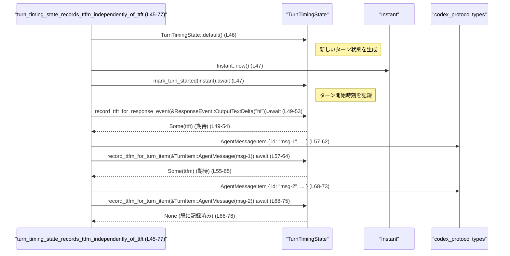

# core/src/turn_timing_tests.rs コード解説

## 0. ざっくり一言

このファイルは、会話ターンに関するタイミング情報（ttft / ttfm）を管理する `TurnTimingState` と、レスポンス項目から「ターンの最初の出力かどうか」を判定する `response_item_records_turn_ttft` の挙動をテストするモジュールです（`turn_timing_tests.rs:L13-77`, `L79-126`）。  

---

## 1. このモジュールの役割

### 1.1 概要

- このモジュールは、**ターン開始からの各種イベントに対して ttft / ttfm を一度だけ記録する**という挙動を `TurnTimingState` が満たしているかを検証します（`turn_timing_tests.rs:L14-42`, `L45-77`）。
- また、`codex_protocol::models::ResponseItem` の各バリアントに対して、**どのレスポンスが「最初の出力」とみなされ ttft のトリガーになるか**を `response_item_records_turn_ttft` が正しく判定しているかをテストします（`turn_timing_tests.rs:L79-126`）。

ここで ttft/ttfm が具体的に何秒を指すかなどの定義は、このファイルには現れません。命名と `Instant` の利用から、ターン開始から特定イベントまでの経過時間を扱う指標と解釈できますが、厳密な定義は不明です。

### 1.2 アーキテクチャ内での位置づけ

このテストモジュールが利用している主要なコンポーネントの関係は、次のようになります。

```mermaid
graph TD
    subgraph core::turn_timing_tests (L1-127)
        TTTests[turn_timing_tests.rs]
    end

    TTTests -->|uses| TurnTimingState["super::TurnTimingState\n(定義は別ファイル)"]
    TTTests -->|uses| ResponseEvent["crate::ResponseEvent\n(定義は別ファイル)"]
    TTTests -->|uses| response_item_records_turn_ttft["super::response_item_records_turn_ttft\n(定義は別ファイル)"]

    TTTests -->|uses| TurnItem["codex_protocol::items::TurnItem"]
    TTTests -->|uses| AgentMessageItem["codex_protocol::items::AgentMessageItem"]

    TTTests -->|uses| ResponseItem["codex_protocol::models::ResponseItem"]
    TTTests -->|uses| ContentItem["codex_protocol::models::ContentItem"]
    TTTests -->|uses| FunctionCallOutputPayload["codex_protocol::models::FunctionCallOutputPayload"]
```

- `TurnTimingState` と `ResponseEvent` は crate 内のターンタイミング実装に属する型で、テスト対象のコアです（`turn_timing_tests.rs:L9-11`, `L14-77`）。
- `ResponseItem` / `ContentItem` / `FunctionCallOutputPayload` / `TurnItem` / `AgentMessageItem` は `codex_protocol` クレートからの型で、レスポンスやエージェントメッセージを表現します（`turn_timing_tests.rs:L1-5`, `L57-73`, `L81-88`, `L91-99`, `L99-107`, `L112-120`, `L122-125`）。

### 1.3 設計上のポイント（テスト観点）

コードから読み取れるテスト設計上の特徴は次のとおりです。

- **非同期メソッドのテスト**  
  - `TurnTimingState` のメソッドは `async fn` であり、`#[tokio::test]` 属性付きの非同期テストで検証されています（`turn_timing_tests.rs:L13-15`, `L23-24`, `L30-33`, `L37-40`, `L44-47`, `L49-53`, `L55-64`, `L66-75`）。
  - これにより、将来的に内部で I/O や並行処理を行う実装にも対応できる形でテストされています。

- **状態を持つオブジェクトの振る舞いテスト**  
  - 1 つの `TurnTimingState` インスタンスに対して複数のメソッドを順に呼び出し、「1ターンにつき1回だけ値を返す」という契約を検証しています（`turn_timing_tests.rs:L15-41`, `L46-76`）。

- **外部プロトコルモデルに対する判定ロジック**  
  - `ResponseItem` の各バリアントについて、`response_item_records_turn_ttft` が `true/false` を返す条件を網羅的にテストしています（`turn_timing_tests.rs:L79-107`, `L110-126`）。

- **言語固有安全性**  
  - いずれの API も参照 `&ResponseEvent` / `&TurnItem` / `&ResponseItem` を受け取る形で利用されており、所有権移動を伴わない安全な借用によりテストが書かれています（`turn_timing_tests.rs:L18`, `L26`, `L32`, `L38`, `L51`, `L57`, `L68`, `L81-82`, `L90-92`, `L99-100`, `L112`, `L121-122`）。

---

## 2. 主要な機能一覧

このテストファイルが検証している主要な機能（テストケース単位）は次の通りです。

- `turn_timing_state_records_ttft_only_once_per_turn`:  
  - `TurnTimingState` が、1ターンにつき ttft を 1 回だけ記録し、それ以外の呼び出しでは `None` を返すことを検証します（`turn_timing_tests.rs:L14-42`）。

- `turn_timing_state_records_ttfm_independently_of_ttft`:  
  - ttft が既に記録された後でも、ttfm は独立して 1 回だけ記録されること（最初の `TurnItem::AgentMessage` に対してのみ `Some` を返すこと）を検証します（`turn_timing_tests.rs:L45-77`）。

- `response_item_records_turn_ttft_for_first_output_signals`:  
  - `ResponseItem::FunctionCall` / `CustomToolCall` / 非空の `Message(OutputText)` が「最初の出力シグナル」として ttft の対象になることを確認します（`turn_timing_tests.rs:L79-107`）。

- `response_item_records_turn_ttft_ignores_empty_non_output_items`:  
  - 空文字の `Message(OutputText)` や `FunctionCallOutput` は ttft の対象として扱われないことを確認します（`turn_timing_tests.rs:L110-126`）。

### 2.1 コンポーネントインベントリー（関数・型）

#### このファイルで定義される関数（テスト）

| 名前 | 種別 | 役割 / 用途 | 定義箇所 |
|------|------|-------------|----------|
| `turn_timing_state_records_ttft_only_once_per_turn` | 非同期テスト関数 (`#[tokio::test]`) | `TurnTimingState::record_ttft_for_response_event` がターンごとに一度だけ `Some` を返すこと、およびターン開始前や 2 回目以降は `None` を返すことを検証します。 | `turn_timing_tests.rs:L13-42` |
| `turn_timing_state_records_ttfm_independently_of_ttft` | 非同期テスト関数 (`#[tokio::test]`) | ttft 記録の有無に関係なく、`record_ttfm_for_turn_item` が 1ターンにつき最初のエージェントメッセージに対してだけ `Some` を返すことを検証します。 | `turn_timing_tests.rs:L44-77` |
| `response_item_records_turn_ttft_for_first_output_signals` | 同期テスト関数 (`#[test]`) | 一部の `ResponseItem` バリアント（関数呼び出し、カスタムツール呼び出し、非空のメッセージ）が ttft の対象として `true` になることを検証します。 | `turn_timing_tests.rs:L79-108` |
| `response_item_records_turn_ttft_ignores_empty_non_output_items` | 同期テスト関数 (`#[test]`) | 空文字メッセージや `FunctionCallOutput` が ttft 対象にならず `false` を返すことを検証します。 | `turn_timing_tests.rs:L110-126` |

#### このファイルで利用される外部コンポーネント

| 名前 | 種別 | 役割 / 用途 | このファイルでの利用箇所 |
|------|------|-------------|--------------------------|
| `TurnTimingState` | 構造体（推定） | ターンごとの ttft/ttfm 計測状態を保持し、記録メソッドを提供します。定義は親モジュールにあります。 | 生成と利用: `turn_timing_tests.rs:L15`, `L23-41`, `L46-76` |
| `TurnTimingState::default` | 関連関数 | 初期状態の `TurnTimingState` を生成します。 | `turn_timing_tests.rs:L15`, `L46` |
| `TurnTimingState::mark_turn_started` | 非同期メソッド | 任意の `Instant` を受け取り、「ターン開始」を記録します。 | `turn_timing_tests.rs:L23`, `L47` |
| `TurnTimingState::record_ttft_for_response_event` | 非同期メソッド | `ResponseEvent` を受け取り、条件に応じて ttft を 1 度だけ `Some` として返します。 | `turn_timing_tests.rs:L18-21`, `L26-29`, `L32-41`, `L51-53` |
| `TurnTimingState::record_ttfm_for_turn_item` | 非同期メソッド | `TurnItem`（ここでは `TurnItem::AgentMessage`）を受け取り、条件に応じて ttfm を 1 度だけ `Some` として返します。 | `turn_timing_tests.rs:L57-65`, `L68-75` |
| `ResponseEvent` | 列挙体（推定） | モデル出力ストリーム中のイベント（`Created`, `OutputTextDelta` など）を表します。 | 利用: `turn_timing_tests.rs:L18`, `L26`, `L32`, `L38`, `L51` |
| `TurnItem` | 列挙体 | ターン内の様々なアイテムを表します。ここでは `TurnItem::AgentMessage` のみ使用されています。 | `turn_timing_tests.rs:L57`, `L68` |
| `AgentMessageItem` | 構造体 | エージェントのメッセージ（id, content, phase, memory_citation）を表します。 | インスタンス生成: `turn_timing_tests.rs:L57-62`, `L68-73` |
| `ResponseItem` | 列挙体 | モデルからクライアントへのレスポンス（関数呼び出し、ツール呼び出し、メッセージ、関数呼び出し結果など）を表します。 | インスタンス生成: `turn_timing_tests.rs:L82-88`, `L91-97`, `L99-107`, `L112-120`, `L122-125` |
| `ContentItem::OutputText` | 列挙体バリアント | メッセージ内のテキスト出力を表します。 | `turn_timing_tests.rs:L102-104`, `L115-117` |
| `FunctionCallOutputPayload::from_text` | 関連関数 | 関数呼び出し結果ペイロードをテキストから生成します。 | `turn_timing_tests.rs:L124` |
| `response_item_records_turn_ttft` | 関数 | `ResponseItem` が「ターンの最初の出力」として ttft を記録すべきかどうかを判定し、`bool` を返します。 | `turn_timing_tests.rs:L81`, `L90`, `L99`, `L112`, `L121` |
| `Instant` | 構造体（標準ライブラリ） | 単調増加する時刻を表し、ターン開始時刻の記録に利用されています。 | `turn_timing_tests.rs:L7`, `L23`, `L47` |
| `assert_eq!`, `assert!` | マクロ | テスト内で期待値を検証するためのアサーションに利用されています。 | `turn_timing_tests.rs:L16-21`, `L30-35`, `L36-41`, `L49-54`, `L55-65`, `L66-76`, `L81-88`, `L90-97`, `L99-107`, `L112-120`, `L121-126` |

---

## 3. 公開 API と詳細解説

### 3.1 型一覧（構造体・列挙体など）

このファイル自体には新しい型定義はありません。すべて外部モジュールからインポートされた型を利用してテストしています（`turn_timing_tests.rs:L1-5`, `L9-11`）。

主要な外部型（詳細は 2.1 参照）:

| 名前 | 種別 | 備考 |
|------|------|------|
| `TurnTimingState` | 構造体（推定） | ターンタイミング状態の保持。定義は親モジュールにあり、このチャンクには現れません。 |
| `ResponseEvent` | 列挙体（推定） | 応答ストリーム内のイベント種別。定義は別ファイル。 |
| `TurnItem` / `AgentMessageItem` | 列挙体 / 構造体 | エージェントメッセージを含むターンアイテム。 |
| `ResponseItem` / `ContentItem` / `FunctionCallOutputPayload` | 列挙体 / 列挙体 / 構造体 | レスポンス全体とその内容を表現。 |

### 3.2 重要関数の詳細

ここでは、テストから「コア API」とみなせる 4 つの関数・メソッドについて、テストから読み取れる契約を整理します。  
※引数名はコードからは分からないため、以下では説明のための仮称を付けています。

---

#### `TurnTimingState::mark_turn_started(instant: Instant)` （async）

**概要**

- ターンの開始時刻を記録し、ttft/ttfm の計測を開始可能な状態にします（`turn_timing_tests.rs:L23`, `L47`）。

**引数**

| 引数名（仮） | 型 | 説明 |
|-------------|----|------|
| `instant` | `Instant` | ターン開始を記録する時刻。`Instant::now()` が渡されています（`turn_timing_tests.rs:L23`, `L47`）。 |

**戻り値**

- `async fn` であるため、戻り値は `impl Future<Output = ()>` の形と推定されます。  
  テストでは `.await` 結果を使用していないため、実際の戻り値の具体的な型・値はこのファイルからは分かりません（`turn_timing_tests.rs:L23`, `L47`）。

**内部処理の流れ（テストから推測される契約）**

テストから読み取れる期待契約は次の通りです。

1. `TurnTimingState::default()` 直後に `record_ttft_for_response_event` を呼ぶと `None` が返る（ターン開始前のイベントは ttft を記録しない）（`turn_timing_tests.rs:L15-21`）。
2. `mark_turn_started(Instant::now()).await` を呼んだ後に初めて `record_ttft_for_response_event` を呼ぶと `Some(_)` が返る（`turn_timing_tests.rs:L23-35`）。
3. 以上から、`mark_turn_started` は「新しいターンの開始」を明示するために必須の呼び出しと解釈できます。

**Examples（使用例）**

テストと同等の最小例です。

```rust
use std::time::Instant;

// state は TurnTimingState::default() で生成されているとする
let state = TurnTimingState::default();                        // 初期状態を生成

state.mark_turn_started(Instant::now()).await;                 // ターン開始を記録

let ttft = state
    .record_ttft_for_response_event(&ResponseEvent::OutputTextDelta("hi".to_string()))
    .await;                                                    // 最初の出力イベント

assert!(ttft.is_some());                                       // ターン開始後の最初の ttft は Some になる
```

**Errors / Panics**

- このテスト内では `mark_turn_started` による panic やエラーは発生していません（`turn_timing_tests.rs:L23`, `L47`）。
- `Result` ではなく `()` を返していると推定されるため、エラーが戻り値で表現されている可能性は低いですが、実装はこのチャンクには現れていません。

**Edge cases（エッジケース）**

- `mark_turn_started` を呼ばずに `record_ttft_for_response_event` を呼ぶと `None` が返る（`turn_timing_tests.rs:L16-21`）。
- 同じターン中に複数回 `mark_turn_started` を呼ぶ挙動や、過去の `Instant` を渡した場合の挙動は、このチャンクには現れません。

**使用上の注意点**

- ttft/ttfm を正しく記録するには、**各ターンの開始時に必ず `mark_turn_started` を呼び出す必要がある**と読み取れます（`turn_timing_tests.rs:L23`, `L47`）。
- 非同期メソッドのため、`.await` を忘れるとコンパイルエラーになります。Rust の async/await に沿って、`tokio` などのランタイム上で実行する必要があります（`turn_timing_tests.rs:L13`, `L44`）。

---

#### `TurnTimingState::record_ttft_for_response_event(event: &ResponseEvent) -> Option<_>` （async）

**概要**

- あるターンにおけるレスポンスイベント（`ResponseEvent`）に基づいて ttft を記録し、**ターンにつき 1 回だけ `Some` を返す**メソッドです（`turn_timing_tests.rs:L14-42`, `L45-54`）。

**引数**

| 引数名（仮） | 型 | 説明 |
|-------------|----|------|
| `event` | `&ResponseEvent` | 応答ストリーム内のイベント。`OutputTextDelta` や `Created` が渡されています（`turn_timing_tests.rs:L18`, `L26`, `L32`, `L38`, `L51`）。 |

**戻り値**

- 非同期メソッドなので、戻り値は `impl Future<Output = Option<T>>` 形と推定されます。
- `.await` の結果として `Option<_>` が得られ、`is_some()` や `assert_eq!(.., None)` で検査されています（`turn_timing_tests.rs:L16-21`, `L30-35`, `L36-41`, `L49-54`）。
- `T` の具体的な型（おそらく何らかの ttft 測定結果）は、このチャンクからは分かりません。

**内部処理の流れ（テストから読み取れる挙動）**

テストから読み取れる期待挙動:

1. **ターン開始前の呼び出し**  
   - `TurnTimingState::default()` 直後に `OutputTextDelta("hi")` を渡すと `None` を返します（`turn_timing_tests.rs:L15-21`）。
   - → 「ターン開始前は ttft を記録しない」という契約。

2. **ターン開始後の特定イベント**  
   - `mark_turn_started` 呼び出し後に `ResponseEvent::Created` を渡しても `None` を返します（`turn_timing_tests.rs:L23-29`）。
   - 同じターン中に `OutputTextDelta("hi")` を渡すと `Some(_)` を返します（`turn_timing_tests.rs:L30-35`）。
   - 再度 `OutputTextDelta("again")` を渡すと `None` を返します（`turn_timing_tests.rs:L36-41`）。

3. **ttfm と独立**  
   - 別テストでは、ttft が `Some` になった後でも、`record_ttfm_for_turn_item` は独立して `Some` を返すことが検証されています（`turn_timing_tests.rs:L49-65`）。  
     これは ttft 記録が他のメトリクスに影響しないことを示します。

**Examples（使用例）**

テストと同様の利用形態を簡略化した例です。

```rust
// state は既に mark_turn_started を呼び出してあるとする
let event = ResponseEvent::OutputTextDelta("hello".to_string()); // 出力のデルタイベント
let ttft_opt = state
    .record_ttft_for_response_event(&event)
    .await;                                                     // async メソッドを await

if let Some(ttft) = ttft_opt {
    // ここで ttft をログやメトリクスに記録するなどの処理を行う想定
} else {
    // すでに記録済み、もしくは ttft 対象外のイベント
}
```

**Errors / Panics**

- テストでは、どの入力に対しても panic は発生していません（全テストが `assert!` / `assert_eq!` のみで終了）（`turn_timing_tests.rs:L14-42`, `L45-77`）。
- 戻り値が `Option` であり、`Result` ではないため、エラーは戻り値では表現されていません。  
  実装内でどのような失敗ケースを想定しているかは、このチャンクには現れません。

**Edge cases（エッジケース）**

- **ターン未開始**: `mark_turn_started` 前に呼ぶと必ず `None`（`turn_timing_tests.rs:L16-21`）。
- **イベント種別**:
  - `ResponseEvent::Created` は ttft を記録しない（`None`）（`turn_timing_tests.rs:L25-29`）。
  - `ResponseEvent::OutputTextDelta` は、ターン開始後かつ未記録であれば `Some` を返し、2 回目以降は `None`（`turn_timing_tests.rs:L30-41`）。
- その他の `ResponseEvent` バリアント（もしあれば）の扱いはこのチャンクには現れません。

**使用上の注意点**

- ターン開始前に呼んでも ttft は記録されないため、**必ず `mark_turn_started` の後に呼び出す**必要があります（`turn_timing_tests.rs:L15-23`）。
- 1 ターン内で何度呼んでも `Some` になるのは最初の対象イベントのみであるため、  
  「最初の `Some` を記録し、それ以降は無視する」という前提で利用する設計が妥当です（`turn_timing_tests.rs:L30-41`）。

---

#### `TurnTimingState::record_ttfm_for_turn_item(item: &TurnItem) -> Option<_>` （async）

**概要**

- `TurnItem` に基づいて ttfm を記録し、**1ターンにつき最初の対象 `TurnItem` に対してのみ `Some` を返す**メソッドです（`turn_timing_tests.rs:L55-65`, `L66-76`）。

**引数**

| 引数名（仮） | 型 | 説明 |
|-------------|----|------|
| `item` | `&TurnItem` | ターン内のアイテム。テストでは `TurnItem::AgentMessage(AgentMessageItem { .. })` が渡されています（`turn_timing_tests.rs:L57-62`, `L68-73`）。 |

**戻り値**

- `impl Future<Output = Option<T>>` 形と推定されます。
- `.await` の結果として `Option<_>` が得られ、`is_some()` と `assert_eq!(.., None)` でチェックされています（`turn_timing_tests.rs:L55-65`, `L66-76`）。

**内部処理の流れ（テストから読み取れる挙動）**

1. ターン開始 (`mark_turn_started`) と ttft 記録 (`record_ttft_for_response_event`) の後に、  
   最初の `TurnItem::AgentMessage` に対して `Some(_)` を返します（`turn_timing_tests.rs:L47-48`, `L49-54`, `L55-65`）。
2. 同じターン内で 2 回目の `TurnItem::AgentMessage` に対しては `None` を返します（`turn_timing_tests.rs:L66-76`）。
3. ttft を先に記録していても、ttfm の `Some` / `None` の判定には影響しないことがテストから読み取れます（`turn_timing_tests.rs:L49-65`）。

**Examples（使用例）**

```rust
// すでに mark_turn_started と record_ttft_for_response_event を呼び終えているとする

let item = TurnItem::AgentMessage(AgentMessageItem {
    id: "msg-1".to_string(),
    content: Vec::new(),
    phase: None,
    memory_citation: None,
});

let ttfm_opt = state
    .record_ttfm_for_turn_item(&item)
    .await;                    // 最初の AgentMessage に対して呼ぶ

assert!(ttfm_opt.is_some());   // ttfm が記録される
```

**Errors / Panics**

- テスト範囲では panic は確認されていません（`turn_timing_tests.rs:L45-77`）。
- `Result` ではなく `Option` を返すため、異常系は戻り値としては表現されていないと考えられますが、実装詳細はこのチャンクには現れません。

**Edge cases（エッジケース）**

- 最初の対象 `TurnItem`（ここでは最初の `AgentMessage`）にだけ `Some` を返し、2 回目以降は `None`（`turn_timing_tests.rs:L55-65`, `L66-76`）。
- `TurnItem` の他のバリアント（ツール呼び出しなど）がどのように扱われるかは、このチャンクには現れません。

**使用上の注意点**

- ttfm を一度だけ記録したい場合には、**`Some` を返した最初の呼び出しだけを採用し、それ以降は無視する**設計にする必要があります（`turn_timing_tests.rs:L55-76`）。
- ttft 記録とは独立して動作するため、アプリケーション側で ttft と ttfm を混同しないように注意が必要です（`turn_timing_tests.rs:L49-65`）。

---

#### `response_item_records_turn_ttft(item: &ResponseItem) -> bool`

**概要**

- `ResponseItem` がターンの「最初の出力」として ttft 計測の対象となるかを判定し、`true` / `false` を返します（`turn_timing_tests.rs:L79-107`, `L110-126`）。

**引数**

| 引数名（仮） | 型 | 説明 |
|-------------|----|------|
| `item` | `&ResponseItem` | モデルから返されるレスポンス項目。`FunctionCall` / `CustomToolCall` / `Message` / `FunctionCallOutput` などのバリアントが含まれます（`turn_timing_tests.rs:L82-88`, `L91-97`, `L99-107`, `L112-120`, `L122-125`）。 |

**戻り値**

- `bool`  
  - `true`: ttft を記録すべき「最初の出力シグナル」とみなされる。
  - `false`: ttft 対象ではない。

**内部処理の流れ（テストから読み取れる挙動）**

テストにより、少なくとも次のような分岐が存在すると解釈できます。

1. `ResponseItem::FunctionCall { .. }` → `true`（`turn_timing_tests.rs:L81-89`）
2. `ResponseItem::CustomToolCall { .. }` → `true`（`turn_timing_tests.rs:L90-98`）
3. `ResponseItem::Message` の場合:
   - `content` に `ContentItem::OutputText { text }` が含まれ、その `text` が非空文字列 → `true`（`turn_timing_tests.rs:L99-107`）。
   - `ContentItem::OutputText { text: String::new() }` のように空文字 → `false`（`turn_timing_tests.rs:L112-118`）。
4. `ResponseItem::FunctionCallOutput { .. }` → `false`（`turn_timing_tests.rs:L121-126`）。

他のバリアントが存在するか、また存在する場合どのような扱いになるかは、このチャンクには現れません。

**Examples（使用例）**

テスト相当の利用例です。

```rust
let item = ResponseItem::Message {
    id: None,
    role: "assistant".to_string(),
    content: vec![ContentItem::OutputText {
        text: "hello".to_string(),     // 非空のテキスト
    }],
    end_turn: None,
    phase: None,
};

if response_item_records_turn_ttft(&item) {
    // この ResponseItem を契機に ttft を記録する想定
}
```

**Errors / Panics**

- 戻り値が `bool` であり、例外やエラー型は利用されていません。
- テスト内では panic は発生せず、全てのケースで `assert!` が成功しています（`turn_timing_tests.rs:L79-107`, `L110-126`）。

**Edge cases（エッジケース）**

- **空文字テキスト**: `Message(OutputText { text: "" })` は ttft として数えられない（`false`）（`turn_timing_tests.rs:L112-118`）。
- **機能呼び出し結果**: `FunctionCallOutput` は ttft 対象ではない（`turn_timing_tests.rs:L121-126`）。
- **最初のシグナルのみ**: 複数の `ResponseItem` のうちどれを「最初」とするかは、この関数単体ではなく呼び出し側のロジックに依存します（このチャンクには現れません）。

**使用上の注意点**

- この関数は「その `ResponseItem` が ttft の候補かどうか」だけを判定し、**ターンごとの一意性（1回だけ記録すること）は呼び出し側（`TurnTimingState` など）の責務**である可能性があります。
- 出力がストリームで届く場合は、**最初に `true` を返したアイテムだけを ttft の起点として扱う**のが自然な利用方法と考えられます。

---

### 3.3 その他の関数

テスト関数自体はライブラリとしての公開 API ではありませんが、挙動を理解するための重要な仕様書的役割を持ちます。

| 関数名 | 役割（1 行） | 定義箇所 |
|--------|--------------|----------|
| `turn_timing_state_records_ttft_only_once_per_turn` | ターン開始前後および複数回呼び出し時の ttft 記録の有無を検証します。 | `turn_timing_tests.rs:L13-42` |
| `turn_timing_state_records_ttfm_independently_of_ttft` | ttft 記録後でも、最初のメッセージに対してのみ ttfm が記録されることを検証します。 | `turn_timing_tests.rs:L44-77` |
| `response_item_records_turn_ttft_for_first_output_signals` | 一部の `ResponseItem` が ttft 対象として認識されることを検証します。 | `turn_timing_tests.rs:L79-108` |
| `response_item_records_turn_ttft_ignores_empty_non_output_items` | 空テキストや関数結果が ttft 対象にならないことを検証します。 | `turn_timing_tests.rs:L110-126` |

---

## 4. データフロー

ここでは、代表的な処理シナリオとして **ttft と ttfm の両方を記録する流れ**（`turn_timing_state_records_ttfm_independently_of_ttft`）を図示します。

### 4.1 `turn_timing_state_records_ttfm_independently_of_ttft (L45-77)` のフロー

このテストでは、以下の順序でデータが流れます（`turn_timing_tests.rs:L45-77`）。

1. `TurnTimingState::default()` で状態を生成する（`L46`）。
2. `mark_turn_started(Instant::now()).await` でターン開始を記録する（`L47`）。
3. `record_ttft_for_response_event(OutputTextDelta("hi"))` を呼び、ttft を記録する（`L49-54`）。
4. `record_ttfm_for_turn_item(AgentMessage(msg-1))` を呼び、ttfm を記録する（`L55-65`）。
5. 同じターン内で 2 つ目の `AgentMessage(msg-2)` を渡すと、ttfm は記録済みのため `None` が返る（`L66-76`）。



このように、**ttft と ttfm はそれぞれ別々のメソッドで記録されつつ、ターン単位で一度だけ `Some` を返す**というデータフローが確認できます。

---

## 5. 使い方（How to Use）

このファイルはテストコードですが、その呼び出し方から、`TurnTimingState` および `response_item_records_turn_ttft` の基本的な利用パターンを読み取ることができます。

### 5.1 基本的な使用方法（テストからの抽出）

テストの流れを基にした典型的な利用フローは次の通りです。

```rust
use std::time::Instant;

// 1. ターン状態を初期化する
let state = TurnTimingState::default();                    // turn_timing_tests.rs:L15, L46

// 2. ターン開始時に時刻を記録する
state.mark_turn_started(Instant::now()).await;             // turn_timing_tests.rs:L23, L47

// 3. 応答イベント（ResponseEvent）ごとに ttft を記録する
let event = ResponseEvent::OutputTextDelta("hi".to_string());
let ttft_opt = state
    .record_ttft_for_response_event(&event)
    .await;                                                // turn_timing_tests.rs:L18-21, L30-35, L49-54

if let Some(ttft) = ttft_opt {
    // ttft をメトリクスに送信する、など
}

// 4. ターンアイテム（TurnItem）ごとに ttfm を記録する
let item = TurnItem::AgentMessage(AgentMessageItem {
    id: "msg-1".to_string(),
    content: Vec::new(),
    phase: None,
    memory_citation: None,
});

let ttfm_opt = state
    .record_ttfm_for_turn_item(&item)
    .await;                                                // turn_timing_tests.rs:L57-65, L68-75

if let Some(ttfm) = ttfm_opt {
    // ttfm をメトリクスに送信する、など
}
```

このコードは、テストで行っていることを実用的な形でまとめたものです。

### 5.2 よくある使用パターン

1. **ストリーム処理と組み合わせた ttft 判定**

   - `ResponseItem` のストリームに対して、`response_item_records_turn_ttft` で「ttft 候補かどうか」を判定し、最初に `true` になったものを `TurnTimingState::record_ttft_for_response_event` と組み合わせて利用する、というパターンが考えられます。
   - テストでは直接この組み合わせは書かれていませんが、ttft 判定関数と ttft 記録関数が別れていることから、そのような責務分割が想定されていると解釈できます（`turn_timing_tests.rs:L14-42`, `L79-107`）。

2. **非同期テスト / 非同期コードでの利用**

   - `#[tokio::test]` を利用することで、`async fn` メソッドを自然にテスト・使用できるパターンが示されています（`turn_timing_tests.rs:L13`, `L44`）。

### 5.3 よくある間違い（テストから推測される誤用パターン）

テストが明示的に「誤用」を示しているわけではありませんが、**テストがチェックしている条件**は、そのまま誤用の例としても解釈できます。

```rust
// 誤りの可能性がある例: mark_turn_started を呼ばずに ttft を記録しようとする
let state = TurnTimingState::default();
// let ttft = state
//     .record_ttft_for_response_event(&ResponseEvent::OutputTextDelta("hi".to_string()))
//     .await;
// ttft は None になり、意図した ttft が記録されない（turn_timing_tests.rs:L15-21）

// 正しい例: 先に mark_turn_started を呼ぶ
state.mark_turn_started(Instant::now()).await;
let ttft = state
    .record_ttft_for_response_event(&ResponseEvent::OutputTextDelta("hi".to_string()))
    .await;
// このとき初めて Some になることがテストされています（turn_timing_tests.rs:L23-35）
```

### 5.4 使用上の注意点（まとめ）

- **ターン開始の明示**:  
  - ttft/ttfm の記録には、必ず `mark_turn_started` を先に呼び出す必要があります（`turn_timing_tests.rs:L15-23`, `L46-47`）。

- **一度だけ記録される性質**:  
  - ttft/ttfm の各メソッドは、「そのターンにおける最初の対象イベント」に対してのみ `Some` を返すことがテストから分かります（`turn_timing_tests.rs:L30-41`, `L55-76`）。
  - 呼び出し側は、最初の `Some` を記録し、以降の `None` をスキップする実装を行う必要があります。

- **参照のライフタイムと所有権**:  
  - すべての API が `&ResponseEvent` / `&TurnItem` / `&ResponseItem` を取るため、所有権の移動なしに安全に共有できます（`turn_timing_tests.rs:L18`, `L26`, `L32`, `L38`, `L51`, `L57`, `L68`, `L81-82`, `L90-92`, `L99-100`, `L112`, `L121-122`）。

- **並行性**:  
  - このテストでは `TurnTimingState` を単一スレッドで利用しており、同一インスタンスを複数タスクから同時に操作するケースは検証されていません。  
    並行利用の可否は、このチャンクには現れません。

---

## 6. 変更の仕方（How to Modify）

このファイルはテストコードであり、仕様変更や機能追加の際にはテストの更新が重要になります。

### 6.1 新しい機能を追加する場合

- **新しい `ResponseItem` バリアントを ttft 対象にしたい場合**:
  1. 親モジュール（`super`）側で `response_item_records_turn_ttft` の判定ロジックを拡張する（定義はこのチャンクには現れません）。
  2. それに対応するテストケースを本ファイルに追加し、`assert!(response_item_records_turn_ttft(&ResponseItem::...))` の形で期待値を検証する（`turn_timing_tests.rs:L79-107`, `L110-126` を参考）。

- **新しいメトリクス（例: ttx など）を `TurnTimingState` に追加する場合**:
  1. `TurnTimingState` に新しい記録メソッドを追加する（定義ファイルは不明）。
  2. 本テストファイルに、`turn_timing_state_records_*` と同様の構造を持つ新しい非同期テストを追加し、「ターンごとに一度だけ `Some` を返す」などの契約を検証する（`turn_timing_tests.rs:L13-42`, `L44-77` を参考）。

### 6.2 既存の機能を変更する場合

- **影響範囲の確認**:
  - `TurnTimingState` の挙動を変更する際は、本ファイルの ttft/ttfm テスト（`turn_timing_tests.rs:L13-77`）が期待する契約と整合しているかを確認する必要があります。
  - `response_item_records_turn_ttft` の判定条件を変える場合は、`ResponseItem` 関連のテスト（`turn_timing_tests.rs:L79-107`, `L110-126`）との整合性を確認します。

- **注意すべき契約**:
  - ttft/ttfm がターンごとに一度だけ記録されること（`Option` の最初の `Some` のみが意味を持つこと）は、本ファイルが明示的に依存している契約です（`turn_timing_tests.rs:L30-41`, `L55-76`）。
  - `ResponseItem` のどのバリアントが ttft の対象になるかも、コアな仕様としてテスト化されています（`turn_timing_tests.rs:L79-107`, `L110-126`）。

- **テストの更新**:
  - 仕様を変えた場合は、まず既存テストを見直し、期待値の変更が必要かどうかを検討します。
  - 変更後に全テストを実行し、`#[tokio::test]` を含む非同期テストも含めてグリーンであることを確認します。

---

## 7. 関連ファイル

このモジュールと密接に関係するファイル・モジュール（テストコードから分かる範囲）は次の通りです。

| パス / モジュール | 役割 / 関係 |
|-------------------|------------|
| 親モジュール（`super`、具体的なファイル名は不明） | `TurnTimingState` および `response_item_records_turn_ttft` を定義しており、本テストから直接呼び出されています（`turn_timing_tests.rs:L9-10`, `L15-41`, `L46-76`, `L81`, `L90`, `L99`, `L112`, `L121`）。 |
| `crate::ResponseEvent` を定義するモジュール（ファイル名不明） | 応答ストリーム内のイベント種別（`Created`, `OutputTextDelta` など）を定義しており、ttft 記録の対象イベントを表現します（`turn_timing_tests.rs:L11`, `L18`, `L26`, `L32`, `L38`, `L51`）。 |
| `codex_protocol::items` | `TurnItem`, `AgentMessageItem` を定義し、ttfm テストで使用されるエージェントメッセージ表現を提供します（`turn_timing_tests.rs:L1-2`, `L57-62`, `L68-73`）。 |
| `codex_protocol::models` | `ResponseItem`, `ContentItem`, `FunctionCallOutputPayload` を定義し、ttft 判定の対象となるレスポンス構造を提供します（`turn_timing_tests.rs:L3-5`, `L82-88`, `L91-97`, `L99-107`, `L112-120`, `L122-125`）。 |

このチャンク以外の実装ファイルのパスや内部構造については、コードが提示されていないため不明です。
