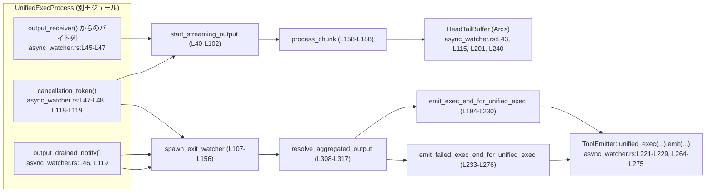
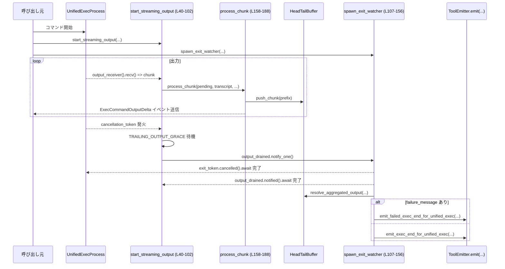

# core/src/unified_exec/async_watcher.rs

## 0. ざっくり一言

PTY の標準出力を非同期で監視し、  

- UTF-8 境界とサイズ上限を守りながら逐次イベントを流すストリーマ  
- プロセス終了時に最終的な出力を集約して ExecCommandEnd イベントを送るウォッチャ  
を提供するモジュールです（`async_watcher.rs:L37-L102`, `async_watcher.rs:L104-L156`）。

---

## 1. このモジュールの役割

### 1.1 概要

このモジュールは **unified exec（外部コマンド実行）** のために、次の二つの問題を解決します。

- PTY から出続けるバイト列を、UTF-8 文字境界とペイロードサイズ制限を守りつつ、`ExecCommandOutputDelta` イベントとして逐次送信すること  
  （`start_streaming_output`, `process_chunk`, `split_valid_utf8_prefix_with_max`  
  `async_watcher.rs:L37-L102`, `async_watcher.rs:L158-L188`, `async_watcher.rs:L282-L305`）

- プロセス終了時に、これまでの出力を `HeadTailBuffer` から集約し、成功・失敗に応じた `ExecCommandEnd` 系イベントを 1 回だけ送信すること  
  （`spawn_exit_watcher`, `emit_exec_end_for_unified_exec`, `emit_failed_exec_end_for_unified_exec`, `resolve_aggregated_output`  
  `async_watcher.rs:L104-L156`, `async_watcher.rs:L190-L230`, `async_watcher.rs:L232-L276`, `async_watcher.rs:L308-L317`）

### 1.2 アーキテクチャ内での位置づけ

主要なコンポーネントの関係は以下のようになっています。



- `UnifiedExecProcess` は PTY 出力やキャンセル通知を提供するプロセスラッパです（実体は別ファイル）。
- `start_streaming_output` は PTY 出力を監視して `HeadTailBuffer` とイベントストリームに反映します。
- `spawn_exit_watcher` はプロセス終了と「出力が出尽くした」ことを待ち、最終イベントを送ります。
- どちらも同じ `HeadTailBuffer` を共有することで「リアルタイム出力」と「最終集約出力」を一貫させています。

### 1.3 設計上のポイント

コードから読み取れる設計上の特徴です。

- **責務分割**
  - ストリーミング（リアルタイム出力）と終了処理（集約・終端イベント）は別タスクに分離  
    （`start_streaming_output`, `spawn_exit_watcher` `async_watcher.rs:L40-L102`, `async_watcher.rs:L107-L156`）
  - UTF-8 分割ロジックは `split_valid_utf8_prefix_with_max` に切り出し（`async_watcher.rs:L282-L305`）

- **非同期・並行性**
  - どちらも `tokio::spawn` によりバックグラウンドタスクとして動作（`async_watcher.rs:L53`, `async_watcher.rs:L121`）
  - 出力バッファ `HeadTailBuffer` は `Arc<Mutex<_>>` で共有・保護（`async_watcher.rs:L43`, `async_watcher.rs:L160`, `async_watcher.rs:L201`, `async_watcher.rs:L240`）
  - `CancellationToken` と通知 (`output_drained_notify`) を組み合わせて、「プロセス終了」かつ「出力読み取り完了」の順序を保証（`async_watcher.rs:L61-L75`, `async_watcher.rs:L118-L124`）

- **エラーハンドリング方針**
  - PTY 出力の受信遅延 (`RecvError::Lagged`) は黙ってスキップし処理継続（`async_watcher.rs:L78-L82`）
  - チャンネルクローズ (`RecvError::Closed`) 時に通知を送り終了（`async_watcher.rs:L83-L86`）
  - UTF-8 変換は `from_utf8` のテスト＋`from_utf8_lossy` でパニックを避ける（`async_watcher.rs:L290-L291`, `async_watcher.rs:L317`）

- **出力量制限**
  - 1 イベントあたりの最大バイト数を `UNIFIED_EXEC_OUTPUT_DELTA_MAX_BYTES` で制限（`async_watcher.rs:L29-L35`）
  - イベント数も `MAX_EXEC_OUTPUT_DELTAS_PER_CALL` で制限し、転送量を抑制（`async_watcher.rs:L14`, `async_watcher.rs:L174-L176`）

---

## 2. 主要な機能一覧

- PTY 出力の非同期ストリーミング: `start_streaming_output`（`async_watcher.rs:L37-L102`）
- プロセス終了の監視と最終イベント送信: `spawn_exit_watcher`（`async_watcher.rs:L104-L156`）
- 出力チャンクの UTF-8 分割とイベント生成: `process_chunk`（`async_watcher.rs:L158-L188`）
- 成功時の ExecCommandEnd イベント生成: `emit_exec_end_for_unified_exec`（`async_watcher.rs:L190-L230`）
- 失敗時の ExecCommandEnd イベント生成: `emit_failed_exec_end_for_unified_exec`（`async_watcher.rs:L232-L276`）
- UTF-8 先頭プレフィックスの抽出（サイズ制限付き）: `split_valid_utf8_prefix_with_max`（`async_watcher.rs:L282-L305`）
- 集約出力の解決（transcript またはフォールバック）: `resolve_aggregated_output`（`async_watcher.rs:L308-L317`）

---

## 3. 公開 API と詳細解説

### 3.1 型・定数一覧

このファイル内で新たに定義される型はありませんが、重要な定数があります。

| 名前 | 種別 | 役割 / 用途 | 定義位置 |
|------|------|-------------|----------|
| `TRAILING_OUTPUT_GRACE` | `Duration` 定数 | キャンセル後に追加出力を待つ猶予時間（100ms） | `async_watcher.rs:L27-L27` |
| `UNIFIED_EXEC_OUTPUT_DELTA_MAX_BYTES` | `usize` 定数 | 1 つの出力 delta イベントの最大バイト数 | `async_watcher.rs:L29-L35` |

### 3.2 関数詳細（7 件）

#### 3.2.1 `start_streaming_output(process, context, transcript)`

```rust
pub(crate) fn start_streaming_output(
    process: &UnifiedExecProcess,
    context: &UnifiedExecContext,
    transcript: Arc<Mutex<HeadTailBuffer>>,
)
```

**概要**

- `UnifiedExecProcess` から PTY 出力を受信し続け、  
  - `HeadTailBuffer` に追記  
  - 必要に応じて `ExecCommandOutputDelta` イベントを送信  
 するバックグラウンドタスクを起動します（`async_watcher.rs:L37-L102`）。

**引数**

| 引数名 | 型 | 説明 |
|--------|----|------|
| `process` | `&UnifiedExecProcess` | PTY 出力やキャンセル通知を提供する実行プロセスラッパ（`async_watcher.rs:L41`） |
| `context` | `&UnifiedExecContext` | セッション、ターン、call_id など unified exec 呼び出しコンテキスト（`async_watcher.rs:L42`, `async_watcher.rs:L49-L51`） |
| `transcript` | `Arc<Mutex<HeadTailBuffer>>` | 出力を蓄積する共有リングバッファ（`async_watcher.rs:L43`） |

**戻り値**

- 戻り値はなく、その場で `tokio::spawn` により非同期タスクを起動します（`async_watcher.rs:L53`）。

**内部処理の流れ**

1. `process` から出力受信者・通知オブジェクト・キャンセル用トークンを取得（`async_watcher.rs:L45-L47`）。
2. `context` から `session`・`turn`・`call_id` を `Arc` クローン・コピー（`async_watcher.rs:L49-L51`）。
3. `tokio::spawn` で非同期タスクを起動し、以下を実行（`async_watcher.rs:L53-L101`）:
   - `pending` バッファと `emitted_deltas` カウンタ、`grace_sleep`（終了猶予タイマー）を初期化（`async_watcher.rs:L56-L59`）。
   - `tokio::select!` で 3 種のイベントを待つ（`async_watcher.rs:L61-L99`）:
     - **キャンセル発火**（かつ `grace_sleep` が未設定）: 現在時刻＋猶予時間の `deadline` を設定し、`grace_sleep` を開始（`async_watcher.rs:L62-L66`）。
     - **猶予タイマー完了**: `output_drained.notify_one()` を呼び出し、ループを抜ける（`async_watcher.rs:L68-L75`）。
     - **出力受信**: 受信チャンクを `process_chunk` に渡して処理（`async_watcher.rs:L77-L97`）。
       - `Lagged` エラーはスキップ（`async_watcher.rs:L78-L82`）。
       - `Closed` エラーは `output_drained.notify_one()` を呼んで終了（`async_watcher.rs:L83-L86`）。

**Examples（使用例）**

呼び出し元側での典型的な利用イメージです（簡略化で型の定義は省略しています）。

```rust
// transcript バッファを共有のために Arc<Mutex<...>> で用意する
let transcript = Arc::new(Mutex::new(HeadTailBuffer::new(/* ... */)));

// UnifiedExecProcess と UnifiedExecContext を生成済みとする
let process: UnifiedExecProcess = /* ... */;
let context: UnifiedExecContext = /* ... */;

// 出力ストリーミングタスクを起動する
start_streaming_output(&process, &context, Arc::clone(&transcript));
```

この後、別途 `spawn_exit_watcher` を呼び出すことで、終了時の集約イベントも送信されます。

**Errors / Panics**

- この関数自身は `Result` を返さず、明示的なエラーは発生しません。
- タスク内部で利用する API は、`unwrap` 等のパニック要因を使っていないため、  
  正しく初期化された引数が渡される限り、想定上のパニック要因はありません（`async_watcher.rs:L45-L99`）。

**Edge cases（エッジケース）**

- プロセスがすぐ終了する場合:
  - `exit_token` がすぐにキャンセルされ、最大 `TRAILING_OUTPUT_GRACE` まで追加出力を待ちます（`async_watcher.rs:L62-L66`）。
- 出力が非常に多い場合:
  - `MAX_EXEC_OUTPUT_DELTAS_PER_CALL` を超えた後は、`HeadTailBuffer` への追記は続くものの、追加の delta イベントは送信しません（`async_watcher.rs:L174-L176`）。
- broadcast チャンネルのバッファあふれ:
  - `RecvError::Lagged(_)` 時にはそのチャンクをスキップし、ストリームを継続します（`async_watcher.rs:L78-L82`）。
  - この場合、**このモジュールが保持する transcript も一部出力を欠落する**ことになります。

**使用上の注意点**

- `transcript` は終了ウォッチャ (`spawn_exit_watcher`) と同じものを共有する必要があります。  
  別インスタンスを渡すと、最終的な aggregated_output にストリーム中の出力が反映されません。
- `UnifiedExecProcess` のライフタイム中に一度だけ呼び出すことを前提とした設計に見えます。複数回呼び出すと出力読み取りが競合する可能性があります（コードからは防御ロジックは見えません）。

---

#### 3.2.2 `spawn_exit_watcher(process, session_ref, turn_ref, ...)`

```rust
pub(crate) fn spawn_exit_watcher(
    process: Arc<UnifiedExecProcess>,
    session_ref: Arc<Session>,
    turn_ref: Arc<TurnContext>,
    call_id: String,
    command: Vec<String>,
    cwd: PathBuf,
    process_id: i32,
    transcript: Arc<Mutex<HeadTailBuffer>>,
    started_at: Instant,
)
```

**概要**

- プロセスの終了と出力ストリーミング完了を待ち、  
  成功・失敗に応じて `emit_exec_end_for_unified_exec` または  
  `emit_failed_exec_end_for_unified_exec` を呼び出すバックグラウンドタスクを起動します（`async_watcher.rs:L104-L156`）。

**引数**

| 引数名 | 型 | 説明 |
|--------|----|------|
| `process` | `Arc<UnifiedExecProcess>` | 実行中プロセスへの共有参照。`failure_message` や `exit_code` を取得する（`async_watcher.rs:L108`, `async_watcher.rs:L125-L141`） |
| `session_ref` | `Arc<Session>` | イベント送信に使用するセッション（`async_watcher.rs:L109`, `async_watcher.rs:L127-L128`, `async_watcher.rs:L142-L143`） |
| `turn_ref` | `Arc<TurnContext>` | イベント送信先のターンコンテキスト（`async_watcher.rs:L110`, `async_watcher.rs:L129-L130`, `async_watcher.rs:L143-L144`） |
| `call_id` | `String` | 実行呼び出しの識別子（`async_watcher.rs:L111`, `async_watcher.rs:L130-L131`, `async_watcher.rs:L144-L145`） |
| `command` | `Vec<String>` | 実行されたコマンドライン（`async_watcher.rs:L112`, `async_watcher.rs:L131-L132`, `async_watcher.rs:L145-L146`） |
| `cwd` | `PathBuf` | コマンドのカレントディレクトリ（`async_watcher.rs:L113`, `async_watcher.rs:L132-L133`, `async_watcher.rs:L146-L147`） |
| `process_id` | `i32` | 実 OS プロセス ID（`async_watcher.rs:L114`, `async_watcher.rs:L133-L134`, `async_watcher.rs:L147-L148`） |
| `transcript` | `Arc<Mutex<HeadTailBuffer>>` | 出力 transcript への共有参照（`async_watcher.rs:L115`, `async_watcher.rs:L134-L135`, `async_watcher.rs:L148-L149`） |
| `started_at` | `Instant` | 実行開始時刻。終了までの duration 算出に利用（`async_watcher.rs:L116`, `async_watcher.rs:L125-L126`） |

**戻り値**

- 戻り値はなく、内部で `tokio::spawn` により非同期タスクを起動します（`async_watcher.rs:L121`）。

**内部処理の流れ**

1. `process` からキャンセル・出力通知ハンドルを取得（`async_watcher.rs:L118-L119`）。
2. 非同期タスク内で:
   - `exit_token.cancelled().await` によりプロセス終了を待機（`async_watcher.rs:L122`）。
   - 続いて `output_drained.notified().await` によりストリーミング完了を待機（`async_watcher.rs:L123`）。
   - 経過時間 `duration` を `started_at` との差として計算（`async_watcher.rs:L125`）。
   - `process.failure_message()` を確認し、ある場合は失敗として `emit_failed_exec_end_for_unified_exec`（`async_watcher.rs:L126-L138`）。
   - ない場合は `exit_code` を取得し（`unwrap_or(-1)`）、`emit_exec_end_for_unified_exec` を呼ぶ（`async_watcher.rs:L140-L153`）。

**Examples（使用例）**

```rust
let process = Arc::new(start_unified_exec_process(/* ... */));
let session_ref = Arc::clone(&session);
let turn_ref = Arc::clone(&turn);
let call_id = "call-123".to_string();
let command = vec!["bash".into(), "-lc".into(), "echo hello".into()];
let cwd = PathBuf::from("/tmp");
let process_id = 12345;
let transcript = Arc::clone(&transcript);
let started_at = Instant::now();

spawn_exit_watcher(
    Arc::clone(&process),
    session_ref,
    turn_ref,
    call_id,
    command,
    cwd,
    process_id,
    transcript,
    started_at,
);
```

**Errors / Panics**

- `exit_token.cancelled().await` と `output_drained.notified().await` は通常エラーを返しません（`async_watcher.rs:L122-L123`）。
- `exit_code()` の戻り値が `None` の場合でも、`unwrap_or(-1)` により -1 として扱われるため、パニックしません（`async_watcher.rs:L140-L141`）。

**Edge cases**

- `failure_message()` がある場合は exit_code に関わらず「失敗」として扱い、exit_code は -1 固定です（`async_watcher.rs:L126-L127`, `async_watcher.rs:L250-L252`）。
- `output_drained` が通知されないと、このタスクは永遠に待機し続けます（`async_watcher.rs:L123`）。  
  そのため、`start_streaming_output` 側が必ず `notify_one()` を呼ぶ前提があります（`async_watcher.rs:L73-L74`, `async_watcher.rs:L84-L85`）。

**使用上の注意点**

- `start_streaming_output` を呼ばずにこの関数だけを使うと、`output_drained` が決して通知されず、終了イベントが送られません。
- `transcript` は `start_streaming_output` と同じ `Arc` を共有する必要があります。

---

#### 3.2.3 `emit_exec_end_for_unified_exec(...)`

```rust
pub(crate) async fn emit_exec_end_for_unified_exec(
    session_ref: Arc<Session>,
    turn_ref: Arc<TurnContext>,
    call_id: String,
    command: Vec<String>,
    cwd: PathBuf,
    process_id: Option<String>,
    transcript: Arc<Mutex<HeadTailBuffer>>,
    fallback_output: String,
    exit_code: i32,
    duration: Duration,
)
```

**概要**

- unified exec の **成功終了** 時に、transcript の内容を集約し `ExecToolCallOutput` を生成して  
  `ToolEmitter::unified_exec(...).emit(..., ToolEventStage::Success)` を呼ぶ関数です（`async_watcher.rs:L190-L230`）。

**引数**

| 引数名 | 型 | 説明 |
|--------|----|------|
| `session_ref` | `Arc<Session>` | イベント送信に使うセッション |
| `turn_ref` | `Arc<TurnContext>` | イベントが紐づくターン |
| `call_id` | `String` | 呼び出し ID |
| `command` | `Vec<String>` | 実行コマンド |
| `cwd` | `PathBuf` | 実行時カレントディレクトリ |
| `process_id` | `Option<String>` | プロセス ID（存在しない場合もある） |
| `transcript` | `Arc<Mutex<HeadTailBuffer>>` | 出力 transcript |
| `fallback_output` | `String` | transcript が空のときに使うフォールバックテキスト |
| `exit_code` | `i32` | プロセス終了コード |
| `duration` | `Duration` | 実行時間 |

**戻り値**

- `()`（副作用としてイベントを送信）。

**内部処理の流れ**

1. `resolve_aggregated_output` を呼び、transcript が空なら `fallback_output`、そうでなければ transcript 内容を `aggregated_output` として取得（`async_watcher.rs:L206`, `async_watcher.rs:L308-L317`）。
2. `ExecToolCallOutput` を構築:
   - `exit_code` は引数そのまま（`async_watcher.rs:L208`）。
   - `stdout` と `aggregated_output` に同じ文字列を設定（`async_watcher.rs:L209-L211`）。
   - `stderr` は空文字列（`async_watcher.rs:L210`）。
   - `timed_out` は `false` 固定（`async_watcher.rs:L213`）。
3. `ToolEventCtx` を作成（`async_watcher.rs:L215-L220`）。
4. `ToolEmitter::unified_exec` で emitter を作成し、`ToolEventStage::Success(output)` を送信（`async_watcher.rs:L221-L229`）。

**Examples（使用例）**

通常は `spawn_exit_watcher` から呼び出されますが、単独で呼ぶとすれば次のような形です。

```rust
let aggregated_fallback = "no output".to_string();
emit_exec_end_for_unified_exec(
    Arc::clone(&session_ref),
    Arc::clone(&turn_ref),
    call_id.clone(),
    command.clone(),
    cwd.clone(),
    Some(process_id.to_string()),
    Arc::clone(&transcript),
    aggregated_fallback,
    0, // exit code
    Duration::from_secs(1),
).await;
```

**Errors / Panics**

- `resolve_aggregated_output` は `String::from_utf8_lossy` を使うため、バイト列が不正な UTF-8 でもパニックしません（`async_watcher.rs:L317`）。
- この関数も `Result` を返さず、内部で `unwrap` 等を使っていません。

**Edge cases**

- transcript が空で、`fallback_output` も空文字列なら、`stdout` / `aggregated_output` は空になります。
- `process_id` が `None` の場合、`ToolEmitter::unified_exec` に `None` が渡されますが、どう扱われるかは `ToolEmitter` 実装側に依存します（このチャンクには現れません）。

**使用上の注意点**

- transcript が空の状況で有用な出力を残したい場合は、`fallback_output` にメッセージを入れる必要があります。
- 成功用と失敗用の構造が異なるため、失敗ケースでこの関数を使うと、`exit_code` や `stderr` の扱いが一貫しなくなります。

---

#### 3.2.4 `emit_failed_exec_end_for_unified_exec(...)`

```rust
pub(crate) async fn emit_failed_exec_end_for_unified_exec(
    session_ref: Arc<Session>,
    turn_ref: Arc<TurnContext>,
    call_id: String,
    command: Vec<String>,
    cwd: PathBuf,
    process_id: Option<String>,
    transcript: Arc<Mutex<HeadTailBuffer>>,
    message: String,
    duration: Duration,
)
```

**概要**

- unified exec の **失敗終了**（プロセス起動失敗や内部エラーなど）時に、  
  transcript とエラーメッセージを組み合わせた `ExecToolCallOutput` を生成し、  
  `ToolEventStage::Failure(ToolEventFailure::Output(output))` として送信します（`async_watcher.rs:L232-L276`）。

**引数**

成功版との違いは、おもに `message` と固定の `exit_code = -1` です。

| 引数名 | 型 | 説明 |
|--------|----|------|
| `message` | `String` | エラーメッセージ（`stderr` や aggregated_output に反映） |

**戻り値**

- `()`。

**内部処理の流れ**

1. `resolve_aggregated_output` を呼び、stdout 相当の文字列を取得（transcript が空なら空）（`async_watcher.rs:L244`）。
2. `stdout` が空なら `aggregated_output = message`、そうでなければ `"{stdout}\n{message}"` と連結（`async_watcher.rs:L245-L249`）。
3. `ExecToolCallOutput` を構築:
   - `exit_code` は -1 固定（`async_watcher.rs:L251`）。
   - `stdout` は transcript 由来の文字列（`async_watcher.rs:L252`）。
   - `stderr` は `message`（`async_watcher.rs:L253`）。
   - `aggregated_output` は連結結果（`async_watcher.rs:L254`）。
4. `ToolEventCtx` と `ToolEmitter` を用意し、`ToolEventStage::Failure(ToolEventFailure::Output(output))` を送信（`async_watcher.rs:L258-L275`）。

**Errors / Panics**

- 成功時と同様、文字列生成はすべて安全な API を使っており、パニック要因は見当たりません。

**Edge cases**

- transcript も `message` も空のケース（理論上）は、すべての出力フィールドが空の失敗イベントになります。
- `stdout` が非常に長い場合、`stdout + "\n" + message` により `aggregated_output` がさらに長くなりますが、ここではサイズ上限は設けていません。

**使用上の注意点**

- 失敗の原因をユーザーに伝えるためには、`message` に十分な情報を含める必要があります。
- 成功・失敗イベントで `exit_code` の意味が異なる（成功側は実 exit code、失敗側は -1 固定）ことに注意が必要です。

---

#### 3.2.5 `process_chunk(...)`

```rust
async fn process_chunk(
    pending: &mut Vec<u8>,
    transcript: &Arc<Mutex<HeadTailBuffer>>,
    call_id: &str,
    session_ref: &Arc<Session>,
    turn_ref: &Arc<TurnContext>,
    emitted_deltas: &mut usize,
    chunk: Vec<u8>,
)
```

**概要**

- 新たに受信した `chunk` を `pending` に追加し、UTF-8 境界とサイズ上限に従って one or more prefix を取り出して transcript に追記し、必要なら `ExecCommandOutputDelta` イベントを送信します（`async_watcher.rs:L158-L188`）。

**引数**

| 引数名 | 型 | 説明 |
|--------|----|------|
| `pending` | `&mut Vec<u8>` | まだ UTF-8 として確定していないバイト列を保持するバッファ |
| `transcript` | `&Arc<Mutex<HeadTailBuffer>>` | 共有 transcript への参照 |
| `call_id` | `&str` | 呼び出し ID |
| `session_ref` | `&Arc<Session>` | イベント送信用セッション |
| `turn_ref` | `&Arc<TurnContext>` | イベント紐付け先ターン |
| `emitted_deltas` | `&mut usize` | これまで送信した delta イベント数（ガード用） |
| `chunk` | `Vec<u8>` | 新しく受信した PTY 出力チャンク |

**戻り値**

- `()`。

**内部処理の流れ**

1. `pending` に `chunk` を追記（`async_watcher.rs:L167`）。
2. ループしつつ `split_valid_utf8_prefix(pending)` を呼び、取り出せる prefix がなくなるまで繰り返し（`async_watcher.rs:L168`）。
3. 各 prefix について:
   - transcript ロックを取得し、`push_chunk(prefix.to_vec())` で追記（`async_watcher.rs:L169-L172`）。
   - `*emitted_deltas >= MAX_EXEC_OUTPUT_DELTAS_PER_CALL` ならイベント送信をスキップして次へ（`async_watcher.rs:L174-L176`）。
   - そうでなければ `ExecCommandOutputDeltaEvent` を生成して `session_ref.send_event` で送信（`async_watcher.rs:L178-L185`）。
   - `emitted_deltas` をインクリメント（`async_watcher.rs:L186`）。

**Examples（使用例）**

通常は `start_streaming_output` からのみ呼ばれますが、動作イメージとして：

```rust
let mut pending = Vec::new();
let mut emitted = 0usize;

process_chunk(
    &mut pending,
    &transcript_arc,
    &call_id,
    &session_arc,
    &turn_arc,
    &mut emitted,
    b"hello ".to_vec(),
).await;
process_chunk(
    &mut pending,
    &transcript_arc,
    &call_id,
    &session_arc,
    &turn_arc,
    &mut emitted,
    "世界".as_bytes().to_vec(),
).await;
```

**Errors / Panics**

- `split_valid_utf8_prefix` と transcript 操作は安全な API を用いており、通常利用でのパニック要因はありません。
- `send_event` の失敗時の挙動は `Session` 実装に依存し、このチャンクからは読み取れません。

**Edge cases**

- UTF-8 の途中バイトでチャンクが分割される場合:
  - `split_valid_utf8_prefix` が完全な UTF-8 と判定できるところまでだけ返し、残りは `pending` に残ります（`async_watcher.rs:L282-L305`）。
- `MAX_EXEC_OUTPUT_DELTAS_PER_CALL` を超えた後:
  - transcript には追記され続けますが、以降 `ExecCommandOutputDelta` は送信されません（`async_watcher.rs:L174-L176`）。

**使用上の注意点**

- `pending` と `emitted_deltas` は、同じストリーム全体で共有される必要があります。部分ごとにリセットすると、UTF-8 途中区切りや delta 上限の制御が壊れます。

---

#### 3.2.6 `split_valid_utf8_prefix_with_max(buffer, max_bytes)`

```rust
fn split_valid_utf8_prefix_with_max(
    buffer: &mut Vec<u8>,
    max_bytes: usize,
) -> Option<Vec<u8>>
```

**概要**

- `buffer` から最大 `max_bytes` の範囲で、先頭部分が有効な UTF-8 になる最大の prefix を切り出して返します。  
  見つからない場合は、ストリームが進むように **先頭 1 バイトだけ** を返します（`async_watcher.rs:L282-L305`）。

**引数**

| 引数名 | 型 | 説明 |
|--------|----|------|
| `buffer` | `&mut Vec<u8>` | 未処理バイト列 |
| `max_bytes` | `usize` | 1 回に返す最大バイト数（通常 `UNIFIED_EXEC_OUTPUT_DELTA_MAX_BYTES`） |

**戻り値**

- `Some(prefix_bytes)` または `None`（`buffer` が空の場合）。

**内部処理の流れ**

1. `buffer` が空なら `None` を返す（`async_watcher.rs:L283-L285`）。
2. `max_len = min(buffer.len(), max_bytes)` を計算し、`split = max_len` から 0 まで 1 ずつ減少させつつ:
   - `&buffer[..split]` が `std::str::from_utf8` で有効な UTF-8 なら、その部分を `prefix` として `drain` して返す（`async_watcher.rs:L287-L293`）。
   - 試行した長さが `max_len - split > 4`（UTF-8 最大 4 バイト）になった時点で打ち切る（`async_watcher.rs:L295-L298`）。
3. どの長さでも有効 UTF-8 にならなかった場合は、`buffer` 先頭 1 バイトを `drain` して返す（`async_watcher.rs:L302-L305`）。

**Errors / Panics**

- `from_utf8` を使っていますが、結果は `Result` として扱っているためパニックはしません（`async_watcher.rs:L290-L291`）。
- `buffer.drain(..1)` は `buffer` が空のときには呼ばれず、事前に `is_empty()` をチェックしています（`async_watcher.rs:L283-L285`, `async_watcher.rs:L304`）。

**Edge cases**

- バイト列が全体として不正な UTF-8 の場合でも、1 バイトずつ吐き出して transcript を前進させます（`async_watcher.rs:L302-L305`）。
- 多バイト文字の途中で `max_bytes` に達した場合:
  - その直前までの有効部分を返すか、もしくは先頭 1 バイトだけを返して進むため、決してハングしません。

**使用上の注意点**

- `max_bytes` はイベントペイロードの上限と整合する値を渡す必要があります（`UNIFIED_EXEC_OUTPUT_DELTA_MAX_BYTES` を利用）。
- 大きな `buffer` に対しても、`max_len - split > 4` でループを打ち切るため、UTF-8 チェックのコストは抑えられています。

---

#### 3.2.7 `resolve_aggregated_output(transcript, fallback)`

```rust
async fn resolve_aggregated_output(
    transcript: &Arc<Mutex<HeadTailBuffer>>,
    fallback: String,
) -> String
```

**概要**

- transcript が保持しているバイト列を UTF-8 (lossy) で文字列化し、  
  **空であれば `fallback` を返す** ヘルパー関数です（`async_watcher.rs:L308-L317`）。

**引数**

| 引数名 | 型 | 説明 |
|--------|----|------|
| `transcript` | `&Arc<Mutex<HeadTailBuffer>>` | 集約出力元 |
| `fallback` | `String` | transcript が空だったときの代替文字列 |

**戻り値**

- 集約された出力文字列。

**内部処理の流れ**

1. `transcript.lock().await` でロックを取得（`async_watcher.rs:L312`）。
2. `retained_bytes() == 0` なら `fallback` を返す（`async_watcher.rs:L313-L315`）。
3. そうでなければ `to_bytes()` を取得し、`String::from_utf8_lossy` で文字列化（`async_watcher.rs:L317`）。

**Errors / Panics**

- ロック取得は非同期で行われ、パニックの可能性は見当たりません。
- 不正な UTF-8 バイト列は `from_utf8_lossy` により置換文字を含む形で安全に変換されます。

**Edge cases**

- transcript のバイト列が空のときのみ `fallback` がそのまま返ります。
- transcript のバイト列が大量の場合、すべてを一度に `String` に変換するため、一時的にメモリを多く消費します。

**使用上の注意点**

- `fallback` に大きな文字列を渡した場合でも、transcript に何か入っていれば無視される点に注意が必要です。

---

### 3.3 その他の関数

| 関数名 | 役割（1 行） | 定義位置 |
|--------|--------------|----------|
| `split_valid_utf8_prefix` | `split_valid_utf8_prefix_with_max(buffer, UNIFIED_EXEC_OUTPUT_DELTA_MAX_BYTES)` を呼ぶ薄いラッパー | `async_watcher.rs:L278-L280` |

---

## 4. データフロー

典型的な unified exec 実行中のデータフローは次のとおりです。

1. 呼び出し元が `UnifiedExecProcess` を起動し、`start_streaming_output` と `spawn_exit_watcher` を同じ `transcript` で呼び出す。
2. コマンドが標準出力を出すたびに、`output_receiver()` からチャンクが届き、`process_chunk` に渡される。
3. `process_chunk` が UTF-8 境界ごとに transcript に追記し、イベントを送信する。
4. プロセスが終了すると `cancellation_token` が発火し、`start_streaming_output` 内で猶予時間後に `output_drained.notify_one()` が呼ばれる。
5. `spawn_exit_watcher` はキャンセルと `output_drained` の通知を待ってから transcript を読み出し、成功か失敗かを判定して終端イベントを送信する。



---

## 5. 使い方（How to Use）

### 5.1 基本的な使用方法

簡略化した end-to-end の利用イメージです（実際の `UnifiedExecProcess` 初期化は別モジュールです）。

```rust
use std::sync::Arc;
use tokio::sync::Mutex;
use tokio::time::Instant;

// unified_exec の文脈を用意
let session = Arc::new(Session::new(/* ... */));
let turn = Arc::new(TurnContext::new(/* ... */));
let context = UnifiedExecContext {
    session: Arc::clone(&session),
    turn: Arc::clone(&turn),
    call_id: "call-123".to_string(),
    // その他フィールド...
};

// プロセスと transcript を用意
let process = Arc::new(UnifiedExecProcess::spawn(/* ... */));
let transcript = Arc::new(Mutex::new(HeadTailBuffer::new(/* ... */)));
let started_at = Instant::now();

// 出力ストリーミングタスクを開始
start_streaming_output(&process, &context, Arc::clone(&transcript));

// 終了ウォッチャを開始
spawn_exit_watcher(
    Arc::clone(&process),
    Arc::clone(&session),
    Arc::clone(&turn),
    context.call_id.clone(),
    vec!["bash".into(), "-lc".into(), "echo hello".into()],
    "/tmp".into(),
    process.os_pid(),
    Arc::clone(&transcript),
    started_at,
);
```

- これにより、実行中は `ExecCommandOutputDelta` が逐次送信され、終了時には成功または失敗の `ExecCommandEnd` 相当イベントが一度だけ送信されます。

### 5.2 よくある使用パターン

1. **起動エラーを fallback_output に載せる**

   プロセス起動自体が成功したが、内部でエラーとなった場合などに、呼び出しレイヤーで追加メッセージを `fallback_output` として渡すことができます（`async_watcher.rs:L202`）。

2. **失敗時に transcript＋エラーを両方残す**

   `emit_failed_exec_end_for_unified_exec` は stdout（transcript）と message（エラー）を連結して `aggregated_output` を構築するため、ログをまとめて表示しやすい構造になっています（`async_watcher.rs:L245-L249`）。

### 5.3 よくある間違い

```rust
// 間違い例: transcript を別々に作ってしまう
let transcript_for_stream = Arc::new(Mutex::new(HeadTailBuffer::new(...)));
let transcript_for_exit = Arc::new(Mutex::new(HeadTailBuffer::new(...)));

start_streaming_output(&process, &context, transcript_for_stream);
// 別インスタンスを渡している
spawn_exit_watcher(
    Arc::clone(&process),
    session_ref,
    turn_ref,
    call_id,
    command,
    cwd,
    process_id,
    transcript_for_exit,
    started_at,
);
```

```rust
// 正しい例: 同じ Arc<Mutex<HeadTailBuffer>> を共有する
let transcript = Arc::new(Mutex::new(HeadTailBuffer::new(...)));

start_streaming_output(&process, &context, Arc::clone(&transcript));
spawn_exit_watcher(
    Arc::clone(&process),
    session_ref,
    turn_ref,
    call_id,
    command,
    cwd,
    process_id,
    Arc::clone(&transcript),
    started_at,
);
```

### 5.4 使用上の注意点（まとめ）

- **スレッド安全性**
  - `HeadTailBuffer` へのアクセスは `Arc<Mutex<_>>` で守られており、複数タスクから安全に利用できます（`async_watcher.rs:L169-L172`, `async_watcher.rs:L312-L317`）。
- **イベント数・サイズの上限**
  - delta イベントの数は `MAX_EXEC_OUTPUT_DELTAS_PER_CALL` で、1 イベントあたりのサイズは `UNIFIED_EXEC_OUTPUT_DELTA_MAX_BYTES` で制限されます。
  - 大量出力の場合、リアルタイムイベントにはすべての出力が含まれない可能性がありますが、transcript の保持上限は別設定（他ファイル）です。
- **キャンセルと猶予時間**
  - プロセス終了後も `TRAILING_OUTPUT_GRACE` だけ出力を待つため、終了直前のログも取りこぼしにくくなっています。

---

## 6. 変更の仕方（How to Modify）

### 6.1 新しい機能を追加する場合

例として「stderr も別ストリームとして扱いたい」場合の方向性です（実装詳細はこのチャンクには現れません）。

1. `UnifiedExecProcess` から stderr を受け取れるよう拡張する（別ファイル）。
2. `start_streaming_output` から stderr チャネルに対しても `process_chunk` 相当の処理を呼ぶようにする。
3. `ExecCommandOutputDeltaEvent` の `stream` フィールドを `ExecOutputStream::Stderr` に切り替える分岐を追加する（`async_watcher.rs:L178-L181` を参照）。

### 6.2 既存の機能を変更する場合

- **イベント数上限の調整**
  - イベント数を増やしたい場合は `crate::exec::MAX_EXEC_OUTPUT_DELTAS_PER_CALL` を確認・変更します（`async_watcher.rs:L14`, `async_watcher.rs:L174-L176`）。
- **UTF-8 分割ポリシーの変更**
  - より厳格に UTF-8 を扱いたい場合は `split_valid_utf8_prefix_with_max` の「不正 UTF-8 のとき 1 バイトずつ進める」挙動（`async_watcher.rs:L302-L305`）を変更することになります。
- **終了猶予時間の調整**
  - 終了後に待つ時間を調整したい場合は `TRAILING_OUTPUT_GRACE` を変更します（`async_watcher.rs:L27`, `async_watcher.rs:L64-L65`）。

いずれの場合も、`async_watcher_tests.rs` にあるテスト（`async_watcher.rs:L320-L322`）を確認・更新する必要がありますが、このチャンクにはテスト内容は含まれていません。

---

## 7. 関連ファイル

| パス | 役割 / 関係 |
|------|------------|
| `core/src/unified_exec/process.rs`（推定） | `UnifiedExecProcess` の実装。PTY 出力・キャンセルトークン・通知などを提供する（`async_watcher.rs:L41`, `async_watcher.rs:L108`, `async_watcher.rs:L118-L119` から推定） |
| `core/src/unified_exec/mod.rs` または `UnifiedExecContext` 定義ファイル | `UnifiedExecContext` の定義および unified exec のエントリポイント（`async_watcher.rs:L40-L43`）。このチャンクには現れません。 |
| `core/src/unified_exec/head_tail_buffer.rs` | `HeadTailBuffer` の定義と実装。出力 transcript のリングバッファ（`async_watcher.rs:L19`, `async_watcher.rs:L43`, `async_watcher.rs:L115`, `async_watcher.rs:L201`, `async_watcher.rs:L240`）。 |
| `core/src/tools/events/*.rs` | `ToolEmitter`, `ToolEventCtx`, `ToolEventStage`, `ToolEventFailure` の実装。イベントの送信処理（`async_watcher.rs:L15-L18`, `async_watcher.rs:L215-L229`, `async_watcher.rs:L258-L275`）。 |
| `core/src/codex/session.rs` / `turn_context.rs`（推定） | `Session`, `TurnContext` の定義。クライアントへのイベント送信・ターン管理（`async_watcher.rs:L12-L13`）。 |
| `core/src/unified_exec/async_watcher_tests.rs` | このモジュールのテスト実装。`#[path = "async_watcher_tests.rs"]` で参照されているが、このチャンクには内容がありません（`async_watcher.rs:L320-L322`）。 |

---

## Bugs / Security / Contracts / Edge Cases まとめ（本チャンクから読み取れる範囲）

- **契約（Contracts）**
  - `start_streaming_output` と `spawn_exit_watcher` は、同じ `UnifiedExecProcess` と同じ `transcript` を共有する前提。
  - `start_streaming_output` 側が必ず `output_drained.notify_one()` を呼ぶ前提で、`spawn_exit_watcher` はそれを待機する。

- **エッジケース**
  - broadcast チャンネルの `Lagged` はスキップされ、transcript もその部分の出力を欠落し得る。
  - 不正な UTF-8 を含む出力は、`split_valid_utf8_prefix_with_max`＋`from_utf8_lossy` で「置換文字を含む形」で transcript に反映される。

- **潜在的な注意点（バグと断定しない）**
  - `output_drained` が通知されない状況では、`spawn_exit_watcher` が完了しない。  
    これは `start_streaming_output` を必ずセットアップする設計と整合していると考えられます。
  - 大量の出力を短時間に受信し続けると、delta イベントが上限に達し、その後リアルタイム UI には出力が反映されないが、transcript には蓄積され続ける動きになります。

- **セキュリティ**
  - 出力はそのままイベントとして送信され、特別なフィルタリングやマスキングはされていません。  
    セキュリティに関わるマスキング処理が必要な場合は、この層の前後で実施する必要があります（このチャンクからマスキングは確認できません）。
