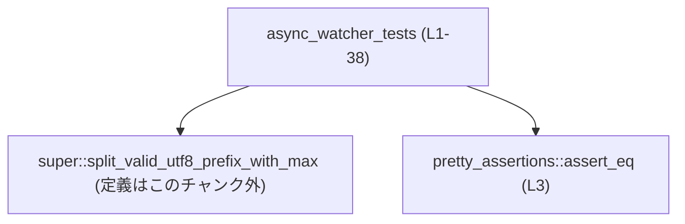
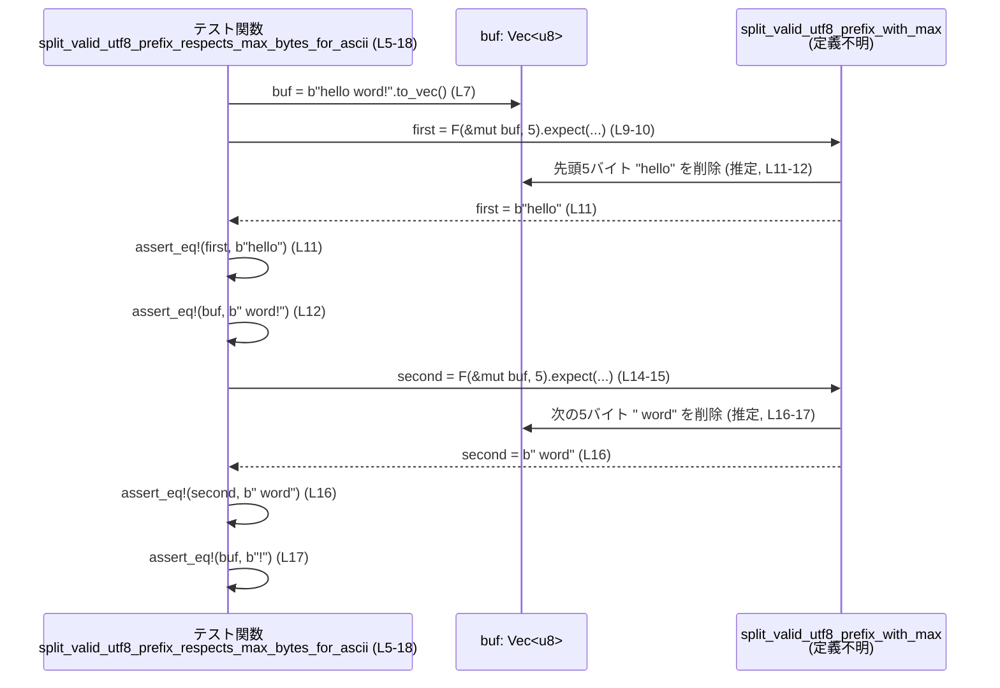

# core/src/unified_exec/async_watcher_tests.rs コード解説

## 0. ざっくり一言

`split_valid_utf8_prefix_with_max` という関数の挙動を検証する単体テスト群です。  
ASCII だけの入力、UTF-8 マルチバイト文字、そして不正な UTF-8 バイト列に対して「最大バイト数」と「UTF-8 の文字境界」「進捗（必ず1バイト以上消費する）」という契約を確認しています（core/src/unified_exec/async_watcher_tests.rs:L5-38）。

---

## 1. このモジュールの役割

### 1.1 概要

- このモジュールは、親モジュールに定義されている `split_valid_utf8_prefix_with_max` 関数（定義はこのチャンクには現れません）に対して、以下を確認するテストを提供します（L1, L5-38）。
  - ASCII 文字のみのバイト列では `max_bytes` を超えない長さのプレフィクスを返すこと（L5-18）。
  - UTF-8 マルチバイト文字を途中で分割しないこと（L20-29）。
  - 不正な UTF-8 先頭バイトに遭遇しても、少なくとも 1 バイトは必ず消費して前進すること（L31-38）。

### 1.2 アーキテクチャ内での位置づけ

- 依存関係:
  - 親モジュールの `split_valid_utf8_prefix_with_max` を使用（L1, L9-10, L14-15, L25-26, L35-36）。
  - テスト用に `pretty_assertions::assert_eq` マクロを利用（L3, L11-12, L16-17, L27-28, L37-38）。

これを簡易な依存関係図で表すと次のようになります。



### 1.3 設計上のポイント

- テスト関数はすべて `#[test]` 属性を持つ単純な同期関数であり、並行実行や非同期処理は登場しません（L5, L20, L31）。
- すべてのテストで同じ関数 `split_valid_utf8_prefix_with_max` を、異なる入力パターンに対して呼び出しています（L9-10, L14-15, L25-26, L35-36）。
- ミュータブルなバッファ `&mut Vec<u8>` に対して関数を呼び出し、戻り値（プレフィクス）と残りのバッファ内容を両方検証することで、「戻り値」と「引数の副作用」の両方をテストしています（L7-17, L23-28, L33-38）。
- 戻り値に対して `.expect("expected prefix")` を呼んでいるため、この関数は `Option<_>` または `Result<_, _>` のように `expect` メソッドを持つ型を返すことが分かりますが、具体的な型はこのチャンクには現れません（L9-10, L14-15, L25-26, L35-36）。

---

## 2. コンポーネント一覧と主要な機能

### 2.1 コンポーネント（関数・外部依存）インベントリ

| 名前 | 種別 | 定義 / 使用位置 | 役割 |
|------|------|-----------------|------|
| `split_valid_utf8_prefix_respects_max_bytes_for_ascii` | テスト関数 | 定義: L5-18 | ASCII バイト列に対して `max_bytes` を超えない長さでプレフィクスを返し、残りがバッファに残ることを検証 |
| `split_valid_utf8_prefix_avoids_splitting_utf8_codepoints` | テスト関数 | 定義: L20-29 | マルチバイト UTF-8 文字（"é"）を途中で分割しないことを検証 |
| `split_valid_utf8_prefix_makes_progress_on_invalid_utf8` | テスト関数 | 定義: L31-38 | 不正な UTF-8 先頭バイトがあっても 1 バイトは必ず消費し、処理が前進することを検証 |
| `split_valid_utf8_prefix_with_max` | 外部関数（親モジュール） | 使用: L1, L9-10, L14-15, L25-26, L35-36 | UTF-8 を考慮しつつ `&mut Vec<u8>` から最大バイト数 `max_bytes` までのプレフィクスを切り出し、元のバッファを更新する関数と解釈できますが、実装はこのチャンクには現れません |
| `pretty_assertions::assert_eq` | 外部マクロ | 使用: L3, L11-12, L16-17, L27-28, L37-38 | テスト用の比較マクロ。期待値と実際の値が異なる場合に見やすい diff を出力 |

### 2.2 主要なテスト観点（機能一覧）

このファイルがカバーしている `split_valid_utf8_prefix_with_max` の主な挙動は次の通りです（すべてテストコードを根拠としています）。

- ASCII プレフィクス切り出し（L5-18）  
  - `b"hello word!"` に `max_bytes = 5` を指定すると、最初の呼び出しで `b"hello"` を返し、残りの `buf` は `b" word!"` になります（L7-12）。  
  - 続く呼び出しで `b" word"` を返し、残りの `buf` は `b"!"` になります（L14-17）。
- マルチバイト UTF-8 文字を分割しない（L20-29）  
  - `"ééé"`（各 "é" は UTF-8 で 2 バイト）の場合、`max_bytes = 3` でも 1 文字分（2 バイト）だけを返し、残りは `"éé"` が `buf` に残ります（L22-28）。
- 不正 UTF-8 に対しても進捗する（L31-38）  
  - 入力 `[0xff, b'a', b'b']` に `max_bytes = 2` を指定した場合でも、戻り値として `[0xff]` を返し、`buf` は `"ab"` に更新されます（L33-38）。

---

## 3. 公開 API と詳細解説

このファイル自身には公開 API（ライブラリとしての公開関数・型）は定義されていません。  
しかし、テスト対象である `split_valid_utf8_prefix_with_max` の契約の一部がテストを通じて現れています。

### 3.1 型一覧（構造体・列挙体など）

このファイル内で新たに定義される構造体・列挙体はありません（L1-38）。

使用している主な標準型は次の通りです。

| 型 | 用途 | 根拠 |
|----|------|------|
| `Vec<u8>` | バイトバッファの保持と更新（`buf` 変数） | `b"hello word!".to_vec()` など（L7, L23, L33） |
| `String` / `&str` | UTF-8 文字列の記述（コメント・テストデータ） | `"ééé"`（L22-23） |
| `Result` または `Option` 相当の型 | `.expect("expected prefix")` を呼び出している戻り値 | L9-10, L14-15, L25-26, L35-36 |

※ 戻り値の具体的な型名はこのチャンクには現れません。

### 3.2 関数詳細

ここでは、テスト関数 3 件と、テストから分かる範囲で `split_valid_utf8_prefix_with_max` の契約を整理します。

---

#### `split_valid_utf8_prefix_respects_max_bytes_for_ascii()`

**概要**

- ASCII 文字のみから成るバイト列に対して、`split_valid_utf8_prefix_with_max` が `max_bytes` を超えない長さのプレフィクスを返し、元のバッファからその分だけ削除されることを検証します（L5-18）。

**引数**

- なし（テストフレームワークから直接呼び出される関数です）（L5-6）。

**戻り値**

- `()`（テスト関数なので戻り値は使われません）（L6）。

**内部処理の流れ**

1. `buf` に `b"hello word!"` をコピーした `Vec<u8>` を作成します（L7）。
2. `split_valid_utf8_prefix_with_max(&mut buf, 5)` を呼び出し、結果に対して `.expect("expected prefix")` を呼ぶことで、成功を前提としたプレフィクス `first` を取得します（L9-10）。
3. `first` が `b"hello"` と等しいことを `assert_eq!` で検証します（L11）。
4. 関数呼び出し後の `buf` が `b" word!"` になっていることを検証します（L12）。
5. 同じ `buf` に対して再度 `split_valid_utf8_prefix_with_max(&mut buf, 5)` を呼び出し、結果 `second` を取得します（L14-15）。
6. `second` が `b" word"` であることを検証します（L16）。
7. 2 回目の呼び出し後の `buf` が `b"!"` になっていることを検証します（L17）。

**Examples（使用例）**

このテスト関数自体が `split_valid_utf8_prefix_with_max` の典型的な使用例になっています。

```rust
// ASCII バイト列を用意する
let mut buf = b"hello word!".to_vec(); // L7

// 最大 5 バイトまでの UTF-8 安全なプレフィクスを取得し、buf からその分を削除
let first = split_valid_utf8_prefix_with_max(&mut buf, 5)
    .expect("expected prefix");        // L9-10

assert_eq!(first, b"hello".to_vec());  // L11
assert_eq!(buf, b" word!".to_vec());   // L12
```

**Errors / Panics**

- `split_valid_utf8_prefix_with_max` が `None` や `Err` を返した場合は `.expect("expected prefix")` によりテストが panic します（L9-10, L14-15）。  
  したがって、このテストは指定した入力に対して「エラーが発生しない」という契約も暗黙に検証しています。

**Edge cases（エッジケース）**

- 空バッファや `max_bytes = 0` のケースは、このテストでは扱っていません（このチャンクには登場しません）。
- ASCII 以外の文字は登場しないため、UTF-8 境界の考慮は別テストに任されています（L7）。

**使用上の注意点**

- `split_valid_utf8_prefix_with_max` は `&mut Vec<u8>` を受け取り、呼び出し後にバッファが書き換わることが前提になっています（L7-12, L14-17）。  
  実際の利用時も、呼び出し後のバッファ内容を前提に続きの処理を書く必要があります。

---

#### `split_valid_utf8_prefix_avoids_splitting_utf8_codepoints()`

**概要**

- UTF-8 マルチバイト文字（ここでは "é"）を含む文字列に対して、`max_bytes` が文字境界をまたぐ値であっても、UTF-8 コードポイントを途中で分割しないことを検証します（L20-29）。

**引数**

- なし（L20-21）。

**戻り値**

- `()`（L21）。

**内部処理の流れ**

1. `"ééé"` という文字列をバイト列（`Vec<u8>`）に変換して `buf` に保存します（L23）。  
   - コメントで `"é" is 2 bytes in UTF-8` と説明されています（L22）。
2. `split_valid_utf8_prefix_with_max(&mut buf, 3)` を呼び出し、戻り値 `first` を `.expect` で取得します（L25-26）。
3. `first` を `std::str::from_utf8(&first).unwrap()` で UTF-8 文字列に変換し、その値が `"é"` であることを検証します（L27）。
4. 関数呼び出し後の `buf` が `"éé"`（2 文字分）のバイト列になっていることを検証します（L28）。

**Examples（使用例）**

```rust
// "ééé" を UTF-8 バイト列に変換
let mut buf = "ééé".as_bytes().to_vec();                 // L23

// 最大 3 バイトまでの UTF-8 安全なプレフィクスを取得
let first = split_valid_utf8_prefix_with_max(&mut buf, 3)
    .expect("expected prefix");                          // L25-26

// 返ってきたプレフィクスは 1 文字 "é"（2 バイト）だけ
assert_eq!(std::str::from_utf8(&first).unwrap(), "é");   // L27
// 残りは "éé"
assert_eq!(buf, "éé".as_bytes().to_vec());               // L28
```

**Errors / Panics**

- `split_valid_utf8_prefix_with_max` がエラーを返した場合は `.expect` が panic します（L25-26）。
- `first` が不正な UTF-8 バイト列だった場合、`from_utf8(&first).unwrap()` も panic しますが、このテストはそれが起こらないことも合わせて検証しています（L27）。

**Edge cases（エッジケース）**

- `max_bytes = 3` に対して 2 バイト文字が続く場合、返されるバイト数は 2 バイト（ちょうど 1 文字分）であり、指定した `max_bytes` より少ない値になります（L25-27）。  
  これは「常に `max_bytes` ちょうどではなく、UTF-8 の境界に合わせて切り詰める」という契約を示唆します。
- より長いマルチバイト文字（例: 3 バイト・4 バイト文字）や混在したケースは、このチャンクには登場しません。

**使用上の注意点**

- 取得したプレフィクスを UTF-8 文字列とみなす場合は `std::str::from_utf8` で検証するのが安全であることを、テストが例示しています（L27）。  
- 実際の利用コードでは `.unwrap()` ではなく、`Result` をハンドリングする形にするのが一般的です（テストなのでここでは単純化されています）。

---

#### `split_valid_utf8_prefix_makes_progress_on_invalid_utf8()`

**概要**

- 先頭バイトに不正な UTF-8 バイト（`0xff`）が含まれていても、`split_valid_utf8_prefix_with_max` が少なくとも 1 バイトは消費し、処理が停滞しない（無限ループ等にならない）ことを検証します（L31-38）。

**引数**

- なし（L31-32）。

**戻り値**

- `()`（L32）。

**内部処理の流れ**

1. `buf` に `[0xff, b'a', b'b']` という 3 バイトの `Vec<u8>` を作成します（L33）。
2. `split_valid_utf8_prefix_with_max(&mut buf, 2)` を呼び出し、戻り値 `first` を `.expect` で取得します（L35-36）。
3. `first` が `[0xff]` だけを含むベクタであることを検証します（L37）。
4. 呼び出し後の `buf` が `"ab"` のバイト列であることを検証します（L38）。

**Examples（使用例）**

```rust
// 不正な UTF-8 先頭バイトと、その後に ASCII 文字を続ける
let mut buf = vec![0xff, b'a', b'b'];                    // L33

// max_bytes = 2 でも、不正バイト 1 個だけを切り出して前進する
let first = split_valid_utf8_prefix_with_max(&mut buf, 2)
    .expect("expected prefix");                          // L35-36

assert_eq!(first, vec![0xff]);                           // L37
assert_eq!(buf, b"ab".to_vec());                         // L38
```

**Errors / Panics**

- `.expect("expected prefix")` による panic の条件は前テストと同じです（L35-36）。
- 不正 UTF-8 であっても、このテストでは「エラーにはならない」という挙動を期待しています（L33-38）。

**Edge cases（エッジケース）**

- 先頭バイトが不正な UTF-8 であっても、1 バイト分をプレフィクスとして返す（L37）。  
  これにより、呼び出し側はループ等で繰り返し呼び出しても、必ずバッファが縮み続けることになります。
- 不正バイトが連続している場合や、中間位置にある場合の挙動はこのチャンクには現れません。

**使用上の注意点**

- 不正な UTF-8 が含まれるストリーム処理などで「必ず前に進む」ことは、DoS 回避（特定の入力で無限ループしない）という観点で重要です。  
  このテストはその性質の一部を保証するものですが、すべてのパターンを網羅しているわけではありません（L31-38）。

---

#### `split_valid_utf8_prefix_with_max(buf: &mut Vec<u8>, max_bytes: <整数型>) -> Option/Result<Prefix>`

**注意**: この関数の定義はこのチャンクには現れないため、以下は**テストコードから読み取れる契約のみ**をまとめたものです。

**概要**

- ミュータブルなバイトバッファ `buf` から、UTF-8 のコードポイント境界を守りつつ、最大 `max_bytes` バイトまでをプレフィクスとして切り出し、そのプレフィクスを返す関数です（L7-17, L23-28, L33-38）。
- 副作用として、`buf` から返したプレフィクス分のバイトを削除します（同上）。

**引数（テストから分かる範囲）**

| 引数名 | 型（推定） | 説明 | 根拠 |
|--------|-----------|------|------|
| `buf` | `&mut Vec<u8>` と解釈可能 | 入出力バッファ。先頭からプレフィクスが切り出され、残りがこのバッファに残る | `let mut buf = ...; split_valid_utf8_prefix_with_max(&mut buf, ...)`（L7, L9-10, L14-15, L23, L25-26, L33, L35-36） |
| `max_bytes` | 整数型（具体的な型は不明） | 返されるプレフィクスの最大バイト数。ただし UTF-8 境界を優先するため、実際の長さは `max_bytes` 以下 | リテラル `5`, `3`, `2` を渡している（L9-10, L14-15, L25-26, L35-36） |

**戻り値（テストから分かる範囲）**

- `expect(&str)` メソッドを持つ型（`Option<Prefix>` または `Result<Prefix, E>` に類するもの）（L9-10, L14-15, L25-26, L35-36）。
- `Prefix` はバイトベクタ（`Vec<u8>`）として扱える型です（`first` / `second` を `Vec<u8>` と比較しているため）（L11, L16, L37）。

**テストから見える契約**

- プレフィクス長は `0 < len(prefix) <= max_bytes`  
  - ASCII の場合：`len(prefix) == max_bytes`（L9-12, L14-17）。  
  - マルチバイト UTF-8 の場合：`len(prefix) <= max_bytes` であり、コードポイント境界で切り詰められる（L25-28）。
- UTF-8 正常系:
  - マルチバイト文字を途中で分割することはない（"ééé" かつ `max_bytes = 3` で 1 文字だけ返す）（L22-28）。
- UTF-8 不正系:
  - 先頭バイトが不正な UTF-8 であっても、少なくとも 1 バイトのプレフィクスを返し、`buf` から取り除く（L33-38）。
- バッファの更新:
  - 毎回、返したプレフィクス分だけ `buf` が短くなる（L11-12, L16-17, L27-28, L37-38）。

**Errors / Panics**

- テストは `.expect("expected prefix")` で成功を前提としているため、「この入力ではエラーにならない」ことを確認しています（L9-10, L14-15, L25-26, L35-36）。
- どのような条件で `None` / `Err` を返すかは、このチャンクには現れません。

**Edge cases（エッジケース／未カバー領域）**

テストから見えるもの:

- 不正な UTF-8 を含む先頭バイトに対しても確実に 1 バイト進む（L33-38）。

このチャンクでは未検証のもの（不明）:

- `buf` が空の場合や `max_bytes = 0` の場合の挙動。
- 不正バイトが連続している場合、あるいは先頭ではなく途中にある場合。
- 極端に大きな `buf` や `max_bytes` の入力に対する性能・挙動。

**使用上の注意点（推定される範囲）**

- `buf` がミュータブル参照で渡されるため、同じバッファを複数スレッドから同時に操作することはコンパイル時に禁止されます（Rust の借用規則による安全性）。
- 非テストコードでは `.expect` ではなく、戻り値（`Option` / `Result` いずれか）を適切にハンドリングする必要があります。

---

### 3.3 その他の関数

このファイルには、上記 3 つ以外の関数は定義されていません（L1-38）。

---

## 4. データフロー

### 4.1 代表的なシナリオ：ASCII バイト列の分割（L5-18）

ASCII テキストを含むバッファを、UTF-8 を意識したプレフィクスに分割しつつ、同じバッファを継続して処理していく流れがテストされています。



**要点**

- `split_valid_utf8_prefix_with_max` は、バッファ `buf` の「先頭から」プレフィクスを取り出す関数であることが、2 回連続して呼び出すテストから分かります（L7-17）。
- 戻り値と引数（`buf`）の両方で結果を受け取るデータフローになっており、ストリーム処理（逐次的な読み出し）に適したインターフェースであると解釈できますが、これはこのチャンク単体からの一般的な解釈にとどまります。

---

## 5. 使い方（How to Use）

### 5.1 基本的な使用方法（テストからの抽出）

テストに現れているパターンをそのまま例にすると、`split_valid_utf8_prefix_with_max` は以下のように使われます。

```rust
// バイトバッファを用意する
let mut buf = some_source_of_bytes(); // 例: b"hello word!".to_vec()

// ループしながら UTF-8 安全なチャンクを取り出す（エラーハンドリングは簡略化）
while !buf.is_empty() {
    let prefix = split_valid_utf8_prefix_with_max(&mut buf, 1024)
        .expect("prefix should be available");

    // prefix には UTF-8 的に妥当な範囲、または 1 バイトの不正バイトが入る（テストより）
    process_prefix(prefix); // 任意の処理
}
```

※ `some_source_of_bytes` や `process_prefix` は、このチャンクには現れない擬似コードです。

### 5.2 よくある使用パターン（テストの分類）

- **固定長チャンクでの分割**（ASCII の例, L5-18）  
  一定サイズのチャンクで切り出し、残りを同じバッファで処理し続ける。
- **UTF-8 文字境界を守りつつの分割**（マルチバイト文字の例, L20-29）  
  表示文字単位で処理したい場合に、`max_bytes` をバイト数として制限しつつ、文字境界をそこで切り詰める。
- **不正な入力を含むストリーム処理**（L31-38）  
  不正な UTF-8 をスキップせず、1 バイトごとに扱いたい場合でも、処理が確実に前進するようになっている。

### 5.3 よくある間違い（想定）

このチャンクにはミスユースの例は登場しませんが、テストから考えられる注意点を挙げます。

```rust
// 誤りの可能性: &mut Vec<u8> を複数の関数に同時に渡す（コンパイルエラーになる例）
//
// let mut buf = b"hello".to_vec();
// let p1 = split_valid_utf8_prefix_with_max(&mut buf, 5)?;
// let p2 = split_valid_utf8_prefix_with_max(&mut buf, 5)?; // 正しいが、
// 他スレッドにも &mut buf を渡そうとするとコンパイルエラーになります。

// 正しい例: &mut Vec<u8> は 1 箇所でのみミュータブルに借用される
let mut buf = b"hello".to_vec();
let p1 = split_valid_utf8_prefix_with_max(&mut buf, 5)
    .expect("expected prefix");
// buf の内容を確認・処理してから、必要なら再度呼び出す
```

Rust の借用規則により、`&mut Vec<u8>` を同時に複数の場所で変更するようなコードはコンパイル時に拒否されるため、メモリ安全性の面では保護されています。

### 5.4 使用上の注意点（まとめ）

- **バッファが書き換わる**  
  関数呼び出し後の `buf` は短くなり、先頭にあったプレフィクスは削除されています（L11-12, L16-17, L27-28, L37-38）。
- **UTF-8 と不正バイトの扱い**  
  - 正常な UTF-8 はコードポイント単位で切り出されます（L22-28）。
  - 不正バイトも 1 バイト単位で進捗することが期待されています（L33-38）。
- **エラー処理**  
  テストでは `.expect(...)` を使っていますが、実際のコードでは `None` / `Err` が返る可能性も考慮してハンドリングする必要があります（L9-10, L14-15, L25-26, L35-36）。
- **並行性**  
  このテストファイルにはスレッドや非同期処理は登場しません（L1-38）。  
  `&mut Vec<u8>` を使う設計上、同一バッファを複数スレッドで同時に扱うことはコンパイル時に禁止されます。

---

## 6. 変更の仕方（How to Modify）

### 6.1 新しいテストケースを追加する場合

`split_valid_utf8_prefix_with_max` の挙動をさらに明確にしたい場合、以下のような観点でテストを追加することが考えられます。

1. **空入力のテスト**  
   - `let mut buf = Vec::new();` に対する挙動（プレフィクスが `None` / `Err` になるかどうか）は、このチャンクには現れません。
2. **`max_bytes = 0` のテスト**  
   - 0 バイトを指定したときにどのような結果になるかは不明です。
3. **長いマルチバイト文字列や混在ケース**  
   - 3 バイト・4 バイト文字を含むケース、ASCII と混在したケースなど。

追加する場合は、既存のテストと同様に `#[test]` 関数としてこのファイルに関数を追加し、`buf` の初期値、関数呼び出し、期待するプレフィクスと残りの `buf` の双方を `assert_eq!` で検証する構造に合わせると一貫性が保たれます（L5-18, L20-29, L31-38）。

### 6.2 既存のテストを変更する場合

- **影響範囲の確認**  
  これらのテストは `split_valid_utf8_prefix_with_max` の契約の一部を表現しているため、期待値を変更することは関数の仕様変更に相当します。
- **契約の意識**  
  - ASCII で `max_bytes` ぴったりのプレフィクスを返すこと（L5-18）。
  - UTF-8 コードポイントを分割しないこと（L20-29）。
  - 不正バイトでも 1 バイト以上の進捗をすること（L31-38）。
- これらを変更する場合は、親モジュール側の実装も合わせて確認し、関数を利用している他のコードへの影響を調べる必要があります（親モジュールの使用箇所はこのチャンクには現れません）。

---

## 7. 関連ファイル

このチャンクから分かる関連ファイル・モジュールは次の通りです。

| パス / モジュール | 役割 / 関係 | 根拠 |
|-------------------|-------------|------|
| `super` モジュール（具体的なファイル名は不明） | `split_valid_utf8_prefix_with_max` を定義している親モジュール | `use super::split_valid_utf8_prefix_with_max;`（L1） |
| `pretty_assertions` クレート | `assert_eq!` マクロによりテストの比較を行う外部依存 | `use pretty_assertions::assert_eq;`（L3） |

これ以上のモジュール構成（例えば `async_watcher` 本体のファイルパスなど）は、このチャンクには現れません。

---

### バグ / セキュリティ観点の補足（このファイルから分かる範囲）

- テスト `split_valid_utf8_prefix_makes_progress_on_invalid_utf8` は、「不正な UTF-8 入力に対しても関数が必ず前進する」ことを検証しており、特定の入力で無限ループするような DoS 的挙動を防ぐ意図が読み取れます（L31-38）。
- ただし、実装はこのチャンクには現れないため、他のパターンでのバグやセキュリティ問題（例: 大量入力時の性能劣化、パニック条件など）については判断できません。

このファイルは主として「契約の一部をテストで固定する」役割を持っており、`split_valid_utf8_prefix_with_max` の実コードを読む際の補助的な仕様ドキュメントとしても利用できる構造になっています。
