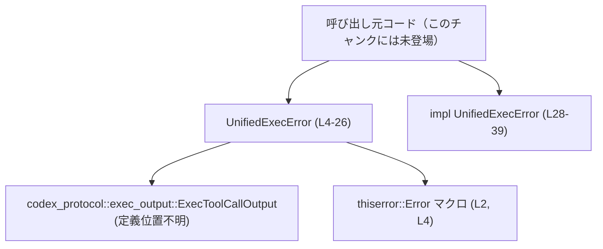
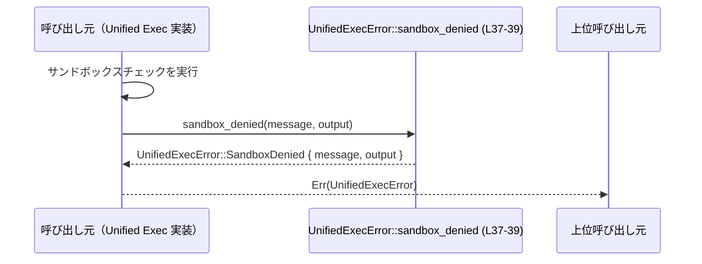

# core/src/unified_exec/errors.rs

## 0. ざっくり一言

Unified Exec 機能で発生しうるエラーを表す `UnifiedExecError` 列挙体と、その生成ヘルパーメソッドを定義するモジュールです（`core/src/unified_exec/errors.rs:L4-39`）。

---

## 1. このモジュールの役割

### 1.1 概要

- このモジュールは、**統一された「exec（コマンド実行）」機能で発生する代表的な失敗ケースを型安全に表現する**ために存在します。
- プロセス起動失敗、実行中の失敗、未知のプロセス ID、標準入力（stdin）まわりの問題、コマンドライン不足、サンドボックス拒否といった状況を `UnifiedExecError` で表現します（`core/src/unified_exec/errors.rs:L4-25`）。
- `thiserror::Error` 派生を利用し、人間向けエラーメッセージ（Display）と `std::error::Error` 実装を自動生成しています（`L2`, `L4`）。

### 1.2 アーキテクチャ内での位置づけ

このモジュール自体はユーティリティ的な「エラー型定義」であり、他の Unified Exec 実装コードから利用される側です。依存関係は次の通りです。

- 依存している外部コンポーネント
  - `thiserror::Error` マクロ（エラー型の実装生成） (`L2`, `L4`)
  - `codex_protocol::exec_output::ExecToolCallOutput`（サンドボックス拒否時に保持する出力） (`L1`, `L22-24`)

呼び出し元の具体的なモジュールはこのチャンクには現れませんが、少なくとも Unified Exec の実行ロジックから参照されることが想定されます。



### 1.3 設計上のポイント

コードから読み取れる設計上の特徴は次の通りです。

- **単一の列挙体によるエラー集約**  
  Unified Exec 周りの代表的なエラーを `UnifiedExecError` 一つに集約しています（`L4-25`）。
- **状態を持たない純粋なデータ型**  
  列挙体とその `impl` はいずれも内部状態を持たず、値オブジェクトとして動作します（`L4-26`, `L28-39`）。
- **エラーメッセージの一元管理**  
  各バリアントに `#[error(...)]` 属性でユーザー向けメッセージを定義し、一貫した文字列を提供しています（`L6`, `L8`, `L11`, `L13`, `L15-17`, `L19`, `L21`）。
- **詳細情報の添付**  
  一部のエラー（`SandboxDenied`）には `ExecToolCallOutput` を保持し、失敗時の詳細情報を合わせて返せるようになっています（`L21-25`）。
- **crate 内部専用 API**  
  `UnifiedExecError` もコンストラクタメソッドも `pub(crate)` であり、同一 crate 内のみから利用されることが前提です（`L5`, `L28-39`）。
- **スレッド安全性について**  
  Rust の列挙体であり、所有するフィールドも `String` および `ExecToolCallOutput` のみです（`L7`, `L12`, `L22-24`, `L29`, `L33`, `L37-38`）。`ExecToolCallOutput` の `Send`/`Sync` 実装有無はこのチャンクからは分かりませんが、エラー型自体は共有可能な値オブジェクトとして設計されています。

---

## 2. コンポーネント一覧と主要機能

### 2.1 コンポーネント一覧（インベントリー）

| 名前 | 種別 | 説明 | 定義位置（根拠） | 公開範囲 |
|------|------|------|------------------|----------|
| `UnifiedExecError` | 列挙体（enum） | Unified Exec 実行時の様々な失敗ケースを表現するエラー型 | `core/src/unified_exec/errors.rs:L4-26` | `pub(crate)` |
| `CreateProcess` | 列挙バリアント | プロセス起動に失敗したことを示す。メッセージを保持 | `core/src/unified_exec/errors.rs:L6-7` | - |
| `ProcessFailed` | 列挙バリアント | 起動後のプロセスが失敗したことを示す。メッセージを保持 | `core/src/unified_exec/errors.rs:L8-9` | - |
| `UnknownProcessId` | 列挙バリアント | 想定外／未知の `process_id` を参照したことを示す | `core/src/unified_exec/errors.rs:L10-12` | - |
| `WriteToStdin` | 列挙バリアント | stdin 書き込みに失敗したことを示す | `core/src/unified_exec/errors.rs:L13-14` | - |
| `StdinClosed` | 列挙バリアント | stdin が既に閉じられている状況を示す | `core/src/unified_exec/errors.rs:L15-18` | - |
| `MissingCommandLine` | 列挙バリアント | 実行リクエストにコマンドラインが含まれていないことを示す | `core/src/unified_exec/errors.rs:L19-20` | - |
| `SandboxDenied` | 列挙バリアント | サンドボックスによりコマンドが拒否されたことを示す。メッセージと `ExecToolCallOutput` を保持 | `core/src/unified_exec/errors.rs:L21-25` | - |
| `impl UnifiedExecError` | impl ブロック | 列挙体用のコンストラクタヘルパーメソッドを定義 | `core/src/unified_exec/errors.rs:L28-39` | - |
| `create_process` | 関数（関連関数） | `CreateProcess` バリアントを生成するヘルパー | `core/src/unified_exec/errors.rs:L29-31` | `pub(crate)` |
| `process_failed` | 関数（関連関数） | `ProcessFailed` バリアントを生成するヘルパー | `core/src/unified_exec/errors.rs:L33-35` | `pub(crate)` |
| `sandbox_denied` | 関数（関連関数） | `SandboxDenied` バリアントを生成するヘルパー | `core/src/unified_exec/errors.rs:L37-39` | `pub(crate)` |

### 2.2 主要な機能一覧（機能レベル）

- エラー型 `UnifiedExecError` の定義: Unified Exec 実行時の失敗をバリアントごとに表現。
- プロセス生成失敗エラーの生成: `UnifiedExecError::create_process(message)`（`L29-31`）。
- プロセス実行失敗エラーの生成: `UnifiedExecError::process_failed(message)`（`L33-35`）。
- サンドボックス拒否エラーの生成: `UnifiedExecError::sandbox_denied(message, output)`（`L37-39`）。

---

## 3. 公開 API と詳細解説

このモジュールの公開範囲は `pub(crate)` に限定されますが、crate 内での事実上の公開 API として整理します。

### 3.1 型一覧（構造体・列挙体など）

| 名前 | 種別 | 役割 / 用途 | フィールド概要 | 定義位置（根拠） |
|------|------|-------------|----------------|------------------|
| `UnifiedExecError` | 列挙体 | Unified Exec 実行中のエラーを表現する中心的なエラー型。`thiserror::Error` を実装 | 各バリアントが異なるエラー種別と付随情報（`String`, `i32`, `ExecToolCallOutput`）を持つ | `core/src/unified_exec/errors.rs:L4-26` |

バリアントごとのフィールドは次の通りです。

| バリアント名 | フィールド | 型 | 説明 | 根拠 |
|-------------|-----------|----|------|------|
| `CreateProcess` | `message` | `String` | プロセス生成に失敗した原因の説明文 | `L6-7` |
| `ProcessFailed` | `message` | `String` | 実行中プロセスの失敗内容の説明文 | `L8-9` |
| `UnknownProcessId` | `process_id` | `i32` | 不明または無効と判断されたプロセス ID | `L10-12` |
| `WriteToStdin` | なし | - | stdin 書き込み失敗を示す（追加情報なし） | `L13-14` |
| `StdinClosed` | なし | - | stdin がクローズ済みである状態を示す（追加情報なし） | `L15-18` |
| `MissingCommandLine` | なし | - | リクエストにコマンドラインが含まれないことを示す | `L19-20` |
| `SandboxDenied` | `message` | `String` | サンドボックス拒否の理由説明文 | `L21-24` |
| `SandboxDenied` | `output` | `ExecToolCallOutput` | 拒否時の実行出力。詳細はこのチャンクからは不明 | `L22-24` |

### 3.2 関数詳細

#### `UnifiedExecError::create_process(message: String) -> UnifiedExecError`（L29-31）

**概要**

- プロセス生成に失敗したことを示す `UnifiedExecError::CreateProcess` バリアントを生成するヘルパーメソッドです（`L29-31`）。

**引数**

| 引数名 | 型 | 説明 |
|--------|----|------|
| `message` | `String` | プロセス生成失敗の詳細な説明文。呼び出し側で組み立てたメッセージを受け取ります。 |

**戻り値**

- `UnifiedExecError` 型の値を返します。中身は `UnifiedExecError::CreateProcess { message }` です（`L29-31`）。

**内部処理の流れ**

1. 引数 `message` を受け取る（`L29`）。
2. `Self::CreateProcess { message }` をそのまま返します（`L30`）。
3. 追加の検証や変換は行いません（`L29-31`）。

**Examples（使用例）**

以下は、プロセス起動に失敗した場合にこのエラーを返す `Result` を構築する例です。

```rust
// UnifiedExecError を現在のモジュールで利用できる前提とした例です。
fn spawn_unified_process() -> Result<(), UnifiedExecError> {
    // ここでプロセス起動を試みる（疑似コード）
    let os_error_message = "failed to exec: permission denied".to_string(); // OS から得たエラーなど

    // 起動に失敗したので UnifiedExecError を返す
    Err(UnifiedExecError::create_process(os_error_message)) // CreateProcess バリアントを生成して返す
}
```

**Errors / Panics**

- このメソッド自体はパニックしません。
- `Result` などに包んで利用する場合、エラーとして扱われるのは呼び出し側の設計次第です。

**Edge cases（エッジケース）**

- `message` が空文字列でも、そのまま `CreateProcess { message }` が生成されます。メッセージ内容の検証は行いません（`L29-31`）。
- 非 UTF-8 文字列は `String` にできないため、このメソッドに渡る時点で UTF-8 であることが保証されています（Rust の `String` の仕様による）。

**使用上の注意点**

- ログやユーザー表示に使われる可能性があるため、`message` に機密情報をそのまま含める場合は、上位層でのマスキング・出力制御が必要です。
- エラーの粒度として、OS エラーコード等を `message` に埋め込むか、別フィールドを追加するかは設計ポリシーによります。このメソッドは `String` 1 本だけを扱います。

---

#### `UnifiedExecError::process_failed(message: String) -> UnifiedExecError`（L33-35）

**概要**

- プロセスが起動した後に何らかの理由で失敗したことを示す `UnifiedExecError::ProcessFailed` バリアントを生成するヘルパーです（`L33-35`）。

**引数**

| 引数名 | 型 | 説明 |
|--------|----|------|
| `message` | `String` | プロセス実行失敗の詳細説明文 |

**戻り値**

- `UnifiedExecError::ProcessFailed { message }` を返します（`L33-35`）。

**内部処理の流れ**

1. `message` を受け取る（`L33`）。
2. `Self::ProcessFailed { message }` を構築して返します（`L34`）。

**Examples（使用例）**

```rust
fn wait_process_and_check_status() -> Result<(), UnifiedExecError> {
    // ここで子プロセスの終了ステータスを取得したと仮定
    let status_code = 1; // 疑似コード

    if status_code != 0 {
        let msg = format!("process exited with status {}", status_code); // ステータスを含むメッセージを作成
        return Err(UnifiedExecError::process_failed(msg));               // ProcessFailed バリアントとして返す
    }

    Ok(())
}
```

**Errors / Panics**

- このメソッド自体はパニックしません。
- 内部で `format!` などを使う場合（例のように呼び出し側で）、そちらでパニック条件がないように注意する必要があります。

**Edge cases（エッジケース）**

- `message` が非常に長い文字列（大量のログなど）の場合、そのままエラーに保持されるため、エラーオブジェクトのサイズが大きくなります。
- 空文字列も許容され、検証は行われません（`L33-35`）。

**使用上の注意点**

- 「起動前の失敗（`CreateProcess`）」と「起動後の失敗（`ProcessFailed`）」を明確に分けることで、上位でのハンドリングロジックを変えられる設計になっています。呼び出し側で適切なメソッドを選ぶ必要があります。

---

#### `UnifiedExecError::sandbox_denied(message: String, output: ExecToolCallOutput) -> UnifiedExecError`（L37-39）

**概要**

- サンドボックスによりコマンドの実行が拒否された場合に利用する `UnifiedExecError::SandboxDenied` バリアントを生成するヘルパーです（`L37-39`）。
- 拒否理由のメッセージと、`ExecToolCallOutput` で表される実行出力（詳細はこのチャンクからは不明）を保持します（`L22-24`, `L37-38`）。

**引数**

| 引数名 | 型 | 説明 |
|--------|----|------|
| `message` | `String` | サンドボックスルールにより拒否された理由の説明文 |
| `output` | `ExecToolCallOutput` | 実行ツールの出力を表す型。型名から、実行時の標準出力／標準エラー・状態などを含む可能性が推測されますが、詳細はこのチャンクからは断定できません。 |

**戻り値**

- `UnifiedExecError::SandboxDenied { message, output }` を返します（`L37-38`）。

**内部処理の流れ**

1. `message` と `output` を受け取る（`L37`）。
2. それらをそのままフィールドに詰めた `Self::SandboxDenied { message, output }` を生成して返します（`L38`）。

**Examples（使用例）**

```rust
fn handle_sandbox_check(
    allowed: bool,
    output: ExecToolCallOutput,
) -> Result<(), UnifiedExecError> {
    if !allowed {
        // サンドボックスにより拒否されたケース
        let msg = "command denied by sandbox policy".to_string();        // 拒否理由を説明するメッセージ
        return Err(UnifiedExecError::sandbox_denied(msg, output));       // SandboxDenied バリアントを返す
    }

    Ok(())
}
```

**Errors / Panics**

- このメソッド自体にパニック要因はありません。
- `ExecToolCallOutput` の生成や所有権移動時に特別な制約があるかどうかは、このチャンクからは分かりません。

**Edge cases（エッジケース）**

- `output` の内部に多量のログ・バイナリデータが含まれている場合、そのままエラーに保持されるため、エラーオブジェクトが大きくなる可能性があります（ただし `ExecToolCallOutput` の構造は不明です）。
- `message` に加えて `output` もあるため、「メッセージと出力が矛盾した状態」のような整合性はこのメソッドではチェックしていません（呼び出し側が責任を持ちます）。

**使用上の注意点**

- セキュリティ上、`output` や `message` に機密情報（パスワード、トークン、内部パスなど）が含まれる場合、ログ出力時に注意が必要です。
- 「サンドボックスによる拒否」と他の失敗（例えば OS エラー）を区別したい場合、このバリアントに限定してハンドリングすることでポリシー違反を明確に検知できます。

### 3.3 その他の関数

- このファイルには、上記 3 つのヘルパーメソッド以外の関数は定義されていません（`L28-39`）。

---

## 4. データフロー

このモジュール内だけで完結する処理は単純ですが、「Unified Exec 実行ロジック → エラー生成 → 上位へ伝播」という典型的なフローを想定して説明します。呼び出し元の実装はこのチャンクには現れないため、抽象的な「呼び出し元」として図示します。

### 4.1 典型シナリオ：サンドボックス拒否エラーの生成と伝播

1. Unified Exec の実行ロジックがコマンドをサンドボックスにかける（呼び出し元。コードはこのチャンクには不在）。
2. サンドボックスがコマンドを拒否し、その理由メッセージと `ExecToolCallOutput` を返す。
3. 呼び出し元が `UnifiedExecError::sandbox_denied(message, output)` を呼び出してエラーを生成する（`L37-39`）。
4. 生成した `UnifiedExecError` を `Err` としてさらに上位の呼び出し元に返す。



- このように、`UnifiedExecError` は自ら処理を行うのではなく、**失敗状態を運ぶデータコンテナ**として機能します。

---

## 5. 使い方（How to Use）

### 5.1 基本的な使用方法

典型的な使い方は、「Unified Exec に関する関数の戻り値を `Result<T, UnifiedExecError>` とし、内部で何らかの失敗が起きたら適切なバリアントを返す」というパターンです。

```rust
// Unified Exec の処理関数の例（戻り値として UnifiedExecError を使う）
fn run_unified_exec() -> Result<(), UnifiedExecError> {
    // 1. プロセスを生成する
    let created = false;                                               // ここでは失敗したと仮定（疑似コード）
    if !created {
        let msg = "failed to create unified exec process".to_string(); // 失敗理由を説明するメッセージ
        return Err(UnifiedExecError::create_process(msg));             // CreateProcess バリアントを返す
    }

    // 2. 実行中のエラー検査（疑似コード）
    let finished_successfully = true;
    if !finished_successfully {
        let msg = "process terminated with non-zero exit code".into(); // 失敗理由を説明するメッセージ
        return Err(UnifiedExecError::process_failed(msg));             // ProcessFailed バリアントを返す
    }

    Ok(())                                                             // 成功した場合は Ok(()) を返す
}
```

呼び出し側では、`match` などでバリアントごとに処理を分岐できます。

```rust
fn call_and_handle() {
    match run_unified_exec() {
        Ok(()) => {
            // 正常終了
        }
        Err(err) => {
            match err {
                UnifiedExecError::CreateProcess { message } => {
                    eprintln!("create failed: {}", message);           // 起動失敗時のログ
                }
                UnifiedExecError::ProcessFailed { message } => {
                    eprintln!("process failed: {}", message);          // 実行失敗時のログ
                }
                UnifiedExecError::SandboxDenied { message, .. } => {
                    eprintln!("sandbox denied: {}", message);          // サンドボックス拒否のログ
                }
                _ => {
                    eprintln!("other exec error: {}", err);            // その他のバリアントはまとめて処理
                }
            }
        }
    }
}
```

### 5.2 よくある使用パターン

1. **メッセージのみを持つエラーの生成・伝播**

   - `create_process` / `process_failed` を用いて、OS エラーなどの詳細文をそのまま `String` として保持し、上位でログ出力するパターンです。
   - エラーの種類で処理を切り替えるが、詳細内容はメッセージ文字列にまとめる、という使い方です。

2. **詳細出力付きエラー（SandboxDenied）の利用**

   - サンドボックス拒否時に `ExecToolCallOutput` を添付して返し、上位で必要に応じて詳細ログやユーザー表示に利用するパターンです。
   - 例として、「サンドボックスにより拒否されたので出力をデバッグ用に記録する」、といった運用が考えられます（ただし `ExecToolCallOutput` の実際の中身はこのチャンクからは不明です）。

3. **エラー分類によるリトライ／フォールバック制御**

   - `CreateProcess` の場合は設定を見直して再試行するが、`SandboxDenied` の場合はユーザーにポリシー違反を知らせるのみ、など、バリアントごとにリトライ方針を変えることができます。

### 5.3 よくある間違い

コードから直接は読み取れませんが、想定される誤用例と正しい例を示します。

```rust
// 誤りやすい例: 失敗理由の種類を区別せず、すべて同じバリアントで返してしまう
fn bad_example() -> Result<(), UnifiedExecError> {
    let msg = "something went wrong".to_string();
    Err(UnifiedExecError::create_process(msg))           // 実際はサンドボックス拒否など別種のエラーでも CreateProcess を使ってしまう
}

// より良い例: 失敗理由に応じて適切なバリアントを選択する
fn good_example(denied_by_sandbox: bool) -> Result<(), UnifiedExecError> {
    if denied_by_sandbox {
        // サンドボックス拒否
        let msg = "denied by sandbox".to_string();
        let output = /* ExecToolCallOutput を構築 */;   // 実際の構築方法はこのチャンクからは不明
        Err(UnifiedExecError::sandbox_denied(msg, output))
    } else {
        // プロセス生成失敗
        let msg = "failed to spawn process".to_string();
        Err(UnifiedExecError::create_process(msg))
    }
}
```

### 5.4 使用上の注意点（まとめ）

- **エラー型の意味付け**  
  各バリアントは異なる状況を表すため、呼び出し側で意味を取り違えないことが重要です（`CreateProcess` vs `ProcessFailed` など）。
- **メッセージの扱いとセキュリティ**  
  `message` フィールドには任意の文字列を渡せるため、ログやユーザー表示にそのまま出す場合は機密情報を含めないよう注意が必要です。
- **出力データのサイズ**  
  `SandboxDenied` の `output` フィールドに大きなデータを含めると、エラーオブジェクトのサイズが大きくなります。高頻度に生成される場合にはメモリ使用量に注意が必要です（`L22-24`, `L37-38`）。
- **並行性（スレッド間共有）**  
  この型自体は単なるデータ列挙体であり、ミュータブルな内部状態は持ちません。`ExecToolCallOutput` が `Send`/`Sync` であれば、スレッド間で `UnifiedExecError` を共有する一般的な Rust のパターンに従って安全に利用できると考えられますが、実際に `Send`/`Sync` が実装されているかはこのチャンクからは分かりません。

---

## 6. 変更の仕方（How to Modify）

### 6.1 新しい機能を追加する場合

新たな種類の Unified Exec エラーを扱いたい場合の典型的な変更手順です。

1. **新しいバリアントの追加**

   - `UnifiedExecError` 列挙体に新しいバリアントを追加します（`L4-26` 内に追記）。
   - 必要に応じてフィールド（`String`、数値、構造体など）を定義します。

2. **エラーメッセージの定義**

   - 新バリアントに対して `#[error("...")]` 属性を付け、人間が読めるエラーメッセージを定義します（既存の `L6`, `L8`, `L11`, `L13`, `L15-17`, `L19`, `L21` を参考にします）。

3. **コンストラクタヘルパーの追加（任意）**

   - 他のバリアントと同様のスタイルで、`impl UnifiedExecError` ブロックに関連関数（コンストラクタ）を追加します（`L28-39` 付近に追記）。
   - 例: `pub(crate) fn new_variant(...args...) -> Self { Self::NewVariant { ... } }`

4. **呼び出し元の更新**

   - Unified Exec の実装コード側で、新しいエラー条件が発生したときに新バリアントを使うように変更します（このチャンクには呼び出し元のコードは現れません）。

5. **テストの追加／更新**

   - このファイル内にはテストは存在しません（`L1-40`）。  
     crate のどこかに Unified Exec の単体テスト・統合テストがあれば、新バリアントに対応するテストケースを追加する必要があります。

### 6.2 既存の機能を変更する場合

既存バリアントやメソッドを変更する際の注意点です。

- **エラーメッセージの変更**

  - `#[error("...")]` のメッセージを変更すると、ログやテスト（文字列を直接比較しているテスト）が影響を受ける可能性があります（`L6`, `L8`, `L11`, `L13`, `L15-17`, `L19`, `L21`）。
  - 外部とのプロトコルに「このエラーメッセージをそのまま返す」ような仕様がある場合、互換性に注意が必要です。このチャンクからはそうした仕様の有無は不明です。

- **フィールド型の変更**

  - 例: `UnknownProcessId` の `process_id` を `i32` から別の型に変更すると、呼び出し元のコードと互換性がなくなります（`L12`）。
  - OS 側のプロセス ID 型との整合性も考慮する必要がありますが、このチャンクからは OS 側の型定義は分かりません。

- **バリアントの削除／名称変更**

  - 既存のバリアントを削除したり名前を変えると、パターンマッチ（`match`）の網羅性が崩れ、多くの箇所でコンパイルエラーになります。
  - そのため、バリアント削除や名称変更は影響範囲を十分に確認してから行う必要があります。

- **エラーハンドリング契約（前提条件）の変更**

  - 例えば、「サンドボックス拒否時には必ず `output` に特定のフィールドがセットされている」というような暗黙の契約が呼び出し元に存在する可能性があります。このファイルからはそうした暗黙契約の有無は分からないため、変更時は呼び出し元の期待を確認する必要があります。

---

## 7. 関連ファイル

このチャンクから明示的に分かる関連コンポーネントは次の通りです。

| パス / モジュール | 役割 / 関係 |
|------------------|------------|
| `codex_protocol::exec_output::ExecToolCallOutput` | サンドボックス拒否時に `SandboxDenied` バリアントの `output` フィールドとして保持される実行出力型（`L1`, `L22-24`）。実際のファイルパスや内部構造はこのチャンクからは不明です。 |
| `thiserror::Error`（クレート `thiserror`） | `UnifiedExecError` に対して `std::error::Error` と `Display` 実装を自動生成する派生マクロ（`L2`, `L4`）。 |

Unified Exec の実行ロジック本体（例えば `core/src/unified_exec/mod.rs` など）は、このチャンクには現れないため、具体的なファイル名・構成は不明です。ただし、`pub(crate)` な `UnifiedExecError` が crate 内の他モジュールから利用される設計になっていることは読み取れます（`L5`, `L28-39`）。
