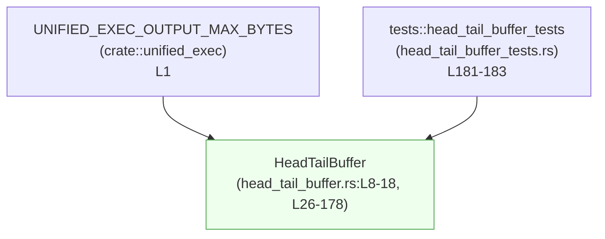
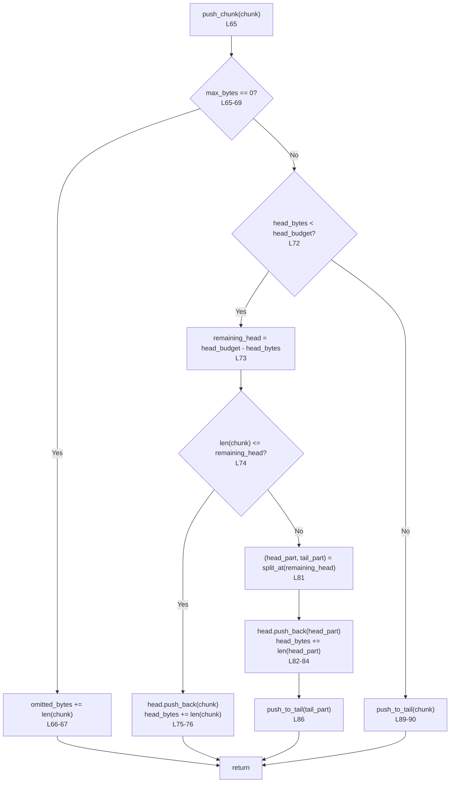

# core/src/unified_exec/head_tail_buffer.rs コード解説

## 0. ざっくり一言

`HeadTailBuffer` は、出力バイト列を「先頭 (head)」と「末尾 (tail)」に分けて保持し、全体サイズ上限を超えた場合は **中間部分を自動的に捨てる** 固定サイズバッファです（先頭と末尾に 50% ずつ容量を割り当て）  
（根拠: `head_tail_buffer.rs:L4-7, L31-37, L65-91`）

---

## 1. このモジュールの役割

### 1.1 概要

- このモジュールは、**長大な実行結果（標準出力・ログなど）から一部のみを保持する問題** を解決するために存在し、  
  **先頭と末尾を一定量残しつつ中間を省略するバッファ機能** を提供します。  
  （根拠: `head_tail_buffer.rs:L4-7, L27-31`）
- 全体で保持できる最大バイト数は `max_bytes` で制限され、先頭用 `head_budget` と末尾用 `tail_budget` に 2 分されます。  
  （根拠: `head_tail_buffer.rs:L9-17, L31-37`）

### 1.2 アーキテクチャ内での位置づけ

依存関係として確認できるのは以下のとおりです。

- 定数 `UNIFIED_EXEC_OUTPUT_MAX_BYTES` を `crate::unified_exec` から利用 (`Default` 実装で使用)  
  （根拠: `head_tail_buffer.rs:L1, L20-23`）
- バッファ内部表現として `std::collections::VecDeque<Vec<u8>>` を使用  
  （根拠: `head_tail_buffer.rs:L2, L13-14`）
- テストコードを同ディレクトリの `head_tail_buffer_tests.rs` から読み込む  
  （根拠: `head_tail_buffer.rs:L181-183`）



> 上図は、このチャンク（`head_tail_buffer.rs:L1-183`）に現れる依存関係のみを表しています。他モジュールから `HeadTailBuffer` がどう呼ばれているかは、このチャンクからは分かりません。

### 1.3 設計上のポイント

- **対称な head/tail 予算**  
  - `head_budget = max_bytes / 2`、`tail_budget = max_bytes - head_budget` として、先頭と末尾にほぼ 50% ずつ容量を割り当てます（奇数の場合は tail が 1 バイト多い）。  
    （根拠: `head_tail_buffer.rs:L31-37`）

- **中抜き（middle drop）戦略**  
  - head は一度埋まったら以降削除されず、tail は新しいデータを保持するために古いデータを先頭側から削除していきます。  
    （根拠: `head_tail_buffer.rs:L72-88, L132-177`）

- **チャンク単位の保持**  
  - 生のバイト列 `Vec<u8>` をチャンクとして `VecDeque` に格納し、head/tail それぞれの順序を維持します。  
    （根拠: `head_tail_buffer.rs:L13-14, L72-77, L98-101, L124-125, L154-156`）

- **飽和演算によるオーバーフロー防止**  
  - バイト数カウンタ（`head_bytes`, `tail_bytes`, `omitted_bytes`）の更新には `saturating_add` / `saturating_sub` を利用し、`usize` オーバーフローを避けています。  
    （根拠: `head_tail_buffer.rs:L32-33, L49-51, L66-67, L73, L81-84, L109, L141, L143-147, L154-160, L165-167, L171-172`）

- **エラーレスな API**  
  - 外向き API (`new`, `push_chunk`, `snapshot_chunks`, `to_bytes`, `drain_chunks`) は `Result` を返さず、  
    サイズ超過時もエラーではなく「静かに中間データを破棄」し、`omitted_bytes` にのみ記録します。  
    （根拠: それぞれのシグネチャ `head_tail_buffer.rs:L31, L65, L97, L108, L123` と内部実装）

- **スレッドセーフティと所有権**  
  - `unsafe` は一切使われず（ファイル全体に `unsafe` キーワードなし）、可変操作はすべて `&mut self` 経由です。  
    Rust の所有権ルールに従うため、データ競合はコンパイル時に防がれます。  
    （根拠: `impl HeadTailBuffer` 内のメソッドシグネチャ `head_tail_buffer.rs:L26-178`）

---

## 2. 主要な機能一覧（コンポーネントインベントリー）

### 型・モジュール一覧

| 名前 | 種別 | 可視性 | 行 | 役割 / 用途 |
|------|------|--------|----|-------------|
| `HeadTailBuffer` | 構造体 | `pub(crate)` | L8-18 | head/tail 方式の固定サイズ出力バッファ本体 |
| `tests` | モジュール | `mod` (テスト用) | L181-183 | `head_tail_buffer_tests.rs` にあるテスト群を読み込む |

### メソッド・関数一覧

| 名前 | 所属 | 可視性 | 行 | 役割（1 行） |
|------|------|--------|----|--------------|
| `default()` | `impl Default for HeadTailBuffer` | `pub(crate)` | L20-23 | デフォルトの最大サイズ（`UNIFIED_EXEC_OUTPUT_MAX_BYTES`）でバッファを生成 |
| `new(max_bytes)` | `impl HeadTailBuffer` | `pub(crate)` | L31-44 | 指定バイト数上限を持つ `HeadTailBuffer` を生成 |
| `retained_bytes(&self)` | 同上 | `pub(crate)` | L49-51 | 現在保持している head+tail バイト数を返す（テスト用） |
| `omitted_bytes(&self)` | 同上 | `pub(crate)` | L56-57 | これまでサイズ制限のために捨てたバイト数を返す（テスト用） |
| `push_chunk(&mut self, chunk)` | 同上 | `pub(crate)` | L65-91 | チャンクを head/tail に追加し、必要に応じて中間を破棄 |
| `snapshot_chunks(&self)` | 同上 | `pub(crate)` | L97-101 | 現在保持しているチャンク列（head → tail）を複製して返す |
| `to_bytes(&self)` | 同上 | `pub(crate)` | L108-116 | head と tail を連結した単一の `Vec<u8>` を返す |
| `drain_chunks(&mut self)` | 同上 | `pub(crate)` | L123-129 | チャンクを全て取り出しつつ内部状態（カウンタ）をリセット |
| `push_to_tail(&mut self, chunk)` | 同上 | private | L132-157 | tail 側への挿入と tail のサイズ制御（overflow 時の中抜き処理） |
| `trim_tail_to_budget(&mut self)` | 同上 | private | L159-177 | tail の合計バイト数が予算内に収まるよう古いデータを削る |

---

## 3. 公開 API と詳細解説

### 3.1 型一覧（構造体・列挙体など）

| 名前 | 種別 | フィールド | 役割 / 用途 | 根拠 |
|------|------|-----------|-------------|------|
| `HeadTailBuffer` | 構造体 | `max_bytes: usize`, `head_budget: usize`, `tail_budget: usize`, `head: VecDeque<Vec<u8>>`, `tail: VecDeque<Vec<u8>>`, `head_bytes: usize`, `tail_bytes: usize`, `omitted_bytes: usize` | 最大保持バイト数と、head/tail の実データとそのカウンタ、および破棄されたバイト数を管理する | `head_tail_buffer.rs:L8-17` |

#### フィールド概要

- `max_bytes`: 全体で保持する最大バイト数  
- `head_budget`: head 用に確保する最大バイト数（`max_bytes / 2`）  
- `tail_budget`: tail 用に確保する最大バイト数（`max_bytes - head_budget`）  
- `head`: 先頭部分のチャンク列（古い順）  
- `tail`: 末尾部分のチャンク列（古い順）  
- `head_bytes`: `head` に含まれるバイト数の合計  
- `tail_bytes`: `tail` に含まれるバイト数の合計  
- `omitted_bytes`: サイズ制限のために捨てた（保持されていない）バイト数の合計  

（根拠: `head_tail_buffer.rs:L31-37, L72-88, L132-177`）

---

### 3.2 関数詳細（主要 7 件）

#### `HeadTailBuffer::new(max_bytes: usize) -> Self`

**概要**

- 全体で最大 `max_bytes` バイトまでを保持する `HeadTailBuffer` を作成します。  
- head と tail の容量を 50% / 50% に近い比率で分割し、内部のデータ構造とカウンタを初期化します。  
  （根拠: `head_tail_buffer.rs:L31-44`）

**引数**

| 引数名 | 型 | 説明 |
|--------|----|------|
| `max_bytes` | `usize` | head + tail で保持できる最大バイト数 |

**戻り値**

- `HeadTailBuffer` インスタンス。`head`/`tail` は空で、`head_bytes`, `tail_bytes`, `omitted_bytes` は 0 に初期化されています。  
  （根拠: `head_tail_buffer.rs:L34-43`）

**内部処理の流れ**

1. `head_budget = max_bytes / 2` を計算（整数除算）。  
2. `tail_budget = max_bytes.saturating_sub(head_budget)` で tail 用の容量を決定。  
   - `saturating_sub` により、万が一 `head_budget > max_bytes` となっても 0 未満になりません。  
3. `VecDeque::new()` で `head`・`tail` を空で初期化。  
4. バイト数・破棄数カウンタを 0 に設定し、構造体を返却。  

（根拠: `head_tail_buffer.rs:L31-43`）

**Examples（使用例）**

```rust
use crate::unified_exec::HeadTailBuffer; // 実際のパスはモジュール構成に依存（このチャンクからは不明）

fn create_buffer() {
    // 最大 1MB まで保持するバッファを作成
    let buf = HeadTailBuffer::new(1024 * 1024);

    // buf は空で、保持バイト数は 0
    assert_eq!(buf.retained_bytes(), 0);
}
```

> `retained_bytes` はテスト用として実装されていますが、同一クレート内からは利用できます。  
> （根拠: `head_tail_buffer.rs:L46-51`）

**Errors / Panics**

- 明示的な `panic!` や `Result::Err` は使用していません。  
- `VecDeque::new` など標準ライブラリ内部のメモリ割当てに起因するパニックの可能性は一般論として存在しますが、このファイルからは詳細は分かりません。

**Edge cases（エッジケース）**

- `max_bytes == 0`  
  - `head_budget = 0`, `tail_budget = 0` になります。  
  - この場合でも `push_chunk` 側で特別扱いされるため、バッファには一切のデータが保存されません（後述）。  
  （根拠: `head_tail_buffer.rs:L31-33, L65-69`）

**使用上の注意点**

- `max_bytes` は **保持される head + tail の総量** であり、「追加された全出力の総量」ではありません。  
  後者は `omitted_bytes` を併せて見る必要があります。  

---

#### `HeadTailBuffer::push_chunk(&mut self, chunk: Vec<u8>)`

**概要**

- 新しい出力チャンクをバッファに追加します。  
- まず head 側の予算が埋まるまで head に追加し、残りは tail に追加します。  
- `max_bytes` を超えるデータは中間部分として破棄され、そのバイト数が `omitted_bytes` に加算されます。  
  （根拠: `head_tail_buffer.rs:L60-65, L71-91, L132-177`）

**引数**

| 引数名 | 型 | 説明 |
|--------|----|------|
| `chunk` | `Vec<u8>` | 追加するバイト列（所有権はバッファが取得） |

**戻り値**

- なし（`()`）。  
- エラー結果は返さず、サイズ制限超過は `omitted_bytes` にのみ反映されます。

**内部処理の流れ（アルゴリズム）**

1. `max_bytes == 0` の場合  
   - 一切保持せず `omitted_bytes += chunk.len()` として終了。  
     （根拠: `head_tail_buffer.rs:L65-69`）

2. head の予算がまだ余っている場合（`head_bytes < head_budget`）  
   1. `remaining_head = head_budget - head_bytes` を計算。  
   2. `chunk.len() <= remaining_head` なら、chunk 全体を head に追加 (`head.push_back(chunk)`) し、`head_bytes` を加算して終了。  
      （根拠: `head_tail_buffer.rs:L72-77`）  
   3. それ以外の場合（chunk が head の残りより大きい）  
      - `chunk.split_at(remaining_head)` で head と tail に分割。  
      - `head_part` を head に追加し、`head_bytes` に `head_part.len()` を加算。  
      - `tail_part` を `push_to_tail` に渡す（ここで tail 側の予算管理と中抜きが行われる）。  
      （根拠: `head_tail_buffer.rs:L80-87`）

3. すでに head が満杯（`head_bytes >= head_budget`）の場合  
   - chunk 全体を `push_to_tail(chunk)` に渡す。  
     （根拠: `head_tail_buffer.rs:L71-72, L89-90, L132-157`）

**Mermaid フローチャート（push_chunk の流れ, L65-91）**



**Examples（使用例）**

```rust
// プロセスの出力を順次バッファに蓄積するイメージ
fn collect_output(chunks: Vec<Vec<u8>>) {
    let mut buf = HeadTailBuffer::new(100); // 最大 100 バイトまで保持

    for chunk in chunks {
        // 所有権をバッファに移動して追加
        buf.push_chunk(chunk);
    }

    // head + tail の合計長
    let kept = buf.retained_bytes();
    // サイズ制限で捨てられた合計バイト数
    let dropped = buf.omitted_bytes();

    println!("kept = {}, dropped = {}", kept, dropped);
}
```

**Errors / Panics**

- 明示的な例外・エラーは発生しません。  
- サイズ制限超過は例外ではなく、`omitted_bytes` の増加としてのみ観測されます。  

**Edge cases（エッジケース）**

- **`max_bytes == 0`**  
  - すべての chunk が `omitted_bytes` に加算され、バッファには何も保持されません。  
  - head/tail は常に空です。  
  （根拠: `head_tail_buffer.rs:L65-69`）

- **非常に大きな chunk**  
  - head に入る部分を切り出した残りは `push_to_tail` に渡され、tail 予算を超える部分は古い tail とともに破棄されます。  
  （根拠: `head_tail_buffer.rs:L80-87, L132-151`）

- **多数の小さい chunk**  
  - head が埋まるまでは head 側に積み上がり、その後の chunk は tail 側で古いものから順に削除されます。  
  （根拠: `head_tail_buffer.rs:L72-88, L159-177`）

**使用上の注意点**

- このメソッドは `&mut self` を要求するため、複数スレッドから同一インスタンスにアクセスする場合は外側で `Mutex` などによる排他制御が必要です（Rust の一般的なルール）。  
- サイズ制限超過が **静かに起こる** ため、「すべての出力を必ず保持したい」用途には適しません。必要に応じて `omitted_bytes()` を監視する必要があります。  

---

#### `HeadTailBuffer::snapshot_chunks(&self) -> Vec<Vec<u8>>`

**概要**

- 現在 head と tail に保持されているチャンク列を複製し、`Vec<Vec<u8>>` として返します。  
- 返却順序は **head の古いチャンク → head の新しいチャンク → tail の古いチャンク → tail の新しいチャンク** です。  
  （根拠: `head_tail_buffer.rs:L93-101`）

**引数**

- なし（`&self` のみ）

**戻り値**

- `Vec<Vec<u8>>`: head および tail のチャンクをコピーした新しいベクタ。元のバッファ内容は変更されません。  

**内部処理の流れ**

1. 空の `out: Vec<Vec<u8>>` を作成。  
2. `head.iter().cloned()` を `extend` して head のチャンクを複製して追加。  
3. `tail.iter().cloned()` を `extend` して tail のチャンクを複製して追加。  
4. `out` を返す。  

（根拠: `head_tail_buffer.rs:L97-101`）

**Examples（使用例）**

```rust
fn snapshot_example() {
    let mut buf = HeadTailBuffer::new(10);

    buf.push_chunk(b"hello".to_vec());
    buf.push_chunk(b"world".to_vec());

    let chunks = buf.snapshot_chunks(); // head → tail の順でチャンクを取得

    // バッファ本体はまだ保持したまま
    assert_eq!(buf.retained_bytes(), 10);
}
```

**Errors / Panics**

- 明示的なエラー処理はありません。  
- 各チャンクを `clone` するため、メモリ不足などで標準ライブラリ内部からパニックする可能性は一般論としてありますが、このファイルからは詳細不明です。

**Edge cases**

- head/tail が空の場合、空の `Vec` が返されます。  
- 非常に多くのチャンクが保持されている場合、その全てを複製するため、一時的なメモリ使用量が増加します。  

**使用上の注意点**

- 元データの所有権は `HeadTailBuffer` が持ったままで、返される `Vec<Vec<u8>>` は **完全なコピー** です。  
  大きな出力を頻繁にスナップショットする場合、パフォーマンスとメモリに注意が必要です。  

---

#### `HeadTailBuffer::to_bytes(&self) -> Vec<u8>`

**概要**

- head と tail のすべてのチャンクを連結した 1 本の `Vec<u8>` を返します。  
- 先頭から head、続いて tail の順で連結されます。  
  （根拠: `head_tail_buffer.rs:L104-116`）

**引数**

- なし（`&self` のみ）

**戻り値**

- `Vec<u8>`: 連結されたバイト列。中間で破棄されたデータは含まれません。

**内部処理の流れ**

1. `Vec::with_capacity(self.retained_bytes())` で十分な容量を持つベクタを確保。  
2. `for chunk in self.head.iter()` で head のチャンクを順に `extend_from_slice` で追加。  
3. 同様に tail のチャンクも追加。  
4. 完成した `Vec<u8>` を返却。  

（根拠: `head_tail_buffer.rs:L108-116`）

**Examples（使用例）**

```rust
fn collected_bytes() -> Vec<u8> {
    let mut buf = HeadTailBuffer::new(20);

    buf.push_chunk(b"abc".to_vec());
    buf.push_chunk(b"defgh".to_vec());

    let bytes = buf.to_bytes();
    // bytes には head と tail が連結された実際に保持されているデータのみが入る
    bytes
}
```

**Errors / Panics**

- 明示的なエラーはありません。  
- `Vec::with_capacity` に伴うメモリ確保失敗などは一般論としてありえますが、このファイルからは詳細不明です。

**Edge cases**

- バッファが空の場合、長さ 0 の `Vec<u8>` を返します。  
- 保持されている全データを 1 本に連結するため、大きな `max_bytes` を設定している場合はメモリ使用量に注意が必要です。  

**使用上の注意点**

- 元のチャンクの境界情報（どこで区切れていたか）は失われます。  
  チャンクごとの区別が必要な場合は `snapshot_chunks()` を使う必要があります。  

---

#### `HeadTailBuffer::drain_chunks(&mut self) -> Vec<Vec<u8>>`

**概要**

- head と tail に保持されているすべてのチャンクを取り出し、バッファ内部の状態（バイト数カウンタ、破棄数）をリセットします。  
  （根拠: `head_tail_buffer.rs:L119-129`）

**引数**

- なし（`&mut self` のみ）

**戻り値**

- `Vec<Vec<u8>>`: head → tail の順でチャンクを返却。  
- 呼び出し後、バッファは空となり、`head_bytes`, `tail_bytes`, `omitted_bytes` は 0 にリセットされます。

**内部処理の流れ**

1. `self.head.drain(..).collect()` により head のすべてのチャンクを取り出し `out` に格納。  
2. `self.tail.drain(..)` を `extend` して tail のチャンクも `out` に追加。  
3. `head_bytes`, `tail_bytes`, `omitted_bytes` を 0 にリセット。  
4. `out` を返却。  

（根拠: `head_tail_buffer.rs:L123-129`）

**Examples（使用例）**

```rust
fn drain_example() {
    let mut buf = HeadTailBuffer::new(50);

    buf.push_chunk(b"first".to_vec());
    buf.push_chunk(b"second".to_vec());

    let chunks = buf.drain_chunks(); // head, tail のチャンクが全て返る

    assert_eq!(buf.retained_bytes(), 0);     // 保持バイト数は 0
    assert_eq!(buf.omitted_bytes(), 0);     // 破棄数もリセットされる
}
```

**Errors / Panics**

- 明確なエラー処理はありません。  
- `Vec` への `extend` 等に伴うメモリ確保失敗などは一般論としてありえます。

**Edge cases**

- バッファが空な場合、空の `Vec` を返し、カウンタはすでに 0 なので変化しません。  
- `omitted_bytes` も 0 にリセットされるため、「これまでにどれだけ捨てたか」を長期的に追跡したい場合は呼び出しタイミングに注意が必要です。  

**使用上の注意点**

- `drain_chunks` 呼び出し後は、バッファは完全にリセットされた状態になります。  
  直前までの `omitted_bytes` の情報も失われる点はログ集計などで重要です。  

---

#### `HeadTailBuffer::push_to_tail(&mut self, chunk: Vec<u8>)`（内部専用）

**概要**

- tail 側にチャンクを追加し、`tail_budget` を超えないよう古いデータや先頭部分を削除します。  
  （根拠: `head_tail_buffer.rs:L132-157`）

**引数**

| 引数名 | 型 | 説明 |
|--------|----|------|
| `chunk` | `Vec<u8>` | tail 側に追加する新しいバイト列 |

**戻り値**

- なし

**内部処理の流れ**

1. `tail_budget == 0` の場合  
   - すべてのデータを保持せず `omitted_bytes += chunk.len()` して終了。  
   （根拠: `head_tail_buffer.rs:L133-135`）  
   - 現状の実装では `new(max_bytes)` との組み合わせでは `max_bytes == 0` でしか起こり得ませんが、その場合 `push_chunk` 側で早期 return するため、この分岐は通常は実行されません。

2. `chunk.len() >= tail_budget` の場合  
   - chunk 全体が tail 予算以上のため、**この chunk の末尾 `tail_budget` バイトだけを保持** し、それ以外（この chunk の先頭部分 + 既存 tail 全体）を破棄します。  
     - 末尾部分 `kept` を抽出: `start = len(chunk) - tail_budget`、`kept = chunk[start..].to_vec()`  
     （根拠: `head_tail_buffer.rs:L141-143`）  
     - `omitted_bytes += tail_bytes + dropped` （既存 tail の全バイト数 + この chunk の先頭部分の長さ）  
       （根拠: `head_tail_buffer.rs:L143-147`）  
     - `tail.clear()` してから `kept` を push。`tail_bytes = kept.len()` に更新。  

3. `chunk.len() < tail_budget` の場合  
   - ひとまず `tail_bytes += chunk.len()` し、`tail.push_back(chunk)`。  
   - その後 `trim_tail_to_budget()` を呼び出し、`tail_bytes <= tail_budget` となるよう古いチャンクから削除。  
   （根拠: `head_tail_buffer.rs:L154-156, L159-177`）

**Errors / Panics**

- 明示的なエラーはありません。

**Edge cases**

- 非常に大きい `chunk` が来た場合、既存 tail 全体が削除され、この chunk の末尾だけが残ります。  
  （根拠: `head_tail_buffer.rs:L138-151`）

**使用上の注意点**

- 外部 API から直接呼び出されることはなく、`push_chunk` のみが利用します（このファイルからは他の呼び出し元は見えません）。  
- tail にのみ適用されるロジックであり、head 側は一度書き込んだ後は削除されません。  

---

#### `HeadTailBuffer::trim_tail_to_budget(&mut self)`（内部専用）

**概要**

- `tail_bytes` が `tail_budget` を超えている場合に、先頭側のチャンクや先頭部分を削除して予算内に収める関数です。  
  （根拠: `head_tail_buffer.rs:L159-177`）

**引数**

- なし（`&mut self` のみ）

**戻り値**

- なし

**内部処理の流れ**

1. `excess = tail_bytes.saturating_sub(tail_budget)` を計算。  
2. `excess > 0` の間ループし、`self.tail.front_mut()` を見てどれだけ削るか決定。  
3. ケース 1: `excess >= front.len()`（先頭チャンクをまるごと削る）  
   - `excess -= front.len()`  
   - `tail_bytes -= front.len()`  
   - `omitted_bytes += front.len()`  
   - `tail.pop_front()` でチャンクを削除。  
   （根拠: `head_tail_buffer.rs:L162-168`）  
4. ケース 2: `excess < front.len()`（先頭チャンクの一部だけ削る）  
   - `front.drain(..excess)` で先頭から `excess` バイト分を削除。  
   - `tail_bytes -= excess`  
   - `omitted_bytes += excess`  
   - これ以上削る必要がないのでループを `break`。  
   （根拠: `head_tail_buffer.rs:L169-173`）  
5. ケース 3: `front_mut()` が `None`（tail が空）  
   - `break` でループ終了。  
   （根拠: `head_tail_buffer.rs:L175-176`）

**Errors / Panics**

- 明示的なエラーはありません。  

**Edge cases**

- `tail_bytes <= tail_budget` の場合、`excess == 0` となりループに入らず何も行いません。  
- すべての tail チャンクが消えるまで削ってもなお `excess > 0` になりうる理屈ですが、その場合 `front_mut()` が `None` となり `break` するため、ループは必ず終わります。  
  （実際には `tail_bytes` を基準に `excess` を計算しており、削るたびに `tail_bytes` を減らしているため、`excess` が 0 より小さくなることはなく、ループは有限回で終了します。）  

**使用上の注意点**

- `push_to_tail` からのみ呼ばれる前提になっており、`tail_bytes` と `tail_budget` の一貫性がここで維持されます。  
- `front.drain(..excess)` はチャンク内部のデータ量は減らしますが、`Vec<u8>` の容量までは解放しません。メモリのフットプリントは削減されない場合がある点に留意が必要です（一般論）。  

---

### 3.3 その他の関数

| 関数名 | 所属 | 行 | 役割（1 行） |
|--------|------|----|--------------|
| `Default::default()` | `impl Default for HeadTailBuffer` | L20-23 | `UNIFIED_EXEC_OUTPUT_MAX_BYTES` を用いたデフォルト初期化 (`HeadTailBuffer::new` の薄いラッパー) |
| `HeadTailBuffer::retained_bytes(&self)` | `impl HeadTailBuffer` | L46-51 | 現在保持中の head+tail のバイト数を返す（テスト用） |
| `HeadTailBuffer::omitted_bytes(&self)` | 同上 | L53-57 | これまでサイズ制限により破棄されたバイト数を返す（テスト用） |

**言語特有の安全性について**

- いずれの関数も `unsafe` を使用していません。  
- カウンタの演算には `saturating_add` / `saturating_sub` が使われており、`usize` のオーバーフローに対して安全です。  
  （根拠: `head_tail_buffer.rs:L49-51, L66-67, L81-84, L109, L141, L143-147, L154-160, L165-167, L171-172`）

---

## 4. データフロー

### 4.1 代表的なシナリオ：チャンク追加 → 取得

このモジュールの典型的なデータフローは次のようになります。

1. 呼び出し元が `HeadTailBuffer` を生成 (`new` または `default`)。  
2. 実行中に得られる出力チャンクを `push_chunk` で順次バッファに追加。  
   - 必要に応じて内部で `push_to_tail` → `trim_tail_to_budget` が呼ばれる。  
3. 必要なタイミングで `snapshot_chunks` または `to_bytes` で結果を読み出す。  
4. もう不要になったタイミングで `drain_chunks` によって内容とカウンタをリセットする。

### 4.2 Mermaid シーケンス図（チャンク追加の流れ）

```mermaid
sequenceDiagram
    participant Caller
    participant HTB as HeadTailBuffer
    participant Tail as push_to_tail
    participant Trim as trim_tail_to_budget

    Note over HTB: 定義: head_tail_buffer.rs:L8-18

    Caller->>HTB: new(max_bytes)\n(L31-44)
    activate HTB
    HTB-->>Caller: HeadTailBuffer
    deactivate HTB

    loop 各チャンク
        Caller->>HTB: push_chunk(chunk)\n(L65-91)
        activate HTB

        alt max_bytes == 0\n(L65-69)
            HTB-->>Caller: omitted_bytes += len(chunk); return
            deactivate HTB
        else head 予算に余裕あり\n(L72-88)
            HTB->>Tail: push_to_tail(tail_part)\n(L81-87,132-157)
            activate Tail
            alt len(chunk) >= tail_budget\n(L138-151)
                Tail->>Trim: (呼ばれないケース)\n※len>=tail_budget 分岐
            else len(chunk) < tail_budget\n(L154-156)
                Tail->>Trim: trim_tail_to_budget()\n(L156-157,159-177)
                activate Trim
                Trim-->>Tail: tail_bytes <= tail_budget
                deactivate Trim
            end
            Tail-->>HTB: return
            deactivate Tail
            HTB-->>Caller: return
            deactivate HTB
        else head 予算なし\n(L89-90)
            HTB->>Tail: push_to_tail(chunk)\n(L89-90,132-157)
            activate Tail
            Tail->>Trim: trim_tail_to_budget() or 内部整形\n(L138-157,159-177)
            activate Trim
            Trim-->>Tail: return
            deactivate Trim
            Tail-->>HTB: return
            deactivate Tail
            HTB-->>Caller: return
            deactivate HTB
        end
    end

    Caller->>HTB: to_bytes() / snapshot_chunks()\n(L97-101,108-116)
    Caller->>HTB: drain_chunks()\n(L123-129)
```

> 図はこのチャンク（`head_tail_buffer.rs:L31-177`）で定義される関数間の呼び出し関係のみを示しています。

---

## 5. 使い方（How to Use）

### 5.1 基本的な使用方法

標準出力などのストリームから来るバイト列を、「先頭」と「末尾」だけ残したい場合の基本的な使い方です。

```rust
// 例: コマンド実行結果の出力を head/tail 方式で保持する
fn collect_process_output(chunks: impl Iterator<Item = Vec<u8>>) {
    // デフォルト設定（UNIFIED_EXEC_OUTPUT_MAX_BYTES）でバッファを作成
    let mut buf = HeadTailBuffer::default(); // head_tail_buffer.rs:L20-23

    // 出力チャンクを順次追加
    for chunk in chunks {
        buf.push_chunk(chunk); // 所有権はバッファに移動する
    }

    // head + tail を連結したバイト列を取得
    let output_bytes = buf.to_bytes(); // head_tail_buffer.rs:L108-116

    // 必要なら、その後にバッファをリセットして再利用
    let _drained = buf.drain_chunks(); // head_tail_buffer.rs:L123-129
    // buf は再び空の状態になり、omitted_bytes も 0 に戻る
}
```

### 5.2 よくある使用パターン

1. **「最後の N バイト」だけでなく「先頭も少し残す」ログ保持**  
   - `HeadTailBuffer::new(max_bytes)` でログバッファを作成。  
   - ログ行や標準出力チャンクを `push_chunk` で追加。  
   - エラー発生時などに `to_bytes()` で head+tail をまとめて取得し、ユーザーに提示。  

2. **テストで挙動を検証するパターン**  
   - テストでは `retained_bytes()` と `omitted_bytes()` を使って、「どれだけ保持され / どれだけ捨てられたか」を確認できます。  
     （根拠: `head_tail_buffer.rs:L46-51, L53-57`）

### 5.3 よくある間違い

```rust
// 間違い例: バッファがすべての出力を保持すると誤解しているケース
fn wrong() {
    let mut buf = HeadTailBuffer::new(1024);

    // 非常に大量の出力を追加
    for _ in 0..10_000 {
        buf.push_chunk(vec![0u8; 1024]); // 10MB 相当
    }

    // ここで buf.to_bytes() に 10MB すべてが入っていると期待すると誤り
    let bytes = buf.to_bytes();
    assert!(bytes.len() <= 1024); // 実際には 1024 バイト以下
}

// 正しい考え方: "保持上限を超えた分は ommitted_bytes にのみ記録される"
fn correct() {
    let mut buf = HeadTailBuffer::new(1024);

    // ...多量の出力を追加...

    let kept = buf.retained_bytes();
    let dropped = buf.omitted_bytes();
    println!("kept: {}, dropped: {}", kept, dropped);
}
```

### 5.4 使用上の注意点（まとめ）

- **サイズ制限は静かに発生する**  
  - 制限を超えた出力は単に `omitted_bytes` を増やすだけで、エラーにもログにもなりません。  
  - セキュリティ／監査用途で「完全なログ」が必要な場合、この仕様は重要です。

- **head は削除されない**  
  - 上限の半分までは先頭部分として固定され、それ以降削除されません。  
  - 「末尾 N バイトだけ残したい」場合には、head 側に不要なデータが残る点に注意が必要です。

- **`drain_chunks` は `omitted_bytes` もリセットする**  
  - 破棄されたバイト数を長期間カウントしたい場合、`drain_chunks` を呼ぶとリセットされる点に注意します。

- **並行性**  
  - `HeadTailBuffer` は内部に `Mutex` などを持たないシンプルな構造で、可変操作には `&mut self` が必要です。  
    複数スレッドから共有して使う場合は、外側で `Arc<Mutex<HeadTailBuffer>>` のようなラッパーを使う必要があります（一般的な Rust のパターン）。  
  - `unsafe` や内部可変性（`RefCell` 等）は使っていないため、データ競合はコンパイル時に防がれます。

---

## 6. 変更の仕方（How to Modify）

### 6.1 新しい機能を追加する場合

例: **head/tail の比率を変更可能にしたい**

1. **エントリポイントの検討**  
   - 現在は `HeadTailBuffer::new(max_bytes)` で head/tail を 1:1 で分けています (`head_tail_buffer.rs:L31-37`)。  
   - 比率を指定する新コンストラクタ（例: `new_with_ratio(max_bytes, head_ratio)`）を追加するのが自然です。

2. **内部フィールドへの反映**  
   - `head_budget`, `tail_budget` の計算式を新しいコンストラクタ内で変更する。  
   - 既存の `push_chunk` / `push_to_tail` / `trim_tail_to_budget` は `*_budget` に依存して動くため、値さえ整合的ならロジック自体は変更不要です。

3. **不変条件の維持**  
   - `0 <= head_bytes <= head_budget`  
   - `0 <= tail_bytes <= tail_budget`  
   - `head_bytes + tail_bytes <= max_bytes`  
   を満たすよう、バイト数カウンタを更新する箇所（`push_chunk`, `push_to_tail`, `trim_tail_to_budget`）を確認します。

4. **テストの追加**  
   - 変更した比率で head / tail にどのように分配されるかを確認するテストを `head_tail_buffer_tests.rs` 側に追加する必要があります（内容はこのチャンクからは不明）。

### 6.2 既存の機能を変更する場合

変更の際に確認すべきポイント:

- **影響範囲の特定**  
  - head/tail の分配や削除ロジックを変える場合、`push_chunk`（L65-91）、`push_to_tail`（L132-157）、`trim_tail_to_budget`（L159-177）を一体として検討する必要があります。
- **契約（前提条件・返り値の意味）**  
  - `to_bytes` は「保持されているデータだけ」を返し、中間で削除された分は含まれないという契約です。  
  - `drain_chunks` はカウンタもリセットする契約になっており、これを変えると既存の利用コードに影響する可能性があります。
- **`omitted_bytes` の意味**  
  - 「これまでに破棄されたバイト数」であることがテストなどで前提されている可能性があります。  
  - 更新ロジック（特に `push_to_tail`, `trim_tail_to_budget` でどのタイミングで加算するか）を変更する場合は、テストと利用箇所を確認する必要があります。
- **テストコードの再確認**  
  - 詳細は不明ですが、`#[cfg(test)] mod tests` があるため、`head_tail_buffer_tests.rs` 内のテスト前提を破らないかを確認する必要があります。  
    （根拠: `head_tail_buffer.rs:L181-183`）

---

## 7. 関連ファイル

| パス | 役割 / 関係 |
|------|------------|
| `core/src/unified_exec/head_tail_buffer.rs` | 本レポート対象。head/tail 方式の固定サイズ出力バッファを実装する。 |
| `core/src/unified_exec/head_tail_buffer_tests.rs` | テストモジュールとして参照されるファイル。`HeadTailBuffer` の動作検証を行っていると推測されますが、内容はこのチャンクには現れません。<br>（根拠: `head_tail_buffer.rs:L181-183`） |
| `core/src/unified_exec/mod.rs` など（推測） | `crate::unified_exec::UNIFIED_EXEC_OUTPUT_MAX_BYTES` がどこかで定義されているはずですが、このチャンクには定義箇所は現れません。利用のみ確認できます。<br>（根拠: `head_tail_buffer.rs:L1, L20-23`） |

---

### Bugs / Security に関する補足

- このチャンクからは、明確なバグや未定義動作は読み取れません。  
  - バイト数カウンタは飽和演算を用いており、オーバーフローを避けています。  
  - `tail_bytes` が `tail_budget` を超えた場合の削除ロジックも、ループと `excess` 更新の整合性がとれています。  
- セキュリティ観点では、「出力の一部だけしか保持しない」「サイズ超過がエラーにならない」点が設計上の仕様であり、監査ログ用途などでは注意が必要です。  
  これはバグではなく、設計上のトレードオフです。
