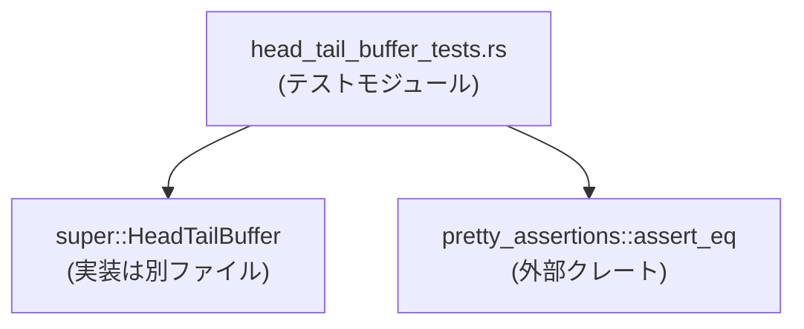
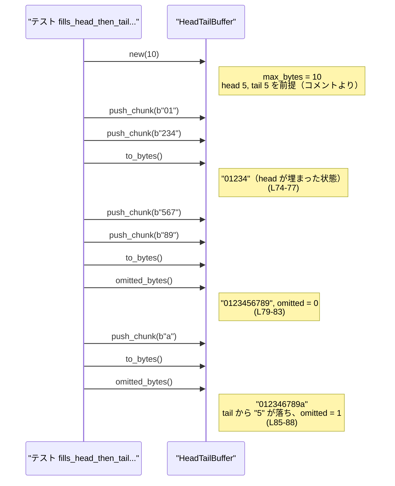

# core\src\unified_exec\head_tail_buffer_tests.rs コード解説

## 0. ざっくり一言

`HeadTailBuffer` 型について、**先頭（head）と末尾（tail）だけを保持しつつ、容量を超えた分のバイト数をカウントする** ための挙動を検証する単体テスト群のファイルです（`super::HeadTailBuffer` を対象としたテスト）（`core\src\unified_exec\head_tail_buffer_tests.rs:L1,L5-88`）。

---

## 1. このモジュールの役割

### 1.1 概要

- このモジュールは `HeadTailBuffer` の **挙動の契約（contract）をテストとして定義する** 役割を持ちます（`L1,L5-88`）。
- 特に次の点を検証します。
  - `max_bytes` が 0 / 1 / 10 のときの保持・省略ルール（`L21-40,L71-88`）
  - 容量超過時に「先頭 + 末尾だけを残して中間を省略」すること（`L5-19,L57-68,L71-88`）
  - `drain_chunks` 実行後に内部状態がリセットされること（`L42-54`）

### 1.2 アーキテクチャ内での位置づけ

このファイルは親モジュールに定義された `HeadTailBuffer` 型に依存し、その挙動をテストします。外部クレートとして `pretty_assertions` の `assert_eq` を利用します（`L1-3`）。



### 1.3 設計上のポイント（テスト観点）

コードから読み取れるテスト設計上の特徴です。

- **容量ベースの挙動を中心にテスト**
  - `max_bytes` = 0, 1, 10 といった代表的な値で動作を確認しています（`L21-24,L33-35,L71-72`）。
- **head/tail の分割と省略バイト数の契約を明示**
  - `max_bytes = 10` の場合、head 5 バイト＋tail 5 バイトになることをコメントで前提にしています（`L61,L74-82,L85-88`）。
- **状態リセット API の振る舞いを確認**
  - `drain_chunks` 呼び出し後に `retained_bytes` / `omitted_bytes` / `to_bytes` が初期状態に戻ることをテストしています（`L42-54`）。
- **テストはすべて単一スレッド**
  - マルチスレッドや並行実行は登場せず、`&mut buf` を通じた排他的操作のみです（`L7,L23,L34,L44,L58,L72`）。

---

## 2. 主要な機能一覧

このファイルに実装されているのはすべて **テスト関数** です。各テストが検証している機能をまとめます。

- `keeps_prefix_and_suffix_when_over_budget`  
  容量超過時に、先頭と末尾のみを保持し、中間が省略されることを確認します（`L5-19`）。
- `max_bytes_zero_drops_everything`  
  `max_bytes = 0` の場合、受け取ったバイト列を一切保持せず、すべて「省略」扱いにすることを確認します（`L21-30`）。
- `head_budget_zero_keeps_only_last_byte_in_tail`  
  `max_bytes = 1` の場合、最後の 1 バイトだけが保持されることを確認します（`L32-40`）。
- `draining_resets_state`  
  `drain_chunks` 呼び出しで保持バイト数・省略バイト数・内容がリセットされることを確認します（`L42-54`）。
- `chunk_larger_than_tail_budget_keeps_only_tail_end`  
  tail の許容量より大きいチャンクを push したとき、そのチャンクの末尾だけが tail として保持されることを確認します（`L56-68`）。
- `fills_head_then_tail_across_multiple_chunks`  
  head と tail が複数チャンクをまたいで埋まるケースと、その後の容量超過で tail の最古バイトが落ちることを確認します（`L70-88`）。

### 2.1 コンポーネント一覧（このファイルで確認できる要素）

| 名前 | 種別 | 定義/使用 | 役割 / 用途 | 根拠 |
|------|------|-----------|-------------|------|
| `HeadTailBuffer` | 型（具体的な種別は不明） | 使用のみ | head/tail バッファのテスト対象。最大バイト数に応じて先頭と末尾を保持し、省略バイト数を管理する型として前提にされています。 | `L1,L7,L23,L34,L44,L58,L72` |
| `keeps_prefix_and_suffix_when_over_budget` | テスト関数 | 定義 | 容量超過時に head + tail だけが残ること、および `omitted_bytes` が正になることを検証します。 | `L5-19` |
| `max_bytes_zero_drops_everything` | テスト関数 | 定義 | `max_bytes = 0` のとき、すべての入力が省略扱いになることを検証します。 | `L21-30` |
| `head_budget_zero_keeps_only_last_byte_in_tail` | テスト関数 | 定義 | `max_bytes = 1` で最後の 1 バイトのみ保持されることを検証します。 | `L32-40` |
| `draining_resets_state` | テスト関数 | 定義 | `drain_chunks` 後に内部状態が空に戻ることを検証します。 | `L42-54` |
| `chunk_larger_than_tail_budget_keeps_only_tail_end` | テスト関数 | 定義 | tail 許容量より大きなチャンクを push した場合、末尾だけが tail に残ることを検証します。 | `L56-68` |
| `fills_head_then_tail_across_multiple_chunks` | テスト関数 | 定義 | 複数チャンクにまたがる head/tail の構築と容量超過時の tail の挙動を検証します。 | `L70-88` |

---

## 3. 公開 API と詳細解説

このファイル自体は公開 API を定義していませんが、テストを通じて `HeadTailBuffer` が提供するメソッドの契約が見えます。ここでは **テストから読み取れる範囲で** そのメソッドの挙動を整理します。

### 3.1 型一覧（構造体・列挙体など）

| 名前 | 種別 | 役割 / 用途 | 根拠 |
|------|------|-------------|------|
| `HeadTailBuffer` | 不明（親モジュールで定義。構造体である可能性が高いが、このファイルだけでは断定不可） | head と tail だけを保持し、途中のバイトを省略するバッファとしてテストされています。最大総バイト数 `max_bytes` を受け取り、それを head/tail に分割して使う前提になっています。 | インポートと利用（`L1,L7,L23,L34,L44,L58,L72`）、コメント（`L61,L74-82,L85-88`） |

### 3.2 `HeadTailBuffer` の主要メソッド（テストから読み取れる契約）

> 注: ここに示す型・シグネチャは **テストから推測されるインターフェース** であり、正確な型定義は `HeadTailBuffer` の実装ファイルを確認する必要があります。

---

#### `HeadTailBuffer::new(max_bytes)`

**概要**

- 最大保持バイト数 `max_bytes` を指定して新しいバッファを生成します。
- `max_bytes` に応じて「head 部分」と「tail 部分」の容量が決まる前提でテストされています（`max_bytes = 10` のとき head 5 バイト + tail 5 バイト、`L61,L74-82`）。

**引数**

| 引数名 | 型 | 説明 |
|--------|----|------|
| `max_bytes` | 不明（整数リテラルから推測すると整数型） | バッファが保持する合計バイト数の上限。0 や 1 も許可されます（`L23,L34,L72`）。 |

**戻り値**

- 新しい `HeadTailBuffer` インスタンス。
- 初期状態では `retained_bytes() == 0`、`omitted_bytes() == 0` であると考えるのが自然ですが、このファイル内では初期状態のカウンタは直接確認されていません。

**内部処理の流れ（テストからの推測）**

1. `max_bytes` を内部に保持する。
2. `max_bytes > 0` の場合、head/tail の容量に分割する。
   - `max_bytes = 10` → head 5 バイト、tail 5 バイト（コメントより、`L61,L74-82`）。
   - `max_bytes = 1` → head 0 バイト、tail 1 バイト（テスト名より、`L32-40`）。
3. 保持バイト数・省略バイト数カウンタを 0 に初期化する。

**Examples（使用例）**

```rust
// max_bytes = 10 の HeadTailBuffer を生成し、head 5 バイト + tail 5 バイトを想定する
let mut buf = HeadTailBuffer::new(/*max_bytes*/ 10); // `L7,L44,L58,L72` 相当
buf.push_chunk(b"0123456789".to_vec());              // ちょうど 10 バイトなので省略なし
assert_eq!(buf.omitted_bytes(), 0);
```

**Errors / Panics**

- テストでは `new` がエラーを返すケースは扱っておらず、panic 条件も確認されていません。このチャンクからはエラーや panic の有無は分かりません。

**Edge cases（エッジケース）**

- `max_bytes = 0`  
  - すべての入力が省略扱いになり、保持バイト数 0 であることがテストされています（`L21-30`）。
- `max_bytes = 1`  
  - head は 0 バイト、tail に最後の 1 バイトのみが保持される前提でテストされています（`L32-40`）。

**使用上の注意点**

- `max_bytes = 0` を指定するとバッファには何も残らず、`to_bytes()` は常に空になります（`L21-30`）。
- head/tail の具体的な分割ルール（特に奇数値）の詳細はこのファイルからは分からないため、正確な挙動は実装を確認する必要があります。

---

#### `push_chunk(...)`

**概要**

- 新しいバイト列チャンクをバッファに追加します（`L9,L13,L24,L35,L45-46,L62,L75-76,L80-81,L86`）。
- 上限 `max_bytes` まで head と tail にデータを保持し、それを超えた分を「省略」としてカウントします。

**引数**

| 引数名 | 型 | 説明 |
|--------|----|------|
| `chunk` | テストでは `Vec<u8>` が渡されている | 追加するバイト列チャンク。`b"..." .to_vec()` で渡されています（`L9,L13,L24,L35,L45-46,L62,L75-76,L80-81,L86`）。 |

**戻り値**

- 戻り値は使われておらず、戻り値型は不明です（おそらく `()`）。

**内部処理の流れ（テストから読み取れる挙動）**

1. `max_bytes` に対して、まだ余裕がある分は head および tail に追加されます。
   - 例: `max_bytes = 10` で `"01"` → `"234"` → `"567"` → `"89"` と追加すると、`to_bytes()` は `"0123456789"` になります（`L71-82`）。
2. 合計バイト数が `max_bytes` を超える場合、
   - head はそのまま保持され（`max_bytes = 10` のとき `"01234"`）、（`L5-9,L57-60,L74-77`）
   - tail 側で古いバイトから順に落とし、常に tail 容量分だけ末尾を保持します。
     - `"0123456789"` に `"a"` を追加すると、tail `"56789"` の最古 `"5"` が落ち、`"6789a"` となります（結果 `"012346789a"`、`L85-88`）。
3. `chunk.len()` が tail 容量より大きい場合、
   - コメント上は「このチャンクが tail を置き換え、その末尾だけを保持する」ことが期待されています（`L61-62`）。
   - 具体例: `"0123456789"` に `"ABCDEFGHIJK"` を追加した場合、`to_bytes()` の末尾は `"GHIJK"` になります（`L64-66`）。

**Examples（使用例）**

```rust
// head 5 バイト + tail 5 バイトを持つバッファに対する push の使用例
let mut buf = HeadTailBuffer::new(10);                 // max_bytes = 10 を指定（`L72` 相当）
buf.push_chunk(b"01".to_vec());                       // head を部分的に埋める（`L75`）
buf.push_chunk(b"234".to_vec());                      // head 完成: "01234"（`L76-77`）
buf.push_chunk(b"567".to_vec());                      // tail を部分的に埋める（`L80`）
buf.push_chunk(b"89".to_vec());                       // tail 完成: "56789"（`L81-82`）
assert_eq!(buf.to_bytes(), b"0123456789".to_vec());   // 省略なし（`L82-83`）
```

**Errors / Panics**

- このファイルでは `push_chunk` がエラーや panic を起こすケースは登場しません。

**Edge cases（エッジケース）**

- `max_bytes = 0` のバッファに対して `push_chunk` すると、
  - `retained_bytes() == 0`、`omitted_bytes()` が入力サイズ分だけ増え、`to_bytes()` は空のままになります（`L21-30`）。
- `chunk.len()` > tail 容量の場合、
  - コメントより、そのチャンクの末尾だけが tail に残ることが期待されています（`L61-66`）。

**使用上の注意点**

- head/tail のポリシーにより、一度 push したバイト列が必ず保存されるとは限りません。ログなどに使う場合は、省略される可能性を前提にする必要があります。
- 大きなチャンクを push すると、それまでの tail が丸ごと失われる可能性がある点（`L61-66`）に注意が必要です。

---

#### `to_bytes() -> Vec<u8>`

**概要**

- 現在バッファに保持されている head + tail のバイト列を `Vec<u8>` として取得します。

**戻り値**

- `Vec<u8>`。テスト内で `Vec<u8>` 比較が行われているため、戻り値型は `Vec<u8>` であるとわかります（`L28,L39,L53,L77,L82,L87`）。

**挙動（テストから）**

- `max_bytes = 0` の場合、常に空の `Vec<u8>` を返します（`L28`）。
- `max_bytes = 1` で `"abc"` を push した後は、`b"c"` のみを返します（`L35,L39`）。
- `max_bytes = 10` で `"0123456789"` を埋めた場合は `"0123456789"` を返し、その後 `"a"` を追加すると `"012346789a"` になります（`L71-82,L85-88`）。
- 容量超過時には head の先頭＋tail の末尾だけを含む文字列になります。
  - `"0123456789" + "ab"` → `"01234...89ab"` の形（`starts_with("01234")` と `ends_with("89ab")` を満たす）（`L5-19`）。
  - `"0123456789" + "ABCDEFGHIJK"` → `"01234...GHIJK"`（`L57-68`）。

**Examples（使用例）**

```rust
let mut buf = HeadTailBuffer::new(10);
buf.push_chunk(b"0123456789".to_vec());
buf.push_chunk(b"a".to_vec());

let out = buf.to_bytes();                            // 現在の head + tail を取得
assert_eq!(out, b"012346789a".to_vec());             // tail の最古 "5" が落ちている（`L85-88`）
```

**Edge cases**

- 空のバッファでは空の `Vec<u8>` を返すと考えられますが、このファイルでは「push 前の状態」での `to_bytes()` は直接テストされていません。
- `drain_chunks` 直後には空の `Vec<u8>` を返すことがテストされています（`L51-53`）。

**使用上の注意点**

- `to_bytes()` は head と tail だけを連結した値を返し、中間は含まれません。ストリーム全体の生データとしては不完全である点に注意が必要です。
- `String::from_utf8_lossy` と組み合わせて文字列として検査されていますが（`L16,L64`）、バイト列として扱う場合は直接 `Vec<u8>` 比較を使うのが明示的です。

---

#### `omitted_bytes()`

**概要**

- これまでにバッファから省略されたバイト数を返します。

**戻り値**

- 整数型（0 や 3 との比較、`> 0` の比較に使われていることから、おそらく `usize` などの非負整数型）（`L10,L14,L27,L37-38,L67-68,L83,L88`）。

**挙動（テストから）**

- head + tail に収まる範囲では 0 のままです。
  - `"0123456789"` だけを push した時点では 0（`L9-10`）。
  - `"0123456789"` を head/tail に分けて埋めた時点でも 0（`L71-83`）。
- 容量超過時に増加します。
  - `"0123456789"` に `"ab"` を追加したあと、`omitted_bytes() > 0` が成り立ちます（`L13-14`）。
  - `"0123456789"` に `"ABCDEFGHIJK"` を追加したあとも `> 0`（`L62,L67`）。
  - `"0123456789"` に `"a"` を追加したケースでは、ちょうど 1 バイトが省略され `omitted_bytes() == 1` になります（`L85-88`）。
- `max_bytes = 0` では、入力バイト数がすべて省略扱いとなり、その数値が返されます（`"abc"` → 3、`L24,L27`）。

**Edge cases**

- `drain_chunks` を呼び出すと 0 にリセットされます（`L42-54`）。

**使用上の注意点**

- このカウンタは「**過去に省略された総バイト数**」であり、現在 tail に保持されている要素数とは無関係です。
- ログなどで「どの程度切り詰められたか」を把握したい場合に使用できますが、何が省略されたか（内容）は分かりません。

---

#### `retained_bytes()`

**概要**

- 現時点でバッファに実際に保持されているバイト数（head + tail の合計）を返します。

**戻り値**

- 整数型。0 および 1 と比較されていることから非負整数型であると推測されます（`L26,L37,L51`）。

**挙動（テストから）**

- `max_bytes = 0` では、何を push しても常に 0 です（`L21-30`）。
- `max_bytes = 1` で `"abc"` を push した後は 1 です（`L34-39`）。
- `drain_chunks` 後は 0 にリセットされます（`L42-54`）。

**Edge cases**

- `max_bytes > 0` で head + tail が埋まった状態（`L71-82`）の retained_bytes の値はこのファイルでは直接確認されていませんが、10 であると考えられます。

**使用上の注意点**

- `omitted_bytes()` と組み合わせることで、「総入力バイト数 ≒ retained_bytes() + omitted_bytes()」という関係を推測できます（ただし、この関係を直接テストしてはいません）。

---

#### `snapshot_chunks()`

**概要**

- 内部に保持しているチャンク単位のスナップショットを `Vec<Vec<u8>>` のような形で返す関数と推測されます。

**戻り値**

- `Vec<Vec<u8>>` かそれと互換な型。テストでは `Vec::<Vec<u8>>::new()` と比較しています（`L29`）。

**挙動（テストから）**

- `max_bytes = 0` で `"abc"` を push した場合、`snapshot_chunks()` は空の `Vec::<Vec<u8>>` を返します（`L21-30`）。
- つまり、「保持しているチャンクが 1 つもない」状態では空コレクションを返すことが分かります。

**Edge cases**

- バッファがデータを保持している状態での `snapshot_chunks()` の挙動（何チャンクに分かれて返るか等）はこのファイルではテストされていません。

**使用上の注意点**

- 「チャンク構造を保ったまま中身を取り出したい」用途で使用する関数と考えられますが、head/tail の境界の扱いなど詳細は実装を確認する必要があります。

---

#### `drain_chunks()`

**概要**

- バッファに保持されているチャンクをすべて取り出し、内部状態を空にリセットする関数です（`L48-53`）。

**戻り値**

- `.is_empty()` が呼び出せるコレクション型（テストでは `!drained.is_empty()` を確認しているのみです）（`L48-49`）。
- 実装としては `Vec<Vec<u8>>` の可能性が高いですが、このファイルだけでは確定できません。

**内部処理の流れ（テストから読み取れる挙動）**

1. 現在保持しているチャンク群を返り値として返す（返却された `drained` は空でないとテストされています、`L48-49`）。
2. 内部の保持データをすべて削除し、`retained_bytes()` を 0 にリセットする（`L51`）。
3. 省略バイト数カウンタ `omitted_bytes()` を 0 にリセットする（`L52`）。
4. `to_bytes()` も空の `Vec<u8>` を返すようになる（`L53`）。

**Examples（使用例）**

```rust
let mut buf = HeadTailBuffer::new(10);
buf.push_chunk(b"0123456789".to_vec());
buf.push_chunk(b"ab".to_vec());

let drained = buf.drain_chunks();                     // チャンクをすべて取り出す（`L48`）
assert!(!drained.is_empty());                         // 何らかのデータが返ってくる（`L49`）

// drain 後は内部状態が初期化されている
assert_eq!(buf.retained_bytes(), 0);                  // `L51`
assert_eq!(buf.omitted_bytes(), 0);                   // `L52`
assert_eq!(buf.to_bytes(), b"".to_vec());             // `L53`
```

**Edge cases**

- すでに空の状態で `drain_chunks()` を呼んだ場合の挙動は、このファイルではテストされていません。

**使用上の注意点**

- drain 後に再利用する前提で設計されているため、`HeadTailBuffer` を長期間使い回す際には、適切なタイミングで `drain_chunks()` を呼ぶことが想定されます。
- drain によって `omitted_bytes()` も 0 に戻るため、省略バイト数の累積を長期的に観測したい場合は、drain 前に値を退避しておく必要があります。

---

### 3.3 その他の関数（テスト関数）

テスト関数はすべて `#[test]` 属性付きで、外部から直接呼び出す用途ではなく、`HeadTailBuffer` の挙動検証に使われます。

| 関数名 | 役割（1 行） | 根拠 |
|--------|--------------|------|
| `keeps_prefix_and_suffix_when_over_budget` | 容量超過時に head + tail のみが保持されること、および `omitted_bytes` が正になることを検証します。 | `L5-19` |
| `max_bytes_zero_drops_everything` | `max_bytes = 0` で入力がすべて省略されることを検証します。 | `L21-30` |
| `head_budget_zero_keeps_only_last_byte_in_tail` | `max_bytes = 1` で最後の 1 バイトのみ保持されることを検証します。 | `L32-40` |
| `draining_resets_state` | `drain_chunks` 後にバッファが空状態に戻ることを検証します。 | `L42-54` |
| `chunk_larger_than_tail_budget_keeps_only_tail_end` | tail 容量を超えるチャンク追加時に、そのチャンク末尾だけが tail に残ることを検証します。 | `L56-68` |
| `fills_head_then_tail_across_multiple_chunks` | 複数チャンクを通じた head/tail の埋まり方と、容量超過時の tail の挙動を検証します。 | `L70-88` |

---

## 4. データフロー

ここでは、もっとも典型的なシナリオである `fills_head_then_tail_across_multiple_chunks` を例に、データがどのように流れるかを説明します（`L70-88`）。

### 4.1 シナリオ概要

1. `max_bytes = 10` の `HeadTailBuffer` を生成する（`L71-72`）。
2. 小さなチャンク `"01"` と `"234"` を順に push して、合計 5 バイトの head を構成する（`L74-77`）。
3. `"567"` と `"89"` を push して合計 10 バイトに達し、tail 5 バイトを構成する（`L79-82`）。
4. さらに `"a"` を push すると、tail の最古のバイト `"5"` が落ち、`"6789a"` になり、`omitted_bytes()` が 1 になる（`L85-88`）。

### 4.2 シーケンス図



この図から、`HeadTailBuffer` が「head は固定、tail はリングバッファ的に末尾を維持し、古い tail バイトを落とす」というデータフローになっていることが分かります（あくまでテストから見た表面的な挙動です）。

---

## 5. 使い方（How to Use）

### 5.1 基本的な使用方法

このファイルはテストですが、そのまま `HeadTailBuffer` の基本的な使い方の例になっています。以下は `max_bytes = 10` のバッファに対して head と tail を構成し、省略バイト数を確認する簡略例です。

```rust
// 注意: HeadTailBuffer の実際のパスはこのファイルからは分かりません。
// ここでは、同じモジュール階層にあると仮定した疑似コードです。

fn demo_usage(mut buf: HeadTailBuffer) {
    // 10 バイト分の head + tail を保持できるバッファが渡されているとする

    buf.push_chunk(b"0123456789".to_vec());           // ちょうど 10 バイト埋める
    assert_eq!(buf.to_bytes(), b"0123456789".to_vec()); // まだ省略なし
    assert_eq!(buf.omitted_bytes(), 0);

    buf.push_chunk(b"ab".to_vec());                   // 2 バイト追加し、容量超過させる
    let rendered = String::from_utf8_lossy(&buf.to_bytes()).to_string();
    assert!(rendered.starts_with("01234"));           // head の 5 バイトはそのまま
    assert!(rendered.ends_with("89ab"));              // tail 側には末尾のバイト列が残る
    assert!(buf.omitted_bytes() > 0);                 // 中間バイトが省略された
}
```

このように、**`push_chunk` → `to_bytes` → `omitted_bytes`** というパターンでメインの挙動を確認できます。

### 5.2 よくある使用パターン

1. **ログや標準出力のトランケーション**
   - 大量の出力を head と tail だけ残して中間を省略しつつ、何バイト省略されたかを `omitted_bytes` で把握する、という使い方が想定されます（テストコメントの内容からの推測であり、このチャンクだけでは用途は断定できません）。
2. **容量 0 や 1 の特殊モード**
   - `max_bytes = 0` により、「内容は保持しないが省略バイト数だけ記録する」モードが実現できます（`L21-30`）。
   - `max_bytes = 1` により、「常に最後の 1 バイトだけ保持する」モードとなります（`L32-40`）。

### 5.3 よくある間違い（起こりうる誤解）

このファイルから推測される、誤解・誤用の可能性を挙げます。

```rust
// 誤解しやすい例: max_bytes = 0 でも一部は保持されると思っている
let mut buf = HeadTailBuffer::new(0);
buf.push_chunk(b"abc".to_vec());

// これは誤り: 何かしらデータが残ると期待している
// assert_eq!(buf.to_bytes(), b"abc".to_vec());

// 正しい理解: すべて省略され、保持バイト数は 0
assert_eq!(buf.to_bytes(), b"".to_vec());            // `L28`
assert_eq!(buf.retained_bytes(), 0);                 // `L26`
assert_eq!(buf.omitted_bytes(), 3);                  // `L27`
```

- また、tail のバイト列が「追加された順にすべて残る」と誤解すると、`"0123456789" + "a"` → `"0123456789a"` を期待してしまいますが、実際には `"012346789a"` となり、最古の tail バイトが落ちます（`L85-88`）。

### 5.4 使用上の注意点（まとめ）

- **容量超過時のトリミング**
  - head（先頭）と tail（末尾）以外は保持されないため、ストリーム全体を再構成する用途には適しません。
- **`max_bytes = 0` は「何も保持しない」モード**
  - `to_bytes()`・`snapshot_chunks()` は常に空になりますが、省略バイト数だけは記録されます（`L21-30`）。
- **`drain_chunks` の影響範囲**
  - drain 後は内容だけでなく `omitted_bytes()` も 0 に戻るため、「どれだけ省略されたか」を長期的に追跡する用途では、drain のタイミングに注意が必要です（`L42-54`）。
- **並行性**
  - テストはすべて単一スレッドで `&mut buf` を使っており、スレッド安全性についてはこのファイルからは分かりません。

---

## 6. 変更の仕方（How to Modify）

このファイルはテスト専用です。`HeadTailBuffer` の仕様を変更する際には、ここにあるテストも合わせて見直す必要があります。

### 6.1 新しい機能を追加する場合（テスト追加の観点）

1. **追加する仕様を明確化**
   - 例: 「エラーメッセージ用に省略部分の長さを別途記録したい」など。
2. **既存のテストを参考にシナリオを設計**
   - `max_bytes` の代表値（0, 1, 通常値）ごとにどう振る舞うべきかを決めます（`L21-40,L71-88`）。
3. **新しいテスト関数を追加**
   - `#[test]` 属性を付け、`HeadTailBuffer` の公開メソッドだけを使って仕様を検証します。
4. **必要であれば既存のテストとの整合性を確認**
   - 新しい挙動が既存のテストと矛盾しないか、あるいは仕様変更としてどのテストを更新・削除すべきかを検討します。

### 6.2 既存の機能を変更する場合（仕様変更の観点）

- **影響範囲の確認**
  - このファイルの各テスト関数が `HeadTailBuffer` のどの挙動を前提としているかを整理します。
    - head/tail の分割: `fills_head_then_tail_across_multiple_chunks`（`L70-88`）
    - tail 置き換えルール: `chunk_larger_than_tail_budget_keeps_only_tail_end`（`L56-68`）
    - max_bytes = 0 / 1 の挙動: `max_bytes_zero_drops_everything` / `head_budget_zero_keeps_only_last_byte_in_tail`（`L21-40`）
- **契約（前提条件・戻り値の意味）の確認**
  - `omitted_bytes()` が何を数えているか（省略された総バイト数）という契約を変える場合、複数のテストに影響します（`L10,L14,L27,L37-38,L67-68,L83,L88`）。
- **テストの更新**
  - 仕様変更に伴って期待値が変わる場合、該当テストの `assert!` / `assert_eq!` を新しい仕様に即して書き換えます。
- **回帰テスト**
  - 変更後にテストを実行し、意図しない挙動の変化がないかを確認することが重要です。

---

## 7. 関連ファイル

このファイルと密接に関連する要素をまとめます。

| パス / 要素 | 役割 / 関係 |
|------------|------------|
| `super::HeadTailBuffer` | 本テストファイルが対象としているバッファ型です。親モジュールに定義され、このファイルでは `use super::HeadTailBuffer;` としてインポートされています（`L1`）。具体的な定義ファイル（例: `head_tail_buffer.rs` など）のパスは、このチャンクには現れません。 |
| `pretty_assertions` クレート | より分かりやすい差分表示を行う `assert_eq!` マクロを提供する外部依存です（`L3`）。`Cargo.toml` の依存設定に現れるはずですが、その内容はこのチャンクには含まれていません。 |

---

### バグ・セキュリティ・パフォーマンスに関する補足（このファイルから読み取れる範囲）

- **バグの兆候**
  - テスト内容から明白な矛盾は見当たりません。逆に、edge case（`max_bytes = 0`、`chunk.len() > tail_budget`）がきちんとテストされているため、その点の挙動は明確です（`L21-30,L56-68`）。
- **セキュリティ**
  - 生バイト列を扱いますが、このファイルでは外部との入出力やメモリ安全性にかかわる操作（unsafe ブロックなど）は登場しません。
- **パフォーマンス / スケーラビリティ**
  - テストからは、`max_bytes` が固定の小さな値で使われる前提が多く、超大きなバッファや大量チャンクのケースは検証されていません。この点のスケーラビリティは、このチャンクからは評価できません。
