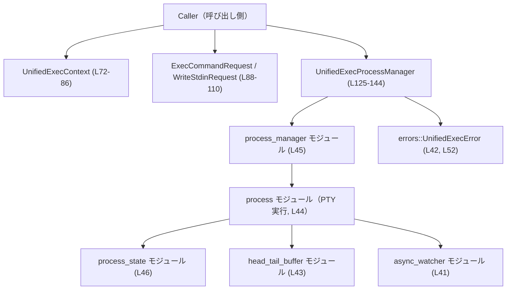
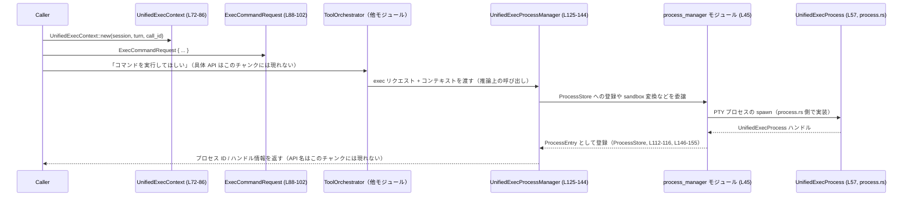

# core/src/unified_exec/mod.rs コード解説

## 0. ざっくり一言

対話型プロセス実行（PTY）を、承認・サンドボックス・再利用ポリシーと統合して扱うための「ユニファイド exec」レイヤーの、共通コンテキスト・リクエスト型・プロセスマネージャの土台とユーティリティを定義するモジュールです。  
実際のプロセス生成やポリシー処理は `process.rs` / `process_manager.rs` などのサブモジュールに分離されています（`core/src/unified_exec/mod.rs:L1-L23, L41-L46`）。

---

## 1. このモジュールの役割

### 1.1 概要

このモジュールは、**対話的なコマンド実行を、承認フロー・サンドボックス選択・プロセス再利用と一体化して扱うための土台**を提供します。

- セッション・ターン・呼び出し ID をまとめた `UnifiedExecContext` を定義します（`L72-L86`）。
- コマンド実行や stdin 書き込みのためのリクエスト型 (`ExecCommandRequest`, `WriteStdinRequest`) を定義します（`L88-L110`）。
- 実行中プロセスを管理するための `ProcessStore` および `UnifiedExecProcessManager` の構造を定義し、内部共有状態を `tokio::Mutex` で保護します（`L112-L128, L130-L137`）。
- yield 時間や出力トークン数の上限など、実行制御に関する定数とユーティリティ関数を提供します（`L59-L67, L69-L70, L157-L163`）。
- 実際のプロセス実行ロジック・エラー型をサブモジュールから再公開します（`L41-L46, L52-L57`）。

これにより、上位のツールオーケストレータからは統一された API でプロセス実行を扱えるようになっています（`L1-L17`）。

### 1.2 アーキテクチャ内での位置づけ

モジュール先頭のコメントに、全体フローとサブモジュールの役割が記述されています（`L1-L23`）。

- `ToolOrchestrator`（別モジュール。ここには定義なし）が、承認とサンドボックス選択を担当します（`L5-L7, L12-L16`）。
- 本モジュールは、そのためのコンテキストとプロセス管理の骨格を提供し、
  - `process_manager.rs` が承認・サンドボックス・プロセス再利用のオーケストレーションを担当（`L23, L45`）。
  - `process.rs` が PTY プロセスライフサイクルと出力バッファリングを担当（`L21, L44`）。
  - `process_state.rs` がローカル／リモートプロセスの終了状態共有を担当（`L22, L46`）。
  - `async_watcher.rs` / `head_tail_buffer.rs` は補助ユーティリティとして機能（`L41, L43`）。
- エラー型は `errors.rs` で定義され、`UnifiedExecError` として再公開されます（`L42, L52`）。

依存関係を簡略図にすると、次のようになります。



> この図の矢印は「利用する／呼び出す」関係を表します。具体的な関数名や詳細なフローはサブモジュール側にあり、このチャンクには現れません。

### 1.3 設計上のポイント

コードとコメントから読み取れる設計上の特徴は次のとおりです。

- **責務の分割**（`L19-L23, L41-L46`）
  - プロセス実行のポリシー・承認・サンドボックス選択 → `process_manager.rs`。
  - 実際の PTY プロセス生成・監視 → `process.rs`。
  - 終了状態の共有 → `process_state.rs`。
  - 本ファイルはそれらの**型定義・再エクスポート・上限値の定義**に集中しています。

- **状態管理と並行性**（`L112-L128, L130-L137`）
  - 実行中プロセスは `ProcessStore` に保持され、`UnifiedExecProcessManager` 内で共有されます。
  - `ProcessStore` は `tokio::Mutex` で包まれ、非同期タスク間から安全に排他的アクセスができる設計です。

- **安全性（Rust 的観点）**
  - 共有オブジェクト（`Session`, `UnifiedExecProcess`）は `Arc` / `Weak` で管理し、所有権の衝突や二重解放を避けています（`L27-L28, L72-L75, L147-L154`）。
  - `ProcessEntry` は `Weak<Session>` を保持しており、セッション終了後にメモリリークなく開放できる構造です（`L147-L154`）。
  - `WriteStdinRequest<'a>` は `&'a str` を使っており、入力データのライフタイムをコンパイル時に保証します（`L104-L110`）。

- **制限値とフェイルセーフ**（`L59-L67, L69-L70, L157-L163`）
  - yield 時間や出力トークン数、プロセス数に対して上限値／下限値を定義し、`clamp_yield_time` や `resolve_max_tokens` で制御します。
  - プロセス数が警告閾値を超えた場合に「モデルへ警告メッセージを送る」ことを示唆する定数が定義されています（実際の処理は他モジュール、`L69-L70`）。

### 1.4 コンポーネントインベントリー（概要）

主要な構造体・関数・定数の一覧と定義位置です。詳細は後続セクションで説明します。

#### 構造体・内部エントリ

| 名前 | 種別 | 可視性 | 役割 / 用途 | 定義位置 |
|------|------|--------|-------------|----------|
| `UnifiedExecContext` | 構造体 | `pub(crate)` | セッション・ターン・呼び出し ID をまとめた実行コンテキスト | `core/src/unified_exec/mod.rs:L72-L86` |
| `ExecCommandRequest` | 構造体 | `pub(crate)` | プロセス生成時のコマンド・作業ディレクトリ・サンドボックス権限などをまとめたリクエスト | `L88-L102` |
| `WriteStdinRequest<'a>` | 構造体 | `pub(crate)` | 既存プロセスへの stdin 追加入力と出力取得のためのリクエスト | `L104-L110` |
| `ProcessStore` | 構造体 | 非公開 | 実行中プロセスと予約済み ID を保持する内部ストア | `L112-L116` |
| `UnifiedExecProcessManager` | 構造体 | `pub(crate)` | `ProcessStore` を `tokio::Mutex` で包んだプロセスマネージャ | `L125-L128` |
| `ProcessEntry` | 構造体 | 非公開 | 1 プロセスのハンドル・コマンド情報・セッションへの弱参照・最終使用時刻を保持 | `L146-L155` |

#### 関数・メソッド

| 名前 | 種別 | 役割 | 定義位置 |
|------|------|------|----------|
| `set_deterministic_process_ids_for_tests(enabled: bool)` | 関数 | テスト用にプロセス ID の決定性制御をサブモジュールへ伝える | `L48-L50` |
| `UnifiedExecContext::new(...)` | メソッド | `UnifiedExecContext` のコンストラクタ | `L78-L85` |
| `ProcessStore::remove(&mut self, process_id: i32)` | メソッド | ストアからプロセスを削除し、ID 予約も解除する | `L118-L122` |
| `UnifiedExecProcessManager::new(max_write_stdin_yield_time_ms: u64)` | 関連関数 | マネージャを初期化し、yield 上限を補正して保存する | `L130-L137` |
| `UnifiedExecProcessManager::default()` | trait 実装 | デフォルトのマネージャを生成（`new` のラッパー） | `L140-L143` |
| `clamp_yield_time(yield_time_ms: u64)` | 関数 | 渡された yield 時間を最小〜最大の範囲に収める | `L157-L159` |
| `resolve_max_tokens(max_tokens: Option<usize>)` | 関数 | `None` の場合にデフォルトトークン数へフォールバックする | `L161-L163` |
| `generate_chunk_id()` | 関数 | 6 桁の 16 進数文字列からなるチャンク ID を生成する | `L165-L169` |

#### 再エクスポートされる型

| 名前 | 元モジュール | 可視性 | 役割（このチャンクから分かる範囲） | 定義位置 |
|------|--------------|--------|--------------------------------------|----------|
| `UnifiedExecError` | `errors` | `pub(crate)` | 統一 exec 経路で用いられるエラー型 | `L42, L52` |
| `NoopSpawnLifecycle` | `process` | `pub(crate)` | スポーンライフサイクルの no-op 実装（詳細は `process.rs`） | `L44, L49` |
| `SpawnLifecycle` | `process` | `pub(crate)`（Unixのみ） | プロセススポーン時のライフサイクルフックを表す型 | `L50-L51` |
| `SpawnLifecycleHandle` | `process` | `pub(crate)` | ライフサイクルのハンドル型（詳細不明） | `L52, L56` |
| `UnifiedExecProcess` | `process` | `pub(crate)` | 実行中プロセスのハンドルとみなせる型 | `L52, L57` |

#### 主な定数

| 名前 | 型 | 意味 | 定義位置 |
|------|----|------|----------|
| `MIN_YIELD_TIME_MS` | `u64` | yield 時間の下限（通常の出力待ち） | `L59` |
| `MIN_EMPTY_YIELD_TIME_MS` | `u64` | 空の `write_stdin` 用の最小 yield 時間 | `L60-L57` のコメント+定義 |
| `MAX_YIELD_TIME_MS` | `u64` | yield 時間の上限 | `L62` |
| `DEFAULT_MAX_BACKGROUND_TERMINAL_TIMEOUT_MS` | `u64` | バックグラウンド端末のデフォルトタイムアウト | `L63` |
| `DEFAULT_MAX_OUTPUT_TOKENS` | `usize` | 出力トークン数のデフォルト上限 | `L64` |
| `UNIFIED_EXEC_OUTPUT_MAX_BYTES` | `usize` | 出力バイト数の絶対上限（1 MiB） | `L65` |
| `UNIFIED_EXEC_OUTPUT_MAX_TOKENS` | `usize` | 上記バイト数を 4 で割ったトークン数上限 | `L66` |
| `MAX_UNIFIED_EXEC_PROCESSES` | `usize` | 同時プロセス数の上限 | `L67` |
| `WARNING_UNIFIED_EXEC_PROCESSES` | `usize` | 警告メッセージを送るプロセス数閾値 | `L69-L70` |

---

## 2. 主要な機能一覧

このモジュールが提供する主な機能は次のとおりです。

- **実行コンテキストの表現**  
  `UnifiedExecContext` により、セッション/ターン/呼び出し ID を束ね、exec 呼び出しごとの文脈を保持します（`L72-L86`）。

- **コマンド実行リクエストの表現**  
  `ExecCommandRequest` で、コマンド・作業ディレクトリ・ネットワークプロキシ・TTY かどうか・サンドボックス権限・追加権限などをまとめて扱います（`L88-L102`）。

- **stdin 書き込みリクエストの表現**  
  `WriteStdinRequest<'a>` で、既存プロセスに対する入力文字列・yield 時間・取得する出力トークン数を指定します（`L104-L110`）。

- **プロセスの管理と再利用の下支え**  
  `ProcessStore` と `UnifiedExecProcessManager` が、実行中プロセスの登録／削除・ID 予約を行う内部状態を保持します（`L112-L128, L130-L137`）。

- **実行制御ユーティリティ**  
  `clamp_yield_time` / `resolve_max_tokens` / `generate_chunk_id` などで、時間・出力制限・チャンク ID 生成を行います（`L157-L163, L165-L169`）。

- **プロセス数と出力量の安全な上限設定**  
  複数の上限定数により、リソース消費を抑え、モデルや実行環境を保護します（`L59-L67, L69-L70`）。

---

## 3. 公開 API と詳細解説

### 3.1 型一覧（構造体・列挙体など）

公開（crate 内）されている主要な型を表にまとめます。

| 名前 | 種別 | 役割 / 用途 | フィールド概要 | 定義位置 |
|------|------|-------------|----------------|----------|
| `UnifiedExecContext` | 構造体 | exec 呼び出しごとのコンテキスト（セッション・ターン・呼び出し ID） | `session: Arc<Session>`, `turn: Arc<TurnContext>`, `call_id: String` | `L72-L76` |
| `ExecCommandRequest` | 構造体 | コマンド実行開始時のリクエスト | コマンド（`Vec<String>`）、プロセス ID、yield 時間、最大出力トークン数、作業ディレクトリ、ネットワークプロキシ、TTY フラグ、サンドボックス権限、追加権限（プロフィール＋事前承認フラグ）、正当化文、プレフィックスルール | `L88-L102` |
| `WriteStdinRequest<'a>` | 構造体 | 既存プロセスへの stdin 書き込みと出力取得の指定 | `process_id`, `input: &'a str`, `yield_time_ms`, `max_output_tokens` | `L104-L110` |
| `ProcessStore` | 構造体 | プロセスの内部ストア（非公開） | `processes: HashMap<i32, ProcessEntry>`, `reserved_process_ids: HashSet<i32>` | `L112-L116` |
| `UnifiedExecProcessManager` | 構造体 | プロセスマネージャ | `process_store: Mutex<ProcessStore>`, `max_write_stdin_yield_time_ms: u64` | `L125-L128` |
| `ProcessEntry` | 構造体 | 個々のプロセス情報（非公開） | `process: Arc<UnifiedExecProcess>`, `call_id`, `process_id`, `command`, `tty`, `network_approval_id`, `session: Weak<Session>`, `last_used: tokio::time::Instant` | `L146-L155` |

### 3.2 関数詳細（7 件）

#### `set_deterministic_process_ids_for_tests(enabled: bool)`

**概要**

テスト環境向けに、プロセス ID の生成を決定的にするかどうかを `process_manager` モジュールへ伝えるラッパー関数です（`L48-L50`）。

**引数**

| 引数名 | 型 | 説明 |
|--------|----|------|
| `enabled` | `bool` | `true` の場合、テスト用の決定的なプロセス ID 生成モードを有効化（詳細は `process_manager` 側にあり、このチャンクには現れません）。 |

**戻り値**

- 戻り値は `()`（ユニット）で、状態を設定するだけで何も返しません（`L48`）。

**内部処理の流れ**

1. 受け取った `enabled` フラグを、そのまま `process_manager::set_deterministic_process_ids_for_tests` に渡します（`L49`）。
2. 自身では状態を保持せず、すべてをサブモジュールに委譲します。

**Examples（使用例）**

```rust
// テストケースのセットアップで決定的な ID を有効化する例
#[test]
fn test_deterministic_process_ids() {
    // テスト開始時に deterministic モードを ON にする
    set_deterministic_process_ids_for_tests(true);

    // ここで process_manager 経由のプロセス生成を行う
    // 実際の API は process_manager.rs 側に定義されており、
    // このチャンクには現れません。
}
```

**Errors / Panics**

- この関数自身はエラーや panic を発生させません（単純な委譲呼び出しのみ、`L48-L50`）。
- 実際にどのようなエラーが起こり得るかは `process_manager::set_deterministic_process_ids_for_tests` の実装に依存し、このチャンクからは分かりません。

**Edge cases（エッジケース）**

- テスト外のコードから呼び出された場合の挙動について、このチャンクには特別なガードはありません。
- 複数のテストが並行に実行される場合のスレッド安全性は `process_manager` 側の実装に依存します（このチャンクでは不明）。

**使用上の注意点**

- 関数名からテスト専用であることが明示されており、通常のプロダクションコードから呼ぶべきではないと解釈できます（ただしコード上で強制はしていません、`L48`）。
- グローバルな状態変更である可能性が高いため、テスト並行実行時には注意が必要です（安全性の詳細はこのチャンクにはありません）。

---

#### `UnifiedExecContext::new(session: Arc<Session>, turn: Arc<TurnContext>, call_id: String) -> UnifiedExecContext`

**概要**

`UnifiedExecContext` のコンストラクタで、セッション・ターン・呼び出し ID をまとめたコンテキストを生成します（`L78-L85`）。

**引数**

| 引数名 | 型 | 説明 |
|--------|----|------|
| `session` | `Arc<Session>` | exec に紐づくセッションオブジェクト（共有所有権）。 |
| `turn` | `Arc<TurnContext>` | 対話のターン情報。 |
| `call_id` | `String` | この exec 呼び出し固有の ID。 |

**戻り値**

- `UnifiedExecContext` インスタンスを返します。渡された引数をそのままフィールドに格納します（`L80-L83`）。

**内部処理の流れ**

1. 構造体初期化構文を用いて `UnifiedExecContext` を生成します（`Self { ... }`, `L80-L83`）。
2. 渡された `session`, `turn`, `call_id` をそのままフィールドに対応付けます。

**Examples（使用例）**

```rust
use std::sync::Arc;

// 既にどこかで生成されている Session / TurnContext を共有する
let session: Arc<Session> = /* ... */;
let turn: Arc<TurnContext> = /* ... */;

let ctx = UnifiedExecContext::new(session.clone(), turn.clone(), "call-123".to_string());
// ctx.session / ctx.turn / ctx.call_id から実行コンテキスト情報にアクセスできる
```

**Errors / Panics**

- パニックやエラーは発生しません。単純なフィールド初期化のみです（`L78-L85`）。

**Edge cases**

- `call_id` に空文字列や重複 ID を渡した場合も、そのまま格納されます。ID の一意性や形式確認はこのコンストラクタでは行っていません（`L80-L83`）。

**使用上の注意点**

- `session` と `turn` は `Arc` で受け取るため、呼び出し側であらかじめ `Arc` に包んでおく必要があります。
- `UnifiedExecContext` 自体はセッションの寿命を延ばします（`Arc` の参照カウントが増えるため）が、`ProcessEntry` では `Weak<Session>` が使われており、プロセス側がセッションを延命しないように設計されています（`L147-L154`）。

---

#### `ProcessStore::remove(&mut self, process_id: i32) -> Option<ProcessEntry>`

**概要**

内部ストアから指定された `process_id` のエントリを削除し、同時に「予約済み ID」集合からもその ID を取り除きます（`L118-L122`）。

**引数**

| 引数名 | 型 | 説明 |
|--------|----|------|
| `&mut self` | `&mut ProcessStore` | ミューテーブルなストア参照。 |
| `process_id` | `i32` | 削除対象のプロセス ID。 |

**戻り値**

- `Option<ProcessEntry>`  
  指定 ID のプロセスが存在した場合は、その `ProcessEntry`（プロセスのハンドル等を含む）を返し、存在しない場合は `None` を返します（`L121-L122`）。

**内部処理の流れ**

1. `reserved_process_ids`（`HashSet<i32>`）から `process_id` を削除します（`L120`）。
2. `processes`（`HashMap<i32, ProcessEntry>`）から `process_id` に対応するエントリを削除し、その結果を返します（`L121-L122`）。

**Examples（使用例）**

```rust
// 非公開型なので、ここでは概念的な使用例を示します。
fn cleanup_dead_process(store: &mut ProcessStore, pid: i32) {
    if let Some(entry) = store.remove(pid) {
        // entry.process などからプロセスハンドルを取得して後処理を行う
        // ProcessEntry はこのモジュール内の非公開型です（L146-L155）。
    }
}
```

**Errors / Panics**

- `HashMap::remove` / `HashSet::remove` は、通常の使用では panic しません。
- `process_id` が存在しない場合も、単に `None` を返すだけでエラーにはなりません（`L120-L122`）。

**Edge cases**

- `process_id` が存在しない場合でも `reserved_process_ids.remove` は `false` を返すだけで、副作用はありません（`L120`）。
- `process_id` が `reserved_process_ids` のみに存在し `processes` には存在しない状態が正しく起こりうるかどうかは、このチャンクからは分かりませんが、`remove` は両方から削除を試みるロジックです（`L120-L121`）。

**使用上の注意点**

- `ProcessStore` は `UnifiedExecProcessManager` 内で `tokio::Mutex` により保護されているため、通常は `&mut ProcessStore` へのアクセスはマネージャを通じて行われます（`L125-L128`）。
- 外部から直接 `ProcessStore` を扱うことは想定されていません（構造体は非公開、`L112`）。

---

#### `UnifiedExecProcessManager::new(max_write_stdin_yield_time_ms: u64) -> UnifiedExecProcessManager`

**概要**

プロセスマネージャを初期化し、内部の `ProcessStore` をデフォルト値で構築しつつ、`max_write_stdin_yield_time_ms` を最小値 `MIN_EMPTY_YIELD_TIME_MS` 以上に補正して保存します（`L130-L137`）。

**引数**

| 引数名 | 型 | 説明 |
|--------|----|------|
| `max_write_stdin_yield_time_ms` | `u64` | `write_stdin` 用の最大 yield 時間（ミリ秒）。指定値が小さすぎる場合は `MIN_EMPTY_YIELD_TIME_MS` に切り上げられます。 |

**戻り値**

- `UnifiedExecProcessManager` インスタンスを返します（`L132-L136`）。

**内部処理の流れ**

1. `ProcessStore::default()` を用いて空のストアを生成します（`L133`）。
2. それを `tokio::Mutex::new` で包み、`process_store` フィールドに設定します（`L132-L133`）。
3. `max_write_stdin_yield_time_ms.max(MIN_EMPTY_YIELD_TIME_MS)` を計算し、`max_write_stdin_yield_time_ms` フィールドに格納します（`L134-L135`）。

**Examples（使用例）**

```rust
// デフォルトのタイムアウトを使う場合（Default 実装経由）
let manager = UnifiedExecProcessManager::default();

// カスタムの最大 write_stdin yield 時間を使う場合
let manager = UnifiedExecProcessManager::new(10_000); // 10 秒
// ただし 10_000 < MIN_EMPTY_YIELD_TIME_MS (= 5_000) であれば 5_000 に切り上げられる（L134-L135）。
```

**Errors / Panics**

- この関数自体はエラーや panic を発生させません（`L130-L137`）。
- `ProcessStore::default`（`L112-L116`）も単純なフィールドのデフォルト初期化であり、panic 要因はありません。

**Edge cases**

- `max_write_stdin_yield_time_ms` に 0 を渡した場合でも、`max(MIN_EMPTY_YIELD_TIME_MS)` によって `MIN_EMPTY_YIELD_TIME_MS` に補正されます（`L134-L135`）。
- 非常に大きな値を渡した場合でも、ここでは上限クランプは行っていません。上限側クランプは `clamp_yield_time` で行われます（`L157-L159`）。

**使用上の注意点（並行性）**

- `process_store` は `tokio::Mutex<ProcessStore>` で保護されており、非同期タスク間での同時アクセスは、`lock().await` を通じて排他的に行う前提です（`L125-L128`）。
- `tokio::Mutex` は非同期ロックであり、ロック中に `await` を挟むとデッドロックやスループット低下の原因になります。`UnifiedExecProcessManager` の内部メソッド実装（`process_manager.rs` にあり、このチャンクにはありません）では、この点に配慮した設計であることが期待されます。

---

#### `clamp_yield_time(yield_time_ms: u64) -> u64`

**概要**

指定された `yield_time_ms` を `MIN_YIELD_TIME_MS` と `MAX_YIELD_TIME_MS` の範囲にクランプ（切り詰め）します（`L157-L159`）。

**引数**

| 引数名 | 型 | 説明 |
|--------|----|------|
| `yield_time_ms` | `u64` | クランプ対象の yield 時間（ミリ秒）。 |

**戻り値**

- `u64`  
  `yield_time_ms` が `MIN_YIELD_TIME_MS` 未満なら `MIN_YIELD_TIME_MS`、`MAX_YIELD_TIME_MS` を超えるなら `MAX_YIELD_TIME_MS`、それ以外は元の値を返します（`L157-L159`）。

**内部処理の流れ**

1. `u64::clamp` メソッドを呼び出し、`yield_time_ms.clamp(MIN_YIELD_TIME_MS, MAX_YIELD_TIME_MS)` を計算します（`L158`）。
2. 結果を返します。

**Examples（使用例）**

```rust
let t1 = clamp_yield_time(0);        // MIN_YIELD_TIME_MS (= 250) に丸められる（L59, L157-L159）
let t2 = clamp_yield_time(500);      // そのまま 500
let t3 = clamp_yield_time(60_000);   // MAX_YIELD_TIME_MS (= 30_000) に丸められる（L62）
```

**Errors / Panics**

- `u64::clamp` は panic を起こしません（上下限が正しく `MIN <= MAX` になっているため、`L59-L62`）。

**Edge cases**

- `yield_time_ms == MIN_YIELD_TIME_MS` / `MAX_YIELD_TIME_MS` の場合は、そのまま返ります。
- `yield_time_ms` が極端に大きい 64bit 値でも、`clamp` により `MAX_YIELD_TIME_MS` に収まります。

**使用上の注意点**

- この関数は単にクランプするだけで、`MIN_EMPTY_YIELD_TIME_MS` との関係は意識していません。空の `write_stdin` 専用の最小値は `UnifiedExecProcessManager::max_write_stdin_yield_time_ms` に反映されます（`L60, L130-L137`）。
- call サイドで一貫して `clamp_yield_time` を通すことで、極端な待ち時間指定からランタイムを守る設計になっていますが、実際にどこで呼ばれているかはこのチャンクには現れません。

---

#### `resolve_max_tokens(max_tokens: Option<usize>) -> usize`

**概要**

`Option<usize>` で渡された最大トークン数を、そのまま使用するか、`None` の場合は `DEFAULT_MAX_OUTPUT_TOKENS` にフォールバックするユーティリティです（`L161-L163`）。

**引数**

| 引数名 | 型 | 説明 |
|--------|----|------|
| `max_tokens` | `Option<usize>` | `Some(n)` の場合は n を、`None` の場合はデフォルト値を使う。 |

**戻り値**

- `usize`  
  `Some(n)` なら `n`、`None` なら `DEFAULT_MAX_OUTPUT_TOKENS`（`L64`）を返します（`L162`）。

**内部処理の流れ**

1. `max_tokens.unwrap_or(DEFAULT_MAX_OUTPUT_TOKENS)` を返します（`L162`）。

**Examples（使用例）**

```rust
let t1 = resolve_max_tokens(Some(1000)); // 1000
let t2 = resolve_max_tokens(None);       // DEFAULT_MAX_OUTPUT_TOKENS (= 10_000, L64)
```

**Errors / Panics**

- `Option::unwrap_or` は panic しません。

**Edge cases**

- `Some(0)` のように 0 を渡した場合も、そのまま 0 を返します。最小値のチェックや、`UNIFIED_EXEC_OUTPUT_MAX_TOKENS`（`L66`）との整合性チェックは行っていません。

**使用上の注意点**

- `UNIFIED_EXEC_OUTPUT_MAX_TOKENS` という絶対上限も別途定義されているため（`L65-L66`）、実際の出力制限はこの値と組み合わせて実装されていると考えられますが、その処理はこのチャンクには現れません。
- 呼び出し側で、必要に応じて `min(resolve_max_tokens(...), UNIFIED_EXEC_OUTPUT_MAX_TOKENS)` のような二段階チェックを行う設計が想定されます（あくまで設計上の可能性であり、本チャンクには実装はありません）。

---

#### `generate_chunk_id() -> String`

**概要**

長さ 6 の 16 進数文字列から成る「チャンク ID」を生成する関数です（`L165-L169`）。

**引数**

- 引数はありません。

**戻り値**

- `String`  
  6 文字の `[0-9a-f]` からなる文字列を返します（`L167-L169`）。

**内部処理の流れ**

1. `rand::rng()` を呼び出して RNG（乱数生成器）を取得します（`L166`）。
2. `0..6` の範囲でイテレートし、各ステップで `rng.random_range(0..16)` を用いて 0〜15 の整数を生成します（`L167-L168`）。
3. `format!("{:x}", value)` で 16 進数小文字表現の 1 桁文字列に変換します（`L167-L168`）。
4. 6 個の 16 進数文字列を `collect()` で結合し、`String` として返します（`L167-L169`）。

**Examples（使用例）**

```rust
let chunk_id = generate_chunk_id();
assert_eq!(chunk_id.len(), 6);
// 例: "1a3f0b" のような 16 進数文字列
```

**Errors / Panics**

- `random_range(0..16)` は正常な範囲であり、この呼び出し自体は panic 要因ではありません（`L167-L168`）。
- RNG の取得や利用時に発生しうるエラー（例えば OS 乱数ソースの初期化失敗など）は、`rand` クレートの実装に依存しますが、このコード上ではエラーを扱っていません。

**Edge cases**

- 常に 6 桁固定の ID を生成します。長さは変化しません（`L165-L169`）。
- 16^6 通りの ID を取りうるため、用途によっては衝突の可能性を考慮する必要がありますが、実際にどの用途で使われているかはこのチャンクからは分かりません。

**使用上の注意点（セキュリティ）**

- 暗号学的に安全なトークンとして使うかどうかについて、このチャンクからは判断できません。`rand::rng()` がどの RNG を返すかも、このコードだけでは不明です（`L165-L166`）。
- 名前からは「チャンク ID」であり、おそらく内部的なチャンク識別子として使用される意図がうかがえますが、セキュリティ境界のキーとして利用するかどうかは、利用箇所の実装を確認する必要があります（このチャンクには現れません）。

---

### 3.3 その他の関数

上で詳細説明していない補助的な関数は次のとおりです。

| 関数名 | 役割（1 行） | 定義位置 |
|--------|--------------|----------|
| `UnifiedExecProcessManager::default()` | `DEFAULT_MAX_BACKGROUND_TERMINAL_TIMEOUT_MS` を用いて `UnifiedExecProcessManager::new` を呼び出す `Default` 実装です（`L140-L143`）。 | `L140-L143` |

---

## 4. データフロー

### 4.1 代表的なシナリオ：プロセス起動と管理

モジュール先頭コメントに記載された「Flow at a glance」に基づき（`L12-L17`）、プロセスを開く典型的なシナリオを、現在のファイルに現れている型・モジュールに絞って表現します。

1. 呼び出し側は `{ command, cwd }` などから `ExecCommandRequest` を構築し、`UnifiedExecContext` とともにオーケストレータに渡します（`L13, L88-L102, L72-L86`）。
2. `ToolOrchestrator` は承認・サンドボックス選択を行い、`process_manager` モジュールの API を呼び出します（コメントのみ、`L5-L7, L12-L16`）。
3. `process_manager` は、このファイルで定義された `UnifiedExecProcessManager` と `ProcessStore` を用いてプロセス ID を予約し、`process` モジュールを通じて PTY プロセスを起動します（`L19-L23, L41-L46, L112-L128, L146-L155`）。
4. プロセスハンドル（`UnifiedExecProcess`）が生成され、`ProcessEntry` として `ProcessStore` に登録されます（`L147-L155`）。
5. 以後の stdin 書き込みは、`WriteStdinRequest` などを通じて既存プロセスに対して行われます（`L104-L110`）。

この流れをシーケンス図で表すと次のようになります。



> 注意: `ToolOrchestrator` や `process_manager` の具体的な関数名はこのチャンクには存在しないため、図では抽象的なメッセージ名にとどめています。

### 4.2 言語固有の並行性・安全性

このデータフローを支える Rust 特有の安全性・並行性のポイントのみをまとめると次のとおりです。

- 共有状態（実行中プロセス）は `ProcessStore` に集約され、`tokio::Mutex<ProcessStore>` によって非同期タスク間での競合を防ぎます（`L112-L116, L125-L128, L130-L137`）。
- 個々のプロセスハンドルは `Arc<UnifiedExecProcess>` として所有され、複数タスクから共有可能です（`L147-L148`）。
- セッションへの参照は `Weak<Session>` として保持され、セッション終了後も `ProcessEntry` がセッションを延命しないようにしています（`L147-L154`）。
- `WriteStdinRequest<'a>` の `input: &'a str` により、入力文字列のライフタイムがコンパイル時にチェックされ、use-after-free が発生しません（`L104-L110`）。

---

## 5. 使い方（How to Use）

このファイルの API はすべて `pub(crate)` であり、クレート内部から使用されることを前提としています。

### 5.1 基本的な使用方法（コンテキストとリクエスト型）

プロセス実行前に `UnifiedExecContext` と `ExecCommandRequest` を準備する典型的なコードフローの例です。

```rust
use std::sync::Arc;
use crate::unified_exec::{
    UnifiedExecContext,
    ExecCommandRequest,
    UnifiedExecProcessManager,
    // 実際には process_manager モジュール経由の高レベル API を使う想定
};
use codex_utils_absolute_path::AbsolutePathBuf;
use codex_network_proxy::NetworkProxy;
use codex_protocol::models::PermissionProfile;
use crate::sandboxing::SandboxPermissions;

fn open_process_example(
    session: Arc<Session>,
    turn: Arc<TurnContext>,
) {
    // 実行コンテキストを組み立てる（L72-L86）
    let ctx = UnifiedExecContext::new(session.clone(), turn.clone(), "call-123".to_string());

    // コマンド実行リクエストを組み立てる（L88-L102）
    let req = ExecCommandRequest {
        command: vec!["bash".to_string(), "-lc".to_string(), "ls".to_string()],
        process_id: 0, // 実際の ID 割り当ては process_manager 側で行われる想定（このチャンクには実装なし）
        yield_time_ms: clamp_yield_time(1_000), // 1 秒にクランプ（L157-L159）
        max_output_tokens: None, // デフォルト上限を使用（L161-L163）
        workdir: Some(AbsolutePathBuf::from("/tmp")),
        network: None::<NetworkProxy>,
        tty: true,
        sandbox_permissions: SandboxPermissions::default(), // 詳細は別モジュール
        additional_permissions: None::<PermissionProfile>,
        additional_permissions_preapproved: false,
        justification: Some("List tmp directory".to_string()),
        prefix_rule: None,
    };

    // プロセスマネージャを用意する（L125-L128, L130-L137）
    let manager = UnifiedExecProcessManager::default();

    // ここから先の「プロセスを実際に spawn する」「ハンドルを返す」処理は
    // process_manager モジュールに定義されており、このチャンクには現れません。
    // manager を引数にとる高レベル API 経由で利用される想定です。
}
```

### 5.2 よくある使用パターン

このファイルから読み取れる代表的な使い方の違いを示します。

1. **デフォルト vs カスタムの write_stdin タイムアウト**

```rust
// デフォルト: バックグラウンド端末のタイムアウトを使用（L140-L143, L63）
let manager_default = UnifiedExecProcessManager::default();

// カスタム: より短い最大 write_stdin yield を設定
let manager_fast = UnifiedExecProcessManager::new(5_000);
// 実際には MIN_EMPTY_YIELD_TIME_MS (= 5_000) 以上に丸められる（L60, L134-L135）
```

1. **出力トークン数の明示 vs デフォルト**

```rust
// デフォルト出力トークン数（10_000）を使用（L64, L161-L163）
let req_default_tokens = WriteStdinRequest {
    process_id: 1,
    input: "status\n",
    yield_time_ms: clamp_yield_time(500),
    max_output_tokens: None,
};

// 明示的に制限（例: 500 トークンまで）
let req_limited_tokens = WriteStdinRequest {
    process_id: 1,
    input: "status\n",
    yield_time_ms: clamp_yield_time(500),
    max_output_tokens: Some(500),
};
```

### 5.3 よくある間違い（起こりうる誤用）

このチャンクのコードから推測できる範囲で、起こりうる誤用と望ましい使い方を示します。

```rust
// 誤りの可能性がある例: clamp_yield_time を通さずに極端に大きな値を指定
let req = WriteStdinRequest {
    process_id: 1,
    input: "status\n",
    yield_time_ms: 10_000_000,         // 非現実的に大きい
    max_output_tokens: None,
};

// 推奨される使い方: clamp_yield_time を通して範囲を制限（L157-L159）
let req = WriteStdinRequest {
    process_id: 1,
    input: "status\n",
    yield_time_ms: clamp_yield_time(10_000_000),
    max_output_tokens: None,
};
```

> 実際に `WriteStdinRequest` を構築するコードがどこにあるかはこのチャンクには現れませんが、`clamp_yield_time` の存在から、呼び出し側での範囲制御が意図されていると解釈できます。

また、`WriteStdinRequest<'a>` の `input` は参照であるため、次のような誤用はコンパイルエラーになりますが、所有権・ライフタイムの観点で注意が必要です。

```rust
// コンパイルエラーになる例（input のライフタイムが短すぎる）
let req = {
    let s = String::from("status\n");
    WriteStdinRequest {
        process_id: 1,
        input: &s,
        yield_time_ms: 500,
        max_output_tokens: None,
    }
}; // ここで s が drop されるため、req.input は不正参照になりうる
```

Rust の借用規則により、このようなコードはコンパイル時に弾かれます。

### 5.4 使用上の注意点（まとめ）

- **並行性**
  - `UnifiedExecProcessManager` は内部に `tokio::Mutex<ProcessStore>` を持つため、`Arc<UnifiedExecProcessManager>` を複数タスクで共有し、ロックを介して安全に操作する設計が可能です（`L125-L128`）。  
  - ただし、ロック保持中に重い処理や `await` を行うと、他タスクの進行がブロックされるため注意が必要です。実際のメソッド実装はこのチャンクには現れませんが、一般的な Tokio のベストプラクティスに従う必要があります。

- **エラー処理**
  - エラー型 `UnifiedExecError` は `errors` モジュールから再公開されていますが、本ファイル内では使用されていません（`L42, L52`）。  
    エラーの具体的なバリア（どこで `Result` に包まれるか）はサブモジュール側の実装に依存します。

- **セキュリティ**
  - `ExecCommandRequest` には `sandbox_permissions` や `additional_permissions` が含まれており、権限モデルがこのレイヤで明示される設計になっています（`L93-L99`）。  
    実際の権限チェックは `sandboxing` や `process_manager` 側にあります。
  - `generate_chunk_id` は 6 桁の 16 進数 ID を生成するだけであり、暗号学的強度についての情報はありません。セキュリティトークン用途に使用するかどうかは、利用箇所の仕様に依存します（`L165-L169`）。

- **制限値**
  - プロセス数の上限 (`MAX_UNIFIED_EXEC_PROCESSES`) や警告閾値 (`WARNING_UNIFIED_EXEC_PROCESSES`) が定義されており、上位層でこれらを尊重する必要があります（`L67, L69-L70`）。  
    具体的な enforcement ロジックはこのチャンクには現れません。

---

## 6. 変更の仕方（How to Modify）

### 6.1 新しい機能を追加する場合

このモジュールに関連機能を追加する際の基本的な入口です。

1. **新しいフィールドを `ExecCommandRequest` に追加する**
   - 例: 環境変数をまとめたフィールドなど。
   - 変更場所: `ExecCommandRequest` 定義（`L88-L102`）。
   - 影響:  
     - この構造体を生成しているすべての呼び出し元（`process_manager.rs` など）で初期化コードを更新する必要があります。このチャンクには呼び出し元は現れません。
     - サンドボックス変換や承認ロジック側で、新しいフィールドを適切に扱う必要があります（`L1-L7, L19-L23` の責務記述から推測される範囲）。

2. **プロセス管理に関する新しいメタ情報を追加する**
   - 例: プロセスのタグや優先度。
   - 変更場所: `ProcessEntry`（`L146-L155`）および `ProcessStore`（`L112-L116`）。
   - 影響:  
     - `ProcessEntry` を生成・更新するコードは `process_manager.rs` 側にあるため、そちらも合わせて変更が必要です。
     - `ProcessEntry` は非公開型であり、このファイル外から直接利用されません。

3. **ユーティリティ関数の追加**
   - 例: `clamp_output_tokens` のような関数。
   - 変更場所: ファイル末尾付近（`L157-L169` 付近に追加）。
   - 影響:  
     - 呼び出し側を更新するだけで済みますが、既存の定数（`UNIFIED_EXEC_OUTPUT_MAX_TOKENS` など）との整合性に注意します（`L65-L66`）。

### 6.2 既存の機能を変更する場合

特に注意すべき契約と影響範囲を列挙します。

- **`UnifiedExecContext` のフィールド変更（`L72-L86`）**
  - 契約: セッション・ターン・呼び出し ID をまとめたコンテキストという役割。
  - 変更時の注意:  
    - これらの値にアクセスしている全てのコード（`process_manager.rs` や上位の Orchestrator）が影響を受けます。
    - `Weak<Session>` を用いた `ProcessEntry` との役割分担（セッションのライフタイム管理）を壊さないようにする必要があります（`L147-L154`）。

- **`ProcessStore` の構造変更（`L112-L116, L118-L122`）**
  - 契約: `processes` と `reserved_process_ids` の両方で ID を管理し、`remove` で両方から削除すること。
  - 変更時の注意:  
    - 新しいフィールドを追加する際も、`ProcessStore::remove` で整合性を保つ必要があります（`L118-L122`）。
    - `ProcessStore` は `tokio::Mutex` で保護されているため、追加のメソッドもロックの前後で一貫性を保つ設計が必要です（ロック使用箇所はこのチャンクには現れません）。

- **制限定数の変更（`L59-L67, L69-L70`）**
  - 契約: これらの値は `clamp_yield_time` やマネージャ初期化のロジックから参照されます。
  - 変更時の注意:  
    - `MIN_YIELD_TIME_MS <= MIN_EMPTY_YIELD_TIME_MS <= MAX_YIELD_TIME_MS` のような関係を保つことで、予期せぬクランプ結果を避けられます。現在のコードから、前者の関係については明示的なチェックはありませんが、自然な前提と考えられます（値の実際の関係はこのチャンクから読み取れます、`L59-L63`）。
    - `MAX_UNIFIED_EXEC_PROCESSES` と `WARNING_UNIFIED_EXEC_PROCESSES` の関係（警告閾値 < 上限）も維持する必要があります（現在は 60 < 64, `L67, L69-L70`）。

---

## 7. 関連ファイル

このモジュールと密接に関係するファイル・ディレクトリと、その役割です。

| パス | 役割 / 関係 |
|------|------------|
| `core/src/unified_exec/process.rs` | PTY プロセスのライフサイクルと出力バッファリングを担当するモジュール。`UnifiedExecProcess` や `SpawnLifecycle` などの型を定義し、本ファイルから再エクスポートされています（`L21, L44, L49-L57`）。 |
| `core/src/unified_exec/process_state.rs` | ローカル／リモートプロセスの終了状態を共通的に表現するモジュールと記載されています（`L22, L46`）。 |
| `core/src/unified_exec/process_manager.rs` | 承認・サンドボックス・プロセス再利用など、プロセス実行のオーケストレーションとリクエスト処理を担当するモジュール（`L23, L45`）。このファイルで定義された `UnifiedExecProcessManager` / `ProcessStore` / リクエスト型がここから利用されると考えられます。 |
| `core/src/unified_exec/errors.rs` | この exec 経路で用いるエラー型 `UnifiedExecError` を定義するモジュール。ここから `pub(crate)` 再エクスポートされています（`L42, L52`）。 |
| `core/src/unified_exec/async_watcher.rs` | 非同期監視に関する補助モジュール（名前と位置から推測、`L41`）。詳細はこのチャンクには現れません。 |
| `core/src/unified_exec/head_tail_buffer.rs` | プロセス出力を head/tail 両端からバッファするためのモジュールと推測されます（`L43`）。詳細はこのチャンクには現れません。 |
| `core/src/unified_exec/process_tests.rs` | Unix 環境向けのプロセス周りのテストコード。`#[cfg(test)]` / `#[cfg(unix)]` 付きでこのモジュールからインクルードされています（`L172-L175`）。 |
| `core/src/unified_exec/mod_tests.rs` | Unix 環境向けの `mod.rs` 全体に対するテストコード（`L176-L179`）。 |

> テストコードの具体的な内容やカバレッジはこのチャンクには現れませんが、`process_tests` と `mod_tests` が存在することから、プロセスライフサイクルとモジュール API の両方について一定のテストが用意されていると分かります（`L172-L179`）。

---

### Bugs / Security 観点の補足（このチャンクから分かる範囲）

- **明確に確認できるバグはありません。** すべての関数は型安全であり、標準ライブラリの安全な API のみを使用しています（`L118-L122, L157-L163, L165-L169`）。
- **チャンク ID 生成**（`generate_chunk_id`, `L165-L169`）
  - 6 桁の 16 進数 ID であり、用途によっては衝突や推測可能性を考慮する必要がありますが、実際の用途はこのチャンクには現れません。
- **グローバル状態の変更**（`set_deterministic_process_ids_for_tests`, `L48-L50`）
  - テストモードの切り替えがグローバル状態で行われている可能性があり、並行テスト時には注意が必要です。実際の実装は `process_manager` 側にあります。

以上が、このファイル `core/src/unified_exec/mod.rs` に基づいて客観的に説明できる範囲です。
