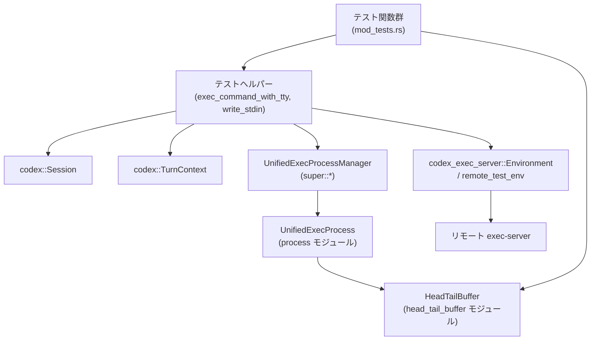
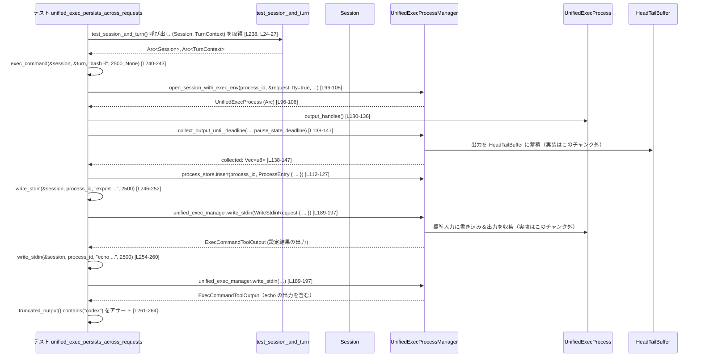

# core/src/unified_exec/mod_tests.rs コード解説

## 0. ざっくり一言

`unified_exec` サブシステムの **統合テストとテスト用ヘルパー** をまとめたモジュールです。  
対話的シェルの永続化、タイムアウト、グローバル一時停止フラグ、リモート exec-server 連携、および `HeadTailBuffer` の挙動を検証します。

---

## 1. このモジュールの役割

### 1.1 概要

このモジュールは、次のような `unified_exec` の振る舞いをエンドツーエンドで確認するために存在します。

- セッションをまたいだ **対話的シェルの状態保持**（環境変数など）を検証する  
  （`unified_exec_persists_across_requests` など [mod_tests.rs:L234-267, L269-320]）
- `yield_time_ms`・グローバル pause 状態・タイムアウトと出力収集の関係を検証する  
  （`unified_exec_timeouts` [L322-366]、`unified_exec_pause_blocks_yield_timeout` [L368-405]）
- 完了したコマンドの **exit code の保持** や、完了済みプロセスに対するエラー挙動を検証する  
  （`completed_pipe_commands_preserve_exit_code` [L502-535]、`reusing_completed_process_returns_unknown_process` [L461-499]）
- ローカル実行と **リモート exec-server 経由の実行** の切り替え、および禁止されている FD 継承の検出を検証する  
  （`unified_exec_uses_remote_exec_server_when_configured` [L538-587]、`remote_exec_server_rejects_inherited_fd_launches` [L590-625]）
- 出力バッファ `HeadTailBuffer` が **先頭と末尾を保持しつつ中央を捨てる** 仕様になっていることを確認する  
  （`push_chunk_preserves_prefix_and_suffix` / `head_tail_buffer_default_preserves_prefix_and_suffix` [L201-232]）

### 1.2 アーキテクチャ内での位置づけ

このテストモジュールは、`Session` / `TurnContext` と `UnifiedExecProcessManager` をつなぐ「外側からの利用例」として機能します。



- テスト関数はまず `test_session_and_turn` で `Session` と `TurnContext` を取得します [L24-27]。
- 実際のプロセス生成・出力収集は `exec_command_with_tty` / `write_stdin` が担い、  
  その内部で `UnifiedExecProcessManager::open_session_with_exec_env` と  
  `collect_output_until_deadline` が呼ばれます [L80-170, L183-199]。
- プロセスの標準出力は `OutputHandles` 経由で取得され、`HeadTailBuffer` に蓄積されます [L130-147]。
- リモート実行時は `codex_exec_server::Environment` とテスト用 `remote_test_env` を用いて  
  リモート exec-server に接続します [L511-519, L544-551]。

### 1.3 設計上のポイント

コードから読み取れる主な設計上の特徴は次の通りです。

- **ヘルパーによる共通化**  
  - `exec_command_with_tty` がプロセス生成〜出力収集〜プロセス ID 管理を一括で行います [L80-170]。
  - `write_stdin` が既存プロセスへの標準入力書き込みと出力収集を一括で行います [L183-199]。
- **状態管理付きプロセスストア**  
  - 起動直後に `process.has_exited()` / `exit_code()` を確認し、まだ生きているプロセスのみ  
    `process_store.processes` に登録します [L110-127]。
  - 完了したプロセスは `release_process_id` で明示的に解放されます [L152-157]。
- **非同期 + タイムアウト制御**  
  - すべての統合テストは `#[tokio::test]` で非同期に実行され、大半は `multi_thread` ランタイムを使用します [L234, L269, L368, L460, L501, L537, L589]。
  - 出力収集は `Instant::now()` に基づくデッドラインと `Duration::from_millis(yield_time_ms)` を用いて行います [L109, L137]。
- **グローバル pause 状態との連携**  
  - `collect_output_until_deadline` には `session.subscribe_out_of_band_elicitation_pause_state()` から取得した  
    pause 状態が渡されます [L138-145]。
  - `unified_exec_pause_blocks_yield_timeout` テストで、この pause が `yield_time_ms` よりも優先される挙動が検証されています [L368-405]。
- **リモート exec-server の制約テスト**  
  - リモート環境では FD 継承が禁止されていることを、`SpawnLifecycle` 実装をすり替えて確認しています [L172-181, L607-619]。

---

## 2. コンポーネントインベントリー（関数・構造体一覧）

各コンポーネントの役割と定義位置（行範囲）です。

| 名前 | 種別 | 役割 / 用途 | 定義位置 |
|------|------|-------------|----------|
| `test_session_and_turn` | async 関数 | テスト用に `Session` と `TurnContext` を生成し、`Arc` で返すヘルパー | core/src/unified_exec/mod_tests.rs:L24-27 |
| `exec_command` | async 関数 | TTY 有効で `exec_command_with_tty` を呼び出す薄いラッパー | L29-45 |
| `shell_env` | 関数 | 現在のプロセスの環境変数を `HashMap<String, String>` に収集する | L47-49 |
| `test_exec_request` | 関数 | テスト用の `ExecRequest` を構築する（sandbox/network 設定を TurnContext からコピー） | L51-78 |
| `exec_command_with_tty` | async 関数 | プロセス生成・出力収集・プロセスストア登録・ID 解放までを行う中核ヘルパー | L80-170 |
| `TestSpawnLifecycle` | 構造体 | `SpawnLifecycle` テスト実装。継承 FD を制御するためのテスト用構造体 | L172-175 |
| `TestSpawnLifecycle::inherited_fds` | メソッド | `SpawnLifecycle` トレイト実装。設定された FD リストを返す | L177-180 |
| `write_stdin` | async 関数 | 既存プロセスに対して標準入力を書き込み、その後の出力を取得するヘルパー | L183-199 |
| `push_chunk_preserves_prefix_and_suffix` | テスト関数 | `HeadTailBuffer::push_chunk` が先頭と末尾を保持することを検証 | L201-221 |
| `head_tail_buffer_default_preserves_prefix_and_suffix` | テスト関数 | 既定設定の `HeadTailBuffer` で prefix/suffix が保持されることをバイト列で検証 | L223-232 |
| `unified_exec_persists_across_requests` | テスト関数 | 対話的シェルセッションが複数リクエスト間で環境変数を保持することを検証 | L234-267 |
| `multi_unified_exec_sessions` | テスト関数 | 対話的シェルと短命コマンドの環境が分離されていることを検証 | L269-320 |
| `unified_exec_timeouts` | テスト関数 | 短い `yield_time_ms` で部分的な出力しか得られないが、後続ポーリングで残りが取得できることを検証 | L322-366 |
| `unified_exec_pause_blocks_yield_timeout` | テスト関数 | グローバル pause 状態が解除されるまで `yield_time_ms` が進行しないことを検証 | L368-405 |
| `requests_with_large_timeout_are_capped` | テスト関数（ignore） | 非常に大きな `yield_time_ms` が内部で上限にキャップされることを期待するテスト | L407-425 |
| `completed_commands_do_not_persist_sessions` | テスト関数（ignore） | 完了したコマンドがプロセスストアに残らないことを検証するテスト | L427-458 |
| `reusing_completed_process_returns_unknown_process` | テスト関数 | 終了したプロセスへの `write_stdin` が `UnknownProcessId` エラーを返すことを検証 | L460-499 |
| `completed_pipe_commands_preserve_exit_code` | テスト関数 | パイプライン（TTY 無し）で実行した終了コードが `exit_code()` に保持されることを検証 | L501-535 |
| `unified_exec_uses_remote_exec_server_when_configured` | テスト関数 | リモート実行環境が設定されている場合に exec-server 経由で実行されることを検証 | L537-587 |
| `remote_exec_server_rejects_inherited_fd_launches` | テスト関数 | リモート exec-server が継承 FD 付きプロセス生成を拒否すること、およびエラーメッセージを検証 | L589-625 |

---

## 3. 公開 API と詳細解説（このモジュール内）

このモジュール自体はテストモジュールであり、外部に export される API はありませんが、  
`unified_exec` サブシステムの利用方法を理解する上で重要なヘルパー関数・テストを中心に解説します。

### 3.1 型一覧

| 名前 | 種別 | 役割 / 用途 | 定義位置 |
|------|------|-------------|----------|
| `TestSpawnLifecycle` | 構造体 | リモート exec-server での FD 継承禁止をテストするために `SpawnLifecycle` を実装するテスト用型。`inherited_fds` フィールドに渡した FD リストをそのまま返す | L172-181 |

> `SpawnLifecycle` トレイト自体の定義はこのチャンクには現れませんが、少なくとも `inherited_fds(&self) -> Vec<i32>` メソッドを要求していることが分かります [L177-180]。

---

### 3.2 詳細解説（重要な関数・テスト 7 件）

#### `exec_command_with_tty(session: &Arc<Session>, turn: &Arc<TurnContext>, cmd: &str, yield_time_ms: u64, workdir: Option<PathBuf>, tty: bool) -> Result<ExecCommandToolOutput, UnifiedExecError>`

**概要**

`Session` と `TurnContext` を用いて、`bash -lc "<cmd>"` を実行し、その出力を一定時間（`yield_time_ms`）収集して `ExecCommandToolOutput` として返します。  
プロセスが生きている場合は `unified_exec_manager.process_store` に登録し、後続の `write_stdin` で追跡できるようにします [L80-170]。

**引数**

| 引数名 | 型 | 説明 |
|--------|----|------|
| `session` | `&Arc<Session>` | サービス群（`unified_exec_manager` など）を保持するセッションオブジェクト [L88] |
| `turn` | `&Arc<TurnContext>` | 実行時のカレントディレクトリや sandbox 設定を持つターンコンテキスト [L90-92, L57-60] |
| `cmd` | `&str` | シェルで実行するコマンド文字列（`bash -lc` に渡される） [L93] |
| `yield_time_ms` | `u64` | 出力を収集する最大待ち時間（ミリ秒）。`Instant::now()` に足してデッドラインとする [L137] |
| `workdir` | `Option<PathBuf>` | `turn.cwd` からの相対ディレクトリ。`None` の場合は `turn.cwd` をそのまま使用 [L90-92] |
| `tty` | `bool` | TTY を有効化するかどうか。対話的シェルは `true`、パイプラインテストでは `false` [L86, L502-518] |

**戻り値**

- `Ok(ExecCommandToolOutput)`  
  - 生の出力 `raw_output`、推定トークン数、`wall_time`、`process_id`、`exit_code` などが含まれます [L159-169]。
- `Err(UnifiedExecError)`  
  - プロセス生成や出力収集に失敗した場合のエラー。具体的なバリアントはこのチャンクには `UnknownProcessId` 以外は現れません [L481-483]。

**内部処理の流れ**

1. `unified_exec_manager` からプロセス ID を取得します (`allocate_process_id().await`) [L88-89]。
2. 実行ディレクトリ `cwd` を決定します。`workdir` が `Some` なら `turn.cwd.join(workdir)`、`None` なら `turn.cwd.clone()` を使います [L90-92]。
3. `"bash" "-lc" cmd` のコマンド配列を作成します [L93]。
4. `test_exec_request` を用いて `ExecRequest` を構築します。ここで sandbox 設定や timeout、capture policy などがセットされます [L94, L63-77]。
5. `open_session_with_exec_env` を呼び出し、`UnifiedExecProcess` を生成します [L96-105]。
   - `turn.environment.as_ref().expect("turn environment")` により、環境が `Some` であることを前提としています [L103]。
6. `UnifiedExecContext` を生成し `call_id` を付与します [L107-108]。
7. プロセスが起動直後にすでに終了していないかを検査し（`has_exited`, `exit_code`）[L110]、  
   生存している場合のみ `ProcessEntry` を作成して `process_store.processes` に登録します [L112-127]。
8. `process.output_handles()` から出力用バッファ・通知チャネル・キャンセルトークンを受け取ります [L130-136]。
9. `yield_time_ms` からデッドラインを計算し [L137]、`collect_output_until_deadline` で pause 状態を考慮しつつ出力を収集します [L138-147]。
10. 経過時間を `wall_time` として計測し [L148]、UTF-8 として解釈したテキストからトークン数を概算します [L149, L167]。
11. プロセスがまだ生きている場合は `process_id` をレスポンスに残し、それ以外の場合は `release_process_id` で解放します [L150-157]。
12. 以上をまとめて `ExecCommandToolOutput` を生成して返します [L159-169]。

**Examples（使用例）**

この関数は直接はテストから呼ばれていませんが、`exec_command` から TTY=true で呼び出されています [L29-45]。  
`exec_command` 相当の呼び出し例は次のようになります。

```rust
// Session と TurnContext は外部で用意されている前提
let (session, turn) = test_session_and_turn().await; // L24-27

// TTY 有効でコマンドを実行し、最大 2.5 秒間出力を待つ
let output = exec_command_with_tty(
    &session,
    &turn,
    "echo hello",
    2_500,        // yield_time_ms
    None,         // workdir
    true,         // tty
).await?;

// 出力の確認（truncated_output は ExecCommandToolOutput のメソッド）
assert!(output.truncated_output().contains("hello"));
```

**Errors / Panics**

- `turn.environment` が `None` の場合、`expect("turn environment")` により **パニック** します [L103]。  
  → 事前に `TurnContext` に環境が設定されていることが前提条件です。
- `open_session_with_exec_env` や `collect_output_until_deadline` が失敗した場合は  
  `UnifiedExecError` として `Err` が返されます [L96-105, L138-147]。
  - 具体的なエラー内容はこのチャンクには現れませんが、  
    リモート exec-server で FD 継承が禁止されているケースでは  
    `"remote exec-server does not support inherited file descriptors"` というメッセージになることが確認されています [L621-623]。

**Edge cases（エッジケース）**

- `yield_time_ms` が非常に小さい場合  
  - `unified_exec_timeouts` テストでは、`yield_time_ms = 10` で `sleep 5 && echo ...` を実行すると、  
    初回の出力には目的の文字列が含まれないことが確認されています [L344-354]。
- コマンドが即座に終了する場合  
  - `multi_unified_exec_sessions` では短命コマンドの結果に `process_id` が `None` であることを確認しています [L289-301]。  
    これは `exec_command_with_tty` 内で「起動時には生きていたが、収集時点で終了している」場合に  
    `release_process_id` が呼ばれ、`process_id` を返さないためと解釈できます [L150-157]。
- コマンド開始直後にすでに終了している場合  
  - `process_started_alive` は `!process.has_exited() && process.exit_code().is_none()` で判定されるため [L110]、  
    起動とほぼ同時に終了したプロセスはストアに登録されません。

**使用上の注意点**

- `turn.environment` を `Some` に設定してから呼び出す必要があります [L103]。
- `yield_time_ms` は「出力収集の最大時間」であり、「プロセス全体の実行時間」を制限するものではありません。  
  追加の出力は後続の `write_stdin`（入力無しでも可）で回収する必要があります [L322-366]。
- このヘルパーはテスト専用ですが、`unified_exec` を利用する実装を書く際の参考になります。  
  本番コードではエラーの種類ごとの扱いや `SandboxType` 等の設定を明示的に行う必要があります。

---

#### `write_stdin(session: &Arc<Session>, process_id: i32, input: &str, yield_time_ms: u64) -> Result<ExecCommandToolOutput, UnifiedExecError>`

**概要**

既存の unified-exec プロセスに標準入力を書き込み、その後 `yield_time_ms` まで出力を収集し `ExecCommandToolOutput` を返すヘルパーです [L183-199]。  
入力が空文字列の場合は「出力のポーリング」に相当します [L358-359]。

**引数**

| 引数名 | 型 | 説明 |
|--------|----|------|
| `session` | `&Arc<Session>` | `unified_exec_manager` にアクセスするためのセッション [L189-192] |
| `process_id` | `i32` | 対象プロセスの ID。`exec_command_with_tty` で返されたものをそのまま利用 | [L247-249, L255-257] |
| `input` | `&str` | プロセスの標準入力に送る文字列。空文字列の場合は入力無しで出力のみを取得 | [L186, L358-359] |
| `yield_time_ms` | `u64` | 出力収集に使う最大待ち時間（ミリ秒）。`write_stdin` 内でそのまま `WriteStdinRequest` に渡される | [L187, L193-196] |

**戻り値**

- 対象プロセスから `yield_time_ms` までに得られた出力を含む `ExecCommandToolOutput`。
- プロセスが存在しない場合などは `UnifiedExecError` になります。

**内部処理の流れ**

1. `WriteStdinRequest` 構造体を作成し、`process_id`, `input`, `yield_time_ms`, `max_output_tokens: None` をセットします [L192-197]。
2. `session.services.unified_exec_manager.write_stdin(...)` を呼び出し [L189-197]、  
   その結果（`ExecCommandToolOutput` または `UnifiedExecError`）をそのまま返します [L198-199]。

この関数自体は非常に薄いラッパーであり、実際の標準入力書き込みと出力収集ロジックは  
`unified_exec_manager` 側にあります（このチャンクには実装が現れません）。

**Examples（使用例）**

環境変数を設定した後、その値を確認する例（`unified_exec_persists_across_requests` から簡略化）[L246-260]：

```rust
// 対話的シェルプロセスをすでに起動している前提
let process_id = open_shell.process_id.expect("expected process_id"); // L244

// 環境変数を設定
write_stdin(
    &session,
    process_id,
    "export CODEX_INTERACTIVE_SHELL_VAR=codex\n",
    2_500,
).await?;

// 環境変数を読み出す
let out = write_stdin(
    &session,
    process_id,
    "echo $CODEX_INTERACTIVE_SHELL_VAR\n",
    2_500,
).await?;
assert!(out.truncated_output().contains("codex"));
```

**Errors / Panics**

- プロセス ID が無効な場合、`UnifiedExecError::UnknownProcessId` が返されることが  
  `reusing_completed_process_returns_unknown_process` から分かります [L476-483]。
- この関数自体はパニックを発生させませんが、内部で `await` する `write_stdin` の実装に依存します。

**Edge cases**

- `input` が空文字列の場合でも、出力のポーリングとして使用できます [L358-359]。
- `yield_time_ms` が短すぎると、`unified_exec_timeouts` と同様に出力が途中までしか返らない可能性があります [L347-354]。

**使用上の注意点**

- `process_id` は `exec_command_with_tty` から返された値だけを使用するべきです。  
  終了済みの ID を再使用すると `UnknownProcessId` エラーになります [L476-483]。
- 出力が途中で切れてもエラーにはならないため、特定の文字列が必ず含まれることを期待する場合は  
  必要に応じて複数回 `write_stdin`（入力無し）を呼び出す設計が必要です [L356-363]。

---

#### `unified_exec_persists_across_requests()`

**概要**

1つの対話的 bash セッションが複数のリクエストにまたがって状態（環境変数）を保持することを検証するテストです [L234-267]。

**引数 / 戻り値**

- テスト関数であり引数はありません。
- 戻り値は `anyhow::Result<()>` で、途中の `?` で発生したエラーをそのままテスト失敗として扱います [L235]。

**内部処理の流れ**

1. サンドボックス環境ではテストをスキップします（`skip_if_sandbox!`）[L236]。
2. `test_session_and_turn()` で `session` / `turn` を初期化します [L238]。
3. `exec_command` で TTY 有効な `"bash -i"` を起動し、対話的シェルを開始します [L240-243]。
4. 返ってきた `open_shell.process_id` を取得します [L244]。
5. `write_stdin` で `export CODEX_INTERACTIVE_SHELL_VAR=codex\n` をシェルに送信し、環境変数を設定します [L246-252]。
6. 続けて `write_stdin` で `echo $CODEX_INTERACTIVE_SHELL_VAR\n` を送信し [L254-260]、  
   返ってきた出力文字列に `"codex"` が含まれていることを確認します [L261-264]。

**Examples（使用例）**

このテスト自体が、対話的シェルセッションの再利用方法のサンプルになっています。  
同様のパターンで任意の状態（カレントディレクトリ、環境変数など）を保持できます。

**Errors / Panics**

- `open_shell.process_id` が `None` の場合、`expect("expected process_id")` によりパニックになります [L244]。
- `write_stdin` が `Err` を返した場合（プロセス終了など）、テスト全体が `Err` になります [L252, L260]。

**Edge cases**

- `yield_time_ms` は 2,500ms と十分長く設定されているため、このテストではタイムアウトに関する境界条件は検証していません [L240-251]。

**使用上の注意点**

- 対話的セッションを再利用するには、プロセスがまだ存続している必要があります。  
  `process_id` を保持し、終了させない限り（例: `exit` を送らない限り）、後続リクエストで使い回せます。

---

#### `multi_unified_exec_sessions()`

**概要**

1つの `Session` / `TurnContext` のもとで、  

- 対話的シェル（永続セッション）と  
- 単発の短命コマンド (`exec_command` 経由)  

の環境が **分離** されていることを検証するテストです [L269-320]。

**内部処理の流れ（概要）**

1. サンドボックス環境ではスキップ [L271]。
2. 対話的シェル `bash -i` を起動し、`session_a` として `process_id` を保持 [L275-279]。
3. `session_a` に対して `export CODEX_INTERACTIVE_SHELL_VAR=codex\n` を送信し、環境変数をセット [L281-287]。
4. 同じ `Session` / `TurnContext` で、今度は単発の `"echo $CODEX_INTERACTIVE_SHELL_VAR"` コマンドを実行 [L289-296]。
5. 短命コマンドに対しては
   - `process_id.is_none()`（短命コマンドはバックグラウンドセッションを残さない）[L297-301]
   - 出力に `"codex"` が含まれない（毎回新しいシェルで実行される）[L302-305]
   ことを検証します。
6. 最後に、対話的シェル `session_a` に `echo $CODEX_INTERACTIVE_SHELL_VAR\n` を送信し、  
   `"codex"` が含まれることを確認します [L307-317]。

**ポイント**

- **セッション分離**：同じ `Session` かつ同じ `TurnContext` でも、  
  対話的セッションと単発コマンドの環境は共有されません。
- **プロセスライフサイクル**：短命コマンドは `process_id.is_none()` であることから、  
  `exec_command_with_tty` が「すぐ終了したプロセス」をストアに保持しない挙動を確認しています [L150-157, L297-301]。

---

#### `unified_exec_timeouts()`

**概要**

短い `yield_time_ms` ではコマンドの出力が最後まで取得できず、  
後から「入力無しの `write_stdin` 呼び出し」で残りの出力を取得できることを検証するテストです [L322-366]。

**内部処理の流れ**

1. サンドボックス環境ではスキップ [L324]。
2. 対話的シェル `bash -i` を起動し [L330-333]、`process_id` を取得 [L334]。
3. 環境変数 `CODEX_INTERACTIVE_SHELL_VAR` に `TEST_VAR_VALUE` を設定 [L336-342]。
4. `write_stdin` に `sleep 5 && echo $CODEX_INTERACTIVE_SHELL_VAR\n` と `yield_time_ms = 10` を渡し、  
   ほぼ即座に返ってくる不完全な出力を取得します [L344-350]。
5. この不完全な出力には `TEST_VAR_VALUE` が含まれていないことを確認します [L351-354]。
6. 5秒の sleep + 少し余裕として 7 秒待機します [L356]。
7. 入力無し (`""`) で `write_stdin` を呼び出し、`yield_time_ms = 100` で残りの出力をポーリングします [L358-359]。
8. このときの出力には `TEST_VAR_VALUE` が含まれていることを確認します [L360-363]。

**契約 / 振る舞い**

- `yield_time_ms` はあくまで「このリクエストでどこまで出力を待つか」を決めるもので、  
  コマンド実行自体は継続していることが分かります。
- コマンド完了後に再度 `write_stdin` を呼んでも、完了までに生成された出力を後から回収できます。

---

#### `unified_exec_pause_blocks_yield_timeout()`

**概要**

`Session` に設定された「out-of-band elicitation pause 状態」が `yield_time_ms` の経過よりも優先され、  
pause が解除されるまで unified-exec のレスポンスが返ってこないことを検証するテストです [L368-405]。

**内部処理の流れ**

1. サンドボックス環境であればスキップ [L370]。
2. `test_session_and_turn()` で `session` / `turn` を取得 [L372]。
3. `session.set_out_of_band_elicitation_pause_state(true)` で pause を有効化 [L373]。
4. 別タスクとして、2 秒後に pause を解除する `tokio::spawn` を起動します [L375-379]。
5. `started = Instant::now()` を記録し [L381]、`exec_command` で `sleep 1 && echo unified-exec-done` を `yield_time_ms = 250` で実行します [L382-389]。
6. `exec_command` から返ってくるまでの時間 `started.elapsed()` が **2 秒以上** であることを検証します [L391-394]。
7. レスポンスの出力に `"unified-exec-done"` が含まれること [L395-398]、  
   かつ完了しているため `process_id.is_none()` であることを確認します [L399-402]。

**ポイント**

- `exec_command_with_tty` 内では、`collect_output_until_deadline` に  
  `Some(session.subscribe_out_of_band_elicitation_pause_state())` が渡されています [L138-145]。
- このテスト結果から、pause 状態が `yield_time_ms` の経過を一時的に「凍結」するような挙動であることが示唆されますが、  
  実装自体はこのチャンクには現れないため詳細は不明です。

---

#### `completed_pipe_commands_preserve_exit_code()`

**概要**

TTY 無しで実行した非対話的コマンド (`exit 17`) が終了した後でも、  
`process.exit_code()` から正しい終了コードを取得できることを検証するテストです [L501-535]。

**内部処理の流れ**

1. `make_session_and_context()` で `TurnContext` を取得します（`Session` は使用していません）[L503]。
2. `test_exec_request` で `bash -lc "exit 17"` を実行する `ExecRequest` を作成します [L504-509]。
3. `codex_exec_server::Environment::default()` からローカル実行環境を作成します [L511]。
4. `UnifiedExecProcessManager::default().open_session_with_exec_env(...)` を  
   `tty=false` で呼び出し、プロセスを起動します [L512-520]。
5. もしまだ `process.has_exited()` が false なら、`process.cancellation_token().cancelled()` を  
   最大 2 秒間 `tokio::time::timeout` で待ちます [L522-529]。
6. 最終的に `process.has_exited()` が true であることと [L532]、`process.exit_code() == Some(17)` であることを確認します [L533]。

**ポイント**

- `unified_exec` のプロセスは、終了後も `exit_code()` を通じて終了コードが保持されていることが確認できます。
- 一方で「どのタイミングでプロセスが内部ストアから削除されるか」は、このテスト単体からは分かりません。  
  `completed_commands_do_not_persist_sessions` と併せて見る必要があります [L429-458]。

---

### 3.3 その他の関数（概要のみ）

| 関数名 | 役割（1 行） | 定義位置 |
|--------|--------------|----------|
| `test_session_and_turn` | `make_session_and_context()` を呼び出し、`Session` と `TurnContext` を `Arc` で返すヘルパー | L24-27 |
| `exec_command` | TTY 有効な `exec_command_with_tty` を呼ぶ簡易ラッパー。テストでは主にこれが使われる | L29-45 |
| `shell_env` | 現在のプロセス環境変数を `HashMap` 化するユーティリティ | L47-49 |
| `test_exec_request` | `TurnContext` から sandbox / network 設定をコピーし、テスト用 `ExecRequest` を生成する | L51-78 |
| `push_chunk_preserves_prefix_and_suffix` | `HeadTailBuffer` に大きなチャンクと小さなチャンクを追加した際に prefix/suffix が保持されるかを検証 | L201-221 |
| `head_tail_buffer_default_preserves_prefix_and_suffix` | `HeadTailBuffer::to_bytes` の結果が、先頭と末尾のバイト列を保持していることを確認 | L223-232 |
| `requests_with_large_timeout_are_capped` | 大きな `yield_time_ms` に対して内部上限が適用されることを期待するテスト（現在 ignore） | L407-425 |
| `completed_commands_do_not_persist_sessions` | 完了したコマンドが `process_store` に残らないことを検証するテスト（現在 ignore） | L429-458 |
| `reusing_completed_process_returns_unknown_process` | 終了したプロセスに対する `write_stdin` が `UnknownProcessId` を返すことを検証 | L460-499 |
| `unified_exec_uses_remote_exec_server_when_configured` | リモート環境が利用可能な場合に、リモート exec-server 経由でプロセスが起動し出力が取得できることを検証 | L537-587 |
| `remote_exec_server_rejects_inherited_fd_launches` | リモート exec-server で FD 継承付きプロセス起動が文字列メッセージ付きエラーになることを検証 | L589-625 |

---

## 4. データフロー

ここでは、代表的なシナリオとして  
**対話的シェルの永続セッション**（`unified_exec_persists_across_requests`）におけるデータフローを整理します。

### 4.1 処理の要点

1. テスト関数が `test_session_and_turn` から `Session` / `TurnContext` を取得します [L238]。
2. `exec_command` → `exec_command_with_tty` を通じて `bash -i` プロセスを起動し、  
   `UnifiedExecProcessManager` 内の `process_store` に `ProcessEntry` を登録します [L240-243, L112-127]。
3. `write_stdin` が `unified_exec_manager.write_stdin` に委譲することで、  
   プロセスの `stdin` にデータを書き込み、`collect_output_until_deadline` で新しい出力を取得します [L189-199]。
4. 出力は内部的に `HeadTailBuffer` に蓄積され（実装はこのチャンク外）、  
   そのスナップショットが `ExecCommandToolOutput.raw_output` に入ってテスト側に返ります [L130-147, L159-164]。

### 4.2 シーケンス図



> **補足**: `HeadTailBuffer` への実際の書き込み処理は `UnifiedExecProcess` / `process` モジュール側にあると推測されますが、  
> このチャンクにはその実装は現れないため詳細不明です。

---

## 5. 使い方（How to Use）

### 5.1 基本的な使用方法

`unified_exec` を使って「対話的シェルを開き、複数回コマンドを送る」典型的なフローは、  
`unified_exec_persists_across_requests` と同じパターンです [L234-267]。

```rust
#[tokio::test(flavor = "multi_thread", worker_threads = 2)]
async fn example_use_unified_exec() -> anyhow::Result<()> {
    // 1. Session と TurnContext を生成する（テストヘルパーを利用）                 // L24-27
    let (session, turn) = test_session_and_turn().await;

    // 2. 対話的な bash セッションを開始する                                       // L240-243
    let shell = exec_command(
        &session,
        &turn,
        "bash -i",          // 対話的シェル
        2_500,              // このリクエストで最大 2.5 秒まで出力を待つ
        None,               // 作業ディレクトリは turn.cwd のまま
    ).await?;
    let pid = shell.process_id.expect("expected process id"); // プロセス ID を取得

    // 3. 環境変数を設定する                                                        // L246-252
    write_stdin(
        &session,
        pid,
        "export FOO=bar\n", // bash の export
        2_500,
    ).await?;

    // 4. 環境変数を確認する                                                        // L254-260
    let out = write_stdin(
        &session,
        pid,
        "echo $FOO\n",
        2_500,
    ).await?;
    assert!(out.truncated_output().contains("bar"));

    Ok(())
}
```

### 5.2 よくある使用パターン

- **対話的セッション + 状態保持**  
  - 対話的シェルを一度起動し、`process_id` を保持して何度も `write_stdin` でコマンドを送る  
    → `unified_exec_persists_across_requests` のパターン [L234-267]。
- **短命コマンド（ワンショット）**  
  - `exec_command` を呼び出し、`process_id` が `None` ならそのコマンド専用の一時シェルとして扱う  
    → `multi_unified_exec_sessions` の `out_2` 部分 [L289-301]。
- **タイムアウト付き長時間コマンド**  
  - 長時間実行されるコマンドに対して短い `yield_time_ms` を設定し、部分的な出力を段階的に取得する  
    → `unified_exec_timeouts` [L344-363]。

### 5.3 よくある間違いと正しい使用例

1. **終了したプロセス ID を再利用してしまう**

```rust
// 間違い例: 終了したシェルに再度 write_stdin している（UnknownProcessId エラーになる） // L472-478
write_stdin(&session, process_id, "exit\n", 2_500).await?;
// シェルが exit しているのに、同じ ID で再度呼び出す
let out = write_stdin(&session, process_id, "echo still-alive\n", 100).await?;
```

```rust
// 正しい例: 終了させる前に ID を使い終えるか、UnknownProcessId を期待するテストにする // L476-483
write_stdin(&session, process_id, "exit\n", 2_500).await?;
tokio::time::sleep(Duration::from_millis(200)).await;

// ここで UnknownProcessId を期待するか、新しいセッションを開きなおす
let err = write_stdin(&session, process_id, "", 100).await
    .expect_err("expected unknown process error"); // L476-478
```

1. **短命コマンドに環境変数が引き継がれると誤解する**

```rust
// 間違い例: 対話シェルで export した環境変数が、単発の exec_command にも見えると期待している // L281-287
let shell = exec_command(&session, &turn, "bash -i", 2_500, None).await?;
let pid = shell.process_id.unwrap();
write_stdin(&session, pid, "export FOO=bar\n", 2_500).await?;

// ここで FOO が見えると期待すると誤り
let out = exec_command(&session, &turn, "echo $FOO", 2_500, None).await?;
assert!(out.truncated_output().contains("bar")); // 実際には失敗する
```

```rust
// 正しい例: 単発コマンドは毎回新しいシェルで実行されることを前提にする               // L302-305
let out = exec_command(&session, &turn, "echo $FOO", 2_500, None).await?;
assert!(!out.truncated_output().contains("bar"));
```

### 5.4 使用上の注意点（まとめ）

- `exec_command_with_tty` / `exec_command` を使う前に `TurnContext.environment` が設定されている必要があります [L103]。
- `yield_time_ms` は「このリクエスト内でどこまで出力を待つか」であり、  
  コマンド完了まで必ず待つわけではありません [L137-147, L344-354]。
- グローバル pause 状態が有効な場合、`yield_time_ms` よりも pause が優先されます [L368-405]。
- `process_id` が `Some` の場合のみ対話的セッションとして再利用できます。  
  `None` の場合は短命コマンドとみなして再利用しない前提にする必要があります [L297-301]。
- リモート exec-server 利用時は FD 継承が禁止されており、`TestSpawnLifecycle` のように  
  `inherited_fds` が非空だと起動時にエラーになります [L607-619]。

---

## 6. 変更の仕方（How to Modify）

### 6.1 新しい機能（テストケース）を追加する場合

1. **テストの種類を決める**
   - 対話的セッションの新しいシナリオ → `unified_exec_persists_across_requests` 類似のパターン [L234-267]。
   - 短命コマンドの挙動 → `multi_unified_exec_sessions` や ignore テストを参考にする [L269-320, L429-458]。
   - リモート exec-server 関連 → `unified_exec_uses_remote_exec_server_when_configured` / `remote_exec_server_rejects_inherited_fd_launches` を参考にする [L537-587, L589-625]。

2. **ヘルパーの再利用**
   - `test_session_and_turn` で `Session` / `TurnContext` を取得する [L24-27]。
   - コマンド実行は `exec_command` or `exec_command_with_tty` を使う [L29-45, L80-170]。
   - 既存プロセスへの入力は `write_stdin` を使う [L183-199]。

3. **sandbox / リモート環境の条件分岐**
   - サンドボックス環境では実行できないテストは `skip_if_sandbox!(Ok(()))` でスキップする [L236, L271, L324, L370, L462, L539, L591]。
   - リモート環境依存のテストは `get_remote_test_env()` の結果を `Option` で確認し、`None` の場合は早期 `Ok(())` を返す [L538-542, L590-594]。

4. **プロセスストアへの依存**
   - プロセスの永続化・削除を検証したい場合は、`session.services.unified_exec_manager.process_store` を  
     直接 `lock().await` して状態を確認するパターンを採用します [L447-455, L487-495]。

### 6.2 既存の機能を変更する場合

- **`exec_command_with_tty` の変更**
  - 影響範囲: ほぼすべての統合テストがこのヘルパー経由でプロセスを起動しているため [L240-243, L275-278, L330-333, L382-389]、  
    タイムアウト・プロセス ID の扱い・pause 状態の扱いを変更すると多くのテストに影響します。
  - 注意点:  
    - `process_store` への挿入条件（`process_started_alive && !has_exited`）を変えると、  
      `process_id.is_none()` を前提にしているテスト (`multi_unified_exec_sessions` など) の期待が変わります [L110-127, L297-301]。
    - `yield_time_ms` の扱いを変えると `unified_exec_timeouts` / ignore テストの挙動が変わります [L344-354, L412-419]。

- **エラーメッセージの変更**
  - `remote_exec_server_rejects_inherited_fd_launches` は  
    `err.to_string()` の文字列を厳密に比較しているため [L621-623]、  
    メッセージ文言を変えるとこのテストが失敗します。
  - より堅牢にするなら、テスト側をエラー型やコードに基づく検証に変更する必要があります  
    （ただし、このファイルからはエラー型の詳細は読み取れません）。

- **`HeadTailBuffer` の仕様変更**
  - バッファが保持する prefix/suffix の扱いを変えると、`push_chunk_preserves_prefix_and_suffix` および  
    `head_tail_buffer_default_preserves_prefix_and_suffix` が失敗します [L201-232]。

---

## 7. 関連ファイル

このモジュールと密接に関係するモジュール／型は次の通りです。

| パス / モジュール | 役割 / 関係 |
|------------------|------------|
| `super::head_tail_buffer` | `HeadTailBuffer` 型を提供し、出力バッファリングの prefix/suffix 保持仕様のテスト対象となっています [L1, L201-232]。 |
| `super::*` | `UnifiedExecProcessManager`, `UnifiedExecContext`, `UnifiedExecError`, `NoopSpawnLifecycle`, `SpawnLifecycle`, `UNIFIED_EXEC_OUTPUT_MAX_BYTES`, `generate_chunk_id` など、このテストで利用される unified_exec の中核 API を含みます [L2, L80-170, L172-181, L201-205]。具体的な定義はこのチャンクには現れません。 |
| `crate::unified_exec::process` | `OutputHandles` 型および `UnifiedExecProcess` 関連の機能を提供し、出力バッファやキャンセルトークンを通じてテストから使用されています [L11, L130-136, L567-573]。 |
| `crate::codex::{Session, TurnContext, make_session_and_context}` | セッションおよびターンのコンテキストを生成する API で、すべての統合テストの起点となっています [L3-5, L24-27, L503, L545-547, L597-598]。 |
| `crate::sandboxing::ExecRequest` | プロセス実行のパラメータを表す型で、`test_exec_request` や各テストで利用されます [L8, L51-78, L504-509, L546-551, L600-605]。 |
| `crate::exec::{ExecCapturePolicy, ExecExpiration}` | 実行のタイムアウトとキャプチャポリシーを設定する enum。`ExecRequest::new` に渡されます [L6-7, L68-69]。 |
| `codex_exec_server::Environment` | ローカル / リモート exec-server の実行環境を抽象化した型で、リモート実行とパイプライン実行の両方で利用されています [L511-519, L544-551, L596-599]。 |
| `core_test_support::{get_remote_test_env, skip_if_sandbox, test_codex::test_env}` | サンドボックス環境の検出とリモートテスト環境構築のためのユーティリティ。リモート exec-server 関連テストの前提条件を整えるために使用されています [L14-16, L234-236, L269-271, L322-324, L368-370, L460-462, L537-542, L589-594]。 |

> これらのモジュールの内部実装はこのチャンクには現れないため、  
> 具体的な構造体フィールドやメソッドの詳細は本レポートでは説明できません。  
> ただし、テストコードからそれらの **外部 API の用いられ方** は把握できます。
