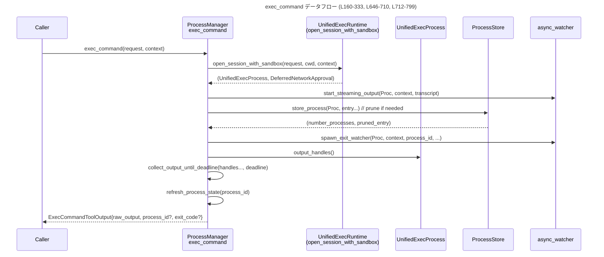

core/src/unified_exec/process_manager.rs

---

## 0. ざっくり一言

このモジュールは、**UnifiedExec のプロセス管理を行う中核コンポーネント**です。  
プロセス ID の割り当て、sandbox や network approval 付きのプロセス起動、標準入力書き込みと出力ポーリング、プロセスのライフサイクル管理と自動 pruning を担当します（core/src/unified_exec/process_manager.rs:L111-136, L160-333, L337-453, L837-882）。

---

## 1. このモジュールの役割

### 1.1 概要

- このモジュールは、**UnifiedExec 経由で実行される外部コマンドのプロセス管理**を行うために存在し、次の機能を提供します。
  - プロセス ID の生成と解放（決定論的なテスト用モード付き）（L71-83, L111-146）
  - sandbox / exec-policy / network approval を踏まえたプロセス起動（L646-710）
  - リモート exec-server またはローカル PTY/pipe を使った実際のプロセス生成（L582-644）
  - stdout/stderr の非同期バッファリングと、一定時間までの出力収集（L712-799）
  - 既存プロセスへの stdin 書き込みと、インタラクティブセッション用の出力ポーリング（L336-453）
  - プロセス store の管理と、最大数を超えたときの自動 pruning（L523-580, L837-882, L884-900）

### 1.2 アーキテクチャ内での位置づけ

主な依存関係と位置づけを簡略に示します。

```mermaid
graph LR
    subgraph "UnifiedExecProcessManager impl (L110-901)"
        PM["ProcessManager\nUnifiedExecProcessManager (L110-901)"]
    end

    ECReq["ExecCommandRequest\n(unified_exec)"]
    Ctx["UnifiedExecContext\n(unified_exec)"]
    ExecReq["ExecRequest\ncrate::sandboxing"]
    UERun["UnifiedExecRuntime\n(tools::runtimes::unified_exec)"]
    Orchestrator["ToolOrchestrator\n(tools::orchestrator)"]
    UProc["UnifiedExecProcess\n(unified_exec::process)"]
    Store["ProcessStore\n(unified_exec)"]
    NetAppr["network_approval service\n(tools::network_approval)"]
    Watcher["async_watcher\n(spawn_exit_watcher,\nstart_streaming_output)"]

    ECReq --> |exec_command (L160-333)| PM
    PM --> |open_session_with_sandbox (L646-710)| UERun
    PM --> |open_session_with_exec_env (L582-644)| UProc
    Orchestrator --> |run(...) (L699-707)| PM
    PM --> |store_process (L523-580)| Store
    PM --> |refresh_process_state (L455-485)| Store
    PM --> |prune_processes_if_needed (L837-853)| Store
    PM --> |unregister_network_approval_for_entry (L148-158, L481-483)| NetAppr
    PM --> |spawn_exit_watcher (L569-579)| Watcher
    PM --> |collect_output_until_deadline (L712-799)| UProc
```

※ ここに現れる `ProcessStore` や `UnifiedExecContext` などの具体的な定義は、このチャンクには現れません。

### 1.3 設計上のポイント

コードから読み取れる特徴を列挙します。

- **プロセス ID 管理**
  - テスト用に決定論的な ID を付与でき、通常は乱数ベースで ID を割り当てます（L71-83, L111-127）。
  - ID は `reserved_process_ids` セットで予約・解放されます（L118-124, L133-135, L139-142）。
- **集中管理されたプロセス store**
  - `self.process_store.lock().await` で非同期ロックされたストアを共有し、プロセス一覧とメタ情報（`last_used` など）を管理します（L113-135, L457-480, L523-551, L837-853, L884-893）。
- **非同期 I/O と通知**
  - 出力は `OutputBuffer` を通じてチャンク単位で蓄積され（L712-799）、`Notify` と `CancellationToken` で新規出力・終了・キャンセルを検知します（L712-718, L724-725, L736-741, L744-782）。
  - `watch::Receiver<bool>` を使って「pause 状態」に応じて deadline を伸長し、ポーリング時間を調整します（L718-719, L801-825）。
- **sandbox / exec-policy / network approval の統合**
  - `ExecApprovalRequest` と `ToolOrchestrator`, `UnifiedExecRuntime` を用いて、実行前に許可・sandbox 設定を決定します（L646-677, L699-707）。
  - ネットワーク承認用 ID を `ProcessEntry` に紐付け、プロセス終了や pruning 時に `unregister_call` を呼び出します（L148-158, L204-207, L481-483, L555-557, L884-900）。
- **並行性・安全性**
  - すべてのプロセス情報操作は `process_store` ロック下で行われ、`ProcessEntry` 内部の `Arc<UnifiedExecProcess>` 経由でプロセスハンドルを共有します（L491-520, L523-551, L884-893）。
  - 出力取得ループは `tokio::select!` を使い、出力/終了/タイムアウト/一時停止を競合するイベントとして扱います（L766-783）。
- **出力とイベント**
  - `start_streaming_output` でライブ出力をイベントストリームに流しつつ（L198-199）、`collect_output_until_deadline` でツールレスポンス向けにスナップショットを収集します（L221-247）。
  - プロセス完了時の成功・失敗イベントは `emit_exec_end_for_unified_exec` / `emit_failed_exec_end_for_unified_exec` 経由で統一的に発行されます（L252-265, L291-307）。

---

## 2. 主要な機能一覧

- プロセス ID 管理: `allocate_process_id`, `release_process_id`, `terminate_all_processes` により ID とライフサイクルを一元管理します（L111-146, L884-900）。
- UnifiedExec コマンド起動: `exec_command` が sandbox / approval / env 設定込みでプロセスを起動し、初回の出力スナップショットを返します（L160-333）。
- 既存プロセスへの標準入力書き込み: `write_stdin` がインタラクティブな stdin 書き込みと、その後の出力収集を行います（L336-453）。
- 実際のプロセス生成: `open_session_with_exec_env` がローカル/リモート環境に応じて PTY / pipe / exec-server を起動します（L582-644）。
- sandbox 付き UnifiedExec 実行: `open_session_with_sandbox` が `ToolOrchestrator` と `UnifiedExecRuntime` 上で実行リクエストをラップします（L646-710）。
- 出力ポーリング: `collect_output_until_deadline` が deadline まで非同期で stdout/stderr を集めます（L712-799）。
- プロセス状態更新: `refresh_process_state` が `ProcessStore` を参照し、Alive/Exited/Unknown を判定します（L455-485）。
- プロセス pruning: 最大プロセス数を超えた場合に、LRU かつ直近使用中の一部を保護しつつ削除対象を選びます（L837-853, L855-882）。

---

## 3. 公開 API と詳細解説

### 3.1 型一覧（構造体・列挙体など）

| 名前 | 種別 | 行範囲 | 役割 / 用途 |
|------|------|--------|-------------|
| `UNIFIED_EXEC_ENV` | 定数配列 | core/src/unified_exec/process_manager.rs:L54-65 | UnifiedExec プロセスに必ず追加される環境変数セット。色やロケール、pager などを統一します。 |
| `FORCE_DETERMINISTIC_PROCESS_IDS` | `static AtomicBool` | L71-71 | テスト専用のフラグ。true の場合、プロセス ID は決定論的に増分されます。 |
| `PreparedProcessHandles` | 構造体 | L93-104 | `write_stdin` 用に、特定プロセスのハンドルと出力バッファ、通知オブジェクトなどをひとまとめにした借用ビューです。 |
| `ProcessStatus` | enum | L903-914 | プロセスの状態を Alive / Exited / Unknown の3種類で表します。`refresh_process_state` の結果として使われます。 |

`PreparedProcessHandles` のフィールド概要（L93-104）:

| フィールド | 型 | 説明 |
|-----------|----|------|
| `process` | `Arc<UnifiedExecProcess>` | 対象プロセスの共有ハンドル。 |
| `output_buffer` | `OutputBuffer` | 出力チャンクを保持する非同期バッファ。内部でロックされます（L736-738）。 |
| `output_notify` | `Arc<Notify>` | 新しい出力が追加されたときに通知するためのトリガー（L739）。 |
| `output_closed` | `Arc<AtomicBool>` | 出力ストリームが閉じたかどうかを表すフラグ（L745-746）。 |
| `output_closed_notify` | `Arc<Notify>` | 出力が閉じた際に通知するトリガー（L763-764）。 |
| `cancellation_token` | `CancellationToken` | プロセス終了やキャンセルを伝えるトークン（L724-725, L777-781）。 |
| `pause_state` | `Option<watch::Receiver<bool>>` | 一時停止状態を監視するウォッチャー。true の間は deadline を伸長します（L801-825）。 |
| `command` | `Vec<String>` | プロセス起動時のコマンドラインを記録したもの（L517）。 |
| `process_id` | `i32` | UnifiedExec プロセス ID（L518）。 |
| `tty` | `bool` | TTY セッションかどうか。TTY でない場合、stdin 書き込みは拒否されます（L358-360）。 |

### 3.2 関数詳細（主要 7 件）

#### `allocate_process_id(&self) -> i32`

**概要**

- 新しい UnifiedExec プロセスで使用する ID を生成し、`ProcessStore` 内の `reserved_process_ids` セットに予約します（L111-136）。
- テスト/決定論モードでは単調増加する ID、通常モードでは乱数 ID を用います（L115-127）。

**引数**

なし（`&self` のみ）

**戻り値**

- `i32`: 予約された一意の process_id。既存の `reserved_process_ids` と重複しないことが保証されます（L129-135）。

**内部処理の流れ**

1. `self.process_store.lock().await` でストアを非同期ロックします（L113）。  
2. `should_use_deterministic_process_ids()` の結果に応じて、ID の生成方法を分岐します（L115-127）。  
   - 決定論モード: `reserved_process_ids` の最大値と 999 の大きい方に 1 を足した値、またはセットが空なら 1000（L118-123）。  
   - 通常モード: `rand::rng().random_range(1_000..100_000)` で乱数 ID（L126）。  
3. すでに `reserved_process_ids` に含まれている ID なら `continue` して再試行します（L129-131）。  
4. 重複していない ID をセットに挿入し、その値を返します（L133-135）。

**Examples（使用例）**

```rust
// UnifiedExecProcessManager インスタンスを仮定する                 // どこかで Arc<UnifiedExecProcessManager> を保持しているとする
async fn create_process_id(pm: &UnifiedExecProcessManager) -> i32 {  // 新しい process_id を取りたい関数
    let pid = pm.allocate_process_id().await;                        // 非同期に ID を取得する
    // ここで pid を ExecCommandRequest などに埋め込む              // 取得した ID を後続のリクエストに利用する
    pid                                                             // ID を呼び出し元に返す
}
```

**Errors / Panics**

- 例外やエラーは返しません。無限ループ構造ですが、ID 範囲が十分広いため、実用上ループを抜けられない状況は想定されていません（L111-135）。

**Edge cases（エッジケース）**

- `reserved_process_ids` が空の場合、決定論モードでは 1000 から開始します（L122-123）。
- `reserved_process_ids` が ID 範囲をほぼ埋めている場合でも、論理上はループで再試行しますが、上限/下限チェックはありません（L111-127）。  
  この挙動により、非常に多数の ID を同時に予約しているとループ時間が伸びる可能性があります。

**使用上の注意点**

- 呼び出し側は、プロセス終了後に `release_process_id` を通じて ID を解放する設計になっています（L138-146）。  
  解放しないと、`reserved_process_ids` が増え続け、決定論モードで ID が増大し続けます。

---

#### `exec_command(&self, request: ExecCommandRequest, context: &UnifiedExecContext) -> Result<ExecCommandToolOutput, UnifiedExecError>`

**概要**

- UnifiedExec 経由でコマンドを **一度実行**し、一定時間分の出力を収集して返す高レベル API です（L160-333）。
- sandbox / exec-policy / network approval を考慮したプロセスを起動し、出力イベントをストリームしながらレスポンス用にスナップショットも作成します（L170-199, L221-247）。

**引数**

| 引数名 | 型 | 説明 |
|--------|----|------|
| `request` | `ExecCommandRequest` | 実行するコマンドライン、cwd、process_id、TTY フラグ、yield_time などを含むリクエスト（定義は別ファイル）。 |
| `context` | `&UnifiedExecContext` | セッション、ターン、call_id などのコンテキスト情報を保持する構造体（定義は別ファイル）（L184-189）。 |

**戻り値**

- `Ok(ExecCommandToolOutput)`:
  - `raw_output`: `yield_time_ms` までに得られた出力のバイト列（L221-247, L320-327）。
  - `process_id`: バックグラウンドで継続するプロセスの ID（生きている場合のみ Some）（L275-282）。
  - `exit_code`: プロセスが終了していればその終了コード。生きていれば `None` の可能性があります（L275-285）。
  - その他 `wall_time`, `chunk_id`, `original_token_count`, `session_command` など（L320-331）。
- `Err(UnifiedExecError)`:
  - プロセス起動や sandbox 拒否、未知の process_id などの各種エラー（L177-180, L272-273, L283-288, L316-317）。

**内部処理の流れ**

1. 作業ディレクトリ `cwd` を `request.workdir` もしくは `context.turn.cwd` から決定（L165-168）。
2. `open_session_with_sandbox` を呼び出し、sandbox/approval を経た `UnifiedExecProcess` と optional `DeferredNetworkApproval` を得ます（L169-176, L646-710）。
   - エラーの場合は `release_process_id` を呼び、エラーを返します（L177-180）。
3. `HeadTailBuffer` を使った transcript を生成し、`ToolEventCtx` と `ToolEmitter::unified_exec` で Begin イベントを発行します（L183-197）。
4. `start_streaming_output` で、プロセス出力をバックグラウンドでイベントストリームに流します（L198-199）。
5. プロセスがまだ終了していない初期状態なら `store_process` に登録し、pruning や exit watcher を設定します（L200-219, L523-580）。
6. `clamp_yield_time` で `yield_time_ms` を調整し、`process.output_handles()` から出力バッファと通知オブジェクトを取得します（L221-231）。
7. `collect_output_until_deadline` を呼び、`deadline = start + yield_time_ms` までの出力を収集します（L232-247, L712-799）。
8. 出力テキストを UTF-8 として解釈し、`generate_chunk_id` と `approx_token_count` でメタ情報を算出します（L249-251, L320-321）。
9. `process.failure_message()` が Some の場合、失敗として扱い、場合によっては `emit_failed_exec_end_for_unified_exec` を発行し、`release_process_id` と `finish_deferred_network_approval` を行ってエラーを返します（L251-273）。
10. プロセスが「初回時点で生きていたか」に応じて処理を分岐（L275-318）。
    - 生きていた場合: `refresh_process_state` で Alive / Exited / Unknown のいずれかを取得（L275-289, L455-485）。
    - 生きていなかった場合（短命プロセス）: すぐに `emit_exec_end_for_unified_exec` を呼び、`release_process_id` と network approval 終了処理を行った上で、sandbox 拒否チェックを行います（L291-317）。
11. 上記情報から `ExecCommandToolOutput` を組み立てて返します（L320-333）。

**Examples（使用例）**

```rust
// 1回の UnifiedExec 実行を行う例                                     // UnifiedExecProcessManager を使ってコマンドを1度だけ実行する
async fn run_unified_exec_once(
    pm: &UnifiedExecProcessManager,                                 // プロセスマネージャ
    ctx: &UnifiedExecContext,                                      // 実行コンテキスト
    mut req: ExecCommandRequest,                                   // 実行リクエスト
) -> Result<ExecCommandToolOutput, UnifiedExecError> {             // 結果またはエラーを返す
    // 事前に process_id を割り当てておく                            // プロセスIDを先に取っておく
    req.process_id = pm.allocate_process_id().await;               // allocate_process_idを利用
    // 実行して結果を取得                                             // exec_commandで実行
    let output = pm.exec_command(req, ctx).await?;                 // 非同期に実行し、結果を待つ
    Ok(output)                                                     // 呼び出し元へ返す
}
```

**Errors / Panics**

- `UnifiedExecError::MissingCommandLine`: 内部で `open_session_with_exec_env` が呼ばれた際に、コマンドラインが空なら発生します（L590-593）。
- `UnifiedExecError::process_failed(...)`: プロセスの `failure_message` がセットされている場合（L251-273）。
- `UnifiedExecError::UnknownProcessId { process_id }`: `refresh_process_state` が Unknown を返した場合（L286-288）。
- sandbox 拒否などのエラーは `process.check_for_sandbox_denial_with_text` から伝播します（L283-284, L316-317）。

※ panic を起こすコードパスは、このチャンクからは読み取れません。

**Edge cases（エッジケース）**

- **短命コマンド**: `process_started_alive == false` の場合、`store_process` されず、即座に `emit_exec_end_for_unified_exec` で終了イベントが発行されます（L200-203, L291-307）。
- **failure_message のみ設定されている場合**: exit_code に関係なく `UnifiedExecError::process_failed` を返します（L251-273）。
- **yield_time_ms が非常に小さい場合**: `collect_output_until_deadline` により `deadline` ですぐに抜けるため、出力が空のまま返る可能性があります（L221-247, L749-752）。
- **pause_state により長時間一時停止される場合**: `extend_deadlines_while_paused` によって deadline が停止時間分だけ延長されます（L801-825）。

**使用上の注意点**

- 呼び出し側は `process_id` を事前に割り当ててから `exec_command` を呼ぶ前提になっているように見えます（このチャンクでは割り当て側は `allocate_process_id` のみ）（L111-136, L213-214）。
- 戻り値の `process_id` が `None` の場合、そのセッションはすでに終了しているため `write_stdin` で追記はできません（L275-285）。
- 大きな出力を出すコマンドでは、`max_output_tokens` によるクライアント側トリミングなどを考慮する必要があります（L320-327）。

---

#### `write_stdin(&self, request: WriteStdinRequest<'_>) -> Result<ExecCommandToolOutput, UnifiedExecError>`

**概要**

- 既存 UnifiedExec プロセスの stdin にデータを書き込み、その後一定時間分の出力をポーリングして返す API です（L336-453）。
- インタラクティブな TTY セッションでは、短い timeout でレスポンスを返しつつ連続呼び出しを想定しています（L382-391）。

**引数**

| 引数名 | 型 | 説明 |
|--------|----|------|
| `request` | `WriteStdinRequest<'_>` | process_id、入力文字列 `input`、yield_time_ms、max_output_tokens などを含みます（定義は別ファイル）（L336-353）。 |

**戻り値**

- `Ok(ExecCommandToolOutput)`:
  - `raw_output`: 書き込み後に収集された出力。
  - `process_id`: 生存している場合のみ Some（L423-428）。
  - `exit_code`: 生存中なら `None`、終了済みなら `Some(exit_code)`（L423-432）。
  - `event_call_id`: 元の `ProcessEntry` から取得した call_id（L423-432）。
- `Err(UnifiedExecError)`:
  - stdin が閉じている場合の `StdinClosed`（L357-360）。
  - プロセス不在時の `UnknownProcessId`（L434-436）。
  - プロセス失敗時の `ProcessFailed` など（L371-377, L409-412）。

**内部処理の流れ**

1. `prepare_process_handles` で対象プロセスのハンドル群を取得し、`last_used` を更新します（L342-354, L487-520）。
2. `request.input` が空でなければ以下を実施（L357-380）。
   - TTY でなければ `UnifiedExecError::StdinClosed` で即エラー（L358-360）。
   - `process.write` を await し、成功時は 100ms sleep で出力反応を待ちます（L361-366）。
   - エラー時は `refresh_process_state` で状態を確認し:
     - Exited なら `status_after_write` に記録（L368-371）。
     - `UnifiedExecError::ProcessFailed` ならプロセスを terminate し ID 解放後、そのエラーを返す（L371-375）。
3. `yield_time_ms` を入力有無に応じて計算（L382-391）。
   - 空入力: `MIN_EMPTY_YIELD_TIME_MS` と `self.max_write_stdin_yield_time_ms` で clamp（L386-387）。
   - 非空入力: `MAX_YIELD_TIME_MS` で上限を設定（L388-389）。
4. `collect_output_until_deadline` を呼び、計算した deadline までに得られた出力を収集（L392-403）。
5. `process.failure_message()` が Some の場合、process_id を解放して `process_failed` エラーを返します（L409-412）。
6. `status_after_write` があればそれを、なければ `refresh_process_state` でプロセス状態を取得（L418-422）。
7. 状態に応じて `(process_id, exit_code, event_call_id)` を決定（L423-438）。
8. `ExecCommandToolOutput` を組み立てて返します（L440-452）。

**Examples（使用例）**

```rust
// 既存の TTY プロセスに1行書き込み、その出力を取得する例            // write_stdinを使ってインタラクティブにやり取りする
async fn send_line(
    pm: &UnifiedExecProcessManager,                                 // プロセスマネージャ
    process_id: i32,                                                // 既に起動済みのプロセスID
    line: &str,                                                     // 送りたい1行
) -> Result<ExecCommandToolOutput, UnifiedExecError> {             // 出力またはエラー
    let req = WriteStdinRequest {                                   // リクエスト構造体を組み立てる（実際のフィールドは別ファイル参照）
        process_id,                                                 // 対象プロセス
        input: line,                                                // 送信するテキスト
        yield_time_ms: 500,                                         // 最大 500ms まで出力を待つ
        max_output_tokens: None,                                    // トークン上限なし（仮）
        // 他のフィールドがあればここに設定する                        // 省略
    };
    pm.write_stdin(req).await                                      // 実行して結果を返す
}
```

**Errors / Panics**

- `UnifiedExecError::StdinClosed`: TTY でないプロセスに対して `input` を送ろうとした場合（L357-360）。
- `UnifiedExecError::ProcessFailed { .. }`: `process.write` がこの種のエラーを返した場合、プロセスを terminate してそのまま返します（L371-375）。
- `UnifiedExecError::UnknownProcessId { process_id }`: `prepare_process_handles` または `refresh_process_state` で ID が見つからない場合（L491-496, L434-436）。

**Edge cases（エッジケース）**

- **空入力**: `input.is_empty()` の場合、stdin は書かれず、純粋な「出力ポーリング」として動作し、長めの timeout 設定が許可されます（L382-391）。
- **プロセス終了直後の書き込み**: `process.write` がエラーを返し、`refresh_process_state` が Exited を返す場合、`status_after_write` 経由で終了状態として扱われます（L368-371）。
- **書き込み中にプロセスが失敗していた場合**: `UnifiedExecError::ProcessFailed` として検出され、プロセスが terminate・ID 解放されます（L371-375）。

**使用上の注意点**

- `tty == false` のプロセス（非 TTY / stdin 無し）に対して入力を送ると `StdinClosed` になります（L357-360）。  
  インタラクティブ用途には必ず TTY でプロセスを起動する必要があります。
- `yield_time_ms` が小さすぎると、ユーザが書き込んだ行に対する出力がレスポンスに乗らない可能性があります（L382-391, L749-752）。
- `process_id` が `None` で返ってきた場合、そのセッションは終了済みなので、以降の `write_stdin` は `UnknownProcessId` となる可能性が高いです（L423-432, L434-436）。

---

#### `open_session_with_exec_env(&self, process_id: i32, request: &ExecRequest, tty: bool, mut spawn_lifecycle: SpawnLifecycleHandle, environment: &codex_exec_server::Environment) -> Result<UnifiedExecProcess, UnifiedExecError>`

**概要**

- `ExecRequest` と exec-server 環境情報から、実際の子プロセス（ローカルまたはリモート）を起動し、`UnifiedExecProcess` を生成する低レベル関数です（L582-644）。
- リモート環境では exec-server の backend に `ExecParams` を送り、ローカル環境では PTY または pipe 経由で spawn します（L596-616, L618-638）。

**引数**

| 引数名 | 型 | 説明 |
|--------|----|------|
| `process_id` | `i32` | UnifiedExec 用のプロセス ID。exec-server にも文字列化して渡されます（L606）。 |
| `request` | `&ExecRequest` | コマンドライン、cwd、env、arg0、sandbox 設定などを含む exec-server 用リクエスト（L590-593, L607-612, L631-636）。 |
| `tty` | `bool` | TTY モードで起動するかどうか（L586, L610-611, L618-626, L630-637）。 |
| `spawn_lifecycle` | `SpawnLifecycleHandle` | 追加のファイルディスクリプタ継承と spawn 後のライフサイクル処理を管理します（L587, L594-595, L640-643）。 |
| `environment` | `&codex_exec_server::Environment` | リモート/ローカル判定および exec backend を提供する環境オブジェクト（L588, L596-605）。 |

**戻り値**

- `Ok(UnifiedExecProcess)`: 起動したプロセスをラップした `UnifiedExecProcess`。リモート・ローカルの両方に対応（L615, L643-644）。
- `Err(UnifiedExecError)`: 無効なコマンドライン、リモート環境での不正 FD 継承、spawn 失敗などを表します（L590-593, L597-600, L613-614, L640-641）。

**内部処理の流れ**

1. `request.command.split_first()` でプログラムと引数を分割し、空なら `MissingCommandLine` を返します（L590-593）。
2. `spawn_lifecycle.inherited_fds()` で継承する FD を取得します（L594-595）。
3. `environment.is_remote()` によってリモート/ローカルを判定（L596）。
   - **リモート**:
     - 継承 FD が非空なら、サポートしていないためエラーを返します（L597-600）。
     - `environment.get_exec_backend().start(ExecParams { ... })` を呼び、`process_id`, `argv`, `cwd`, `env`, `tty`, `arg0` を渡してリモートプロセスを起動します（L603-612）。
     - 成功時: `UnifiedExecProcess::from_remote_started(..)` に渡し、`request.sandbox` を考慮してラップします（L613-615）。
   - **ローカル**:
     - `tty` によって PTY / pipe の spawn 関数を選択（L618-639）。
     - `spawn_result` を `UnifiedExecError::create_process(err.to_string())` にマップしてエラー変換（L640-641）。
     - 成功時、`spawn_lifecycle.after_spawn()` を呼び、`UnifiedExecProcess::from_spawned` を返します（L642-643）。

**Examples（使用例）**

> 注: この関数は通常、他のランタイム（例: `UnifiedExecRuntime`）から呼び出され、このチャンクには直接の呼び出しコードは現れません。以下はシグネチャに基づく利用イメージです。

```rust
async fn spawn_local_process(
    pm: &UnifiedExecProcessManager,                                 // プロセスマネージャ
    env: &codex_exec_server::Environment,                           // exec-server環境
    exec_req: &ExecRequest,                                         // 実行リクエスト
    lifecycle: SpawnLifecycleHandle,                                // ライフサイクルハンドル
) -> Result<UnifiedExecProcess, UnifiedExecError> {                // UnifiedExecProcessを返す
    let pid = pm.allocate_process_id().await;                       // プロセスIDを取得
    pm.open_session_with_exec_env(pid, exec_req, true, lifecycle, env).await
}
```

**Errors / Panics**

- `UnifiedExecError::MissingCommandLine`: `request.command` が空スライスの場合（L590-593）。
- `UnifiedExecError::create_process("remote exec-server does not support inherited file descriptors")`:
  - リモート環境で `inherited_fds` が非空の場合（L596-600）。
- spawn 失敗時は、OS や exec-server からのエラー文字列を `UnifiedExecError::create_process(err.to_string())` に変換して返します（L613-614, L640-641）。

**Edge cases（エッジケース）**

- **リモート + 継承 FD**: 明示的にサポート外としてエラーを返すため、FD 継承を必要とするユースケースでリモート環境を使うことはできません（L597-600）。
- **TTY モード**: TTY の場合は `spawn_process_with_inherited_fds` を使い、デフォルトの `TerminalSize` が設定されます（L618-627）。
- **非 TTY モード**: `spawn_process_no_stdin_with_inherited_fds` を使用し、stdin を持たないプロセスとして開始します（L630-637）。後続の `write_stdin` は `StdinClosed` になります（L357-360）。

**使用上の注意点**

- リモート環境で FD の継承はできないため、必要なファイルは別のメカニズム（例: sandbox 経由）で渡す必要があります（L597-600）。
- `UnifiedExecProcess` は `Arc` で共有される設計が他の関数から読み取れるため（L183-183, L508-511, L536-538）、呼び出し側でも長寿命のハンドルとして保持される可能性があります。

---

#### `open_session_with_sandbox(&self, request: &ExecCommandRequest, cwd: AbsolutePathBuf, context: &UnifiedExecContext) -> Result<(UnifiedExecProcess, Option<DeferredNetworkApproval>), UnifiedExecError>`

**概要**

- UnifiedExec を sandbox・exec ポリシー・network approval と統合して起動する、高レベルな「ツールランタイム」エントリです（L646-710）。
- `ToolOrchestrator` + `UnifiedExecRuntime` 上で `UnifiedExecToolRequest` を実行し、その出力として `UnifiedExecProcess` と `DeferredNetworkApproval` を返します（L656-660, L699-709）。

**引数**

| 引数名 | 型 | 説明 |
|--------|----|------|
| `request` | `&ExecCommandRequest` | UnifiedExec ツールとしてのコマンドラインや sandbox 設定など（L648-681）。 |
| `cwd` | `AbsolutePathBuf` | 実行時の作業ディレクトリ（L649, L681）。 |
| `context` | `&UnifiedExecContext` | shell 環境ポリシー、exec ポリシー、セッション情報などを含むコンテキスト（L652-655, L661-676, L683-705）。 |

**戻り値**

- `Ok((UnifiedExecProcess, Option<DeferredNetworkApproval>))`:
  - 起動されたプロセスと、network approval が後から完了する場合のハンドル（L699-709）。
- `Err(UnifiedExecError)`:
  - `orchestrator.run` からのエラーを `UnifiedExecError::create_process` でラップしたもの（L708-709）。

**内部処理の流れ**

1. `create_env` と `apply_unified_exec_env` を使って、プロセス用の環境変数マップを生成します（L652-655, L85-90）。
2. `ToolOrchestrator::new()` と `UnifiedExecRuntime::new(self, shell_mode)` でツール実行環境を構築します（L656-660）。
3. `context.session.services.exec_policy.create_exec_approval_requirement_for_command(...)` で exec approval requirement を生成（L661-677）。
4. 上記情報と `request` を用いて `UnifiedExecToolRequest` を構築します（L678-692）。
5. `ToolCtx` を組み立て、`tool_name` を `"exec_command"` と設定します（L693-698）。
6. `orchestrator.run(&mut runtime, &req, &tool_ctx, &context.turn, approval_policy)` を実行し、戻り値から `output` と `deferred_network_approval` を抽出します（L699-708）。
7. エラー発生時は `format!("{e:?}")` で文字列化して `UnifiedExecError::create_process` に渡します（L708-709）。

**Examples（使用例）**

> この関数は `exec_command` からのみ呼ばれており（L169-171）、直接利用されることは少ないと考えられます。

```rust
// exec_command 内部と同じ呼び出しイメージ                               // 実際にはexec_commandから呼ばれている
async fn open_sandboxed(
    pm: &UnifiedExecProcessManager,
    ctx: &UnifiedExecContext,
    req: &ExecCommandRequest,
    cwd: AbsolutePathBuf,
) -> Result<UnifiedExecProcess, UnifiedExecError> {
    let (proc, deferred) = pm.open_session_with_sandbox(req, cwd, ctx).await?; // プロセスとnetwork approvalを取得
    // deferred の扱いは呼び出し側で行う                                // ここでは DeferredNetworkApproval を無視
    Ok(proc)
}
```

**Errors / Panics**

- `orchestrator.run` が返す任意のエラーが `UnifiedExecError::create_process(format!("{e:?}"))` に変換されます（L699-709）。
- exec ポリシー / sandbox ポリシー違反などの詳細なエラー内容は、このチャンクには現れません。

**Edge cases（エッジケース）**

- `request.additional_permissions_preapproved` が true の場合、sandbox 権限はデフォルトを使い、それ以外では `request.sandbox_permissions` が使用されます（L670-674）。
- `explicit_env_overrides` により、shell 環境ポリシーの「セットされたキー」を明示的に渡しています（L683-684）。

**使用上の注意点**

- `exec_command` 以外から直接呼ぶ場合でも、`context` の exec/sandbox ポリシー設定を適切に行う必要があります（L661-676）。
- `DeferredNetworkApproval` を適切なタイミングで `finish_deferred_network_approval` に渡して完了させる責務は、呼び出し側にあります（`exec_command` では L267-271, L311-315 で処理）。

---

#### `collect_output_until_deadline(...) -> Vec<u8>`

```rust
pub(super) async fn collect_output_until_deadline(
    output_buffer: &OutputBuffer,
    output_notify: &Arc<Notify>,
    output_closed: &Arc<AtomicBool>,
    output_closed_notify: &Arc<Notify>,
    cancellation_token: &CancellationToken,
    mut pause_state: Option<watch::Receiver<bool>>,
    mut deadline: Instant,
) -> Vec<u8>
```

**概要**

- プロセス出力バッファから、指定された `deadline` までに出力されたデータをすべて収集する非同期ループです（L712-799）。
- プロセスの終了・キャンセル・出力終了を検知しつつ、`pause_state` による一時停止も考慮して deadline を動的に延長します（L712-718, L727-732, L801-825）。

**引数**

| 引数名 | 型 | 説明 |
|--------|----|------|
| `output_buffer` | `&OutputBuffer` | 出力チャンクを蓄積しているバッファ。`lock().await` して `drain_chunks()` を呼びます（L736-738）。 |
| `output_notify` | `&Arc<Notify>` | 新規出力が発生した時に通知される `Notify`（L739-740, L762-763）。 |
| `output_closed` | `&Arc<AtomicBool>` | 出力ストリームが閉じたかどうかのフラグ（L745-746）。 |
| `output_closed_notify` | `&Arc<Notify>` | 出力終了時の通知イベント（L763-764）。 |
| `cancellation_token` | `&CancellationToken` | プロセス終了・キャンセル状態を表すトークン（L724-725, L777-781）。 |
| `pause_state` | `Option<watch::Receiver<bool>>` | 一時停止状態を監視するウォッチャー。Some の場合、一時停止中は deadline を延長します（L718-719, L801-825）。 |
| `deadline` | `Instant` | 出力収集を打ち切る時間（L719, L749-752, L793-794）。 |

**戻り値**

- `Vec<u8>`: 収集されたすべての出力データ。UTF-8 である保証はなく、上位で `String::from_utf8_lossy` が行われます（L249-249, L406-407）。

**内部処理の流れ**

1. `collected` バッファを初期化し、`exit_signal_received` を `cancellation_token.is_cancelled()` で初期値設定します（L723-725）。
2. `loop` で以下を繰り返します（L726-796）。
3. 各ループの冒頭で `extend_deadlines_while_paused` を呼び、pause 中に経過した時間だけ `deadline` と `post_exit_deadline` を後ろにずらします（L727-732, L801-825）。
4. `output_buffer.lock().await` でバッファをロックし、`drain_chunks()` ですべてのチャンクを取得します（L736-738）。  
   - チャンクが空なら、次の出力を待つため `output_notify.notified()` をセットアップします（L739-740）。
5. チャンクが空の場合（L743-785）:
   - `exit_signal_received` を `cancellation_token.is_cancelled()` で更新（L744-745）。
   - すでに exit サインを受けていて、かつ `output_closed` が true ならループを抜けます（L745-748）。
   - `deadline` までの残り時間を計算し、0 ならループ終了（L749-752）。
   - `exit_signal_received == true` の場合:
     - `POST_EXIT_CLOSE_WAIT_CAP` を用いて最大 50ms まで `output_closed_notify` か新規出力のどちらかを待ちます（L754-770, L721）。
     - いずれのイベントも来ない場合、期限切れで抜けます（L769-770）。
   - まだ exit していない場合:
     - `tokio::select!` で `notified`, `cancellation_token.cancelled()`, `sleep(remaining)`, `wait_for_pause_change` のいずれかを待ちます（L775-783）。
     - `cancelled()` で exit サインを受けた場合、`exit_signal_received = true` にします（L781）。
6. チャンクが非空の場合（L787-795）:
   - すべてのチャンクを `collected` に連結します（L788-790）。
   - `exit_signal_received` を再度更新し（L792-792）、`Instant::now() >= deadline` ならループを抜けます（L793-794）。
7. ループ終了後、`collected` を返します（L798）。

**Examples（使用例）**

> 通常は `exec_command` や `write_stdin` からのみ呼ばれます（L233-246, L394-402）。

```rust
// 簡略化した出力ポーリングの利用例                                   // OutputHandles から直接 collect_output_until_deadline を呼ぶパターン
async fn collect_now(
    pm: &UnifiedExecProcessManager,
    handles: &OutputHandles,                                       // UnifiedExecProcess::output_handles() の結果
    deadline: Instant,                                             // 収集をやめる時刻
) -> Vec<u8> {
    UnifiedExecProcessManager::collect_output_until_deadline(
        &handles.output_buffer,                                    // バッファ
        &handles.output_notify,                                    // 出力通知
        &handles.output_closed,                                    // 出力終了フラグ
        &handles.output_closed_notify,                             // 出力終了通知
        &handles.cancellation_token,                               // 終了/キャンセル通知
        None,                                                      // pause_state を無視
        deadline,                                                  // デッドライン
    ).await
}
```

**Errors / Panics**

- エラー型を返さず、常に `Vec<u8>` を返します。  
  `pause_state` が `None` の場合でも、`wait_for_pause_change` が `pending()` な future を返すため、`tokio::select!` 内で他の分岐が動作し続けます（L827-835, L766-783）。

**Edge cases（エッジケース）**

- **出力なし + timeout 到達**: `drain_chunks()` が空で、`remaining == Duration::ZERO` になると何も出力せずにループを抜けます（L736-738, L749-752）。
- **プロセス終了後の短時間**: `POST_EXIT_CLOSE_WAIT_CAP` により、最大 50ms だけ「出力クローズ通知」か追加出力を待ちます（L721, L754-770）。
- **pause が長く続く場合**: `extend_deadlines_while_paused` により deadline が伸びるため、ユーザが一時停止している間は timeout になりません（L801-825）。

**使用上の注意点**

- `deadline` は呼び出し側で適切に設定しないと、永続的に待ち続けることがあります（ただし `cancellation_token` による終了は効きます）（L724-725, L749-752, L781-782）。
- `output_closed` が true になる前でも `deadline` 到達で終了します。すべての出力を取り切りたい場合は、十分大きな `deadline` と `cancellation_token` を組み合わせる必要があります。

---

#### `refresh_process_state(&self, process_id: i32) -> ProcessStatus`

**概要**

- `ProcessStore` から指定 ID のプロセスエントリを参照し、Alive/Exited/Unknown の状態を調べる関数です（L455-485）。
- プロセスが終了していた場合は store から削除し、そのエントリを `ProcessStatus::Exited` に格納します（L465-472）。

**引数**

| 引数名 | 型 | 説明 |
|--------|----|------|
| `process_id` | `i32` | UnifiedExec プロセス ID（L455）。 |

**戻り値**

- `ProcessStatus::Alive { exit_code, call_id, process_id }`:
  - プロセスはまだ `has_exited() == false` であり、`process_store` 内に残っています（L475-479）。
- `ProcessStatus::Exited { exit_code, entry }`:
  - プロセスは `has_exited() == true` であり、store から削除されたエントリが `entry` に格納されます（L465-472）。
- `ProcessStatus::Unknown`:
  - store に `process_id` が存在しない、または削除直後に再取得に失敗した場合（L458-460, L466-468）。

**内部処理の流れ**

1. `process_store` をロックし、対象 ID の `ProcessEntry` を取得します（L457-459）。
2. 見つからない場合は `ProcessStatus::Unknown` を返します（L458-460）。
3. `entry.process.exit_code()` と `entry.process_id` を取得します（L462-464）。
4. `entry.process.has_exited()` で終了判定（L465）。
   - true の場合: `store.remove(process_id)` でエントリを削除し、`ProcessStatus::Exited { exit_code, entry }` を構築（L465-472）。
   - false の場合: `ProcessStatus::Alive { exit_code, call_id, process_id }` を構築（L474-479）。
5. ループ外で、もし `Exited` なら `unregister_network_approval_for_entry` を呼び出し、network approval をクリーンアップします（L481-483）。

**Examples（使用例）**

```rust
// プロセスの状態をポーリングする簡単な例                               // refresh_process_state を単独で利用する
async fn is_process_alive(
    pm: &UnifiedExecProcessManager,
    pid: i32,
) -> bool {
    matches!(pm.refresh_process_state(pid).await, ProcessStatus::Alive { .. }) // Alive かどうかだけを見る
}
```

**Errors / Panics**

- 戻り値で状態を表現するだけで、エラー型は返しません。
- `ProcessStatus::Unknown` を利用して、呼び出し側で `UnifiedExecError::UnknownProcessId` に変換している箇所があります（L286-288, L434-436）。

**Edge cases（エッジケース）**

- **プロセス終了直後**: `has_exited()` が true の場合、エントリが store から削除されるため、その後の `refresh_process_state` / `prepare_process_handles` は Unknown を返し得ます（L465-472, L491-496）。
- **store.remove 直後に Unknown**: `store.remove` の `else` ブランチでは Unknown を返すため、理論上「見つかっていたが削除に失敗した」場合にも Unknown となります（L466-468）。

**使用上の注意点**

- `ProcessStatus::Exited` を受け取った場合、返ってくる `entry` の所有権は呼び出し側に渡ります。再度 store へ戻す設計にはなっていません（L470-472）。
- `unregister_network_approval_for_entry` はこの関数内部から呼ばれるため、call 側で重ねて unregister しない前提になっていると解釈できます（L481-483）。

---

#### `prune_processes_if_needed(store: &mut ProcessStore) -> Option<ProcessEntry>`

**概要**

- プロセス数が `MAX_UNIFIED_EXEC_PROCESSES` を超えた場合、pruning ポリシーにしたがって 1 件の `ProcessEntry` を削除して返します（L837-853）。
- 直近の 8 プロセスを保護しつつ、可能なら終了済みのプロセスから優先的に削除します（L855-882）。

**引数**

| 引数名 | 型 | 説明 |
|--------|----|------|
| `store` | `&mut ProcessStore` | プロセス一覧とメタ情報を持つストア。`processes` と `last_used` を参照・変更します（L842-846, L849-850）。 |

**戻り値**

- `Some(ProcessEntry)`: 削除されたプロセスエントリ。呼び出し側で `terminate()` や network approval cleanup に使われます（L848-849, L555-557）。
- `None`: pruning が不要、または削除対象が見つからない場合（L838-840, L852-852）。

**内部処理の流れ**

1. `store.processes.len()` が `MAX_UNIFIED_EXEC_PROCESSES` 未満なら `None` を返します（L838-840）。
2. `meta: Vec<(i32, Instant, bool)>` を構築し、各エントリについて `(id, last_used, has_exited)` を保存します（L842-846）。
3. `process_id_to_prune_from_meta(&meta)` を呼び出し、削除対象 ID を選んでもらいます（L848）。
4. 削除対象 ID があれば `store.remove(process_id)` を返し、なければ `None` を返します（L848-852）。

`process_id_to_prune_from_meta` の挙動（L855-882）:

- 直近使用順でソートした上位 8 プロセスを `protected` セットとして保護（L861-867）。
- LRU 昇順で再ソートした `lru` を走査し、`protected` に含まれずかつ `exited == true` のものを優先的に選択（L872-877）。
- それでも見つからない場合は、`protected` 以外の中で最も古いものを選択（L879-881）。

**Examples（使用例）**

> `store_process` 内でのみ呼び出されています（L547-549）。

```rust
// store_process 内部の利用イメージ                                   // 既にコード中にあるがコメント付きで再掲
let (number_processes, pruned_entry) = {
    let mut store = self.process_store.lock().await;                // プロセスストアをロック
    let pruned_entry = Self::prune_processes_if_needed(&mut store); // 必要なら古いプロセスを1つprune
    store.processes.insert(process_id, entry);                      // 新しいエントリを登録
    (store.processes.len(), pruned_entry)                           // プロセス数とprunedエントリを返す
};
```

**Errors / Panics**

- エラー型は返さず、削除の成否は `Option<ProcessEntry>` で表現します。

**Edge cases（エッジケース）**

- **プロセス数がちょうど MAX 未満**: pruning は行われません（L837-840）。
- **すべてのプロセスが直近 8 件に含まれる場合**:
  - それ以外に削除可能なプロセスがなくても、上限は超えたままになります。
- **すべてのプロセスが non-exited**:
  - `exited == true` の優先的削除対象がいないため、最も古い non-protected プロセスが削除されます（L879-881）。

**使用上の注意点**

- `store_process` の呼び出し側では、pruned されたプロセスに対して `unregister_network_approval_for_entry` と `terminate()` を実行しています（L554-557）。  
  そのため、pruning ポリシーを変更する際は、この後処理との整合性を確認する必要があります。

---

#### `terminate_all_processes(&self)`

**概要**

- `ProcessStore` に登録されているすべてのプロセスを削除し、各プロセスに対して `terminate()` と network approval の unregister を行います（L884-900）。
- UnifiedExec セッション終了やシャットダウン時のクリーンアップ用機能です。

**引数**

なし（`&self` のみ）

**戻り値**

なし

**内部処理の流れ**

1. `self.process_store.lock().await` でストアをロックし、`processes.processes.drain()` で全エントリを回収します（L885-891）。
2. 取得したエントリを `entries` ベクタに保存し、`reserved_process_ids` をクリアします（L887-893）。
3. ロック解除後、エントリごとに以下を実行します（L896-899）。
   - `unregister_network_approval_for_entry(&entry).await` を呼び出し、network approval を解除（L897）。
   - `entry.process.terminate()` を呼び出してプロセスを終了（L898）。

**Examples（使用例）**

```rust
// シャットダウン時に全プロセスを終了する例                         // UnifiedExecProcessManager のクリーンアップ
async fn shutdown(pm: &UnifiedExecProcessManager) {
    pm.terminate_all_processes().await;                             // 全ての UnifiedExec プロセスを終了し、リソースを解放
}
```

**Errors / Panics**

- エラー型や結果は返さず、個々の `terminate()` の失敗は呼び出し元からは観測できません。  
  `unregister_network_approval_for_entry` も `await` していますが、エラー型を返さない設計です（L148-157, L884-900）。

**Edge cases（エッジケース）**

- `processes.processes` が空の場合でも、単に `entries` が空ベクタとなり、何もせずに終了します（L885-893, L896-899）。
- 処理中に外部から `process_store` を操作できないよう、drain と reserved ID クリアはロック内で完結しています（L885-893）。

**使用上の注意点**

- 強制終了を行うため、実行中の処理が中断される可能性があります。  
  graceful shutdown を行いたい場合は、別途プロセス内部にシグナルを送るなどの仕組みが必要になると考えられます（このチャンクにはその実装は現れません）。

---

### 3.3 その他の関数

主要関数以外の補助的な関数の一覧です。

| 関数名 | 行範囲 | 役割（1 行） |
|--------|--------|--------------|
| `set_deterministic_process_ids_for_tests` | L73-75 | テスト中に決定論的な process_id 生成を有効/無効にするフラグを設定します。 |
| `deterministic_process_ids_forced_for_tests` | L77-79 | テストフラグを読み取り、決定論モードが有効かどうかを返します。 |
| `should_use_deterministic_process_ids` | L81-83 | `cfg!(test)` とフラグを OR した結果で決定論モードの有効/無効を判定します。 |
| `apply_unified_exec_env` | L85-90 | `UNIFIED_EXEC_ENV` のキー/値を既存の env `HashMap` に上書き挿入します。 |
| `exec_server_process_id` | L106-108 | `process_id` を文字列化し exec-server に渡すための ID に変換します。 |
| `release_process_id` | L138-146 | `ProcessStore` からエントリを削除し、network approval の unregister を行います。 |
| `unregister_network_approval_for_entry` | L148-158 | `ProcessEntry` に紐づく network approval を解除します。 |
| `prepare_process_handles` | L487-521 | `process_id` から `PreparedProcessHandles` を構築し、`last_used` を更新します。 |
| `store_process` | L523-580 | 新しいプロセスを `ProcessStore` に登録し、必要に応じて pruning・警告・exit watcher の起動を行います。 |
| `extend_deadlines_while_paused` | L801-825 | pause 状態の間に経過した時間分、deadline と post_exit_deadline を延長します。 |
| `wait_for_pause_change` | L827-835 | pause 状態の変化を待つ。`None` の場合は永遠に pending な future を返します。 |

---

## 4. データフロー

### 4.1 代表的なシナリオ: `exec_command` によるプロセス起動と初回出力取得

`exec_command` を呼び出すと、以下のようなデータフローになります。

1. 呼び出し側から `ExecCommandRequest` と `UnifiedExecContext` が渡される（L160-164）。
2. `open_session_with_sandbox` が exec ポリシー・sandbox・network approval を処理し、`UnifiedExecProcess` を返す（L169-176, L646-710）。
3. `start_streaming_output` がプロセス出力をイベントストリームに流し始める（L198-199）。
4. `store_process` が `ProcessStore` にエントリを登録し、`spawn_exit_watcher` が exit イベント監視を開始（L203-219, L523-580）。
5. `collect_output_until_deadline` が deadline まで非同期出力を集約（L221-247, L712-799）。
6. `refresh_process_state` で Alive/Exited を判定し、必要に応じて終端イベントを発行・クリーンアップ（L275-318, L455-485）。
7. 結果が `ExecCommandToolOutput` として呼び出し元に返る（L320-333）。



このシーケンスからわかる通り、プロセス生成・出力ストリーミング・出力スナップショット取得はそれぞれ分離されたコンポーネントに委譲されており、`ProcessStore` は ID とメタ情報の管理に集中しています（L523-580, L712-799）。

---

## 5. 使い方（How to Use）

### 5.1 基本的な使用方法

典型的な使用フローは次のとおりです。

1. `allocate_process_id` で新しい process_id を取得（L111-136）。
2. その ID を含む `ExecCommandRequest` を構築。
3. `exec_command` を呼び出してプロセスを起動し、初回出力を取得（L160-333）。
4. プロセスが生きていれば、必要に応じて `write_stdin` を繰り返し呼び出してインタラクティブに利用（L336-453）。
5. セッション終了時やエラー時には `terminate_all_processes` などでクリーンアップ（L884-900）。

```rust
// UnifiedExec プロセスを起動し、必要なら対話し、最後に後片付けする例        // 実際の型定義は他のモジュールだが、利用パターンを示す
async fn run_unified_exec_session(
    pm: &UnifiedExecProcessManager,                                 // プロセスマネージャ
    ctx: &UnifiedExecContext,                                      // コンテキスト
) -> Result<(), UnifiedExecError> {                                // エラーがあればUnifiedExecError
    let pid = pm.allocate_process_id().await;                       // 1. プロセスIDを確保

    let mut req = ExecCommandRequest {                             // 2. 実行リクエストを作成（実際のフィールドは簡略化）
        process_id: pid,                                           //    割り当てたIDを設定
        command: vec!["bash".into(), "-i".into()],                 //    例: 対話的なシェル
        workdir: None,                                             //    cwdはコンテキストから継承
        tty: true,                                                 //    TTYセッション
        yield_time_ms: 500,                                        //    初回は500ms待つ
        max_output_tokens: None,                                   //    出力制限はここでは無視
        // ... 他のフィールドは省略                                     
    };

    let mut output = pm.exec_command(req, ctx).await?;             // 3. プロセスを起動し、初回出力を取得
    println!("initial: {}", String::from_utf8_lossy(&output.raw_output)); // 初期出力を表示

    // 4. プロセスが生きていれば標準入力で対話する（単純な例）             // process_idがSomeなら対話可能
    while let Some(pid) = output.process_id {                      //    process_idがSomeの間ループ
        let line = "echo hello\n";                                 //    送りたいコマンド
        let stdin_req = WriteStdinRequest {                        //    write_stdin用リクエスト
            process_id: pid,                                       //    対象プロセスID
            input: line,                                           //    入力内容
            yield_time_ms: 500,                                    //    500msまで出力を待つ
            max_output_tokens: None,                               //    ここでは制限なし
            // ... 省略
        };
        output = pm.write_stdin(stdin_req).await?;                 //    入力を書き込み、出力を取得
        println!("reply: {}", String::from_utf8_lossy(&output.raw_output)); //    応答を表示
        if output.exit_code.is_some() {                            //    exit_codeがSomeならプロセス終了
            break;                                                 //    ループを抜ける
        }
    }

    // 5. 必要なら残っているプロセスを整理する                             // プロセスが残っている場合に備えた全終了
    pm.terminate_all_processes().await;                            //    全てのUnifiedExecプロセスを終了
    Ok(())                                                         // 完了
}
```

### 5.2 よくある使用パターン

1. **一度だけ実行する非対話型コマンド**

   - `tty = false` で `exec_command` を呼び、`process_id` が `None` で返ってくることを期待します。
   - 出力は `exec_command` の戻り値だけで完結します。

2. **対話型のシェルセッション**

   - `tty = true` でシェルを起動し（例: `/bin/bash -i`）、`write_stdin` を繰り返すパターン（L336-453）。
   - `yield_time_ms` を小さめに設定して、ユーザ入力に対して素早く応答を返します（L382-391）。

3. **長時間実行するバックグラウンドコマンド**

   - `exec_command` で短めの `yield_time_ms` を指定し、初期出力だけ受け取る。
   - その後、periodic なポーリングとして、空入力の `write_stdin` を用いて出力のみを取得する（L382-387）。

### 5.3 よくある間違い

```rust
// 間違い例: TTYでないプロセスに標準入力を書き込もうとしている
async fn wrong_usage(pm: &UnifiedExecProcessManager, pid: i32) -> Result<(), UnifiedExecError> {
    let req = WriteStdinRequest {
        process_id: pid,
        input: "something",                                      // 入力を指定
        yield_time_ms: 500,
        max_output_tokens: None,
        // tty=false のプロセスに対して使ってしまうケース                // 起動時にtty=falseだったと仮定
    };
    pm.write_stdin(req).await?;                                  // UnifiedExecError::StdinClosed となる
    Ok(())
}

// 正しい例: TTYモードでプロセスを起動し、そのprocess_idにのみwrite_stdinを使う
async fn correct_usage(
    pm: &UnifiedExecProcessManager,
    ctx: &UnifiedExecContext,
) -> Result<(), UnifiedExecError> {
    let pid = pm.allocate_process_id().await;                     // プロセスID取得
    let req = ExecCommandRequest {
        process_id: pid,
        command: vec!["bash".into(), "-i".into()],
        tty: true,                                                // TTY有効
        yield_time_ms: 500,
        workdir: None,
        max_output_tokens: None,
        // ... 他フィールド省略
    };
    let mut out = pm.exec_command(req, ctx).await?;               // プロセス起動
    if let Some(pid) = out.process_id {                           // process_idがSomeなら
        let stdin_req = WriteStdinRequest {
            process_id: pid,
            input: "echo ok\n",
            yield_time_ms: 500,
            max_output_tokens: None,
        };
        out = pm.write_stdin(stdin_req).await?;                   // 正しく対話できる
        println!("{}", String::from_utf8_lossy(&out.raw_output));
    }
    Ok(())
}
```

### 5.4 使用上の注意点（まとめ）

- **プロセス ID のライフサイクル**
  - `allocate_process_id` で発行した ID は、プロセス終了時に `release_process_id` または `terminate_all_processes` などで解放しておく必要があります（L111-146, L884-893）。
- **TTY と stdin**
  - 非 TTY (`tty = false`) で起動したプロセスには stdin が無く、`write_stdin` は `StdinClosed` を返します（L357-360, L618-639）。
- **並行性**
  - `ProcessStore` は非同期ロックを伴うため、非常に高頻度な `exec_command` / `write_stdin` 呼び出しではロック競合が起こりえます（L113-135, L457-480, L523-551）。
- **pause 状態**
  - `collect_output_until_deadline` は pause 状態を考慮して deadline を延長しますが、pause_state が None の場合は無視されます（L718-719, L801-825）。  
  - pause 機能を使う場合は、セッション側で `subscribe_out_of_band_elicitation_pause_state` を適切に実装している必要があります（L239-243, L504-507）。

---

## 6. 変更の仕方（How to Modify）

### 6.1 新しい機能を追加する場合

例: プロセス起動時に追加のメタ情報を `ProcessEntry` に保存したい場合。

1. `ProcessEntry` の定義ファイル（このチャンクには現れません）に新しいフィールドを追加する。
2. `store_process` 内で `ProcessEntry { ... }` の初期化に新フィールドを含める（L536-545）。
3. `prepare_process_handles` など、`ProcessEntry` を参照する箇所で必要に応じて新フィールドを取り出す（L491-520）。
4. そのメタ情報が prune ポリシーに影響する場合は、`prune_processes_if_needed` / `process_id_to_prune_from_meta` を見直す（L837-853, L855-882）。

### 6.2 既存の機能を変更する場合

- **プロセス pruning ポリシーを変更したい場合**
  - `process_id_to_prune_from_meta` の実装を変更する（L855-882）。
  - `store_process` での `pruned_entry` の扱い（network approval cleanup, terminate）の前提を崩さないよう注意する（L554-557）。
- **出力の時間制御を変えたい場合**
  - `exec_command` / `write_stdin` の `yield_time_ms` 計算および `clamp_yield_time` や `MAX_YIELD_TIME_MS` などの定数に関係するコードを確認する（L221-221, L382-391）。
  - `collect_output_until_deadline` 内での `POST_EXIT_CLOSE_WAIT_CAP` や deadline 処理も併せて検討する（L721, L749-752, L754-770）。
- **network approval の挙動を変えたい場合**
  - `unregister_network_approval_for_entry` の呼び出し箇所（`release_process_id`, `refresh_process_state`, `store_process`, `terminate_all_processes`）をすべて確認し、整合性を保つ（L138-146, L148-158, L481-483, L554-557, L884-900）。

変更時には、`process_manager_tests.rs` 内のテストもあわせて更新・確認する必要があります（L916-918）。

---

## 7. 関連ファイル

このモジュールと密接に関係するファイル・ディレクトリ（`use` から読み取れる範囲）を列挙します。

| パス | 役割 / 関係 |
|------|------------|
| `core/src/unified_exec/mod.rs`（仮） | `UnifiedExecProcessManager`, `ProcessEntry`, `ProcessStore`, 各種定数 (`MAX_UNIFIED_EXEC_PROCESSES` など) の定義元と推測されますが、このチャンクには定義が現れません（L27-38, L32-34）。 |
| `core/src/unified_exec/process.rs` | `UnifiedExecProcess`, `OutputBuffer`, `OutputHandles`, `SpawnLifecycleHandle` の定義があるモジュール（L46-49, L582-644）。 |
| `core/src/unified_exec/async_watcher.rs` | `start_streaming_output`, `spawn_exit_watcher`, `emit_exec_end_for_unified_exec`, `emit_failed_exec_end_for_unified_exec` の実装があるモジュール（L39-42, L569-579, L251-265, L291-307）。 |
| `core/src/unified_exec/head_tail_buffer.rs` | `HeadTailBuffer` の実装。プロセス出力の transcript を保持してイベントに添付します（L45, L183-184, L534-535）。 |
| `core/src/exec_env.rs` | `create_env` の実装。shell 環境ポリシーに基づいた env マップを生成します（L14, L652-655）。 |
| `core/src/exec_policy.rs` | `ExecApprovalRequest` と exec-policy の実装。`open_session_with_sandbox` から利用されます（L15, L661-677）。 |
| `core/src/sandboxing/mod.rs` | `ExecRequest`, `SandboxPermissions` など、sandbox 関連の型定義（L16, L670-674, L582-644）。 |
| `core/src/tools/runtimes/unified_exec.rs` | `UnifiedExecRuntime`, `UnifiedExecRequest` (alias `UnifiedExecToolRequest`) の実装（L24-25, L678-692）。 |
| `core/src/tools/orchestrator.rs` | `ToolOrchestrator` の実装。ツール実行パイプラインの制御を行います（L23, L656-657, L699-707）。 |
| `core/src/tools/events.rs` | `ToolEmitter`, `ToolEventCtx`, `ToolEventStage` の定義。UnifiedExec の Begin/End イベント送出に使われます（L18-20, L183-197, L296-307）。 |
| `core/src/tools/network_approval.rs` | `DeferredNetworkApproval` と `finish_deferred_network_approval` の実装。ネットワークアクセス許可の遅延完了を扱います（L21-22, L267-271, L311-315）。 |
| `core/src/unified_exec/process_manager_tests.rs` | 本モジュールのテストコード。`#[cfg(test)]` で読み込まれています（L916-918）。 |

※ 役割が「推測」と書かれているものについては、名前と利用文脈からの推測であり、このチャンクのコードだけでは断定できません。
