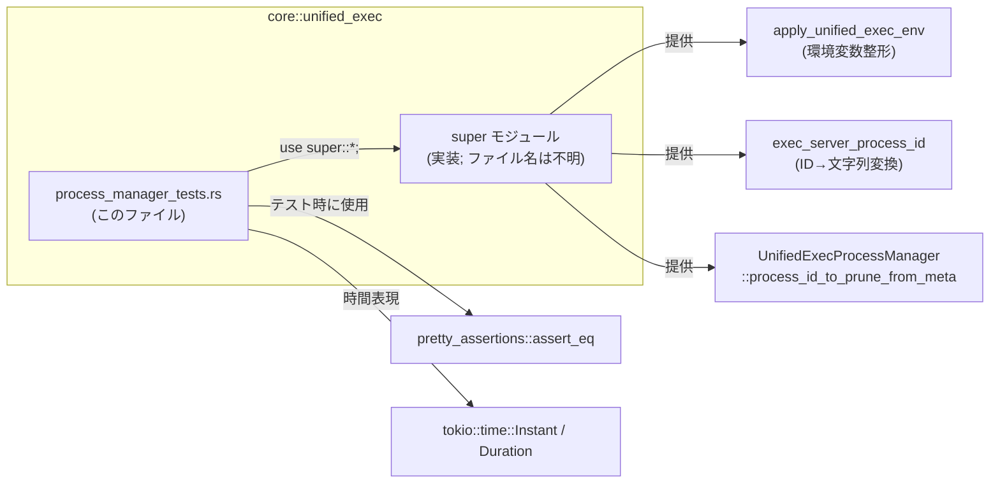
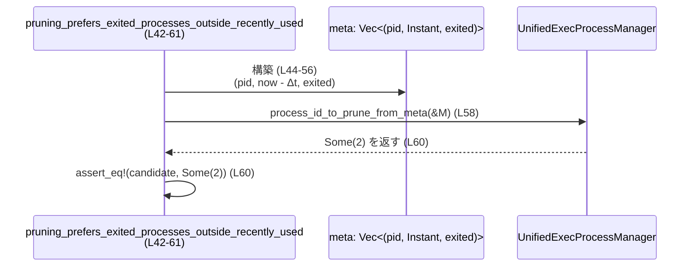

# core/src/unified_exec/process_manager_tests.rs コード解説

---

## 0. ざっくり一言

`process_manager_tests.rs` は、**統一実行環境用の環境変数設定** と **プロセス管理の pruning（削除候補選定）ロジック**、および **exec サーバ用プロセス ID 文字列変換** の仕様をテストで固定しているモジュールです。  
このファイル自身はテストのみを持ち、実装はすべて親モジュール（`super`）側にあります。

---

## 1. このモジュールの役割

### 1.1 概要

このテストモジュールは、少なくとも次の 3 つの仕様を保証しています。

- `apply_unified_exec_env` が、与えられた環境変数マップに **決まったデフォルト値を注入し、特定キーを上書きする** こと（`process_manager_tests.rs:L6-35`）。
- `exec_server_process_id` が、与えられたプロセス ID を **文字列に変換して返す** こと（`process_manager_tests.rs:L37-40`）。
- `UnifiedExecProcessManager::process_id_to_prune_from_meta` が、プロセスのメタデータから **削除候補のプロセス ID を選ぶ戦略** を持ち、
  - 終了済みプロセスを優先し（`process_manager_tests.rs:L42-61`）、
  - 終了済みがなければ LRU（最終使用時刻が最も古いもの）で選び（`process_manager_tests.rs:L63-82`）、
  - 「最近使われたプロセス」の集合は、終了していても **保護される** こと（`process_manager_tests.rs:L84-103`）。
  をテストしています。

### 1.2 アーキテクチャ内での位置づけ

このファイルは親モジュールの実装に対するユニットテストです。`use super::*;` により親モジュールの公開アイテムをすべてインポートし、振る舞いを検証しています（`process_manager_tests.rs:L1`）。

以下は、本ファイルと外部コンポーネントの関係を簡略化した図です。



> 親モジュールの具体的なファイルパス（例: `process_manager.rs`）は、このチャンクからは分かりません。

### 1.3 設計上のポイント（テストから読み取れる範囲）

- **環境変数の一元管理**  
  - デフォルト環境変数をまとめて `HashMap` に注入し、テストで固定しています（`process_manager_tests.rs:L8-22`）。
  - `NO_COLOR` や `LANG=C.UTF-8` など、表示やロケールに関わるキーが明示的に指定されています。

- **オーバーライド方針**  
  - `NO_COLOR` はベース環境に値があっても **強制的に `"1"` で上書きされる**（`process_manager_tests.rs:L27-28, L31-34`）。
  - 一方で `PATH` のような他のキーは、ベース環境の値が **保持される**（`process_manager_tests.rs:L28-34`）。
  - つまり、「必ず上書きしたいキー」と「尊重したいキー」が分かれていることが分かります。

- **プロセス pruning の戦略**  
  テスト名とデータから、少なくとも以下が読み取れます（`process_manager_tests.rs:L42-103`）。
  - `meta` は `(process_id, last_used: Instant, exited: bool)` 形式のタプル列だと解釈できます。
  - 「最近使われたプロセス」の集合（テストでは「最後の 8 エントリ」とコメントされています）があり、その集合に属するプロセスは終了済みであっても削除対象から外されています（`process_manager_tests.rs:L84-103`）。
  - その外側（古い側）のプロセスから、
    - まず `exited == true` を優先して削除候補にし（`process_manager_tests.rs:L42-61`）、
    - 全て `exited == false` の場合は最も古いもの（LRU）を選びます（`process_manager_tests.rs:L63-82`）。

- **並行性**  
  - このファイル内のテストは同期関数であり、`async`/`await` や並行実行は行っていません。
  - ただし、`tokio::time::Instant` を用いているため、本番コード側では Tokio ランタイム時間に依存する可能性があります（`process_manager_tests.rs:L3-4, L44, L65, L86`）。

---

## 2. 主要な機能一覧（テスト対象の振る舞い）

- 環境変数の統一:
  - `apply_unified_exec_env`: ベース環境変数に対して、`NO_COLOR=1` などの決まったデフォルトを注入・一部上書きする。
- プロセス ID の文字列変換:
  - `exec_server_process_id`: 数値プロセス ID を文字列に変換する。
- プロセス pruning 戦略:
  - `UnifiedExecProcessManager::process_id_to_prune_from_meta`:
    - 削除候補を「終了済みプロセス優先」で選ぶ。
    - 終了済みがなければ LRU で選ぶ。
    - 「最近使われたプロセス」（最後の N 件）は終了済みでも保護する。

---

## 3. 公開 API と詳細解説

このファイルには公開 API の実装はなく、**テスト対象の API を呼び出す側**です。  
以下では、テストから読み取れる範囲で、テスト対象 API の仕様を整理します。

### 3.1 型一覧（構造体・列挙体など）

| 名前 | 種別 | 役割 / 用途 | 根拠 |
|------|------|-------------|------|
| `UnifiedExecProcessManager` | 構造体または列挙体（テストからは不明） | 統一 exec プロセスの管理を行い、`process_id_to_prune_from_meta` で削除候補のプロセス ID を選ぶ役割を持つと解釈できます | テストで `UnifiedExecProcessManager::process_id_to_prune_from_meta(&meta)` として呼び出されている（`process_manager_tests.rs:L58, L79, L100`）。型定義自体はこのファイルには存在しません |

※ `HashMap`, `Instant`, `Duration`, `Option` は標準／外部クレート由来の一般的な型のため、ここでは列挙対象から外しています。

---

### 3.2 関数詳細（テスト対象 API）

#### `apply_unified_exec_env(env: HashMap<String, String>) -> HashMap<String, String>`（推定）

**概要**

- ベースとなる環境変数マップに対して、統一された実行環境用のデフォルト値を注入する関数です。
- 少なくとも以下のキーが、最終的な環境に存在することがテストで保証されています（`process_manager_tests.rs:L8-22`）。

  - `NO_COLOR` = `"1"`
  - `TERM` = `"dumb"`
  - `LANG` = `"C.UTF-8"`
  - `LC_CTYPE` = `"C.UTF-8"`
  - `LC_ALL` = `"C.UTF-8"`
  - `COLORTERM` = `""`（空文字）
  - `PAGER` = `"cat"`
  - `GIT_PAGER` = `"cat"`
  - `GH_PAGER` = `"cat"`
  - `CODEX_CI` = `"1"`

**引数**

| 引数名 | 型 | 説明 |
|--------|----|------|
| `env` | `HashMap<String, String>`（と推定） | ベースとなる環境変数マップ。テストでは `HashMap::new()` や、`NO_COLOR` と `PATH` を含むマップが渡されています（`process_manager_tests.rs:L8, L27-31`）。 |

> `assert_eq!(env, expected)` で比較されているため、戻り値 `env` と `expected` が同じ `HashMap<String, String>` 型であると読み取れます（`process_manager_tests.rs:L8-22`）。

**戻り値**

- `HashMap<String, String>`  
  - 引数 `env` に対してデフォルト値の注入・一部上書きを行った結果のマップです（`process_manager_tests.rs:L8-22, L31-34`）。

**内部処理の流れ（テストから推測できる範囲）**

テストから読み取れる最小限の仕様は次の通りです。

1. ベースの `env` を開始点とする（`HashMap::new()` を渡した場合、結果はデフォルトのみになる: `process_manager_tests.rs:L8-22`）。
2. 上記のデフォルトキーを、`env` に挿入または上書きする。
   - `NO_COLOR` は、ベース環境が `"0"` であっても `"1"` に上書きされます（`process_manager_tests.rs:L27-34`）。
   - `PATH` については、ベース環境の値 `"/usr/bin"` が維持されているため、デフォルト側では `PATH` を書き換えていないことが分かります（`process_manager_tests.rs:L28-34`）。
3. 処理後のマップを返す。

> デフォルト以外のキー（例: `PATH`）の扱いは、このテストからは「少なくとも書き換えられていない」ことのみが分かります。他のキーの扱いについては、このチャンクからは不明です。

**Examples（使用例）**

テストと同等の簡単な使用例です。

```rust
use std::collections::HashMap;

// ベースとなる環境変数を用意する
let mut base = HashMap::new();
base.insert("NO_COLOR".to_string(), "0".to_string());   // 元は "0"
base.insert("PATH".to_string(), "/usr/bin".to_string()); // PATH を明示

// 統一 exec 環境を適用
let env = apply_unified_exec_env(base);

// 少なくとも NO_COLOR は "1" に上書きされ、PATH は維持される
assert_eq!(env.get("NO_COLOR"), Some(&"1".to_string()));
assert_eq!(env.get("PATH"), Some(&"/usr/bin".to_string()));
```

**Errors / Panics**

- 戻り値は `HashMap` であり `Result` ではないため、**エラーを戻り値で表現していない**ことが分かります（`process_manager_tests.rs:L8-22, L31-34`）。
- panic する条件については、このチャンク内に情報がなく、不明です。

**Edge cases（エッジケース）**

テストから確認できるもの、および不明なものを分けて整理します。

- **確認できる挙動**
  - 入力が空の `HashMap` の場合、上記デフォルトキーのみを含むマップが返ります（`process_manager_tests.rs:L6-23`）。
  - `NO_COLOR` が `"0"` のように既にセットされていても `"1"` に上書きされます（`process_manager_tests.rs:L27-34`）。
  - `PATH` に既存の値がある場合、それは維持されます（`process_manager_tests.rs:L28-34`）。

- **このチャンクからは不明な点**
  - `PATH` が存在しない場合に新たに追加されるかどうか。
  - 他の OS 依存のキー（例: `HOME`, `SHELL`）の扱い。
  - 既に `TERM` などがセットされている場合の上書き有無。

**使用上の注意点**

- テストからは、「**NO_COLOR は強制的に `"1"` にする**」ことが仕様であると読み取れます（`process_manager_tests.rs:L27-34`）。
  - 元の環境に色付き出力を期待する設定があっても、この API を通すと抑止される可能性があります。
- `PATH` のような重要な実行パスは維持されることがテストされていますが（`process_manager_tests.rs:L28-34`）、他のキーについては実装を確認する必要があります（このチャンクでは不明）。

---

#### `exec_server_process_id(process_id: <整数型>) -> String`（推定）

**概要**

- exec サーバのプロセス ID を、文字列形式に変換して返す関数です。
- テストでは、`4321` という整数を渡し `"4321"` という文字列が得られることが検証されています（`process_manager_tests.rs:L37-40`）。

**引数**

| 引数名 | 型 | 説明 |
|--------|----|------|
| `process_id` | 何らかの整数型（テストでは整数リテラル `4321` が渡されている） | exec サーバプロセスの ID を表す整数。具体的な型（`u32` など）は、このチャンクからは分かりません。 |

**戻り値**

- `String`  
  - `process_id` の数値表現を文字列に変換したもの（`"4321"` → `"4321"`）であることがテストから分かります（`process_manager_tests.rs:L39`）。

**内部処理の流れ（推測）**

テストから読み取れるのは「数値 → 同じ見かけの文字列」への変換だけです（`process_manager_tests.rs:L39`）。

1. `process_id`（整数）を受け取る。
2. 10 進数表現の文字列に変換する（`process_id.to_string()` 相当と推測されます）。
3. 変換結果の `String` を返す。

**Examples（使用例）**

```rust
// プロセス ID が 4321 のとき
let pid_str = exec_server_process_id(4321);
assert_eq!(pid_str, "4321".to_string());
```

**Errors / Panics**

- `String` を返しているため、エラーは戻り値で表現されていません。
- 通常、整数の `to_string()` は panic しないため、この関数も panic しないと考えられますが、**実装がこのチャンクにないため断定はできません**。

**Edge cases（エッジケース）**

- **不明な点**
  - 負の値（`-1`）や極端に大きな値に対する挙動（符号付き／符号無しなど）は、このチャンクからは不明です。
  - 非数値な ID（UUID など）を扱うかどうかも不明です。

**使用上の注意点**

- テストからは 10 進数の整数を前提としているように見えます（`process_manager_tests.rs:L39`）。  
  他のフォーマット（16 進表現など）を期待する用途には、そのままでは適さない可能性があります。

---

#### `UnifiedExecProcessManager::process_id_to_prune_from_meta(meta: &Vec<(Pid, Instant, bool)>) -> Option<Pid>`（型は推定）

**概要**

- プロセスのメタ情報（プロセス ID・最終使用時刻・終了フラグ）から、**削除（prune）すべきプロセス ID** を 1 つ選んで返す関数です。
- テストから読み取れる仕様は、以下のような「優先順位付き LRU 戦略」です（`process_manager_tests.rs:L42-103`）。
  1. 「最近使われたプロセス」の集合（最後の N 件）を保護する。
  2. その外側のプロセス群から、`exited == true` なものを優先して削除候補にする。
  3. もし `exited == true` なものがなければ、最も古いプロセス（LRU）を削除候補にする。

**引数**

| 引数名 | 型 | 説明 |
|--------|----|------|
| `meta` | `&Vec<(Pid, Instant, bool)>` または `&[(Pid, Instant, bool)]`（テストからは`&meta` が渡されている） | 各要素が `(process_id, last_used: Instant, exited: bool)` であると解釈できるメタ情報の列。テストでは、`Instant::now()` からの相対時間と、`exited` の真偽が与えられています（`process_manager_tests.rs:L44-56, L65-77, L86-98`）。 |

> 実際のシグネチャはこのファイルからは分かりませんが、`&meta`（`Vec`）を渡しており、戻り値が `Option<_>` であることが `assert_eq!(candidate, Some(…))` から分かります（`process_manager_tests.rs:L58-60, L79-81, L100-103`）。

**戻り値**

- `Option<Pid>`（推定）  
  - `Some(pid)` の場合、その `pid` が「削除してよいプロセス」の候補であることを表すと解釈できます。
  - `None` の意味や発生条件は、このチャンクにはテストがないため不明です。

**内部処理の流れ（テストから読み取れるロジック）**

3 つのテストケースを元に、仕様を整理します。

1. **終了済み優先 + 最近使用された集合の外側**（`pruning_prefers_exited_processes_outside_recently_used`）  
   - メタ情報（抜粋）: `meta = vec![(1, now-40s, false), (2, now-30s, true), ..., (10, now-13s, false)]`（`process_manager_tests.rs:L44-56`）。
   - `candidate == Some(2)` が期待されています（`process_manager_tests.rs:L60`）。
   - ここでは ID `1` が最も古い（40 秒前）ですが、`exited == false`。  
     ID `2` は 30 秒前で `exited == true`。
   - テスト名の「prefers_exited_processes」から、「**古い中でも `exited == true` を優先して選ぶ**」ことが分かります。

2. **終了済みがない場合は LRU**（`pruning_falls_back_to_lru_when_no_exited`）  
   - メタ情報では全て `exited == false` です（`process_manager_tests.rs:L63-77`）。
   - この場合 `candidate == Some(1)`、つまり最も古いプロセス（now-40s）が選ばれます（`process_manager_tests.rs:L81`）。
   - テスト名の「falls_back_to_lru」に対応しています。

3. **「最近のプロセス」は終了済みでも保護**（`pruning_protects_recent_processes_even_if_exited`）  
   - メタ情報で `exited == true` な ID は `3`（20 秒前）と `10`（13 秒前）です（`process_manager_tests.rs:L86-98`）。
   - コメントで「(10) is exited but among the last 8; we should drop the LRU outside that set.」とあり（`process_manager_tests.rs:L102`）、最後の 8 件（ID 3〜10）を「最近使われた集合」とみなしていることが分かります。
   - 結果 `candidate == Some(1)`（`process_manager_tests.rs:L103`）となり、  
     - ID `10` は終了済みですが最近集合に属するため保護され、  
     - 最近集合の外にある ID `1` が削除候補として選ばれています。

以上から、次のような手順がテストで期待されていると解釈できます。

1. `meta` のうち「最近使われた集合」（最後の N 件; テストでは 8 件とコメントされています）を除外し、それより古い要素だけを対象にする。
2. その対象の中から、`exited == true` な要素があれば、そのうち LRU（最も古い）または適切な 1 件を選んで `Some(pid)` を返す（テストでは ID 2 が選ばれている: `process_manager_tests.rs:L42-61`）。
3. 対象中に `exited == true` がなければ、最も古い要素（LRU）を削除候補として `Some(pid)` を返す（`process_manager_tests.rs:L63-82`）。
4. 対象要素が空の場合の挙動は、このチャンクにはテストがなく不明です。

**Examples（使用例）**

テストを簡略化した使用例です。

```rust
use tokio::time::{Instant, Duration};

let now = Instant::now();

// (pid, last_used, exited) のメタ情報を構築
let meta = vec![
    (1, now - Duration::from_secs(40), false), // 古い & 実行中
    (2, now - Duration::from_secs(30), true),  // 古い & 終了済み
    // 以降はより新しいプロセス...
];

// 削除候補のプロセス ID を取得
let candidate = UnifiedExecProcessManager::process_id_to_prune_from_meta(&meta);

// このケースでは、終了済みの 2 が選ばれることを期待
assert_eq!(candidate, Some(2));
```

**Errors / Panics**

- 戻り値に `Option<_>` を用いているため、「削除候補がない」場合の表現として `None` を使う設計であると推測されます。  
  ただし、このチャンクには `None` を返すテストがなく、具体的な条件は不明です。
- panic の可能性（例えば空配列への `index` アクセスなど）は、実装がないため判断できません。

**Edge cases（エッジケース）**

- **テストから推測できる前提条件**
  - `meta` は「古い順」に並んでいるように見えます（`now - 40s`, `now - 30s`, ..., `now - 13s` の順; `process_manager_tests.rs:L44-56, L65-77, L86-98`）。
  - 実装もこの並びを前提にしている可能性がありますが、断定はできません。

- **未テストのケース（挙動不明）**
  - `meta` が空、または要素数が「最近集合」のサイズ未満のとき。
  - 同じ `last_used` を持つ複数プロセスがあるとき。
  - 「最近集合」のサイズが変更された場合（テストは「最後の 8」とコメントしているのみで、定数名等は不明です）。

**使用上の注意点**

- テストからは、`meta` が「古い順」に並んでいる前提で設計されているように見えます。  
  別の順序で渡すと、意図しないプロセスが削除候補になる可能性があります。
- この関数の戻り値 `Some(pid)` は、おそらく後続の処理で「実際に kill する」など重要な操作に使われると考えられるため、入力データの整合性（`last_used` の正しさなど）は重要です。
- 時刻として `tokio::time::Instant` が使われているため、本番環境では Tokio の時間制御（手動進行など）の影響を受ける可能性があります。

---

### 3.3 その他の関数（テスト関数）

このファイル内で定義されているのは、すべてテスト関数です。

| 関数名 | 役割（1 行） | 定義位置 |
|--------|--------------|----------|
| `unified_exec_env_injects_defaults` | 空の環境に `apply_unified_exec_env` を適用すると、決め打ちのデフォルト環境変数がすべて注入されることを検証する | `process_manager_tests.rs:L6-23` |
| `unified_exec_env_overrides_existing_values` | 既存環境に `apply_unified_exec_env` を適用した際、`NO_COLOR` が `"1"` に上書きされ、`PATH` が維持されることを検証する | `process_manager_tests.rs:L25-35` |
| `exec_server_process_id_matches_unified_exec_process_id` | `exec_server_process_id(4321)` が `"4321"` を返すことを検証する | `process_manager_tests.rs:L37-40` |
| `pruning_prefers_exited_processes_outside_recently_used` | 最近集合の外側で終了済みのプロセスがある場合、その ID が削除候補として選ばれることを検証する | `process_manager_tests.rs:L42-61` |
| `pruning_falls_back_to_lru_when_no_exited` | 終了済みプロセスがない場合、最も古いプロセス（LRU）が削除候補として選ばれることを検証する | `process_manager_tests.rs:L63-82` |
| `pruning_protects_recent_processes_even_if_exited` | 「最近集合」に属するプロセスは終了済みでも保護され、外側の LRU が削除候補になることを検証する | `process_manager_tests.rs:L84-103` |

---

## 4. データフロー

ここでは、最もロジック性の高い `process_id_to_prune_from_meta` に関するテストのデータフローを示します。

### pruning_prefers_exited_processes_outside_recently_used (L42-61)

このテストでは、古い順に並んだメタ情報 `meta` を構築し、それをもとに削除候補 `candidate` を求めています。



**要点**

- テスト関数 `T` が `Instant::now()` を取得し、そこからのオフセットで複数プロセスの「古さ」を表現しています（`process_manager_tests.rs:L44-56`）。
- そのメタ情報を `UnifiedExecProcessManager::process_id_to_prune_from_meta` に渡し、返ってきた `Option<pid>` を `assert_eq!` で検証しています（`process_manager_tests.rs:L58-60`）。
- データの流れは単純で、**このテストファイル側で状態を持つことはありません**。すべての状態は `meta` と戻り値 `candidate` に集約されています。

---

## 5. 使い方（How to Use）

このファイル自体はテストですが、ここでの呼び出し方がそのまま API の基本的な使い方になっています。

### 5.1 基本的な使用方法

#### 統一環境の適用

```rust
use std::collections::HashMap;

// ベース環境を作成
let mut env = HashMap::new();
env.insert("PATH".to_string(), "/usr/bin".to_string());

// apply_unified_exec_env で統一設定を適用
let unified_env = apply_unified_exec_env(env);

// 期待される性質:
// - NO_COLOR や LANG などのキーが追加されている
// - PATH は "/usr/bin" のまま維持されている（process_manager_tests.rs:L28-34）
assert_eq!(unified_env.get("PATH"), Some(&"/usr/bin".to_string()));
assert_eq!(unified_env.get("NO_COLOR"), Some(&"1".to_string()));
```

#### 削除候補プロセスの取得

```rust
use tokio::time::{Instant, Duration};

let now = Instant::now();

// (pid, last_used, exited) のベクタを古い順に構築
let meta = vec![
    (1, now - Duration::from_secs(40), false),
    (2, now - Duration::from_secs(30), true),
    (3, now - Duration::from_secs(20), false),
    // ...
];

// 削除候補を取得
let candidate = UnifiedExecProcessManager::process_id_to_prune_from_meta(&meta);

// この例では、終了済みの 2 が候補になることが期待される
assert_eq!(candidate, Some(2));
```

#### プロセス ID 文字列の取得

```rust
let pid_num = 4321;
let pid_str = exec_server_process_id(pid_num);

// "4321" という文字列表現が得られる（process_manager_tests.rs:L39）
assert_eq!(pid_str, "4321");
```

### 5.2 よくある使用パターン（推測）

コードから直接は読み取れませんが、テスト名と API から、以下のような利用が想定されます（推測であり、このチャンクからは断定できません）。

- 外部プロセス起動前に `apply_unified_exec_env` を通して、CI 環境に依存しない決まった環境を渡す。
- プロセスマネージャが保持している `(pid, last_used, exited)` のリストから、容量制限などの都合で削除すべきプロセスを選ぶ際に `process_id_to_prune_from_meta` を利用する。
- `exec_server_process_id` で ID を文字列に変換し、ログやプロトコルメッセージに埋め込む。

### 5.3 よくある間違い（起こり得る誤用）

推測レベルですが、以下のような点に注意が必要です。

```rust
// （誤りの可能性がある例） last_used の順序をバラバラにして渡す
let meta = vec![
    (1, now - Duration::from_secs(10), false),
    (2, now - Duration::from_secs(40), true), // 実際にはこちらが最も古い
];

// 実装が「古い順に並んでいる」前提であれば、意図しない pid が選ばれる可能性がある
let candidate = UnifiedExecProcessManager::process_id_to_prune_from_meta(&meta);
```

```rust
// （意図しない影響の可能性がある例）ユーザ環境の NO_COLOR を上書きしてしまう
let mut env = HashMap::new();
env.insert("NO_COLOR".to_string(), "0".to_string());

// apply_unified_exec_env を適用
let unified_env = apply_unified_exec_env(env);

// NO_COLOR は "1" に変更される（process_manager_tests.rs:L27-34）
assert_eq!(unified_env.get("NO_COLOR"), Some(&"1".to_string()));
```

### 5.4 使用上の注意点（まとめ）

- `apply_unified_exec_env`
  - `NO_COLOR` はベース環境よりも優先されます（`process_manager_tests.rs:L27-34`）。ユーザの設定を尊重したい場合は、この仕様を理解する必要があります。
  - どのキーが上書き対象か／尊重対象かは、このチャンクからは `NO_COLOR` と `PATH` しか分かりません。

- `process_id_to_prune_from_meta`
  - テストからは `meta` が古い順である前提が読み取れるため、その順序を守るべきです（`process_manager_tests.rs:L44-56, L65-77, L86-98`）。
  - 「最近集合」のサイズや定義は実装依存です。テストでは「最後の 8」とコメントされていますが（`process_manager_tests.rs:L102`）、定数名や変更可能性は不明です。

- 並行性・時間
  - `tokio::time::Instant` を使っているため、本番コードでは Tokio ランタイム時間に依存した動作になる可能性があります。テストでは単に相対時間の構築に使われているだけで、非同期実行はしていません。

---

## 6. 変更の仕方（How to Modify）

このファイルに対する変更は、基本的に「テストの追加・修正」です。

### 6.1 新しい機能を追加する場合（テスト観点）

- 例: `apply_unified_exec_env` に新しい環境変数キーを追加したい場合
  1. 親モジュール（`super`）側でデフォルトキーを追加する。
  2. 本ファイルに、追加したキーを検証するテスト（または既存テストの `expected` マップの更新）を行う（`process_manager_tests.rs:L8-22` のような形）。
  3. 必要なら「既存値がある場合の挙動」を確認するテストも追加する（`process_manager_tests.rs:L25-35` と同じパターン）。

- 例: pruning の戦略を変更する場合
  1. 親モジュール側の `process_id_to_prune_from_meta` のロジックを変更する。
  2. 本ファイルの 3 つの pruning テスト（`process_manager_tests.rs:L42-103`）を、新仕様に合わせて更新・追加する。
     - 「終了済み優先」
     - 「終了済みがないときの LRU fallback」
     - 「最近集合の保護」
     といった観点を網羅しているかを確認します。

### 6.2 既存の機能を変更する場合（影響範囲と契約）

- **前提条件・契約の確認**
  - `apply_unified_exec_env`
    - 「NO_COLOR を必ず `"1"` にする」という契約を変えると、`unified_exec_env_overrides_existing_values` が失敗します（`process_manager_tests.rs:L25-35`）。
  - `process_id_to_prune_from_meta`
    - 最近集合の定義（サイズ）や、終了済みプロセス優先のルールを変えると、3 つの pruning テストすべてに影響します（`process_manager_tests.rs:L42-103`）。

- **テストの整合性**
  - 仕様変更に合わせてテストを更新するか、逆に「テストが表現している仕様を守る」かを決める必要があります。
  - 特に pruning のロジックは、テスト名がそのまま仕様を表しているため（`prefers_exited...`, `falls_back_to_lru...`, `protects_recent...`）、変更するときはテスト名も含め見直すと分かりやすくなります。

---

## 7. 関連ファイル

このチャンクに明示的なパスはありませんが、依存関係から分かる範囲を整理します。

| パス / モジュール | 役割 / 関係 |
|------------------|------------|
| `super` モジュール（具体的ファイルパスは不明） | `use super::*;` によりインポートされている親モジュールであり、`apply_unified_exec_env`, `exec_server_process_id`, `UnifiedExecProcessManager` など、本テストが検証する実装を提供していると考えられます（`process_manager_tests.rs:L1, L8, L31, L39, L58, L79, L100`）。 |
| `pretty_assertions` クレート | `assert_eq!` マクロの差分表示を改善するために利用されています（`process_manager_tests.rs:L2, L22, L33-34, L39, L60, L81, L103`）。 |
| `tokio::time` モジュール | `Instant` および `Duration` を提供し、プロセスメタ情報の「古さ」をテストで表現するために利用されています（`process_manager_tests.rs:L3-4, L44-56, L65-77, L86-98`）。 |

> 親モジュールの具体的なファイル名（`process_manager.rs` など）は、このチャンクからは分かりません。Rust の慣例上はその可能性が高いものの、ここでは推測に留まります。
