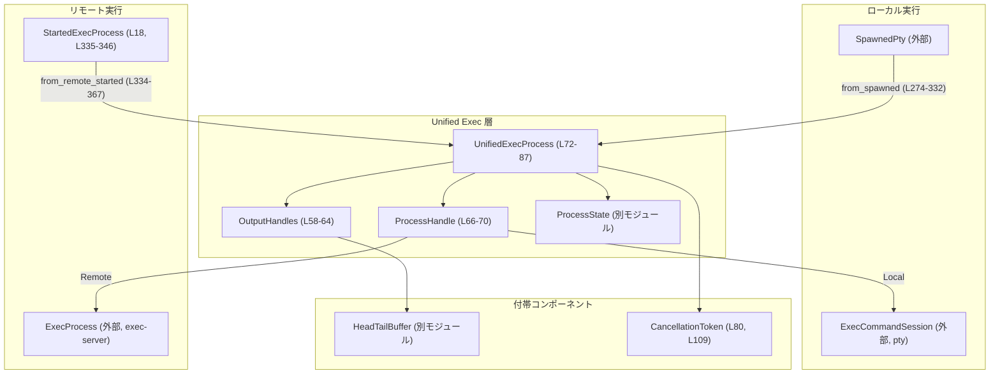

# core/src/unified_exec/process.rs コード解説

## 0. ざっくり一言

ローカル PTY セッション（`ExecCommandSession`）とリモート exec-server プロセス（`ExecProcess`）を共通のインターフェースで扱うための「統一プロセスハンドル」を実装し、標準入出力・終了状態・サンドボックス拒否エラーなどを一元的に管理するモジュールです（`UnifiedExecProcess`、`ProcessHandle` など, `core/src/unified_exec/process.rs:L66-L87`）。

---

## 1. このモジュールの役割

### 1.1 概要

- このモジュールは、**ローカル／リモート双方の実行プロセスを同じ API で扱う**ためのラッパーを提供します。
- プロセスの標準出力／標準エラーを **リングバッファ（`HeadTailBuffer`）に蓄積しつつ、`broadcast` チャネルで配信** します（`OutputBuffer`, `OutputHandles`, `spawn_*_output_task`, `L56-L64`, `L369-L456`, `L458-L485`）。
- 終了コードや失敗メッセージを `watch::Sender<ProcessState>` で共有し、**キャンセル・終了検知・サンドボックス拒否の検出**を行います（`ProcessState`, `check_for_sandbox_denial*`, `L82-L83`, `L227-L272`）。

### 1.2 アーキテクチャ内での位置づけ

`UnifiedExecProcess` は「統一実行レイヤ」の中核として、下位の実行バックエンドと上位のユニファイド API の間を仲介します。



※ 行番号は `core/src/unified_exec/process.rs` の範囲です。

### 1.3 設計上のポイント

- **ローカル／リモートの抽象化**  
  - `ProcessHandle` enum でローカル PTY (`ExecCommandSession`) とリモート exec-server (`ExecProcess`) を抽象化しています（`L66-L70`）。
- **出力の二重経路**  
  - 出力は `HeadTailBuffer` に蓄積しつつ、`broadcast::Sender<Vec<u8>>` でストリーミング配信しています（`UnifiedExecProcess.output_buffer/output_tx`, `L75-L77`, `L369-L408`, `L458-L475`）。
- **状態とキャンセルの一元管理**  
  - `ProcessState` を `watch::Sender` で共有し、`CancellationToken` と `AtomicBool` で終了・クローズ状態を管理します（`L80-L83`, `L178-L194`, `L196-L212`, `L369-L381`）。
- **Tokio 非同期／並行処理前提**  
  - 出力処理やリモート読み取りは `tokio::spawn` されたタスクで行い、チャネルや `Notify` で他タスクと連携しています（`spawn_remote_output_task`, `L369-L456`; `spawn_local_output_task`, `L458-L485`）。
- **サンドボックス拒否検出**  
  - 終了後の出力をまとめて `is_likely_sandbox_denied` に渡し、拒否と推定される場合は特別な `UnifiedExecError` を返します（`check_for_sandbox_denial*`, `L227-L272`）。
- **Drop 時の自動 terminate**  
  - `Drop` 実装で `self.terminate()` を呼び、スコープを抜けたときにプロセスと関連タスクを止める設計です（`L494-L497`）。

---

## 2. 主要な機能一覧

（行番号は `core/src/unified_exec/process.rs`）

- **プロセスの統一ラップ**: `UnifiedExecProcess` がローカル PTY とリモート exec-server の両方を `ProcessHandle` 経由で扱います（`L66-L70`, `L72-L87`）。
- **標準入力の書き込み**: `write(&self, data: &[u8])` でローカル／リモート双方に対して stdin に書き込めます（`L131-L154`）。
- **標準出力／標準エラーの集約と配信**:  
  - `HeadTailBuffer` にバッファリング（`snapshot_output`, `L214-L217`）。  
  - `broadcast::Sender<Vec<u8>>` 経由でリアルタイム配信（`output_tx`, `L75`, `L369-L408`, `L458-L475`）。
- **終了状態の管理と問い合わせ**: `has_exited`, `exit_code`, `failure_message` で終了状態・終了コード・失敗メッセージを取得します（`L178-L194`, `L223-L225`）。
- **プロセス終了／キャンセル**: `terminate()` と内部の `CancellationToken` でプロセス停止と関連タスクの中止を行います（`L196-L212`, `L487-L491`）。
- **サンドボックス拒否検出**: 出力内容と終了情報からサンドボックス拒否らしさを判定し、専用エラーを生成します（`L227-L272`）。
- **ローカルプロセスの初期化**: `from_spawned(SpawnedPty, ...)` で PTY ベースのローカルプロセスから `UnifiedExecProcess` を構築します（`L274-L332`）。
- **リモートプロセスの初期化**: `from_remote_started(StartedExecProcess, ...)` で exec-server ベースのリモートプロセスから構築します（`L334-L367`）。

---

## 3. 公開 API と詳細解説

### 3.1 型一覧（構造体・列挙体など：コンポーネントインベントリー）

| 名前 | 種別 | 可視性 | 役割 / 用途 | 根拠 (行) |
|------|------|--------|-------------|-----------|
| `SpawnLifecycle` | トレイト | `pub(crate)` | プロセス spawn 前後で行う追加処理（FD の引き継ぎなど）を表現。デフォルト実装は何もしない（`inherited_fds`, `after_spawn`）（`L35-L46`）。 | `process.rs:L35-L46` |
| `SpawnLifecycleHandle` | 型エイリアス | `pub(crate)` | `Box<dyn SpawnLifecycle>` の別名。ライフサイクルハンドラの所有を表す（`L48`）。 | `process.rs:L48-L48` |
| `NoopSpawnLifecycle` | 構造体 | `pub(crate)` | 追加処理を行わないライフサイクル実装。`SpawnLifecycle` を空で実装（`L50-L52`, `L54`）。 | `process.rs:L50-L52`, `L54` |
| `OutputBuffer` | 型エイリアス | `pub(crate)` | `Arc<Mutex<HeadTailBuffer>>`。プロセス出力の共有バッファ（`L56`）。 | `process.rs:L56-L56` |
| `OutputHandles` | 構造体 | `pub(crate)` | 出力バッファ、通知、クローズフラグ、キャンセルトークンをまとめたハンドル。出力タスクに渡される（`L58-L64`）。 | `process.rs:L58-L64` |
| `ProcessHandle` | 列挙体 | `enum` (プライベート) | 実際のプロセスハンドルを `Local(Box<ExecCommandSession>)` と `Remote(Arc<dyn ExecProcess>)` で抽象化（`L66-L70`）。 | `process.rs:L66-L70` |
| `UnifiedExecProcess` | 構造体 | `pub(crate)` | ローカル／リモート問わずプロセスを統一的に操作するメイン型。出力・状態・キャンセルを内部で管理（`L72-L87`）。 | `process.rs:L72-L87` |
| `EARLY_EXIT_GRACE_PERIOD` | 定数 | `const` (プライベート) | プロセス開始直後の早期終了を待つためのタイムアウト（150ms）（`L33`）。 | `process.rs:L33-L33` |

`ProcessState`, `HeadTailBuffer` は別モジュールからのインポートであり、本チャンクには定義がありません（`L30-L31`）。

---

### 3.2 関数詳細（重要な 7 件）

以下では、公開／準公開 API およびコアロジックから 7 関数を選んで詳細を説明します。

---

#### `UnifiedExecProcess::from_spawned(spawned: SpawnedPty, sandbox_type: SandboxType, spawn_lifecycle: SpawnLifecycleHandle) -> Result<Self, UnifiedExecError>`

**概要**

- ローカル PTY ベースの `SpawnedPty` から `UnifiedExecProcess` を構築し、出力取得タスク・終了監視・サンドボックス拒否チェックをセットアップします（`L274-L332`）。

**引数**

| 引数名 | 型 | 説明 |
|--------|----|------|
| `spawned` | `SpawnedPty` | 外部モジュールが生成したローカル PTY プロセスとその stdout/stderr/exit チャネル（`L279-L284`）。 |
| `sandbox_type` | `SandboxType` | このプロセスに適用されるサンドボックス種別。サンドボックス拒否検出に使用（`L276`）。 |
| `spawn_lifecycle` | `SpawnLifecycleHandle` | spawn 周辺で使用されるライフサイクルハンドラ。ただし本関数内では利用されず、`UnifiedExecProcess` に保持だけされます（`L277`, `L286-L290`）。 |

**戻り値**

- `Ok(UnifiedExecProcess)`：ローカルプロセスに紐づく `UnifiedExecProcess`。
- `Err(UnifiedExecError)`：プロセスがサンドボックスにより拒否されたと判断された場合など（`check_for_sandbox_denial` 経由, `L303-L304`, `L308-L309`, `L315-L317`）。

**内部処理の流れ（アルゴリズム）**

1. `SpawnedPty` をパターンマッチで展開し、`session`, `stdout_rx`, `stderr_rx`, `exit_rx` を取得（`L279-L284`）。
2. `stdout_rx`, `stderr_rx` を `codex_utils_pty::combine_output_receivers` で統合（`L285`）。
3. `Self::new` で `ProcessHandle::Local(Box::new(session))` を使って `UnifiedExecProcess` を初期化（`L286-L290`）。
4. ローカル出力処理タスクを `spawn_local_output_task` で生成し、`managed.output_task` に格納（`L291-L298`）。
5. `exit_rx.try_recv()` で、すでに終了しているかをノンブロッキングで確認（`L300-L312`）。
   - 終了コードあり／チャネルクローズの場合：`signal_exit` で状態更新後、`check_for_sandbox_denial()` を実行し、その結果に応じて `Ok(managed)` か `Err` を返す（`L301-L310`）。
6. まだ終了していない場合は `EARLY_EXIT_GRACE_PERIOD`（150ms）をかけて `exit_rx` を待つ（`L314-L318`）。
   - この間に終了した場合も同様に `signal_exit` と `check_for_sandbox_denial` 実行。
7. それでも終了しない場合は、バックグラウンドで `exit_rx.await` するタスクを `tokio::spawn`。終了時に `ProcessState` を `exited` にし、`CancellationToken` をキャンセル（`L320-L329`）。
8. 最終的に `Ok(managed)` を返す（`L331`）。

**Examples（使用例）**

```rust
use codex_sandboxing::SandboxType;
use codex_utils_pty::SpawnedPty;
use core::unified_exec::process::{UnifiedExecProcess, NoopSpawnLifecycle, SpawnLifecycleHandle};

// ローカルプロセスを UnifiedExecProcess にラップする例
async fn run_local(spawned: SpawnedPty) -> Result<(), UnifiedExecError> {
    // Noop のライフサイクルハンドラを使う
    let lifecycle: SpawnLifecycleHandle = Box::new(NoopSpawnLifecycle); // L48-L54

    let proc = UnifiedExecProcess::from_spawned(
        spawned,
        SandboxType::None,
        lifecycle,
    ).await?; // L274-L332

    proc.write(b"echo hello\n").await?; // 標準入力への書き込み（L131-L154）
    Ok(())
}
```

※ `SpawnedPty` の生成方法はこのチャンクには定義がありません。

**Errors / Panics**

- `Err(UnifiedExecError)` になりうる主な条件：
  - `check_for_sandbox_denial()` が `UnifiedExecError::sandbox_denied(...)` を返す場合（`L303-L304`, `L308-L309`, `L315-L317`, `L227-L272`）。
- パニックについて：
  - 本関数自体は明示的な `panic!` を呼んでいません。
  - 内部で使用する `tokio::spawn` が、Tokio ランタイム外で呼び出された場合にパニックする可能性があります（一般的な Tokio の仕様, `L320-L329`）。

**Edge cases（エッジケース）**

- プロセスが **すでに終了している場合**：
  - `exit_rx.try_recv()` で検知し、`signal_exit(Some(exit_code))` or `signal_exit(None)` で状態が即座に更新されます（`L300-L310`）。
- プロセスが **150ms 以内に終了する場合**：
  - `tokio::time::timeout` 部分で検知され、早期に `check_for_sandbox_denial()` が走ります（`L314-L318`）。
- `exit_rx` が **開始直後にクローズされている場合**：
  - `TryRecvError::Closed` として扱われ、`exit_code = None` で終了扱いになります（`L306-L308`）。

**使用上の注意点**

- `UnifiedExecProcess` は Drop 時に `terminate()` を呼ぶため、**所有権を失うとプロセスも停止**します（`L494-L497`）。
- この関数は `tokio::time::timeout` や `tokio::spawn` を使うため、**Tokio ランタイム上で実行されることを前提**とした設計になっています（`L314-L318`, `L320-L329`）。
- `spawn_lifecycle` はこの関数内では使用されず、`UnifiedExecProcess` に保持されるのみです（`L286-L290`, `L85-L86`）。`SpawnLifecycle` の実際の利用箇所はこのチャンクには現れません。

---

#### `UnifiedExecProcess::from_remote_started(started: StartedExecProcess, sandbox_type: SandboxType) -> Result<Self, UnifiedExecError>`

**概要**

- exec-server が返す `StartedExecProcess` から `UnifiedExecProcess` を構築し、リモート読み取りループ（`spawn_remote_output_task`）と早期サンドボックス拒否検出を設定します（`L334-L367`）。

**引数**

| 引数名 | 型 | 説明 |
|--------|----|------|
| `started` | `StartedExecProcess` | exec-server によって開始されたプロセスとその wake チャネル等を含む構造体（`L334-L336`, `L369-L374`）。 |
| `sandbox_type` | `SandboxType` | サンドボックス種別。ローカルケースと同様に `check_for_sandbox_denial` に使用（`L336`）。 |

**戻り値**

- `Ok(UnifiedExecProcess)`：リモート exec-server プロセスに接続された統一ハンドル。
- `Err(UnifiedExecError)`：この関数内で明示的に `Err` を返しているのは `check_for_sandbox_denial` の呼び出しのみです（`L363-L364`, `L227-L272`）。

**内部処理の流れ**

1. `ProcessHandle::Remote(Arc::clone(&started.process))` でプロセスハンドルを構築（`L338`）。
2. `Self::new` で `UnifiedExecProcess` を初期化。`spawn_lifecycle` は `None`（`L339`）。
3. `output_handles = managed.output_handles()` を取得し、`spawn_remote_output_task` に渡してリモート出力タスクを起動（`L340-L346`, `L369-L381`）。
4. `state_rx` のクローンを使い、`EARLY_EXIT_GRACE_PERIOD`（150ms）の間、`state.has_exited` または `state.failure_message.is_some()` になるのを待つ（`L348-L359`）。
5. 150ms 以内に終了 or 失敗が発生した場合 (`timeout(...).await.is_ok()`)、`check_for_sandbox_denial()` を実行（`L360-L364`）。
6. 最終的に `Ok(managed)` を返す（`L366`）。

**Examples（使用例）**

```rust
use codex_exec_server::StartedExecProcess;
use codex_sandboxing::SandboxType;
use core::unified_exec::process::UnifiedExecProcess;

// リモート exec-server プロセスをラップする例
async fn run_remote(started: StartedExecProcess) -> Result<(), UnifiedExecError> {
    let proc = UnifiedExecProcess::from_remote_started(
        started,
        SandboxType::Docker, // 例: Docker サンドボックス
    ).await?; // L334-L367

    proc.write(b"echo remote\n").await?; // L131-L154
    Ok(())
}
```

※ `StartedExecProcess` の生成方法や `process.read` の仕様はこのチャンクには定義がありません。

**Errors / Panics**

- `Err(UnifiedExecError)` となる可能性：
  - `check_for_sandbox_denial()` 内のサンドボックス拒否検出（`L363-L364`, `L227-L272`）。
- パニック：
  - `spawn_remote_output_task` 内の `tokio::spawn` が Tokio ランタイム外で呼ばれるとパニックする可能性があります（`L369-L374`, `L384`）。

**Edge cases**

- プロセスが **開始直後に失敗 (`failure_message`) を返す場合**：
  - `spawn_remote_output_task` が `state.failed(message)` をセットし（`L410-L413`）、早期検知ループにより 150ms 以内に `check_for_sandbox_denial()` が実行されます（`L348-L363`）。
- プロセスが **すぐに exit する場合**：
  - `spawn_remote_output_task` が `state.exited` をセットし（`L419-L422`）、同様に 150ms 以内の検知対象となります。
- 150ms 以内に終了や失敗が発生しない場合：
  - この関数内では `check_for_sandbox_denial()` は呼ばれませんが、呼び出し側が後から `check_for_sandbox_denial()` を呼ぶことは可能です（`L227-L241`）。

**使用上の注意点**

- exec-server 側の wake チャネルが閉じると、`spawn_remote_output_task` が `state.failed("exec-server wake channel closed")` を設定する点に注意が必要です（`L445-L452`）。
- この関数も `tokio::spawn` を利用するため、Tokio ランタイム内での使用が前提になっていると解釈できます（`L369-L381`, `L384`）。

---

#### `UnifiedExecProcess::write(&self, data: &[u8]) -> Result<(), UnifiedExecError>`

**概要**

- 統一インターフェースとして、ローカル PTY／リモート exec-server のいずれに対しても標準入力にデータを書き込みます（`L131-L154`）。

**引数**

| 引数名 | 型 | 説明 |
|--------|----|------|
| `data` | `&[u8]` | 書き込むバイト列。UTF-8 である必要はありません（`L131`）。 |

**戻り値**

- `Ok(())`：書き込みが受理された。
- `Err(UnifiedExecError)`：stdin が閉じているなど、書き込みができない場合。

**内部処理の流れ**

1. `self.process_handle` に対して `match` し、ローカル／リモートで分岐（`L132-L139`）。
2. ローカル (`ProcessHandle::Local`) の場合：
   - `process_handle.writer_sender().send(data.to_vec()).await` を呼び、`SendError` を `UnifiedExecError::WriteToStdin` にマッピング（`L133-L137`）。
3. リモート (`ProcessHandle::Remote`) の場合：
   - `process_handle.write(data.to_vec()).await` を呼んで `WriteStatus` を取得（`L139-L141`）。
   - `WriteStatus::Accepted` の場合：`Ok(())`（`L141`）。
   - `WriteStatus::UnknownProcess` or `WriteStatus::StdinClosed` の場合：
     - 現在の `ProcessState` を `state.exited(state.exit_code)` に更新し（`L143-L145`）、`CancellationToken` をキャンセルした上で `Err(UnifiedExecError::WriteToStdin)` を返す（`L146`）。
   - `WriteStatus::Starting` の場合：まだ stdin を受け付けられないため `Err(UnifiedExecError::WriteToStdin)`（`L148`）。
   - `process_handle.write` 自体の `Err(err)` は `UnifiedExecError::process_failed(err.to_string())` に変換（`L150-L151`）。

**Examples（使用例）**

```rust
// UnifiedExecProcess proc が既に構築済みとする
async fn send_line(proc: &UnifiedExecProcess) -> Result<(), UnifiedExecError> {
    // 改行付きコマンドを送る
    proc.write(b"ls -la\n").await?; // L131-L154
    Ok(())
}
```

**Errors / Panics**

- 返しうるエラー：
  - `UnifiedExecError::WriteToStdin`：stdin が閉じている、未知のプロセス ID、プロセスがまだ Starting など（`L137`, `L141-L148`）。
  - `UnifiedExecError::process_failed`：リモート書き込み RPC 自体が失敗した場合（`L150-L151`）。
- パニック：
  - 本関数内に `panic!` はありません。

**Edge cases**

- リモートプロセスで `WriteStatus::Starting` が返される場合：
  - プロセスは起動中で stdin を受け付けていないため、`Err(UnifiedExecError::WriteToStdin)` が返ります（`L148`）。
- `UnknownProcess`／`StdinClosed` の場合：
  - 単にエラーを返すだけでなく、`state.exited(...)` をセットし、`CancellationToken` をキャンセルするため、**以後のキャンセル連鎖**に影響します（`L143-L146`）。

**使用上の注意点**

- 書き込みエラーの場合でも `UnifiedExecProcess` 自体は生き続けますが、内部状態は exit 済みに更新されることがあります（`L143-L146`）。
- エラー内容の把握のため、呼び出し側で `UnifiedExecError` をログ出力するなどの処理を行うと挙動が追いやすくなります（本ファイルにログ処理は存在しません）。

---

#### `UnifiedExecProcess::terminate(&self)`

**概要**

- プロセスと出力タスクを停止し、出力クローズ通知を発行し、キャンセルトークンをキャンセルする終了処理です（`L196-L212`）。`Drop` からも呼ばれます（`L494-L497`）。

**引数**

- なし（`&self` メソッド）。

**戻り値**

- 戻り値はありません（`()`）。エラーは無視されています（リモート terminate の `Result` を破棄, `L203-L205`）。

**内部処理の流れ**

1. `output_closed` を `true` にセットし、`output_closed_notify.notify_waiters()` で待機中のタスクに出力クローズを通知（`L197-L198`）。
2. `process_handle` に応じてプロセス停止：
   - ローカル：`process_handle.terminate()` を同期的に呼ぶ（`L200`）。
   - リモート：`Arc::clone` したハンドルに対して `tokio::spawn(async move { let _ = process_handle.terminate().await; })` を実行（`L201-L205`）。
3. `cancellation_token.cancel()` で関連タスクにキャンセルを通知（`L208`）。
4. `output_task` が存在すれば `output_task.abort()` で中断（`L209-L211`）。

**Examples（使用例）**

```rust
// UnifiedExecProcess proc が既にあるとする
fn stop(proc: &UnifiedExecProcess) {
    // 明示的にプロセスを停止
    proc.terminate(); // L196-L212
    // Drop でも terminate が呼ばれるため、二重呼び出しになっても大きな問題は起こらない設計です。
}
```

**Errors / Panics**

- リモートの `process_handle.terminate().await` の戻り値は `_` に束縛して破棄しているため、失敗は表面化しません（`L203-L205`）。
- `tokio::spawn` は Tokio ランタイム外から呼ぶとパニックする仕様です。`terminate` は `Drop` からも呼ばれるため、**`UnifiedExecProcess` が Tokio ランタイム外で drop されるとパニックになりうる**点に注意が必要です（`L201-L205`, `L494-L497`）。

**Edge cases**

- すでに `output_closed` が `true` の場合でも、再度 `store(true)`／`notify_waiters` が呼ばれます（`L197-L198`）。多重呼び出しを特別扱いしていません。
- `output_task` が `None` の場合（例えば `new` の直後で `from_*` でタスク未設定のケース）は、`if let Some` により何も行われません（`L209-L211`）。

**使用上の注意点**

- `Drop` 実装が `terminate()` を呼ぶため、**明示的に `terminate()` を呼ばなくてもスコープを抜ければ停止**します（`L494-L497`）。
- ただし、リモート terminate のエラーは無視されるため、確実な停止を検証したい場合は、別途 exec-server 側のプロセス状態を確認する必要があります（このファイルにはその API はありません）。

---

#### `UnifiedExecProcess::check_for_sandbox_denial(&self) -> Result<(), UnifiedExecError>`

※ 内部的には `check_for_sandbox_denial_with_text` が実装の中心なので、両方まとめて説明します。

**概要**

- 現在バッファされている出力を読み取り、サンドボックスによる拒否が疑われる場合に `UnifiedExecError::sandbox_denied` を返します（`L227-L272`）。

**内部処理の流れ**

1. `tokio::time::timeout(Duration::from_millis(20), self.output_notify.notified()).await` で、最大 20ms 出力の到着を待つ（`L227-L230`）。
2. `snapshot_output()` で `HeadTailBuffer` に保存されているチャンクを全部取得し、単一の `Vec<u8>` に連結（`L231-L235`）。
3. `String::from_utf8_lossy` でテキストに変換し、`check_for_sandbox_denial_with_text(&aggregated_text)` を呼ぶ（`L236-L238`）。
4. `check_for_sandbox_denial_with_text` では：
   - `sandbox_type` が `SandboxType::None`、または `!self.has_exited()` の場合は何もせず `Ok(())`（`L247-L250`）。
   - それ以外では `exit_code`（なければ `-1`）と stderr／aggregated_output に `text` を詰めた `ExecToolCallOutput` を作成（`L252-L257`）。
   - `is_likely_sandbox_denied(sandbox_type, &exec_output)` が `true` の場合：
     - `formatted_truncate_text` により `UNIFIED_EXEC_OUTPUT_MAX_TOKENS` でテキストをトークン数ベースにトランケートし（`L260-L263`）、
     - スニペットが空なら `"Process exited with code {exit_code}"`、そうでなければスニペットをメッセージとして `UnifiedExecError::sandbox_denied` を返す（`L264-L269`）。
   - そうでなければ `Ok(())`（`L271`）。

**Examples（使用例）**

```rust
async fn detect_denial(proc: &UnifiedExecProcess) -> Result<(), UnifiedExecError> {
    // プロセス終了後に呼び出す想定
    if proc.has_exited() { // L178-L184
        proc.check_for_sandbox_denial().await?; // L227-L241
    }
    Ok(())
}
```

**Errors / Panics**

- サンドボックス拒否と推定された場合に `UnifiedExecError::sandbox_denied(message, exec_output)` を返します（`L259-L270`）。
- `String::from_utf8_lossy` を使用しているため、UTF-8 不正なバイト列があってもパニックせず、置換文字で復元されます（`L236`）。

**Edge cases**

- **出力が全く無い場合**：
  - `snippet` が空となり、`"Process exited with code {exit_code}"` というメッセージでエラーが返されます（`L260-L266`）。
- **プロセス未終了の場合に呼び出された場合**：
  - `self.has_exited()` が `false` のため、何もせず `Ok(())` を返します（`L247-L250`）。
- **SandboxType::None の場合**：
  - サンドボックス拒否判定はスキップされます（`L247-L250`）。

**使用上の注意点**

- 20ms 待ってから判断するため、「終了直後にすぐ呼ぶと出力が取り切れない」可能性を小さくする工夫がされていますが、それでも完全ではないことに留意が必要です（`L227-L230`）。
- 出力は `HeadTailBuffer` のスナップショットに基づくため、内部バッファのポリシー（先頭・末尾どこまで保持するか）は `HeadTailBuffer` の実装に依存し、このチャンクには現れません（`L215-L216`）。

---

#### `UnifiedExecProcess::spawn_remote_output_task(...) -> JoinHandle<()>`

**概要**

- リモート exec-server プロセスに対して `read` RPC をループで呼び出し、得られた出力を `HeadTailBuffer` と `broadcast::Sender<Vec<u8>>` に流し込むバックグラウンドタスクを生成します（`L369-L456`）。

**引数**

| 引数名 | 型 | 説明 |
|--------|----|------|
| `started` | `StartedExecProcess` | exec-server が返すプロセスハンドル。`process` や wake チャネルを含みます（`L370-L373`, `L382-L383`）。 |
| `output_handles` | `OutputHandles` | 出力バッファ、通知、クローズフラグ、キャンセルトークンをまとめた構造体（`L371-L381`）。 |
| `output_tx` | `broadcast::Sender<Vec<u8>>` | 出力を他タスクへ配信するための sender（`L372`, `L406-L407`）。 |
| `state_tx` | `watch::Sender<ProcessState>` | プロセス状態を上位へ伝えるための watch チャネル sender（`L373`, `L410-L413`, `L419-L422`, `L435-L437`, `L446-L448`）。 |

**戻り値**

- `JoinHandle<()>`：Tokio タスクのハンドル。

**内部処理の流れ（抜粋）**

1. `OutputHandles` を分解してローカル変数にバインド（`L375-L381`）。
2. `process = started.process` と `mut wake_rx = process.subscribe_wake()` を取得（`L382-L383`）。
3. `tokio::spawn` で非同期タスクを起動し、そのなかでループを構成（`L384-L387`）。
4. 毎ループで `process.read(after_seq, None, Some(0)).await` を呼び出し、`ExecReadResponse` を取得（`L387-L399`）。
5. 取得した `chunks` に対して：
   - `chunk.chunk.into_inner()` でバイト列を取り出し、
   - `output_buffer.lock().await` で `HeadTailBuffer` に `push_chunk` し（`L401-L405`）、
   - `output_tx.send(bytes)` で出力を配信、`output_notify.notify_waiters()` で待機者に通知（`L406-L407`）。
6. `failure` が `Some(message)` の場合：
   - `state.failed(message)` にして `state_tx` へ送信、
   - `output_closed` フラグと通知をセットし、`cancellation_token.cancel()` を呼んでループを脱出（`L410-L417`）。
7. `exited` が `true` の場合：`state.exited(exit_code)` をセット（`L419-L422`）。
8. `closed` が `true` の場合：`output_closed` フラグと通知をセットし、`CancellationToken` をキャンセル（`L424-L428`）。
9. `after_seq = next_seq.checked_sub(1)` で次の read のためのシーケンスを更新（`L430`）。
10. `output_closed.load(Ordering::Acquire)` が `true` ならループを抜ける（`L431-L432`）。
11. `process.read(...)` が `Err(err)` の場合：
    - `state.failed(err.to_string())` をセットし、同様にクローズとキャンセル（`L435-L442`）。
12. 各ループの最後に `wake_rx.changed().await` を待機し、wake チャネルが閉じたら `state.failed("exec-server wake channel closed")` を設定し、クローズ＆キャンセル後に終了（`L445-L452`）。

**並行性・安全性のポイント**

- `output_buffer` は `Arc<Mutex<HeadTailBuffer>>` で共有されており、各チャンク処理ごとに `lock().await` されるため、複数タスクからの同時更新は順序化されます（`L375-L377`, `L401-L405`）。
- `output_closed` は `AtomicBool` で、`Ordering::Release/Acquire` を使用してメモリ可視性を確保しています（`L378-L379`, `L413-L414`, `L425-L426`, `L438-L439`, `L449-L450`, `L431-L432`）。
- 終了条件は
  - `output_closed == true`、
  - `failure`、
  - `read` エラー、
  - wake チャネルクローズ
  のいずれかです。

**使用上の注意点**

- この関数は `UnifiedExecProcess::from_remote_started` からのみ呼ばれており、直接呼び出すことは想定されていません（`L340-L346`）。
- `read` 呼び出しの `wait_ms: Some(0)` は「即時応答（ポーリング）」を意味すると推測されますが、具体的な意味は `ExecProcess::read` の実装に依存し、このチャンクには現れません（`L388-L389`）。

---

#### `UnifiedExecProcess::spawn_local_output_task(...) -> JoinHandle<()>`

**概要**

- ローカル PTY からの出力を受ける `broadcast::Receiver<Vec<u8>>` を監視し、`HeadTailBuffer` と `output_tx` に流し込むタスクを生成します（`L458-L485`）。

**引数**

| 引数名 | 型 | 説明 |
|--------|----|------|
| `receiver` | `broadcast::Receiver<Vec<u8>>` | `codex_utils_pty::combine_output_receivers` からの出力チャネル（`L458-L459`, `L285`）。 |
| `buffer` | `OutputBuffer` | 共有出力バッファ（`L460`）。 |
| `output_notify` | `Arc<Notify>` | 新規出力到着を通知するための `Notify`（`L461`）。 |
| `output_closed` | `Arc<AtomicBool>` | 出力チャネルが閉じたことを示すフラグ（`L462`）。 |
| `output_closed_notify` | `Arc<Notify>` | 出力クローズを通知する `Notify`（`L463`）。 |
| `output_tx` | `broadcast::Sender<Vec<u8>>` | 下流のコンシューマに出力を配信（`L464`）。 |

**戻り値**

- ローカル出力タスクの `JoinHandle<()>`。

**内部処理の流れ**

1. `tokio::spawn(async move { ... })` で無限ループを開始（`L466-L467`）。
2. `receiver.recv().await` を待ち、`match` で結果を処理（`L468-L476`）。
   - `Ok(chunk)`：
     - `buffer.lock().await` で `HeadTailBuffer` に `push_chunk(chunk.clone())`（`L470-L472`）。
     - `output_tx.send(chunk)` を呼び、`output_notify.notify_waiters()` で通知（`L473-L474`）。
   - `Err(RecvError::Lagged(_))`：
     - 遅延は無視し、`continue` でループ継続（`L476`）。
   - `Err(RecvError::Closed)`：
     - `output_closed.store(true, Ordering::Release)` と `output_closed_notify.notify_waiters()` で出力クローズを通知し、ループを `break`（`L477-L481`）。

**並行性・安全性のポイント**

- ローカル出力タスクは 1 つだけ生成される設計です（`from_spawned` から 1 回呼ばれる, `L291-L298`）。
- `HeadTailBuffer` への書き込みは `Mutex` によって排他制御されています（`L470-L472`）。
- `Lagged` エラー時にチャンクをスキップする仕様のため、**高負荷時には一部の出力が失われる可能性**がある挙動です（`L476`）。これは `broadcast` チャネルの仕様に依存します。

**使用上の注意点**

- `spawn_local_output_task` は `from_spawned` からの内部利用が前提であり、直接利用する場合は `receiver` のライフサイクルや閉じ方に注意が必要です（`L291-L298`, `L468-L483`）。

---

### 3.3 その他の関数一覧

重要度はやや低いものの、API 利用や挙動理解に役立つ関数をまとめます。

| 関数名 | 可視性 | 役割（1 行） | 根拠 (行) |
|--------|--------|--------------|-----------|
| `new(process_handle, sandbox_type, spawn_lifecycle) -> Self` | private | 共通フィールド（バッファ、チャネル、トークンなど）を初期化するコンストラクタ（`L100-L129`）。 | `process.rs:L100-L129` |
| `output_handles(&self) -> OutputHandles` | `pub(super)` | 内部の出力関連ハンドルをまとめた `OutputHandles` を返す（`L156-L164`）。 | `process.rs:L156-L164` |
| `output_receiver(&self) -> broadcast::Receiver<Vec<u8>>` | `pub(super)` | 出力 `broadcast` チャネルの subscriber を返す（`L166-L168`）。 | `process.rs:L166-L168` |
| `cancellation_token(&self) -> CancellationToken` | `pub(super)` | プロセスに紐づくキャンセルトークンをクローンして返す（`L170-L172`）。 | `process.rs:L170-L172` |
| `output_drained_notify(&self) -> Arc<Notify>` | `pub(super)` | `output_drained` 用の `Notify` を返す。内部での `notify` 呼び出しはこのチャンクにはありません（`L174-L176`）。 | `process.rs:L174-L176` |
| `has_exited(&self) -> bool` | `pub(super)` | `ProcessState` とローカルプロセスハンドルから、プロセスが終了したかどうかを返す（`L178-L184`）。 | `process.rs:L178-L184` |
| `exit_code(&self) -> Option<i32>` | `pub(super)` | `ProcessState` およびローカルプロセスハンドルから終了コードを返す（`L186-L194`）。 | `process.rs:L186-L194` |
| `snapshot_output(&self) -> Vec<Vec<u8>>` | private (async) | `HeadTailBuffer` のチャンクスナップショットを取得する（`L214-L217`）。 | `process.rs:L214-L217` |
| `sandbox_type(&self) -> SandboxType` | `pub(crate)` | 保持している `sandbox_type` を返す（`L219-L221`）。 | `process.rs:L219-L221` |
| `failure_message(&self) -> Option<String>` | `pub(super)` | `ProcessState` に保存された失敗メッセージを返す（`L223-L225`）。 | `process.rs:L223-L225` |
| `check_for_sandbox_denial(&self) -> Result<(), UnifiedExecError>` | `pub(super)` | 出力バッファからテキストを集約し、サンドボックス拒否検出を行う高レベル関数（`L227-L241`）。 | `process.rs:L227-L241` |
| `check_for_sandbox_denial_with_text(&self, text: &str)` | `pub(super)` | 指定されたテキストに対してサンドボックス拒否検出を行う（`L243-L272`）。 | `process.rs:L243-L272` |
| `signal_exit(&self, exit_code: Option<i32>)` | private | `ProcessState` を `exited` に更新し、`CancellationToken` をキャンセルする（`L487-L491`）。 | `process.rs:L487-L491` |
| `impl Drop for UnifiedExecProcess::drop` | n/a | `self.terminate()` を呼んでプロセスと出力タスクを終了させる（`L494-L497`）。 | `process.rs:L494-L497` |

---

## 4. データフロー

### 4.1 ローカルプロセスの起動〜出力取得〜終了まで

ローカル PTY プロセスについて、`from_spawned` と `spawn_local_output_task` を中心にしたデータフローを示します。

```mermaid
sequenceDiagram
    autonumber
    participant Caller as 呼び出し側
    participant SP as SpawnedPty (外部)
    participant UEP as UnifiedExecProcess (L72-87)
    participant OT as spawn_local_output_task (L458-485)
    participant Buf as HeadTailBuffer (外部)
    participant Sub as 出力購読者 (output_receiver, L166-168)

    Caller->>SP: ローカルプロセス spawn（別モジュール）
    Caller->>UEP: from_spawned(SP, sandbox_type, lifecycle) (L274-332)
    activate UEP
    UEP->>OT: spawn_local_output_task(stdout/stderr) (L291-298, L458-485)
    activate OT

    loop 出力到着
        SP-->>OT: broadcast::Receiver.recv() で Vec<u8> 取得 (L468-469)
        OT->>Buf: lock & push_chunk(chunk) (L470-472)
        OT-->>Sub: output_tx.send(chunk) (L473)
        OT-->>UEP: output_notify.notify_waiters() (L474)
    end

    SP-->>UEP: exit_rx 経由で終了コード通知 (L279-284, L300-318)
    UEP->>UEP: signal_exit(exit_code); CancellationToken.cancel() (L315-327, L487-491)
    UEP->>UEP: check_for_sandbox_denial() (L303-304, L308-309, L315-317)

    Caller->>UEP: has_exited(), exit_code() (L178-194)
    Caller->>UEP: output_receiver() で Sub を取得 (L166-168)
    deactivate OT
    UEP->>UEP: Drop::drop -> terminate() (L494-497, L196-212)
```

※ 対象範囲：`from_spawned (L274-L332)` および `spawn_local_output_task (L458-L485)`。

要点：

- 出力は常に **HeadTailBuffer へ蓄積** されつつ、`output_tx` を通して **ストリーミング配信** されます。
- 終了は `exit_rx` の通知を `from_spawned` およびバックグラウンドタスクで受け取り、`ProcessState` と `CancellationToken` に反映されます（`L300-L329`, `L324-L327`）。
- サンドボックス拒否チェックは終了時に `check_for_sandbox_denial` を呼ぶことで行われます（`L303-L304`, `L308-L309`, `L315-L317`）。

---

## 5. 使い方（How to Use）

### 5.1 基本的な使用方法（ローカルプロセス）

```rust
use codex_sandboxing::SandboxType;
use codex_utils_pty::SpawnedPty;
use core::unified_exec::process::{
    UnifiedExecProcess, NoopSpawnLifecycle, SpawnLifecycleHandle,
};
use crate::unified_exec::UnifiedExecError;

// ローカルプロセスを起動し、出力を読む概略例
async fn run_local(spawned: SpawnedPty) -> Result<(), UnifiedExecError> {
    let lifecycle: SpawnLifecycleHandle = Box::new(NoopSpawnLifecycle); // L48-L54

    // UnifiedExecProcess を構築（出力タスクと終了監視をセットアップ）
    let proc = UnifiedExecProcess::from_spawned(
        spawned,
        SandboxType::None,
        lifecycle,
    ).await?; // L274-L332

    // 標準入力にコマンド送信
    proc.write(b"echo hello\n").await?; // L131-L154

    // 出力ストリーム購読
    let mut rx = proc.output_receiver(); // L166-L168
    // 1 メッセージだけ読む例
    if let Ok(chunk) = rx.recv().await {
        println!("chunk: {}", String::from_utf8_lossy(&chunk));
    }

    // プロセス終了を確認
    if proc.has_exited() { // L178-L184
        println!("exit_code: {:?}", proc.exit_code()); // L186-L194
        proc.check_for_sandbox_denial().await?; // L227-L241
    }

    Ok(())
}
```

### 5.2 よくある使用パターン

1. **キャンセル連動**

```rust
use tokio_util::sync::CancellationToken;

async fn run_with_cancel(proc: UnifiedExecProcess, external_cancel: CancellationToken) {
    let internal = proc.cancellation_token(); // L170-L172

    tokio::select! {
        _ = external_cancel.cancelled() => {
            proc.terminate(); // 外部キャンセルでプロセスを停止 (L196-L212)
        }
        _ = internal.cancelled() => {
            // プロセス側からのキャンセル／終了
        }
    }
}
```

1. **リモートプロセスの出力監視**

```rust
use codex_exec_server::StartedExecProcess;

async fn run_remote(started: StartedExecProcess) -> Result<(), UnifiedExecError> {
    let proc = UnifiedExecProcess::from_remote_started(
        started,
        SandboxType::Docker,
    ).await?; // L334-L367

    let mut rx = proc.output_receiver(); // L166-L168
    while let Ok(chunk) = rx.recv().await {
        println!("remote: {}", String::from_utf8_lossy(&chunk));
        if proc.has_exited() {
            break;
        }
    }

    proc.check_for_sandbox_denial().await?; // L227-L241
    Ok(())
}
```

### 5.3 よくある間違い（推測されるパターン）

このチャンクから読み取れる範囲で、起こりやすそうな誤用を挙げます。

```rust
// 誤り例: プロセス起動直後に write しているが、リモート側がまだ Starting 状態
async fn wrong(proc: &UnifiedExecProcess) -> Result<(), UnifiedExecError> {
    // リモート側が WriteStatus::Starting を返すと、必ず Err(UnifiedExecError::WriteToStdin) になる（L148）
    proc.write(b"cmd\n").await
}

// 正しい例: 書き込みエラーを考慮し、必要ならリトライや状態確認を行う
async fn correct(proc: &UnifiedExecProcess) -> Result<(), UnifiedExecError> {
    if let Err(err) = proc.write(b"cmd\n").await {
        // ここで err をログ出力したり、has_exited() で状態確認したりできる（L178-L194）
        eprintln!("write failed: {err}");
    }
    Ok(())
}
```

### 5.4 使用上の注意点（まとめ）

- **Tokio ランタイム前提**  
  - `tokio::spawn` や `tokio::time::timeout` を多用しているため、本モジュールの API は原則として **Tokio ランタイム上** で使用することを前提とした設計になっています（`L314-L318`, `L320-L329`, `L369-L374`, `L384`, `L466`）。
- **Drop 時に terminate が呼ばれる**  
  - `Drop` 実装で `self.terminate()` が呼び出されるため、スコープを抜けるとプロセスが停止します（`L494-L497`, `L196-L212`）。長時間動作させたい場合は、所有権のライフタイムに注意が必要です。
- **出力喪失の可能性**  
  - ローカル出力タスクで `Lagged` エラーが発生した場合、該当チャンクは読み飛ばされます（`L476`）。大量の出力が短時間に流れる場合、すべてを取得できない可能性があります。

---

## 6. 変更の仕方（How to Modify）

### 6.1 新しい機能を追加する場合

例として「新しい出力加工処理」を追加する場合の入口を整理します。

- 出力に対する共通処理を追加したい場合：
  - ローカル／リモートともに `HeadTailBuffer` に対する `push_chunk` の直後が共通のフックポイントです（`L401-L405`, `L470-L472`）。
  - このファイル上の該当箇所：
    - リモート: `spawn_remote_output_task` 内の `for chunk in chunks` ループ（`L401-L408`）。
    - ローカル: `spawn_local_output_task` 内の `Ok(chunk)` 分岐（`L469-L475`）。

### 6.2 既存の機能を変更する場合

- **終了状態の扱いを変えたい**場合：
  - `ProcessState` の更新箇所を確認する必要があります。
    - ローカル: `signal_exit`（`L487-L491`）、`from_spawned` 内の early-exit 処理（`L300-L318`）。
    - リモート: `spawn_remote_output_task` 内の `state.failed(...)` と `state.exited(...)`（`L410-L413`, `L419-L422`, `L435-L437`, `L446-L448`）。
- **サンドボックス拒否検出ロジック**を変更する場合：
  - `check_for_sandbox_denial_with_text` が中心であり、`ExecToolCallOutput` の組み立てや `is_likely_sandbox_denied` の呼び出しを調整することになります（`L252-L260`）。
- 変更時の注意点：
  - `CancellationToken` と `output_closed` フラグは、タスク終了条件と密接に結びついています。これらの更新箇所を包括的に確認することが重要です（`L196-L212`, `L410-L417`, `L424-L428`, `L435-L442`, `L445-L452`, `L487-L491`）。

---

## 7. 関連ファイル

このモジュールと密接に関係する外部ファイル・型をまとめます（いずれもこのチャンクには定義がありません）。

| パス / 型 | 役割 / 関係 |
|-----------|------------|
| `core/src/unified_exec/process_state.rs`（推定）: `ProcessState` | プロセス状態（`has_exited`, `exit_code`, `failure_message` など）と、`exited`, `failed` メソッドを提供していると解釈できます（`L31`, `L178-L194`, `L223-L225`, `L326-L327`, `L410-L413`, `L419-L422`, `L435-L437`, `L446-L448`）。 |
| `core/src/unified_exec/head_tail_buffer.rs`（推定）: `HeadTailBuffer` | 出力チャンクをリングバッファ的に保持し、`snapshot_chunks` や `push_chunk` を提供するバッファ（`L30`, `L105`, `L214-L217`, `L401-L405`, `L470-L472`）。 |
| `crate::exec::is_likely_sandbox_denied` | サンドボックス拒否らしさを判定する関数。`ExecToolCallOutput` と `SandboxType` を入力に取る（`L15`, `L259-L260`）。 |
| `codex_utils_pty::ExecCommandSession` | ローカル PTY ベースのプロセスセッション。stdin 書き込み（`writer_sender`）、exit 状態取得（`has_exited`, `exit_code`）、`terminate` などを提供していると推測されます（`L25`, `L68`, `L181-L183`, `L189-L191`, `L200`）。 |
| `codex_utils_pty::SpawnedPty` | PTY プロセス起動結果。`session`, `stdout_rx`, `stderr_rx`, `exit_rx` を含んでいます（`L26`, `L279-L284`）。 |
| `codex_exec_server::{ExecProcess, StartedExecProcess}` | リモート exec-server によるプロセスインターフェースと、開始済みプロセスのハンドル。`read`, `write`, `terminate`, `subscribe_wake` などを提供しています（`L16-L19`, `L68-L70`, `L334-L346`, `L369-L383`）。 |
| `codex_protocol::exec_output::{ExecToolCallOutput, StreamOutput}` | サンドボックス拒否判定に渡す出力表現。stderr や aggregated_output を持つ（`L20-L21`, `L252-L257`）。 |
| `codex_utils_output_truncation::formatted_truncate_text` | 出力メッセージをトークン数ベースでトランケートするユーティリティ（`L24`, `L260-L263`）。 |

---

## Bugs / Security / Contracts / Tests / Performance 概要（このチャンクから読み取れる範囲）

- **Security/Sandbox 関連**  
  - サンドボックス拒否は専用の `UnifiedExecError::sandbox_denied` として扱われ、`ExecToolCallOutput` とともに呼び出し側に返されます（`L252-L270`）。これにより上位層でセキュリティ上の判断を行いやすい設計です。
- **Contracts（前提条件）**  
  - `write` は、リモート側が `WriteStatus::Accepted` を返す前提で成功します。それ以外のステータスではエラーが返される契約になっています（`L140-L148`）。
  - `check_for_sandbox_denial_with_text` は「プロセスがすでに終了している」「サンドボックスが有効」という条件を満たす場合のみ拒否判定を行います（`L247-L250`）。
- **Tests**  
  - このファイルにはテストコード（`#[test]` や `#[tokio::test]`）は含まれていません（`L1-L498` 全体に該当記述なし）。
- **Performance/Scalability**  
  - 出力処理はチャンク単位で `Mutex` ロックを取得しており、高頻度の大量出力がある場合にはロック競合が増える可能性があります（`L401-L405`, `L470-L472`）。  
  - `broadcast` チャネルの `Lagged` エラー時にチャンクをスキップするため、メモリ使用量を抑える代わりに完全なログ保持は保証されません（`L476`）。
- **Observability**  
  - 本ファイルにはログ出力 (`log`, `tracing` など) は現れておらず、状態の可視化は `ProcessState` とエラー戻り値、出力内容に依存しています（`L82-L83`, `L223-L225`, `L252-L257`）。

以上が、このチャンクに基づいて客観的に確認できる `core/src/unified_exec/process.rs` の解説です。
