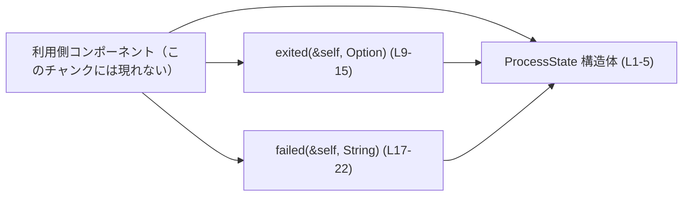
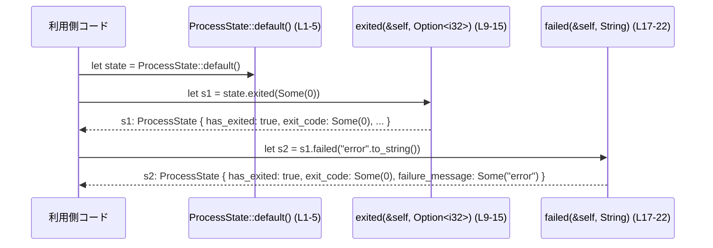

# core/src/unified_exec/process_state.rs コード解説

## 0. ざっくり一言

`ProcessState` は、プロセスの「終了したかどうか」「終了コード」「失敗メッセージ」をまとめて保持し、  
「終了状態」「失敗状態」への遷移用メソッドを提供する小さな状態オブジェクトです。（`core/src/unified_exec/process_state.rs:L1-5`）

---

## 1. このモジュールの役割

### 1.1 概要

- このモジュールは、プロセス実行の結果を一つの構造体 `ProcessState` にまとめて保持するために存在しています。（`L1-5`）
- プロセスが「終了した」状態へ遷移させる `exited` と、「失敗した」状態へ遷移させる `failed` という、状態遷移用のメソッドを提供します。（`L8-22`）
- これらのメソッドは既存の状態を変更せず、新しい `ProcessState` を返すイミュータブル（不変）な設計になっています。（`L9-15`, `L17-22`）

### 1.2 アーキテクチャ内での位置づけ

ファイルパスから、この構造体は `core::unified_exec` モジュール配下で使用されるプロセス状態表現であると解釈できますが、  
このチャンクには呼び出し元コードが現れないため、実際にどのコンポーネントが利用しているかは分かりません。

依存関係（このファイル内に現れる範囲）は非常に単純で、標準ライブラリの型のみを利用しています。



### 1.3 設計上のポイント

- **イミュータブルな状態遷移**  
  - メソッドは `&self` を受け取り、新しい `Self` を返します。元のインスタンスは変更されません。（`L9`, `L17`）
- **状態のまとめ方**  
  - `has_exited: bool` で終了済みかどうか、`exit_code: Option<i32>` で終了コード、`failure_message: Option<String>` で失敗理由を保持します。（`L2-5`）
- **導出トレイト**  
  - `Clone`, `Debug`, `Default`, `Eq`, `PartialEq` を自動導出しています。（`L1`）  
    これにより、複製・デバッグ表示・デフォルト生成・比較が簡単に行えます。
- **可視性**  
  - 構造体とフィールド、メソッドはすべて `pub(crate)` で、クレート内のみから利用できます。（`L2-5`, `L9`, `L17`）
- **エラー・パニック**  
  - メソッド内部でパニックを起こしうる操作や I/O は行っておらず、エラーを返すこともありません。（`L10-14`, `L18-22`）
- **並行性（Rust 言語特性）**  
  - フィールドはいずれも `bool`, `Option<i32>`, `Option<String>` のため、Rust の自動トレイトにより `Send + Sync` となります。  
    したがって、`ProcessState` 自体はスレッド間で安全に移動・共有可能です（並行更新に対する同期制御は利用側で必要）。

---

## 2. 主要な機能一覧

このファイルが提供する主要な機能は次の通りです。

- `ProcessState` 構造体: プロセスの終了状態（終了済みフラグ・終了コード・失敗メッセージ）を保持する。
- `ProcessState::exited`: プロセスが終了した状態を表す新しい `ProcessState` を生成する。
- `ProcessState::failed`: プロセスが失敗終了した状態を表す新しい `ProcessState` を生成する。

---

## 3. 公開 API と詳細解説

### 3.1 型一覧（構造体・列挙体など）

#### コンポーネントインベントリー

| 名前 | 種別 | 役割 / 用途 | 根拠 |
|------|------|-------------|------|
| `ProcessState` | 構造体 | プロセスの終了状態（終了済みフラグ・終了コード・失敗メッセージ）をひとまとめに保持する。 | `core/src/unified_exec/process_state.rs:L1-5` |

`ProcessState` のフィールド:

| フィールド名 | 型 | 説明 | 根拠 |
|-------------|----|------|------|
| `has_exited` | `bool` | プロセスがすでに終了しているかどうかを表すフラグ。 | `L3` |
| `exit_code` | `Option<i32>` | プロセスの終了コード。無い場合は `None`。 | `L4` |
| `failure_message` | `Option<String>` | 失敗時のメッセージ。失敗理由が無い、または未設定の場合は `None`。 | `L5` |

### 3.2 関数詳細

#### `exited(&self, exit_code: Option<i32>) -> Self`

**概要**

- このメソッドは、現在の `ProcessState` から「終了した状態」を表す新しい `ProcessState` を生成します。（`L9-15`）
- `has_exited` を `true` に設定し、`exit_code` を引数で上書きし、`failure_message` は元の状態からコピーします。（`L11-13`）

**引数**

| 引数名 | 型 | 説明 |
|--------|----|------|
| `&self` | `&ProcessState` | 現在のプロセス状態。変更されません。 |
| `exit_code` | `Option<i32>` | 新しい状態に設定する終了コード。`Some(code)` でコード付き、`None` でコード無しを表します。 |

**戻り値**

- 型: `ProcessState`
- 意味:  
  - `has_exited: true` に設定された新しいプロセス状態。（`L11`）  
  - `exit_code`: 引数 `exit_code` の値。（`L12`）  
  - `failure_message`: 元の `self.failure_message` を `clone` した値。（`L13`）

**内部処理の流れ（アルゴリズム）**

1. `Self { ... }` リテラルで新しい `ProcessState` インスタンスを構築する。（`L10`）
2. `has_exited` フィールドを常に `true` に設定する。（`L11`）
3. `exit_code` フィールドに、引数として渡された `exit_code` をそのまま代入する。（`L12`）
4. `failure_message` フィールドには、元の状態 `self.failure_message.clone()` を設定する。（`L13`）  
   - `Option<String>` の `clone` により、中身の `String` がクローンされます（所有権を保持したまま複製）。

**Examples（使用例）**

基本的な利用例です。`ProcessState` を作成し、正常終了状態へ遷移させます。

```rust
use core::unified_exec::process_state::ProcessState; // モジュールパスはファイルパスから推定（実際のパスはクレート構成に依存）

fn main() {
    // デフォルト状態を生成する（has_exited=false, exit_code=None, failure_message=None を想定）
    let state = ProcessState::default(); // Default は L1 の derive から利用可能

    // 終了コード 0 で終了した状態へ遷移した新しい状態を作る
    let exited_state = state.exited(Some(0));

    // 元の state は変わらない
    assert_eq!(state.has_exited, false);
    // 新しい状態は終了済みである
    assert_eq!(exited_state.has_exited, true);
    assert_eq!(exited_state.exit_code, Some(0));
}
```

**Errors / Panics**

- このメソッドは `Result` を返さず、内部でもパニックを起こしうる処理を行っていません。（`L10-14`）
- そのため、通常利用においてエラーやパニックが発生することはありません。

**Edge cases（エッジケース）**

- `exit_code` が `None` の場合  
  - 終了コードを持たない終了状態として扱われます。`has_exited` は `true` のままです。（`L11-12`）
- すでに `has_exited == true` の状態に対して呼び出した場合  
  - 以前の値に関係なく、`has_exited` は `true` のまま、`exit_code` が引数で上書きされます。  
  - `failure_message` は以前のメッセージをそのまま保持します。（`L11-13`）  
  - これが意図されたものかどうかは、このチャンクからは判断できません。
- `failure_message` が `Some` の状態に対して呼ぶ場合  
  - 失敗メッセージはクリアされず、コピーされます。（`L13`）

**使用上の注意点**

- **再代入が必要**  
  - `&self` を受け取って新しい `Self` を返すため、状態を更新したい場合は呼び出し側で再代入する必要があります。  
    例: `state = state.exited(Some(0));`
- **メッセージがクリアされない**  
  - `exited` は `failure_message` をクリアしません。以前の失敗メッセージを保持したまま、終了コードだけ変更される可能性があります。  
    その挙動が意図かどうかはコードからは分かりませんが、利用側ではこの点を前提に扱う必要があります。

---

#### `failed(&self, message: String) -> Self`

**概要**

- このメソッドは、現在の `ProcessState` から「失敗した状態」を表す新しい `ProcessState` を生成します。（`L17-22`）
- `has_exited` を `true` にし、新しい失敗メッセージを設定しつつ、`exit_code` は元の状態からそのままコピーします。（`L19-21`）

**引数**

| 引数名 | 型 | 説明 |
|--------|----|------|
| `&self` | `&ProcessState` | 現在のプロセス状態。変更されません。 |
| `message` | `String` | 新しい失敗メッセージ。所有権をこのメソッドに移動します。 |

**戻り値**

- 型: `ProcessState`
- 意味:  
  - `has_exited: true` に設定された新しいプロセス状態。（`L19`）  
  - `exit_code`: 元の `self.exit_code` をコピーしたもの。（`L20`、`Option<i32>` は `Copy`）  
  - `failure_message`: `Some(message)` として新しいメッセージを格納したもの。（`L21`）

**内部処理の流れ（アルゴリズム）**

1. `Self { ... }` リテラルで新しい `ProcessState` を構築する。（`L18`）
2. `has_exited` を `true` に設定する。（`L19`）
3. `exit_code` に、元の状態 `self.exit_code` をそのままコピーする。（`L20`）
4. `failure_message` に `Some(message)` を設定し、新しいメッセージを格納する。（`L21`）  
   - 引数 `message: String` の所有権はここで `ProcessState` に移ります。

**Examples（使用例）**

エラー発生時に「失敗状態」を作る例です。

```rust
use core::unified_exec::process_state::ProcessState;

fn main() {
    // 事前に exit_code を設定した状態を仮定
    let base_state = ProcessState {
        has_exited: false,
        exit_code: Some(1),
        failure_message: None,
    };

    // エラーメッセージを伴う失敗状態へ遷移
    let failed_state = base_state.failed("timeout occurred".to_string());

    assert_eq!(failed_state.has_exited, true);
    assert_eq!(failed_state.exit_code, Some(1)); // もとの exit_code を維持
    assert_eq!(failed_state.failure_message.as_deref(), Some("timeout occurred"));

    // base_state 自体は変更されない
    assert_eq!(base_state.has_exited, false);
}
```

**Errors / Panics**

- `failed` も `Result` を返さず、メソッド内部にはパニックの可能性がある操作は含まれていません。（`L18-22`）
- `message` の長さや内容によってエラーになることはありません。

**Edge cases（エッジケース）**

- `message` が空文字列の場合  
  - 空文字列をそのまま `Some("")` として格納します。特別扱いはありません。（`L21`）
- `self.exit_code` が `None` の状態で呼び出した場合  
  - 新しい状態でも `exit_code` は `None` のままです。（`L20`）
- すでに `failure_message` が設定されている状態で呼んだ場合  
  - 新しい `message` で上書きされ、以前のメッセージは保持されません。（`L21`）

**使用上の注意点**

- **所有権の移動**  
  - `message` は `String` を値渡しするため、呼び出し時に所有権が `failed` に移動します。  
    呼び出し元で文字列を再利用したい場合は `clone()` して渡す必要があります。
- **exit_code の扱い**  
  - `failed` は `exit_code` を変更しません。  
    「失敗時には特定のエラーコードを設定したい」場合は、呼び出し前に `exit_code` を適切な値にしておく、もしくは別のコンストラクタ的メソッドを追加する必要があります。

---

### 3.3 その他の関数

- このファイルには、`ProcessState::exited` と `ProcessState::failed` 以外の関数やメソッドは定義されていません。（`L8-22`）

---

## 4. データフロー

ここでは、典型的な利用シナリオとして「初期状態 → 正常終了 → 失敗状態」の流れを示します。  
実際の呼び出し元はこのチャンクには現れないため、抽象的な「利用側コード」として表現します。



**要点**

- `ProcessState` は常に値としてコピー（またはムーブ）され、新しいインスタンスが生成されます。元のインスタンスは変更されません。
- 外部 I/O やスレッドとのやり取りはなく、完全にメモリ内で完結するデータ変換です。
- 各メソッドは純粋関数的（同じ入力に対して常に同じ出力）な挙動を持ちます。

---

## 5. 使い方（How to Use）

### 5.1 基本的な使用方法

`ProcessState` を利用して、プロセスの実行結果を管理する基本的なコードフローの例です。

```rust
use core::unified_exec::process_state::ProcessState;

fn main() {
    // 1. 初期状態を用意する（デフォルト値を使用）
    let mut state = ProcessState::default();

    // 2. プロセスを実行し、成功したと仮定して終了状態へ遷移
    state = state.exited(Some(0)); // 再代入が必要

    // ここで state を確認できる
    if state.has_exited {
        match state.exit_code {
            Some(0) => {
                // 正常終了
            }
            Some(code) => {
                // 非 0 終了コード
                println!("プロセスはコード {} で終了しました", code);
            }
            None => {
                // 終了コードが不明
            }
        }
    }

    // 3. 別のフェーズでエラーが発生し、失敗として扱う場合
    state = state.failed("post-processing error".to_string());

    // 失敗メッセージにアクセス
    if let Some(msg) = &state.failure_message {
        eprintln!("失敗メッセージ: {}", msg);
    }
}
```

### 5.2 よくある使用パターン

1. **正常終了のみ管理するパターン**

   ```rust
   let mut state = ProcessState::default();
   // プロセスが終わったら
   state = state.exited(Some(0)); // 正常終了コード 0
   ```

2. **エラー情報を付加するパターン**

   ```rust
   let mut state = ProcessState::default();

   // 途中でエラー発生
   let err_msg = format!("failed to execute command: {}", "ls");
   state = state.failed(err_msg);
   // exit_code は別途管理していた値を事前に state.exit_code にセットしておく設計が想定されます
   ```

### 5.3 よくある間違い

**1. 戻り値を無視して状態が更新されない**

```rust
let mut state = ProcessState::default();

// 間違い例: 戻り値を受け取っていないので state は変わらない
state.exited(Some(0));
// ここでは still false である可能性が高い
assert_eq!(state.has_exited, false);
```

**正しい例:**

```rust
let mut state = ProcessState::default();

// 正しい: 戻り値で state を上書きする
state = state.exited(Some(0));
assert_eq!(state.has_exited, true);
```

**2. 構造体リテラルで一貫しない状態を作る**

```rust
// 潜在的に一貫性の無い状態 (has_exited=false なのに exit_code=Some(0))
let state = ProcessState {
    has_exited: false,
    exit_code: Some(0),
    failure_message: None,
};
```

こうした手動構築はコンパイル上は許されますが、  
「`has_exited` が `false` の場合は `exit_code` と `failure_message` は `None`」といった一貫した契約を保ちたい場合、  
`default` や `exited` / `failed` メソッド経由で状態を作る方が安全です。

### 5.4 使用上の注意点（まとめ）

- **イミュータブルな設計**  
  - メソッドは常に新しい `ProcessState` を返すため、状態更新時には再代入が必要です。
- **状態の一貫性は呼び出し側の責任**  
  - 型レベルでは「`has_exited` と `exit_code` / `failure_message` の整合性」が保証されていません。  
    利用側で「どの組み合わせを許容するか」という契約を決めておく必要があります。
- **並行性**  
  - `ProcessState` は `Send + Sync` なフィールドのみから構成されるため、スレッド間での共有自体は安全です。  
    ただし、同じインスタンスを複数スレッドから書き換える場合は、`Mutex` などの同期原語を利用する必要があります（一般的な Rust のルール）。

---

## 6. 変更の仕方（How to Modify）

### 6.1 新しい機能を追加する場合

例として、「終了時刻」や「シグナル情報」などを追加したいケースを考えます。

1. **フィールドの追加**  
   - `ProcessState` に新しいフィールドを追加します。  
     例: `pub(crate) finished_at: Option<SystemTime>,` など。（実際の追加内容は要件次第）
2. **既存メソッドの拡張**  
   - `exited` や `failed` の `Self { ... }` リテラルに、新しいフィールドをどのような値で設定するかを決めて追加します。
3. **新しいコンストラクタ的メソッドの追加**  
   - 例えば「成功終了専用」「失敗終了専用」の静的コンストラクタを追加する場合は、`impl ProcessState` ブロック内に新メソッドを追加します。
4. **呼び出し元の修正**  
   - `ProcessState` を直接構築している場所があれば、新しいフィールドを適切に初期化するように修正します。

### 6.2 既存の機能を変更する場合

- **影響範囲の確認**  
  - `exited` と `failed` のシグネチャや挙動を変えると、クレート内の呼び出し元すべてに影響します。  
    `pub(crate)` のため外部クレートには影響しませんが、クレート内の検索などで利用箇所を洗い出す必要があります。
- **契約の明示**  
  - 例えば「`exited` は `failure_message` を必ず `None` にする」などの仕様変更を行う際は、  
    既存の呼び出し側がその挙動に依存していないか確認する必要があります。
- **テスト・利用箇所の再確認**  
  - 仕様変更に応じてユニットテスト（存在する場合）や利用箇所のアサーションを更新し、  
    「終了状態」と「失敗状態」に関する契約が一貫しているかを確認することが推奨されます。

---

## 7. 関連ファイル

このチャンクには `ProcessState` を利用しているコードや、同じモジュール階層の他ファイルは示されていません。

| パス | 役割 / 関係 |
|------|------------|
| 不明 | `ProcessState` を実際に利用するコンポーネントは、このチャンクには現れません。ファイルパスから `core::unified_exec` モジュール配下で使われると推測されますが、詳細は不明です。 |

---

### Bugs / Security / Contracts / Edge Cases のまとめ（このファイルに基づく）

- **潜在的に紛らわしい点（Bug と断定はしない）**
  - `exited` が既存の `failure_message` をクリアせずにコピーするため、  
    「正常終了だが失敗メッセージが残っている」といった状態が作られる可能性があります。（`L11-13`）  
    これは設計かもしれませんが、利用側では意図を確認する必要があります。
- **Security**
  - このファイルでは外部入力のパースや I/O を行わず、単純な値操作のみのため、  
    直接的なセキュリティリスク（インジェクション、情報漏洩など）は見当たりません。
- **Contracts（契約）**
  - 型から読み取れる暗黙の契約としては次が考えられます（コードでは強制されていません）:
    - `has_exited == false` のときは `exit_code == None` かつ `failure_message == None` が自然な状態。
    - 終了後（`has_exited == true`）に `exit_code` や `failure_message` が設定される。
- **Edge Cases**
  - `exit_code == None` かつ `has_exited == true` のような状態も、型としては許容されます。  
    その意味付け（「終了はしたがコード不明」など）は利用側で決める必要があります。
- **Performance / Scalability**
  - 構造体はごく小さい（`bool` + `Option<i32>` + `Option<String>`）で、  
    メソッドもフィールドの代入と `clone` のみです（`L10-14`, `L18-21`）。  
    大量に生成しても、`failure_message` の `String` サイズに応じたメモリ消費以外に大きなオーバーヘッドは想定しにくいです。
- **Observability**
  - `Debug` を導出しているため（`L1`）、`{:?}` で状態をログ出力することが可能であり、  
    これが主な観測手段となります。ログレベルやフォーマットは利用側で決定されます。
