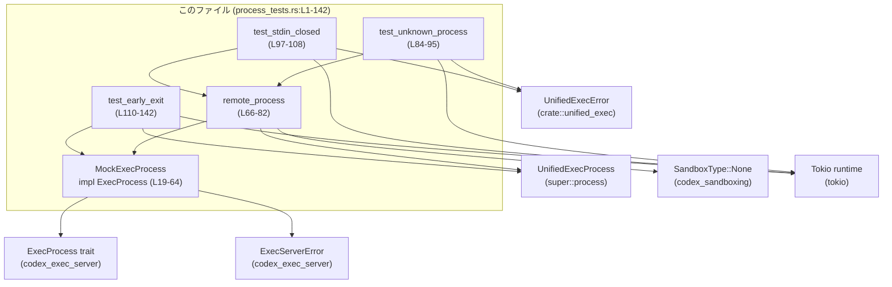

# core/src/unified_exec/process_tests.rs

## 0. ざっくり一言

`UnifiedExecProcess` のリモート実行プロセスまわりの挙動を、モック実装 `MockExecProcess` を使って検証する非公開テストモジュールです。特に「書き込みエラー時の終了状態」と「起動直後にすでに終了しているプロセス（早期終了）」の扱いを確認しています。（process_tests.rs:L1-142）

---

## 1. このモジュールの役割

### 1.1 概要

- このモジュールは **リモート実行プロセスのラッパである `UnifiedExecProcess`** が、リモート側の応答（書き込みステータス・早期終了イベント）を正しく扱えるかをテストするために存在します。
- `codex_exec_server::ExecProcess` トレイトのモック実装 `MockExecProcess`（process_tests.rs:L19-64）を使い、エラーケースや終了状態を制御可能にしています。
- Tokio の非同期ランタイム上で、`#[tokio::test]` による非同期テストを実行しています（process_tests.rs:L84,97,110）。

### 1.2 アーキテクチャ内での位置づけ

このモジュール内の主なコンポーネントと外部依存関係の関係を簡略化して示します。



- `MockExecProcess` は `ExecProcess` トレイトを実装したテスト用モックで、`UnifiedExecProcess` から見える「リモートプロセス」を代替します（process_tests.rs:L19-64）。
- `remote_process` は `MockExecProcess` をラップした `StartedExecProcess` から `UnifiedExecProcess` を生成するヘルパーです（process_tests.rs:L66-82）。
- 各テスト関数は `remote_process` あるいは `MockExecProcess` を直接使って、`UnifiedExecProcess` の振る舞いを検証します（process_tests.rs:L84-142）。

### 1.3 設計上のポイント

コードから読み取れる特徴は次のとおりです。

- **モックによる外部依存の分離**  
  - 実際の `ExecProcess` 実装に依存せず、`MockExecProcess` でリモートサーバの応答を制御しています（process_tests.rs:L19-64）。
- **非同期インターフェースのテスト**  
  - `async_trait` を使って `ExecProcess` の `async fn` を実装し（process_tests.rs:L26-63）、Tokio の `#[tokio::test]` で非同期テストを行っています（process_tests.rs:L84,97,110）。
- **状態管理と並行性**  
  - 読み取りレスポンスキューに `tokio::sync::Mutex<VecDeque<ReadResponse>>` を使い（process_tests.rs:L22）、複数タスクからの同時アクセスに対しても安全になるようにしています（ただし本テスト内では単一タスクのみ）。
  - `tokio::sync::watch::Sender<u64>` による「ウェイク通知」を用意し（process_tests.rs:L23,67,112,127,131-134）、`UnifiedExecProcess` がリモートからのイベントを監視できるようにしています。
- **エラーハンドリングの方針（テスト観点）**
  - 書き込み時に `WriteStatus::UnknownProcess` または `WriteStatus::StdinClosed` が返ってきた場合、`UnifiedExecProcess` が `UnifiedExecError::WriteToStdin` を返し、かつプロセスを「終了済み」とマークすることが要求されています（process_tests.rs:L84-108）。
  - リモートプロセスがすでに終了している場合（`ReadResponse` 内で `exited: true`）、`from_remote_started` の完了時点で `has_exited()` と `exit_code()` が正しい値を持つことが要求されています（process_tests.rs:L110-142）。

---

## 2. 主要な機能・コンポーネント一覧

### 2.1 機能一覧（テスト観点）

- モックプロセス実装: `MockExecProcess`  
  リモートプロセスの `read` / `write` / `terminate` をテスト用にシミュレートします（process_tests.rs:L19-64）。
- UnifiedExecProcess 生成ヘルパー: `remote_process`  
  指定した `WriteStatus` を返すモックプロセスから `UnifiedExecProcess` を構築します（process_tests.rs:L66-82）。
- テスト: `remote_write_unknown_process_marks_process_exited`  
  書き込み先が「未知のプロセス」の場合に、書き込みエラーと終了状態のマークを確認します（process_tests.rs:L84-95）。
- テスト: `remote_write_closed_stdin_marks_process_exited`  
  `stdin` が閉じている場合の書き込みエラーと終了状態のマークを確認します（process_tests.rs:L97-108）。
- テスト: `remote_process_waits_for_early_exit_event`  
  プロセス開始時点でリモート側がすでに終了しているケース（早期終了）を、ウェイク通知と `read` レスポンスを通じて正しく検知できるかを確認します（process_tests.rs:L110-142）。

### 2.2 コンポーネントインベントリー（型・関数一覧＋行番号）

| 名前 | 種別 | シグネチャ / 説明 | 定義位置 |
|------|------|-------------------|----------|
| `MockExecProcess` | 構造体 | モックのリモートプロセス。`ExecProcess` を実装 | process_tests.rs:L19-24 |
| `ExecProcess for MockExecProcess::process_id` | メソッド | `fn process_id(&self) -> &ProcessId` | process_tests.rs:L28-30 |
| `ExecProcess for MockExecProcess::subscribe_wake` | メソッド | `fn subscribe_wake(&self) -> watch::Receiver<u64>` | process_tests.rs:L32-34 |
| `ExecProcess for MockExecProcess::read` | 非同期メソッド | `async fn read(&self, ...) -> Result<ReadResponse, ExecServerError>` | process_tests.rs:L36-55 |
| `ExecProcess for MockExecProcess::write` | 非同期メソッド | `async fn write(&self, Vec<u8>) -> Result<WriteResponse, ExecServerError>` | process_tests.rs:L57-59 |
| `ExecProcess for MockExecProcess::terminate` | 非同期メソッド | `async fn terminate(&self) -> Result<(), ExecServerError>` | process_tests.rs:L61-63 |
| `remote_process` | 非同期関数 | `async fn remote_process(write_status: WriteStatus) -> UnifiedExecProcess` | process_tests.rs:L66-82 |
| `remote_write_unknown_process_marks_process_exited` | 非同期テスト関数 | 書き込み先が UnknownProcess のテスト | process_tests.rs:L84-95 |
| `remote_write_closed_stdin_marks_process_exited` | 非同期テスト関数 | 書き込み先が StdinClosed のテスト | process_tests.rs:L97-108 |
| `remote_process_waits_for_early_exit_event` | 非同期テスト関数 | 早期終了プロセスを待つテスト | process_tests.rs:L110-142 |

---

## 3. 公開 API と詳細解説

このファイル自体はテストモジュールであり、外部に公開される API はありません。ただし、**テストを通じて `UnifiedExecProcess` の仕様（契約）を確認している**ため、その観点で重要な関数を解説します。

### 3.1 型一覧（構造体・列挙体など）

| 名前 | 種別 | 役割 / 用途 | 定義位置 |
|------|------|-------------|----------|
| `MockExecProcess` | 構造体 | `ExecProcess` を実装するモック。プロセス ID、書き込み応答、読み取りレスポンスキュー、ウェイク通知 Sender を保持します。 | process_tests.rs:L19-24 |

**フィールド概要（MockExecProcess）**（process_tests.rs:L19-23）

- `process_id: ProcessId`  
  テスト用のプロセス ID。`"test-process"` 文字列から生成されています（process_tests.rs:L70）。
- `write_response: WriteResponse`  
  `write` 呼び出し時に返す `WriteResponse`。ステータスはテストで指定した `WriteStatus` に固定されます（process_tests.rs:L21,71-72）。
- `read_responses: Mutex<VecDeque<ReadResponse>>`  
  次回 `read` 呼び出し時に返す `ReadResponse` のキュー。`Mutex`（非同期ロック）により、同時アクセス時も安全になります（process_tests.rs:L22）。
- `wake_tx: watch::Sender<u64>`  
  ウェイク通知用の watch チャネル送信側。`subscribe_wake` 経由で受信側（`watch::Receiver<u64>`）が取得されます（process_tests.rs:L23,32-34）。

### 3.2 関数詳細（重要な 7 件）

#### `ExecProcess for MockExecProcess::read(&self, _after_seq: Option<u64>, _max_bytes: Option<usize>, _wait_ms: Option<u64>) -> Result<ReadResponse, ExecServerError>`

**概要**

- モックプロセスから 1 件の `ReadResponse` を非同期に取り出して返します（process_tests.rs:L36-55）。
- キューが空の場合は「空のチャンクで未終了」のデフォルト `ReadResponse` を返します（process_tests.rs:L47-54）。

**引数**

| 引数名 | 型 | 説明 |
|--------|----|------|
| `_after_seq` | `Option<u64>` | シーケンス番号フィルタ（未使用。テストでは無視されます）（process_tests.rs:L38）。 |
| `_max_bytes` | `Option<usize>` | 最大読み取りバイト数（未使用）（process_tests.rs:L39）。 |
| `_wait_ms` | `Option<u64>` | 待機ミリ秒（未使用）（process_tests.rs:L40）。 |

下線付き名前（`_after_seq` など）は、Rust の慣習で「値を受け取るが使わない」ことを示すものです。

**戻り値**

- `Result<ReadResponse, ExecServerError>`  
  - 成功時: `Ok(ReadResponse)` を返します（process_tests.rs:L42-55）。  
  - このモック実装はエラー `Err(ExecServerError)` を返しません（テストではこの経路は未検証です）。

**内部処理の流れ**

1. `read_responses` の `Mutex` ロックを取得し、非同期で待機します（process_tests.rs:L42-45）。  
   - これは Tokio の非同期 `Mutex` であり、`await` でスレッドブロックせずにロックを待ちます。
2. `VecDeque` から先頭の `ReadResponse` を `pop_front()` します（process_tests.rs:L46）。
3. もしキューが空（`pop_front()` が `None`）なら、`unwrap_or` によってデフォルトの `ReadResponse` を構築して返します（process_tests.rs:L47-54）。
   - `chunks: Vec::new()`、`next_seq: 1`、`exited: false`、`exit_code: None`、`closed: false`、`failure: None`。

**Examples（使用例）**

テスト内の早期終了シナリオでは、`read_responses` に 1 件だけ `exited: true` のエントリが入れられています（process_tests.rs:L119-126）。

```rust
// キューにあらかじめ1件のReadResponseを入れる（L119-126）
let started = StartedExecProcess {
    process: Arc::new(MockExecProcess {
        // ...
        read_responses: Mutex::new(VecDeque::from([ReadResponse {
            chunks: Vec::new(),
            next_seq: 2,
            exited: true,
            exit_code: Some(17),
            closed: true,
            failure: None,
        }])),
        // ...
    }),
};
```

`UnifiedExecProcess::from_remote_started` が内部で `read` を 1 度呼び出しているとすれば、このレスポンスを受け取って「すでに終了しているプロセス」と判定していると考えられます（ただしこの呼び出し自体はこのチャンクには現れません）。

**Errors / Panics**

- この実装は `Err(ExecServerError)` を返していません（常に `Ok(...)` で包んでいます）（process_tests.rs:L42）。
- `unwrap_or` を使っているため、`pop_front()` が `None` の場合でも panic せず、安全なデフォルト値を返します（process_tests.rs:L47-54）。
- よって、このモック `read` 自体には panic の可能性は見当たりません（このチャンクの範囲内）。

**Edge cases（エッジケース）**

- **キューが空のとき**: デフォルトの `ReadResponse`（未終了・exit_code なし）を返します（process_tests.rs:L47-54）。  
  テストが特定の `exit_code` を期待している場合は、事前にキューへ適切なレスポンスを仕込む必要があります。
- **複数回呼び出した場合**: キューに 1 件のみ入れておくと、2 回目以降はデフォルトレスポンスになります。2 回目以降も特定の終了情報を返したい場合は、複数件を `VecDeque` に積む必要があります。
- **並行アクセス**: `Mutex` により、複数タスクが同時に `read` を呼んでも `VecDeque` の内部整合性は保たれます。

**使用上の注意点**

- ユニットテストで使用する場合、**どの順序で何回 `read` が呼ばれるか** を想定した上で、`read_responses` の内容を設計する必要があります。
- キューが空でもデフォルトを返すため、「想定より多く `read` が呼ばれている」ことに気付きにくい点があります（テストの精度を上げたい場合は、空のときに panic させる実装に変える選択肢もありますが、このファイルからは意図は不明です）。

---

#### `ExecProcess for MockExecProcess::write(&self, _chunk: Vec<u8>) -> Result<WriteResponse, ExecServerError>`

**概要**

- 書き込みデータは無視し、あらかじめ保持している `write_response` をそのまま返します（process_tests.rs:L57-59）。
- これにより、`WriteStatus` をテストから制御できます。

**引数**

| 引数名 | 型 | 説明 |
|--------|----|------|
| `_chunk` | `Vec<u8>` | 書き込まれたデータ。モックでは内容を使用しません（process_tests.rs:L57）。 |

**戻り値**

- `Result<WriteResponse, ExecServerError>`  
  - 成功時: `Ok(self.write_response.clone())`（process_tests.rs:L58）。  
  - エラーは返しません。

**内部処理の流れ**

1. 渡された `_chunk` は無視します（名前にアンダースコアが付いており、コード内で使用されていません）（process_tests.rs:L57）。
2. `self.write_response` を `clone()` して `Ok(...)` で返します（process_tests.rs:L58）。

**Examples（使用例）**

`remote_process` ヘルパーで `WriteStatus` を指定しています（process_tests.rs:L66-82）。

```rust
let process = remote_process(WriteStatus::UnknownProcess).await;
// ↑ ここで write_response.status が UnknownProcess の UnifiedExecProcess が返る
let err = process
    .write(b"hello")
    .await
    .expect_err("expected write failure");
```

このテストから、`UnifiedExecProcess::write` が内部で `ExecProcess::write` の `status` を見て、`UnknownProcess` → `UnifiedExecError::WriteToStdin` を返すことが要求されていると読み取れます（process_tests.rs:L84-95）。

**Errors / Panics**

- `ExecServerError` を返す経路はありません（process_tests.rs:L57-59）。
- `clone()` が panic することも通常はありません（`WriteResponse` の `Clone` 実装に依存しますが、このチャンクには詳細はありません）。

**Edge cases**

- どのような `_chunk` を渡しても、戻り値は常に同じ `write_response` になります。
- 実際の `ExecProcess` 実装では書き込みサイズや内容に依存するエラーがあり得ますが、このモックでは再現しません。

**使用上の注意点**

- テストの目的は「`UnifiedExecProcess` が `WriteStatus` をどう解釈するか」を確認することであり、書き込んだバイト列の内容は関心の対象外です。
- 実運用コードのテストで「データ内容に応じた挙動」を確認したい場合は、別のモック実装が必要になります。

---

#### `ExecProcess for MockExecProcess::terminate(&self) -> Result<(), ExecServerError>`

**概要**

- プロセス終了要求をシミュレートするメソッドですが、モックでは何もしないで成功を返します（process_tests.rs:L61-63）。

**戻り値**

- 常に `Ok(())` を返します。

**使用上の注意点**

- このテストファイル内では `terminate` は呼ばれていません。
- 実際の `UnifiedExecProcess` が `terminate` をどう扱うかは、このチャンクからは分かりません。

---

#### `async fn remote_process(write_status: WriteStatus) -> UnifiedExecProcess`

**概要**

- 指定された `WriteStatus` を返す `MockExecProcess` を生成し、それを `StartedExecProcess` に包んで `UnifiedExecProcess::from_remote_started` に渡すヘルパーです（process_tests.rs:L66-82）。
- テストコードから `UnifiedExecProcess` を簡潔に生成するためのユーティリティ関数です。

**引数**

| 引数名 | 型 | 説明 |
|--------|----|------|
| `write_status` | `WriteStatus` | モックプロセスの `write` が返すステータス。テストで `UnknownProcess` や `StdinClosed` を指定しています（process_tests.rs:L84,99）。 |

**戻り値**

- `UnifiedExecProcess`  
  - `UnifiedExecProcess::from_remote_started(started, SandboxType::None)` の `Ok` 結果（process_tests.rs:L79-81）。  
  - 生成に失敗した場合は `expect` によりテストが panic します。

**内部処理の流れ**

1. `watch::channel(0)` で初期値 0 の watch チャネルを生成し、送信側 `wake_tx` と受信側 `_wake_rx` を得ます（process_tests.rs:L67）。  
   `_wake_rx` は変数として保持されることで、スコープ中はドロップされずチャネルが有効状態に保たれます。
2. `MockExecProcess` を `Arc::new` で包み（共有所有権を表す）、`StartedExecProcess { process: Arc<...> }` を構築します（process_tests.rs:L68-77）。
   - `process_id` は `"test-process"` 固定です（process_tests.rs:L70）。
   - `write_response.status` に引数 `write_status` をセットします（process_tests.rs:L71-72）。
   - `read_responses` は空の `VecDeque` で初期化されます（process_tests.rs:L74）。
3. `UnifiedExecProcess::from_remote_started(started, SandboxType::None)` を呼び出し、非同期に完了を待ちます（process_tests.rs:L79-80）。
4. `expect("remote process should start")` により、エラー発生時にはテストを失敗させます（process_tests.rs:L81）。

**Examples（使用例）**

テストからの利用例:

```rust
let process = remote_process(WriteStatus::UnknownProcess).await;
// ここで UnknownProcess を返す UnifiedExecProcess が生成される
let err = process
    .write(b"hello")
    .await
    .expect_err("expected write failure");
```

**Errors / Panics**

- `from_remote_started` が `Err` を返した場合、`expect` によりこの関数内で panic します（process_tests.rs:L81）。
  - `UnifiedExecError` の詳細や失敗理由は、このチャンクには現れません。
- `watch::channel`、`Arc::new`、`Mutex::new` など標準的な関数は通常 panic しません。

**Edge cases**

- `write_status` に何を渡しても、`UnifiedExecProcess` は生成されます（少なくともこのコード範囲では制限はありません）。
- `read_responses` が空のため、`UnifiedExecProcess` が内部で `read` を行った場合、最初のレスポンスは「未終了・空チャンク」となります（process_tests.rs:L47-54）。  
  → テストは `write` の挙動に焦点を当てており、読み取り関連のテストには別途 `read_responses` を設定しています（process_tests.rs:L119-126）。

**使用上の注意点**

- この関数はテスト専用であり、本番コードから呼ばれることを想定していません。
- `expect` による panic を利用しているため、テストが失敗した理由を詳細にハンドリングすることはできません（テストとしては一般的な方針です）。

---

#### `#[tokio::test] async fn remote_write_unknown_process_marks_process_exited()`

**概要**

- `WriteStatus::UnknownProcess` を返すリモートプロセスに対して書き込みを行うと、`UnifiedExecProcess::write` がエラー `UnifiedExecError::WriteToStdin` を返し、かつ `has_exited()` が `true` になることを確認するテストです（process_tests.rs:L84-95）。

**内部処理の流れ（テストの観点）**

1. `remote_process(WriteStatus::UnknownProcess).await` で `UnifiedExecProcess` を生成します（process_tests.rs:L86）。
2. `process.write(b"hello").await` を呼び出し、結果がエラーであることを `expect_err("expected write failure")` で検証します（process_tests.rs:L88-91）。
3. 返ってきたエラーが `UnifiedExecError::WriteToStdin` であることを `matches!` で確認します（process_tests.rs:L93）。
4. その後、`process.has_exited()` が `true` であることを `assert!` で確認します（process_tests.rs:L94）。

**契約（このテストから読み取れる仕様）**

- `ExecProcess::write` が `WriteStatus::UnknownProcess` を返す状況では、`UnifiedExecProcess::write` は:
  - エラーを返す（`Result::Err`）  
  - エラー型は `UnifiedExecError::WriteToStdin` である  
  - その後 `has_exited()` は必ず `true` を返す  
 であるべき、とテストが主張しています。

**Edge cases / 使用上の注意点**

- 「UnknownProcess」というステータスは、リモート側でプロセスが存在しない（または喪失した）ことを示すと推測されますが、このチャンクには定義はありません。
- ロバストな実装であれば、この状態を「回復不能なエラー」とみなし、以降の操作をエラーにするのが妥当と考えられます（ここでは `has_exited()` による終了マークで実現されています）。

---

#### `#[tokio::test] async fn remote_write_closed_stdin_marks_process_exited()`

**概要**

- `WriteStatus::StdinClosed` が返ってきた場合も、前のテストと同様に `UnifiedExecError::WriteToStdin` と `has_exited() == true` を確認するテストです（process_tests.rs:L97-108）。

**流れと仕様**

- 基本的な流れは前のテストと同じです。違いは `WriteStatus::StdinClosed` を渡している点のみです（process_tests.rs:L99）。
- このテストから読み取れる仕様は次のとおりです。
  - リモート側で標準入力がクローズされていることは、呼び出し側から見れば「書き込み不能」であり、`UnifiedExecError::WriteToStdin` として扱う。
  - この状態でも `has_exited()` は `true` になる（process_tests.rs:L106-107）。

---

#### `#[tokio::test] async fn remote_process_waits_for_early_exit_event()`

**概要**

- リモートプロセスが `UnifiedExecProcess` 生成前にすでに終了している（早期終了）ケースをシミュレートし、`from_remote_started` の完了時点で `has_exited() == true` と `exit_code() == Some(17)` になっていることを確認するテストです（process_tests.rs:L110-142）。
- watch チャネルによるウェイク通知と、最初の `ReadResponse` の内容を用いて検証しています。

**内部処理の流れ（テストの観点）**

1. `watch::channel(0)` でウェイクチャネルを作成し（process_tests.rs:L112）、`MockExecProcess` を `StartedExecProcess` に包みます（process_tests.rs:L113-129）。
   - 最初の `ReadResponse` として `exited: true`、`exit_code: Some(17)` のものをキューに入れています（process_tests.rs:L119-124）。
   - `write_response.status` は `WriteStatus::Accepted` です（process_tests.rs:L116-118）。
2. 別タスクを `tokio::spawn` し、10ms 後に `wake_tx.send(1)` を呼び出します（process_tests.rs:L131-134）。  
   - これにより、`subscribe_wake` から得られる `Receiver` に「何らかのイベントが発生した」ことが通知されます。
3. `UnifiedExecProcess::from_remote_started(started, SandboxType::None)` を呼び出して `process` を生成します（process_tests.rs:L136-138）。
4. 生成された `process` に対して:
   - `process.has_exited()` が `true` であること（process_tests.rs:L140）。
   - `process.exit_code()` が `Some(17)` であること（process_tests.rs:L141）。
   を検証します。

**契約（このテストから読み取れる仕様）**

- `from_remote_started` は、リモートプロセスがすでに終了している場合でも、その終了情報を反映した `UnifiedExecProcess` を返す必要があります。
- 終了情報は、少なくとも以下の要素から得られていると推測されます。
  - `ExecProcess::read` の `ReadResponse`（`exited: true`, `exit_code: Some(17)`）（process_tests.rs:L119-124）。
  - `subscribe_wake` 経由の watch 通知（process_tests.rs:L32-34,131-134）。  
    → watch チャネルは最新値を保持するため、`from_remote_started` が通知の前後どちらのタイミングで `Receiver` を作っても、値 `1` を観測できます。

**Edge cases / 並行性の観点**

- **タイミングのずれ**  
  - `tokio::spawn` のタスクが `from_remote_started` より先に `wake_tx.send(1)` を実行しても、watch チャネルの仕様上、後から `subscribe_wake` した側も最新値を受け取れます。したがって通知ロストの心配は小さいです（Rust の `watch` チャネルの一般仕様に基づく）。
- **read 呼び出し回数**  
  - キューには 1 件のみ `ReadResponse` が入っています（process_tests.rs:L119-126）。もし `from_remote_started` が複数回 `read` を呼ぶ実装であれば、2 回目以降は `MockExecProcess::read` のデフォルトレスポンス（未終了）が返ることになります。この点は実装次第であり、このチャンクからは確定できません。

---

### 3.3 その他の関数

| 関数名 | 役割（1 行） | 定義位置 |
|--------|--------------|----------|
| `ExecProcess for MockExecProcess::process_id` | モックプロセスの `ProcessId` を参照で返すだけのシンプルなメソッドです。 | process_tests.rs:L28-30 |
| `ExecProcess for MockExecProcess::subscribe_wake` | `watch::Sender` から `Receiver` を生成して返し、ウェイク通知の購読を可能にします。 | process_tests.rs:L32-34 |

---

## 4. データフロー

### 4.1 代表的なシナリオ: 早期終了プロセスの検知

`remote_process_waits_for_early_exit_event` テストにおいて、データとイベントがどのように流れるかを図示します。

```mermaid
sequenceDiagram
    autonumber
    participant Test as テスト関数<br/>remote_process_waits_for_early_exit_event<br/>(L110-142)
    participant MEP as MockExecProcess<br/>(L19-64)
    participant UEP as UnifiedExecProcess<br/>(super::process)
    participant Watch as watch::Sender/Receiver<br/>(L112-113,131-134)
    participant Tokio as Tokioランタイム

    Test->>Watch: watch::channel(0) で (Sender, Receiver) 作成 (L112)
    Test->>MEP: MockExecProcess を構築（read_responses に<br/>exited=true, exit_code=17 を1件設定）(L113-128)
    Test->>Tokio: tokio::spawn(async move { sleep(10ms); wake_tx.send(1) }) (L131-134)
    Test->>UEP: from_remote_started(StartedExecProcess{process: Arc<MEP>}, SandboxType::None) を await (L136-138)
    Note over UEP,MEP: from_remote_started の内部実装はこのチャンクには現れませんが、<br/>少なくとも ExecProcess::read / subscribe_wake を利用していると推測されます。
    Tokio-->>Watch: 10ms 後に wake_tx.send(1) (L131-134)
    Watch-->>UEP: Receiver 経由で「更新があった」ことを通知（内部実装）
    UEP-->>MEP: read(...) を呼び出して ReadResponse を取得（推測）
    MEP-->>UEP: ReadResponse{exited: true, exit_code: Some(17), ...}（L119-124）
    UEP-->>Test: UnifiedExecProcess インスタンス（has_exited=true, exit_code=17）を返す（テスト期待）
    Test->>UEP: has_exited(), exit_code() を呼び出して検証 (L140-141)
```

**要点**

- テストは `MockExecProcess` の `read_responses` に終了情報を事前に設定し（process_tests.rs:L119-124）、watch チャネルで「何かが起きた」ことを通知します（process_tests.rs:L131-134）。
- `UnifiedExecProcess::from_remote_started` は、これらの仕組みを使って「すでに終了している」状態を検知し、呼び出し元に返される時点で `has_exited() == true` かつ `exit_code() == Some(17)` にしておく必要があります（process_tests.rs:L140-141）。
- `from_remote_started` の内部実装はこのチャンクにはないため、実際にどのタイミングで何回 `read` しているかなどは不明です。

---

## 5. 使い方（How to Use）

### 5.1 基本的な使用方法（テスト用ヘルパーの利用）

このモジュールの利用者は基本的にテストコードです。`UnifiedExecProcess` の挙動を検証する典型的なフローは次のようになります。

```rust
// 1. 特定の WriteStatus を返す UnifiedExecProcess を準備する（L66-82）
let process = remote_process(WriteStatus::UnknownProcess).await;

// 2. メインの処理（ここでは write）を呼び出す（L88-91）
let err = process
    .write(b"hello")
    .await
    .expect_err("expected write failure");

// 3. 結果を検証する（L93-94）
assert!(matches!(err, UnifiedExecError::WriteToStdin)); // エラー種別
assert!(process.has_exited());                          // 終了状態
```

### 5.2 よくある使用パターン

1. **書き込みエラー時のハンドリングをテストする**

```rust
// UnknownProcess のケース
let process = remote_process(WriteStatus::UnknownProcess).await;
let err = process.write(b"hello").await.expect_err("expected write failure");
assert!(matches!(err, UnifiedExecError::WriteToStdin));
assert!(process.has_exited());

// StdinClosed のケース
let process = remote_process(WriteStatus::StdinClosed).await;
let err = process.write(b"hello").await.expect_err("expected write failure");
assert!(matches!(err, UnifiedExecError::WriteToStdin));
assert!(process.has_exited());
```

1. **早期終了プロセスの挙動をテストする**

```rust
// ReadResponse に終了情報を仕込み、wake 通知でイベント発生をシミュレートする（L112-134）
let (wake_tx, _wake_rx) = watch::channel(0);
let started = StartedExecProcess {
    process: Arc::new(MockExecProcess {
        process_id: "test-process".to_string().into(),
        write_response: WriteResponse {
            status: WriteStatus::Accepted,
        },
        read_responses: Mutex::new(VecDeque::from([ReadResponse {
            chunks: Vec::new(),
            next_seq: 2,
            exited: true,
            exit_code: Some(17),
            closed: true,
            failure: None,
        }])),
        wake_tx: wake_tx.clone(),
    }),
};

// wake 通知を非同期に送信
tokio::spawn(async move {
    tokio::time::sleep(Duration::from_millis(10)).await;
    let _ = wake_tx.send(1);
});

// UnifiedExecProcess を生成し、終了状態を検証
let process = UnifiedExecProcess::from_remote_started(started, SandboxType::None)
    .await
    .expect("remote process should observe early exit");

assert!(process.has_exited());
assert_eq!(process.exit_code(), Some(17));
```

### 5.3 よくある間違い（テストを書くときの注意）

```rust
// 間違い例: read_responses を設定せずに exit_code を期待してしまう
let (wake_tx, _wake_rx) = watch::channel(0);
let started = StartedExecProcess {
    process: Arc::new(MockExecProcess {
        // read_responses が空のまま（L74 と同じ状態）
        read_responses: Mutex::new(VecDeque::new()),
        // ...
    }),
};

// こうすると MockExecProcess::read は exited=false, exit_code=None を返すので、
// UnifiedExecProcess 側で exit_code が None のままになる可能性が高い
```

```rust
// 正しい例: 必要な ReadResponse を事前にキューに入れておく（L119-126 のように）
read_responses: Mutex::new(VecDeque::from([ReadResponse {
    exited: true,
    exit_code: Some(17),
    // その他のフィールドも適切に設定
    chunks: Vec::new(),
    next_seq: 2,
    closed: true,
    failure: None,
}])),
```

### 5.4 使用上の注意点（まとめ）

- `MockExecProcess` の `read` / `write` は非常に単純化されており、「エラー発生」「接続断」などの現実的なシナリオは再現していません。
- `read_responses` キューが空でもデフォルトレスポンスを返すため、「想定外に多く `read` が呼ばれている」ケースを検知しづらいです。
- 非同期テストで `tokio::spawn` とタイマーを使う場合、テストが時間依存になりやすいため、タイミングに敏感なテストは最小限にとどめるのが一般的です（ただしこのテストでは 10ms と短く、watch チャネルの特性上ロストも起きにくい構成です）。

---

## 6. 変更の仕方（How to Modify）

### 6.1 新しいテストケースを追加する場合

1. **どのシナリオを検証したいかを決める**  
   例: 別の `WriteStatus`、`ExecServerError` 発生時の挙動など。
2. **必要に応じて `MockExecProcess` を拡張する**  
   - 例えば「次の `write` 呼び出しではエラーを返す」ような機能が必要な場合、`write` に返却戦略を持たせるフィールドを追加するなど。
3. **ヘルパー関数を追加 or 既存の `remote_process` を流用する**  
   - `remote_process` がカバーしないパターン（`read_responses` に特定の値を入れたいなど）は、`remote_process` に引数を増やすか、新しいヘルパーを作成します。
4. **テスト関数を追加し、`#[tokio::test]` で非同期テストとして実装する**。

### 6.2 既存の挙動を変更する場合（仕様変更時の注意）

- `UnifiedExecProcess` の仕様（例えば、`WriteStatus::StdinClosed` をエラーにしない等）を変える場合、**このテストファイルのアサーションも合わせて変更する必要があります**。
- 影響範囲を確認するポイント:
  - `UnifiedExecProcess::write` の実装（`UnifiedExecError` の返し方）  
    → `super::process` モジュール側の実装。
  - 早期終了処理（`from_remote_started` 内での `read` / `subscribe_wake` の使い方）。
- 契約を変えるときは、「どの `WriteStatus` や `ReadResponse` をどう扱うか」を明文化したうえでテストを更新すると、安全です。

---

## 7. 関連ファイル

このモジュールと密接に関係するモジュール・型は、コード上の `use` から次のように読み取れます。

| パス / モジュール | 役割 / 関係 | 根拠 |
|------------------|------------|------|
| `super::process::UnifiedExecProcess` | このテストの主対象となる型。リモートプロセスを抽象化したラッパ。`from_remote_started`, `write`, `has_exited`, `exit_code` などを提供します。 | `use super::process::UnifiedExecProcess;`（process_tests.rs:L1）、テスト内のメソッド呼び出し（process_tests.rs:L79-81,88-94,101-107,136-141）。 |
| `crate::unified_exec::UnifiedExecError` | `UnifiedExecProcess` が返すエラー型。少なくとも `WriteToStdin` バリアントを持ちます。 | `use crate::unified_exec::UnifiedExecError;`（process_tests.rs:L2）、`matches!(err, UnifiedExecError::WriteToStdin)`（process_tests.rs:L93,106）。 |
| `codex_exec_server::ExecProcess` | リモートプロセスを非同期で操作するトレイト。`MockExecProcess` がこれを実装します。 | `use codex_exec_server::ExecProcess;`（process_tests.rs:L4）、`impl ExecProcess for MockExecProcess`（process_tests.rs:L27-63）。 |
| `codex_exec_server::{ReadResponse, WriteResponse, WriteStatus, ProcessId, StartedExecProcess}` | リモートプロセス I/O とその状態を表現する型群。モックとテストで直接利用されています。 | `use codex_exec_server::...`（process_tests.rs:L5-10）、フィールド・値の設定（process_tests.rs:L19-23,69-76,113-128）。 |
| `codex_sandboxing::SandboxType` | 実行サンドボックスの種別。ここでは `SandboxType::None` が指定されています。 | `use codex_sandboxing::SandboxType;`（process_tests.rs:L11）、`SandboxType::None`（process_tests.rs:L79,136）。 |
| `tokio::{sync::Mutex, sync::watch, time::Duration, #[tokio::test]}` | 非同期同期プリミティブとテストランタイム。モックの状態管理やウェイク通知、非同期テストに利用されています。 | `use tokio::sync::Mutex;`（process_tests.rs:L15）、`use tokio::sync::watch;`（process_tests.rs:L16）、`use tokio::time::Duration;`（process_tests.rs:L17）、`#[tokio::test]`（process_tests.rs:L84,97,110）。 |

このチャンクには `UnifiedExecProcess` 本体の実装は含まれていないため、より詳細な挙動（内部での `read` / `write` 呼び出し順序など）については、`super::process` モジュールのコードを参照する必要があります。
