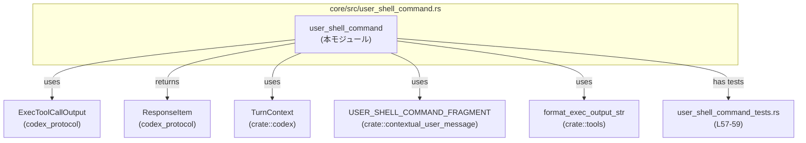
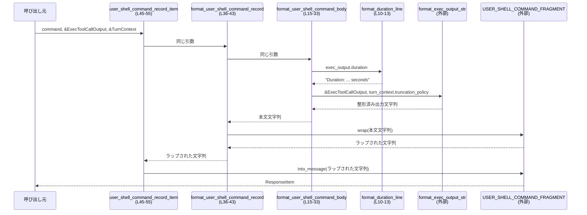

# core/src/user_shell_command.rs

## 0. ざっくり一言

ユーザーシェルコマンドの実行結果を、一定のテキスト形式のフラグメントと `ResponseItem` に整形するためのユーティリティモジュールです（core/src/user_shell_command.rs:L15-33, L36-55）。

---

## 1. このモジュールの役割

### 1.1 概要

- シェルコマンドの文字列表現 (`command`) と、その実行結果 (`ExecToolCallOutput`) を受け取り、  
  `<command>...</command><result>...</result>` という構造のテキストを生成します（L15-33）。
- 生成したテキストを `USER_SHELL_COMMAND_FRAGMENT` によってラップし、会話メッセージ用の `ResponseItem` に変換します（L36-43, L45-55）。

### 1.2 アーキテクチャ内での位置づけ

このモジュールは「シェル実行結果 → テキスト → プロトコルメッセージ」という変換の一段を担当します。



- 本モジュール自身はシェルコマンドの実行は行わず、すでに得られた `ExecToolCallOutput` を整形します（L15-33）。
- 具体的なメッセージプロトコルとの橋渡しとして `ResponseItem` を構築します（L45-55）。

### 1.3 設計上のポイント

- **純粋なフォーマッタ**  
  - すべての関数は引数から文字列を生成するだけで、副作用や I/O はありません（L10-13, L15-33, L36-43, L45-55）。
- **状態を持たない**  
  - グローバルな可変状態や `static mut`、`unsafe` は使用していません（ファイル全体に該当コードなし）。
- **責務の分割**  
  - 時間フォーマットは `format_duration_line` に切り出し（L10-13）、  
    本文構築は `format_user_shell_command_body`、  
    フラグメントラップは `format_user_shell_command_record`、  
    プロトコル用アイテムへの変換は `user_shell_command_record_item` が担当します（L15-33, L36-43, L45-55）。
- **エラーハンドリング方針**  
  - このファイル内の関数は `Result` を返さず、エラーを明示的に表現していません（全関数のシグネチャ参照）。
  - 失敗の可能性は、委譲先（`format_exec_output_str` や `USER_SHELL_COMMAND_FRAGMENT` のメソッド）の挙動に依存しますが、このチャンクには現れません。
- **並行性**  
  - `async` 関数やスレッド関連 API の利用はなく、すべて同期的な処理です（ファイル全体に該当コードなし）。

---

## 2. 主要な機能一覧

- シェル実行時間のフォーマット: `Duration` から `"Duration: X.XXXX seconds"` 形式の行を生成します（L10-13）。
- シェルコマンド記録本文の生成: `<command>...</command><result>...</result>` 構造のテキストを構築します（L15-33）。
- フラグメント付きコマンド記録文字列の生成: 本文を `USER_SHELL_COMMAND_FRAGMENT` でラップした文字列を返します（L36-43）。
- `ResponseItem` 生成: 上記文字列をユーザーメッセージ形式の `ResponseItem` に変換します（L45-55）。

### コンポーネント一覧（関数・モジュール）

| 名前 | 種別 | 公開範囲 | 役割 / 説明 | 根拠 |
|------|------|----------|------------|------|
| `format_duration_line` | 関数 | 非公開 | `Duration` を `"Duration: ... seconds"` という1行文字列にする | core/src/user_shell_command.rs:L10-13 |
| `format_user_shell_command_body` | 関数 | 非公開 | コマンド・終了コード・時間・出力から本文テキストを構築 | L15-33 |
| `format_user_shell_command_record` | 関数 | 公開 `pub` | 本文を `USER_SHELL_COMMAND_FRAGMENT` でラップした文字列を返す | L36-43 |
| `user_shell_command_record_item` | 関数 | 公開 `pub` | 上記文字列から `ResponseItem` を生成 | L45-55 |
| `tests` | モジュール | テストビルドのみ | テストコードを `user_shell_command_tests.rs` から読み込む | L57-59 |

（このファイル内で新しい構造体・列挙体の定義はありません）

---

## 3. 公開 API と詳細解説

### 3.1 型一覧（利用している主な外部型）

| 名前 | 種別 | 役割 / 用途 | 根拠 |
|------|------|-------------|------|
| `ExecToolCallOutput` | 外部構造体 | シェルコマンド実行結果（終了コード・実行時間など）を保持し、本モジュールでは `exit_code`, `duration` を使用 | L17, L25-26 |
| `ResponseItem` | 外部構造体 | 最終的に返されるレスポンス要素。`user_shell_command_record_item` の戻り値 | L48-49 |
| `TurnContext` | 外部構造体 | 実行コンテキスト。ここでは `truncation_policy` フィールドを `format_exec_output_str` に渡すために利用 | L18, L30 |
| `USER_SHELL_COMMAND_FRAGMENT` | 外部定数/オブジェクト | コマンド結果用フラグメント。`wrap` と `into_message` メソッドを通じて文字列をラップ・メッセージ化 | L7, L41-42, L50-54 |

> これらの型・オブジェクトの詳細な定義や挙動は、このチャンクには現れません。

---

### 3.2 関数詳細

#### `format_duration_line(duration: Duration) -> String`

**概要**

- 実行時間 `Duration` から `"Duration: 0.1234 seconds"` のような1行の文字列を生成します（L10-13）。

**引数**

| 引数名 | 型 | 説明 |
|--------|----|------|
| `duration` | `std::time::Duration` | シェルコマンドの実行にかかった時間 |

**戻り値**

- `String`: `"Duration: {seconds:.4} seconds"` という形式の英語メッセージ（L11-12）。

**内部処理の流れ**

1. `duration.as_secs_f64()` で秒数を `f64` に変換します（L11）。
2. `format!` マクロで `"Duration: {duration_seconds:.4} seconds"` を生成します（L12）。

**Examples（使用例）**

```rust
use std::time::Duration;

// 1.5秒のDurationを作成する
let d = Duration::from_millis(1500);

// フォーマット関数を呼び出す
let line = core::user_shell_command::format_duration_line(d);

// line は "Duration: 1.5000 seconds" のような文字列になる
println!("{line}");
```

> 実際のモジュールパスはプロジェクト構成によって異なります。この例では `format_duration_line` が公開されていると仮定しています。

**Errors / Panics**

- `Duration::as_secs_f64` と `format!` は、通常の範囲の `Duration` に対してパニックを起こしません。
- この関数自身が `Result` を返したり `unwrap` を呼ぶことはありません（L10-13）。

**Edge cases（エッジケース）**

- `duration` が 0 の場合: `"Duration: 0.0000 seconds"` となります（L11-12 のフォーマット仕様から導出）。
- 非常に大きい `Duration`: 秒数が大きな数字として出力されますが、特別な切り捨てや単位変換は行っていません（L11-12）。

**使用上の注意点**

- あくまで人間可読なメッセージ用であり、機械処理用の厳密なフォーマットではありません（小数点以下4桁で丸められます）。

---

#### `format_user_shell_command_body(command: &str, exec_output: &ExecToolCallOutput, turn_context: &TurnContext) -> String`

**概要**

- コマンド文字列・実行結果・コンテキストから、以下のような複数行テキストを生成します（L15-33）。

```text
<command>
<command文字列>
</command>
<result>
Exit code: ...
Duration: ... seconds
Output:
<整形された出力>
</result>
```

**引数**

| 引数名 | 型 | 説明 |
|--------|----|------|
| `command` | `&str` | 実行されたシェルコマンドの文字列表現（L16, L22） |
| `exec_output` | `&ExecToolCallOutput` | 実行結果。`exit_code`, `duration` が使用されます（L17, L25-26） |
| `turn_context` | `&TurnContext` | 出力のトランケーションポリシーを `format_exec_output_str` へ渡すために利用されます（L18, L28-31） |

**戻り値**

- `String`: 改行区切りで結合されたコマンド記録テキスト（L20-33）。

**内部処理の流れ**

1. 空の `Vec<String>` を作り、行ごとの文字列を順番に `push` していきます（L20）。
2. `<command>` 開始タグ、コマンド文字列、`</command>` 終了タグを追加します（L21-23）。
3. `<result>` 開始タグを追加します（L24）。
4. 終了コードを `"Exit code: {exit_code}"` 形式で追加します（L25）。
5. 実行時間を `format_duration_line(exec_output.duration)` でフォーマットし追加します（L26）。
6. `"Output:"` 行を追加します（L27）。
7. `format_exec_output_str(exec_output, turn_context.truncation_policy)` の結果を追加します（L28-31）。
8. `</result>` 終了タグを追加します（L32）。
9. `sections.join("\n")` で全行を改行で連結し、1つの `String` として返します（L33）。

**Examples（使用例）**

> `ExecToolCallOutput` や `TurnContext` の具体的な構造はこのチャンクに現れないため、擬似的な例です。

```rust
use codex_protocol::exec_output::ExecToolCallOutput;
use crate::codex::TurnContext;

// ダミーのコマンドと実行結果・コンテキスト（実際の生成方法は別モジュールに依存）
let command = "ls -la";
let exec_output: ExecToolCallOutput = /* 実行結果を構築 */;
let turn_context: TurnContext = /* トランケーションポリシーなどを含む文脈 */;

// 本文のみを生成（外部からは通常呼べない非公開関数である点に注意）
let body = core::user_shell_command::format_user_shell_command_body(
    command,
    &exec_output,
    &turn_context,
);

println!("{body}");
```

**Errors / Panics**

- この関数内の処理（`Vec::new`, `push`, `join`）は通常のメモリ状況ではパニックを起こしません。
- ただし、`format_exec_output_str` や `TurnContext.truncation_policy` の利用部分の挙動は、このチャンクには現れません（L28-31）。
- この関数自体は `Result` ではなく `String` を返すため、エラーを呼び出し元に伝播する仕組みはありません（シグネチャ L15-19）。

**Edge cases（エッジケース）**

- `command` が空文字列: `<command>` セクションの2行目が空になりますが、特別な処理はしていません（L21-23）。
- `exec_output.exit_code` の値がどうであっても、単に `format!` で文字列化されるだけです（L25）。
- `exec_output.duration` が 0 や極端に大きい値でも、`format_duration_line` の振る舞いに従います（L26）。
- 標準出力・標準エラーが非常に長い場合のトランケーションは `format_exec_output_str` と `turn_context.truncation_policy` に依存し、このチャンクには詳細が現れません（L28-31）。

**使用上の注意点**

- 入力文字列（`command` および実行結果の出力）は一切エスケープされず、生のまま `<command>`, `<result>` ブロック内に埋め込まれます（L21-23, L27-31）。  
  - そのため、この出力を HTML や XML として解釈するコンポーネントが存在する場合は、別途エスケープやサニタイズが必要になる可能性があります。
- 関数は非公開であり、通常は同一モジュール内からのみ使用される想定です（`pub` なし, L15）。

---

#### `pub fn format_user_shell_command_record(command: &str, exec_output: &ExecToolCallOutput, turn_context: &TurnContext) -> String`

**概要**

- `format_user_shell_command_body` で生成された本文を `USER_SHELL_COMMAND_FRAGMENT.wrap(...)` でラップし、最終的な記録文字列を返します（L36-43）。
- 「本文＋フラグメントメタ情報」という構造を一度に取得したい場合の公開 API です。

**引数**

| 引数名 | 型 | 説明 |
|--------|----|------|
| `command` | `&str` | 実行されたシェルコマンド文字列（L37） |
| `exec_output` | `&ExecToolCallOutput` | 実行結果（L38） |
| `turn_context` | `&TurnContext` | 出力フォーマットコンテキスト（L39） |

**戻り値**

- `String`: フラグメントでラップされたコマンド記録文字列。  
  - 文字列内部の具体的なフォーマットは `format_user_shell_command_body` と `USER_SHELL_COMMAND_FRAGMENT.wrap` に従います（L41-42）。

**内部処理の流れ**

1. `format_user_shell_command_body(command, exec_output, turn_context)` を呼び出し、本文を生成します（L41）。
2. `USER_SHELL_COMMAND_FRAGMENT.wrap(body)` で本文をラップし、その結果を返します（L41-42）。

**Examples（使用例）**

```rust
use codex_protocol::exec_output::ExecToolCallOutput;
use crate::codex::TurnContext;
use crate::user_shell_command::format_user_shell_command_record;

let command = "ls -la";
let exec_output: ExecToolCallOutput = /* 実行結果 */;
let turn_context: TurnContext = /* 文脈 */;

// フラグメントでラップされたシェルコマンド記録文字列を取得
let record_str = format_user_shell_command_record(
    command,
    &exec_output,
    &turn_context,
);

// ログ出力や、別のメッセージ構築処理の入力として用いることが可能
println!("{record_str}");
```

**Errors / Panics**

- この関数自体は単に内部関数と `wrap` を呼ぶだけで、`Result` を返しません（L36-43）。
- パニックが起こる可能性があるとすれば `USER_SHELL_COMMAND_FRAGMENT.wrap` の実装に依存しますが、このチャンクにはそのコードは現れません（L7, L41-42）。

**Edge cases（エッジケース）**

- 入力が空や長大であっても、そのまま本文生成に渡され、フラグメントでラップされます（L41）。
- フラグメント側が特定のサイズ制限や構文制約を持つかどうかは、このチャンクからは不明です。

**使用上の注意点**

- 返される `String` は所有権を持つ新しい文字列であり、引数のライフタイムに依存しません（戻り値型が `String`, 引数はすべて参照であることから）。
- フラグメントに依存しない生の本文だけが必要な場合は、本モジュール内で `format_user_shell_command_body` を利用することになりますが、外部モジュールからは非公開です（L15, L36）。

---

#### `pub fn user_shell_command_record_item(command: &str, exec_output: &ExecToolCallOutput, turn_context: &TurnContext) -> ResponseItem`

**概要**

- `format_user_shell_command_record` の結果を `USER_SHELL_COMMAND_FRAGMENT.into_message(...)` に渡し、`ResponseItem` を生成する公開 API です（L45-55）。
- 「コマンド実行結果 → プロトコルメッセージ」変換のエントリポイントになります。

**引数**

| 引数名 | 型 | 説明 |
|--------|----|------|
| `command` | `&str` | 実行されたシェルコマンド文字列（L46） |
| `exec_output` | `&ExecToolCallOutput` | 実行結果（L47） |
| `turn_context` | `&TurnContext` | 文脈情報（L48） |

**戻り値**

- `ResponseItem`: `USER_SHELL_COMMAND_FRAGMENT` がラップしたメッセージとしてのコマンド記録（L48-49, L50-54）。

**内部処理の流れ**

1. `format_user_shell_command_record(command, exec_output, turn_context)` を呼び出し、フラグメント付き文字列を生成します（L50-54）。
2. `USER_SHELL_COMMAND_FRAGMENT.into_message(...)` を呼び出し、その文字列を `ResponseItem` に変換します（L50-54）。
3. 得られた `ResponseItem` を返します（L49-54）。

**Examples（使用例）**

```rust
use codex_protocol::exec_output::ExecToolCallOutput;
use codex_protocol::models::ResponseItem;
use crate::codex::TurnContext;
use crate::user_shell_command::user_shell_command_record_item;

fn send_shell_result(
    command: &str,
    exec_output: &ExecToolCallOutput,
    turn_context: &TurnContext,
) -> ResponseItem {
    // ユーザー向けのシェル実行結果メッセージを生成
    user_shell_command_record_item(command, exec_output, turn_context)
}
```

**Errors / Panics**

- この関数自体は `Result` を返さず、ラップされた文字列から直接 `ResponseItem` を生成します（L45-55）。
- 内部で利用する `format_user_shell_command_record` と `USER_SHELL_COMMAND_FRAGMENT.into_message` の挙動に依存するエラー/パニックの可能性については、このチャンクからは不明です。

**Edge cases（エッジケース）**

- `command` が空・出力が巨大などのケースでも、単に1つの `ResponseItem` にまとめられます（L50-54）。
- `ResponseItem` 側がどのようなサイズ制限やエンコーディング制約を持つかは、このチャンクには現れません。

**使用上の注意点**

- この関数がこのファイルにおける「最も外側の」公開 API であり、呼び出し側は基本的にこの関数だけを使えばコマンド結果メッセージを得られます（L45-55）。
- 引数はいずれも参照であり、所有権は移動しません。呼び出し後も元の `command` / `exec_output` / `turn_context` はそのまま利用できます（シグネチャ L45-49）。

---

### 3.3 その他の関数

- 本ファイルの関数は上記4つのみであり、追加のヘルパー関数やラッパー関数は存在しません（全体確認）。

---

## 4. データフロー

代表的なシナリオとして、クライアントコードが `user_shell_command_record_item` を呼び出し、`ResponseItem` を得る流れを示します。



要点:

- データは常にイミュータブルな参照（`&`）で受け渡され、フォーマット済み文字列だけが新しく所有権を持つ値として生成されます（L15-19, L36-40, L45-49）。
- 実際の出力トランケーションやメッセージ構造の詳細は、`format_exec_output_str` と `USER_SHELL_COMMAND_FRAGMENT` に委譲されています（L28-31, L41-42, L50-54）。

---

## 5. 使い方（How to Use）

### 5.1 基本的な使用方法

最も代表的な使い方は、実行済みのシェルコマンド結果から `ResponseItem` を作ることです。

```rust
use codex_protocol::exec_output::ExecToolCallOutput;
use codex_protocol::models::ResponseItem;
use crate::codex::TurnContext;
use crate::user_shell_command::user_shell_command_record_item;

fn build_shell_result_item(
    command: &str,
    exec_output: &ExecToolCallOutput,
    turn_context: &TurnContext,
) -> ResponseItem {
    // この1行で、コマンド記録をユーザー向けのメッセージ形式に変換する
    user_shell_command_record_item(command, exec_output, turn_context)
}
```

- コマンドの実行自体や `ExecToolCallOutput` / `TurnContext` の構築は別のモジュールの責務であり、このチャンクには現れません。

### 5.2 よくある使用パターン

1. **文字列としてログやストレージに保存したい場合**

   ```rust
   use crate::user_shell_command::format_user_shell_command_record;

   let record_str = format_user_shell_command_record(command, &exec_output, &turn_context);
   // record_str をファイル・DB・ログなどに保存する
   ```

2. **プロトコルメッセージとしてすぐに送信したい場合**

   ```rust
   use crate::user_shell_command::user_shell_command_record_item;

   let item = user_shell_command_record_item(command, &exec_output, &turn_context);
   // item をメッセージ送信キューやレスポンスボディに載せる
   ```

### 5.3 よくある間違い

> 「間違い」の例は、このファイルの公開範囲から論理的に導けるものに限定します。

```rust
// 誤り例（別モジュールから）: 非公開関数を直接使おうとしている
// use crate::user_shell_command::format_user_shell_command_body;
// let body = format_user_shell_command_body(command, &exec_output, &turn_context);

// 正しい例: 公開APIを利用する
use crate::user_shell_command::user_shell_command_record_item;

let item = user_shell_command_record_item(command, &exec_output, &turn_context);
```

- `format_user_shell_command_body` は `pub` でないため、同一モジュール外からは利用できません（L15, L36-37, L45-46）。

### 5.4 使用上の注意点（まとめ）

- 文字列エスケープは行われず、`command` や実行結果はそのまま `<command>`, `<result>` ブロックに埋め込まれます（L21-23, L27-31）。  
  - 出力を HTML/XML として解釈する側がある場合、別途エスケープ処理を検討する必要があります。
- 出力の長さ制御（トランケーション）は `format_exec_output_str` と `turn_context.truncation_policy` に依存し、このチャンクには詳細が現れません（L28-31）。
- 並行性や非同期処理は扱っておらず、純粋な同期処理です（全体に `async` やスレッド関連のコードなし）。

---

## 6. 変更の仕方（How to Modify）

### 6.1 新しい機能を追加する場合

例: result セクションに追加メタ情報（開始時刻や終了時刻など）を出したい場合。

1. **本文フォーマットの変更**  
   - `format_user_shell_command_body` 内で `sections.push(...)` の行を追加・変更します（L20-32）。
2. **関連情報の受け渡し**  
   - 新しい情報が `ExecToolCallOutput` や `TurnContext` に既に含まれているか確認し、必要ならそれらの型側にフィールドを追加します（このチャンクには定義なし）。
3. **呼び出し側への影響**  
   - 公開 API のシグネチャ（`format_user_shell_command_record`, `user_shell_command_record_item`）を変えない限り、呼び出し側には影響しません（L36-43, L45-55）。

### 6.2 既存の機能を変更する場合

- **フォーマット文字列の変更**  
  - 例: `"Duration"` をローカライズしたい場合は `format_duration_line` の `format!` を変更します（L12）。
  - 他のコードはこの関数の戻り値を1行の文字列として扱うだけなので、行数が変わらない限り影響は限定的です。
- **タグ構造の変更**  
  - `<command>` / `<result>` を別のタグ名に変える場合は `sections.push` の対象文字列を修正します（L21, L23-24, L32）。
  - これに依存するパーサが存在するかどうかは、このチャンクからは不明なので、関連箇所を検索する必要があります。
- **テストの更新**  
  - ファイル末尾で `#[path = "user_shell_command_tests.rs"]` としてテストモジュールが指定されているため（L57-59）、  
    フォーマット変更後はこのテストファイル内の期待文字列も更新する必要があります（テスト内容はこのチャンクには現れません）。

---

## 7. 関連ファイル

| パス | 役割 / 関係 | 根拠 |
|------|------------|------|
| `core/src/user_shell_command_tests.rs` | 本モジュールのテストコード。`mod tests;` で読み込まれる | core/src/user_shell_command.rs:L57-59 |
| `codex_protocol::exec_output` | `ExecToolCallOutput` 型を提供し、本モジュールの入力として利用される | L3, L17, L25-26, L28-29 |
| `codex_protocol::models` | `ResponseItem` 型を提供し、本モジュールの主要な戻り値として利用される | L4, L48-49 |
| `crate::codex` | `TurnContext` 型を提供し、トランケーションポリシー含む文脈情報を渡す | L6, L18, L30, L39, L48 |
| `crate::contextual_user_message` | `USER_SHELL_COMMAND_FRAGMENT` を提供し、文字列のラップとメッセージ生成を行う | L7, L41-42, L50-54 |
| `crate::tools` | `format_exec_output_str` を提供し、実行結果の出力部分のフォーマットを担当する | L8, L28-31 |

> これらの関連ファイル・モジュールの内部実装や具体的なプロトコル仕様は、このチャンクには現れません。
