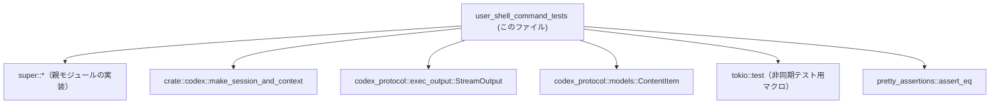
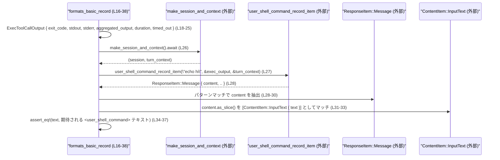

# core/src/user_shell_command_tests.rs コード解説

## 0. ざっくり一言

`user_shell_command` 関連のフォーマット処理とテキストフラグメント検出ロジックについて、期待される文字列フォーマットと優先順位（特に aggregated output の扱い）を検証するテスト群です。  
（テスト専用モジュールであり、公開 API 自体は定義していません。）

---

## 1. このモジュールの役割

### 1.1 概要

このテストモジュールは、次の 2 点を検証するために存在しています。

- `USER_SHELL_COMMAND_FRAGMENT` が `<user_shell_command> ... </user_shell_command>` 形式のテキストを正しく検出すること  
  根拠: `detects_user_shell_command_text_variants` のアサーション  
  `core/src/user_shell_command_tests.rs:L8-14`
- `user_shell_command_record_item` / `format_user_shell_command_record` が、`ExecToolCallOutput` から `<user_shell_command>` タグ付きの結果文字列を、所定のフォーマットと優先順位（`aggregated_output` を最優先）で構築すること  
  根拠: `formats_basic_record`, `uses_aggregated_output_over_streams` の期待文字列  
  `core/src/user_shell_command_tests.rs:L16-38`, `L40-55`

### 1.2 アーキテクチャ内での位置づけ

このファイルは「親モジュール（`super`）」に定義されているロジックのテストです。外部コンポーネントとの関係は次のとおりです。

- 親モジュール（`super::*`）
  - `USER_SHELL_COMMAND_FRAGMENT`
  - `ExecToolCallOutput`
  - `ResponseItem`
  - `user_shell_command_record_item`
  - `format_user_shell_command_record`  
  根拠: `use super::*;` と各識別子の利用  
  `core/src/user_shell_command_tests.rs:L1`, `L18-28`, `L42-43`, `L51`
- `crate::codex::make_session_and_context`
  - セッションと対話コンテキストを生成する非同期関数  
  根拠: `use crate::codex::make_session_and_context;` と利用箇所  
  `core/src/user_shell_command_tests.rs:L2`, `L26`, `L50`
- `codex_protocol` からの型
  - `StreamOutput`（標準出力・標準エラー・aggregated output を包む型）
  - `ContentItem::InputText`（メッセージ内容の一種）  
  根拠: `use codex_protocol::exec_output::StreamOutput;`  
  `core/src/user_shell_command_tests.rs:L3`  
  `use codex_protocol::models::ContentItem;` `L4`, 使用 `L20-22`, `L31-32`
- テストユーティリティ
  - `pretty_assertions::assert_eq`  
    根拠: `use pretty_assertions::assert_eq;`, 使用 `L34`, `L52`
  - `#[tokio::test]` による非同期テスト  
    根拠: `#[tokio::test]` アトリビュート  
    `core/src/user_shell_command_tests.rs:L16`, `L40`

依存関係の概要を Mermaid で表現すると次のようになります。



### 1.3 設計上のポイント

コードから読み取れる設計上の特徴は次のとおりです。

- **テキストベースの契約テスト**
  - 出力は `<user_shell_command>` 形式の **完全な文字列** として検証されています（改行位置・スペースも含む）  
    根拠: `assert_eq!(text, "...")`, `assert_eq!(record, "...")`  
    `core/src/user_shell_command_tests.rs:L34-37`, `L52-55`
- **非同期テストによるコンテキスト依存ロジックの検証**
  - `make_session_and_context().await` を使い、実際の対話コンテキストを用いてフォーマット処理をテストしています。  
    根拠: `let (_, turn_context) = make_session_and_context().await;`  
    `core/src/user_shell_command_tests.rs:L26`, `L50`
- **aggregated output の優先ルールを明示**
  - `stdout` と `stderr` に別々の値を入れつつ、`aggregated_output` に異なる値を設定し、その値が最終的な `Output:` セクションに使われることを検証しています。  
    根拠: `uses_aggregated_output_over_streams` 内の `exec_output` 初期化と期待文字列  
    `core/src/user_shell_command_tests.rs:L41-48`, `L52-55`
- **安全性・エラーに関する設計**
  - テスト内の失敗条件はすべて `assert!` やパターンマッチ + `panic!` で検出されるようになっており、「期待する形で値が返ってくること」を明示的に前提としています。  
    根拠: `assert!`, `assert_eq!`, `panic!("expected ...")`  
    `core/src/user_shell_command_tests.rs:L9-13`, `L29-30`, `L32-33`, `L34-37`, `L52-55`

---

## 2. 主要な機能一覧（コンポーネントインベントリー）

このファイル内で **定義されている関数（すべてテスト関数）** を一覧にします。

### 2.1 このファイル内の関数一覧

| 関数名 | 役割（1 行） | 非同期 | 根拠行番号 |
|--------|-------------|--------|------------|
| `detects_user_shell_command_text_variants` | `USER_SHELL_COMMAND_FRAGMENT` が `<user_shell_command>` タグ付きテキストを検出し、プレーンなコマンド文字列のみは検出しないことを確認するテストです。 | いいえ | `core/src/user_shell_command_tests.rs:L8-14` |
| `formats_basic_record` | 正常終了したコマンドの `ExecToolCallOutput` から、基本的な `<user_shell_command>` 記録メッセージが期待通りに生成されることを確認する非同期テストです。 | はい (`#[tokio::test]`) | `core/src/user_shell_command_tests.rs:L16-38` |
| `uses_aggregated_output_over_streams` | `stdout` / `stderr` ではなく `aggregated_output` が `Output:` セクションに採用されることを検証する非同期テストです。 | はい (`#[tokio::test]`) | `core/src/user_shell_command_tests.rs:L40-55` |

---

## 3. 公開 API と詳細解説

このファイル自身は公開 API を定義していませんが、テストを通じて **親モジュールの API 契約** を読み取ることができます。

### 3.1 型一覧（このファイルで使用している主な外部型）

このファイル内で新たに定義される型はありません。  
代わりに、テスト対象・補助として使用している外部型をまとめます。

| 名前 | 種別 | 定義元（推定モジュールパス） | 役割 / 用途 | 根拠行番号 |
|------|------|----------------------------|-------------|------------|
| `USER_SHELL_COMMAND_FRAGMENT` | 不明（おそらく構造体または値オブジェクト） | `super` モジュール | `matches_text` メソッドを持ち、テキストがユーザシェルコマンドフラグメントかどうかを判定する値として使われています。 | `core/src/user_shell_command_tests.rs:L9-13` |
| `ExecToolCallOutput` | 構造体（フィールド初期化から判定可能） | `super` モジュール | シェルコマンド実行結果（`exit_code`, `stdout`, `stderr`, `aggregated_output`, `duration`, `timed_out`）を保持する出力オブジェクトです。 | `core/src/user_shell_command_tests.rs:L18-25`, `L42-48` |
| `ResponseItem` | 列挙体（パターンマッチから判定可能） | `super` モジュール | `Message { content, .. }` バリアントを持ち、`user_shell_command_record_item` の戻り値として使用されています。 | `core/src/user_shell_command_tests.rs:L28-29` |
| `StreamOutput` | 構造体（`new` 関数から判定可能） | `codex_protocol::exec_output` | 各種出力（標準出力・標準エラー・aggregated）をラップする型で、テストでは文字列からインスタンス生成に用いられています。 | `core/src/user_shell_command_tests.rs:L3`, `L20-22`, `L44-46` |
| `ContentItem::InputText` | 列挙体バリアント | `codex_protocol::models` | `ResponseItem::Message` の `content` 要素の一つとして、テキスト入力を表現するために使用されています。 | `core/src/user_shell_command_tests.rs:L4`, `L31-32` |
| `Duration` | 構造体 | 標準ライブラリ (`std::time::Duration`) など（定義場所はこのチャンクには現れない） | コマンド実行時間を表すために `ExecToolCallOutput.duration` フィールドに渡されています。 | `core/src/user_shell_command_tests.rs:L23`, `L47` |

> `Duration` は `use` されていませんが、構文から `Duration::from_secs` / `Duration::from_millis` が使用されていることが分かります。  
> 根拠: `core/src/user_shell_command_tests.rs:L23`, `L47`

### 3.2 関数詳細

ここでは 3 つのテスト関数それぞれについて、詳細に説明します。

---

#### `detects_user_shell_command_text_variants()`

**概要**

- `USER_SHELL_COMMAND_FRAGMENT.matches_text` が `<user_shell_command>` タグで囲まれたテキストを「マッチ」と判定し、単なる `echo hi` 文字列にはマッチしないことを確認する単体テストです。  
  根拠: `assert!` と `assert!(! ...)` の対象文字列  
  `core/src/user_shell_command_tests.rs:L9-13`

**引数**

- なし（テストフレームワークから直接呼び出される関数です）。

**戻り値**

- `()`（戻り値は使用されません。失敗時は panic します。）

**内部処理の流れ（アルゴリズム）**

1. `<user_shell_command>\necho hi\n</user_shell_command>` という文字列に対して `USER_SHELL_COMMAND_FRAGMENT.matches_text(...)` を呼び出し、その結果が `true` であることを `assert!` で確認します。  
   根拠: `core/src/user_shell_command_tests.rs:L9-12`
2. `"echo hi"` というプレーンな文字列に対して同じメソッドを呼び出し、結果が `false` であることを `assert!(! ...)` で確認します。  
   根拠: `core/src/user_shell_command_tests.rs:L13`

**Examples（使用例）**

この関数自体はテスト harness から自動的に呼ばれますが、同様の検証を行うコードは次のように書けます。

```rust
// USER_SHELL_COMMAND_FRAGMENT は親モジュール (super) から再利用されることを前提としています。
// タグ付きテキストはマッチする
assert!(
    USER_SHELL_COMMAND_FRAGMENT
        .matches_text("<user_shell_command>\necho hi\n</user_shell_command>")
);

// プレーンなテキストはマッチしない
assert!(!USER_SHELL_COMMAND_FRAGMENT.matches_text("echo hi"));
```

**Errors / Panics**

- 次の場合にテストが失敗（panic）します。
  - タグ付きテキストに対して `matches_text` が `false` を返した場合（`assert!` が失敗）  
    根拠: `core/src/user_shell_command_tests.rs:L9-12`
  - プレーンテキストに対して `matches_text` が `true` を返した場合（`assert!(! ...)` が失敗）  
    根拠: `core/src/user_shell_command_tests.rs:L13`

**Edge cases（エッジケース）**

- このテストでは、次のようなケースは検証されていません（= 挙動はこのチャンクからは分かりません）。
  - タグの前後に空白や他の文字列が付く場合
  - タグ名の大文字 / 小文字違い
  - 不完全なタグ（開始タグのみ、終了タグのみ）
- したがって、これらに対する扱いは **このチャンクには現れない** ため不明です。

**使用上の注意点**

- このテストが前提としている契約は「タグで囲まれているかどうか」だけです。より複雑な構造（ネスト・属性など）がサポートされているかどうかは、別のテストや実装を確認する必要があります。

---

#### `formats_basic_record()`

**概要**

- 正常終了（`exit_code: 0`、`timed_out: false`）したシェルコマンド `"echo hi"` の `ExecToolCallOutput` から、`user_shell_command_record_item` が返す `ResponseItem::Message` の内容文字列フォーマットが期待通りであることを、非同期に検証するテストです。  
  根拠: `exec_output` の構築と期待される文字列  
  `core/src/user_shell_command_tests.rs:L18-25`, `L34-37`

**引数**

- なし（テストフレームワークから直接呼び出されます）。

**戻り値**

- `impl Future<Output = ()>`（`async fn` のため）  
  実際にはテストランタイムにとっては `()` の完了を意味します。

**内部処理の流れ**

1. `ExecToolCallOutput` を初期化します。  
   - `exit_code: 0`  
   - `stdout: "hi"`  
   - `stderr: ""`（空文字）  
   - `aggregated_output: "hi"`  
   - `duration: 1 秒`  
   - `timed_out: false`  
   根拠: `core/src/user_shell_command_tests.rs:L18-25`
2. `make_session_and_context().await` を呼び出し、セッションと `turn_context` を取得します。テストでは `turn_context` のみを使用します。  
   根拠: `core/src/user_shell_command_tests.rs:L26`
3. `user_shell_command_record_item("echo hi", &exec_output, &turn_context)` を呼び出し、`ResponseItem` を受け取ります。  
   根拠: `core/src/user_shell_command_tests.rs:L27`
4. 返ってきた値が `ResponseItem::Message { content, .. }` であることをパターンマッチで確認し、そうでなければ `panic!("expected message")` します。  
   根拠: `core/src/user_shell_command_tests.rs:L28-30`
5. `content.as_slice()` でスライス化した配列が、長さ 1 の `[ContentItem::InputText { text }]` であることを確認し、そうでなければ `panic!("expected input text")` します。  
   根拠: `core/src/user_shell_command_tests.rs:L31-33`
6. `text` が次の文字列と一致することを `assert_eq!` で検証します。  

   ```text
   <user_shell_command>
   <command>
   echo hi
   </command>
   <result>
   Exit code: 0
   Duration: 1.0000 seconds
   Output:
   hi
   </result>
   </user_shell_command>
   ```  

   根拠: `core/src/user_shell_command_tests.rs:L34-37`

**Examples（使用例）**

`user_shell_command_record_item` の使い方の一例として、このテストの本質的な部分だけを抜き出すと次のようになります。

```rust
// ExecToolCallOutput を作る（ここでは 1 秒で正常終了した echo hi を想定）
let exec_output = ExecToolCallOutput {
    exit_code: 0,
    stdout: StreamOutput::new("hi".to_string()),
    stderr: StreamOutput::new(String::new()),
    aggregated_output: StreamOutput::new("hi".to_string()),
    duration: Duration::from_secs(1),
    timed_out: false,
};

// セッションと turn_context を取得する（実装は crate::codex にある）
let (_, turn_context) = make_session_and_context().await;

// ユーザ向けの記録メッセージ (ResponseItem) を生成する
let item = user_shell_command_record_item("echo hi", &exec_output, &turn_context);

// メッセージ内容を取り出す
let ResponseItem::Message { content, .. } = item else {
    panic!("expected message");
};
let [ContentItem::InputText { text }] = content.as_slice() else {
    panic!("expected input text");
};

println!("{text}"); // <user_shell_command>... のテキストが出力される
```

**Errors / Panics**

- 次の場合にテストが失敗（panic）します。
  - `user_shell_command_record_item` が `ResponseItem::Message` 以外のバリアントを返した場合  
    根拠: `panic!("expected message");`  
    `core/src/user_shell_command_tests.rs:L28-30`
  - `content` が 1 要素の `ContentItem::InputText` でない場合（要素数が違う、別のバリアント等）  
    根拠: `panic!("expected input text");`  
    `core/src/user_shell_command_tests.rs:L31-33`
  - `text` が期待する完全な文字列と一致しない場合（`assert_eq!` 失敗）  
    根拠: `core/src/user_shell_command_tests.rs:L34-37`

**言語固有の安全性・並行性の観点**

- `#[tokio::test]` により、このテストは tokio ランタイム上の非同期タスクとして実行されます。  
  根拠: `core/src/user_shell_command_tests.rs:L16`
- 関数内で共有可変状態は利用しておらず、作成した値（`exec_output`, `turn_context` など）は関数スコープ内だけで消費されるため、スレッド安全性に関する特別な配慮は不要です。
- エラー処理は Result ではなくテスト特有の **panic ベース** の検証 (`assert_eq!`, `panic!`) によって行われています。

**Edge cases（エッジケース）**

- このテストがカバーしているケース:
  - 正常終了 (`exit_code: 0`, `timed_out: false`)
  - `stdout` と `aggregated_output` が同じ文字列 `"hi"` の場合
  - `stderr` が空文字の場合
- このテストからは、次のようなケースの挙動は **不明** です（別テストまたは実装確認が必要）。
  - `timed_out: true` の場合の表示
  - `aggregated_output` が空で `stdout` のみ非空な場合の扱い
  - `duration` のフォーマット（1 秒以外の値、サブ秒精度など）の境界挙動

**使用上の注意点**

- フォーマット文字列を **完全一致** で比較しているため、改行や空白の変更でもテストは失敗します。  
  出力フォーマットを変更する場合は、必ずこの期待文字列を同時に更新する必要があります。
- `ResponseItem` / `ContentItem` の構造が変わった場合（例えば配列でなく単一値になるなど）も、テストを合わせて修正する必要があります。

---

#### `uses_aggregated_output_over_streams()`

**概要**

- `ExecToolCallOutput` の `stdout` / `stderr` に異なる文字列を設定しつつ、`aggregated_output` に別の文字列を設定したときに、`format_user_shell_command_record` が `Output:` セクションとして **aggregated_output の値のみ** を使用することを検証するテストです。  
  根拠: `exec_output` 初期化と期待文字列  
  `core/src/user_shell_command_tests.rs:L41-48`, `L52-55`

**引数**

- なし（非同期テスト）。

**戻り値**

- `impl Future<Output = ()>`（`async fn`）。

**内部処理の流れ**

1. `ExecToolCallOutput` を次の値で初期化します。  
   - `exit_code: 42`  
   - `stdout: "stdout-only"`  
   - `stderr: "stderr-only"`  
   - `aggregated_output: "combined output wins"`  
   - `duration: 120 ミリ秒`  
   - `timed_out: false`  
   根拠: `core/src/user_shell_command_tests.rs:L42-48`
2. `make_session_and_context().await` を呼び出し `turn_context` を取得します（セッションは未使用）。  
   根拠: `core/src/user_shell_command_tests.rs:L50`
3. `format_user_shell_command_record("false", &exec_output, &turn_context)` を呼び出し、記録用文字列 `record` を取得します。  
   根拠: `core/src/user_shell_command_tests.rs:L51`
4. `record` が以下の文字列と完全一致することを `assert_eq!` で検証します。  

   ```text
   <user_shell_command>
   <command>
   false
   </command>
   <result>
   Exit code: 42
   Duration: 0.1200 seconds
   Output:
   combined output wins
   </result>
   </user_shell_command>
   ```  

   根拠: `core/src/user_shell_command_tests.rs:L52-55`

**Examples（使用例）**

`format_user_shell_command_record` の基本的な利用イメージは次のとおりです。

```rust
// ExecToolCallOutput を生成（ここでは stdout/stderr が別々だが aggregated_output が最終結果）
let exec_output = ExecToolCallOutput {
    exit_code: 42,
    stdout: StreamOutput::new("stdout-only".to_string()),
    stderr: StreamOutput::new("stderr-only".to_string()),
    aggregated_output: StreamOutput::new("combined output wins".to_string()),
    duration: Duration::from_millis(120),
    timed_out: false,
};

// コンテキスト取得
let (_, turn_context) = make_session_and_context().await;

// 記録用フォーマット済み文字列を取得
let record = format_user_shell_command_record("false", &exec_output, &turn_context);

assert!(record.contains("Output:\ncombined output wins"));
```

**Errors / Panics**

- 次の場合にテストが失敗します。
  - `format_user_shell_command_record` が返す文字列が期待値と完全一致しない場合（`assert_eq!` 失敗）  
    根拠: `core/src/user_shell_command_tests.rs:L52-55`
- このテストは `record` の中身を `assert_eq!` するだけであり、その他のエラー処理（`Result` 等）はこのチャンクには現れません。

**言語固有の安全性・並行性の観点**

- `formats_basic_record` と同様、非同期テストですが、共有可変状態は使用しておらず、全てのデータは関数ローカルに完結しています。  
  根拠: `core/src/user_shell_command_tests.rs:L41-55`
- `format_user_shell_command_record` は `&ExecToolCallOutput` と `&turn_context` を参照として受け取っており、所有権を奪っていないことが分かります（テスト内で再利用こそしていませんが、シグネチャの設計意図が推測できます）。  
  根拠: 関数呼び出し時の引数 `&exec_output`, `&turn_context`  
  `core/src/user_shell_command_tests.rs:L51`

**Edge cases（エッジケース）**

- このテストから読み取れる契約:
  - `aggregated_output` が非空の場合、`Output:` セクションには `stdout` / `stderr` ではなく `aggregated_output` の内容が使用される。
  - `duration: Duration::from_millis(120)` は `"0.1200 seconds"` とフォーマットされる。
- 不明な点（このチャンクには現れない）:
  - `aggregated_output` が空で `stdout` / `stderr` のみ非空の場合の優先順位。
  - `timed_out: true` の場合にどのような出力になるか。
  - 非 ASCII 文字や非常に長い出力に対する扱い。

**使用上の注意点**

- ここでも完全一致でフォーマットを確認しているため、フォーマット仕様（ラベル名、改行位置、秒数の小数点以下桁数など）を変更する場合は、このテストを合わせて更新する必要があります。
- `ExecToolCallOutput` のフィールド追加・名前変更などの構造変更は、テストコードの初期化部（構造体リテラル）にも影響します。コンパイルエラーで検出されますが、忘れないようにする必要があります。

### 3.3 その他の関数

このファイル内には、上記 3 つ以外の関数は定義されていません。

---

## 4. データフロー

ここでは、代表的なシナリオとして `formats_basic_record` 内のデータフローを示します。

### 4.1 `formats_basic_record` のデータフロー

処理の要点:

- テスト内で `ExecToolCallOutput` を構築し、
- セッションコンテキストを生成してから、
- `user_shell_command_record_item` に渡し、
- 返却された `ResponseItem::Message` から最終的な `<user_shell_command>` テキストを取り出して検証しています。



この図から分かるポイント:

- 実行結果 (`ExecToolCallOutput`) は **一度だけ** `user_shell_command_record_item` に渡され、以降は再利用されていません。
- メインのフォーマット処理は `user_shell_command_record_item` 内部で行われ、このテストはその出力を文字列レベルで検証する位置にあります。
- 外部とのやり取りは `make_session_and_context` と `user_shell_command_record_item` の 2 箇所のみであり、テスト自体は純粋にそれらの戻り値を検査する役割です。

---

## 5. 使い方（How to Use）

### 5.1 このテストモジュールの基本的な利用方法

このファイルは通常、`cargo test` で他のテストと同時に実行されます。

```bash
# クレート直下で
cargo test user_shell_command
```

上記のように、テスト名（部分一致）を指定することで、このモジュール内のテストだけを実行することも可能です。

### 5.2 新しいテストを追加する典型パターン

このモジュールの構成に合わせて、新しい挙動を検証するテストは次のように追加できます。

```rust
use super::*;
use crate::codex::make_session_and_context;
use codex_protocol::exec_output::StreamOutput;
use codex_protocol::models::ContentItem;
use pretty_assertions::assert_eq;

#[tokio::test] // 非同期処理が必要な場合
async fn formats_timeout_record() {
    // 1. ExecToolCallOutput をシナリオに応じて構築する
    let exec_output = ExecToolCallOutput {
        exit_code: 124,
        stdout: StreamOutput::new(String::new()),
        stderr: StreamOutput::new(String::from("timeout")),
        aggregated_output: StreamOutput::new(String::new()),
        duration: Duration::from_secs(60),
        timed_out: true,
    };

    // 2. コンテキストを生成する
    let (_, turn_context) = make_session_and_context().await;

    // 3. テスト対象関数を呼び出す
    let record = format_user_shell_command_record("sleep 60", &exec_output, &turn_context);

    // 4. 期待されるフォーマットを assert_eq! で検証
    assert!(record.contains("timed out")); // 期待仕様に合わせて検証内容を書く
}
```

### 5.3 よくある使用パターン

- **メッセージオブジェクト vs. プレーン文字列**
  - `user_shell_command_record_item` は `ResponseItem` 型を返し、UI やプロトコル層に近いレベルで使われると考えられます。  
    根拠: `ResponseItem::Message { content, .. }` へのマッチ  
    `core/src/user_shell_command_tests.rs:L28-30`
  - `format_user_shell_command_record` はプレーンな文字列を返すため、ログやテキストベースの保存に向いていると読み取れます。  
    根拠: `let record = format_user_shell_command_record(...);` で `String` として比較  
    `core/src/user_shell_command_tests.rs:L51-55`

### 5.4 よくある間違い

このファイルから推測できる誤用例と正しい使い方は次のとおりです。

```rust
// 誤りの例: ResponseItem のバリアントを確認せずに content フィールドにアクセスしようとする
// let content = item.content; // コンパイルエラー、あるいは将来の仕様変更に弱い

// 正しい例: 列挙体のバリアントをパターンマッチで確認する
let ResponseItem::Message { content, .. } = item else {
    panic!("expected message");
};
```

```rust
// 誤りの例: stdout/stderr を個別に連結してしまい、aggregated_output の契約を破る
let output = format!(
    "{}\n{}",
    exec_output.stdout, // 型が合わない上に、契約上も preferred でない
    exec_output.stderr,
);

// 正しい例: 専用のフォーマット関数を使って契約に従った文字列を生成する
let record = format_user_shell_command_record("false", &exec_output, &turn_context);
```

---

## 5.5 使用上の注意点（まとめ）

- フォーマット仕様が **文字列レベルでテストに固定されている** ため、仕様変更時はテストの更新が必須です。
- `user_shell_command_record_item` / `format_user_shell_command_record` は `&ExecToolCallOutput` と `&turn_context` を取る構造になっており、所有権を移動させずに使う設計であることが分かります。  
  これは Rust の所有権システム上、安全に参照を共有する意図があると考えられます。  
  根拠: 両関数呼び出しで参照渡しになっていること  
  `core/src/user_shell_command_tests.rs:L27`, `L51`
- 非同期コンテキスト `make_session_and_context().await` が前提となるため、これらのテストを模倣する場合は `#[tokio::test]` などの非同期テスト環境が必要です。

---

## 6. 変更の仕方（How to Modify）

### 6.1 新しい機能（新しいフォーマットやフィールド）を追加する場合

1. **実装側の変更**
   - 親モジュール（`super`）内の `ExecToolCallOutput` 利用コード（`user_shell_command_record_item` / `format_user_shell_command_record`）に、新しい情報（例: 作業ディレクトリ、環境変数など）を組み込む。
2. **既存テストの確認**
   - `formats_basic_record` と `uses_aggregated_output_over_streams` の期待文字列に影響があるか確認する。  
     影響がある場合は新しい情報を反映して更新する。
3. **新しいテストの追加**
   - 新しいフィールドや挙動に特化したテスト関数を、既存パターンに倣って追加する。  
   - 例えば、タイムアウト時用のフォーマットを検証するテストなど。

### 6.2 既存の機能（フォーマット仕様など）を変更する場合

- **影響範囲の確認方法**
  - `core/src/user_shell_command_tests.rs` 内の期待文字列（`assert_eq!` の右辺）を検索し、どのテストが影響を受けるか確認します。  
    根拠: 期待文字列はすべてこのファイル内でハードコードされている  
    `core/src/user_shell_command_tests.rs:L34-37`, `L52-55`
- **契約上の注意点**
  - `<user_shell_command>`, `<command>`, `<result>` といったタグ名やラベル（`Exit code:`, `Duration:`, `Output:`）はクライアント側のパーサからも参照されている可能性があります。  
    実際のクライアントコードはこのチャンクには現れないため詳細は不明ですが、互換性への影響を考慮する必要があります。
- **テスト・使用箇所の再確認**
  - このファイル以外にも、同じフォーマットに依存したテストやパーサが存在する可能性があります。  
    シンボル検索で `"<user_shell_command>"` などの文字列を全体検索し、他の依存箇所を確認すると安全です。

---

## 7. 関連ファイル・モジュール

このモジュールと密接に関係するコンポーネントは次のとおりです（ファイルパスはコードからは直接分からないため、モジュールパスで記載します）。

| モジュール / パス | 役割 / 関係 | 根拠行番号 |
|-------------------|------------|------------|
| `super`（親モジュール） | `USER_SHELL_COMMAND_FRAGMENT`, `ExecToolCallOutput`, `ResponseItem`, `user_shell_command_record_item`, `format_user_shell_command_record` などテスト対象の実装を提供します。実際のファイルパスはこのチャンクには現れません。 | `core/src/user_shell_command_tests.rs:L1`, `L18-28`, `L42-43`, `L51` |
| `crate::codex::make_session_and_context` | シェルコマンド記録に必要なセッションおよびターンコンテキストを生成する非同期関数です。テストはこの関数を通じてコンテキストを取得します。 | `core/src/user_shell_command_tests.rs:L2`, `L26`, `L50` |
| `codex_protocol::exec_output::StreamOutput` | コマンド実行結果の標準出力・標準エラー・aggregated output をラップする型であり、`ExecToolCallOutput` のフィールド初期化に利用されています。 | `core/src/user_shell_command_tests.rs:L3`, `L20-22`, `L44-46` |
| `codex_protocol::models::ContentItem` | `ResponseItem::Message` 内の `content` 要素を構成する型であり、テストでは `InputText` バリアントとして文字列を取り出しています。 | `core/src/user_shell_command_tests.rs:L4`, `L31-32` |
| `tokio` | `#[tokio::test]` アトリビュートを通じて非同期テストランタイムを提供します。 | `core/src/user_shell_command_tests.rs:L16`, `L40` |
| `pretty_assertions` | `assert_eq!` の差分表示を改善するテスト用ユーティリティです。 | `core/src/user_shell_command_tests.rs:L5`, `L34`, `L52` |

このチャンクだけでは、親モジュールや `codex`、`codex_protocol` の実装詳細までは分かりませんが、本テストファイルにより「ユーザシェルコマンドの実行結果をどのような形式のテキストとして外部へ公開するか」という契約の一部が明確になっています。
