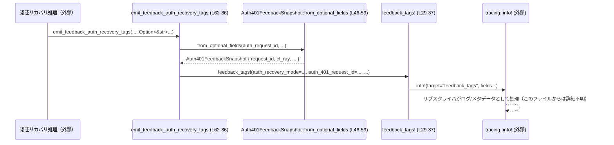

# core/src/util.rs コード解説

## 0. ざっくり一言

このモジュールは、Codex コアで共通利用されるユーティリティ群をまとめたもので、  
**フィードバック用タグ出力、バックオフ計算、パス解決、スレッド名整形、`codex resume` コマンド文字列生成**などを提供します（`util.rs:L11-12,62-86,88-93,103-109,112-119,121-135`）。

---

## 1. このモジュールの役割

### 1.1 概要

- このモジュールは **ログ/フィードバック用メタデータ出力** と **CLI / 非同期処理まわりの細かい補助処理** を提供します。
- 具体的には、`tracing` を使ったフィードバックタグ出力マクロ、401 認証リカバリ用タグ出力、指数バックオフ計算、パス解決、スレッド名の正規化、`codex resume` コマンドの文字列生成を行います（`util.rs:L14-37,62-86,88-93,103-109,112-119,121-135`）。

### 1.2 アーキテクチャ内での位置づけ

このモジュールは基本的に状態を持たない純粋関数群で構成され、以下の外部コンポーネントに依存します。

- `tracing`：構造化ログ出力（`feedback_tags!`, `error_or_panic`）（`util.rs:L29-37,95-101`）
- `rand`：バックオフに使うジッター（`util.rs:L6,88-93`）
- `codex_protocol::ThreadId`：スレッド識別子（`util.rs:L5,121-135`）
- `codex_shell_command::parse_command::shlex_join`：シェル引数のエスケープ（`util.rs:L9,128`）
- `std::path`, `std::time` など標準ライブラリ（`util.rs:L1-3,103-109,88-93`）

主要な依存関係を簡略化した図です（本チャンク範囲: `util.rs:L1-139`）。

```mermaid
graph TD
    subgraph core::util (util.rs)
        feedback_tags["feedback_tags! (L29-37)"]
        emit_auth["emit_feedback_auth_recovery_tags (L62-86)"]
        backoff["backoff (L88-93)"]
        err_or_panic["error_or_panic (L95-101)"]
        resolve_path["resolve_path (L103-109)"]
        norm_name["normalize_thread_name (L112-119)"]
        resume_cmd["resume_command (L121-135)"]
    end

    feedback_tags --> tracing["tracing::info! (外部クレート)"]
    emit_auth --> feedback_tags
    backoff --> rand["rand::rng().random_range (外部)"]
    err_or_panic --> tracing_err["tracing::error! (外部)"]
    resolve_path --> std_path["std::path (外部)"]
    resume_cmd --> shlex["shlex_join (codex_shell_command)"]
    resume_cmd --> thread_id["ThreadId (codex_protocol)"]
```

このチャンク外からこれら関数がどのように呼ばれているかは、このファイルだけからは分かりません。

### 1.3 設計上のポイント

コードから読み取れる特徴は次の通りです。

- **無状態・関数中心**
  - すべての関数・マクロはグローバルな可変状態を持たず、引数から結果を計算する形になっています（`util.rs:L29-37,62-86,88-93,95-101,103-109,112-119,121-135`）。
- **ロギングとフィードバックの分離**
  - 実際のフィードバック送信ではなく、`tracing` のイベントフィールドとしてメタデータを発行する役割に限定されています（`util.rs:L14-21,29-37,62-86`）。
- **安全性**
  - このファイル内には `unsafe` ブロックは存在せず（`util.rs:L1-139`）、すべて安全な Rust 構文で書かれています。
  - 共有可変状態もなく、関数はどれもスレッドセーフに呼び出せる構造です。
- **環境に応じたエラーハンドリング**
  - `error_or_panic` はビルド設定（`cfg!(debug_assertions)`）に応じて panic とログ出力を切り替えます（`util.rs:L95-101`）。
- **CLI セキュリティ・堅牢性**
  - `resume_command` はターゲットが `-` で始まる場合に `--` を追加し、オプション解釈を防いでいることから、意図しないオプション注入を避ける設計になっています（`util.rs:L127-132`）。
  - 引数は `shlex_join` でシェル用にエスケープされます（`util.rs:L128`）。

---

## 2. コンポーネント一覧（インベントリー）

### 2.1 主なコンポーネント一覧

関数・マクロ・型の一覧と定義位置です（行番号はこのファイル内の物理行を基準）。

| 名前 | 種別 | 公開範囲 | 役割 / 用途 | 定義位置 |
|------|------|----------|------------|----------|
| `feedback_tags!` | マクロ | `#[macro_export]`（他クレートからも利用可） | `tracing` にフィードバック用の key/value タグを出力する（`info!` イベント） | `util.rs:L14-37` |
| `Auth401FeedbackSnapshot<'a>` | 構造体 | 非公開 | 認証 401 関連のメタデータ（request_id など）を一時的にまとめる | `util.rs:L39-44` |
| `Auth401FeedbackSnapshot::from_optional_fields` | 関数（impl メソッド） | 非公開 | `Option<&str>` を空文字列で埋めたスナップショットに変換 | `util.rs:L46-59` |
| `emit_feedback_auth_recovery_tags` | 関数 | `pub(crate)` | 認証リカバリ処理に関するフィードバックタグをまとめて出力 | `util.rs:L62-86` |
| `backoff` | 関数 | `pub` | 指数バックオフ + ジッター付きの待機時間 `Duration` を計算 | `util.rs:L88-93` |
| `error_or_panic` | 関数 | `pub(crate)` | デバッグビルドでは panic、本番ビルドでは `tracing::error!` を出す | `util.rs:L95-101` |
| `resolve_path` | 関数 | `pub` | ベースディレクトリと相対パスから絶対/解決済みパスを構成 | `util.rs:L103-109` |
| `normalize_thread_name` | 関数 | `pub` | スレッド名文字列をトリムし、空なら `None` にする | `util.rs:L111-119` |
| `resume_command` | 関数 | `pub` | `codex resume` の CLI コマンド文字列を、スレッド名/IDから生成 | `util.rs:L121-135` |
| `tests` | モジュール | `#[cfg(test)]` | このモジュールのテスト（別ファイル `util_tests.rs`） | `util.rs:L137-139` |

---

## 3. 公開 API と詳細解説

### 3.1 型一覧（構造体など）

このファイルで定義される主要な型は 1 つです。

| 名前 | 種別 | 役割 / 用途 | フィールド | 定義位置 |
|------|------|------------|-----------|----------|
| `Auth401FeedbackSnapshot<'a>` | 構造体 | 認証 401 応答に関するメタデータを、一時的に &str でまとめる内部型です。フィードバックタグ出力のためだけに使用されます。 | `request_id`, `cf_ray`, `error`, `error_code`（いずれも `&'a str`） | `util.rs:L39-44` |

`from_optional_fields` メソッドは、`Option<&str>` を `""`（空文字列）で埋めることで、フィードバックタグ出力時に `Option` を意識せず済むようにしています（`util.rs:L46-59`）。

---

### 3.2 重要なマクロ・関数の詳細

#### `feedback_tags!(key = value, ...)`

**概要**

- 任意個の `key = value` ペアを受け取り、`tracing::info!` イベントとして **フィードバック用タグ** を出力するマクロです（`util.rs:L29-37`）。
- 出力されるイベントの `target` は `"feedback_tags"` で固定されます（`util.rs:L32-34`）。

**引数**

マクロのパターンから読み取れる仕様（`util.rs:L31`）:

| 引数名 | 型 | 説明 |
|--------|----|------|
| `key` | 識別子（`ident`） | ログフィールド名として使われる識別子（例: `model`, `cached`）。 |
| `value` | 任意の式（`expr`） | `std::fmt::Debug` を実装している必要がある値。`tracing::field::debug` でラップされます（`util.rs:L34`）。 |

- 1 個以上の `key = value` をカンマ区切りで渡せます（`util.rs:L31`）。

**戻り値**

- マクロの展開先は `tracing::info!` 呼び出しであり、副作用はログ出力のみです（`util.rs:L32-35`）。
- 戻り値は `()` 相当と考えてよいです（ログ以外の値は返しません）。

**内部処理の流れ**

1. 渡された `key = value` ペアをすべて `tracing::info!` のフィールドとして展開します（`util.rs:L31-35`）。
2. 各 `value` は `tracing::field::debug(&$value)` で `Debug` 表現に変換されます（`util.rs:L34`）。
3. `tracing` サブスクライバが設定されていれば、このイベントは `target = "feedback_tags"` として処理されます（`util.rs:L32-34`）。

**Examples（使用例）**

ドキュメントコメントにある例を簡略化した形です（`util.rs:L25-28`）。

```rust
// モデルとキャッシュ利用の有無をタグとして記録する
codex_core::feedback_tags!(model = "gpt-5", cached = true);

// リクエスト固有の ID をタグに載せる
let provider_id = "azure";
let request_id = "req-12345";
codex_core::feedback_tags!(provider = provider_id, request_id = request_id);
```

このコードは `target: "feedback_tags"` の `tracing::info!` イベントを発行し、`model`, `cached`, `provider`, `request_id` の 4 つのフィールドを持つログを生成します。

**Errors / Panics**

- このマクロ自身にはエラーや panic を引き起こす処理は見当たりません（`util.rs:L29-37`）。
- 実際の挙動は `tracing::info!` の実装とサブスクライバに依存します。

**Edge cases（エッジケース）**

- `value` が重い `Debug` 実装を持つ場合、ログ出力のたびにそれに応じたコストがかかります。
- `tracing` のサブスクライバが設定されていない場合、イベントが無視される可能性がありますが、それはこのファイルからは判断できません。

**使用上の注意点**

- `value` は `std::fmt::Debug` を実装している必要があります（`util.rs:L20-21`）。
- 機密性の高い情報（アクセストークンなど）を直接出力するとログに残るため、セキュリティポリシー上問題になり得ます。

---

#### `emit_feedback_auth_recovery_tags(...) -> ()`

**概要**

- 認証（auth）リカバリ処理のモード・フェーズ・結果と、401 応答関連のメタデータを、`feedback_tags!` を使って一括出力する関数です（`util.rs:L62-86`）。

**引数**

| 引数名 | 型 | 説明 |
|--------|----|------|
| `auth_recovery_mode` | `&str` | 認証リカバリのモード（例: 再認証、トークン再取得などを区別する目的と推測されますが、コードからは具体的な値は分かりません）。 |
| `auth_recovery_phase` | `&str` | リカバリ処理のフェーズ名（開始/終了などを表すと推測されますが、詳細はコードからは不明です）。 |
| `auth_recovery_outcome` | `&str` | リカバリの結果（成功・失敗など）を表す文字列。 |
| `auth_request_id` | `Option<&str>` | 401 応答に紐づくリクエスト ID。省略可（`util.rs:L66`）。 |
| `auth_cf_ray` | `Option<&str>` | Cloudflare の `cf-ray` ヘッダ値のようなトレーシング ID を想定したフィールド名ですが、コードからは厳密な意味は分かりません（`util.rs:L67`）。 |
| `auth_error` | `Option<&str>` | エラーメッセージなどを入れるフィールド（`util.rs:L68`）。 |
| `auth_error_code` | `Option<&str>` | エラーコード文字列（`util.rs:L69`）。 |

**戻り値**

- 何も返さず、`feedback_tags!` を通じてログ出力のみ行います（`util.rs:L62-86`）。

**内部処理の流れ**

1. `Auth401FeedbackSnapshot::from_optional_fields` に 4 つの `Option<&str>` を渡し、空文字列で埋めたスナップショットを作成（`util.rs:L71-76`）。
2. `feedback_tags!` マクロを呼び出し、次のフィールドを出力（`util.rs:L77-85`）:
   - `auth_recovery_mode`, `auth_recovery_phase`, `auth_recovery_outcome`
   - `auth_401_request_id`, `auth_401_cf_ray`, `auth_401_error`, `auth_401_error_code`
3. これにより、認証リカバリに関する一連の情報が一つの `tracing` イベントとして出力されます。

**Examples（使用例）**

```rust
// 401 応答を受けて再認証を試みたケースのメタデータを出力する例
emit_feedback_auth_recovery_tags(
    "reauth",                    // auth_recovery_mode
    "start",                     // auth_recovery_phase
    "pending",                   // auth_recovery_outcome
    Some("req-12345"),           // auth_request_id
    Some("cf-ray-id"),           // auth_cf_ray
    Some("invalid_api_key"),     // auth_error
    Some("40101"),               // auth_error_code
);
```

この関数自体は戻り値を持たず、フィードバックタグとしてログを出力するだけです。

**Errors / Panics**

- 関数本体には panic やエラーを返す処理はありません（`util.rs:L70-86`）。
- `feedback_tags!` が内部で `tracing::info!` を呼んでいるため、`tracing` の実装に依存する挙動はあります。

**Edge cases（エッジケース）**

- `auth_request_id` などが `None` の場合、対応するフィールドは空文字列として出力されます（`util.rs:L54-57`）。
- 文字列が長大な場合でもこの関数内で切り詰められることはなく、そのままログに出力されます。

**使用上の注意点**

- 機密性の高い情報（エラー詳細やリクエスト ID）がログに流れる可能性があるため、ログの扱いには注意が必要です。
- 値の `None` と空文字列の区別はログ上では付かない点に注意が必要です（`util.rs:L54-57`）。

---

#### `backoff(attempt: u64) -> Duration`

**概要**

- リトライ回数 `attempt` に基づき、指数バックオフ + ジッター付きの待機時間を `Duration` で返します（`util.rs:L88-93`）。
- 初期待機時間は 200ms、倍率は 2.0 です（`util.rs:L11-12`）。

**引数**

| 引数名 | 型 | 説明 |
|--------|----|------|
| `attempt` | `u64` | 試行回数。1 回目の試行を `1` と想定した設計です（`attempt.saturating_sub(1)` より推測、`util.rs:L89`）。 |

**戻り値**

- `Duration`：ミリ秒単位の待機時間（`Duration::from_millis`）を返します（`util.rs:L92`）。

**内部処理の流れ**

1. `attempt.saturating_sub(1)` を計算し、`attempt = 0` のときも 0 になるようにします（`util.rs:L89`）。
2. `BACKOFF_FACTOR.powi(...)` で指数を計算し（`BACKOFF_FACTOR = 2.0`、`util.rs:L12,89`）、`exp` に代入。
3. 初期ディレイ `INITIAL_DELAY_MS`（200ms）に `exp` を掛けて `base` ミリ秒を計算（`util.rs:L90`）。
4. `rand::rng().random_range(0.9..1.1)` で 0.9〜1.1 の範囲の乱数 `jitter` を生成（`util.rs:L91`）。
5. `base * jitter` を計算し、`Duration::from_millis` に渡して `Duration` を返す（`util.rs:L92`）。

**Examples（使用例）**

```rust
use std::thread;
use std::time::Duration;

// 最大5回までリトライし、backoffで待機する例
for attempt in 1..=5 {
    // ... 何らかの処理を試す ...

    // 失敗したのでbackoffで待機時間を決める
    let delay: Duration = backoff(attempt); // attemptに応じて待機時間が増える
    thread::sleep(delay);                   // 実際にスリープする
}
```

**Errors / Panics**

- 関数内に panic を起こす処理はありません（`util.rs:L88-93`）。
- `rand::rng()`/`random_range` の失敗可能性は、このファイルだけからは分かりません。

**Edge cases（エッジケース）**

- `attempt = 0` の場合  
  - `saturating_sub(1)` により指数は 0 となり、`exp = 1.0` となるため、実質的に初回と同じ 200ms ベースでジッターがかかります（`util.rs:L89-90`）。
- `attempt` が極端に大きい場合  
  - `powi` の結果は非常に大きな値になり得ます。`as u64` への変換によって大きな `base` が生成され、待機時間が非常に長くなる可能性があります（`util.rs:L89-90`）。
- ジッターの範囲  
  - 0.9〜1.1 倍のランダム値が乗るため、同じ `attempt` でも約 ±10% の揺らぎが生じます（`util.rs:L91-92`）。

**使用上の注意点**

- `attempt` を無制限に増やすと待機時間が爆発的に増える設計なので、呼び出し側で最大リトライ回数を制限することが実務上は重要です。
- この関数は待機時間を返すだけであり、スリープ処理（`thread::sleep` や async の `sleep`）は呼び出し側で行う必要があります。
- 同時に複数スレッドから呼び出しても、このモジュール内には共有可変状態がないため問題ありません（`util.rs:L88-93`）。

---

#### `error_or_panic(message: impl ToString) -> ()`

**概要**

- デバッグビルド時は `panic!` を発生させ、リリースビルド時は `tracing::error!` でエラーログを出力するヘルパーです（`util.rs:L95-101`）。
- `cfg!(debug_assertions)` により、ビルド設定に応じて挙動を切り替えます（`util.rs:L96`）。

**引数**

| 引数名 | 型 | 説明 |
|--------|----|------|
| `message` | `impl std::string::ToString` | エラーメッセージとして利用される値。`ToString` で `String` に変換されます（`util.rs:L95,97,99`）。 |

**戻り値**

- 戻り値は `()` です。
- デバッグビルド時には panic により関数から戻らないケースが通常です（`util.rs:L97`）。

**内部処理の流れ**

1. `cfg!(debug_assertions)` でビルド設定を判定（`util.rs:L96`）。
2. `true`（通常の `debug` ビルド）の場合  
   - `panic!("{}", message.to_string())` を実行し、スレッドをパニックさせます（`util.rs:L97`）。
3. `false`（`release` ビルドなど）の場合  
   - `error!("{}", message.to_string())` によって `tracing::error!` マクロを呼び出し、エラーログを残します（`util.rs:L98-99`）。

**Examples（使用例）**

```rust
// 想定外の状態に到達したときに呼び出す例
fn handle_unreachable_state(state: i32) {
    error_or_panic(format!("unreachable state: {state}")); // debugではpanic、releaseではエラーログ
}
```

**Errors / Panics**

- デバッグビルド（`cfg!(debug_assertions) == true`）では必ず panic します（`util.rs:L96-97`）。
- リリースビルドでは panic はせず、ログを出力するだけです（`util.rs:L98-100`）。

**Edge cases（エッジケース）**

- `message.to_string()` でメッセージ構築に失敗することは通常ありませんが、そのコストはメッセージのサイズに比例します（`util.rs:L97,99`）。
- ログ出力先が設定されていない場合、リリースビルドでのエラー情報が実際にはどこにも記録されない可能性があります。

**使用上の注意点**

- **挙動の差**: デバッグとリリースで挙動が変わるため、テスト時に panic していたケースが本番では単なるログになり、処理が続行される点に注意が必要です。
- 想定外の状態で処理継続が危険な場合は、リリースビルドでも panic させるか、明示的に `panic!` を使う方が安全な場合があります。

---

#### `resolve_path(base: &Path, path: &PathBuf) -> PathBuf`

**概要**

- `path` が絶対パスならそのまま返し、相対パスなら `base.join(path)` で結合したパスを返します（`util.rs:L103-109`）。
- ファイルシステムにはアクセスせず、純粋に文字列レベルのパス結合だけを行います。

**引数**

| 引数名 | 型 | 説明 |
|--------|----|------|
| `base` | `&Path` | 相対パスを解決するときのベースディレクトリ（`util.rs:L103`）。 |
| `path` | `&PathBuf` | 解決対象のパス。絶対/相対いずれも可（`util.rs:L103-104`）。 |

**戻り値**

- `PathBuf`：解決済みのパス。`path` が絶対なら `path` のクローン、相対なら `base.join(path)` の結果です（`util.rs:L104-108`）。

**内部処理の流れ**

1. `path.is_absolute()` で絶対パスかどうかを判定（`util.rs:L104`）。
2. 絶対パスなら `path.clone()` を返す（`util.rs:L105`）。
3. そうでなければ `base.join(path)` を返す（`util.rs:L107`）。

**Examples（使用例）**

```rust
use std::path::{Path, PathBuf};

// ベースディレクトリが /home/user、相対パスを解決する例
let base = Path::new("/home/user");
let p1 = PathBuf::from("project/config.toml");
let p2 = PathBuf::from("/etc/config.toml");

let resolved1 = resolve_path(base, &p1); // => "/home/user/project/config.toml"
let resolved2 = resolve_path(base, &p2); // => "/etc/config.toml" (絶対パスはそのまま)
```

**Errors / Panics**

- この関数は I/O を行わないため、エラーや panic を発生させるコードはありません（`util.rs:L103-109`）。

**Edge cases（エッジケース）**

- `base` 自体が相対パスである場合、結果も相対パスになります（`util.rs:L107`）。その妥当性は呼び出し側の責任です。
- `path` が空文字列に相当する場合の扱いは `PathBuf`/`Path` の仕様に従います。

**使用上の注意点**

- 実際にパスが存在するかどうかはチェックしません。存在確認は別途 `std::fs` などで行う必要があります。
- OS ごとのパスルール（区切り文字など）も標準ライブラリ側に依存します。

---

#### `normalize_thread_name(name: &str) -> Option<String>`

**概要**

- スレッド名文字列の前後の空白を削除し、空になった場合は `None` を返すヘルパーです（`util.rs:L111-119`）。
- ログや UI に表示するスレッド名を正規化する目的と思われます。

**引数**

| 引数名 | 型 | 説明 |
|--------|----|------|
| `name` | `&str` | 元のスレッド名文字列（`util.rs:L112`）。 |

**戻り値**

- `Option<String>`：
  - 非空なら `Some(trimmed_name)` を返す。
  - 空または空白のみの場合は `None` を返す（`util.rs:L113-118`）。

**内部処理の流れ**

1. `name.trim()` で前後の空白を削除し、`trimmed` に代入（`util.rs:L113`）。
2. `trimmed.is_empty()` をチェック（`util.rs:L114`）。
3. 空なら `None`、そうでなければ `Some(trimmed.to_string())` を返す（`util.rs:L115-118`）。

**Examples（使用例）**

```rust
// 両端に空白が含まれるスレッド名
assert_eq!(
    normalize_thread_name("  worker-1  "),
    Some("worker-1".to_string())
);

// 空白のみの入力はNoneになる
assert_eq!(normalize_thread_name("   "), None);
```

**Errors / Panics**

- この関数に panic 要素はありません（`util.rs:L112-119`）。

**Edge cases（エッジケース）**

- タブや改行も `trim` の対象となるため、それらだけからなる文字列も `None` になります（`util.rs:L113-115`）。
- 内部の空白（例: `"foo bar"`）はそのまま残り、前後のみトリムされます。

**使用上の注意点**

- `None` と `Some("")` の区別をしたい場合には、この関数の戻り値設計が役立ちます。
- ログなどで表示する前に、このヘルパを通して空文字を排除する用途に適しています。

---

#### `resume_command(thread_name: Option<&str>, thread_id: Option<ThreadId>) -> Option<String>`

**概要**

- スレッド名またはスレッド ID から、`codex resume` を呼び出すための CLI コマンド文字列を生成します（`util.rs:L121-135`）。
- スレッド名が優先され、なければ `ThreadId` が使われます（`util.rs:L121-125`）。
- 引数は `shlex_join` でエスケープされ、`-` で始まる場合は `--` を挟んでオプション解釈を防ぎます（`util.rs:L127-132`）。

**引数**

| 引数名 | 型 | 説明 |
|--------|----|------|
| `thread_name` | `Option<&str>` | 再開対象スレッドの表示名。`Some("")` のように空文字の場合は無視されます（`util.rs:L122-123`）。 |
| `thread_id` | `Option<ThreadId>` | 再開対象スレッドの ID。`thread_name` が利用できない場合のフォールバックとして使われます（`util.rs:L121,124-125`）。 |

**戻り値**

- `Option<String>`：
  - どちらかの情報からターゲットを決定できた場合は、`"codex resume ..."` のコマンド文字列を `Some` で返す（`util.rs:L126-134`）。
  - 両方 `None` もしくは `thread_name = Some("")` かつ `thread_id = None` の場合は `None` を返します（`util.rs:L121-125`）。

**内部処理の流れ**

1. `thread_name` から優先的にターゲットを決める。
   - `.filter(|name| !name.is_empty())` で空文字を除外（`util.rs:L123`）。
   - `.map(str::to_string)` で `String` に変換（`util.rs:L124`）。
2. 上記が `None` の場合、`thread_id.map(|thread_id| thread_id.to_string())` で ID からターゲット文字列を作る（`util.rs:L125`）。
3. 結果を `resume_target` として保持（`util.rs:L121-125`）。
4. `resume_target.map(|target| { ... })` で、存在する場合のみコマンド文字列に変換（`util.rs:L126`）。
5. ハンドラ内部で:
   - `needs_double_dash = target.starts_with('-')` で先頭が `'-'` か確認（`util.rs:L127`）。
   - `escaped = shlex_join(&[target])` で 1 つの引数としてシェル用にエスケープ（`util.rs:L128`）。
   - `needs_double_dash` が真なら `"codex resume -- {escaped}"`、そうでなければ `"codex resume {escaped}"` を `format!` で生成（`util.rs:L129-132`）。

処理フローを簡単なフローチャート風に図示します。

```mermaid
flowchart TD
    A["入力: thread_name, thread_id (L121)"] --> B["thread_nameがSomeかつ非空? (L122-123)"]
    B -->|Yes| C["target = thread_name.to_string() (L124)"]
    B -->|No| D["thread_idがSome? (L125)"]
    D -->|Yes| E["target = thread_id.to_string() (L125)"]
    D -->|No| F["戻り値: None (L126)"]
    C --> G["needs_double_dash = target.starts_with('-') (L127)"]
    E --> G
    G --> H["escaped = shlex_join(&[target]) (L128)"]
    H --> I{"needs_double_dash? (L129-132)"}
    I -->|Yes| J["\"codex resume -- {escaped}\" (L130)"]
    I -->|No| K["\"codex resume {escaped}\" (L132)"]
    J --> L["Some(コマンド文字列) (L126-134)"]
    K --> L
```

**Examples（使用例）**

```rust
use codex_protocol::ThreadId;

// スレッド名からコマンドを生成する例
let cmd = resume_command(Some("my-thread"), None).unwrap();
// 例: "codex resume my-thread"（実際の文字列はshlex_joinの仕様に依存）

// IDからコマンドを生成する例
let id: ThreadId = /* ... ThreadIdの値 ... */;
let cmd_by_id = resume_command(None, Some(id)).unwrap();
// 例: "codex resume <id>" に相当する文字列
```

**Errors / Panics**

- 関数内で明示的な panic は行っていません（`util.rs:L121-135`）。
- `shlex_join` や `ThreadId::to_string()` の挙動は外部に依存しますが、このファイルからはエラーの有無は分かりません（`util.rs:L5,9,121-128`）。

**Edge cases（エッジケース）**

- `thread_name = Some("")` かつ `thread_id = Some(...)`  
  - 空のスレッド名は `.filter(|name| !name.is_empty())` により無視され、ID が使われます（`util.rs:L123-125`）。
- `thread_name = Some("-weird")` のように `-` で始まる場合  
  - `needs_double_dash` が真になり、`"codex resume -- {escaped}"` の形になります（`util.rs:L127,129-131`）。  
    これにより、`-weird` が `codex resume` のオプションとして解釈されるのを防げます。
- 両方 `None` の場合  
  - `resume_target` が `None` のままなので、関数は `None` を返します（`util.rs:L121-126`）。

**使用上の注意点**

- 戻り値が `Option<String>` である点を忘れず、`None` の場合（ターゲット未指定）の処理を呼び出し側で考慮する必要があります。
- 生成される文字列はシェルに渡すことを想定しており、`shlex_join` によってシェル用にエスケープされています（`util.rs:L128`）。  
  ただし、その完全性（コマンドインジェクション防止など）は `codex_shell_command` 側の実装に依存するため、このファイルだけからは保証できません。

---

### 3.3 その他の関数

補助的な関数・メソッドの一覧です。

| 関数名 | 役割（1 行） | 定義位置 |
|--------|--------------|----------|
| `Auth401FeedbackSnapshot::from_optional_fields` | 401 関連メタデータの `Option<&str>` 群を空文字列で埋めたスナップショット構造体に変換する内部ヘルパーです。 | `util.rs:L46-59` |

---

### 3.4 安全性・セキュリティ上の観点（まとめ）

このファイル内のコードから読み取れる範囲でのポイントです。

- **メモリ安全性 / 並行性**
  - `unsafe` は一切使用されておらず（`util.rs:L1-139`）、グローバルな可変状態も扱っていません。
  - すべての関数は引数から結果を計算するだけであり、複数スレッドから同時に呼び出しても、このモジュール内ではデータ競合は発生しません。
- **ログにおける情報漏えいリスク**
  - `feedback_tags!` や `emit_feedback_auth_recovery_tags`, `error_or_panic` はエラー情報や ID をログに出します（`util.rs:L14-21,62-86,95-101`）。  
    ログに書き出す値には機密情報を含めない、またはログストレージの保護・マスキングを行う必要があります。
- **CLI コマンド生成の安全性**
  - `resume_command` は `shlex_join` と `--` の挿入により、単純なオプション注入のリスクを下げる設計になっています（`util.rs:L127-132`）。  
    ただし最終的な安全性は `codex_shell_command` とシェル環境に依存し、このファイルだけから完全な保証はできません。

---

## 4. データフロー

### 4.1 認証リカバリ・フィードバックのデータフロー

認証リカバリ処理からフィードバックタグがログに出るまでの流れを、このモジュール内の観点で示します。

1. 上位の認証リカバリ処理が、`emit_feedback_auth_recovery_tags` を呼び出す（呼び出し元はこのチャンクには現れません）。
2. 渡された `Option<&str>` 群から `Auth401FeedbackSnapshot` が構築される（`util.rs:L71-76`）。
3. `feedback_tags!` マクロが呼ばれ、`tracing::info!` イベントとしてタグが出力される（`util.rs:L77-85,32-35`）。
4. インストールされた `tracing` サブスクライバが、そのイベントを収集し、後続のフィードバックシステムに渡す構成を想定していますが、その詳細はこのファイルからは分かりません。

これをシーケンス図で示します（関数名の後ろに定義行を併記）。



---

## 5. 使い方（How to Use）

### 5.1 基本的な使用方法

ここでは、代表的な利用フローとして **リトライ処理 + フィードバック + resume コマンド生成** を組み合わせた例を示します。

```rust
use std::thread;
use std::time::Duration;
use std::path::{Path, PathBuf};
use codex_protocol::ThreadId;

// 何らかの操作をリトライする関数
fn run_with_retry(thread_id: ThreadId) {
    let base = Path::new("/tmp");                        // ベースパスを用意する
    let relative = PathBuf::from("log.txt");             // 相対パス
    let log_path = resolve_path(base, &relative);        // 絶対/解決済みパスに変換する

    for attempt in 1..=3 {
        // ... ここで処理を実行し、成功したらreturnする ...

        // 失敗したのでフィードバックを出す（例としてダミー値）
        emit_feedback_auth_recovery_tags(
            "retry",                                     // モード
            "attempt",                                   // フェーズ
            "failed",                                    // 結果
            Some("req-xyz"),                             // request_id
            None,                                        // cf_ray
            Some("temporary error"),                     // error
            Some("E_TEMP"),                              // error_code
        );

        // バックオフ時間を計算して待機
        let delay: Duration = backoff(attempt);
        thread::sleep(delay);
    }

    // すべてのリトライが失敗したので、最終的にpanicまたはエラーログ
    error_or_panic("retry failed after 3 attempts");

    // 利用者に再開コマンドを提示する例
    if let Some(cmd) = resume_command(None, Some(thread_id)) {
        println!("You can resume with: {cmd}");
    }
}
```

この例では、`resolve_path`, `emit_feedback_auth_recovery_tags`, `backoff`, `error_or_panic`, `resume_command` がどのように連携しうるかを示しています。

### 5.2 よくある使用パターン

1. **ログ/フィードバックタグの付与**

```rust
// モデルやプロバイダ情報をタグ付け
codex_core::feedback_tags!(
    model = "gpt-5",
    provider = "azure",
    cached = true,
);
```

1. **バックオフを伴うリトライ**

```rust
use std::time::Duration;
use std::thread;

// 失敗するかもしれない処理を最大N回リトライ
for attempt in 1..=5 {
    if do_something().is_ok() {
        break;                                          // 成功したらループを抜ける
    }

    let delay: Duration = backoff(attempt);             // attemptに応じて待機時間を伸ばす
    thread::sleep(delay);                               // 同期スリープ
}
```

1. **スレッド名正規化 + resume コマンド生成**

```rust
// ユーザ入力のスレッド名を正規化し、resumeコマンドを組み立てる
let raw_name = "   my-thread   ";
if let Some(name) = normalize_thread_name(raw_name) {
    if let Some(cmd) = resume_command(Some(&name), None) {
        println!("Run: {cmd}");
    }
}
```

### 5.3 よくある間違い

```rust
// 間違い例: resume_commandの戻り値をOptionのまま無視している
let cmd = resume_command(None, None);
// cmdはNoneの可能性があり、そのまま使うとバグになる

// 正しい例: Optionを明示的に扱う
if let Some(cmd) = resume_command(None, None) {
    println!("Run: {cmd}");
} else {
    println!("No resume target specified.");
}
```

```rust
// 間違い例: debugとreleaseで挙動が変わることを想定していない
fn critical_failure() {
    error_or_panic("something went very wrong");
    // debugではここでpanicして以降は実行されないが、
    // releaseではログだけ出して処理が続行される
}

// 正しい例: 本当に停止すべき場合はpanicを直接使う
fn critical_failure_strict() {
    panic!("something went very wrong");
}
```

### 5.4 使用上の注意点（まとめ）

- **フィードバック/ログ関連**
  - `feedback_tags!`, `emit_feedback_auth_recovery_tags`, `error_or_panic` の出力はログストリームに乗るため、機密情報を含めないか、マスキングするなどの運用が必要です。
- **バックオフ**
  - `backoff` は `attempt` に応じて指数的に増加するため、呼び出し側で最大試行回数を制限しないと、非常に長い待機時間になる可能性があります。
- **CLI コマンド生成**
  - `resume_command` の結果はシェルに渡す前提の文字列です。`shlex_join` により基本的なエスケープは行われますが、最終的な安全性は外部クレートとシェル環境に依存します。
- **デバッグ vs リリース**
  - `error_or_panic` のようにビルド設定によって挙動が変わる関数は、テスト時と本番時の挙動差に注意が必要です。

---

## 6. 変更の仕方（How to Modify）

### 6.1 新しい機能を追加する場合

- **場所の選定**
  - 同様に汎用的なユーティリティであれば、この `util.rs` に追加するのが自然です。
  - ログ/フィードバック関連であれば、`feedback_tags!` や `emit_feedback_auth_recovery_tags` 周辺に、関連関数をまとめると分かりやすくなります。
- **既存の依存関係を再利用**
  - シェルコマンド生成なら `shlex_join`、フィードバックタグなら `feedback_tags!` を再利用する設計が一貫性を保ちます（`util.rs:L9,29-37,128`）。
- **追加した機能の公開範囲**
  - モジュール外から使用する必要があるかで `pub`, `pub(crate)`, 非公開を選びます。
  - 既存コードと同様、`pub(crate)` は crate 内ユーティリティ、`pub` は外部クレートにも公開する API として扱うと整理しやすくなります（`util.rs:L62,88,95,103,112,121`）。

### 6.2 既存の機能を変更する場合

- **影響範囲の確認**
  - 関数・マクロ名でリポジトリ全体を検索し、どこから呼ばれているかを確認する必要があります。このチャンクには呼び出し元は現れません。
- **契約の維持**
  - たとえば `backoff` は `u64` の `attempt` を取り、`Duration` を返す、増加する待機時間という契約があります（`util.rs:L88-93`）。  
    これを変える場合、リトライロジック全体への影響を考える必要があります。
  - `resume_command` が `Option<String>` を返す設計も、呼び出し側で `None` を扱う前提になっていると考えられます（`util.rs:L121-126`）。
- **テストの更新**
  - このファイルには `#[cfg(test)] #[path = "util_tests.rs"] mod tests;` があり（`util.rs:L137-139`）、  
    テストコードは別ファイルにあります。このチャンクにはその内容は現れないため、変更後はそちらも確認・更新する必要があります。

---

## 7. 関連ファイル

このモジュールと関係するファイル・外部コンポーネントです。

| パス / コンポーネント | 役割 / 関係 |
|-----------------------|-------------|
| `core/src/util_tests.rs` | `#[cfg(test)]` でインクルードされるテストモジュールです。`util.rs` の関数群に対するテストが含まれていると考えられますが、このチャンクには内容は現れません（`util.rs:L137-139`）。 |
| `codex_protocol::ThreadId` | `resume_command` で使用されるスレッド ID 型です（`util.rs:L5,121-125`）。実際の定義はこのファイル外にあります。 |
| `codex_shell_command::parse_command::shlex_join` | CLI 引数をシェル用にエスケープするために利用される外部関数です（`util.rs:L9,128`）。 |
| `tracing` クレート | `feedback_tags!` や `error_or_panic` がログ出力に使用するトレーシングライブラリです（`util.rs:L7,29-37,95-101`）。 |
| `rand` クレート | `backoff` でジッターを生成する乱数ライブラリです（`util.rs:L6,91`）。 |

このファイルだけでは、上記外部コンポーネントの内部実装やさらに上位の呼び出し元は分かりませんが、ここまでの情報で `util.rs` の責務と主要な API の使い方を把握できる構成になっています。
