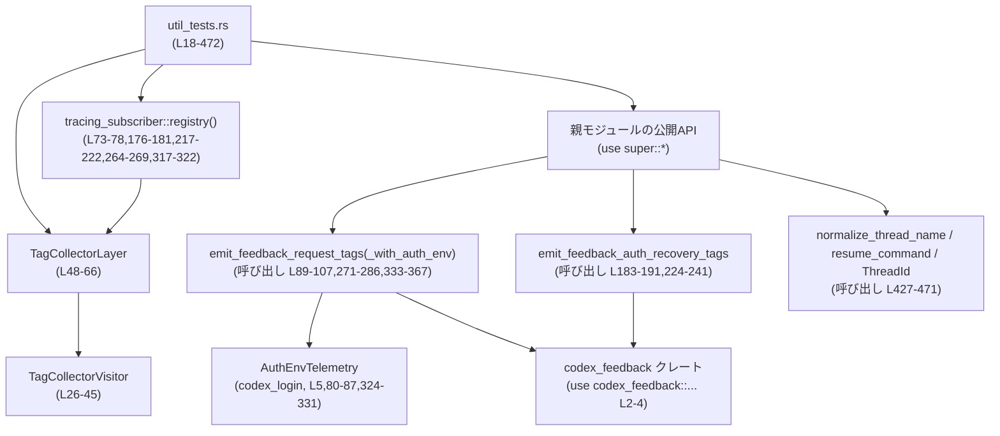

# core/src/util_tests.rs

## 0. ざっくり一言

このファイルは、親モジュール（`use super::*;`）が提供する **フィードバック用トレースタグ API** と **スレッド関連ユーティリティ関数** の挙動を検証するテスト群、およびそれを支える `tracing` 用テストレイヤ (`TagCollectorLayer`) を定義するモジュールです。

---

## 1. このモジュールの役割

### 1.1 概要

- このモジュールは、フィードバック送信時のタグ付けロジックと、CLI 用のスレッド操作ヘルパーの振る舞いを検証するために存在します。
- 具体的には、次のような外部 API の「契約（どう動くべきか）」をテストから明らかにしています。
  - フィードバックタグ関連:
    - `feedback_tags!` マクロ
    - `emit_feedback_request_tags`
    - `emit_feedback_request_tags_with_auth_env`
    - `emit_feedback_auth_recovery_tags`
  - スレッド関連ユーティリティ:
    - `normalize_thread_name`
    - `resume_command`
    - `ThreadId::from_string`
- `tracing_subscriber` のカスタム `Layer` を使って、実際に送出される `tracing::Event` からタグを収集し、期待どおりかを検証します（`TagCollectorVisitor`, `TagCollectorLayer`、core/src/util_tests.rs:L26-66）。

### 1.2 アーキテクチャ内での位置づけ

このファイル自体はテストモジュールであり、親モジュールと外部クレートに依存しています。



※ 親モジュールの具体的なファイルパス（例: `util.rs`）は、このチャンクからは分かりません。

### 1.3 設計上のポイント（テストコード観点）

- **tracing ベースの検証**  
  - `TagCollectorLayer` が `tracing_subscriber::Layer` を実装し、`target == "feedback_tags"` のイベントのみを収集します（core/src/util_tests.rs:L54-60）。
  - フィールドは `TagCollectorVisitor` によって `BTreeMap<String, String>` に集約されます（L26-45）。
- **並行性と共有状態**  
  - テストからレイヤに状態（タグとイベント件数）を共有するために `Arc<Mutex<...>>` を使用します（L49-52,71-72,174-175 など）。
  - `Mutex::lock().unwrap()` を使用しており、ロックがポイズンされた場合はパニックしますが、テスト前提では問題にならない設計です（L64-65,109,169,193,210,243,257,288,310,369,424）。
- **Option フィールドの扱い**  
  - `emit_feedback_request_tags` / `emit_feedback_auth_recovery_tags` では、`Option` が `None` の場合でも **「空文字列のタグ」を出すことで前回値をクリアする** ことがテストから分かります（例: L233-241 の呼び出しと、L243-256 の `""` 期待値）。
- **CLI ユーティリティの契約をテストで規定**  
  - `normalize_thread_name` によるトリミングと空白のみ入力の拒否（L427-434）。
  - `resume_command` による
    - thread_name と thread_id の優先順位
    - `-` で始まる引数やスペース・クォートを含む場合のシェル用クォートルール  
    が明示的に検証されています（L437-471）。

---

## 2. 主要な機能一覧（テスト対象の挙動）

このモジュールが検証している主要な機能を整理します。

- `feedback_tags!` マクロ:  
  任意のフィールド（`model`, `cached`, `debug_only`）を受け取るマクロがコンパイルできることを確認します（L18-24）。

- `emit_feedback_request_tags_with_auth_env`:  
  フィードバック API リクエスト + 認証環境情報をタグとして `tracing` イベントに出力すること、および各フィールドのキー・値が期待どおりであることを検証します（L69-170, 313-425）。

- `emit_feedback_request_tags`:  
  認証ヘッダや認証リトライ結果など、リクエスト単位のフィードバック情報をタグとして出力し、  
  - 401 応答を受けた後でも最新の認証エラー情報が維持されること（L260-311）  
  - 後続の「レガシー」エミッタが `None` を渡した場合に、関連タグを空文字でリセットすること（L333-367,369-423）  
  を検証します。

- `emit_feedback_auth_recovery_tags`:  
  401 Unauthorized に関連するリカバリ情報を `auth_401_*` 系タグとして記録し、  
  - 401 専用フィールドが正しく記録されること（L183-191,193-210）  
  - リカバリフェーズの終了時に古い 401 情報が空文字でクリアされること（L224-241,243-257）  
  を検証します。

- `normalize_thread_name`:  
  入力文字列の前後空白をトリミングし、空白のみの場合は `None` を返すことを検証します（L427-434）。

- `resume_command`:  
  CLI の `codex resume` コマンド文字列を生成するロジックとして、
  - thread_name があればそれを優先し（L437-440）、
  - id のみの場合は UUID 文字列を使い（L444-450）、
  - name/id が両方 None の場合はコマンドを生成しない（L453-456）、
  - thread_name の内容に応じてシェルクォート・`--` を適切に付与する（L459-471）  
  ことを検証します。

---

## 3. 公開 API と詳細解説

ここでは、このテストから読み取れる範囲で **外部 API の契約** と **テスト用コンポーネント** を整理します。

### 3.1 型一覧（構造体・列挙体など）

| 名前 | 種別 | 役割 / 用途 | 定義位置 / 備考 |
|------|------|-------------|-----------------|
| `TagCollectorVisitor` | 構造体 | `tracing::field::Visit` を実装し、イベントフィールドを `BTreeMap<String, String>` に収集するテスト用ビジターです。`tags` フィールドにキー・値を文字列として蓄積します。 | 定義: `core/src/util_tests.rs:L26-29`<br>Visit 実装: L31-45 |
| `TagCollectorLayer` | 構造体 | `tracing_subscriber::Layer` を実装するテスト用レイヤで、`tags: Arc<Mutex<BTreeMap<String, String>>>` と `event_count: Arc<Mutex<usize>>` にイベント情報を蓄積します。 | 定義: `core/src/util_tests.rs:L48-52`<br>Layer 実装: L54-66 |
| `FeedbackRequestTags` | 構造体（外部） | フィードバックリクエストに関する各種フィールド（`endpoint`, `auth_header_attached`, `auth_request_id` など）を保持するデータ構造として使用されています（L90-105,271-285,334-349,352-366）。 | 外部クレート `codex_feedback` より `use`（L2）。このチャンクには定義がありません。 |
| `AuthEnvTelemetry` | 構造体（外部） | 認証関連の環境変数の有無などを保持するテレメトリ情報。`openai_api_key_env_present` などのブール値と、プロバイダキー名等を保持します（L80-87,324-331）。 | 外部クレート `codex_login` より `use`（L5）。このチャンクには定義がありません。 |
| `ThreadId` | 型（外部） | スレッド ID を表す型で、`ThreadId::from_string` により UUID ライクな文字列から生成されることがテストから分かります（L437-438,444-445）。 | どのモジュールの型かは、このチャンクからは不明です。`Result` を返す `from_string` を実装していることだけが分かります。 |

### 3.2 関数・マクロ詳細（外部 API; 最大 7 件）

> 注意: ここでのシグネチャや挙動は、**すべてこのテストファイルから読み取れる範囲**に限定しています。実装本体はこのチャンクに存在しません。

---

#### `emit_feedback_request_tags_with_auth_env(...)`

**概要**

- フィードバックリクエストと認証環境情報 (`FeedbackRequestTags` + `AuthEnvTelemetry`) を元に、`tracing` イベント（`target == "feedback_tags"`) を 1 件送出し、さまざまなタグを付与する関数です。
- テストでは、OpenAI/Codex API キー環境変数やプロバイダキー名などの環境情報が `auth_env_*` というキーでタグ化されることを確認しています（core/src/util_tests.rs:L80-87,89-107,123-150）。

**引数（テストから分かる範囲）**

| 引数名 | 型 | 説明 |
|--------|----|------|
| （第1引数） | `&FeedbackRequestTags` | エンドポイント (`endpoint`)、認証ヘッダ情報、リクエスト ID、CF-Ray、認証エラー情報などを含む構造体。テストではリテラルで構築されています（L90-105,334-349）。 |
| （第2引数） | `&AuthEnvTelemetry` | 環境変数の存在情報やプロバイダキー名などを含むテレメトリ（L80-87,324-331）。 |

**戻り値**

- テストでは戻り値を変数に代入しておらず、いかなるエラー処理も行っていません（L89-107,333-351）。  
  そのため、戻り値の型はこのチャンクからは分かりません。少なくとも、正常系ではパニックしない前提で使われています。

**内部処理の流れ（テストから推測できる契約）**

1. 引数構造体から以下の情報を取り出します（L90-105,80-87）。
   - `endpoint`, `auth_header_attached`, `auth_header_name`, `auth_mode`, `auth_retry_after_unauthorized`, `auth_recovery_mode`, `auth_recovery_phase`, `auth_connection_reused`, `auth_request_id`, `auth_cf_ray`, `auth_error`, `auth_error_code`, `auth_recovery_followup_success`, `auth_recovery_followup_status`。
   - `AuthEnvTelemetry` から `openai_api_key_env_present` などのブール値とオプション値。
2. `tracing` のイベント（`target: "feedback_tags"`）を 1 件発行します。これは `TagCollectorLayer::on_event` がその target のイベントのみ処理していること（L58-60）と、テストで `event_count == 1` と確認していることから分かります（L169）。
3. イベントには、少なくとも次のキー・値がフィールドとして含まれます（いずれも `TagCollectorVisitor` によって文字列化されて取得されています）。
   - `"endpoint"` → `"\"/responses\""`（L111-113）
   - `"auth_header_attached"` → `"true"`（L115-117）
   - `"auth_header_name"` → `"\"authorization\""`（L119-121）
   - `"auth_env_openai_api_key_present"` → `"true"`（L123-126）
   - `"auth_env_codex_api_key_present"` → `"false"`（L128-131）
   - `"auth_env_codex_api_key_enabled"` → `"true"`（L133-136）
   - `"auth_env_provider_key_name"` → `"\"configured\""`（L137-140）
   - `"auth_env_provider_key_present"` → `"\"true\""`（L141-145）
   - `"auth_env_refresh_token_url_override_present"` → `"true"`（L147-150）
   - `"auth_request_id"` → `"\"req-123\""`（L152-154）
   - `"auth_error_code"` → `"\"token_expired\""`（L156-158）
   - `"auth_recovery_followup_success"` → `"\"true\""`（L160-163）
   - `"auth_recovery_followup_status"` → `"\"200\""`（L165-167）
4. `AuthEnvTelemetry` の値は、`auth_env_*` というキー名でブールや文字列としてタグ化されます（L123-150）。

**Examples（使用例）**

テストにほぼ一致する使用例です。

```rust
use codex_feedback::FeedbackRequestTags;                    // フィードバックタグ構造体
use codex_feedback::emit_feedback_request_tags_with_auth_env;
use codex_login::AuthEnvTelemetry;

// 認証環境のテレメトリを構築する                                // AuthEnvTelemetry の例
let auth_env = AuthEnvTelemetry {
    openai_api_key_env_present: true,                       // OPENAI_API_KEY が存在
    codex_api_key_env_present: false,                       // CODEX_API_KEY は存在しない
    codex_api_key_env_enabled: true,                        // Codex用キー機能は有効
    provider_env_key_name: Some("configured".to_string()),  // プロバイダキー名
    provider_env_key_present: Some(true),                   // そのキーが存在
    refresh_token_url_override_present: true,               // URL 上書きが存在
};

// リクエストのフィードバックタグを構築する                        // HTTP リクエストごとの情報
let tags = FeedbackRequestTags {
    endpoint: "/responses",
    auth_header_attached: true,
    auth_header_name: Some("authorization"),
    auth_mode: Some("chatgpt"),
    auth_retry_after_unauthorized: Some(false),
    auth_recovery_mode: Some("managed"),
    auth_recovery_phase: Some("refresh_token"),
    auth_connection_reused: Some(true),
    auth_request_id: Some("req-123"),
    auth_cf_ray: Some("ray-123"),
    auth_error: Some("missing_authorization_header"),
    auth_error_code: Some("token_expired"),
    auth_recovery_followup_success: Some(true),
    auth_recovery_followup_status: Some(200),
};

// トレースイベントとしてタグを送出する                           // 戻り値は使われていない
emit_feedback_request_tags_with_auth_env(&tags, &auth_env);
```

**Errors / Panics**

- このチャンクにはエラーを返したりパニックを起こすようなコードは現れていません。
- `tracing` のイベント送出自体は通常パニックしませんが、実装に依存するため、このファイルからは確定できません。

**Edge cases（エッジケース）**

- `AuthEnvTelemetry` のフィールドが `None` や `false` の場合の扱いは、このファイルではテストされていません。  
  したがって、空文字や `"false"` に変換されるかは不明です。
- `auth_recovery_followup_status` はテストでは `Some(200)` として渡されていますが（L103-104）、TagCollectorVisitor が `record_str` と `record_debug` しか実装していないため（L37-45）、数値ではなく **文字列としてタグ化されている** と考えられます。  
  これは `"\"200\""` が取得されていることから読み取れます（L165-167）。

**使用上の注意点**

- 数値フィールドや複雑な型をタグとして追加する場合、そのまま渡すと `TagCollectorVisitor` のような単純な `Visit` 実装では拾えない可能性があります。テストでは文字列化済みとして扱われている点に注意が必要です。
- `AuthEnvTelemetry` に含まれない情報（例えば新たな環境フラグ）をタグ化したい場合、実装側の構造体定義とこの種のテストの両方を更新する必要があります。

---

#### `emit_feedback_request_tags(...)`

**概要**

- 認証ヘッダやエラー情報など、**リクエスト単位のフィードバック情報のみ** を `tracing` イベントとして送出する関数です。
- テストから、`Option` フィールドが `None` の場合は **空文字列でタグを上書きして古い値をクリアする** という契約が読み取れます（L352-367,369-423）。

**引数（テストから分かる範囲）**

| 引数名 | 型 | 説明 |
|--------|----|------|
| （第1引数） | `&FeedbackRequestTags` | 同上。環境関連フィールドは含まれていませんが、リクエスト ID や CF-Ray、401 応答後の followup 状態などが使用されています（L271-285,352-366）。 |

**戻り値**

- テストでは戻り値を無視しており、型は不明です（L271-286,352-367）。

**内部処理の流れ（テストから推測できる契約）**

1. `FeedbackRequestTags` からリクエスト関連のフィールドを読み出し、`target == "feedback_tags"` の `tracing::Event` を 1 件送出します（L260-269,271-286, event_count のチェック L310,424）。
2. フィールドが `Some(value)` の場合:
   - `auth_request_id`, `auth_cf_ray`, `auth_error`, `auth_error_code`, `auth_recovery_followup_success`, `auth_recovery_followup_status` などは、文字列としてタグ化されます（L290-309）。
3. フィールドが `None` の場合:
   - 少なくとも `auth_header_name`, `auth_mode`, `auth_request_id`, `auth_cf_ray`, `auth_error`, `auth_error_code`, `auth_recovery_followup_success`, `auth_recovery_followup_status` は、**空文字列 `""` がタグ値として出力され、以前の値がクリアされる** ことがテストで確認されています（L352-367 呼び出し後の L370-383,415-422）。

**Examples（使用例）**

401 応答を受けた後の followup 情報のタグ付け例（L271-286,288-310）。

```rust
let tags = FeedbackRequestTags {
    endpoint: "/responses",
    auth_header_attached: true,
    auth_header_name: Some("authorization"),
    auth_mode: Some("chatgpt"),
    auth_retry_after_unauthorized: Some(true),
    auth_recovery_mode: Some("managed"),
    auth_recovery_phase: Some("refresh_token"),
    auth_connection_reused: None,
    auth_request_id: Some("req-123"),
    auth_cf_ray: Some("ray-123"),
    auth_error: Some("missing_authorization_header"),
    auth_error_code: Some("token_expired"),
    auth_recovery_followup_success: Some(false),
    auth_recovery_followup_status: Some(401),
};

emit_feedback_request_tags(&tags);                         // followup の状態をタグとして送出
// その後、TagCollectorLayer 側では auth_* のタグが更新されていることが確認される
```

**Errors / Panics**

- このファイルからエラー条件は読み取れません。
- `FeedbackRequestTags` の必須フィールドが欠けていた場合の挙動も不明です。

**Edge cases**

- `auth_*` 系フィールドが `None` の場合、空文字でタグが上書きされるため、前回の値は残りません（L352-367,370-383,415-422）。
- `auth_env_*` 系のタグは、この関数では引数に存在しないため、**再送出されるかどうかは不明** です。ただし、テストでは初回 `_with_auth_env` の呼び出しで設定された値が維持されていることだけが確認されています（L385-413）。

**使用上の注意点**

- 「値を消したい」目的で `None` を渡すと、タグは空文字として残ることがテストから分かります。完全にタグを削除する設計かどうかは、このテストだけでは判断できません。
- 401 応答の followup 情報を扱う場合は、`emit_feedback_auth_recovery_tags` との整合性を考慮する必要があります（401 専用フィールドとの役割分担のため）。

---

#### `emit_feedback_auth_recovery_tags(...)`

**概要**

- 認証リカバリ処理（特に 401 Unauthorized 対応）に関する情報を `auth_401_*` 系のタグとして出力する関数です。
- テストから、リカバリフェーズ中と完了後の **401 情報の保持・クリアの挙動** が読み取れます。

**引数（テストから分かる範囲）**

呼び出し例（L183-191,224-241）から、少なくとも次のような引数が存在します。

| 引数 | 型（推測） | 説明 |
|------|------------|------|
| `"managed"` | `&str` | `auth_recovery_mode` に相当するモード名（L183,224）。 |
| `"refresh_token"` / `"done"` | `&str` | リカバリフェーズを表す文字列（L184,226,235）。 |
| `"recovery_succeeded"` など | `&str` | リカバリ処理結果（L186,227,236）。 |
| `Some("req-401")` など | `Option<&str>` | 401 応答に関連するリクエスト ID（L187,228,237）。 |
| `Some("ray-401")` / `None` | `Option<&str>` | 401 応答に関連する CF-Ray（L188,229,238）。 |
| `Some("missing_authorization_header")` / `None` | `Option<&str>` | 401 エラー内容（L189,230,239）。 |
| `Some("token_expired")` / `None` | `Option<&str>` | 401 エラーコード（L190,231,240）。 |

**戻り値**

- テストでは戻り値が使用されておらず、不明です。

**内部処理（テストから分かる契約）**

1. `target == "feedback_tags"` の `tracing::Event` を 1 件送出します（`event_count` が呼び出し回数と一致していることから、L175-176,210,215-217,257）。
2. イベントには以下のフィールドが含まれます。
   - `"auth_401_request_id"`: Request ID を引用符付き文字列として記録（例: `"\"req-401\""`、L195-197）。
   - `"auth_401_cf_ray"`: CF-Ray（L199-201）。
   - `"auth_401_error"`: エラーメッセージ（L203-205）。
   - `"auth_401_error_code"`: エラーコード（L207-209）。
3. 第 2 のテスト（L213-258）から、`Option` が `None` の場合には **空文字列 `""` がタグ値としてセットされる** ことが分かります。
   - 1 回目の呼び出しで値がセットされた後、2 回目で `None` を渡すと、`auth_401_cf_ray` などが `"\"\""` になっています（L248-256）。

**Examples**

```rust
// 一度 401 応答を受けたときに詳細情報をタグ化
emit_feedback_auth_recovery_tags(
    "managed",
    "refresh_token",
    "recovery_failed_transient",
    Some("req-401-a"),
    Some("ray-401-a"),
    Some("missing_authorization_header"),
    Some("token_expired"),
);

// リカバリプロセス終了時に、401 以外の状態となったため詳細情報をクリア
emit_feedback_auth_recovery_tags(
    "managed",
    "done",
    "recovery_not_run",
    Some("req-401-b"),
    None,
    None,
    None,
);
```

**Errors / Panics**

- エラー処理はテストからは読み取れません。
- 少なくとも、`None` を渡してもパニックしない前提で使われています。

**Edge cases**

- 401 専用フィールドが `None` の場合、空文字がタグとして出力されるため、以前の 401 情報が残らないことが保証されています（L248-256）。
- リカバリモードやフェーズに無効値を渡した場合の挙動は、このテストからは分かりません。

**使用上の注意点**

- 401 関連の情報を「消す」ケースでは、`None` を渡すことで空文字タグに置き換えられることを前提に設計されています。
- 同じタグキーを `emit_feedback_request_tags` など他の API と共有する場合、**どの API がいつ値を上書きするか** を明確にしておく必要があります。

---

#### `normalize_thread_name(input: &str) -> Option<String>`

**概要**

- スレッド名を「前後の空白除去 + 空文字（または空白のみ）の場合は無効扱い」に正規化する関数です。
- テストは最小限のケースをカバーしており、`None` で「使えない名前」であることを示す契約になっています（L427-434）。

**引数**

| 引数名 | 型 | 説明 |
|--------|----|------|
| `input` | `&str` （推測） | 生のスレッド名文字列。空白を含む場合があります（L429-432）。 |

**戻り値**

- `Option<String>`（テストの型から）:
  - 入力が空白のみ（例: `"   "`）の場合 → `None`（L429）。
  - それ以外 → 前後をトリムした `Some(String)`（L430-433）。

**内部処理の流れ（推測）**

1. `input` の前後の空白文字を削除する。
2. トリム後の文字列が空であれば `None` を返す。
3. それ以外の場合は `Some(trimmed_string.to_string())` を返す。

**Examples**

```rust
// 空白のみ → 無効
assert_eq!(normalize_thread_name("   "), None);           // L429 と同じ期待

// 前後の空白を削除して Some を返す
assert_eq!(
    normalize_thread_name("  my thread  "),               // 前後に空白あり
    Some("my thread".to_string()),                        // トリムされた文字列を返す
);
```

**Errors / Panics**

- この関数がパニックするケースはテストからは読み取れません。
- 少なくとも通常の UTF-8 文字列に対してはパニックしない前提で使われています。

**Edge cases**

- 中間に空白を含む（例: `"my  thread"`）場合の扱いは、このテストからは不明です。  
  （前後トリム以外の正規化をしているかどうかは読み取れません。）

**使用上の注意点**

- `None` は「ユーザー入力として有効なスレッド名ではなかった」と解釈される契約です。  
  呼び出し側で `None` のときのフォールバック（ID の使用など）を用意する必要があります。

---

#### `resume_command(thread_name: Option<&str>, thread_id: Option<ThreadId>) -> Option<String>`

**概要**

- 与えられたスレッド名またはスレッド ID から、CLI コマンド `codex resume ...` の文字列を構築する関数です。
- テストは、名前と ID の優先順位、およびシェルクォートのルールを詳細に規定しています（L437-471）。

**引数（テストから分かる範囲）**

| 引数名 | 型（推測） | 説明 |
|--------|------------|------|
| `thread_name` | `Option<&str>` | スレッド名。存在する場合は ID より優先して使用されます（L437-440,459-471）。 |
| `thread_id` | `Option<ThreadId>` | スレッド ID。名前がない場合のみ使用されます（L436-440,444-450,455-456）。 |

**戻り値**

- `Option<String>`:
  - 名前または ID があれば `Some("codex resume ...")`（L440,449,464-471）。
  - どちらもない場合は `None`（L455-456）。

**内部処理の流れ（テストから分かるルール）**

1. `thread_name` が `Some` の場合:
   - その値を最優先でコマンド引数に使います（L437-440）。
   - 引数の内容に応じてクォート・`--` が変わります（L459-471）。
2. `thread_name` が `None` で `thread_id` が `Some` の場合:
   - `ThreadId` を文字列化した値を引数として使用します（L444-450）。
3. 両方 `None` の場合:
   - `None` を返し、コマンドは生成されません（L455-456）。

**シェルクォートの詳細**

テストから、次のようなルールが読み取れます。

- 先頭が `-` で始まる名前:
  - `"codex resume -- -starts-with-dash"` のように、`--` を追加してオプションと解釈されないようにします（L461-465）。
- 空白を含むがシングルクォートを含まない名前:
  - `"two words"` → `"codex resume 'two words'"` と **単一引用符で囲む**（L467-468）。
- シングルクォートを含む名前:
  - `"quote'case"` → `"codex resume \"quote'case\""` と **二重引用符で囲む**（L470-471）。

**Examples**

```rust
// 名前があれば ID より優先される                              // L437-440
let thread_id = ThreadId::from_string("123e4567-e89b-12d3-a456-426614174000").unwrap();
let cmd = resume_command(Some("my-thread"), Some(thread_id));
assert_eq!(cmd, Some("codex resume my-thread".to_string()));

// ID のみの場合                                                // L444-450
let thread_id = ThreadId::from_string("123e4567-e89b-12d3-a456-426614174000").unwrap();
let cmd = resume_command(None, Some(thread_id));
assert_eq!(
    cmd,
    Some("codex resume 123e4567-e89b-12d3-a456-426614174000".to_string())
);

// 名前も ID もない場合                                         // L455-456
let cmd = resume_command(None, None);
assert_eq!(cmd, None);

// 特殊な名前の場合のクォートルール                            // L461-471
assert_eq!(
    resume_command(Some("-starts-with-dash"), None),
    Some("codex resume -- -starts-with-dash".to_string())
);
assert_eq!(
    resume_command(Some("two words"), None),
    Some("codex resume 'two words'".to_string())
);
assert_eq!(
    resume_command(Some("quote'case"), None),
    Some("codex resume \"quote'case\"".to_string())
);
```

**Errors / Panics**

- この関数自身はテストからはパニックしない前提で使われています。
- 無効な `ThreadId` を渡したときの挙動は、この関数側ではなく `ThreadId::from_string` 側の責務です。

**Edge cases**

- thread_name が空文字や空白のみの場合にどう扱うかは、このテストからは分かりません。  
  実際のコードでは `normalize_thread_name` と併用している可能性がありますが、ここからは断定できません。
- thread_name にダブルクォート `"` が含まれる場合のクォート戦略はテストされていません。

**使用上の注意点**

- **シェルインジェクション防止** の観点から、名前のクォートロジックに依存しています。名前に特殊文字が含まれる場合、現状テストされていないケースがある点に注意が必要です。
- thread_name が信頼できない外部入力の場合は、`normalize_thread_name` などで事前にバリデーションするのが想定される使い方です（ただし、このファイルだけでは確定できません）。

---

#### `ThreadId::from_string(s: &str) -> Result<ThreadId, E>`

**概要**

- 文字列表現（テストでは UUID 形式）から `ThreadId` を生成する関数です（L437-438,444-445）。
- テストでは `.unwrap()` されており、正常な文字列の場合に成功することだけが前提とされています。

**Examples**

```rust
let thread_id =
    ThreadId::from_string("123e4567-e89b-12d3-a456-426614174000").unwrap(); // L437-438,444-445
// 以降、resume_command などの引数として使用
```

**Errors / Panics**

- 不正な文字列を渡した場合のエラー型やメッセージは、このチャンクからは分かりません。
- テストでは `.unwrap()` を使用しており、不正入力時にはパニックする設計になっています（テスト向けなので許容）。

**使用上の注意点**

- アプリケーションコードで使用する場合は、`unwrap()` ではなく `?` や `match` でエラー処理を行うことが望ましいです。

---

#### `feedback_tags!` マクロ

**概要**

- フィードバック用タグを指定して `tracing` イベントなどを生成するマクロと推測されます（L23）。
- テストでは **コンパイルが通ること自体** を確認しており、ランタイムの挙動は検証していません（L18-24）。

**使用例（テストから）**

```rust
#[derive(Debug)]
struct OnlyDebug;                                         // Debug を実装した任意の型

feedback_tags!(                                           // L23
    model = "gpt-5",                                      // &str フィールド
    cached = true,                                        // bool フィールド
    debug_only = OnlyDebug                                // Debug な任意型フィールド
);
```

この例から、少なくとも次が分かります。

- 文字列リテラル、ブール値、`Debug` を実装した独自型をフィールドとして受け取れる。
- フィールド名は識別子、値は式として指定できる。

**使用上の注意点**

- 実際にどのような `tracing` イベントが生成されるかは、このテストファイルからは分かりません。
- 新しいフィールド型を追加する場合、`TagCollectorVisitor` の `Visit` 実装が対応していないとテストでは観測できない点に注意が必要です（L31-45）。

---

### 3.3 その他の関数（テスト用ヘルパ・テストケース）

| 関数名 | 役割（1 行） | 定義位置 |
|--------|--------------|----------|
| `TagCollectorVisitor::record_bool` | `bool` フィールドを文字列化して `tags` に格納します（`field.name()` をキーに、`value.to_string()` を値に使用）（L31-35）。 | `core/src/util_tests.rs:L31-35` |
| `TagCollectorVisitor::record_str` | `&str` フィールドをそのまま文字列として `tags` に格納します（L37-40）。 | `core/src/util_tests.rs:L37-40` |
| `TagCollectorVisitor::record_debug` | 任意の `Debug` フィールドを `format!("{value:?}")` で文字列化して格納します（L42-45）。 | `core/src/util_tests.rs:L42-45` |
| `TagCollectorLayer::on_event` | `target == "feedback_tags"` のイベントをフィルタし、`TagCollectorVisitor` でフィールドを収集して共有マップにマージし、イベント数をインクリメントします（L58-66）。 | `core/src/util_tests.rs:L58-66` |
| `feedback_tags_macro_compiles` | `feedback_tags!` マクロが `Debug` な型を含む引数でコンパイル可能であることのみを確認するテストです（L18-24）。 | `core/src/util_tests.rs:L18-24` |
| `emit_feedback_request_tags_records_sentry_feedback_fields` | `_with_auth_env` 関数が Sentry 用フィードバックタグを含むトレースイベントを 1 件発行し、タグ値が期待通りであることを検証します（L69-170）。 | `core/src/util_tests.rs:L69-170` |
| `emit_feedback_auth_recovery_tags_preserves_401_specific_fields` | `emit_feedback_auth_recovery_tags` が 401 応答専用のタグ (`auth_401_*`) を正しく設定することを検証します（L172-211）。 | `core/src/util_tests.rs:L172-211` |
| `emit_feedback_auth_recovery_tags_clears_stale_401_fields` | 401 リカバリ完了時に、古い 401 関連タグが空文字でクリアされることを検証します（L213-258）。 | `core/src/util_tests.rs:L213-258` |
| `emit_feedback_request_tags_preserves_latest_auth_fields_after_unauthorized` | 401 応答後の followup 情報が、`emit_feedback_request_tags` によって最新状態としてタグに反映されることを検証します（L260-311）。 | `core/src/util_tests.rs:L260-311` |
| `emit_feedback_request_tags_preserves_auth_env_fields_for_legacy_emitters` | 先に `_with_auth_env` が設定した `auth_env_*` タグが、レガシーエミッタの後続呼び出しでも維持される一方、`auth_*` や followup 関連タグが空文字でクリアされることを検証します（L313-425）。 | `core/src/util_tests.rs:L313-425` |
| `normalize_thread_name_trims_and_rejects_empty` | `normalize_thread_name` のトリムと空白のみ入力時の `None` 返却を検証する単体テストです（L427-434）。 | `core/src/util_tests.rs:L427-434` |
| `resume_command_prefers_name_over_id` 他 3 テスト | `resume_command` の名前優先・ID のみ・どちらもない・クォートのルールをそれぞれ検証します（L437-471）。 | `core/src/util_tests.rs:L437-471` |

---

## 4. データフロー

ここでは、代表的なシナリオとして  
**`emit_feedback_request_tags_with_auth_env` の呼び出し → tracing イベント → テストでの検証** の流れを示します。

### 処理の要点（L69-170）

1. テスト関数 `emit_feedback_request_tags_records_sentry_feedback_fields` が `TagCollectorLayer` を含む `tracing_subscriber::registry()` をデフォルトとしてセットします（L71-78）。
2. `AuthEnvTelemetry` と `FeedbackRequestTags` を構築し（L80-87,90-105）、`emit_feedback_request_tags_with_auth_env` を呼び出します（L89-107）。
3. 関数内部で `target == "feedback_tags"` の `tracing::Event` が 1 件送出されます。
4. `TagCollectorLayer::on_event` が呼び出され、`TagCollectorVisitor` によりフィールドが `BTreeMap<String, String>` に収集されます（L58-66）。
5. テスト関数が `tags.lock().unwrap().clone()` でマップを取得し、各キーの値と `event_count == 1` をアサートします（L109-169）。

### シーケンス図

```mermaid
sequenceDiagram
    participant T as テスト関数<br/>emit_feedback_request_tags_records_sentry_feedback_fields (L69-170)
    participant R as tracing_subscriber::registry() (L73-78)
    participant L as TagCollectorLayer::on_event (L58-66)
    participant V as TagCollectorVisitor (L31-45)
    participant F as emit_feedback_request_tags_with_auth_env<br/>(呼び出し L89-107)
    participant M as tags: Arc&lt;Mutex&lt;BTreeMap&gt;&gt; (L71,109)

    T->>R: registry().with(TagCollectorLayer { tags, event_count }).set_default()
    Note over R,L: デフォルト Subscriber に TagCollectorLayer を追加

    T->>F: emit_feedback_request_tags_with_auth_env(&FeedbackRequestTags, &AuthEnvTelemetry)
    Note over F: target="feedback_tags" の<br/>tracing::Event を送出（推測）

    F-->>L: Event(target="feedback_tags")
    L->>V: TagCollectorVisitor::default()
    L->>V: event.record(&mut visitor)  // Visit 実装で tags に格納 (L62-64)
    V-->>L: visitor.tags (BTreeMap<String,String>)
    L->>M: tags.lock().unwrap().extend(visitor.tags)
    L->>M: *event_count.lock().unwrap() += 1

    T->>M: tags.lock().unwrap().clone()
    M-->>T: BTreeMap<String,String>
    T->>T: assert_eq!(tags.get(...), Some(...)) など (L111-168)
    T->>M: event_count.lock().unwrap()
    T->>T: assert_eq!(*event_count, 1) (L169)
```

この図から分かること:

- `emit_feedback_request_tags_with_auth_env` は、**少なくとも 1 つの `feedback_tags` イベントを同期的に発行している**（イベント数が 1 であることを前提にテストが書かれている）。
- テストは `tracing` のイベントシステムを通じて、タグの最終状態（キーと値）を検証する構造になっています。

---

## 5. 使い方（How to Use）

### 5.1 基本的な使用方法（tracing タグのテスト）

このモジュールのコードは、**tracing ベースのテレメトリをテストするパターン**として参考になります。

```rust
use std::collections::BTreeMap;                           // タグの保存先
use std::sync::{Arc, Mutex};                              // テスト内共有のための同期
use tracing_subscriber::Layer;                            // Layer トレイト
use tracing_subscriber::layer::{Context, SubscriberExt};
use tracing_subscriber::registry::LookupSpan;

// --- テスト用 Layer の準備 ---                             // 本ファイルの TagCollectorLayer 相当

#[derive(Default)]
struct TagCollectorVisitor {
    tags: BTreeMap<String, String>,                       // フィールド名→文字列値のマップ
}

impl tracing::field::Visit for TagCollectorVisitor {
    fn record_str(&mut self, field: &tracing::field::Field, value: &str) {
        self.tags.insert(field.name().to_string(), value.to_string());
    }
    // 必要に応じて bool や Debug も実装
}

#[derive(Clone)]
struct TagCollectorLayer {
    tags: Arc<Mutex<BTreeMap<String, String>>>,           // 収集したタグを共有
}

impl<S> Layer<S> for TagCollectorLayer
where
    S: tracing::Subscriber + for<'a> LookupSpan<'a>,
{
    fn on_event(&self, event: &tracing::Event<'_>, _ctx: Context<'_, S>) {
        if event.metadata().target() != "feedback_tags" { // 対象イベントだけを収集
            return;
        }
        let mut visitor = TagCollectorVisitor::default(); // ビジターを作成
        event.record(&mut visitor);                       // 全フィールドを訪問
        self.tags.lock().unwrap().extend(visitor.tags);   // マップにマージ
    }
}

// --- テスト本体のイメージ ---

#[test]
fn test_feedback_tags_emission() {
    let tags = Arc::new(Mutex::new(BTreeMap::new()));     // 収集用マップ
    let _guard = tracing_subscriber::registry()
        .with(TagCollectorLayer { tags: tags.clone() })   // Layer を登録
        .set_default();                                   // このスコープのデフォルト Subscriber にする

    // 検証対象関数を呼ぶ（実際には emit_feedback_request_tags_* など）
    // emit_feedback_request_tags_with_auth_env(&feedback_tags, &auth_env);

    let tags = tags.lock().unwrap().clone();              // 収集したタグを取得
    // assert_eq!(tags.get("endpoint").map(String::as_str), Some("\"/responses\""));
}
```

このパターンにより、`tracing` ベースのロジックでも「イベントとして何が出たか」をテストレベルで確認できます。

### 5.2 よくある使用パターン

1. **401 リカバリの状態管理**

   - `emit_feedback_auth_recovery_tags` を 401 応答時・リカバリ完了時に呼び分けることで、
     - 401 受信時: `auth_401_*` に詳細を書き込む（L183-191,193-210）。
     - リカバリ終了時: `None` を渡して空文字でクリアする（L233-241,243-256）。
   - これにより、メトリクス・ログ上で「現在 401 が発生中かどうか」をタグを通じて判断できる設計です。

2. **CLI へのスレッド再開コマンドの提示**

   - ユーザーに「再開コマンド」を提示する UI で、`resume_command` を使って安全なコマンド文字列を構築します（L437-471）。
   - 名前があれば名前優先、なければ ID を用いる、という使い方がテストから読み取れます。

3. **スレッド名入力のバリデーション**

   - ユーザーが任意のスレッド名を入力する UI で、`normalize_thread_name` に通してトリムし、空白のみなら `None` と判定する形で使用できます（L427-434）。

### 5.3 よくある間違い（推測されるもの）

テストから想定される誤用と、それに対する正しい使い方の例です。

```rust
// 誤りの例: 不正な ThreadId 文字列を unwrap してしまう
// let thread_id = ThreadId::from_string("not-a-uuid").unwrap(); // 不正文字列でパニックの可能性

// よい例: Result をチェックしてから resume_command に渡す
if let Ok(thread_id) = ThreadId::from_string("123e4567-e89b-12d3-a456-426614174000") {
    let cmd = resume_command(None, Some(thread_id));
    // cmd を UI に表示するなど
}

// 誤りの例: 空白だけの thread_name をそのまま resume_command に渡す
// let cmd = resume_command(Some("   "), None); // normalize しないと意図しないコマンドになるかもしれない

// よい例: 事前に normalize_thread_name を通し、None の場合は ID を使うなどのフォールバックをする
let raw_name = "  my thread  ";
if let Some(normalized) = normalize_thread_name(raw_name) {
    let cmd = resume_command(Some(&normalized), None);
} else {
    // 名前が無効なので ID を使う、あるいはエラー表示をする
}
```

### 5.4 使用上の注意点（まとめ）

- `emit_feedback_*` 系関数は、**Option が None のときに空文字タグを出す** ケースがあるため、「値がない」ことと「空文字である」ことを区別する必要があります。
- `TagCollectorVisitor` は `bool`・`&str`・`Debug` のみを扱っているため（L31-45）、他の型をタグとして追加する場合は、ビジターの実装か emitter 側の文字列化ロジックを見直す必要があります。
- `resume_command` はシェルクォートをある程度考慮していますが、テストされていない特殊文字（改行、バックスラッシュなど）の扱いについては、このファイルからは分かりません。

---

## 6. 変更の仕方（How to Modify）

### 6.1 新しいフィードバックタグ機能を追加する場合

1. **実装側（親モジュール / 外部クレート）での作業**
   - `FeedbackRequestTags` や関連構造体に新フィールドを追加する。
   - `emit_feedback_request_tags_*` / `emit_feedback_auth_recovery_tags` 内で、そのフィールドを `tracing` イベントのタグとして出力する。

2. **テスト側（本ファイル）での作業**

   - `TagCollectorVisitor` が新しい型に対応しているか確認する。
     - 例えば数値フィールドなら、現在は `record_debug` を通じて文字列化される可能性がありますが、必要に応じて `record_i64` などを追加します（L31-45）。
   - 既存のテスト関数に `assert_eq!` を追加する、もしくは新しいテスト関数を追加する。
     - 例: `tags.get("new_field_name")` が期待どおりかを検証（L109-169 や L369-423 の記述を参考）。

3. **Option フィールドの場合の仕様決め**

   - `None` の場合に「前回値を維持する」のか「空文字でクリアする」のかを明確にし、テストでその挙動を固定します。
   - このファイルの既存テストでは、`auth_401_*` や `auth_*` 系については「空文字でクリア」が採用されています（L243-256,370-383,415-422）。

### 6.2 既存のユーティリティ（`normalize_thread_name`, `resume_command`）を変更する場合

- **影響範囲の確認**
  - `normalize_thread_name` の仕様（例えば全角スペースの扱いなど）を変更する場合、L427-434 のテストを更新する必要があります。
  - `resume_command` のクォートルールを変更する場合、L437-471 の 4 つのテストすべてに影響が出ます。

- **契約の維持/変更**
  - `resume_command` は「名前優先・ID はフォールバック」という契約に依存したコードが他に存在する可能性があります。  
    このファイルではテストしか見えませんが、契約変更の際は利用箇所の確認が必要です。
  - `Option` を返す API （`normalize_thread_name`, `resume_command`）については、`None` の意味（「生成不能」「入力不正」など）を変えると呼び出し側に影響します。

- **並行性・テスト実行の注意**
  - `TagCollectorLayer` はグローバルな Subscriber としてセットされるため（`set_default`、L73-78 など）、テスト並列実行時の相互作用に注意が必要です。  
    新しいテストを追加する際も、同様にガード (`_guard`) を保持するパターンを守ることで、テスト間の干渉を防げます。

---

## 7. 関連ファイル

| パス / モジュール | 役割 / 関係 |
|-------------------|------------|
| `super`（親モジュール; 具体的なファイルパスはこのチャンクからは不明） | `normalize_thread_name`, `resume_command`, `emit_feedback_request_tags`, `emit_feedback_request_tags_with_auth_env`, `emit_feedback_auth_recovery_tags`, `ThreadId` など、このテストが対象としているユーティリティ関数・マクロ・型を提供していると考えられます（`use super::*;`、L1）。 |
| `codex_feedback` クレート | `FeedbackRequestTags` 型および `emit_feedback_request_tags`, `emit_feedback_request_tags_with_auth_env` 関数、`feedback_tags!` マクロを提供します（L2-4,23,90-105,271-286,334-367）。 |
| `codex_login` クレート | 認証環境テレメトリ情報を表す `AuthEnvTelemetry` 構造体を提供します（L5,80-87,324-331）。 |
| `tracing` / `tracing_subscriber` クレート | フィードバックタグを `tracing::Event` として送出し、それを `Layer` 経由で観測するための基盤となるライブラリです（`Event`, `Subscriber`, `Layer`, `registry()`, `set_default()`, などの使用箇所: L9-16,54-66,73-78,176-181,217-222,264-269,317-322）。 |

このファイルは、これらの外部コンポーネントと親モジュールのユーティリティが正しく連携しているかを、`tracing` ベースのテストで確認する役割を果たしています。
